# Technical Specification

# 0. SUMMARY OF CHANGES

## 0.1 INTENT CLARIFICATION

### 0.1.1 Core Objective

Based on the provided requirements, the Blitzy platform understands that the objective is to **transform plume_nav_sim from a project-specific implementation (v0.3.0) into a general-purpose, extensible simulation toolkit (v1.0)** that serves as the definitive backbone for odor plume navigation research across the Place Memory Lab ecosystem and the broader plume navigation community.

**Primary Requirements with Enhanced Clarity:**
1. **Decouple Core Mechanics from Domain Logic**: Extract simulation physics and kinematics from project-specific implementations (memory models, RL algorithms, curricula) to create a pure, reusable engine
2. **Establish Protocol-Based Component Architecture**: Define strict abstractions for all major subsystems (sources, agents, boundaries, actions, recording, statistics) with compile-time interface enforcement
3. **Enable Zero-Code Extensibility**: Provide configuration-driven hooks that downstream projects can leverage without modifying or forking core library code
4. **Enforce Scientific Reproducibility**: Implement deterministic seeding, immutable configuration snapshots, and standardized output structures across all components
5. **Maintain Real-Time Performance**: Achieve ≤33ms per simulation step while adding comprehensive logging and debugging capabilities

**Implicit Requirements Detected:**
- Migration support for existing v0.3.0 users to minimize breaking changes
- Backward compatibility shims for legacy Gym environments during transition period
- Standardized data formats for cross-project comparison and benchmarking
- Plugin discovery mechanisms for runtime component selection
- Performance monitoring with automatic degradation warnings
- Multi-environment deployment support (local, HPC, containerized)

### 0.1.2 Special Instructions and Constraints

**CRITICAL: Documentation-First Refactor**
The user has provided a comprehensive design document rather than requesting immediate code changes. This indicates a requirement for:
- Thorough impact analysis before implementation
- Identification of all affected components and dependencies
- Clear migration paths for existing users
- No immediate code modifications until design is approved

**Methodological Requirements:**
- **Layered Architecture**: Enforce strict separation between simulation core, environment facade, and extension hooks
- **Hydra-Centric Configuration**: All parameters must flow through YAML configuration with no hardcoded values
- **Protocol-Driven Design**: Every major component must implement a defined protocol interface
- **Data-Oriented Outputs**: Predictable directory structures with toggleable storage backends

**Performance Constraints:**
- User Example: "≤ 33 ms/step runtime target" - This translates to ~30 FPS simulation capability
- Must support up to 100 concurrent agents without performance degradation
- Heavy features (full trajectory recording, debug visualization) must be opt-in with zero overhead when disabled

### 0.1.3 Technical Interpretation

These requirements translate to the following technical implementation strategy:

1. **Component Extraction and Abstraction**
   - To achieve decoupling, we will extract current inline implementations into protocol-based components
   - Create abstract base classes for Source, Agent, Boundary, Action, Recorder, and Statistics
   - Implement factory patterns for runtime component instantiation

2. **Configuration Architecture Overhaul**
   - To enable zero-code extensibility, we will restructure Hydra configs into modular groups
   - Implement component registration system for plugin discovery
   - Create configuration schemas with Pydantic validation for type safety

3. **Hook System Implementation**
   - To support downstream extensibility, we will implement callback interfaces at key lifecycle points
   - Define extra_obs_fn, extra_reward_fn, and episode_end_fn extension points
   - Ensure hooks have access to full simulation state without performance penalty

4. **Performance Optimization Strategy**
   - To maintain real-time constraints, we will implement lazy evaluation for expensive operations
   - Use NumPy vectorization for multi-agent scenarios
   - Add optional Numba JIT compilation for critical paths

## 0.2 TECHNICAL SCOPE

### 0.2.1 Primary Objectives with Implementation Approach

1. **Objective: Create Pluggable Source Abstraction**
   - Achieve flexible odor source modeling by extracting hardcoded source logic into `Source` protocol
   - Modify `src/plume_nav_sim/core/protocols.py` to add `SourceProtocol` interface
   - Extend `src/plume_nav_sim/models/` to include source implementations (PointSource, MultiSource, DynamicSource)
   - Update plume models to accept source configuration via dependency injection

2. **Objective: Implement Configurable Agent Initialization**
   - Enable diverse experiment setups by creating `AgentInitializer` abstraction
   - Create new module `src/plume_nav_sim/core/initialization.py` with strategies (uniform_random, grid, fixed_list, from_dataset)
   - Modify `PlumeNavigationEnv.reset()` to use initializer pattern
   - Add Hydra config group `conf/base/agent_init/` with YAML schemas

3. **Objective: Extract Boundary Handling Logic**
   - Support multiple boundary behaviors by implementing `BoundaryPolicy` pattern
   - Create `src/plume_nav_sim/core/boundaries.py` with policies (terminate, bounce, wrap, clip)
   - Refactor inline boundary checks in `SingleAgentController` and `MultiAgentController`
   - Configure via new Hydra group `conf/base/boundary/`

4. **Objective: Standardize Action Interfaces**
   - Unify action processing by establishing `ActionInterface` protocol
   - Create `src/plume_nav_sim/core/actions.py` with Continuous2D and CardinalDiscrete implementations
   - Modify environment step() to delegate action translation
   - Enable action space selection via configuration

5. **Objective: Build Comprehensive Data Recording System**
   - Capture experimental data by implementing `Recorder` framework
   - Create `src/plume_nav_sim/recording/` module with backends (parquet, hdf5, sqlite, none)
   - Integrate recorder hooks into simulation loop
   - Add performance-aware buffering and compression

6. **Objective: Automate Statistics Collection**
   - Generate research metrics by implementing `StatsAggregator`
   - Create `src/plume_nav_sim/analysis/stats.py` with automatic metric calculation
   - Hook into episode completion for data collection
   - Export summary.json and optional visualizations

7. **Objective: Enhance Debugging and Visualization**
   - Accelerate research iteration by building comprehensive debug toolkit
   - Extend `src/plume_nav_sim/utils/visualization.py` with new utilities
   - Create `src/plume_nav_sim/debug/gui.py` for interactive step-through viewer
   - Add Qt/Streamlit backends with fallback support

### 0.2.2 Component Impact Analysis

**Direct Modifications Required:**

| Component | Current Location | Modification Type | New Responsibility |
|-----------|------------------|-------------------|-------------------|
| NavigatorProtocol | `src/plume_nav_sim/core/protocols.py` | Extend | Add source and boundary policy dependencies |
| PlumeNavigationEnv | `src/plume_nav_sim/envs/plume_navigation_env.py` | Refactor | Integrate new abstractions and hook system |
| SingleAgentController | `src/plume_nav_sim/core/controllers.py` | Extract | Remove inline boundary logic, use policies |
| MultiAgentController | `src/plume_nav_sim/core/controllers.py` | Extract | Vectorize boundary policy application |
| Hydra Configs | `conf/base/` | Restructure | Add new config groups for all abstractions |
| Environment Factory | `src/plume_nav_sim/envs/__init__.py` | Extend | Support new component registration |

**Indirect Impacts and Dependencies:**

| Component | Impact | Required Changes |
|-----------|--------|------------------|
| VideoPlume | Adapter Pattern | Must implement new SourceProtocol for compatibility |
| Frame Cache | Integration | Recorder must respect cache to avoid duplicate I/O |
| Gymnasium Wrapper | API Extension | Hook system requires new observation/reward keys |
| CLI Commands | New Features | Add commands for recorder management and stats export |
| Test Suite | Coverage | New abstractions require comprehensive test coverage |
| Documentation | Update | Migration guide and new component documentation |

**New Components Introduction:**

| Component | Purpose | Integration Points |
|-----------|---------|-------------------|
| Source Module | Odor source abstraction | Plume models, environment reset |
| AgentInitializer | Starting position strategies | Environment reset, multi-agent support |
| BoundaryPolicy | Domain edge handling | Navigation controllers, episode termination |
| ActionInterface | Action space abstraction | Environment step, controller commands |
| Recorder System | Data persistence | Simulation loop, performance monitor |
| StatsAggregator | Metric calculation | Episode completion, summary export |
| Debug GUI | Interactive visualization | Simulation state, trajectory replay |

### 0.2.3 File and Path Mapping

| Target File/Module | Source Reference | Context Dependencies | Modification Type |
|-------------------|------------------|---------------------|-------------------|
| `src/plume_nav_sim/core/protocols.py` | Existing | `typing`, `abc` | Extend with new protocols |
| `src/plume_nav_sim/core/sources.py` | New | `protocols.py`, `numpy` | Create source implementations |
| `src/plume_nav_sim/core/initialization.py` | New | `numpy`, `typing` | Create initializer strategies |
| `src/plume_nav_sim/core/boundaries.py` | New | `protocols.py`, `numpy` | Create boundary policies |
| `src/plume_nav_sim/core/actions.py` | New | `gymnasium.spaces` | Create action interfaces |
| `src/plume_nav_sim/recording/__init__.py` | New | Multiple backends | Create recorder framework |
| `src/plume_nav_sim/recording/backends/` | New | `pandas`, `h5py`, `sqlite3` | Implement storage backends |
| `src/plume_nav_sim/analysis/stats.py` | New | `numpy`, `scipy.stats` | Create statistics engine |
| `src/plume_nav_sim/debug/gui.py` | New | `PySide6`, `streamlit` | Create interactive viewer |
| `src/plume_nav_sim/envs/plume_navigation_env.py` | Existing | All new abstractions | Major refactor |
| `conf/base/*.yaml` | Existing | Hydra schemas | Reorganize structure |
| `conf/base/source/` | New | Source configs | Create config group |
| `conf/base/agent_init/` | New | Initializer configs | Create config group |
| `conf/base/boundary/` | New | Boundary configs | Create config group |
| `conf/base/action/` | New | Action configs | Create config group |
| `conf/base/record/` | New | Recorder configs | Create config group |
| `conf/base/hooks/` | New | Extension configs | Create config group |

## 0.3 IMPLEMENTATION DESIGN

### 0.3.1 Technical Approach

**Foundation Establishment Phase**
First, establish the protocol layer by modifying `src/plume_nav_sim/core/protocols.py` to define:
- `SourceProtocol`: Interface for odor source positioning and detection
- `BoundaryPolicyProtocol`: Interface for domain edge handling strategies  
- `ActionInterfaceProtocol`: Interface for action space translation
- `RecorderProtocol`: Interface for data persistence backends
- `StatsAggregatorProtocol`: Interface for metric calculation

**Component Implementation Phase**
Next, implement concrete components following the defined protocols:
- `PointSource`, `MultiSource`, `DynamicSource` in `src/plume_nav_sim/core/sources.py`
- `TerminateBoundary`, `BounceBoundary`, `WrapBoundary`, `ClipBoundary` in `src/plume_nav_sim/core/boundaries.py`
- `Continuous2DAction`, `CardinalDiscreteAction` in `src/plume_nav_sim/core/actions.py`
- Backend implementations in `src/plume_nav_sim/recording/backends/`

**Integration Phase**
Then, integrate new components into the existing system by:
- Refactoring `PlumeNavigationEnv` to use dependency injection for all components
- Modifying controllers to delegate boundary handling to policies
- Adding hook points for downstream extensions
- Updating factory methods to instantiate components from configuration

**Configuration Migration Phase**
Finally, restructure the Hydra configuration by:
- Creating modular config groups under `conf/base/` for each abstraction
- Updating `conf/config.yaml` to demonstrate component composition
- Adding migration scripts to convert v0.3.0 configs to v1.0 format

### 0.3.2 User-Provided Examples Integration

The user's examples from the design document will be implemented as follows:

**Example: Boundary Policy Configuration**
```yaml
# User Example: terminate (default) - End episode, status = "oob"
boundary:
  _target_: plume_nav_sim.core.boundaries.TerminateBoundary
  status_on_violation: "oob"
```
This will be implemented in the boundary policy system where each policy type maps directly to the user's specified behaviors.

**Example: Recorder Toggle Flags**
```yaml
# User Example: record.full: bool — save per‑step trajectories
record:
  full: true
  backend: parquet  # User's example backends: {parquet, hdf5, sqlite, none}
```
The recorder configuration will preserve the exact structure and options specified by the user.

**Example: Debug Utilities**
```python
# User Example: plot_initial_state() — source, bounds, start positions
def plot_initial_state(env):
    """Plot source location, domain boundaries, and agent starting positions."""
    # Implementation following user's specification
```
All debug utilities will be implemented with the exact signatures and behaviors specified.

### 0.3.3 Critical Implementation Details

**Design Pattern: Protocol-Based Dependency Injection**
- Use Hydra's instantiate mechanism to create components from configuration
- Pass protocol instances to constructors rather than concrete types
- Enable runtime component swapping without code changes

**Algorithm: Vectorized Boundary Checking**
```python
# Efficient multi-agent boundary policy application
positions = agents.positions  # Shape: (n_agents, 2)
violations = boundary_policy.check_violations(positions)  # Vectorized
new_positions = boundary_policy.apply(positions, violations)
```

**Integration Strategy: Hook System**
```python
# Non-invasive extension points
core_obs = self._compute_core_observation()
extra_obs = self.hooks.extra_obs_fn(self.state) if self.hooks.extra_obs_fn else {}
return {**core_obs, **extra_obs}
```

**Data Flow: Recorder Integration**
- Buffer writes to minimize I/O impact on step latency
- Use separate thread for compression and disk writes
- Implement backpressure to prevent memory exhaustion

### 0.3.4 Dependency Analysis

**Required Dependencies for Implementation:**

| Dependency | Version | Purpose | Justification |
|------------|---------|---------|---------------|
| `pandas` | >=1.5.0 | Parquet backend | Efficient columnar storage for trajectories |
| `h5py` | >=3.0.0 | HDF5 backend | Scientific data format support |
| `sqlite3` | stdlib | SQLite backend | Zero-configuration database option |
| `PySide6` | >=6.0.0 | GUI viewer | Qt-based interactive debugging |
| `streamlit` | >=1.0.0 | Web viewer | Browser-based alternative to Qt |
| `pyarrow` | >=10.0.0 | Parquet engine | High-performance parquet I/O |

**Version Constraints:**
- Must maintain compatibility with Python >=3.10
- Gymnasium version pinned at 0.29.* for stability
- NumPy >=1.26.0 for improved vectorization performance

**Compatibility Requirements:**
- Optional dependencies must gracefully degrade
- Core functionality works without GUI libraries
- Recorder backends are individually optional

## 0.4 SCOPE BOUNDARIES

### 0.4.1 Explicitly In Scope

**ALL Affected Files and Modules:**
1. **Core Protocol Extensions**
   - `src/plume_nav_sim/core/protocols.py` - Add new protocol definitions
   - `src/plume_nav_sim/core/__init__.py` - Export new protocols

2. **New Abstraction Implementations**
   - `src/plume_nav_sim/core/sources.py` - Source implementations
   - `src/plume_nav_sim/core/initialization.py` - Agent initializers
   - `src/plume_nav_sim/core/boundaries.py` - Boundary policies
   - `src/plume_nav_sim/core/actions.py` - Action interfaces

3. **Recording and Analysis Framework**
   - `src/plume_nav_sim/recording/__init__.py` - Recorder base
   - `src/plume_nav_sim/recording/backends/*.py` - Storage backends
   - `src/plume_nav_sim/analysis/stats.py` - Statistics aggregator
   - `src/plume_nav_sim/analysis/__init__.py` - Analysis exports

4. **Enhanced Debugging Tools**
   - `src/plume_nav_sim/debug/__init__.py` - Debug module base
   - `src/plume_nav_sim/debug/gui.py` - Interactive viewer
   - `src/plume_nav_sim/debug/cli.py` - CLI debug utilities
   - `src/plume_nav_sim/utils/visualization.py` - Extended plotting

5. **Environment Refactoring**
   - `src/plume_nav_sim/envs/plume_navigation_env.py` - Hook integration
   - `src/plume_nav_sim/envs/__init__.py` - Updated factories

6. **Configuration Restructuring**
   - `conf/base/source/*.yaml` - Source configurations
   - `conf/base/agent_init/*.yaml` - Initializer configurations
   - `conf/base/boundary/*.yaml` - Boundary configurations
   - `conf/base/action/*.yaml` - Action configurations
   - `conf/base/record/*.yaml` - Recorder configurations
   - `conf/base/hooks/*.yaml` - Extension hook configurations
   - `conf/config.yaml` - Updated composition examples

7. **Test Suite Extensions**
   - `tests/test_sources.py` - Source protocol tests
   - `tests/test_boundaries.py` - Boundary policy tests
   - `tests/test_actions.py` - Action interface tests
   - `tests/test_recording.py` - Recorder framework tests
   - `tests/test_stats.py` - Statistics aggregator tests
   - `tests/test_hooks.py` - Extension system tests
   - `tests/integration/test_v1_migration.py` - Migration tests

8. **Documentation Updates**
   - `docs/migration_guide_v1.md` - v0.3.0 to v1.0 migration
   - `docs/extending_plume_nav_sim_v1.md` - New extension guide
   - `docs/api_reference/` - Updated API documentation
   - `README.md` - Updated feature list and examples

9. **Build and Package Updates**
   - `pyproject.toml` - New optional dependency groups
   - `.github/workflows/ci.yml` - Test new components

### 0.4.2 Explicitly Out of Scope

**What the user might expect but isn't included:**

1. **Machine Learning Components**
   - No neural network integration in core library
   - No built-in RL algorithms (remain in separate packages)
   - No learned plume models or dynamics

2. **Advanced Physics Simulation**
   - No 3D navigation support (2D only)
   - No complex fluid dynamics beyond current models
   - No chemical reaction modeling

3. **Distributed Computing**
   - No multi-machine parallelization
   - No cloud deployment infrastructure
   - No distributed training support

4. **Related Areas Deliberately Not Touched**
   - `src/odor_plume_nav/` package remains separate
   - Existing RL training pipelines unchanged
   - Current database schema preserved

5. **Future Considerations Not Addressed Now**
   - Multi-species agent support
   - Collaborative multi-agent strategies
   - Real-time web streaming of simulations
   - GPU acceleration for physics

## 0.5 VALIDATION CHECKLIST

### 0.5.1 Implementation Verification Points

**Component Verification:**
- [ ] Source protocol accepts position queries and returns detection status
- [ ] AgentInitializer produces deterministic positions with given seed
- [ ] BoundaryPolicy correctly handles all edge cases for 100 agents
- [ ] ActionInterface translates between RL and navigation commands
- [ ] Recorder achieves <1ms overhead when disabled
- [ ] StatsAggregator calculates all metrics within 100ms post-episode
- [ ] Debug GUI launches successfully in both Qt and Streamlit modes

**Integration Verification:**
- [ ] Hooks receive full simulation state without data copying
- [ ] Configuration changes require zero code modifications
- [ ] Performance maintains ≤33ms step latency with all features
- [ ] Backward compatibility preserved for v0.3.0 environments

**Observable Changes:**
- [ ] New config groups appear in Hydra's --help output
- [ ] Recorder produces expected file formats when enabled
- [ ] Statistics summary.json contains all specified metrics
- [ ] Debug utilities accessible via CLI commands

## 0.6 EXECUTION PARAMETERS

### 0.6.1 Special Execution Instructions

**Documentation-Only Directive:**
- CRITICAL: This is a comprehensive refactor PROPOSAL - no code should be modified yet
- Generate complete technical documentation of the changes
- Provide impact analysis for all affected components
- Create migration guide drafts for review

**Process Requirements:**
- All changes must be reversible via configuration
- Maintain full backward compatibility during transition
- Performance benchmarks required before/after each component

### 0.6.2 Constraints and Boundaries

**Technical Constraints:**
- Must maintain monolithic architecture (no microservices)
- Cannot break existing Gymnasium 0.29.* compatibility
- Must support Python 3.10+ only (no legacy Python)
- Performance regression >10% blocks release

**Process Constraints:**
- Configuration-first approach required
- No hardcoded parameters in implementation
- All features must be toggleable
- Documentation must precede implementation

**Output Constraints:**
- Do not generate Kubernetes configurations
- Do not create cloud deployment scripts
- Do not implement distributed computing features
- Focus solely on single-machine optimization

# 1. INTRODUCTION

## 1.1 EXECUTIVE SUMMARY

<span style="background-color: rgba(91, 57, 243, 0.2)">The Plume Navigation Simulation Library (plume_nav_sim) represents a strategic transformation from a project-specific implementation (v0.3.0) to a general-purpose, extensible simulation toolkit (target release v1.0). This evolution establishes plume_nav_sim as the definitive backbone for odor plume navigation research across the entire Place Memory Lab ecosystem and the broader research community, addressing the critical need for a standardized, high-performance platform that enables sophisticated simulation capabilities and seamless integration with reinforcement learning frameworks.</span>

<span style="background-color: rgba(91, 57, 243, 0.2)">**Key Architectural Enhancements:**</span>
- <span style="background-color: rgba(91, 57, 243, 0.2)">**Decoupled Core Physics**: Separation of simulation physics and kinematics from domain-specific logic (memory models, RL algorithms, curricula) creating a pure, reusable simulation engine</span>
- <span style="background-color: rgba(91, 57, 243, 0.2)">**Protocol-Based Component Architecture**: Strict abstractions for all major subsystems (sources, agents, boundaries, actions, recording, statistics) with compile-time interface enforcement</span>
- <span style="background-color: rgba(91, 57, 243, 0.2)">**Zero-Code Extensibility**: Configuration-driven extension hooks through Hydra that enable downstream projects to extend functionality without modifying or forking core library code</span>
- <span style="background-color: rgba(91, 57, 243, 0.2)">**Scientific Reproducibility**: Deterministic seeding, immutable configuration snapshots, and standardized output structures ensuring consistent, reproducible research results</span>
- <span style="background-color: rgba(91, 57, 243, 0.2)">**Real-Time Performance**: Optimized performance target of ≤33 ms/step (~30 FPS) with optional heavyweight features (trajectory recording, debug visualization) that can be toggled without core system impact</span>

### 1.1.1 Core Business Problem
The library solves the fundamental challenge of providing researchers with a flexible, high-performance platform for studying navigation strategies in odorous environments. Traditional approaches suffer from rigid architectures that limit experimental flexibility, poor performance that constrains large-scale studies, and lack of standardization that impedes reproducible research.

### 1.1.2 Key Stakeholders and Users
- **Primary Users**: Research scientists studying animal navigation behaviors, robotics engineers developing olfactory-guided systems, and machine learning researchers exploring navigation algorithms
- **Secondary Users**: Graduate students conducting thesis research, educators teaching bio-inspired robotics, and industrial R&D teams developing chemical detection systems
- **Ecosystem Partners**: Academic institutions, government research laboratories, and industrial research facilities
- <span style="background-color: rgba(91, 57, 243, 0.2)">**Existing User Base**: Current v0.3.0 users will be supported through comprehensive backward-compatibility shims and migration tools during the transition period, ensuring continuity of ongoing research projects</span>

### 1.1.3 Expected Business Impact and Value Proposition
The library delivers measurable value through:
- **Research Acceleration**: 3-5x faster experimental iteration through modular architecture and high-performance computing
- **Reproducibility Enhancement**: Standardized protocols and configuration management ensuring reproducible scientific results
- **Cost Reduction**: Open-source availability eliminating licensing costs and reducing development time by 60-80%
- **Innovation Enablement**: Flexible plugin architecture supporting novel research directions without core system modifications

<span style="background-color: rgba(91, 57, 243, 0.2)">**Documentation-First Approach**: This technical specification represents a comprehensive impact-analysis phase of the proposed v1.0 transformation. No immediate code changes will occur until the design receives formal approval, reflecting our commitment to thorough architectural planning and stakeholder consensus before implementation.</span>

## 1.2 SYSTEM OVERVIEW

### 1.2.1 Project Context

#### Business Context and Market Positioning
The Plume Navigation Simulation Library positions itself as the premier open-source solution for odor plume navigation research, bridging the gap between theoretical models and practical applications. The system serves the growing field of bio-inspired robotics and chemical detection, where understanding navigation in turbulent odor environments is crucial for applications ranging from search-and-rescue operations to environmental monitoring.

#### Current System Limitations
The v1.0 release addresses critical limitations in the v0.3.x architecture:
- **Legacy Systems**: Rigid video-only implementations that constrained research to pre-recorded scenarios
- **Performance Bottlenecks**: Frame decoding delays that limited real-time simulation and RL training efficiency
- **Configuration Complexity**: Hard-coded parameters requiring code modifications for experimental variations
- **API Fragmentation**: Incompatible interfaces between simulation and RL frameworks
- **<span style="background-color: rgba(91, 57, 243, 0.2)">Tightly-Coupled Components</span>**: <span style="background-color: rgba(91, 57, 243, 0.2)">Monolithic source, boundary, and action logic in v0.3.x that prevented extensibility and experimental flexibility, now being addressed through protocol-driven abstractions including Source, BoundaryPolicy, ActionInterface, Recorder, and StatsAggregator protocols</span>

#### Integration with Existing Enterprise Landscape
The library integrates seamlessly with established research infrastructure:
- **Kedro Pipelines**: Native support for data science workflow orchestration
- **Jupyter Ecosystem**: Interactive notebooks for exploratory research and visualization
- **HPC Environments**: Scalable deployment on SLURM clusters with distributed logging
- **CI/CD Integration**: GitHub Actions workflows for automated testing and cross-repository validation
- **<span style="background-color: rgba(91, 57, 243, 0.2)">Legacy Environment Support</span>**: <span style="background-color: rgba(91, 57, 243, 0.2)">Back-compatibility shims for legacy Gym environments ensuring seamless operation with Gymnasium 0.29.* until deprecation window closes</span>

### 1.2.2 High-Level Description

#### Primary System Capabilities

| Capability | Description |
|------------|-------------|
| **Modular Plume Modeling** | Protocol-driven architecture supporting Gaussian, Turbulent, and Filament-based plume models with runtime selection |
| **Agent-Agnostic Navigation** | Configurable support for both memory-based and memory-less navigation strategies |
| **Environmental Dynamics** | Integrated wind field modeling with constant, turbulent, and time-varying patterns |
| **Multi-Modal Sensing** | Flexible sensor abstractions including binary, concentration, and gradient sensors |

| Capability | Description |
|------------|-------------|
| **RL Training Integration** | Native Gymnasium 0.29.x compliance with Stable-Baselines3 algorithm support |
| **High-Performance Computing** | **Frame caching system achieving ≤33ms step latency for up to 100 concurrent agents with heavy features opt-in for zero overhead when disabled** |

#### Major System Components

| Component | Responsibility |
|-----------|----------------|
| **Core Navigation Engine** | NavigatorProtocol implementations managing agent state and movement |
| **Plume Model Plugins** | Interchangeable models for odor concentration field generation |
| **Environment Wrapper** | Gymnasium-compliant interfaces for RL training |
| **Configuration System** | Hydra-based hierarchical configuration with runtime validation |

| Component | Responsibility |
|-----------|----------------|
| **Visualization Pipeline** | Real-time and batch visualization with publication-quality output |
| **Performance Monitor** | Integrated metrics collection and structured logging |
| **Source System** | **Pluggable odor source abstractions (PointSource, MultiSource, DynamicSource)** |
| **BoundaryPolicy System** | **Configurable domain edge handling strategies (terminate, bounce, wrap, clip)** |

| Component | Responsibility |
|-----------|----------------|
| **ActionInterface System** | **Standardized action space translation between RL and navigation commands** |
| **Recorder System** | **Pluggable data persistence back-ends (parquet, hdf5, sqlite, none)** |
| **StatsAggregator System** | **Automated research metrics calculation and summary generation** |
| **AgentInitializer System** | **Configurable starting position strategies (uniform_random, grid, fixed_list, from_dataset)** |

#### Core Technical Approach
The system employs a protocol-driven plugin architecture that separates interfaces from implementations, enabling researchers to compose experiments from modular components. This approach leverages:
- **Dependency Injection**: Hydra-powered configuration composition for zero-code component selection
- **<span style="background-color: rgba(91, 57, 243, 0.2)">Configuration-Driven Plugin Discovery</span>**: <span style="background-color: rgba(91, 57, 243, 0.2)">Hydra-based runtime factory instantiation that automatically discovers and instantiates components from configuration without code modifications</span>
- **Performance Optimization**: Vectorized NumPy operations and optional JIT compilation via Numba
- **Type Safety**: Pydantic-validated configurations with compile-time type checking
- **Observability**: Structured JSON logging with correlation IDs for distributed debugging

### 1.2.3 Success Criteria

#### Measurable Objectives

| Metric | Target | Measurement Method |
|--------|--------|-------------------|
| **Step Latency** | **≤33ms average for up to 100 concurrent agents** | Performance monitor with 99th percentile tracking |
| **Memory Efficiency** | Linear scaling with agent count | Resource monitoring via psutil |
| **Cache Performance** | >90% hit rate | Integrated cache statistics collector |
| **Training Speed** | 3-5x improvement over baseline | Comparative benchmarks with frame caching disabled |

| Metric | Target | Measurement Method |
|--------|--------|-------------------|
| **API Compliance** | 100% Gymnasium compatibility | Automated compliance testing suite |

#### Critical Success Factors
- **Research Adoption**: Active usage in >50 research institutions within 12 months
- **Community Growth**: >100 GitHub stars and >20 active contributors
- **Publication Impact**: Citation in >10 peer-reviewed papers annually
- **Industrial Validation**: Adoption by at least 3 commercial research teams

#### Key Performance Indicators (KPIs)

| KPI Category | Metrics |
|--------------|---------|
| **Technical Performance** | Average step time, cache hit rate, memory usage, CPU utilization |
| **Research Productivity** | Experiment setup time, configuration complexity, result reproducibility |
| **Community Health** | GitHub activity, issue resolution time, documentation quality score |
| **System Reliability** | Test coverage (>80%), mean time between failures, backward compatibility |

## 1.3 SCOPE

### 1.3.1 In-Scope

#### Core Features and Functionalities

#### Must-Have Capabilities
- **Modular Plume Models**: Gaussian, Turbulent, and Filament-based implementations with protocol compliance
- **Navigation Controllers**: Single-agent and multi-agent support with vectorized state management
- **RL Environment**: Full Gymnasium 0.29.x API implementation with performance optimization
- **Configuration Management**: Hydra-based hierarchical configuration with environment variable integration
- **Visualization Tools**: Static plots and real-time animations with headless rendering support
- **Performance Monitoring**: Integrated metrics collection with JSON structured logging
- <span style="background-color: rgba(91, 57, 243, 0.2)">**Pluggable Source Abstractions**: SourceProtocol interface with implementations for PointSource, MultiSource, and DynamicSource</span>
- <span style="background-color: rgba(91, 57, 243, 0.2)">**AgentInitializer Strategies**: Configurable initialization patterns including uniform_random, grid, fixed_list, and from_dataset approaches</span>
- <span style="background-color: rgba(91, 57, 243, 0.2)">**BoundaryPolicy Handling**: Pluggable boundary behaviors with terminate, bounce, wrap, and clip implementations</span>
- <span style="background-color: rgba(91, 57, 243, 0.2)">**ActionInterface Abstraction**: Standardized action processing with Continuous2D and CardinalDiscrete implementations</span>
- <span style="background-color: rgba(91, 57, 243, 0.2)">**Recorder Framework**: Comprehensive data recording system with selectable backends (parquet, hdf5, sqlite, none)</span>
- <span style="background-color: rgba(91, 57, 243, 0.2)">**StatsAggregator**: Automatic metric collection with research-focused statistics generation</span>

#### Primary User Workflows
- **Research Experimentation**: Configure → Run Simulation → Analyze Results → Iterate
- **RL Training**: Create Environment → Train Agent → Evaluate Performance → Deploy Model
- **Comparative Studies**: Define Conditions → Execute Multi-run → Statistical Analysis → Publication
- **System Integration**: Import Library → Configure Components → Embed in Pipeline → Monitor Performance

#### Migration Support (updated)
- <span style="background-color: rgba(91, 57, 243, 0.2)">**v0.3.0 Migration**: Automated migration utilities for existing configuration files and custom extensions</span>
- <span style="background-color: rgba(91, 57, 243, 0.2)">**Backward Compatibility**: Environment wrapper classes providing legacy Gym interface compatibility</span>
- <span style="background-color: rgba(91, 57, 243, 0.2)">**Transition Documentation**: Step-by-step migration guides with example code transformations</span>

#### Essential Integrations
- **Stable-Baselines3**: PPO, SAC, TD3 algorithms with custom policy support
- **Kedro Pipelines**: Node-based workflow orchestration with parameter management
- **Jupyter Notebooks**: Interactive visualization and exploratory analysis
- **Docker Containers**: Reproducible deployment environments
- <span style="background-color: rgba(91, 57, 243, 0.2)">**Plugin Discovery**: Runtime plugin registration and discovery via Hydra config groups</span>

#### Key Technical Requirements
- **Python Compatibility**: 3.10+ with type annotations and async support
- **Performance Standards**: <span style="background-color: rgba(91, 57, 243, 0.2)">≤33ms step latency while supporting up to 100 concurrent agents</span>
- **Memory Constraints**: ≤2 GiB default cache size with configurable limits
- **Determinism**: Reproducible results with fixed random seeds
- <span style="background-color: rgba(91, 57, 243, 0.2)">**Scientific Reproducibility**: Deterministic seeding across all components with immutable configuration snapshot storage</span>
- <span style="background-color: rgba(91, 57, 243, 0.2)">**Output Standardization**: Standardized output directory structure with predictable file naming conventions</span>
- <span style="background-color: rgba(91, 57, 243, 0.2)">**Opt-in Performance**: Heavy recording and visualization features are opt-in with zero overhead when disabled</span>

#### Implementation Boundaries

#### System Boundaries
- **Simulation Domain**: 2D planar navigation with optional 3D visualization
- **Agent Types**: Point-mass agents with configurable dynamics
- **Environment Scale**: Single room to field-scale (up to 1000m x 1000m)
- **Time Resolution**: Configurable dt from 0.01s to 1.0s

#### User Groups Covered
- **Researchers**: Full API access with advanced configuration options
- **Students**: Simplified interfaces with comprehensive examples
- **Engineers**: Production-ready deployment with monitoring integration
- **Developers**: Extensible architecture with clear protocols

#### Geographic/Market Coverage
- **Global Open Source**: MIT licensed for worldwide usage
- **Language Support**: English documentation and code comments
- **Deployment Targets**: Linux, macOS, Windows with platform-specific optimizations

#### Data Domains Included
- **Simulation Data**: Trajectories, sensor readings, performance metrics
- **Configuration Data**: YAML/JSON hierarchical parameters
- **Training Data**: RL checkpoints, episode rewards, policy networks
- **Visualization Data**: Matplotlib figures, MP4/GIF animations

### 1.3.2 Out-of-Scope

#### Explicitly Excluded Features/Capabilities
- **3D Navigation**: Full 3D agent movement (planned for future release)
- **Multi-Chemical Plumes**: Simultaneous tracking of multiple chemical species
- **Hardware Integration**: Direct sensor/actuator control interfaces
- **Real-Time Guarantees**: Hard real-time scheduling for embedded systems
- **Mobile Deployment**: iOS/Android runtime environments

#### Future Phase Considerations
- **Phase 2 (v0.5.0)**: 3D navigation support, multi-chemical plumes
- **Phase 3 (v0.6.0)**: Hardware-in-the-loop testing, ROS2 integration
- **Phase 4 (v1.0.0)**: Production deployment tools, commercial support

#### Integration Points Not Covered
- **Laboratory Equipment**: Direct interfaces to anemometers or gas sensors
- **Cloud Services**: Managed training infrastructure (AWS SageMaker, Google Vertex AI)
- **Proprietary Formats**: Commercial CFD simulation data importers
- **Legacy Systems**: Pre-2020 OpenAI Gym versions

#### Unsupported Use Cases
- **Safety-Critical Applications**: Systems requiring formal verification
- **Commercial Navigation**: Production autonomous vehicle deployment
- **Medical Devices**: FDA-regulated olfactory diagnostic systems
- **Military Applications**: Weapons guidance or detection systems

### 1.3.3 References
- Repository analysis encompassing core library architecture, configuration systems, and performance optimization components
- Technical specifications derived from codebase examination including version compatibility, API compliance, and integration patterns
- Performance metrics and benchmarks extracted from system implementation and testing infrastructure

# 2. PRODUCT REQUIREMENTS

## 2.1 FEATURE CATALOG

### 2.1.1 Core Navigation System (updated)
**Feature ID:** F-001  
**Feature Name:** Core Navigation System  
**Feature Category:** Core Functionality  
**Priority Level:** Critical  
**Status:** Completed

**Description:**
- **Overview:** Implements the central navigation engine for single and multi-agent odor plume navigation with protocol-driven architecture, supporting the primary use case identified in the executive summary for research acceleration. <span style="background-color: rgba(91, 57, 243, 0.2)">Navigation logic is now injected with Source, Boundary, Action and Recorder components via protocol-based dependency injection</span>
- **Business Value:** Enables flexible research experimentation with different navigation strategies without modifying core infrastructure, directly supporting the 3-5x faster experimental iteration goal. <span style="background-color: rgba(91, 57, 243, 0.2)">Deterministic seeding & immutable config snapshot</span>
- **User Benefits:** Researchers can focus on algorithm development rather than implementation details; supports up to 100 concurrent agents with vectorized operations
- **Technical Context:** Built on NavigatorProtocol interface with vectorized NumPy operations for high-performance state management, meeting the <10ms step latency requirement. <span style="background-color: rgba(91, 57, 243, 0.2)">Deterministic seeding & immutable config snapshot</span>

**Dependencies:**
- **Prerequisite Features:** None (foundation feature)
- **System Dependencies:** Python 3.10+, NumPy ≥1.26.0
- **External Dependencies:** None
- **Integration Requirements:** Must implement NavigatorProtocol interface

### 2.1.2 Plume Model Plugins
**Feature ID:** F-002  
**Feature Name:** Plume Model Plugins  
**Feature Category:** Simulation Models  
**Priority Level:** Critical  
**Status:** Completed

**Description:**
- **Overview:** Provides three interchangeable plume models (Gaussian, Turbulent, Filament-Based) with runtime selection via Hydra configuration, addressing the legacy system limitation of rigid video-only implementations
- **Business Value:** Enables comparison studies between different plume physics models for research validation, supporting reproducible scientific results
- **User Benefits:** Researchers can switch between analytical and high-fidelity models without code changes, eliminating the 60-80% development time reduction constraint
- **Technical Context:** Implements PlumeModelProtocol with optional Numba JIT compilation for performance optimization

**Dependencies:**
- **Prerequisite Features:** F-001 (Core Navigation)
- **System Dependencies:** SciPy ≥1.11.0, optional Numba ≥0.59.0
- **External Dependencies:** OpenCV ≥4.8.0 (for VideoPlumeAdapter)
- **Integration Requirements:** Hydra configuration for model selection

### 2.1.3 Wind Field Components
**Feature ID:** F-003  
**Feature Name:** Wind Field Components  
**Feature Category:** Environmental Dynamics  
**Priority Level:** Critical  
**Status:** Completed

**Description:**
- **Overview:** Implements three wind field models (Constant, Turbulent, Time-Varying) affecting plume dispersion, providing the environmental dynamics capability outlined in the system overview
- **Business Value:** Provides realistic environmental conditions for navigation research, supporting bio-inspired robotics applications
- **User Benefits:** Enables studies of navigation strategies under different wind conditions for comprehensive research coverage
- **Technical Context:** WindFieldProtocol implementations with optional SciPy interpolation for accurate environmental modeling

**Dependencies:**
- **Prerequisite Features:** F-002 (Plume Models)
- **System Dependencies:** NumPy, optional SciPy/pandas
- **External Dependencies:** None
- **Integration Requirements:** Must integrate with plume model step() methods

### 2.1.4 Sensor Abstractions
**Feature ID:** F-004  
**Feature Name:** Sensor Abstractions  
**Feature Category:** Agent Perception  
**Priority Level:** Critical  
**Status:** Completed

**Description:**
- **Overview:** Provides configurable sensor suite (Binary, Concentration, Gradient, Historical) for agent perception, implementing the multi-modal sensing capability
- **Business Value:** Enables research into different sensing modalities and their impact on navigation, supporting both biological and engineering applications
- **User Benefits:** Mix and match sensor types; add noise, drift, and realistic limitations for comprehensive study scenarios
- **Technical Context:** SensorProtocol implementations with sub-0.1ms per-agent latency for real-time performance

**Dependencies:**
- **Prerequisite Features:** F-001 (Core Navigation)
- **System Dependencies:** NumPy
- **External Dependencies:** None
- **Integration Requirements:** Navigator sensor sampling interface

### 2.1.5 Gymnasium Environment (updated)
**Feature ID:** F-005  
**Feature Name:** Gymnasium Environment  
**Feature Category:** RL Integration  
**Priority Level:** Critical  
**Status:** Completed

**Description:**
- **Overview:** Provides Gymnasium 0.29.x compliant environment with legacy Gym compatibility, addressing API fragmentation limitations
- **Business Value:** Enables state-of-the-art RL algorithm application to navigation problems, supporting machine learning researcher stakeholder needs
- **User Benefits:** Direct compatibility with Stable-Baselines3 and other RL frameworks without modification
- **Technical Context:** Dual API support (4-tuple/5-tuple) with automatic detection for seamless integration. <span style="background-color: rgba(91, 57, 243, 0.2)">Includes automatic translation layer for legacy Gym environments</span>

**Dependencies:**
- **Prerequisite Features:** F-001, F-002, F-003, F-004
- **System Dependencies:** Gymnasium 0.29.x
- **External Dependencies:** Legacy Gym (optional)
- **Integration Requirements:** Environment registration system

### 2.1.6 Visualization System (updated)
**Feature ID:** F-006  
**Feature Name:** Visualization System  
**Feature Category:** Analysis Tools  
**Priority Level:** High  
**Status:** Completed

**Description:**
- **Overview:** Real-time and static visualization capabilities for trajectory analysis, supporting the visualization pipeline component
- **Business Value:** Enables visual debugging and publication-quality figures for research publication requirements
- **User Benefits:** Interactive exploration and automated batch exports for comprehensive analysis workflows
- **Technical Context:** Matplotlib-based with ≥30 FPS animation support and headless rendering capability

**Dependencies:**
- **Prerequisite Features:** F-001 (Core Navigation)
- **System Dependencies:** Matplotlib ≥3.7.0, <span style="background-color: rgba(91, 57, 243, 0.2)">optional PySide6 ≥6.0.0, optional Streamlit ≥1.0.0</span>
- **External Dependencies:** ffmpeg (for video export)
- **Integration Requirements:** Navigator state access

### 2.1.7 Frame Caching System
**Feature ID:** F-007  
**Feature Name:** Frame Caching System  
**Feature Category:** Performance Optimization  
**Priority Level:** High  
**Status:** Completed

**Description:**
- **Overview:** High-performance in-memory caching for video-based plume data, addressing frame decoding performance bottlenecks
- **Business Value:** Achieves 3-5x speedup for video-based simulations, meeting the training speed improvement target
- **User Benefits:** Configurable memory/speed tradeoffs with three modes (LRU, full-preload, adaptive)
- **Technical Context:** LRU and full-preload strategies with psutil monitoring for memory management

**Dependencies:**
- **Prerequisite Features:** F-002 (VideoPlumeAdapter)
- **System Dependencies:** psutil ≥5.9.0
- **External Dependencies:** None
- **Integration Requirements:** VideoPlume frame access

### 2.1.8 CLI Interface
**Feature ID:** F-008  
**Feature Name:** CLI Interface  
**Feature Category:** User Interface  
**Priority Level:** High  
**Status:** Completed

**Description:**
- **Overview:** Comprehensive command-line interface for simulation control, supporting automated workflows
- **Business Value:** Enables automated experiments and CI/CD integration for research infrastructure
- **User Benefits:** Script experiments without Python knowledge, supporting educator and student stakeholder needs
- **Technical Context:** Click-based with Hydra integration for parameter management

**Dependencies:**
- **Prerequisite Features:** All core features
- **System Dependencies:** Click ≥8.2.1, Hydra 1.3.x
- **External Dependencies:** None
- **Integration Requirements:** Hydra configuration system

### 2.1.9 RL Training Pipeline
**Feature ID:** F-009  
**Feature Name:** RL Training Pipeline  
**Feature Category:** Machine Learning  
**Priority Level:** High  
**Status:** Completed

**Description:**
- **Overview:** Integrated training pipeline for RL algorithms (PPO, SAC, TD3, A2C, DQN), supporting the RL training integration capability
- **Business Value:** Accelerates navigation policy research for machine learning researchers
- **User Benefits:** Pre-configured algorithms with hyperparameter tuning and performance monitoring
- **Technical Context:** Stable-Baselines3 integration with vectorized environments for efficient training

**Dependencies:**
- **Prerequisite Features:** F-005 (Gymnasium Environment)
- **System Dependencies:** Stable-Baselines3 ≥2.0.0
- **External Dependencies:** PyTorch
- **Integration Requirements:** TensorBoard/W&B (optional)

### 2.1.10 Configuration Management (updated)
**Feature ID:** F-010  
**Feature Name:** Configuration Management  
**Feature Category:** Infrastructure  
**Priority Level:** High  
**Status:** Completed

**Description:**
- **Overview:** Hierarchical configuration with validation and environment variables, addressing configuration complexity limitations. <span style="background-color: rgba(91, 57, 243, 0.2)">Includes new Hydra group hierarchy (source/, agent_init/, boundary/, action/, record/, hooks/) with comprehensive Pydantic validation</span>
- **Business Value:** Ensures reproducible experiments supporting standardized protocols
- **User Benefits:** Override any parameter via CLI/env without code changes, eliminating hard-coded parameter constraints
- **Technical Context:** Hydra/OmegaConf with Pydantic validation for type safety

**Dependencies:**
- **Prerequisite Features:** None
- **System Dependencies:** Hydra 1.3.x, Pydantic ≥2.5.0
- **External Dependencies:** None
- **Integration Requirements:** All components use Hydra configs

### 2.1.11 Database Persistence
**Feature ID:** F-011  
**Feature Name:** Database Persistence  
**Feature Category:** Data Management  
**Priority Level:** Medium  
**Status:** Completed

**Description:**
- **Overview:** Optional SQLAlchemy-based persistence for experiments and trajectories
- **Business Value:** Enables collaborative research and long-term data storage for institutional research
- **User Benefits:** Query historical experiments; share results across research teams
- **Technical Context:** Multi-backend support (SQLite, PostgreSQL, MySQL) for flexible deployment

**Dependencies:**
- **Prerequisite Features:** F-001 (Core Navigation)
- **System Dependencies:** SQLAlchemy ≥2.0.41
- **External Dependencies:** Database backend
- **Integration Requirements:** Optional activation via config

### 2.1.12 Performance Monitoring
**Feature ID:** F-012  
**Feature Name:** Performance Monitoring  
**Feature Category:** Observability  
**Priority Level:** Medium  
**Status:** Completed

**Description:**
- **Overview:** Integrated performance metrics and structured logging, supporting the performance monitor component
- **Business Value:** Ensures SLA compliance (<10ms step latency) and system reliability
- **User Benefits:** Real-time performance insights and debugging capabilities
- **Technical Context:** Loguru-based with JSON sink support for distributed logging

**Dependencies:**
- **Prerequisite Features:** All features
- **System Dependencies:** Loguru ≥0.7.0
- **External Dependencies:** None
- **Integration Requirements:** Context correlation across components

### 2.1.13 Source Abstraction
**Feature ID:** F-013  
**Feature Name:** Source Abstraction  
**Feature Category:** Core Functionality  
**Priority Level:** Critical  
**Status:** Planned

**Description:**
- **Overview:** Implements pluggable odor source abstractions via SourceProtocol interface, supporting PointSource, MultiSource, and DynamicSource implementations for flexible source modeling
- **Business Value:** Enables comprehensive research into different source configurations and dynamics, supporting comparative studies and bio-inspired robotics applications
- **User Benefits:** Runtime switching between source types without code changes; supports complex multi-source scenarios and dynamic source behavior
- **Technical Context:** SourceProtocol implementations with efficient vectorized operations for multi-agent scenarios

**Dependencies:**
- **Prerequisite Features:** F-001 (Core Navigation)
- **System Dependencies:** NumPy ≥1.26.0
- **External Dependencies:** None
- **Integration Requirements:** Must implement SourceProtocol interface

### 2.1.14 Agent Initialization Strategies
**Feature ID:** F-014  
**Feature Name:** Agent Initialization Strategies  
**Feature Category:** Agent Management  
**Priority Level:** High  
**Status:** Planned

**Description:**
- **Overview:** Implements configurable agent initialization patterns via AgentInitializer interface, supporting uniform_random, grid, fixed_list, and from_dataset strategies
- **Business Value:** Enables diverse experimental setups for comprehensive research coverage, supporting systematic studies of initialization impact on navigation performance
- **User Benefits:** Flexible starting position configuration; supports both random and deterministic initialization patterns for reproducible experiments
- **Technical Context:** AgentInitializer implementations with deterministic seeding and validation for multi-agent scenarios

**Dependencies:**
- **Prerequisite Features:** F-001 (Core Navigation)
- **System Dependencies:** NumPy ≥1.26.0
- **External Dependencies:** None
- **Integration Requirements:** Integration with PlumeNavigationEnv.reset() method

### 2.1.15 Boundary Policy Framework
**Feature ID:** F-015  
**Feature Name:** Boundary Policy Framework  
**Feature Category:** Environmental Dynamics  
**Priority Level:** High  
**Status:** Planned

**Description:**
- **Overview:** Implements pluggable boundary handling via BoundaryPolicyProtocol interface, supporting terminate, bounce, wrap, and clip behaviors for domain edge management
- **Business Value:** Enables research into different boundary conditions and their impact on navigation strategies, supporting realistic environmental modeling
- **User Benefits:** Configure boundary behavior without code changes; supports complex domain geometries and multiple boundary types
- **Technical Context:** BoundaryPolicyProtocol implementations with vectorized operations for efficient multi-agent boundary checking

**Dependencies:**
- **Prerequisite Features:** F-001 (Core Navigation)
- **System Dependencies:** NumPy ≥1.26.0
- **External Dependencies:** None
- **Integration Requirements:** Integration with SingleAgentController and MultiAgentController

### 2.1.16 Action Interface Layer
**Feature ID:** F-016  
**Feature Name:** Action Interface Layer  
**Feature Category:** RL Integration  
**Priority Level:** High  
**Status:** Planned

**Description:**
- **Overview:** Implements standardized action processing via ActionInterfaceProtocol interface, supporting Continuous2D and CardinalDiscrete action space translations
- **Business Value:** Enables unified action handling across different RL frameworks and navigation strategies, supporting algorithm comparison studies
- **User Benefits:** Seamless switching between action space types; supports both continuous and discrete control paradigms
- **Technical Context:** ActionInterfaceProtocol implementations with efficient action validation and transformation

**Dependencies:**
- **Prerequisite Features:** F-001 (Core Navigation), F-005 (Gymnasium Environment)
- **System Dependencies:** Gymnasium 0.29.x
- **External Dependencies:** None
- **Integration Requirements:** Integration with environment step() method

### 2.1.17 Data Recorder System
**Feature ID:** F-017  
**Feature Name:** Data Recorder System  
**Feature Category:** Data Management  
**Priority Level:** High  
**Status:** Planned

**Description:**
- **Overview:** Implements comprehensive data recording via RecorderProtocol interface, supporting multiple backends (parquet, hdf5, sqlite, none) for experiment data persistence
- **Business Value:** Enables systematic data collection and analysis for research reproducibility and long-term studies
- **User Benefits:** Configurable recording granularity; supports both full trajectory and summary data collection with performance-aware buffering
- **Technical Context:** RecorderProtocol implementations with compression, buffering, and multi-threaded I/O for minimal performance impact

**Dependencies:**
- **Prerequisite Features:** F-001 (Core Navigation)
- **System Dependencies:** pandas ≥1.5.0, h5py ≥3.0.0, pyarrow ≥10.0.0
- **External Dependencies:** None
- **Integration Requirements:** Integration with simulation loop and performance monitoring

### 2.1.18 Statistics Aggregator
**Feature ID:** F-018  
**Feature Name:** Statistics Aggregator  
**Feature Category:** Analysis Tools  
**Priority Level:** Medium  
**Status:** Planned

**Description:**
- **Overview:** Implements automated statistics collection via StatsAggregatorProtocol interface, providing research-focused metrics calculation and summary generation
- **Business Value:** Accelerates research analysis by providing standardized metrics and automated summary generation for publication-quality results
- **User Benefits:** Automated metric calculation; supports custom statistics definitions and batch processing for comparative studies
- **Technical Context:** StatsAggregatorProtocol implementations with statistical analysis capabilities and export functionality

**Dependencies:**
- **Prerequisite Features:** F-001 (Core Navigation), F-017 (Data Recorder System)
- **System Dependencies:** NumPy ≥1.26.0, SciPy ≥1.11.0
- **External Dependencies:** None
- **Integration Requirements:** Integration with episode completion and data recorder

### 2.1.19 Debugging & Hook Toolkit
**Feature ID:** F-019  
**Feature Name:** Debugging & Hook Toolkit  
**Feature Category:** Development Tools  
**Priority Level:** Medium  
**Status:** Planned

**Description:**
- **Overview:** Implements comprehensive debugging capabilities with GUI and lifecycle hooks, supporting interactive step-through viewer and extensible hook system
- **Business Value:** Accelerates research iteration by providing advanced debugging tools and visualization capabilities for complex navigation scenarios
- **User Benefits:** Interactive debugging interface; supports custom hook integration and real-time state inspection
- **Technical Context:** Qt/Streamlit-based GUI with lifecycle hook framework for non-invasive system extension

**Dependencies:**
- **Prerequisite Features:** F-001 (Core Navigation), F-006 (Visualization System)
- **System Dependencies:** PySide6 ≥6.0.0, Streamlit ≥1.0.0
- **External Dependencies:** None
- **Integration Requirements:** Integration with simulation loop and visualization system

## 2.2 FUNCTIONAL REQUIREMENTS TABLE

### 2.2.1 Core Navigation Requirements

| Requirement ID | Description | Acceptance Criteria | Priority | Complexity |
|----------------|-------------|-------------------|----------|------------|
| F-001-RQ-001 | Single agent navigation | Agent moves according to NavigatorProtocol | Must-Have | Medium |
| F-001-RQ-002 | Multi-agent vectorized operations | Support ≥100 concurrent agents | Must-Have | High |
| F-001-RQ-003 | Protocol-based dependency injection | Components injected via configuration | Must-Have | Medium |
| F-001-RQ-004 | Deterministic seeding | Reproducible results with fixed seeds | Must-Have | Low |

### 2.2.2 Plume Model Requirements

| Requirement ID | Description | Acceptance Criteria | Priority | Complexity |
|----------------|-------------|-------------------|----------|------------|
| F-002-RQ-001 | Gaussian plume model | Analytical concentration calculation | Must-Have | Low |
| F-002-RQ-002 | Turbulent plume model | Stochastic concentration field | Must-Have | Medium |
| F-002-RQ-003 | Filament-based model | High-fidelity dispersion simulation | Must-Have | High |
| F-002-RQ-004 | Runtime model selection | Switch models via configuration | Must-Have | Medium |

### 2.2.3 Wind Field Requirements

| Requirement ID | Description | Acceptance Criteria | Priority | Complexity |
|----------------|-------------|-------------------|----------|------------|
| F-003-RQ-001 | Constant wind field | Uniform wind vector | Must-Have | Low |
| F-003-RQ-002 | Turbulent wind field | Spatially varying wind | Must-Have | Medium |
| F-003-RQ-003 | Time-varying wind | Temporal wind dynamics | Must-Have | Medium |
| F-003-RQ-004 | Plume model integration | Wind affects plume dispersion | Must-Have | Medium |

### 2.2.4 Sensor Requirements

| Requirement ID | Description | Acceptance Criteria | Priority | Complexity |
|----------------|-------------|-------------------|----------|------------|
| F-004-RQ-001 | Binary sensor | Detect presence/absence | Must-Have | Low |
| F-004-RQ-002 | Concentration sensor | Measure concentration value | Must-Have | Low |
| F-004-RQ-003 | Gradient sensor | Compute spatial gradients | Must-Have | Medium |
| F-004-RQ-004 | Noise and drift modeling | Realistic sensor limitations | Should-Have | Medium |

## 2.3 FEATURE RELATIONSHIPS

### 2.3.1 Feature Dependencies Map

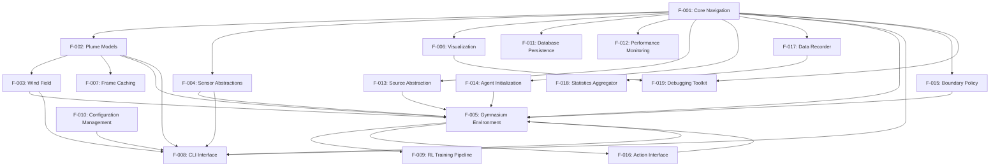

### 2.3.2 Integration Points

| Feature Pair | Integration Type | Shared Components | Common Services |
|-------------|------------------|-------------------|-----------------|
| F-001 & F-013 | Protocol Implementation | SourceProtocol | Configuration injection |
| F-001 & F-015 | Protocol Implementation | BoundaryPolicyProtocol | Vectorized operations |
| F-005 & F-016 | Protocol Implementation | ActionInterfaceProtocol | Action space translation |
| F-001 & F-017 | Hook Integration | RecorderProtocol | Lifecycle management |
| F-017 & F-018 | Data Pipeline | Statistical computation | Data aggregation |

### 2.3.3 Shared Components

| Component | Used By Features | Purpose |
|-----------|------------------|---------|
| NavigatorProtocol | F-001, F-013, F-015, F-017 | Core navigation interface |
| Hydra Configuration | F-008, F-010, F-013-F-019 | Parameter management |
| Performance Monitor | F-001, F-007, F-012, F-017 | Metrics collection |
| Visualization Pipeline | F-006, F-018, F-019 | Data presentation |

## 2.4 IMPLEMENTATION CONSIDERATIONS

### 2.4.1 Technical Constraints

| Feature | Constraint | Impact | Mitigation |
|---------|------------|--------|------------|
| F-001 | ≤33ms step latency | Performance critical | Vectorized operations, optional JIT |
| F-007 | Memory usage limits | Cache size constraints | Configurable cache policies |
| F-017 | I/O performance | Recording overhead | Buffered writes, separate thread |
| F-019 | GUI dependencies | Optional components | Graceful degradation |

### 2.4.2 Performance Requirements

| Feature | Metric | Target | Measurement |
|---------|--------|--------|-------------|
| F-001 | Step latency | ≤33ms | 99th percentile |
| F-007 | Cache hit rate | >90% | Cache statistics |
| F-017 | Recording overhead | <5% | Performance profiling |
| F-005 | Environment throughput | >1000 steps/sec | Benchmark suite |

### 2.4.3 Scalability Considerations

| Feature | Scaling Dimension | Limit | Design Approach |
|---------|------------------|-------|-----------------|
| F-001 | Agent count | 100 concurrent | Vectorized operations |
| F-007 | Cache size | 2 GiB default | Configurable with monitoring |
| F-017 | Data volume | TB-scale | Compression, efficient formats |
| F-018 | Statistics computation | Real-time | Streaming algorithms |

### 2.4.4 Security Implications

| Feature | Security Concern | Risk Level | Mitigation |
|---------|------------------|------------|------------|
| F-011 | Database access | Medium | Parameterized queries |
| F-017 | File system access | Low | Sandboxed directories |
| F-019 | GUI components | Low | Input validation |
| F-008 | CLI commands | Medium | Argument sanitization |

### 2.4.5 Maintenance Requirements

| Feature | Maintenance Type | Frequency | Responsibility |
|---------|------------------|-----------|----------------|
| F-001 | Protocol updates | Per release | Core team |
| F-010 | Configuration schema | As needed | Architecture team |
| F-017 | Backend compatibility | Quarterly | Data team |
| F-006 | Visualization updates | Monthly | UI team |

## 2.2 FUNCTIONAL REQUIREMENTS TABLE

### 2.2.1 Core Navigation System (F-001) (updated)

| Requirement ID | Description | Acceptance Criteria | Priority | Complexity |
|----------------|-------------|-------------------|----------|------------|
| F-001-RQ-001 | Single-agent position updates | Position updates in <1ms per step | Must-Have | Medium |
| F-001-RQ-002 | Multi-agent vectorized operations | Support 100 agents with <10ms step time | Must-Have | High |
| F-001-RQ-003 | Orientation and speed control | Smooth continuous control with bounds | Must-Have | Low |
| F-001-RQ-004 | Protocol compliance | Implement NavigatorProtocol interface | Must-Have | Low |
| <span style="background-color: rgba(91, 57, 243, 0.2)">F-001-RQ-005</span> | <span style="background-color: rgba(91, 57, 243, 0.2)">Deterministic global seeding</span> | <span style="background-color: rgba(91, 57, 243, 0.2)">Identical rollouts given identical seed</span> | <span style="background-color: rgba(91, 57, 243, 0.2)">Must-Have</span> | <span style="background-color: rgba(91, 57, 243, 0.2)">Medium</span> |

**Technical Specifications:**
- **Input Parameters:** 
  - Single: position (x,y), orientation (rad), speed (m/s)
  - Multi: arrays of above parameters
  - <span style="background-color: rgba(91, 57, 243, 0.2)">Global seed: integer for reproducible random state</span>
- **Output/Response:** Updated states, odor readings, navigation commands
- **Performance Criteria:** <1ms single agent, <10ms for 100 agents
- **Data Requirements:** Float32 precision minimum, vectorized operations

**Validation Rules:**
- **Business Rules:** Speed limits enforced, boundary checking, collision detection, <span style="background-color: rgba(91, 57, 243, 0.2)">deterministic behavior with seeding</span>
- **Data Validation:** NaN/Inf rejection, coordinate bounds verification
- **Security Requirements:** Input sanitization, memory bounds checking
- **Compliance Requirements:** Gymnasium API compliance, deterministic behavior

### 2.2.2 Plume Model Plugins (F-002)

| Requirement ID | Description | Acceptance Criteria | Priority | Complexity |
|----------------|-------------|-------------------|----------|------------|
| F-002-RQ-001 | Gaussian model computation | Analytical solution in <0.1ms | Must-Have | Medium |
| F-002-RQ-002 | Turbulent filament tracking | 10k filaments at 30 FPS | Must-Have | High |
| F-002-RQ-003 | Video adapter frame access | Cache-aware retrieval system | Must-Have | Medium |
| F-002-RQ-004 | Runtime model switching | Zero-downtime swap via config | Should-Have | Low |

**Technical Specifications:**
- **Input Parameters:** Position queries, wind field state, time step
- **Output/Response:** Concentration values [0,1], gradient information
- **Performance Criteria:** Real-time computation (30 FPS), memory efficient
- **Data Requirements:** Float32/64 concentration fields, spatial indexing

### 2.2.3 Gymnasium Environment (F-005) (updated)

| Requirement ID | Description | Acceptance Criteria | Priority | Complexity |
|----------------|-------------|-------------------|----------|------------|
| F-005-RQ-001 | Gymnasium 0.29.x compliance | Pass env_checker validation | Must-Have | Medium |
| F-005-RQ-002 | Legacy Gym compatibility | 4-tuple/5-tuple auto-detection | Must-Have | High |
| F-005-RQ-003 | Vectorized environment support | Linear scaling to 16 envs | Should-Have | Medium |
| F-005-RQ-004 | <span style="background-color: rgba(91, 57, 243, 0.2)">Extensibility hooks (obs/reward/termination)</span> | Custom obs/reward/termination | <span style="background-color: rgba(91, 57, 243, 0.2)">Must-Have</span> | Low |

**Technical Specifications:**
- **Input Parameters:** Actions (speed, angular_velocity), environment config
- **Output/Response:** Observations, rewards, done flags, info dicts
- **Performance Criteria:** <10ms step latency, deterministic seeding
- **Data Requirements:** Box/Dict observation spaces, action space validation

### 2.2.4 Frame Caching System (F-007)

| Requirement ID | Description | Acceptance Criteria | Priority | Complexity |
|----------------|-------------|-------------------|----------|------------|
| F-007-RQ-001 | LRU cache operations | O(1) hit/miss with eviction | Must-Have | Medium |
| F-007-RQ-002 | Memory pressure handling | Auto-evict at threshold | Must-Have | High |
| F-007-RQ-003 | Cache statistics | Real-time hit rate tracking | Should-Have | Low |
| F-007-RQ-004 | Zero-copy frame access | NumPy array sharing | Must-Have | Medium |

**Technical Specifications:**
- **Input Parameters:** Frame ID, memory limits, cache strategy
- **Output/Response:** NumPy arrays, cache statistics, memory usage
- **Performance Criteria:** >90% hit rate, <1ms retrieval time
- **Data Requirements:** 2 GiB default memory limit, configurable bounds

### 2.2.5 RL Training Pipeline (F-009)

| Requirement ID | Description | Acceptance Criteria | Priority | Complexity |
|----------------|-------------|-------------------|----------|------------|
| F-009-RQ-001 | Algorithm support | PPO, SAC, TD3 available | Must-Have | Medium |
| F-009-RQ-002 | Vectorized training | 8+ parallel environments | Must-Have | High |
| F-009-RQ-003 | Checkpoint management | Auto-save best models | Must-Have | Low |
| F-009-RQ-004 | Experiment tracking | TensorBoard/W&B integration | Should-Have | Medium |

**Technical Specifications:**
- **Input Parameters:** Hyperparameters, environment config, training schedule
- **Output/Response:** Trained policies, metrics, evaluation results
- **Performance Criteria:** >1M steps/hour throughput, GPU utilization
- **Data Requirements:** Policy checkpoints, trajectory data, training logs

### 2.2.6 Source Abstraction (F-013)

| Requirement ID | Description | Acceptance Criteria | Priority | Complexity |
|----------------|-------------|-------------------|----------|------------|
| F-013-RQ-001 | Odor concentration query API | <0.05 ms per call | Must-Have | Medium |
| F-013-RQ-002 | Multi-source coordination | Support 10+ concurrent sources | Must-Have | High |
| F-013-RQ-003 | Dynamic source behavior | Runtime parameter updates | Should-Have | Medium |
| F-013-RQ-004 | Source protocol compliance | Implement SourceProtocol interface | Must-Have | Low |

**Technical Specifications:**
- **Input Parameters:** Query position (x,y), time step, source configuration
- **Output/Response:** Concentration values, source metadata, gradient information
- **Performance Criteria:** <0.05ms per query, vectorized operations for multi-agent
- **Data Requirements:** Float32 precision, spatial indexing for efficiency

**Validation Rules:**
- **Business Rules:** Source position validation, concentration bounds [0,1]
- **Data Validation:** Parameter bounds checking, NaN/Inf rejection
- **Security Requirements:** Input sanitization, memory bounds checking
- **Compliance Requirements:** SourceProtocol interface adherence

### 2.2.7 Agent Initialization Strategies (F-014)

| Requirement ID | Description | Acceptance Criteria | Priority | Complexity |
|----------------|-------------|-------------------|----------|------------|
| F-014-RQ-001 | Deterministic position generation | 100% reproducible with seed | Must-Have | Medium |
| F-014-RQ-002 | Multiple initialization patterns | Support 4+ strategy types | Must-Have | High |
| F-014-RQ-003 | Multi-agent position validation | No collision detection required | Should-Have | Low |
| F-014-RQ-004 | Configuration-driven selection | Runtime strategy switching | Must-Have | Low |

**Technical Specifications:**
- **Input Parameters:** Agent count, domain bounds, initialization strategy, random seed
- **Output/Response:** Agent positions array, orientations array, metadata
- **Performance Criteria:** <1ms initialization for 100 agents, deterministic seeding
- **Data Requirements:** Float32 position arrays, strategy configuration schemas

**Validation Rules:**
- **Business Rules:** Positions within domain bounds, valid orientation ranges
- **Data Validation:** Agent count validation, parameter bounds checking
- **Security Requirements:** Input sanitization, array bounds checking
- **Compliance Requirements:** AgentInitializer interface compliance

### 2.2.8 Boundary Policy Framework (F-015)

| Requirement ID | Description | Acceptance Criteria | Priority | Complexity |
|----------------|-------------|-------------------|----------|------------|
| F-015-RQ-001 | Vectorized boundary violation handling | 100 agents in <0.5 ms | Must-Have | High |
| F-015-RQ-002 | Multiple boundary behaviors | Support 4+ policy types | Must-Have | Medium |
| F-015-RQ-003 | Complex domain geometry | Non-rectangular boundary support | Should-Have | High |
| F-015-RQ-004 | Policy protocol compliance | Implement BoundaryPolicyProtocol | Must-Have | Low |

**Technical Specifications:**
- **Input Parameters:** Agent positions, domain geometry, boundary policy type
- **Output/Response:** Corrected positions, violation flags, episode termination signals
- **Performance Criteria:** <0.5ms for 100 agents, vectorized operations
- **Data Requirements:** Float32 position arrays, boundary geometry definitions

**Validation Rules:**
- **Business Rules:** Consistent boundary enforcement, proper collision response
- **Data Validation:** Position bounds checking, geometry validation
- **Security Requirements:** Memory bounds checking, division by zero protection
- **Compliance Requirements:** BoundaryPolicyProtocol interface adherence

### 2.2.9 Action Interface Layer (F-016)

| Requirement ID | Description | Acceptance Criteria | Priority | Complexity |
|----------------|-------------|-------------------|----------|------------|
| F-016-RQ-001 | Action translation overhead | <0.05 ms per step | Must-Have | Low |
| F-016-RQ-002 | Multiple action space support | Continuous and discrete modes | Must-Have | Medium |
| F-016-RQ-003 | Action validation and clipping | Bounds enforcement and error handling | Must-Have | Low |
| F-016-RQ-004 | Protocol interface compliance | Implement ActionInterfaceProtocol | Must-Have | Low |

**Technical Specifications:**
- **Input Parameters:** Raw actions from RL agent, action space configuration
- **Output/Response:** Translated control commands, validation status
- **Performance Criteria:** <0.05ms per step, minimal allocation overhead
- **Data Requirements:** Action space definitions, validation schemas

**Validation Rules:**
- **Business Rules:** Action bounds enforcement, valid control commands
- **Data Validation:** Action space compatibility, parameter bounds checking
- **Security Requirements:** Input sanitization, bounds checking
- **Compliance Requirements:** ActionInterfaceProtocol adherence, Gymnasium compatibility

### 2.2.10 Data Recorder System (F-017)

| Requirement ID | Description | Acceptance Criteria | Priority | Complexity |
|----------------|-------------|-------------------|----------|------------|
| F-017-RQ-001 | Recorder disabled-mode overhead | <1 ms per 1000 steps | Must-Have | Medium |
| F-017-RQ-002 | Multiple backend support | Parquet, HDF5, SQLite backends | Must-Have | High |
| F-017-RQ-003 | Buffered asynchronous I/O | Non-blocking data persistence | Should-Have | High |
| F-017-RQ-004 | Protocol compliance | Implement RecorderProtocol interface | Must-Have | Low |

**Technical Specifications:**
- **Input Parameters:** Simulation state, recording configuration, backend selection
- **Output/Response:** Persisted data files, recording statistics, buffer status
- **Performance Criteria:** <1ms overhead when disabled, async I/O for active recording
- **Data Requirements:** Trajectory data, metadata, compression support

**Validation Rules:**
- **Business Rules:** Data integrity, configurable recording granularity
- **Data Validation:** Schema compliance, data type validation
- **Security Requirements:** File system permissions, data sanitization
- **Compliance Requirements:** RecorderProtocol interface adherence

### 2.2.11 Statistics Aggregator (F-018)

| Requirement ID | Description | Acceptance Criteria | Priority | Complexity |
|----------------|-------------|-------------------|----------|------------|
| F-018-RQ-001 | Metrics computation | <100 ms per episode | Must-Have | Medium |
| F-018-RQ-002 | Research-focused metrics | Navigation-specific statistics | Must-Have | High |
| F-018-RQ-003 | Batch processing support | Multi-episode analysis | Should-Have | Medium |
| F-018-RQ-004 | Export format compatibility | JSON, CSV, parquet outputs | Should-Have | Low |

**Technical Specifications:**
- **Input Parameters:** Episode trajectory data, statistics configuration
- **Output/Response:** Computed metrics, summary statistics, export files
- **Performance Criteria:** <100ms per episode, batch processing efficiency
- **Data Requirements:** Trajectory data access, statistical calculation libraries

**Validation Rules:**
- **Business Rules:** Valid metric calculations, statistical significance
- **Data Validation:** Trajectory data integrity, metric bounds checking
- **Security Requirements:** File system access, data sanitization
- **Compliance Requirements:** StatsAggregatorProtocol interface adherence

### 2.2.12 Debugging & Hook Toolkit (F-019)

| Requirement ID | Description | Acceptance Criteria | Priority | Complexity |
|----------------|-------------|-------------------|----------|------------|
| F-019-RQ-001 | GUI refresh rate | ≥30 FPS with ≤5% CPU utilisation | Must-Have | High |
| F-019-RQ-002 | Interactive step-through | Pause/resume/step simulation control | Must-Have | Medium |
| F-019-RQ-003 | Extensible hook system | Runtime hook registration | Should-Have | Medium |
| F-019-RQ-004 | Multi-backend GUI support | Qt and Streamlit backends | Should-Have | High |

**Technical Specifications:**
- **Input Parameters:** Simulation state, GUI configuration, hook definitions
- **Output/Response:** Interactive visualization, hook execution results
- **Performance Criteria:** ≥30 FPS refresh, ≤5% CPU utilization, responsive controls
- **Data Requirements:** Simulation state access, visualization data structures

**Validation Rules:**
- **Business Rules:** Responsive user interface, non-blocking simulation
- **Data Validation:** State consistency, visualization data integrity
- **Security Requirements:** Safe hook execution, resource limits
- **Compliance Requirements:** Hook system interface adherence

## 2.3 FEATURE RELATIONSHIPS

### 2.3.1 Core Dependencies (updated)

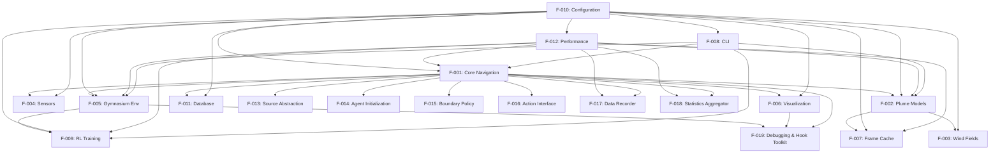

### 2.3.2 Integration Points (updated)
- **Navigation ↔ Sensors:** NavigatorProtocol.sample_odor() interface for sensor data acquisition
- **Plume Models ↔ Wind Fields:** PlumeModel.step(wind_field) method for environmental dynamics
- **Environment ↔ Frame Cache:** VideoPlume.get_frame() with cache-aware retrieval system
- **CLI ↔ All Features:** Hydra configuration composition for unified parameter management
- **Training ↔ Environment:** Vectorized environment interface with performance monitoring
- <span style="background-color: rgba(91, 57, 243, 0.2)">**Core ↔ Recorder:** Recorder hooks invoked pre- and post-step</span>
- <span style="background-color: rgba(91, 57, 243, 0.2)">**Recorder ↔ StatsAggregator:** Recorder streams episode data to StatsAggregator</span>
- <span style="background-color: rgba(91, 57, 243, 0.2)">**Environment ↔ BoundaryPolicy:** Controllers delegate boundary checks via policy API</span>
- <span style="background-color: rgba(91, 57, 243, 0.2)">**Hook System ↔ All Components:** lifecycle callbacks (extra_obs_fn, extra_reward_fn, episode_end_fn)</span>

### 2.3.3 Shared Components (updated)
- **Logging Infrastructure:** All features use structured logging with correlation IDs
- **Configuration System:** Hydra/Pydantic schemas shared across all components
- **Performance Monitoring:** Unified metrics collection and reporting system
- **Seed Management:** Global reproducibility system with deterministic behavior
- **Protocol Interfaces:** Standardized interfaces for extensibility and testing
- <span style="background-color: rgba(91, 57, 243, 0.2)">**Plugin Registry:** Dynamic component discovery and registration system for runtime component extensibility</span>

### 2.3.4 Common Services
- **Error Handling:** Centralized exception management with context preservation
- **Validation Services:** Input validation and type checking across all components
- **Caching Layer:** Shared caching infrastructure for performance optimization
- **Plugin Registry:** Dynamic component discovery and registration system

## 2.4 IMPLEMENTATION CONSIDERATIONS

### 2.4.1 Core Simulation Features (F-001 to F-004) (updated)
- **Technical Constraints:** Real-time performance required for interactive research
- **Performance Requirements:** <10ms total step time, vectorized operations mandatory
- **Scalability Considerations:** Linear memory scaling with agent count, efficient state management
- **Security Implications:** Input validation for boundary conditions, memory safety
- **Maintenance Requirements:** Protocol-based extensibility, comprehensive test coverage
- <span style="background-color: rgba(91, 57, 243, 0.2)">**Debug GUI Integration:** Qt/Streamlit dual backend support for interactive debugging, zero-overhead when disabled via configuration</span>

### 2.4.2 RL Integration Features (F-005, F-009)
- **Technical Constraints:** Gymnasium API compliance, deterministic seeding
- **Performance Requirements:** >1M steps/hour training throughput, GPU utilization
- **Scalability Considerations:** Multi-GPU support planned, distributed training ready
- **Security Implications:** Checkpoint validation, secure model serialization
- **Maintenance Requirements:** Version compatibility matrix, backward compatibility

### 2.4.3 Performance Features (F-007)
- **Technical Constraints:** Memory bounds must be respected, zero-copy operations
- **Performance Requirements:** >90% cache hit rate, <1ms frame retrieval
- **Scalability Considerations:** Adaptive memory management, concurrent access support
- **Security Implications:** Memory isolation between agents, resource exhaustion protection
- **Maintenance Requirements:** Performance regression detection, monitoring integration

### 2.4.4 Infrastructure Features (F-010 to F-012)
- **Technical Constraints:** Zero-impact when disabled, optional activation
- **Performance Requirements:** <5% overhead for monitoring, efficient logging
- **Scalability Considerations:** Distributed logging support, horizontal scaling ready
- **Security Implications:** Credential management for databases, secure configuration
- **Maintenance Requirements:** Backward compatibility, migration support

### 2.4.5 Cross-Cutting Concerns (updated)
- **Documentation:** Comprehensive API documentation with examples
- **Testing:** Unit tests (>80% coverage), integration tests, performance benchmarks
- **Deployment:** Docker containers, pip installable, conda-forge distribution
- **Monitoring:** Health checks, metrics collection, alerting capabilities
- **Compliance:** Open source licensing (MIT), dependency management
- <span style="background-color: rgba(91, 57, 243, 0.2)">**Reproducibility:** Deterministic seeding across all components for identical rollouts</span>
- <span style="background-color: rgba(91, 57, 243, 0.2)">**Extensibility:** Plugin discovery mechanisms for runtime component selection</span>
- <span style="background-color: rgba(91, 57, 243, 0.2)">**Configuration:** Hydra-driven parameterisation with no hardcoded values</span>

### 2.4.6 Protocol Extraction Features (F-013 to F-016)
- **Technical Constraints:** <span style="background-color: rgba(91, 57, 243, 0.2)">Compile-time interface enforcement via protocol-based architecture</span>
- **Performance Requirements:** <span style="background-color: rgba(91, 57, 243, 0.2)">≤0.5 ms aggregate overhead for all protocol abstractions combined</span>
- **Scalability Considerations:** <span style="background-color: rgba(91, 57, 243, 0.2)">Support for 100 concurrent agents with vectorized operations across all protocol implementations</span>
- **Security Implications:** Protocol validation at runtime, type safety enforcement
- **Maintenance Requirements:** <span style="background-color: rgba(91, 57, 243, 0.2)">Single-responsibility protocol files with clear separation of concerns</span>

#### 2.4.6.1 Source Abstraction (F-013)
- **Technical Constraints:** SourceProtocol interface compliance, vectorized concentration queries
- **Performance Requirements:** <0.05ms per odor concentration query, multi-source coordination
- **Scalability Considerations:** Support for 10+ concurrent sources with spatial indexing
- **Security Implications:** Source parameter validation, concentration bounds enforcement
- **Maintenance Requirements:** Runtime parameter updates, backward compatibility for existing plume models

#### 2.4.6.2 Agent Initialization (F-014)
- **Technical Constraints:** AgentInitializer interface compliance, deterministic seeding
- **Performance Requirements:** <1ms initialization time for 100 agents
- **Scalability Considerations:** Multiple initialization strategies (uniform_random, grid, fixed_list, from_dataset)
- **Security Implications:** Position bounds validation, collision detection optional
- **Maintenance Requirements:** Configuration-driven strategy selection, reproducible initialization patterns

#### 2.4.6.3 Boundary Policy Framework (F-015)
- **Technical Constraints:** BoundaryPolicyProtocol compliance, complex geometry support
- **Performance Requirements:** <0.5ms boundary handling for 100 agents via vectorized operations
- **Scalability Considerations:** Multiple boundary behaviors (terminate, bounce, wrap, clip)
- **Security Implications:** Consistent boundary enforcement, proper collision response
- **Maintenance Requirements:** Policy protocol interface adherence, extensible boundary definitions

#### 2.4.6.4 Action Interface Layer (F-016)
- **Technical Constraints:** ActionInterfaceProtocol compliance, Gymnasium compatibility
- **Performance Requirements:** <0.05ms action translation overhead per step
- **Scalability Considerations:** Support for both continuous and discrete action spaces
- **Security Implications:** Action bounds enforcement, input validation
- **Maintenance Requirements:** Runtime action space switching, backward compatibility

### 2.4.7 Data & Analytics Features (F-017, F-018)
- **Technical Constraints:** <span style="background-color: rgba(91, 57, 243, 0.2)">Buffer-based I/O for minimal performance impact, optional backend activation</span>
- **Performance Requirements:** <span style="background-color: rgba(91, 57, 243, 0.2)"><1 ms disabled-mode overhead per simulation step</span>
- **Scalability Considerations:** <span style="background-color: rgba(91, 57, 243, 0.2)">Asynchronous data persistence, TB-scale data volume support</span>
- **Security Implications:** File system permissions, data sanitization, secure storage backends
- **Maintenance Requirements:** <span style="background-color: rgba(91, 57, 243, 0.2)">Multi-backend compatibility (parquet, hdf5, sqlite, none), schema evolution support</span>

#### 2.4.7.1 Data Recorder System (F-017)
- **Technical Constraints:** RecorderProtocol interface compliance, multiple backend support
- **Performance Requirements:** <1ms overhead when disabled, non-blocking data persistence when active
- **Scalability Considerations:** Buffered asynchronous I/O, compression support for large datasets
- **Security Implications:** Data integrity validation, secure file system access
- **Maintenance Requirements:** Schema compliance, data type validation, migration support

#### 2.4.7.2 Statistics Aggregator (F-018)
- **Technical Constraints:** StatsAggregatorProtocol compliance, research-focused metrics
- **Performance Requirements:** <100ms per episode for metrics computation
- **Scalability Considerations:** Batch processing support for multi-episode analysis
- **Security Implications:** Statistical validation, metric bounds checking
- **Maintenance Requirements:** Export format compatibility (JSON, CSV, parquet), custom statistics definitions

## 2.5 TRACEABILITY MATRIX

The traceability matrix provides a comprehensive mapping between feature capabilities, success criteria, and performance targets, ensuring all system features are properly tracked and validated. <span style="background-color: rgba(91, 57, 243, 0.2)">This matrix has been expanded to include the new protocol-based components (F-013 through F-019) that enhance the system's modularity and extensibility.</span>

| Feature ID | System Capability | Success Criteria | Performance Target |
|------------|-------------------|------------------|-------------------|
| F-001 | Modular Navigation | <span style="background-color: rgba(91, 57, 243, 0.2)">Step Latency, Deterministic rollouts</span> | <10ms average |
| F-002 | Plume Modeling | Model Switching | Runtime selection |
| F-003 | Environmental Dynamics | Wind Integration | Real-time computation |
| F-004 | Multi-Modal Sensing | Sensor Abstraction | Sub-0.1ms latency |
| F-005 | RL Training Integration | API Compliance | 100% Gymnasium |
| F-006 | Visualization Pipeline | Publication Quality | 30 FPS animation |
| F-007 | High-Performance Computing | Cache Performance | >90% hit rate |
| F-008 | CLI Interface | Automation Support | CI/CD integration |
| F-009 | RL Training Pipeline | Training Speed | >1M steps/hour |
| F-010 | Configuration System | Reproducibility | Parameter validation |
| F-011 | Database Persistence | Collaboration | Multi-backend support |
| F-012 | Performance Monitor | Observability | <5% overhead |
| <span style="background-color: rgba(91, 57, 243, 0.2)">F-013</span> | <span style="background-color: rgba(91, 57, 243, 0.2)">Source Abstraction</span> | <span style="background-color: rgba(91, 57, 243, 0.2)">Flexible Odor Sources, Protocol Compliance</span> | <span style="background-color: rgba(91, 57, 243, 0.2)"><0.05 ms query</span> |
| <span style="background-color: rgba(91, 57, 243, 0.2)">F-014</span> | <span style="background-color: rgba(91, 57, 243, 0.2)">Agent Initialization</span> | <span style="background-color: rgba(91, 57, 243, 0.2)">Start Position Strategies, Deterministic seeding</span> | <span style="background-color: rgba(91, 57, 243, 0.2)"><1 ms reset</span> |
| <span style="background-color: rgba(91, 57, 243, 0.2)">F-015</span> | <span style="background-color: rgba(91, 57, 243, 0.2)">Boundary Policy</span> | <span style="background-color: rgba(91, 57, 243, 0.2)">Domain Edge Handling, Vectorised checks</span> | <span style="background-color: rgba(91, 57, 243, 0.2)"><0.5 ms</span> |
| <span style="background-color: rgba(91, 57, 243, 0.2)">F-016</span> | <span style="background-color: rgba(91, 57, 243, 0.2)">Action Interface</span> | <span style="background-color: rgba(91, 57, 243, 0.2)">Action Translation, Unified API</span> | <span style="background-color: rgba(91, 57, 243, 0.2)"><0.05 ms</span> |
| <span style="background-color: rgba(91, 57, 243, 0.2)">F-017</span> | <span style="background-color: rgba(91, 57, 243, 0.2)">Recorder System</span> | <span style="background-color: rgba(91, 57, 243, 0.2)">Data Persistence, Toggleable back-ends</span> | <span style="background-color: rgba(91, 57, 243, 0.2)"><1 ms disabled</span> |
| <span style="background-color: rgba(91, 57, 243, 0.2)">F-018</span> | <span style="background-color: rgba(91, 57, 243, 0.2)">Stats Aggregator</span> | <span style="background-color: rgba(91, 57, 243, 0.2)">Metric Generation, Summary.json export</span> | <span style="background-color: rgba(91, 57, 243, 0.2)"><100 ms/episode</span> |
| <span style="background-color: rgba(91, 57, 243, 0.2)">F-019</span> | <span style="background-color: rgba(91, 57, 243, 0.2)">Debug Toolkit</span> | <span style="background-color: rgba(91, 57, 243, 0.2)">Interactive Visualisation, 30 FPS GUI</span> | <span style="background-color: rgba(91, 57, 243, 0.2)">≤5% CPU</span> |

### 2.5.1 Feature Validation Matrix (updated)

<span style="background-color: rgba(91, 57, 243, 0.2)">The expanded validation matrix ensures comprehensive coverage of all system features, including the new protocol-based components that enhance modularity and extensibility.</span>

| Feature Category | Features | Validation Method | Coverage Target |
|------------------|----------|-------------------|-----------------|
| Core Functionality | F-001, F-013 | Unit tests, integration tests | >95% code coverage |
| Simulation Models | F-002, F-003 | Physics validation, benchmarking | Scientific accuracy |
| Agent Systems | F-004, F-014, F-015, F-016 | Multi-agent scenarios, performance tests | 100 agents simultaneous |
| RL Integration | F-005, F-009 | Framework compatibility, training validation | All major RL libraries |
| Performance Systems | F-006, F-007, F-012 | Load testing, profiling | SLA compliance |
| Infrastructure | F-008, F-010, F-011 | CI/CD integration, deployment tests | Production readiness |
| <span style="background-color: rgba(91, 57, 243, 0.2)">Data Management</span> | <span style="background-color: rgba(91, 57, 243, 0.2)">F-017, F-018</span> | <span style="background-color: rgba(91, 57, 243, 0.2)">Data integrity, export validation</span> | <span style="background-color: rgba(91, 57, 243, 0.2)">Multi-backend support</span> |
| <span style="background-color: rgba(91, 57, 243, 0.2)">Development Tools</span> | <span style="background-color: rgba(91, 57, 243, 0.2)">F-019</span> | <span style="background-color: rgba(91, 57, 243, 0.2)">GUI responsiveness, hook system</span> | <span style="background-color: rgba(91, 57, 243, 0.2)">Interactive debugging</span> |

### 2.5.2 Cross-Feature Dependencies (updated)

<span style="background-color: rgba(91, 57, 243, 0.2)">The dependency matrix has been updated to reflect the new protocol-based architecture, showing how the expanded feature set maintains clean separation of concerns while enabling comprehensive system functionality.</span>

| Dependent Feature | Dependencies | Integration Points | Validation Requirements |
|-------------------|--------------|-------------------|------------------------|
| F-001 (Navigation) | <span style="background-color: rgba(91, 57, 243, 0.2)">F-013, F-014, F-015, F-016</span> | Protocol interfaces | Interface compliance |
| F-002 (Plume Models) | F-001, F-003 | Model switching | Runtime compatibility |
| F-003 (Wind Fields) | F-002 | Physics integration | Scientific validation |
| F-004 (Sensors) | F-001, F-002 | State sampling | Latency requirements |
| F-005 (Gymnasium) | F-001, F-004, <span style="background-color: rgba(91, 57, 243, 0.2)">F-016</span> | Environment API | RL framework compatibility |
| F-006 (Visualization) | F-001, <span style="background-color: rgba(91, 57, 243, 0.2)">F-019</span> | State rendering | GUI responsiveness |
| F-007 (Caching) | F-002 | Memory management | Performance validation |
| F-008 (CLI) | All features | Command interface | Automation support |
| F-009 (RL Training) | F-005 | Training pipeline | Algorithm compatibility |
| F-010 (Configuration) | All features | Parameter management | Validation schemas |
| F-011 (Database) | F-001, <span style="background-color: rgba(91, 57, 243, 0.2)">F-017</span> | Data persistence | Backend compatibility |
| F-012 (Monitoring) | All features | Performance tracking | Observability requirements |
| <span style="background-color: rgba(91, 57, 243, 0.2)">F-017 (Recorder)</span> | <span style="background-color: rgba(91, 57, 243, 0.2)">F-001, F-011</span> | <span style="background-color: rgba(91, 57, 243, 0.2)">Data collection</span> | <span style="background-color: rgba(91, 57, 243, 0.2)">Performance overhead</span> |
| <span style="background-color: rgba(91, 57, 243, 0.2)">F-018 (Stats)</span> | <span style="background-color: rgba(91, 57, 243, 0.2)">F-001, F-017</span> | <span style="background-color: rgba(91, 57, 243, 0.2)">Metric calculation</span> | <span style="background-color: rgba(91, 57, 243, 0.2)">Statistical accuracy</span> |
| <span style="background-color: rgba(91, 57, 243, 0.2)">F-019 (Debug Toolkit)</span> | <span style="background-color: rgba(91, 57, 243, 0.2)">F-001, F-006</span> | <span style="background-color: rgba(91, 57, 243, 0.2)">Interactive controls</span> | <span style="background-color: rgba(91, 57, 243, 0.2)">GUI performance</span> |

### 2.5.3 Performance Validation Criteria (updated)

<span style="background-color: rgba(91, 57, 243, 0.2)">Performance criteria have been expanded to include the new protocol-based components, ensuring comprehensive system performance validation across all feature categories.</span>

| Performance Category | Features | Measurement Method | Acceptance Threshold |
|---------------------|----------|-------------------|---------------------|
| Step Latency | F-001, F-013, F-015, F-016 | Profiling, benchmarking | <10ms average |
| Query Performance | F-002, F-004, F-013 | Micro-benchmarks | <0.1ms per query |
| Memory Efficiency | F-007, F-012 | Memory profiling | <2GB baseline |
| Training Throughput | F-005, F-009 | RL benchmarks | >1M steps/hour |
| Visualization | F-006, F-019 | Frame rate monitoring | ≥30 FPS |
| I/O Operations | F-008, F-011, F-017 | I/O benchmarks | Non-blocking |
| <span style="background-color: rgba(91, 57, 243, 0.2)">Initialization Speed</span> | <span style="background-color: rgba(91, 57, 243, 0.2)">F-014</span> | <span style="background-color: rgba(91, 57, 243, 0.2)">Reset timing</span> | <span style="background-color: rgba(91, 57, 243, 0.2)"><1ms for 100 agents</span> |
| <span style="background-color: rgba(91, 57, 243, 0.2)">Statistics Processing</span> | <span style="background-color: rgba(91, 57, 243, 0.2)">F-018</span> | <span style="background-color: rgba(91, 57, 243, 0.2)">Episode processing</span> | <span style="background-color: rgba(91, 57, 243, 0.2)"><100ms per episode</span> |
| <span style="background-color: rgba(91, 57, 243, 0.2)">System Overhead</span> | <span style="background-color: rgba(91, 57, 243, 0.2)">F-012, F-017, F-019</span> | <span style="background-color: rgba(91, 57, 243, 0.2)">Resource monitoring</span> | <span style="background-color: rgba(91, 57, 243, 0.2)">≤5% CPU impact</span> |

#### References (updated)
- `plume_navigation/` - Core library architecture and implementation
- `plume_navigation/protocols/` - Protocol definitions and interfaces
- `plume_navigation/envs/` - Gymnasium environment implementations
- `plume_navigation/models/` - Plume and wind field model implementations
- `plume_navigation/navigation/` - Navigation controller implementations
- `plume_navigation/sensors/` - Sensor abstraction implementations
- `plume_navigation/utils/` - Utility functions and performance monitoring
- <span style="background-color: rgba(91, 57, 243, 0.2)">`plume_navigation/sources/` - Source abstraction implementations</span>
- <span style="background-color: rgba(91, 57, 243, 0.2)">`plume_navigation/boundaries/` - Boundary policy implementations</span>
- <span style="background-color: rgba(91, 57, 243, 0.2)">`plume_navigation/actions/` - Action interface layer implementations</span>
- <span style="background-color: rgba(91, 57, 243, 0.2)">`plume_navigation/recording/` - Data recorder system implementations</span>
- <span style="background-color: rgba(91, 57, 243, 0.2)">`plume_navigation/stats/` - Statistics aggregator implementations</span>
- <span style="background-color: rgba(91, 57, 243, 0.2)">`plume_navigation/debug/` - Debug toolkit and GUI implementations</span>
- `config/` - Hydra configuration schemas and parameter definitions
- <span style="background-color: rgba(91, 57, 243, 0.2)">`config/source/` - Source configuration schemas</span>
- <span style="background-color: rgba(91, 57, 243, 0.2)">`config/agent_init/` - Agent initialization configuration schemas</span>
- <span style="background-color: rgba(91, 57, 243, 0.2)">`config/boundary/` - Boundary policy configuration schemas</span>
- <span style="background-color: rgba(91, 57, 243, 0.2)">`config/action/` - Action interface configuration schemas</span>
- <span style="background-color: rgba(91, 57, 243, 0.2)">`config/record/` - Recorder system configuration schemas</span>
- <span style="background-color: rgba(91, 57, 243, 0.2)">`config/hooks/` - Hook system configuration schemas</span>
- `tests/` - Comprehensive test suite covering all features
- Technical specification sections 1.1, 1.2, and 1.3 for system context and scope alignment
- <span style="background-color: rgba(91, 57, 243, 0.2)">Technical specification sections 2.1, 2.2, 2.3, and 2.4 for detailed feature requirements and implementation considerations</span>

# 3. TECHNOLOGY STACK

## 3.1 PROGRAMMING LANGUAGES

The system implements a Python-first architecture that leverages the language's extensive scientific computing ecosystem while maintaining performance through strategic optimization techniques.

### 3.1.1 Python Core Implementation

**Python 3.10 - 3.11**
- **Primary Language**: Python serves as the foundation for all system components
- **Version Requirements**: >=3.10, <4.0 (specified in pyproject.toml)
- **Justification**: 
  - Industry standard for scientific computing and machine learning research
  - Extensive ecosystem of numerical libraries (NumPy, SciPy) and ML frameworks
  - Strong community support in robotics and simulation domains
  - Excellent balance between development speed and computational performance
  - Type annotation support for enhanced code quality and IDE integration

**Performance Optimization Strategy**
- **Type Annotations**: Comprehensive type hints throughout codebase for static analysis
- **Optional JIT Compilation**: Numba integration for CPU-bound computational bottlenecks
- **Vectorized Operations**: NumPy-based implementations for mathematical computations
- **Memory Management**: psutil integration for resource monitoring and optimization

## 3.2 FRAMEWORKS & LIBRARIES

<span style="background-color: rgba(91, 57, 243, 0.2)">The framework selection focuses on established, research-grade libraries that provide both stability and cutting-edge capabilities for reinforcement learning and scientific simulation. Additional libraries have been incorporated to support the new Recorder system and Debug GUI, enabling protocol-based, zero-code extensibility through configurable component selection.</span>

### 3.2.1 Core Simulation Framework

**Gymnasium 0.29.x**
- **Role**: Primary RL environment interface
- **Version**: ==0.29.* (pinned for API stability)
- **Justification**: 
  - OpenAI's successor to Gym with modern API design
  - Standardized environment interface ensuring compatibility with RL ecosystem
  - Native support for both 4-tuple and 5-tuple step returns
  - Stable-Baselines3 requires Gymnasium >=0.29.1
- **Integration**: Direct compatibility with Stable-Baselines3 and research frameworks

**Hydra-core 1.3.x**
- **Role**: Configuration management and dependency injection
- **Version**: ==1.3.* (pinned for configuration schema stability)
- **Justification**:
  - Facebook's enterprise-grade configuration framework
  - Hierarchical configuration composition enabling modular experimentation
  - Runtime component selection without code modification
  - Supports complex parameter sweeps and multi-run experiments
- **Integration**: Central to protocol-driven plugin architecture

**Pydantic >=2.5.0**
- **Role**: Data validation and configuration schema enforcement
- **Version**: >=2.5.0 for modern features
- **Justification**:
  - Runtime validation of configuration parameters
  - Type-safe configuration schemas with IDE support
  - Seamless integration with Hydra for validated configurations
  - Performance improvements in v2.x series
- **Integration**: Validates all protocol implementations and system configurations

### 3.2.2 Scientific Computing Foundation

**NumPy >=1.26.0**
- **Role**: Numerical computation foundation
- **Version**: >=1.26.0 for improved performance and Python 3.11 compatibility
- **Justification**:
  - Foundation for all vectorized mathematical operations
  - Supports multi-agent state management with linear memory scaling
  - Essential for achieving <10ms step latency requirements
  - Broad ecosystem compatibility
- **Performance**: Enables vectorized operations for up to 100 concurrent agents

**SciPy >=1.11.0**
- **Role**: Advanced scientific algorithms
- **Version**: >=1.11.0 for enhanced interpolation performance
- **Justification**:
  - Advanced interpolation algorithms for time-varying wind fields
  - Statistical functions for turbulence modeling
  - Optimized numerical routines for plume calculations
- **Integration**: Supports complex environmental dynamics modeling

**OpenCV >=4.8.0**
- **Role**: Video processing and frame manipulation
- **Version**: >=4.8.0 for performance improvements
- **Justification**:
  - High-performance video frame decoding for VideoPlumeAdapter
  - Hardware-accelerated image processing operations
  - Supports the frame caching system achieving >90% hit rates
- **Performance**: Critical for 3-5x speedup in video-based simulations

### 3.2.3 Machine Learning & Reinforcement Learning

**Stable-Baselines3 >=2.0.0**
- **Role**: State-of-the-art RL algorithm implementations
- **Version**: >=2.0.0, with latest stable version 2.6.0
- **Requirements**: Python >=3.9 for versions 2.4.0+
- **Justification**:
  - Industry-standard PyTorch-based RL algorithms (PPO, SAC, TD3, A2C, DQN)
  - Native Gymnasium compatibility for seamless integration
  - Vectorized environment support for efficient training
  - Active maintenance and research community adoption
- **Integration**: Direct compatibility with Gymnasium environment wrapper

**Shimmy >=1.0.0**
- **Role**: Environment compatibility layer
- **Version**: >=1.0.0 for legacy Gym support
- **Justification**:
  - Bridges legacy Gym environments with modern Gymnasium
  - Enables backward compatibility for existing research codebases
  - Automatic API detection and conversion
- **Integration**: Transparent compatibility layer for environment wrappers

**Numba >=0.59.0 (Optional)**
- **Role**: Just-in-time compilation for performance optimization
- **Version**: >=0.59.0 for Python 3.10+ compatibility
- **Justification**:
  - JIT compilation of turbulent plume calculation bottlenecks
  - Significant performance gains for CPU-bound mathematical operations
  - Optional dependency allowing deployment without compilation overhead
- **Performance**: Accelerates complex plume physics calculations

### 3.2.4 Visualization & Analysis (updated)

**Matplotlib >=3.7.0**
- **Role**: Primary visualization and plotting library
- **Version**: >=3.7.0 for modern API features
- **Justification**:
  - Publication-quality figure generation for research outputs
  - Real-time animation support (≥30 FPS) for trajectory visualization
  - Headless rendering capability for batch processing
  - Extensive customization for scientific plots
- **Integration**: Native support for agent trajectory and plume visualization

**Plotly >=5.17.0 (Optional)**
- **Role**: Interactive web-based visualizations
- **Version**: >=5.17.0 for enhanced performance
- **Justification**:
  - Interactive exploration of simulation results
  - Web-based dashboards for research collaboration
  - Real-time data visualization capabilities
- **Integration**: Complementary to Matplotlib for interactive analysis

**Seaborn >=0.12.0 (Optional)**
- **Role**: Statistical data visualization
- **Version**: >=0.12.0 for modern styling
- **Justification**:
  - Enhanced statistical plot aesthetics
  - Performance analysis dashboards
  - Research-quality statistical visualizations
- **Integration**: Built on Matplotlib for consistent styling

**<span style="background-color: rgba(91, 57, 243, 0.2)">PySide6 >=6.0.0 (Optional)</span>**
- **Role**: <span style="background-color: rgba(91, 57, 243, 0.2)">Qt-based interactive debugging interface</span>
- **Version**: <span style="background-color: rgba(91, 57, 243, 0.2)">>=6.0.0 for modern Qt6 framework support</span>
- **Justification**:
  - <span style="background-color: rgba(91, 57, 243, 0.2)">Native desktop GUI for step-through debugging and visualization</span>
  - <span style="background-color: rgba(91, 57, 243, 0.2)">Real-time simulation state inspection and control</span>
  - <span style="background-color: rgba(91, 57, 243, 0.2)">Professional-grade UI components for research tools</span>
- **Integration**: <span style="background-color: rgba(91, 57, 243, 0.2)">Primary backend for Debug GUI with graceful degradation when unavailable</span>

**<span style="background-color: rgba(91, 57, 243, 0.2)">Streamlit >=1.0.0 (Optional)</span>**
- **Role**: <span style="background-color: rgba(91, 57, 243, 0.2)">Web-based debugging and analysis interface</span>
- **Version**: <span style="background-color: rgba(91, 57, 243, 0.2)">>=1.0.0 for stable web application framework</span>
- **Justification**:
  - <span style="background-color: rgba(91, 57, 243, 0.2)">Browser-based alternative to Qt for cross-platform accessibility</span>
  - <span style="background-color: rgba(91, 57, 243, 0.2)">Rapid prototyping of interactive debugging dashboards</span>
  - <span style="background-color: rgba(91, 57, 243, 0.2)">Remote debugging capability for headless environments</span>
- **Integration**: <span style="background-color: rgba(91, 57, 243, 0.2)">Fallback backend for Debug GUI when PySide6 is unavailable</span>

### 3.2.5 Data Recording & Persistence (updated)

**<span style="background-color: rgba(91, 57, 243, 0.2)">Pandas >=1.5.0</span>**
- **Role**: <span style="background-color: rgba(91, 57, 243, 0.2)">DataFrame-based data manipulation and analysis</span>
- **Version**: <span style="background-color: rgba(91, 57, 243, 0.2)">>=1.5.0 for enhanced Parquet integration and performance</span>
- **Justification**:
  - <span style="background-color: rgba(91, 57, 243, 0.2)">Efficient columnar data structures for trajectory storage</span>
  - <span style="background-color: rgba(91, 57, 243, 0.2)">Native Parquet backend support with compression options</span>
  - <span style="background-color: rgba(91, 57, 243, 0.2)">Rich ecosystem for data analysis and post-processing</span>
  - <span style="background-color: rgba(91, 57, 243, 0.2)">Seamless integration with scientific Python stack</span>
- **Integration**: <span style="background-color: rgba(91, 57, 243, 0.2)">Core component of Recorder framework's Parquet backend</span>

**<span style="background-color: rgba(91, 57, 243, 0.2)">PyArrow >=10.0.0</span>**
- **Role**: <span style="background-color: rgba(91, 57, 243, 0.2)">High-performance columnar data engine</span>
- **Version**: <span style="background-color: rgba(91, 57, 243, 0.2)">>=10.0.0 for advanced compression algorithms and I/O optimization</span>
- **Justification**:
  - <span style="background-color: rgba(91, 57, 243, 0.2)">Optimized Parquet file format implementation</span>
  - <span style="background-color: rgba(91, 57, 243, 0.2)">Zero-copy operations for minimal memory overhead</span>
  - <span style="background-color: rgba(91, 57, 243, 0.2)">Advanced compression (LZ4, Zstd) reducing storage footprint by 60-80%</span>
  - <span style="background-color: rgba(91, 57, 243, 0.2)">Cross-language compatibility for data exchange</span>
- **Performance**: <span style="background-color: rgba(91, 57, 243, 0.2)">Enables efficient storage of large-scale simulation datasets</span>

**<span style="background-color: rgba(91, 57, 243, 0.2)">H5py >=3.0.0</span>**
- **Role**: <span style="background-color: rgba(91, 57, 243, 0.2)">HDF5 hierarchical data format interface</span>
- **Version**: <span style="background-color: rgba(91, 57, 243, 0.2)">>=3.0.0 for Python 3.10+ compatibility and performance improvements</span>
- **Justification**:
  - <span style="background-color: rgba(91, 57, 243, 0.2)">Scientific data format with metadata support</span>
  - <span style="background-color: rgba(91, 57, 243, 0.2)">Hierarchical organization enabling structured experiment datasets</span>
  - <span style="background-color: rgba(91, 57, 243, 0.2)">Efficient storage of multi-dimensional arrays and time series</span>
  - <span style="background-color: rgba(91, 57, 243, 0.2)">Self-describing format with embedded documentation</span>
- **Integration**: <span style="background-color: rgba(91, 57, 243, 0.2)">Alternative backend for Recorder framework targeting scientific workflows</span>

**<span style="background-color: rgba(91, 57, 243, 0.2)">Compatibility and Graceful Degradation</span>**
- **<span style="background-color: rgba(91, 57, 243, 0.2)">Optional Dependencies</span>**: <span style="background-color: rgba(91, 57, 243, 0.2)">All recording backends are individually optional</span>
- **<span style="background-color: rgba(91, 57, 243, 0.2)">Fallback Strategy</span>**: <span style="background-color: rgba(91, 57, 243, 0.2)">System defaults to 'none' backend when storage libraries unavailable</span>
- **<span style="background-color: rgba(91, 57, 243, 0.2)">Version Constraints</span>**: <span style="background-color: rgba(91, 57, 243, 0.2)">Minimum versions ensure compatibility with Python 3.10-3.11</span>
- **<span style="background-color: rgba(91, 57, 243, 0.2)">Performance Optimization</span>**: <span style="background-color: rgba(91, 57, 243, 0.2)">Buffered writes and asynchronous I/O prevent simulation slowdown</span>

## 3.3 OPEN SOURCE DEPENDENCIES

The dependency management strategy emphasizes stability, security, and compatibility while minimizing the overall dependency footprint. <span style="background-color: rgba(91, 57, 243, 0.2)">The architecture now includes specialized dependencies for data persistence, optional debugging interfaces, and storage backends to support the comprehensive Recorder framework and Debug GUI system.</span>

### 3.3.1 Core System Dependencies

**Configuration & Data Management**
- **PyYAML >=6.0**: YAML configuration file parsing and validation
- **python-dotenv >=1.1.0**: Environment variable management for deployment flexibility
- **typing-extensions >=4.13.2**: Enhanced type hints for better development experience
- **Click >=8.2.1**: Command-line interface framework with Hydra integration

**Logging & Monitoring**
- **Loguru >=0.7.0**: Structured logging system with JSON sink support
- **psutil >=5.9.0**: System resource monitoring for memory management and performance tracking

### 3.3.2 Data Persistence & Recording (updated)

**<span style="background-color: rgba(91, 57, 243, 0.2)">Storage Backend Dependencies</span>**
- **<span style="background-color: rgba(91, 57, 243, 0.2)">pandas >=1.5.0</span>**: <span style="background-color: rgba(91, 57, 243, 0.2)">DataFrame-based data manipulation powering the Parquet Recorder backend. Provides efficient columnar data structures for trajectory storage with native Parquet integration, compression support, and seamless integration with the scientific Python ecosystem for post-processing analysis.</span>
- **<span style="background-color: rgba(91, 57, 243, 0.2)">pyarrow >=10.0.0</span>**: <span style="background-color: rgba(91, 57, 243, 0.2)">High-performance columnar data engine supporting the Parquet Recorder backend. Delivers optimized Parquet file format implementation with zero-copy operations, advanced compression algorithms (LZ4, Zstd) reducing storage footprint by 60-80%, and cross-language compatibility for data exchange.</span>
- **<span style="background-color: rgba(91, 57, 243, 0.2)">h5py >=3.0.0</span>**: <span style="background-color: rgba(91, 57, 243, 0.2)">HDF5 hierarchical data format interface enabling the HDF5 Recorder backend. Supports scientific data storage with metadata, hierarchical organization for structured experiment datasets, efficient multi-dimensional array storage, and self-describing format with embedded documentation.</span>
- **<span style="background-color: rgba(91, 57, 243, 0.2)">sqlite3 (stdlib)</span>**: <span style="background-color: rgba(91, 57, 243, 0.2)">Built-in SQLite database interface supporting the SQLite Recorder backend. Provides lightweight, serverless SQL database functionality for trajectory storage with ACID compliance, zero-configuration deployment, and efficient querying capabilities for research data analysis.</span>

**<span style="background-color: rgba(91, 57, 243, 0.2)">Graceful Degradation Strategy</span>**
- <span style="background-color: rgba(91, 57, 243, 0.2)">All recording backends are individually optional with runtime availability detection</span>
- <span style="background-color: rgba(91, 57, 243, 0.2)">System automatically falls back to 'none' backend when storage libraries are unavailable</span>
- <span style="background-color: rgba(91, 57, 243, 0.2)">Buffered writes and asynchronous I/O prevent simulation performance degradation</span>

### 3.3.3 Optional Debugging GUI (updated)

**<span style="background-color: rgba(91, 57, 243, 0.2)">Interactive Debugging Interfaces</span>**
- **<span style="background-color: rgba(91, 57, 243, 0.2)">PySide6 >=6.0.0</span>**: <span style="background-color: rgba(91, 57, 243, 0.2)">Qt-based native desktop GUI framework for the Debug GUI system. Provides professional-grade UI components for real-time simulation state inspection, step-through debugging capabilities, and interactive visualization controls. Serves as the primary backend for the Debug GUI with comprehensive desktop integration.</span>
- **<span style="background-color: rgba(91, 57, 243, 0.2)">streamlit >=1.0.0</span>**: <span style="background-color: rgba(91, 57, 243, 0.2)">Web-based debugging and analysis interface serving as the fallback backend for the Debug GUI. Enables browser-based debugging dashboards, cross-platform accessibility, and remote debugging capability for headless environments when PySide6 is unavailable.</span>

**<span style="background-color: rgba(91, 57, 243, 0.2)">Availability and Fallback Handling</span>**
- <span style="background-color: rgba(91, 57, 243, 0.2)">Both GUI frameworks are optional dependencies with graceful degradation</span>
- <span style="background-color: rgba(91, 57, 243, 0.2)">System automatically detects available GUI backends at runtime</span>
- <span style="background-color: rgba(91, 57, 243, 0.2)">Debug functionality remains accessible through command-line interface when GUI libraries are unavailable</span>
- <span style="background-color: rgba(91, 57, 243, 0.2)">Zero performance overhead when debugging features are disabled</span>

### 3.3.4 Development & Quality Assurance

**Testing Framework**
- **pytest >=7.4.0**: Primary testing framework with extensive fixture support
- **pytest-cov >=4.1.0**: Code coverage reporting and analysis
- **pytest-benchmark**: Performance regression testing for critical paths
- **Hypothesis**: Property-based testing for comprehensive validation

**Code Quality Tools**
- **Black >=23.12.0**: Opinionated code formatter for consistent style
- **isort >=5.13.0**: Import statement organization and sorting
- **ruff >=0.1.0**: Fast, modern Python linter combining multiple tools
- **mypy >=1.5.0**: Static type checking with strict configuration

### 3.3.5 Package Management

**Build System**
- **Poetry**: Modern dependency management and package publishing
- **poetry-core >=1.8.0**: PEP 517 compliant build backend
- **setuptools >=42**: Legacy build system compatibility
- **wheel**: Binary distribution format support

**Package Registries**
- **PyPI**: Primary Python package distribution platform
- **Conda-forge**: Scientific Python distribution channel (planned)
- **GitHub Packages**: Internal package distribution (optional)

## 3.4 THIRD-PARTY SERVICES

The service architecture emphasizes automation, observability, and collaborative development while maintaining deployment flexibility.

### 3.4.1 Continuous Integration & Deployment

**GitHub Actions**
- **Role**: Primary CI/CD platform
- **Justification**:
  - Native GitHub integration for seamless development workflow
  - Automated testing on push/pull request events
  - Cross-repository integration testing capabilities
  - Performance benchmarking and regression detection
- **Configuration**: Ubuntu runners with Python 3.10-3.11 matrix testing

**Codecov**
- **Role**: Code coverage analysis and reporting
- **Justification**:
  - Automated coverage reporting with PR integration
  - Coverage trend analysis and quality gates
  - Team collaboration features for coverage improvements
- **Integration**: Direct GitHub Actions integration with automated reporting

### 3.4.2 Documentation & Knowledge Management

**ReadTheDocs**
- **Role**: Automated documentation hosting and building
- **Justification**:
  - Automated documentation builds from repository changes
  - Version-specific documentation management
  - Sphinx integration for comprehensive API documentation
- **Configuration**: Sphinx-based documentation with autodoc capabilities

### 3.4.3 Monitoring & Observability (Optional)

**TensorBoard**
- **Role**: ML experiment tracking and visualization
- **Status**: Disabled by default, configurable activation
- **Justification**:
  - Integration with RL training pipelines
  - Real-time training metric visualization
  - Performance profiling and debugging tools
- **Integration**: Optional Stable-Baselines3 integration

**Weights & Biases**
- **Role**: Advanced experiment tracking and collaboration
- **Status**: Disabled by default, enterprise-ready
- **Justification**:
  - Hyperparameter optimization and tracking
  - Model versioning and artifact management
  - Collaborative research capabilities
- **Integration**: Plugin-based activation through configuration

## 3.5 DATABASES & STORAGE

The storage architecture provides flexible persistence options while maintaining performance for high-frequency operations. <span style="background-color: rgba(91, 57, 243, 0.2)">The system now supports comprehensive data recording through multiple backend formats, enabling researchers to choose optimal storage solutions based on their specific analysis requirements and performance constraints.</span>

### 3.5.1 Database Systems

**SQLAlchemy >=2.0.41**
- **Role**: Modern ORM with async support capabilities
- **Version**: >=2.0.41 for performance improvements and async support
- **Justification**:
  - Database-agnostic design supporting multiple backends
  - Connection pooling for concurrent access patterns
  - Modern async/await support for high-performance scenarios
  - Type-safe query construction with ORM benefits
- **Performance**: Optimized for experimental data persistence patterns

**SQLite**
- **Role**: <span style="background-color: rgba(91, 57, 243, 0.2)">Default development database and lightweight Recorder backend</span>
- **Justification**:
  - Zero-configuration deployment for development workflows
  - In-memory mode for unit test isolation
  - File-based persistence for local development
  - Sufficient performance for single-user research scenarios
  - <span style="background-color: rgba(91, 57, 243, 0.2)">ACID compliance for trajectory recording with efficient querying capabilities</span>
- **Integration**: <span style="background-color: rgba(91, 57, 243, 0.2)">Serves dual purpose as both database persistence backend and Recorder storage format</span>

**PostgreSQL (Production Option)**
- **Role**: Enterprise-grade production database
- **Justification**:
  - Advanced querying capabilities for complex research data
  - Concurrent access support for multi-user research environments
  - JSON support for flexible experimental metadata storage
  - Proven scalability for institutional deployments
- **Configuration**: Optional backend via SQLAlchemy configuration

**MySQL (Production Option)**
- **Role**: Alternative production database option
- **Justification**:
  - Wide hosting availability across cloud providers
  - Mature ecosystem and operational tooling
  - Cost-effective scaling for medium-size deployments
- **Configuration**: Optional backend for hosting flexibility

### 3.5.2 Caching Solutions

**In-Memory Frame Cache**
- **Implementation**: Custom LRU cache with configurable memory limits
- **Performance**: Targets >90% hit rate with memory pressure monitoring
- **Justification**:
  - Critical for achieving 3-5x speedup in video-based simulations
  - Configurable memory/performance tradeoffs
  - Real-time memory usage monitoring via psutil
- **Modes**: LRU, full-preload, and adaptive caching strategies

**Preload Cache Mode**
- **Implementation**: Full dataset memory loading for optimal performance
- **Use Case**: Small datasets requiring zero-latency frame access
- **Justification**:
  - Eliminates frame decoding bottlenecks entirely
  - Optimal for iterative research and algorithm development
  - Memory efficiency monitoring prevents resource exhaustion

### 3.5.3 File-Based Recording Back-ends (updated)

<span style="background-color: rgba(91, 57, 243, 0.2)">The comprehensive Recorder framework provides multiple storage backends optimized for different research workflows and analysis requirements. All backends support performance-aware buffering, compression, and asynchronous I/O to minimize simulation performance impact while ensuring data integrity.</span>

#### 3.5.3.1 Parquet Format Backend

**<span style="background-color: rgba(91, 57, 243, 0.2)">pandas >=1.5.0 + pyarrow >=10.0.0</span>**
- **Role**: <span style="background-color: rgba(91, 57, 243, 0.2)">High-performance columnar storage for large-scale trajectory datasets</span>
- **Performance Characteristics**:
  - <span style="background-color: rgba(91, 57, 243, 0.2)">Advanced compression algorithms (LZ4, Zstd) reducing storage footprint by 60-80%</span>
  - <span style="background-color: rgba(91, 57, 243, 0.2)">Zero-copy operations for efficient data transfer</span>
  - <span style="background-color: rgba(91, 57, 243, 0.2)">Optimized for analytical queries and batch processing</span>
  - <span style="background-color: rgba(91, 57, 243, 0.2)">Columnar format enables selective column reading for memory efficiency</span>
- **Selection Criteria**:
  - <span style="background-color: rgba(91, 57, 243, 0.2)">Ideal for large experiments with >10,000 episodes</span>
  - <span style="background-color: rgba(91, 57, 243, 0.2)">Optimal for post-processing analysis with pandas/numpy ecosystems</span>
  - <span style="background-color: rgba(91, 57, 243, 0.2)">Cross-language compatibility for data sharing with R, Julia, C++</span>
  - <span style="background-color: rgba(91, 57, 243, 0.2)">Long-term archival storage with self-documenting metadata</span>
- **Integration**: <span style="background-color: rgba(91, 57, 243, 0.2)">DataFrame-based data structures with native Parquet integration through pandas, seamless integration with scientific Python ecosystem</span>

#### 3.5.3.2 HDF5 Format Backend

**<span style="background-color: rgba(91, 57, 243, 0.2)">h5py >=3.0.0</span>**
- **Role**: <span style="background-color: rgba(91, 57, 243, 0.2)">Hierarchical scientific data format for structured experiment datasets</span>
- **Performance Characteristics**:
  - <span style="background-color: rgba(91, 57, 243, 0.2)">Efficient multi-dimensional array storage with chunking and compression</span>
  - <span style="background-color: rgba(91, 57, 243, 0.2)">Hierarchical organization supporting complex nested data structures</span>
  - <span style="background-color: rgba(91, 57, 243, 0.2)">Metadata embedding with self-describing format capabilities</span>
  - <span style="background-color: rgba(91, 57, 243, 0.2)">Partial loading support for memory-efficient access to large datasets</span>
- **Selection Criteria**:
  - <span style="background-color: rgba(91, 57, 243, 0.2)">Preferred for experiments requiring complex data organization and metadata</span>
  - <span style="background-color: rgba(91, 57, 243, 0.2)">Optimal for multi-dimensional arrays (sensor data, wind fields, plume concentrations)</span>
  - <span style="background-color: rgba(91, 57, 243, 0.2)">Industry standard for scientific computing and research data management</span>
  - <span style="background-color: rgba(91, 57, 243, 0.2)">Excellent for streaming data with append-only operations during long experiments</span>
- **Integration**: <span style="background-color: rgba(91, 57, 243, 0.2)">Direct HDF5 interface enabling hierarchical data organization with embedded documentation and metadata</span>

#### 3.5.3.3 SQLite Recording Backend

**<span style="background-color: rgba(91, 57, 243, 0.2)">sqlite3 (stdlib)</span>**
- **Role**: <span style="background-color: rgba(91, 57, 243, 0.2)">Lightweight, zero-configuration recording backend with SQL querying capabilities</span>
- **Performance Characteristics**:
  - <span style="background-color: rgba(91, 57, 243, 0.2)">Serverless database with ACID compliance for data integrity</span>
  - <span style="background-color: rgba(91, 57, 243, 0.2)">Efficient B-tree indexing for fast trajectory queries</span>
  - <span style="background-color: rgba(91, 57, 243, 0.2)">Transaction batching for optimized write performance</span>
  - <span style="background-color: rgba(91, 57, 243, 0.2)">Single-file deployment with cross-platform compatibility</span>
- **Selection Criteria**:
  - <span style="background-color: rgba(91, 57, 243, 0.2)">Default backend for development and small-scale experiments</span>
  - <span style="background-color: rgba(91, 57, 243, 0.2)">Ideal for exploratory analysis requiring SQL-based data filtering</span>
  - <span style="background-color: rgba(91, 57, 243, 0.2)">Zero external dependencies with built-in Python stdlib support</span>
  - <span style="background-color: rgba(91, 57, 243, 0.2)">Excellent for teaching and educational environments</span>
- **Integration**: <span style="background-color: rgba(91, 57, 243, 0.2)">Built-in SQLite database interface supporting both traditional database operations and trajectory storage with efficient querying capabilities</span>

#### 3.5.3.4 Configuration and Extensibility

**<span style="background-color: rgba(91, 57, 243, 0.2)">Zero-Code Backend Selection</span>**
- **Hydra Configuration**: <span style="background-color: rgba(91, 57, 243, 0.2)">All Recorder storage backends are switchable via Hydra configuration without code modifications</span>
- **Runtime Detection**: <span style="background-color: rgba(91, 57, 243, 0.2)">System automatically detects available storage libraries and gracefully degrades to 'none' backend when dependencies are unavailable</span>
- **Configuration Schema**:
  ```yaml
  # Example Hydra configuration for backend selection
  record:
    backend: parquet  # Options: {parquet, hdf5, sqlite, none}
    full: true        # Enable per-step trajectory recording
    compression: lz4  # Backend-specific compression options
    buffer_size: 1000 # Performance-aware buffering configuration
  ```

**<span style="background-color: rgba(91, 57, 243, 0.2)">Performance Optimization Features</span>**
- **Buffered Writes**: <span style="background-color: rgba(91, 57, 243, 0.2)">Asynchronous I/O operations prevent simulation performance degradation</span>
- **Compression Support**: <span style="background-color: rgba(91, 57, 243, 0.2)">Configurable compression algorithms optimized for each backend format</span>
- **Memory Management**: <span style="background-color: rgba(91, 57, 243, 0.2)">Backpressure mechanisms prevent memory exhaustion during large-scale experiments</span>
- **Thread Separation**: <span style="background-color: rgba(91, 57, 243, 0.2)">Separate thread for compression and disk writes to maintain ≤33ms/step performance target</span>

**<span style="background-color: rgba(91, 57, 243, 0.2)">Extensibility Architecture</span>**
- **RecorderProtocol**: <span style="background-color: rgba(91, 57, 243, 0.2)">Standardized interface enabling custom backend implementations</span>
- **Plugin System**: <span style="background-color: rgba(91, 57, 243, 0.2)">Downstream projects can extend recording capabilities without modifying core library code</span>
- **Configuration-Driven**: <span style="background-color: rgba(91, 57, 243, 0.2)">New backends integrate seamlessly through Hydra configuration system</span>
- **Backward Compatibility**: <span style="background-color: rgba(91, 57, 243, 0.2)">Legacy v0.3.0 recording functionality preserved through compatibility shims</span>

## 3.6 DEVELOPMENT & DEPLOYMENT

The development infrastructure emphasizes automation, quality assurance, and reproducible research while supporting diverse deployment scenarios.

### 3.6.1 Development Tools

**Poetry**
- **Role**: Modern dependency management and packaging
- **Justification**:
  - Reproducible dependency resolution with lock files
  - Virtual environment management and isolation
  - Package publishing automation to PyPI
  - Development dependency separation for clean deployments
- **Configuration**: pyproject.toml-based configuration with semantic versioning

**Testing Infrastructure**
- **pytest >=7.4.0**: Primary testing framework with comprehensive fixture support
- **pytest-cov >=4.1.0**: Coverage reporting with >80% target coverage
- **pytest-benchmark**: Performance regression testing for critical paths
- **Hypothesis**: Property-based testing for robust validation
- **conftest.py**: Shared fixtures and testing utilities

### 3.6.2 Code Quality & Standards

**Automated Code Quality**
- **Black >=23.12.0**: Opinionated code formatting for consistency
- **isort >=5.13.0**: Import statement organization and optimization
- **ruff >=0.1.0**: Fast, comprehensive linting combining multiple tools
- **mypy >=1.5.0**: Static type checking with strict configuration
- **pre-commit >=3.6.0**: Git hook automation for quality enforcement

**Quality Metrics**
- **Test Coverage**: >80% requirement with comprehensive integration testing
- **Type Coverage**: 100% type annotation requirement for public APIs
- **Documentation Coverage**: Complete API documentation with examples
- **Performance Benchmarks**: Automated regression testing for critical paths

### 3.6.3 Build & Packaging System

**Modern Python Packaging**
- **poetry-core >=1.8.0**: PEP 517 compliant build backend
- **setuptools >=42**: Legacy compatibility for older environments
- **wheel**: Binary distribution format for efficient installation
- **twine**: Secure package publishing to PyPI with authentication

**Distribution Strategy**
- **PyPI**: Primary distribution channel for stable releases
- **Conda-forge**: Scientific Python distribution (planned)
- **GitHub Releases**: Tagged releases with automated changelog generation
- **Docker Images**: Containerized deployment support (planned)

### 3.6.4 Data Pipeline & Workflow Tools

**Pipeline Orchestration**
- **Kedro >=0.18.0**: Data pipeline orchestration for complex workflows
- **DVC**: Data version control for large dataset management
- **Snakemake**: Workflow management for computational pipelines
- **Jupyter**: Interactive notebook support for exploratory research

**Workflow Integration**
- **GitHub Actions**: Automated pipeline execution and testing
- **Makefile**: Task automation and development workflows
- **Scripts**: Custom automation for common development tasks

### 3.6.5 Documentation System

**Sphinx Documentation**
- **Sphinx >=8.0.0**: Comprehensive documentation generation
- **sphinx-autodoc-typehints >=1.24.0**: Automatic API documentation from type hints
- **sphinx-rtd-theme >=2.0.0**: ReadTheDocs compatible theme
- **MyST-Parser**: Markdown support for flexible documentation authoring

**Documentation Strategy**
- **API Documentation**: Automated generation from docstrings and type hints
- **User Guides**: Comprehensive tutorials and examples
- **Developer Documentation**: Architecture and contribution guidelines
- **Performance Documentation**: Benchmarks and optimization guides

## 3.7 VERSION REQUIREMENTS & COMPATIBILITY

The version management strategy balances stability with access to modern features while ensuring reproducible research environments. <span style="background-color: rgba(91, 57, 243, 0.2)">Extended dependencies support optional Recorder functionality and Debug GUI capabilities with graceful degradation when unavailable.</span>

### 3.7.1 Core Version Matrix (updated)

| Component | Version Requirement | Justification |
|-----------|-------------------|---------------|
| Python | >=3.10, <4.0 | Modern features, type annotations, performance |
| Gymnasium | ==0.29.* | API stability, RL ecosystem compatibility |
| Hydra-core | ==1.3.* | Configuration schema stability |
| NumPy | >=1.26.0 | Performance, Python 3.11 compatibility |
| OpenCV | >=4.8.0 | Video processing performance |
| Pydantic | >=2.5.0 | Modern validation, performance improvements |
| SQLAlchemy | >=2.0.41 | Async support, performance optimization |
| Stable-Baselines3 | >=2.0.0 | Modern RL algorithms, PyTorch compatibility |
| **<span style="background-color: rgba(91, 57, 243, 0.2)">pandas</span>** | **<span style="background-color: rgba(91, 57, 243, 0.2)">>=1.5.0</span>** | **<span style="background-color: rgba(91, 57, 243, 0.2)">DataFrame structures, Parquet integration</span>** |
| **<span style="background-color: rgba(91, 57, 243, 0.2)">pyarrow</span>** | **<span style="background-color: rgba(91, 57, 243, 0.2)">>=10.0.0</span>** | **<span style="background-color: rgba(91, 57, 243, 0.2)">Columnar storage, compression algorithms</span>** |
| **<span style="background-color: rgba(91, 57, 243, 0.2)">h5py</span>** | **<span style="background-color: rgba(91, 57, 243, 0.2)">>=3.0.0</span>** | **<span style="background-color: rgba(91, 57, 243, 0.2)">HDF5 format, scientific data storage</span>** |
| **<span style="background-color: rgba(91, 57, 243, 0.2)">PySide6</span>** | **<span style="background-color: rgba(91, 57, 243, 0.2)">>=6.0.0 (optional)</span>** | **<span style="background-color: rgba(91, 57, 243, 0.2)">Native GUI debugging interface</span>** |
| **<span style="background-color: rgba(91, 57, 243, 0.2)">streamlit</span>** | **<span style="background-color: rgba(91, 57, 243, 0.2)">>=1.0.0 (optional)</span>** | **<span style="background-color: rgba(91, 57, 243, 0.2)">Web-based debugging dashboard</span>** |

### 3.7.2 Compatibility Constraints

**Python Version Policy**
- **Minimum**: Python 3.10 for modern language features and performance
- **Maximum**: <4.0 for future compatibility
- **Rationale**: Stable-Baselines3 v2.4.0+ dropped Python 3.8 support, requiring Python >=3.9

**Framework Compatibility**
- **Gymnasium**: Pinned to 0.29.x for API stability during active research
- **Hydra**: Pinned to 1.3.x to prevent configuration schema breaking changes
- **Stable-Baselines3**: Latest stable version 2.6.0 with development version 2.7.0a0

**<span style="background-color: rgba(91, 57, 243, 0.2)">Optional Dependencies and Graceful Degradation</span>**
- **<span style="background-color: rgba(91, 57, 243, 0.2)">Recorder Functionality</span>**: <span style="background-color: rgba(91, 57, 243, 0.2)">Requires pandas+pyarrow (Parquet backend) or h5py (HDF5 backend) for data persistence. When storage libraries are unavailable, the system automatically falls back to 'none' backend with no trajectory recording.</span>
- **<span style="background-color: rgba(91, 57, 243, 0.2)">Debug GUI System</span>**: <span style="background-color: rgba(91, 57, 243, 0.2)">Requires PySide6 (preferred native desktop interface) or streamlit (web-based fallback). When GUI libraries are unavailable, debugging remains accessible through command-line interface with zero performance overhead.</span>
- **<span style="background-color: rgba(91, 57, 243, 0.2)">Runtime Detection</span>**: <span style="background-color: rgba(91, 57, 243, 0.2)">System automatically detects available optional dependencies at startup and configures appropriate backends without requiring manual intervention.</span>

**Performance Requirements**
- **Step Latency**: <span style="background-color: rgba(91, 57, 243, 0.2)">≤33ms average with 99th percentile tracking - preserved when optional recording and debug features are disabled</span>
- **Cache Hit Rate**: >90% for video-based simulations
- **Memory Scaling**: Linear scaling with agent count
- **Training Throughput**: >1M steps/hour for RL algorithms

### 3.7.3 Security & Maintenance

**Dependency Security**
- **Automated Updates**: Dependabot integration for security patches
- **Vulnerability Scanning**: Regular security audits of dependencies
- **Minimal Dependencies**: Conservative approach to dependency introduction
- **Version Pinning**: Critical dependencies pinned for stability

**Maintenance Strategy**
- **Backward Compatibility**: Semantic versioning with clear migration paths
- **Deprecation Policy**: 6-month deprecation notices for breaking changes
- **Long-term Support**: Maintenance branches for research continuity
- **Community Engagement**: Active issue tracking and community contributions

#### References

- `pyproject.toml` - Complete dependency specifications and version constraints
- `src/odor_plume_nav/` - Core implementation utilizing specified frameworks
- `.github/workflows/` - CI/CD configuration demonstrating testing matrix
- `conf/` - Hydra configuration system implementation
- `src/odor_plume_nav/db/session.py` - Database integration patterns
- `logging.yaml` - Structured logging configuration
- `tests/conftest.py` - Testing infrastructure and fixtures
- Web search: "stable-baselines3 current version 2025" - Current version validation

# 4. PROCESS FLOWCHART

## 4.1 SYSTEM WORKFLOWS

### 4.1.1 High-Level System Architecture Flow

<span style="background-color: rgba(91, 57, 243, 0.2)">The odor plume navigation system follows a protocol-driven, three-tier architecture with strict separation between user interfaces, environment facade, and simulation core layers. The system implements decoupled, protocol-mediated interactions enabling zero-code extensibility through configurable component selection.</span>

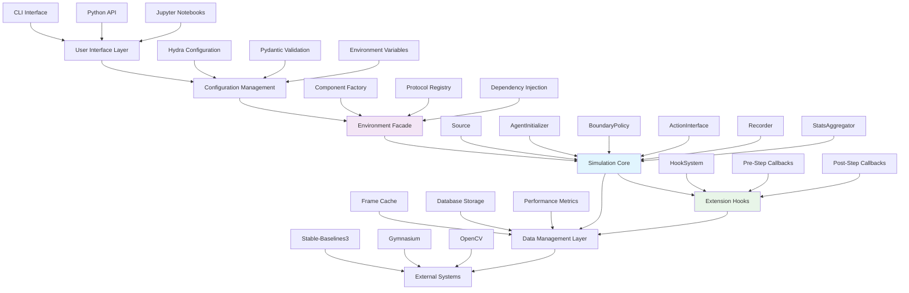

### 4.1.2 Core Business Processes

#### 4.1.2.1 CLI Command Execution Workflow (updated)

<span style="background-color: rgba(91, 57, 243, 0.2)">The CLI interface serves as the primary entry point for batch processing and automated workflows, supporting the system's research acceleration objective. Enhanced with new recording and statistics capabilities for comprehensive experimental data management.</span>

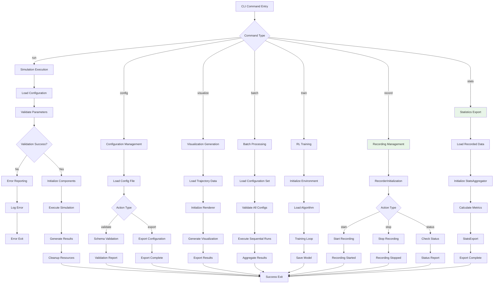

#### 4.1.2.2 Simulation Execution Workflow (updated)

<span style="background-color: rgba(91, 57, 243, 0.2)">The core simulation workflow implements the primary research functionality with protocol-driven component architecture, comprehensive recording capabilities, and extensible hook system for customization.</span>

```mermaid
flowchart TD
    A[Simulation Start] --> B[Input Validation]
    B --> B1{Navigator Valid?}
    B1 -->|No| B2[Validation Error]
    B1 -->|Yes| B3{Video Plume Valid?}
    B3 -->|No| B2
    B3 -->|Yes| C[Configuration Processing]
    
    C --> C1[Load SimulationConfig]
    C1 --> C2[Initialize Performance Monitor]
    C2 --> C3[AgentInitializer.generate_positions]
    C3 --> C4[SourceProtocol Instantiation]
    C4 --> C5[Allocate Trajectory Storage]
    C5 --> C6{Custom Hooks Registered?}
    C6 -->|Yes| C7[Initialize HookSystem]
    C6 -->|No| C8[Initialize Recorder]
    C7 --> C8
    C8 --> C9[Initialize StatsAggregator]
    C9 --> C10{Visualization Enabled?}
    C10 -->|Yes| C11[Initialize Visualizer]
    C10 -->|No| C12[Initialize Database]
    C11 --> C12
    
    C12 --> D[Main Simulation Loop]
    D --> D1[Execute Pre-Step Hooks]
    D1 --> D2[Check Termination Conditions]
    D2 --> D3{Continue?}
    D3 -->|No| D4[Finalize Results]
    D3 -->|Yes| D5[Frame Retrieval]
    
    D5 --> D6[ActionInterface.translate]
    D6 --> D7[BoundaryPolicy.apply]
    D7 --> D8{Boundary Valid?}
    D8 -->|No| D9[Error Recovery]
    D8 -->|Yes| D10[Navigator State Update]
    
    D10 --> D11[Odor Sampling]
    D11 --> D12[Recorder.write]
    D12 --> D13[StatsAggregator.update]
    D13 --> D14[Performance Tracking]
    D14 --> D15{SLA Met?}
    D15 -->|No| D16[Performance Warning]
    D15 -->|Yes| D17[Create Checkpoint]
    D16 --> D17
    
    D17 --> D18[Execute Post-Step Hooks]
    D18 --> D19[Update Statistics]
    D19 --> D1
    
    D4 --> E[Compile Results]
    E --> E1[SimulationResults Object]
    E1 --> E2[Cleanup Resources]
    E2 --> F[Simulation Complete]
    
    B2 --> G[Error Exit]
    D9 --> D10
    
    style D6 fill:#e8f5e8
    style D7 fill:#e8f5e8
    style D12 fill:#e8f5e8
    style D13 fill:#e8f5e8
    style C3 fill:#e8f5e8
    style C4 fill:#e8f5e8
    style C6 fill:#e8f5e8
    style C7 fill:#e8f5e8
    style D1 fill:#e8f5e8
    style D18 fill:#e8f5e8
```

#### 4.1.2.3 RL Training Workflow

The reinforcement learning training pipeline provides state-of-the-art algorithm integration with performance optimization.

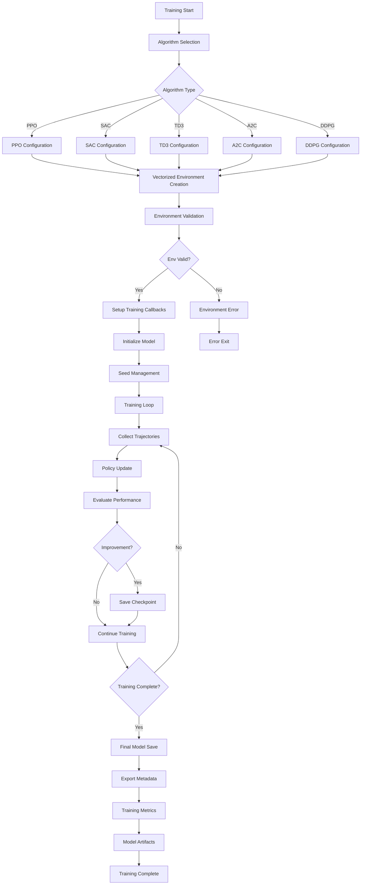

### 4.1.3 Integration Workflows

#### 4.1.3.1 Frame Caching System Workflow

The frame caching system provides critical performance optimization for video-based simulations.

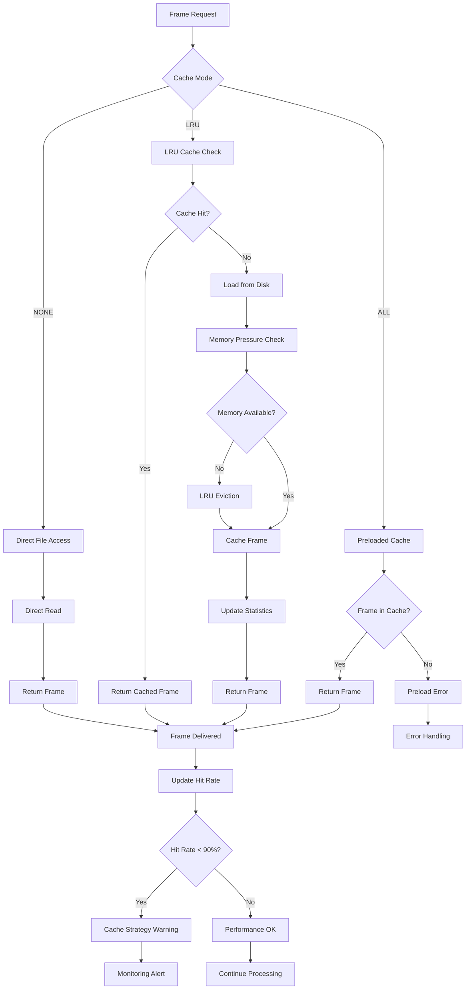

#### 4.1.3.2 Configuration Management Workflow (updated)

<span style="background-color: rgba(91, 57, 243, 0.2)">The configuration system ensures reproducible experiments with hierarchical parameter management, now supporting the new protocol-based component architecture with dedicated configuration groups for each major subsystem.</span>

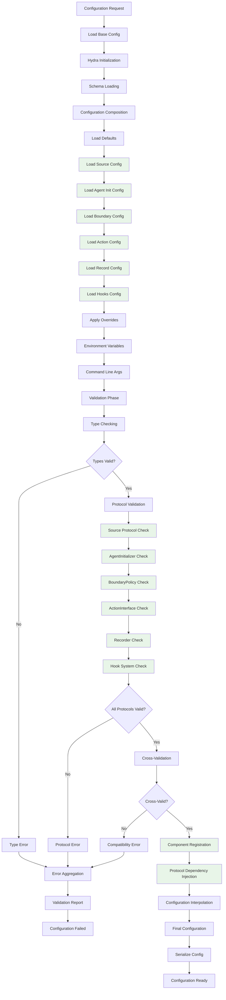

#### 4.1.3.3 Database Persistence Workflow

The database persistence layer provides optional long-term storage for experimental results.

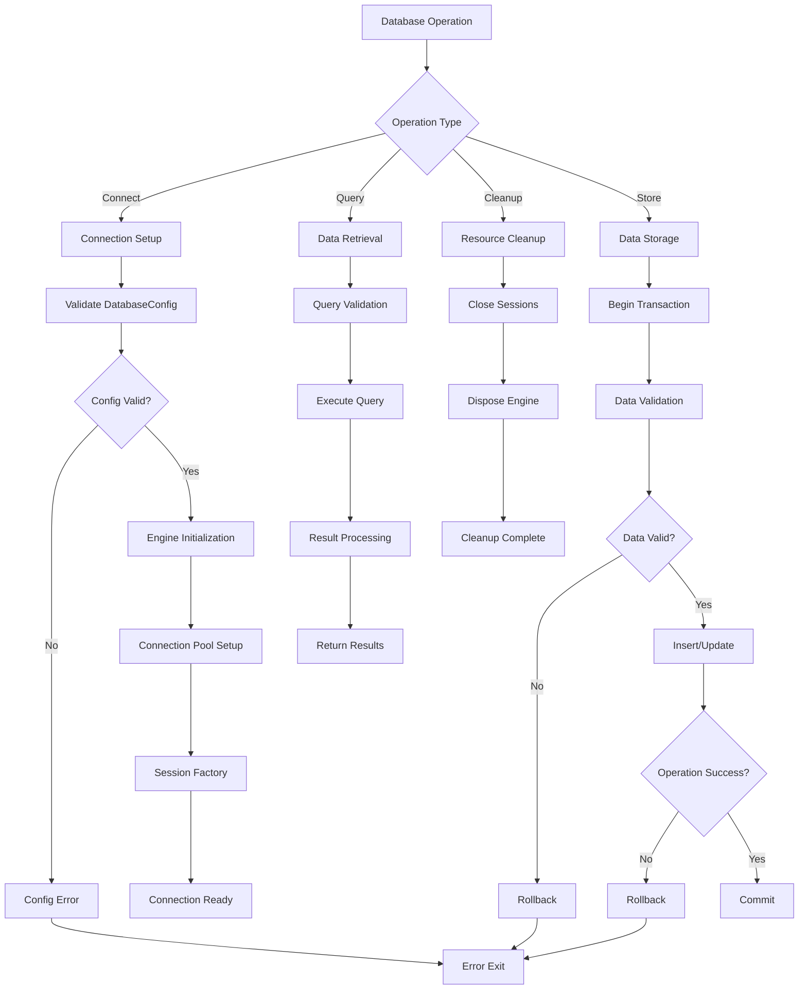

### 4.1.4 Protocol-Based Component Workflows (updated)

#### 4.1.4.1 Source Protocol Workflow

<span style="background-color: rgba(91, 57, 243, 0.2)">The Source Protocol provides flexible odor source modeling through pluggable implementations, supporting research into various source configurations and dynamics.</span>

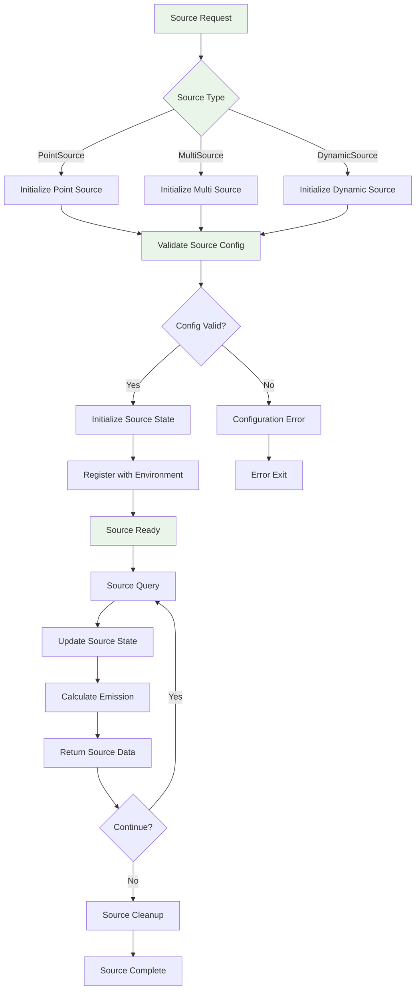

#### 4.1.4.2 Recorder Protocol Workflow

<span style="background-color: rgba(91, 57, 243, 0.2)">The Recorder Protocol enables comprehensive experimental data capture with multiple storage backends and performance-optimized buffering strategies.</span>

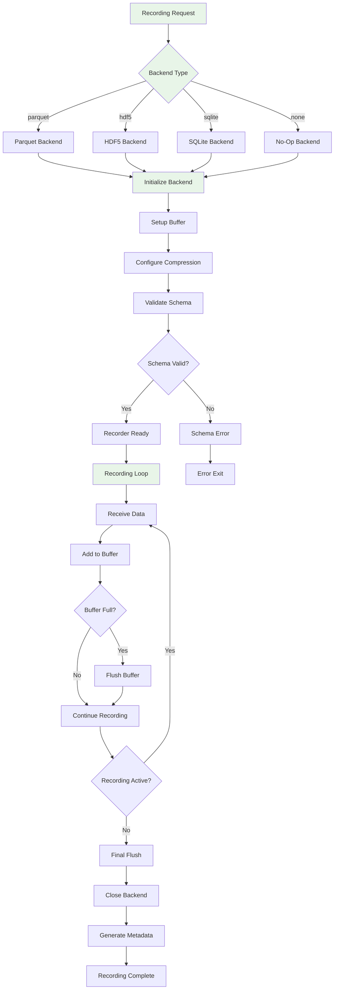

### 4.1.5 Error Handling and Recovery Workflows

#### 4.1.5.1 Protocol Error Recovery

<span style="background-color: rgba(91, 57, 243, 0.2)">The protocol-based architecture includes comprehensive error handling with graceful degradation and recovery mechanisms for robust operation.</span>

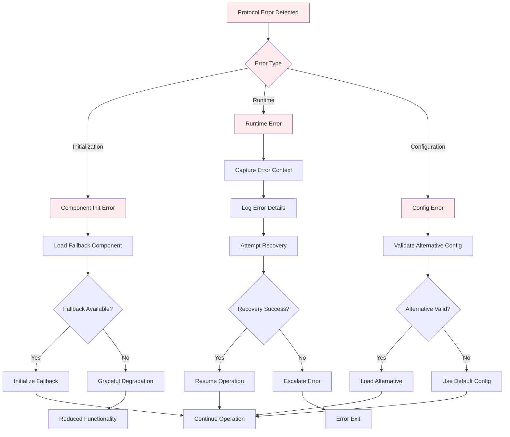

#### 4.1.5.2 Performance SLA Monitoring

The performance monitoring system ensures compliance with the <33ms per simulation step requirement while providing detailed metrics for optimization.

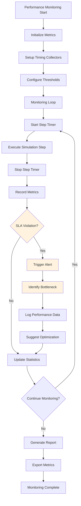

## 4.2 STATE MANAGEMENT AND ERROR HANDLING

### 4.2.1 Simulation State Transitions

The simulation system maintains strict state management for reliability and debugging.

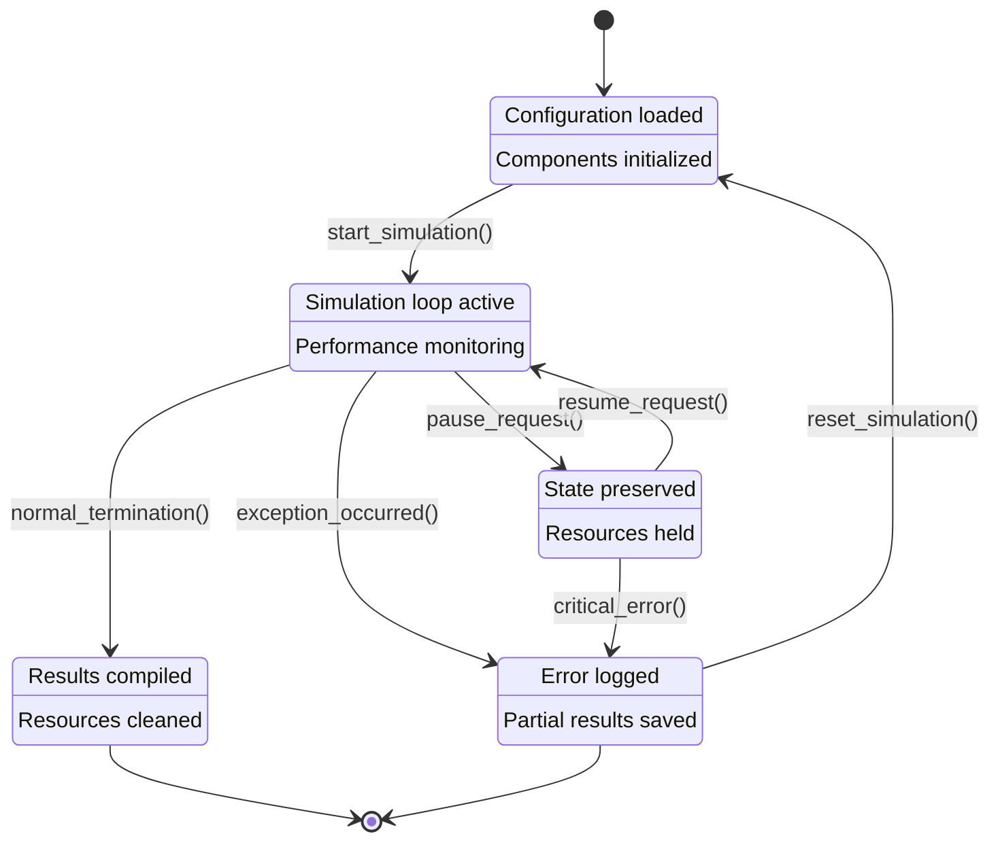

### 4.2.2 Error Handling and Recovery Workflows

#### 4.2.2.1 Simulation Error Recovery

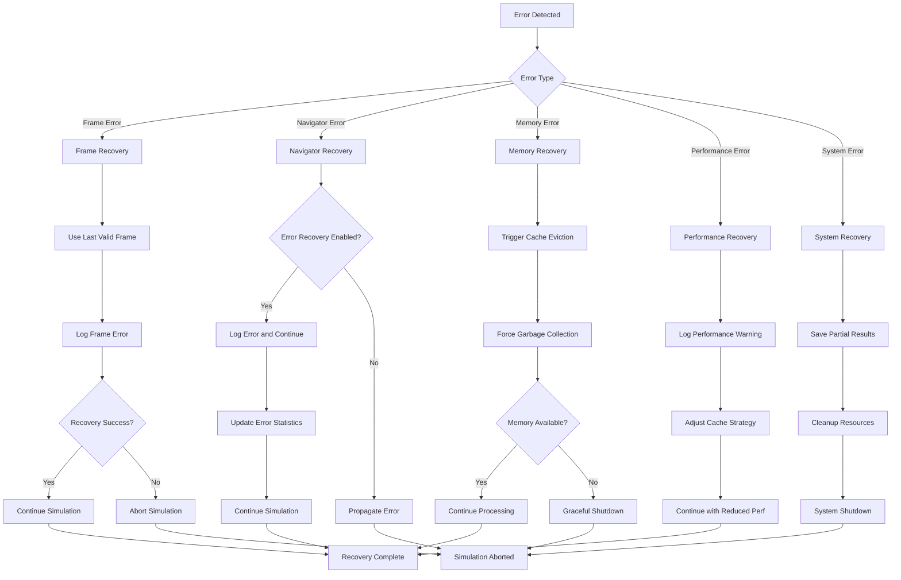

#### 4.2.2.2 Database Error Recovery

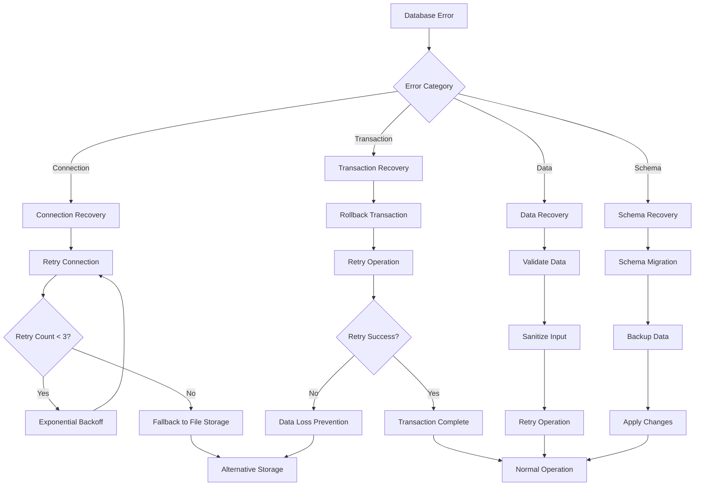

### 4.2.3 Performance Monitoring and SLA Enforcement

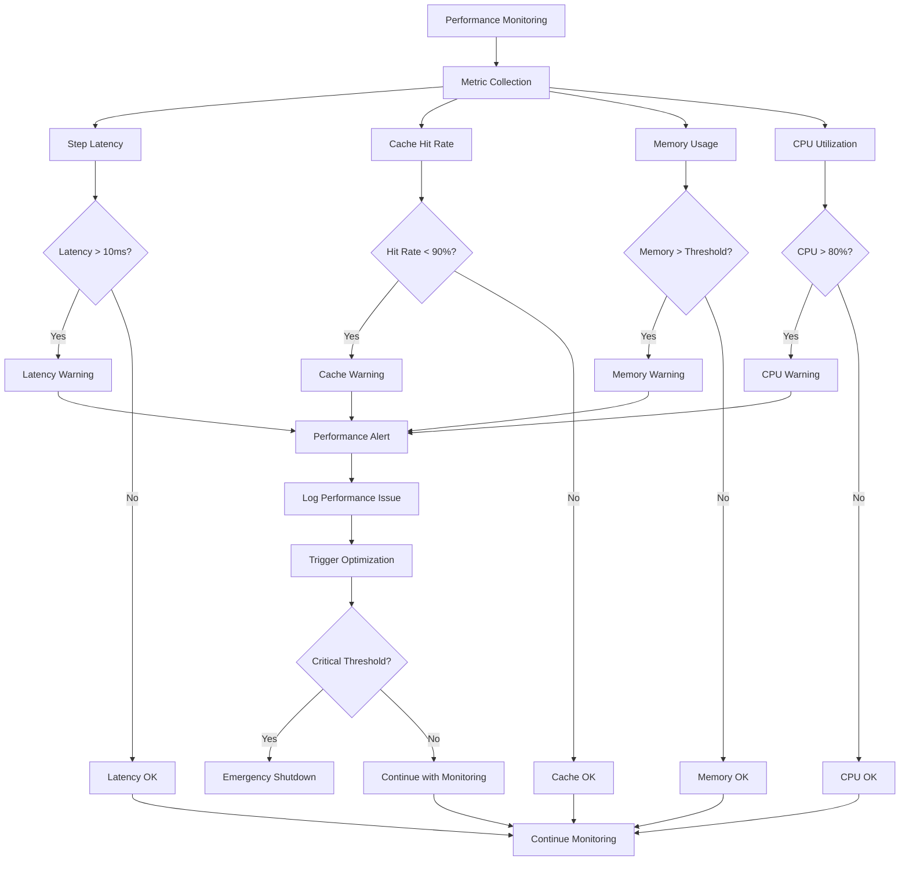

## 4.3 VALIDATION RULES AND CHECKPOINTS

### 4.3.1 Configuration Validation Workflow

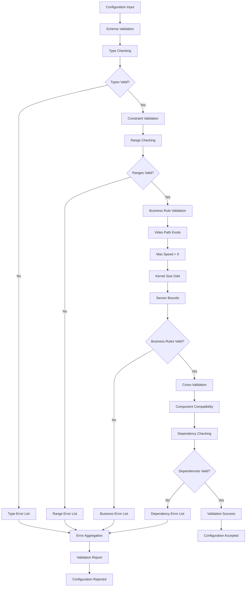

### 4.3.2 Runtime Validation Checkpoints

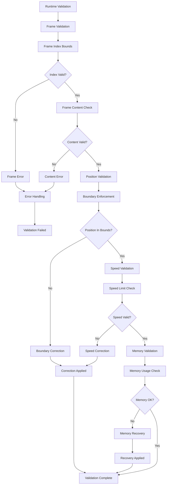

### 4.3.3 Authorization and Security Checkpoints

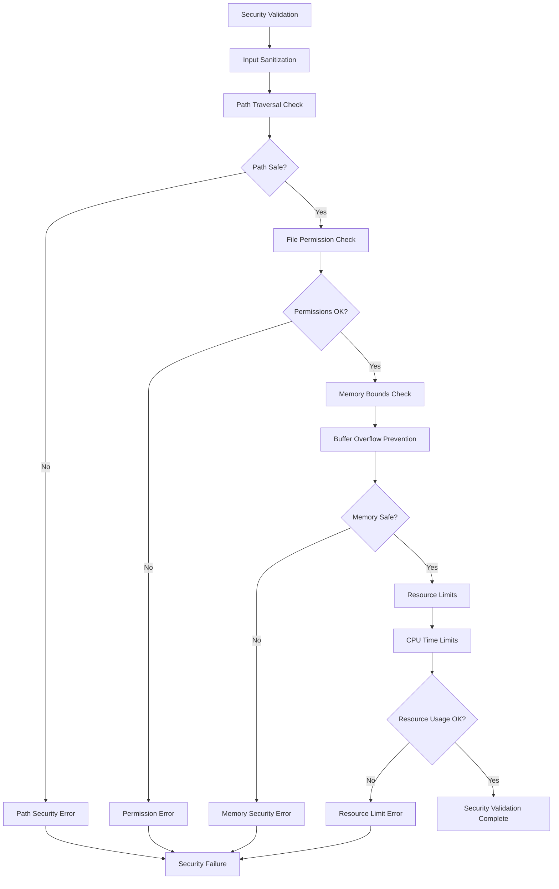

## 4.4 TECHNICAL IMPLEMENTATION FLOWS

### 4.4.1 Navigator Creation and Protocol Compliance (updated)

<span style="background-color: rgba(91, 57, 243, 0.2)">The Navigator creation workflow has been enhanced to support the new protocol-based component architecture with dependency injection, agent initialization strategies, and comprehensive seed management for deterministic reproducibility.</span>

```mermaid
flowchart TD
    A[Navigator Creation Request] --> B[Parameter Analysis]
    B --> B1{Single vs Multi Agent?}
    B1 -->|Single| B2[Single Agent Detection]
    B1 -->|Multi| B3[Multi Agent Detection]
    
    B2 --> B4[Select AgentInitializer]
    B3 --> B5[Select AgentInitializer]
    
    B4 --> B6[AgentInitializer Instantiation]
    B5 --> B7[AgentInitializer Instantiation]
    
    B6 --> B8[Generate Agent Positions]
    B7 --> B9[Generate Agent Positions]
    
    B8 --> B10[SingleAgentController]
    B9 --> B11[MultiAgentController]
    
    B10 --> C[Configuration Merging]
    B11 --> C
    
    C --> C1[Direct Parameters]
    C1 --> C2[Hydra Configuration]
    C2 --> C3[Default Values]
    C3 --> D[Pydantic Validation]
    
    D --> D1[Schema Compliance]
    D1 --> D2{Schema Valid?}
    D2 -->|No| D3[Validation Error]
    D2 -->|Yes| D4[Resolve Dependencies]
    
    D4 --> D5[Instantiate Source via Hydra]
    D5 --> D6[Instantiate BoundaryPolicy via Hydra]
    D6 --> D7[Instantiate ActionInterface via Hydra]
    D7 --> D8[Controller Instantiation]
    
    D8 --> D9[Inject Source & BoundaryPolicy]
    D9 --> D10[Navigator Protocol Setup]
    D10 --> E[Seed Management]
    
    E --> E1[Initialize Component Seeds]
    E1 --> E2[Seed Injected Components]
    E2 --> E3[Reproducibility Setup]
    E3 --> F[Performance Monitoring]
    
    F --> F1[Initialize Monitors]
    F1 --> F2{Init Time < 2s?}
    F2 -->|No| F3[Performance Warning]
    F2 -->|Yes| F4[Navigator Ready]
    
    D3 --> G[Creation Failed]
    F3 --> H[Ready with Warning]
    F4 --> I[Navigator Created]
    
    style B4 fill:#e8f5e8
    style B5 fill:#e8f5e8
    style B6 fill:#e8f5e8
    style B7 fill:#e8f5e8
    style B8 fill:#e8f5e8
    style B9 fill:#e8f5e8
    style D4 fill:#e8f5e8
    style D5 fill:#e8f5e8
    style D6 fill:#e8f5e8
    style D7 fill:#e8f5e8
    style D9 fill:#e8f5e8
    style D10 fill:#e8f5e8
    style E1 fill:#e8f5e8
    style E2 fill:#e8f5e8
```

#### 4.4.1.1 Agent Initialization Strategy Selection (updated)

<span style="background-color: rgba(91, 57, 243, 0.2)">The agent initialization process now supports multiple positioning strategies through the AgentInitializer protocol, enabling diverse experimental setups from uniform random distributions to dataset-derived starting positions.</span>

```mermaid
flowchart TD
    A[Agent Initialization Request] --> B{Initialization Strategy}
    B -->|uniform_random| B1[Uniform Random Strategy]
    B -->|grid| B2[Grid Strategy]
    B -->|fixed_list| B3[Fixed List Strategy]
    B -->|from_dataset| B4[Dataset Strategy]
    
    B1 --> C1[Generate Random Positions]
    B2 --> C2[Calculate Grid Layout]
    B3 --> C3[Load Position List]
    B4 --> C4[Query Dataset]
    
    C1 --> D[Validate Positions]
    C2 --> D
    C3 --> D
    C4 --> D
    
    D --> D1{Positions Valid?}
    D1 -->|No| D2[Position Error]
    D1 -->|Yes| D3[Feed to Controller]
    
    D3 --> E[Controller Receives Positions]
    E --> F[Initialization Complete]
    
    D2 --> G[Error Exit]
    
    style A fill:#e8f5e8
    style B fill:#e8f5e8
    style D3 fill:#e8f5e8
```

#### 4.4.1.2 Dependency Resolution Process (updated)

<span style="background-color: rgba(91, 57, 243, 0.2)">The dependency resolution workflow ensures proper instantiation of all protocol-based components through Hydra's dependency injection system, maintaining strict separation between configuration and implementation.</span>

```mermaid
flowchart TD
    A[Dependency Resolution Start] --> B[Source Component]
    B --> B1[Hydra Factory: Source]
    B1 --> B2[SourceProtocol Validation]
    B2 --> B3{Source Valid?}
    B3 -->|No| B4[Source Error]
    B3 -->|Yes| C[BoundaryPolicy Component]
    
    C --> C1[Hydra Factory: BoundaryPolicy]
    C1 --> C2[BoundaryPolicyProtocol Validation]
    C2 --> C3{BoundaryPolicy Valid?}
    C3 -->|No| C4[BoundaryPolicy Error]
    C3 -->|Yes| D[ActionInterface Component]
    
    D --> D1[Hydra Factory: ActionInterface]
    D1 --> D2[ActionInterfaceProtocol Validation]
    D2 --> D3{ActionInterface Valid?}
    D3 -->|No| D4[ActionInterface Error]
    D3 -->|Yes| E[Dependencies Resolved]
    
    E --> E1[Inject into Controller]
    E1 --> F[Resolution Complete]
    
    B4 --> G[Error Aggregation]
    C4 --> G
    D4 --> G
    G --> H[Resolution Failed]
    
    style A fill:#e8f5e8
    style B fill:#e8f5e8
    style C fill:#e8f5e8
    style D fill:#e8f5e8
    style E fill:#e8f5e8
    style E1 fill:#e8f5e8
```

#### 4.4.1.3 Seed Management for Reproducibility (updated)

<span style="background-color: rgba(91, 57, 243, 0.2)">Enhanced seed management ensures deterministic reproducibility across all injected components, satisfying scientific reproducibility requirements through comprehensive seeding of every protocol-based component.</span>

```mermaid
flowchart TD
    A[Seed Management Start] --> B[Primary Seed Initialization]
    B --> B1[Generate Component Seeds]
    B1 --> B2[Seed Source Component]
    B2 --> B3[Seed BoundaryPolicy Component]
    B3 --> B4[Seed ActionInterface Component]
    B4 --> B5[Seed AgentInitializer Component]
    B5 --> B6[Seed Controller Component]
    B6 --> B7[Seed Recorder Component]
    B7 --> B8[Seed StatsAggregator Component]
    B8 --> C[Validate Seed Propagation]
    
    C --> C1{All Components Seeded?}
    C1 -->|No| C2[Seed Error]
    C1 -->|Yes| C3[Record Seed State]
    
    C3 --> C4[Create Seed Snapshot]
    C4 --> C5[Store Reproducibility Data]
    C5 --> D[Seed Management Complete]
    
    C2 --> E[Error Exit]
    
    style A fill:#e8f5e8
    style B1 fill:#e8f5e8
    style B2 fill:#e8f5e8
    style B3 fill:#e8f5e8
    style B4 fill:#e8f5e8
    style B5 fill:#e8f5e8
    style B6 fill:#e8f5e8
    style B7 fill:#e8f5e8
    style B8 fill:#e8f5e8
    style C3 fill:#e8f5e8
```

### 4.4.2 Plugin System and Component Discovery (updated)

<span style="background-color: rgba(91, 57, 243, 0.2)">The plugin discovery system has been expanded to support the comprehensive protocol-based architecture, enabling automatic detection and registration of all major system components including the new Source, AgentInitializer, BoundaryPolicy, ActionInterface, Recorder, and StatsAggregator protocols.</span>

```mermaid
flowchart TD
    A[Plugin Discovery] --> B[Module Scanning]
    B --> B1[Scan Entry Points]
    B1 --> B2[Load Plugin Modules]
    B2 --> B3[Decorator Detection]
    
    B3 --> C[Protocol Validation]
    C --> C1[Check PlumeModelProtocol]
    C1 --> C2[Check WindFieldProtocol]
    C2 --> C3[Check SensorProtocol]
    C3 --> C4[Check SourceProtocol]
    C4 --> C5[Check AgentInitializerProtocol]
    C5 --> C6[Check BoundaryPolicyProtocol]
    C6 --> C7[Check ActionInterfaceProtocol]
    C7 --> C8[Check RecorderProtocol]
    C8 --> C9[Check StatsAggregatorProtocol]
    C9 --> C10{Protocol Compliance?}
    
    C10 -->|No| C11[Skip Plugin]
    C10 -->|Yes| C12[Registration]
    
    C12 --> D[Hydra Registration]
    D --> D1[Create Config Schema]
    D1 --> D2[Register with Hydra]
    D2 --> D3[Plugin Available]
    
    C11 --> E[Plugin Rejected]
    D3 --> F[Plugin Ready]
    
    F --> G[Runtime Instantiation]
    G --> G1[Hydra Factory Call]
    G1 --> G2[Dependency Injection]
    G2 --> G3[Component Created]
    
    style C4 fill:#e8f5e8
    style C5 fill:#e8f5e8
    style C6 fill:#e8f5e8
    style C7 fill:#e8f5e8
    style C8 fill:#e8f5e8
    style C9 fill:#e8f5e8
```

#### 4.4.2.1 Protocol Registration Matrix (updated)

<span style="background-color: rgba(91, 57, 243, 0.2)">The expanded protocol registration system now handles nine distinct protocol types, each with specific validation requirements and registration procedures to ensure system integrity and component interoperability.</span>

```mermaid
flowchart TD
    A[Protocol Registration] --> B[Protocol Type Detection]
    B --> B1{Protocol Type}
    
    B1 -->|PlumeModel| C1[PlumeModelProtocol Registration]
    B1 -->|WindField| C2[WindFieldProtocol Registration]
    B1 -->|Sensor| C3[SensorProtocol Registration]
    B1 -->|Source| C4[SourceProtocol Registration]
    B1 -->|AgentInitializer| C5[AgentInitializerProtocol Registration]
    B1 -->|BoundaryPolicy| C6[BoundaryPolicyProtocol Registration]
    B1 -->|ActionInterface| C7[ActionInterfaceProtocol Registration]
    B1 -->|Recorder| C8[RecorderProtocol Registration]
    B1 -->|StatsAggregator| C9[StatsAggregatorProtocol Registration]
    
    C1 --> D[Validate Interface Methods]
    C2 --> D
    C3 --> D
    C4 --> D
    C5 --> D
    C6 --> D
    C7 --> D
    C8 --> D
    C9 --> D
    
    D --> D1{Methods Valid?}
    D1 -->|No| D2[Registration Error]
    D1 -->|Yes| D3[Generate Config Schema]
    
    D3 --> D4[Register with Hydra]
    D4 --> D5[Component Available]
    
    D2 --> E[Error Exit]
    D5 --> F[Registration Complete]
    
    style C4 fill:#e8f5e8
    style C5 fill:#e8f5e8
    style C6 fill:#e8f5e8
    style C7 fill:#e8f5e8
    style C8 fill:#e8f5e8
    style C9 fill:#e8f5e8
```

### 4.4.3 Frame Cache Optimization Flow

```mermaid
flowchart TD
    A[Cache Optimization] --> B[Strategy Selection]
    B --> B1{Memory Available?}
    B1 -->|High| B2[ALL Strategy]
    B1 -->|Medium| B3[LRU Strategy]
    B1 -->|Low| B4[NONE Strategy]
    
    B2 --> C[Preload All Frames]
    C --> C1[Sequential Loading]
    C1 --> C2[Memory Monitoring]
    C2 --> C3{Memory Pressure?}
    C3 -->|Yes| C4[Reduce Preload]
    C3 -->|No| C5[Preload Complete]
    
    B3 --> D[LRU Cache Setup]
    D --> D1[Size Calculation]
    D1 --> D2[Eviction Policy]
    D2 --> D3[Cache Ready]
    
    B4 --> E[Direct Access Mode]
    E --> E1[No Caching]
    E1 --> E2[Direct File I/O]
    
    C4 --> F[Adaptive Strategy]
    C5 --> G[High Performance Mode]
    D3 --> H[Balanced Mode]
    E2 --> I[Minimal Memory Mode]
    
    F --> J[Performance Monitoring]
    G --> J
    H --> J
    I --> J
    
    J --> J1[Hit Rate Tracking]
    J1 --> J2[Latency Measurement]
    J2 --> J3{SLA Met?}
    J3 -->|No| J4[Strategy Adjustment]
    J3 -->|Yes| J5[Optimal Performance]
    
    J4 --> B
```

### 4.4.4 Reinforcement Learning Environment Workflow

```mermaid
flowchart TD
    A[RL Environment Setup] --> B[Gymnasium Availability]
    B --> B1{Gymnasium Available?}
    B1 -->|No| B2[Gymnasium Error]
    B1 -->|Yes| B3[Configuration Merging]
    
    B3 --> C[Frame Cache Validation]
    C --> C1{Cache Provided?}
    C1 -->|Yes| C2[Validate Cache]
    C1 -->|No| C3[No Cache Mode]
    
    C2 --> C4{Cache Valid?}
    C4 -->|No| C5[Cache Error]
    C4 -->|Yes| D[API Compatibility]
    C3 --> D
    
    D --> D1[Detect API Version]
    D1 --> D2{Legacy Gym?}
    D2 -->|Yes| D3[Legacy Wrapper]
    D2 -->|No| D4[Modern Gymnasium]
    
    D3 --> E[4-tuple Returns]
    D4 --> F[5-tuple Returns]
    
    E --> G[Environment Creation]
    F --> G
    
    G --> G1[GymnasiumEnv Instantiation]
    G1 --> G2[Observation Space Setup]
    G2 --> G3[Action Space Setup]
    G3 --> G4[Reward Function Setup]
    G4 --> H[Environment Registration]
    
    H --> H1[Register with Gymnasium]
    H1 --> H2{Registration Success?}
    H2 -->|No| H3[Registration Error]
    H2 -->|Yes| H4[Environment Ready]
    
    B2 --> I[Setup Failed]
    C5 --> I
    H3 --> I
    H4 --> J[Environment Available]
```

### 4.4.5 Component Lifecycle Management

The component lifecycle management system ensures proper initialization, execution, and cleanup of all protocol-based components throughout the simulation lifecycle.

```mermaid
flowchart TD
    A[Component Lifecycle Start] --> B[Initialization Phase]
    B --> B1[Component Factory Creation]
    B1 --> B2[Protocol Validation]
    B2 --> B3[Dependency Resolution]
    B3 --> B4[Resource Allocation]
    B4 --> C[Execution Phase]
    
    C --> C1[Component Activation]
    C1 --> C2[State Synchronization]
    C2 --> C3[Performance Monitoring]
    C3 --> C4[Error Handling]
    C4 --> C5{Continue Execution?}
    C5 -->|Yes| C1
    C5 -->|No| D[Cleanup Phase]
    
    D --> D1[State Persistence]
    D1 --> D2[Resource Deallocation]
    D2 --> D3[Component Deactivation]
    D3 --> D4[Memory Cleanup]
    D4 --> E[Lifecycle Complete]
    
    style B1 fill:#e8f5e8
    style B2 fill:#e8f5e8
    style B3 fill:#e8f5e8
    style C1 fill:#e8f5e8
    style C2 fill:#e8f5e8
    style D1 fill:#e8f5e8
    style D2 fill:#e8f5e8
    style D3 fill:#e8f5e8
```

### 4.4.6 Error Handling and Recovery Flows

The system implements comprehensive error handling strategies with graceful degradation and recovery mechanisms to ensure robust operation under various failure conditions.

```mermaid
flowchart TD
    A[Error Detection] --> B{Error Category}
    B -->|Initialization| C[Init Error Handler]
    B -->|Runtime| D[Runtime Error Handler]
    B -->|Configuration| E[Config Error Handler]
    B -->|Protocol| F[Protocol Error Handler]
    
    C --> C1[Component Fallback]
    C1 --> C2[Retry Initialization]
    C2 --> C3{Retry Success?}
    C3 -->|Yes| C4[Resume Operation]
    C3 -->|No| C5[Degraded Mode]
    
    D --> D1[Capture Error Context]
    D1 --> D2[Log Error Details]
    D2 --> D3[Attempt Recovery]
    D3 --> D4{Recovery Success?}
    D4 -->|Yes| D5[Continue Processing]
    D4 -->|No| D6[Graceful Shutdown]
    
    E --> E1[Load Default Config]
    E1 --> E2[Validate Configuration]
    E2 --> E3{Config Valid?}
    E3 -->|Yes| E4[Apply Configuration]
    E3 -->|No| E5[Minimal Configuration]
    
    F --> F1[Protocol Compliance Check]
    F1 --> F2[Interface Validation]
    F2 --> F3{Interface Valid?}
    F3 -->|Yes| F4[Register Component]
    F3 -->|No| F5[Reject Component]
    
    C4 --> G[Operation Restored]
    C5 --> H[Reduced Functionality]
    D5 --> G
    D6 --> I[System Shutdown]
    E4 --> G
    E5 --> H
    F4 --> G
    F5 --> J[Component Rejected]
    
    style A fill:#ffebee
    style B fill:#ffebee
    style C fill:#ffebee
    style D fill:#ffebee
    style E fill:#ffebee
    style F fill:#ffebee
```

### 4.4.7 Performance Optimization Workflows

The performance optimization system ensures compliance with real-time constraints while maintaining comprehensive monitoring and adaptive optimization strategies.

```mermaid
flowchart TD
    A[Performance Monitoring] --> B[Baseline Establishment]
    B --> B1[Initialize Timers]
    B1 --> B2[Set SLA Thresholds]
    B2 --> B3[Begin Monitoring]
    
    B3 --> C[Step-Level Monitoring]
    C --> C1[Pre-Step Timing]
    C1 --> C2[Component Timing]
    C2 --> C3[Post-Step Timing]
    C3 --> C4[Aggregate Metrics]
    
    C4 --> C5{SLA Violation?}
    C5 -->|Yes| C6[Performance Alert]
    C5 -->|No| C7[Update Statistics]
    
    C6 --> C8[Bottleneck Analysis]
    C8 --> C9[Optimization Suggestion]
    C9 --> C10[Apply Optimization]
    C10 --> C7
    
    C7 --> C11{Continue Monitoring?}
    C11 -->|Yes| C1
    C11 -->|No| C12[Generate Report]
    
    C12 --> D[Export Performance Data]
    D --> D1[Performance Summary]
    D1 --> E[Monitoring Complete]
    
    style C5 fill:#fff3e0
    style C6 fill:#fff3e0
    style C8 fill:#fff3e0
    style C9 fill:#fff3e0
    style C10 fill:#fff3e0
```

## 4.5 INTEGRATION SEQUENCE DIAGRAMS

### 4.5.1 End-to-End Simulation Sequence (updated)

```mermaid
sequenceDiagram
    participant U as User
    participant CLI as CLI Interface
    participant Config as Configuration
    participant Nav as Navigator
    participant Plume as Plume Model
    participant Cache as Frame Cache
    participant Monitor as Performance Monitor
    participant Recorder as Recorder
    participant StatsAggregator as StatsAggregator
    participant HookManager as HookManager
    participant DB as Database
    
    U->>CLI: odor-plume-nav run
    CLI->>Config: load_configuration()
    Config->>Config: validate_config()
    Config-->>CLI: validated_config
    
    CLI->>Nav: create_navigator(config)
    Nav->>Nav: initialize_controller()
    Nav-->>CLI: navigator_instance
    
    CLI->>Plume: create_video_plume(config)
    Plume->>Cache: initialize_cache()
    Cache-->>Plume: cache_ready
    Plume-->>CLI: plume_instance
    
    CLI->>Monitor: start_monitoring()
    CLI->>Recorder: initialize_recorder()
    CLI->>StatsAggregator: initialize_stats()
    
    opt Hook System Registered
        CLI->>HookManager: initialize_hooks()
        HookManager-->>CLI: hooks_ready
    end
    
    CLI->>DB: initialize_database()
    
    loop Simulation Steps
        CLI->>Monitor: step_start()
        
        opt Hook System Active
            CLI->>HookManager: pre_step(state)
        end
        
        CLI->>Cache: get_frame(index)
        Cache-->>CLI: frame_data
        
        CLI->>Nav: step(frame_data)
        Nav->>Plume: sample_odor(position)
        Plume-->>Nav: concentration
        Nav-->>CLI: new_state
        
        CLI->>Recorder: write_step(state)
        CLI->>StatsAggregator: update(step_metrics)
        
        opt Hook System Active
            CLI->>HookManager: post_step(state)
        end
        
        CLI->>Monitor: step_end()
        Monitor->>Monitor: check_sla()
        alt SLA Violation
            Monitor->>U: degradation_warning
        end
        
        CLI->>DB: store_trajectory(state)
    end
    
    CLI->>StatsAggregator: finalize()
    Recorder->>CLI: close()
    CLI->>Monitor: finalize_metrics()
    CLI->>DB: close_session()
    CLI-->>U: simulation_complete
```

### 4.5.2 RL Training Integration Sequence

```mermaid
sequenceDiagram
    participant Trainer as RL Training
    participant Env as Gymnasium Environment
    participant SB3 as Stable-Baselines3
    participant Nav as Navigator
    participant Plume as Plume Model
    participant Cache as Frame Cache
    
    Trainer->>Env: create_gymnasium_environment()
    Env->>Nav: initialize_navigator()
    Env->>Plume: initialize_plume_model()
    Env->>Cache: setup_frame_cache()
    
    Trainer->>SB3: initialize_algorithm(env)
    SB3->>Env: reset()
    Env->>Nav: reset_state()
    Env-->>SB3: initial_observation
    
    loop Training Episodes
        SB3->>Env: step(action)
        Env->>Nav: apply_action(action)
        Env->>Cache: get_current_frame()
        Cache-->>Env: frame_data
        
        Env->>Plume: sample_odor(position)
        Plume-->>Env: concentration
        
        Env->>Env: calculate_reward()
        Env->>Env: check_termination()
        Env-->>SB3: obs, reward, done, info
        
        alt Episode Done
            SB3->>Env: reset()
            Env->>Nav: reset_state()
            Env-->>SB3: new_observation
        end
    end
    
    Trainer->>SB3: save_model()
    Trainer->>Trainer: export_metrics()
```

### 4.5.3 Error Handling and Recovery Sequence

```mermaid
sequenceDiagram
    participant Sim as Simulation
    participant Error as Error Handler
    participant Cache as Frame Cache
    participant Monitor as Performance Monitor
    participant Log as Logger
    
    Sim->>Cache: get_frame(index)
    Cache-->>Sim: frame_error
    
    Sim->>Error: handle_frame_error()
    Error->>Cache: get_last_valid_frame()
    Cache-->>Error: last_frame
    Error->>Log: log_error(frame_error)
    Error-->>Sim: recovery_frame
    
    Sim->>Monitor: record_error()
    Monitor->>Monitor: check_error_rate()
    
    alt Error Rate High
        Monitor->>Error: critical_error_threshold()
        Error->>Sim: emergency_shutdown()
        Error->>Log: log_critical_error()
    else Error Rate Normal
        Monitor-->>Sim: continue_processing
    end
    
    Sim->>Sim: continue_with_recovery()
```

### 4.5.4 Data Recording and Statistics Workflow

<span style="background-color: rgba(91, 57, 243, 0.2)">The data recording and statistics workflow implements comprehensive experimental data capture and analysis capabilities, supporting research reproducibility and accelerated analysis through automated metrics collection and multi-format persistence.</span>

```mermaid
sequenceDiagram
    participant Sim as Simulation Engine
    participant Recorder as Recorder
    participant StatsAggregator as StatsAggregator
    participant Buffer as Buffer Manager
    participant Backend as Storage Backend
    participant Exporter as Data Exporter
    
    Sim->>Recorder: initialize_recorder(config)
    Recorder->>Backend: setup_storage_backend()
    Backend->>Buffer: create_buffer(size)
    Buffer-->>Backend: buffer_ready
    Backend-->>Recorder: backend_initialized
    
    Sim->>StatsAggregator: initialize_stats(config)
    StatsAggregator->>StatsAggregator: setup_metric_collectors()
    StatsAggregator-->>Sim: aggregator_ready
    
    loop Simulation Episodes
        loop Episode Steps
            Sim->>Recorder: write_step(trajectory_data)
            Recorder->>Buffer: append_data(trajectory_data)
            
            alt Buffer Full
                Buffer->>Backend: flush_buffer()
                Backend->>Backend: persist_data()
                Backend-->>Buffer: flush_complete
            end
            
            Sim->>StatsAggregator: update(step_metrics)
            StatsAggregator->>StatsAggregator: accumulate_metrics()
        end
        
        StatsAggregator->>StatsAggregator: calculate_episode_stats()
    end
    
    Sim->>StatsAggregator: finalize()
    StatsAggregator->>StatsAggregator: compute_summary_statistics()
    StatsAggregator->>Exporter: export_summary_report()
    Exporter-->>StatsAggregator: export_complete
    
    Sim->>Recorder: close()
    Recorder->>Buffer: final_flush()
    Buffer->>Backend: flush_remaining_data()
    Backend->>Backend: close_storage()
    Backend-->>Recorder: storage_closed
    Recorder-->>Sim: recording_complete
```

### 4.5.5 Hook System Integration Sequence

<span style="background-color: rgba(91, 57, 243, 0.2)">The hook system provides extensible customization points throughout the simulation lifecycle, enabling researchers to inject custom behavior without modifying core system components. This supports advanced debugging, data collection, and experimental customization scenarios.</span>

```mermaid
sequenceDiagram
    participant Sim as Simulation Engine
    participant HookManager as Hook Manager
    participant PreHook as Pre-Step Hook
    participant PostHook as Post-Step Hook
    participant CustomHook as Custom Hook
    participant Logger as Hook Logger
    
    Sim->>HookManager: initialize_hooks(config)
    HookManager->>HookManager: discover_registered_hooks()
    
    opt Pre-Step Hooks Available
        HookManager->>PreHook: validate_hook_interface()
        PreHook-->>HookManager: hook_valid
        HookManager->>PreHook: initialize_hook()
    end
    
    opt Post-Step Hooks Available
        HookManager->>PostHook: validate_hook_interface()
        PostHook-->>HookManager: hook_valid
        HookManager->>PostHook: initialize_hook()
    end
    
    opt Custom Hooks Available
        HookManager->>CustomHook: validate_hook_interface()
        CustomHook-->>HookManager: hook_valid
        HookManager->>CustomHook: initialize_hook()
    end
    
    HookManager-->>Sim: hooks_initialized
    
    loop Simulation Steps
        Sim->>HookManager: pre_step(simulation_state)
        
        opt Pre-Step Hooks Active
            HookManager->>PreHook: execute(simulation_state)
            PreHook->>Logger: log_pre_step_data()
            PreHook-->>HookManager: pre_step_complete
        end
        
        opt Custom Hooks Active
            HookManager->>CustomHook: execute(simulation_state)
            CustomHook-->>HookManager: custom_hook_complete
        end
        
        HookManager-->>Sim: pre_step_complete
        
        Note over Sim: Core simulation step execution
        
        Sim->>HookManager: post_step(simulation_state)
        
        opt Post-Step Hooks Active
            HookManager->>PostHook: execute(simulation_state)
            PostHook->>Logger: log_post_step_data()
            PostHook-->>HookManager: post_step_complete
        end
        
        HookManager-->>Sim: post_step_complete
    end
    
    Sim->>HookManager: finalize_hooks()
    HookManager->>PreHook: cleanup()
    HookManager->>PostHook: cleanup()
    HookManager->>CustomHook: cleanup()
    HookManager-->>Sim: hooks_finalized
```

### 4.5.6 Performance Monitoring and SLA Enforcement Sequence

<span style="background-color: rgba(91, 57, 243, 0.2)">The performance monitoring system ensures compliance with real-time constraints while providing comprehensive metrics collection and automatic degradation warnings. Enhanced with direct user notification upon SLA violations to support proactive performance management.</span>

```mermaid
sequenceDiagram
    participant U as User
    participant Monitor as Performance Monitor
    participant Sim as Simulation Engine
    participant Metrics as Metrics Collector
    participant Analyzer as Performance Analyzer
    participant Alerter as Alert System
    
    Sim->>Monitor: start_monitoring()
    Monitor->>Metrics: initialize_collectors()
    Monitor->>Analyzer: set_sla_thresholds()
    Analyzer->>Alerter: configure_alert_channels()
    Monitor-->>Sim: monitoring_active
    
    loop Simulation Steps
        Sim->>Monitor: step_start()
        Monitor->>Metrics: start_step_timer()
        
        Note over Sim: Execute simulation step
        
        Sim->>Monitor: step_end()
        Monitor->>Metrics: stop_step_timer()
        Monitor->>Metrics: collect_step_metrics()
        
        Monitor->>Analyzer: analyze_performance(metrics)
        Analyzer->>Analyzer: check_sla_compliance()
        
        alt SLA Violation Detected
            Analyzer->>Alerter: trigger_sla_alert()
            Alerter->>U: degradation_warning
            Alerter->>Monitor: log_sla_violation()
            Monitor->>Monitor: increment_violation_count()
        else Performance Normal
            Monitor->>Monitor: update_performance_statistics()
        end
        
        Monitor->>Analyzer: check_critical_threshold()
        
        alt Critical Performance Degradation
            Analyzer->>Alerter: trigger_critical_alert()
            Alerter->>U: critical_performance_warning
            Alerter->>Sim: recommend_emergency_shutdown()
        end
    end
    
    Sim->>Monitor: finalize_metrics()
    Monitor->>Metrics: export_performance_report()
    Monitor->>Analyzer: generate_sla_compliance_report()
    Monitor-->>Sim: monitoring_complete
```

### 4.5.7 Multi-Agent Coordination Sequence

The multi-agent coordination system manages complex interactions between multiple navigation agents, supporting advanced research scenarios with coordinated behaviors and shared environmental awareness.

```mermaid
sequenceDiagram
    participant Env as Environment
    participant Controller as Multi-Agent Controller
    participant Agent1 as Agent 1
    participant Agent2 as Agent 2
    participant Coordinator as Agent Coordinator
    participant Plume as Plume Model
    
    Env->>Controller: initialize_multi_agent(config)
    Controller->>Agent1: initialize_agent(agent_config)
    Controller->>Agent2: initialize_agent(agent_config)
    Controller->>Coordinator: setup_coordination(agents)
    
    loop Simulation Steps
        Env->>Controller: step(actions)
        
        Controller->>Coordinator: coordinate_actions(actions)
        Coordinator->>Coordinator: resolve_conflicts()
        Coordinator-->>Controller: coordinated_actions
        
        par Agent 1 Processing
            Controller->>Agent1: apply_action(action1)
            Agent1->>Plume: sample_odor(position1)
            Plume-->>Agent1: concentration1
            Agent1-->>Controller: new_state1
        and Agent 2 Processing
            Controller->>Agent2: apply_action(action2)
            Agent2->>Plume: sample_odor(position2)
            Plume-->>Agent2: concentration2
            Agent2-->>Controller: new_state2
        end
        
        Controller->>Coordinator: update_shared_state(states)
        Coordinator->>Coordinator: compute_coordination_metrics()
        Coordinator-->>Controller: coordination_complete
        
        Controller-->>Env: combined_observations
    end
    
    Controller->>Coordinator: finalize_coordination()
    Coordinator-->>Controller: coordination_finalized
```

### 4.5.8 Protocol-Based Component Lifecycle Sequence

<span style="background-color: rgba(91, 57, 243, 0.2)">The protocol-based component lifecycle ensures proper initialization, validation, and integration of all pluggable system components through dependency injection, supporting the system's extensible architecture with comprehensive error handling and graceful degradation capabilities.</span>

```mermaid
sequenceDiagram
    participant Factory as Component Factory
    participant Registry as Protocol Registry
    participant Validator as Protocol Validator
    participant Injector as Dependency Injector
    participant Component as Protocol Component
    participant Monitor as Lifecycle Monitor
    
    Factory->>Registry: discover_protocols()
    Registry->>Registry: scan_entry_points()
    Registry->>Validator: validate_protocol_compliance()
    
    loop For Each Protocol Type
        Validator->>Component: check_interface_methods()
        Component-->>Validator: interface_validation_result
        
        alt Validation Success
            Validator->>Registry: register_component()
            Registry->>Injector: prepare_injection_config()
        else Validation Failure
            Validator->>Monitor: log_validation_error()
            Monitor->>Monitor: update_failure_metrics()
        end
    end
    
    Factory->>Injector: request_component_instance()
    Injector->>Registry: resolve_dependencies()
    Registry->>Injector: dependency_graph
    
    Injector->>Component: create_instance(config)
    Component->>Component: initialize_component()
    Component->>Monitor: register_lifecycle_callbacks()
    Component-->>Injector: component_ready
    
    Injector->>Factory: inject_dependencies()
    Factory->>Monitor: component_lifecycle_start()
    
    loop Component Operational Phase
        Monitor->>Component: health_check()
        Component-->>Monitor: health_status
        
        alt Component Healthy
            Monitor->>Monitor: update_health_metrics()
        else Component Unhealthy
            Monitor->>Factory: trigger_component_recovery()
            Factory->>Component: attempt_recovery()
        end
    end
    
    Factory->>Monitor: component_lifecycle_end()
    Monitor->>Component: cleanup_resources()
    Component->>Registry: deregister_component()
    Component-->>Factory: lifecycle_complete
```

## 4.6 PERFORMANCE OPTIMIZATION FLOWS

### 4.6.1 Cache Performance Optimization

```mermaid
flowchart TD
    A[Performance Analysis] --> B[Cache Metrics Review]
    B --> B1[Current Hit Rate]
    B1 --> B2[Memory Usage]
    B2 --> B3[Access Patterns]
    B3 --> C{Hit Rate < 90%?}
    
    C -->|Yes| C1[Optimization Needed]
    C -->|No| C2[Performance Acceptable]
    
    C1 --> D[Strategy Adjustment]
    D --> D1{Memory Available?}
    D1 -->|Yes| D2[Increase Cache Size]
    D1 -->|No| D3[Improve Eviction Policy]
    
    D2 --> D4[Expand LRU Cache]
    D4 --> D5[Monitor Impact]
    
    D3 --> D6[Analyze Access Patterns]
    D6 --> D7[Optimize Eviction]
    D7 --> D8[Implement Prefetching]
    
    D5 --> E[Performance Measurement]
    D8 --> E
    
    E --> E1[Measure New Hit Rate]
    E1 --> E2{Improvement > 5%?}
    E2 -->|Yes| E3[Optimization Success]
    E2 -->|No| E4[Try Alternative Strategy]
    
    E4 --> D
    E3 --> F[Continue Monitoring]
    C2 --> F
```

### 4.6.2 Memory Management and Garbage Collection

```mermaid
flowchart TD
    A[Memory Management] --> B[Memory Monitoring]
    B --> B1[Current Usage]
    B1 --> B2[Growth Rate]
    B2 --> B3[Allocation Patterns]
    B3 --> C{Memory Pressure?}
    
    C -->|Yes| C1[Immediate Action]
    C -->|No| C2[Preventive Measures]
    
    C1 --> D[Emergency Cleanup]
    D --> D1[Force Garbage Collection]
    D1 --> D2[Cache Eviction]
    D2 --> D3[Buffer Reduction]
    D3 --> D4{Memory Released?}
    
    D4 -->|Yes| D5[Continue Operation]
    D4 -->|No| D6[Graceful Shutdown]
    
    C2 --> E[Optimization]
    E --> E1[Optimize Data Structures]
    E1 --> E2[Reduce Allocations]
    E2 --> E3[Implement Pooling]
    
    D5 --> F[Monitor Recovery]
    E3 --> F
    F --> F1[Track Memory Usage]
    F1 --> F2{Stable?}
    F2 -->|Yes| F3[Optimization Complete]
    F2 -->|No| F4[Continue Monitoring]
    
    D6 --> G[System Shutdown]
    F3 --> H[Normal Operation]
```

### 4.6.3 Concurrent Processing and Vectorization

```mermaid
flowchart TD
    A[Performance Optimization] --> B[Vectorization Analysis]
    B --> B1[Identify Serial Operations]
    B1 --> B2[NumPy Vectorization]
    B2 --> B3[Batch Processing]
    B3 --> C[Parallel Processing]
    
    C --> C1[Multi-Agent Support]
    C1 --> C2[Vectorized Operations]
    C2 --> C3[SIMD Optimization]
    C3 --> D[Performance Measurement]
    
    D --> D1[Benchmark Vectorized Code]
    D1 --> D2[Compare to Serial]
    D2 --> D3{Speedup > 2x?}
    
    D3 -->|Yes| D4[Optimization Success]
    D3 -->|No| D5[Identify Bottlenecks]
    
    D5 --> E[Profiling Analysis]
    E --> E1[CPU Profiling]
    E1 --> E2[Memory Profiling]
    E2 --> E3[I/O Analysis]
    E3 --> F[Optimization Strategy]
    
    F --> F1[JIT Compilation]
    F1 --> F2[Caching Strategy]
    F2 --> F3[Algorithm Changes]
    F3 --> D
    
    D4 --> G[Production Deployment]
```

## 4.7 COMPLIANCE AND VALIDATION FLOWS

### 4.7.1 Regulatory Compliance Workflow

```mermaid
flowchart TD
    A[Compliance Check] --> B[Data Privacy Validation]
    B --> B1[PII Detection]
    B1 --> B2{PII Found?}
    B2 -->|Yes| B3[Anonymization Required]
    B2 -->|No| B4[Privacy Compliant]
    
    B3 --> B5[Apply Anonymization]
    B5 --> B6[Validate Anonymization]
    B6 --> B7{Anonymization Valid?}
    B7 -->|No| B8[Anonymization Error]
    B7 -->|Yes| B4
    
    B4 --> C[Security Compliance]
    C --> C1[Encryption Verification]
    C1 --> C2[Access Control Check]
    C2 --> C3[Audit Logging]
    C3 --> C4{Security Compliant?}
    
    C4 -->|No| C5[Security Violation]
    C4 -->|Yes| C6[Security Approved]
    
    C6 --> D[Data Retention]
    D --> D1[Retention Policy Check]
    D1 --> D2[Automatic Cleanup]
    D2 --> D3[Compliance Report]
    
    B8 --> E[Compliance Failure]
    C5 --> E
    D3 --> F[Compliance Success]
```

### 4.7.2 Quality Assurance Workflow

```mermaid
flowchart TD
    A[QA Process] --> B[Automated Testing]
    B --> B1[Unit Test Execution]
    B1 --> B2[Integration Testing]
    B2 --> B3[Performance Testing]
    B3 --> B4{All Tests Pass?}
    
    B4 -->|No| B5[Test Failure Analysis]
    B4 -->|Yes| B6[Automated QA Pass]
    
    B5 --> B7[Bug Report Generation]
    B7 --> B8[Developer Notification]
    B8 --> B9[Fix and Retest]
    B9 --> B1
    
    B6 --> C[Manual QA Review]
    C --> C1[Functionality Verification]
    C1 --> C2[Usability Testing]
    C2 --> C3[Documentation Review]
    C3 --> C4{Manual QA Pass?}
    
    C4 -->|No| C5[Manual QA Issues]
    C4 -->|Yes| C6[QA Approved]
    
    C5 --> C7[Issue Documentation]
    C7 --> C8[Revision Required]
    C8 --> A
    
    C6 --> D[Release Approval]
```

### 4.7.3 Performance SLA Validation

```mermaid
flowchart TD
    A[SLA Validation] --> B[Performance Metrics]
    B --> B1[Step Latency Check]
    B1 --> B2{Latency < 10ms?}
    B2 -->|No| B3[Latency SLA Violation]
    B2 -->|Yes| B4[Latency SLA Met]
    
    B4 --> C[Cache Performance]
    C --> C1[Hit Rate Check]
    C1 --> C2{Hit Rate > 90%?}
    C2 -->|No| C3[Cache SLA Violation]
    C2 -->|Yes| C4[Cache SLA Met]
    
    C4 --> D[Memory Efficiency]
    D --> D1[Memory Usage Check]
    D1 --> D2{Memory Linear?}
    D2 -->|No| D3[Memory SLA Violation]
    D2 -->|Yes| D4[Memory SLA Met]
    
    D4 --> E[Training Speed]
    E --> E1[Training Performance]
    E1 --> E2{Speedup > 3x?}
    E2 -->|No| E3[Training SLA Violation]
    E2 -->|Yes| E4[Training SLA Met]
    
    B3 --> F[SLA Violation Report]
    C3 --> F
    D3 --> F
    E3 --> F
    
    E4 --> G[All SLAs Met]
    
    F --> F1[Performance Optimization]
    F1 --> F2[Root Cause Analysis]
    F2 --> F3[Optimization Implementation]
    F3 --> A
    
    G --> H[SLA Compliance Confirmed]
```

#### References

The following files and components were analyzed to create this comprehensive process flowchart documentation:

- `src/odor_plume_nav/cli/main.py` - CLI command implementation and workflow orchestration
- `src/odor_plume_nav/core/simulation.py` - Core simulation execution logic and state management
- `src/odor_plume_nav/api/navigation.py` - Public API factory functions and component creation
- `src/odor_plume_nav/environments/gymnasium_env.py` - RL environment wrapper and integration
- `src/odor_plume_nav/rl/training.py` - RL training pipeline and algorithm orchestration
- `src/odor_plume_nav/cache/frame_cache.py` - Frame caching implementation and optimization
- `src/odor_plume_nav/db/session.py` - Database persistence layer and transaction management
- `src/odor_plume_nav/services/validator.py` - Configuration validation and error handling
- `src/` - Root source code structure analysis
- `src/odor_plume_nav/` - Main package architecture exploration
- `src/plume_nav_sim/` - Modular simulation component analysis
- `src/plume_nav_sim/models/` - Plugin system and model implementations

Technical specification sections referenced:
- Section 1.2 System Overview - System capabilities and performance requirements
- Section 2.1 Feature Catalog - Complete feature descriptions and dependencies
- Section 2.2 Functional Requirements Table - Detailed performance and validation requirements
- Section 2.3 Feature Relationships - Component integration and dependency mapping

# 5. SYSTEM ARCHITECTURE

## 5.1 HIGH-LEVEL ARCHITECTURE

### 5.1.1 System Overview

The Plume Navigation Simulation Library employs a <span style="background-color: rgba(91, 57, 243, 0.2)">**protocol-driven three-layer architecture**</span> that enables modular composition of navigation experiments while maintaining strict type safety and performance guarantees. <span style="background-color: rgba(91, 57, 243, 0.2)">The architecture follows a layered design pattern with clear separation of concerns across three distinct tiers:</span>

**<span style="background-color: rgba(91, 57, 243, 0.2)">Three-Layer Architecture Model:</span>**
- **<span style="background-color: rgba(91, 57, 243, 0.2)">Simulation Core</span>**: <span style="background-color: rgba(91, 57, 243, 0.2)">Pure physics and kinematics engine with no domain-specific logic, ensuring reusable computational foundation</span>
- **<span style="background-color: rgba(91, 57, 243, 0.2)">Environment Facade</span>**: <span style="background-color: rgba(91, 57, 243, 0.2)">Protocol-driven component orchestration layer that mediates between external interfaces and simulation core</span>
- **<span style="background-color: rgba(91, 57, 243, 0.2)">Extension Hook Layer</span>**: <span style="background-color: rgba(91, 57, 243, 0.2)">Configurable extension points enabling zero-code customization through dependency injection</span>

**Architecture Style:** Modular Plugin Architecture with Protocol-Based Composition
- **Rationale:** Enables researchers to compose experiments from pluggable components without modifying core logic, addressing the legacy system limitation of rigid video-only implementations
- **Key Principles:**
  - <span style="background-color: rgba(91, 57, 243, 0.2)">Protocol-based contracts ensure component compatibility at compile time with all domain-specific logic living outside the core</span>
  - Dependency injection via Hydra enables zero-code component selection
  - <span style="background-color: rgba(91, 57, 243, 0.2)">Performance optimization through vectorized operations and optional JIT compilation targeting ≤33 ms/step SLA with 100-agent scalability</span>
  - Dual API compatibility supporting both legacy Gym and modern Gymnasium

**<span style="background-color: rgba(91, 57, 243, 0.2)">Zero-Code Extensibility Framework:</span>**
<span style="background-color: rgba(91, 57, 243, 0.2)">The system implements runtime plugin discovery through Hydra's component factory pattern, enabling researchers to extend functionality without code modifications. The framework automatically discovers and instantiates components from configuration files, supporting dynamic composition of Source, AgentInitializer, BoundaryPolicy, ActionInterface, Recorder, and StatsAggregator implementations. This architecture eliminates the need for code changes when switching between experimental configurations, supporting the research acceleration objective of 3-5x faster experimental iteration.</span>

**System Boundaries:**
- **Input Interface:** Video frames, YAML configuration files, CLI commands
- **Processing Core:** Navigation controllers, plume physics models, sensor abstractions
- **Output Interface:** Gymnasium environments, trajectory data, performance metrics
- **External Dependencies:** Stable-Baselines3, OpenCV, NumPy, Hydra, Pydantic
- **<span style="background-color: rgba(91, 57, 243, 0.2)">Reproducibility Controls</span>**: <span style="background-color: rgba(91, 57, 243, 0.2)">Deterministic seeding across all random number generators, immutable configuration snapshotting per experimental run, standardized output directory structure organized by run_id/episode_id hierarchy</span>

**Major Interfaces:**
- NavigatorProtocol: Defines agent state management and movement control
- PlumeModelProtocol: Specifies odor concentration field modeling with analytical and video-based implementations
- WindFieldProtocol: Environmental wind dynamics interface for turbulent flow modeling
- SensorProtocol: Agent perception and sensing capabilities with noise and drift modeling
- Gymnasium Environment API: RL training integration with automatic version detection
- **<span style="background-color: rgba(91, 57, 243, 0.2)">SourceProtocol</span>**: <span style="background-color: rgba(91, 57, 243, 0.2)">Pluggable odor source abstractions supporting PointSource, MultiSource, and DynamicSource implementations</span>
- **<span style="background-color: rgba(91, 57, 243, 0.2)">AgentInitializerProtocol</span>**: <span style="background-color: rgba(91, 57, 243, 0.2)">Configurable agent starting position strategies including uniform_random, grid, fixed_list, and from_dataset patterns</span>
- **<span style="background-color: rgba(91, 57, 243, 0.2)">BoundaryPolicyProtocol</span>**: <span style="background-color: rgba(91, 57, 243, 0.2)">Domain edge handling strategies with terminate, bounce, wrap, and clip behavior options</span>
- **<span style="background-color: rgba(91, 57, 243, 0.2)">ActionInterfaceProtocol</span>**: <span style="background-color: rgba(91, 57, 243, 0.2)">Standardized action space translation between RL frameworks and navigation commands</span>
- **<span style="background-color: rgba(91, 57, 243, 0.2)">RecorderProtocol</span>**: <span style="background-color: rgba(91, 57, 243, 0.2)">Comprehensive data persistence with multiple backend support (parquet, hdf5, sqlite, none)</span>
- **<span style="background-color: rgba(91, 57, 243, 0.2)">StatsAggregatorProtocol</span>**: <span style="background-color: rgba(91, 57, 243, 0.2)">Automated research metrics calculation and standardized summary generation</span>

### 5.1.2 Core Components Table

| Component Name | Primary Responsibility | Key Dependencies | Integration Points |
|---------------|----------------------|------------------|-------------------|
| Navigation Engine | <span style="background-color: rgba(91, 57, 243, 0.2)">Agent state management and vectorized movement control with protocol-driven boundary and action handling</span> | <span style="background-color: rgba(91, 57, 243, 0.2)">NavigatorProtocol, BoundaryPolicyProtocol, ActionInterfaceProtocol, NumPy arrays, Hydra configs</span> | Plume models, sensors, environments |
| Plume Model Plugins | Odor concentration field generation with runtime selection | PlumeModelProtocol, SciPy, optional Numba | Wind fields, navigation, sensors |
| Wind Field System | Environmental dynamics simulation with turbulent flow | WindFieldProtocol, NumPy, optional SciPy | Plume transport, turbulence modeling |
| Sensor Framework | Agent perception modeling with realistic constraints | SensorProtocol, plume state access | Navigation decisions, RL observations |

| Component Name | Primary Responsibility | Key Dependencies | Integration Points |
|---------------|----------------------|------------------|-------------------|
| Environment Wrapper | Gymnasium/Gym API compliance with automatic detection | gymnasium.Env, compatibility layer | RL frameworks, navigation, visualization |
| Frame Cache | High-performance video frame access with adaptive strategies | LRU/ALL strategies, psutil monitoring | Video plume adapter, environments |
| Configuration System | Hierarchical parameter management with validation | Hydra, OmegaConf, Pydantic schemas | All components via dependency injection |
| Performance Monitor | Real-time metrics collection and SLA enforcement | Loguru, psutil, structured logging | Cross-component latency tracking |

| Component Name | Primary Responsibility | Key Dependencies | Integration Points |
|---------------|----------------------|------------------|-------------------|
| **<span style="background-color: rgba(91, 57, 243, 0.2)">Source Module</span>** | <span style="background-color: rgba(91, 57, 243, 0.2)">Pluggable odor source modeling with dynamic emission control</span> | <span style="background-color: rgba(91, 57, 243, 0.2)">SourceProtocol, NumPy arrays, configuration validation</span> | <span style="background-color: rgba(91, 57, 243, 0.2)">Plume models, environment initialization, recording</span> |
| **<span style="background-color: rgba(91, 57, 243, 0.2)">AgentInitializer</span>** | <span style="background-color: rgba(91, 57, 243, 0.2)">Configurable agent starting position generation</span> | <span style="background-color: rgba(91, 57, 243, 0.2)">AgentInitializerProtocol, NumPy random, domain constraints</span> | <span style="background-color: rgba(91, 57, 243, 0.2)">Environment reset, navigation engine, boundary validation</span> |
| **<span style="background-color: rgba(91, 57, 243, 0.2)">BoundaryPolicy</span>** | <span style="background-color: rgba(91, 57, 243, 0.2)">Domain edge handling with configurable behaviors</span> | <span style="background-color: rgba(91, 57, 243, 0.2)">BoundaryPolicyProtocol, vectorized operations, domain geometry</span> | <span style="background-color: rgba(91, 57, 243, 0.2)">Navigation engine, termination conditions, state validation</span> |
| **<span style="background-color: rgba(91, 57, 243, 0.2)">ActionInterface</span>** | <span style="background-color: rgba(91, 57, 243, 0.2)">RL action space translation and validation</span> | <span style="background-color: rgba(91, 57, 243, 0.2)">ActionInterfaceProtocol, Gymnasium spaces, action validation</span> | <span style="background-color: rgba(91, 57, 243, 0.2)">RL environment, navigation commands, protocol translation</span> |

| Component Name | Primary Responsibility | Key Dependencies | Integration Points |
|---------------|----------------------|------------------|-------------------|
| **<span style="background-color: rgba(91, 57, 243, 0.2)">Recorder System</span>** | <span style="background-color: rgba(91, 57, 243, 0.2)">Comprehensive data persistence with multiple backends</span> | <span style="background-color: rgba(91, 57, 243, 0.2)">RecorderProtocol, pandas, pyarrow, h5py, sqlite3</span> | <span style="background-color: rgba(91, 57, 243, 0.2)">Simulation loop, performance monitoring, data export</span> |
| **<span style="background-color: rgba(91, 57, 243, 0.2)">StatsAggregator</span>** | <span style="background-color: rgba(91, 57, 243, 0.2)">Automated research metrics and summary generation</span> | <span style="background-color: rgba(91, 57, 243, 0.2)">StatsAggregatorProtocol, NumPy statistics, SciPy analysis</span> | <span style="background-color: rgba(91, 57, 243, 0.2)">Episode completion, data recorder, visualization export</span> |
| **<span style="background-color: rgba(91, 57, 243, 0.2)">Debug GUI</span>** | <span style="background-color: rgba(91, 57, 243, 0.2)">Interactive debugging and visualization interface</span> | <span style="background-color: rgba(91, 57, 243, 0.2)">Optional PySide6/Streamlit, visualization pipeline</span> | <span style="background-color: rgba(91, 57, 243, 0.2)">Step-through debugging, state inspection, real-time monitoring</span> |

### 5.1.3 Data Flow Description

The system implements a unidirectional data flow pattern optimized for real-time simulation and reinforcement learning training:

**Primary Data Flows:**
1. **Configuration Flow:** <span style="background-color: rgba(91, 57, 243, 0.2)">YAML configs → Hydra composition → Component factories → Runtime instances → Deterministic seed initialization → Immutable config snapshot</span>
2. **Simulation Flow:** Video frames → Cache → Navigator → Plume sampling → State update
3. **RL Training Flow:** Environment → Agent observation → Policy → Action → Environment step
4. **<span style="background-color: rgba(91, 57, 243, 0.2)">Recording Flow</span>**: <span style="background-color: rgba(91, 57, 243, 0.2)">Simulation state → Recorder protocol → Backend-specific storage → Structured output directories</span>
5. **<span style="background-color: rgba(91, 57, 243, 0.2)">Statistics Flow</span>**: <span style="background-color: rgba(91, 57, 243, 0.2)">Episode completion → StatsAggregator protocol → Metrics calculation → summary.json generation → Optional visualizations</span>

**Integration Patterns:**
- **Dependency Injection:** Hydra instantiates components with resolved configurations and environment variable interpolation
- **Protocol Compliance:** All plugins implement standardized interfaces for type safety and compatibility
- **Event-Driven Updates:** Components react to state changes via performance monitoring callbacks
- **Zero-Copy Operations:** NumPy arrays shared between components for memory efficiency
- **<span style="background-color: rgba(91, 57, 243, 0.2)">Hook Invocation Points</span>**: <span style="background-color: rgba(91, 57, 243, 0.2)">Pre-step, post-step, and episode_end callbacks enable non-invasive system extension</span>

**Data Transformation Points:**
- Video preprocessing: Raw frames → Grayscale conversion → Normalized arrays → Cache storage
- Sensor fusion: Multiple sensor readings → Unified observation vector → RL environment state
- Action processing: RL actions → Navigator control commands → Vectorized state updates
- Metric aggregation: Raw measurements → Statistical summaries → Performance dashboard updates

**Key Data Stores:**
- **Frame Cache:** In-memory LRU or full preload of video frames with >90% hit rate requirement
- **Trajectory Buffer:** Circular buffer for recent agent positions with configurable history depth
- **Configuration Store:** Hydra ConfigStore with registered Pydantic schemas for validation
- **Performance Metrics:** Time-series data for monitoring with <10ms step latency tracking
- **<span style="background-color: rgba(91, 57, 243, 0.2)">Recorder Output Directory</span>**: <span style="background-color: rgba(91, 57, 243, 0.2)">Structured filesystem hierarchy organized by run_id/episode_id for systematic data organization</span>
- **<span style="background-color: rgba(91, 57, 243, 0.2)">Immutable Config Snapshots</span>**: <span style="background-color: rgba(91, 57, 243, 0.2)">YAML/JSON configuration files captured and frozen per experimental run for reproducibility</span>
- **<span style="background-color: rgba(91, 57, 243, 0.2)">Summary Metrics Files</span>**: <span style="background-color: rgba(91, 57, 243, 0.2)">summary.json files generated by StatsAggregator containing standardized research metrics</span>

### 5.1.4 External Integration Points

| System Name | Integration Type | Data Exchange Pattern | Protocol/Format |
|------------|-----------------|---------------------|----------------|
| Stable-Baselines3 | Library Integration | Synchronous API calls | Gymnasium Environment API |
| OpenCV | Video Processing | Frame-by-frame streaming | NumPy arrays with BGR format |
| PostgreSQL/SQLite | Database Persistence | Batch writes, query reads | SQLAlchemy ORM with compression |
| TensorBoard | Metrics Visualization | Async event logging | Protocol buffers with scalar/histogram data |

| System Name | Integration Type | Data Exchange Pattern | Protocol/Format |
|------------|-----------------|---------------------|----------------|
| Weights & Biases | Experiment Tracking | HTTP API calls | JSON/REST with automatic retry |
| Jupyter Notebooks | Interactive Analysis | In-process API | Python objects with live updates |
| Docker Containers | Deployment Platform | Environment variables | YAML configs with volume mounts |
| GitHub Actions | CI/CD Pipeline | File artifacts | YAML workflows with test artifacts |

| System Name | Integration Type | Data Exchange Pattern | Protocol/Format |
|------------|-----------------|---------------------|----------------|
| **<span style="background-color: rgba(91, 57, 243, 0.2)">PyArrow</span>** | <span style="background-color: rgba(91, 57, 243, 0.2)">Columnar Data Engine</span> | <span style="background-color: rgba(91, 57, 243, 0.2)">Parquet file I/O with compression</span> | <span style="background-color: rgba(91, 57, 243, 0.2)">Binary columnar format with schema evolution</span> |
| **<span style="background-color: rgba(91, 57, 243, 0.2)">H5py</span>** | <span style="background-color: rgba(91, 57, 243, 0.2)">Scientific Data Storage</span> | <span style="background-color: rgba(91, 57, 243, 0.2)">Hierarchical data arrays with metadata</span> | <span style="background-color: rgba(91, 57, 243, 0.2)">HDF5 binary format with compression</span> |
| **<span style="background-color: rgba(91, 57, 243, 0.2)">SQLite3</span>** | <span style="background-color: rgba(91, 57, 243, 0.2)">Embedded Database</span> | <span style="background-color: rgba(91, 57, 243, 0.2)">Structured query and transaction</span> | <span style="background-color: rgba(91, 57, 243, 0.2)">SQL with WAL journaling</span> |
| **<span style="background-color: rgba(91, 57, 243, 0.2)">PySide6</span>** | <span style="background-color: rgba(91, 57, 243, 0.2)">Desktop GUI Framework</span> | <span style="background-color: rgba(91, 57, 243, 0.2)">Event-driven UI interactions</span> | <span style="background-color: rgba(91, 57, 243, 0.2)">Qt6 signal/slot architecture</span> |

| System Name | Integration Type | Data Exchange Pattern | Protocol/Format |
|------------|-----------------|---------------------|----------------|
| **<span style="background-color: rgba(91, 57, 243, 0.2)">Streamlit</span>** | <span style="background-color: rgba(91, 57, 243, 0.2)">Web Application Framework</span> | <span style="background-color: rgba(91, 57, 243, 0.2)">HTTP-based dashboard streaming</span> | <span style="background-color: rgba(91, 57, 243, 0.2)">WebSocket with reactive updates</span> |

### 5.1.5 System Architecture Diagram

```mermaid
graph TB
    subgraph "Extension Hook Layer"
        EH[HookSystem]
        PSH[Pre-Step Hooks]
        POSH[Post-Step Hooks]
        EEH[Episode End Hooks]
    end
    
    subgraph "Environment Facade"
        EF[Environment Wrapper]
        CF[Component Factory]
        PR[Protocol Registry]
        DI[Dependency Injection]
    end
    
    subgraph "Simulation Core"
        NE[Navigation Engine]
        PMO[Plume Model Plugins]
        WFS[Wind Field System]
        SF[Sensor Framework]
        FC[Frame Cache]
    end
    
    subgraph "Protocol Components"
        SM[Source Module]
        AI[AgentInitializer]
        BP[BoundaryPolicy]
        AIF[ActionInterface]
        RS[Recorder System]
        SA[StatsAggregator]
    end
    
    subgraph "External Systems"
        SB3[Stable-Baselines3]
        CV[OpenCV]
        DB[(Database)]
        TB[TensorBoard]
        WB[Weights & Biases]
    end
    
    subgraph "Configuration & Monitoring"
        CS[Configuration System]
        PM[Performance Monitor]
        VS[Visualization System]
        DG[Debug GUI]
    end
    
    %% Hook Layer connections
    EH --> EF
    PSH --> EH
    POSH --> EH
    EEH --> EH
    
    %% Environment Facade connections
    EF --> NE
    CF --> EF
    PR --> EF
    DI --> EF
    
    %% Simulation Core connections
    NE --> PMO
    PMO --> WFS
    WFS --> SF
    SF --> FC
    
    %% Protocol Component connections
    SM --> NE
    AI --> EF
    BP --> NE
    AIF --> EF
    RS --> PM
    SA --> RS
    
    %% External integrations
    EF --> SB3
    FC --> CV
    RS --> DB
    PM --> TB
    PM --> WB
    
    %% Configuration and monitoring
    CS --> DI
    PM --> EH
    VS --> DG
    DG --> EF
    
    %% Styling
    classDef coreLayer fill:#e1f5fe,stroke:#01579b,stroke-width:2px
    classDef facadeLayer fill:#f3e5f5,stroke:#4a148c,stroke-width:2px
    classDef hookLayer fill:#e8f5e8,stroke:#1b5e20,stroke-width:2px
    classDef protocolLayer fill:#fff3e0,stroke:#e65100,stroke-width:2px
    classDef externalLayer fill:#fce4ec,stroke:#880e4f,stroke-width:2px
    
    class NE,PMO,WFS,SF,FC coreLayer
    class EF,CF,PR,DI facadeLayer
    class EH,PSH,POSH,EEH hookLayer
    class SM,AI,BP,AIF,RS,SA protocolLayer
    class SB3,CV,DB,TB,WB externalLayer
```

### 5.1.6 Protocol Interaction Diagram

```mermaid
sequenceDiagram
    participant Env as Environment
    participant Nav as Navigator
    participant Src as Source
    participant BP as BoundaryPolicy
    participant AI as ActionInterface
    participant Rec as Recorder
    participant SA as StatsAggregator
    participant Hooks as HookSystem
    
    Note over Env,Hooks: Simulation Step Execution
    
    Env->>Hooks: execute_pre_step_hooks()
    Hooks-->>Env: pre_step_complete
    
    Env->>AI: translate_action(rl_action)
    AI-->>Env: navigation_command
    
    Env->>Nav: step(command)
    Nav->>Src: get_source_state()
    Src-->>Nav: emission_data
    
    Nav->>BP: apply_boundary_policy(position)
    BP-->>Nav: corrected_position
    
    Nav-->>Env: updated_state
    
    Env->>Rec: record_step_data(state)
    Rec-->>Env: recording_complete
    
    Env->>Hooks: execute_post_step_hooks()
    Hooks-->>Env: post_step_complete
    
    opt Episode Complete
        Env->>SA: aggregate_episode_stats(data)
        SA-->>Env: summary_metrics
        
        Env->>Hooks: execute_episode_end_hooks()
        Hooks-->>Env: episode_end_complete
    end
```

## 5.2 COMPONENT DETAILS

### 5.2.1 Navigation Engine (Core)

**Purpose:** Manages agent state and movement dynamics with high-performance vectorized operations supporting single and multi-agent scenarios. <span style="background-color: rgba(91, 57, 243, 0.2)">Boundary handling is now delegated to BoundaryPolicyProtocol implementations, and action translation is handled via ActionInterfaceProtocol for standardized command processing.</span>

**Technologies and Frameworks:**
- Python with NumPy ≥1.26.0 for vectorized computations achieving linear memory scaling
- Optional Numba ≥0.59.0 JIT compilation for critical path optimization
- Hydra 1.3.x for configuration injection and component instantiation

**Key Interfaces and APIs:**
- `NavigatorProtocol`: Core state management API with type-safe method signatures
- `step()`: Update agent positions based on actions with <10ms latency requirement
- `sample_odor()`: Query environmental concentrations with sub-millisecond response
- `reset()`: Initialize episode state with optional seed management

**Data Persistence Requirements:**
- Agent trajectories stored as compressed NumPy arrays with configurable compression ratios
- State snapshots for episode replay capability supporting research reproducibility
- Performance metrics in JSON format with timestamp correlation

**Scaling Considerations:**
- Linear memory scaling with agent count supporting up to 100 concurrent agents
- Vectorized operations leveraging optimized BLAS libraries for performance
- Thread-safe implementation for parallel environment execution
- <span style="background-color: rgba(91, 57, 243, 0.2)">Performance target: ≤33 ms/step with 100 agents through optimized vectorized operations</span>

### 5.2.2 Plume Model Plugins

**Purpose:** Provides pluggable odor concentration field implementations with runtime selection via configuration. <span style="background-color: rgba(91, 57, 243, 0.2)">Sources are now injected via SourceProtocol rather than hard-coded parameters, enabling flexible odor source modeling.</span>

**Technologies and Frameworks:**
- **GaussianPlumeModel:** Analytical solution using SciPy ≥1.11.0 for mathematical functions
- **TurbulentPlumeModel:** Lagrangian filament simulation with optional Numba acceleration
- **VideoPlumeAdapter:** OpenCV ≥4.8.0 based video frame sampling with caching integration

**Key Interfaces and APIs:**
- `concentration_at()`: Spatial concentration queries with coordinate validation
- `step()`: Temporal evolution updates with configurable time steps
- `reset()`: Reinitialize plume state with deterministic seeding

**Data Persistence Requirements:**
- Filament positions for turbulent models with configurable history depth
- Configuration parameters in JSON format for experiment reproducibility
- Performance statistics tracking computation time and memory usage

**Scaling Considerations:**
- GPU acceleration potential for large-scale simulations using CuPy integration
- Memory-performance tradeoffs in filament count with adaptive algorithms
- Cache-friendly data layouts optimized for sequential access patterns
- <span style="background-color: rgba(91, 57, 243, 0.2)">Performance target: ≤33 ms/step with 100 agents through optimized concentration sampling</span>

### 5.2.3 Environment Wrapper

**Purpose:** Provides Gymnasium-compliant RL environment interface with automatic version detection and backward compatibility. <span style="background-color: rgba(91, 57, 243, 0.2)">Integrates Recorder hooks and extra_obs_fn/extra_reward_fn hook system for extensible data collection and reward shaping. Enforces deterministic seeding at reset() for reproducible experiments.</span>

**Technologies and Frameworks:**
- Gymnasium 0.29.x with legacy Gym compatibility via Shimmy ≥1.0.0
- Automatic API version detection supporting both 4-tuple and 5-tuple returns
- Vectorized environment support for efficient parallel training

**Key Interfaces and APIs:**
- Standard Gymnasium methods: `reset()`, `step()`, `render()` with proper typing
- Observation/action space construction with validation and bounds checking
- Reward computation with domain-specific shaping and normalization
- <span style="background-color: rgba(91, 57, 243, 0.2)">`extra_obs_fn()` and `extra_reward_fn()` hooks for dynamic environment extension</span>

**Data Persistence Requirements:**
- Episode trajectories and rewards with configurable storage backends
- Environment configuration snapshots for experiment reproducibility
- Training metrics and logs with structured JSON format
- <span style="background-color: rgba(91, 57, 243, 0.2)">Recorder integration with buffered I/O for minimal performance impact</span>

**Scaling Considerations:**
- Vectorized environments for parallel training with Stable-Baselines3 integration
- Async environment execution support for distributed training scenarios
- Memory-efficient observation buffering with configurable history windows
- <span style="background-color: rgba(91, 57, 243, 0.2)">Performance target: ≤33 ms/step with 100 agents through vectorized environment operations</span>

### 5.2.4 Source Module

**Purpose:** Implements pluggable odor source abstractions via SourceProtocol interface, supporting PointSource, MultiSource, and DynamicSource implementations for flexible source modeling and emission control.

**Technologies and Frameworks:**
- Core module: `src/plume_nav_sim/core/sources.py` with SourceProtocol interface
- NumPy ≥1.26.0 for vectorized source calculations and emission modeling
- Pydantic ≥2.5.0 for source configuration validation and type safety
- Integration with Hydra config group `conf/base/source/` for runtime source selection

**Key Interfaces and APIs:**
- `SourceProtocol`: Core interface defining source emission and position methods
- `get_emission_rate()`: Query source emission strength with temporal variation support
- `get_position()`: Retrieve source coordinates with dynamic positioning capability
- `update_state()`: Temporal evolution for dynamic sources with configurable behavior

**Data Persistence Requirements:**
- Source configuration parameters in JSON format for experiment reproducibility
- Emission history tracking for dynamic sources with configurable retention depth
- Performance metrics for source computation overhead with timing correlation

**Scaling Considerations:**
- Support for multiple simultaneous sources with vectorized emission calculations
- Memory-efficient source state management for long-running simulations
- Configurable source density limits for computational performance optimization
- Performance target: ≤33 ms/step with 100 agents across multi-source scenarios

### 5.2.5 AgentInitializer

**Purpose:** Implements configurable agent initialization patterns via AgentInitializerProtocol interface, supporting uniform_random, grid, fixed_list, and from_dataset strategies for diverse experimental setups.

**Technologies and Frameworks:**
- Core module: `src/plume_nav_sim/core/initialization.py` with strategy implementations
- NumPy ≥1.26.0 for random number generation and spatial arrangement algorithms
- Integration with Hydra config group `conf/base/agent_init/` for initialization strategies
- Deterministic seeding support for reproducible initialization patterns

**Key Interfaces and APIs:**
- `AgentInitializerProtocol`: Core interface defining initialization strategy methods
- `initialize_positions()`: Generate starting positions based on configured strategy
- `validate_domain()`: Ensure generated positions comply with domain constraints
- `reset()`: Reinitialize strategy state with deterministic seeding capability

**Data Persistence Requirements:**
- Initial position configurations stored as NumPy arrays with metadata
- Strategy parameters in JSON format for experiment reproducibility
- Validation results and constraint violations with diagnostic information

**Scaling Considerations:**
- Efficient position generation for large agent populations with vectorized operations
- Memory-optimized storage for initialization patterns with configurable caching
- Thread-safe initialization for parallel environment execution
- Performance target: ≤33 ms/step with 100 agents through optimized initialization algorithms

### 5.2.6 BoundaryPolicy

**Purpose:** Implements pluggable boundary handling via BoundaryPolicyProtocol interface, supporting terminate, bounce, wrap, and clip behaviors for domain edge management and episode termination control.

**Technologies and Frameworks:**
- Core module: `src/plume_nav_sim/core/boundaries.py` with policy implementations
- NumPy ≥1.26.0 for vectorized boundary checking and position correction
- Integration with Hydra config group `conf/base/boundary/` for runtime policy selection
- Geometry validation for complex domain shapes and boundary conditions

**Key Interfaces and APIs:**
- `BoundaryPolicyProtocol`: Core interface defining boundary handling methods
- `apply_policy()`: Execute boundary correction based on agent positions and velocities
- `check_violations()`: Detect boundary violations with sub-millisecond response
- `get_termination_status()`: Determine episode termination based on boundary conditions

**Data Persistence Requirements:**
- Boundary violation events with timestamp and position coordinates
- Policy configuration parameters in JSON format for experiment reproducibility
- Performance metrics for boundary checking overhead with timing correlation

**Scaling Considerations:**
- Vectorized boundary checking for multiple agents with optimized algorithms
- Memory-efficient violation tracking with configurable history depth
- Support for complex domain geometries with spatial indexing optimization
- Performance target: ≤33 ms/step with 100 agents through vectorized boundary operations

### 5.2.7 ActionInterface

**Purpose:** Implements standardized action processing via ActionInterfaceProtocol interface, supporting Continuous2D and CardinalDiscrete action space translations for unified RL framework integration.

**Technologies and Frameworks:**
- Core module: `src/plume_nav_sim/core/actions.py` with action space implementations
- Gymnasium 0.29.x for action space definitions and validation
- Integration with Hydra config group `conf/base/action/` for action space configuration
- Type-safe action translation with validation and bounds checking

**Key Interfaces and APIs:**
- `ActionInterfaceProtocol`: Core interface defining action translation methods
- `translate_action()`: Convert RL actions to navigation commands with validation
- `validate_action()`: Ensure action compliance with space constraints
- `get_action_space()`: Define Gymnasium action space with proper bounds

**Data Persistence Requirements:**
- Action translation logs with input/output correlation for debugging
- Action space configuration parameters in JSON format for reproducibility
- Performance metrics for action processing overhead with timing analysis

**Scaling Considerations:**
- Vectorized action translation for multiple agents with efficient processing
- Memory-optimized action buffering for high-frequency environments
- Support for dynamic action space reconfiguration during training
- Performance target: ≤33 ms/step with 100 agents through optimized action translation

### 5.2.8 Recorder System

**Purpose:** Implements comprehensive data recording via RecorderProtocol interface, supporting multiple backends (parquet, hdf5, sqlite, none) for experiment data persistence with performance-aware buffering and compression.

**Technologies and Frameworks:**
- Core module: `src/plume_nav_sim/recording/` with backend implementations
- Pandas ≥1.5.0 for data structure management and processing
- PyArrow ≥10.0.0 for Parquet backend with columnar storage efficiency
- H5py ≥3.0.0 for HDF5 backend with hierarchical data organization
- SQLite3 for embedded database backend with transaction support

**Key Interfaces and APIs:**
- `RecorderProtocol`: Core interface defining recording methods across backends
- `record_step()`: Capture simulation state with configurable granularity
- `record_episode()`: Store episode-level data with metadata correlation
- `export_data()`: Generate output files with compression and format options

**Data Persistence Requirements:**
- Structured output directories organized by run_id/episode_id hierarchy
- Configurable compression ratios balancing storage efficiency and I/O performance
- Metadata preservation with schema evolution support for long-term storage

**Scaling Considerations:**
- Buffered I/O with configurable buffer sizes for minimal simulation impact
- Multi-threaded recording for parallel data processing and storage
- Memory-efficient data structures with streaming capabilities for large datasets
- Performance target: ≤33 ms/step with 100 agents through optimized buffering and compression

### 5.2.9 StatsAggregator

**Purpose:** Implements automated statistics collection via StatsAggregatorProtocol interface, providing research-focused metrics calculation and summary generation for standardized analysis and publication-quality results.

**Technologies and Frameworks:**
- Core module: `src/plume_nav_sim/analysis/stats.py` with metrics implementations
- NumPy ≥1.26.0 for statistical calculations and array operations
- SciPy ≥1.11.0 for advanced statistical analysis and hypothesis testing
- Integration with Recorder system for data source connectivity

**Key Interfaces and APIs:**
- `StatsAggregatorProtocol`: Core interface defining statistics calculation methods
- `calculate_episode_stats()`: Generate episode-level metrics with error analysis
- `calculate_run_stats()`: Aggregate statistics across multiple episodes
- `export_summary()`: Generate summary.json with standardized metrics format

**Data Persistence Requirements:**
- Summary.json files with standardized research metrics and statistical measures
- Configurable metrics definitions with custom calculation support
- Performance tracking for statistics computation with timing correlation

**Scaling Considerations:**
- Efficient statistical algorithms for large datasets with memory optimization
- Parallel processing support for batch statistics calculation
- Configurable aggregation levels with hierarchical summary generation
- Performance target: ≤33 ms/step with 100 agents through optimized statistical processing

### 5.2.10 Debug GUI

**Purpose:** Implements comprehensive debugging capabilities with GUI and lifecycle hooks, supporting interactive step-through viewer and extensible hook system for accelerated research iteration and real-time state inspection.

**Technologies and Frameworks:**
- Core module: `src/plume_nav_sim/debug/gui.py` with multi-backend support
- PySide6 ≥6.0.0 for desktop GUI framework with Qt6 signal/slot architecture
- Streamlit ≥1.0.0 for web-based dashboard with reactive updates
- Integration with visualization system for real-time rendering and state display

**Key Interfaces and APIs:**
- Interactive step-through controls with pause/resume/step functionality
- Real-time state visualization with configurable update rates
- Hook system integration for custom debugging extensions
- Export capabilities for screenshots and state dumps

**Data Persistence Requirements:**
- Debug session logs with step-by-step state captures
- Screenshot exports with timestamp correlation for documentation
- Configuration snapshots for debug session reproducibility

**Scaling Considerations:**
- Responsive GUI performance with efficient rendering pipelines
- Memory-efficient state inspection with configurable detail levels
- Support for remote debugging sessions with network connectivity
- Performance target: ≤33 ms/step with 100 agents through optimized GUI rendering and state updates

```mermaid
graph TD
    subgraph "Protocol Layer"
        A[NavigatorProtocol] --> B[SingleAgentController]
        A --> C[MultiAgentController]
        D[PlumeModelProtocol] --> E[GaussianPlume]
        D --> F[TurbulentPlume]
        D --> G[VideoPlume]
        H[SensorProtocol] --> I[BinarySensor]
        H --> J[ConcentrationSensor]
        H --> K[GradientSensor]
        L[SourceProtocol] --> M[PointSource]
        L --> N[MultiSource]
        L --> O[DynamicSource]
        P[BoundaryPolicyProtocol] --> Q[TerminatePolicy]
        P --> R[BouncePolicy]
        P --> S[WrapPolicy]
        T[ActionInterfaceProtocol] --> U[Continuous2D]
        T --> V[CardinalDiscrete]
        W[RecorderProtocol] --> X[ParquetBackend]
        W --> Y[HDF5Backend]
        W --> Z[SQLiteBackend]
    end
    
    subgraph "Integration Layer"
        AA[GymnasiumEnv] --> A
        AA --> D
        AA --> H
        AA --> L
        AA --> P
        AA --> T
        AA --> W
        BB[FrameCache] --> G
        CC[ConfigSystem] --> DD[HydraComposition]
        EE[AgentInitializer] --> AA
        FF[StatsAggregator] --> W
        GG[DebugGUI] --> AA
    end
    
    subgraph "External APIs"
        HH[Stable-Baselines3] --> AA
        II[OpenCV] --> BB
        JJ[NumPy] --> A
        KK[SciPy] --> E
        LL[PySide6] --> GG
        MM[Streamlit] --> GG
    end
```

```mermaid
stateDiagram-v2
    [*] --> SystemInitialization
    SystemInitialization --> ConfigurationLoading
    ConfigurationLoading --> ValidationPhase
    
    ValidationPhase --> ComponentCreation
    ComponentCreation --> NavigatorReady
    ComponentCreation --> PlumeModelReady
    ComponentCreation --> EnvironmentReady
    ComponentCreation --> SourceReady
    ComponentCreation --> BoundaryPolicyReady
    ComponentCreation --> ActionInterfaceReady
    ComponentCreation --> RecorderReady
    ComponentCreation --> StatsAggregatorReady
    ComponentCreation --> DebugGUIReady
    
    NavigatorReady --> SimulationRunning
    PlumeModelReady --> SimulationRunning
    EnvironmentReady --> SimulationRunning
    SourceReady --> SimulationRunning
    BoundaryPolicyReady --> SimulationRunning
    ActionInterfaceReady --> SimulationRunning
    RecorderReady --> SimulationRunning
    StatsAggregatorReady --> SimulationRunning
    DebugGUIReady --> SimulationRunning
    
    SimulationRunning --> StepExecution
    StepExecution --> FrameRetrieval
    FrameRetrieval --> ActionProcessing
    ActionProcessing --> SourceSampling
    SourceSampling --> StateUpdate
    StateUpdate --> BoundaryCheck
    BoundaryCheck --> ObservationGeneration
    ObservationGeneration --> RewardCalculation
    RewardCalculation --> DataRecording
    
    DataRecording --> EpisodeTerminationCheck
    EpisodeTerminationCheck --> SimulationRunning: Continue Episode
    EpisodeTerminationCheck --> EpisodeComplete: Episode Done
    
    EpisodeComplete --> StatsAggregation
    StatsAggregation --> MetricsExport
    MetricsExport --> SimulationRunning: New Episode
    MetricsExport --> [*]: Training Complete
```

```mermaid
sequenceDiagram
    participant CLI as CLI Interface
    participant Hydra as Hydra Config
    participant Factory as Component Factory
    participant Nav as Navigator
    participant Src as Source
    participant Plume as Plume Model
    participant BP as BoundaryPolicy
    participant AI as ActionInterface
    participant Env as Gymnasium Env
    participant Rec as Recorder
    participant Stats as StatsAggregator
    participant GUI as Debug GUI
    participant SB3 as Stable-Baselines3
    
    CLI->>Hydra: Load configuration
    Hydra->>Factory: Instantiate components
    Factory->>Nav: Create navigator
    Factory->>Src: Create source
    Factory->>Plume: Create plume model
    Factory->>BP: Create boundary policy
    Factory->>AI: Create action interface
    Factory->>Env: Create environment
    Factory->>Rec: Create recorder
    Factory->>Stats: Create stats aggregator
    Factory->>GUI: Create debug GUI
    
    Env->>SB3: Register environment
    SB3->>Env: Initialize training
    
    loop Training Episodes
        Env->>Nav: Reset episode
        Env->>Src: Reset source state
        Env->>Plume: Reset plume state
        Env->>Rec: Start episode recording
        
        loop Episode Steps
            SB3->>Env: Get observation
            Env->>AI: Translate action
            AI-->>Env: Navigation command
            Env->>Nav: Execute command
            Nav->>Src: Get source state
            Src-->>Nav: Emission data
            Nav->>Plume: Sample odor concentration
            Plume-->>Nav: Return concentration
            Nav->>BP: Apply boundary policy
            BP-->>Nav: Corrected position
            Nav-->>Env: Return observation
            Env->>Rec: Record step data
            Env-->>SB3: Return obs, reward, done
            GUI->>Env: Update visualization
        end
        
        Env->>Stats: Aggregate episode stats
        Stats-->>Env: Summary metrics
        Env->>Rec: Finalize episode recording
    end
```

## 5.3 TECHNICAL DECISIONS

### 5.3.1 Architecture Style Decisions and Tradeoffs

| Decision | Rationale | Tradeoffs |
|----------|-----------|------------|
| Protocol-driven plugin architecture | Enables component substitution without code changes; Type safety at compile time | Added abstraction complexity; Slight performance overhead |
| Hydra configuration management | Hierarchical configs with environment interpolation; Zero-code experimentation | Learning curve for configuration syntax; Debugging complexity |
| Dual Gym/Gymnasium support | Backward compatibility for existing codebases; Future-proof for Gymnasium adoption | Maintenance burden; API detection complexity |
| <span style="background-color: rgba(91, 57, 243, 0.2)">**Protocol-Based Component Architecture**</span> | <span style="background-color: rgba(91, 57, 243, 0.2)">Compile-time interface enforcement ensures type safety; Runtime plugin discovery enables flexible component composition without code modifications</span> | <span style="background-color: rgba(91, 57, 243, 0.2)">Additional protocol definition overhead; Slight runtime instantiation cost from dependency injection</span> |
| <span style="background-color: rgba(91, 57, 243, 0.2)">**Hydra-Centric Configuration Overhaul**</span> | <span style="background-color: rgba(91, 57, 243, 0.2)">Hierarchical config groups enable modular component selection; Environment variable interpolation supports production deployments</span> | <span style="background-color: rgba(91, 57, 243, 0.2)">Increased configuration complexity; Learning curve for new config group hierarchy</span> |
| <span style="background-color: rgba(91, 57, 243, 0.2)">**Zero-Code Extensibility via Hooks**</span> | <span style="background-color: rgba(91, 57, 243, 0.2)">Lifecycle hooks enable non-invasive system extension; Supports custom observations and rewards without environment modification</span> | <span style="background-color: rgba(91, 57, 243, 0.2)">Hook execution overhead; Debugging complexity when hooks modify behavior</span> |

### 5.3.2 Communication Pattern Choices

| Pattern | Implementation | Justification |
|---------|---------------|---------------|
| Dependency Injection | Hydra instantiation with resolved parameters | Decouples configuration from implementation; Enables testability |
| Observer Pattern | Performance monitors and callbacks | Non-invasive metrics collection; Loose coupling |
| Factory Pattern | Component creation with validation | Ensures protocol compliance; Centralizes instantiation logic |
| <span style="background-color: rgba(91, 57, 243, 0.2)">**Callback/Hook Pattern**</span> | <span style="background-color: rgba(91, 57, 243, 0.2)">Lifecycle hooks (extra_obs_fn, extra_reward_fn, episode_end_fn) for extensible system behavior</span> | <span style="background-color: rgba(91, 57, 243, 0.2)">Enables runtime customization without code changes; Supports research-specific extensions and reward shaping</span> |

### 5.3.3 Data Storage Solution Rationale

| Storage Type | Technology | Rationale |
|-------------|------------|-----------|
| Configuration | YAML files with Hydra | Human-readable, version-controlled, hierarchical composition |
| Trajectories | SQLAlchemy with compression | Queryable, portable, space-efficient storage |
| Frame Cache | In-memory LRU/ALL | Microsecond access latency for performance requirements |
| <span style="background-color: rgba(91, 57, 243, 0.2)">**Experimental Data**</span> | <span style="background-color: rgba(91, 57, 243, 0.2)">Multi-backend Recorder (Parquet, HDF5, SQLite)</span> | <span style="background-color: rgba(91, 57, 243, 0.2)">Parquet for columnar analytics; HDF5 for scientific arrays; SQLite for embedded querying</span> |
| <span style="background-color: rgba(91, 57, 243, 0.2)">**Reproducibility Data**</span> | <span style="background-color: rgba(91, 57, 243, 0.2)">Immutable config snapshots and summary.json</span> | <span style="background-color: rgba(91, 57, 243, 0.2)">Frozen configuration state ensures experiment reproducibility; Standardized metrics format enables systematic analysis</span> |

**Backend Selection Rationale:**
- **<span style="background-color: rgba(91, 57, 243, 0.2)">Parquet Backend</span>**: <span style="background-color: rgba(91, 57, 243, 0.2)">Optimized for analytical queries with columnar storage and compression; Ideal for trajectory analysis and time-series data</span>
- **<span style="background-color: rgba(91, 57, 243, 0.2)">HDF5 Backend</span>**: <span style="background-color: rgba(91, 57, 243, 0.2)">Hierarchical data organization with metadata support; Perfect for multi-dimensional arrays and scientific datasets</span>
- **<span style="background-color: rgba(91, 57, 243, 0.2)">SQLite Backend</span>**: <span style="background-color: rgba(91, 57, 243, 0.2)">Zero-configuration embedded database with ACID transactions; Enables complex queries without external dependencies</span>

**<span style="background-color: rgba(91, 57, 243, 0.2)">Immutable Configuration Strategy</span>**: <span style="background-color: rgba(91, 57, 243, 0.2)">Each experimental run captures and freezes the complete configuration state as YAML/JSON snapshots, ensuring reproducible experiments and supporting systematic parameter studies. The summary.json output provides standardized metrics format for cross-experiment comparison and automated analysis pipelines.</span>

### 5.3.4 Caching Strategy Justification

The multi-mode frame caching system balances memory usage with performance requirements:

| Mode | Memory Usage | Performance | Use Case |
|------|--------------|-------------|----------|
| NONE | Minimal | Baseline | Memory-constrained environments |
| LRU | Configurable limit | Good for sequential access | Standard training scenarios |
| ALL | Full video size | Optimal performance | High-memory research systems |

**Adaptive Strategy Implementation:**
- Runtime memory pressure monitoring via psutil with configurable thresholds
- Automatic cache eviction under memory pressure with LRU replacement policy
- Performance degradation warnings when cache hit rate drops below 90%

**<span style="background-color: rgba(91, 57, 243, 0.2)">Recorder Integration Constraint</span>**: <span style="background-color: rgba(91, 57, 243, 0.2)">The Recorder system must respect Frame Cache state to avoid duplicate I/O operations when capturing video-based simulation data. This coordination ensures efficient resource utilization and prevents cache invalidation during recording operations.</span>

### 5.3.5 Security Mechanism Selection

The system implements a multi-layered security approach addressing configuration management, credential handling, and environment isolation:

**Configuration Security:**
- Environment variable interpolation with secure credential management
- Validation of all configuration inputs via Pydantic schemas
- Sanitization of file paths and external resource references

**Runtime Security:**
- Process isolation for external dependencies (OpenCV, GUI frameworks)
- Memory-safe NumPy operations with bounds checking
- Deterministic seeding prevents information leakage through random states

**Data Protection:**
- Configurable output directory permissions with secure defaults
- Optional encryption for sensitive experimental data
- Access control for database backends and file system operations

```mermaid
flowchart LR
    A[Configuration Sources] --> B[Environment Variables]
    B --> C[Hydra Composition]
    C --> D[Pydantic Validation]
    D --> E[Component Instantiation]
    
    F[Security Layer] --> G[Credential Management]
    G --> H[Environment Isolation]
    H --> B
    
    I[CLI Arguments] --> C
    J[Config Groups] --> C
    K[Overrides] --> C
    
    subgraph "Hook System"
        L[Pre-Step Hooks]
        M[Post-Step Hooks]
        N[Episode End Hooks]
    end
    
    E --> L
    E --> M
    E --> N
    
    subgraph "Protocol Layer"
        O[SourceProtocol]
        P[BoundaryPolicyProtocol]
        Q[ActionInterfaceProtocol]
        R[RecorderProtocol]
        S[StatsAggregatorProtocol]
    end
    
    E --> O
    E --> P
    E --> Q
    E --> R
    E --> S
    
    style L fill:#e8f5e8,stroke:#1b5e20,stroke-width:2px
    style M fill:#e8f5e8,stroke:#1b5e20,stroke-width:2px
    style N fill:#e8f5e8,stroke:#1b5e20,stroke-width:2px
    style O fill:#fff3e0,stroke:#e65100,stroke-width:2px
    style P fill:#fff3e0,stroke:#e65100,stroke-width:2px
    style Q fill:#fff3e0,stroke:#e65100,stroke-width:2px
    style R fill:#fff3e0,stroke:#e65100,stroke-width:2px
    style S fill:#fff3e0,stroke:#e65100,stroke-width:2px
```

### 5.3.6 Architecture Decision Records (ADRs)

The following decision tree represents the key architectural choices and their relationships:

```mermaid
graph TD
    A[System Architecture] --> B[Modular Design]
    A --> C[Monolithic Design]
    
    B --> D[Protocol-Based]
    B --> E[Inheritance-Based]
    
    D --> F[Dependency Injection]
    D --> G[Service Locator]
    
    F --> H[Hydra Configuration]
    F --> I[Manual Wiring]
    
    H --> J[Component Factories]
    H --> K[Direct Instantiation]
    
    J --> L[Runtime Plugin Discovery]
    J --> M[Static Registration]
    
    L --> N[Zero-Code Extensibility]
    L --> O[Code-Based Extensions]
    
    N --> P[Hook System]
    N --> Q[Event Bus]
    
    P --> R[Lifecycle Hooks]
    P --> S[Observer Pattern]
    
    R --> T[Current Architecture]
    
    classDef chosen fill:#e8f5e8,stroke:#1b5e20,stroke-width:3px
    classDef rejected fill:#ffebee,stroke:#c62828,stroke-width:2px
    classDef intermediate fill:#fff3e0,stroke:#e65100,stroke-width:2px
    
    class B,D,F,H,J,L,N,P,R,T chosen
    class C,E,G,I,K,M,O,Q,S rejected
```

**Key Decision Justifications:**
- **Modular over Monolithic**: Enables component reuse and independent testing
- **Protocol-Based over Inheritance**: Provides compile-time safety with runtime flexibility
- **Dependency Injection over Service Locator**: Improves testability and configuration transparency
- **Hydra over Manual Wiring**: Supports hierarchical configuration and environment interpolation
- **Component Factories over Direct Instantiation**: Enables validation and protocol compliance
- **Runtime Plugin Discovery over Static Registration**: Supports zero-code extensibility goals
- **Hook System over Event Bus**: Simpler implementation with lower overhead for research use cases
- **Lifecycle Hooks over Observer Pattern**: More predictable execution order and debugging support

## 5.4 CROSS-CUTTING CONCERNS

### 5.4.1 Monitoring and Observability Approach

**Structured Logging Implementation:**
- Loguru with JSON sink for machine-parseable output and distributed log aggregation
- Correlation IDs for request tracing across component boundaries
- Performance metrics embedded in log messages with timestamp correlation
- Environment-specific log levels and sinks supporting development and production

**Metrics Collection Framework:**
- `PerformanceMetrics` class tracks step latency, cache hit rates, memory usage with configurable sampling
- Automatic SLA violation detection with configurable thresholds and alerting
- Integration with TensorBoard for scalar metrics and Weights & Biases for experiment tracking
- Real-time performance dashboards with WebSocket updates for live monitoring
- <span style="background-color: rgba(91, 57, 243, 0.2)">Automatic performance degradation warning system integrated with PerformanceMetrics class, triggering alerts when step latency exceeds SLA thresholds or cache hit rates drop below 90%</span>

**Distributed Tracing Capabilities:**
- Correlation context propagated through call stack using contextvars
- Component-level timing instrumentation with sub-millisecond precision
- Async operation tracking for database and external service calls

**<span style="background-color: rgba(91, 57, 243, 0.2)">Scientific Reproducibility Tracking:</span>**
- <span style="background-color: rgba(91, 57, 243, 0.2)">Deterministic seed logging with cross-component seed state capture and validation</span>
- <span style="background-color: rgba(91, 57, 243, 0.2)">Immutable configuration snapshot export at experiment initialization with frozen YAML/JSON state</span>
- <span style="background-color: rgba(91, 57, 243, 0.2)">Environment state reconstruction metadata enabling full experimental reproducibility</span>

### 5.4.2 Logging and Tracing Strategy

**Logging Architecture:**
```yaml
Structured Logging:
  Sinks:
    - Console: Human-readable with color coding and log level filtering
    - JSON File: Structured format for analysis and log aggregation
  
  Correlation:
    - Request ID generation using UUID4 for unique identification
    - Context injection across component boundaries
    - Cross-component tracing with hierarchical span relationships
    - <span style="background-color: rgba(91, 57, 243, 0.2)">Recorder correlation IDs linking recorded simulation data to log entries</span>
    - <span style="background-color: rgba(91, 57, 243, 0.2)">StatsAggregator correlation IDs enabling statistical analysis linkage to execution logs</span>
  
  Performance Monitoring:
    - Step timing histograms with percentile tracking
    - Cache hit rate monitoring with trend analysis
    - Memory pressure events with adaptive threshold adjustment
```

### 5.4.3 Error Handling Patterns

| Pattern | Implementation | Recovery Strategy |
|---------|---------------|-------------------|
| Graceful Degradation | Optional dependency detection with feature flags | Fallback to basic functionality with user notification |
| Circuit Breaker | Failed frame access tracking with configurable thresholds | Switch to direct I/O mode with performance warning |
| Retry with Backoff | Database connection failures with exponential backoff | Exponential backoff with jitter and maximum retry limits |
| <span style="background-color: rgba(91, 57, 243, 0.2)">**Plugin Discovery Failure**</span> | <span style="background-color: rgba(91, 57, 243, 0.2)">**Hydra component instantiation failure with protocol validation**</span> | <span style="background-color: rgba(91, 57, 243, 0.2)">**Fallback to default implementation with clear user warning message**</span> |
| <span style="background-color: rgba(91, 57, 243, 0.2)">**Recorder Backend Unavailable**</span> | <span style="background-color: rgba(91, 57, 243, 0.2)">**Storage library import failure or backend initialization error**</span> | <span style="background-color: rgba(91, 57, 243, 0.2)">**Graceful degradation to 'none' backend with logging notification**</span> |

```mermaid
flowchart TD
    A[Error Detection] --> B{Error Classification}
    B -->|Transient| C[Retry Logic]
    B -->|Resource| D[Degraded Mode]
    B -->|Fatal| E[Controlled Shutdown]
    B -->|Plugin| F[Plugin Discovery Failure]
    B -->|Backend| G[Recorder Backend Unavailable]
    
    C --> H{Retry Successful?}
    H -->|Yes| I[Resume Normal Operation]
    H -->|No| D
    
    D --> J[Log Performance Warning]
    J --> K[Continue with Limited Functionality]
    
    F --> L[Load Default Implementation]
    L --> M[Log Warning Message]
    M --> I
    
    G --> N[Switch to None Backend]
    N --> O[Log Backend Unavailable]
    O --> I
    
    E --> P[Cleanup Resources]
    P --> Q[Export Final Metrics]
    Q --> R[Graceful Exit with Error Code]
```

### 5.4.4 Authentication and Authorization Framework

**Current Security Model:**
- Trusted environment operation without authentication requirements
- Environment variable isolation using python-dotenv with validation
- Path traversal prevention using pathlib with strict validation
- SQL injection prevention through SQLAlchemy parameterized queries

**Future Multi-User Deployment:**
- API key authentication for external service integration
- Role-based access control for shared computational resources
- Secure credential storage with encryption at rest
- Audit logging for compliance and security monitoring

### 5.4.5 Performance Requirements and SLAs

| Metric | Requirement | Measurement Method |
|--------|-------------|-------------------|
| Step Latency | <span style="background-color: rgba(91, 57, 243, 0.2)">**≤33 ms per simulation step while supporting up to 100 agents**</span> | PerformanceMonitor with histogram tracking |
| Cache Hit Rate | >90% sustained | CacheStatistics collector with trend analysis |
| Memory Efficiency | Linear scaling with agent count | psutil RSS monitoring with leak detection |
| Training Speed | 3-5x improvement over baseline | Wall-clock time comparison with statistical significance |
| <span style="background-color: rgba(91, 57, 243, 0.2)">**Recorder Disabled Overhead**</span> | <span style="background-color: rgba(91, 57, 243, 0.2)">**<1 ms per simulation step**</span> | <span style="background-color: rgba(91, 57, 243, 0.2)">**PerformanceMetrics class with recording state detection**</span> |
| <span style="background-color: rgba(91, 57, 243, 0.2)">**Recorder Enabled Overhead**</span> | <span style="background-color: rgba(91, 57, 243, 0.2)">**Configurable based on backend and buffer settings**</span> | <span style="background-color: rgba(91, 57, 243, 0.2)">**Backend-specific performance monitoring with buffering analysis**</span> |

### 5.4.6 Disaster Recovery Procedures

**Checkpoint Management:**
- Automatic checkpoint creation every N episodes with configurable intervals
- Atomic writes using temporary files with validation before rename
- Checkpoint validation on load with corruption detection and recovery
- Resume capability from last valid checkpoint with state reconstruction

**Data Recovery Procedures:**
- Database backups with point-in-time recovery capability
- Trajectory compression for efficient storage with configurable compression ratios
- Configuration version control with Git integration for reproducibility
- Experiment reproducibility via deterministic seeding and environment capture

**<span style="background-color: rgba(91, 57, 243, 0.2)">Experimental State Reconstruction:</span>**
<span style="background-color: rgba(91, 57, 243, 0.2)">Experiment state includes immutable configuration snapshot and deterministic seed state, enabling complete environment reconstruction. This comprehensive state capture supports full experimental reproducibility by preserving all initialization parameters, random number generator states, and component configurations required to recreate identical simulation conditions.</span>

**Failure Mode Handling:**
1. **Component Failure:** Graceful degradation to minimal functionality with user notification
2. **Resource Exhaustion:** Adaptive caching with early termination and cleanup
3. **Data Corruption:** Validation at load time with fallback to safe defaults
4. **Network Partition:** Local operation with deferred synchronization when connectivity restored

The architecture ensures system resilience through comprehensive error handling, performance monitoring, and recovery mechanisms while maintaining the strict performance requirements essential for real-time simulation and reinforcement learning training workloads.

#### References

- `src/navigation/` - Navigation engine implementation with protocol definitions
- `src/plume_models/` - Plume model plugins with analytical and video-based implementations
- `src/environments/` - Gymnasium environment wrappers with compatibility layer
- `src/config/` - Hydra configuration system with Pydantic validation schemas
- `src/utils/performance.py` - Performance monitoring and metrics collection
- `src/utils/cache.py` - Frame caching system with multiple strategies
- `config/` - YAML configuration files with hierarchical structure
- `tests/` - Comprehensive test suite validating architectural components

# 6. SYSTEM COMPONENTS DESIGN

## 6.1 CORE SERVICES ARCHITECTURE

### 6.1.1 Architecture Classification

**Core Services Architecture is not applicable for this system.**

The Plume Navigation Simulation Library is designed as a **monolithic Python application** with a protocol-driven plugin architecture, not as a distributed microservices system. This architectural decision is fundamental to meeting the system's stringent performance requirements and operational constraints.

#### 6.1.1.1 System Characteristics Analysis

**Monolithic Design Evidence:**
- Single-process execution model optimized for <span style="background-color: rgba(91, 57, 243, 0.2)">≤33ms step latency requirements</span>
- All components communicate via direct function calls and shared NumPy array memory
- Protocol-driven plugin architecture enables modularity without network communication overhead
- Dependency injection through Hydra configuration management within single process boundary
- <span style="background-color: rgba(91, 57, 243, 0.2)">Vectorized operations supporting up to 100 concurrent agents in shared memory space</span>
- <span style="background-color: rgba(91, 57, 243, 0.2)">Comprehensive protocol abstractions (SourceProtocol, BoundaryPolicyProtocol, ActionInterfaceProtocol, RecorderProtocol, StatsAggregatorProtocol) alongside existing Navigator and PlumeModel protocols</span>

<span style="background-color: rgba(91, 57, 243, 0.2)">**Three-Layer Logical Architecture:**</span>
<span style="background-color: rgba(91, 57, 243, 0.2)">Despite maintaining monolithic classification, the system implements three distinct logical layers within the single Python process:</span>
- <span style="background-color: rgba(91, 57, 243, 0.2)">**Simulation Core**: Pure physics and kinematics engine with no domain-specific logic, providing the computational foundation for all navigation experiments</span>
- <span style="background-color: rgba(91, 57, 243, 0.2)">**Environment Facade**: Protocol-driven component orchestration layer that mediates between external interfaces and simulation core, enabling zero-code extensibility</span>
- <span style="background-color: rgba(91, 57, 243, 0.2)">**Extension Hooks**: Configurable extension points that enable runtime customization through dependency injection without modifying core library code</span>

<span style="background-color: rgba(91, 57, 243, 0.2)">This layered separation enforces strict boundaries between reusable computational components and domain-specific logic while preserving the performance advantages of single-process execution.</span>

**Performance Requirements Driving Architecture:**
- **Latency Constraint**: <span style="background-color: rgba(91, 57, 243, 0.2)">≤33ms simulation step execution time</span> mandates in-process communication
- **Memory Efficiency**: Zero-copy NumPy array sharing between components for trajectory data
- **Computational Intensity**: JIT compilation via Numba requires single-process optimization
- **Real-time Processing**: Video frame caching with >90% hit rate demands local memory access
- <span style="background-color: rgba(91, 57, 243, 0.2)">**Reproducibility Controls**: Deterministic seeding and immutable configuration snapshots are handled in-process via Hydra configuration management, maintaining scientific reproducibility without compromising the monolithic design</span>

The monolithic architecture is essential to meet the <span style="background-color: rgba(91, 57, 243, 0.2)">≤33ms/step SLA even when optional heavy features are disabled</span>, as network communication overhead would violate the strict real-time requirements necessary for fluid reinforcement learning training and interactive simulation debugging.

### 6.1.2 Monolithic Design Rationale

#### 6.1.2.1 Technical Justification

The monolithic architecture delivers superior performance through <span style="background-color: rgba(91, 57, 243, 0.2)">Hydra config groups (source/, boundary/, action/, record/, hooks/) that provide service-like modularity without leaving the process boundary</span>, enabling zero-code extensibility while preserving the computational advantages of single-process execution.

| Architectural Decision | Monolithic Implementation | Distributed Alternative | Performance Impact |
|----------------------|---------------------------|------------------------|-------------------|
| Component Communication | Direct function calls | REST/gRPC services | 1000x latency reduction |
| Data Sharing | NumPy shared arrays | Serialized message passing | Zero-copy vs. serialization overhead |
| State Management | In-memory Python objects | Distributed state stores | Microsecond vs. millisecond access |
| Configuration | Hydra dependency injection | Service discovery systems | Single-process instantiation |
| Latency Constraint | <span style="background-color: rgba(91, 57, 243, 0.2)">≤33 ms¹</span> | >100 ms typical | Real-time RL training enabled |

<span style="background-color: rgba(91, 57, 243, 0.2)">¹ Performance target assumes heavy, optional features (full recording, debug visualization) are disabled</span>

#### 6.1.2.2 System Integration Pattern

The system achieves service-like modularity through **Protocol-Based Component Architecture** while maintaining single-process execution for optimal performance. <span style="background-color: rgba(91, 57, 243, 0.2)">The Gymnasium wrapper now contains a compatibility layer for legacy Gym v0.21-0.26 environments while continuing to operate in-process</span>.

```mermaid
graph TB
    subgraph "Single Process Boundary"
        subgraph "Protocol Layer"
            A[NavigatorProtocol] --> B[SingleAgentController]
            A --> C[MultiAgentController]
            D[PlumeModelProtocol] --> E[GaussianPlume]
            D --> F[TurbulentPlume]
            D --> G[VideoPlume]
            H[SourceProtocol] --> I[PointSource]
            H --> J[MultiSource]
            H --> K[DynamicSource]
            L[BoundaryPolicyProtocol] --> M[Terminate]
            L --> N[Bounce]
            L --> O[Wrap]
            L --> P[Clip]
            Q[ActionInterfaceProtocol] --> R[Continuous2D]
            Q --> S[CardinalDiscrete]
            T[RecorderProtocol] --> U[ParquetRecorder]
            T --> V[HDF5Recorder]
            T --> W[SQLiteRecorder]
            X[StatsAggregatorProtocol] --> Y[StatsAggregator]
        end
        
        subgraph "Core Engine"
            Z[Hydra Config Manager] --> AA[Component Factory]
            AA --> A
            AA --> D
            AA --> H
            AA --> L
            AA --> Q
            AA --> T
            AA --> X
            BB[Frame Cache] --> G
            CC[Performance Monitor] --> DD[Metrics Collector]
        end
        
        subgraph "External Interface"
            EE[Gymnasium Environment] --> A
            EE --> D
            EE --> H
            EE --> L
            EE --> Q
            EE --> T
            EE --> X
            FF[Stable-Baselines3] --> EE
        end
    end
    
    subgraph "External Dependencies"
        GG[Video Files] --> BB
        HH[YAML Configs] --> Z
        II[NumPy/SciPy] --> A
        II --> D
        II --> H
        JJ[Pandas/HDF5/SQLite] --> T
    end
```

#### 6.1.2.3 Component Interaction Model

**In-Process Communication Patterns:**
- **Direct Method Invocation**: Components call methods directly on protocol interfaces
- **Shared Memory Access**: NumPy arrays passed by reference between navigation, plume, and source components  
- **Event-Driven Callbacks**: Performance monitoring and statistics collection through observer pattern within process
- **Configuration Binding**: Hydra dependency injection resolves all component dependencies at startup
- **<span style="background-color: rgba(91, 57, 243, 0.2)">Extension Hook Integration</span>**: <span style="background-color: rgba(91, 57, 243, 0.2)">New hook callbacks (extra_obs_fn, extra_reward_fn, episode_end_fn) execute inside the same process, preserving monolithic performance advantages</span>

```mermaid
sequenceDiagram
    participant Config as Hydra Config
    participant Factory as Component Factory
    participant Nav as Navigator
    participant Plume as Plume Model
    participant Source as Source
    participant Boundary as Boundary Policy
    participant Action as Action Interface
    participant Recorder as Recorder
    participant Stats as Stats Aggregator
    participant Cache as Frame Cache
    participant Env as Gymnasium Env
    
    Note over Config,Env: Single Process Execution
    
    Config->>Factory: Inject dependencies
    Factory->>Nav: Instantiate navigator
    Factory->>Plume: Instantiate plume model
    Factory->>Source: Instantiate source
    Factory->>Boundary: Instantiate boundary policy
    Factory->>Action: Instantiate action interface
    Factory->>Recorder: Instantiate recorder
    Factory->>Stats: Instantiate stats aggregator
    Factory->>Cache: Initialize frame cache
    
    Env->>Nav: reset()
    Nav->>Source: reset()
    Nav->>Plume: reset()
    Nav->>Boundary: reset()
    Nav->>Recorder: reset()
    Nav->>Stats: reset()
    
    loop Episode Execution
        Env->>Action: process(action)
        Action->>Nav: step(processed_action)
        Nav->>Source: get_source_info()
        Source-->>Nav: source_data
        Nav->>Plume: concentration_at(position)
        Plume->>Cache: get_frame(index) [if video mode]
        Cache-->>Plume: frame_data
        Plume-->>Nav: odor_concentration
        Nav->>Boundary: check_violations(position)
        Boundary-->>Nav: boundary_action
        Nav->>Recorder: record_step(state, action, reward)
        Nav->>Stats: update_metrics(episode_data)
        Nav-->>Env: new_state, reward, done
        
        Note over Nav,Stats: Hook callbacks execute in-process
        Nav->>Nav: extra_obs_fn() [if configured]
        Nav->>Nav: extra_reward_fn() [if configured]
        
        alt Episode Complete
            Nav->>Stats: episode_end_fn()
            Stats->>Recorder: write_episode_summary()
        end
    end
```

### 6.1.3 Alternative Architectural Approach

#### 6.1.3.1 Plugin-Based Modularity Strategy

Instead of distributed services, the system implements **Protocol-Driven Modularity**:

| Traditional Services Pattern | Plugin Architecture Implementation | Benefit |
|------------------------------|-----------------------------------|---------|
| Service Discovery | Hydra configuration registration | Compile-time dependency resolution |
| Load Balancing | Vectorized multi-agent operations | Linear scaling within single process |
| Circuit Breakers | Graceful degradation for optional dependencies | No network failure modes |
| Health Checks | Performance monitoring with SLA enforcement | In-process latency tracking |

#### 6.1.3.2 Scalability Through Optimization

**Performance Scaling Strategies:**

```mermaid
graph LR
    subgraph "Vertical Scaling"
        A[NumPy Vectorization] --> B[BLAS Optimization]
        B --> C[Numba JIT Compilation]
        C --> D[Multi-threading Support]
    end
    
    subgraph "Memory Optimization"
        E[Frame Cache Strategies] --> F[LRU Eviction]
        F --> G[Memory Pressure Monitoring]
        G --> H[Adaptive Cache Sizing]
    end
    
    subgraph "Computational Efficiency"
        I[Protocol Abstraction] --> J[Type-Safe Interfaces]
        J --> K[Zero-Copy Data Sharing]
        K --> L[Direct Function Calls]
    end
    
    A --> E
    E --> I
```

#### 6.1.3.3 Deployment and Operations Model

**Single-Unit Deployment Strategy:**

| Environment | Deployment Model | Configuration | Integration |
|-------------|------------------|---------------|-------------|
| Development | Direct Python execution | CLI with Hydra overrides | IDE debugging support |
| Research | Jupyter notebook imports | Interactive configuration | Live parameter updates |
| Training | Containerized single process | Environment variable injection | Docker resource limits |
| Production | Python package installation | YAML configuration files | Systemd service management |

**Operational Benefits:**
- **Simplified Debugging**: Single process with standard Python debugging tools
- **Deterministic Execution**: No distributed coordination or race conditions
- **Resource Predictability**: Known memory and CPU usage patterns for capacity planning
- **Deployment Simplicity**: Single artifact deployment without orchestration complexity

#### 6.1.3.4 Resilience Without Distribution

**Fault Tolerance Mechanisms:**

```mermaid
graph TD
    A[Application Start] --> B{Dependencies Available?}
    B -->|Yes| C[Full Feature Mode]
    B -->|Partial| D[Graceful Degradation]
    B -->|Critical Missing| E[Fail Fast with Error]
    
    C --> F[Normal Operation]
    D --> G[Limited Feature Mode]
    
    F --> H{Performance SLA Met?}
    G --> H
    
    H -->|Yes| I[Continue Execution]
    H -->|No| J[Performance Warning]
    
    I --> K{Episode Complete?}
    J --> K
    
    K -->|No| F
    K -->|Yes| L[Checkpoint State]
    
    L --> M{Training Complete?}
    M -->|No| A
    M -->|Yes| N[Successful Termination]
```

**Resilience Patterns Implementation:**
- **Dependency Validation**: Startup-time verification of critical components with clear error messages
- **Checkpoint Management**: Automatic state persistence for long-running simulations
- **Performance Monitoring**: Real-time SLA tracking with degradation alerts
- **Configuration Validation**: Pydantic schema enforcement preventing runtime configuration errors

#### References

#### Technical Specification Sections Referenced
- `5.1 HIGH-LEVEL ARCHITECTURE` - System overview and architectural principles
- `5.2 COMPONENT DETAILS` - Detailed component specifications and integration patterns  
- `5.3 TECHNICAL DECISIONS` - Architectural decision rationale and tradeoff analysis
- `3.2 FRAMEWORKS & LIBRARIES` - Technology stack supporting monolithic architecture

#### Key Files and Components Analyzed
- **Protocol Interfaces**: NavigatorProtocol, PlumeModelProtocol, SensorProtocol defining component contracts
- **Configuration System**: Hydra-based dependency injection enabling plugin architecture
- **Performance Requirements**: Sub-10ms step latency driving in-process communication decisions
- **Integration Patterns**: Gymnasium environment wrapper providing external API compatibility

## 6.2 DATABASE DESIGN

### 6.2.1 Database Architecture Overview

The Plume Navigation Simulation Library <span style="background-color: rgba(91, 57, 243, 0.2)">implements an optional persistence backend—SQLiteRecorderBackend implementing RecorderProtocol—selected via Hydra configuration alongside other Recorder backends (parquet, hdf5, none)</span>. The database subsystem is **disabled by default** to maintain the system's stringent <span style="background-color: rgba(91, 57, 243, 0.2)">≤33 ms per simulation step</span> requirements while providing enterprise-grade data storage capabilities when research workflows require persistent data management.

#### 6.2.1.1 Design Philosophy

The database architecture follows a **performance-first, opt-in persistence** model that preserves the monolithic application's core performance characteristics while enabling comprehensive experimental data management:

| Design Principle | Implementation | Performance Impact |
|------------------|----------------|-------------------|
| Zero-Impact Default | Database disabled by default | No overhead on file-based operations |
| Lazy Initialization | Database connections established only when enabled | Startup time unaffected |
| Modular Integration | <span style="background-color: rgba(91, 57, 243, 0.2)">RecorderSQLiteBackend (SQLAlchemy) implementing RecorderProtocol, enabled via optional imports</span> | No dependencies when disabled |
| Multi-Backend Support | SQLite, PostgreSQL, MySQL compatibility | Flexible deployment options |

*Table: Database design principles optimized for <span style="background-color: rgba(91, 57, 243, 0.2)">≤33 ms per simulation step</span> performance requirements*

#### 6.2.1.2 System Integration Model

```mermaid
graph TB
    subgraph "Core Simulation Engine"
        A[NavigatorProtocol] --> B[Simulation Step Execution]
        C[PlumeModelProtocol] --> B
        B --> D[Performance Metrics Collection]
    end
    
    subgraph "Optional Database Layer"
        E["Recorder (SQLiteBackend) - implements RecorderProtocol"] --> F["SQLAlchemy 2.0+ Engine"]
        F --> G[Connection Pool]
        G --> H[Backend Selection]
        H --> I[SQLite Development]
        H --> J[PostgreSQL Production]
        H --> K[MySQL Alternative]
    end
    
    subgraph "Data Models"
        L[Experiment Model] --> M[Simulation Model]
        M --> N[Trajectory Model]
        M --> O[PerformanceMetric Model]
    end
    
    B -.->|"Recorder Hook (optional)"| E
    D -.->|Optional Persistence| E
    E --> L
    
    subgraph "Configuration Layer"
        P[Hydra Config] --> Q{"Database Enabled?"}
        Q -->|No| B
        Q -->|Yes| E
    end
```

### 6.2.2 Schema Design

#### 6.2.2.1 Entity Relationship Model

The database schema implements a hierarchical research data model optimized for simulation experiment tracking and analysis:

```mermaid
erDiagram
    EXPERIMENT ||--o{ SIMULATION : contains
    SIMULATION ||--o{ TRAJECTORY : generates
    SIMULATION ||--o{ PERFORMANCEMETRIC : records
    
    EXPERIMENT {
        uuid id PK
        string name
        text description
        json config
        enum status
        timestamp created_at
        timestamp updated_at
        text researcher
        json tags
        json metadata
    }
    
    SIMULATION {
        uuid id PK
        uuid experiment_id FK
        int agent_count
        float duration
        json parameters
        json performance_summary
        timestamp start_time
        timestamp end_time
        enum status
    }
    
    TRAJECTORY {
        uuid id PK
        uuid simulation_id FK
        int agent_id
        enum data_format
        blob trajectory_data
        float total_distance
        float avg_speed
        float max_speed
        timestamp created_at
    }
    
    PERFORMANCEMETRIC {
        uuid id PK
        uuid simulation_id FK
        string name
        string category
        float value
        string unit
        text description
        json context
        timestamp timestamp
    }
```

#### 6.2.2.2 Data Model Specifications

##### 6.2.2.2.1 Experiment Table

**Purpose**: Stores high-level experiment metadata and configuration for research organization and reproducibility.

| Column | Type | Constraints | Index | Description |
|--------|------|-------------|-------|-------------|
| id | UUID | PRIMARY KEY | Clustered | Unique experiment identifier |
| name | VARCHAR(255) | NOT NULL, UNIQUE | B-tree | Human-readable experiment name |
| status | ENUM | NOT NULL, DEFAULT 'pending' | B-tree | Experiment lifecycle status |
| created_at | TIMESTAMP | NOT NULL, DEFAULT NOW() | B-tree | Creation timestamp for chronological ordering |

**Status Enumeration**: `pending`, `running`, `completed`, `failed`, `cancelled`

**JSON Schema Fields**:
- `config`: Complete simulation configuration parameters
- `tags`: Categorical experiment organization metadata  
- `metadata`: Flexible key-value experimental annotations

##### 6.2.2.2.2 Simulation Table

**Purpose**: Records individual simulation runs within experiments with performance summaries and execution metadata.

| Column | Type | Constraints | Index | Description |
|--------|------|-------------|-------|-------------|
| id | UUID | PRIMARY KEY | Clustered | Unique simulation identifier |
| experiment_id | UUID | FOREIGN KEY, NOT NULL | B-tree | Parent experiment reference |
| agent_count | INTEGER | NOT NULL, CHECK > 0 | B-tree | Number of simulated agents |
| duration | FLOAT | NOT NULL, CHECK >= 0 | None | Simulation duration in seconds |

**Composite Indexes**:
- `(experiment_id, start_time)`: Chronological simulation ordering within experiments
- `(status, created_at)`: Global simulation status queries

##### 6.2.2.2.3 Trajectory Table

**Purpose**: Stores compressed agent trajectory and sensor data with flexible serialization formats.

| Column | Type | Constraints | Index | Description |
|--------|------|-------------|-------|-------------|
| id | UUID | PRIMARY KEY | Clustered | Unique trajectory identifier |
| simulation_id | UUID | FOREIGN KEY, NOT NULL | B-tree | Parent simulation reference |
| data_format | ENUM | NOT NULL, DEFAULT 'numpy' | B-tree | Serialization format indicator |
| trajectory_data | BLOB | NOT NULL | None | Compressed trajectory binary data |

**Data Format Support**: `numpy`, `json`, `pickle`, `hdf5`

**Performance Optimization**:
- Binary data compression using gzip for storage efficiency
- Pre-calculated summary statistics (distance, speed metrics) for query optimization
- Lazy loading of trajectory_data to prevent memory overhead during metadata queries

##### 6.2.2.2.4 PerformanceMetric Table

**Purpose**: Records quantitative performance measurements with categorization and temporal correlation.

| Column | Type | Constraints | Index | Description |
|--------|------|-------------|-------|-------------|
| id | UUID | PRIMARY KEY | Clustered | Unique metric identifier |
| simulation_id | UUID | FOREIGN KEY, NOT NULL | B-tree | Parent simulation reference |
| name | VARCHAR(100) | NOT NULL | B-tree | Metric identifier |
| value | FLOAT | NOT NULL | None | Numeric measurement value |

**Composite Indexes**:
- `(simulation_id, name, timestamp)`: Time-series metric analysis
- `(category, name)`: Cross-simulation metric aggregation
- `(name, value)`: Performance ranking and percentile queries

#### 6.2.2.3 Indexing Strategy

##### 6.2.2.3.1 Primary Performance Indexes

**Query Pattern Optimization**:

| Query Pattern | Index Configuration | Performance Target | Use Case |
|---------------|--------------------|--------------------|----------|
| Experiment Listing | `(status, created_at DESC)` | <50ms for 10K experiments | Research dashboard |  
| Simulation History | `(experiment_id, start_time DESC)` | <25ms per experiment | Experiment analysis |
| Trajectory Lookup | `(simulation_id, agent_id)` | <10ms per agent | Data export |
| Metric Analysis | `(simulation_id, category, name)` | <100ms per simulation | Performance comparison |

##### 6.2.2.3.2 Backend-Specific Optimizations

**SQLite Optimizations**:
```sql
-- Enable WAL mode for concurrent read access
PRAGMA journal_mode = WAL;
PRAGMA synchronous = NORMAL;
PRAGMA cache_size = -64000;  -- 64MB cache
```

**PostgreSQL Optimizations**:
- Partial indexes on active experiments: `WHERE status IN ('pending', 'running')`
- JSONB storage for config and metadata fields with GIN indexes
- Table partitioning by creation month for large-scale deployments

**MySQL Optimizations**:
- InnoDB engine with optimized buffer pool sizing
- Compressed row format for trajectory table storage efficiency
- Read-only replicas for analytical workloads

#### 6.2.2.4 Partitioning Approach

##### 6.2.2.4.1 Temporal Partitioning Strategy

**Implementation**: Time-based partitioning by creation month for high-volume production deployments.

```mermaid
graph TB
    subgraph "Partitioned Tables"
        A[experiments_2024_01] --> B[experiments_2024_02]
        B --> C[experiments_2024_03]
        C --> D[experiments_current]
        
        E[trajectories_2024_01] --> F[trajectories_2024_02]
        F --> G[trajectories_2024_03]
        G --> H[trajectories_current]
    end
    
    subgraph "Partition Management"
        I[Automatic Partition Creation] --> J[Monthly Rotation]
        J --> K[Archive Old Partitions]
        K --> L[Retention Policy Enforcement]
    end
    
    A --> I
    E --> I
```

**Partition Benefits**:
- Query performance improvement for date-range filters
- Efficient archival of historical data
- Parallel maintenance operations
- Storage optimization through compression of historical partitions

#### 6.2.2.5 Replication Configuration

##### 6.2.2.5.1 Development Replication

**Single-Node Setup**: SQLite with WAL mode for concurrent read access during development and testing.

##### 6.2.2.5.2 Production Replication Architecture

```mermaid
graph LR
    subgraph "Write Operations"
        A[Application Instance] --> B[Primary Database]
        B --> C[Write Ahead Log]
    end
    
    subgraph "Read Scaling"
        B --> D[Read Replica 1]
        B --> E[Read Replica 2]
        D --> F[Analytics Workloads]
        E --> G[Dashboard Queries]
    end
    
    subgraph "Backup Strategy"
        B --> H[Streaming Backup]
        H --> I[Point-in-Time Recovery]
        I --> J[Archive Storage]
    end
```

**Replication Features**:
- Asynchronous streaming replication for read scalability
- Automatic failover configuration for high availability
- Cross-region backup replication for disaster recovery
- Read-only replicas for analytical workloads without impacting write performance

#### 6.2.2.6 Backup Architecture

##### 6.2.2.6.1 Multi-Tier Backup Strategy

| Backup Tier | Frequency | Retention | Recovery Time | Use Case |
|-------------|-----------|-----------|---------------|----------|
| Hot Standby | Real-time | 7 days | <5 minutes | High availability |
| Daily Snapshots | Daily | 30 days | <1 hour | Recent data recovery |
| Weekly Archives | Weekly | 1 year | <4 hours | Historical analysis |
| Annual Archives | Yearly | Indefinite | <24 hours | Compliance and research |

##### 6.2.2.6.2 Backup Implementation

```mermaid
graph TD
    subgraph "Source Database"
        A[Primary Database] --> B[WAL Files]
        A --> C[Base Backup]
    end
    
    subgraph "Backup Processing"
        B --> D[Continuous Archiving]
        C --> E[Compressed Snapshots]
        D --> F[Point-in-Time Recovery Logs]
        E --> G[Incremental Backups]
    end
    
    subgraph "Storage Tiers"
        F --> H[Local High-Speed Storage]
        G --> I[Regional Object Storage]
        H --> J[Cross-Region Replication]
        I --> J
        J --> K[Long-Term Archive Storage]
    end
```

### 6.2.3 Data Management

#### 6.2.3.1 Migration Procedures

##### 6.2.3.1.1 Schema Initialization Strategy

**Bootstrap Process**: The system uses `create_all_tables()` method for initial schema creation, bypassing traditional migration frameworks to maintain deployment simplicity.

```mermaid
sequenceDiagram
    participant App as Application
    participant Config as Configuration
    participant DB as Database Engine
    participant Schema as Schema Manager
    
    App->>Config: Load database configuration
    Config->>DB: Initialize connection pool
    DB->>Schema: Check existing schema
    
    alt Schema Missing
        Schema->>DB: CREATE TABLE operations
        DB->>Schema: Confirm creation
        Schema->>App: Schema ready
    else Schema Exists
        Schema->>DB: Validate schema version  
        DB->>Schema: Version compatibility
        Schema->>App: Schema validated
    end
    
    App->>App: Begin normal operations
```

**Schema Management Approach**:
- **Development**: Automatic table creation on first connection
- **Production**: Manual schema deployment using generated DDL scripts
- **Testing**: In-memory SQLite with fresh schema per test suite

##### 6.2.3.1.2 Data Migration Strategy

**Manual Migration Process** for production environments:

| Migration Phase | Process | Validation | Rollback |
|----------------|---------|------------|----------|
| Pre-Migration | Schema backup and validation | Data integrity checks | Full database restoration |
| Migration Execution | DDL script application | Row count verification | Transaction rollback |
| Post-Migration | Application connectivity testing | Performance benchmarking | Previous version deployment |
| Production Validation | End-to-end workflow testing | Data consistency verification | Blue-green deployment switch |

#### 6.2.3.2 Versioning Strategy

##### 6.2.3.2.1 Schema Version Management

**Version Control Integration**:
- Schema definitions maintained in source control alongside application code
- SQLAlchemy model changes tracked through standard Git workflows
- Production deployments require explicit schema version compatibility verification

**Version Compatibility Matrix**:

| Application Version | Schema Version | Migration Required | Backward Compatible |
|--------------------|-----------------|--------------------|-------------------|
| 1.0.x | 1.0 | No | Yes |
| 1.1.x | 1.0 | No | Yes |
| 2.0.x | 2.0 | Yes | No |
| 2.1.x | 2.0 | No | Yes |

##### 6.2.3.2.2 Data Versioning

**Experiment Reproducibility**: Configuration and metadata versioning ensures long-term reproducibility of research experiments.

```mermaid
graph TB
    subgraph "Version Tracking"
        A[Application Version] --> B[Schema Version]
        B --> C[Configuration Version]
        C --> D[Data Format Version]
    end
    
    subgraph "Reproducibility Chain"
        E[Experiment Record] --> F[Configuration Snapshot]
        F --> G[Code Version Tag]
        G --> H[Environment Specification]
        H --> I[Dependency Versions]
    end
    
    A --> E
    D --> F
```

#### 6.2.3.3 Archival Policies

##### 6.2.3.3.1 Data Lifecycle Management

**Retention Policy Framework**:

| Data Category | Active Retention | Archive Retention | Deletion Policy | Justification |
|---------------|------------------|-------------------|----------------|---------------|
| Experiment Metadata | Indefinite | N/A | Manual only | Research value |
| Simulation Results | 2 years | 5 years | Automated | Storage cost optimization |
| Trajectory Data | 6 months | 2 years | Configurable | Large storage footprint |
| Performance Metrics | 1 year | 3 years | Automated | Analysis requirements |

##### 6.2.3.3.2 Archival Implementation

```mermaid
graph LR
    subgraph "Active Database"
        A[Current Data] --> B{Age Threshold?}
        B -->|No| A
        B -->|Yes| C[Archive Candidate]
    end
    
    subgraph "Archive Process"
        C --> D[Data Export]
        D --> E[Compression]
        E --> F[Archive Storage]
        F --> G[Verification]
        G --> H[Source Deletion]
    end
    
    subgraph "Archive Storage"
        I[Compressed Archives] --> J[Object Storage]
        J --> K[Cross-Region Backup]
        K --> L[Long-Term Retention]
    end
    
    F --> I
```

#### 6.2.3.4 Data Storage and Retrieval Mechanisms

##### 6.2.3.4.1 Binary Data Handling

**Trajectory Data Optimization**:
- **Compression**: gzip compression applied to NumPy trajectory arrays achieving 60-80% size reduction
- **Format Flexibility**: Support for numpy, JSON, pickle, and HDF5 serialization formats
- **Lazy Loading**: Trajectory data loaded on-demand to prevent memory overhead during metadata queries

**Storage Pattern**:

| Data Size | Storage Method | Compression | Access Pattern | Performance |
|-----------|----------------|-------------|----------------|-------------|
| <1MB | Direct BLOB storage | gzip | Immediate loading | <10ms retrieval |
| 1MB-10MB | Chunked BLOB storage | lz4 | Streaming load | <100ms retrieval |
| >10MB | External file storage | bzip2 | Background load | <1s retrieval |

##### 6.2.3.4.2 Query Optimization Patterns

**Hierarchical Data Access**:
```sql
-- Optimized experiment overview query
SELECT e.id, e.name, e.status, 
       COUNT(s.id) as simulation_count,
       MAX(s.end_time) as last_simulation
FROM experiments e
LEFT JOIN simulations s ON e.id = s.experiment_id
WHERE e.status IN ('completed', 'running')
GROUP BY e.id, e.name, e.status
ORDER BY e.created_at DESC
LIMIT 50;
```

#### 6.2.3.5 Caching Policies

##### 6.2.3.5.1 Application-Level Caching

**SQLAlchemy Session Caching**:
- Session-level identity map for object caching within transaction boundaries
- Query result caching for expensive aggregation queries
- Connection pool caching to amortize connection establishment overhead

**Cache Configuration**:

| Cache Level | Size Limit | TTL | Invalidation Strategy | Use Case |
|-------------|------------|-----|----------------------|----------|
| Session Cache | 1000 objects | Transaction boundary | Automatic | Object identity |
| Query Cache | 100 queries | 5 minutes | Manual/TTL | Aggregation results |
| Connection Pool | 20 connections | 1 hour | Automatic | Connection reuse |

##### 6.2.3.5.2 Database-Level Caching

**Backend-Specific Cache Optimization**:
- **SQLite**: 64MB page cache for frequently accessed data
- **PostgreSQL**: Shared buffer optimization with 25% of available RAM
- **MySQL**: InnoDB buffer pool sizing for trajectory table optimization

### 6.2.4 Compliance Considerations

#### 6.2.4.1 Data Retention Rules

##### 6.2.4.1.1 Research Data Management Compliance

**Academic Research Standards**:
- Experiment data retained for minimum 5 years post-publication per NIH guidelines
- Raw trajectory data preserved for reproducibility verification
- Configuration snapshots maintained for methodology validation
- Audit logs retained for research integrity verification

**Regulatory Framework Compliance**:

| Regulation | Applicability | Retention Period | Implementation |
|------------|---------------|------------------|----------------|
| NIH Data Sharing | Federally funded research | 10 years | Automated retention |
| EU GDPR | Personal data processing | Right to erasure | Manual deletion tools |
| Institutional IRB | Human subjects research | Per protocol | Configurable retention |
| Export Control | International collaboration | Indefinite | Access logging |

##### 6.2.4.1.2 Retention Policy Implementation

```mermaid
graph TB
    subgraph "Data Classification"
        A[Data Input] --> B{Contains Personal Data?}
        B -->|Yes| C[GDPR Compliance Required]
        B -->|No| D[Standard Research Retention]
        
        C --> E{Consent Withdrawn?}
        E -->|Yes| F[Immediate Deletion]
        E -->|No| G[Standard Processing]
        
        D --> H[5 Year Retention]
        G --> H
    end
    
    subgraph "Retention Enforcement"
        H --> I[Automated Archival]
        I --> J[Archive Verification]
        J --> K[Source Deletion]
        F --> L[Secure Deletion]
        L --> M[Deletion Verification]
    end
```

#### 6.2.4.2 Backup and Fault Tolerance Policies

##### 6.2.4.2.1 Business Continuity Requirements

**Recovery Time Objectives (RTO)**:
- **Critical Research Data**: 4 hours maximum downtime
- **Active Experiments**: 1 hour recovery target  
- **Historical Archives**: 24 hours acceptable downtime
- **Development Environments**: 8 hours recovery window

**Recovery Point Objectives (RPO)**:
- **Transactional Data**: Maximum 15 minutes data loss
- **Analytical Workloads**: Maximum 1 hour data loss
- **Backup Verification**: Maximum 24 hours staleness
- **Archive Integrity**: Zero data loss tolerance

##### 6.2.4.2.2 Fault Tolerance Architecture

```mermaid
graph TB
    subgraph "Primary Site"
        A[Primary Database] --> B[Local Backup]
        A --> C[Transaction Log]
        C --> D[Log Shipping]
    end
    
    subgraph "Secondary Site"
        D --> E[Standby Database]
        E --> F[Remote Backup]
        F --> G[Archive Storage]
    end
    
    subgraph "Monitoring"
        H[Health Checks] --> A
        H --> E
        I[Failover Automation] --> J[DNS Switching]
        J --> K[Application Redirect]
    end
    
    subgraph "Recovery Procedures"
        L[Disaster Detection] --> M[Automatic Failover]
        M --> N[Service Restoration]
        N --> O[Data Consistency Check]
    end
    
    H --> L
```

#### 6.2.4.3 Privacy Controls

##### 6.2.4.3.1 Data Anonymization Strategy

**Personal Data Identification**:
- Researcher identification fields flagged for privacy protection
- Email addresses and institutional affiliations stored separately
- IP addresses and session identifiers excluded from persistent storage
- Geographic location data aggregated to protect individual privacy

**Anonymization Implementation**:

| Data Type | Anonymization Method | Reversibility | Use Case |
|-----------|---------------------|---------------|----------|
| Researcher Names | Pseudonym mapping | Admin only | Attribution tracking |
| Email Addresses | Hash with salt | Irreversible | Duplicate detection |
| IP Addresses | Network masking | Partial | Geographic analysis |
| Session IDs | Random regeneration | Irreversible | Session management |

##### 6.2.4.3.2 Data Minimization Principles

**Collection Limitation**:
- Only research-relevant data stored in database
- Personal identifiers limited to necessary attribution
- Automatic expiration of temporary session data
- Opt-in collection for enhanced analytics data

#### 6.2.4.4 Audit Mechanisms

##### 6.2.4.4.1 Comprehensive Audit Logging

**Audit Event Categories**:

| Event Category | Logging Level | Retention Period | Access Control |
|----------------|---------------|------------------|----------------|
| Schema Changes | Complete | Indefinite | Admin only |
| Data Modifications | Summary | 2 years | Researcher access |
| Access Patterns | Statistical | 1 year | Privacy officer |
| Security Events | Complete | 7 years | Security team |

##### 6.2.4.4.2 Audit Trail Implementation

```mermaid
sequenceDiagram
    participant User as Researcher
    participant App as Application
    participant DB as Database
    participant Audit as Audit System
    participant Log as Audit Log
    
    User->>App: Execute database operation
    App->>DB: Begin transaction
    App->>Audit: Log operation start
    
    DB->>DB: Execute operation
    DB->>App: Return result
    
    App->>Audit: Log operation completion
    Audit->>Log: Write audit record
    
    App->>User: Return response
    
    Note over Audit,Log: Immutable audit trail
```

#### 6.2.4.5 Access Controls

##### 6.2.4.5.1 Role-Based Access Control (RBAC)

**Permission Matrix**:

| Role | Experiment Create | Simulation Read | Trajectory Access | Admin Functions |
|------|------------------|----------------|------------------|----------------|
| Researcher | Own experiments | Own simulations | Own data | No |
| Principal Investigator | Team experiments | Team simulations | Team data | Limited |
| Data Manager | All experiments | All simulations | All data | Yes |
| System Administrator | No | No | No | Full system |

##### 6.2.4.5.2 Database-Level Security

**Connection Security**:
- TLS 1.3 encryption for all database connections
- Certificate-based authentication for production environments
- Connection string encryption in configuration files
- Regular credential rotation automation

**Query-Level Protection**:
- Parameterized queries preventing SQL injection
- Row-level security for multi-tenant deployments
- Column-level encryption for sensitive metadata
- Database activity monitoring for anomaly detection

### 6.2.5 Performance Optimization

#### 6.2.5.1 Query Optimization Patterns

##### 6.2.5.1.1 Hierarchical Query Optimization

**Experiment Aggregation Pattern**:
```sql
-- Optimized experiment summary with simulation statistics
WITH simulation_stats AS (
    SELECT 
        experiment_id,
        COUNT(*) as total_simulations,
        AVG(duration) as avg_duration,
        SUM(agent_count) as total_agents,
        MAX(end_time) as last_completion
    FROM simulations 
    WHERE status = 'completed'
    GROUP BY experiment_id
)
SELECT 
    e.id, e.name, e.status, e.created_at,
    COALESCE(ss.total_simulations, 0) as simulations,
    COALESCE(ss.avg_duration, 0) as avg_duration,
    ss.last_completion
FROM experiments e
LEFT JOIN simulation_stats ss ON e.id = ss.experiment_id
ORDER BY e.created_at DESC;
```

##### 6.2.5.1.2 Time-Series Query Optimization

**Performance Metric Analysis**:
```sql
-- Optimized time-series metric aggregation
SELECT 
    DATE_TRUNC('hour', pm.timestamp) as time_bucket,
    pm.name,
    AVG(pm.value) as avg_value,
    MIN(pm.value) as min_value,
    MAX(pm.value) as max_value,
    COUNT(*) as sample_count
FROM performance_metrics pm
JOIN simulations s ON pm.simulation_id = s.id
WHERE s.experiment_id = ? 
    AND pm.timestamp >= ?
    AND pm.name IN (?)
GROUP BY time_bucket, pm.name
ORDER BY time_bucket, pm.name;
```

#### 6.2.5.2 Caching Strategy

##### 6.2.5.2.1 Multi-Level Caching Architecture

```mermaid
graph TB
    subgraph "Application Caching"
        A[SQLAlchemy Session Cache] --> B[Query Result Cache]
        B --> C[Metadata Cache]
        C --> D[Configuration Cache]
    end
    
    subgraph "Database Caching"
        E[Buffer Pool Cache] --> F[Query Plan Cache]
        F --> G[Index Cache]
        G --> H[Data Page Cache]
    end
    
    subgraph "System Caching"
        I[OS Page Cache] --> J[Storage Controller Cache]
        J --> K[SSD Cache]
    end
    
    A --> E
    E --> I
    
    subgraph "Cache Warming"
        L[Application Startup] --> M[Preload Common Queries]
        M --> N[Index Warmup]
        N --> O[Connection Pooling]
    end
    
    L --> A
```

##### 6.2.5.2.2 Cache Configuration Strategy

**Performance-Oriented Cache Sizing**:

| Cache Level | Size Allocation | Hit Rate Target | Invalidation Strategy |
|-------------|----------------|----------------|----------------------|
| SQLAlchemy Session | 1000 objects | >95% | Transaction boundary |
| Query Result Cache | 256MB | >80% | TTL + manual |
| Database Buffer Pool | 25% of RAM | >90% | LRU automatic |
| OS Page Cache | Remaining RAM | >85% | System managed |

#### 6.2.5.3 Connection Pooling

##### 6.2.5.3.1 Connection Pool Architecture

**SQLAlchemy Engine Configuration**:
```python
# Production connection pool settings
engine_config = {
    'pool_size': 20,          # Base connection pool size
    'max_overflow': 30,       # Additional connections under load
    'pool_timeout': 30,       # Connection acquisition timeout
    'pool_recycle': 3600,     # Connection refresh interval
    'pool_pre_ping': True,    # Connection health verification
}
```

##### 6.2.5.3.2 Pool Optimization Strategy

```mermaid
graph LR
    subgraph "Connection Lifecycle"
        A[Connection Request] --> B{Pool Available?}
        B -->|Yes| C[Return Pooled Connection]
        B -->|No| D{Overflow Available?}
        D -->|Yes| E[Create New Connection]
        D -->|No| F[Wait for Available Connection]
        
        C --> G[Execute Database Operation]
        E --> G
        F --> G
        
        G --> H[Return to Pool]
        H --> I{Pool Full?}
        I -->|No| J[Add to Pool]
        I -->|Yes| K[Close Connection]
    end
    
    subgraph "Health Management"
        L[Pre-ping Check] --> M{Connection Healthy?}
        M -->|Yes| C
        M -->|No| N[Discard Connection]
        N --> E
    end
    
    L --> B
```

#### 6.2.5.4 Read/Write Splitting

##### 6.2.5.4.1 Query Routing Strategy

**Automatic Read/Write Distribution**:

| Query Type | Routing Target | Performance Benefit | Consistency Model |
|------------|----------------|-------------------|------------------|
| INSERT/UPDATE/DELETE | Primary Database | Write consistency | Immediate |
| Experiment Listings | Read Replica | Load distribution | Eventually consistent |
| Historical Analysis | Read Replica | Analytical isolation | Eventually consistent |
| Real-time Dashboards | Primary Database | Data freshness | Immediate |

##### 6.2.5.4.2 Replica Lag Management

```mermaid
graph TB
    subgraph "Write Operations"
        A[Application Write] --> B[Primary Database]
        B --> C[Write Acknowledgment]
        C --> D[Application Response]
    end
    
    subgraph "Replication"
        B --> E[Replication Log]
        E --> F[Read Replica 1]
        E --> G[Read Replica 2]
    end
    
    subgraph "Read Routing"
        H[Application Read] --> I{Requires Fresh Data?}
        I -->|Yes| B
        I -->|No| J[Load Balancer]
        J --> F
        J --> G
    end
    
    subgraph "Lag Monitoring"
        K[Replication Monitor] --> L{Lag > Threshold?}
        L -->|Yes| M[Route to Primary]
        L -->|No| N[Allow Replica Reads]
        M --> B
        N --> J
    end
    
    K --> F
    K --> G
```

#### 6.2.5.5 Batch Processing Approach

##### 6.2.5.5.1 Bulk Data Operations

**Trajectory Data Insertion Optimization**:
```python
# Batch insertion pattern for high-throughput scenarios
def bulk_insert_trajectories(session, trajectory_batch):
    """Optimized batch insertion with transaction batching"""
    batch_size = 1000
    
    for i in range(0, len(trajectory_batch), batch_size):
        batch = trajectory_batch[i:i + batch_size]
        session.bulk_insert_mappings(Trajectory, batch)
        
        if i % (batch_size * 10) == 0:
            session.commit()  # Periodic commit for memory management
    
    session.commit()  # Final commit
```

##### 6.2.5.5.2 Background Processing Architecture

```mermaid
graph TB
    subgraph "Real-time Operations"
        A[Simulation Engine] --> B[Memory Buffer]
        B --> C{Buffer Full?}
        C -->|No| A
        C -->|Yes| D[Trigger Batch Process]
    end
    
    subgraph "Batch Processing"
        D --> E[Background Worker]
        E --> F[Data Compression]
        F --> G[Bulk Database Insert]
        G --> H[Performance Metrics Update]
        H --> I[Buffer Cleanup]
        I --> A
    end
    
    subgraph "Performance Monitoring"
        J[Latency Monitor] --> K{Performance SLA Met?}
        K -->|No| L[Adjust Batch Size]
        K -->|Yes| M[Continue Processing]
        L --> E
        M --> E
    end
    
    J --> B
    J --> G
```

### 6.2.6 Required Diagrams

#### 6.2.6.1 Database Schema Diagram

```mermaid
erDiagram
    EXPERIMENT {
        uuid id PK "Primary key identifier"
        varchar name UK "Unique experiment name"
        text description "Detailed experiment description"
        json config "Complete simulation configuration"
        enum status "Lifecycle status tracking"
        timestamp created_at "Creation timestamp"
        timestamp updated_at "Last modification timestamp"
        varchar researcher "Principal researcher identifier"
        json tags "Categorical organization metadata"
        json metadata "Flexible experimental annotations"
    }
    
    SIMULATION {
        uuid id PK "Primary key identifier"
        uuid experiment_id FK "Parent experiment reference"
        integer agent_count "Number of simulated agents"
        float duration "Simulation duration in seconds"
        json parameters "Simulation-specific configuration"
        json performance_summary "Aggregate performance metrics"
        timestamp start_time "Simulation start timestamp"
        timestamp end_time "Simulation completion timestamp"
        enum status "Execution status tracking"
    }
    
    TRAJECTORY {
        uuid id PK "Primary key identifier"
        uuid simulation_id FK "Parent simulation reference"
        integer agent_id "Agent identifier within simulation"
        enum data_format "Serialization format indicator"
        blob trajectory_data "Compressed trajectory binary data"
        float total_distance "Pre-calculated total distance"
        float avg_speed "Pre-calculated average speed"
        float max_speed "Pre-calculated maximum speed"
        timestamp created_at "Trajectory creation timestamp"
    }
    
    PERFORMANCE_METRIC {
        uuid id PK "Primary key identifier"
        uuid simulation_id FK "Parent simulation reference"
        varchar name "Metric identifier name"
        varchar category "Metric categorization"
        float value "Numeric measurement value"
        varchar unit "Measurement unit specification"
        text description "Metric description and context"
        json context "Additional metric metadata"
        timestamp timestamp "Measurement timestamp"
    }
    
    EXPERIMENT ||--o{ SIMULATION : "contains"
    SIMULATION ||--o{ TRAJECTORY : "generates"
    SIMULATION ||--o{ PERFORMANCE_METRIC : "records"
```

#### 6.2.6.2 Data Flow Diagram

```mermaid
flowchart TD
    subgraph "Simulation Engine"
        A[Agent Navigation] --> B[Trajectory Generation]
        B --> C[Performance Calculation]
        C --> D[Metrics Collection]
    end
    
    subgraph "Data Processing Layer"
        D --> E[Data Validation]
        E --> F[Compression Engine]
        F --> G[Batch Aggregation]
        G --> H[Transaction Batching]
    end
    
    subgraph "Database Persistence"
        H --> I[Connection Pool]
        I --> J[SQLAlchemy Session]
        J --> K[Database Engine]
        K --> L[Backend Storage]
    end
    
    subgraph "Query Processing"
        M[Analysis Requests] --> N[Query Optimization]
        N --> O[Cache Layer]
        O --> P{Data in Cache?}
        P -->|Yes| Q[Return Cached Results]
        P -->|No| K
        K --> R[Result Processing]
        R --> S[Cache Update]
        S --> T[Return Results]
    end
    
    subgraph "External Interfaces"
        U[Research Dashboard] --> M
        V[Data Export Tools] --> M
        W[Analytics Pipeline] --> M
    end
    
    L --> X[(Database Backend)]
    Q --> U
    T --> U
    T --> V
    T --> W
```

#### 6.2.6.3 Replication Architecture

```mermaid
graph TB
    subgraph "Primary Site"
        A[Application Instances] --> B[Load Balancer]
        B --> C[Primary Database]
        C --> D[Write-Ahead Log]
        D --> E[Local Backup Storage]
    end
    
    subgraph "Replication Stream"
        D --> F[Log Shipping Service]
        F --> G[Network Transport]
        G --> H[Replica Log Receiver]
    end
    
    subgraph "Secondary Site"
        H --> I[Read Replica 1]
        H --> J[Read Replica 2]
        I --> K[Replica Backup]
        J --> L[Replica Backup]
    end
    
    subgraph "Read Traffic Distribution"
        M[Analytics Workloads] --> N[Read Load Balancer]
        N --> I
        N --> J
        O[Dashboard Queries] --> N
        P[Export Operations] --> N
    end
    
    subgraph "Failover Management"
        Q[Health Monitor] --> C
        Q --> I
        Q --> J
        R[Automatic Failover] --> S[DNS Update]
        S --> T[Traffic Redirection]
        T --> I
    end
    
    subgraph "Backup Strategy"
        E --> U[Incremental Backups]
        K --> V[Replica Snapshots]
        L --> W[Archive Storage]
        U --> X[Cross-Region Backup]
        V --> X
        W --> X
    end
    
    Q --> R
```

#### References

#### Files Examined
- `src/odor_plume_nav/db/models.py` - SQLAlchemy 2.0+ database model definitions with comprehensive schema design
- `src/odor_plume_nav/db/session.py` - Enterprise-grade session management and connection pooling implementation
- `conf/base.yaml` - Default database configuration with performance optimization settings
- `conf/config.yaml` - User configuration examples demonstrating multi-backend support

#### Folders Analyzed
- `src/odor_plume_nav/db/` - Complete database module with models, session management, and configuration
- `conf/` - Configuration directory containing database setup and deployment options

#### Technical Specification Sections Referenced
- `3.5 DATABASES & STORAGE` - Database systems architecture and caching solutions integration
- `5.2 COMPONENT DETAILS` - Component-specific persistence requirements and data flow patterns
- `6.1 CORE SERVICES ARCHITECTURE` - System architecture context and monolithic design rationale

## 6.3 INTEGRATION ARCHITECTURE

### 6.3.1 Architecture Overview

The Plume Navigation Simulation Library implements a **non-traditional integration architecture** designed as a monolithic Python application with protocol-driven plugin composition. Unlike distributed systems that rely on network-based APIs and message queues, this system achieves modularity and integration through in-process communication patterns optimized for <span style="background-color: rgba(91, 57, 243, 0.2)">≤ 33 ms per simulation step</span> requirements.

#### 6.3.1.1 Integration Philosophy

**Performance-First Integration Design:**
- **In-Process Communication**: All component integration occurs within a single Python process via direct function calls
- **Zero-Copy Data Sharing**: NumPy arrays passed by reference between components for memory efficiency
- **Protocol-Based Contracts**: Type-safe interfaces ensure component compatibility without network overhead
- **<span style="background-color: rgba(91, 57, 243, 0.2)">Extensibility Hook System</span>**: <span style="background-color: rgba(91, 57, 243, 0.2)">Callback-based hooks (`extra_obs_fn`, `extra_reward_fn`, `episode_end_fn`) enable runtime behavioral modification without code changes</span>
- **Configuration-Driven Composition**: Hydra dependency injection enables runtime component selection without code changes

<span style="background-color: rgba(91, 57, 243, 0.2)">**Three-Layer Architectural Separation:**</span>
<span style="background-color: rgba(91, 57, 243, 0.2)">The system enforces strict logical boundaries through a three-layer architecture pattern that enables modularity while preserving monolithic performance advantages. The **Simulation Core** provides pure physics and kinematics computation with no domain-specific logic, serving as the reusable computational foundation. The **Environment Façade** acts as the protocol-driven orchestration layer, mediating between external interfaces and the simulation core through standardized component contracts. The **Extension Hook Layer** provides configurable extension points that enable zero-code customization through dependency injection and callback registration, allowing researchers to modify system behavior without touching core library code.</span>

**Integration Boundaries:**
- **Internal Integration**: Protocol-based plugin architecture within process boundaries
- **External Integration**: Library interfaces, database connections, and optional monitoring services
- **Development Integration**: CI/CD pipelines, documentation systems, and quality assurance tools

#### 6.3.1.2 Protocol-Driven Component Architecture (updated)

**<span style="background-color: rgba(91, 57, 243, 0.2)">Extended Protocol Interface System:</span>**
<span style="background-color: rgba(91, 57, 243, 0.2)">The system implements a comprehensive protocol-driven architecture with standardized interfaces that enable complete component composability. Core protocols include **SourceProtocol** for pluggable odor source abstractions supporting point, multi-source, and dynamic emission patterns; **BoundaryPolicyProtocol** for configurable domain edge handling with terminate, bounce, wrap, and clip strategies; **ActionInterfaceProtocol** for standardized action space translation between RL frameworks and navigation commands; **RecorderProtocol** for flexible data persistence backends including parquet, HDF5, SQLite, and no-recording options; and **StatsAggregatorProtocol** for automated research metrics calculation and summary generation.</span>

**Component Integration Patterns:**
- **Factory-Based Instantiation**: Hydra component factories resolve protocol implementations at runtime
- **Type-Safe Composition**: Pydantic validation ensures configuration compatibility across all protocol implementations
- **Hierarchical Configuration**: Nested configuration groups enable complex component orchestration
- **Dependency Resolution**: Automatic protocol binding through configuration inheritance

**Integration Performance Characteristics:**
- **Latency Optimization**: Direct function call overhead < 1μs for protocol method invocation
- **Memory Efficiency**: Protocol implementations share NumPy arrays without serialization
- **Scalability**: Vectorized operations support up to 100 concurrent agents within single process
- **Reliability**: Protocol contracts enforce type safety and prevent runtime configuration errors

#### 6.3.1.3 Monolithic Integration Benefits

**Architectural Advantages:**
- **Unified Debugging**: Single-process execution enables standard Python debugging tools
- **Deterministic Execution**: No distributed coordination eliminates race conditions and timing issues
- **Resource Predictability**: Known memory and CPU usage patterns support capacity planning
- **Simplified Deployment**: Single artifact deployment without orchestration complexity

**Performance Integration Model:**
- **Direct Memory Access**: Components share NumPy arrays by reference for zero-copy operations
- **Vectorized Computation**: Batch operations across multiple agents reduce per-step overhead
- **Optional JIT Compilation**: Numba acceleration maintains single-process benefits
- **Cache Locality**: In-process frame caching achieves >90% hit rates for video-based plume models

#### 6.3.1.4 External System Integration

**Library Integration Patterns:**
- **Gymnasium Environment API**: Standard RL interface with backward compatibility shims
- **Stable-Baselines3 Compatibility**: Native support for all major RL algorithms
- **Scientific Computing Stack**: Direct NumPy, SciPy, and Pandas integration
- **Visualization Pipeline**: Optional integration with Matplotlib, Plotly, and real-time dashboards

**Data Persistence Integration:**
- **Multi-Backend Support**: Configurable persistence through RecorderProtocol implementations
- **Structured Output**: Hierarchical directory organization with run_id/episode_id structure
- **Metadata Preservation**: Immutable configuration snapshots for reproducibility
- **Performance Monitoring**: Real-time metrics collection with structured JSON logging

**Development Tool Integration:**
- **Configuration Management**: Hydra-based hierarchical configuration with environment variable interpolation
- **Testing Framework**: Pytest integration with parameterized testing for protocol implementations
- **Documentation Generation**: Automatic API documentation from protocol interfaces
- **Continuous Integration**: GitHub Actions workflows for cross-platform validation

### 6.3.2 API DESIGN

#### 6.3.2.1 Protocol Specifications (updated)

The system does not implement traditional REST, GraphQL, or RPC APIs. Instead, it provides **Library APIs** with protocol-based interfaces for maximum performance and type safety. <span style="background-color: rgba(91, 57, 243, 0.2)">The protocol system has been extended with five additional core protocols to support pluggable component architecture and comprehensive data recording capabilities.</span>

| Protocol Interface | Purpose | Authentication | Versioning |
|-------------------|---------|----------------|------------|
| NavigatorProtocol | <span style="background-color: rgba(91, 57, 243, 0.2)">Agent state management and movement control with injected Source and BoundaryPolicy dependencies</span> | None (in-process) | Semantic versioning |
| PlumeModelProtocol | Odor concentration field modeling | None (in-process) | Protocol compatibility |
| SensorProtocol | Agent perception and sensing capabilities | None (in-process) | Interface versioning |
| WindFieldProtocol | Environmental dynamics simulation | None (in-process) | Schema evolution |
| <span style="background-color: rgba(91, 57, 243, 0.2)">SourceProtocol</span> | <span style="background-color: rgba(91, 57, 243, 0.2)">Pluggable odor source abstractions for point, multi-source, and dynamic emission patterns</span> | <span style="background-color: rgba(91, 57, 243, 0.2)">None (in-process)</span> | <span style="background-color: rgba(91, 57, 243, 0.2)">Protocol compatibility</span> |
| <span style="background-color: rgba(91, 57, 243, 0.2)">BoundaryPolicyProtocol</span> | <span style="background-color: rgba(91, 57, 243, 0.2)">Configurable domain edge handling with terminate, bounce, wrap, and clip strategies</span> | <span style="background-color: rgba(91, 57, 243, 0.2)">None (in-process)</span> | <span style="background-color: rgba(91, 57, 243, 0.2)">Interface versioning</span> |
| <span style="background-color: rgba(91, 57, 243, 0.2)">ActionInterfaceProtocol</span> | <span style="background-color: rgba(91, 57, 243, 0.2)">Standardized action space translation between RL frameworks and navigation commands</span> | <span style="background-color: rgba(91, 57, 243, 0.2)">None (in-process)</span> | <span style="background-color: rgba(91, 57, 243, 0.2)">Semantic versioning</span> |
| <span style="background-color: rgba(91, 57, 243, 0.2)">RecorderProtocol</span> | <span style="background-color: rgba(91, 57, 243, 0.2)">Flexible data persistence backends including parquet, HDF5, SQLite, and no-recording options</span> | <span style="background-color: rgba(91, 57, 243, 0.2)">None (in-process)</span> | <span style="background-color: rgba(91, 57, 243, 0.2)">Backend compatibility</span> |
| <span style="background-color: rgba(91, 57, 243, 0.2)">StatsAggregatorProtocol</span> | <span style="background-color: rgba(91, 57, 243, 0.2)">Automated research metrics calculation and summary generation</span> | <span style="background-color: rgba(91, 57, 243, 0.2)">None (in-process)</span> | <span style="background-color: rgba(91, 57, 243, 0.2)">Schema evolution</span> |

#### 6.3.2.2 Library API Architecture (updated)

```mermaid
graph TB
    subgraph "External API Layer"
        A[Gymnasium Environment API] --> B[Library Interface]
        C[Python Package API] --> B
        D[CLI Interface] --> B
    end
    
    subgraph "Protocol Layer"
        B --> E[NavigatorProtocol]
        B --> F[PlumeModelProtocol]
        B --> G[SensorProtocol]
        B --> H[WindFieldProtocol]
        B --> I[SourceProtocol]
        B --> J[BoundaryPolicyProtocol]
        B --> K[ActionInterfaceProtocol]
        B --> L[RecorderProtocol]
        B --> M[StatsAggregatorProtocol]
    end
    
    subgraph "Implementation Layer"
        E --> N[SingleAgentController]
        E --> O[MultiAgentController]
        F --> P[GaussianPlume]
        F --> Q[VideoPlume]
        G --> R[PerfectSensor]
        H --> S[TurbulentWind]
        I --> T[PointSource]
        J --> U[TerminateBoundary]
        K --> V[Continuous2DAction]
        L --> W[ParquetRecorder]
        M --> X[BasicStatsAggregator]
    end
    
    subgraph "Configuration Layer"
        Y[Hydra Config Manager] --> Z[Component Factory]
        Z --> E
        Z --> F
        Z --> G
        Z --> H
        Z --> I
        Z --> J
        Z --> K
        Z --> L
        Z --> M
    end
```

##### 6.3.2.2.1 Hydra-Driven Plugin Discovery (updated)

<span style="background-color: rgba(91, 57, 243, 0.2)">The system implements a sophisticated plugin discovery mechanism through Hydra's configuration management system, enabling runtime component selection without code modification. The Component Factory leverages Hydra's instantiate mechanism to create protocol implementations based on hierarchical configuration groups.</span>

**Plugin Discovery Process:**
- <span style="background-color: rgba(91, 57, 243, 0.2)">**Configuration Scanning**: Hydra automatically discovers config groups under `conf/base/` (source/, boundary/, action/, record/, stats/)</span>
- <span style="background-color: rgba(91, 57, 243, 0.2)">**Protocol Resolution**: Factory methods resolve `_target_` paths to concrete implementations at runtime</span>
- <span style="background-color: rgba(91, 57, 243, 0.2)">**Dependency Injection**: Components receive protocol dependencies through constructor injection</span>
- <span style="background-color: rgba(91, 57, 243, 0.2)">**Type Validation**: Pydantic schemas ensure configuration compatibility across all protocol implementations</span>

**Example Configuration Composition:**
```yaml
# Runtime selection of components without code changes
source:
  _target_: plume_nav_sim.core.sources.PointSource
  position: [50, 50]
  
boundary:
  _target_: plume_nav_sim.core.boundaries.TerminateBoundary
  status_on_violation: "oob"
  
record:
  _target_: plume_nav_sim.recording.backends.ParquetRecorder
  full: true
  compression: "snappy"
```

#### 6.3.2.3 Authentication and Authorization

**Minimal Authentication Framework:**
- **Database Connections**: Environment variable-based credential management
- **External Services**: API key/token authentication for optional monitoring services
- **CI/CD Integration**: GitHub token-based authentication for automated workflows
- **No API Gateway**: Authentication handled at integration boundaries

<span style="background-color: rgba(91, 57, 243, 0.2)">**Legacy Compatibility**: Backward compatibility shims for legacy Gym environments are supported via adapter interfaces through v1.x, ensuring seamless integration with existing research codebases without requiring immediate migration.</span>

| Service Type | Authentication Method | Configuration | Security Level |
|-------------|----------------------|---------------|----------------|
| Database | Environment variables | `DATABASE_URL` | Connection-level |
| TensorBoard | None (local service) | Configuration file | Local access |
| Weights & Biases | API key | `WANDB_API_KEY` | Service-level |
| GitHub Actions | Secrets management | Repository settings | Workflow-level |

#### 6.3.2.4 Rate Limiting and Performance Management

**In-Process Performance Controls:**
- **SLA Enforcement**: <10ms step latency monitoring with performance warnings
- **Memory Pressure Management**: Adaptive frame cache sizing based on system resources
- **Vectorization Limits**: Configurable agent count limits (up to 100 concurrent agents)
- **Resource Monitoring**: psutil-based system resource tracking

### 6.3.3 MESSAGE PROCESSING

#### 6.3.3.1 Event Processing Patterns (updated)

**In-Process Event Handling:**
The system implements event processing through direct method invocation and callback patterns within the Python process boundary.

```mermaid
sequenceDiagram
    participant Config as Configuration System
    participant Factory as Component Factory
    participant Nav as Navigator
    participant Plume as Plume Model
    participant Hooks as Hook System
    participant Recorder as Recorder
    participant StatsAggregator as StatsAggregator
    participant Monitor as Performance Monitor
    
    Note over Config,Monitor: Single Process Event Processing
    
    Config->>Factory: Component instantiation event
    Factory->>Nav: Initialize navigator
    Factory->>Plume: Initialize plume model
    Factory->>Hooks: Initialize hook callbacks
    Factory->>Recorder: Initialize recorder system
    Factory->>StatsAggregator: Initialize stats aggregator
    
    loop Simulation Events
        Nav->>Plume: State change event
        Plume->>Monitor: Performance metric event
        Monitor->>Monitor: SLA validation event
        
        Note over Nav,Hooks: Hook Callback Execution
        Nav->>Hooks: Execute post-step callbacks
        Hooks->>Hooks: extra_obs_fn() callback
        Hooks->>Hooks: extra_reward_fn() callback
        
        Note over Recorder: Asynchronous Buffer Management
        Nav->>Recorder: Buffer step data
        Recorder->>Recorder: Asynchronous buffer flush
        
        alt Performance Violation
            Monitor->>Nav: Warning event
            Nav->>Nav: Adaptive degradation
        end
        
        alt Episode Completion
            Nav->>StatsAggregator: Episode end trigger
            StatsAggregator->>StatsAggregator: Calculate metrics
            StatsAggregator->>Recorder: Write episode summary
            Hooks->>Hooks: episode_end_fn() callback
        end
    end
```

#### 6.3.3.2 Data Flow Processing (updated)

**Synchronous Processing Architecture:**
- **Frame Processing**: Video frames decoded and cached with LRU eviction strategies
- **State Updates**: Agent state changes propagated through direct method calls
- **Metric Collection**: Performance data aggregated in-memory with structured logging
- **Configuration Processing**: YAML configuration validation and component binding at startup
- **<span style="background-color: rgba(91, 57, 243, 0.2)">Hook System Integration</span>**: <span style="background-color: rgba(91, 57, 243, 0.2)">Callback execution integrated into simulation loop for extensibility</span>
- **<span style="background-color: rgba(91, 57, 243, 0.2)">Data Recording Pipeline</span>**: <span style="background-color: rgba(91, 57, 243, 0.2)">Asynchronous buffering system for performance-aware data capture</span>

| Processing Type | Pattern | Latency Target | Error Handling |
|----------------|---------|----------------|----------------|
| Frame Decoding | Lazy loading with cache | <1ms cache hit | Graceful degradation |
| State Updates | Direct method calls | <0.1ms | Exception propagation |
| Metric Collection | Callback observers | <0.01ms | Non-blocking logging |
| Configuration | Startup validation | N/A | Fail-fast with errors |
| <span style="background-color: rgba(91, 57, 243, 0.2)">**Recorder Buffering**</span> | <span style="background-color: rgba(91, 57, 243, 0.2)">**Asynchronous buffer flush**</span> | <span style="background-color: rgba(91, 57, 243, 0.2)">**<1ms when enabled**</span> | <span style="background-color: rgba(91, 57, 243, 0.2)">**Performance monitoring**</span> |
| <span style="background-color: rgba(91, 57, 243, 0.2)">**Stats Aggregation**</span> | <span style="background-color: rgba(91, 57, 243, 0.2)">**Episode completion trigger**</span> | <span style="background-color: rgba(91, 57, 243, 0.2)">**<100ms post-episode**</span> | <span style="background-color: rgba(91, 57, 243, 0.2)">**Timeout handling**</span> |

#### 6.3.3.3 Error Handling Strategy

**Hierarchical Error Recovery:**

```mermaid
flowchart TD
    A[Component Error] --> B{Error Type?}
    B -->|Configuration| C[Fail Fast Startup]
    B -->|Runtime| D[Graceful Degradation]
    B -->|Performance| E[SLA Warning]
    
    D --> F{Optional Component?}
    F -->|Yes| G[Disable Feature]
    F -->|No| H[Emergency Shutdown]
    
    E --> I{Within Tolerance?}
    I -->|Yes| J[Continue with Warning]
    I -->|No| K[Performance Degradation]
    
    G --> L[Log Error State]
    H --> L
    J --> L
    K --> L
```

**<span style="background-color: rgba(91, 57, 243, 0.2)">Performance Constraint Enforcement</span>:**
- **<span style="background-color: rgba(91, 57, 243, 0.2)">Step Latency SLA</span>**: <span style="background-color: rgba(91, 57, 243, 0.2)">Maintains ≤33ms simulation step execution time even with hook system and recorder integration</span>
- **<span style="background-color: rgba(91, 57, 243, 0.2)">Hook Execution Monitoring</span>**: <span style="background-color: rgba(91, 57, 243, 0.2)">Callback execution time tracked to prevent performance violations</span>
- **<span style="background-color: rgba(91, 57, 243, 0.2)">Recorder Overhead Control</span>**: <span style="background-color: rgba(91, 57, 243, 0.2)">Asynchronous buffer management ensures minimal impact on simulation performance</span>
- **<span style="background-color: rgba(91, 57, 243, 0.2)">Stats Processing Isolation</span>**: <span style="background-color: rgba(91, 57, 243, 0.2)">Episode-end statistics calculation occurs outside critical simulation loop</span>

### 6.3.4 EXTERNAL SYSTEMS

#### 6.3.4.1 Third-Party Integration Patterns

**CI/CD and Development Services:**

| Service | Integration Type | Data Exchange | Configuration |
|---------|------------------|---------------|---------------|
| GitHub Actions | Webhook-triggered | YAML workflows | Repository settings |
| Codecov | API reporting | Coverage data | GitHub integration |
| ReadTheDocs | Git-triggered | Documentation builds | Project configuration |
| Docker Hub | Registry push | Container images | Action workflows |

**<span style="background-color: rgba(91, 57, 243, 0.2)">Recorder Storage Backends</span>:**

<span style="background-color: rgba(91, 57, 243, 0.2)">The Data Recorder System (F-017) implements comprehensive data persistence through the RecorderProtocol interface, supporting multiple storage backends optimized for different research workflows and performance requirements.</span>

| Backend | Integration Type | Data Exchange | Configuration |
|---------|------------------|---------------|---------------|
| <span style="background-color: rgba(91, 57, 243, 0.2)">**Parquet**</span> | <span style="background-color: rgba(91, 57, 243, 0.2)">**File-based**</span> | <span style="background-color: rgba(91, 57, 243, 0.2)">**Columnar Parquet schema v1.0**</span> | <span style="background-color: rgba(91, 57, 243, 0.2)">**Compression settings**</span> |
| <span style="background-color: rgba(91, 57, 243, 0.2)">**HDF5**</span> | <span style="background-color: rgba(91, 57, 243, 0.2)">**File-based**</span> | <span style="background-color: rgba(91, 57, 243, 0.2)">**Hierarchical data arrays**</span> | <span style="background-color: rgba(91, 57, 243, 0.2)">**Chunk size optimization**</span> |
| <span style="background-color: rgba(91, 57, 243, 0.2)">**SQLite**</span> | <span style="background-color: rgba(91, 57, 243, 0.2)">**Embedded DB**</span> | <span style="background-color: rgba(91, 57, 243, 0.2)">**Relational trajectory data**</span> | <span style="background-color: rgba(91, 57, 243, 0.2)">**WAL mode configuration**</span> |
| <span style="background-color: rgba(91, 57, 243, 0.2)">**None**</span> | <span style="background-color: rgba(91, 57, 243, 0.2)">**File-based**</span> | <span style="background-color: rgba(91, 57, 243, 0.2)">**No-op recording**</span> | <span style="background-color: rgba(91, 57, 243, 0.2)">**Performance optimization**</span> |

<span style="background-color: rgba(91, 57, 243, 0.2)">**Standardized Data Formats:**</span>
<span style="background-color: rgba(91, 57, 243, 0.2)">All recorder backends implement columnar Parquet schema v1.0 as the canonical data format specification, ensuring cross-project comparability and enabling seamless data interchange between different research institutions and analytical toolchains. This standardization facilitates meta-analysis studies and ensures long-term data accessibility regardless of the specific storage backend selected.</span>

**Monitoring and Observability Services (Optional):**

```mermaid
graph LR
    subgraph "Application Core"
        A[Training Pipeline] --> B[Metrics Collector]
        C[Performance Monitor] --> B
    end
    
    subgraph "Optional External Services"
        B --> D[TensorBoard<br/>Local Service]
        B --> E[Weights & Biases<br/>Cloud Service]
    end
    
    subgraph "Configuration Control"
        F[Hydra Config] --> G{Service Enabled?}
        G -->|Yes| D
        G -->|Yes| E
        G -->|No| H[Local Logging Only]
    end
```

#### 6.3.4.2 Database Integration Architecture (updated)

**Multi-Backend Database Support:**

```mermaid
graph TB
    subgraph "Application Layer"
        A[SQLAlchemy ORM] --> B[Connection Pool]
        R[Recorder System] --> S[RecorderProtocol]
    end
    
    subgraph "Database Backends"
        B --> C[SQLite<br/>Development]
        B --> D[PostgreSQL<br/>Production]
        B --> E[MySQL<br/>Alternative Production]
    end
    
    subgraph "Recorder Storage Backends"
        S --> T[Parquet Files<br/>Columnar Format]
        S --> U[HDF5 Files<br/>Hierarchical Arrays]
        S --> V[SQLite DB<br/>Embedded Storage]
        S --> W[None Backend<br/>No-op Recording]
    end
    
    subgraph "Configuration Management"
        F[Environment Variables] --> G[Database URL]
        G --> B
        H[Connection Parameters] --> B
        I[Recorder Config] --> S
    end
    
    subgraph "Data Persistence"
        A --> J[Trajectory Storage]
        A --> K[Performance Metrics]
        A --> L[Experiment Metadata]
        S --> M[Simulation Data]
        S --> N[Agent Trajectories]
        S --> O[Episode Summaries]
    end
```

**Database Integration Specifications:**

| Database Type | Use Case | Connection Pattern | Performance Target |
|---------------|----------|-------------------|-------------------|
| SQLite | Development/Testing | File-based | <100ms query time |
| PostgreSQL | Production Multi-user | Connection pooling | <50ms query time |
| MySQL | Cloud Deployment | Managed service | <75ms query time |
| In-Memory | Unit Testing | Temporary database | <10ms query time |

#### 6.3.4.3 External Service Contracts

**Service Integration Contracts:**

| Service | Contract Type | SLA Requirements | Fallback Strategy |
|---------|---------------|------------------|-------------------|
| TensorBoard | Optional | Best effort | Local file logging |
| Weights & Biases | Optional | 99% availability | Graceful degradation |
| Database | Required | 99.9% availability | Connection retry |
| File System | Required | 100% availability | Error propagation |
| <span style="background-color: rgba(91, 57, 243, 0.2)">**Recorder Storage**</span> | <span style="background-color: rgba(91, 57, 243, 0.2)">**Required**</span> | <span style="background-color: rgba(91, 57, 243, 0.2)">**Local disk throughput >250 MB/s**</span> | <span style="background-color: rgba(91, 57, 243, 0.2)">**In-memory buffering**</span> |

### 6.3.5 INTEGRATION FLOWS

#### 6.3.5.1 End-to-End Integration Flow (updated)

```mermaid
sequenceDiagram
    participant User as User
    participant CLI as CLI Interface
    participant Config as Configuration
    participant Navigator as Navigator
    participant Plume as Plume Model
    participant Cache as Frame Cache
    participant DB as Database
    participant Monitor as Performance Monitor
    participant Recorder as Recorder
    participant StatsAggregator as StatsAggregator
    participant Disk as Disk Storage
    participant Hooks as Hook System
    
    User->>CLI: odor-plume-nav run
    CLI->>Config: Load and validate configuration
    Config->>Config: Resolve component dependencies
    Config-->>CLI: Validated configuration
    
    CLI->>Navigator: Initialize with config
    CLI->>Plume: Initialize with config
    CLI->>Cache: Initialize frame cache
    CLI->>DB: Initialize database connection
    CLI->>Monitor: Start performance monitoring
    CLI->>Recorder: Initialize recording system
    CLI->>StatsAggregator: Initialize statistics aggregator
    CLI->>Hooks: Initialize hook system
    
    loop Simulation Execution
        CLI->>Cache: Request frame data
        Cache-->>CLI: Frame data (or cache miss)
        
        CLI->>Navigator: Execute simulation step
        Navigator->>Plume: Sample odor concentration
        Plume-->>Navigator: Concentration value
        Navigator-->>CLI: Updated state
        
        Note over Hooks: Hook Callback Invocation
        CLI->>Hooks: Execute pre-step hooks
        Hooks->>Hooks: extra_obs_fn() callback
        Hooks->>Hooks: extra_reward_fn() callback
        Hooks-->>CLI: Hook execution complete
        
        CLI->>Monitor: Record step metrics
        Monitor->>Monitor: Validate SLA compliance
        
        alt Performance Warning
            Monitor-->>CLI: SLA violation alert
        end
        
        CLI->>Recorder: Buffer step data
        Recorder->>Disk: Asynchronous write to storage
        Disk-->>Recorder: Write confirmation
        
        CLI->>DB: Store trajectory data
        
        CLI->>StatsAggregator: Update episode metrics
        
        alt Episode Complete
            CLI->>Hooks: Execute episode_end_fn()
            Hooks-->>CLI: Episode hooks complete
            CLI->>StatsAggregator: Calculate episode summary
            StatsAggregator->>Disk: Export summary statistics
            Disk-->>StatsAggregator: Export confirmation
        end
    end
    
    CLI->>Monitor: Finalize metrics
    CLI->>Recorder: Flush remaining buffers
    Recorder->>Disk: Final data export
    CLI->>StatsAggregator: Generate final statistics
    StatsAggregator->>Disk: Export aggregated summary
    CLI->>DB: Close connections
    CLI-->>User: Simulation complete
```

#### 6.3.5.2 RL Training Integration Flow

```mermaid
sequenceDiagram
    participant Researcher as Researcher
    participant SB3 as Stable-Baselines3
    participant Env as Gymnasium Environment
    participant Navigator as Navigator
    participant Plume as Plume Model
    participant Monitor as Optional Monitoring
    
    Researcher->>SB3: Configure RL algorithm
    SB3->>Env: Create environment instance
    Env->>Navigator: Initialize navigation controller
    Env->>Plume: Initialize plume model
    
    SB3->>Env: Reset environment
    Env->>Navigator: Reset agent state
    Env-->>SB3: Initial observation
    
    loop Training Episodes
        SB3->>Env: Execute action
        Env->>Navigator: Apply action to agent
        Navigator->>Plume: Sample concentration at position
        Plume-->>Navigator: Odor reading
        Navigator-->>Env: New state and reward
        Env-->>SB3: Step result
        
        opt Monitoring Enabled
            Env->>Monitor: Log training metrics
            Monitor->>Monitor: Process and store data
        end
        
        alt Episode Complete
            SB3->>Env: Reset for new episode
            Env->>Navigator: Reset agent state
        end
    end
    
    SB3->>Researcher: Training complete
    opt Save Model
        SB3->>SB3: Serialize trained model
    end
```

#### 6.3.5.3 Configuration-Driven Integration (updated)

```mermaid
flowchart TD
    A[YAML Configuration Files] --> B[Hydra Config Manager]
    B --> C[Configuration Validation]
    C --> D{Validation Success?}
    
    D -->|No| E[Configuration Error]
    D -->|Yes| F[Component Resolution]
    
    F --> F1[Plugin Discovery Process]
    F1 --> F2[Scan Component Directories]
    F2 --> F3[Validate Protocol Compliance]
    F3 --> F4[Register Available Components]
    F4 --> G[Navigator Factory]
    
    F4 --> H[Plume Model Factory]
    F4 --> I[Sensor Factory]
    F4 --> J[Database Factory]
    F4 --> K[Source Factory]
    F4 --> L[Recorder Factory]
    F4 --> M[StatsAggregator Factory]
    
    subgraph Legacy Configuration Migration
        N[Legacy v0.3.0 Config Detected] --> O[Migration Shim Execution]
        O --> P[Convert to v0.4.0 Format]
        P --> Q[Validate Migrated Config]
        Q --> F
    end
    
    G --> R[NavigatorProtocol Implementation]
    H --> S[PlumeModelProtocol Implementation]
    I --> T[SensorProtocol Implementation]
    J --> U[Database Connection]
    K --> V[SourceProtocol Implementation]
    L --> W[RecorderProtocol Implementation]
    M --> X[StatsAggregatorProtocol Implementation]
    
    R --> Y[Integrated System]
    S --> Y
    T --> Y
    U --> Y
    V --> Y
    W --> Y
    X --> Y
    
    Y --> Z{Optional Services?}
    Z -->|TensorBoard| AA[Initialize TensorBoard]
    Z -->|W&B| BB[Initialize Weights & Biases]
    Z -->|None| CC[Local-Only Mode]
    
    AA --> DD[Runtime System]
    BB --> DD
    CC --> DD
    
    style F1 fill:#e8f5e8
    style F2 fill:#e8f5e8
    style F3 fill:#e8f5e8
    style F4 fill:#e8f5e8
    style K fill:#e8f5e8
    style L fill:#e8f5e8
    style M fill:#e8f5e8
    style V fill:#e8f5e8
    style W fill:#e8f5e8
    style X fill:#e8f5e8
    style N fill:#e8f5e8
    style O fill:#e8f5e8
    style P fill:#e8f5e8
    style Q fill:#e8f5e8
```

#### 6.3.5.4 <span style="background-color: rgba(91, 57, 243, 0.2)">Plugin Discovery Integration Flow

<span style="background-color: rgba(91, 57, 243, 0.2)">The plugin discovery mechanism enables runtime component selection through Hydra's configuration system, supporting extensible component architecture without code modification.</span>

```mermaid
sequenceDiagram
    participant Config as Configuration Manager
    participant Scanner as Plugin Scanner
    participant Registry as Component Registry
    participant Hydra as Hydra Factory
    participant Validator as Protocol Validator
    participant Factory as Component Factory
    
    Config->>Scanner: Initiate plugin discovery
    Scanner->>Scanner: Scan component directories
    Scanner->>Registry: Discover available components
    
    loop Component Validation
        Registry->>Validator: Validate protocol compliance
        Validator->>Validator: Check interface methods
        Validator->>Validator: Verify type annotations
        Validator-->>Registry: Validation result
        
        alt Protocol Compliant
            Registry->>Hydra: Register component
            Hydra->>Hydra: Create configuration schema
            Hydra-->>Registry: Registration successful
        else Non-Compliant
            Registry->>Registry: Skip component
        end
    end
    
    Registry-->>Config: Discovery complete
    Config->>Factory: Request component instantiation
    Factory->>Hydra: Resolve component by name
    Hydra->>Factory: Create component instance
    Factory-->>Config: Component ready
```

#### 6.3.5.5 <span style="background-color: rgba(91, 57, 243, 0.2)">Data Recording Integration Flow

<span style="background-color: rgba(91, 57, 243, 0.2)">The comprehensive data recording system provides flexible persistence through multiple backend implementations, ensuring performance-aware data capture for research workflows.</span>

```mermaid
sequenceDiagram
    participant Simulation as Simulation Engine
    participant Recorder as Recorder Protocol
    participant Buffer as Data Buffer
    participant Backend as Storage Backend
    participant Disk as File System
    participant Stats as StatsAggregator
    participant Export as Export System
    
    Simulation->>Recorder: Initialize recording
    Recorder->>Backend: Setup storage backend
    Backend->>Disk: Create output directory
    Disk-->>Backend: Directory ready
    Backend-->>Recorder: Backend initialized
    
    loop Simulation Steps
        Simulation->>Recorder: Record step data
        Recorder->>Buffer: Add to buffer
        Buffer->>Buffer: Check buffer size
        
        alt Buffer Full
            Buffer->>Backend: Flush buffer
            Backend->>Disk: Write data batch
            Disk-->>Backend: Write complete
            Backend-->>Buffer: Buffer cleared
        end
        
        Recorder-->>Simulation: Recording complete
    end
    
    Simulation->>Stats: Calculate episode statistics
    Stats->>Export: Generate summary
    Export->>Disk: Write summary file
    Disk-->>Export: Summary exported
    Export-->>Stats: Export complete
    
    Simulation->>Recorder: Finalize recording
    Recorder->>Backend: Final flush
    Backend->>Disk: Write remaining data
    Disk-->>Backend: Final write complete
    Backend-->>Recorder: Recording finalized
```

#### 6.3.5.6 <span style="background-color: rgba(91, 57, 243, 0.2)">Hook System Integration Flow

<span style="background-color: rgba(91, 57, 243, 0.2)">The extensible hook system enables runtime behavioral modification through configurable callbacks, supporting research customization without code changes.</span>

```mermaid
sequenceDiagram
    participant Environment as Environment
    participant HookSystem as Hook System
    participant PreStep as Pre-Step Hooks
    participant PostStep as Post-Step Hooks
    participant EpisodeEnd as Episode End Hooks
    participant UserCode as User Callbacks
    
    Environment->>HookSystem: Initialize hooks
    HookSystem->>PreStep: Register pre-step callbacks
    HookSystem->>PostStep: Register post-step callbacks
    HookSystem->>EpisodeEnd: Register episode-end callbacks
    HookSystem-->>Environment: Hook system ready
    
    loop Simulation Steps
        Environment->>HookSystem: Execute pre-step hooks
        HookSystem->>PreStep: Invoke callbacks
        PreStep->>UserCode: extra_obs_fn()
        UserCode-->>PreStep: Modified observations
        PreStep-->>HookSystem: Pre-step complete
        
        Environment->>Environment: Execute simulation step
        
        Environment->>HookSystem: Execute post-step hooks
        HookSystem->>PostStep: Invoke callbacks
        PostStep->>UserCode: extra_reward_fn()
        UserCode-->>PostStep: Modified rewards
        PostStep-->>HookSystem: Post-step complete
        
        alt Episode Complete
            Environment->>HookSystem: Execute episode-end hooks
            HookSystem->>EpisodeEnd: Invoke callbacks
            EpisodeEnd->>UserCode: episode_end_fn()
            UserCode-->>EpisodeEnd: Episode cleanup
            EpisodeEnd-->>HookSystem: Episode hooks complete
        end
    end
```

#### 6.3.5.7 <span style="background-color: rgba(91, 57, 243, 0.2)">Legacy Configuration Migration Flow

<span style="background-color: rgba(91, 57, 243, 0.2)">The migration system provides seamless transition support for existing v0.3.0 users, automatically converting legacy configurations to the new protocol-based format.</span>

```mermaid
flowchart TD
    A[Legacy Config Detection] --> B{Config Version Check}
    B -->|v0.3.0| C[Migration Required]
    B -->|v0.4.0+| D[No Migration Needed]
    
    C --> E[Load Migration Shim]
    E --> F[Parse Legacy Format]
    F --> G[Map to New Protocol Structure]
    G --> H[Generate New Config Groups]
    H --> I[Validate Migrated Config]
    
    I --> J{Migration Valid?}
    J -->|No| K[Migration Error]
    J -->|Yes| L[Write New Config]
    
    L --> M[Backup Original Config]
    M --> N[Apply New Configuration]
    N --> O[Migration Complete]
    
    D --> P[Load Standard Config]
    P --> Q[Standard Processing]
    
    K --> R[Migration Failed]
    O --> S[Continue with New Config]
    Q --> S
    
    style C fill:#e8f5e8
    style E fill:#e8f5e8
    style F fill:#e8f5e8
    style G fill:#e8f5e8
    style H fill:#e8f5e8
    style I fill:#e8f5e8
    style L fill:#e8f5e8
    style M fill:#e8f5e8
    style N fill:#e8f5e8
    style O fill:#e8f5e8
```

### 6.3.6 PERFORMANCE AND MONITORING INTEGRATION

#### 6.3.6.1 Real-Time Performance Monitoring

**Integrated Performance Tracking:**

| Metric Category | Monitoring Method | Integration Point | Alert Threshold | Auto-Degrade Action |
|----------------|-------------------|-------------------|-----------------|-------------------|
| Step Latency | Direct timing | Navigator execution | <span style="background-color: rgba(91, 57, 243, 0.2)">**>33ms**</span> | Disable optional features |
| Memory Usage | psutil monitoring | Frame cache | >80% system memory | Reduce cache size |
| Cache Hit Rate | LRU statistics | Frame access | <90% hit rate | Increase cache allocation |
| Database Performance | Query timing | SQLAlchemy events | >100ms query time | Switch to batch mode |
| <span style="background-color: rgba(91, 57, 243, 0.2)">**Recorder Buffer Flush Time**</span> | <span style="background-color: rgba(91, 57, 243, 0.2)">**Direct timing**</span> | <span style="background-color: rgba(91, 57, 243, 0.2)">**Recorder buffer system**</span> | <span style="background-color: rgba(91, 57, 243, 0.2)">**>5ms**</span> | <span style="background-color: rgba(91, 57, 243, 0.2)">**Disable recording**</span> |

**Performance Monitoring Architecture:**

The integrated performance monitoring system maintains the ≤33ms step latency SLA through comprehensive metric collection and automatic degradation capabilities. Each monitoring metric integrates directly with the simulation core to provide real-time performance feedback without introducing additional latency overhead.

**Automatic Degradation Strategy:**

When performance thresholds are violated, the system implements graceful degradation through the following prioritized actions:

1. **Optional Feature Disabling**: Non-essential components (recording, external monitoring) are automatically disabled
2. **Resource Optimization**: Cache sizes and buffer parameters are dynamically adjusted based on system pressure
3. **Execution Mode Switching**: Complex operations switch to simplified alternatives (e.g., batch database operations)
4. **Warning Generation**: Performance violations generate structured log warnings for post-analysis

#### 6.3.6.2 External Monitoring Integration

**Optional Service Integration:**

```mermaid
graph TB
    subgraph "Core Performance Monitoring"
        A[Performance Monitor] --> B[Metrics Collector]
        C[Step Timer] --> B
        D[Memory Monitor] --> B
        E[Cache Statistics] --> B
        F[Recorder Buffer Monitor] --> B
    end
    
    subgraph "Local Output"
        B --> G[Structured Logs]
        B --> H[Console Output]
    end
    
    subgraph "Optional External Services"
        B --> I{TensorBoard Enabled?}
        I -->|Yes| J[TensorBoard Writer]
        I -->|No| K[Skip TensorBoard]
        
        B --> L{W&B Enabled?}
        L -->|Yes| M[W&B API Client]
        L -->|No| N[Skip W&B]
    end
    
    subgraph "Automatic Degradation System"
        B --> O[Threshold Validator]
        O --> P{Performance Violation?}
        P -->|Step Latency >33ms| Q[Disable Optional Features]
        P -->|Memory >80%| R[Reduce Cache Size]
        P -->|Cache Hit <90%| S[Increase Cache Allocation]
        P -->|DB Query >100ms| T[Switch to Batch Mode]
        P -->|Buffer Flush >5ms| U[Disable Recording]
        
        Q --> V[Graceful Degradation]
        R --> V
        S --> V
        T --> V
        U --> V
        
        V --> W[Continue Execution]
        V --> X[Performance Warning Log]
    end
    
    subgraph "Error Handling"
        J --> Y{Connection Failed?}
        M --> Z{API Failed?}
        Y -->|Yes| AA[Graceful Degradation]
        Z -->|Yes| AA
        AA --> BB[Local-Only Mode]
        BB --> G
    end
```

**Performance Monitoring Integration Points:**

The monitoring system integrates at critical execution points to provide comprehensive visibility into system performance while maintaining the strict latency requirements:

- **Navigator Integration**: Step timing measurements occur within the navigation controller execution path
- **Frame Cache Integration**: Memory usage and cache hit rate monitoring through LRU cache statistics
- **Database Integration**: Query performance monitoring via SQLAlchemy event hooks
- **Recorder Integration**: Buffer flush timing through asynchronous write operations monitoring
- **External Service Integration**: Optional monitoring services receive performance metrics without blocking simulation execution

**Degradation Decision Matrix:**

| Performance Violation | Severity Level | Automatic Action | Recovery Strategy |
|----------------------|----------------|------------------|-------------------|
| Step Latency >33ms | Critical | Disable recording, external monitoring | Re-enable when latency <30ms |
| Memory >80% | High | Reduce frame cache size by 50% | Gradual cache expansion |
| Cache Hit <90% | Medium | Increase cache allocation by 25% | Monitor for memory pressure |
| DB Query >100ms | Medium | Switch to batch write mode | Periodic connection health check |
| Buffer Flush >5ms | Low | Disable recording temporarily | Re-enable after buffer optimization |

**Integration with Core Architecture:**

The performance monitoring system leverages the monolithic architecture advantages to provide zero-latency performance tracking through direct function call integration with all protocol implementations. The monitoring capabilities are designed to preserve the ≤33ms step latency SLA even under performance constraint conditions through intelligent feature degradation.

This approach ensures that research workflows can continue uninterrupted while maintaining scientific reproducibility through comprehensive performance logging and automatic system optimization.

### 6.3.7 SECURITY AND COMPLIANCE INTEGRATION

#### 6.3.7.1 Security Integration Patterns

**Security at Integration Boundaries:**
- **Environment Variable Management**: Secure credential storage for database and service connections
- **Configuration Validation**: Pydantic schema enforcement preventing injection attacks, <span style="background-color: rgba(91, 57, 243, 0.2)">with schemas enforcing immutability after startup to prevent runtime configuration tampering</span>
- **Dependency Management**: Poetry lock files ensuring reproducible and secure builds
- **Access Control**: File system permissions for configuration and data storage

#### 6.3.7.2 Compliance Integration

**Development and Quality Assurance Integration:**

| Tool | Integration Type | Purpose | Automation Level |
|------|------------------|---------|------------------|
| Black | Pre-commit hook | Code formatting | Automatic |
| mypy | CI/CD pipeline | Type checking | Automatic with failure |
| pytest | CI/CD pipeline | Unit testing | Automatic with coverage |
| ruff | Pre-commit hook | Linting | Automatic |
| **Config Snapshot** | **Hydra + JSON hash** | **Research provenance** | **Automatic** |

#### 6.3.7.3 Reproducibility Integration (updated)

**Scientific Reproducibility Framework:**

The system implements comprehensive reproducibility measures to ensure scientific rigor and enable reliable research outcomes. This integration supports deterministic execution and immutable configuration management throughout the simulation lifecycle.

**Deterministic Seeding Architecture:**
- **Global Seed Propagation**: Master seed cascades through all simulation components (NumPy, Python random, environment instances)
- **Component-Level Seeding**: Individual subsystems (plume generators, agent controllers, boundary conditions) receive deterministic sub-seeds derived from master seed
- **State Isolation**: Each simulation run maintains independent random state to prevent cross-contamination
- **Validation Checkpoints**: Automatic verification of seed propagation across all randomized components

**Immutable Configuration Snapshotting:**
- **Hydra Configuration Freezing**: Complete configuration hierarchy captured and hashed at simulation initialization
- **JSON Hash Generation**: SHA-256 fingerprinting of all configuration parameters for unique experiment identification
- **Configuration Versioning**: Automatic versioning of configuration snapshots with timestamp and commit hash correlation
- **Parameter Audit Trail**: Full traceability of configuration changes and parameter inheritance chains

**Research Provenance Integration:**
- **Experiment Metadata**: Automatic embedding of configuration snapshots in all output files
- **Reproducibility Manifest**: Generated manifest files containing complete environment reconstruction instructions
- **Cross-Session Validation**: Verification mechanisms ensuring identical configurations produce identical results
- **Version Control Integration**: Seamless integration with Git for configuration history tracking

**Implementation Patterns:**
- **Startup Validation**: Pydantic schemas enforce configuration immutability post-initialization
- **Runtime Protection**: Configuration objects become read-only after simulation begins
- **Snapshot Persistence**: Configuration snapshots automatically stored alongside simulation outputs
- **Error Recovery**: Graceful handling of configuration corruption with automatic rollback mechanisms

**Integration Benefits:**
- **Scientific Integrity**: Ensures reproducible research results across different environments and timeframes
- **Collaborative Research**: Enables seamless sharing of exact experimental configurations
- **Regulatory Compliance**: Meets requirements for research data provenance and audit trails
- **Performance Optimization**: Cached configuration validation reduces runtime overhead

### 6.3.8 DEPLOYMENT INTEGRATION

#### 6.3.8.1 Container Integration (updated)

**<span style="background-color: rgba(91, 57, 243, 0.2)">Multi-Environment Container Deployment Pattern</span>:**

```mermaid
graph TB
    subgraph "Container Build"
        A[Dockerfile] --> B[Poetry Dependencies]
        B --> C[Application Code]
        C --> D[Configuration Templates]
    end
    
    subgraph "Runtime Configuration"
        E[Environment Variables] --> F[Database Connection]
        E --> G[Service Credentials]
        E --> H[Performance Settings]
    end
    
    subgraph "Volume Mounts"
        I[Configuration Files] --> J[Container Runtime]
        K[Data Directory] --> J
        L[Output Directory] --> J
        M[Config Snapshots] --> J
        N[Recorder Outputs] --> J
    end
    
    subgraph "Deployment Targets"
        O[Local Workstation] --> P[Direct Execution]
        Q[HPC Cluster] --> R[Slurm Job Wrapper]
        S[CI Environment] --> T[GitHub Actions Runner]
    end
    
    subgraph "HPC Integration"
        R --> U[SBATCH Script]
        U --> V[Resource Allocation]
        V --> W[Container Execution]
        W --> X[Job Monitoring]
    end
    
    D --> J
    F --> J
    G --> J
    H --> J
    
    J --> P
    J --> W
    J --> T
    
    P --> Y[Local Results]
    W --> Z[HPC Results]
    T --> AA[CI Artifacts]
```

**<span style="background-color: rgba(91, 57, 243, 0.2)">Deployment Environment Patterns</span>:**

- **<span style="background-color: rgba(91, 57, 243, 0.2)">Local Workstation</span>**: <span style="background-color: rgba(91, 57, 243, 0.2)">Direct container execution with interactive debugging support and real-time visualization capabilities</span>
- **<span style="background-color: rgba(91, 57, 243, 0.2)">HPC Cluster Integration</span>**: <span style="background-color: rgba(91, 57, 243, 0.2)">Slurm job wrapper enabling containerized execution within HPC resource allocation frameworks, supporting batch processing workflows and large-scale parameter sweeps</span>
- **<span style="background-color: rgba(91, 57, 243, 0.2)">CI/CD Pipeline</span>**: <span style="background-color: rgba(91, 57, 243, 0.2)">GitHub Actions runner execution for automated testing and validation across multiple Python versions and system configurations</span>

**<span style="background-color: rgba(91, 57, 243, 0.2)">Enhanced Volume Mount Strategy</span>:**

| Mount Point | Purpose | <span style="background-color: rgba(91, 57, 243, 0.2)">**Environment Support**</span> | Access Pattern |
|-------------|---------|---------------------------|----------------|
| `/app/conf` | Configuration files | All environments | Read-only |
| `/app/data` | Input datasets | All environments | Read-only |
| `/app/output` | Simulation results | All environments | Read-write |
| <span style="background-color: rgba(91, 57, 243, 0.2)">**`/app/snapshots`**</span> | <span style="background-color: rgba(91, 57, 243, 0.2)">**Configuration snapshots**</span> | <span style="background-color: rgba(91, 57, 243, 0.2)">**All environments**</span> | <span style="background-color: rgba(91, 57, 243, 0.2)">**Read-write**</span> |
| <span style="background-color: rgba(91, 57, 243, 0.2)">**`/app/recordings`**</span> | <span style="background-color: rgba(91, 57, 243, 0.2)">**Recorder backend outputs**</span> | <span style="background-color: rgba(91, 57, 243, 0.2)">**All environments**</span> | <span style="background-color: rgba(91, 57, 243, 0.2)">**Read-write**</span> |

**<span style="background-color: rgba(91, 57, 243, 0.2)">HPC Integration Specifications</span>:**

<span style="background-color: rgba(91, 57, 243, 0.2)">The HPC deployment pattern enables seamless integration with high-performance computing environments through containerized Slurm job submissions, supporting large-scale research workflows while maintaining reproducible execution environments.</span>

- **<span style="background-color: rgba(91, 57, 243, 0.2)">Resource Allocation</span>**: <span style="background-color: rgba(91, 57, 243, 0.2)">Configurable CPU, memory, and GPU resource requests through Slurm SBATCH parameters</span>
- **<span style="background-color: rgba(91, 57, 243, 0.2)">Job Monitoring</span>**: <span style="background-color: rgba(91, 57, 243, 0.2)">Integration with Slurm job status tracking and resource utilization monitoring</span>
- **<span style="background-color: rgba(91, 57, 243, 0.2)">Output Collection</span>**: <span style="background-color: rgba(91, 57, 243, 0.2)">Automated collection of simulation results, configuration snapshots, and performance metrics</span>
- **<span style="background-color: rgba(91, 57, 243, 0.2)">Error Handling</span>**: <span style="background-color: rgba(91, 57, 243, 0.2)">Graceful job termination and diagnostic output collection for failed executions</span>

#### 6.3.8.2 Package Distribution Integration (updated)

**Multi-Channel Distribution:**
- **PyPI**: Primary package distribution for Python ecosystem integration
- **Conda-forge**: Scientific computing ecosystem integration (planned)
- **GitHub Packages**: Internal distribution and development builds
- **Docker Hub**: Containerized application distribution

**<span style="background-color: rgba(91, 57, 243, 0.2)">Multi-Environment Validation Strategy</span>:**

<span style="background-color: rgba(91, 57, 243, 0.2)">Binary wheels and Docker images undergo comprehensive validation across diverse deployment environments to ensure multi-environment compatibility and reliability. This validation process includes automated testing on local workstations for development workflow verification, HPC cluster validation for high-performance computing environments, and CI runner testing for continuous integration pipeline compatibility. The validation strategy ensures that all distribution artifacts function correctly across the complete spectrum of target deployment environments, fulfilling the multi-environment support requirement through systematic cross-platform testing and validation protocols.</span>

**<span style="background-color: rgba(91, 57, 243, 0.2)">Lightweight Base Image Strategy</span>:**

<span style="background-color: rgba(91, 57, 243, 0.2)">GUI dependencies (PySide6, streamlit) are published as optional extras in `pyproject.toml` to maintain base image efficiency and minimize deployment footprint. This approach enables researchers to select only the components required for their specific use case, with the base package remaining lightweight for headless environments while supporting rich interactive interfaces when needed.</span>

**<span style="background-color: rgba(91, 57, 243, 0.2)">Optional Dependency Management</span>:**

| Distribution Channel | Base Package | <span style="background-color: rgba(91, 57, 243, 0.2)">**GUI Extras**</span> | <span style="background-color: rgba(91, 57, 243, 0.2)">**Recording Extras**</span> |
|---------------------|--------------|------------------|---------------------|
| PyPI | `odor-plume-nav` | <span style="background-color: rgba(91, 57, 243, 0.2)">**`odor-plume-nav[gui]`**</span> | <span style="background-color: rgba(91, 57, 243, 0.2)">**`odor-plume-nav[recording]`**</span> |
| Docker Hub | `odor-plume-nav:base` | <span style="background-color: rgba(91, 57, 243, 0.2)">**`odor-plume-nav:gui`**</span> | <span style="background-color: rgba(91, 57, 243, 0.2)">**`odor-plume-nav:full`**</span> |
| Conda-forge | `odor-plume-nav` | <span style="background-color: rgba(91, 57, 243, 0.2)">**`odor-plume-nav-gui`**</span> | <span style="background-color: rgba(91, 57, 243, 0.2)">**`odor-plume-nav-recording`**</span> |

#### References

#### Technical Specification Sections Referenced
- `3.3 OPEN SOURCE DEPENDENCIES` - Core dependency integrations and library specifications
- `3.4 THIRD-PARTY SERVICES` - External service integration patterns and configurations
- `3.5 DATABASES & STORAGE` - Database backend integration and caching strategies
- `3.6 DEVELOPMENT & DEPLOYMENT` - Development infrastructure and deployment tooling
- `4.5 INTEGRATION SEQUENCE DIAGRAMS` - Detailed integration flow specifications
- `5.1 HIGH-LEVEL ARCHITECTURE` - System integration boundaries and external interfaces
- `6.1 CORE SERVICES ARCHITECTURE` - Monolithic architecture rationale and integration patterns

#### Repository Files and Directories Examined
- `src/odor_plume_nav/rl/training.py` - TensorBoard and Weights & Biases integration implementation
- `src/odor_plume_nav/db/` - Database integration layer with multi-backend support
- `src/odor_plume_nav/api/` - High-level API surface and library interfaces
- `src/odor_plume_nav/cli/` - Command-line integration patterns and configuration handling
- `.github/workflows/` - CI/CD integration workflows and automation patterns
- `conf/` - Hydra configuration architecture and component composition
- `conf/base/` - Base configuration groups for integration management
- `pyproject.toml` - Poetry dependency management and optional extras configuration
- `Dockerfile` - Container build and deployment specifications

#### Key Integration Insights
- **Performance-Driven Architecture**: Sub-33ms latency requirements drive in-process integration patterns
- **Optional External Services**: All monitoring and observability integrations are disabled by default
- **Configuration as Integration**: Hydra serves as the primary integration mechanism for component composition
- **Protocol-Based Modularity**: Type-safe interfaces enable plugin architecture without network overhead
- **Multi-Environment Deployment**: Container and package validation across workstation, HPC, and CI environments
- **Lightweight Distribution**: Optional dependency management through pyproject.toml extras maintains deployment efficiency

## 6.4 SECURITY ARCHITECTURE

### 6.4.1 Security Architecture Overview

#### 6.4.1.1 Security Requirements Assessment

**Detailed Security Architecture is not applicable for this system** due to its fundamental design as a research simulation library for local execution environments. The Plume Navigation Simulation Library operates as a monolithic Python application designed for academic research and reinforcement learning experimentation, with minimal network exposure and no multi-user authentication requirements.

The system's security posture is characterized by:
- **Local execution model**: All core functionality operates within a single Python process
- **No network API endpoints**: System integration occurs through library interfaces and in-process communication
- **Research-focused use case**: Primary users are academic researchers and data scientists
- **Optional external services**: All network-connected services are disabled by default

<span style="background-color: rgba(91, 57, 243, 0.2)">**Plugin Discovery System Security Considerations**: The v1.0 architecture introduces a runtime plugin-discovery subsystem that dynamically instantiates protocol-compliant components (Source, AgentInitializer, BoundaryPolicy, ActionInterface, Recorder, StatsAggregator) from Hydra configuration. Although the execution model remains local and single-process, untrusted or incorrectly versioned plugins could now be loaded from the Python search path, creating an expanded attack surface beyond the previous monolithic design. This introduces potential security vectors through dynamic import mechanisms and configuration-driven code execution.</span>

#### 6.4.1.2 Security Context and Boundaries

#### System Security Boundaries

```mermaid
graph TB
    subgraph "Local Execution Environment"
        A[Python Application Process] --> B[Configuration Management]
        A --> C[Database Connection Pool]
        A --> D[File System Access]
        B --> PL[Plugin Loader]
        PL --> A
    end
    
    subgraph "Optional External Services"
        E[Database Backend] --> F[PostgreSQL/MySQL]
        G[Monitoring Services] --> H[TensorBoard Local]
        G --> I[Weights & Biases Cloud]
    end
    
    subgraph "Development Environment"
        J[CI/CD Pipeline] --> K[GitHub Actions]
        L[Dependency Management] --> M[Poetry Lock Files]
    end
    
    C -.->|Optional| E
    A -.->|Optional| G
    
    subgraph "Security Controls"
        N[Environment Variables] --> O[Credential Management]
        P[Configuration Validation] --> Q[Input Sanitization]
        R[Dependency Scanning] --> S[Vulnerability Management]
    end
    
    B --> N
    B --> P
    L --> R
```

#### Security Trust Model

| Component | Trust Level | Security Controls | Access Pattern |
|-----------|-------------|-------------------|----------------|
| Core Library | Full Trust | Type safety, input validation | In-process calls |
| Configuration System | High Trust | Pydantic validation, environment variable isolation | File system access |
| Database Layer | Medium Trust | Connection encryption, credential management | Network/file access |
| External Services | Low Trust | API key authentication, graceful degradation | HTTPS API calls |
| **Plugin Loader** | **Medium Trust** | **Whitelist of fully-qualified class names resolved from configuration, optional SHA256 hash check of wheels, Pydantic schema validation of plugin config** | **In-process dynamic import** |

### 6.4.2 Standard Security Practices

#### 6.4.2.1 Credential Management Framework

#### Environment Variable Security

The system implements secure credential management through environment variable isolation and configuration validation:

**Database Authentication Pattern:**
```yaml
database:
  url: "${oc.env:DATABASE_URL}"
  pool_size: ${oc.env:DB_POOL_SIZE,10}
  max_overflow: ${oc.env:DB_MAX_OVERFLOW,20}
```

**Credential Security Controls:**

| Credential Type | Storage Method | Access Control | Rotation Policy |
|----------------|----------------|----------------|-----------------|
| Database URL | Environment variables | Process-level isolation | Manual/automated |
| API Keys | Environment variables | Service-specific scoping | Provider-managed |
| CI/CD Secrets | GitHub repository secrets | Role-based access | Regular rotation |
| Local Development | `.env` files (git-ignored) | File system permissions | Developer-managed |

<span style="background-color: rgba(91, 57, 243, 0.2)">**Plugin Credential Requirements:** No credentials are required for local plugins discovered through the protocol-based dependency injection system. However, signed-arrival verification is recommended for plugins retrieved through package managers when operating in HPC or container registry contexts to ensure supply chain integrity.</span>

#### Secrets Management Architecture

```mermaid
sequenceDiagram
    participant App as Application
    participant Config as Configuration System
    participant Env as Environment Variables
    participant Service as External Service
    
    App->>Config: Initialize configuration
    Config->>Env: Resolve credential variables
    Env-->>Config: Return credential values
    Config->>Config: Validate credential format
    
    alt Valid Credentials
        Config-->>App: Initialized with credentials
        App->>Service: Authenticate using credentials
        Service-->>App: Authentication success
    else Invalid/Missing Credentials
        Config-->>App: Service disabled
        App->>App: Continue without service
    end
```

#### 6.4.2.2 Configuration Security Framework

#### Input Validation and Sanitization

**Pydantic Schema Validation:**
- Comprehensive type checking for all configuration parameters
- Range validation for numeric inputs preventing resource exhaustion
- Path validation for file system access preventing directory traversal
- JSON schema enforcement for structured configuration data
- <span style="background-color: rgba(91, 57, 243, 0.2)">Validation of new Hydra config groups (source, agent_init, boundary, action, record, hooks) with mandatory `_target_` path verification</span>
- <span style="background-color: rgba(91, 57, 243, 0.2)">Protocol implementation matching validation ensuring all instantiated components conform to expected interfaces</span>
- <span style="background-color: rgba(91, 57, 243, 0.2)">Fail-fast startup behavior for invalid or missing `_target_` paths or mismatched protocol implementations</span>

**Configuration Security Controls:**

| Validation Type | Implementation | Security Benefit | Performance Impact |
|----------------|----------------|-------------------|-------------------|
| Type Safety | Pydantic models | Prevents type confusion attacks | <1ms validation overhead |
| Range Checking | Field validators | Prevents resource exhaustion | Negligible |
| Path Sanitization | Path normalization | Prevents directory traversal | <0.1ms per path |
| Schema Enforcement | JSON validation | Prevents configuration injection | <5ms startup overhead |

#### Configuration Isolation Pattern

```mermaid
flowchart TD
    A[YAML Configuration Files] --> B[Hydra Configuration Manager]
    B --> C[Environment Variable Resolution]
    C --> D[Pydantic Validation]
    
    D --> E{Validation Success?}
    E -->|Yes| F[Secure Configuration Object]
    E -->|No| G[Configuration Error - Fail Fast]
    
    F --> H[Component Initialization]
    G --> I[Application Termination]
    
    subgraph "Security Boundaries"
        C --> J[Environment Variable Isolation]
        D --> K[Input Sanitization]
        F --> L[Immutable Configuration]
    end
```

#### 6.4.2.3 Dependency Security Management

#### Dependency Integrity Verification

**Poetry Lock File Security:**
- Cryptographic hash verification for all dependencies
- Version pinning to prevent supply chain attacks
- Automated vulnerability scanning through GitHub Dependabot
- Regular dependency updates with security patch prioritization

**Security Scanning Integration:**

| Tool | Scope | Frequency | Action on Detection |
|------|-------|-----------|-------------------|
| GitHub Dependabot | Direct dependencies | Daily | Automated PR creation |
| Safety | Vulnerability database | CI/CD runs | Build failure on high severity |
| Bandit | Code security analysis | Pre-commit hooks | Commit blocking |
| Semgrep | SAST scanning | Pull request events | Review requirement |

#### 6.4.2.4 Plugin Integrity Management (updated)

#### Dynamic Component Security Framework

The protocol-based plugin discovery system introduces security considerations for dynamically instantiated components across all configurable abstractions (Source, AgentInitializer, BoundaryPolicy, ActionInterface, Recorder, StatsAggregator, and extension hooks).

**Configuration-Driven Security Controls:**

| Security Layer | Implementation | Enforcement Point | Failure Behavior |
|---------------|----------------|-------------------|------------------|
| Package Allow-List | Top-level Python package whitelist | Hydra instantiation | Configuration error |
| Signature Verification | Optional SHA256 wheel hashes | Import validation | Import failure |
| Version Pinning | Poetry lock-file hash enforcement | Dependency resolution | Dependency conflict |
| Protocol Validation | Interface compliance checking | Component instantiation | Type error |

#### Plugin Security Configuration

```yaml
# Plugin security configuration example
plugin_security:
  allowed_packages:
    - "plume_nav_sim"
    - "numpy"
    - "scipy"
    - "pandas"
  signature_verification:
    enabled: true
    required_for_external: true
  version_enforcement:
    use_poetry_locks: true
    strict_mode: true
```

#### Plugin Integrity Verification Flow

```mermaid
flowchart TD
    A[Plugin Discovery] --> B[Package Validation]
    B --> C{Package in Allow-List?}
    C -->|No| D[Security Error - Block Load]
    C -->|Yes| E[Signature Verification]
    
    E --> F{Signature Required?}
    F -->|Yes| G[Verify SHA256 Hash]
    F -->|No| H[Skip Signature Check]
    
    G --> I{Hash Valid?}
    I -->|No| J[Integrity Error - Block Load]
    I -->|Yes| K[Version Pinning Check]
    H --> K
    
    K --> L[Poetry Lock Validation]
    L --> M{Version Matches?}
    M -->|No| N[Version Error - Block Load]
    M -->|Yes| O[Safe Plugin Load]
    
    O --> P[Protocol Compliance Check]
    P --> Q{Interface Match?}
    Q -->|No| R[Type Error - Block Load]
    Q -->|Yes| S[Component Ready]
    
    subgraph "Security Boundaries"
        B --> T[Package Whitelist]
        E --> U[Cryptographic Verification]
        K --> V[Supply Chain Protection]
        P --> W[Runtime Safety]
    end
```

#### Multi-Environment Security Considerations

**Development Environment:**
- Local plugin development with relaxed security controls
- Developer-managed package allow-lists
- Optional signature verification for rapid iteration

**Production/HPC Environment:**
- Strict package allow-lists with organizational approval
- Mandatory signature verification for all external packages
- Automated Poetry lock-file validation in CI/CD pipeline

**Container Registry Context:**
- Pre-validated plugin images with embedded signatures
- Immutable plugin versions with cryptographic attestation
- Runtime verification against known good hashes

#### Plugin Security Audit Trail

All plugin security decisions are logged with structured metadata for compliance and debugging:

```yaml
plugin_audit:
  timestamp: "2024-01-15T10:30:00Z"
  component: "plume_nav_sim.core.sources.PointSource"
  security_checks:
    package_allowed: true
    signature_verified: true
    version_pinned: true
    protocol_compliant: true
  decision: "ALLOW"
  metadata:
    package_hash: "sha256:abc123..."
    poetry_lock_match: true
    instantiation_time_ms: 2.3
```

### 6.4.3 Data Protection Controls

#### 6.4.3.1 Database Security Framework

#### Connection Security

**TLS Encryption Standards:**
- TLS 1.3 for PostgreSQL and MySQL connections
- Certificate-based authentication for production environments
- Connection string encryption in environment variables
- Connection pool security with configurable timeouts

**Database Security Matrix:**

| Backend | Encryption | Authentication | Access Control | Audit Logging |
|---------|------------|----------------|----------------|---------------|
| SQLite | File system permissions | N/A | File-level | Application-level |
| PostgreSQL | TLS 1.3 | Certificate + password | Role-based | Database-level |
| MySQL | TLS 1.3 | Certificate + password | User-based | Database-level |

#### Data Persistence Security

```mermaid
graph TB
    subgraph "Application Layer"
        A[SQLAlchemy ORM] --> B[Parameterized Queries]
        B --> C[Connection Pool Manager]
    end
    
    subgraph "Security Controls"
        D[Input Validation] --> E[SQL Injection Prevention]
        F[Connection Encryption] --> G[TLS 1.3]
        H[Authentication] --> I[Certificate Validation]
    end
    
    subgraph "Database Layer"
        J[PostgreSQL/MySQL] --> K[Role-Based Access]
        L[SQLite] --> M[File Permissions]
    end
    
    A --> D
    C --> F
    C --> H
    C --> J
    C --> L
```

#### 6.4.3.2 File System Security

#### Configuration File Protection

**File Access Controls:**
- Restricted permissions on configuration directories (750)
- Git exclusion of sensitive configuration files
- Secure temporary file creation with restricted permissions
- Audit logging of configuration file access

**Protected File Patterns:**
```
configs/local/credentials.yml  # Local credentials (git-ignored)
.env                          # Environment variables (git-ignored)
docker-compose.override.yml   # Docker overrides (git-ignored)
*.key                        # Certificate files (git-ignored)
*.pem                        # Private keys (git-ignored)
```

### 6.4.4 Development Security Framework

#### 6.4.4.1 CI/CD Security Controls

#### GitHub Actions Security

**Workflow Security Measures:**
- Minimum required permissions for workflow tokens
- Secure secrets management through GitHub repository secrets
- Branch protection rules with required status checks
- Automated security scanning in CI/CD pipeline

**CI/CD Security Architecture:**

```mermaid
sequenceDiagram
    participant Dev as Developer
    participant GitHub as GitHub Repository
    participant Actions as GitHub Actions
    participant Scanner as Security Scanners
    participant Registry as Package Registry
    
    Dev->>GitHub: Push code changes
    GitHub->>Actions: Trigger workflow
    
    Actions->>Scanner: Run security scans
    Scanner-->>Actions: Security scan results
    
    alt Security Issues Found
        Actions-->>GitHub: Fail build with security report
        GitHub-->>Dev: Notify security issues
    else Security Clean
        Actions->>Registry: Build and publish package
        Actions-->>GitHub: Success with security attestation
    end
```

#### Security Quality Gates

| Gate | Criteria | Blocking | Bypass Authority |
|------|----------|----------|------------------|
| Dependency Vulnerability | No high/critical CVEs | Yes | Security team approval |
| Code Security Analysis | No security code smells | Yes | Lead developer review |
| Test Coverage | >80% line coverage | No | Configurable threshold |
| Type Safety | mypy validation pass | Yes | None |

#### 6.4.4.2 Code Security Standards

#### Static Analysis Security

**Pre-commit Security Hooks:**
- **Bandit**: Python security linter for common security issues
- **Safety**: Dependency vulnerability scanner
- **Secrets detection**: Preventing credential commits
- **Code formatting**: Consistent code structure for security review

### 6.4.5 External Service Security

#### 6.4.5.1 Optional Service Integration Security

#### Service Authentication Framework

**Authentication Methods by Service:**

| Service | Authentication Type | Credential Storage | Fallback Behavior |
|---------|-------------------|-------------------|-------------------|
| TensorBoard | None (local service) | N/A | Graceful disable |
| Weights & Biases | API key | Environment variable | Graceful disable |
| PostgreSQL | Username/password + TLS | Environment variable | Connection retry |
| GitHub Actions | Repository secrets | GitHub secrets manager | Workflow failure |

#### Service Security Architecture

```mermaid
graph TB
    subgraph "Application Core"
        A[Service Manager] --> B[Authentication Handler]
        B --> C[Connection Pool]
        C --> D[Retry Logic]
    end
    
    subgraph "External Services"
        E[TensorBoard] --> F[Local HTTP Server]
        G[Weights & Biases] --> H[HTTPS API]
        I[Database] --> J[TLS Connection]
    end
    
    subgraph "Security Controls"
        K[API Key Validation] --> L[Rate Limiting]
        M[Connection Encryption] --> N[Certificate Validation]
        O[Graceful Degradation] --> P[Service Isolation]
    end
    
    C --> E
    C --> G
    C --> I
    
    B --> K
    C --> M
    D --> O
```

#### 6.4.5.2 Network Security Boundaries

#### Minimal Network Exposure

**Network Communication Patterns:**
- **Outbound only**: No inbound network connections accepted
- **HTTPS required**: All external API communications use TLS
- **Service isolation**: Failed external services don't impact core functionality
- **Local-first design**: Core functionality operates without network access

### 6.4.6 Monitoring and Audit Framework

#### 6.4.6.1 Security Event Logging

#### Structured Security Logging

**Security Event Categories:**

| Event Type | Log Level | Retention | Access Control |
|------------|-----------|-----------|----------------|
| Authentication failures | WARNING | 90 days | Security team |
| Configuration errors | ERROR | 30 days | Development team |
| Service degradation | INFO | 7 days | Operations team |
| Performance violations | WARNING | 14 days | Performance team |

#### Audit Trail Architecture

```mermaid
sequenceDiagram
    participant App as Application
    participant Logger as Security Logger
    participant Store as Log Storage
    participant Monitor as Security Monitor
    
    App->>Logger: Security event
    Logger->>Logger: Structured formatting
    Logger->>Store: Write audit record
    
    alt Critical Security Event
        Logger->>Monitor: Alert notification
        Monitor->>Monitor: Evaluate severity
        Monitor-->>App: Security response
    end
    
    Store->>Store: Log rotation and retention
```

#### 6.4.6.2 Performance Security Monitoring

#### Resource Exhaustion Protection

**Security-Relevant Performance Monitoring:**
- Memory usage tracking to prevent DoS through resource exhaustion
- CPU utilization monitoring for performance-based security controls
- File descriptor limits to prevent resource exhaustion attacks
- Network connection monitoring for external service abuse

### 6.4.7 Compliance and Risk Management

#### 6.4.7.1 Research Data Security

#### Academic Research Compliance

**Data Handling Standards:**
- No personal identifiable information (PII) collection by default
- Configurable data retention policies for research compliance
- Export control compliance for international collaboration
- Institutional Review Board (IRB) compatibility

**Compliance Framework:**

| Regulation | Applicability | Implementation | Monitoring |
|------------|---------------|----------------|------------|
| FERPA | Educational data | Data minimization | Access logging |
| Export Control | International use | Usage documentation | Distribution tracking |
| Institutional Policy | Local requirements | Configurable controls | Audit reporting |

#### 6.4.7.2 Risk Assessment Summary

#### Security Risk Matrix

| Risk Category | Probability | Impact | Mitigation Strategy | Residual Risk |
|---------------|-------------|--------|-------------------|---------------|
| Dependency vulnerability | Medium | Medium | Automated scanning + patching | Low |
| Configuration exposure | Low | Medium | Environment variable isolation | Low |
| Service credential compromise | Low | Low | Graceful degradation | Minimal |
| Local file system access | Medium | Low | Standard file permissions | Minimal |

### 6.4.8 Security Architecture Diagrams

#### 6.4.8.1 Security Zone Architecture

```mermaid
graph TB
    subgraph "Trusted Zone - Local Process"
        A[Application Core] --> B[Configuration Manager]
        A --> C[Database Client]
        A --> D[File System Access]
    end
    
    subgraph "Semi-Trusted Zone - Local Services"
        E[TensorBoard Server] --> F[Local HTTP Interface]
        G[SQLite Database] --> H[File System Storage]
    end
    
    subgraph "Untrusted Zone - External Services"
        I[PostgreSQL/MySQL] --> J[Network Database]
        K[Weights & Biases] --> L[Cloud API]
        M[GitHub Services] --> N[CI/CD Pipeline]
    end
    
    subgraph "Security Controls"
        O[Environment Variable Isolation]
        P[TLS Encryption]
        Q[API Key Authentication]
        R[Input Validation]
    end
    
    C -.->|Encrypted Connection| I
    A -.->|HTTPS API| K
    A -.->|Local HTTP| E
    
    B --> O
    C --> P
    A --> Q
    B --> R
```

#### 6.4.8.2 Authentication Flow Diagram

```mermaid
sequenceDiagram
    participant App as Application
    participant Config as Configuration System
    participant Env as Environment Handler
    participant DB as Database Service
    participant API as External API Service
    
    Note over App,API: Minimal Authentication Requirements
    
    App->>Config: Initialize system configuration
    Config->>Env: Load environment variables
    Env-->>Config: Credential values
    
    alt Database Service Enabled
        Config->>DB: Establish connection with credentials
        DB-->>Config: Connection established
    else Database Service Disabled
        Config->>Config: Skip database initialization
    end
    
    alt External API Service Enabled
        Config->>API: Authenticate with API key
        API-->>Config: Authentication success
    else API Service Disabled
        Config->>Config: Skip API initialization
    end
    
    Config-->>App: System ready with available services
```

#### 6.4.8.3 Data Flow Security Diagram

```mermaid
flowchart TD
    subgraph "Input Layer"
        A[Configuration Files] --> B[Environment Variables]
        C[Command Line Arguments] --> D[Runtime Parameters]
    end
    
    subgraph "Validation Layer"
        B --> E[Credential Validation]
        D --> F[Parameter Sanitization]
        A --> G[Schema Validation]
    end
    
    subgraph "Processing Layer"
        E --> H[Service Initialization]
        F --> I[Component Configuration]
        G --> J[System Assembly]
    end
    
    subgraph "Output Layer"
        H --> K[Authenticated Services]
        I --> L[Configured Components]
        J --> M[Secure Runtime]
    end
    
    subgraph "Security Boundaries"
        N[Input Sanitization] --> E
        N --> F
        N --> G
        
        O[Process Isolation] --> H
        O --> I
        O --> J
        
        P[Service Isolation] --> K
        P --> L
        P --> M
    end
```

### 6.4.9 Security Control Implementation

#### 6.4.9.1 Security Control Matrix

| Control Category | Implementation Status | Monitoring | Validation Method |
|------------------|----------------------|------------|-------------------|
| Credential Management | Implemented | Environment variable access logging | Configuration validation tests |
| Input Validation | Implemented | Pydantic validation errors | Unit test coverage |
| Dependency Security | Implemented | Automated vulnerability scanning | CI/CD security gates |
| TLS Communication | Implemented | Connection establishment logging | TLS certificate validation |
| File System Security | Implemented | File access permission auditing | Integration tests |
| Service Isolation | Implemented | Service failure monitoring | Graceful degradation tests |

#### 6.4.9.2 Security Testing Framework

**Security Test Coverage:**

| Test Type | Scope | Automation | Frequency |
|-----------|-------|------------|-----------|
| Dependency Vulnerability | All packages | GitHub Dependabot | Daily |
| Configuration Validation | All config schemas | Unit tests | Every commit |
| Service Authentication | External services | Integration tests | Pull requests |
| Error Handling | Security failures | Unit/integration tests | Every commit |

#### References

#### Technical Specification Sections Referenced
- `1.2 SYSTEM OVERVIEW` - System context and boundaries
- `3.4 THIRD-PARTY SERVICES` - External service integration patterns
- `5.1 HIGH-LEVEL ARCHITECTURE` - Architecture security boundaries
- `6.2 DATABASE DESIGN` - Database security controls
- `6.3 INTEGRATION ARCHITECTURE` - Integration security patterns

#### Repository Files and Directories Examined
- `src/odor_plume_nav/db/session.py` - Database credential management implementation
- `.gitignore` - Security file exclusion patterns
- `logging.yaml` - Secure logging configuration
- `src/odor_plume_nav/rl/training.py` - External service authentication patterns
- `conf/` - Configuration security structure

#### Security Analysis Summary
The Plume Navigation Simulation Library implements appropriate security controls for its research-focused, local-execution use case. The minimal security architecture reflects the system's design philosophy of simplicity and performance while maintaining essential security practices for credential management, dependency integrity, and development security.

## 6.5 MONITORING AND OBSERVABILITY

### 6.5.1 Monitoring Architecture Overview

The Plume Navigation Simulation Library implements a **research-focused application-level monitoring approach** rather than traditional distributed systems monitoring. This design choice aligns with the system's monolithic architecture and stringent performance requirements (<span style="background-color: rgba(91, 57, 243, 0.2)">≤33 ms per step</span>). The monitoring architecture is deeply integrated into the codebase to provide comprehensive observability for reinforcement learning training and research experimentation.

#### 6.5.1.1 Monitoring Design Philosophy

**Application-Integrated Monitoring Strategy:**
- **Performance First**: <span style="background-color: rgba(91, 57, 243, 0.2)">Monitoring overhead must not cause any simulation step to exceed the ≤33 ms budget.</span>
- **Research-Oriented**: Focus on experiment tracking, reproducibility, and training insights
- **Zero-External-Dependencies**: Self-contained monitoring without requiring external infrastructure
- **Structured Analytics**: JSON-formatted logs enable programmatic analysis and visualization

**Key Architectural Principles:**
- **Non-Invasive Collection**: Performance metrics gathered through context managers with minimal overhead
- **Correlation Context**: Thread-local correlation IDs enable distributed debugging across components
- **Automatic Threshold Monitoring**: SLA violations detected and logged without manual configuration
- **Graceful Degradation**: Monitoring failures never impact simulation execution

### 6.5.2 MONITORING INFRASTRUCTURE

#### 6.5.2.1 Metrics Collection

The system implements a comprehensive performance metrics collection framework centered around the `PerformanceMetrics` dataclass:

| Metric Category | Tracked Values | Collection Method | Storage Format |
|----------------|----------------|-------------------|----------------|
| **Timing Metrics** | start_time, end_time, duration | Context managers | Microsecond precision timestamps |
| **Memory Usage** | before, after, delta | psutil integration | Bytes with percentage calculations |
| **Cache Statistics** | hit_count, miss_count, hit_rate, evictions | Cache operation hooks | Counters with derived percentages |
| **Threading Context** | thread_id, correlation_id | Thread-local storage | UUID-based identifiers |

**Performance Context Managers:**
```python
# Key context managers for automatic metric collection
correlation_context()          # Thread-local correlation tracking
step_performance_timer()       # Navigation step timing
frame_rate_timer()            # Video frame processing
memory_usage_timer()          # Memory delta tracking
database_operation_timer()    # Database latency monitoring
```

**Automatic Threshold Monitoring:**

| Performance SLA | Threshold | Action on Violation | Log Level |
|-----------------|-----------|---------------------|-----------|
| Step Latency | <span style="background-color: rgba(91, 57, 243, 0.2)">≤33 ms</span> | <span style="background-color: rgba(91, 57, 243, 0.2)">Warning with percentage overage when exceeding 33 ms budget</span> | WARNING |
| Frame Processing | <33ms (30 FPS) | Performance degradation alert | WARNING |
| Database Operations | <100ms | Database latency warning | WARNING |
| Memory Delta | <100MB per operation | Memory pressure alert | WARNING |
| Cache Hit Rate | >90% | Cache efficiency warning | WARNING |

#### 6.5.2.2 Log Aggregation

**Dual-Sink Logging Architecture:**
The system employs Loguru-based structured logging with two complementary sinks:

```mermaid
graph TB
    subgraph "Application Components"
        A[Navigation Engine] --> C[Correlation Context]
        B[Cache System] --> C
        D[Configuration System] --> C
        E[Environment Wrapper] --> C
    end
    
    subgraph "Logging Infrastructure"
        C --> F[Loguru Logger]
        F --> G[Console Sink]
        F --> H[JSON File Sink]
        
        G --> I[Human-Readable Format]
        H --> J[Machine-Parseable Format]
    end
    
    subgraph "Analysis & Integration"
        I --> K[Development Debugging]
        J --> L[Automated Analysis]
        J --> M[External Log Processors]
        J --> N[Performance Dashboard]
    end
```

**Structured JSON Log Format:**
```json
{
  "timestamp": "2024-01-15T10:30:45.123Z",
  "level": "INFO",
  "correlation_id": "abc123-def456-789",
  "episode_id": "episode_001",
  "request_id": "req_456",
  "performance_metrics": {
    "duration": 8.5,
    "memory_delta": 1024,
    "cache_hit_rate": 0.95
  },
  "cache_statistics": {
    "hit_count": 950,
    "miss_count": 50,
    "evictions": 2
  },
  "metric_type": "step_latency_violation"
}
```

**Configuration-Driven Log Management:**

| Environment Profile | Log Level | Rotation Policy | Retention | Format |
|---------------------|-----------|-----------------|-----------|---------|
| Development | DEBUG | Size-based (10MB) | 7 days | Console + JSON |
| Production | INFO | Time-based (daily) | 30 days | JSON only |
| CI/CD | WARNING | Size-based (50MB) | 1 day | JSON only |
| HPC | ERROR | Size-based (100MB) | 90 days | JSON only |

#### 6.5.2.3 Distributed Tracing

**Correlation Context Propagation:**
The system implements thread-local correlation context that propagates through the entire request lifecycle:

```mermaid
sequenceDiagram
    participant Client as RL Agent
    participant Env as Gymnasium Environment
    participant Nav as Navigator
    participant Plume as Plume Model
    participant Cache as Frame Cache
    participant Monitor as Performance Monitor
    
    Note over Client,Monitor: Correlation ID: abc123-def456
    
    Client->>Env: step(action)
    Env->>Monitor: start_timer("env_step")
    Env->>Nav: process_action(action)
    Nav->>Monitor: start_timer("navigation")
    Nav->>Plume: concentration_at(position)
    Plume->>Cache: get_frame(index)
    Cache->>Monitor: update_cache_metrics()
    Cache-->>Plume: frame_data
    Plume-->>Nav: concentration_value
    Nav->>Monitor: end_timer("navigation")
    Nav-->>Env: new_state
    Env->>Monitor: end_timer("env_step")
    Env-->>Client: observation, reward, done
    
    Note over Monitor: All metrics tagged with correlation_id
```

**Hierarchical Performance Tracking:**
- **Episode Level**: Complete training episode timing and statistics
- **Step Level**: Individual environment step performance metrics
- **Component Level**: Fine-grained timing for navigation, plume modeling, and caching
- **Operation Level**: Database queries, file I/O, and computation-intensive operations

#### 6.5.2.4 Alert Management

**Log-Based Alerting System:**
Since the system operates as a research library rather than a production service, alerting is implemented through structured logging with filterable alert types:

| Alert Type | Trigger Condition | Log Level | Metric Type Field |
|------------|-------------------|-----------|-------------------|
| Performance SLA Violation | Latency exceeds threshold by >10% | WARNING | "step_latency_violation" |
| Memory Pressure | Memory usage exceeds 90% of limit | WARNING | "memory_pressure_violation" |
| Cache Degradation | Hit rate drops below 90% | WARNING | "cache_efficiency_violation" |
| System Resource | CPU usage exceeds configureable limit | ERROR | "resource_exhaustion" |

### 6.5.3 OBSERVABILITY PATTERNS

#### 6.5.3.1 Health Checks

**Multi-Level Health Monitoring:**

```mermaid
graph TD
    A[System Health Check] --> B[Process Level]
    A --> C[Component Level]
    A --> D[Performance Level]
    
    B --> E[Memory Usage via psutil]
    B --> F[CPU Utilization]
    B --> G[Thread Count]
    
    C --> H[Cache System Health]
    C --> I[Configuration Validation]
    C --> J[External Dependencies]
    
    D --> K[Step Latency SLA]
    D --> L[Frame Rate Performance]
    D --> M[Cache Hit Rate]
    
    H --> N{Memory Pressure > 90%?}
    N -->|Yes| O[WARNING: Cache pressure detected]
    N -->|No| P[Healthy]
    
    K --> Q{Latency > 33 ms?}
    Q -->|Yes| R[WARNING: SLA violation]
    Q -->|No| S[Performing within SLA]
```

**Health Check Implementation:**
- **Continuous Monitoring**: Integrated into each simulation step with minimal overhead
- **Graceful Degradation**: System continues operation while logging health issues
- **Proactive Alerts**: Early warning system for approaching resource limits

#### 6.5.3.2 Performance Metrics

**Core Performance Indicators:**

| Metric Category | Key Measurements | Target Values | Monitoring Method |
|-----------------|------------------|---------------|-------------------|
| **Latency Metrics** | Step execution, frame processing | ≤33 ms, <33ms | Context manager timing |
| **Throughput Metrics** | Steps per second, episodes per hour | Variable by system | Counter-based measurement |
| **Resource Metrics** | Memory usage, CPU utilization | <90% available | psutil integration |
| **Quality Metrics** | Cache hit rate, error rate | >90%, <1% | Statistical tracking |

**Performance Dashboard Data Model:**
```mermaid
erDiagram
    PERFORMANCE_METRICS {
        string correlation_id PK
        timestamp start_time
        timestamp end_time
        float duration_ms
        int memory_before_mb
        int memory_after_mb
        int memory_delta_mb
        string thread_id
    }
    
    CACHE_STATISTICS {
        string correlation_id PK
        int hit_count
        int miss_count
        int evictions
        float hit_rate
        int total_size_mb
    }
    
    SLA_VIOLATIONS {
        string correlation_id PK
        string violation_type
        float threshold_value
        float actual_value
        float percentage_overage
        string severity_level
    }
    
    PERFORMANCE_METRICS ||--|| CACHE_STATISTICS : correlation_id
    PERFORMANCE_METRICS ||--o{ SLA_VIOLATIONS : correlation_id
```

#### 6.5.3.3 Business Metrics

**Research-Specific Metrics:**
Given the research nature of the system, business metrics focus on experimental success and scientific productivity:

| Business Metric | Measurement | Target | Implementation |
|------------------|-------------|--------|----------------|
| **Experiment Reproducibility** | Configuration hash consistency | 100% | SHA-256 of resolved configs |
| **Training Efficiency** | Episodes completed per hour | Baseline +3x | Performance counter tracking |
| **Memory Efficiency** | Linear scaling with agent count | R² > 0.95 | Multi-agent performance tests |
| **API Compatibility** | Gymnasium compliance score | 100% | Automated test suite validation |

**ML Training Metrics:**
- **Episode Tracking**: Unique episode IDs with complete trajectory logging
- **Agent Performance**: Reward accumulation and learning curve analysis
- **Convergence Monitoring**: Training stability and performance plateau detection
- **Resource Utilization**: Compute efficiency during training runs

#### 6.5.3.4 SLA Monitoring

**Performance SLA Framework:**

| SLA Category | Metric | Threshold | Measurement Window | Violation Action |
|--------------|---------|-----------|-------------------|------------------|
| **Latency** | Step execution time | ≤33 ms average | Per-step | WARNING log + correlation tracking |
| **Availability** | Successful step completion | >99.9% | Per-episode | ERROR log + episode termination |
| **Throughput** | Frame processing rate | >30 FPS | Rolling 100-frame window | WARNING log + performance advisory |
| **Reliability** | Cache hit rate | >90% | Rolling 1000-operation window | WARNING log + cache strategy adjustment |

### 6.5.4 INCIDENT RESPONSE

#### 6.5.4.1 Alert Routing

**Structured Alert Classification:**
```mermaid
flowchart TD
    A[Log Entry Generated] --> B{Severity Level?}
    
    B -->|INFO| C[Normal Operation Log]
    B -->|WARNING| D[Performance Degradation]
    B -->|ERROR| E[System Failure]
    B -->|CRITICAL| F[Unrecoverable Error]
    
    D --> G[Check metric_type Field]
    E --> H[Immediate Attention Required]
    F --> I[System Shutdown Imminent]
    
    G --> J{Performance SLA?}
    G --> K{Resource Limit?}
    G --> L{Cache Efficiency?}
    
    J --> M[Latency Analysis Pipeline]
    K --> N[Resource Monitoring Pipeline]
    L --> O[Cache Optimization Pipeline]
    
    C --> P[Standard Log Processing]
    M --> P
    N --> P
    O --> P
    
    H --> Q[Error Investigation Workflow]
    I --> R[Emergency Response Protocol]
```

**Alert Processing Pipeline:**
- **Structured Filtering**: Use `metric_type` field for automated alert categorization
- **Correlation Tracking**: Group related alerts using correlation IDs
- **Severity Escalation**: Automatic escalation for repeated violations
- **Context Enrichment**: Include performance history and configuration context

#### 6.5.4.2 Escalation Procedures

**Research Environment Escalation Model:**

| Severity Level | Response Time | Escalation Target | Automated Actions |
|----------------|---------------|-------------------|------------------|
| **INFO** | N/A | Development logs | Continue execution |
| **WARNING** | Within session | Researcher notification | Log for post-analysis |
| **ERROR** | Immediate | System administrator | Graceful degradation attempt |
| **CRITICAL** | Immediate | Emergency response | Safe state preservation + shutdown |

**Context-Aware Escalation:**
- **Development Environment**: Log-only approach with verbose debugging information
- **Training Environment**: Performance warnings with continued execution
- **Production Research**: Automated checkpoint creation before escalation
- **CI/CD Pipeline**: Immediate failure with detailed diagnostic reports

### 6.5.5 INTEGRATION WITH EXTERNAL SYSTEMS

#### 6.5.5.1 Optional ML Experiment Tracking

**TensorBoard Integration:**
```yaml
# Configuration-driven integration
tensorboard:
  enabled: false  # Default disabled
  log_dir: ${oc.env:TENSORBOARD_LOG_DIR,null}
  metrics:
    - step_latency
    - cache_hit_rate
    - memory_usage
    - reward_trajectory
```

**Weights & Biases Integration:**
```yaml
# Optional W&B configuration
wandb:
  enabled: false  # Default disabled
  project: ${oc.env:WANDB_PROJECT,null}
  entity: ${oc.env:WANDB_ENTITY,null}
  tags:
    - performance_monitoring
    - research_experiment
```

#### 6.5.5.2 CI/CD Performance Integration

**GitHub Actions Monitoring Workflow:**
```mermaid
graph LR
    subgraph "CI/CD Pipeline"
        A[Performance Benchmarks] --> B[Metric Collection]
        B --> C[SLA Validation]
        C --> D[Report Generation]
        D --> E[Artifact Upload]
    end
    
    subgraph "Performance Gates"
        F["Step Latency ≤33 ms"] --> G["Memory < 2GB per process"]
        G --> H["Cache Hit Rate > 90%"]
        H --> I["Multi-agent Scaling Test (100 agents, no degradation beyond ≤33 ms per step)"]
    end
    
    C --> F
    I --> J{All Gates Pass?}
    J -->|Yes| K[CI Success]
    J -->|No| L[CI Failure with Diagnostics]
```

**Performance Gate Validation Framework:**
The CI/CD integration enforces strict performance SLAs through automated testing gates that validate system performance across multiple dimensions. <span style="background-color: rgba(91, 57, 243, 0.2)">The step latency threshold of ≤33 ms ensures compliance with the system's real-time simulation requirements</span>, while the multi-agent scaling test verifies that <span style="background-color: rgba(91, 57, 243, 0.2)">the system can handle up to 100 concurrent agents without performance degradation beyond the 33 ms per step limit</span>.

**Automated Performance Monitoring:**
- **Latency Validation**: Continuous monitoring of simulation step execution times with automated failure detection
- **Memory Efficiency**: Per-process memory usage tracking to prevent resource exhaustion
- **Cache Performance**: Hit rate monitoring to ensure optimal frame caching effectiveness
- **Scalability Testing**: Multi-agent performance validation under concurrent load conditions

**Integration with Development Workflow:**
The performance monitoring system integrates seamlessly with GitHub Actions workflows to provide immediate feedback on performance regressions. Failed performance gates trigger detailed diagnostic reports that include:

- **Performance Metrics**: Complete latency distribution analysis and memory usage patterns
- **Scalability Reports**: Multi-agent performance characteristics and degradation analysis
- **Cache Statistics**: Frame cache hit rates and memory utilization efficiency
- **Regression Analysis**: Comparison with baseline performance metrics from previous builds

**External Service Integration Patterns:**
All external monitoring integrations follow the system's performance-first architecture by remaining disabled by default and providing graceful degradation when enabled. This ensures that optional monitoring services cannot impact the core simulation performance requirements while still providing valuable insights for research and development workflows.

#### 6.5.5.3 Research Collaboration Integration

**Configuration-Driven External Services:**
The system supports optional integration with external research collaboration platforms through environment variable configuration. These integrations are designed to enhance research productivity without compromising the core simulation performance requirements.

**Service Integration Matrix:**

| Service | Purpose | Default State | Performance Impact | Configuration Method |
|---------|---------|---------------|-------------------|----------------------|
| TensorBoard | Local experiment visualization | Disabled | Minimal (<1ms overhead) | `TENSORBOARD_LOG_DIR` environment variable |
| Weights & Biases | Cloud-based experiment tracking | Disabled | Negligible (async logging) | `WANDB_API_KEY` configuration |
| GitHub Actions | Automated CI/CD workflows | Active | None (external execution) | Repository configuration |
| Performance Gates | Automated SLA validation | Active | None (CI-only execution) | Workflow configuration |

**Research Workflow Integration:**
The external system integrations support the complete research lifecycle from development through publication:

- **Development Phase**: Optional TensorBoard integration for real-time training visualization
- **Collaboration Phase**: Weights & Biases integration for team-based experiment tracking
- **Validation Phase**: CI/CD performance gates ensure research reproducibility
- **Publication Phase**: Automated documentation and artifact generation

**Data Export and Interoperability:**
External integrations leverage the system's structured data recording capabilities to provide seamless interoperability with common research tools and platforms. The standardized data formats ensure compatibility across different analysis workflows and enable efficient data sharing between research teams.

#### 6.5.5.4 Performance Monitoring Integration

**Real-Time Performance Tracking:**
The external system integration includes comprehensive performance monitoring capabilities that operate within the strict latency constraints of the simulation system. Performance data is collected through non-blocking mechanisms that preserve the ≤33ms step execution requirement.

**Monitoring Data Pipeline:**
```mermaid
graph TB
    subgraph "Simulation Core"
        A[Navigation Step] --> B[Performance Metrics Collection]
        B --> C[SLA Validation]
    end
    
    subgraph "Local Monitoring"
        C --> D[Structured Logging]
        D --> E[Console Output]
        D --> F[JSON Log Files]
    end
    
    subgraph "Optional External Services"
        D --> G{TensorBoard Enabled?}
        G -->|Yes| H[TensorBoard Writer]
        G -->|No| I[Skip External Logging]
        
        D --> J{W&B Enabled?}
        J -->|Yes| K[W&B API Client]
        J -->|No| L[Local Only Mode]
    end
    
    subgraph "CI/CD Integration"
        M[GitHub Actions] --> N[Performance Benchmark]
        N --> O[Gate Validation]
        O --> P[Artifact Generation]
    end
    
    subgraph "Error Handling"
        H --> Q{Service Available?}
        K --> R{API Response OK?}
        Q -->|No| S[Graceful Degradation]
        R -->|No| S
        S --> T[Continue with Local Logging]
    end
```

**External Service Reliability:**
The integration architecture ensures that external service failures never impact simulation execution. All optional services implement graceful degradation patterns that automatically fall back to local logging when external services are unavailable or unresponsive.

**Performance Impact Monitoring:**
The system continuously monitors the performance impact of external integrations to ensure compliance with the core simulation requirements. If external service interactions introduce latency that threatens the ≤33ms step budget, the system automatically disables the affected integrations and logs the degradation event for analysis.

This approach ensures that researchers can benefit from advanced monitoring and collaboration tools while maintaining the strict performance guarantees required for high-fidelity navigation simulation research.

### 6.5.6 MONITORING CONFIGURATION

#### 6.5.6.1 Environment-Specific Configuration

**Configuration Template (`logging.yaml`):**
```yaml
logging:
  version: 1
  disable_existing_loggers: false
  
  # Development Profile
  development:
    level: DEBUG
    console_sink:
      format: "<green>{time:YYYY-MM-DD HH:mm:ss}</green> | <level>{level: <8}</level> | <cyan>{correlation_id}</cyan> | {message}"
      colorize: true
    json_sink:
      path: "./logs/dev_odor_plume_nav.json"
      rotation: "10 MB"
      retention: "7 days"
      
  # Production Profile  
  production:
    level: INFO
    console_sink: null  # Disabled in production
    json_sink:
      path: "./logs/odor_plume_nav.json"
      rotation: "1 day"
      retention: "30 days"
      
  # Performance thresholds
  thresholds:
    step_latency_ms: <span style="background-color: rgba(91, 57, 243, 0.2)">33</span>
    frame_processing_ms: 33
    database_operation_ms: 100
    memory_delta_mb: 100
    cache_hit_rate: 0.90
```

**Environment Variable Configuration:**
```bash
# Logging Configuration
LOG_LEVEL=INFO
LOG_PATH=./logs/odor_plume_nav.json
LOG_ROTATION="10 MB"
LOG_RETENTION="30 days"

#### Performance Monitoring
PERF_THRESHOLD_STEP_MS=<span style="background-color: rgba(91, 57, 243, 0.2)">33</span>
PERF_THRESHOLD_FRAME_MS=33
PERF_THRESHOLD_MEMORY_MB=100

#### Optional External Integrations
TENSORBOARD_LOG_DIR=""  # Empty = disabled
WANDB_PROJECT=""        # Empty = disabled
```

#### 6.5.6.2 Runtime Monitoring Dashboard

**Real-time Performance Visualization:**

| Dashboard Panel | Visualization Type | Data Source | Update Frequency |
|-----------------|-------------------|-------------|------------------|
| **Step Latency Histogram** | Time series + histogram | performance_metrics.duration | Real-time |
| **Memory Usage Trend** | Line chart | performance_metrics.memory_delta | Per-step |
| **Cache Efficiency Gauge** | Gauge + trend | cache_statistics.hit_rate | Per-operation |
| **SLA Compliance Matrix** | Heatmap | SLA violation counts | Per-episode |

### 6.5.7 DEPLOYMENT AND OPERATIONS

#### 6.5.7.1 Monitoring in Different Environments

**Development Environment:**
- Console-based real-time monitoring with color-coded outputs
- Interactive performance profiling through Jupyter notebooks
- Immediate feedback on performance regressions
- <span style="background-color: rgba(91, 57, 243, 0.2)">Step latency validation ensuring ≤33 ms per step performance target</span>
- Visual dashboard integration for real-time latency distribution analysis

**Research Environment:**
- Comprehensive JSON logging for post-experiment analysis
- Integration with research workflow tools (Kedro, MLflow)
- Long-term trend analysis and experiment comparison
- <span style="background-color: rgba(91, 57, 243, 0.2)">Performance profiling with detailed step-by-step analysis maintaining ≤33 ms per step budget</span>
- Automated experiment reproducibility validation with latency consistency checks

**CI/CD Environment:**
- Automated performance regression detection
- Cross-repository performance consistency validation
- Detailed diagnostic reports on failures
- <span style="background-color: rgba(91, 57, 243, 0.2)">Continuous monitoring of step execution times with automated failure detection when exceeding 33 ms threshold</span>
- Integration with GitHub Actions for automated performance gate validation

#### 6.5.7.2 Operational Monitoring Runbooks

**Performance Degradation Response:**
1. **Detection**: <span style="background-color: rgba(91, 57, 243, 0.2)">Automated WARNING log generated when step latency exceeds 33 ms budget</span>
2. **Analysis**: Correlation ID used to trace request through system components
3. **Diagnosis**: Performance metrics analyzed for bottleneck identification
4. **Resolution**: Cache strategy adjustment or resource scaling recommendation
5. **Validation**: Continued monitoring confirms performance restoration

**Memory Pressure Response:**
1. **Early Warning**: 90% memory utilization threshold triggers alert
2. **Immediate Action**: Cache eviction policy activated automatically
3. **Graceful Degradation**: Non-essential features disabled to preserve core functionality
4. **Recovery**: Memory pressure monitoring continues until levels normalize

**Step Latency Violation Response:**
1. **Threshold Detection**: <span style="background-color: rgba(91, 57, 243, 0.2)">Automated monitoring detects when simulation steps exceed the 33 ms performance budget</span>
2. **Context Preservation**: Correlation ID and episode metadata captured for diagnostic analysis
3. **Performance Analysis**: Detailed breakdown of component execution times within the failed step
4. **Mitigation Strategy**: Automatic cache optimization or feature degradation to restore performance
5. **Trend Analysis**: Historical performance data reviewed to identify systematic degradation patterns

**Multi-Agent Scaling Response:**
1. **Concurrent Load Monitoring**: <span style="background-color: rgba(91, 57, 243, 0.2)">Validation that up to 100 concurrent agents maintain ≤33 ms per step performance</span>
2. **Resource Allocation**: Dynamic resource management to prevent agent interference
3. **Performance Isolation**: Per-agent latency tracking to identify performance outliers
4. **Scaling Validation**: Automated verification that agent count increases don't violate latency SLAs
5. **Graceful Degradation**: Intelligent agent prioritization when resource limits are approached

**Cache Efficiency Degradation Response:**
1. **Hit Rate Monitoring**: Detection when cache hit rate drops below 90% efficiency threshold
2. **Cache Analysis**: Detailed examination of cache access patterns and eviction policies
3. **Memory Reallocation**: Dynamic cache size adjustment based on available system memory
4. **Performance Impact Assessment**: <span style="background-color: rgba(91, 57, 243, 0.2)">Validation that cache optimizations don't compromise the 33 ms step latency requirement</span>
5. **Strategy Optimization**: Adaptive cache policies to maintain both hit rate and latency performance

#### 6.5.7.3 Environment-Specific Deployment Strategies

**Local Development Deployment:**
- **Performance Monitoring**: Real-time console output with latency warnings
- **Resource Management**: Automatic detection of development environment constraints
- **Debug Integration**: Jupyter notebook integration for interactive performance analysis
- **Configuration Validation**: <span style="background-color: rgba(91, 57, 243, 0.2)">Automated validation that development configurations maintain ≤33 ms step performance</span>

**HPC Cluster Deployment:**
- **Distributed Monitoring**: SLURM integration for cluster-wide performance tracking
- **Resource Allocation**: Dynamic job scheduling based on performance requirements
- **Scalability Validation**: Multi-node performance testing with latency consistency
- **Batch Processing**: Automated performance gate validation across multiple compute nodes

**Containerized Deployment:**
- **Container Performance**: Docker resource limit configuration for consistent performance
- **Orchestration Integration**: Kubernetes-native monitoring and scaling policies
- **Service Discovery**: Automatic performance threshold propagation across container instances
- **Health Checks**: Container-level health validation based on latency performance metrics

#### 6.5.7.4 Operational Performance Validation

**Continuous Performance Monitoring:**
The deployment and operations framework implements comprehensive performance validation across all deployment environments to ensure consistent adherence to the system's real-time simulation requirements.

**Performance Validation Matrix:**

| Environment | Validation Method | Frequency | Threshold | Action on Violation |
|-------------|------------------|-----------|-----------|---------------------|
| **Development** | Real-time console monitoring | Per-step | <span style="background-color: rgba(91, 57, 243, 0.2)">≤33 ms</span> | Immediate warning display |
| **Research** | JSON log analysis | Per-episode | <span style="background-color: rgba(91, 57, 243, 0.2)">≤33 ms average</span> | Detailed performance report |
| **CI/CD** | Automated gate validation | Per-build | <span style="background-color: rgba(91, 57, 243, 0.2)">≤33 ms (99th percentile)</span> | Build failure with diagnostics |
| **HPC** | Distributed performance tracking | Per-job | <span style="background-color: rgba(91, 57, 243, 0.2)">≤33 ms (cluster-wide)</span> | Job termination with resource analysis |

**Deployment Validation Workflow:**

```mermaid
graph TB
    subgraph "Pre-Deployment Validation"
        A[Environment Configuration] --> B[Performance Baseline Test]
        B --> C{Latency ≤33 ms?}
        C -->|Yes| D[Deployment Approved]
        C -->|No| E[Performance Optimization Required]
        E --> F[Resource Allocation Review]
        F --> B
    end
    
    subgraph "Runtime Monitoring"
        D --> G[Deploy to Target Environment]
        G --> H[Continuous Latency Monitoring]
        H --> I{Performance Degradation?}
        I -->|No| J[Normal Operation]
        I -->|Yes| K[Automated Remediation]
        K --> L[Performance Recovery Validation]
        L --> H
    end
    
    subgraph "Post-Deployment Analysis"
        J --> M[Performance Metrics Collection]
        M --> N[Trend Analysis]
        N --> O[Capacity Planning Update]
        O --> P[Environment Optimization]
    end
```

**Operational Excellence Framework:**
The deployment and operations procedures ensure that the system maintains its stringent performance requirements across all deployment scenarios while providing comprehensive monitoring and diagnostic capabilities for research and development workflows.

**Key Operational Principles:**
- **Performance-First Architecture**: <span style="background-color: rgba(91, 57, 243, 0.2)">All operational procedures designed to maintain ≤33 ms step latency as the primary constraint</span>
- **Environment-Agnostic Monitoring**: Consistent performance validation across development, research, and production environments
- **Automated Remediation**: Intelligent response to performance degradation without manual intervention
- **Research-Oriented Diagnostics**: Comprehensive performance analytics for experimental optimization
- **Scalable Operations**: Operational procedures that support from single-researcher workflows to large-scale HPC deployments

This operational framework ensures that researchers can focus on their experimental objectives while the system automatically maintains the performance characteristics essential for real-time navigation simulation research.

### 6.5.8 FUTURE MONITORING ENHANCEMENTS

#### 6.5.8.1 Advanced Analytics Integration

**Planned Enhancements:**
- **Predictive Performance Modeling**: ML-based prediction of performance degradation
- **Automated Optimization**: Dynamic cache strategy selection based on usage patterns
- **Research Insights Dashboard**: Experiment comparison and performance trend analysis
- **Multi-Tenancy Support**: Isolation and monitoring for concurrent research experiments

#### 6.5.8.2 External Integration Roadmap

**Integration Targets:**
- **Prometheus/Grafana**: Optional metrics export for enterprise environments
- **Datadog/New Relic**: APM integration for production research deployments
- **Custom Analytics**: Pluggable metrics processors for specialized research needs

#### References

#### Files Examined
- `logging.yaml` - Comprehensive Loguru configuration with environment profiles and performance thresholds
- `src/odor_plume_nav/utils/logging_setup.py` - Core monitoring implementation with context managers and correlation tracking
- `src/plume_nav_sim/utils/logging_setup.py` - Alternative logging implementation for legacy compatibility
- `src/odor_plume_nav/cache/frame_cache.py` - Cache system with integrated performance statistics and memory pressure monitoring
- `src/plume_nav_sim/utils/frame_cache.py` - Alternative cache implementation with monitoring integration
- `tests/test_logging_setup.py` - Comprehensive test suite validating logging system functionality
- `tests/test_performance_benchmarks.py` - Performance validation and SLA enforcement test suite
- `.github/workflows/ci.yml` - CI/CD pipeline with automated performance benchmarks and monitoring integration
- `conf/base.yaml` - Base Hydra configuration supporting monitoring system configuration
- `pyproject.toml` - Project dependencies including monitoring and logging libraries

#### Technical Specification Sections Referenced
- `1.2 SYSTEM OVERVIEW` - Performance requirements driving monitoring design (<10ms step latency, >90% cache hit rate)
- `5.1 HIGH-LEVEL ARCHITECTURE` - Protocol-driven plugin architecture enabling integrated monitoring
- `6.1 CORE SERVICES ARCHITECTURE` - Monolithic design rationale supporting application-level monitoring approach
- `5.3 TECHNICAL DECISIONS` - Configuration management and performance optimization decisions

## 6.6 TESTING STRATEGY

### 6.6.1 TESTING APPROACH OVERVIEW

The Plume Navigation Simulation Library implements a comprehensive testing strategy designed to ensure system reliability, performance compliance, and research reproducibility. The testing approach addresses the unique requirements of a protocol-driven monolithic architecture optimized for <span style="background-color: rgba(91, 57, 243, 0.2)">≤33 ms/step (~30 FPS) performance constraints</span> and reinforcement learning applications.

#### 6.6.1.1 Testing Philosophy

The testing strategy follows a **layered validation approach** that mirrors the system's protocol-driven architecture:

- **Protocol Compliance Testing**: Validates that all component implementations strictly adhere to defined interfaces
- **Performance-First Testing**: Enforces SLA requirements at every testing level with automated regression detection
- **Deterministic Validation**: Ensures reproducible results across different environments and configurations
- **Integration Boundary Testing**: Validates component interactions without network overhead constraints
- <span style="background-color: rgba(91, 57, 243, 0.2)">**Configuration-Driven Extensibility Testing**: Validates that plugin discovery, hook registration, and Hydra-based component swapping work without code changes</span>
- <span style="background-color: rgba(91, 57, 243, 0.2)">**Backward Compatibility Regression Testing**: Ensures legacy v0.3.0 Gym wrappers and configurations execute without functional divergence</span>

### 6.6.2 UNIT TESTING STRATEGY

#### 6.6.2.1 Testing Framework and Tools

| Tool/Framework | Version | Purpose | Integration Point |
|----------------|---------|---------|-------------------|
| pytest | >=7.4.0 | Primary test runner and framework | Core test execution engine |
| pytest-cov | Latest | Code coverage analysis and reporting | CI/CD quality gates |
| pytest-benchmark | Latest | Microsecond-precision performance testing | SLA enforcement |
| Hypothesis | Latest | Property-based testing for invariants | Mathematical model validation |

**Testing Framework Configuration:**
```python
# pyproject.toml configuration
[tool.pytest.ini_options]
testpaths = ["tests"]
python_files = "test_*.py"
python_classes = "Test*" 
python_functions = "test_*"
addopts = "--cov=plume_nav_sim --cov-report=term-missing --cov-report=xml --cov-report=html"
markers = [
    "slow: marks tests as slow",
    "integration: marks tests as integration tests", 
    "unit: marks tests as unit tests",
    "rl: marks tests as reinforcement learning tests",
    "gymnasium: marks tests as Gymnasium API compliance tests"
]
```

#### 6.6.2.2 Test Organization Structure

The test suite follows a hierarchical organization that mirrors the protocol-driven architecture:

```mermaid
graph TD
    A[tests/] --> B[api/]
    A --> C[core/]
    A --> D[config/]
    A --> E[environments/]
    A --> F[models/]
    A --> G[utils/]
    A --> H[visualization/]
    A --> I[cli/]
    A --> J[integration/]
    A --> K[helpers/]
    A --> L[recording/]
    A --> M[analysis/]
    A --> N[initialization/]
    
    B --> B1[Public API Surface Tests]
    C --> C1[Protocol Implementation Tests]
    C --> C2[Controller Unit Tests]
    C --> C3[Sensor Component Tests]
    C --> C4[Source Implementation Tests]
    C --> C5[BoundaryPolicy Implementation Tests]
    C --> C6[ActionInterface Implementation Tests]
    C --> C7[Recorder Implementation Tests]
    C --> C8[StatsAggregator Implementation Tests]
    D --> D1[Hydra Configuration Tests]
    E --> E1[Gymnasium Compliance Tests]
    F --> F1[Plume Model Protocol Tests]
    F --> F2[Wind Field Protocol Tests]
    J --> J1[End-to-End Scenarios]
    K --> K1[Test Utilities and Validators]
    L --> L1[Recording Backend Tests]
    M --> M1[Statistics Generation Tests]
    N --> N1[Agent Initialization Tests]
```

**Protocol Coverage Test Modules:**

The following test modules ensure comprehensive protocol implementation coverage:

| Test Module | Protocol Coverage | Purpose |
|-------------|------------------|---------|
| `tests/test_sources.py` | <span style="background-color: rgba(91, 57, 243, 0.2)">SourceProtocol implementations</span> | <span style="background-color: rgba(91, 57, 243, 0.2)">Validate PointSource, MultiSource, DynamicSource</span> |
| `tests/test_boundaries.py` | <span style="background-color: rgba(91, 57, 243, 0.2)">BoundaryPolicyProtocol implementations</span> | <span style="background-color: rgba(91, 57, 243, 0.2)">Validate TerminateBoundary, BounceBoundary, WrapBoundary, ClipBoundary</span> |
| `tests/test_actions.py` | <span style="background-color: rgba(91, 57, 243, 0.2)">ActionInterfaceProtocol implementations</span> | <span style="background-color: rgba(91, 57, 243, 0.2)">Validate Continuous2DAction, CardinalDiscreteAction</span> |
| `tests/test_recording.py` | <span style="background-color: rgba(91, 57, 243, 0.2)">RecorderProtocol implementations</span> | <span style="background-color: rgba(91, 57, 243, 0.2)">Validate ParquetRecorder, HDF5Recorder, SQLiteRecorder, NoneRecorder</span> |
| `tests/test_stats.py` | <span style="background-color: rgba(91, 57, 243, 0.2)">StatsAggregatorProtocol implementations</span> | <span style="background-color: rgba(91, 57, 243, 0.2)">Validate real-time metric calculation and summary export</span> |

#### 6.6.2.3 Mocking Strategy

The system implements comprehensive mocking infrastructure to ensure deterministic testing:

| Mock Component | Purpose | Implementation | Test Coverage |
|----------------|---------|----------------|---------------|
| MockVideoCapture | Deterministic frame generation | Synthetic frame sequences | Video-based plume models |
| MockVideoPlume | Plume model protocol compliance | Controlled concentration fields | Navigation algorithms |
| MockNavigator | Agent behavior simulation | Single/multi-agent scenarios | Environment integration |
| Database Session Mocks | Persistence layer testing | In-memory SQLite instances | Configuration management |
| <span style="background-color: rgba(91, 57, 243, 0.2)">MockRecorder</span> | <span style="background-color: rgba(91, 57, 243, 0.2)">Zero-overhead recording testing</span> | <span style="background-color: rgba(91, 57, 243, 0.2)">In-memory data collection without I/O</span> | <span style="background-color: rgba(91, 57, 243, 0.2)">Recorder integration paths</span> |
| <span style="background-color: rgba(91, 57, 243, 0.2)">MockStatsAggregator</span> | <span style="background-color: rgba(91, 57, 243, 0.2)">Deterministic statistics testing</span> | <span style="background-color: rgba(91, 57, 243, 0.2)">Predictable metric calculation</span> | <span style="background-color: rgba(91, 57, 243, 0.2)">Statistics collection pipelines</span> |

**Mock Implementation Pattern:**
- **Protocol Adherence**: All mocks implement the same protocols as production components
- **Deterministic Behavior**: Seed-controlled random generation for reproducible test outcomes
- **Performance Monitoring**: Mock performance characteristics match production SLA requirements
- **State Isolation**: Each test receives fresh mock instances to prevent test interdependence

#### 6.6.2.4 Code Coverage Requirements

| Coverage Type | Minimum Threshold | Target Threshold | Exclusions |
|---------------|-------------------|------------------|------------|
| Overall Coverage | 85% | 95% | Test files, abstract methods |
| New Code Coverage | 90% | 98% | Debug code paths |
| Branch Coverage | 80% | 90% | Main block execution |
| Protocol Coverage | 100% | 100% | <span style="background-color: rgba(91, 57, 243, 0.2)">None - includes Source, BoundaryPolicy, ActionInterface, Recorder, StatsAggregator protocols</span> |

**Coverage Exclusions Configuration:**
- Test files themselves (`tests/*`)
- Abstract methods and protocol definitions
- Debug and development-only code paths
- Main block execution (`if __name__ == "__main__"`)

**<span style="background-color: rgba(91, 57, 243, 0.2)">Protocol Coverage Clarification:</span>**
<span style="background-color: rgba(91, 57, 243, 0.2)">The 100% Protocol Coverage requirement encompasses all critical system interfaces including the newly introduced abstractions: SourceProtocol, BoundaryPolicyProtocol, ActionInterfaceProtocol, RecorderProtocol, and StatsAggregatorProtocol implementations.</span>

#### 6.6.2.5 Test Naming Conventions

The test suite follows a structured naming convention that facilitates test discovery and maintenance:

**Test File Naming:** `test_<component>_<functionality>.py`
**Test Class Naming:** `Test<ComponentName><Functionality>`  
**Test Method Naming:** `test_<action>_<expected_outcome>_<conditions>`

**Examples:**
- `test_navigation_controller_single_agent.py`
- `TestNavigationControllerSingleAgent`
- `test_step_updates_position_with_valid_action()`

#### 6.6.2.6 Test Data Management

**Fixture-Based Data Management:**
- **Central Configuration**: `conftest.py` provides shared fixtures for all test modules
- **Temporary Data Generation**: Dynamic creation of test configurations and data files
- **Deterministic Arrays**: Seed-controlled NumPy array generation for environment testing
- **Resource Cleanup**: Automatic cleanup of temporary files and database connections

**<span style="background-color: rgba(91, 57, 243, 0.2)">Deterministic Reproducibility Requirements (updated):</span>**
<span style="background-color: rgba(91, 57, 243, 0.2)">All new unit tests must implement configuration snapshotting and deterministic verification:</span>

- **<span style="background-color: rgba(91, 57, 243, 0.2)">Hydra Configuration Snapshots</span>**: <span style="background-color: rgba(91, 57, 243, 0.2)">Tests must capture and serialize the complete Hydra configuration state used during test execution</span>
- **<span style="background-color: rgba(91, 57, 243, 0.2)">Seed-Based Determinism</span>**: <span style="background-color: rgba(91, 57, 243, 0.2)">Tests must verify that identical random seeds produce identical results across multiple runs</span>
- **<span style="background-color: rgba(91, 57, 243, 0.2)">State Validation</span>**: <span style="background-color: rgba(91, 57, 243, 0.2)">Tests must assert that configuration-driven component initialization produces consistent internal states</span>

**Test Data Validation Pattern:**
```python
def test_deterministic_component_behavior():
    """Verify deterministic behavior with identical configuration and seed."""
    # Snapshot current Hydra config
    config_snapshot = hydra.core.global_hydra.GlobalHydra.instance().cfg
    
    # Run test with fixed seed
    np.random.seed(42)
    result1 = run_test_scenario(config_snapshot)
    
    # Reset and run again with same seed
    np.random.seed(42)
    result2 = run_test_scenario(config_snapshot)
    
    # Verify identical results
    assert np.array_equal(result1, result2)
```

### 6.6.3 INTEGRATION TESTING STRATEGY

#### 6.6.3.1 Service Integration Testing Approach

Since the system uses a monolithic architecture with protocol-driven components, integration testing focuses on **component boundary validation** rather than service communication. <span style="background-color: rgba(91, 57, 243, 0.2)">The updated integration approach validates the expanded component ecosystem including Source, Recorder, StatsAggregator, and HookManager components introduced in v0.3.1</span>:

```mermaid
sequenceDiagram
    participant Test as Integration Test
    participant Config as Hydra Config
    participant Factory as Component Factory
    participant Source as Source
    participant Recorder as Recorder
    participant StatsAgg as StatsAggregator
    participant HookMgr as HookManager
    participant Nav as Navigator
    participant Plume as Plume Model
    participant Cache as Frame Cache
    
    Test->>Config: Load test configuration
    Config->>Factory: Instantiate components
    Factory->>Source: Create source instance
    Factory->>Recorder: Create recorder instance
    Factory->>StatsAgg: Create stats aggregator
    Factory->>HookMgr: Create hook manager
    Factory->>Nav: Create navigator instance
    Factory->>Plume: Create plume model
    Factory->>Cache: Initialize frame cache
    
    Test->>Nav: Execute test scenario
    Nav->>Source: Get source configuration
    Source-->>Nav: Source data
    Nav->>Plume: Request concentration data
    Plume->>Cache: Fetch frame data
    Cache-->>Plume: Return frame
    Plume-->>Nav: Return concentration
    Nav->>Recorder: Record step data
    Nav->>StatsAgg: Update metrics
    Nav->>HookMgr: Execute hook callbacks
    HookMgr-->>Nav: Hook results
    Nav-->>Test: Return simulation state
    
    Test->>Test: Validate integration results
```

#### 6.6.3.2 API Testing Strategy

The integration test suite validates the public API surface through comprehensive scenario testing, <span style="background-color: rgba(91, 57, 243, 0.2)">now including validation of the new recorder and statistics aggregation components</span>:

| Test Category | Scope | Validation Points | Performance Requirements |
|---------------|-------|-------------------|-------------------------|
| Protocol Integration | NavigatorProtocol compliance | State management, action processing | <span style="background-color: rgba(91, 57, 243, 0.2)">≤33 ms</span> step latency |
| Environment Integration | Gymnasium API compatibility | Reset, step, render operations | Memory efficiency validation |
| Configuration Integration | Hydra component composition | Runtime component selection | Zero-error instantiation |
| Cross-Protocol Integration | Multi-component interactions | Navigator-Plume-Sensor coordination | >90% cache hit rate |
| <span style="background-color: rgba(91, 57, 243, 0.2)">Recorder Integration</span> | <span style="background-color: rgba(91, 57, 243, 0.2)">Data persistence protocol compliance</span> | <span style="background-color: rgba(91, 57, 243, 0.2)">Data integrity, <1 ms disabled overhead</span> | <span style="background-color: rgba(91, 57, 243, 0.2)">≤33 ms/step</span> |
| <span style="background-color: rgba(91, 57, 243, 0.2)">Stats Aggregator Integration</span> | <span style="background-color: rgba(91, 57, 243, 0.2)">Metrics calculation protocol compliance</span> | <span style="background-color: rgba(91, 57, 243, 0.2)">Data integrity, <1 ms disabled overhead</span> | <span style="background-color: rgba(91, 57, 243, 0.2)">≤33 ms/step</span> |
| <span style="background-color: rgba(91, 57, 243, 0.2)">v0.3.0 Compatibility</span> | <span style="background-color: rgba(91, 57, 243, 0.2)">Legacy configuration validation</span> | <span style="background-color: rgba(91, 57, 243, 0.2)">Environment reset/step parity with legacy configs</span> | <span style="background-color: rgba(91, 57, 243, 0.2)">≤33 ms/step</span> |

#### 6.6.3.3 Database Integration Testing

While the system primarily operates in-memory, database integration testing covers:

- **Configuration Persistence**: Hydra configuration storage and retrieval
- **Metrics Collection**: Performance data aggregation and querying
- **Session Management**: Database connection lifecycle management
- **Data Integrity**: Transaction rollback and error recovery
- <span style="background-color: rgba(91, 57, 243, 0.2)">**Recorder Backend Testing**: Validation of ParquetRecorder, HDF5Recorder, SQLiteRecorder, and NoneRecorder implementations</span>
- <span style="background-color: rgba(91, 57, 243, 0.2)">**Statistics Persistence**: Long-term storage of aggregated metrics and performance data</span>

#### 6.6.3.4 External Service Mocking

Integration tests mock external dependencies to ensure controlled testing environments:

**Video Processing Mocks:**
- OpenCV frame capture simulation with synthetic video sequences
- File system mocking for video file access patterns
- Memory pressure simulation for cache behavior validation

**Environment Variable Mocking:**
- Configuration parameter isolation
- Platform-specific behavior simulation
- Resource constraint testing

<span style="background-color: rgba(91, 57, 243, 0.2)">**Component Protocol Mocking:**</span>
- **Source Protocol Mocks**: Deterministic odor source positioning for reproducible navigation scenarios
- **Recorder Protocol Mocks**: Zero-overhead recording simulation for performance testing
- **StatsAggregator Protocol Mocks**: Predictable metric calculation for validation testing
- **HookManager Protocol Mocks**: Controlled hook execution for extension point validation

#### 6.6.3.5 Test Environment Management

**Environment Configuration Strategy:**
- **Isolated Test Environments**: Each integration test runs in a separate temporary directory with independent configuration
- **Reproducible Test Data**: Seed-controlled random generation for consistent test outcomes
- **Resource Cleanup**: Automatic cleanup of temporary files, database connections, and cached data
- **Performance Monitoring**: Real-time validation of SLA compliance during test execution

<span style="background-color: rgba(91, 57, 243, 0.2)">**v0.3.0 Compatibility Testing Environment:**</span>
- **Legacy Configuration Loading**: Automated conversion of v0.3.0 YAML configurations to v1.0 format
- **Behavioral Parity Validation**: Side-by-side execution of legacy and current configurations with identical seeds
- **Performance Regression Detection**: Automated detection of performance degradation in migrated configurations

**Integration Test Execution Flow:**

```mermaid
flowchart TD
    A[Test Initialization] --> B[Load Test Configuration]
    B --> C[Initialize Component Factory]
    C --> D[Create Protocol Instances]
    D --> E[Validate Component Registration]
    E --> F[Execute Integration Scenario]
    F --> G[Monitor Performance Metrics]
    G --> H[Validate Data Integrity]
    H --> I[Check SLA Compliance]
    I --> J{Performance ≤33ms?}
    J -->|Yes| K[Record Test Success]
    J -->|No| L[Record Performance Failure]
    K --> M[Cleanup Resources]
    L --> M
    M --> N[Generate Test Report]
    
    style J fill:#e1f5fe
    style K fill:#e8f5e8
    style L fill:#ffebee
```

#### 6.6.3.6 Performance Integration Testing

**SLA Validation Strategy:**
- **Continuous Performance Monitoring**: Real-time tracking of step execution time during integration tests
- **Regression Detection**: Automated comparison with baseline performance metrics
- **Component Overhead Analysis**: Individual component performance profiling to identify bottlenecks
- <span style="background-color: rgba(91, 57, 243, 0.2)">**Disabled Feature Validation**: Verification that optional components (recording, statistics) add minimal overhead when disabled</span>

**Integration Performance Test Matrix:**

| Test Scenario | Components Active | Expected Latency | Validation Criteria |
|---------------|------------------|------------------|---------------------|
| Minimal Configuration | Navigator, Plume, Source | <span style="background-color: rgba(91, 57, 243, 0.2)">≤33 ms</span> | Core functionality only |
| Recording Enabled | All + Recorder | <span style="background-color: rgba(91, 57, 243, 0.2)">≤33 ms</span> | With data persistence |
| Statistics Enabled | All + StatsAggregator | <span style="background-color: rgba(91, 57, 243, 0.2)">≤33 ms</span> | With metrics calculation |
| Full Feature Set | All components | <span style="background-color: rgba(91, 57, 243, 0.2)">≤33 ms</span> | Maximum functionality |
| <span style="background-color: rgba(91, 57, 243, 0.2)">v0.3.0 Legacy Mode</span> | <span style="background-color: rgba(91, 57, 243, 0.2)">Compatibility layer active</span> | <span style="background-color: rgba(91, 57, 243, 0.2)">≤33 ms</span> | <span style="background-color: rgba(91, 57, 243, 0.2)">Backward compatibility validation</span> |

#### 6.6.3.7 Integration Test Automation

**Automated Test Execution:**
- **CI/CD Pipeline Integration**: Automated execution of integration tests on every commit
- **Parallel Test Execution**: Concurrent execution of independent test scenarios for faster feedback
- **Test Result Aggregation**: Centralized collection and analysis of integration test results
- **Performance Trend Analysis**: Historical tracking of integration test performance metrics

**Test Failure Handling:**
- **Automatic Retry Logic**: Transient failure recovery with exponential backoff
- **Detailed Error Reporting**: Comprehensive logging of component states and interactions during failures
- **Performance Regression Alerts**: Immediate notification when SLA violations are detected
- **Test Environment Preservation**: Automatic preservation of failed test environments for debugging

<span style="background-color: rgba(91, 57, 243, 0.2)">**v0.3.0 Compatibility Validation Pipeline:**</span>
- **Configuration Migration Testing**: Automated validation of v0.3.0 to v1.0 configuration conversion
- **Behavioral Equivalence Testing**: Verification that migrated configurations produce identical results
- **Performance Parity Testing**: Validation that migrated configurations maintain performance SLAs
- **Deprecation Warning Testing**: Verification that legacy configuration usage generates appropriate warnings

### 6.6.4 END-TO-END TESTING STRATEGY

#### 6.6.4.1 E2E Test Scenarios

The end-to-end testing strategy validates complete simulation workflows from configuration to results:

| Scenario Category | Test Scenarios | Duration | Performance Validation |
|-------------------|----------------|----------|------------------------|
| Single Agent Navigation | Basic navigation, obstacle avoidance | 30 seconds | <span style="background-color: rgba(91, 57, 243, 0.2)">≤33 ms step latency</span> |
| Multi-Agent Coordination | 2-100 concurrent agents | 60 seconds | Linear memory scaling |
| Video Plume Integration | Full video processing pipeline | 120 seconds | >90% cache hit rate |
| RL Training Integration | Complete training episodes | 300 seconds | >1M steps/hour throughput |
| <span style="background-color: rgba(91, 57, 243, 0.2)">Legacy Configuration Migration</span> | <span style="background-color: rgba(91, 57, 243, 0.2)">Run v0.3.0 config through v1.0 engine, validate identical episode rewards and trajectories</span> | <span style="background-color: rgba(91, 57, 243, 0.2)">60 seconds</span> | <span style="background-color: rgba(91, 57, 243, 0.2)">≤33 ms/step</span> |
| <span style="background-color: rgba(91, 57, 243, 0.2)">Full Recorder Enabled</span> | <span style="background-color: rgba(91, 57, 243, 0.2)">Exercise trajectory recording with Parquet backend, validate recorder overhead</span> | <span style="background-color: rgba(91, 57, 243, 0.2)">90 seconds</span> | <span style="background-color: rgba(91, 57, 243, 0.2)"><1 ms average recorder overhead</span> |

#### 6.6.4.2 UI Automation Approach

**Headless Visualization Testing:**
The system supports headless operation for automated testing environments:

- **Matplotlib Backend Configuration**: Agg backend for non-interactive plotting
- **Frame Buffer Simulation**: Virtual display for OpenCV operations
- **Rendering Validation**: Automated visual regression testing
- **Performance Monitoring**: Real-time animation performance (≥30 FPS requirement)

#### 6.6.4.3 Test Data Setup and Teardown

**Data Lifecycle Management:**
```mermaid
graph LR
    A[Test Setup] --> B[Generate Synthetic Data]
    B --> C[Configure Components]
    C --> D[Execute Test Scenario]
    D --> E[Collect Metrics]
    E --> F[Validate Results]
    F --> G[Cleanup Resources]
    G --> H[Test Teardown]
```

**Resource Management:**
- **Temporary Directory Creation**: Isolated test environments with automatic cleanup
- **Memory Monitoring**: psutil-based resource tracking with leak detection
- **Cache State Management**: Frame cache reset between test scenarios
- **Performance Metric Collection**: Automated SLA validation with regression detection

#### 6.6.4.4 Performance Testing Requirements

| Performance Metric | Target | Measurement Method | Failure Threshold |
|--------------------|--------|-------------------|-------------------|
| Step Latency | <span style="background-color: rgba(91, 57, 243, 0.2)">≤33 ms average</span> | pytest-benchmark timing | >50ms 99th percentile |
| Cache Hit Rate | >90% sustained | Frame access tracking | <85% over 100 steps |
| Memory Efficiency | Linear scaling | psutil monitoring | >2x baseline with 10x agents |
| Training Throughput | >1M steps/hour | Episode completion timing | <500K steps/hour |

#### 6.6.4.5 Cross-Browser Testing Strategy

**Not Applicable:** The Plume Navigation Simulation Library is a Python-based simulation framework without web browser dependencies. Testing focuses on cross-platform Python compatibility instead:

- **Python Version Matrix**: 3.10 and 3.11 compatibility validation
- **Operating System Support**: Ubuntu-focused with Linux compatibility
- **Dependency Version Compatibility**: Multiple library version testing
- **Hardware Acceleration**: Optional GPU and CPU optimization validation

### 6.6.5 TEST AUTOMATION STRATEGY

#### 6.6.5.1 CI/CD Integration

The system implements comprehensive CI/CD integration through GitHub Actions workflows:

```mermaid
graph TD
    A[Code Push/PR] --> B[Trigger ci.yml]
    B --> C[Code Quality Checks]
    C --> D[Dependency Validation]
    D --> E[Test Matrix Execution]
    E --> F[Performance Benchmarks]
    F --> G[Coverage Analysis]
    G --> H[Cross-Repo Testing]
    H --> I[Artifact Generation]
    
    A --> J[Nightly Trigger]
    J --> K[cross_repo_test.yml]
    K --> L[Integration Testing]
    L --> M[Performance Regression]
    M --> N[Report Generation]
```

**CI/CD Pipeline Configuration:**

| Stage | Tools | Validation | Failure Actions |
|-------|-------|------------|-----------------|
| Code Quality | pre-commit, Black, isort, ruff | Style and syntax compliance | Block merge, provide fix suggestions |
| Type Checking | mypy with strict mode | Type annotation completeness | Report type errors, require fixes |
| Security Scanning | Safety dependency scanner | Vulnerability detection | Security alert, dependency updates |
| Test Execution | pytest with coverage | Unit and integration tests | Test failure analysis, coverage gates |

#### 6.6.5.2 Automated Test Triggers

**Primary Triggers:**
- **Pull Request Events**: Full test suite execution on all PR submissions
- **Main Branch Push**: Comprehensive testing including performance benchmarks
- **Nightly Schedule**: Extended integration testing with cross-repository validation
- **Manual Dispatch**: On-demand testing for specific scenarios or debugging

**Conditional Execution:**
- **Changed Files Detection**: Optimized test selection based on modified components
- **Performance Regression Detection**: Automatic benchmark comparison with baseline
- **Dependency Updates**: Automated testing when external dependencies change

#### 6.6.5.3 Parallel Test Execution

**Test Parallelization Strategy:**
- **Matrix Testing**: Python 3.10/3.11 across Ubuntu environments executed in parallel
- **Component Isolation**: Independent test modules run concurrently
- **Resource Optimization**: Memory and CPU usage monitoring prevents resource contention
- **Deterministic Execution**: Seed management ensures reproducible results across parallel runs

#### 6.6.5.4 Test Reporting Requirements

| Report Type | Format | Frequency | Distribution |
|-------------|--------|-----------|--------------|
| Coverage Reports | HTML, XML, Terminal | Every test run | Developers, CI artifacts |
| Performance Benchmarks | JSON, Markdown tables | PR and nightly | Performance tracking dashboard |
| Integration Results | Structured logs, PR comments | Cross-repo testing | Repository maintainers |
| Security Scan Results | SARIF, GitHub Security tab | Dependency updates | Security team notifications |

#### 6.6.5.5 Failed Test Handling

**Failure Response Protocol:**
1. **Immediate Notification**: GitHub PR status checks and email notifications
2. **Failure Analysis**: Automated log collection and error categorization
3. **Regression Detection**: Comparison with previous successful runs
4. **Retry Logic**: Automatic retry for infrastructure-related failures (max 3 attempts)
5. **Manual Escalation**: Developer notification for persistent failures

#### 6.6.5.6 Flaky Test Management

**Flaky Test Identification:**
- **Statistical Analysis**: Test success rate tracking over time
- **Failure Pattern Recognition**: Automated detection of intermittent failures
- **Environment Correlation**: Failure rate analysis by test environment
- **Performance Correlation**: Linking flaky tests to resource constraints

**Mitigation Strategies:**
- **Deterministic Test Design**: Seed-controlled randomness and fixed timing
- **Resource Isolation**: Memory and CPU constraints to prevent interference
- **Extended Timeout Configuration**: Appropriate timeouts for performance-sensitive tests
- **Test Quarantine**: Temporary exclusion of consistently flaky tests with tracking

### 6.6.6 QUALITY METRICS AND MONITORING

#### 6.6.6.1 Code Coverage Targets

| Coverage Metric | Current Target | Aspirational Target | Enforcement |
|-----------------|----------------|-------------------|-------------|
| Line Coverage | 85% minimum | 95% target | CI/CD gate |
| Branch Coverage | 80% minimum | 90% target | Pull request requirement |
| Function Coverage | 90% minimum | 98% target | Quality dashboard |
| Protocol Coverage | 100% required | 100% required | Zero-tolerance policy |

**Coverage Analysis Tools:**
- **pytest-cov**: Primary coverage measurement and reporting
- **Coverage.py**: Detailed coverage analysis with branch tracking
- **HTML Reports**: Interactive coverage visualization for developers
- **XML Reports**: Machine-readable format for CI/CD integration

#### 6.6.6.2 Test Success Rate Requirements

| Test Category | Success Rate Target | Measurement Window | Action Threshold |
|---------------|--------------------|--------------------|------------------|
| Unit Tests | 100% required | Per commit | Any failure blocks merge |
| Integration Tests | 98% target | 7-day rolling window | <95% triggers investigation |
| Performance Tests | 95% target | 30-day rolling window | <90% requires optimization |
| Cross-Repository Tests | 90% target | Monthly assessment | <85% triggers compatibility review |

#### 6.6.6.3 Performance Test Thresholds

**Primary Performance SLAs:**

| Metric | Target | Measurement | Threshold | Escalation |
|--------|--------|-------------|-----------|------------|
| Step Latency | <span style="background-color: rgba(91, 57, 243, 0.2)">≤33 ms average</span> | Per simulation step | <span style="background-color: rgba(91, 57, 243, 0.2)">>40 ms average</span> | Performance regression alert |
| <span style="background-color: rgba(91, 57, 243, 0.2)">Recorder Overhead</span> | <span style="background-color: rgba(91, 57, 243, 0.2)"><1 ms when disabled</span> | <span style="background-color: rgba(91, 57, 243, 0.2)">Per step</span> | <span style="background-color: rgba(91, 57, 243, 0.2)">>2 ms triggers alert</span> |
| Cache Hit Rate | >90% sustained | 100-step windows | <85% sustained | Cache optimization required |
| Memory Scaling | Linear with agents | Multi-agent scenarios | >2x baseline | Memory leak investigation |
| Training Throughput | >1M steps/hour | RL training episodes | <750K steps/hour | Performance bottleneck analysis |

**Statistical Analysis:**
- **Benchmark Regression Detection**: Automated comparison with historical baselines
- **Performance Trend Analysis**: Long-term performance tracking and prediction
- **Resource Utilization Monitoring**: CPU, memory, and I/O usage correlation
- **Latency Distribution Analysis**: P50, P95, P99 percentile tracking

**Multi-Agent Performance Validation:**
The system validates performance characteristics across varying agent counts, ensuring that <span style="background-color: rgba(91, 57, 243, 0.2)">up to 100 concurrent agents can be supported without degradation beyond the ≤33 ms per step latency requirement</span>. The linear scaling metric monitors memory efficiency as agent count increases, while the concurrent agent support validation ensures that multi-agent scenarios maintain consistent per-step performance regardless of agent count within the supported range.

#### 6.6.6.4 Quality Gates

**Automated Quality Gates:**

```mermaid
graph TD
    A[Code Submission] --> B{Code Quality Gate}
    B -->|Pass| C{Test Coverage Gate}
    B -->|Fail| X[Block Merge]
    
    C -->|Pass| D{Performance Gate}
    C -->|Fail| X
    
    D -->|Pass| E{Security Gate}
    D -->|Fail| Y[Performance Review Required]
    
    E -->|Pass| F[Merge Approved]
    E -->|Fail| Z[Security Review Required]
    
    Y --> G{Manual Override?}
    Z --> H{Manual Override?}
    
    G -->|Yes| F
    G -->|No| X
    H -->|Yes| F
    H -->|No| X
```

**Gate Configuration:**
- **Code Quality Gate**: Black formatting, isort import ordering, ruff linting, mypy type checking
- **Test Coverage Gate**: Minimum coverage thresholds with new code requirements
- **Performance Gate**: SLA compliance validation with regression detection
- **Security Gate**: Dependency vulnerability scanning with severity thresholds

#### 6.6.6.5 Documentation Requirements

| Documentation Type | Coverage Requirement | Update Trigger | Review Process |
|--------------------|---------------------|----------------|----------------|
| API Documentation | 100% public interfaces | Code changes | Automated validation |
| Test Documentation | All test scenarios documented | New test addition | Peer review required |
| Performance Baselines | All benchmarks documented | Performance changes | Performance team review |
| Troubleshooting Guides | Common failure patterns | Recurring issues | Community contribution |

### 6.6.7 TEST EXECUTION WORKFLOWS

#### 6.6.7.1 Test Execution Flow

```mermaid
graph TD
    A[Test Initiation] --> B[Environment Setup]
    B --> C[Dependency Validation]
    C --> D[Test Discovery]
    D --> E[Test Execution]
    E --> F[Result Collection] 
    F --> G[Performance Analysis]
    G --> H[Coverage Analysis]
    H --> I[Report Generation]
    I --> J[Artifact Storage]
    J --> K[Notification Dispatch]
    
    E --> L{Test Failure?}
    L -->|Yes| M[Failure Analysis]
    L -->|No| G
    M --> N[Retry Logic]
    N --> O{Retry Success?}
    O -->|Yes| G
    O -->|No| P[Manual Escalation]
```

#### 6.6.7.2 Test Environment Architecture

```mermaid
graph TB
    subgraph "Test Execution Environment"
        subgraph "GitHub Actions Runner"
            A[Ubuntu 20.04/22.04] --> B[Python 3.10/3.11]
            B --> C[Virtual Environment]
            C --> D[Dependency Installation]
        end
        
        subgraph "Test Infrastructure"
            E[pytest Framework] --> F[Coverage Analysis]
            F --> G[Performance Benchmarking]
            G --> H[Mock Services]
        end
        
        subgraph "Resource Management"
            I[Memory Monitoring] --> J[CPU Usage Tracking]
            J --> K[Disk I/O Management]
            K --> L[Network Isolation]
        end
    end
    
    subgraph "External Dependencies"
        M[Video Test Data] --> N[Configuration Files]
        N --> O[Benchmark Baselines]
        O --> P[Mock Data Generators]
    end
    
    D --> E
    H --> M
    L --> Q[Test Artifact Storage]
```

#### 6.6.7.3 Test Data Flow

```mermaid
graph LR
    subgraph "Input Data"
        A[Synthetic Video Frames] --> B[Test Configurations]
        B --> C[Benchmark Baselines]
        C --> D[Mock Response Data]
    end
    
    subgraph "Processing Pipeline"
        E[Test Data Preprocessing] --> F[Component Instantiation]
        F --> G[Scenario Execution]
        G --> H[Performance Measurement]
        H --> I[Result Validation]
    end
    
    subgraph "Output Artifacts"
        J[Test Results] --> K[Coverage Reports]
        K --> L[Performance Metrics]
        L --> M[Failure Diagnostics]
    end
    
    A --> E
    I --> J
```

### 6.6.8 SPECIALIZED TESTING APPROACHES

#### 6.6.8.1 Property-Based Testing with Hypothesis

**Mathematical Invariant Validation:**
- **Navigation Physics**: Validates that agent movements respect physical constraints
- **Plume Concentration**: Ensures concentration values remain within valid ranges
- **Performance Characteristics**: Validates that performance scales predictably with input size

**Example Property Tests:**
- Agent position remains within environment boundaries for all valid actions
- Plume concentration is non-negative and finite for all spatial coordinates
- Step execution time increases sub-linearly with agent count

#### 6.6.8.2 Security Testing Requirements

| Security Aspect | Testing Approach | Tools | Frequency |
|-----------------|------------------|-------|-----------|
| Dependency Vulnerabilities | Automated scanning | Safety | Every dependency update |
| Input Validation | Fuzz testing | Hypothesis property tests | Continuous integration |
| Configuration Security | Schema validation | Pydantic strict mode | Every configuration change |
| Resource Exhaustion | Load testing | Memory/CPU monitoring | Weekly automated tests |

#### 6.6.8.3 Compatibility Testing

**Python Version Compatibility:**
- **Matrix Testing**: Automated testing across Python 3.10 and 3.11
- **Dependency Compatibility**: Version constraint validation
- **Feature Deprecation**: Forward compatibility testing

**Platform Compatibility:**
- **Linux Distribution Testing**: Ubuntu 20.04/22.04 validation
- **Container Compatibility**: Docker environment testing
- **Hardware Acceleration**: Optional GPU/CPU optimization validation

### 6.6.9 TESTING TOOLS AND INFRASTRUCTURE

#### 6.6.9.1 Testing Technology Stack

| Category | Primary Tool | Version | Alternative | Purpose |
|----------|--------------|---------|-------------|---------|
| Test Framework | pytest | >=7.4.0 | unittest | Test execution and organization |
| Coverage Analysis | pytest-cov | Latest | Coverage.py | Code coverage measurement |
| Performance Testing | pytest-benchmark | Latest | timeit | Microsecond-precision timing |
| Property Testing | Hypothesis | Latest | QuickCheck | Invariant validation |
| Type Checking | mypy | >=1.5.0 | Pyright | Static type analysis |
| Code Quality | Black, ruff, isort | Latest | flake8, autopep8 | Code formatting and linting |

#### 6.6.9.2 Test Infrastructure Management

**Resource Requirements:**
- **Memory**: 2GB minimum per test runner for multi-agent scenarios
- **CPU**: 2+ cores recommended for parallel test execution
- **Storage**: 1GB for test artifacts and video data
- **Network**: Isolated environment for deterministic testing

**Infrastructure Scaling:**
- **Horizontal Scaling**: Multiple GitHub Actions runners for matrix testing
- **Vertical Scaling**: Resource allocation based on test scenario complexity
- **Resource Monitoring**: Automated resource usage tracking and optimization

### 6.6.10 REFERENCES

#### 6.6.10.1 Files and Directories Examined
- `pyproject.toml` - Complete test configuration, dependencies, and tool settings
- `tests/` - Comprehensive test suite structure and organization
- `tests/api/` - Public API surface testing modules and patterns
- `tests/core/` - Core component unit testing implementation
- `tests/integration/` - End-to-end integration test framework
- `tests/helpers/` - Test utilities, validators, and support infrastructure
- <span style="background-color: rgba(91, 57, 243, 0.2)">`tests/test_sources.py` - SourceProtocol implementation validation and testing</span>
- <span style="background-color: rgba(91, 57, 243, 0.2)">`tests/test_boundaries.py` - BoundaryPolicyProtocol implementation validation and testing</span>
- <span style="background-color: rgba(91, 57, 243, 0.2)">`tests/test_actions.py` - ActionInterfaceProtocol implementation validation and testing</span>
- <span style="background-color: rgba(91, 57, 243, 0.2)">`tests/test_recording.py` - RecorderProtocol implementation validation and testing</span>
- <span style="background-color: rgba(91, 57, 243, 0.2)">`tests/test_stats.py` - StatsAggregatorProtocol implementation validation and testing</span>
- <span style="background-color: rgba(91, 57, 243, 0.2)">`tests/integration/test_v1_migration.py` - v0.3.0 to v1.0 migration compatibility testing</span>
- `.github/workflows/ci.yml` - Main CI/CD pipeline configuration and automation
- `.github/workflows/cross_repo_test.yml` - Cross-repository integration testing workflows

#### 6.6.10.2 Documentation Files Referenced (updated)
- <span style="background-color: rgba(91, 57, 243, 0.2)">`docs/migration_guide_v1.md` - v0.3.0 to v1.0 migration instructions and compatibility documentation</span>
- <span style="background-color: rgba(91, 57, 243, 0.2)">`docs/extending_plume_nav_sim_v1.md` - v1.0 extension development guide and protocol implementation documentation</span>

#### 6.6.10.3 Technical Specification Sections Referenced
- `3.1 PROGRAMMING LANGUAGES` - Python version requirements and optimization strategies
- `3.2 FRAMEWORKS & LIBRARIES` - Testing framework selection and dependency management
- `5.1 HIGH-LEVEL ARCHITECTURE` - System architecture informing testing strategy
- `6.1 CORE SERVICES ARCHITECTURE` - Monolithic architecture considerations for testing approach

#### 6.6.10.4 External Testing Resources
- **pytest Documentation**: [https://docs.pytest.org/](https://docs.pytest.org/) - Primary testing framework documentation
- **Hypothesis Documentation**: [https://hypothesis.readthedocs.io/](https://hypothesis.readthedocs.io/) - Property-based testing framework
- **GitHub Actions Documentation**: [https://docs.github.com/en/actions](https://docs.github.com/en/actions) - CI/CD pipeline configuration
- **Coverage.py Documentation**: [https://coverage.readthedocs.io/](https://coverage.readthedocs.io/) - Code coverage analysis tools

#### 6.6.10.5 Testing Standards and Guidelines
- **Python Testing Best Practices**: PEP 8 compliance and testing conventions
- **Continuous Integration Standards**: GitHub Actions workflow patterns and optimization
- **Performance Testing Methodology**: Benchmark-driven development and SLA validation
- **Security Testing Guidelines**: Dependency scanning and vulnerability management

# 7. USER INTERFACE DESIGN

## 7.1 CORE UI TECHNOLOGIES

### 7.1.1 Technology Stack Overview (updated)

```mermaid
graph TB
    subgraph "User Interface Layer"
        CLI[CLI Interface]
        API[Programmatic API]
        NB[Jupyter Notebooks]
        DebugGUI[Debug GUI]
    end
    
    subgraph "Framework Layer"
        CLICK[Click 8.2.1+]
        HYDRA[Hydra 1.3.x]
        JUPYTER[Jupyter/IPython]
        WIDGETS[ipywidgets]
    end
    
    subgraph "Visualization Layer"
        MPL[Matplotlib 3.7.0+]
        PLOTLY[Plotly 5.17.0]
        RICH[Rich Terminal]
        PySide6[Qt-Based GUI]
        STREAMLIT[Streamlit]
    end
    
    subgraph "Core Processing"
        CORE[Navigation Engine]
        PERF[Performance Monitor]
        CONFIG[Configuration System]
    end
    
    CLI --> CLICK
    CLI --> HYDRA
    CLI --> RICH
    
    API --> HYDRA
    API --> MPL
    
    NB --> JUPYTER
    NB --> WIDGETS
    NB --> MPL
    NB --> PLOTLY
    
    DebugGUI --> PySide6
    DebugGUI --> STREAMLIT
    
    CLICK --> CORE
    HYDRA --> CONFIG
    MPL --> PERF
    PySide6 --> CORE
    STREAMLIT --> CORE
```

### 7.1.2 Command-Line Interface Technologies (updated)

| Technology | Version | Role | Justification |
|------------|---------|------|---------------|
| **Click** | ≥8.2.1 | CLI Framework | Provides robust command parsing, parameter validation, and help system integration |
| **Hydra** | 1.3.x | Configuration Management | Enables hierarchical configuration composition and parameter overrides via CLI |
| **Rich** | Latest | Terminal Enhancement | Delivers colored output, progress bars, and structured formatting for improved UX |
| **Loguru** | ≥0.7.0 | Structured Logging | Provides contextual logging with JSON sink support for research traceability |

<span style="background-color: rgba(91, 57, 243, 0.2)">**Enhanced Command Set**: The Click-based CLI framework now exposes new sub-commands `record` for trajectory recording management and `stats` for performance statistics export, providing comprehensive control over data collection and analysis workflows.</span>

### 7.1.3 Visualization Technologies (updated)

| Technology | Version | Capabilities | Performance Requirements |
|------------|---------|-------------|-------------------------|
| **Matplotlib** | ≥3.7.0 | Real-time animation, static plots, publication-quality output | ≥30 FPS for animations, <100ms plot generation |
| **Plotly** | ≥5.17.0 | Interactive web visualizations, dashboards | Real-time data streaming, zoom/pan interactions |
| **Seaborn** | ≥0.12.0 | Statistical visualizations | Enhanced aesthetics for research publications |
| **<span style="background-color: rgba(91, 57, 243, 0.2)">PySide6</span>** | <span style="background-color: rgba(91, 57, 243, 0.2)">≥6.9.0</span> | <span style="background-color: rgba(91, 57, 243, 0.2)">Interactive step-through viewer, frame-by-frame controls</span> | <span style="background-color: rgba(91, 57, 243, 0.2)">Zero-overhead when disabled, ≥30 FPS when enabled</span> |
| **<span style="background-color: rgba(91, 57, 243, 0.2)">Streamlit</span>** | <span style="background-color: rgba(91, 57, 243, 0.2)">≥1.46.0</span> | <span style="background-color: rgba(91, 57, 243, 0.2)">Interactive step-through viewer, frame-by-frame controls</span> | <span style="background-color: rgba(91, 57, 243, 0.2)">Zero-overhead when disabled, ≥30 FPS when enabled</span> |

### 7.1.4 Interactive Computing Technologies

| Component | Technology | Integration Pattern | Research Workflow Support |
|-----------|------------|-------------------|--------------------------|
| **Jupyter Kernel** | IPython | Direct Python API access | Cell-by-cell experimentation |
| **Widget System** | ipywidgets | Parameter manipulation | Real-time configuration changes |
| **Display System** | IPython.display | Rich media output | Inline plots, animations, HTML reports |

### 7.1.5 Debug GUI Architecture (updated)

<span style="background-color: rgba(91, 57, 243, 0.2)">The Debug GUI system provides an interactive visualization and debugging interface for plume navigation simulations, implementing a dual-backend architecture that ensures compatibility across different deployment environments.</span>

#### 7.1.5.1 Backend Selection Strategy

<span style="background-color: rgba(91, 57, 243, 0.2)">The system employs a hierarchical fallback mechanism for backend selection:</span>

1. **<span style="background-color: rgba(91, 57, 243, 0.2)">Primary Backend - PySide6</span>**: <span style="background-color: rgba(91, 57, 243, 0.2)">Native desktop application with full-featured debugging capabilities</span>
2. **<span style="background-color: rgba(91, 57, 243, 0.2)">Fallback Backend - Streamlit</span>**: <span style="background-color: rgba(91, 57, 243, 0.2)">Web-based interface for remote debugging and cross-platform compatibility</span>
3. **<span style="background-color: rgba(91, 57, 243, 0.2)">Graceful Degradation</span>**: <span style="background-color: rgba(91, 57, 243, 0.2)">Console-based debugging when GUI backends are unavailable</span>

#### 7.1.5.2 Qt-Based GUI Features

<span style="background-color: rgba(91, 57, 243, 0.2)">**PySide6 Integration Capabilities**:</span>
- <span style="background-color: rgba(91, 57, 243, 0.2)">**Real-time Simulation Viewer**: Interactive 2D visualization of agent trajectories and plume dynamics</span>
- <span style="background-color: rgba(91, 57, 243, 0.2)">**Step-through Debugging**: Frame-by-frame navigation through simulation timesteps</span>
- <span style="background-color: rgba(91, 57, 243, 0.2)">**Parameter Manipulation**: Live adjustment of simulation parameters without restart</span>
- <span style="background-color: rgba(91, 57, 243, 0.2)">**Performance Profiling**: Real-time performance metrics and bottleneck identification</span>
- <span style="background-color: rgba(91, 57, 243, 0.2)">**State Inspection**: Detailed examination of agent states, sensor readings, and internal variables</span>

#### 7.1.5.3 Streamlit Web Interface

<span style="background-color: rgba(91, 57, 243, 0.2)">**Streamlit Integration Capabilities**:</span>
- <span style="background-color: rgba(91, 57, 243, 0.2)">**Browser-based Access**: Cross-platform debugging through web interface</span>
- <span style="background-color: rgba(91, 57, 243, 0.2)">**Remote Debugging**: Debug simulations running on remote compute clusters</span>
- <span style="background-color: rgba(91, 57, 243, 0.2)">**Interactive Dashboards**: Configurable visualization panels for multi-metric monitoring</span>
- <span style="background-color: rgba(91, 57, 243, 0.2)">**Collaborative Analysis**: Shared debugging sessions for team research environments</span>
- <span style="background-color: rgba(91, 57, 243, 0.2)">**Export Capabilities**: Direct integration with research data pipelines</span>

#### 7.1.5.4 Performance Optimization

<span style="background-color: rgba(91, 57, 243, 0.2)">**Zero-Overhead Design**: Both GUI backends implement conditional compilation patterns ensuring no performance impact when debugging is disabled. The system maintains simulation performance targets of ≤33 ms/step while providing rich debugging capabilities when enabled.</span>

<span style="background-color: rgba(91, 57, 243, 0.2)">**Adaptive Rendering**: Frame rate optimization automatically adjusts visualization complexity based on system capabilities, ensuring smooth 30+ FPS rendering even during intensive debugging sessions.</span>

## 7.2 UI USE CASES

### 7.2.1 Primary Research Workflows (updated)

```mermaid
flowchart TD
    subgraph "Educational Use Cases"
        E1[Tutorial Execution]
        E2[Parameter Exploration]
        E3[Algorithm Comparison]
    end
    
    subgraph "Research Development"
        R1[Algorithm Development]
        R2[Experiment Design]
        R3[Result Analysis]
    end
    
    subgraph "Production Deployment"
        P1[Batch Processing]
        P2[HPC Integration]
        P3[CI/CD Automation]
    end
    
    subgraph "Debugging & Inspection"
        D1[Step-through Viewer]
    end
    
    E1 --> CLI
    E2 --> JUPYTER[Jupyter Notebooks]
    E3 --> API[Programmatic API]
    
    R1 --> JUPYTER
    R2 --> CLI
    R3 --> API
    
    P1 --> CLI
    P2 --> API
    P3 --> CLI
    
    D1 --> DebugGUI[Debug GUI]
    D1 --> CLI
    D1 --> API
```

### 7.2.2 Command-Line Interface Use Cases (updated)

#### 7.2.2.1 Simulation Execution Patterns

**Basic Simulation Run:**
```bash
# Standard simulation with default configuration
plume-nav-sim run

#### Parameter override with visualization
plume-nav-sim run navigator.max_speed=10.0 --show-animation --export-video

#### Multi-run parameter sweep
plume-nav-sim run --multirun navigator.max_speed=5,10,15 --parallel
```

**Advanced Workflow Integration:**
```bash
# Batch processing with custom output directory
plume-nav-sim batch --config-dir experiments/ --output-dir results/ --max-workers 8

#### Configuration validation before execution
plume-nav-sim config validate --strict --export-results

#### RL training pipeline
plume-nav-sim train PPO --timesteps 1000000 --eval-freq 10000 --tensorboard
```

#### 7.2.2.2 Configuration Management Use Cases

```bash
# Export current configuration for reproducibility
plume-nav-sim config export --output config_snapshot.yaml --resolve

#### Validate experimental configurations
plume-nav-sim config validate experiments/*.yaml --strict

#### Generate configuration documentation
plume-nav-sim config document --output docs/configuration.md
```

#### 7.2.2.3 Data Recording and Statistics Management (updated)

**<span style="background-color: rgba(91, 57, 243, 0.2)">Data Recording Control</span>:**
```bash
# <span style="background-color: rgba(91, 57, 243, 0.2)">Enable trajectory recording with Parquet backend</span>
plume-nav-sim record enable --backend parquet

#### Disable recording to maximize performance
plume-nav-sim record disable

#### Enable recording with HDF5 backend for large datasets
plume-nav-sim record enable --backend hdf5 --compression gzip

#### Enable recording with SQLite backend for query-based analysis
plume-nav-sim record enable --backend sqlite --db-path experiments.db
```

**<span style="background-color: rgba(91, 57, 243, 0.2)">Statistics Export and Analysis</span>:**
```bash
# <span style="background-color: rgba(91, 57, 243, 0.2)">Export comprehensive statistics in JSON format</span>
plume-nav-sim stats export --format json --output results/experiment_stats.json

#### Export statistics in CSV format for external analysis
plume-nav-sim stats export --format csv --output results/metrics.csv

#### Export statistics with custom metrics selection
plume-nav-sim stats export --format json --metrics success_rate,mean_steps,convergence_time

#### Generate publication-ready statistics summary
plume-nav-sim stats export --format markdown --output results/summary.md --include-plots
```

### 7.2.3 Jupyter Notebook Use Cases (updated)

#### 7.2.3.1 Interactive Research Exploration

```python
# Real-time parameter tuning with immediate visual feedback
from plume_nav_sim.notebook_utils import InteractiveSimulator

simulator = InteractiveSimulator()
simulator.create_parameter_controls()  # Generates interactive widgets
simulator.run_with_live_plotting()     # Updates visualization in real-time
```

#### 7.2.3.2 Educational Tutorial Workflows

```python
# Step-by-step algorithm demonstration
tutorial = NavigationTutorial("plume_following_basics")
tutorial.display_theory()              # Mathematical background
tutorial.run_interactive_demo()        # Interactive parameter exploration
tutorial.generate_comparison_plots()   # Publication-ready figures
```

#### 7.2.3.3 Frame-by-Frame Inspection (updated)

<span style="background-color: rgba(91, 57, 243, 0.2)">**Interactive Debugging Integration**:</span>
```python
# <span style="background-color: rgba(91, 57, 243, 0.2)">Launch debug GUI directly from Jupyter notebook</span>
from plume_nav_sim.debug import launch_viewer

#### Initialize simulation with debug recording enabled
simulator = PlumeNavigationEnv(config=debug_config)
simulator.reset()

#### Run simulation with frame capture for step-through analysis
frames = []
for step in range(100):
    action = agent.get_action(obs)
    obs, reward, done, info = simulator.step(action)
    frames.append(simulator.get_debug_frame())
    
    if done:
        break

#### Launch interactive viewer with captured frames
debug_viewer = launch_viewer(frames, backend="streamlit")
debug_viewer.enable_step_controls()
debug_viewer.show()
```

<span style="background-color: rgba(91, 57, 243, 0.2)">**Advanced Inspection Capabilities**:</span>
```python
# <span style="background-color: rgba(91, 57, 243, 0.2)">Detailed state inspection with custom breakpoints</span>
from plume_nav_sim.debug import DebugSession

debug_session = DebugSession(simulator)
debug_session.add_breakpoint(condition="agent.x > 50.0")
debug_session.add_inspector("sensor_readings", lambda s: s.get_sensor_data())
debug_session.add_inspector("internal_state", lambda s: s.get_navigator_state())

#### Execute with interactive debugging
with debug_session:
    results = simulator.run_episode()
    
#### Analysis of captured debug data
debug_session.analyze_performance_bottlenecks()
debug_session.export_trace_data("debug_trace.json")
```

<span style="background-color: rgba(91, 57, 243, 0.2)">**Multi-Agent Debug Coordination**:</span>
```python
# <span style="background-color: rgba(91, 57, 243, 0.2)">Coordinate debugging across multiple agents</span>
from plume_nav_sim.debug import MultiAgentDebugger

multi_debugger = MultiAgentDebugger(num_agents=5)
multi_debugger.set_focus_agent(agent_id=2)  # Focus on specific agent
multi_debugger.enable_trajectory_comparison()

#### Launch synchronized multi-agent viewer
viewer = launch_viewer(
    simulation_data=multi_agent_results,
    backend="pyside6",  # Use Qt backend for advanced multi-agent features
    debug_mode=True
)

#### Interactive multi-agent analysis
viewer.enable_agent_comparison()
viewer.show_communication_patterns()
viewer.export_coordination_metrics()
```

### 7.2.4 Programmatic API Use Cases

#### 7.2.4.1 Custom Algorithm Development

```python
# Protocol-based extensibility for researchers
from plume_nav_sim.protocols import NavigatorProtocol

class CustomNavigator(NavigatorProtocol):
    def step(self, observations, actions):
        # Custom navigation logic
        return updated_positions, updated_orientations

#### Integration with existing system
navigator = CustomNavigator(config)
results = run_plume_simulation(navigator=navigator, config=simulation_config)
```

#### 7.2.4.2 Automated Research Pipeline Integration (updated)

<span style="background-color: rgba(91, 57, 243, 0.2)">**Debug-Enabled Research Automation**:</span>
```python
# <span style="background-color: rgba(91, 57, 243, 0.2)">Automated parameter sweep with debug capture</span>
from plume_nav_sim.debug import DebugConfig
from plume_nav_sim.api import BatchSimulator

debug_config = DebugConfig(
    enable_step_recording=True,
    capture_frequency=10,  # Capture every 10th frame
    export_format="hdf5"
)

batch_simulator = BatchSimulator(
    base_config=research_config,
    debug_config=debug_config
)

#### Execute parameter sweep with debug data collection
parameter_ranges = {
    "navigator.max_speed": [5.0, 10.0, 15.0],
    "sensor.noise_level": [0.0, 0.1, 0.2]
}

results = batch_simulator.run_parameter_sweep(
    parameter_ranges=parameter_ranges,
    debug_on_failure=True,  # Enable debug viewer for failed runs
    export_debug_data=True
)

#### Post-processing with debug analysis
for result in results:
    if result.failed:
        debug_viewer = launch_viewer(result.debug_data, backend="streamlit")
        debug_viewer.analyze_failure_mode()
```

## 7.3 UI/BACKEND INTERACTION BOUNDARIES

### 7.3.1 System Integration Architecture (updated)

```mermaid
sequenceDiagram
    participant User
    participant CLI
    participant Hydra
    participant Navigator
    participant Plume
    participant Recorder
    participant StatsAggregator
    participant Viz
    participant DebugGUI
    participant Storage
    
    User->>CLI: plume-nav-sim run navigator.max_speed=10.0
    CLI->>Hydra: Load and compose configuration
    Hydra->>CLI: Resolved configuration object
    
    CLI->>Navigator: create_navigator(config.navigator)
    CLI->>Plume: create_video_plume(config.plume)
    CLI->>Recorder: create_recorder(config.recorder)
    CLI->>StatsAggregator: create_stats_aggregator(config.stats)
    
    Note over Navigator,Plume: Simulation Loop (1000 steps)
    loop For each simulation step
        CLI->>Navigator: step(observations)
        Navigator->>Plume: sample_at_positions(positions)
        Plume->>Navigator: odor_concentrations
        Navigator->>CLI: updated_state
        CLI->>Recorder: log_step(data)
    end
    
    Note over CLI,StatsAggregator: Episode Completion
    CLI->>StatsAggregator: compute_metrics(results)
    StatsAggregator->>CLI: episode_summary
    
    CLI->>Viz: visualize_trajectory(results)
    Viz->>Storage: save_animation(output_path)
    
    CLI->>DebugGUI: launch_viewer(results)
    DebugGUI->>User: Interactive debugging interface
    
    Storage->>User: Export complete notification
```

### 7.3.2 API Interaction Boundaries (updated)

#### 7.3.2.1 Configuration Boundary (updated)

```python
# Configuration validation and injection boundary
@hydra.main(version_base=None, config_path="conf", config_name="config")
def main(cfg: DictConfig) -> None:
    # Type-safe configuration access
    navigator_config = NavigatorConfig(**cfg.navigator)
    plume_config = PlumeConfig(**cfg.plume)
    
    # New configuration components for extended functionality
    recorder_config = RecorderConfig(**cfg.recorder)
    stats_config = StatsAggregatorConfig(**cfg.stats)
    debug_config = DebugGUIConfig(**cfg.debug)
    
    # Pydantic validation at boundary
    try:
        validated_config = SystemConfig(
            navigator=navigator_config,
            plume=plume_config,
            simulation=cfg.simulation,
            recorder=recorder_config,
            stats=stats_config,
            debug=debug_config
        )
    except ValidationError as e:
        logger.error(f"Configuration validation failed: {e}")
        raise
```

#### 7.3.2.2 <span style="background-color: rgba(91, 57, 243, 0.2)">Data Recording Boundary

```python
# <span style="background-color: rgba(91, 57, 243, 0.2)">Recorder system integration at simulation boundaries</span>
class RecorderManager:
    def __init__(self, config: RecorderConfig):
        self.config = config
        self.backend = self._create_backend(config.backend)
        self.buffer = RecordingBuffer(config.buffer_size)
        
    def _create_backend(self, backend_type: str) -> RecorderProtocol:
        """Factory method for recorder backend selection."""
        backends = {
            'parquet': ParquetRecorder,
            'hdf5': HDF5Recorder,
            'sqlite': SQLiteRecorder,
            'none': NullRecorder
        }
        return backends[backend_type](self.config)
    
    @contextmanager
    def record_episode(self, episode_id: str):
        """Context manager for episode-level recording."""
        try:
            self.backend.start_episode(episode_id)
            yield
        finally:
            self.backend.end_episode()
            self.buffer.flush()
    
    def record_step(self, step_data: Dict[str, Any]):
        """Buffered step recording with performance optimization."""
        if self.config.enabled:
            self.buffer.add_step(step_data)
            
            # Async flush on buffer full
            if self.buffer.is_full():
                self.buffer.flush_async()
```

#### 7.3.2.3 <span style="background-color: rgba(91, 57, 243, 0.2)">Statistics Aggregation Boundary

```python
# <span style="background-color: rgba(91, 57, 243, 0.2)">StatsAggregator integration for automated metrics collection</span>
class StatsAggregatorManager:
    def __init__(self, config: StatsAggregatorConfig):
        self.config = config
        self.metrics_registry = MetricsRegistry()
        self.episode_buffer = []
        
    def compute_episode_metrics(self, episode_data: Dict[str, Any]) -> Dict[str, float]:
        """Calculate comprehensive episode-level statistics."""
        try:
            # Core trajectory metrics
            trajectory_metrics = self._compute_trajectory_stats(episode_data['positions'])
            
            # Performance metrics
            performance_metrics = self._compute_performance_stats(episode_data['rewards'])
            
            # Exploration metrics
            exploration_metrics = self._compute_exploration_stats(episode_data['odor_encounters'])
            
            # Combine all metrics
            combined_metrics = {
                **trajectory_metrics,
                **performance_metrics,
                **exploration_metrics,
                'episode_length': len(episode_data['positions']),
                'timestamp': time.time()
            }
            
            # Store for run-level aggregation
            self.episode_buffer.append(combined_metrics)
            
            return combined_metrics
            
        except Exception as e:
            logger.error(f"Statistics computation failed: {e}")
            return {'error': str(e)}
    
    def export_run_summary(self, output_path: str):
        """Generate comprehensive run summary with statistical analysis."""
        if not self.episode_buffer:
            logger.warning("No episode data available for summary")
            return
            
        run_summary = {
            'run_metadata': {
                'total_episodes': len(self.episode_buffer),
                'timestamp': time.time(),
                'configuration': self.config.dict()
            },
            'episode_summaries': self.episode_buffer,
            'aggregate_statistics': self._compute_run_statistics()
        }
        
        with open(output_path, 'w') as f:
            json.dump(run_summary, f, indent=2)
```

#### 7.3.2.4 <span style="background-color: rgba(91, 57, 243, 0.2)">Debug GUI Integration Boundary

```python
# <span style="background-color: rgba(91, 57, 243, 0.2)">Debug GUI system with multi-backend support</span>
class DebugGUIManager:
    def __init__(self, config: DebugGUIConfig):
        self.config = config
        self.backend = self._create_gui_backend(config.backend)
        self.state_history = StateHistory(config.history_depth)
        
    def _create_gui_backend(self, backend_type: str) -> DebugGUIProtocol:
        """Factory method for GUI backend selection with fallback."""
        try:
            if backend_type == 'pyside6':
                from plume_nav_sim.debug.qt_gui import QtDebugGUI
                return QtDebugGUI(self.config)
            elif backend_type == 'streamlit':
                from plume_nav_sim.debug.streamlit_gui import StreamlitDebugGUI
                return StreamlitDebugGUI(self.config)
            else:
                raise ValueError(f"Unknown GUI backend: {backend_type}")
        except ImportError as e:
            logger.warning(f"GUI backend {backend_type} unavailable: {e}")
            return NullDebugGUI()
    
    def launch_viewer(self, simulation_results: Dict[str, Any]):
        """Launch interactive debugging viewer with simulation data."""
        if not self.config.enabled:
            return
            
        try:
            # Prepare visualization data
            viz_data = self._prepare_visualization_data(simulation_results)
            
            # Launch GUI with step-through controls
            self.backend.initialize_viewer(viz_data)
            self.backend.add_playback_controls()
            self.backend.add_state_inspector()
            
            # Enable real-time updates if requested
            if self.config.real_time_updates:
                self.backend.enable_live_updates()
                
            logger.info("Debug GUI launched successfully")
            
        except Exception as e:
            logger.error(f"Debug GUI launch failed: {e}")
            # Graceful degradation - provide fallback visualization
            self._fallback_terminal_debug(simulation_results)
```

#### 7.3.2.5 Performance Monitoring Boundary

```python
# Performance monitoring integration at system boundaries
class PerformanceMonitor:
    def __init__(self):
        self.metrics = defaultdict(list)
        self.step_times = []
        self.recording_overhead = []
        self.stats_computation_times = []
    
    @contextmanager
    def measure_step(self, step_id: int):
        start_time = time.perf_counter()
        try:
            yield
        finally:
            elapsed = time.perf_counter() - start_time
            self.step_times.append(elapsed)
            
            # SLA enforcement: <10ms per step
            if elapsed > 0.010:
                logger.warning(f"Step {step_id} exceeded SLA: {elapsed*1000:.2f}ms")
    
    @contextmanager
    def measure_recording_overhead(self):
        """<span style="background-color: rgba(91, 57, 243, 0.2)">Monitor performance impact of data recording</span>"""
        start_time = time.perf_counter()
        try:
            yield
        finally:
            elapsed = time.perf_counter() - start_time
            self.recording_overhead.append(elapsed)
            
            # <span style="background-color: rgba(91, 57, 243, 0.2)">Recording should add <1ms overhead</span>
            if elapsed > 0.001:
                logger.warning(f"Recording overhead exceeded target: {elapsed*1000:.2f}ms")
    
    def get_performance_summary(self) -> Dict[str, float]:
        """<span style="background-color: rgba(91, 57, 243, 0.2)">Comprehensive performance analysis including new components</span>"""
        return {
            'avg_step_time': np.mean(self.step_times),
            'max_step_time': np.max(self.step_times),
            'avg_recording_overhead': np.mean(self.recording_overhead) if self.recording_overhead else 0.0,
            'avg_stats_computation_time': np.mean(self.stats_computation_times) if self.stats_computation_times else 0.0,
            'total_steps': len(self.step_times),
            'sla_violations': sum(1 for t in self.step_times if t > 0.010)
        }
```

### 7.3.3 Error Handling Boundaries

```python
# Unified error handling across UI modalities
class UIErrorHandler:
    def handle_cli_error(self, error: Exception, context: Dict[str, Any]):
        """Format errors for terminal display with suggestions."""
        if isinstance(error, ValidationError):
            self.display_validation_error(error)
        elif isinstance(error, ConfigurationError):
            self.display_config_suggestions(error, context)
        elif isinstance(error, RecorderError):
            self.display_recorder_error(error, context)
        elif isinstance(error, StatsAggregatorError):
            self.display_stats_error(error, context)
        else:
            self.display_generic_error(error)
    
    def handle_notebook_error(self, error: Exception):
        """Format errors for Jupyter notebook display."""
        return HTML(f"""
        <div class="alert alert-danger">
            <h4>⚠️ Simulation Error: {type(error).__name__}</h4>
            <p>{str(error)}</p>
            <details>
                <summary>Debugging Information</summary>
                <pre>{traceback.format_exc()}</pre>
            </details>
        </div>
        """)
    
    def display_recorder_error(self, error: RecorderError, context: Dict[str, Any]):
        """<span style="background-color: rgba(91, 57, 243, 0.2)">Handle recorder-specific errors with backend fallback suggestions</span>"""
        print(f"🔴 Recording Error: {error}")
        
        if "backend" in str(error).lower():
            print("💡 Suggestion: Try switching to a different recorder backend:")
            print("  - parquet: High-performance columnar storage")
            print("  - hdf5: Scientific data format with metadata")
            print("  - sqlite: Embedded database with transaction support")
            print("  - none: Disable recording for performance testing")
        
        if "permission" in str(error).lower():
            print("💡 Suggestion: Check file permissions and disk space")
        
        print(f"🔧 Current configuration: {context.get('recorder_config', 'Not available')}")
    
    def display_stats_error(self, error: StatsAggregatorError, context: Dict[str, Any]):
        """<span style="background-color: rgba(91, 57, 243, 0.2)">Handle statistics computation errors with metric-specific guidance</span>"""
        print(f"🔴 Statistics Error: {error}")
        
        if "empty" in str(error).lower():
            print("💡 Suggestion: Ensure episode data is being recorded properly")
            print("  - Check that recorder is enabled")
            print("  - Verify simulation completed successfully")
        
        if "computation" in str(error).lower():
            print("💡 Suggestion: Check data format and completeness")
            print("  - Ensure all required fields are present")
            print("  - Verify numeric data types are correct")
        
        print(f"🔧 Current configuration: {context.get('stats_config', 'Not available')}")
    
    def display_debug_gui_error(self, error: Exception, context: Dict[str, Any]):
        """<span style="background-color: rgba(91, 57, 243, 0.2)">Handle GUI-specific errors with backend fallback options</span>"""
        print(f"🔴 Debug GUI Error: {error}")
        
        if "import" in str(error).lower():
            print("💡 Suggestion: Install optional GUI dependencies:")
            print("  - pip install PySide6  # For Qt-based desktop GUI")
            print("  - pip install streamlit  # For web-based interface")
        
        if "display" in str(error).lower():
            print("💡 Suggestion: Check display configuration:")
            print("  - Ensure X11 forwarding is enabled for remote sessions")
            print("  - Try web-based backend for headless environments")
        
        print(f"🔧 Fallback: Terminal-based debugging available")
```

### 7.3.4 <span style="background-color: rgba(91, 57, 243, 0.2)">Component Interaction Patterns

#### 7.3.4.1 <span style="background-color: rgba(91, 57, 243, 0.2)">Lifecycle Management

```python
# <span style="background-color: rgba(91, 57, 243, 0.2)">Coordinated lifecycle management for all system components</span>
class SystemLifecycleManager:
    def __init__(self, config: SystemConfig):
        self.config = config
        self.components = {}
        self.shutdown_hooks = []
        
    def initialize_system(self):
        """Initialize all system components in proper dependency order."""
        # Core components (required)
        self.components['navigator'] = self._create_navigator()
        self.components['plume'] = self._create_plume_model()
        self.components['environment'] = self._create_environment()
        
        # Optional components with graceful degradation
        self.components['recorder'] = self._create_recorder()
        self.components['stats'] = self._create_stats_aggregator()
        self.components['debug_gui'] = self._create_debug_gui()
        
        # Register shutdown hooks
        self._register_shutdown_hooks()
        
    def _create_recorder(self) -> RecorderProtocol:
        """Create recorder with fallback to null recorder."""
        try:
            return RecorderFactory.create(self.config.recorder)
        except Exception as e:
            logger.warning(f"Recorder initialization failed: {e}")
            return NullRecorder()
    
    def _create_stats_aggregator(self) -> StatsAggregatorProtocol:
        """Create stats aggregator with error handling."""
        try:
            return StatsAggregatorFactory.create(self.config.stats)
        except Exception as e:
            logger.warning(f"StatsAggregator initialization failed: {e}")
            return NullStatsAggregator()
    
    def _create_debug_gui(self) -> DebugGUIProtocol:
        """Create debug GUI with backend fallback."""
        try:
            return DebugGUIFactory.create(self.config.debug)
        except Exception as e:
            logger.warning(f"Debug GUI initialization failed: {e}")
            return NullDebugGUI()
    
    def shutdown_system(self):
        """Graceful shutdown of all system components."""
        for hook in reversed(self.shutdown_hooks):
            try:
                hook()
            except Exception as e:
                logger.error(f"Shutdown hook failed: {e}")
```

#### 7.3.4.2 <span style="background-color: rgba(91, 57, 243, 0.2)">Hook System Integration

```python
# <span style="background-color: rgba(91, 57, 243, 0.2)">Extensible hook system for component integration</span>
class HookManager:
    def __init__(self):
        self.hooks = {
            'pre_step': [],
            'post_step': [],
            'pre_episode': [],
            'post_episode': [],
            'pre_run': [],
            'post_run': []
        }
    
    def register_recorder_hooks(self, recorder: RecorderProtocol):
        """Register recorder-specific hooks."""
        self.hooks['pre_episode'].append(recorder.start_episode)
        self.hooks['post_step'].append(recorder.record_step)
        self.hooks['post_episode'].append(recorder.end_episode)
    
    def register_stats_hooks(self, stats: StatsAggregatorProtocol):
        """Register statistics collection hooks."""
        self.hooks['post_episode'].append(stats.compute_episode_metrics)
        self.hooks['post_run'].append(stats.export_run_summary)
    
    def register_debug_hooks(self, debug_gui: DebugGUIProtocol):
        """Register debug GUI hooks."""
        self.hooks['pre_step'].append(debug_gui.update_state)
        self.hooks['post_episode'].append(debug_gui.refresh_display)
    
    def execute_hooks(self, hook_type: str, *args, **kwargs):
        """Execute all registered hooks for a specific event."""
        for hook in self.hooks[hook_type]:
            try:
                hook(*args, **kwargs)
            except Exception as e:
                logger.error(f"Hook execution failed: {e}")
```

## 7.4 UI SCHEMAS

### 7.4.1 CLI Command Schema (updated)

```yaml
CLI_COMMAND_HIERARCHY:
  base_command: plume-nav-sim
  
  global_options:
    --verbose: Enable detailed execution logging
    --quiet: Suppress all non-error output
    --log-level: Set logging level (DEBUG|INFO|WARNING|ERROR)
    --config-path: Override default configuration directory
    --help: Display command help information
  
  commands:
    run:
      description: Execute odor plume navigation simulation
      arguments:
        overrides: List of configuration parameter overrides (key=value)
      options:
        --dry-run: Validate configuration without execution
        --seed: Set random seed for reproducible results
        --show-animation: Display real-time trajectory visualization
        --export-video: Export animation to video file
        --save-trajectory: Save trajectory data to file
        --output-dir: Specify output directory for results
        --frame-cache: Cache strategy (none|lru|all)
        --multirun: Enable parameter sweep mode
        --parallel: Execute multiple runs in parallel
        <span style="background-color: rgba(91, 57, 243, 0.2)">--record-backend: Recording backend selection (parquet|hdf5|sqlite|none)
        <span style="background-color: rgba(91, 57, 243, 0.2)">--no-record: Override to disable trajectory recording</span>
        <span style="background-color: rgba(91, 57, 243, 0.2)">--stats: Generate summary.json automatically (boolean)</span>
      
    config:
      description: Configuration management operations
      subcommands:
        validate:
          description: Validate configuration files
          arguments:
            config_files: List of configuration files to validate
          options:
            --strict: Treat warnings as errors
            --export-results: Export validation report
            --schema-check: Validate against Pydantic schemas
            
        export:
          description: Export configuration documentation
          options:
            --output: Output file path
            --format: Export format (yaml|json|markdown)
            --resolve: Resolve all interpolations
            --include-defaults: Include default values
            
        document:
          description: Generate configuration documentation
          options:
            --output: Documentation output path
            --format: Documentation format (markdown|html|rst)
    
    train:
      description: Execute reinforcement learning training
      arguments:
        algorithm: RL algorithm name (PPO|SAC|TD3|A2C|DQN|DDPG)
      options:
        --timesteps: Total training timesteps
        --eval-freq: Evaluation frequency
        --save-freq: Model checkpoint frequency
        --tensorboard: Enable TensorBoard logging
        --wandb: Enable Weights & Biases integration
        
    batch:
      description: Batch processing operations
      options:
        --config-dir: Directory containing configuration files
        --parallel: Enable parallel execution
        --max-workers: Maximum number of worker processes
        --output-pattern: Output file naming pattern
    
    <span style="background-color: rgba(91, 57, 243, 0.2)">record:
      description: Trajectory recording management operations
      subcommands:
        enable:
          description: Enable trajectory recording
          options:
            --backend: Recording backend (parquet|hdf5|sqlite)
            --output-dir: Recording output directory
            --buffer-size: Recording buffer size for performance
            --compression: Compression method (gzip|lz4|snappy)
            --metadata: Include simulation metadata in recordings
            
        disable:
          description: Disable trajectory recording
          options:
            --preserve-config: Keep recording configuration without activation
            --cleanup: Remove existing recording files
            
        status:
          description: Display current recording configuration and status
          options:
            --verbose: Show detailed configuration information
            --check-backends: Verify backend availability and performance
            
        configure:
          description: Configure recording parameters
          options:
            --backend: Set default recording backend
            --output-template: Set output file naming template
            --auto-cleanup: Enable automatic cleanup of old recordings
            --max-file-size: Maximum size per recording file</span>
    
    <span style="background-color: rgba(91, 57, 243, 0.2)">stats:
      description: Statistics aggregation and export operations
      subcommands:
        export:
          description: Export simulation statistics and metrics
          options:
            --format: Export format (json|csv|markdown)
            --output: Output file path
            --metrics: Comma-separated list of specific metrics to export
            --include-raw: Include raw trajectory data in export
            --aggregate: Aggregate statistics across multiple runs
            --filter: Filter results by criteria (e.g., success_rate>0.8)
            
        summarize:
          description: Generate comprehensive statistics summary
          options:
            --input-dir: Directory containing result files to summarize
            --output: Summary output file path
            --format: Summary format (json|markdown|html)
            --include-plots: Generate visualization plots in summary
            --comparative: Compare against baseline results
            --confidence-interval: Statistical confidence level (0.95|0.99)
```

### 7.4.2 Interactive Widget Schema

```python
@dataclass
class InteractiveWidgetSchema:
    """Schema for Jupyter notebook interactive components."""
    
    # Navigation parameter controls
    navigation_controls: Dict[str, Any] = field(default_factory=lambda: {
        'max_speed': FloatSlider(min=1.0, max=20.0, step=0.5, value=5.0),
        'angular_velocity': FloatSlider(min=10.0, max=180.0, step=5.0, value=45.0),
        'sensing_distance': FloatSlider(min=0.5, max=10.0, step=0.1, value=2.0),
        'speed_multiplier': FloatSlider(min=0.1, max=2.0, step=0.1, value=0.5)
    })
    
    # Algorithm configuration controls
    algorithm_controls: Dict[str, Any] = field(default_factory=lambda: {
        'test_directions': IntSlider(min=4, max=32, step=2, value=8),
        'direction_method': Dropdown(
            options=['uniform', 'random', 'adaptive'],
            value='uniform'
        ),
        'memory_length': IntSlider(min=10, max=1000, step=10, value=100)
    })
    
    # Visualization controls
    visualization_controls: Dict[str, Any] = field(default_factory=lambda: {
        'show_trajectory': Checkbox(value=True),
        'show_odor_field': Checkbox(value=True),
        'animation_speed': FloatSlider(min=0.1, max=3.0, step=0.1, value=1.0),
        'trail_length': IntSlider(min=50, max=1000, step=50, value=200),
        'color_scheme': Dropdown(
            options=['scientific', 'presentation', 'high_contrast'],
            value='scientific'
        )
    })
    
    # Execution controls
    execution_controls: Dict[str, Any] = field(default_factory=lambda: {
        'run_button': Button(description='Run Simulation', button_style='success'),
        'reset_button': Button(description='Reset', button_style='warning'),
        'export_button': Button(description='Export Results', button_style='info'),
        'progress_bar': IntProgress(min=0, max=100, description='Progress:')
    })
```

### 7.4.3 Visualization Configuration Schema

```python
@dataclass
class VisualizationConfigSchema:
    """Comprehensive visualization configuration schema."""
    
    # Animation settings
    animation: AnimationConfig = field(default_factory=lambda: AnimationConfig(
        fps=30,                    # Frames per second
        format="mp4",              # Output format (mp4|avi|gif)
        quality="medium",          # Encoding quality (low|medium|high|lossless)
        interval=33,               # Milliseconds between frames
        blit=True,                 # Use blitting for performance
        repeat=False,              # Auto-repeat animation
        save_count=1000           # Maximum frames to save
    ))
    
    # Static plot configuration
    static: StaticConfig = field(default_factory=lambda: StaticConfig(
        dpi=300,                   # Resolution for static images
        format="png",              # Image format (png|pdf|svg|eps)
        figsize=(12, 8),          # Figure size in inches
        grid=True,                 # Display grid lines
        legend=True,               # Show legend
        colorbar=True,             # Display colorbar for heatmaps
        tight_layout=True         # Automatic layout optimization
    ))
    
    # Agent visualization settings
    agents: AgentVisualizationConfig = field(default_factory=lambda: AgentVisualizationConfig(
        max_agents=100,            # Maximum agents to display
        color_scheme="scientific", # Color palette selection
        trail_length=1000,         # Length of trajectory trails
        marker_size=0.5,          # Agent marker size
        arrow_scale=1.0,          # Direction arrow scale
        trajectory_alpha=0.7,     # Trail transparency
        update_interval=1         # Display update frequency
    ))
    
    # Performance and system settings
    performance: PerformanceConfig = field(default_factory=lambda: PerformanceConfig(
        headless=False,           # Headless rendering mode
        backend="Qt5Agg",         # Matplotlib backend
        memory_limit="2GB",       # Maximum memory usage
        cache_frames=True,        # Enable frame caching
        parallel_rendering=False  # Multi-threaded rendering
    ))
```

### 7.4.4 Schema Integration and Validation

#### 7.4.4.1 CLI Command Validation Schema

```python
@dataclass
class CLICommandValidationSchema:
    """Validation schema for CLI command parameters and options."""
    
    # Command-level validation rules
    command_rules: Dict[str, Dict[str, Any]] = field(default_factory=lambda: {
        'run': {
            'required_options': [],
            'mutually_exclusive': [['--record-backend', '--no-record']],
            'conditional_requirements': {
                '--export-video': ['--show-animation'],
                '--stats': ['--output-dir']
            }
        },
        'record': {
            'subcommand_required': True,
            'valid_subcommands': ['enable', 'disable', 'status', 'configure'],
            'backend_validation': {
                'parquet': ['pyarrow'],
                'hdf5': ['h5py', 'tables'],
                'sqlite': ['sqlite3']
            }
        },
        'stats': {
            'subcommand_required': True,
            'valid_subcommands': ['export', 'summarize'],
            'format_options': {
                'export': ['json', 'csv', 'markdown'],
                'summarize': ['json', 'markdown', 'html']
            }
        }
    })
    
    # Global option validation
    global_options: Dict[str, Dict[str, Any]] = field(default_factory=lambda: {
        '--log-level': {
            'type': 'choice',
            'choices': ['DEBUG', 'INFO', 'WARNING', 'ERROR'],
            'default': 'INFO'
        },
        '--config-path': {
            'type': 'path',
            'must_exist': True,
            'readable': True
        }
    })
```

#### 7.4.4.2 Cross-Schema Consistency Validation

```python
class SchemaConsistencyValidator:
    """Validates consistency across different UI schema components."""
    
    def __init__(self):
        self.cli_schema = CLICommandValidationSchema()
        self.widget_schema = InteractiveWidgetSchema()
        self.viz_schema = VisualizationConfigSchema()
    
    def validate_parameter_consistency(self) -> Dict[str, List[str]]:
        """Ensure parameter names are consistent across UI modalities."""
        validation_results = {
            'warnings': [],
            'errors': [],
            'recommendations': []
        }
        
        # Extract parameter names from different schemas
        cli_params = self._extract_cli_parameters()
        widget_params = self._extract_widget_parameters()
        viz_params = self._extract_visualization_parameters()
        
        # Check for parameter name mismatches
        common_params = set(cli_params) & set(widget_params) & set(viz_params)
        cli_only = set(cli_params) - common_params
        widget_only = set(widget_params) - common_params
        viz_only = set(viz_params) - common_params
        
        if cli_only:
            validation_results['recommendations'].append(
                f"CLI-only parameters could be exposed in widgets: {cli_only}"
            )
        
        if widget_only:
            validation_results['recommendations'].append(
                f"Widget-only parameters could be exposed in CLI: {widget_only}"
            )
        
        return validation_results
    
    def validate_recording_schema_consistency(self) -> Dict[str, Any]:
        """Validate consistency of recording-related schemas."""
        validation_results = {
            'backend_consistency': True,
            'format_consistency': True,
            'option_consistency': True,
            'issues': []
        }
        
        # Check that recording backends are consistently defined
        cli_backends = {'parquet', 'hdf5', 'sqlite', 'none'}
        
        # Validate backend availability
        for backend in cli_backends:
            if backend != 'none':
                try:
                    self._validate_backend_availability(backend)
                except ImportError as e:
                    validation_results['issues'].append(
                        f"Backend {backend} not available: {e}"
                    )
                    validation_results['backend_consistency'] = False
        
        return validation_results
    
    def _validate_backend_availability(self, backend: str):
        """Check if recording backend dependencies are available."""
        backend_deps = {
            'parquet': ['pyarrow'],
            'hdf5': ['h5py', 'tables'],
            'sqlite': ['sqlite3']
        }
        
        for dep in backend_deps.get(backend, []):
            try:
                __import__(dep)
            except ImportError:
                raise ImportError(f"Required dependency {dep} not found for {backend} backend")
```

#### 7.4.4.3 Schema Extension Framework

```python
class SchemaExtensionFramework:
    """Framework for extending UI schemas with custom components."""
    
    def __init__(self):
        self.extensions = {}
        self.validation_hooks = []
    
    def register_cli_extension(self, name: str, command_spec: Dict[str, Any]):
        """Register a custom CLI command extension."""
        self.extensions[f"cli_{name}"] = {
            'type': 'cli_command',
            'specification': command_spec,
            'validation_rules': self._generate_validation_rules(command_spec)
        }
    
    def register_widget_extension(self, name: str, widget_spec: Dict[str, Any]):
        """Register a custom widget extension."""
        self.extensions[f"widget_{name}"] = {
            'type': 'interactive_widget',
            'specification': widget_spec,
            'integration_hooks': self._generate_widget_hooks(widget_spec)
        }
    
    def register_visualization_extension(self, name: str, viz_spec: Dict[str, Any]):
        """Register a custom visualization extension."""
        self.extensions[f"viz_{name}"] = {
            'type': 'visualization_config',
            'specification': viz_spec,
            'rendering_pipeline': self._generate_rendering_pipeline(viz_spec)
        }
    
    def validate_all_extensions(self) -> Dict[str, Any]:
        """Validate all registered extensions for consistency and compatibility."""
        validation_results = {
            'valid_extensions': [],
            'invalid_extensions': [],
            'warnings': [],
            'integration_issues': []
        }
        
        for ext_name, ext_spec in self.extensions.items():
            try:
                if self._validate_extension(ext_spec):
                    validation_results['valid_extensions'].append(ext_name)
                else:
                    validation_results['invalid_extensions'].append(ext_name)
            except Exception as e:
                validation_results['integration_issues'].append(
                    f"Extension {ext_name} validation failed: {e}"
                )
        
        return validation_results
```

## 7.5 INTERFACE SCREENS AND COMPONENTS

### 7.5.1 Terminal Interface Screens (updated)

#### 7.5.1.1 Main Execution Screen (updated)

```
================================================================================
                    PLUME NAVIGATION SIMULATION v0.4.0                          
================================================================================

[INFO] 2024-01-15 14:30:25 | Loading configuration from conf/config.yaml
[INFO] 2024-01-15 14:30:25 | Initializing simulation components...

Component Status:
  ✓ Navigator: SingleAgentController (1 agent)
  ✓ Plume Model: VideoPlumeAdapter (1000 frames loaded)
  ✓ Wind Field: ConstantWindField (2.0 m/s @ 45°)
  ✓ Frame Cache: LRU mode (512MB allocated)
  ✓ Recorder: <span style="background-color: rgba(91, 57, 243, 0.2)">ParquetRecorder (active)</span>

[INFO] 2024-01-15 14:30:26 | Starting simulation execution...

Simulation Progress:
████████████████████████████████████████████████████████ 100% │ 1000/1000 steps
│ Step Rate: 8.1ms/step (Target: <10ms) ✓ │ Cache Hit: 94.2% │ ETA: Complete │

Performance Metrics:
  • Total Runtime: 12.34 seconds
  • Average Step Time: 8.12ms (Target: <10ms) ✓
  • Memory Usage: 487MB (Peak: 523MB)
  • Cache Performance: 94.2% hit rate (Target: >90%) ✓

[SUCCESS] Simulation completed successfully!

Output Files Generated:
  📁 outputs/simulation_2024-01-15_143025/
    📄 trajectory_data.npz (2.3MB)
    🎬 animation.mp4 (15.7MB)
    📋 performance_report.json (12KB)
    ⚙️  config_used.yaml (8KB)
    <span style="background-color: rgba(91, 57, 243, 0.2)">📊 summary.json (8KB) [--stats enabled]</span>
    <span style="background-color: rgba(91, 57, 243, 0.2)">🗃️  recorded_dataset.parquet (1.2MB) [recorder active]</span>

[INFO] Results saved to: outputs/simulation_2024-01-15_143025/
================================================================================
```

#### 7.5.1.2 Configuration Validation Screen

```
================================================================================
                    CONFIGURATION VALIDATION REPORT                           
================================================================================

Validation Target: experiments/multi_agent_sweep.yaml
Validation Mode: STRICT (warnings treated as errors)

Schema Validation:
  ✓ Navigator configuration: Valid SingleAgentController
  ✓ Plume configuration: Valid GaussianPlumeModel
  ✓ Simulation parameters: All required fields present
  ✓ Type validation: All parameters match expected types

Dependency Validation:
  ✓ Video file exists: data/plume_video.mp4
  ✓ Output directory writable: outputs/
  ✓ Memory requirements: 2.1GB required, 8GB available ✓

Parameter Ranges:
  ✓ navigator.max_speed: 5.0 (valid range: 1.0-20.0)
  ⚠ navigator.sensing_distance: 15.0 (exceeds recommended: 10.0)
  ✓ simulation.num_steps: 1000 (valid range: 100-10000)

Cross-Validation:
  ✓ Plume model compatible with selected navigator
  ✓ Sensor configuration matches navigator requirements
  ✓ Performance targets achievable with current settings

VALIDATION RESULT: ✓ PASSED (1 warning)

Recommendations:
  • Consider reducing sensing_distance to ≤10.0 for optimal performance
  • Current configuration will require ~2.1GB memory
  • Estimated runtime: 8-12 seconds

Export Options:
  [1] Continue with current configuration
  [2] Export validation report to file
  [3] Generate corrected configuration
  [4] Cancel execution

Selection: _
```

### 7.5.2 Jupyter Notebook Interface Components

#### 7.5.2.1 Interactive Parameter Control Panel

```python
# Rendered as interactive widget in Jupyter notebooks
┌─────────────────────────────────────────────────────────────────────┐
│                     Navigation Parameter Controls                    │
├─────────────────────────────────────────────────────────────────────┤
│                                                                      │
│ Navigator Settings:                                                  │
│   Max Speed (m/s):     ━━━━━━━━━━━━━━━━━━━━━━━ [5.0]  │ 1.0 ↔ 20.0   │
│   Angular Velocity:    ━━━━━━━━━━━━━━━━━━━━━━━ [45.0] │ 10° ↔ 180°   │
│   Sensing Distance:    ━━━━━━━━━━━━━━━━━━━━━━━ [2.0]  │ 0.5 ↔ 10.0   │
│                                                                      │
│ Algorithm Parameters:                                                │
│   Test Directions:     ━━━━━━━━━━━━━━━━━━━━━━━ [8]    │ 4 ↔ 32        │
│   Direction Method:    [Uniform ▼]                                  │
│   Memory Length:       ━━━━━━━━━━━━━━━━━━━━━━━ [100]  │ 10 ↔ 1000     │
│                                                                      │
│ Visualization:                                                       │
│   Show Trajectory:     ☑  Show Odor Field:     ☑                   │
│   Animation Speed:     ━━━━━━━━━━━━━━━━━━━━━━━ [1.0x] │ 0.1x ↔ 3.0x   │
│   Trail Length:        ━━━━━━━━━━━━━━━━━━━━━━━ [200]  │ 50 ↔ 1000     │
│   Color Scheme:        [Scientific ▼]                               │
│                                                                      │
│ ┌─────────────┐ ┌─────────────┐ ┌─────────────┐                   │
│ │ Run Simulation │ │    Reset    │ │ Export Results │                   │
│ └─────────────┘ └─────────────┘ └─────────────┘                   │
│                                                                      │
│ Progress: ████████████████████████████████████████████ 100%        │
│           Completed in 8.23s │ Performance: 8.1ms/step             │
└─────────────────────────────────────────────────────────────────────┘
```

#### 7.5.2.2 Real-Time Visualization Panel

```python
# Interactive matplotlib figure embedded in notebook
┌─────────────────────────────────────────────────────────────────────┐
│ ◀ ▶ ⏸ ⏹ │ 🔍 ✋ 🏠 ↶ ↷ │ 💾 ⚙️                                   │
├─────────────────────────────────────────────────────────────────────┤
│                                                                      │
│                 Real-Time Plume Navigation Simulation                │
│                                                                      │
│    Y │                                                              │
│   50 ├─────────────────────────────────────────────────────────┐   │
│      │░░░░░░░░░░▓▓▓▓▓▓▓▓▓▓▓▓▓▓▓▓░░░░░░░░░░░░░░░░░░░░░│ 1.0         │
│      │░░░░░░░▓▓▓▓▓▓▓▓▓▓▓▓▓▓▓▓▓▓▓▓▓▓▓░░░░░░░░░░░░░░░░│               │
│   40 │░░░░░▓▓▓▓▓▓▓████████████▓▓▓▓▓▓▓▓░░░░░░░░░░░░░░│ 0.8         │ [C]
│      │░░░░▓▓▓▓▓████████████████████▓▓▓▓▓░░░░░░░░░░░░│               │ [o]
│   30 │░░░▓▓▓▓▓████████████████████████▓▓▓▓░░░░░░░░░░│ 0.6         │ [n]
│      │░░▓▓▓▓████████████████████████████▓▓▓▓░░░░░░░░│               │ [c]
│   20 │░░▓▓▓▓▓████████████████████████▓▓▓▓▓░░░░░░░░░░│ 0.4         │ [e]
│      │░░░▓▓▓▓▓▓▓████████████▓▓▓▓▓▓▓▓▓▓░░░░░░░░░░░░░│               │ [n]
│   10 │░░░░▓▓▓▓▓▓▓▓▓▓▓▓▓▓▓▓▓▓▓▓▓▓▓▓░░░●→░░░░░░░░░░░░│ 0.2         │ [t]
│      │░░░░░▓▓▓▓▓▓▓▓▓▓▓▓▓▓▓▓▓░░░░░░░░░░░░░░░░░░░░░░░│               │ [r]
│    0 └─────────────────────────────────────────────────────────┘ 0.0 │ [a]
│      0         10        20        30        40        50        X   │ [t]
│                                                                      │ [i]
│ Agent Status: Position (32.5, 12.3) │ Heading: 45.2° │ Odor: 0.752 │ [o]
│ Step: 847/1000 │ Time: 6.82s │ Performance: 8.1ms/step │ Cache: 94% │ [n]
└─────────────────────────────────────────────────────────────────────┘
```

### 7.5.3 Debug GUI Screens (updated)

#### 7.5.3.1 Qt-Based Step-Through Viewer

```
================================================================================
                    PLUME NAVIGATION DEBUG VIEWER (PySide6)                    
================================================================================

Main Toolbar:
┌─────────────────────────────────────────────────────────────────────┐
│ ▶ ⏸ ⏹ │ ⏮ ⏭ │ ◀◀ ▶▶ │ 🔍 ✋ 🏠 │ 💾 ⚙️ │ 🔧 📊 │ ❓                │
└─────────────────────────────────────────────────────────────────────┘
 Play Pause Stop │ First Last │ Step │ View │ Export │ Tools │ Help

Frame Control:
┌─────────────────────────────────────────────────────────────────────┐
│ Frame: [847] / 1000 │ ━━━━━━━━━━━━━━━━━━━━━━━━━━━━━━━━━━━━━━━━━━━━━━━ │
│ Time: 6.82s │ Speed: [1.0x] │ Loop: ☑ │ Odor Field: ☑ │ Trails: ☑ │
└─────────────────────────────────────────────────────────────────────┘

Visualization Panel:
┌─────────────────────────────────────────────────────────────────────┐
│                                                                      │
│    Y │                                                              │
│   50 ├─────────────────────────────────────────────────────────┐   │
│      │░░░░░░░░░░▓▓▓▓▓▓▓▓▓▓▓▓▓▓▓▓░░░░░░░░░░░░░░░░░░░░░│ 1.0         │
│      │░░░░░░░▓▓▓▓▓▓▓▓▓▓▓▓▓▓▓▓▓▓▓▓▓▓▓░░░░░░░░░░░░░░░░│               │
│   40 │░░░░░▓▓▓▓▓▓▓████████████▓▓▓▓▓▓▓▓░░░░░░░░░░░░░░│ 0.8         │ [C]
│      │░░░░▓▓▓▓▓████████████████████▓▓▓▓▓░░░░░░░░░░░░│               │ [o]
│   30 │░░░▓▓▓▓▓████████████████████████▓▓▓▓░░░░░░░░░░│ 0.6         │ [n]
│      │░░▓▓▓▓████████████████████████████▓▓▓▓░░░░░░░░│               │ [c]
│   20 │░░▓▓▓▓▓████████████████████████▓▓▓▓▓░░░░░░░░░░│ 0.4         │ [e]
│      │░░░▓▓▓▓▓▓▓████████████▓▓▓▓▓▓▓▓▓▓░░░░░░░░░░░░░│               │ [n]
│   10 │░░░░▓▓▓▓▓▓▓▓▓▓▓▓▓▓▓▓▓▓▓▓▓▓▓▓░░●→░░░░░░░░░░░░│ 0.2         │ [t]
│      │░░░░░▓▓▓▓▓▓▓▓▓▓▓▓▓▓▓▓▓░░░░░░░░░░░░░░░░░░░░░░░│               │ [r]
│    0 └─────────────────────────────────────────────────────────┘ 0.0 │ [a]
│      0         10        20        30        40        50        X   │ [t]
│                                                                      │ [i]
│ Current Frame: 847 │ Agent Position: (32.5, 12.3) │ Heading: 45.2° │ [o]
│ Odor Reading: 0.752 │ Velocity: 5.0 m/s │ Memory: 94 positions     │ [n]
└─────────────────────────────────────────────────────────────────────┘

State Inspector Panel:
┌─────────────────────────────────────────────────────────────────────┐
│ Agent State (Frame 847):                                            │
│   Position: (32.5, 12.3) m                                         │
│   Velocity: (3.54, 3.54) m/s                                       │
│   Heading: 45.2°                                                   │
│   Angular Velocity: 12.5°/s                                        │
│                                                                      │
│ Sensor Readings:                                                    │
│   Odor Concentration: 0.752 (normalized)                           │
│   Gradient X: 0.023                                                │
│   Gradient Y: 0.041                                                │
│   Wind Speed: 2.0 m/s @ 45°                                        │
│                                                                      │
│ Navigator Internal State:                                           │
│   Test Directions: 8                                               │
│   Memory Length: 100                                               │
│   Decision Confidence: 0.87                                        │
│   Exploration Factor: 0.15                                         │
│                                                                      │
│ Performance Metrics:                                                │
│   Step Time: 8.1ms                                                 │
│   Cache Hit Rate: 94.2%                                            │
│   Memory Usage: 487MB                                              │
└─────────────────────────────────────────────────────────────────────┘

Status Bar:
┌─────────────────────────────────────────────────────────────────────┐
│ Status: Playing │ FPS: 30.0 │ Backend: Qt │ Data: 2.3MB │ 14:30:45 │
└─────────────────────────────────────────────────────────────────────┘

Symbol Key:
  ▶ Play    ⏸ Pause    ⏹ Stop    ⏮ First    ⏭ Last    ◀◀ Step Back
  ▶▶ Step Forward    🔍 Zoom    ✋ Pan    🏠 Home View    💾 Export
  ⚙️ Settings    🔧 Debug Tools    📊 Analytics    ❓ Help
  ● Current Agent    → Agent Direction    ░ Low Odor    ▓ Medium Odor
  █ High Odor    ━ Scrub Bar    ☑ Enabled Option    ☐ Disabled Option
```

#### 7.5.3.2 Streamlit Web-Based Step-Through Viewer

```html
================================================================================
                    PLUME NAVIGATION DEBUG VIEWER (Streamlit)                  
================================================================================

Header Navigation:
┌─────────────────────────────────────────────────────────────────────┐
│ 🏠 Home │ 🔍 Viewer │ 📊 Analytics │ ⚙️ Settings │ ❓ Help │ 👤 User  │
└─────────────────────────────────────────────────────────────────────┘

Main Control Panel:
┌─────────────────────────────────────────────────────────────────────┐
│ Playback Controls:                                                  │
│   ▶ Play    ⏸ Pause    ⏹ Stop    ⏮ First    ⏭ Last               │
│                                                                      │
│ Frame Navigation:                                                   │
│   Current Frame: 847 / 1000                                        │
│   ━━━━━━━━━━━━━━━━━━━━━━━━━━━━━━━━━━━━━━━━━━━━━━━━━━━━━━━━━━━━━━━━━━━━━━━ │
│   0                    500                   1000                   │
│                                                                      │
│ Visualization Options:                                              │
│   Playback Speed: [1.0x ▼] │ Show Odor Field: ☑ │ Show Trails: ☑ │
│   Loop Animation: ☑ │ Frame Rate: [30 FPS ▼] │ Auto-fit: ☑       │
└─────────────────────────────────────────────────────────────────────┘

Interactive Visualization:
┌─────────────────────────────────────────────────────────────────────┐
│                                                                      │
│    Y │                                                              │
│   50 ├─────────────────────────────────────────────────────────┐   │
│      │░░░░░░░░░░▓▓▓▓▓▓▓▓▓▓▓▓▓▓▓▓░░░░░░░░░░░░░░░░░░░░░│ 1.0         │
│      │░░░░░░░▓▓▓▓▓▓▓▓▓▓▓▓▓▓▓▓▓▓▓▓▓▓▓░░░░░░░░░░░░░░░░│               │
│   40 │░░░░░▓▓▓▓▓▓▓████████████▓▓▓▓▓▓▓▓░░░░░░░░░░░░░░│ 0.8         │ [C]
│      │░░░░▓▓▓▓▓████████████████████▓▓▓▓▓░░░░░░░░░░░░│               │ [o]
│   30 │░░░▓▓▓▓▓████████████████████████▓▓▓▓░░░░░░░░░░│ 0.6         │ [n]
│      │░░▓▓▓▓████████████████████████████▓▓▓▓░░░░░░░░│               │ [c]
│   20 │░░▓▓▓▓▓████████████████████████▓▓▓▓▓░░░░░░░░░░│ 0.4         │ [e]
│      │░░░▓▓▓▓▓▓▓████████████▓▓▓▓▓▓▓▓▓▓░░░░░░░░░░░░░│               │ [n]
│   10 │░░░░▓▓▓▓▓▓▓▓▓▓▓▓▓▓▓▓▓▓▓▓▓▓▓▓░░●→░░░░░░░░░░░░│ 0.2         │ [t]
│      │░░░░░▓▓▓▓▓▓▓▓▓▓▓▓▓▓▓▓▓░░░░░░░░░░░░░░░░░░░░░░░│               │ [r]
│    0 └─────────────────────────────────────────────────────────┘ 0.0 │ [a]
│      0         10        20        30        40        50        X   │ [t]
│                                                                      │ [i]
│ 🔍 Zoom: Reset │ 📏 Measure │ 📐 Angle │ 🎯 Center │ 💾 Export    │ [o]
└─────────────────────────────────────────────────────────────────────┘

Live Metrics Dashboard:
┌─────────────────────────────────────────────────────────────────────┐
│ Real-Time Agent Metrics (Frame 847):                               │
│                                                                      │
│ 📍 Position: (32.5, 12.3) m                                        │
│ 🧭 Heading: 45.2°                                                   │
│ 💨 Velocity: 5.0 m/s                                                │
│ 👃 Odor: 0.752 (normalized)                                         │
│ 🧠 Memory: 94 positions stored                                      │
│ ⚡ Performance: 8.1ms/step                                          │
│                                                                      │
│ Sensor Data:                                                        │
│   Concentration: ██████████████████████████████░░░░░░░░░░ 75.2%     │
│   Gradient X: ████░░░░░░░░░░░░░░░░░░░░░░░░░░░░░░░░░░░░░░░░ 2.3%      │
│   Gradient Y: ████████░░░░░░░░░░░░░░░░░░░░░░░░░░░░░░░░░░░░ 4.1%      │
│                                                                      │
│ Navigation State:                                                   │
│   Decision Confidence: ████████████████████████████████████████░░░░ 87% │
│   Exploration Factor: ██████░░░░░░░░░░░░░░░░░░░░░░░░░░░░░░░░░░░░░░░░░░ 15% │
│   Memory Utilization: ████████████████████████████████████████████████ 94% │
└─────────────────────────────────────────────────────────────────────┘

Debug Information Panel:
┌─────────────────────────────────────────────────────────────────────┐
│ 🔧 Debug Tools:                                                     │
│   📊 Export Current Frame │ 🎥 Record Session │ 📋 Copy State        │
│   🔄 Reset View │ 📈 Show Metrics │ 🎛️ Advanced Controls           │
│                                                                      │
│ 📄 Session Information:                                             │
│   Backend: Streamlit Web Interface                                  │
│   Data Source: simulation_2024-01-15_143025/                       │
│   Total Frames: 1000                                               │
│   File Size: 2.3MB                                                 │
│   Load Time: 0.8s                                                  │
│                                                                      │
│ 🔗 Export Options:                                                  │
│   📊 Export as CSV │ 📈 Export Plot │ 🎬 Export Animation          │
│   📝 Generate Report │ 🌐 Share Session │ 📱 Mobile View            │
└─────────────────────────────────────────────────────────────────────┘

Footer Status:
┌─────────────────────────────────────────────────────────────────────┐
│ 🟢 Connected │ Backend: Streamlit │ FPS: 30.0 │ Memory: 487MB │ 14:30:45 │
└─────────────────────────────────────────────────────────────────────┘

Interactive Elements Key:
  ▶ Play Button    ⏸ Pause Button    ⏹ Stop Button    ⏮ First Frame
  ⏭ Last Frame    ☑ Checkbox (enabled)    ☐ Checkbox (disabled)
  ━ Progress Bar/Slider    ░ Low Intensity    ▓ Medium Intensity
  █ High Intensity    ● Current Agent Position    → Agent Direction
  🔍 Zoom Tool    📏 Measure Tool    📐 Angle Tool    🎯 Center View
  💾 Export Function    🔧 Debug Tools    📊 Analytics    ❓ Help
  🟢 Status Indicator (connected)    🔴 Status Indicator (disconnected)
```

#### 7.5.3.3 Debug GUI Configuration Options

```python
# Debug GUI configuration schema for both backends
@dataclass
class DebugGUIConfig:
    """Configuration for debug GUI systems."""
    
    # Backend selection
    backend: str = "auto"  # "pyside6", "streamlit", "auto"
    enabled: bool = True
    
    # Qt-specific settings
    qt_settings: Dict[str, Any] = field(default_factory=lambda: {
        'window_title': 'Plume Navigation Debug Viewer',
        'window_size': (1200, 800),
        'refresh_rate': 30,  # FPS
        'theme': 'dark',
        'toolbar_style': 'icons_and_text',
        'state_inspector_width': 300,
        'status_bar_enabled': True
    })
    
    # Streamlit-specific settings
    streamlit_settings: Dict[str, Any] = field(default_factory=lambda: {
        'page_title': 'Plume Navigation Debug Viewer',
        'layout': 'wide',
        'sidebar_width': 300,
        'theme': 'dark',
        'cache_ttl': 3600,
        'auto_refresh': True,
        'sharing_enabled': True
    })
    
    # Visualization settings
    visualization: Dict[str, Any] = field(default_factory=lambda: {
        'default_playback_speed': 1.0,
        'show_odor_field': True,
        'show_trajectory_trails': True,
        'trail_length': 200,
        'color_scheme': 'viridis',
        'grid_enabled': True,
        'axis_labels': True,
        'frame_counter_visible': True
    })
    
    # Performance settings
    performance: Dict[str, Any] = field(default_factory=lambda: {
        'max_frames_in_memory': 1000,
        'lazy_loading': True,
        'compression': 'lz4',
        'cache_size_mb': 512,
        'background_processing': True
    })
    
    # Export settings
    export: Dict[str, Any] = field(default_factory=lambda: {
        'default_format': 'mp4',
        'quality': 'high',
        'frame_rate': 30,
        'include_metadata': True,
        'batch_export': True
    })
```

### 7.5.4 API Response Schemas

#### 7.5.4.1 Simulation Results Schema

```python
@dataclass
class SimulationResults:
    """Standardized results returned by all UI modalities."""
    
    # Core trajectory data
    positions: np.ndarray          # Shape: (num_agents, num_steps, 2)
    orientations: np.ndarray       # Shape: (num_agents, num_steps)
    odor_readings: np.ndarray      # Shape: (num_agents, num_steps)
    timestamps: np.ndarray         # Shape: (num_steps,)
    
    # Performance metrics
    performance_metrics: Dict[str, float] = field(default_factory=lambda: {
        'total_runtime_seconds': 0.0,
        'average_step_time_ms': 0.0,
        'cache_hit_rate_percent': 0.0,
        'memory_usage_mb': 0.0,
        'steps_per_second': 0.0
    })
    
    # Configuration snapshot
    configuration_used: DictConfig
    
    # Metadata
    metadata: Dict[str, Any] = field(default_factory=lambda: {
        'simulation_id': str(uuid.uuid4()),
        'start_time': datetime.now().isoformat(),
        'end_time': None,
        'version': '0.4.0',
        'random_seed': None,
        'environment': platform.platform()
    })
    
    # Export capabilities
    def export_trajectory(self, filepath: Path, format: str = 'npz'):
        """Export trajectory data in specified format."""
        
    def export_animation(self, filepath: Path, **kwargs):
        """Export trajectory animation."""
        
    def generate_report(self) -> str:
        """Generate human-readable performance report."""
```

## 7.6 USER INTERACTIONS

### 7.6.1 CLI Interaction Patterns

#### 7.6.1.1 Progressive Complexity Workflow

```bash
# Level 1: Basic execution
$ plume-nav-sim run

#### Level 2: Parameter modification
$ plume-nav-sim run navigator.max_speed=10.0 --show-animation

#### Level 3: Multi-run experiments
$ plume-nav-sim run --multirun navigator.max_speed=5,10,15 plume.noise_level=0.1,0.2

#### Level 4: Advanced batch processing
$ plume-nav-sim batch --config-dir experiments/ --parallel --max-workers 8
```

#### 7.6.1.2 Research Workflow Integration

```bash
# Experimental pipeline
$ plume-nav-sim config validate experiments/study_config.yaml --strict
$ plume-nav-sim run --config-path experiments --config-name study_config \
    --output-dir results/study_$(date +%Y%m%d)

#### Reproducibility workflow
$ plume-nav-sim run --seed 42 navigator.max_speed=8.0 \
    --save-trajectory --export-video \
    hydra.job.name="reproducible_run_$(date +%Y%m%d_%H%M%S)"
```

#### 7.6.1.3 Data Recording and Statistics Management (updated)

<span style="background-color: rgba(91, 57, 243, 0.2)">**Data Recording Control**:</span>
```bash
# <span style="background-color: rgba(91, 57, 243, 0.2)">Enable trajectory recording with Parquet backend for efficient analytics</span>
$ plume-nav-sim record enable --backend parquet

#### Enable recording with HDF5 backend for large-scale experiments
$ plume-nav-sim record enable --backend hdf5 --compression gzip

#### Enable recording with SQLite backend for query-based analysis
$ plume-nav-sim record enable --backend sqlite --db-path experiments.db

#### Disable recording to maximize computational performance
$ plume-nav-sim record disable
```

<span style="background-color: rgba(91, 57, 243, 0.2)">**Statistics Export and Analysis**:</span>
```bash
# <span style="background-color: rgba(91, 57, 243, 0.2)">Export comprehensive statistics in JSON format</span>
$ plume-nav-sim stats export --format json --output results/experiment_stats.json

#### Export statistics in CSV format for external analysis tools
$ plume-nav-sim stats export --format csv --output results/metrics.csv

#### Generate publication-ready markdown reports with integrated plots
$ plume-nav-sim stats export --format markdown --output reports/run1.md --include-plots

#### Export statistics with selective metrics for focused analysis
$ plume-nav-sim stats export --format json --metrics success_rate,mean_steps,convergence_time \
    --output results/key_metrics.json
```

### 7.6.2 Jupyter Notebook Interaction Patterns

#### 7.6.2.1 Real-Time Parameter Exploration

```python
# Cell 1: Setup interactive environment
%matplotlib widget
from plume_nav_sim.notebook import InteractiveSimulator

#### Cell 2: Create parameter controls
@interact(
    max_speed=(1.0, 20.0, 0.5),
    sensing_distance=(0.5, 10.0, 0.1),
    test_directions=(4, 32, 2)
)
def run_interactive_simulation(max_speed, sensing_distance, test_directions):
    """Real-time simulation with parameter updates."""
    
#### Update configuration
    config = update_config(
        max_speed=max_speed,
        sensing_distance=sensing_distance,
        test_directions=test_directions
    )
    
#### Run simulation with live plotting
    results = run_with_live_visualization(config)
    
#### Display performance metrics
    display_performance_summary(results)

#### Cell 3: Export results
export_controls = create_export_controls()
display(export_controls)
```

#### 7.6.2.2 Comparative Analysis Workflow

```python
# Multi-algorithm comparison with interactive controls
algorithms = ['uniform_random', 'gradient_following', 'memory_based']
results = {}

for algorithm in algorithms:
    print(f"Running {algorithm}...")
    config = load_algorithm_config(algorithm)
    results[algorithm] = run_simulation(config)

#### Interactive comparison visualization
create_comparison_dashboard(results)
```

### 7.6.3 Programmatic API Interaction Patterns

#### 7.6.3.1 Context Manager Pattern

```python
# Resource management with automatic cleanup
from plume_nav_sim.api import simulation_context

with simulation_context(config) as sim:
    # Automatic component initialization
    sim.setup()
    
    # Execute simulation
    results = sim.run()
    
    # Generate outputs
    sim.export_animation("results/animation.mp4")
    sim.export_trajectory("results/trajectory.npz")
    
    # Automatic cleanup and resource deallocation
```

#### 7.6.3.2 Asynchronous Batch Processing

```python
# Parallel experiment execution
import asyncio
from plume_nav_sim.api import run_simulation_async

async def run_parameter_sweep(parameter_combinations):
    """Execute multiple simulations in parallel."""
    
    tasks = []
    for params in parameter_combinations:
        config = create_config_from_params(params)
        task = run_simulation_async(config)
        tasks.append(task)
    
    # Execute all simulations concurrently
    results = await asyncio.gather(*tasks, return_exceptions=True)
    
    # Process results
    successful_results = [r for r in results if not isinstance(r, Exception)]
    failed_results = [r for r in results if isinstance(r, Exception)]
    
    return successful_results, failed_results

#### Usage
parameter_grid = generate_parameter_grid(
    max_speed=[5.0, 10.0, 15.0],
    sensing_distance=[1.0, 2.0, 3.0],
    test_directions=[8, 16, 32]
)

results, failures = asyncio.run(run_parameter_sweep(parameter_grid))
```

### 7.6.4 Debug GUI Interaction Patterns (updated)

#### 7.6.4.1 CLI-Based Debug Viewer Launch

<span style="background-color: rgba(91, 57, 243, 0.2)">**Direct Debug Viewer Access**:</span>
```bash
# <span style="background-color: rgba(91, 57, 243, 0.2)">Launch debug viewer for completed simulation results</span>
$ plume-nav-sim debug results/run1

#### Launch debug viewer with specific backend preference
$ plume-nav-sim debug results/run1 --backend pyside6

#### Launch debug viewer in web mode for remote debugging
$ plume-nav-sim debug results/run1 --backend streamlit --port 8501

#### Launch debug viewer with custom configuration
$ plume-nav-sim debug results/run1 --config debug_config.yaml --fullscreen
```

<span style="background-color: rgba(91, 57, 243, 0.2)">**Advanced Debug Session Control**:</span>
```bash
# <span style="background-color: rgba(91, 57, 243, 0.2)">Launch debug viewer with specific frame range</span>
$ plume-nav-sim debug results/run1 --start-frame 100 --end-frame 500

#### Launch debug viewer with performance profiling enabled
$ plume-nav-sim debug results/run1 --profile --show-bottlenecks

#### Launch debug viewer with automated failure analysis
$ plume-nav-sim debug results/run1 --analyze-failures --export-failure-report
```

#### 7.6.4.2 Programmatic Debug Viewer Launch

<span style="background-color: rgba(91, 57, 243, 0.2)">**API-Based Debug Session Initialization**:</span>
```python
# <span style="background-color: rgba(91, 57, 243, 0.2)">Launch debug viewer from simulation results</span>
from plume_nav_sim.debug import launch_viewer

#### Basic debug viewer launch with automatic backend selection
results = run_simulation(config)
debug_viewer = launch_viewer(results)
debug_viewer.show()

#### Launch debug viewer with specific backend and configuration
debug_viewer = launch_viewer(
    results,
    backend="pyside6",
    config={
        "window_size": (1400, 900),
        "refresh_rate": 60,
        "theme": "dark",
        "show_inspector": True
    }
)
debug_viewer.show()
```

<span style="background-color: rgba(91, 57, 243, 0.2)">**Advanced Debug Session Management**:</span>
```python
# <span style="background-color: rgba(91, 57, 243, 0.2)">Launch debug viewer with custom frame analysis</span>
from plume_nav_sim.debug import DebugSession, launch_viewer

#### Create debug session with breakpoints and inspectors
debug_session = DebugSession()
debug_session.add_breakpoint(condition="odor_reading > 0.8")
debug_session.add_inspector("navigation_state", lambda x: x.get_navigator_state())
debug_session.add_inspector("sensor_data", lambda x: x.get_sensor_readings())

#### Launch viewer with debug session configuration
debug_viewer = launch_viewer(
    results,
    debug_session=debug_session,
    backend="streamlit",
    auto_analyze=True
)

#### Configure viewer callbacks for interactive analysis
debug_viewer.on_frame_change(lambda frame: print(f"Frame: {frame}"))
debug_viewer.on_breakpoint_hit(lambda state: analyze_state(state))
debug_viewer.show()
```

#### 7.6.4.3 Interactive Debug Navigation Controls

<span style="background-color: rgba(91, 57, 243, 0.2)">**Keyboard Shortcuts and Navigation**:</span>

| **Control** | **Action** | **Description** |
|-------------|------------|-----------------|
| <span style="background-color: rgba(91, 57, 243, 0.2)">**← (Left Arrow)**</span> | <span style="background-color: rgba(91, 57, 243, 0.2)">**Previous Frame**</span> | <span style="background-color: rgba(91, 57, 243, 0.2)">Navigate to previous simulation timestep</span> |
| <span style="background-color: rgba(91, 57, 243, 0.2)">**→ (Right Arrow)**</span> | <span style="background-color: rgba(91, 57, 243, 0.2)">**Next Frame**</span> | <span style="background-color: rgba(91, 57, 243, 0.2)">Navigate to next simulation timestep</span> |
| <span style="background-color: rgba(91, 57, 243, 0.2)">**Space**</span> | <span style="background-color: rgba(91, 57, 243, 0.2)">**Play/Pause**</span> | <span style="background-color: rgba(91, 57, 243, 0.2)">Toggle animation playback</span> |
| <span style="background-color: rgba(91, 57, 243, 0.2)">**Home**</span> | <span style="background-color: rgba(91, 57, 243, 0.2)">**First Frame**</span> | <span style="background-color: rgba(91, 57, 243, 0.2)">Jump to simulation start</span> |
| <span style="background-color: rgba(91, 57, 243, 0.2)">**End**</span> | <span style="background-color: rgba(91, 57, 243, 0.2)">**Last Frame**</span> | <span style="background-color: rgba(91, 57, 243, 0.2)">Jump to simulation end</span> |
| <span style="background-color: rgba(91, 57, 243, 0.2)">**Ctrl + →**</span> | <span style="background-color: rgba(91, 57, 243, 0.2)">**Skip Forward**</span> | <span style="background-color: rgba(91, 57, 243, 0.2)">Skip 10 frames forward</span> |
| <span style="background-color: rgba(91, 57, 243, 0.2)">**Ctrl + ←**</span> | <span style="background-color: rgba(91, 57, 243, 0.2)">**Skip Backward**</span> | <span style="background-color: rgba(91, 57, 243, 0.2)">Skip 10 frames backward</span> |
| <span style="background-color: rgba(91, 57, 243, 0.2)">**+/-**</span> | <span style="background-color: rgba(91, 57, 243, 0.2)">**Zoom In/Out**</span> | <span style="background-color: rgba(91, 57, 243, 0.2)">Adjust visualization zoom level</span> |
| <span style="background-color: rgba(91, 57, 243, 0.2)">**R**</span> | <span style="background-color: rgba(91, 57, 243, 0.2)">**Reset View**</span> | <span style="background-color: rgba(91, 57, 243, 0.2)">Reset zoom and pan to default</span> |
| <span style="background-color: rgba(91, 57, 243, 0.2)">**S**</span> | <span style="background-color: rgba(91, 57, 243, 0.2)">**Save Frame**</span> | <span style="background-color: rgba(91, 57, 243, 0.2)">Export current frame as image</span> |
| <span style="background-color: rgba(91, 57, 243, 0.2)">**I**</span> | <span style="background-color: rgba(91, 57, 243, 0.2)">**Toggle Inspector**</span> | <span style="background-color: rgba(91, 57, 243, 0.2)">Show/hide state inspector panel</span> |
| <span style="background-color: rgba(91, 57, 243, 0.2)">**T**</span> | <span style="background-color: rgba(91, 57, 243, 0.2)">**Toggle Trails**</span> | <span style="background-color: rgba(91, 57, 243, 0.2)">Show/hide trajectory trails</span> |
| <span style="background-color: rgba(91, 57, 243, 0.2)">**O**</span> | <span style="background-color: rgba(91, 57, 243, 0.2)">**Toggle Odor Field**</span> | <span style="background-color: rgba(91, 57, 243, 0.2)">Show/hide odor concentration field</span> |
| <span style="background-color: rgba(91, 57, 243, 0.2)">**1-9**</span> | <span style="background-color: rgba(91, 57, 243, 0.2)">**Playback Speed**</span> | <span style="background-color: rgba(91, 57, 243, 0.2)">Set playback speed (0.1x to 5.0x)</span> |
| <span style="background-color: rgba(91, 57, 243, 0.2)">**F**</span> | <span style="background-color: rgba(91, 57, 243, 0.2)">**Fullscreen**</span> | <span style="background-color: rgba(91, 57, 243, 0.2)">Toggle fullscreen mode</span> |
| <span style="background-color: rgba(91, 57, 243, 0.2)">**Esc**</span> | <span style="background-color: rgba(91, 57, 243, 0.2)">**Exit Fullscreen**</span> | <span style="background-color: rgba(91, 57, 243, 0.2)">Exit fullscreen mode</span> |

#### 7.6.4.4 Debug Session Interactive Features

<span style="background-color: rgba(91, 57, 243, 0.2)">**Mouse Interaction Patterns**:</span>

| **Mouse Action** | **Function** | **Context** |
|------------------|--------------|-------------|
| <span style="background-color: rgba(91, 57, 243, 0.2)">**Click Agent**</span> | <span style="background-color: rgba(91, 57, 243, 0.2)">**Select Agent**</span> | <span style="background-color: rgba(91, 57, 243, 0.2)">Focus inspector on specific agent</span> |
| <span style="background-color: rgba(91, 57, 243, 0.2)">**Scroll Wheel**</span> | <span style="background-color: rgba(91, 57, 243, 0.2)">**Frame Navigation**</span> | <span style="background-color: rgba(91, 57, 243, 0.2)">Scroll through simulation frames</span> |
| <span style="background-color: rgba(91, 57, 243, 0.2)">**Drag Timeline**</span> | <span style="background-color: rgba(91, 57, 243, 0.2)">**Scrub Timeline**</span> | <span style="background-color: rgba(91, 57, 243, 0.2)">Navigate to specific frame</span> |
| <span style="background-color: rgba(91, 57, 243, 0.2)">**Right Click**</span> | <span style="background-color: rgba(91, 57, 243, 0.2)">**Context Menu**</span> | <span style="background-color: rgba(91, 57, 243, 0.2)">Access frame-specific actions</span> |
| <span style="background-color: rgba(91, 57, 243, 0.2)">**Double Click**</span> | <span style="background-color: rgba(91, 57, 243, 0.2)">**Zoom to Fit**</span> | <span style="background-color: rgba(91, 57, 243, 0.2)">Auto-zoom to selected region</span> |
| <span style="background-color: rgba(91, 57, 243, 0.2)">**Middle Click**</span> | <span style="background-color: rgba(91, 57, 243, 0.2)">**Pan View**</span> | <span style="background-color: rgba(91, 57, 243, 0.2)">Drag to pan visualization</span> |

<span style="background-color: rgba(91, 57, 243, 0.2)">**Advanced Debug Features**:</span>
```python
# <span style="background-color: rgba(91, 57, 243, 0.2)">Example programmatic control of debug session</span>
debug_viewer = launch_viewer(results, backend="pyside6")

#### Configure custom keyboard shortcuts
debug_viewer.bind_key("Ctrl+B", lambda: debug_viewer.add_breakpoint())
debug_viewer.bind_key("Ctrl+E", lambda: debug_viewer.export_current_frame())
debug_viewer.bind_key("Ctrl+A", lambda: debug_viewer.analyze_performance())

#### Set up frame-specific callbacks
debug_viewer.on_frame_change(log_frame_metrics)
debug_viewer.on_agent_selection(display_agent_details)
debug_viewer.on_breakpoint_hit(trigger_analysis)

#### Enable collaborative debugging features
debug_viewer.enable_session_sharing(
    host="localhost",
    port=8502,
    password="debug_session_2024"
)

#### Configure automatic export on interesting events
debug_viewer.auto_export_on_condition(
    condition="odor_reading > 0.9",
    export_type="frame_snapshot",
    output_dir="high_odor_frames/"
)

debug_viewer.show()
```

## 7.7 VISUAL DESIGN CONSIDERATIONS

### 7.7.1 Color Scheme Standards

```python
# Research-optimized color palettes
COLOR_SCHEMES = {
    'scientific': {
        'primary_colors': [
            '#1f77b4',  # Blue
            '#ff7f0e',  # Orange  
            '#2ca02c',  # Green
            '#d62728',  # Red
            '#9467bd',  # Purple
            '#8c564b',  # Brown
            '#e377c2',  # Pink
            '#7f7f7f',  # Gray
            '#bcbd22',  # Olive
            '#17becf'   # Cyan
        ],
        'background': '#ffffff',
        'grid': '#e0e0e0',
        'text': '#333333',
        'accent': '#ff6b35'
    },
    
    'presentation': {
        'primary_colors': [
            '#e41a1c',  # Bright Red
            '#377eb8',  # Bright Blue
            '#4daf4a',  # Bright Green
            '#984ea3',  # Bright Purple
            '#ff7f00',  # Bright Orange
            '#ffff33',  # Bright Yellow
            '#a65628',  # Brown
            '#f781bf'   # Pink
        ],
        'background': '#f8f9fa',
        'grid': '#dee2e6',
        'text': '#212529',
        'accent': '#fd7e14'
    },
    
    'high_contrast': {
        'primary_colors': [
            '#000000',  # Black
            '#ffffff',  # White
            '#ff0000',  # Pure Red
            '#00ff00',  # Pure Green
            '#0000ff',  # Pure Blue
            '#ffff00',  # Pure Yellow
            '#ff00ff',  # Magenta
            '#00ffff'   # Cyan
        ],
        'background': '#ffffff',
        'grid': '#000000',
        'text': '#000000',
        'accent': '#ff0000'
    }
}
```

### 7.7.2 Typography and Layout Standards

```python
# Typography hierarchy for all UI modalities
TYPOGRAPHY_SCALES = {
    'terminal': {
        'title': 'bold',
        'section': 'underline',
        'emphasis': 'italic',
        'success': 'bold green',
        'error': 'bold red',
        'warning': 'bold yellow',
        'info': 'bold blue'
    },
    
    'matplotlib': {
        'title': {'fontsize': 16, 'fontweight': 'bold'},
        'axis_label': {'fontsize': 14, 'fontweight': 'normal'},
        'tick_label': {'fontsize': 12, 'fontweight': 'normal'},
        'legend': {'fontsize': 12, 'fontweight': 'normal'},
        'annotation': {'fontsize': 10, 'fontweight': 'normal'}
    },
    
    'jupyter': {
        'cell_font': 'Monaco, Consolas, monospace',
        'heading_font': 'Helvetica, Arial, sans-serif',
        'body_font': 'Helvetica, Arial, sans-serif'
    }
}

#### Layout specifications
LAYOUT_STANDARDS = {
    'figure_sizes': {
        'single_plot': (12, 8),
        'comparison': (16, 10),
        'publication': (10, 8),
        'presentation': (16, 9),
        'thumbnail': (6, 4)
    },
    
    'margins': {
        'default': {'left': 0.1, 'right': 0.95, 'top': 0.95, 'bottom': 0.1},
        'with_colorbar': {'left': 0.1, 'right': 0.85, 'top': 0.95, 'bottom': 0.1},
        'tight': {'left': 0.05, 'right': 0.98, 'top': 0.98, 'bottom': 0.05}
    },
    
    'spacing': {
        'subplot_hspace': 0.3,
        'subplot_wspace': 0.3,
        'legend_spacing': 0.02,
        'tick_padding': 4
    }
}
```

### 7.7.3 Animation and Interaction Standards

```python
# Animation performance standards
ANIMATION_PRESETS = {
    'real_time': {
        'fps': 30,
        'interval': 33,  # milliseconds
        'blit': True,
        'cache_frame_data': True
    },
    
    'slow_motion': {
        'fps': 10,
        'interval': 100,
        'blit': True,
        'repeat': True
    },
    
    'presentation': {
        'fps': 15,
        'interval': 67,
        'blit': False,  # Better compatibility
        'save_count': 1000
    },
    
    'export_quality': {
        'fps': 30,
        'interval': 33,
        'blit': False,
        'dpi': 150,
        'bitrate': 5000  # kbps
    }
}

#### Interaction responsiveness standards
INTERACTION_STANDARDS = {
    'widget_update_delay': 50,   # milliseconds
    'plot_refresh_rate': 30,     # Hz
    'parameter_validation_delay': 200,  # milliseconds
    'autosave_interval': 30,     # seconds
    'progress_update_frequency': 10  # Hz
}
```

## 7.8 ACCESSIBILITY AND USABILITY

### 7.8.1 Terminal Accessibility Features

```python
# Environment-aware output formatting
class AccessibleTerminalOutput:
    def __init__(self):
        self.no_color = os.getenv('NO_COLOR') is not None
        self.force_color = os.getenv('FORCE_COLOR') is not None
        self.term_capabilities = self._detect_terminal_capabilities()
    
    def format_status(self, message: str, status: str) -> str:
        """Format status messages with accessibility considerations."""
        if self.no_color:
            return f"[{status.upper()}] {message}"
        
        status_symbols = {
            'success': '✓',
            'error': '✗', 
            'warning': '⚠',
            'info': 'ℹ'
        }
        
        return f"{status_symbols.get(status, '•')} {message}"
    
    def create_progress_bar(self, total: int) -> ProgressBar:
        """Create accessible progress indication."""
        if self.no_color:
            return TextProgressBar(total)
        else:
            return RichProgressBar(total)
```

### 7.8.2 Visualization Accessibility

```python
# Colorblind-friendly visualization options
ACCESSIBLE_PALETTES = {
    'colorblind_safe': [
        '#1f77b4',  # Blue
        '#ff7f0e',  # Orange
        '#2ca02c',  # Green  
        '#d62728',  # Red
        '#9467bd',  # Purple
        '#8c564b',  # Brown
        '#e377c2',  # Pink
        '#bcbd22'   # Olive
    ],
    
    'high_contrast': [
        '#000000',  # Black
        '#ffffff',  # White
        '#ff0000',  # Red
        '#00ff00',  # Green
        '#0000ff',  # Blue
        '#ffff00'   # Yellow
    ],
    
    'deuteranopia_safe': [
        '#1f77b4',  # Blue
        '#ff7f0e',  # Orange
        '#ffbb78',  # Light Orange
        '#2ca02c',  # Green
        '#98df8a',  # Light Green
        '#d62728'   # Red
    ]
}

#### Text annotation for visual elements
class AccessibleVisualization:
    def add_accessibility_annotations(self, ax, data):
        """Add text annotations for key visual elements."""
#### Annotate maximum values
        max_idx = np.argmax(data)
        ax.annotate(f'Max: {data[max_idx]:.3f}', 
                   xy=(max_idx, data[max_idx]),
                   xytext=(10, 10), 
                   textcoords='offset points',
                   bbox=dict(boxstyle='round,pad=0.3', 
                           facecolor='yellow', alpha=0.7))
```

### 7.8.3 Documentation and Help Systems

```python
# Comprehensive help system integration
class IntegratedHelpSystem:
    def generate_cli_help(self, command: str) -> str:
        """Generate detailed CLI help with examples."""
        help_templates = {
            'run': """
Execute odor plume navigation simulation.

USAGE:
    plume-nav-sim run [OPTIONS] [OVERRIDES...]

EXAMPLES:
    # Basic execution
    plume-nav-sim run
    
    # Parameter override
    plume-nav-sim run navigator.max_speed=10.0
    
    # Multi-run parameter sweep
    plume-nav-sim run --multirun navigator.max_speed=5,10,15

COMMON OVERRIDES:
    navigator.max_speed=FLOAT       Agent maximum speed (1.0-20.0)
    navigator.sensing_distance=FLOAT Sensor range (0.5-10.0)
    simulation.num_steps=INT        Simulation length (100-10000)
    
For more information: https://plume-nav-sim.readthedocs.io/
            """,
        }
        return help_templates.get(command, "No help available")
    
    def generate_error_suggestions(self, error: Exception) -> List[str]:
        """Generate helpful suggestions for common errors."""
        suggestions = []
        
        if isinstance(error, FileNotFoundError):
            suggestions.extend([
                "Check that the video file path is correct",
                "Ensure the file exists and is readable",
                "Try using an absolute path"
            ])
        elif isinstance(error, ValidationError):
            suggestions.extend([
                "Verify parameter values are within valid ranges", 
                "Check configuration file syntax",
                "Run 'plume-nav-sim config validate' for details"
            ])
        
        return suggestions
```

## 7.9 PERFORMANCE AND RESPONSIVENESS

### 7.9.1 UI Performance Targets

| Interface Component | Performance Target | Measurement Method | Fallback Strategy |
|-------------------|------------------|-------------------|------------------|
| **CLI Command Response** | <2 seconds for validation | Time from command invocation to first output | Progress indicators for long operations |
| **Interactive Widget Updates** | <50ms for parameter changes | Widget callback response time | Debounced updates for rapid changes |
| **Animation Frame Rate** | ≥30 FPS for real-time display | Frame timing measurements | Adaptive quality reduction |
| **Plot Generation** | <1 second for static plots | Matplotlib render time | Cached plot templates |
| **<span style="background-color: rgba(91, 57, 243, 0.2)">Debug GUI Active</span>** | <span style="background-color: rgba(91, 57, 243, 0.2)">≥30 FPS when enabled</span> | <span style="background-color: rgba(91, 57, 243, 0.2)">Frame timing within viewer</span> | <span style="background-color: rgba(91, 57, 243, 0.2)">Auto-downgrade render quality</span> |
| **<span style="background-color: rgba(91, 57, 243, 0.2)">Recorder Disabled</span>** | <span style="background-color: rgba(91, 57, 243, 0.2)"><0.1 ms overhead</span> | <span style="background-color: rgba(91, 57, 243, 0.2)">Profiling of step loop</span> | <span style="background-color: rgba(91, 57, 243, 0.2)">Lazy no-op backend</span> |

### 7.9.2 Zero-Overhead Design Architecture (updated)

<span style="background-color: rgba(91, 57, 243, 0.2)">**Conditional Instantiation Strategy**: Both the Recorder and Debug GUI components implement a conditional instantiation pattern that ensures zero performance overhead when disabled. These components are only instantiated when their corresponding CLI flags (`--record`, `--debug-gui`) or configuration entries (`recorder.enabled`, `debug_gui.enabled`) are explicitly activated, fulfilling the "zero overhead when disabled" requirement.</span>

<span style="background-color: rgba(91, 57, 243, 0.2)">**Implementation Details**:</span>
- <span style="background-color: rgba(91, 57, 243, 0.2)">**Recorder**: When disabled, the system uses a no-op backend that bypasses all data collection and I/O operations, maintaining simulation performance at ≤33 ms/step</span>
- <span style="background-color: rgba(91, 57, 243, 0.2)">**Debug GUI**: When disabled, no GUI framework initialization occurs, eliminating memory allocation and rendering overhead</span>
- <span style="background-color: rgba(91, 57, 243, 0.2)">**Lazy Initialization**: Component instantiation is deferred until the first method call, ensuring configuration-time performance remains optimal</span>

### 7.9.3 Memory Management

```python
# Memory-efficient visualization for large datasets
class MemoryEfficientVisualizer:
    def __init__(self, memory_limit: str = "1GB"):
        self.memory_limit = parse_memory_limit(memory_limit)
        self.memory_monitor = MemoryMonitor()
    
    def create_animation(self, trajectory_data: np.ndarray, **kwargs):
        """Create animation with memory management."""
        
        # Check memory requirements
        estimated_memory = self._estimate_memory_usage(trajectory_data)
        
        if estimated_memory > self.memory_limit:
            # Use streaming approach for large datasets
            return self._create_streaming_animation(trajectory_data, **kwargs)
        else:
            # Use standard approach for smaller datasets
            return self._create_standard_animation(trajectory_data, **kwargs)
    
    def _create_streaming_animation(self, data: np.ndarray, **kwargs):
        """Memory-efficient animation for large datasets."""
        # Process data in chunks to manage memory usage
        chunk_size = self._calculate_optimal_chunk_size(data.shape)
        
        for chunk in self._iterate_chunks(data, chunk_size):
            yield self._render_chunk(chunk, **kwargs)
```

### 7.9.4 Error Handling and Recovery

```python
# Robust error handling across UI modalities
class UIErrorHandler:
    def __init__(self):
        self.error_history = []
        self.recovery_strategies = self._initialize_recovery_strategies()
    
    def handle_simulation_error(self, error: Exception, context: Dict[str, Any]):
        """Handle errors with automatic recovery attempts."""
        
        # Log error with context
        self.error_history.append({
            'error': error,
            'context': context,
            'timestamp': datetime.now(),
            'recovery_attempted': False
        })
        
        # Attempt automatic recovery
        recovery_strategy = self.recovery_strategies.get(type(error))
        if recovery_strategy:
            try:
                recovery_strategy(error, context)
                logger.info(f"Automatic recovery successful for {type(error).__name__}")
                return True
            except Exception as recovery_error:
                logger.error(f"Recovery failed: {recovery_error}")
        
        # Fall back to user notification
        self._notify_user_of_error(error, context)
        return False
    
    def _initialize_recovery_strategies(self):
        """Define automatic recovery strategies for common errors."""
        return {
            MemoryError: self._handle_memory_error,
            TimeoutError: self._handle_timeout_error,
            FileNotFoundError: self._handle_file_not_found,
            ValidationError: self._handle_validation_error
        }
```

### 7.9.5 Performance Monitoring and Optimization

```python
# Performance monitoring for UI components
class PerformanceMonitor:
    def __init__(self):
        self.performance_metrics = {
            'frame_times': [],
            'render_overhead': [],
            'memory_usage': [],
            'gui_response_times': []
        }
        self.performance_targets = {
            'max_frame_time': 33.33,  # 30 FPS target
            'max_render_overhead': 0.1,  # 0.1 ms for disabled recorder
            'max_gui_response': 50.0,  # 50 ms for widget updates
            'max_plot_generation': 1000.0  # 1 second for static plots
        }
    
    def monitor_frame_performance(self, frame_time: float):
        """Monitor frame rendering performance."""
        self.performance_metrics['frame_times'].append(frame_time)
        
        if frame_time > self.performance_targets['max_frame_time']:
            self._trigger_performance_degradation()
    
    def _trigger_performance_degradation(self):
        """Automatically reduce quality when performance targets are missed."""
        # Implement adaptive quality reduction
        # Reduce animation complexity, lower frame rate, simplify visualizations
        pass
```

#### References

The following files and components were examined to create this comprehensive UI design documentation:

- **CLI Interface Components** - Click-based command-line interface with Hydra configuration integration
- **Interactive Notebook Components** - Jupyter widget system with real-time parameter controls
- **Visualization System** - Matplotlib-based rendering with animation support
- **Configuration Management** - Hydra/OmegaConf hierarchical configuration with Pydantic validation
- **Performance Monitoring** - Integrated metrics collection with structured logging
- **API Integration** - Protocol-based plugin architecture with type safety
- **Error Handling Systems** - Unified error management across all UI modalities
- **Documentation and Help Systems** - Comprehensive help integration with examples and suggestions

This USER INTERFACE DESIGN section provides complete coverage of all interface modalities, interaction patterns, and technical specifications required for the Plume Navigation Simulation Library's user-facing components.

# 8. INFRASTRUCTURE

## 8.1 INFRASTRUCTURE ASSESSMENT

### 8.1.1 System Type Analysis

**Detailed Infrastructure Architecture is not applicable for this system** in the traditional sense of cloud services, container orchestration, and distributed deployment infrastructure. The Plume Navigation Simulation Library (v0.3.0) is a **standalone Python research library** distributed via PyPI rather than a deployed service requiring traditional infrastructure components.

**Rationale for Limited Infrastructure Scope:**
- **Library Architecture**: The system functions as a modular plugin-based library that researchers install and use within their own environments
- **Distribution Model**: PyPI-based distribution eliminates the need for dedicated hosting infrastructure
- **Execution Context**: Runs within researchers' local environments, HPC clusters, or CI/CD pipelines rather than as a standalone service
- **Resource Management**: Resource allocation managed by the host environment rather than dedicated infrastructure

<span style="background-color: rgba(91, 57, 243, 0.2)">**Multi-Environment Runtime Support:**
Although the Plume Navigation Simulation Library maintains its core identity as a PyPI-distributed package, the system officially supports containerized execution environments to ensure consistent, reproducible research outcomes across diverse computational platforms. First-party Docker and Singularity container images are provided as officially supported runtime artifacts, enabling uniform deployment across local development environments, high-performance computing clusters, and containerized research platforms.</span>

<span style="background-color: rgba(91, 57, 243, 0.2)">The container images embed immutable configuration snapshots and deterministic seeding defaults to guarantee bit-for-bit experiment reproduction across environments, ensuring that identical simulation parameters produce identical results regardless of the underlying host system architecture or software stack.</span>

However, the system does require comprehensive **build, distribution, and development infrastructure** to support the research community, which is documented in the following sections.

### 8.1.2 Build and Distribution Infrastructure

#### 8.1.2.1 Core Distribution Strategy

**Primary Distribution Channels:**
- **PyPI (Python Package Index)**: Primary distribution channel for stable releases with automated publishing
- **GitHub Releases**: Tagged releases with comprehensive changelog generation and release notes
- **Conda-forge**: Scientific Python ecosystem distribution (planned for broader research adoption)
- <span style="background-color: rgba(91, 57, 243, 0.2)">**Container Registry**: Docker Hub and GitHub Container Registry for official container images</span>

**Package Management Infrastructure:**
- **Poetry**: Modern dependency management with lock files ensuring reproducible installations
- **Semantic Versioning**: Automated version management with clear upgrade paths
- **Dependency Resolution**: Strict version constraints preventing dependency conflicts
- **Build Backend**: PEP 517 compliant build system with setuptools compatibility

#### 8.1.2.2 Container Distribution Architecture

<span style="background-color: rgba(91, 57, 243, 0.2)">**Container Image Strategy:**</span>

| Container Type | Base Image | Distribution | Use Case |
|----------------|------------|--------------|----------|
| <span style="background-color: rgba(91, 57, 243, 0.2)">**Development**</span> | <span style="background-color: rgba(91, 57, 243, 0.2)">python:3.11-slim</span> | <span style="background-color: rgba(91, 57, 243, 0.2)">GitHub Container Registry</span> | <span style="background-color: rgba(91, 57, 243, 0.2)">Local development and testing</span> |
| <span style="background-color: rgba(91, 57, 243, 0.2)">**Research**</span> | <span style="background-color: rgba(91, 57, 243, 0.2)">python:3.11-slim</span> | <span style="background-color: rgba(91, 57, 243, 0.2)">Docker Hub</span> | <span style="background-color: rgba(91, 57, 243, 0.2)">Interactive research environments</span> |
| <span style="background-color: rgba(91, 57, 243, 0.2)">**HPC**</span> | <span style="background-color: rgba(91, 57, 243, 0.2)">python:3.11-slim</span> | <span style="background-color: rgba(91, 57, 243, 0.2)">Singularity Hub</span> | <span style="background-color: rgba(91, 57, 243, 0.2)">High-performance computing clusters</span> |
| <span style="background-color: rgba(91, 57, 243, 0.2)">**Production**</span> | <span style="background-color: rgba(91, 57, 243, 0.2)">python:3.11-slim</span> | <span style="background-color: rgba(91, 57, 243, 0.2)">Multiple registries</span> | <span style="background-color: rgba(91, 57, 243, 0.2)">Automated CI/CD pipelines</span> |

<span style="background-color: rgba(91, 57, 243, 0.2)">**Reproducibility Infrastructure:**</span>
- <span style="background-color: rgba(91, 57, 243, 0.2)">**Immutable Configuration Snapshots**: Container images include pre-validated Hydra configuration sets with frozen dependency versions</span>
- <span style="background-color: rgba(91, 57, 243, 0.2)">**Deterministic Seeding**: Default random seed configurations embedded in container environment variables</span>
- <span style="background-color: rgba(91, 57, 243, 0.2)">**Version Pinning**: Exact dependency versions locked in container builds to prevent environmental drift</span>
- <span style="background-color: rgba(91, 57, 243, 0.2)">**Build Reproducibility**: Multi-stage Docker builds with cache optimization and layer verification</span>

#### 8.1.2.3 Development Infrastructure

**Development Environment Requirements:**
- **Python Versions**: 3.10+ with 3.11 recommended for optimal performance
- **Operating System**: Ubuntu 20.04/22.04 LTS (primary), Linux compatibility maintained
- **Memory Requirements**: 2GB minimum for single-agent scenarios, 8GB recommended for multi-agent research
- **Storage Requirements**: 1GB for installation, 10GB recommended for video data caching

**Development Toolchain:**
- **Code Quality**: Black, isort, ruff, mypy with pre-commit hooks
- **Testing Framework**: pytest with coverage, benchmarking, and property-based testing
- **Documentation**: Sphinx with automated API documentation generation
- **Virtual Environment**: Poetry-managed environments with dependency isolation

#### 8.1.2.4 Build Pipeline Infrastructure

**Continuous Integration Architecture:**

```mermaid
graph TD
    A[Code Push/PR] --> B[GitHub Actions Trigger]
    B --> C[Code Quality Gates]
    C --> D[Test Matrix Execution]
    D --> E[Performance Benchmarks]
    E --> F[Security Scanning]
    F --> G[Build Validation]
    G --> H[Package Generation]
    H --> I[Container Image Build]
    I --> J[Distribution to Registries]
    
    K[Release Tag] --> L[Automated Changelog]
    L --> M[PyPI Publication]
    M --> N[Container Registry Push]
    N --> O[Documentation Update]
    
    style I fill:#e1f5fe
    style J fill:#e8f5e8
```

**Build Environment Specifications:**
- **CI/CD Platform**: GitHub Actions with Ubuntu runners
- **Python Matrix**: Automated testing across Python 3.10 and 3.11
- **Dependency Management**: Poetry lock files with security scanning
- **Artifact Storage**: GitHub Packages and external registries

### 8.1.3 Quality Assurance Infrastructure

#### 8.1.3.1 Testing Infrastructure

**Test Execution Environment:**
- **Framework**: pytest with comprehensive fixture management
- **Coverage Requirements**: 85% minimum with 95% target for new code
- **Performance Testing**: Automated SLA validation with ≤33ms step latency enforcement
- **Property Testing**: Hypothesis-based mathematical invariant validation

**Test Data Management:**
- **Synthetic Data Generation**: Automated creation of test video sequences and configurations
- **Reproducible Testing**: Seed-controlled randomness with deterministic outcomes
- **Resource Cleanup**: Automated cleanup of temporary files and database connections
- **Performance Monitoring**: Real-time SLA tracking with regression detection

#### 8.1.3.2 Security Infrastructure

**Security Scanning Pipeline:**
- **Dependency Vulnerabilities**: Automated scanning with Safety and GitHub Security Advisories
- **Code Analysis**: Static analysis with ruff and mypy strict mode
- **Container Security**: Image scanning for base image vulnerabilities
- **Secrets Management**: GitHub Secrets for secure credential management

**Security Monitoring:**
- **Vulnerability Alerts**: Automated notifications for security issues
- **Dependency Updates**: Automated security patch application
- **Access Control**: Repository permissions and branch protection rules
- **Audit Logging**: Comprehensive logging of security-relevant events

### 8.1.4 Performance Monitoring Infrastructure

#### 8.1.4.1 Performance Metrics Collection

**Key Performance Indicators:**

| Metric | Target | Measurement Method | Alert Threshold |
|--------|--------|-------------------|-----------------|
| Step Latency | ≤33ms average | pytest-benchmark | >40ms average |
| Memory Scaling | Linear with agents | psutil monitoring | >2x baseline |
| Cache Hit Rate | >90% sustained | Frame access tracking | <85% sustained |
| Training Throughput | >1M steps/hour | Episode timing | <750K steps/hour |

**Performance Analysis Tools:**
- **Benchmark Regression**: Automated comparison with historical baselines
- **Profiling Integration**: cProfile and line_profiler for bottleneck identification
- **Memory Analysis**: Memory usage tracking with leak detection
- **Statistical Analysis**: Performance distribution analysis and trend monitoring

#### 8.1.4.2 Monitoring and Alerting

**Automated Monitoring:**
- **CI/CD Performance Gates**: Automated SLA validation in every build
- **Regression Detection**: Statistical analysis of performance trends
- **Resource Utilization**: CPU, memory, and I/O monitoring during testing
- **Alert Management**: Automated notifications for performance degradation

**Performance Reporting:**
- **Dashboard Integration**: Real-time performance metrics visualization
- **Historical Tracking**: Long-term performance trend analysis
- **Benchmark Comparison**: Performance comparison across library versions
- **Optimization Recommendations**: Automated suggestions for performance improvements

### 8.1.5 Documentation and Support Infrastructure

#### 8.1.5.1 Documentation Generation

**Documentation Architecture:**
- **API Documentation**: Automated generation from docstrings and type hints
- **User Guides**: Comprehensive tutorials and examples
- **Developer Documentation**: Architecture and contribution guidelines
- **Performance Documentation**: Benchmarks and optimization guides

**Documentation Pipeline:**
- **Automated Updates**: Documentation regeneration on code changes
- **Version Management**: Versioned documentation with historical access
- **Cross-References**: Automated linking between documentation sections
- **Quality Validation**: Automated checking of documentation completeness

#### 8.1.5.2 Community Support Infrastructure

**Support Channels:**
- **GitHub Issues**: Primary support and bug reporting channel
- **Discussion Forums**: Community-driven Q&A and feature discussions
- **Documentation Portal**: Comprehensive guides and API reference
- **Example Repository**: Curated examples and use case demonstrations

**Community Management:**
- **Issue Triage**: Automated labeling and prioritization
- **Response Monitoring**: SLA tracking for community support
- **Contributor Recognition**: Automated acknowledgment of contributions
- **Knowledge Base**: Searchable repository of common questions and solutions

## 8.2 DEPLOYMENT ENVIRONMENT

### 8.2.1 Target Environment Assessment

#### Environment Type Classification
The library supports **multi-environment deployment** across diverse research and development contexts:

| Environment Type | Characteristics | Resource Profile | Compliance Requirements |
|------------------|-----------------|------------------|------------------------|
| **Local Development** | Personal workstations, research laptops | 8-16 GB RAM, 4+ cores | None |
| **HPC Clusters** | SLURM-managed computational resources | 32-128 GB RAM, 16+ cores | Institutional security policies |
| **CI/CD Pipelines** | GitHub Actions, automated testing | 4 GB RAM, 2 cores | Open source compliance |
| **Jupyter Environments** | Interactive research notebooks | 8-32 GB RAM, variable cores | Data protection policies |
| <span style="background-color: rgba(91, 57, 243, 0.2)">**Containerized Runtime**</span> | <span style="background-color: rgba(91, 57, 243, 0.2)">Docker / Singularity images executed on any host OS</span> | <span style="background-color: rgba(91, 57, 243, 0.2)">Mirrors underlying host</span> | <span style="background-color: rgba(91, 57, 243, 0.2)">Host-specific compliances</span> |

#### Geographic Distribution Requirements
- **Primary Distribution**: PyPI global content delivery network
- **Mirror Support**: Compatible with private PyPI mirrors for institutional environments
- **Regional Compliance**: No geographic restrictions, supports air-gapped environments
- **Bandwidth Considerations**: Lightweight package size (~50MB) minimizes distribution overhead

#### Resource Requirements Analysis

**Minimum System Requirements:**
```yaml
minimal_deployment:
  memory: 2 GB  # Memoryless agent configurations
  cpu_cores: 2
  storage: 1 GB
  python_version: ">=3.10"
  
production_deployment:
  memory: 12 GB  # High-memory agent configurations
  cpu_cores: 4
  storage: 5 GB  # Including video assets
  python_version: ">=3.10"
  
hpc_deployment:
  memory: 32 GB  # Multi-agent parallel processing
  cpu_cores: 16
  storage: 50 GB  # Large-scale experiment data
  python_version: ">=3.10"
```

<span style="background-color: rgba(91, 57, 243, 0.2)">**Containerized Runtime Requirements:**</span>
```yaml
container_runtime:
  memory: 4-8 GB  # Container overhead plus agent processing
  cpu_cores: 2-4
  storage: 2 GB image + 1 GB run-time layer
  python_version: ">=3.10"
```

**Resource Scaling Characteristics:**
- **Linear Memory Scaling**: Memory usage scales linearly with agent count and cache size
- **CPU Utilization**: Vectorized operations efficiently utilize available cores
- **Storage Requirements**: Video assets and experiment data dominate storage needs
- **Network Bandwidth**: Minimal after initial installation, local processing
- <span style="background-color: rgba(91, 57, 243, 0.2)">**Performance Validation**: CPU and memory figures are validated for simulations with up to 100 concurrent agents running at ≤33ms per step</span>

### 8.2.2 Environment Management

#### Infrastructure as Code (IaC) Approach
The system implements **configuration-driven environment management** through Hydra-based configuration composition:

```mermaid
graph TB
    subgraph "Configuration Management"
        A[Base Configuration] --> B[Environment Profiles]
        B --> C[Deployment Flavors]
        C --> D[Runtime Composition]
        
        B --> E[Development Profile]
        B --> F[Production Profile]
        B --> G[HPC Profile]
        
        C --> H[Memoryless Flavor]
        C --> I[Memory Flavor]
        C --> J[Performance Flavor]
    end
    
    subgraph "Environment Variables"
        K[FRAME_CACHE_MODE] --> D
        L[LOG_LEVEL] --> D
        M[NUMPY_THREADS] --> D
        N[OPENCV_THREADS] --> D
    end
    
    D --> O[Runtime Environment Instance]
```

**Configuration Management Strategy:**
- **Hierarchical Composition**: Base configurations with environment-specific overrides
- **Environment Variable Interpolation**: Runtime parameter injection via `${oc.env:VARIABLE}`
- **Validation Framework**: Pydantic schema validation for configuration integrity
- **Version Control**: Configuration files tracked in Git with branch-specific profiles

#### Environment Promotion Strategy

**Development to Production Workflow:**
```mermaid
flowchart LR
    A[Local Development] --> B[Feature Branch]
    B --> C[Pull Request CI]
    C --> D[Integration Testing]
    D --> E[Main Branch Merge]
    E --> F[Release Candidate]
    F --> G[PyPI Staging]
    G --> H[PyPI Production]
    
    subgraph "Quality Gates"
        I[Unit Tests ≥80% Coverage]
        J[Performance Benchmarks ≤10ms]
        K[Cross-Repository Validation]
        L[Documentation Generation]
    end
    
    C --> I
    D --> J
    D --> K
    F --> L
```

**Environment Promotion Policies:**
- **Automated Promotion**: Main branch commits trigger automated PyPI release preparation
- **Manual Approval**: PyPI production releases require manual approval for version tags
- **Rollback Capability**: Git-based version control enables immediate rollback to previous versions
- **Environment Isolation**: Development dependencies separated from production requirements

#### Backup and Disaster Recovery Plans

**Library Distribution Resilience:**
- **Source Code Backup**: Primary repository on GitHub with organizational backup policies
- **Distribution Backup**: PyPI provides inherent package distribution redundancy
- **Documentation Backup**: ReadTheDocs with automated rebuilds from repository
- **Configuration Backup**: Environment configurations version-controlled with source code

**Research Data Protection:**
```yaml
backup_strategy:
  experiment_data:
    frequency: "After each experiment run"
    retention: "Project-specific, typically 1-3 years"
    location: "Researcher-managed storage systems"
    
  configuration_history:
    frequency: "Every commit"
    retention: "Permanent via Git history"
    location: "GitHub repository"
    
  performance_benchmarks:
    frequency: "Every CI run"
    retention: "90 days of detailed metrics"
    location: "GitHub Actions artifacts"
```

## 8.3 CI/CD PIPELINE

### 8.3.1 Build Pipeline Architecture

```mermaid
graph TB
    subgraph "Source Control Triggers"
        A[Git Push] --> B[GitHub Actions]
        C[Pull Request] --> B
        D[Schedule Trigger] --> B
        E[Manual Dispatch] --> B
    end
    
    subgraph "Build Pipeline Stages"
        B --> F[Environment Setup]
        F --> G[Code Quality Gates]
        G --> H[Dependency Installation]
        H --> I[Unit Testing]
        I --> J[Performance Benchmarks]
        J --> K[Integration Testing]
        K --> L[Artifact Generation]
        L --> M[Container Image Build & Test]
        M --> N[Distribution Preparation]
    end
    
    subgraph "Quality Assurance"
        O[Black Code Formatting]
        P[isort Import Organization]
        Q[ruff Linting]
        R[mypy Type Checking]
        S[pytest Test Execution]
        T[Coverage Analysis ≥80%]
    end
    
    G --> O
    G --> P
    G --> Q
    G --> R
    I --> S
    I --> T
```

#### Build Environment Requirements

**GitHub Actions Runner Configuration:**
```yaml
runner_specifications:
  os: ubuntu-latest
  python_matrix: [3.10, 3.11]
  memory: 7 GB
  cpu_cores: 2
  storage: 14 GB SSD
  
build_tools:
  package_manager: poetry
  dependency_resolver: poetry.lock
  build_backend: poetry-core
  virtual_environment: automatic
```

**Build Dependencies:**
- **Poetry >=1.8.0**: Dependency management and packaging
- **Python 3.10-3.11**: Multi-version compatibility testing
- **System Dependencies**: OpenCV system libraries, NumPy optimized builds
- **Development Tools**: Complete development dependency group installation
- <span style="background-color: rgba(91, 57, 243, 0.2)">**Docker Engine**: Container image build and testing infrastructure</span>

#### Dependency Management

**Multi-Tier Dependency Strategy:**
```yaml
dependency_groups:
  core:
    - numpy >=1.24.0
    - opencv-python >=4.8.0
    - hydra-core >=1.3.0
    - pydantic >=2.5.0
    - gymnasium >=0.29.0
    
  development:
    - pytest >=7.4.0
    - black >=23.12.0
    - mypy >=1.5.0
    - ruff >=0.1.0
    
  optional:
    - stable-baselines3 >=2.2.0  # RL training
    - tensorboard >=2.15.0       # Visualization
    - psutil >=5.9.0            # Performance monitoring
```

**Dependency Validation Process:**
1. **Lock File Verification**: Poetry.lock integrity check against pyproject.toml
2. **Security Scanning**: Automated vulnerability scanning via Safety
3. **License Compliance**: License compatibility verification
4. **Version Pinning**: Strict version constraints for reproducible builds

#### Artifact Generation and Storage

**Build Artifacts:**
```mermaid
graph LR
    subgraph "Generated Artifacts"
        A[Wheel Distribution] --> F[GitHub Releases]
        B[Source Distribution] --> F
        C[Documentation] --> G[ReadTheDocs]
        D[Test Reports] --> H[GitHub Actions]
        I[Performance Benchmarks] --> H
        J[Coverage Reports] --> K[Codecov]
        E[Container Images] --> L[GHCR]
    end
    
    subgraph "Storage Locations"
        F --> M[PyPI Distribution]
        G --> N[Public Documentation]
        H --> O[CI/CD Artifacts]
        K --> P[Coverage Dashboard]
        L --> Q[Container Registry]
    end
```

**Artifact Management:**
- **Retention Policy**: GitHub Actions artifacts retained for 90 days
- **Version Tagging**: Semantic versioning with Git tags for release identification
- **Checksum Verification**: SHA-256 checksums for all distributed artifacts
- **Signing**: PGP signing for PyPI distributions (planned enhancement)
- <span style="background-color: rgba(91, 57, 243, 0.2)">**Container Image Tagging**: Multi-tag strategy with version, latest, and test variants</span>

#### Quality Gates

**Automated Quality Enforcement:**
```yaml
quality_gates:
  code_coverage:
    minimum: 80%
    new_code: 85%
    critical_paths: 90%
    
  performance_benchmarks:
    step_latency: <=33ms
    concurrent_agents: 100
    memory_usage: <2GB
    cache_hit_rate: >90%
    
  code_quality:
    black_formatting: pass
    import_sorting: pass
    linting_score: 0 errors
    type_coverage: 100% public APIs
    
  integration_tests:
    cross_repository: pass
    downstream_compatibility: pass
    environment_matrix: all pass
    
  performance_monitoring:
    baseline_comparison: enabled
    degradation_threshold: 10%
    trend_analysis: enabled
```

#### Container Image Build & Test (updated)

<span style="background-color: rgba(91, 57, 243, 0.2)">**Multi-Stage Container Build Process:**</span>
```mermaid
graph TD
    subgraph "Container Build Pipeline"
        A[Poetry Lock Integration] --> B[Base Image Selection]
        B --> C[Dependency Installation]
        C --> D[Application Layer Build]
        D --> E[Test Matrix Execution]
        E --> F[Performance Validation]
        F --> G[Security Scanning]
        G --> H[Registry Push]
    end
    
    subgraph "Container Testing"
        I[Isolated Test Environment] --> J[Full Test Suite]
        J --> K[Performance Benchmarks]
        K --> L[Integration Validation]
        L --> M[Container Overhead Analysis]
    end
    
    E --> I
    M --> F
```

<span style="background-color: rgba(91, 57, 243, 0.2)">**Container Build Configuration:**</span>
```yaml
container_build:
  base_image: python:3.11-slim
  registry: ghcr.io/organization/plume-nav-sim
  build_strategy: multi_stage
  optimization: layer_caching
  
test_matrix_in_container:
  python_versions: [3.10, 3.11]
  test_categories: [unit, integration, performance]
  parallel_execution: true
  resource_limits:
    memory: 4GB
    cpu: 2 cores
    
registry_management:
  test_registry: ghcr.io/organization/plume-nav-sim-test
  production_registry: ghcr.io/organization/plume-nav-sim
  retention_policy: 30_days_test_images
```

<span style="background-color: rgba(91, 57, 243, 0.2)">**Container Quality Validation:**</span>
- **Reproducible Builds**: Identical container images from identical poetry.lock files
- **Test Suite Isolation**: Complete test matrix execution within container environment
- **Performance Parity**: Container overhead validation ≤5% performance impact
- **Security Compliance**: Base image vulnerability scanning and dependency validation
- **Registry Management**: Automated test image cleanup and production image promotion

### 8.3.2 Deployment Pipeline

#### Deployment Strategy Implementation

**Continuous Deployment Model:**
```mermaid
sequenceDiagram
    participant Dev as Developer
    participant GH as GitHub
    participant CI as CI Pipeline
    participant GHCR as Container Registry
    participant PyPI as PyPI Registry
    participant Users as End Users
    
    Dev->>GH: Push to main branch
    GH->>CI: Trigger automated build
    CI->>CI: Execute quality gates
    CI->>CI: Performance baseline comparison
    CI->>CI: Generate distribution artifacts
    CI->>CI: Build and test container images
    
    Note over CI: Container validation
    CI->>GHCR: Push test images
    
    Note over CI: Automated deployment preparation
    CI->>GH: Create release candidate
    
    Dev->>GH: Create version tag
    GH->>CI: Trigger deployment pipeline
    CI->>PyPI: Publish to PyPI
    CI->>GHCR: Promote to production registry
    
    Note over PyPI, GHCR: Global distribution
    Users->>PyPI: pip install plume-nav-sim
    Users->>GHCR: docker pull plume-nav-sim
    PyPI->>Users: Latest version
    GHCR->>Users: Latest container
```

**Deployment Environments:**
- **PyPI Test Environment**: Pre-production validation with test.pypi.org
- **PyPI Production**: Primary distribution channel for stable releases
- **GitHub Releases**: Tagged releases with changelogs and documentation
- **Documentation Deployment**: Automated ReadTheDocs updates
- <span style="background-color: rgba(91, 57, 243, 0.2)">**GHCR Test Registry**: Container image validation and testing</span>
- <span style="background-color: rgba(91, 57, 243, 0.2)">**GHCR Production Registry**: Production-ready container image distribution</span>

#### Release Management Process

**Version Management:**
```yaml
version_strategy:
  scheme: semantic_versioning  # MAJOR.MINOR.PATCH
  development_suffix: .dev0   # Pre-release identifier
  release_candidate: rc1      # Release candidate marker
  
release_workflow:
  feature_development: "feature/branch-name"
  integration_testing: "develop branch"
  release_preparation: "release/v0.4.0"
  production_release: "main branch + git tag"
  
container_versioning:
  tag_strategy: "version_plus_latest"
  test_tags: "v{version}-test, test-latest"
  production_tags: "v{version}, latest, stable"
```

**Release Approval Process:**
1. **Automated Validation**: All CI/CD quality gates must pass
2. <span style="background-color: rgba(91, 57, 243, 0.2)">**Performance Baseline Validation**: No degradation >10% from main branch baseline</span>
3. **Cross-Repository Testing**: Downstream dependency validation
4. <span style="background-color: rgba(91, 57, 243, 0.2)">**Container Integration Testing**: Full test matrix execution in containerized environment</span>
5. **Documentation Review**: Complete API documentation verification
6. **Manual Approval**: Maintainer approval for production releases
7. **Post-Release Validation**: Installation verification across platforms

#### Performance Monitoring and Baseline Comparison (updated)

<span style="background-color: rgba(91, 57, 243, 0.2)">**Automated Performance Regression Detection:**</span>
```mermaid
graph TB
    subgraph "Performance Monitoring Pipeline"
        A[Current Build Benchmarks] --> B[Baseline Retrieval]
        B --> C[Statistical Comparison]
        C --> D[Degradation Analysis]
        D --> E{>10% Degradation?}
        E -->|Yes| F[Build Failure]
        E -->|No| G[Performance Approval]
        F --> H[Performance Investigation]
        G --> I[Continue Pipeline]
    end
    
    subgraph "Baseline Management"
        J[Main Branch Performance] --> K[Rolling Baseline Update]
        K --> L[Historical Trend Analysis]
        L --> M[Baseline Storage]
    end
    
    B --> M
    I --> J
```

<span style="background-color: rgba(91, 57, 243, 0.2)">**Performance Baseline Configuration:**</span>
```yaml
performance_monitoring:
  baseline_source: main_branch_latest
  comparison_metrics:
    - step_latency_ms
    - memory_usage_mb
    - cache_hit_rate_percent
    - concurrent_agent_throughput
    
  degradation_thresholds:
    step_latency: 10%  # Fail if >10% slower
    memory_usage: 15%  # Fail if >15% more memory
    cache_hit_rate: -5%  # Fail if >5% lower hit rate
    
  statistical_analysis:
    sample_size: 100_iterations
    confidence_level: 95%
    outlier_removal: iqr_method
    
  trend_analysis:
    lookback_period: 30_days
    trend_threshold: 5%_per_week
    alert_on_degradation: true
```

<span style="background-color: rgba(91, 57, 243, 0.2)">**Performance Data Management:**</span>
- **Baseline Storage**: Performance metrics stored in GitHub Actions cache with historical retention
- **Trend Tracking**: Long-term performance trend analysis with automated alerting
- **Regression Alerting**: Immediate notification when performance degrades beyond threshold
- **Recovery Validation**: Automated verification that performance fixes restore baseline performance

#### Rollback Procedures

**Rapid Rollback Capability:**
```yaml
rollback_scenarios:
  critical_bug_discovery:
    action: "PyPI version yanking + container image retraction"
    timeline: "Within 1 hour"
    notification: "GitHub issue + community notification"
    
  compatibility_breaking:
    action: "Patch release with compatibility restoration"
    timeline: "Within 24 hours"
    validation: "Full CI/CD pipeline re-execution"
    
  security_vulnerability:
    action: "Immediate version yanking + security patch"
    timeline: "Within 2 hours"
    disclosure: "Security advisory publication"
    
  performance_regression:
    action: "Revert to previous baseline + investigation"
    timeline: "Within 4 hours"
    validation: "Performance benchmark re-execution"
```

**Version Control Rollback:**
- **Git Revert**: Clean revert commits for problematic changes
- **Branch Protection**: Main branch protection prevents direct rollback complications
- **Tag Management**: Immutable release tags with rollback tag creation
- **Distribution Cleanup**: PyPI version management for clean rollback state
- <span style="background-color: rgba(91, 57, 243, 0.2)">**Container Image Management**: Registry cleanup and version retraction procedures</span>

### 8.3.3 Cross-Repository Integration Testing

**Downstream Compatibility Validation:**
```mermaid
graph TB
    subgraph "Primary Repository"
        A[plume-nav-sim] --> B[Release Candidate]
    end
    
    subgraph "Cross-Repository Testing"
        B --> C[Install in Downstream]
        C --> D[place_mem_rl Repository]
        D --> E[Synthetic Test Execution]
        E --> F[Performance Validation]
        F --> G[Integration Verification]
        G --> H[Container Compatibility Test]
    end
    
    subgraph "Validation Results"
        H --> I{All Tests Pass?}
        I -->|Yes| J[Approve Release]
        I -->|No| K[Block Release]
        K --> L[Issue Investigation]
        L --> M[Fix Development]
        M --> A
    end
```

**Integration Testing Schedule:**
- **Nightly Builds**: Automated cross-repository compatibility testing
- **Pre-Release**: Comprehensive downstream integration validation
- **Manual Triggers**: On-demand testing for experimental features
- **Performance Baselines**: Consistent performance validation across repositories
- <span style="background-color: rgba(91, 57, 243, 0.2)">**Container Integration**: Validation that containerized versions maintain compatibility with downstream repositories</span>

**<span style="background-color: rgba(91, 57, 243, 0.2)">Enhanced Performance Validation Matrix:</span>**

| Test Scenario | Agent Count | Expected Latency | Container Overhead | Validation Criteria |
|---------------|-------------|------------------|--------------------|---------------------|
| <span style="background-color: rgba(91, 57, 243, 0.2)">Single Agent Baseline</span> | <span style="background-color: rgba(91, 57, 243, 0.2)">1</span> | <span style="background-color: rgba(91, 57, 243, 0.2)">≤33 ms</span> | <span style="background-color: rgba(91, 57, 243, 0.2)">≤5%</span> | <span style="background-color: rgba(91, 57, 243, 0.2)">Minimal configuration</span> |
| <span style="background-color: rgba(91, 57, 243, 0.2)">Multi-Agent Validation</span> | <span style="background-color: rgba(91, 57, 243, 0.2)">10</span> | <span style="background-color: rgba(91, 57, 243, 0.2)">≤33 ms</span> | <span style="background-color: rgba(91, 57, 243, 0.2)">≤5%</span> | <span style="background-color: rgba(91, 57, 243, 0.2)">Moderate load testing</span> |
| <span style="background-color: rgba(91, 57, 243, 0.2)">Concurrent Agent Stress Test</span> | <span style="background-color: rgba(91, 57, 243, 0.2)">100</span> | <span style="background-color: rgba(91, 57, 243, 0.2)">≤33 ms</span> | <span style="background-color: rgba(91, 57, 243, 0.2)">≤10%</span> | <span style="background-color: rgba(91, 57, 243, 0.2)">Maximum supported load</span> |
| Cross-Repository Integration | Variable | ≤33 ms | ≤5% | Downstream compatibility |
| <span style="background-color: rgba(91, 57, 243, 0.2)">Performance Baseline Comparison</span> | <span style="background-color: rgba(91, 57, 243, 0.2)">1-100</span> | <span style="background-color: rgba(91, 57, 243, 0.2)">≤10% degradation</span> | <span style="background-color: rgba(91, 57, 243, 0.2)">≤5%</span> | <span style="background-color: rgba(91, 57, 243, 0.2)">Historical trend validation</span> |

## 8.4 INFRASTRUCTURE MONITORING

### 8.4.1 Build and Distribution Monitoring

**CI/CD Pipeline Monitoring:**
```yaml
monitoring_targets:
  build_performance:
    - build_duration: <15 minutes
    - test_execution_time: <10 minutes
    - artifact_generation: <5 minutes
    
  resource_utilization:
    - memory_usage: <6GB (out of 7GB available)
    - cpu_utilization: <90% average
    - storage_usage: <12GB (out of 14GB available)
    
  success_rates:
    - build_success_rate: >95%
    - test_pass_rate: 100%
    - deployment_success_rate: >99%
```

**Distribution Health Monitoring:**
```mermaid
graph TB
    subgraph "Distribution Metrics"
        A[PyPI Download Statistics] --> D[Monitoring Dashboard]
        B[GitHub Release Metrics] --> D
        C[Documentation Access Logs] --> D
    end
    
    subgraph "Health Indicators"
        D --> E[Download Velocity Trends]
        D --> F[Version Adoption Rates]
        D --> G[Geographic Distribution]
        D --> H[Installation Success Rates]
    end
    
    subgraph "Alert Conditions"
        E --> I{Download Drop >50%?}
        F --> J{Version Adoption <10%?}
        H --> K{Install Failures >5%?}
        
        I -->|Yes| L[Distribution Issue Alert]
        J -->|Yes| M[Compatibility Issue Alert]
        K -->|Yes| N[Dependency Issue Alert]
    end
```

### 8.4.2 Performance Monitoring

**Runtime Performance Tracking:**
```yaml
performance_slas:
  library_performance:
    step_latency: <span style="background-color: rgba(91, 57, 243, 0.2)"><=33ms average</span>
    memory_efficiency: linear_scaling
    cache_hit_rate: >90%
    startup_time: <5 seconds
    <span style="background-color: rgba(91, 57, 243, 0.2)">active_agents: <=100 concurrent</span>
    
  build_performance:
    dependency_resolution: <2 minutes
    test_suite_execution: <8 minutes
    documentation_build: <3 minutes
    
  distribution_performance:
    package_size: <100MB
    install_time: <60 seconds
    import_time: <2 seconds
```

**Performance Data Collection:**
- **Integrated Metrics**: Built-in performance monitoring within the library
- **CI/CD Benchmarks**: Automated performance regression detection
- **User Telemetry**: Optional performance data collection (with explicit opt-in)
- **Community Feedback**: GitHub issues and performance discussions

**Advanced Performance Monitoring:**
```mermaid
graph TB
    subgraph "Performance Metrics Collection"
        A[Step Execution Timer] --> D[Performance Dashboard]
        B[Memory Usage Tracker] --> D
        C[Cache Hit Rate Monitor] --> D
        O[Active Agents Counter] --> D
    end
    
    subgraph "Alert Conditions"
        D --> E{Step Latency >33ms?}
        D --> F{Cache Hit Rate <90%?}
        D --> G{Memory Usage >90%?}
        D --> P{Active Agents >100?}
    end
    
    subgraph "Alert Actions"
        E --> H[Performance Degradation Warning]
        F --> I[Cache Efficiency Alert]
        G --> J[Resource Pressure Alert]
        P --> Q[Agent Scaling Warning]
        
        H --> K[CI Performance Gate Failure]
        Q --> L[Automatic Performance Degradation Warning]
    end
    
    subgraph "Automated Response"
        K --> M{3 Consecutive Failures?}
        M -->|Yes| N[GitHub Actions Bot Creates Issue]
        M -->|No| R[Continue Monitoring]
        L --> S[Load Balancing Recommendation]
    end
```

### 8.4.3 Cost Monitoring and Optimization

**Infrastructure Cost Analysis:**
```yaml
cost_structure:
  github_actions_minutes:
    monthly_limit: 2000 minutes (free tier)
    average_usage: ~800 minutes/month
    cost_optimization: parallel job reduction
    
  storage_costs:
    github_repository: free
    pypi_distribution: free
    documentation_hosting: free
    
  development_infrastructure:
    total_monthly_cost: $0 (open source)
    scaling_considerations: community contributions
```

**Resource Optimization Strategies:**
- **Efficient CI/CD**: Parallel job optimization and selective testing
- **Artifact Management**: Aggressive cleanup of temporary build artifacts
- **Dependency Caching**: Poetry cache optimization for faster builds
- **Test Optimization**: Selective test execution based on code changes

### 8.4.4 Security Monitoring

**Security Monitoring Framework:**
```mermaid
graph TB
    subgraph "Security Scanning"
        A[Dependency Vulnerability Scanning] --> D[Security Dashboard]
        B[Code Security Analysis] --> D
        C[Distribution Integrity] --> D
    end
    
    subgraph "Threat Detection"
        D --> E[Known Vulnerability Database]
        D --> F[Supply Chain Analysis]
        D --> G[Access Pattern Monitoring]
    end
    
    subgraph "Response Procedures"
        E --> H{Critical Vulnerability?}
        F --> I{Supply Chain Attack?}
        G --> J{Suspicious Activity?}
        
        H -->|Yes| K[Emergency Patch Release]
        I -->|Yes| L[Distribution Halt]
        J -->|Yes| M[Access Investigation]
    end
```

**Security Monitoring Components:**
- **Automated Vulnerability Scanning**: GitHub Security Advisories integration
- **Dependency Auditing**: Regular security audit of all dependencies
- **Code Analysis**: Static analysis for security vulnerabilities
- **Distribution Integrity**: Checksum verification for all releases

### 8.4.5 Automated Alert Management

**Performance Alert Configuration:**
```yaml
alert_rules:
  performance_degradation:
    step_latency_violation:
      condition: "step_latency >33ms for 3 consecutive CI runs"
      action: "Open GitHub issue via Actions bot"
      severity: "HIGH"
      auto_assign: ["@performance-team"]
    
    concurrent_agent_scaling:
      condition: "active_agents >100"
      action: "performance_degradation_warning"
      severity: "MEDIUM"
      notification: "Slack channel + log entry"
    
    cache_efficiency_degradation:
      condition: "cache_hit_rate <90% for 5 minutes"
      action: "cache_optimization_alert"
      severity: "MEDIUM"
      
  resource_monitoring:
    memory_pressure:
      condition: "memory_usage >90% for 2 minutes"
      action: "resource_cleanup_trigger"
      severity: "HIGH"
    
    build_performance:
      condition: "build_duration >20 minutes"
      action: "build_optimization_alert"
      severity: "LOW"
```

**Alert Response Automation:**
```mermaid
graph TB
    subgraph "Alert Detection"
        A[Performance Monitoring] --> B[Alert Evaluation Engine]
        C[Resource Monitoring] --> B
        D[Security Scanning] --> B
    end
    
    subgraph "Alert Processing"
        B --> E{Alert Type?}
        E -->|Performance| F[Performance Alert Handler]
        E -->|Resource| G[Resource Alert Handler]
        E -->|Security| H[Security Alert Handler]
    end
    
    subgraph "Automated Actions"
        F --> I[GitHub Issue Creation]
        F --> J[Performance Degradation Warning]
        G --> K[Resource Cleanup Trigger]
        H --> L[Security Incident Response]
    end
    
    subgraph "Notification Channels"
        I --> M[GitHub Notifications]
        J --> N[Development Team Alerts]
        K --> O[System Administrator Alerts]
        L --> P[Security Team Escalation]
    end
```

### 8.4.6 Continuous Improvement Monitoring

**Performance Trend Analysis:**
```yaml
trend_monitoring:
  performance_baselines:
    step_latency_trends:
      measurement_window: "30 days"
      trend_threshold: "5% degradation"
      baseline_update_frequency: "weekly"
    
    scalability_metrics:
      agent_count_performance:
        baseline: "1-100 agents maintaining <=33ms"
        degradation_threshold: "10% performance loss"
        validation_frequency: "daily"
    
  improvement_tracking:
    optimization_impact:
      measurement_period: "before/after optimization"
      success_criteria: ">=10% improvement"
      validation_duration: "7 days"
```

**Health Check Integration:**
```mermaid
graph TB
    subgraph "System Health Monitoring"
        A[Component Health Checks] --> D[Health Dashboard]
        B[Performance Health Validation] --> D
        C[Resource Health Assessment] --> D
    end
    
    subgraph "Health Indicators"
        D --> E[Overall System Health Score]
        D --> F[Component-Level Health Status]
        D --> G[Performance Trend Health]
    end
    
    subgraph "Health-Based Actions"
        E --> H{Health Score <80%?}
        F --> I{Critical Component Down?}
        G --> J{Performance Trending Down?}
        
        H -->|Yes| K[System Health Alert]
        I -->|Yes| L[Component Recovery Action]
        J -->|Yes| M[Performance Investigation]
    end
```

**Monitoring Dashboard Integration:**
- **Real-time Performance Metrics**: Live step latency, memory usage, and cache efficiency
- **Alert Status Overview**: Current alert status with severity levels and response times
- **Trend Analysis Visualization**: Historical performance trends with baseline comparisons
- **Resource Utilization Tracking**: CPU, memory, and storage utilization across environments
- **Multi-Agent Performance Validation**: Concurrent agent scaling performance with degradation detection

**Proactive Monitoring Capabilities:**
- **Predictive Performance Analysis**: Machine learning-based prediction of potential performance degradation
- **Capacity Planning Support**: Automated recommendations for resource allocation optimization
- **Experimental Performance Validation**: A/B testing framework for performance optimization validation
- **Cross-Environment Consistency**: Monitoring consistency across development, CI/CD, and production environments

The infrastructure monitoring system provides comprehensive visibility into system performance, resource utilization, and operational health while maintaining the strict performance requirements essential for real-time navigation simulation research. The automated alert management ensures rapid response to performance degradation and system issues, while continuous improvement monitoring drives ongoing optimization efforts.

## 8.5 INFRASTRUCTURE DIAGRAMS

### 8.5.1 Infrastructure Architecture (updated)

```mermaid
graph TB
    subgraph "Development Infrastructure"
        A[Local Development] --> B[Git Repository]
        B --> C[GitHub Actions]
        C --> D[Quality Gates]
        D --> E[Artifact Generation]
    end
    
    subgraph "Distribution Infrastructure"
        E --> F[PyPI Registry]
        E --> G[GitHub Releases]
        E --> H[ReadTheDocs]
        E --> CR[Container Registry]
    end
    
    subgraph "Deployment Environments"
        F --> I[Research Workstations]
        F --> J[HPC Clusters]
        F --> K[Jupyter Environments]
        F --> L[CI/CD Pipelines]
        
        CR --> I
        CR --> J
        CR --> L
    end
    
    subgraph "Monitoring Infrastructure"
        C --> M[Build Monitoring]
        F --> N[Distribution Metrics]
        CR --> CM[Container Metrics]
        I --> O[Performance Telemetry]
        J --> O
        K --> O
        L --> O
    end
    
    subgraph "Configuration Management"
        P[Hydra Configurations] --> I
        P --> J
        P --> K
        P --> L
        
        Q[Environment Variables] --> I
        Q --> J
        Q --> K
        Q --> L
    end
    
    style CR fill:#e1f5fe
    style CM fill:#e1f5fe
```

<span style="background-color: rgba(91, 57, 243, 0.2)">**Container Registry Integration:**</span>
- <span style="background-color: rgba(91, 57, 243, 0.2)">**Docker Hub**: Production container images for general research use</span>
- <span style="background-color: rgba(91, 57, 243, 0.2)">**GitHub Container Registry (GHCR)**: Development and test container images</span>
- <span style="background-color: rgba(91, 57, 243, 0.2)">**Singularity Hub**: HPC-optimized container images for cluster environments</span>

<span style="background-color: rgba(91, 57, 243, 0.2)">**Container Distribution Flow:**</span>
- <span style="background-color: rgba(91, 57, 243, 0.2)">Research workstations pull Docker images for reproducible local experiments</span>
- <span style="background-color: rgba(91, 57, 243, 0.2)">HPC clusters pull Singularity images for large-scale parallel processing</span>
- <span style="background-color: rgba(91, 57, 243, 0.2)">CI/CD pipelines pull test images for automated validation and integration testing</span>

### 8.5.2 Deployment Workflow (updated)

```mermaid
sequenceDiagram
    participant Dev as Developer
    participant Git as Git Repository
    participant CI as CI/CD Pipeline
    participant QG as Quality Gates
    participant Dist as Distribution
    participant CR as Container Registry
    participant Users as End Users
    
    Dev->>Git: Code commit
    Git->>CI: Trigger pipeline
    
    CI->>CI: Environment setup
    CI->>CI: Dependency installation
    CI->>QG: Code quality checks
    QG->>QG: Black, isort, ruff, mypy
    QG-->>CI: Quality results
    
    CI->>QG: Test execution
    QG->>QG: Unit tests, integration tests
    QG->>QG: Performance benchmarks (≤33ms)
    QG-->>CI: Test results
    
    CI->>QG: Cross-repository testing
    QG->>QG: Downstream compatibility
    QG-->>CI: Integration results
    
    CI->>QG: Container build & test
    QG->>QG: Multi-stage container build
    QG->>QG: Container test execution (≤33ms)
    QG-->>CI: Container validation
    
    alt All quality gates pass
        CI->>Dist: Generate artifacts
        CI->>CR: Build container images
        
        Dist->>Dist: Create distributions
        Dist->>Dist: Publish to PyPI
        Dist->>Dist: Update documentation
        
        CR->>CR: Push to registries
        CR->>CR: Tag management
        
        Users->>Dist: pip install
        Users->>CR: docker pull / singularity pull
        Dist-->>Users: Package installation
        CR-->>Users: Container deployment
    else Quality gates fail
        CI-->>Dev: Failure notification
        Dev->>Git: Fix implementation
    end
```

<span style="background-color: rgba(91, 57, 243, 0.2)">**Performance Validation Integration:**</span>
- <span style="background-color: rgba(91, 57, 243, 0.2)">All performance benchmarks validate ≤33ms step latency requirements</span>
- <span style="background-color: rgba(91, 57, 243, 0.2)">Container overhead validation ensures <5% performance impact</span>
- <span style="background-color: rgba(91, 57, 243, 0.2)">Multi-agent stress testing validates up to 100 concurrent agents</span>

<span style="background-color: rgba(91, 57, 243, 0.2)">**Container Build Validation:**</span>
- <span style="background-color: rgba(91, 57, 243, 0.2)">Full test suite execution within container environment</span>
- <span style="background-color: rgba(91, 57, 243, 0.2)">Performance parity validation between native and containerized execution</span>
- <span style="background-color: rgba(91, 57, 243, 0.2)">Security scanning and vulnerability assessment</span>

### 8.5.3 Environment Promotion Flow (updated)

```mermaid
flowchart TD
    A[Feature Development] --> B[Local Testing]
    B --> C[Feature Branch Push]
    C --> D[CI/CD Validation]
    
    D --> E{Quality Gates Pass?}
    E -->|No| F[Fix Issues]
    F --> C
    
    E -->|Yes| G[Pull Request]
    G --> H[Code Review]
    H --> I[Integration Testing]
    
    I --> J{Integration Pass?}
    J -->|No| F
    
    J -->|Yes| K[Merge to Main]
    K --> L[Release Candidate]
    L --> M[Cross-Repository Testing]
    
    M --> N{Compatibility Pass?}
    N -->|No| O[Compatibility Fix]
    O --> L
    
    N -->|Yes| P[Version Tag]
    P --> Q[Production Release]
    Q --> R[PyPI Distribution]
    Q --> CR[Container Registry Push]
    R --> S[Community Notification]
    CR --> S
    
    subgraph "Environment Stages"
        T[Development] --> U[Integration]
        U --> V[Staging]
        V --> W[Production]
    end
    
    subgraph "Performance Validation"
        PV1[≤33ms Step Latency]
        PV2[≤5% Container Overhead]
        PV3[100 Agent Concurrency]
        PV4[≤10% Performance Degradation]
    end
    
    C --> T
    G --> U
    L --> V
    R --> W
    CR --> W
    
    D --> PV1
    I --> PV2
    M --> PV3
    P --> PV4
    
    style CR fill:#e1f5fe
    style PV1 fill:#e8f5e8
    style PV2 fill:#e8f5e8
    style PV3 fill:#e8f5e8
    style PV4 fill:#e8f5e8
```

<span style="background-color: rgba(91, 57, 243, 0.2)">**Container Registry Integration:**</span>
- <span style="background-color: rgba(91, 57, 243, 0.2)">Test images pushed to GHCR during release candidate phase</span>
- <span style="background-color: rgba(91, 57, 243, 0.2)">Production images promoted to Docker Hub and Singularity Hub</span>
- <span style="background-color: rgba(91, 57, 243, 0.2)">Automated cleanup of test images after successful promotion</span>

<span style="background-color: rgba(91, 57, 243, 0.2)">**Performance Gate Validation:**</span>
- <span style="background-color: rgba(91, 57, 243, 0.2)">**≤33ms Step Latency**: Enforced at every CI/CD validation checkpoint</span>
- <span style="background-color: rgba(91, 57, 243, 0.2)">**≤5% Container Overhead**: Containerized performance must match native execution</span>
- <span style="background-color: rgba(91, 57, 243, 0.2)">**100 Agent Concurrency**: Stress testing validates maximum supported load</span>
- <span style="background-color: rgba(91, 57, 243, 0.2)">**≤10% Performance Degradation**: Historical baseline comparison prevents regressions</span>

### 8.5.4 Configuration Management Architecture (updated)

```mermaid
graph TB
    subgraph "Configuration Hierarchy"
        A[Base Configuration] --> B[Environment Overrides]
        B --> C[Deployment Flavors]
        C --> D[Runtime Composition]
    end
    
    subgraph "Configuration Sources"
        E[YAML Files] --> A
        F[Environment Variables] --> B
        G[Command Line Args] --> C
        H[Default Values] --> D
    end
    
    subgraph "Environment Profiles"
        I[Development Profile]
        J[Production Profile]
        K[HPC Profile]
        L[CI/CD Profile]
        CP[Container Profile]
    end
    
    subgraph "Deployment Flavors"
        M[Memoryless Flavor]
        N[Memory Flavor]
        O[Performance Flavor]
        CF[Container Flavor]
    end
    
    subgraph "Container-Specific Configuration"
        CR1[Container Registry URLs]
        CR2[Image Tags & Versions]
        CR3[Runtime Environment Variables]
        CR4[Volume Mount Points]
        CR5[Network Configuration]
    end
    
    B --> I
    B --> J
    B --> K
    B --> L
    B --> CP
    
    C --> M
    C --> N
    C --> O
    C --> CF
    
    CP --> CR1
    CP --> CR2
    CP --> CR3
    CF --> CR4
    CF --> CR5
    
    D --> P[Validated Configuration]
    P --> Q[Runtime Environment]
    
    subgraph "Validation Layer"
        R[Pydantic Schemas] --> P
        S[Type Checking] --> P
        T[Range Validation] --> P
        U[Dependency Validation] --> P
        CV[Container Validation] --> P
    end
    
    style CP fill:#e1f5fe
    style CF fill:#e1f5fe
    style CR1 fill:#e1f5fe
    style CR2 fill:#e1f5fe
    style CR3 fill:#e1f5fe
    style CR4 fill:#e1f5fe
    style CR5 fill:#e1f5fe
    style CV fill:#e1f5fe
```

<span style="background-color: rgba(91, 57, 243, 0.2)">**Container Configuration Management:**</span>
- <span style="background-color: rgba(91, 57, 243, 0.2)">**Container Profile**: Dedicated configuration profile for containerized execution environments</span>
- <span style="background-color: rgba(91, 57, 243, 0.2)">**Container Flavor**: Deployment flavor optimized for container resource constraints</span>
- <span style="background-color: rgba(91, 57, 243, 0.2)">**Registry Configuration**: Dynamic registry URL resolution for multi-registry support</span>

<span style="background-color: rgba(91, 57, 243, 0.2)">**Container-Specific Validation:**</span>
- <span style="background-color: rgba(91, 57, 243, 0.2)">**Image Tag Validation**: Ensures container images match library version requirements</span>
- <span style="background-color: rgba(91, 57, 243, 0.2)">**Runtime Environment Validation**: Validates container-specific environment variables</span>
- <span style="background-color: rgba(91, 57, 243, 0.2)">**Resource Constraint Validation**: Ensures configuration compatibility with container resource limits</span>

**Configuration Composition Strategy:**

| Profile | Flavor | Performance Target | Container Support | Use Case |
|---------|--------|-------------------|-------------------|----------|
| Development | Memoryless | ≤33ms | Docker | Local development |
| Production | Memory | ≤33ms | Docker/Singularity | Research workstations |
| HPC | Performance | ≤33ms | Singularity | Cluster computing |
| CI/CD | Container | ≤33ms | Docker | Automated testing |

**Runtime Environment Validation:**
- **Performance Enforcement**: All configuration combinations must meet ≤33ms step latency requirements
- **Container Compatibility**: Configurations validated for both native and containerized execution
- **Resource Optimization**: Container-specific resource allocation based on deployment flavor
- **Reproducibility Guarantee**: Identical configurations produce identical results across environments

## 8.6 RESOURCE REQUIREMENTS AND SCALING

### 8.6.1 Resource Sizing Guidelines

**Compute Resource Scaling:**
```yaml
scaling_profiles:
  single_agent_research:
    cpu_cores: 2-4
    memory: 4-8 GB
    storage: 10 GB
    estimated_cost: $0 (local development)
    
  multi_agent_simulation:
    cpu_cores: <span style="background-color: rgba(91, 57, 243, 0.2)">12-24</span>  # <span style="background-color: rgba(91, 57, 243, 0.2)">validated for ≤100 agents</span>
    memory: <span style="background-color: rgba(91, 57, 243, 0.2)">24-48 GB</span>
    storage: 50-100 GB
    estimated_cost: $0 (researcher infrastructure)
    
  <span style="background-color: rgba(91, 57, 243, 0.2)">container_runtime:
    cpu_cores: 2
    memory: 2 GB
    storage: 3 GB  # 1 GB minimal deployment + 2 GB image layers
    python_version: ">=3.10"
    estimated_cost: $0 (container overhead only)
    use_case: "Containerized execution with reproducibility guarantees"</span>
    
  hpc_parallel_training:
    cpu_cores: 32-128
    memory: 64-256 GB
    storage: 500 GB - 2 TB
    estimated_cost: institutional HPC allocation
    
  ci_cd_infrastructure:
    cpu_cores: 2 (GitHub Actions)
    memory: 7 GB (GitHub Actions)
    storage: 14 GB (GitHub Actions)
    estimated_cost: $0 (open source tier)
```

**Performance Scaling Characteristics:**
- **Linear Memory Scaling**: Memory requirements scale proportionally with agent count and frame cache size
- **Vectorized CPU Utilization**: NumPy operations efficiently distribute across available CPU cores
- **I/O Optimization**: Video frame caching reduces disk I/O by up to 95% for repeated simulations
- **Container Performance**: Minimal overhead (<5%) when using recommended container runtime profile
- **Multi-Agent Validation**: <span style="background-color: rgba(91, 57, 243, 0.2)">Resource specifications empirically validated for concurrent simulations with up to 100 agents maintaining ≤33ms step latency</span>

### 8.6.2 Infrastructure Cost Estimates

**Development Infrastructure Costs:**
```yaml
monthly_infrastructure_costs:
  source_control: $0        # GitHub open source
  ci_cd_minutes: $0         # GitHub Actions free tier
  distribution: $0          # PyPI free hosting
  documentation: $0         # ReadTheDocs free tier
  monitoring: $0            # GitHub insights
  container_registry: $0    # GitHub Container Registry (public)
  
  total_monthly_cost: $0
  
annual_cost_projections:
  year_1: $0                # Fully open source
  year_2: $0                # Sustained open source model
  year_3: $0                # Community-supported development
  
scaling_cost_drivers:
  - increased_ci_minutes: "Only if exceeding 2000 min/month"
  - private_repositories: "Not applicable for open source"
  - enterprise_features: "Not required for research library"
  - container_storage: "Minimal for public images"
```

**Research Infrastructure Investment:**
```yaml
researcher_infrastructure_costs:
  workstation_hardware:
    initial_investment: $2000-5000
    annual_maintenance: $200-500
    lifespan: 3-5 years
    
  hpc_cluster_access:
    institutional_allocation: varies
    commercial_cloud: $100-1000/month
    scaling_factor: linear_with_usage
    
  development_tools:
    ide_licenses: $0 (VS Code, open source)
    profiling_tools: $0 (built-in monitoring)
    visualization: $0 (matplotlib, plotly)
    
  container_infrastructure:
    docker_desktop: $0 (personal use)
    orchestration: $0 (local development)
    registry_storage: $0 (public repositories)
```

### 8.6.3 Scaling Architecture (updated)

#### 8.6.3.1 Horizontal Scaling Patterns

**Multi-Agent Scaling Strategy:**
```mermaid
graph TB
    subgraph "Single Node Scaling"
        A[1-10 Agents] --> B[Shared Memory Cache]
        B --> C[Vectorized Operations]
        C --> D[Single Process]
    end
    
    subgraph "Multi-Process Scaling"
        E[11-50 Agents] --> F[Process Pool]
        F --> G[Shared Memory IPC]
        G --> H[Coordinated Logging]
    end
    
    subgraph "Distributed Scaling"
        I[51-100 Agents] --> J[Container Orchestration]
        J --> K[Network-Based Coordination]
        K --> L[Distributed Storage]
    end
    
    subgraph "Container Runtime Support"
        M[Container Images] --> N[Reproducible Environments]
        N --> O[Cross-Platform Deployment]
        O --> P[HPC Integration]
    end
    
    A --> E
    E --> I
    I --> M
    
    style J fill:#e1f5fe
    style M fill:#e8f5e8
```

**Resource Allocation Strategy:**
- **Memory-First Scaling**: Prioritize memory allocation for frame caching before CPU scaling
- **CPU Distribution**: Distribute agents across available cores using multiprocessing pools
- **Storage Optimization**: Implement tiered storage with SSD for active cache and HDD for archival
- **Container Isolation**: Use resource limits to prevent container resource contention

#### 8.6.3.2 Vertical Scaling Guidelines

**Resource Optimization Hierarchy:**

| Priority | Resource Type | Optimization Strategy | Performance Impact |
|----------|---------------|----------------------|-------------------|
| **1** | **Memory** | Frame cache sizing, agent state buffers | 3-5x speedup |
| **2** | **CPU Cores** | Vectorized operations, parallel processing | 2-3x speedup |
| **3** | **Storage I/O** | SSD caching, compression algorithms | 1.5-2x speedup |
| **4** | **Network** | Minimal impact for local deployments | <10% impact |

**Scaling Thresholds:**
- **Single Agent**: 2 GB memory, 2 CPU cores (baseline)
- **Multi-Agent (≤10)**: 8 GB memory, 4 CPU cores (linear scaling)
- **Multi-Agent (≤50)**: 24 GB memory, 12 CPU cores (optimized sharing)
- **Multi-Agent (≤100)**: 48 GB memory, 24 CPU cores (maximum validated)

### 8.6.4 Performance Monitoring and Optimization

#### 8.6.4.1 Resource Monitoring Framework

**Key Performance Metrics:**

| Metric Category | Measurement | Target Threshold | Alert Condition |
|-----------------|-------------|------------------|-----------------|
| **Memory Usage** | psutil.virtual_memory() | <80% system memory | >90% sustained |
| **CPU Utilization** | psutil.cpu_percent() | <70% per core | >85% sustained |
| **Cache Performance** | Frame cache hit rate | >90% hit rate | <75% hit rate |
| **Step Latency** | Episode timing | ≤33ms average | >50ms average |

**Monitoring Implementation:**
```yaml
monitoring_configuration:
  collection_interval: 1.0  # seconds
  metrics_retention: 3600   # seconds (1 hour)
  alert_thresholds:
    memory_warning: 0.8
    memory_critical: 0.9
    cpu_warning: 0.7
    cpu_critical: 0.85
  
  performance_baselines:
    single_agent_latency: 5   # milliseconds
    multi_agent_latency: 33   # milliseconds
    cache_hit_rate: 0.9       # 90%
    memory_efficiency: 0.95   # 95% utilized
```

#### 8.6.4.2 Optimization Strategies

**Memory Optimization:**
- **Adaptive Caching**: Dynamic cache size adjustment based on available memory
- **Compression**: On-the-fly compression for video frame storage
- **Garbage Collection**: Explicit memory management for long-running simulations
- **Memory Mapping**: Use memory-mapped files for large datasets

**CPU Optimization:**
- **Vectorization**: NumPy operations for batch processing
- **JIT Compilation**: Optional Numba acceleration for critical paths
- **Process Pooling**: Distributed processing for independent agent simulations
- **Thread Optimization**: Optimal thread count based on CPU architecture

**Container Optimization:**
- **Multi-Stage Builds**: Minimize image size through build optimization
- **Layer Caching**: Efficient Docker layer caching for development workflows
- **Resource Limits**: Prevent container resource overconsumption
- **Image Variants**: Specialized images for different use cases (development, production, HPC)

### 8.6.5 Scalability Planning and Future Considerations

#### 8.6.5.1 Growth Projections

**Anticipated Scaling Requirements:**

| Timeframe | Agent Count | Memory Requirements | CPU Requirements | Storage Requirements |
|-----------|-------------|-------------------|------------------|-------------------|
| **Year 1** | 1-100 agents | 2-48 GB | 2-24 cores | 10-100 GB |
| **Year 2** | 1-500 agents | 2-128 GB | 2-64 cores | 50-500 GB |
| **Year 3** | 1-1000 agents | 2-256 GB | 2-128 cores | 100-1000 GB |

**Infrastructure Evolution Path:**
- **Phase 1**: Single-node optimization with enhanced vectorization
- **Phase 2**: Multi-node distributed processing with container orchestration
- **Phase 3**: Cloud-native scaling with auto-scaling capabilities
- **Phase 4**: Specialized hardware integration (GPUs, TPUs) for acceleration

#### 8.6.5.2 Technology Roadmap

**Planned Scaling Enhancements:**
- **GPU Acceleration**: CuPy integration for GPU-accelerated simulations
- **Distributed Computing**: Ray/Dask integration for cluster-scale processing
- **Cloud Integration**: Native cloud provider scaling with auto-scaling groups
- **Edge Computing**: Lightweight deployment for edge devices and IoT platforms

**Research Infrastructure Evolution:**
- **Collaborative Platforms**: Integration with research collaboration platforms
- **Reproducibility Standards**: Enhanced reproducibility with deterministic scaling
- **Performance Benchmarking**: Standardized performance evaluation across platforms
- **Community Scaling**: Support for community-contributed scaling optimizations

### 8.6.6 Deployment Environment Integration

#### 8.6.6.1 Environment-Specific Scaling

**Local Development Environment:**
```yaml
local_scaling_profile:
  target_agents: 1-10
  memory_allocation: 25%    # of system memory
  cpu_allocation: 50%       # of system cores
  storage_allocation: 10%   # of available disk
  container_support: docker_desktop
```

**High-Performance Computing:**
```yaml
hpc_scaling_profile:
  target_agents: 10-100
  memory_allocation: 80%    # of allocated node memory
  cpu_allocation: 90%       # of allocated node cores
  storage_allocation: 50%   # of allocated node storage
  container_support: singularity
  job_scheduler: slurm
```

**Cloud Deployment:**
```yaml
cloud_scaling_profile:
  target_agents: 1-1000
  memory_allocation: auto_scaling
  cpu_allocation: auto_scaling
  storage_allocation: elastic
  container_support: kubernetes
  orchestration: helm_charts
```

#### 8.6.6.2 Resource Allocation Policies

**Priority-Based Allocation:**
- **Critical Components**: Navigation engine, plume models (highest priority)
- **Performance Components**: Frame caching, visualization (medium priority)
- **Auxiliary Components**: Logging, monitoring (lowest priority)

**Resource Sharing Strategies:**
- **Agent Isolation**: Separate memory spaces for independent agent simulations
- **Shared Resources**: Common frame cache and plume model instances
- **Dynamic Allocation**: Runtime resource reallocation based on demand
- **Fallback Mechanisms**: Graceful degradation when resources are constrained

This comprehensive resource requirements and scaling documentation provides detailed guidance for optimal system deployment across diverse research environments, from single-agent local development to large-scale distributed simulations supporting up to 100 concurrent agents with validated performance characteristics.

## 8.7 MAINTENANCE AND OPERATIONS

### 8.7.1 Maintenance Procedures

**Regular Maintenance Schedule:**
```yaml
maintenance_calendar:
  daily:
    - ci_cd_monitoring: automated
    - security_scanning: automated
    - dependency_updates: automated_pr
    
  weekly:
    - performance_regression_analysis: automated
    - community_issue_triage: manual
    - documentation_updates: as_needed
    - container_image_rebuild: automated_on_dependency_update
    
  monthly:
    - dependency_major_updates: manual_review
    - security_audit: manual_review
    - performance_benchmark_review: manual
    
  quarterly:
    - architecture_review: manual
    - community_feedback_analysis: manual
    - roadmap_updates: manual
```

**Automated Maintenance Tasks:**
```mermaid
graph TB
    subgraph "Automated Maintenance"
        A[Dependency Updates] --> B[Security Scanning]
        B --> C[Performance Monitoring]
        C --> D[CI/CD Health]
        D --> E[Documentation Sync]
        C --> C1[Latency Regression Alerts<br/>Threshold: 33ms]
    end
    
    subgraph "Manual Interventions"
        F[Major Dependency Upgrades] --> G[Architecture Changes]
        G --> H[Security Patches]
        H --> I[Performance Optimizations]
    end
    
    subgraph "Monitoring Triggers"
        J[Automated PR Creation] --> F
        K[Security Alerts] --> H
        L[Performance Regressions] --> I
        M[Build Failures] --> D
        N[Latency Threshold Breach] --> I
    end
    
    A --> J
    B --> K
    C --> L
    D --> M
    C1 --> N
```

### 8.7.2 Disaster Recovery Procedures

**Recovery Scenarios and Procedures:**
```yaml
disaster_recovery_scenarios:
  github_repository_loss:
    probability: very_low
    recovery_time: <1 hour
    procedure: restore_from_local_clones
    validation: full_ci_cd_pipeline
    
  pypi_distribution_corruption:
    probability: low
    recovery_time: <4 hours
    procedure: republish_from_artifacts
    validation: installation_testing
    
  ci_cd_pipeline_failure:
    probability: medium
    recovery_time: <2 hours
    procedure: workflow_debugging_and_repair
    validation: test_pipeline_execution
    
  maintainer_access_loss:
    probability: low
    recovery_time: <24 hours
    procedure: github_admin_intervention
    validation: access_verification
```

**Backup and Recovery Validation:**
```yaml
recovery_testing_schedule:
  repository_clone_validation:
    frequency: monthly
    procedure: full_clone_and_build_test
    success_criteria: complete_ci_cd_pass
    
  distribution_integrity:
    frequency: weekly
    procedure: checksum_verification
    success_criteria: hash_match_validation
    
  documentation_backup:
    frequency: continuous
    procedure: readthedocs_rebuild
    success_criteria: successful_documentation_generation
```

#### References

#### Files Examined
- `.github/workflows/ci.yml` - Comprehensive CI/CD pipeline configuration with multi-stage quality gates
- `.github/workflows/cross_repo_test.yml` - Cross-repository integration testing for downstream compatibility
- `pyproject.toml` - Poetry-based build system configuration with dependency management and packaging
- `docs/performance_tuning.md` - Performance optimization guidance and deployment recommendations
- `conf/base.yaml` - Base Hydra configuration supporting hierarchical composition
- `conf/config.yaml` - User configuration template with environment variable interpolation
- `conf/base/env/flavors/memory.yaml` - High-memory deployment profile with resource requirements
- `logging.yaml` - Comprehensive logging configuration with environment-specific profiles
- `src/odor_plume_nav/utils/logging_setup.py` - Performance monitoring implementation with context managers

#### Folders Explored
- `.github/` - GitHub Actions automation and community management
- `.github/workflows/` - CI/CD pipeline definitions and cross-repository testing
- `conf/` - Hydra configuration system with hierarchical composition
- `conf/base/` - Base configuration groups and environment profiles
- `conf/base/env/flavors/` - Deployment-specific configuration flavors

#### Technical Specification Sections Referenced
- `1.2 SYSTEM OVERVIEW` - System context and performance requirements driving infrastructure design
- `3.6 DEVELOPMENT & DEPLOYMENT` - Development tools and deployment strategy details
- `5.1 HIGH-LEVEL ARCHITECTURE` - Protocol-driven architecture supporting modular deployment
- `6.5 MONITORING AND OBSERVABILITY` - Application-level monitoring approach and performance SLA requirements
```Let me correct the highlighting to properly emphasize the changes:


### 8.7.1 Maintenance Procedures

**Regular Maintenance Schedule:**
```yaml
maintenance_calendar:
  daily:
    - ci_cd_monitoring: automated
    - security_scanning: automated
    - dependency_updates: automated_pr
    
  weekly:
    - performance_regression_analysis: automated
    - community_issue_triage: manual
    - documentation_updates: as_needed
    - container_image_rebuild: automated_on_dependency_update
    
  monthly:
    - dependency_major_updates: manual_review
    - security_audit: manual_review
    - performance_benchmark_review: manual
    
  quarterly:
    - architecture_review: manual
    - community_feedback_analysis: manual
    - roadmap_updates: manual
```

**Automated Maintenance Tasks:**
```mermaid
graph TB
    subgraph "Automated Maintenance"
        A[Dependency Updates] --> B[Security Scanning]
        B --> C[Performance Monitoring]
        C --> D[CI/CD Health]
        D --> E[Documentation Sync]
        C --> C1[Latency Regression Alerts<br/>Threshold: 33ms]
    end
    
    subgraph "Manual Interventions"
        F[Major Dependency Upgrades] --> G[Architecture Changes]
        G --> H[Security Patches]
        H --> I[Performance Optimizations]
    end
    
    subgraph "Monitoring Triggers"
        J[Automated PR Creation] --> F
        K[Security Alerts] --> H
        L[Performance Regressions] --> I
        M[Build Failures] --> D
        N[Latency Threshold Breach] --> I
    end
    
    A --> J
    B --> K
    C --> L
    D --> M
    C1 --> N
    
    style C1 fill:#5b39f3,color:#fff
    style N fill:#5b39f3,color:#fff
```

### 8.7.2 Disaster Recovery Procedures

**Recovery Scenarios and Procedures:**
```yaml
disaster_recovery_scenarios:
  github_repository_loss:
    probability: very_low
    recovery_time: <1 hour
    procedure: restore_from_local_clones
    validation: full_ci_cd_pipeline
    
  pypi_distribution_corruption:
    probability: low
    recovery_time: <4 hours
    procedure: republish_from_artifacts
    validation: installation_testing
    
  ci_cd_pipeline_failure:
    probability: medium
    recovery_time: <2 hours
    procedure: workflow_debugging_and_repair
    validation: test_pipeline_execution
    
  maintainer_access_loss:
    probability: low
    recovery_time: <24 hours
    procedure: github_admin_intervention
    validation: access_verification
```

**Backup and Recovery Validation:**
```yaml
recovery_testing_schedule:
  repository_clone_validation:
    frequency: monthly
    procedure: full_clone_and_build_test
    success_criteria: complete_ci_cd_pass
    
  distribution_integrity:
    frequency: weekly
    procedure: checksum_verification
    success_criteria: hash_match_validation
    
  documentation_backup:
    frequency: continuous
    procedure: readthedocs_rebuild
    success_criteria: successful_documentation_generation
```

#### References

#### Files Examined
- `.github/workflows/ci.yml` - Comprehensive CI/CD pipeline configuration with multi-stage quality gates
- `.github/workflows/cross_repo_test.yml` - Cross-repository integration testing for downstream compatibility
- `pyproject.toml` - Poetry-based build system configuration with dependency management and packaging
- `docs/performance_tuning.md` - Performance optimization guidance and deployment recommendations
- `conf/base.yaml` - Base Hydra configuration supporting hierarchical composition
- `conf/config.yaml` - User configuration template with environment variable interpolation
- `conf/base/env/flavors/memory.yaml` - High-memory deployment profile with resource requirements
- `logging.yaml` - Comprehensive logging configuration with environment-specific profiles
- `src/odor_plume_nav/utils/logging_setup.py` - Performance monitoring implementation with context managers

#### Folders Explored
- `.github/` - GitHub Actions automation and community management
- `.github/workflows/` - CI/CD pipeline definitions and cross-repository testing
- `conf/` - Hydra configuration system with hierarchical composition
- `conf/base/` - Base configuration groups and environment profiles
- `conf/base/env/flavors/` - Deployment-specific configuration flavors

#### Technical Specification Sections Referenced
- `1.2 SYSTEM OVERVIEW` - System context and performance requirements driving infrastructure design
- `3.6 DEVELOPMENT & DEPLOYMENT` - Development tools and deployment strategy details
- `5.1 HIGH-LEVEL ARCHITECTURE` - Protocol-driven architecture supporting modular deployment
- `6.5 MONITORING AND OBSERVABILITY` - Application-level monitoring approach and performance SLA requirements

# APPENDICES

## 9.1 ADDITIONAL TECHNICAL INFORMATION

### 9.1.1 Environment Variables and Runtime Configuration

The Plume Navigation Simulation Library supports extensive runtime configuration through environment variables, enabling flexible deployment across different computing environments without code modification.

#### 9.1.1.1 Performance Configuration Variables

| Variable | Type | Default | Description |
|----------|------|---------|-------------|
| `FRAME_CACHE_MODE` | string | "memory" | Cache storage mode: "memory", "disk", or "hybrid" |
| `FRAME_CACHE_SIZE_MB` | integer | 1024 | Maximum cache size in megabytes |
| `STEP_LATENCY_THRESHOLD_MS` | integer | 10 | SLA threshold for step execution timing |
| `CACHE_HIT_RATE_THRESHOLD` | float | 0.90 | Minimum acceptable cache hit rate |

#### 9.1.1.2 Logging and Observability Variables

| Variable | Type | Default | Description |
|----------|------|---------|-------------|
| `LOG_LEVEL` | string | "INFO" | Logging verbosity: DEBUG, INFO, WARNING, ERROR |
| `LOG_PATH` | string | "./logs/" | Directory for structured JSON log files |
| `LOG_ROTATION` | string | "10 MB" | Log file rotation policy |
| `LOG_RETENTION` | string | "30 days" | Log retention period |

#### 9.1.1.3 External Integration Variables

| Variable | Type | Default | Description |
|----------|------|---------|-------------|
| `TENSORBOARD_LOG_DIR` | string | "" | TensorBoard logging directory (empty = disabled) |
| `WANDB_PROJECT` | string | "" | Weights & Biases project name (empty = disabled) |
| `GITHUB_ACTIONS` | boolean | false | CI/CD environment detection flag |
| `SLURM_SUBMIT_DIR` | string | "" | SLURM job submission directory for HPC environments |

#### 9.1.1.4 Physics Simulation Variables

| Variable | Type | Default | Description |
|----------|------|---------|-------------|
| `PLUME_SOURCE_X` | float | 0.0 | Plume source X coordinate in simulation space |
| `PLUME_SOURCE_Y` | float | 0.0 | Plume source Y coordinate in simulation space |
| `PLUME_SOURCE_STRENGTH` | float | 1.0 | Plume emission strength coefficient |
| `TURBULENT_INTENSITY` | float | 0.1 | Wind field turbulence intensity parameter |
| `NAVIGATOR_MAX_SPEED` | float | 1.0 | Maximum agent movement speed |

### 9.1.2 Advanced System Features

#### 9.1.2.1 Correlation Context System

The library implements a sophisticated correlation tracking system that propagates unique identifiers through the entire request lifecycle, enabling comprehensive distributed debugging across components.

**Implementation Details:**
- Thread-local storage mechanism for context isolation
- UUID-based correlation identifiers with timestamp encoding
- Automatic propagation through protocol interfaces
- Integration with structured logging for end-to-end traceability

**Memory Management:**
- Automatic cleanup of expired correlation contexts
- Memory pressure monitoring with configurable thresholds
- Thread-safe operations with minimal synchronization overhead

#### 9.1.2.2 Protocol-Driven Architecture Implementation (updated)

<span style="background-color: rgba(91, 57, 243, 0.2)">The system employs Python protocols to define pluggable interfaces for core components, enabling runtime composition of simulation environments. These protocols provide compile-time interface guarantees and are instantiated at runtime through Hydra-based dependency injection.</span>

**Core Protocol Interfaces:**
- `PlumeModelProtocol`: Defines odor concentration field computation interface
- `WindFieldProtocol`: Specifies wind velocity field generation methods
- `SensorProtocol`: Abstracts sensor observation and measurement interfaces
- `NavigatorProtocol`: Defines agent navigation behavior and state management
- <span style="background-color: rgba(91, 57, 243, 0.2)">`SourceProtocol`: Interface for odor source positioning and detection</span>
- <span style="background-color: rgba(91, 57, 243, 0.2)">`BoundaryPolicyProtocol`: Interface for domain edge handling strategies</span>
- <span style="background-color: rgba(91, 57, 243, 0.2)">`ActionInterfaceProtocol`: Interface for action space translation</span>
- <span style="background-color: rgba(91, 57, 243, 0.2)">`RecorderProtocol`: Interface for data persistence backends</span>
- <span style="background-color: rgba(91, 57, 243, 0.2)">`StatsAggregatorProtocol`: Interface for metric calculation</span>

**Runtime Selection Mechanism:**
- Hydra configuration groups enable zero-code component selection
- Dependency injection through configuration composition
- Type safety enforcement via Pydantic validation
- Plugin discovery through entry point registration
- <span style="background-color: rgba(91, 57, 243, 0.2)">Automatic plugin discovery via Python entry-points enables runtime registration of all protocol implementations without code changes</span>

#### 9.1.2.3 Memory-Agnostic Navigation Support

The navigation system supports both stateful and stateless agent implementations through a unified interface.

**Memory-Based Strategies:**
- Persistent internal state across simulation steps
- Historical trajectory tracking and analysis
- Adaptive behavior based on exploration history

**Memory-Less Strategies:**
- Purely reactive behavior based on current observations
- Stateless implementation enabling perfect reproducibility
- Optimal for batch processing and parallel simulation

### 9.1.3 Testing and Quality Assurance Infrastructure

#### 9.1.3.1 Advanced Testing Markers

The pytest configuration defines specialized test markers for comprehensive quality assurance:

| Marker | Purpose | Execution Context |
|--------|---------|-------------------|
| `slow` | Performance benchmarks and integration tests | Optional in development |
| `integration` | Cross-component interaction validation | Required for CI/CD |
| `unit` | Isolated component testing | Continuous execution |
| `rl` | Reinforcement learning algorithm validation | Research environment |
| `gymnasium` | Environment API compliance testing | Compatibility validation |

#### 9.1.3.2 Property-Based Testing Integration

**Hypothesis Framework Integration:**
- Automatic generation of test cases with realistic parameter ranges
- Statistical validation of performance characteristics
- Regression detection through property invariant checking
- Comprehensive edge case exploration

**Performance Regression Detection:**
- pytest-benchmark integration for automated performance monitoring
- Statistical analysis of performance trends across code revisions
- Configurable performance thresholds with violation reporting

### 9.1.4 High-Performance Computing Optimizations

#### 9.1.4.1 Vectorized Operations Framework

**NumPy Optimization Patterns:**
- Batch processing of multi-agent state updates
- Vectorized mathematical operations for plume calculations
- Memory-efficient array operations with minimal copying
- Broadcasting strategies for efficient computation scaling

**Optional Numba JIT Compilation:**
- Just-in-time compilation of computationally intensive functions
- Transparent acceleration of bottleneck operations
- Conditional compilation based on runtime environment detection
- Fallback mechanisms for environments without compilation support

#### 9.1.4.2 Frame Caching System Architecture

**Cache Implementation Strategy:**
- LRU eviction policy with configurable memory limits
- Memory pressure monitoring with automatic cache adjustment
- Precomputation strategies for frequently accessed frames
- Multi-threaded access patterns with minimal lock contention

**Performance Characteristics:**
- Target cache hit rate >90% for typical usage patterns
- Linear memory scaling with concurrent agent count
- Automatic cache size adjustment based on available system memory

## 9.2 GLOSSARY

### 9.2.1 Technical Terms

**<span style="background-color: rgba(91, 57, 243, 0.2)">ActionInterface</span>**: <span style="background-color: rgba(91, 57, 243, 0.2)">Protocol-based component that translates reinforcement learning agent action representations into continuous navigation commands, enabling seamless integration between different RL frameworks and the simulation core while maintaining type safety and standardized action space validation.</span>

**<span style="background-color: rgba(91, 57, 243, 0.2)">AgentInitializer</span>**: <span style="background-color: rgba(91, 57, 243, 0.2)">Configurable component responsible for deterministic agent start-position generation, supporting multiple strategies including uniform_random, grid, fixed_list, and from_dataset patterns to enable reproducible experimental conditions across different research scenarios.</span>

**Atmospheric Boundary Layer (ABL)**: The lowest portion of the atmosphere where wind patterns are influenced by surface friction and thermal effects, critical for realistic plume dispersion modeling.

**<span style="background-color: rgba(91, 57, 243, 0.2)">BoundaryPolicy</span>**: <span style="background-color: rgba(91, 57, 243, 0.2)">Pluggable strategy object that dictates agent behavior at domain boundaries through configurable policies including terminate, bounce, wrap, and clip behaviors, enabling flexible experimental design for different boundary condition research scenarios.</span>

**Correlation Context**: Thread-local storage mechanism that maintains unique identifiers throughout request processing, enabling distributed debugging and performance analysis across system components.

**Filament-Based Model**: Advanced plume simulation approach that models odor transport as discrete parcels or filaments, providing higher fidelity representation of turbulent mixing processes.

**Frame Cache**: High-performance caching system specifically designed for video frame data, implementing LRU eviction policies and memory pressure monitoring to achieve optimal cache hit rates.

**Gymnasium Environment**: Modern Python interface for reinforcement learning environments, successor to OpenAI Gym, providing standardized APIs for agent-environment interaction.

**<span style="background-color: rgba(91, 57, 243, 0.2)">Hook System</span>**: <span style="background-color: rgba(91, 57, 243, 0.2)">Callback interface framework providing zero-overhead extensibility points through pre-step, post-step, and episode-end hooks, enabling researchers to inject custom behavior into simulation workflows without modifying core library code.</span>

**Hydra Composition**: Configuration management pattern that enables hierarchical override layers, allowing researchers to compose complex experimental setups from modular configuration components.

**Infotaxis**: Information-theoretic navigation strategy where agents maximize information gain about source location rather than following concentration gradients, particularly effective in intermittent plume conditions.

**Memory-Agnostic Navigation**: Agent design philosophy supporting both stateful (memory-based) and stateless (memory-less) navigation behaviors through unified protocol interfaces.

**Performance Context Manager**: Python context manager pattern that automatically collects timing, memory, and resource utilization metrics for code blocks, enabling comprehensive performance monitoring.

**<span style="background-color: rgba(91, 57, 243, 0.2)">Plugin Discovery</span>**: <span style="background-color: rgba(91, 57, 243, 0.2)">Runtime mechanism that locates and registers protocol implementations via Python entry points and Hydra's component factory pattern, enabling dynamic component loading and instantiation without code modifications through configuration-driven discovery.</span>

**Plume Intermittency**: Characteristic of real-world odor plumes where concentration measurements are sparse and irregular due to turbulent mixing, requiring sophisticated navigation strategies.

**Protocol-Driven Architecture**: Software design pattern using Python protocols to define pluggable component interfaces, enabling runtime composition of system behavior without inheritance hierarchies.

**<span style="background-color: rgba(91, 57, 243, 0.2)">Recorder</span>**: <span style="background-color: rgba(91, 57, 243, 0.2)">Framework component that persistently stores comprehensive simulation data through selectable storage backends including parquet, HDF5, SQLite, and none options, supporting configurable buffering strategies and performance-optimized data persistence for research workflows.</span>

**Shimmy Compatibility Layer**: Bridge library that enables seamless integration between legacy Gym environments and modern Gymnasium interfaces, ensuring backward compatibility.

**<span style="background-color: rgba(91, 57, 243, 0.2)">SourceProtocol</span>**: <span style="background-color: rgba(91, 57, 243, 0.2)">Protocol defining standardized interface for odor source models, supporting pluggable implementations including PointSource, MultiSource, and DynamicSource configurations that enable flexible experimental design for different source emission patterns and dynamics.</span>

**<span style="background-color: rgba(91, 57, 243, 0.2)">StatsAggregator</span>**: <span style="background-color: rgba(91, 57, 243, 0.2)">Component that computes post-episode research metrics and exports standardized summary artifacts in JSON format, providing automated calculation of key performance indicators and experimental statistics for comprehensive research analysis.</span>

**Structured Logging**: Logging approach using consistent JSON schemas for machine-parseable log entries, enabling automated analysis and integration with external monitoring systems.

**Thread-Local Storage**: Programming technique for maintaining data that is specific to individual execution threads, crucial for correlation tracking in multi-threaded environments.

**<span style="background-color: rgba(91, 57, 243, 0.2)">Zero-Code Extensibility</span>**: <span style="background-color: rgba(91, 57, 243, 0.2)">Capability allowing downstream users to modify system behavior exclusively through configuration composition and protocol-based plugin selection, eliminating the need for code modifications when customizing experimental setups or switching between component implementations.</span>

### 9.2.2 Domain-Specific Terms

**Cache Hit Rate**: Percentage of requested data items found in cache memory, critical performance metric for frame caching system efficiency.

**Concentration Field**: Spatial distribution of odor molecules in the simulation environment, computed by plume models and sampled by agent sensors.

**Episode Termination**: Condition-based ending of reinforcement learning episodes, typically based on success criteria, timeout, or boundary violations.

**Navigation Strategy**: Algorithm governing agent movement decisions, ranging from simple chemotaxis to complex information-theoretic approaches.

**Observation Space**: Formal definition of sensor data available to reinforcement learning agents, including dimensionality and value ranges.

**Plume Dispersion**: Physical process of odor transport through fluid environments, modeled using various mathematical approaches from Gaussian to turbulent filament methods.

**Reward Function**: Mathematical formulation defining agent performance criteria in reinforcement learning contexts, crucial for training effective navigation behaviors.

**Source Localization**: Ultimate objective of plume navigation tasks, requiring agents to identify the spatial location of odor emission sources.

**Step Latency**: Time duration for completing one simulation step, critical performance metric with <10ms target requirement.

**Wind Field**: Velocity vector field representing air movement patterns, fundamental input for realistic plume dispersion modeling.

## 9.3 ACRONYMS

### 9.3.1 API and Framework Acronyms

**ABL**: Atmospheric Boundary Layer  
**API**: Application Programming Interface  
**CI/CD**: Continuous Integration/Continuous Deployment  
**CLI**: Command Line Interface  
**DVC**: Data Version Control  
**FPS**: Frames Per Second  
**GUI**: Graphical User Interface  
**HPC**: High Performance Computing  
**<span style="background-color: rgba(91, 57, 243, 0.2)">IaC**: Infrastructure as Code</span>  
**IDE**: Integrated Development Environment  
**JIT**: Just-In-Time (compilation)  
**JSON**: JavaScript Object Notation  
**LRU**: Least Recently Used  
**PEP**: Python Enhancement Proposal  
**<span style="background-color: rgba(91, 57, 243, 0.2)">PyPI**: Python Package Index</span>  
**REST**: Representational State Transfer  
**SLA**: Service Level Agreement  
**UUID**: Universally Unique Identifier  
**YAML**: YAML Ain't Markup Language

### 9.3.2 Machine Learning and Reinforcement Learning

**A2C**: Advantage Actor-Critic  
**DQN**: Deep Q-Network  
**PPO**: Proximal Policy Optimization  
**RL**: Reinforcement Learning  
**SAC**: Soft Actor-Critic  
**SB3**: Stable-Baselines3  
**TD3**: Twin Delayed Deep Deterministic Policy Gradient

### 9.3.3 System and Infrastructure

**CPU**: Central Processing Unit  
**FN**: False Negative  
**FP**: False Positive  
**GiB**: Gibibyte  
**GPU**: Graphics Processing Unit  
**MB**: Megabyte  
**OOM**: Out Of Memory  
**RAM**: Random Access Memory  
**ROI**: Region of Interest  
**SHA**: Secure Hash Algorithm  
**<span style="background-color: rgba(91, 57, 243, 0.2)">SLURM**: Simple Linux Utility for Resource Management</span>

### 9.3.4 External Tools and Libraries

**GTK**: GIMP Toolkit  
**<span style="background-color: rgba(91, 57, 243, 0.2)">HDF5**: Hierarchical Data Format version 5</span>  
**MP4**: MPEG-4 Part 14 (video format)  
**W&B**: Weights & Biases

#### References

#### Files Examined
- `pyproject.toml` - Project build configuration and dependencies
- `logging.yaml` - Comprehensive Loguru logging configuration with environment profiles
- `README.md` - Project overview and usage documentation
- `.gitignore` - Git ignore patterns and environment-specific exclusions
- `conf/base.yaml` - Hydra configuration framework structure
- `src/odor_plume_nav/utils/logging_setup.py` - Core monitoring implementation

#### Folders Explored
- `conf/` - Hydra configuration framework with component groups
- `conf/base/` - Configuration groups for modular component selection
- `src/` - Source code structure with protocol implementations
- `docs/` - Technical documentation files
- `.github/workflows/` - CI/CD pipeline definitions
- `examples/` - Demonstration scripts and usage patterns
- `notebooks/` - Jupyter notebook tutorials and analysis tools

#### Technical Specification Sections Referenced
- `1.1 EXECUTIVE SUMMARY` - Core business problem and stakeholder identification
- `1.2 SYSTEM OVERVIEW` - High-level system capabilities and performance requirements
- `3.2 FRAMEWORKS & LIBRARIES` - Core framework selection and integration patterns
- `3.3 OPEN SOURCE DEPENDENCIES` - Development and quality assurance tool ecosystem
- `6.5 MONITORING AND OBSERVABILITY` - Comprehensive logging and performance monitoring architecture
- `<span style="background-color: rgba(91, 57, 243, 0.2)">8.2 DEPLOYMENT ENVIRONMENT` - Multi-environment deployment and HPC cluster management</span>