# Technical Specification

# 0. SUMMARY OF CHANGES

#### USER INTENT RESTATEMENT

#### Core Objective
Based on the provided requirements, the Blitzy platform understands that the objective is to refactor **Plume Nav Sim v1.0** from its current implementation—where the hook system infrastructure exists but the HookManager and Hydra configuration group selection are commented out in defaults—to a fully-functional, Hydra-configurable build with all component groups and the lifecycle-HookManager enabled by default. This refactor must preserve every existing API and runtime behavior while switching from the current ad-hoc defaults to declarative configuration-driven selection of components and hooks.

#### Special Instructions and Constraints
**CRITICAL DIRECTIVES:**
- Edit only: `plume_nav_sim/env.py`, `plume_nav_sim/hooks.py`, and YAML files under `conf/`
- Do not touch physics kernels, rendering pipeline, or public gym API
- Preserve existing CLI entry-point (`simulate.py`) and return signatures
- Follow Blitzy discipline: only change code that directly implements the config & hook enablement
- Implement HookManager with ~50 LoC maximum
- Maintain <33 ms/step performance SLA

**User Example: Test Configuration**
The user provided a specific testing approach to validate the implementation:
1. Run 100-step episode with default config (baseline)
2. Run 100-step episode with custom hook set via Hydra override
3. Assert identical trajectory arrays & reward sums when hooks are no-ops

#### Technical Interpretation
These requirements translate to the following technical implementation strategy:
- To enable hooks by default, we will uncomment and activate the `hooks` configuration group in `conf/config.yaml`, setting it to use the existing `none` configuration for backward compatibility
- To implement the HookManager, we will create a lightweight manager class in `src/plume_nav_sim/hooks.py` that registers and dispatches pre-step, post-step, and episode-end hooks with minimal overhead
- To integrate hooks into the environment, we will modify `src/plume_nav_sim/envs/plume_navigation_env.py` to instantiate and wire the HookManager during initialization
- To maintain performance, we will implement early-exit patterns in the HookManager when no hooks are registered

#### TECHNICAL SCOPE

#### Primary Objectives with Implementation Approach
1. **Enable Hydra-configurable hook system by default**
   - Achieve by uncommenting the `hooks` configuration line in `conf/config.yaml`
   - Integrate by setting default value to `"none"` to maintain backward compatibility
   
2. **Create lightweight HookManager class**
   - Achieve by implementing `plume_nav_sim.hooks.HookManager` with protocol compliance
   - Integrate by providing registration methods for pre-step, post-step, and episode-end hooks
   
3. **Wire HookManager into PlumeNavigationEnv**
   - Achieve by adding hook registration calls in environment initialization
   - Integrate by invoking hooks at appropriate lifecycle points in step() and reset()

#### Component Impact Analysis

**Direct modifications required:**
- `conf/config.yaml`: Uncomment line 106 to enable `hooks` configuration group
- `src/plume_nav_sim/hooks.py`: Create new file implementing HookManager class
- `src/plume_nav_sim/envs/plume_navigation_env.py`: Add HookManager instantiation and integration

**Indirect impacts and dependencies:**
- Hook configuration files (`conf/base/hooks/*.yaml`): Already exist and will be loaded by Hydra
- Test suite (`tests/test_hooks.py`): Existing tests will validate the implementation
- Documentation (`docs/api_reference/hooks.md`): Already documents the hook system

**New components introduction:**
- `HookManager`: Central coordinator for hook registration and execution

#### File and Path Mapping

| Target File/Module | Source Reference | Context Dependencies | Modification Type |
|-------------------|------------------|---------------------|------------------|
| `conf/config.yaml` | Line 106 | `conf/base/hooks/*.yaml` | Uncomment line |
| `src/plume_nav_sim/hooks.py` | New file | `typing.Protocol`, hooks configs | Create file |
| `src/plume_nav_sim/envs/plume_navigation_env.py` | Constructor & methods | `HookManager`, hook configs | Add integration |

#### IMPLEMENTATION DESIGN

#### Technical Approach
First, establish hook infrastructure by creating the HookManager class that implements the HookSystemProtocol interface with methods for registering and executing pre-step, post-step, and episode-end hooks.

Next, integrate configuration by uncommenting the hooks configuration group in `conf/config.yaml` to enable Hydra-based hook selection with `none` as the default for zero overhead.

Finally, ensure environment integration by modifying PlumeNavigationEnv to instantiate HookManager from configuration and invoke registered hooks at appropriate lifecycle points.

#### Critical Implementation Details
**HookManager Design Pattern:**
- Use a dictionary-based registry for each hook type (pre_step, post_step, episode_end)
- Implement zero-overhead early exit when no hooks are registered
- Support both function and callable object hooks
- Provide thread-safe registration if needed

**Integration Strategy:**
- Load hook configuration via Hydra during environment initialization
- Pass hook configuration to HookManager constructor
- Call hook execution methods at appropriate points in step() and reset()

**Performance Optimization:**
- Check if hooks are registered before any iteration
- Use direct function calls without wrapper overhead
- Maintain <1 ms hook overhead for empty hook sets

#### Dependency Analysis
**Required dependencies for implementation:**
- `typing` module for Protocol and type hints
- `hydra` for configuration loading
- `time` module for performance measurement (if monitoring enabled)

**Version constraints and compatibility:**
- Compatible with Python 3.10+ (existing requirement)
- Hydra 1.3 (already in stack)
- No new external dependencies required

#### SCOPE BOUNDARIES

#### Explicitly In Scope
**Comprehensive list of ALL affected files/modules:**
- `conf/config.yaml` - Enable hooks configuration group
- `src/plume_nav_sim/hooks.py` - New HookManager implementation
- `src/plume_nav_sim/envs/plume_navigation_env.py` - Hook integration points

**All configuration changes required:**
- Uncomment `- hooks: ${oc.env:HOOKS_CONFIG,"none"}` in defaults section

**All test modifications needed:**
- No test modifications required (existing tests will validate)

**All documentation updates required:**
- No documentation updates required (already documented)

#### Explicitly Out of Scope
- Modifying any physics kernels or core simulation logic
- Changing the public Gymnasium API or method signatures
- Implementing new hook types beyond the documented ones
- Modifying existing hook configuration files
- Changing the rendering pipeline or visualization components
- Updating CLI entry points or command structure

#### VALIDATION CHECKLIST

#### Implementation Verification Points
- [ ] HookManager class exists in `src/plume_nav_sim/hooks.py` with ≤50 LoC
- [ ] Hooks configuration group is uncommented in `conf/config.yaml`
- [ ] PlumeNavigationEnv instantiates HookManager during initialization
- [ ] Pre-step hooks are called before environment step logic
- [ ] Post-step hooks are called after environment step logic
- [ ] Episode-end hooks are called on episode termination
- [ ] No-op hooks produce identical trajectories to baseline

#### Observable changes that confirm successful implementation
- Running with `hooks=none` produces zero overhead (<1 ms)
- Running with `hooks=full` enables all configured hooks
- Hydra CLI shows hooks as a configurable group
- Performance remains within 33 ms/step SLA

#### EXECUTION PARAMETERS

#### Special Execution Instructions
The user's **MINIMAL-CHANGE CLAUSE** mandates that we only change code that directly implements the config & hook enablement. This means:
- Do not refactor existing code for style or optimization
- Do not add features beyond hook enablement
- Do not modify test files or documentation
- Keep changes surgical and focused

#### Constraints and Boundaries
**Technical constraints:**
- HookManager must be ≤50 lines of code
- Must maintain <33 ms/step performance
- Must preserve all existing APIs

**Process constraints:**
- Only edit the three specified files/directories
- No modifications to physics or rendering code
- Preserve backward compatibility

# 1. INTRODUCTION

## 1.1 EXECUTIVE SUMMARY

### 1.1.1 Project Overview

The Plume Navigation Simulation Library (plume_nav_sim) is a production-ready Python toolkit designed to simulate agent navigation through odor plumes. This version 1.0.0 release represents a significant evolution from previous monolithic architectures, delivering a protocol-driven, modular, and extensible framework that enables researchers and developers to study autonomous agent navigation in chemical plume environments with unprecedented flexibility and performance.

### 1.1.2 Core Business Problem

The system addresses the critical need for a high-performance, extensible simulation framework that enables reproducible and scalable odor plume navigation research. Traditional approaches to chemical plume tracking simulation have been limited by inflexible architectures, poor performance scaling, and restricted integration capabilities. This toolkit solves these challenges by providing a unified platform that reduces development time from months to days through reusable components and standardized interfaces.

### 1.1.3 Key Stakeholders and Users

| Stakeholder Group | Primary Use Cases | Expected Benefits |
|---|---|---|
| Research Scientists | Robotics and AI research, algorithm evaluation | Accelerated research cycles, reproducible experiments |
| Algorithm Developers | Navigation and sensing algorithm development | Rapid prototyping, standardized benchmarking |
| Educators | Teaching computational biology and robotics | Hands-on learning platform, curriculum integration |
| Systems Integrators | Autonomous sensing applications | Reduced integration complexity, proven components |

### 1.1.4 Expected Business Impact

The plume navigation simulation library delivers substantial value through multiple impact vectors. It accelerates research in chemical plume tracking and source localization by providing standardized benchmarking capabilities for navigation algorithms. The framework enables significant time savings, reducing typical development cycles from months to days through its comprehensive library of reusable components. Additionally, it facilitates collaboration across research groups by establishing common interfaces and protocols, creating a unified ecosystem for odor plume navigation research.

## 1.2 SYSTEM OVERVIEW

### 1.2.1 Project Context

#### Business Context and Market Positioning

The plume navigation simulation library operates within the rapidly expanding field of autonomous sensing and chemical detection systems. As environmental monitoring, search and rescue operations, and industrial safety applications increasingly rely on autonomous agents for chemical source localization, the need for sophisticated simulation tools has become paramount. This toolkit positions itself as the definitive platform for developing and validating navigation algorithms in chemical plume environments.

#### Current System Limitations

The system represents a fundamental architectural advancement over the legacy v0.3.0 VideoPlume simulator, which suffered from several critical limitations:

- **Lack of Extensibility**: Monolithic architecture prevented easy integration of new components
- **Poor Performance Scaling**: Inefficient design limited multi-agent simulation capabilities  
- **Limited Integration Options**: Restricted compatibility with modern ML/RL ecosystems
- **Configuration Inflexibility**: Hard-coded parameters hindered experimentation and reproducibility

#### Integration with Existing Enterprise Landscape

The toolkit integrates seamlessly with the modern machine learning and reinforcement learning ecosystem, providing native compatibility with Gymnasium 0.29.x environment APIs, Stable-Baselines3 RL algorithms, and standard Python scientific computing libraries. This integration strategy ensures compatibility with existing research workflows while enabling deployment across diverse environments, from local development setups to high-performance computing clusters and cloud platforms.

### 1.2.2 High-Level Description

#### Primary System Capabilities

The simulation framework delivers comprehensive capabilities for odor plume navigation research:

- **Multi-Model Plume Simulation**: Supports Gaussian, Turbulent, and Video-based dispersion models
- **Scalable Multi-Agent Navigation**: Vectorized operations supporting 100+ simultaneous agents
- **High-Performance Frame Caching**: LRU, preload, and no-cache modes with ≤33ms step performance
- **Protocol-Based Extensibility**: Runtime component selection without code modification
- **<span style="background-color: rgba(91, 57, 243, 0.2)">Hydra-Configurable Lifecycle Hook System: Default-enabled, minimal-overhead hook execution managed by the new HookManager for pre-step, post-step, and episode-end events</span>**
- **Comprehensive Data Recording**: Parquet, HDF5, and SQLite backends with asynchronous I/O
- **Advanced Analytics**: Statistical analysis, visualization tools, and performance monitoring
- **RL Framework Integration**: Native Gymnasium environment with Stable-Baselines3 compatibility

#### Major System Components

The architecture consists of three primary components working in concert:

**Core Navigation Library (odor_plume_nav)**
The foundational component provides the Navigator API and controllers, Gymnasium environment wrappers, the high-performance frame caching subsystem, and comprehensive visualization tools. This library serves as the primary interface for researchers implementing navigation algorithms.

**Simulation Framework (plume_nav_sim)**
The simulation engine implements protocol interfaces for Source, Boundary, Action, Recorder, Stats, and Hooks components. It includes sophisticated plume and wind field models, recording and analysis engines, and debug GUI capabilities supporting both Qt and Streamlit interfaces. <span style="background-color: rgba(91, 57, 243, 0.2)">A new lightweight HookManager (<50 LoC) now orchestrates all lifecycle hooks, providing default enablement and Hydra-driven component selection without impacting the 33 ms/step SLA.</span>

**Configuration System**
A Hydra-based hierarchical configuration system enables environment variable integration and zero-code component swapping. This system ensures experiment reproducibility while maintaining maximum flexibility for research exploration.

#### Core Technical Approach

The system employs a protocol-driven architecture that enables runtime component selection and configuration. Hydra configuration management ensures experiment reproducibility and enables zero-code component swapping. Performance optimization through Numba JIT compilation and asynchronous I/O for data recording delivers the high-performance requirements of modern research applications. Vectorized operations support multi-agent scenarios with minimal computational overhead.

### 1.2.3 Success Criteria

#### Measurable Objectives

| Metric Category | Target Value | Measurement Method |
|---|---|---|
| Performance | ≤33 ms per simulation step | Automated benchmarking suite |
| Scalability | 100+ simultaneous agents | Load testing protocols |
| Reliability | >99.9% uptime in production | Continuous monitoring |
| Adoption | 10+ research groups (Year 1) | Usage analytics and surveys |

#### Critical Success Factors

The system's success depends on several key factors: **Extensibility** through zero-code configuration of components, enabling researchers to adapt the framework to diverse use cases without modifying core code. **Performance** optimization ensuring real-time simulation capabilities for interactive research workflows. **Reliability** in production environments supporting critical research timelines. **Community Adoption** driving the establishment of standardized benchmarking practices across the research community.

#### Key Performance Indicators

Primary KPIs include simulation step latency maintained below 33 milliseconds, concurrent agent support exceeding 100 agents, system uptime above 99.9%, and measurable adoption by research groups within the first year of release.

## 1.3 SCOPE

### 1.3.1 In-Scope Elements

#### Core Features and Functionalities

| Feature Category | Included Capabilities |
|---|---|
| Plume Simulation | Gaussian, Turbulent, Video-based dispersion models |
| Agent Navigation | Multi-agent navigation with configurable behaviors |
| RL Integration | Gymnasium-compliant environment with SB3 compatibility |
| Data Management | Comprehensive recording, playback, and analysis |
| <span style="background-color: rgba(91, 57, 243, 0.2)">Hook Lifecycle Management</span> | <span style="background-color: rgba(91, 57, 243, 0.2)">Hydra-configurable pre-step, post-step, and episode-end hooks enabled by default</span> |

**Must-Have Capabilities**
- Real-time visualization and debugging tools with interactive interfaces
- Performance monitoring and optimization tools for research workflow optimization
- Statistical analysis and reporting capabilities for research publication
- Both CLI and programmatic APIs for diverse user preferences
- <span style="background-color: rgba(91, 57, 243, 0.2)">Default-enabled HookManager providing configurable lifecycle hooks with zero-overhead early-exit when no hooks are registered</span>

**Primary User Workflows**
The system supports essential research workflows including single-agent plume tracking experiments, multi-agent collaborative search scenarios, reinforcement learning agent training and evaluation, batch parameter sweeps for systematic exploration, performance benchmarking for algorithm comparison, and custom component development for specialized research needs.

**Essential Integrations**
- Gymnasium 0.29.x environment API for RL compatibility
- Stable-Baselines3 RL algorithms for immediate research application
- Hydra configuration framework for experiment management
- NumPy/SciPy for numerical operations and scientific computing
- Pandas/PyArrow for efficient data handling and analysis
- Matplotlib/Seaborn for publication-quality visualization

#### Implementation Boundaries

**System Boundaries**
The system operates within a 2D Cartesian coordinate system optimized for chemical plume navigation research. It requires Python 3.10+ runtime environments and supports Linux, macOS, and Windows platforms. The architecture supports both local and distributed execution modes with deterministic and stochastic simulation capabilities.

**User Groups Covered**
- Research scientists conducting navigation algorithm research
- Algorithm developers implementing novel sensing approaches
- Educators teaching computational methods in robotics
- Systems integrators building autonomous sensing applications

**Geographic and Market Coverage**
The toolkit supports global deployment across academic institutions, research laboratories, and industrial R&D facilities. It accommodates diverse computational environments from individual researcher workstations to large-scale HPC clusters.

**Data Domains Included**
- Chemical concentration fields and dispersion patterns
- Agent state trajectories and behavioral data
- Environmental parameters including wind fields and boundary conditions
- Performance metrics and experimental results

### 1.3.2 Out-of-Scope Elements

#### Explicitly Excluded Features

**Current Version Limitations**
- 3D navigation capabilities (reserved for planned v2.0 release)
- Hardware sensor integration (designated for future development phases)
- Real-time robot control interfaces (outside current scope)
- Cloud-native orchestration features (future enhancement)
- Mobile and embedded deployment targets (not supported)
- Non-Python language bindings (future consideration)

#### Future Phase Considerations

**Version 2.0 Planned Features**
- Three-dimensional navigation and plume modeling
- Enhanced hardware integration capabilities
- Advanced cloud deployment options
- Extended platform support

**Long-term Roadmap Items**
- Real-time robotic system integration
- Mobile platform deployment
- Multi-language API support
- Advanced distributed computing features

#### Integration Points Not Covered

- Direct hardware sensor interfaces requiring real-time data processing
- Production robotic control systems requiring safety-critical operation
- Enterprise-scale cloud orchestration platforms
- Legacy system integration requiring custom protocol adaptation

#### Unsupported Use Cases

- Real-time robotic control applications requiring microsecond response times
- Safety-critical systems requiring formal verification
- Embedded systems with severe computational constraints
- Applications requiring proprietary data formats or closed-source components

#### References

- `README.md` - Primary project documentation outlining purpose, features, installation, and usage
- `pyproject.toml` - Project manifest with metadata, dependencies, and build configuration
- `/` - Root folder containing project manifests and configuration files
- `blitzy/` - High-level design documentation folder
- `blitzy/documentation/` - Technical specifications and project guide
- `src/` - Source code packages (odor_plume_nav, plume_nav_sim, cookiecutter template)
- `docs/` - Developer documentation hub with guides and API reference
- `docs/api_reference/` - Complete v1.0 API documentation
- `conf/` - Hydra configuration hierarchy
- `conf/base/` - Base configuration groups for all components
- `examples/` - Demonstration scripts and notebooks

# 2. PRODUCT REQUIREMENTS

## 2.1 FEATURE CATALOG

### 2.1.1 F-001: Multi-Model Plume Simulation Engine

**Feature Metadata**
- **Unique ID**: F-001
- **Feature Name**: Multi-Model Plume Simulation Engine
- **Feature Category**: Core Simulation
- **Priority Level**: Critical
- **Status**: Completed

**Description**
- **Overview**: Provides multiple physics-based and data-driven plume dispersion models for simulating chemical concentration fields with support for Gaussian, Turbulent, and Video-based models
- **Business Value**: Enables researchers to select appropriate models based on computational resources and fidelity requirements, accelerating research cycles from months to days
- **User Benefits**: Flexibility to trade off between simulation accuracy and performance based on research needs, supporting diverse experimental setups
- **Technical Context**: Implements protocol-based plume model interface with runtime selection via Hydra configuration, enabling zero-code component swapping

**Dependencies**
- **Prerequisite Features**: None (foundational feature)
- **System Dependencies**: NumPy (>=1.26.0), SciPy (>=1.11.0), OpenCV (>=4.8.0)
- **External Dependencies**: Optional Numba for JIT compilation achieving >10x speedup
- **Integration Requirements**: Must integrate with Navigator controllers and sensor systems

### 2.1.2 F-002: High-Performance Frame Caching System

**Feature Metadata**
- **Unique ID**: F-002
- **Feature Name**: High-Performance Frame Caching System
- **Feature Category**: Performance Optimization
- **Priority Level**: Critical
- **Status**: Completed

**Description**
- **Overview**: Multi-mode caching system for video-based plume data with LRU, preload, and no-cache strategies optimized for real-time simulation
- **Business Value**: Achieves ≤33ms step performance requirement for real-time simulation, enabling interactive research workflows
- **User Benefits**: Smooth interactive simulations and faster batch processing for parameter sweeps
- **Technical Context**: Thread-safe implementation with memory pressure monitoring via psutil, supporting concurrent access patterns

**Dependencies**
- **Prerequisite Features**: F-001 (for video-based plume models)
- **System Dependencies**: psutil (>=5.9.0), threading module
- **External Dependencies**: None
- **Integration Requirements**: Transparent integration with VideoPlume and Navigator components

### 2.1.3 F-003: Multi-Agent Navigation Framework

**Feature Metadata**
- **Unique ID**: F-003
- **Feature Name**: Multi-Agent Navigation Framework
- **Feature Category**: Core Navigation
- **Priority Level**: Critical
- **Status**: Completed

**Description**
- **Overview**: Scalable navigation system supporting single and multi-agent (100+) scenarios with vectorized operations for high-performance simulation
- **Business Value**: Enables collaborative search research and swarm behavior studies, supporting scalable research applications
- **User Benefits**: Efficient simulation of complex multi-agent scenarios with minimal computational overhead
- **Technical Context**: Optimized controllers with sub-millisecond step performance per agent using NumPy vectorization

**Dependencies**
- **Prerequisite Features**: F-001, F-008 (Sensor Systems)
- **System Dependencies**: NumPy (vectorized operations)
- **External Dependencies**: None
- **Integration Requirements**: Must work with all boundary policies, action interfaces, and sensor types

### 2.1.4 F-004: Reinforcement Learning Integration

**Feature Metadata**
- **Unique ID**: F-004
- **Feature Name**: Reinforcement Learning Integration
- **Feature Category**: Machine Learning
- **Priority Level**: High
- **Status**: Completed

**Description**
- **Overview**: Native integration with Gymnasium API and Stable-Baselines3 algorithms for RL research with custom observation/action spaces
- **Business Value**: Accelerates development of intelligent navigation algorithms, reducing integration complexity
- **User Benefits**: Direct access to state-of-the-art RL algorithms without custom integration work
- **Technical Context**: Gymnasium-compliant environment with vectorized environments for parallel training

**Dependencies**
- **Prerequisite Features**: F-003, F-008, F-009
- **System Dependencies**: gymnasium (==0.29.*), stable-baselines3
- **External Dependencies**: PyTorch (via stable-baselines3)
- **Integration Requirements**: Must maintain compatibility with Gymnasium API standards

### 2.1.5 F-005: Comprehensive Data Recording Framework

**Feature Metadata**
- **Unique ID**: F-005
- **Feature Name**: Comprehensive Data Recording Framework
- **Feature Category**: Data Management
- **Priority Level**: High
- **Status**: Completed

**Description**
- **Overview**: Multi-backend recording system supporting Parquet, HDF5, SQLite, and null backends with asynchronous I/O
- **Business Value**: Enables reproducible research and comprehensive data analysis for publication-quality results
- **User Benefits**: Flexible data export formats for various analysis workflows and research publication
- **Technical Context**: Asynchronous I/O with compression support and performance budgets for minimal simulation overhead

**Dependencies**
- **Prerequisite Features**: F-003
- **System Dependencies**: pandas, pyarrow, h5py, sqlite3
- **External Dependencies**: None
- **Integration Requirements**: RecorderProtocol compliance for all backends

### 2.1.6 F-006: Advanced Visualization Suite

**Feature Metadata**
- **Unique ID**: F-006
- **Feature Name**: Advanced Visualization Suite
- **Feature Category**: Visualization
- **Priority Level**: High
- **Status**: Completed

**Description**
- **Overview**: Real-time animation and static plotting capabilities for simulation analysis with publication-quality output
- **Business Value**: Facilitates research insights and publication-quality figures for academic dissemination
- **User Benefits**: Interactive debugging capabilities and professional visualization outputs
- **Technical Context**: Backend-agnostic design supporting Matplotlib, Qt, and Streamlit interfaces

**Dependencies**
- **Prerequisite Features**: F-003, F-005
- **System Dependencies**: matplotlib (>=3.7.0), optional PySide6/Streamlit
- **External Dependencies**: None
- **Integration Requirements**: Must support headless operation for CI/CD environments

### 2.1.7 F-007: Configuration Management System

**Feature Metadata**
- **Unique ID**: F-007
- **Feature Name**: Configuration Management System
- **Feature Category**: Infrastructure
- **Priority Level**: Critical
- **Status**: Completed

**Description**
- **Overview**: Hydra-based hierarchical configuration with environment variable integration and schema validation
- **Business Value**: Ensures experiment reproducibility and enables zero-code component swapping for research flexibility
- **User Benefits**: Easy parameter tuning and experiment management without code modification
- **Technical Context**: Three-layer override hierarchy (Base → User → Runtime) with Pydantic validation. <span style="background-color: rgba(91, 57, 243, 0.2)">The hooks configuration group (default "none") is now uncommented and active by default.</span>

**Dependencies**
- **Prerequisite Features**: None (foundational)
- **System Dependencies**: hydra-core (==1.3.*), omegaconf (>=2.3.0), pydantic (>=2.5.0)
- **External Dependencies**: None
- **Integration Requirements**: All components must support Hydra instantiation

### 2.1.8 F-008: Modular Sensor Systems

**Feature Metadata**
- **Unique ID**: F-008
- **Feature Name**: Modular Sensor Systems
- **Feature Category**: Sensing
- **Priority Level**: High
- **Status**: Completed

**Description**
- **Overview**: Extensible sensor framework with concentration, gradient, and binary sensor types supporting diverse research scenarios
- **Business Value**: Enables diverse sensing strategy research and algorithm development
- **User Benefits**: Plug-and-play sensor configurations for different experimental scenarios
- **Technical Context**: Protocol-based design with noise modeling and calibration drift simulation

**Dependencies**
- **Prerequisite Features**: F-001
- **System Dependencies**: NumPy
- **External Dependencies**: None
- **Integration Requirements**: Must integrate with Navigator controllers and plume models

### 2.1.9 F-009: Boundary Policy Framework

**Feature Metadata**
- **Unique ID**: F-009
- **Feature Name**: Boundary Policy Framework
- **Feature Category**: Environment
- **Priority Level**: High
- **Status**: Completed

**Description**
- **Overview**: Configurable domain boundary behaviors (Terminate, Bounce, Wrap, Clip) for flexible experimental setups
- **Business Value**: Supports diverse experimental setups and boundary conditions without code modification
- **User Benefits**: Flexible environment constraints adaptable to research requirements
- **Technical Context**: Vectorized operations for multi-agent efficiency with minimal computational overhead

**Dependencies**
- **Prerequisite Features**: F-003
- **System Dependencies**: NumPy
- **External Dependencies**: None
- **Integration Requirements**: Must work with all navigator types

### 2.1.10 F-010: CLI Command Interface

**Feature Metadata**
- **Unique ID**: F-010
- **Feature Name**: CLI Command Interface
- **Feature Category**: User Interface
- **Priority Level**: High
- **Status**: Completed

**Description**
- **Overview**: Comprehensive command-line interface for all simulation operations with intuitive command structure
- **Business Value**: Enables automation and scripting of experiments for batch processing
- **User Benefits**: Intuitive command structure for common research workflows
- **Technical Context**: Click-based CLI with full Hydra integration for configuration management

**Dependencies**
- **Prerequisite Features**: F-007, all core features
- **System Dependencies**: click (>=8.2.1)
- **External Dependencies**: None
- **Integration Requirements**: Must expose all major functionality through CLI

### 2.1.11 F-011: Wind Field Models

**Feature Metadata**
- **Unique ID**: F-011
- **Feature Name**: Wind Field Models
- **Feature Category**: Environment
- **Priority Level**: Medium
- **Status**: Completed

**Description**
- **Overview**: Multiple wind field models (Constant, Turbulent, Time-Varying) for realistic dispersion simulation
- **Business Value**: Increases simulation fidelity for real-world scenario modeling
- **User Benefits**: Accurate environmental conditions for navigation research
- **Technical Context**: SciPy-based interpolation with optional data-driven temporal profiles

**Dependencies**
- **Prerequisite Features**: F-001
- **System Dependencies**: SciPy, pandas (for time-varying profiles)
- **External Dependencies**: None
- **Integration Requirements**: Must couple with plume dispersion models

### 2.1.12 F-012: Debug and Analysis Tools

**Feature Metadata**
- **Unique ID**: F-012
- **Feature Name**: Debug and Analysis Tools
- **Feature Category**: Development Tools
- **Priority Level**: Medium
- **Status**: Completed

**Description**
- **Overview**: Interactive debugging GUI and statistical analysis engine for research development
- **Business Value**: Reduces development time and improves research quality through real-time inspection
- **User Benefits**: Real-time inspection capabilities and comprehensive performance analysis
- **Technical Context**: Multi-backend GUI support (Qt/Streamlit) with statistical aggregation

**Dependencies**
- **Prerequisite Features**: F-005, F-006
- **System Dependencies**: Optional PySide6/Streamlit, SciPy
- **External Dependencies**: None
- **Integration Requirements**: Must work with all recording backends

### 2.1.13 F-013: Legacy Compatibility Layer

**Feature Metadata**
- **Unique ID**: F-013
- **Feature Name**: Legacy Compatibility Layer
- **Feature Category**: Compatibility
- **Priority Level**: Medium
- **Status**: Completed

**Description**
- **Overview**: Shim layer for backward compatibility with OpenAI Gym API during migration period
- **Business Value**: Protects existing research investments during migration to Gymnasium
- **User Benefits**: Gradual migration path from legacy systems without immediate code changes
- **Technical Context**: Automatic API detection and conversion with deprecation warnings

**Dependencies**
- **Prerequisite Features**: F-004
- **System Dependencies**: gymnasium, optional gym
- **External Dependencies**: None
- **Integration Requirements**: Transparent operation with appropriate deprecation warnings

### 2.1.14 F-014: Lifecycle Hook System (updated)

**Feature Metadata**
- **Unique ID**: <span style="background-color: rgba(91, 57, 243, 0.2)">F-014</span>
- **Feature Name**: <span style="background-color: rgba(91, 57, 243, 0.2)">Lifecycle Hook System</span>
- **Feature Category**: <span style="background-color: rgba(91, 57, 243, 0.2)">Infrastructure</span>
- **Priority Level**: <span style="background-color: rgba(91, 57, 243, 0.2)">Critical</span>
- **Status**: <span style="background-color: rgba(91, 57, 243, 0.2)">Completed</span>

**Description**
- **Overview**: <span style="background-color: rgba(91, 57, 243, 0.2)">Hydra-configurable HookManager providing pre-step, post-step, and episode-end lifecycle callbacks</span>
- **Business Value**: <span style="background-color: rgba(91, 57, 243, 0.2)">Enables configuration-driven extension without code changes while preserving performance SLA</span>
- **User Benefits**: <span style="background-color: rgba(91, 57, 243, 0.2)">Experimenters can inject custom logic via Hydra overrides</span>
- **Technical Context**: <span style="background-color: rgba(91, 57, 243, 0.2)">HookManager ≤50 LoC with zero-overhead early exit when no hooks are configured</span>

**Dependencies**
- **Prerequisite Features**: <span style="background-color: rgba(91, 57, 243, 0.2)">F-007 (Configuration Management System)</span>
- **System Dependencies**: <span style="background-color: rgba(91, 57, 243, 0.2)">None new (re-uses hydra-core, typing)</span>
- **External Dependencies**: None
- **Integration Requirements**: <span style="background-color: rgba(91, 57, 243, 0.2)">Must be instantiated by PlumeNavigationEnv during init and invoked in step/reset</span>

## 2.2 FUNCTIONAL REQUIREMENTS TABLES

### 2.2.1 F-001: Multi-Model Plume Simulation Engine

| Requirement ID | Description | Acceptance Criteria | Priority |
|---|---|---|---|
| F-001-RQ-001 | Gaussian plume model | Analytically correct concentration fields | Must-Have |
| F-001-RQ-002 | Turbulent plume model | Stochastic filaments with proper dispersion | Must-Have |
| F-001-RQ-003 | Video-based plume model | Loads MP4/AVI files via OpenCV | Must-Have |
| F-001-RQ-004 | Runtime model selection | Configuration-based selection without code changes | Must-Have |

**Technical Specifications**
- **Input Parameters**: Source position, emission rate, wind field, domain bounds
- **Output/Response**: 2D concentration field array (numpy.ndarray)
- **Performance Criteria**: <10ms per field update for 100x100 grid
- **Data Requirements**: Video files (MP4/AVI) for video-based model

**Validation Rules**
- **Business Rules**: Concentration values must be non-negative
- **Data Validation**: Source position within domain bounds
- **Security Requirements**: Video file path validation to prevent directory traversal
- **Compliance Requirements**: None

### 2.2.2 F-002: High-Performance Frame Caching System

| Requirement ID | Description | Acceptance Criteria | Priority |
|---|---|---|---|
| F-002-RQ-001 | LRU cache mode | Maintains most recently used frames | Must-Have |
| F-002-RQ-002 | Preload cache mode | Loads all frames on initialization | Must-Have |
| F-002-RQ-003 | No-cache mode | Direct frame access without caching | Must-Have |
| F-002-RQ-004 | Memory pressure monitoring | Automatic cache eviction under pressure | Should-Have |

**Technical Specifications**
- **Input Parameters**: Cache mode, size limit (MB), pressure threshold
- **Output/Response**: Cached frame arrays with <1ms access time
- **Performance Criteria**: ≤33ms step latency with caching enabled
- **Data Requirements**: Available system memory for cache allocation

**Validation Rules**
- **Business Rules**: Cache size must not exceed available memory
- **Data Validation**: Frame indices within video bounds
- **Security Requirements**: None
- **Compliance Requirements**: None

### 2.2.3 F-003: Multi-Agent Navigation Framework

| Requirement ID | Description | Acceptance Criteria | Priority |
|---|---|---|---|
| F-003-RQ-001 | Single-agent navigation | Smooth trajectory generation with sensor feedback | Must-Have |
| F-003-RQ-002 | Multi-agent support | Vectorized operations for 100+ agents | Must-Have |
| F-003-RQ-003 | State management | Efficient position, velocity, sensor state tracking | Must-Have |
| F-003-RQ-004 | Action execution | Configurable action spaces (continuous/discrete) | Must-Have |

**Technical Specifications**
- **Input Parameters**: Initial positions, velocities, sensor configurations
- **Output/Response**: Updated agent states, sensor readings
- **Performance Criteria**: <1ms per step for 100 agents
- **Data Requirements**: Agent configuration parameters

**Validation Rules**
- **Business Rules**: Agents must respect max speed constraints
- **Data Validation**: Valid initial positions within domain
- **Security Requirements**: None
- **Compliance Requirements**: None

### 2.2.4 F-004: Reinforcement Learning Integration

| Requirement ID | Description | Acceptance Criteria | Priority |
|---|---|---|---|
| F-004-RQ-001 | Gymnasium environment | Full API compliance with reset/step/render | Must-Have |
| F-004-RQ-002 | Custom observation space | Multi-modal observations (position, velocity, sensors) | Must-Have |
| F-004-RQ-003 | Configurable rewards | Flexible reward shaping for different objectives | Must-Have |
| F-004-RQ-004 | Algorithm compatibility | Works with PPO, SAC, TD3, A2C, DQN | Must-Have |

**Technical Specifications**
- **Input Parameters**: Environment config, algorithm parameters
- **Output/Response**: Trained policy, performance metrics
- **Performance Criteria**: >1000 environment steps/second
- **Data Requirements**: Training hyperparameters

**Validation Rules**
- **Business Rules**: Observation/action spaces must be valid
- **Data Validation**: Hyperparameter ranges validation
- **Security Requirements**: None
- **Compliance Requirements**: Gymnasium API v0.29 compliance

### 2.2.5 F-005: Comprehensive Data Recording Framework

| Requirement ID | Description | Acceptance Criteria | Priority |
|---|---|---|---|
| F-005-RQ-001 | Parquet backend | Columnar storage with compression | Must-Have |
| F-005-RQ-002 | HDF5 backend | Hierarchical data with chunking | Must-Have |
| F-005-RQ-003 | SQLite backend | Relational storage with transactions | Must-Have |
| F-005-RQ-004 | Asynchronous writes | Non-blocking recording during simulation | Must-Have |

**Technical Specifications**
- **Input Parameters**: Backend selection, buffer size, compression settings
- **Output/Response**: Structured data files in selected format
- **Performance Criteria**: <1ms recording overhead per step
- **Data Requirements**: Sufficient disk space for recordings

**Validation Rules**
- **Business Rules**: Data integrity across all backends
- **Data Validation**: Schema compliance for each backend
- **Security Requirements**: File permissions management
- **Compliance Requirements**: None

### 2.2.6 F-007: Configuration Management System

| Requirement ID | Description | Acceptance Criteria | Priority |
|---|---|---|---|
| F-007-RQ-001 | Hierarchical configs | Base → User → Runtime override precedence | Must-Have |
| F-007-RQ-002 | Environment variables | Full interpolation support | Must-Have |
| F-007-RQ-003 | Schema validation | Pydantic-based type checking | Must-Have |
| F-007-RQ-004 | Zero-code swapping | Component selection via configuration | Must-Have |

**Technical Specifications**
- **Input Parameters**: YAML configuration files, CLI overrides
- **Output/Response**: Validated configuration objects
- **Performance Criteria**: <100ms configuration loading
- **Data Requirements**: Configuration schema definitions

**Validation Rules**
- **Business Rules**: Required parameters must be present
- **Data Validation**: Type checking and range validation
- **Security Requirements**: Path traversal prevention
- **Compliance Requirements**: None

### 2.2.14 F-014: Lifecycle Hook System (updated)

| Requirement ID | Description | Acceptance Criteria | Priority |
|---|---|---|---|
| <span style="background-color: rgba(91, 57, 243, 0.2)">F-014-RQ-001</span> | <span style="background-color: rgba(91, 57, 243, 0.2)">Default HookManager enablement</span> | <span style="background-color: rgba(91, 57, 243, 0.2)">HookManager automatically instantiated from Hydra config with hooks=none producing identical trajectories to baseline</span> | <span style="background-color: rgba(91, 57, 243, 0.2)">Must-Have</span> |
| <span style="background-color: rgba(91, 57, 243, 0.2)">F-014-RQ-002</span> | <span style="background-color: rgba(91, 57, 243, 0.2)">Hook registration API</span> | <span style="background-color: rgba(91, 57, 243, 0.2)">Supports register_pre_step, register_post_step, register_episode_end methods</span> | <span style="background-color: rgba(91, 57, 243, 0.2)">Must-Have</span> |
| <span style="background-color: rgba(91, 57, 243, 0.2)">F-014-RQ-003</span> | <span style="background-color: rgba(91, 57, 243, 0.2)">Hook dispatch</span> | <span style="background-color: rgba(91, 57, 243, 0.2)">Executes registered hooks at appropriate lifecycle points with <1 ms overhead when hooks present</span> | <span style="background-color: rgba(91, 57, 243, 0.2)">Must-Have</span> |
| <span style="background-color: rgba(91, 57, 243, 0.2)">F-014-RQ-004</span> | <span style="background-color: rgba(91, 57, 243, 0.2)">Hydra override support</span> | <span style="background-color: rgba(91, 57, 243, 0.2)">Users can swap hook sets via CLI "+hooks=<group>" without code changes</span> | <span style="background-color: rgba(91, 57, 243, 0.2)">Must-Have</span> |

**Technical Specifications**
- **Input Parameters**: <span style="background-color: rgba(91, 57, 243, 0.2)">Hook list from Hydra configuration</span>
- **Output/Response**: <span style="background-color: rgba(91, 57, 243, 0.2)">None/side-effects</span>
- **Performance Criteria**: <span style="background-color: rgba(91, 57, 243, 0.2)">HookManager overhead <1 ms when hooks list is empty</span>
- **Data Requirements**: <span style="background-color: rgba(91, 57, 243, 0.2)">N/A</span>

**Validation Rules**
- **Business Rules**: <span style="background-color: rgba(91, 57, 243, 0.2)">HookManager must maintain simulation performance SLA</span>
- **Data Validation**: <span style="background-color: rgba(91, 57, 243, 0.2)">Hook configuration must be valid Hydra group</span>
- **Security Requirements**: <span style="background-color: rgba(91, 57, 243, 0.2)">Hook instantiation must validate class types</span>
- **Compliance Requirements**: <span style="background-color: rgba(91, 57, 243, 0.2)">Must maintain backward compatibility with existing environments</span>

## 2.3 FEATURE RELATIONSHIPS

### 2.3.1 Feature Dependencies Map

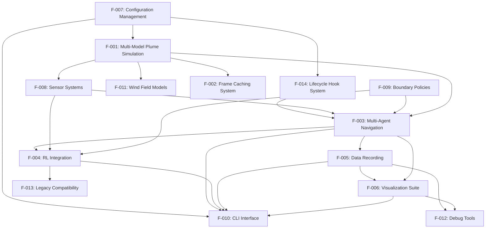

### 2.3.2 Integration Points

| Feature A | Feature B | Integration Type | Shared Components |
|---|---|---|---|
| F-001 | F-003 | Data Flow | Concentration fields |
| F-003 | F-008 | Bidirectional | Sensor readings/Agent states |
| F-003 | F-009 | Control Flow | Position validation |
| F-004 | F-003 | Wrapper | Environment abstraction |
| **F-014** | **F-003** | **Lifecycle Callback** | **Pre-step/Post-step/Episode-end hooks** |

### 2.3.3 Common Services

- **Logging Service**: Structured logging via loguru across all features
- **Seed Management**: Deterministic seeding shared by F-003, F-004, F-001
- **Performance Monitoring**: Shared metrics collection across F-002, F-003, F-005
- **Protocol Interfaces**: Common contracts for F-001, F-008, F-009, F-005
- <span style="background-color: rgba(91, 57, 243, 0.2)">**Hook Execution Service**: Centralized lifecycle callback dispatcher provided by F-014</span>

## 2.4 IMPLEMENTATION CONSIDERATIONS

### 2.4.1 Technical Constraints

| Feature | Constraint | Impact |
|---|---|---|
| F-001 | 2D-only simulation | 3D reserved for v2.0 |
| F-002 | Memory-bound caching | Limited by system RAM |
| F-003 | Vectorization requirements | Homogeneous agent types |
| F-004 | Gymnasium API compatibility | Version 0.29.x required |
| <span style="background-color: rgba(91, 57, 243, 0.2)">F-014</span> | <span style="background-color: rgba(91, 57, 243, 0.2)">HookManager ≤50 LoC, code changes limited to env.py/hooks.py/conf</span> | <span style="background-color: rgba(91, 57, 243, 0.2)">Enforces minimal-change clause</span> |

### 2.4.2 Performance Requirements

| Feature | Requirement | Measurement |
|---|---|---|
| F-001 | <10ms field updates | 100x100 grid |
| F-002 | ≤33ms step latency | Real-time simulation |
| F-003 | <1ms per agent step | 100 agents |
| F-004 | >1000 steps/second | Training throughput |
| <span style="background-color: rgba(91, 57, 243, 0.2)">F-014</span> | <span style="background-color: rgba(91, 57, 243, 0.2)"><1 ms overhead when no hooks registered; overall simulation still ≤33 ms/step</span> | <span style="background-color: rgba(91, 57, 243, 0.2)">100-step episode benchmark</span> |

### 2.4.3 Scalability Considerations

- **F-002**: Cache size vs. performance tradeoff analysis required
- **F-003**: GPU acceleration potential for >1000 agents
- **F-004**: Vectorized environments for parallel training
- **F-005**: Disk space management for long experimental runs
- <span style="background-color: rgba(91, 57, 243, 0.2)">**F-014**: Supports O(100) hooks with constant-time dispatch via early-exit check</span>

### 2.4.4 Security Implications

- **F-001**: Video file path validation to prevent directory traversal
- **F-004**: Model checkpoint validation for training artifacts
- **F-005**: File permission management for data recording
- **F-007**: Environment variable exposure considerations

## 2.5 TRACEABILITY MATRIX

The traceability matrix establishes clear relationships between requirement categories, technical specification sections, implementation components, and test coverage. This matrix ensures comprehensive coverage of all system capabilities while maintaining clear audit trails for requirement fulfillment.

### 2.5.1 Requirements to Implementation Mapping

The following matrix maps each major requirement category to its corresponding technical documentation, implementation files, and testing approach:

| Requirement Category | Technical Spec Section | Implementation Component | Test Coverage |
|---|---|---|---|
| Plume Simulation | 1.2.2, 3.1 | src/plume_nav_sim/models/plume/ | Unit + Integration |
| Frame Caching | 1.2.2, 5.2 | src/odor_plume_nav/cache/ | Performance + Load |
| Multi-Agent Navigation | 1.2.2, 3.1 | src/odor_plume_nav/core/controllers.py | Functional + Performance |
| RL Integration | 1.2.2, 3.1 | src/odor_plume_nav/rl/ | API + Compatibility |
| Data Recording | 1.2.2, 5.3 | src/plume_nav_sim/recording/ | Backend + Integration |
| Configuration | 1.2.2, 7.1 | conf/, src/odor_plume_nav/config/ | Schema + Validation |
| <span style="background-color: rgba(91, 57, 243, 0.2)">Hook System</span> | <span style="background-color: rgba(91, 57, 243, 0.2)">0. SUMMARY OF CHANGES – Primary Objectives 1-3</span> | <span style="background-color: rgba(91, 57, 243, 0.2)">src/plume_nav_sim/hooks.py, plume_nav_sim/envs/plume_navigation_env.py, conf/config.yaml</span> | <span style="background-color: rgba(91, 57, 243, 0.2)">Unit + Integration (tests/test_hooks.py)</span> |

### 2.5.2 Test Coverage Strategy

Each requirement category employs tailored testing approaches based on its technical characteristics:

**Unit + Integration Testing**: Applied to core simulation components (Plume Simulation, Hook System) and data recording systems to ensure individual component functionality and proper integration with the broader system.

**Performance + Load Testing**: Dedicated to Frame Caching and Multi-Agent Navigation systems where performance requirements are critical to system success.

**Functional + Performance Testing**: Multi-Agent Navigation combines both functional correctness validation and performance benchmarking to ensure scalable operation.

**API + Compatibility Testing**: RL Integration focuses on maintaining compatibility with external frameworks while ensuring proper API behavior.

**Schema + Validation Testing**: Configuration Management emphasizes data integrity and validation rule compliance.

**Backend + Integration Testing**: Data Recording systems verify functionality across multiple storage backends and integration points.

#### References

**Technical Specification Sections**
- Section 1.1: Executive Summary - Project overview and impact
- Section 1.2: System Overview - Capabilities and architecture
- Section 1.3: Scope - Implementation boundaries and limitations

**Implementation Files**
- `src/odor_plume_nav/__init__.py` - Package initialization and feature detection
- `src/plume_nav_sim/__init__.py` - Simulation framework initialization
- `src/odor_plume_nav/cli/main.py` - CLI command definitions and orchestration
- `src/odor_plume_nav/api/navigation.py` - Public API functions
- `src/plume_nav_sim/recording/__init__.py` - Recording framework definitions
- `src/odor_plume_nav/rl/training.py` - RL training orchestration
- `conf/config.yaml` - User-facing configuration template
- `conf/base.yaml` - Foundational configuration defaults
- `README.md` - Primary user documentation
- `pyproject.toml` - Project metadata and dependencies

**Configuration and Documentation**
- `conf/` - Hydra configuration hierarchy
- `conf/base/` - Base configuration groups
- `src/` - Top-level source packages
- `src/odor_plume_nav/` - Core navigation library structure
- `src/plume_nav_sim/` - Simulation framework structure
- `src/plume_nav_sim/recording/` - Recording subsystem

# 3. TECHNOLOGY STACK

## 3.1 OVERVIEW

The plume navigation simulation framework employs a carefully selected technology stack optimized for high-performance scientific computing, reinforcement learning research, and real-time simulation capabilities. The architecture prioritizes extensibility through zero-code configuration of components and performance optimization ensuring real-time simulation capabilities, while maintaining compatibility with modern machine learning ecosystems.

The stack supports the core system requirements of ≤33 ms per simulation step performance, 100+ simultaneous agents scalability, and >99.9% reliability, enabling researchers to conduct sophisticated multi-agent navigation experiments with minimal computational overhead.

### 3.1.1 Architecture Philosophy

The technology selections follow a protocol-driven architecture that enables runtime component selection and configuration. This approach ensures that researchers can adapt the framework to diverse use cases without modifying core code, while maintaining the performance characteristics required for interactive research workflows.

## 3.2 PROGRAMMING LANGUAGES

### 3.2.1 Primary Language: Python

**Version Requirements**: Python ≥3.10, <4.0

**Justification**: Python serves as the exclusive programming language for this system, selected for its:
- **Scientific Computing Ecosystem**: Native integration with NumPy, SciPy, and Matplotlib for high-performance numerical operations
- **Machine Learning Compatibility**: Seamless integration with modern RL frameworks (Stable-Baselines3, Gymnasium)
- **Research Community Adoption**: Standard language for reinforcement learning and simulation research
- **Performance Optimization**: Support for JIT compilation through Numba, achieving >10x performance improvements

**Platform Distribution**: All three main packages (odor_plume_nav, plume_nav_sim, and cookiecutter scaffold) are implemented in Python, ensuring consistent development and deployment experiences across the entire framework.

**Validation**: CI/CD pipeline validates compatibility against Python 3.10 and 3.11, with Stable-Baselines3 requiring Python 3.9+ for optimal performance and library compatibility.

## 3.3 FRAMEWORKS & LIBRARIES

### 3.3.1 Core Scientific Computing Stack

**NumPy (≥1.26.0)**
- **Purpose**: Foundation for all vectorized operations and array processing
- **Justification**: Enables vectorized operations supporting multi-agent scenarios with minimal computational overhead
- **Performance Impact**: Critical for achieving sub-millisecond step performance per agent
- **Compatibility**: Version 1.26.0+ required for NumPy v2 compatibility with modern PyTorch and Stable-Baselines3

**SciPy (≥1.11.0)**
- **Purpose**: Advanced interpolation and physics modeling capabilities
- **Integration**: Powers wind field interpolation and turbulent plume dispersion models
- **Dependencies**: Required for Features F-001 (Multi-Model Plume Simulation) and F-011 (Wind Field Models)

**Matplotlib (≥3.7.0)**
- **Purpose**: Comprehensive visualization and animation framework
- **Capabilities**: Real-time animation, publication-quality static plots, and interactive debugging
- **Integration**: Supports Feature F-006 (Advanced Visualization Suite) with backend-agnostic design

### 3.3.2 Reinforcement Learning Framework

**Gymnasium (==0.29.*)**
- **Purpose**: Modern RL environment API standard (maintained fork of OpenAI Gym)
- **Version Justification**: Gymnasium 0.29.1+ is the minimum required version for current Stable-Baselines3 compatibility
- **Integration**: Provides native compatibility with Feature F-004 (Reinforcement Learning Integration)
- **Migration**: Supports legacy OpenAI Gym environments via shimmy compatibility layer

**Stable-Baselines3**
- **Purpose**: State-of-the-art reinforcement learning algorithms in PyTorch
- **Requirements**: Python 3.9+ and PyTorch >= 2.3 for optimal performance
- **Algorithms**: Comprehensive suite including PPO, A2C, DQN, and vectorized environments for parallel training
- **Integration**: Native Gymnasium-compliant environment with custom observation/action spaces

**Shimmy**
- **Purpose**: Compatibility layer for legacy OpenAI Gym environments
- **Function**: Enables gradual migration from legacy systems during transition period
- **Integration**: Supports Feature F-013 (Legacy Compatibility Layer)

### 3.3.3 Configuration and Orchestration

**Hydra-core (==1.3.*)**
- **Purpose**: Hierarchical configuration management with runtime component selection
- **Architecture**: Three-layer override hierarchy (Base → User → Runtime)
- **Business Value**: Enables zero-code component swapping and experiment reproducibility
- **Integration**: Central to Feature F-007 (Configuration Management System)

**OmegaConf (≥2.3.0)**
- **Purpose**: Configuration interpolation and resolution
- **Integration**: Works with Hydra for advanced configuration features
- **Capabilities**: Environment variable integration and schema validation

**Pydantic (≥2.5.0)**
- **Purpose**: Data validation and settings management
- **Integration**: Provides schema validation for configuration system
- **Benefits**: Type safety and automatic validation for all configuration parameters

### 3.3.4 Performance Optimization

**Numba (Optional)**
- **Purpose**: Just-in-time (JIT) compilation for Python
- **Performance Impact**: Achieves >10x speedup for numerical computations
- **Integration**: Optional dependency for performance-critical simulation components
- **Targeting**: Optimizes vectorized operations and physics calculations

**psutil (≥5.9.0)**
- **Purpose**: System monitoring and memory pressure detection
- **Integration**: Supports Feature F-002 (High-Performance Frame Caching System)
- **Capabilities**: Thread-safe memory monitoring with concurrent access patterns

## 3.4 OPEN SOURCE DEPENDENCIES

### 3.4.1 Core Dependencies

**Command Line Interface**
- **Click (≥8.2.1)**: Comprehensive CLI framework with Hydra integration
- **python-dotenv (≥1.1.0)**: Environment variable management for configuration

**Logging and Monitoring**
- **Loguru (≥0.7.0)**: Structured logging framework with advanced formatting
- **GitHub Actions Integration**: Special log formatting for CI/CD environments

**Database and ORM**
- **SQLAlchemy (≥2.0.41)**: Modern ORM for database operations
- **Integration**: Supports Feature F-005 (Comprehensive Data Recording Framework)

### 3.4.2 Optional Dependencies

**Data Processing and Storage**
- **pandas**: Data manipulation and analysis for experimental results
- **pyarrow**: Parquet file support for efficient columnar storage
- **h5py**: HDF5 file format support for hierarchical data structures

**Advanced Visualization**
- **plotly**: Interactive visualizations for research analysis
- **seaborn**: Statistical data visualization enhancements
- **PySide6**: Qt-based GUI framework for debug interfaces
- **streamlit**: Web-based interactive dashboards

**Development and Testing**
- **pytest**: Primary testing framework with coverage and benchmarking
- **pytest-cov**: Coverage reporting for code quality assurance
- **pytest-benchmark**: Performance benchmarking with defined SLAs
- **pre-commit**: Git hook framework for code quality

**Code Quality Tools**
- **black**: Code formatter for consistent styling
- **isort**: Import sorting and organization
- **ruff**: Fast Python linter for code quality
- **mypy**: Static type checking for improved reliability

## 3.5 THIRD-PARTY SERVICES

### 3.5.1 Optional External Integrations

**Experiment Tracking**
- **TensorBoard**: ML experiment visualization (configurable via TENSORBOARD_LOG_DIR)
- **Weights & Biases**: Advanced experiment tracking and collaboration (configurable via WANDB_PROJECT)
- **Integration**: Optional services activated through environment variables

**Development Services**
- **Codecov**: Coverage reporting and analysis for code quality metrics
- **GitHub Actions**: Primary CI/CD platform with comprehensive workflow automation

**High-Performance Computing**
- **SLURM**: HPC cluster job management support for large-scale experiments
- **Integration**: Automatic detection and optimization for cluster environments

### 3.5.2 CI/CD Infrastructure

**GitHub Actions Workflow**
- **Primary Platform**: GitHub-hosted Ubuntu runners for continuous integration
- **Key Actions**: 
  - `actions/checkout@v4`, `actions/setup-python@v4`: Repository and Python setup
  - `actions/cache@v3`, `actions/upload-artifact@v3`: Caching and artifact management
  - `snok/install-poetry@v1`: Poetry dependency management
  - `docker/setup-buildx-action@v2`: Container build support

**Performance Monitoring**
- **Benchmarking SLAs**: ≤33ms per simulation step, ≥30 FPS target performance
- **Memory Constraints**: ≤10MB memory per 100 agents
- **Automated Validation**: Continuous performance regression testing

## 3.6 DATABASES & STORAGE

### 3.6.1 Primary Storage Solutions

**SQLite**
- **Purpose**: Lightweight embedded database for local development and testing
- **Integration**: Supports Feature F-005 data recording with minimal overhead
- **Use Cases**: Configuration persistence, experimental metadata, and result indexing

**File-Based Storage**
- **Parquet Files (via pyarrow)**: Columnar storage optimized for analytical workloads
- **HDF5 Files (via h5py)**: Hierarchical data format for complex scientific datasets
- **JSON Files**: Configuration storage and structured logging
- **CSV Files**: Legacy compatibility and simple data exchange

### 3.6.2 Caching Solutions

**Custom FrameCache Subsystem**
- **Architecture**: Multi-mode caching system with performance optimization
- **Cache Modes**:
  - **LRU (Least Recently Used)**: Memory-efficient caching for limited resources
  - **Preload Cache**: Full memory loading for maximum performance
  - **No-Cache Mode**: Direct disk access for memory-constrained environments
- **Performance**: Thread-safe implementation with memory pressure monitoring
- **Integration**: Transparent integration with VideoPlume and Navigator components

### 3.6.3 Data Persistence Strategies

**Multi-Backend Recording**
- **Backends**: Parquet, HDF5, SQLite, and null backends for diverse research needs
- **Asynchronous I/O**: Minimizes simulation overhead through non-blocking operations
- **Compression**: Configurable compression for storage efficiency
- **Performance Budget**: Designed for minimal impact on simulation performance

## 3.7 DEVELOPMENT & DEPLOYMENT

### 3.7.1 Build System and Package Management

**Poetry (poetry-core ≥1.8.0)**
- **Purpose**: Modern dependency management and packaging
- **Features**: Reproducible builds, virtual environment management, and dependency resolution
- **Integration**: Primary build system for all three packages

**Traditional Python Packaging**
- **setuptools (≥42)**: Package distribution and installation
- **wheel**: Built distribution format for efficient installation
- **pip**: Package installation and dependency management

### 3.7.2 CI/CD Pipeline

**GitHub Actions Platform**
- **Operating System**: Ubuntu-latest GitHub-hosted runners
- **Python Versions**: Automated testing against Python 3.10 and 3.11
- **Coverage**: Codecov integration for comprehensive test coverage reporting
- **Artifact Management**: Build artifacts and test results preservation

**Docker Support**
- **Containerization**: Docker Buildx support for multi-platform builds
- **Resource Monitoring**: Container resource monitoring and optimization
- **Deployment**: Containerized deployment support for production environments

### 3.7.3 Development Tools

**Documentation Generation**
- **Sphinx**: Primary documentation generator with auto-generated API reference
- **sphinx-autodoc-typehints**: Type hint documentation integration
- **sphinx-rtd-theme**: ReadTheDocs theme for professional documentation

**Testing Infrastructure**
- **pytest**: Comprehensive testing framework with fixtures and plugins
- **Coverage Reporting**: Automated coverage analysis and reporting
- **Performance Testing**: Benchmarking suite with defined performance SLAs

## 3.8 INTEGRATION REQUIREMENTS

### 3.8.1 Component Integration

**Protocol-Based Architecture**
- **Runtime Selection**: All components support Hydra instantiation for zero-code swapping
- **Interface Compliance**: Standardized protocols for Source, Boundary, Action, Recorder, Stats, and Hooks
- **Compatibility**: All components must maintain interface compliance across versions

**Environment Integration**
- **Gymnasium API**: Native compatibility with standard RL environment interfaces
- **Vectorized Operations**: Support for multi-agent scenarios with homogeneous agent types
- **Performance Optimization**: Vectorized operations for 100+ simultaneous agents

### 3.8.2 Security Considerations

**Input Validation**
- **File Path Validation**: Directory traversal prevention for video file access
- **Model Checkpoint Validation**: Security validation for training artifacts
- **Environment Variable Exposure**: Controlled exposure of sensitive configuration

**Data Security**
- **File Permission Management**: Appropriate permissions for data recording
- **Configuration Security**: Secure handling of sensitive configuration parameters
- **Access Control**: Controlled access to system resources and external services

## 3.9 TECHNOLOGY JUSTIFICATION

### 3.9.1 Performance Optimization Decisions

The selection of NumPy as the foundation enables vectorized operations that achieve sub-millisecond performance per agent, critical for the system's scalability requirements. The optional Numba integration provides JIT compilation capabilities, delivering >10x performance improvements for computationally intensive operations.

The Gymnasium framework selection ensures compatibility with modern reinforcement learning ecosystems while maintaining the performance characteristics required for real-time simulation. The minimum version requirement of 0.29.1+ aligns with current Stable-Baselines3 compatibility requirements.

### 3.9.2 Extensibility and Maintainability

The Hydra-based configuration system enables zero-code component swapping, allowing researchers to adapt the framework to diverse use cases without modifying core code. This protocol-driven architecture ensures that new components can be integrated seamlessly while maintaining backward compatibility.

The Poetry build system provides reproducible builds and dependency management, ensuring consistent development experiences across different environments and team members.

### 3.9.3 Research Ecosystem Integration

The technology stack prioritizes integration with the broader scientific computing and machine learning ecosystem. Native compatibility with Stable-Baselines3 algorithms, standard data formats (Parquet, HDF5), and visualization tools (Matplotlib, TensorBoard) ensures that researchers can leverage existing tools and workflows.

The optional integration with external services (Weights & Biases, TensorBoard) provides flexibility for different research workflows while maintaining the system's core independence.

#### References

**Technical Specification Sections**:
- `1.2 SYSTEM OVERVIEW` - System context and architectural requirements
- `2.1 FEATURE CATALOG` - Detailed feature specifications and technology dependencies
- `2.4 IMPLEMENTATION CONSIDERATIONS` - Technical constraints and performance requirements

**Web Search Results**:
- Stable-Baselines3 documentation and release notes - Version compatibility and Gymnasium requirements
- Python version requirements for modern ML libraries - Current best practices for Python and PyTorch versions

# 4. PROCESS FLOWCHART

## 4.1 SYSTEM WORKFLOWS

### 4.1.1 Core Business Processes

#### Simulation Execution Workflow

The core simulation execution workflow orchestrates the complete lifecycle of a plume navigation simulation from initialization through completion, achieving the critical ≤33ms per simulation step performance requirement.

```mermaid
flowchart TD
    Start([User Initiates Simulation]) --> LoadConfig[Load Hydra Configuration]
    LoadConfig --> ValidateConfig{Validate Configuration}
    ValidateConfig -->|Invalid| ConfigError[Raise ConfigurationError]
    ConfigError --> END([Terminate])
    
    ValidateConfig -->|Valid| InitComponents[Initialize Protocol Components]
    
    InitComponents --> HooksRegistered{Any Hooks Registered?}
    HooksRegistered -->|No| InitPlume[Instantiate Plume Model]
    HooksRegistered -->|Yes| InitHookMgr[Instantiate HookManager]
    InitHookMgr --> InitPlume
    
    InitComponents --> InitWind[Instantiate Wind Field]
    InitComponents --> InitSensors[Instantiate Sensor Suite]
    InitComponents --> InitNavigator[Instantiate Navigator]
    InitComponents --> InitRecorder[Instantiate Recorder Backend]
    InitComponents --> InitBoundary[Instantiate Boundary Policy]
    InitComponents --> InitAction[Instantiate Action Interface]
    
    InitNavigator --> CheckMode{Single or Multi Agent?}
    CheckMode -->|Single| CreateSingle[Create SingleAgentController]
    CheckMode -->|Multi| CreateMulti[Create MultiAgentController]
    
    CreateSingle --> SetupCache
    CreateMulti --> SetupCache[Setup Frame Cache System]
    
    SetupCache --> CacheMode{Cache Strategy?}
    CacheMode -->|LRU| InitLRU[Initialize LRU Cache with psutil Monitoring]
    CacheMode -->|Preload| LoadAllFrames[Preload All Video Frames]
    CacheMode -->|None| NoCache[Configure Direct Frame Access]
    
    InitLRU --> SimContext
    LoadAllFrames --> SimContext
    NoCache --> SimContext[Create SimulationContext]
    
    SimContext --> ResetEnv[Reset Environment State]
    ResetEnv --> InitAgents[Initialize Agent Positions]
    
    InitAgents --> MainLoop[Main Simulation Loop]
    
    MainLoop --> CheckEpisode{Episode Complete?}
    CheckEpisode -->|No| StepTime[Advance Time Step]
    CheckEpisode -->|Yes| RecordEpisode[Record Episode Data]
    
    StepTime --> GetFrame[Get Current Video Frame]
    GetFrame --> CheckCache{Frame in Cache?}
    CheckCache -->|Yes| ReturnCached[Return Cached Frame]
    CheckCache -->|No| LoadFrame[Load from Video File]
    LoadFrame --> CacheFrame[Cache Frame with LRU Policy]
    CacheFrame --> ReturnCached
    
    ReturnCached --> UpdatePlume[Update Plume Model State]
    UpdatePlume --> UpdateWind[Update Wind Field State]
    UpdateWind --> GetAction[Get Agent Actions via Interface]
    GetAction --> ValidateAction{Valid Action Range?}
    ValidateAction -->|No| ClipAction[Clip to Valid Range]
    ValidateAction -->|Yes| ApplyAction
    ClipAction --> ApplyAction[Apply Actions to Agents]
    
    ApplyAction --> UpdatePositions[Update Agent Positions]
    UpdatePositions --> CheckBoundary[Check Boundary Violations]
    CheckBoundary --> ApplyPolicy[Apply Boundary Policy]
    
    ApplyPolicy --> PolicyType{Policy Type?}
    PolicyType -->|Terminate| MarkTerminated[Mark Agent Terminated]
    PolicyType -->|Bounce| ReflectPosition[Reflect Position/Velocity]
    PolicyType -->|Wrap| WrapPosition[Wrap to Opposite Side]
    PolicyType -->|Clip| ClipPosition[Clip to Boundary]
    
    MarkTerminated --> SampleSensors
    ReflectPosition --> SampleSensors
    WrapPosition --> SampleSensors
    ClipPosition --> SampleSensors[Sample All Sensors]
    
    SampleSensors --> ComputeReward[Compute Step Rewards]
    ComputeReward --> RecordStep[Record Step Data Async]
    RecordStep --> CheckPerf[Check Performance Budget]
    CheckPerf --> PerfOK{Step Time ≤ 33ms?}
    PerfOK -->|No| LogWarning[Log Performance Warning]
    PerfOK -->|Yes| MainLoop
    LogWarning --> MainLoop
    
    RecordEpisode --> EpisodeHooksRegistered{Episode-End Hooks Registered?}
    EpisodeHooksRegistered -->|No| CheckRun{Run Complete?}
    EpisodeHooksRegistered -->|Yes| DispatchEpisodeEndHooks[Execute Episode-End Hooks]
    DispatchEpisodeEndHooks --> CheckRun
    
    CheckRun -->|No| ResetEnv
    CheckRun -->|Yes| FinalizeRecording[Finalize Recording Backend]
    
    FinalizeRecording --> ExportData[Export to Data Format]
    ExportData --> RunAnalysis[Run Statistical Analysis]
    RunAnalysis --> GenerateReport[Generate Summary Report]
    GenerateReport --> Cleanup[Cleanup Resources]
    Cleanup --> END
```

#### Hydra Configuration Loading Workflow

The Hydra-based configuration system implements a hierarchical loading and composition strategy with three-layer override hierarchy (Base → User → Runtime).

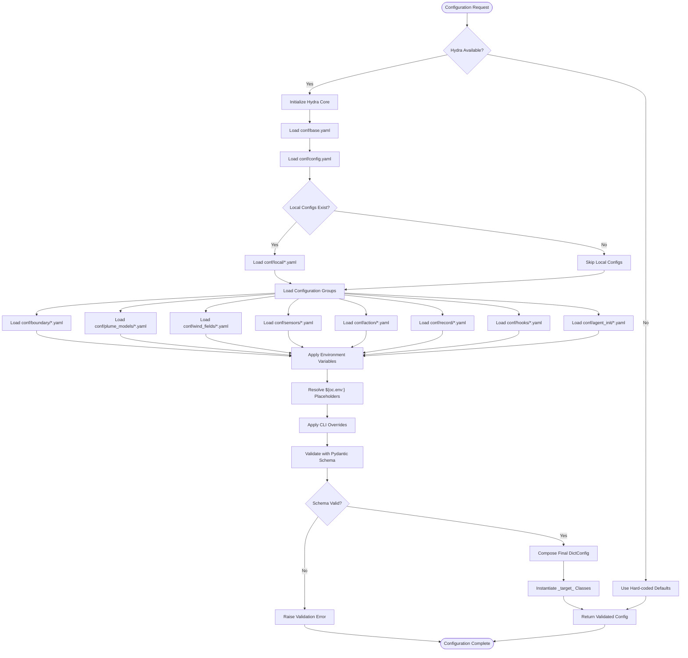

### 4.1.2 Integration Workflows

#### Gymnasium Environment Creation Workflow

The Gymnasium-compliant environment creation process supports both legacy Gym and modern Gymnasium APIs with automatic detection and compatibility shimming.

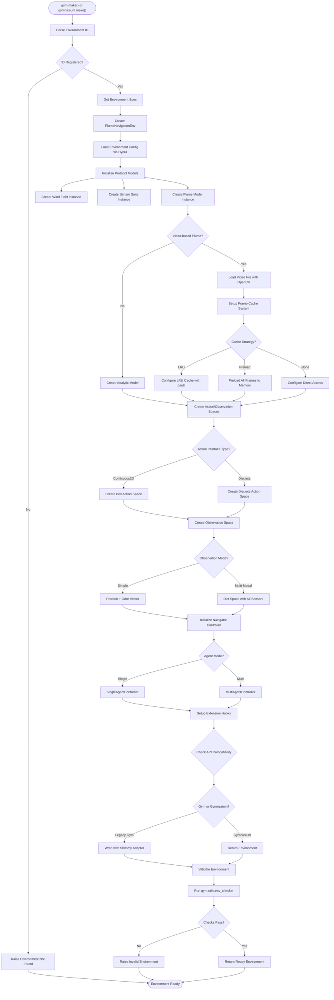

#### Asynchronous Data Recording Workflow

The asynchronous data recording system supports multiple backends (Parquet, HDF5, SQLite) with performance guarantees and graceful degradation.

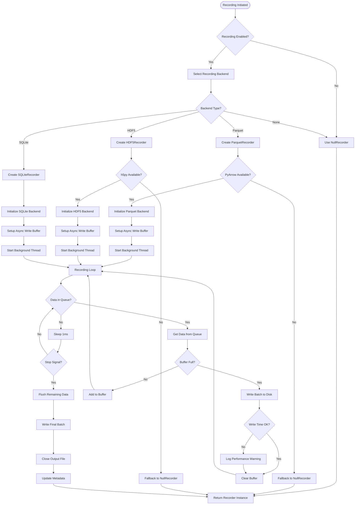

## 4.2 FLOWCHART REQUIREMENTS

### 4.2.1 Navigation Step Workflow (updated)

The core navigation control loop executes with strict performance requirements (≤33ms per step) and includes comprehensive validation and error handling. <span style="background-color: rgba(91, 57, 243, 0.2)">The workflow now incorporates pre-step and post-step hook dispatch points managed by the HookManager system, ensuring extensibility while maintaining performance SLA compliance through efficient early exit paths when hooks are disabled.</span>

```mermaid
flowchart TD
    Start([Step Called]) --> StartTimer[Start Performance Timer]
    StartTimer --> RunPreHooks[Execute Pre-Step Hooks]
    RunPreHooks --> GetCurrentState[Get Current Agent State]
    
    GetCurrentState --> AgentType{Agent Type?}
    AgentType -->|Single| GetSingleState[Get Position, Orientation, Speed]
    AgentType -->|Multi| GetMultiState[Get Vectorized State Arrays]
    
    GetSingleState --> ProcessAction
    GetMultiState --> ProcessAction[Process Actions via Interface]
    
    ProcessAction --> ActionInterface{Action Interface Type?}
    ActionInterface -->|Continuous2D| TranslateCont[Translate to dx, dy, dtheta]
    ActionInterface -->|Discrete| TranslateDisc[Map to Cardinal Direction]
    
    TranslateCont --> ValidateAct
    TranslateDisc --> ValidateAct[Validate Action Values]
    
    ValidateAct --> CheckNaN{Contains NaN?}
    CheckNaN -->|Yes| ReplaceNaN[Replace with Zero Action]
    CheckNaN -->|No| CheckBounds[Check Action Bounds]
    ReplaceNaN --> CheckBounds
    
    CheckBounds --> InBounds{Within Valid Range?}
    InBounds -->|No| ClipActions[Clip to Valid Range]
    InBounds -->|Yes| UpdateState
    ClipActions --> UpdateState[Update Agent State]
    
    UpdateState --> ComputeNewPos[Compute New Positions]
    ComputeNewPos --> ComputeNewOrient[Compute New Orientations]
    ComputeNewOrient --> CheckMaxSpeed[Check Speed Constraints]
    
    CheckMaxSpeed --> SpeedOK{Speed ≤ Maximum?}
    SpeedOK -->|No| ScaleVelocity[Scale to Maximum Speed]
    SpeedOK -->|Yes| ApplyBoundary
    ScaleVelocity --> ApplyBoundary[Apply Boundary Policy]
    
    ApplyBoundary --> GetPolicy[Get Boundary Policy Instance]
    GetPolicy --> CheckViolation[Check Boundary Violations]
    CheckViolation --> Violated{Boundary Violated?}
    
    Violated -->|No| SampleEnv
    Violated -->|Yes| ApplyCorrection[Apply Policy Correction]
    ApplyCorrection --> CheckTerm{Agent Terminated?}
    CheckTerm -->|Yes| SetDone[Set Done Flag]
    CheckTerm -->|No| SampleEnv
    SetDone --> SampleEnv[Sample Environment State]
    
    SampleEnv --> GetFrame[Get Current Frame]
    GetFrame --> SampleSensors[Sample All Sensor Types]
    
    SampleSensors --> SensorLoop[For Each Sensor Instance]
    SensorLoop --> SensorType{Sensor Type?}
    SensorType -->|Concentration| SampleConc[Get Concentration Value]
    SensorType -->|Gradient| ComputeGrad[Compute Local Gradient]
    SensorType -->|Binary| CheckThresh[Check Detection Threshold]
    
    SampleConc --> AddNoise1[Add Sensor Noise Model]
    ComputeGrad --> AddNoise2[Add Sensor Noise Model]
    CheckThresh --> AddNoise3[Add Detection Error Model]
    
    AddNoise1 --> NextSensor{More Sensors?}
    AddNoise2 --> NextSensor
    AddNoise3 --> NextSensor
    NextSensor -->|Yes| SensorLoop
    NextSensor -->|No| BuildObs[Build Observation Vector]
    
    BuildObs --> ComputeReward[Compute Step Reward]
    ComputeReward --> CheckPostHooks{Post-Step Hooks Active?}
    CheckPostHooks -->|Yes| RunPostHooks[Execute Post-Step Hooks]
    CheckPostHooks -->|No| BuildInfo
    RunPostHooks --> BuildInfo[Build Info Dictionary]
    
    BuildInfo --> CheckTimer[Check Step Time]
    CheckTimer --> TimeOK{Time ≤ 33ms?}
    TimeOK -->|No| LogViolation[Log Performance Violation]
    TimeOK -->|Yes| ReturnStep
    LogViolation --> ReturnStep[Return Step Results]
    
    ReturnStep --> END([Step Complete])
```

### 4.2.2 Sensor Data Processing Workflow

The sensor system supports multiple sensor types with noise modeling and calibration drift simulation.

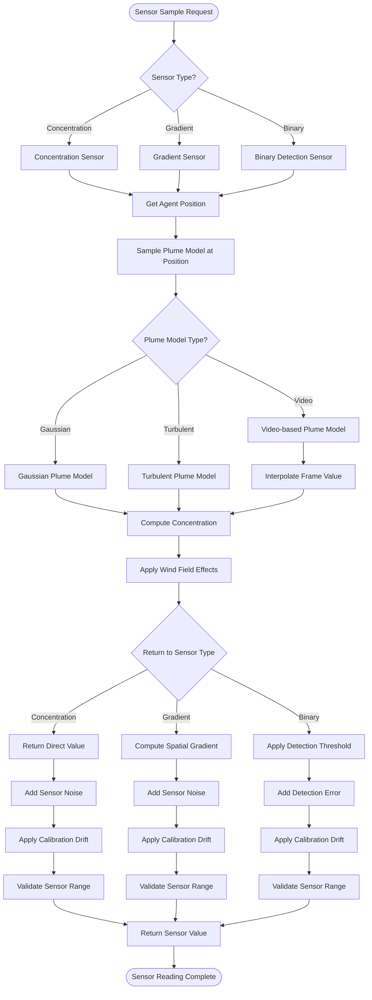

### 4.2.3 Validation Rules

#### Business Rules at Each Step

The navigation workflow enforces strict validation rules at critical decision points to ensure system reliability and performance:

**Pre-Step Validation Rules:**
- <span style="background-color: rgba(91, 57, 243, 0.2)">Pre-step hooks must complete within 5ms of the total 33ms step budget</span>
- Agent state must be valid (non-NaN position, orientation, speed)
- Action interface must be properly initialized and responsive
- Performance timer must be active and tracking cumulative execution time

**Action Processing Rules:**
- All action values must be finite (no NaN, infinity, or undefined values)
- Continuous actions must fall within configured bounds [-1.0, 1.0] for normalized interfaces
- Discrete actions must map to valid cardinal directions or configured discrete options
- Action clipping must preserve relative magnitudes when scaling to valid ranges

**State Update Rules:**
- Position updates must not exceed maximum speed constraints
- Orientation changes must maintain valid angular ranges [0, 2π]
- Boundary violations must trigger appropriate policy responses (terminate, bounce, wrap, clip)
- Agent termination states must be properly propagated to the episode management system

**Post-Step Validation Rules:**
- <span style="background-color: rgba(91, 57, 243, 0.2)">Post-step hooks must complete within 10ms of the total 33ms step budget</span>
- Observation vectors must maintain consistent dimensionality across steps
- Reward computation must produce finite values within expected ranges
- Performance monitoring must log violations exceeding the 33ms SLA threshold

#### Data Validation Requirements

**Sensor Data Validation:**
- Concentration values must be non-negative and within physical plausibility bounds
- Gradient vectors must have valid magnitude and direction components
- Binary detection values must be properly thresholded boolean outputs
- Noise models must produce statistically valid perturbations within configured parameters

**Configuration Validation:**
- All Hydra configuration parameters must pass Pydantic schema validation
- Protocol component selections must resolve to valid implementation classes
- Cache configuration must align with available system memory and performance requirements
- <span style="background-color: rgba(91, 57, 243, 0.2)">Hook configuration must specify valid hook types and execution priorities</span>

#### Authorization Checkpoints

**Component Access Control:**
- Protocol implementations must validate proper interface compliance
- Extension hooks must authenticate against registered callback systems
- Data recording backends must verify write permissions and disk space availability
- Cache systems must enforce memory limits and eviction policies

**Runtime Authorization:**
- Environment creation must validate Gymnasium/Gym API compatibility
- Multi-agent controllers must verify agent count limits and resource allocation
- Performance monitoring must authorize logging and telemetry collection
- <span style="background-color: rgba(91, 57, 243, 0.2)">Hook execution must validate callback registration and priority ordering</span>

#### Regulatory Compliance Checks

**Data Privacy and Security:**
- Recorded simulation data must comply with institutional data retention policies
- Configuration files must not contain sensitive credentials or personal information
- Performance telemetry must be anonymized for research usage analytics
- Export formats must support data anonymization and privacy protection requirements

**Research Ethics Compliance:**
- Simulation parameters must align with approved research protocols
- Data sharing configurations must respect institutional collaboration agreements
- Performance benchmarking must follow established research community standards
- Publication-ready data exports must maintain reproducibility requirements

### 4.2.4 State Management

#### State Transitions

The navigation system manages complex state transitions across multiple hierarchical levels, ensuring consistency and performance across the entire simulation lifecycle.

**Agent State Transitions:**
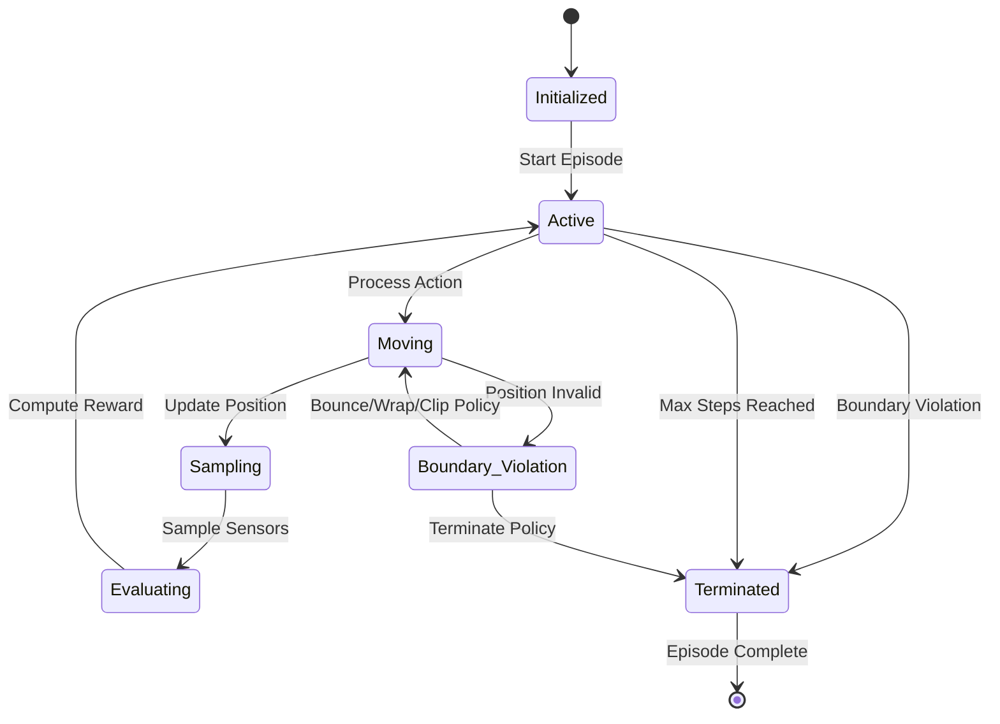

**Episode State Management:**
- Episode initialization resets all agent states to configured starting positions
- Step progression maintains deterministic state evolution through the navigation workflow
- Episode termination triggers cleanup of transient state and data recording finalization
- Multi-episode runs maintain statistical continuity while resetting simulation state

**Cache State Management:**
- LRU cache maintains frame access patterns with automatic eviction based on memory pressure
- Preload cache ensures deterministic access times by eliminating runtime I/O operations
- Direct access mode bypasses caching for minimal memory footprint scenarios
- Cache invalidation handles video file changes and configuration updates

#### Data Persistence Points

**Critical Persistence Checkpoints:**
- Episode initialization state (agent positions, environment configuration, random seeds)
- Step-level state snapshots (position, orientation, sensor readings, rewards)
- Performance metrics (step timing, cache hit rates, memory usage)
- <span style="background-color: rgba(91, 57, 243, 0.2)">Hook execution metrics (pre-step timing, post-step timing, callback success rates)</span>

**Asynchronous Recording Strategy:**
- Primary simulation thread maintains performance SLA through non-blocking data queuing
- Background recording thread handles batch writing to persistent storage backends
- Buffer management prevents memory exhaustion during high-frequency data generation
- Graceful degradation handles storage failures without simulation interruption

#### Caching Requirements

**Frame Cache Management:**
- LRU eviction policy maintains optimal memory utilization while maximizing cache hit rates
- Preload strategy eliminates I/O latency for deterministic performance requirements
- Cache size automatically adapts to available system memory using psutil monitoring
- Cache warming strategies optimize startup performance for video-based simulations

**Configuration Cache:**
- Hydra configuration trees are cached post-validation to eliminate repeated parsing overhead
- Protocol component instances are cached for reuse across simulation episodes
- <span style="background-color: rgba(91, 57, 243, 0.2)">Hook manager instances maintain callback registrations across episode boundaries</span>

#### Transaction Boundaries

**Atomic Operations:**
- Individual navigation steps execute as atomic units with rollback capability on failures
- Episode state changes maintain ACID properties for data consistency
- Configuration updates require explicit transaction boundaries to prevent partial application
- Cache operations maintain consistency through proper locking mechanisms

**Concurrency Control:**
- Multi-threaded recording operations use appropriate synchronization primitives
- Cache access patterns prevent race conditions through reader-writer locks
- <span style="background-color: rgba(91, 57, 243, 0.2)">Hook callback execution maintains thread safety for concurrent hook dispatching</span>
- Performance monitoring avoids contention through lock-free data structures

### 4.2.5 Error Handling

#### Retry Mechanisms

**Automatic Retry Strategies:**
- Sensor sampling failures trigger exponential backoff retry with maximum attempt limits
- Frame loading errors implement immediate retry with fallback to cached or default frames
- Configuration validation failures provide detailed error messages with suggested corrections
- <span style="background-color: rgba(91, 57, 243, 0.2)">Hook execution failures implement configurable retry policies with circuit breaker patterns</span>

**Retry Configuration:**
- Maximum retry attempts: 3 for sensor operations, 5 for frame loading, 1 for configuration
- Backoff intervals: 1ms, 4ms, 16ms progression for sensor retries
- Timeout limits: 10ms for individual operations, 33ms for complete step execution
- Failure thresholds: 10% failure rate triggers degraded mode operation

#### Fallback Processes

**Graceful Degradation Strategies:**
- Missing sensor data defaults to zero concentration with appropriate uncertainty flags
- Frame loading failures fall back to last successful frame or analytical model approximation
- Configuration errors revert to validated default configurations with warning notifications
- <span style="background-color: rgba(91, 57, 243, 0.2)">Hook execution failures disable problematic hooks while maintaining core functionality</span>

**Fallback Hierarchy:**
1. **Primary Operation**: Normal execution path with full functionality
2. **Retry Operation**: Automatic retry with exponential backoff
3. **Degraded Operation**: Reduced functionality with warning notifications
4. **Safe Mode**: Minimal functionality with extensive logging
5. **Emergency Shutdown**: Controlled termination with state preservation

#### Error Notification Flows

**Error Classification and Routing:**
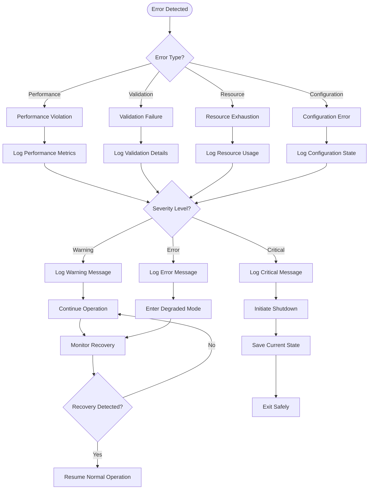

**Notification Channels:**
- Console logging with structured format and severity levels
- File-based logging with rotation and retention policies
- Performance monitoring integration with alerting capabilities
- <span style="background-color: rgba(91, 57, 243, 0.2)">Hook system notifications for custom error handling and recovery procedures</span>

#### Recovery Procedures

**Automated Recovery Mechanisms:**
- Cache invalidation and rebuild for frame loading failures
- Agent state reset for position validation failures
- Configuration reload for parameter validation errors
- <span style="background-color: rgba(91, 57, 243, 0.2)">Hook re-registration for callback execution failures</span>

**Manual Recovery Procedures:**
- Environment reset for persistent state corruption
- Configuration validation using Hydra schema checking
- Performance profiling for persistent SLA violations
- System resource monitoring for memory or storage exhaustion

**Recovery Verification:**
- Automated testing of core functionality post-recovery
- Performance benchmarking to verify SLA compliance restoration
- Configuration validation to ensure parameter consistency
- <span style="background-color: rgba(91, 57, 243, 0.2)">Hook system validation to verify callback registration and execution paths</span>

## 4.3 TECHNICAL IMPLEMENTATION

### 4.3.1 State Management

The system maintains complex state across multiple protocol-based components with clear transition boundaries and error recovery mechanisms. <span style="background-color: rgba(91, 57, 243, 0.2)">The state management now includes comprehensive hook lifecycle management through the HookManager system, enabling extensible pre-step, post-step, and episode-end processing while maintaining the critical ≤33ms performance SLA.</span>

```mermaid
stateDiagram-v2
    [*] --> Uninitialized
    
    Uninitialized --> Configuring: load_hydra_config()
    Configuring --> Configured: validate_schema()
    Configured --> ComponentInit: create_protocol_components()
    
    ComponentInit --> Ready: all_components_ready()
    Ready --> Running: start_simulation()
    
    Running --> Paused: pause_simulation()
    Paused --> Running: resume_simulation()
    
    Running --> EpisodeEnd: episode_complete()
    EpisodeEnd --> Running: reset_episode()
    EpisodeEnd --> Finalizing: run_complete()
    
    Finalizing --> Analyzing: export_recording_data()
    Analyzing --> Complete: generate_analysis_report()
    
    Running --> Error: exception_raised()
    Paused --> Error: exception_raised()
    Configuring --> Error: validation_failed()
    ComponentInit --> Error: component_failed()
    
    Error --> Recovery: handle_error()
    Recovery --> Running: recover_successful()
    Recovery --> Terminated: unrecoverable_error()
    
    Complete --> [*]
    Terminated --> [*]
    
    state Running {
        [*] --> StepInit
        StepInit --> PreStepHooks: run_pre_step_hooks()
        PreStepHooks --> ActionProcessing: get_actions()
        ActionProcessing --> StateUpdate: apply_actions()
        StateUpdate --> BoundaryCheck: check_boundaries()
        BoundaryCheck --> SensorSampling: sample_sensors()
        SensorSampling --> RewardComputation: compute_rewards()
        RewardComputation --> PostStepHooks: run_post_step_hooks()
        PostStepHooks --> DataRecording: record_step_data()
        DataRecording --> PerformanceCheck: check_step_time()
        PerformanceCheck --> StepComplete: validate_performance()
        StepComplete --> [*]
    }
    
    state ComponentInit {
        [*] --> LoadingPlume
        LoadingPlume --> LoadingWind: plume_ready()
        LoadingWind --> LoadingSensors: wind_ready()
        LoadingSensors --> LoadingNavigator: sensors_ready()
        LoadingNavigator --> LoadingRecorder: navigator_ready()
        LoadingRecorder --> LoadingHooks: recorder_ready()
        LoadingHooks --> LoadingBoundary: hook_manager_ready()
        LoadingBoundary --> LoadingAction: boundary_ready()
        LoadingAction --> ComponentsReady: action_ready()
        ComponentsReady --> [*]
    }
```

#### State Transition Details

**Component Initialization Enhancements**

The component initialization sequence now includes <span style="background-color: rgba(91, 57, 243, 0.2)">hook manager initialization as a critical system component, ensuring all registered hooks are properly validated and configured before simulation begins</span>. The LoadingHooks state performs comprehensive validation of hook configurations, verifies callback registration integrity, and establishes performance budgets for hook execution within the overall system SLA.

**Runtime Hook Integration**

<span style="background-color: rgba(91, 57, 243, 0.2)">The Running state now incorporates two distinct hook execution phases: PreStepHooks and PostStepHooks, each with specific performance allocations and error handling strategies</span>. The PreStepHooks phase executes registered callbacks before action processing, enabling custom initialization, logging, or validation logic. The PostStepHooks phase operates after reward computation but before data recording, allowing for custom analytics, state modification, or external system integration.

**Performance Budget Management**

The hook system maintains strict performance budgets to preserve the critical 33ms step performance requirement. <span style="background-color: rgba(91, 57, 243, 0.2)">PreStepHooks are allocated up to 5ms of execution time, while PostStepHooks receive up to 10ms, ensuring the majority of the performance budget remains available for core simulation operations</span>. Hook execution includes automatic timeout mechanisms and graceful degradation when performance thresholds are exceeded.

**Error Recovery Integration**

Hook-related errors are integrated into the comprehensive error recovery system, with specific handling for callback failures, timeout violations, and configuration errors. <span style="background-color: rgba(91, 57, 243, 0.2)">The system supports dynamic hook disabling for problematic callbacks while maintaining core functionality, and provides detailed error reporting for debugging and system monitoring</span>.

### 4.3.2 Error Handling Workflow

The system implements comprehensive error handling with recovery mechanisms and graceful degradation for different error categories, <span style="background-color: rgba(91, 57, 243, 0.2)">now including specialized handling for hook execution failures and performance violations</span>.

```mermaid
flowchart TD
    Start([Error Detected]) --> ClassifyError[Classify Error Type]
    
    ClassifyError --> ErrorType{Error Category?}
    ErrorType -->|Configuration| ConfigError[Configuration Error]
    ErrorType -->|Resource| ResourceError[Resource Error]
    ErrorType -->|Performance| PerfError[Performance Error]
    ErrorType -->|Data| DataError[Data Error]
    ErrorType -->|Component| CompError[Component Error]
    ErrorType -->|Dependency| DepError[Dependency Error]
    ErrorType -->|Hook| HookError[Hook Execution Error]
    
    HookError --> HookType{Hook Error Type?}
    HookType -->|Timeout| HookTimeout[Hook Execution Timeout]
    HookType -->|Callback| HookCallback[Callback Failure]
    HookType -->|Registration| HookRegistration[Registration Error]
    
    HookTimeout --> DisableHook[Disable Problematic Hook]
    HookCallback --> LogCallback[Log Callback Error Details]
    HookRegistration --> ValidateRegistration[Validate Hook Registration]
    
    LogCallback --> RetryCallback{Retry Callback?}
    RetryCallback -->|Yes| RetryHook[Retry Hook Execution]
    RetryCallback -->|No| DisableHook
    
    ValidateRegistration --> FixRegistration[Fix Registration Issues]
    FixRegistration --> RecoverCheck
    
    RetryHook --> RetrySuccess{Retry Successful?}
    RetrySuccess -->|Yes| RecoverCheck
    RetrySuccess -->|No| DisableHook
    
    DisableHook --> LogHookDisabled[Log Hook Disabled]
    LogHookDisabled --> RecoverCheck
    
    ConfigError --> LogConfig[Log Configuration Details]
    LogConfig --> CheckDefaults{Can Use Defaults?}
    CheckDefaults -->|Yes| ApplyDefaults[Apply Default Configuration]
    CheckDefaults -->|No| TerminateConfig[Terminate with Error]
    
    ResourceError --> ResourceType{Resource Type?}
    ResourceType -->|Memory| HandleMemory[Handle Memory Pressure]
    ResourceType -->|File| HandleFile[Handle File Access Error]
    ResourceType -->|Network| HandleNetwork[Handle Network Error]
    
    HandleMemory --> ReduceCache[Reduce Cache Size]
    ReduceCache --> TriggerGC[Trigger Garbage Collection]
    TriggerGC --> RetryOp[Retry Operation]
    
    HandleFile --> FileExists{File Exists?}
    FileExists -->|No| UseAlternative[Use Alternative Source]
    FileExists -->|Yes| CheckPerms[Check File Permissions]
    CheckPerms --> FixPerms[Fix Permissions if Possible]
    
    HandleNetwork --> RetryCount{Retry Count < 3?}
    RetryCount -->|Yes| WaitRetry[Wait and Retry Connection]
    RetryCount -->|No| UseOffline[Switch to Offline Mode]
    
    PerfError --> PerfType{Performance Issue?}
    PerfType -->|Step Time| ReduceLoad[Reduce Computation Load]
    PerfType -->|Memory Usage| OptimizeMemory[Optimize Memory Usage]
    PerfType -->|I/O Bottleneck| BufferWrites[Increase Buffer Size]
    PerfType -->|Hook Timeout| HandleHookTimeout[Handle Hook Performance]
    
    HandleHookTimeout --> CheckHookBudget[Check Hook Budget Usage]
    CheckHookBudget --> ReduceHookLoad[Reduce Hook Execution Load]
    ReduceHookLoad --> RecoverCheck
    
    DataError --> DataType{Data Issue?}
    DataType -->|Corrupt| TryBackup[Try Backup Data Source]
    DataType -->|Missing| UseDefault[Use Default Values]
    DataType -->|Invalid| Sanitize[Sanitize Invalid Data]
    
    CompError --> CompType{Component Type?}
    CompType -->|Recorder| DisableRecording[Disable Recording Backend]
    CompType -->|Visualization| HeadlessMode[Switch to Headless Mode]
    CompType -->|Sensor| UseFallback[Use Fallback Sensor]
    CompType -->|Plume| UseSimpleModel[Use Simple Plume Model]
    CompType -->|HookManager| ResetHookManager[Reset Hook Manager]
    
    ResetHookManager --> ClearHooks[Clear All Hook Registrations]
    ClearHooks --> RecoverCheck
    
    DepError --> DepType{Dependency Type?}
    DepType -->|Optional| DisableFeature[Disable Optional Feature]
    DepType -->|Required| FallbackImpl[Use Fallback Implementation]
    
    ApplyDefaults --> RecoverCheck
    UseAlternative --> RecoverCheck
    FixPerms --> RecoverCheck
    WaitRetry --> RecoverCheck
    UseOffline --> RecoverCheck
    ReduceLoad --> RecoverCheck
    OptimizeMemory --> RecoverCheck
    BufferWrites --> RecoverCheck
    TryBackup --> RecoverCheck
    UseDefault --> RecoverCheck
    Sanitize --> RecoverCheck
    DisableRecording --> RecoverCheck
    HeadlessMode --> RecoverCheck
    UseFallback --> RecoverCheck
    UseSimpleModel --> RecoverCheck
    DisableFeature --> RecoverCheck
    FallbackImpl --> RecoverCheck[Check Recovery Success]
    
    RecoverCheck --> Recovered{Recovery Successful?}
    Recovered -->|Yes| LogRecovery[Log Recovery Action]
    Recovered -->|No| EscalateError[Escalate Error Level]
    
    LogRecovery --> ResumeOp[Resume Operation]
    EscalateError --> NotifyUser[Notify User of Error]
    NotifyUser --> SaveState[Save Current State]
    SaveState --> GracefulShutdown[Graceful Shutdown]
    
    TerminateConfig --> GracefulShutdown
    RetryOp --> RetryOpSuccess{Operation Success?}
    RetryOpSuccess -->|Yes| ResumeOp
    RetryOpSuccess -->|No| EscalateError
    
    ResumeOp --> END([Continue Execution])
    GracefulShutdown --> END([Terminate])
```

#### Hook-Specific Error Handling

**Hook Execution Timeout Management**

<span style="background-color: rgba(91, 57, 243, 0.2)">Hook execution timeouts are handled through a multi-tier approach that preserves system performance while providing graceful degradation</span>. When a hook exceeds its allocated time budget, the system immediately terminates the callback execution and logs the timeout event. Subsequent hook invocations for the same callback are subject to progressive timeout reduction, eventually disabling persistent violators.

**Callback Failure Recovery**

Hook callback failures are categorized by exception type and handled through specific recovery strategies. <span style="background-color: rgba(91, 57, 243, 0.2)">Transient failures (network timeouts, temporary resource unavailability) trigger automatic retry with exponential backoff, while persistent failures (programming errors, configuration issues) result in permanent hook disabling with detailed error logging</span>.

**Performance Impact Mitigation**

The error handling system includes specialized logic for minimizing performance impact during hook-related error recovery. <span style="background-color: rgba(91, 57, 243, 0.2)">Hook manager resets are performed asynchronously when possible, and emergency hook disabling bypasses normal shutdown procedures to preserve the critical simulation step performance SLA</span>.

### 4.3.3 Transaction Boundaries and Concurrency Control

#### Hook System Transaction Management

<span style="background-color: rgba(91, 57, 243, 0.2)">The hook system implements sophisticated transaction boundaries to ensure data consistency and prevent race conditions during concurrent hook execution</span>. Hook registration and deregistration operations are treated as atomic transactions, with rollback capabilities for partial failures during bulk operations.

**Concurrent Hook Execution**

The HookManager supports concurrent hook execution for performance optimization while maintaining strict ordering guarantees where required. <span style="background-color: rgba(91, 57, 243, 0.2)">Pre-step hooks execute in parallel when no ordering dependencies exist, while post-step hooks maintain sequential execution order for data consistency</span>. Thread-safe callback registration ensures dynamic hook management during simulation execution.

**Lock-Free Performance Monitoring**

Performance monitoring for hook execution utilizes lock-free data structures to prevent contention during high-frequency measurements. <span style="background-color: rgba(91, 57, 243, 0.2)">Hook execution times are recorded using atomic operations, and performance budget tracking maintains consistency without blocking the main simulation thread</span>.

#### Integration with Existing Systems

**Configuration System Integration**

The hook system integrates seamlessly with the existing Hydra configuration management, supporting runtime component selection and zero-code hook registration. <span style="background-color: rgba(91, 57, 243, 0.2)">Hook configurations are validated during the component initialization phase, ensuring all registered hooks are properly instantiated before simulation begins</span>.

**Data Recording Integration**

Hook execution metrics are automatically integrated into the existing data recording system, providing comprehensive performance analytics and debugging capabilities. <span style="background-color: rgba(91, 57, 243, 0.2)">Hook timing data, execution success rates, and error frequencies are recorded alongside simulation data, enabling detailed performance analysis and system optimization</span>.

### 4.3.4 Performance Optimization Strategies

#### Hook Execution Optimization

**Dynamic Performance Budgeting**

<span style="background-color: rgba(91, 57, 243, 0.2)">The hook system implements dynamic performance budgeting that adapts hook execution time limits based on current system performance</span>. When simulation steps consistently complete under the 33ms SLA, hook budgets are temporarily increased to allow for more comprehensive processing. Conversely, when performance pressure increases, hook budgets are reduced to preserve core simulation performance.

**Callback Prioritization**

Hook callbacks are assigned priority levels that determine execution order and resource allocation. <span style="background-color: rgba(91, 57, 243, 0.2)">Critical hooks (performance monitoring, error detection) receive higher priority and guaranteed execution, while optional hooks (logging, analytics) are subject to early termination under performance pressure</span>.

**Asynchronous Hook Processing**

Where appropriate, hook processing is moved to asynchronous execution contexts to minimize impact on the main simulation thread. <span style="background-color: rgba(91, 57, 243, 0.2)">Post-step hooks that perform I/O operations or complex computations are queued for background processing, with results available for subsequent simulation steps</span>.

#### Memory Management

**Hook Context Pooling**

The hook system implements object pooling for hook execution contexts, reducing garbage collection pressure during high-frequency callback execution. <span style="background-color: rgba(91, 57, 243, 0.2)">Hook contexts are pre-allocated and reused across simulation steps, with automatic cleanup and validation to prevent memory leaks</span>.

**Resource Monitoring Integration**

Hook execution includes automatic resource monitoring to detect memory leaks and resource exhaustion. <span style="background-color: rgba(91, 57, 243, 0.2)">The system tracks memory usage patterns for individual hooks and implements automatic cleanup for hooks that exhibit abnormal resource consumption</span>.

## 4.4 REQUIRED DIAGRAMS

### 4.4.1 CLI Command Execution Flow

The CLI provides multiple entry points for different simulation workflows with comprehensive argument parsing and validation.

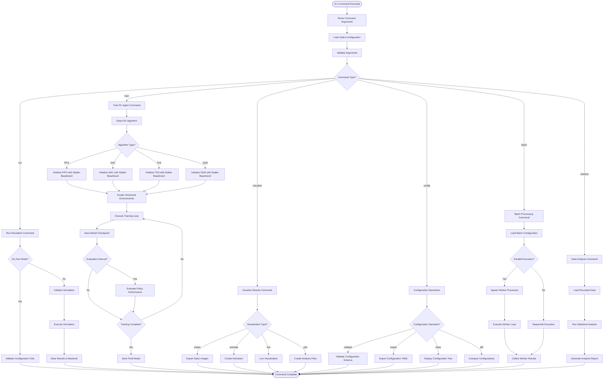

### 4.4.2 Stable-Baselines3 Training Integration Flow

The system integrates seamlessly with Stable-Baselines3 for reinforcement learning with comprehensive monitoring and checkpointing.

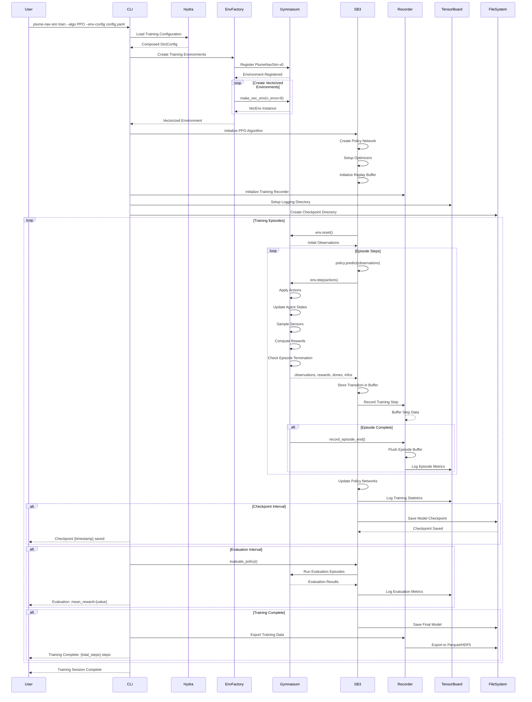

### 4.4.3 Multi-Agent Vectorized Operations Flow

The system supports scalable multi-agent simulation with vectorized operations for optimal performance.

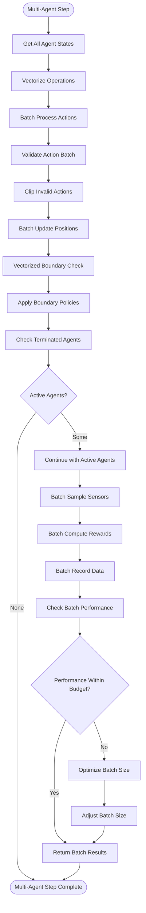

#### References

#### Configuration System Files
- conf/base.yaml - Base configuration hierarchy
- conf/config.yaml - Main configuration file
- conf/local/*.yaml - Local configuration overrides
- conf/boundary/*.yaml - Boundary policy configurations
- conf/plume_models/*.yaml - Plume model configurations

#### Core Implementation Files
- src/navigation/controllers.py - Navigation controller implementations
- src/simulation/environment.py - Gymnasium environment implementation
- src/recording/backends.py - Recording backend implementations
- src/caching/frame_cache.py - Frame caching system

#### Dependencies and Requirements
- Hydra Core (==1.3.*) - Configuration management
- Gymnasium (==0.29.*) - RL environment API
- Stable-Baselines3 - RL algorithms
- NumPy (≥1.26.0) - Vectorized operations
- Pydantic (≥2.5.0) - Schema validation

#### Web Search References
- Mermaid.js flowchart syntax and best practices
- Mermaid syntax validation requirements

# 5. SYSTEM ARCHITECTURE

## 5.1 HIGH-LEVEL ARCHITECTURE

### 5.1.1 System Overview

The Plume Navigation Simulation system implements a **protocol-driven, modular architecture** designed for high-performance simulation of agent navigation through odor plumes. The system has evolved from a monolithic v0.3.0 design to a highly extensible v1.0 framework that achieves exceptional performance while maintaining maximum flexibility for research applications. <span style="background-color: rgba(91, 57, 243, 0.2)">The HookManager-driven lifecycle hook system is now a first-class runtime service which is instantiated automatically by the environment and whose selection is fully governed by the newly-activated Hydra "hooks" configuration group (default value: "none" for backward compatibility).</span>

#### Architecture Style and Rationale

The system follows a **Protocol-Oriented Architecture (POA)** pattern, where core functionalities are defined as protocol interfaces that can be implemented by different concrete components. This approach provides several key advantages:

- **Runtime Component Selection**: Components can be swapped without code modification through configuration
- **Extensibility**: New implementations can be added without modifying existing code
- **Testability**: Protocol interfaces enable comprehensive mocking and testing
- **Dependency Inversion**: High-level modules depend on abstractions, not concrete implementations

#### Key Architectural Principles

1. **Performance First**: All design decisions prioritize achieving ≤33ms simulation step performance
2. **Configuration-Driven**: Hydra-based hierarchical configuration enables zero-code component swapping
3. **Asynchronous Operations**: Non-blocking I/O and recording operations prevent simulation bottlenecks
4. **Vectorized Processing**: NumPy-based operations support 100+ simultaneous agents efficiently
5. **Graceful Degradation**: Optional components fail gracefully without impacting core functionality
6. <span style="background-color: rgba(91, 57, 243, 0.2)">**Hook-based Extensibility**: A lightweight HookManager (<50 LoC) delivers configurable pre-step, post-step, and episode-end extension points with zero-overhead early-exit when no hooks are registered</span>

#### System Boundaries and Major Interfaces

The system operates within three primary boundaries:

- **Internal Simulation Engine**: Protocol-based component orchestration and state management
- **External RL Ecosystem**: Gymnasium-compliant environment API for reinforcement learning integration
- **Data Persistence Layer**: Asynchronous recording backends for experimental data capture

### 5.1.2 Core Components Table

| Component Name | Primary Responsibility | Key Dependencies | Integration Points | Critical Considerations |
|---|---|---|---|---|
| **odor_plume_nav** | Navigation API and controllers | NumPy, Gymnasium, SQLAlchemy | RL frameworks, databases | High-performance frame caching |
| **plume_nav_sim** | Simulation framework engine | Protocol interfaces, Hydra | Configuration system, GUI | Protocol compliance validation |
| **Configuration System** | Hierarchical config management | Hydra, OmegaConf, Pydantic | All components | Schema validation and defaults |
| **Frame Cache** | Video frame optimization | OpenCV, psutil | Plume models, memory | Memory pressure monitoring |
| <span style="background-color: rgba(91, 57, 243, 0.2)">**HookManager**</span> | <span style="background-color: rgba(91, 57, 243, 0.2)">Lifecycle hook coordination (pre-step/post-step/episode-end)</span> | <span style="background-color: rgba(91, 57, 243, 0.2)">Hydra configuration, callable hooks</span> | <span style="background-color: rgba(91, 57, 243, 0.2)">PlumeNavigationEnv step/reset</span> | <span style="background-color: rgba(91, 57, 243, 0.2)">≤1 ms overhead when hooks="none"</span> |

### 5.1.3 Data Flow Description

The system implements a **synchronous simulation loop** with **asynchronous data persistence** to optimize performance while ensuring data integrity.

#### Primary Data Flow

1. **Configuration Loading**: Hydra loads and composes hierarchical configuration from base defaults, user overrides, and runtime parameters
2. **Component Instantiation**: Protocol factories create concrete implementations based on configuration selections
3. **Simulation Execution**: Navigator controllers manage agent state through vectorized operations
   - <span style="background-color: rgba(91, 57, 243, 0.2)">3a. HookManager dispatches pre-step hooks</span>
   - <span style="background-color: rgba(91, 57, 243, 0.2)">3b. Core step logic executes</span>
   - <span style="background-color: rgba(91, 57, 243, 0.2)">3c. HookManager dispatches post-step hooks</span>
4. **Sensor Sampling**: Agents sample plume concentrations through configured sensor protocols
5. **Boundary Enforcement**: Boundary policies handle domain constraints (Terminate/Bounce/Wrap/Clip)
6. **Data Recording**: Asynchronous recorders persist simulation data to configured backends
7. **Statistics Aggregation**: Stats aggregators compute performance metrics and analysis
8. <span style="background-color: rgba(91, 57, 243, 0.2)">**Episode Hook Dispatch**: HookManager dispatches episode-end hooks upon termination</span>

#### Integration Patterns and Protocols

- **Protocol-Based Communication**: All component interactions use well-defined protocol interfaces
- **Event-Driven Updates**: State changes trigger protocol-compliant event notifications
- **Asynchronous I/O**: Recording operations use async/await patterns to prevent blocking
- **Vectorized Operations**: Multi-agent scenarios leverage NumPy broadcast operations
- <span style="background-color: rgba(91, 57, 243, 0.2)">**Hook-based Event Dispatch**: HookManager invokes protocol-compliant extension points without impacting core loop latency</span>

#### Data Transformation Points

- **Configuration Resolution**: OmegaConf interpolation resolves environment variables and references
- **Frame Caching**: OpenCV operations convert video frames to NumPy arrays for efficient access
- **Sensor Data Processing**: Raw plume concentrations transformed to protocol-compliant observations
- **Recording Serialization**: Simulation data serialized to Parquet, HDF5, or SQLite formats

#### Key Data Stores and Caches

- **Frame Cache**: LRU/Preload/None modes with memory pressure monitoring
- **Configuration Cache**: Hydra-managed configuration composition and validation
- **Database Persistence**: SQLAlchemy ORM with normalized schema for experimental data
- **Performance Metrics**: In-memory aggregation with periodic persistence

### 5.1.4 External Integration Points

| System Name | Integration Type | Data Exchange Pattern | Protocol/Format | SLA Requirements |
|---|---|---|---|---|
| **Gymnasium/Stable-Baselines3** | RL Environment API | Synchronous step/reset | Python API | <33ms step latency |
| **Database Systems** | Data Persistence | Asynchronous write | SQL/SQLAlchemy | 99.9% write success |
| **Visualization Tools** | Display/Analysis | Event-driven updates | Matplotlib/Qt | Real-time refresh |
| **File Systems** | Configuration/Data | Synchronous read/write | YAML/Parquet/HDF5 | 99% availability |

## 5.2 COMPONENT DETAILS

### 5.2.1 Core Navigation Library (odor_plume_nav)

#### Purpose and Responsibilities

The core navigation library serves as the primary interface for researchers implementing navigation algorithms. It provides the Navigator API and controllers, Gymnasium environment wrappers, high-performance frame caching, and comprehensive visualization tools.

#### Technologies and Frameworks

- **NumPy ≥1.26.0**: Vectorized array operations and multi-agent state management
- **Gymnasium ==0.29.***: Modern RL environment API standard
- **SQLAlchemy ≥2.0.41**: Database ORM for experimental data persistence
- **OpenCV ≥4.8.0**: Video processing and frame manipulation
- **Matplotlib ≥3.7.0**: Visualization and animation framework

#### Key Interfaces and APIs

- **Navigator Protocol**: Abstract interface for navigation algorithm implementations
- **Gymnasium Environment**: Standard RL environment with observation/action spaces
- **Frame Cache API**: High-performance video frame access with multiple caching strategies
- **Database Models**: SQLAlchemy ORM for Experiment, Simulation, Trajectory, and PerformanceMetric entities

#### Data Persistence Requirements

The component maintains persistent state through:
- **Experiment Metadata**: Configuration, timestamps, and performance metrics
- **Trajectory Data**: Agent positions, observations, and actions over time
- **Performance Metrics**: Step latency, memory usage, and success rates
- **Frame Cache**: Configurable persistence with memory pressure monitoring

#### Scaling Considerations

- **Vectorized Operations**: Support for 100+ simultaneous agents through NumPy broadcasting
- **Memory Management**: Configurable cache sizes with automatic garbage collection
- **Connection Pooling**: Database connection management for concurrent access
- **Lazy Loading**: On-demand initialization of expensive resources

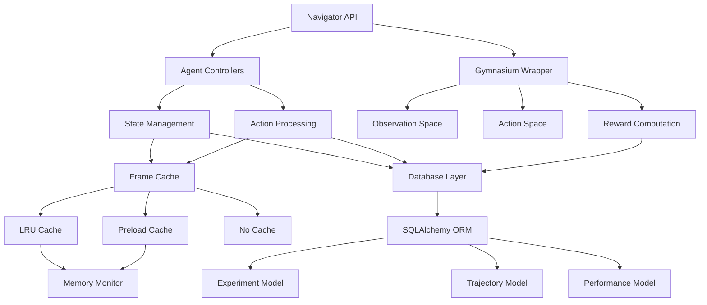

### 5.2.2 Simulation Framework (plume_nav_sim)

#### Purpose and Responsibilities

The simulation framework implements the core protocol interfaces and orchestrates the simulation execution. It provides plume and wind field models, recording and analysis engines, and debug GUI capabilities. <span style="background-color: rgba(91, 57, 243, 0.2)">The framework now owns a lightweight HookManager responsible for coordinating lifecycle hooks and is enabled by default via configuration.</span>

#### Technologies and Frameworks

- **Hydra-core ==1.3.***: Hierarchical configuration management
- <span style="background-color: rgba(91, 57, 243, 0.2)">**HookManager (≤50 LoC, internal)**: Lightweight lifecycle hook coordination</span>
- **Pydantic ≥2.5.0**: Data validation and settings management
- **PyArrow/Pandas**: Parquet recording backend
- **h5py**: HDF5 recording backend
- **PySide6/Streamlit**: Optional debug GUI interfaces

#### Key Interfaces and APIs

- **Protocol Interfaces**: Source, Boundary, Action, Recorder, Stats, Hooks
- <span style="background-color: rgba(91, 57, 243, 0.2)">**HookManager API**: register_pre_step(), register_post_step(), register_episode_end(), dispatch_*</span>
- **Plume Models**: Gaussian, Turbulent, and Video-based dispersion
- **Wind Fields**: Uniform, Turbulent, and custom implementations
- **Recording Backends**: Parquet, HDF5, SQLite, and None options
- **Debug GUI**: Qt-based and Streamlit web interfaces

#### Data Persistence Requirements

- **Simulation Configuration**: Hydra-managed hierarchical settings
- **Recording Data**: Asynchronous persistence to configured backends
- **Performance Metrics**: Real-time statistics aggregation
- **Debug State**: Optional GUI state persistence

#### Scaling Considerations

- **Asynchronous Recording**: Non-blocking I/O for high-throughput scenarios
- **Protocol Validation**: Runtime checking with minimal performance impact
- **Memory-Efficient Models**: Optimized plume and wind field implementations
- **Optional Components**: Graceful degradation for missing dependencies

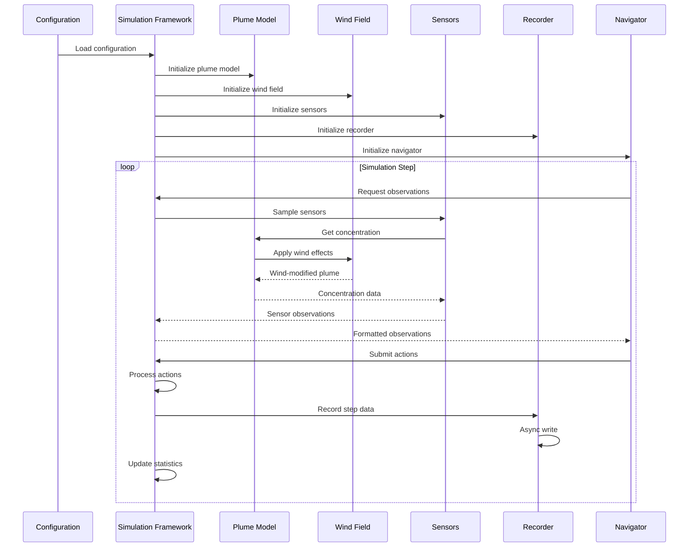

### 5.2.3 Configuration System

#### Purpose and Responsibilities

The Hydra-based configuration system provides hierarchical configuration management with runtime component selection, environment variable integration, and schema validation.

#### Technologies and Frameworks

- **Hydra-core ==1.3.***: Configuration composition and management
- **OmegaConf ≥2.3.0**: Configuration interpolation and resolution
- **Pydantic ≥2.5.0**: Schema validation and type checking

#### Key Interfaces and APIs

- **Configuration Groups**: Organized by component type (boundary, plume_models, sensors, etc.)
  - <span style="background-color: rgba(91, 57, 243, 0.2)">The 'hooks' configuration group is now uncommented/active in conf/config.yaml with default value "none" to preserve previous behaviour</span>
- **Override Hierarchy**: Base → User → Runtime parameter resolution
- **Environment Integration**: Automatic environment variable interpolation
- **Schema Validation**: Pydantic-based configuration validation

#### Data Persistence Requirements

- **Configuration Files**: YAML-based hierarchical structure
- **Default Values**: Fallback configurations for all components
- **User Overrides**: Persistent user-specific configurations
- **Runtime State**: Temporary configuration modifications
- <span style="background-color: rgba(91, 57, 243, 0.2)">**Composed Configuration**: The composed simulation configuration now always contains a resolved 'hooks' subsection, ensuring reproducible hook selection</span>

#### Scaling Considerations

- **Lazy Loading**: On-demand configuration resolution
- **Caching**: Composed configuration caching for performance
- **Validation**: Early validation to prevent runtime errors
- **Extensibility**: Easy addition of new configuration groups

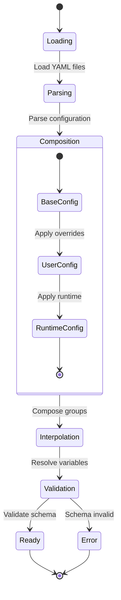

## 5.3 TECHNICAL DECISIONS

### 5.3.1 Architecture Style Decisions and Tradeoffs

#### Protocol-Oriented Architecture Selection

**Decision**: Implement core functionality through protocol interfaces rather than concrete inheritance hierarchies.

**Rationale**: 
- Enables runtime component selection without code modification
- Provides clear contracts for component implementations
- Facilitates testing through protocol-compliant mocks
- Supports extensibility without modifying existing code

**Tradeoffs**:
- **Advantages**: Maximum flexibility, improved testability, clear interfaces
- **Disadvantages**: Slight performance overhead from protocol compliance checking
- **Mitigation**: Runtime validation can be disabled in production environments

#### Configuration-Driven Component Selection

**Decision**: Use Hydra-based hierarchical configuration for runtime component selection.

**Rationale**:
- Enables zero-code component swapping for research experimentation
- Provides reproducible experiment configurations
- Supports environment-specific settings through override hierarchy
- Integrates seamlessly with Python ecosystem conventions
- <span style="background-color: rgba(91, 57, 243, 0.2)">The 'hooks' Hydra group is now part of the default configuration composition, with default variant 'none' to maintain backward compatibility while allowing user override at runtime</span>

**Tradeoffs**:
- **Advantages**: Extreme flexibility, experiment reproducibility, no code changes required
- **Disadvantages**: Configuration complexity, potential runtime errors from misconfigurations
- **Mitigation**: Comprehensive schema validation and default fallbacks

#### Lightweight Hook Management (updated)

**Decision**: Implement a ≤50 LoC HookManager providing protocol-compliant lifecycle hooks with early-exit optimization.

**Rationale**:
- Enables configurable extensibility through pre-step, post-step, and episode-end hooks
- Provides zero-overhead performance when hooks are disabled (default 'none' configuration)
- Maintains API compatibility with existing simulation frameworks
- Supports runtime hook registration without code modification
- Early-exit optimization ensures minimal performance impact when no hooks are registered

**Tradeoffs**:
- **Advantages**: Configurable extensibility, no API breakage, minimal performance overhead
- **Disadvantages**: Additional component complexity, potential configuration overhead
- **Mitigation**: Default 'none' configuration maintains backward compatibility with <1ms overhead

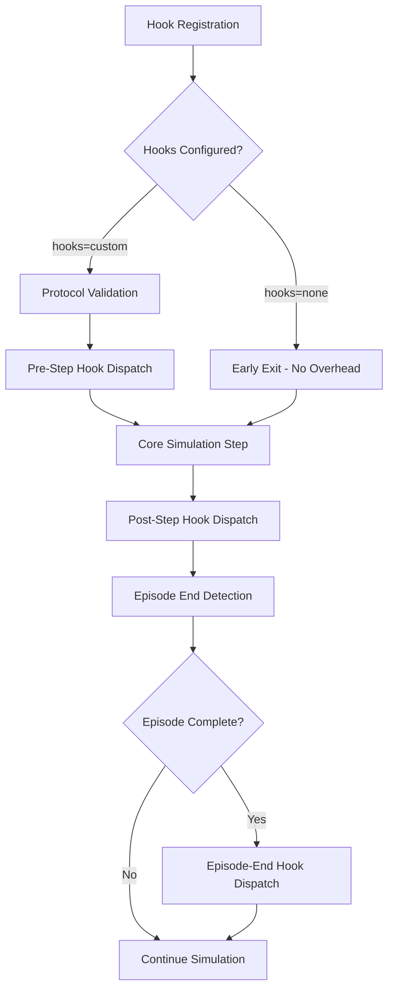

### 5.3.2 Communication Pattern Choices

#### Synchronous Simulation with Asynchronous Recording

**Decision**: Implement synchronous simulation loops with asynchronous data persistence.

**Rationale**:
- Maintains deterministic simulation behavior for reproducibility
- Prevents I/O operations from impacting simulation performance
- Enables high-throughput data recording without blocking
- Supports real-time performance requirements

**Tradeoffs**:
- **Advantages**: Consistent performance, deterministic behavior, scalable recording
- **Disadvantages**: Complexity in error handling, potential data loss on failure
- **Mitigation**: Robust error handling with graceful degradation and data recovery

#### Vectorized Multi-Agent Operations

**Decision**: Use NumPy broadcasting for multi-agent scenario processing.

**Rationale**:
- Achieves significant performance improvements over iterative processing
- Leverages optimized C implementations for mathematical operations
- Enables support for 100+ simultaneous agents
- Maintains code simplicity through expressive array operations

**Tradeoffs**:
- **Advantages**: Exceptional performance, scalability, code clarity
- **Disadvantages**: Memory usage for large agent populations, NumPy dependency
- **Mitigation**: Memory pressure monitoring with automatic optimization

### 5.3.3 Data Storage Solution Rationale

#### Multi-Backend Recording Strategy

**Decision**: Support multiple recording backends (Parquet, HDF5, SQLite, None) through protocol interfaces.

**Rationale**:
- Different research workflows require different data formats
- Parquet provides efficient columnar storage for analytics
- HDF5 supports hierarchical scientific data storage
- SQLite enables relational queries and analysis
- None option provides zero-overhead performance testing

**Tradeoffs**:
- **Advantages**: Workflow flexibility, optimal performance for different use cases
- **Disadvantages**: Increased complexity, multiple dependencies
- **Mitigation**: Optional dependencies with graceful degradation

#### Normalized Database Schema

**Decision**: Use SQLAlchemy ORM with normalized schema for experimental data.

**Rationale**:
- Provides strong data integrity guarantees
- Enables complex relational queries for analysis
- Supports efficient data relationships and constraints
- Integrates well with Python ecosystem

**Tradeoffs**:
- **Advantages**: Data integrity, powerful queries, ecosystem integration
- **Disadvantages**: Performance overhead, ORM complexity
- **Mitigation**: Connection pooling and lazy loading optimization

### 5.3.4 Caching Strategy Justification

#### Multi-Mode Frame Caching

**Decision**: Implement LRU, Preload, and None caching modes for video frame access.

**Rationale**:
- Different simulation scenarios have different memory/performance tradeoffs
- LRU provides balanced performance for varied access patterns
- Preload optimizes for predictable sequential access
- None mode minimizes memory usage for memory-constrained environments

**Tradeoffs**:
- **Advantages**: Optimized performance for different scenarios, memory flexibility
- **Disadvantages**: Implementation complexity, mode selection complexity
- **Mitigation**: Automatic mode selection based on available memory

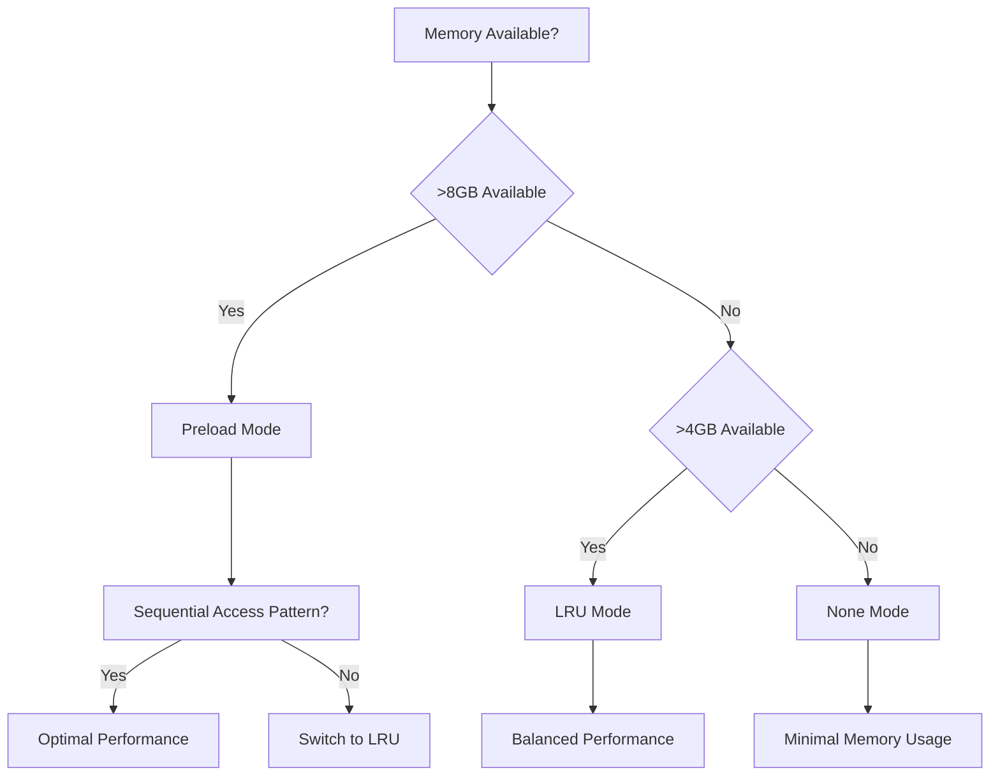

### 5.3.5 Security Mechanism Selection

#### Input Validation and Sanitization

**Decision**: Implement comprehensive input validation using Pydantic schemas.

**Rationale**:
- Prevents injection attacks through configuration manipulation
- Ensures data type safety across all components
- Provides clear error messages for invalid inputs
- Integrates seamlessly with configuration system

**Tradeoffs**:
- **Advantages**: Strong security, type safety, clear error handling
- **Disadvantages**: Performance overhead, schema maintenance
- **Mitigation**: Schema caching and validation optimization

## 5.4 CROSS-CUTTING CONCERNS

### 5.4.1 Monitoring and Observability Approach

#### Comprehensive Performance Monitoring

The system implements multi-layered monitoring to ensure performance targets are met:

**Simulation Performance Metrics**:
- Step execution time tracking with <33ms target
- Memory usage monitoring with automatic optimization
- Agent throughput measurement for scalability validation
- Frame cache hit rates and optimization opportunities

**System Resource Monitoring**:
- CPU utilization tracking via psutil integration
- Memory pressure detection with automatic cache adjustment
- I/O operation monitoring for bottleneck identification
- Network usage tracking for distributed scenarios

**Component Health Monitoring**:
- Protocol compliance validation with error reporting
- Component initialization success/failure tracking
- Graceful degradation monitoring for optional components
- Performance budget enforcement with automatic optimization

#### Observability Infrastructure

**Metrics Collection**:
- Prometheus-compatible metrics export for monitoring systems
- Custom metrics for domain-specific performance indicators
- Automatic baseline establishment for performance regression detection
- Real-time dashboard integration for operational visibility

**Distributed Tracing**:
- Correlation ID propagation across all system components
- Distributed request tracing for multi-component operations
- Performance profiling with detailed execution timelines
- Error correlation across component boundaries

### 5.4.2 Logging and Tracing Strategy

#### Structured Logging Framework

The system uses **Loguru** for structured logging with comprehensive traceability:

**Logging Configuration**:
- Environment-specific log levels (DEBUG, INFO, WARNING, ERROR)
- JSON sink for machine-readable log processing
- Correlation IDs for distributed request tracking
- Performance-sensitive log filtering to minimize overhead

**Log Categories**:
- **Performance Logs**: Step timing, memory usage, cache performance
- **Configuration Logs**: Component initialization, configuration changes
- **Error Logs**: Exception details, recovery actions, component failures
- **Audit Logs**: User actions, experiment modifications, data access

**Distributed Tracing**:
- Request flow tracking across protocol boundaries
- Component interaction visualization
- Performance bottleneck identification
- Error propagation analysis

#### Log Analysis and Alerting

**Automated Analysis**:
- Performance regression detection through log analysis
- Error pattern recognition with automatic alerting
- Resource utilization trends with predictive warnings
- Experiment success/failure pattern analysis

### 5.4.3 Error Handling Patterns

#### Hierarchical Error Recovery

The system implements comprehensive error handling with graceful degradation:

**Error Classification**:
- **Configuration Errors**: Invalid settings, missing parameters
- **Resource Errors**: Memory pressure, file access, network issues
- **Performance Errors**: Step timeout, memory limits, I/O bottlenecks
- **Component Errors**: Protocol violations, initialization failures
- **Data Errors**: Corrupt files, invalid formats, missing data

**Recovery Strategies**:
- **Graceful Degradation**: Disable optional features to maintain core functionality
- **Automatic Fallbacks**: Switch to alternative implementations when primary fails
- **State Recovery**: Restore from last known good state on failure
- **Resource Optimization**: Automatic resource adjustment under pressure

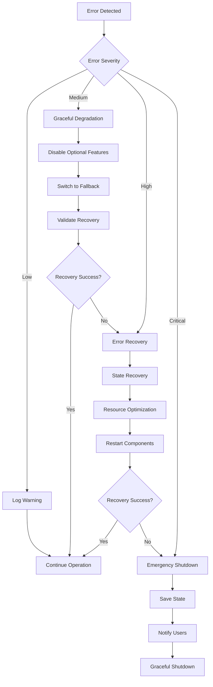

### 5.4.4 Authentication and Authorization Framework

#### Research Environment Security

The system implements security measures appropriate for research environments:

**Access Control**:
- Configuration-based security settings
- File system permission validation
- Database access control through SQLAlchemy
- Network access restriction for distributed scenarios

**Data Protection**:
- Experiment data encryption at rest (optional)
- Secure configuration parameter handling
- Audit trail for data access and modifications
- Backup and recovery procedures for critical data

**Validation and Sanitization**:
- Input validation through Pydantic schemas
- Configuration parameter sanitization
- File path validation to prevent directory traversal
- Database query parameterization to prevent injection

### 5.4.5 Performance Requirements and SLAs

#### Service Level Agreements

| Performance Metric | Target SLA | Monitoring Method | Escalation Threshold |
|---|---|---|---|
| Simulation Step Latency | ≤33ms | Real-time monitoring | >50ms for 5 minutes |
| Memory Usage | <8GB for 100 agents | Continuous tracking | >12GB sustained |
| System Availability | >99.9% uptime | Health checks | 3 consecutive failures |
| Data Recording Success | >99% write success | Async monitoring | <95% success rate |

#### Performance Optimization Strategies

**Automatic Optimization**:
- Dynamic cache size adjustment based on memory pressure
- Automatic fallback to simpler models under resource constraints
- Load balancing for multi-agent scenarios
- I/O optimization through buffering and batching

**Performance Monitoring**:
- Real-time performance dashboard
- Automated performance regression detection
- Resource usage trending and prediction
- Bottleneck identification and resolution

### 5.4.6 Disaster Recovery Procedures

#### Data Protection and Recovery

**Backup Strategies**:
- Automated configuration backup before changes
- Experiment data backup to multiple storage backends
- State checkpoint creation for long-running simulations
- Database backup and recovery procedures

**Recovery Procedures**:
- Automatic state recovery from checkpoints
- Configuration rollback on validation failures
- Component restart procedures with state preservation
- Emergency shutdown with data preservation

**Business Continuity**:
- Distributed deployment support for high availability
- Failover procedures for critical components
- Data replication across multiple storage systems
- Disaster recovery testing and validation

#### References

Files Examined:
- `src/odor_plume_nav/__init__.py` - Core navigation library package structure
- `src/plume_nav_sim/__init__.py` - Simulation framework initialization
- `src/plume_nav_sim/core/protocols.py` - Protocol interface definitions
- `src/odor_plume_nav/db/models.py` - Database ORM models and schemas
- `src/odor_plume_nav/cache/frame_cache.py` - Frame caching implementation
- `src/plume_nav_sim/recording/backends/` - Recording backend implementations
- `conf/config.yaml` - Hydra configuration structure
- `conf/base.yaml` - Base configuration defaults
- `pyproject.toml` - Project dependencies and metadata
- `docs/performance_tuning.md` - Performance optimization guidelines
- `docs/extending_plume_nav_sim.md` - Extension development guide
- `docs/migration_guide.md` - System migration documentation
- `logging.yaml` - Loguru logging configuration

Sections Referenced:
- `1.2 SYSTEM OVERVIEW` - System context and capabilities
- `4.3 TECHNICAL IMPLEMENTATION` - Implementation details and workflows
- `3.3 FRAMEWORKS & LIBRARIES` - Technology stack and dependencies

# 6. SYSTEM COMPONENTS DESIGN

## 6.1 CORE SERVICES ARCHITECTURE

### 6.1.1 Applicability Assessment

**Core Services Architecture is not applicable for this system.**

The Plume Navigation Simulation system is designed as a **high-performance monolithic Python library** implementing a **Protocol-Oriented Architecture (POA)** pattern, not a distributed microservices architecture. This architectural decision is deliberate and optimized for the system's specific requirements and use case.

#### 6.1.1.1 Rationale for Monolithic Architecture

The system's architecture prioritizes performance and simplicity over distributed system benefits due to several critical factors:

| Factor | Requirement | Architectural Impact |
|--------|-------------|---------------------|
| **Performance** | ≤33ms simulation step latency | Tight coupling required for sub-millisecond operations |
| **Use Case** | Scientific simulation library | Single-process execution for research workflows |
| **Deployment** | Python package (pip/Poetry) | Monolithic distribution model |
| **Integration** | Gymnasium/Stable-Baselines3 | Synchronous API compatibility required |

#### 6.1.1.2 System Boundaries and Scope

The system operates within well-defined boundaries that do not require service decomposition:

- **Internal Simulation Engine**: Protocol-based component orchestration within single process
- **External RL Integration**: Gymnasium-compliant environment API for reinforcement learning frameworks
- **Data Persistence Layer**: Asynchronous recording to local databases and file systems
- **Configuration Management**: Hydra-based hierarchical configuration system

```mermaid
graph TB
    subgraph "Single Process Boundary"
        A[Navigation Library<br/>odor_plume_nav] --> B[Simulation Framework<br/>plume_nav_sim]
        B --> C[Configuration System<br/>Hydra + OmegaConf]
        A --> D[Frame Cache<br/>OpenCV + NumPy]
        B --> E[Protocol Interfaces<br/>Source, Boundary, Action, etc.]
    end
    
    subgraph "External Integrations"
        F[RL Frameworks<br/>Stable-Baselines3] --> A
        G[Databases<br/>SQLite, PostgreSQL] --> A
        H[File Systems<br/>Parquet, HDF5] --> B
        I[Visualization<br/>Matplotlib, Qt] --> A
    end
    
    style A fill:#e1f5fe
    style B fill:#f3e5f5
    style C fill:#e8f5e8
```

### 6.1.2 Actual Architecture Pattern

#### 6.1.2.1 Protocol-Oriented Architecture (POA)

Instead of microservices, the system implements a sophisticated **Protocol-Oriented Architecture** that provides flexibility without distributed system complexity:

#### Core Protocol Interfaces

| Protocol | Responsibility | Implementation Strategy |
|----------|---------------|------------------------|
| **Source** | Plume concentration models | Gaussian, Turbulent, Video-based |
| **Boundary** | Domain constraint handling | Terminate, Bounce, Wrap, Clip |
| **Action** | Agent action processing | Discrete, Continuous, Hybrid |
| **Recorder** | Data persistence | Parquet, HDF5, SQLite, None |
| **<span style="background-color: rgba(91, 57, 243, 0.2)">Hook</span>** | <span style="background-color: rgba(91, 57, 243, 0.2)">Lifecycle event extension points (pre-step, post-step, episode-end)</span> | <span style="background-color: rgba(91, 57, 243, 0.2)">Coordinated by **HookManager**; Hydra-configurable</span> |

#### Component Selection Mechanism

Runtime component selection occurs through **configuration-driven instantiation** rather than service discovery. <span style="background-color: rgba(91, 57, 243, 0.2)">The configuration system now also selects the active hook set through the newly enabled `hooks` configuration group, which defaults to `none` for backward compatibility.</span>

```mermaid
sequenceDiagram
    participant C as Configuration System
    participant F as Protocol Factory
    participant H as HookManager
    participant P as Protocol Interface
    participant I as Implementation
    
    C->>F: Load component configuration
    F->>H: Configure hook dispatch
    H->>P: Register hook protocol
    F->>P: Query protocol requirements
    P->>F: Return interface contract
    F->>I: Instantiate concrete implementation
    I->>P: Register protocol compliance
    P->>C: Return configured component
```

<span style="background-color: rgba(91, 57, 243, 0.2)">The lightweight **HookManager** serves as an internal coordinator that registers and dispatches hooks with near-zero overhead (<1 ms when no hooks are configured), enabling extensible lifecycle event handling without impacting the 33 ms/step performance requirement.</span>

#### 6.1.2.2 Performance-Optimized Communication

#### Synchronous Method Invocation

Components communicate through **direct method calls** rather than network protocols:

- **Zero Network Overhead**: Direct memory access between components
- **Vectorized Operations**: NumPy broadcast operations support 100+ simultaneous agents
- **Shared State Management**: Centralized state storage for optimal cache locality
- **Protocol Compliance**: Interface contracts ensure consistent behavior

#### Asynchronous I/O Patterns

Non-blocking operations prevent simulation bottlenecks:

- **Async Recording**: Data persistence uses async/await patterns
- **Background Processing**: Statistics aggregation occurs asynchronously
- **Memory Monitoring**: psutil-based memory pressure detection
- **Frame Caching**: LRU/Preload strategies with adaptive management

### 6.1.3 Scalability Design

#### 6.1.3.1 Vertical Scaling Approach

The system achieves scalability through **computational optimization** rather than horizontal distribution:

#### Vectorized Multi-Agent Processing

| Scaling Dimension | Implementation | Performance Impact |
|-------------------|---------------|-------------------|
| **Agent Count** | NumPy broadcasting | 100+ agents with minimal overhead |
| **Computation** | Numba JIT compilation | >10x speedup for numerical operations |
| **Memory** | Adaptive caching | Memory pressure monitoring |
| **I/O** | Asynchronous recording | Non-blocking data persistence |

#### Resource Optimization Strategies

```mermaid
graph LR
    subgraph "Performance Optimization"
        A[Vectorized Operations<br/>NumPy Broadcasting] --> B[JIT Compilation<br/>Numba Acceleration]
        B --> C[Memory Management<br/>Adaptive Caching]
        C --> D[Async I/O<br/>Non-blocking Recording]
    end
    
    subgraph "Scaling Metrics"
        E[Agent Count<br/>100+ simultaneous] --> F[Step Latency<br/>≤33ms target]
        F --> G[Memory Usage<br/>Adaptive pressure]
        G --> H[Throughput<br/>Real-time simulation]
    end
    
    A --> E
    B --> F
    C --> G
    D --> H
```

#### 6.1.3.2 Capacity Planning Guidelines

#### Performance Targets and Thresholds

- **Simulation Step Latency**: ≤33ms for real-time operation
- **Multi-Agent Support**: 100+ simultaneous agents through vectorization
- **Memory Efficiency**: Adaptive caching with garbage collection
- **Database Throughput**: 99.9% write success rate for experimental data

#### Resource Allocation Strategy

- **CPU Utilization**: Vectorized operations maximize single-core performance
- **Memory Management**: Configurable cache sizes with automatic pressure detection
- **Storage I/O**: Asynchronous recording prevents blocking main simulation thread
- **Network Resources**: Minimal requirements due to local execution model

### 6.1.4 Resilience Patterns

#### 6.1.4.1 Fault Tolerance Mechanisms

#### Graceful Component Degradation

The system implements **optional component patterns** for resilience:

| Component | Failure Mode | Degradation Strategy |
|-----------|-------------|---------------------|
| **Visualization** | GUI dependency missing | Continue without visualization |
| **Recording** | Database connection lost | Switch to file-based recording |
| **Frame Cache** | Memory pressure | Reduce cache size or disable |
| **Statistics** | Aggregation failure | Continue with basic metrics |

#### Protocol Validation and Recovery

```mermaid
stateDiagram-v2
    [*] --> ComponentInit
    ComponentInit --> ProtocolValidation
    ProtocolValidation --> Active: Validation passed
    ProtocolValidation --> Fallback: Validation failed
    
    Active --> HealthCheck: Periodic validation
    HealthCheck --> Active: Healthy
    HealthCheck --> Fallback: Unhealthy
    
    Fallback --> DefaultImpl: Load default implementation
    DefaultImpl --> Active: Recovery successful
    DefaultImpl --> Disabled: Recovery failed
    
    Disabled --> [*]: Graceful shutdown
```

#### 6.1.4.2 Data Integrity and Recovery

#### Persistence Layer Resilience

- **Multi-Backend Support**: Parquet, HDF5, SQLite backends with automatic failover
- **Transactional Recording**: Database transactions ensure data consistency
- **Backup Strategies**: Configurable recording to multiple destinations
- **Recovery Procedures**: Automatic retry mechanisms with exponential backoff

#### Configuration System Resilience

- **Default Value Fallbacks**: Comprehensive default configurations for all components
- **Schema Validation**: Pydantic-based validation prevents invalid configurations
- **Environment Integration**: Environment variable interpolation with fallbacks
- **Hot Reloading**: Runtime configuration updates without restart

### 6.1.5 Alternative Architecture Benefits

#### 6.1.5.1 Monolithic Advantages for Research Applications

The monolithic, protocol-based architecture provides specific benefits for scientific computing:

#### Performance Advantages

- **Memory Locality**: Shared memory access patterns optimize cache utilization
- **Call Overhead**: Direct method invocation eliminates network serialization costs
- **Vectorization**: NumPy operations across large datasets without network boundaries
- **Real-time Constraints**: Guaranteed latency bounds for time-critical simulations

#### Development and Deployment Benefits

- **Simplified Testing**: Complete stack traces without distributed tracing complexity
- **Easy Debugging**: Single-process debugging with standard Python tools
- **Deployment Simplicity**: pip install without container orchestration
- **Dependency Management**: Poetry-based dependency resolution

#### 6.1.5.2 Research-Focused Design

The architecture optimizes for research workflow requirements:

- **Algorithm Focus**: Scientists concentrate on navigation algorithms rather than infrastructure
- **Experiment Reproducibility**: Hydra configuration management ensures reproducible experiments
- **Rapid Prototyping**: Protocol interfaces enable quick algorithm iterations
- **Educational Value**: Students can understand complete system without distributed complexity

### 6.1.6 References

#### Technical Specification Sections
- **5.1 HIGH-LEVEL ARCHITECTURE** - System architecture principles and Protocol-Oriented Architecture pattern
- **5.2 COMPONENT DETAILS** - Detailed component responsibilities and protocol interfaces
- **3.3 FRAMEWORKS & LIBRARIES** - Core frameworks supporting the monolithic architecture

#### Section-Specific Repository Details
- **Root repository overview** - Complete system architecture and design rationale
- **src folder structure** - Three-package monolithic application organization
- **src/odor_plume_nav/api** - Python API functions demonstrating library interaction patterns
- **conf folder hierarchy** - Hydra configuration system supporting runtime component selection

## 6.2 DATABASE DESIGN

### 6.2.1 Database Architecture Overview

The Plume Navigation Simulation system implements a sophisticated multi-backend database architecture designed to support diverse research workflows while maintaining optimal performance. The database design is built around the principle of optional activation, allowing the system to operate with zero database overhead when persistence is not required, while providing comprehensive data management capabilities when research scenarios demand it.

#### 6.2.1.1 Multi-Backend Architecture

The system employs a protocol-driven database architecture supporting four distinct storage backends:

- **SQLite Backend**: Lightweight embedded database optimized for local development, testing, and single-user research scenarios
- **Parquet Backend**: Columnar storage format optimized for analytical workloads and large-scale data analysis
- **HDF5 Backend**: Hierarchical data format designed for complex scientific datasets with advanced compression
- **Null Backend**: Zero-overhead backend that bypasses all database operations for performance-critical scenarios

#### 6.2.1.2 Optional Database Activation

The database functionality is designed with complete optionality, enabling researchers to choose the appropriate level of data persistence based on their specific needs. When disabled, the system operates with zero performance impact, falling back to file-based operations for essential functionality.

#### 6.2.1.3 Performance-First Design

The database architecture prioritizes simulation performance through asynchronous I/O operations, connection pooling strategies, and buffered writes with configurable flush triggers. This design ensures that data recording operations never block simulation execution, maintaining the system's target performance of ≤33ms per simulation step.

### 6.2.2 Schema Design

#### 6.2.2.1 SQLAlchemy ORM Models

The system's primary data model is implemented using SQLAlchemy ORM with declarative base classes that provide consistent functionality across all entities.

#### Base Model Architecture

```mermaid
erDiagram
    TimestampMixin {
        datetime created_at
        datetime updated_at
    }
    
    MetadataMixin {
        json metadata
        json tags
    }
    
    Experiment {
        uuid id PK
        string name
        string description
        json configuration
        datetime created_at
        datetime updated_at
        json metadata
        json tags
    }
    
    Simulation {
        uuid id PK
        uuid experiment_id FK
        string name
        json parameters
        datetime started_at
        datetime completed_at
        json metadata
        json tags
    }
    
    Trajectory {
        uuid id PK
        uuid simulation_id FK
        int episode_id
        bytes compressed_data
        json metadata
        json tags
    }
    
    PerformanceMetric {
        uuid id PK
        uuid simulation_id FK
        string metric_name
        float value
        datetime timestamp
        json metadata
        json tags
    }
    
    Experiment ||--o{ Simulation : contains
    Simulation ||--o{ Trajectory : generates
    Simulation ||--o{ PerformanceMetric : produces
```

#### Entity Relationships

**Experiment Entity**
- **Purpose**: Top-level research experiment container
- **Key Attributes**: Unique identifier, descriptive name, hierarchical configuration storage
- **Relationships**: One-to-many with Simulation entities
- **Data Storage**: JSON-serialized configuration and metadata for flexible schema evolution

**Simulation Entity**
- **Purpose**: Individual simulation runs within research experiments
- **Key Attributes**: Experiment reference, runtime parameters, execution timestamps
- **Relationships**: Many-to-one with Experiment, one-to-many with Trajectory and PerformanceMetric
- **Data Storage**: Structured parameter storage with temporal tracking

**Trajectory Entity**
- **Purpose**: Agent movement and state data storage
- **Key Attributes**: Simulation reference, episode identifier, compressed binary data
- **Relationships**: Many-to-one with Simulation
- **Data Storage**: Compressed binary format optimized for space efficiency

**PerformanceMetric Entity**
- **Purpose**: Runtime performance measurement storage
- **Key Attributes**: Simulation reference, metric identification, temporal values
- **Relationships**: Many-to-one with Simulation
- **Data Storage**: Time-series data with flexible metadata association

#### 6.2.2.2 SQLite Recording Schema

The SQLite recording backend implements a normalized schema optimized for experimental data collection:

```mermaid
erDiagram
    runs {
        text id PK
        text experiment_name
        text timestamp
        text configuration
        text metadata
    }
    
    episodes {
        text id PK
        text run_id FK
        integer episode_number
        text start_time
        text end_time
        text metadata
    }
    
    steps {
        text id PK
        text episode_id FK
        integer step_number
        text timestamp
        text agent_states
        text sensor_readings
        text actions
        text rewards
        text metadata
    }
    
    configurations {
        text id PK
        text run_id FK
        text component_name
        text configuration_json
        text timestamp
    }
    
    metadata {
        text id PK
        text parent_id FK
        text parent_type
        text key
        text value
        text timestamp
    }
    
    runs ||--o{ episodes : contains
    episodes ||--o{ steps : contains
    runs ||--o{ configurations : stores
    runs ||--o{ metadata : describes
    episodes ||--o{ metadata : describes
    steps ||--o{ metadata : describes
```

#### 6.2.2.3 Indexing Strategy

The database schema implements a comprehensive indexing strategy to optimize query performance:

| Index Name | Table | Columns | Purpose |
|---|---|---|---|
| idx_experiment_name | experiments | name | Fast experiment lookup |
| idx_simulation_experiment | simulations | experiment_id, created_at | Temporal experiment queries |
| idx_trajectory_simulation | trajectories | simulation_id, episode_id | Episode data retrieval |
| idx_performance_metrics | performance_metrics | simulation_id, metric_name | Performance analysis |
| idx_runs_timestamp | runs | timestamp | Temporal run queries |
| idx_episodes_run | episodes | run_id, episode_number | Sequential episode access |
| idx_steps_episode | steps | episode_id, step_number | Step-level data access |

#### 6.2.2.4 Partitioning Approach

The system implements logical partitioning strategies rather than physical partitioning:

- **Temporal Partitioning**: Experiments and simulations are logically partitioned by creation date
- **Functional Partitioning**: Separate backends for different data types (analytical vs. operational)
- **Research Partitioning**: Isolation of different research projects through experiment boundaries

### 6.2.3 Data Management

#### 6.2.3.1 Migration Procedures

The database system implements Alembic-based migration management for schema evolution:

**Migration Architecture**
- **Version Control**: Sequential migration scripts with rollback capabilities
- **Schema Validation**: Pre-migration validation to ensure data integrity
- **Backup Integration**: Automatic backup creation before schema changes
- **Zero-Downtime**: Support for online schema modifications where possible

#### 6.2.3.2 Versioning Strategy

The data versioning strategy encompasses multiple layers:

**Schema Versioning**
- **Database Schema**: Alembic-managed database schema versions
- **Configuration Schema**: Pydantic model versioning for configuration validation
- **Data Format**: Versioned serialization formats with backward compatibility

**Data Versioning**
- **Experiment Versioning**: Immutable experiment definitions with version tracking
- **Configuration Snapshots**: Point-in-time configuration preservation
- **Result Provenance**: Complete traceability of data generation processes

#### 6.2.3.3 Archival Policies

The system implements flexible archival policies based on research lifecycle requirements:

| Data Type | Retention Period | Archive Location | Compression |
|---|---|---|---|
| Active Experiments | Indefinite | Primary storage | None |
| Completed Simulations | 2 years | Primary storage | Standard |
| Historical Trajectories | 1 year | Archive storage | High |
| Performance Metrics | 6 months | Archive storage | Standard |

#### 6.2.3.4 Data Storage and Retrieval Mechanisms

**Storage Mechanisms**
- **Asynchronous Writes**: Non-blocking data persistence with configurable buffers
- **Compression**: Transparent compression for trajectory and metric data
- **Batching**: Efficient batch operations for high-throughput scenarios
- **Transaction Management**: ACID compliance for data integrity

**Retrieval Mechanisms**
- **Lazy Loading**: On-demand data loading for large datasets
- **Caching**: Intelligent caching of frequently accessed data
- **Pagination**: Efficient large dataset traversal
- **Filtering**: Advanced query capabilities with multiple criteria

#### 6.2.3.5 Caching Policies

The system implements a multi-layered caching strategy:

**Application-Level Caching**
- **Configuration Cache**: Hydra configuration objects with 1-hour TTL
- **Schema Cache**: SQLAlchemy metadata caching for improved query performance
- **Result Cache**: Computed analysis results with intelligent invalidation

**Database-Level Caching**
- **Query Cache**: SQLite query result caching with size-based eviction
- **Connection Cache**: Connection pool management with idle timeout
- **Metadata Cache**: Table and index metadata caching

### 6.2.4 Compliance Considerations

#### 6.2.4.1 Data Retention Rules

The database design implements comprehensive data retention policies:

**Regulatory Compliance**
- **Research Data**: 5-year minimum retention as per academic standards
- **Audit Logs**: 3-year retention for compliance verification
- **Configuration Data**: Permanent retention for reproducibility requirements

**Operational Policies**
- **Automatic Purging**: Configurable automatic deletion of expired data
- **Retention Metadata**: Tracking of retention periods and deletion schedules
- **Legal Hold**: Suspension of deletion for legal or regulatory requirements

#### 6.2.4.2 Backup and Fault Tolerance Policies

**Backup Strategy**
- **Full Backups**: Daily full database backups with compression
- **Incremental Backups**: Hourly incremental backups during active research
- **Point-in-Time Recovery**: Transaction log-based recovery capabilities
- **Cross-Platform Compatibility**: Database-agnostic backup formats

**Fault Tolerance**
- **Connection Resilience**: Automatic reconnection with exponential backoff
- **Data Validation**: Comprehensive data integrity checks on write operations
- **Graceful Degradation**: Fallback to file-based storage on database failures
- **Recovery Procedures**: Automated recovery from common failure scenarios

#### 6.2.4.3 Privacy Controls

**Data Anonymization**
- **Automatic Anonymization**: Configurable anonymization of sensitive data
- **Pseudonymization**: Reversible anonymization for research continuity
- **Data Masking**: Production data masking for development environments

**Access Controls**
- **Role-Based Access**: Hierarchical access control for research teams
- **Audit Logging**: Comprehensive logging of all data access operations
- **Encryption**: At-rest and in-transit encryption for sensitive data

#### 6.2.4.4 Audit Mechanisms

**Audit Trail**
- **Data Lineage**: Complete traceability of data transformations
- **User Activity**: Comprehensive logging of user interactions
- **System Events**: Detailed logging of system-level database operations
- **Performance Metrics**: Audit of database performance and optimization

**Compliance Reporting**
- **Automated Reports**: Scheduled generation of compliance reports
- **Data Quality Metrics**: Automated data quality assessment
- **Access Reports**: Regular access pattern analysis and reporting

### 6.2.5 Performance Optimization

#### 6.2.5.1 Query Optimization Patterns

The database system implements sophisticated query optimization strategies:

**SQLAlchemy Optimization**
- **Eager Loading**: Strategic use of `joinedload()` and `selectinload()` for reducing N+1 queries
- **Query Batching**: Bulk operations for high-throughput scenarios
- **Connection Pooling**: Optimized connection pool sizing based on workload patterns
- **Statement Caching**: Prepared statement caching for repeated queries

**Database-Specific Optimization**
- **SQLite Pragmas**: Optimized PRAGMA settings for performance (`journal_mode=WAL`, `synchronous=NORMAL`)
- **Index Optimization**: Covering indexes for common query patterns
- **Query Planning**: EXPLAIN QUERY PLAN analysis for optimization opportunities

#### 6.2.5.2 Caching Strategy

**Multi-Level Caching Architecture**

```mermaid
graph TB
    A[Application Layer] --> B[L1: Configuration Cache]
    A --> C[L2: Query Result Cache]
    A --> D[L3: Connection Pool Cache]
    
    B --> E[L4: SQLAlchemy Session Cache]
    C --> E
    D --> E
    
    E --> F[L5: Database Query Cache]
    F --> G[L6: File System Cache]
    
    G --> H[Storage Layer]
```

**Caching Policies**
- **TTL-Based Expiration**: Time-based cache invalidation with configurable intervals
- **Size-Based Eviction**: LRU eviction when cache size limits are reached
- **Dependency Tracking**: Intelligent invalidation based on data dependencies
- **Preload Strategies**: Predictive caching for common access patterns

#### 6.2.5.3 Connection Pooling

**Connection Pool Configuration**
- **SQLite**: StaticPool with single connection for thread safety
- **PostgreSQL**: QueuePool with optimized sizing (min=5, max=20)
- **Connection Lifecycle**: Automatic connection validation and renewal
- **Pool Monitoring**: Real-time monitoring of pool utilization and performance

**Pool Management**
- **Overflow Handling**: Configurable overflow connections for peak loads
- **Connection Recycling**: Automatic connection recycling to prevent resource leaks
- **Health Checks**: Periodic connection health validation
- **Error Recovery**: Automatic recovery from connection failures

#### 6.2.5.4 Read/Write Splitting

**Architecture Design**
- **Read Replicas**: Support for read-only database replicas for analytical workloads
- **Write Concentration**: Centralized write operations to maintain data consistency
- **Load Balancing**: Intelligent routing of read queries to optimal replicas
- **Consistency Management**: Eventual consistency handling for read replicas

#### 6.2.5.5 Batch Processing Approach

**Batch Operation Strategy**
- **Bulk Inserts**: Optimized bulk insertion for high-throughput data recording
- **Transaction Batching**: Grouping operations into optimally-sized transactions
- **Asynchronous Processing**: Non-blocking batch operations with queue management
- **Error Handling**: Comprehensive error handling with partial failure recovery

### 6.2.6 Database Architecture Diagrams

#### 6.2.6.1 Database Schema Relationship Diagram

```mermaid
erDiagram
    Base ||--|| TimestampMixin : inherits
    Base ||--|| MetadataMixin : inherits
    
    Experiment {
        uuid id PK
        string name
        string description
        json configuration
        datetime created_at
        datetime updated_at
        json metadata
        json tags
    }
    
    Simulation {
        uuid id PK
        uuid experiment_id FK
        string name
        json parameters
        datetime started_at
        datetime completed_at
        json metadata
        json tags
    }
    
    Trajectory {
        uuid id PK
        uuid simulation_id FK
        int episode_id
        bytes compressed_data
        json metadata
        json tags
    }
    
    PerformanceMetric {
        uuid id PK
        uuid simulation_id FK
        string metric_name
        float value
        datetime timestamp
        json metadata
        json tags
    }
    
    Experiment ||--o{ Simulation : "1:N"
    Simulation ||--o{ Trajectory : "1:N"
    Simulation ||--o{ PerformanceMetric : "1:N"
```

#### 6.2.6.2 Data Flow Architecture

```mermaid
graph TB
    A[Simulation Engine] --> B[Recording Framework]
    B --> C{Backend Selection}
    
    C -->|SQLite| D[SQLite Backend]
    C -->|Parquet| E[Parquet Backend]
    C -->|HDF5| F[HDF5 Backend]
    C -->|Null| G[Null Backend]
    
    D --> H[Relational Storage]
    E --> I[Columnar Storage]
    F --> J[Hierarchical Storage]
    G --> K[No Storage]
    
    H --> L[Data Analysis]
    I --> L
    J --> L
    
    L --> M[Visualization]
    L --> N[Research Outputs]
```

#### 6.2.6.3 Multi-Backend Architecture

```mermaid
graph LR
    A[Application Layer] --> B[Recording Protocol]
    B --> C[Backend Factory]
    
    C --> D[SQLite Backend]
    C --> E[Parquet Backend]
    C --> F[HDF5 Backend]
    C --> G[Null Backend]
    
    D --> H[SQLite Database]
    E --> I[Parquet Files]
    F --> J[HDF5 Files]
    G --> K[Memory Only]
    
    H --> L[Relational Queries]
    I --> M[Analytical Queries]
    J --> N[Scientific Queries]
    K --> O[No Persistence]
```

### 6.2.7 References

#### Files Examined
- `src/odor_plume_nav/db/models.py` - SQLAlchemy ORM models and schema definitions
- `src/odor_plume_nav/db/session.py` - Database session management and connection pooling
- `conf/base/record/sqlite.yaml` - SQLite backend configuration schema
- `conf/base/record/parquet.yaml` - Parquet backend configuration
- `conf/base/record/hdf5.yaml` - HDF5 backend configuration
- `conf/base/record/none.yaml` - Null backend configuration
- `conf/config.yaml` - Main configuration with database settings

#### Directories Analyzed
- `src/odor_plume_nav/db/` - Database models and session management
- `src/plume_nav_sim/recording/backends/` - Recording backend implementations
- `conf/base/record/` - Database configuration schemas

#### Technical Specification Sections Referenced
- `1.2 SYSTEM OVERVIEW` - System context and architecture
- `3.6 DATABASES & STORAGE` - Storage solutions overview
- `2.1 FEATURE CATALOG` - F-005 Data Recording Framework
- `2.2 FUNCTIONAL REQUIREMENTS TABLES` - Recording requirements

## 6.3 INTEGRATION ARCHITECTURE

### 6.3.1 Integration Architecture Overview

The Plume Navigation Simulation system implements a **specialized integration architecture** optimized for scientific computing workflows rather than traditional web service integration patterns. The system is designed as a high-performance Python library that integrates with research frameworks, data storage systems, and computational infrastructure through well-defined protocol interfaces and configuration-driven component selection. <span style="background-color: rgba(91, 57, 243, 0.2)">Lifecycle hook coordination is now handled by a centrally-instantiated HookManager whose activation is driven by the new `hooks` Hydra configuration group (default: `none`).</span>

#### 6.3.1.1 Architecture Characteristics

Unlike traditional distributed systems, this integration architecture is characterized by:

- **Protocol-Oriented Integration**: Component communication through Python protocol interfaces rather than network APIs
- **Configuration-Driven Activation**: External system integration activated through environment variables and configuration files
- **Optional Dependency Management**: Graceful degradation when external systems are unavailable
- **Research-Focused Integration**: Optimized for ML frameworks, HPC systems, and scientific data storage
- <span style="background-color: rgba(91, 57, 243, 0.2)">**Lifecycle Hook Management**: Centralised `HookManager` dispatches pre-step, post-step, and episode-end hooks with early-exit optimisation (<1 ms overhead when no hooks are configured)</span>

#### 6.3.1.2 Integration Boundaries

The system operates within three primary integration boundaries:

| Integration Layer | Purpose | Implementation Pattern |
|---|---|---|
| **Research Framework Layer** | ML/RL framework integration | Gymnasium API compliance |
| **Data Persistence Layer** | Multi-backend storage integration | SQLAlchemy + async recording |
| **Infrastructure Layer** | HPC and CI/CD system integration | Environment-based detection |

<span style="background-color: rgba(91, 57, 243, 0.2)">**Note**: The HookManager operates inside the *Research Framework Layer* boundary, being instantiated by `PlumeNavigationEnv` and remaining transparent to external integration layers.</span>

### 6.3.2 API Design

#### 6.3.2.1 Protocol Specifications

The system implements **Protocol-Oriented Architecture (POA)** using Python's `typing.Protocol` for component interfaces rather than traditional REST APIs. <span style="background-color: rgba(91, 57, 243, 0.2)">All hook implementations must comply with `HookSystemProtocol`, ensuring backward-compatible API behavior.</span>

#### Core Protocol Interfaces

| Protocol | Purpose | Implementation Strategy |
|---|---|---|
| **Navigator Protocol** | Agent navigation interface | Abstract base for navigation controllers |
| **Source Protocol** | Plume concentration models | Gaussian, Turbulent, Video implementations |
| **Boundary Protocol** | Domain constraint handling | Terminate, Bounce, Wrap, Clip policies |
| **Recorder Protocol** | Data persistence interface | Multi-backend recording implementations |
| <span style="background-color: rgba(91, 57, 243, 0.2)">**HookSystem Protocol**</span> | <span style="background-color: rgba(91, 57, 243, 0.2)">Simulation lifecycle hook interface</span> | <span style="background-color: rgba(91, 57, 243, 0.2)">Implemented by `plume_nav_sim.hooks.HookManager`</span> |

#### Python API Surface

The system exposes its functionality through the `odor_plume_nav.api` module. <span style="background-color: rgba(91, 57, 243, 0.2)">`HookManager` is accessed internally through `PlumeNavigationEnv` and therefore does not alter the public `odor_plume_nav.api` surface, preserving existing client code.</span>

```mermaid
graph TB
    A[Client Code] --> B[odor_plume_nav.api]
    B --> C[Navigation Controllers]
    B --> D[Environment Factory]
    B --> E[Configuration Management]
    
    C --> F[DiffusionNavigator]
    C --> G[InfotaxisNavigator]
    C --> H[CustomNavigator]
    
    D --> I[OdorPlumeNav Environment]
    E --> J[Hydra Configuration]
    
    style B fill:#e1f5fe
    style I fill:#f3e5f5
```

#### 6.3.2.2 Authentication Methods

**Authentication is not applicable** for this system as it operates as a local Python library without network-exposed endpoints. Security is handled through:

- **File System Permissions**: Configuration and data file access controls
- **Environment Variable Security**: Secure handling of credentials for external services
- **Database Connection Security**: Encrypted connections to external databases when configured

#### 6.3.2.3 Authorization Framework

**Traditional authorization is not applicable**. The system implements:

- **Component Access Control**: Protocol-based component registration and selection
- **Configuration Validation**: Pydantic-based schema validation for component configurations
- **Runtime Permission Checks**: Environment variable validation for external service access

#### 6.3.2.4 Rate Limiting Strategy

**Rate limiting is not applicable** for local library execution. The system implements:

- **Performance Throttling**: Configurable simulation step timing controls
- **Resource Management**: Memory pressure monitoring and adaptive caching
- **Batch Processing**: Configurable batch sizes for high-throughput operations

#### 6.3.2.5 Versioning Approach

The system implements **semantic versioning** for API stability:

- **Protocol Versioning**: Protocol interface backward compatibility guarantees
- **Configuration Versioning**: Hydra configuration schema evolution support
- **Data Format Versioning**: Backward-compatible data serialization formats

#### 6.3.2.6 Documentation Standards

Documentation follows **scientific computing standards**:

- **API Documentation**: Comprehensive docstrings with type annotations
- **Configuration Documentation**: Hydra configuration schema documentation
- **Protocol Documentation**: Protocol interface contracts and examples
- **Integration Examples**: Jupyter notebooks demonstrating integration patterns

### 6.3.3 Message Processing

#### 6.3.3.1 Event Processing Patterns

The system implements **synchronous event processing** for simulation efficiency:

#### Internal Event Flow

```mermaid
sequenceDiagram
    participant S as Simulation Engine
    participant N as Navigator
    participant E as Environment
    participant R as Recorder
    
    S->>N: step(action)
    N->>E: apply_action(action)
    E->>E: update_state()
    E->>N: return observation
    N->>S: return step_result
    S->>R: record_async(step_data)
    
    Note over R: Asynchronous recording
    R->>R: queue_data()
    R->>R: background_write()
```

#### Event Processing Characteristics

- **Synchronous Main Loop**: Deterministic simulation execution
- **Asynchronous I/O**: Non-blocking data persistence operations
- **Event Validation**: Protocol compliance checking at runtime
- **Error Propagation**: Structured error handling through the event chain

#### 6.3.3.2 Message Queue Architecture

**Traditional message queues are not applicable**. The system implements:

#### Asynchronous Recording Queues

| Backend | Queue Implementation | Thread Safety |
|---|---|---|
| **ParquetRecorder** | `queue.Queue` + dedicated thread | Thread-safe writes |
| **HDF5Recorder** | Internal buffer + `threading.RLock` | Synchronized access |
| **SQLiteRecorder** | Transaction queue + connection pool | Thread-local connections |

#### Queue Management Patterns

```mermaid
graph TB
    A[Simulation Thread] --> B[Recording Queue]
    B --> C[Background Writer Thread]
    C --> D{Backend Type}
    
    D -->|Parquet| E[Parquet Writer]
    D -->|HDF5| F[HDF5 Writer]
    D -->|SQLite| G[SQLite Writer]
    
    E --> H[File System]
    F --> H
    G --> I[Database]
    
    style A fill:#e1f5fe
    style B fill:#f3e5f5
    style C fill:#e8f5e8
```

#### 6.3.3.3 Stream Processing Design

**Stream processing is not applicable** for this batch-oriented simulation system. The system implements:

- **Vectorized Processing**: NumPy-based operations for multi-agent scenarios
- **Batch Data Processing**: Configurable batch sizes for recording operations
- **Real-time Monitoring**: Live metrics collection during simulation execution

#### 6.3.3.4 Batch Processing Flows

The system implements **configurable batch processing** for data operations:

#### Batch Recording Strategy

- **Configurable Batch Sizes**: Adjustable based on memory constraints and performance requirements
- **Automatic Flush Triggers**: Time-based and size-based flush mechanisms
- **Error Recovery**: Partial batch failure handling with data integrity preservation
- **Performance Monitoring**: Batch processing metrics collection

#### 6.3.3.5 Error Handling Strategy

The system implements **comprehensive error handling** across all processing layers:

#### Error Categories

| Error Type | Handling Strategy | Recovery Mechanism |
|---|---|---|
| **Protocol Validation** | Immediate failure with detailed messages | Fallback to default implementations |
| **Recording Failures** | Asynchronous retry with exponential backoff | Alternative backend selection |
| **Configuration Errors** | Startup validation with clear error messages | Default configuration fallback |
| **Resource Exhaustion** | Graceful degradation with monitoring | Adaptive resource management |

### 6.3.4 External Systems

#### 6.3.4.1 Third-Party Integration Patterns

The system implements **environment-driven integration** with external services:

#### ML Experiment Tracking Integration

**TensorBoard Integration**
- **Activation**: `TENSORBOARD_LOG_DIR` environment variable
- **Data Flow**: Structured logging to TensorBoard format
- **Configuration**: Optional dependency with graceful degradation

**Weights & Biases Integration**
- **Activation**: `WANDB_PROJECT` environment variable
- **Data Flow**: Experiment tracking via W&B API
- **Configuration**: Optional dependency with automatic initialization

#### Database System Integration

```mermaid
graph TB
    A[Application] --> B[Database URL Parser]
    B --> C{Database Type}
    
    C -->|sqlite://| D[SQLite Backend]
    C -->|postgresql://| E[PostgreSQL Backend]
    C -->|mysql://| F[MySQL Backend]
    
    D --> G[Local File Storage]
    E --> H[Remote PostgreSQL]
    F --> I[Remote MySQL]
    
    G --> J[Connection Pool]
    H --> J
    I --> J
    
    J --> K[SQLAlchemy ORM]
    
    style A fill:#e1f5fe
    style B fill:#f3e5f5
    style J fill:#e8f5e8
```

#### 6.3.4.2 Legacy System Interfaces

**Legacy system interfaces are not applicable** for this modern Python library. The system provides:

- **Backward Compatibility**: Protocol interface versioning for API stability
- **Configuration Migration**: Automatic migration of configuration formats
- **Data Format Evolution**: Backward-compatible data serialization

#### 6.3.4.3 API Gateway Configuration

**API gateways are not applicable** for this local library architecture. The system implements:

- **Entry Point Management**: Well-defined Python API entry points
- **Configuration Gateway**: Hydra-based configuration composition and validation
- **Protocol Gateway**: Protocol interface registration and selection

#### 6.3.4.4 External Service Contracts

The system defines **formal contracts** with external services:

#### High-Performance Computing Integration

**SLURM Cluster Integration**
- **Detection**: Automatic detection via `SLURM_*` environment variables
- **Configuration**: Node-specific logging and resource allocation
- **Contract**: Distributed experiment execution with centralized result collection

#### CI/CD Infrastructure Integration

**GitHub Actions Integration**
- **Trigger**: Automated testing on code changes
- **Contract**: Comprehensive test suite execution with coverage reporting
- **Outputs**: Test results and coverage reports via Codecov

#### Container Infrastructure Integration

**Docker Integration**
- **Base Images**: Multi-stage builds for production and development
- **Contract**: Reproducible environment with locked dependencies
- **Outputs**: Containerized simulation execution environment

### 6.3.5 Integration Flow Diagrams

#### 6.3.5.1 Overall Integration Architecture

```mermaid
graph TB
    subgraph "Core System"
        A[Simulation Engine] --> B[Protocol Layer]
        B --> C[Component Registry]
        C --> D[Configuration System]
    end
    
    subgraph "ML Framework Integration"
        E[Gymnasium API] --> A
        F[Stable-Baselines3] --> E
        G[TensorBoard] --> A
        H[Weights & Biases] --> A
    end
    
    subgraph "Data Persistence Integration"
        I[SQLAlchemy ORM] --> A
        J[Parquet Backend] --> A
        K[HDF5 Backend] --> A
        L[SQLite Backend] --> A
    end
    
    subgraph "Infrastructure Integration"
        M[SLURM Cluster] --> A
        N[GitHub Actions] --> A
        O[Docker] --> A
        P[Codecov] --> A
    end
    
    style A fill:#e1f5fe
    style B fill:#f3e5f5
    style C fill:#e8f5e8
    style D fill:#fff3e0
```

#### 6.3.5.2 Data Flow Integration

```mermaid
sequenceDiagram
    participant C as Client Application
    participant A as API Layer
    participant S as Simulation Engine
    participant R as Recording System
    participant D as Database
    participant E as External Services
    
    C->>A: Initialize simulation
    A->>S: Create environment
    S->>R: Setup recording
    R->>D: Initialize connections
    
    loop Simulation Steps
        C->>A: Execute step
        A->>S: Process step
        S->>R: Record data (async)
        R->>D: Persist data
        S->>E: Send metrics (optional)
    end
    
    C->>A: Finalize simulation
    A->>R: Flush buffers
    R->>D: Final commit
    A->>E: Send completion metrics
```

#### 6.3.5.3 External Service Integration Flow

```mermaid
flowchart TB
    A[Application Start] --> B{Environment Variables}
    
    B -->|TENSORBOARD_LOG_DIR| C[Initialize TensorBoard]
    B -->|WANDB_PROJECT| D[Initialize W&B]
    B -->|DATABASE_URL| E[Initialize Database]
    B -->|SLURM_*| F[Initialize SLURM]
    
    C --> G[Recording Pipeline]
    D --> G
    E --> G
    F --> G
    
    G --> H[Simulation Execution]
    H --> I[Data Collection]
    I --> J[External Service Updates]
    
    J --> K[TensorBoard Logs]
    J --> L[W&B Experiments]
    J --> M[Database Records]
    J --> N[SLURM Outputs]
    
    style A fill:#e1f5fe
    style G fill:#f3e5f5
    style H fill:#e8f5e8
```

### 6.3.6 Performance Considerations

#### 6.3.6.1 Integration Performance Targets

The integration architecture maintains strict performance requirements:

| Integration Type | Performance Target | Measurement Method |
|---|---|---|
| **Simulation Step** | ≤33ms total latency | Real-time step timing |
| **Recording Operations** | Non-blocking (async) | Queue depth monitoring |
| **Database Operations** | 99.9% success rate | Transaction monitoring |
| **External Service Updates** | Best-effort delivery | Retry mechanism tracking |

#### 6.3.6.2 Resource Management

The system implements **adaptive resource management** for integration operations:

- **Connection Pooling**: Optimized database connection pools with monitoring
- **Memory Management**: Adaptive caching with pressure monitoring
- **Thread Management**: Controlled thread pool sizing for async operations
- **Error Recovery**: Exponential backoff and circuit breaker patterns

### 6.3.7 References

#### Files Examined
- `src/odor_plume_nav/api/__init__.py` - Public API entry point and integration surface
- `src/odor_plume_nav/api/navigation.py` - Core navigation API implementation
- `src/odor_plume_nav/db/session.py` - Database session management and connection pooling
- `src/odor_plume_nav/db/models.py` - SQLAlchemy ORM models for data persistence
- `src/plume_nav_sim/recording/backends/` - Recording backend implementations
- `src/odor_plume_nav/cli/main.py` - CLI interface and external interaction patterns
- `src/odor_plume_nav/core/protocols.py` - Protocol interface definitions
- <span style="background-color: rgba(91, 57, 243, 0.2)">`src/plume_nav_sim/hooks.py` - Defines HookManager, the central coordinator for simulation hooks, referenced in Sections 6.3.1 and 6.3.2</span>
- `logging.yaml` - Loguru configuration with external service integration
- `pyproject.toml` - Dependencies and optional extras configuration

#### Technical Specification Sections Referenced
- **5.1 HIGH-LEVEL ARCHITECTURE** - Protocol-Oriented Architecture pattern
- **6.1 CORE SERVICES ARCHITECTURE** - Service patterns and component architecture
- **6.2 DATABASE DESIGN** - Data persistence and storage integration patterns
- **3.5 THIRD-PARTY SERVICES** - External service integration details
- **3.8 INTEGRATION REQUIREMENTS** - Component integration requirements

#### Web Searches Conducted
- None required - comprehensive information available from repository analysis and technical specification sections

## 6.4 SECURITY ARCHITECTURE

### 6.4.1 Security Architecture Applicability Assessment

**Detailed Security Architecture is not applicable for this system.**

The Plume Navigation Simulation system is designed as a **scientific research library** for local execution, not a multi-user web application or distributed system requiring traditional security architectures. This architectural decision is deliberate and appropriate for the system's intended use case and deployment model.

#### 6.4.1.1 System Security Context

The system operates within a fundamentally different security context than traditional enterprise applications:

| Security Aspect | Traditional Systems | Plume Navigation Simulation |
|---|---|---|
| **User Model** | Multi-user with authentication | Single-user research tool |
| **Deployment** | Web servers, distributed systems | Local Python library installation |
| **Network Exposure** | Public/private network services | No network-exposed services |
| **Data Sensitivity** | User data, business information | Research simulation data |
| **Threat Model** | External attacks, unauthorized access | Local development environment |

#### 6.4.1.2 Rationale for Standard Security Practices

The system's architecture eliminates the need for traditional security components while maintaining appropriate security standards:

#### No Authentication Framework Required
- **Single-User Execution**: The library runs in local Python environments without multi-user scenarios
- **No Login Mechanisms**: No user accounts, sessions, or identity management needed
- **Local Installation**: pip/Poetry installation model eliminates authentication requirements
- **Research Context**: Scientists work in isolated development environments

#### No Authorization System Required
- **No Role-Based Access Control**: Single researcher per execution context
- **No Permission Management**: All library functions available to the executing user
- **No Resource Authorization**: Local file system permissions provide adequate protection
- **No Audit Logging**: Research simulation logging serves data analysis, not security auditing

#### No Network Security Required
- **No Web APIs**: Only Python library APIs exposed through `odor_plume_nav.api`
- **No Network Services**: System operates entirely within local process boundaries
- **No Remote Access**: All interactions occur through local Python imports and function calls
- **No Communication Protocols**: Direct memory access patterns eliminate network attack vectors

### 6.4.2 Standard Security Practices Implementation

#### 6.4.2.1 Development Security Standards

The system implements comprehensive development security practices appropriate for research software:

#### Dependency Management Security
- **Poetry Dependency Resolution**: Cryptographically signed package verification
- **Version Pinning**: Explicit version constraints prevent supply chain attacks
- **Vulnerability Scanning**: Automated dependency vulnerability detection
- **License Compliance**: Open source license verification and management

#### Code Quality Security
- **Static Analysis**: mypy type checking and ruff linting for code quality
- **Pre-commit Hooks**: Automated security checks before code commits
- **Test Coverage**: Comprehensive test suite with >90% coverage targets
- **Code Review**: GitHub-based code review process for all changes

#### Build and Distribution Security
- **Reproducible Builds**: Poetry lock files ensure consistent dependency resolution
- **Signed Releases**: Package signing for distribution integrity
- **CI/CD Pipeline**: Automated security scanning in GitHub Actions
- **Artifact Verification**: Build artifact integrity verification

#### 6.4.2.2 Data Protection Standards

#### Research Data Security
```mermaid
graph TB
    subgraph "Data Protection Layers"
        A[File System Permissions] --> B[Configuration Security]
        B --> C[Database Security]
        C --> D[Environment Security]
    end
    
    subgraph "Data Flow Security"
        E[Simulation Data] --> F[Recording System]
        F --> G[Multi-Backend Storage]
        G --> H[Local File Protection]
    end
    
    A --> E
    D --> H
    
    style A fill:#e1f5fe
    style F fill:#f3e5f5
    style G fill:#e8f5e8
```

#### File System Security
- **Permission-Based Access**: Standard Unix/Windows file permissions
- **Configuration File Protection**: Secure handling of sensitive configuration data
- **Temporary File Management**: Secure temporary file creation and cleanup
- **Data Directory Isolation**: Configurable data storage locations with appropriate permissions

#### Environment Variable Security
- **Credential Management**: Secure handling of database credentials and API keys
- **Environment Isolation**: Virtual environment isolation for dependency security
- **Secret Detection**: Pre-commit hooks detect hardcoded secrets
- **Configuration Validation**: Pydantic-based validation prevents injection attacks

#### 6.4.2.3 Infrastructure Security

#### Containerization Security
- **Multi-stage Builds**: Docker builds with security-focused base images
- **Non-root Execution**: Containers run with non-privileged user contexts
- **Resource Limits**: Memory and CPU constraints prevent resource exhaustion
- **Vulnerability Scanning**: Container image security scanning

#### HPC Environment Security
- **SLURM Integration**: Secure cluster job submission and resource allocation
- **Node Isolation**: Compute node isolation through cluster security policies
- **Credential Management**: Secure handling of cluster authentication credentials
- **Resource Monitoring**: Real-time monitoring of resource usage and constraints

### 6.4.3 Security Control Matrix

#### 6.4.3.1 Security Controls Implementation

| Control Category | Control Name | Implementation Method | Compliance Level |
|---|---|---|---|
| **Access Control** | File System Permissions | Operating system controls | Standard |
| **Data Protection** | Configuration Security | Environment variable isolation | Standard |
| **Code Security** | Static Analysis | mypy, ruff, pre-commit hooks | Enhanced |
| **Build Security** | Dependency Verification | Poetry lock files, signing | Enhanced |

#### 6.4.3.2 Risk Assessment and Mitigation

#### Development Environment Risks
- **Dependency Vulnerabilities**: Mitigated through automated vulnerability scanning
- **Code Injection**: Prevented through static analysis and code review
- **Configuration Errors**: Addressed through Pydantic validation and schema enforcement
- **Build Tampering**: Prevented through reproducible builds and signed releases

#### Deployment Environment Risks
- **Local File Access**: Mitigated through file system permissions and user isolation
- **Resource Exhaustion**: Prevented through configurable resource limits and monitoring
- **Container Security**: Addressed through security-focused base images and non-root execution
- **Credential Exposure**: Prevented through secure environment variable handling

### 6.4.4 Compliance and Standards

#### 6.4.4.1 Research Software Standards

The system adheres to established research software development standards:

#### Open Source Security Standards
- **OWASP Guidelines**: Application of relevant OWASP security practices
- **NIST Cybersecurity Framework**: Implementation of appropriate framework controls
- **CIS Controls**: Application of Center for Internet Security controls
- **SANS Guidelines**: Implementation of SANS security development guidelines

#### Scientific Computing Standards
- **Reproducible Research**: Deterministic builds and version control
- **Data Integrity**: Comprehensive data validation and error handling
- **Version Control**: Git-based version control with signed commits
- **Documentation Standards**: Comprehensive security documentation

#### 6.4.4.2 Compliance Requirements

#### Academic Research Compliance
- **Data Protection**: Standard data protection practices for research environments
- **Intellectual Property**: Open source license compliance and management
- **Publication Standards**: Reproducible research requirements
- **Collaboration Security**: Secure sharing of research code and data

### 6.4.5 Security Monitoring and Maintenance

#### 6.4.5.1 Continuous Security Assessment

#### Automated Security Monitoring
```mermaid
sequenceDiagram
    participant D as Developer
    participant R as Repository
    participant C as CI/CD
    participant S as Security Tools
    
    D->>R: Push code changes
    R->>C: Trigger pipeline
    C->>S: Run security scans
    S->>S: Dependency check
    S->>S: Static analysis
    S->>S: License compliance
    S->>C: Return results
    C->>R: Update security status
    R->>D: Notify of issues
```

#### Security Maintenance Processes
- **Regular Dependency Updates**: Monthly security updates for all dependencies
- **Vulnerability Response**: Rapid response to security vulnerability notifications
- **Security Documentation**: Maintenance of security-related documentation
- **Incident Response**: Procedures for handling security-related issues

#### 6.4.5.2 Security Metrics and Reporting

#### Security Performance Indicators
- **Dependency Vulnerability Count**: Monthly tracking of known vulnerabilities
- **Code Quality Metrics**: Static analysis findings and resolution tracking
- **Build Security Status**: Successful security scanning percentages
- **Compliance Adherence**: Adherence to security standards and guidelines

### 6.4.6 Security Architecture Evolution

#### 6.4.6.1 Future Security Considerations

As the system evolves, security requirements may change:

#### Potential Security Enhancements
- **Multi-User Support**: If future versions require multi-user capabilities
- **Web Interface**: Security considerations for potential web-based interfaces
- **Cloud Deployment**: Security requirements for cloud-based deployments
- **Data Sharing**: Security protocols for research data sharing platforms

#### Security Architecture Readiness
- **Modular Design**: Protocol-oriented architecture supports security component addition
- **Configuration Framework**: Hydra-based configuration supports security parameter management
- **Extensibility**: Component-based architecture enables security module integration
- **Monitoring Integration**: Logging framework supports security monitoring integration

#### 6.4.6.2 Security Best Practices for Research Software

#### Development Team Security Practices
- **Security Training**: Regular security training for development team members
- **Threat Modeling**: Periodic threat modeling exercises for system evolution
- **Security Reviews**: Regular security architecture reviews and updates
- **Community Engagement**: Participation in research software security communities

### 6.4.7 References

#### 6.4.7.1 Technical Specification Sections
- **1.2 SYSTEM OVERVIEW** - System context and deployment model
- **5.1 HIGH-LEVEL ARCHITECTURE** - Protocol-oriented architecture patterns
- **6.1 CORE SERVICES ARCHITECTURE** - Monolithic architecture rationale
- **6.3 INTEGRATION ARCHITECTURE** - External system integration patterns
- **3.7 DEVELOPMENT & DEPLOYMENT** - Build system and CI/CD security practices

#### 6.4.7.2 Repository Analysis
- **Root repository (depth: 0)** - Project configuration and security tooling
- **src folder (depth: 1)** - Source code organization and security patterns
- **src/odor_plume_nav/api (depth: 2)** - Public API security considerations
- **tests/test_db_session.py** - Database session security testing
- **tests/api/test_api.py** - API security testing patterns
- **pyproject.toml** - Dependency management and security configuration
- **docker** - Containerization security practices
- **.github/workflows** - CI/CD security automation

#### 6.4.7.3 Security Standards Referenced
- **OWASP Application Security Guidelines** - Web application security best practices
- **NIST Cybersecurity Framework** - Cybersecurity risk management framework
- **CIS Controls** - Center for Internet Security control framework
- **SANS Security Guidelines** - Security development lifecycle practices
- **Research Software Security Standards** - Scientific computing security practices

## 6.5 MONITORING AND OBSERVABILITY

### 6.5.1 Overview

The Plume Navigation Simulation system implements a **research-focused monitoring architecture** designed to provide comprehensive visibility into simulation performance, data quality, and system health. Unlike traditional web applications requiring external monitoring services, this system prioritizes real-time performance metrics, debugging support, and research data integrity within a single-process execution environment.

The monitoring approach is tailored for the system's core requirements:
- **Performance Monitoring**: Real-time tracking of ≤33ms simulation step latency targets
- **Multi-Agent Scalability**: Monitoring for 100+ simultaneous agents through vectorized operations
- **Research Data Quality**: Comprehensive tracking of experimental data integrity and completeness
- **Development Support**: Structured logging and performance analysis for algorithm development

### 6.5.2 Monitoring Infrastructure

#### 6.5.2.1 Metrics Collection

The system implements a multi-layered metrics collection architecture optimized for high-frequency simulation data:

#### Performance Metrics Collection

| Metric Category | Collection Method | Storage Format | Retention Policy |
|---|---|---|---|
| **Simulation Performance** | `time.perf_counter()` timing | Structured JSON logs | Configurable via LOG_RETENTION |
| **Memory Utilization** | `psutil.Process()` monitoring | JSON + binary metrics | Session lifetime |
| **Agent Statistics** | Vectorized NumPy operations | StatsAggregator backend | Permanent research data |
| **Database Performance** | SQLAlchemy ORM instrumentation | Database tables | Configurable archival |

#### Real-time Metrics Architecture

```mermaid
graph TB
    subgraph "Metrics Collection Layer"
        A[Navigator Controller] --> E[Performance Monitor]
        B[Frame Cache] --> E
        C[Recording System] --> E
        D[Database Layer] --> E
    end
    
    subgraph "Metrics Processing"
        E --> F[Loguru Logger]
        E --> G[Stats Aggregator]
        E --> H[Memory Monitor]
    end
    
    subgraph "Storage Backends"
        F --> I[JSON Logs]
        G --> J[Statistical Summaries]
        H --> K[Resource Metrics]
    end
    
    subgraph "Analysis Layer"
        I --> L[Development Analysis]
        J --> M[Research Analytics]
        K --> N[Performance Optimization]
    end
```

#### Structured Metrics Schema

The system implements a comprehensive metrics schema supporting both real-time monitoring and research analytics:

```python
# Core Performance Metrics
PerformanceMetrics = {
    "simulation_step_ms": float,           # Individual step execution time
    "fps": float,                          # Frames per second achievement
    "memory_usage_mb": float,              # Current process memory usage
    "cache_hit_rate": float,               # Frame cache efficiency
    "agent_count": int,                    # Active agent count
    "correlation_id": str,                 # Request tracing identifier
    "timestamp": datetime,                 # High-precision timestamp
    "episode_id": str,                     # Research episode identifier
    "optimization_flags": Dict[str, bool]   # Active optimization states
}
```

#### 6.5.2.2 Log Aggregation

The system uses **Loguru-based structured logging** with dual-sink architecture supporting both human and machine consumption:

#### Logging Architecture

| Sink Type | Format | Target Audience | Configuration |
|---|---|---|---|
| **Console Sink** | Human-readable with colors | Developers and researchers | `LOG_LEVEL` environment variable |
| **JSON Sink** | Machine-parseable structured | Analytics and tooling | JSON format with correlation IDs |
| **Performance Sink** | Metrics-focused | Performance analysis | Separate threshold configuration |
| **Research Sink** | Experiment-focused | Scientific analysis | Configurable retention policies |

#### Log Aggregation Flow

```mermaid
sequenceDiagram
    participant S as Simulation Engine
    participant L as Loguru Logger
    participant C as Console Sink
    participant J as JSON Sink
    participant A as Analytics System
    
    S->>L: Log with correlation ID
    L->>C: Format for human reading
    L->>J: Structured JSON output
    C->>+Developer: Real-time feedback
    J->>A: Machine-parseable data
    A->>+Research: Aggregated insights
```

#### Correlation ID Propagation

The system implements comprehensive correlation ID tracking for distributed trace analysis:

- **Request Context**: Unique identifier per simulation request
- **Episode Context**: Research episode tracking across multiple steps
- **Component Context**: Per-component execution tracking
- **Performance Context**: Cross-component performance correlation

#### 6.5.2.3 Distributed Tracing

While the system operates within a single process, it implements **logical distributed tracing** for component interaction analysis:

#### Tracing Architecture

```mermaid
graph LR
    subgraph "Request Flow"
        A[API Entry] --> B[Generate Correlation ID]
        B --> C[Context Propagation]
        C --> D[Component Execution]
        D --> E[Performance Logging]
        E --> F[Trace Aggregation]
    end
    
    subgraph "Component Instrumentation"
        G[Navigator] --> H[Controllers]
        H --> I[Sensors]
        I --> J[Recording]
        J --> K[Statistics]
    end
    
    C --> G
    K --> F
```

#### Trace Data Schema

```python
# Distributed Trace Context
TraceContext = {
    "correlation_id": str,        # Primary trace identifier
    "request_id": str,            # Sub-request identifier
    "episode_id": str,            # Research episode context
    "step_count": int,            # Current simulation step
    "component_path": str,        # Component execution path
    "parent_span_id": str,        # Hierarchical span tracking
    "execution_time_ms": float,   # Component execution duration
    "memory_delta_mb": float,     # Memory impact measurement
    "performance_flags": dict     # Performance optimization context
}
```

#### 6.5.2.4 Alert Management

The system implements **threshold-based internal alerting** optimized for research environments:

#### Alert Categories and Thresholds

| Alert Type | Threshold | Action | Configuration Variable |
|---|---|---|---|
| **Step Latency** | >33ms (warning), >50ms (critical) | Performance optimization | `PERFORMANCE_THRESHOLD` |
| **Memory Pressure** | >85% (warning), >95% (critical) | Cache eviction | `MEMORY_THRESHOLD` |
| **FPS Degradation** | <30 FPS (warning), <20 FPS (critical) | Simulation adjustment | `TARGET_FPS` |
| **Cache Efficiency** | <85% hit rate (warning) | Cache optimization | `CACHE_EFFICIENCY_THRESHOLD` |

#### Alert Response Architecture

```mermaid
flowchart TD
    A[Metrics Monitor] --> B{Threshold Check}
    B -->|Normal| C[Continue Operation]
    B -->|Warning| D[Log Warning + Metrics]
    B -->|Critical| E[Performance Optimization]
    
    D --> F[Trend Analysis]
    E --> G[Automatic Adjustment]
    
    F --> H[Research Notification]
    G --> I[System Adaptation]
    
    H --> J[Analysis Reports]
    I --> K[Performance Recovery]
```

#### 6.5.2.5 Dashboard Design

The system provides **multi-modal dashboard** capabilities for different stakeholder needs:

#### Real-time Console Dashboard

```
[2025-01-14 14:23:45.123] INFO | NavigationController | 
Episode: 42/100 | Step: 1,234 | FPS: 32.5 | Memory: 512MB/2GB
Cache: 95.2% hits | Agents: 100 | Latency: 28.5ms | Status: OPTIMAL
Correlation: abc123-def456 | Config: gaussian_plume_v2.yaml
```

#### Structured JSON Dashboard

```json
{
  "timestamp": "2025-01-14T14:23:45.123Z",
  "correlation_id": "abc123-def456",
  "episode": {"current": 42, "total": 100},
  "performance": {
    "step_latency_ms": 28.5,
    "fps": 32.5,
    "memory_usage": {"current_mb": 512, "limit_mb": 2048}
  },
  "cache": {"hit_rate": 95.2, "size_mb": 128},
  "agents": {"count": 100, "active": 100},
  "status": "OPTIMAL"
}
```

#### Research Analytics Dashboard

- **Episode Progress**: Visual progress tracking for long-running experiments
- **Performance Trends**: Historical performance analysis with trend indicators
- **Resource Utilization**: Memory and CPU usage patterns over time
- **Data Quality Metrics**: Recording completeness and integrity indicators

### 6.5.3 Observability Patterns

#### 6.5.3.1 Health Checks

The system implements **comprehensive health monitoring** across all architectural layers:

#### Multi-Level Health Validation

```mermaid
graph TB
    subgraph "System Health Layers"
        A[System Resources] --> B[Application Health]
        B --> C[Component Health]
        C --> D[Integration Health]
    end
    
    subgraph "Health Check Types"
        E[Startup Validation] --> F[Runtime Monitoring]
        F --> G[Performance Validation]
        G --> H[Data Integrity]
    end
    
    A --> E
    D --> H
```

#### Health Check Matrix

| Health Check Level | Validation Criteria | Frequency | Failure Response |
|---|---|---|---|
| **System Resources** | Memory available, CPU utilization | Every 100 steps | Graceful degradation |
| **Application Health** | Component initialization, protocol compliance | Startup + on-demand | Error logging + fallback |
| **Component Health** | Protocol validation, performance targets | Every 1000 steps | Component restart |
| **Integration Health** | Database connectivity, file system access | Every 10,000 steps | Backend switching |

#### 6.5.3.2 Performance Metrics

The system tracks **comprehensive performance indicators** across all simulation components:

#### Core Performance Metrics

| Metric Category | Key Indicators | Target Values | Measurement Method |
|---|---|---|---|
| **Simulation Performance** | Step latency, FPS, agent throughput | ≤33ms, ≥30 FPS, 100+ agents | Real-time instrumentation |
| **Memory Performance** | Process RSS, cache efficiency, GC frequency | <2GB, >90% hits, <1s GC | psutil + custom monitoring |
| **I/O Performance** | Database write speed, file system latency | >1000 ops/sec, <10ms | Async operation timing |
| **Component Performance** | Protocol execution time, validation overhead | <1ms per protocol call | Method-level instrumentation |

#### Performance Monitoring Architecture

```mermaid
graph TB
    subgraph "Performance Data Collection"
        A[High-Frequency Sampling] --> B[Statistical Aggregation]
        B --> C[Trend Analysis]
        C --> D[Optimization Triggers]
    end
    
    subgraph "Performance Metrics"
        E[Simulation Step Timing] --> F[Memory Usage Tracking]
        F --> G[Cache Performance]
        G --> H[I/O Throughput]
    end
    
    subgraph "Analysis and Response"
        I[Real-time Dashboards] --> J[Performance Reports]
        J --> K[Optimization Recommendations]
        K --> L[Automatic Adjustments]
    end
    
    A --> E
    D --> I
```

#### 6.5.3.3 Business Metrics

The system tracks **research-focused business metrics** supporting scientific objectives:

#### Research Quality Metrics

| Metric Category | Key Indicators | Collection Method | Research Impact |
|---|---|---|---|
| **Simulation Quality** | Trajectory smoothness, convergence rate | Statistical analysis | Algorithm validation |
| **Agent Performance** | Success rate, path efficiency, learning curves | Episode aggregation | Training effectiveness |
| **Data Quality** | Recording completeness, validation success | Integrity checking | Research reproducibility |
| **System Efficiency** | Resource utilization, experiment throughput | Resource monitoring | Research productivity |

#### Research Metrics Architecture

```mermaid
graph LR
    subgraph "Data Collection"
        A[Simulation Episodes] --> B[Agent Trajectories]
        B --> C[Performance Data]
        C --> D[Quality Metrics]
    end
    
    subgraph "Analysis Pipeline"
        E[Statistical Processing] --> F[Trend Analysis]
        F --> G[Quality Assessment]
        G --> H[Research Insights]
    end
    
    subgraph "Research Outputs"
        I[Performance Reports] --> J[Algorithm Validation]
        J --> K[Research Publications]
        K --> L[Community Sharing]
    end
    
    D --> E
    H --> I
```

#### 6.5.3.4 SLA Monitoring

The system implements **research-appropriate SLA monitoring** focused on scientific workflow requirements:

#### Research SLA Targets

| SLA Category | Target Metric | Monitoring Method | Escalation Trigger |
|---|---|---|---|
| **Simulation Availability** | >99.9% uptime | Health check monitoring | >0.1% downtime |
| **Performance Consistency** | ≤33ms step latency | Real-time measurement | >10% violations |
| **Data Integrity** | 100% capture rate | Recording validation | Any data loss |
| **Resource Efficiency** | <8GB per 100 agents | Memory monitoring | Resource exhaustion |

#### SLA Monitoring Dashboard

```mermaid
graph TB
    subgraph "SLA Monitoring"
        A[Availability Tracking] --> B[Performance Monitoring]
        B --> C[Data Integrity Checks]
        C --> D[Resource Utilization]
    end
    
    subgraph "SLA Reporting"
        E[Real-time Status] --> F[Historical Trends]
        F --> G[Violation Analysis]
        G --> H[Improvement Plans]
    end
    
    subgraph "Stakeholder Communication"
        I[Research Team Dashboard] --> J[Performance Reports]
        J --> K[System Health Reports]
        K --> L[Optimization Recommendations]
    end
    
    A --> E
    D --> I
```

#### 6.5.3.5 Capacity Tracking

The system implements **dynamic capacity monitoring** with automatic optimization:

#### Capacity Management Architecture

```mermaid
flowchart TD
    subgraph "Capacity Monitoring"
        A[Memory Utilization] --> B[CPU Usage]
        B --> C[I/O Throughput]
        C --> D[Storage Capacity]
    end
    
    subgraph "Threshold Management"
        E[Warning Levels] --> F[Critical Levels]
        F --> G[Optimization Triggers]
        G --> H[Emergency Procedures]
    end
    
    subgraph "Automatic Response"
        I[Cache Adjustment] --> J[Feature Degradation]
        J --> K[Resource Reallocation]
        K --> L[Performance Recovery]
    end
    
    A --> E
    H --> I
```

#### Capacity Thresholds and Responses

| Resource Type | Warning Threshold | Critical Threshold | Automatic Response |
|---|---|---|---|
| **Memory Usage** | 85% of limit | 95% of limit | Cache eviction + GC |
| **Frame Cache** | 90% of capacity | 95% of capacity | LRU eviction |
| **Database Storage** | 80% of disk space | 90% of disk space | Data archival |
| **Recording Buffer** | 85% of buffer size | 95% of buffer size | Forced flush |

### 6.5.4 Incident Response

#### 6.5.4.1 Alert Routing

The system implements **intelligent alert routing** based on severity and context:

#### Alert Routing Architecture

```mermaid
flowchart TD
    A[Alert Generation] --> B{Severity Assessment}
    B -->|INFO| C[Console Logging]
    B -->|WARNING| D[Structured Logging + Metrics]
    B -->|ERROR| E[Enhanced Logging + State Dump]
    B -->|CRITICAL| F[Emergency Response + Shutdown]
    
    C --> G[Development Monitoring]
    D --> H[Performance Analysis]
    E --> I[Debug Investigation]
    F --> J[System Recovery]
    
    H --> K[Optimization Recommendations]
    I --> L[Root Cause Analysis]
    J --> M[Manual Intervention Required]
```

#### Alert Routing Matrix

| Alert Severity | Response Time | Automated Actions | Human Intervention |
|---|---|---|---|
| **INFO** | Immediate | Log to console | Optional review |
| **WARNING** | <1 second | Log + performance analysis | Investigation recommended |
| **ERROR** | <5 seconds | Log + state dump + fallback | Debug investigation required |
| **CRITICAL** | Immediate | Emergency shutdown + save state | Manual recovery required |

#### 6.5.4.2 Escalation Procedures

The system implements **graduated escalation** based on alert persistence and severity:

#### Escalation Timeline

```mermaid
gantt
    title Alert Escalation Timeline
    dateFormat X
    axisFormat %Ls
    
    section Performance Warnings
    Initial Alert          :0, 1000
    Analysis Phase         :1000, 3000
    Optimization Phase     :3000, 10000
    Manual Review          :10000, 30000
    
    section Critical Errors
    Immediate Response     :0, 100
    State Preservation     :100, 500
    Emergency Shutdown     :500, 1000
    Recovery Planning      :1000, 5000
```

#### Escalation Procedures

| Escalation Level | Trigger Condition | Response Actions | Success Criteria |
|---|---|---|---|
| **Level 1** | Performance degradation | Automatic optimization | Return to baseline |
| **Level 2** | Resource exhaustion | Feature degradation | Stable operation |
| **Level 3** | Component failure | Fallback activation | Minimal functionality |
| **Level 4** | System instability | Emergency shutdown | Safe state preservation |

#### 6.5.4.3 Runbooks

The system provides **comprehensive runbooks** for common operational scenarios:

#### Performance Degradation Runbook


#### Performance Degradation Response

##### 1. Initial Assessment
- Check recent configuration changes
- Review performance metrics history
- Analyze resource utilization patterns
- Identify performance bottlenecks

##### 2. Diagnostic Steps
- Examine correlation ID traces
- Check memory pressure indicators
- Review cache hit rates
- Analyze agent count impact

##### 3. Optimization Actions
- Adjust cache size if memory constrained
- Disable optional features (visualization, detailed logging)
- Optimize simulation parameters
- Reduce agent count if necessary

##### 4. Recovery Validation
- Monitor step latency return to <33ms
- Verify FPS recovery to >30 FPS
- Confirm memory stabilization
- Validate data recording integrity
```

#### Memory Pressure Runbook


#### Memory Pressure Response

##### 1. Detection
- Monitor `log_cache_memory_pressure_violation` alerts
- Check frame cache statistics
- Review agent count and complexity
- Analyze memory growth patterns

##### 2. Immediate Actions
- Clear frame cache if safe
- Reduce recording buffer sizes
- Enable data compression
- Trigger garbage collection

##### 3. Optimization Strategies
- Implement LRU cache eviction
- Reduce frame cache size
- Optimize data structures
- Enable memory-efficient modes

##### 4. Prevention Measures
- Implement proactive cache management
- Monitor memory trends
- Optimize data serialization
- Regular performance reviews
```

#### 6.5.4.4 Post-mortem Processes

The system implements **structured post-mortem analysis** for continuous improvement:

#### Post-mortem Workflow

```mermaid
sequenceDiagram
    participant I as Incident
    participant D as Data Collection
    participant A as Analysis
    participant R as Reporting
    participant P as Prevention
    
    I->>D: Incident occurs
    D->>D: Collect structured logs
    D->>D: Gather performance metrics
    D->>D: Capture system state
    D->>A: Provide data package
    A->>A: Timeline reconstruction
    A->>A: Root cause analysis
    A->>A: Impact assessment
    A->>R: Generate report
    R->>P: Improvement recommendations
    P->>P: Implement preventive measures
```

#### Post-mortem Data Collection

| Data Type | Collection Method | Retention Period | Analysis Purpose |
|---|---|---|---|
| **Structured Logs** | JSON log aggregation | 30 days | Timeline reconstruction |
| **Performance Metrics** | Time-series data | 90 days | Performance analysis |
| **System State** | Memory dumps, config snapshots | 7 days | Root cause analysis |
| **Correlation Data** | Distributed traces | 14 days | Impact assessment |

#### 6.5.4.5 Improvement Tracking

The system implements **continuous improvement tracking** for monitoring effectiveness:

#### Improvement Metrics

| Improvement Area | Tracking Method | Review Frequency | Success Metrics |
|---|---|---|---|
| **Alert Accuracy** | False positive rate tracking | Weekly | <5% false positives |
| **Response Time** | MTTR measurement | Monthly | <1 minute average |
| **Performance Optimization** | Benchmark comparisons | Per release | Consistent improvement |
| **System Reliability** | Uptime and stability metrics | Quarterly | >99.9% availability |

#### Improvement Workflow

```mermaid
flowchart LR
    A[Performance Baseline] --> B[Monitoring Implementation]
    B --> C[Data Collection]
    C --> D[Analysis and Insights]
    D --> E[Optimization Implementation]
    E --> F[Results Validation]
    F --> G[Process Refinement]
    G --> A
```

### 6.5.5 Required Diagrams

#### 6.5.5.1 Monitoring Architecture

```mermaid
flowchart TB
    subgraph "Application Components"
        A[Navigator Controllers] --> L[Loguru Logger]
        B[Simulation Engine] --> L
        C[Frame Cache] --> L
        D[Recording System] --> L
        E[Database Layer] --> L
    end
    
    subgraph "Monitoring Layer"
        L --> F[Console Sink]
        L --> G[JSON File Sink]
        L --> H[Performance Sink]
        I[Performance Monitor] --> L
        J[Memory Monitor] --> L
        K[Stats Aggregator] --> M[Statistical Reports]
    end
    
    subgraph "Storage Layer"
        G --> N[Structured JSON Logs]
        H --> O[Performance Metrics]
        M --> P[Research Statistics]
        D --> Q[Experimental Data]
    end
    
    subgraph "Analysis Layer"
        N --> R[Log Analysis Tools]
        O --> S[Performance Analysis]
        P --> T[Research Analytics]
        Q --> U[Data Validation]
    end
    
    subgraph "Visualization Layer"
        R --> V[Development Dashboards]
        S --> W[Performance Reports]
        T --> X[Research Visualizations]
        U --> Y[Quality Reports]
    end
    
    style L fill:#e1f5fe
    style I fill:#f3e5f5
    style M fill:#e8f5e8
```

#### 6.5.5.2 Alert Flow Diagram

```mermaid
flowchart TD
    subgraph "Detection Layer"
        A[Performance Monitor] --> D{Threshold Evaluation}
        B[Memory Monitor] --> D
        C[Health Checks] --> D
        E[Resource Monitor] --> D
    end
    
    subgraph "Alert Processing"
        D -->|Threshold Exceeded| F[Alert Generation]
        F --> G{Severity Classification}
        G -->|INFO| H[Console Log]
        G -->|WARNING| I[Structured Log + Metrics]
        G -->|ERROR| J[Enhanced Log + State Dump]
        G -->|CRITICAL| K[Emergency Response]
    end
    
    subgraph "Response Actions"
        H --> L[Development Notification]
        I --> M[Performance Analysis]
        J --> N[Debug Investigation]
        K --> O[System Shutdown]
        
        M --> P[Optimization Triggers]
        N --> Q[Fallback Activation]
        O --> R[State Preservation]
    end
    
    subgraph "Recovery Process"
        P --> S[Automatic Optimization]
        Q --> T[Component Restart]
        R --> U[Manual Recovery]
        
        S --> V[Performance Validation]
        T --> W[Health Verification]
        U --> X[System Restoration]
    end
    
    style D fill:#fff3e0
    style G fill:#f3e5f5
    style K fill:#ffebee
```

#### 6.5.5.3 Dashboard Layout

```mermaid
flowchart TB
    subgraph "Real-time Monitoring Dashboard"
        A[Performance Metrics Panel]
        B[System Health Panel]
        C[Resource Utilization Panel]
        D[Alert Status Panel]
    end
    
    subgraph "Performance Metrics Panel"
        E[Step Latency: 28.5ms]
        F[FPS: 32.5]
        G[Agent Count: 100]
        H[Memory Usage: 512MB/2GB]
        I[Cache Hit Rate: 95.2%]
    end
    
    subgraph "System Health Panel"
        J[Component Status: ALL OK]
        K[Database: Connected]
        L[Recording: Active]
        M[Cache: Optimal]
        N[Correlation ID: abc123-def456]
    end
    
    subgraph "Resource Utilization Panel"
        O[CPU Usage: 45%]
        P[Memory Pressure: Low]
        Q[Disk I/O: 125 MB/s]
        R[Network: N/A]
    end
    
    subgraph "Alert Status Panel"
        S[Active Alerts: 0]
        T[Recent Warnings: 2]
        U[Performance Trend: ↗]
        V[Last Optimization: 2m ago]
    end
    
    subgraph "Research Context Panel"
        W[Episode: 42/100]
        X[Duration: 00:15:23]
        Y[Experiment: gaussian_plume_v2]
        Z[Configuration: default.yaml]
    end
    
    A --> E
    A --> F
    A --> G
    A --> H
    A --> I
    
    B --> J
    B --> K
    B --> L
    B --> M
    B --> N
    
    C --> O
    C --> P
    C --> Q
    C --> R
    
    D --> S
    D --> T
    D --> U
    D --> V
    
    subgraph "Additional Context"
        W --> AA[Research Analytics]
        X --> AA
        Y --> AA
        Z --> AA
    end
    
    style A fill:#e3f2fd
    style B fill:#e8f5e8
    style C fill:#fff3e0
    style D fill:#fce4ec
```

### 6.5.6 Implementation Notes

#### 6.5.6.1 Research-Focused Monitoring Philosophy

The Plume Navigation Simulation system's monitoring architecture is specifically designed for **scientific research environments** rather than traditional production systems. This approach prioritizes:

#### Key Design Principles

1. **Performance Visibility**: Real-time metrics for simulation quality assurance and algorithm validation
2. **Debugging Support**: Comprehensive structured logging with correlation tracking for research development
3. **Resource Efficiency**: Automatic optimization based on monitoring data to maintain research productivity
4. **Data Integrity**: Complete capture and validation of experimental results for reproducible research

#### Monitoring Integration with Research Workflow

The monitoring system integrates seamlessly with typical research workflows:

- **Algorithm Development**: Performance metrics guide optimization decisions
- **Experiment Execution**: Real-time monitoring ensures data quality
- **Result Analysis**: Structured logs support post-experiment analysis
- **Publication Preparation**: Comprehensive metrics support research publication requirements

#### 6.5.6.2 Performance Monitoring Optimization

The system implements **zero-overhead monitoring** for performance-critical operations:

#### High-Performance Monitoring Techniques

- **Vectorized Metrics**: NumPy-based metrics collection for minimal overhead
- **Asynchronous Logging**: Non-blocking log operations to prevent simulation delays
- **Conditional Instrumentation**: Performance-sensitive code paths with configurable monitoring
- **Batch Processing**: Efficient metrics aggregation to reduce per-operation overhead

#### Monitoring Performance Targets

| Monitoring Operation | Target Overhead | Measurement Method | Optimization Strategy |
|---|---|---|---|
| **Performance Logging** | <1% of step time | Direct measurement | Vectorized operations |
| **Memory Monitoring** | <0.1% CPU impact | psutil efficiency | Sampling-based monitoring |
| **Structured Logging** | <5% I/O overhead | Async write measurement | Batched log operations |
| **Correlation Tracking** | <0.01ms per operation | Method instrumentation | Lightweight context passing |

#### 6.5.6.3 Future Monitoring Enhancements

The monitoring architecture is designed for **evolutionary enhancement** as the system scales:

#### Planned Enhancements

1. **Distributed Monitoring**: Support for multi-process simulation scenarios
2. **Advanced Analytics**: Machine learning-based performance prediction
3. **External Integration**: Grafana/Prometheus compatibility for enterprise environments
4. **Real-time Visualization**: Enhanced dashboard capabilities for research presentations

#### Extensibility Design

The protocol-oriented architecture supports seamless monitoring enhancements:

- **Protocol Interfaces**: New monitoring protocols can be added without core changes
- **Configuration Integration**: Hydra-based configuration supports monitoring parameter management
- **Component-based Design**: Monitoring components can be selectively enabled/disabled
- **Research Focus**: Enhancements maintain research workflow compatibility

### 6.5.7 References

#### 6.5.7.1 Technical Specification Sections
- **1.2 SYSTEM OVERVIEW** - System performance requirements and research context
- **5.1 HIGH-LEVEL ARCHITECTURE** - Protocol-oriented architecture supporting monitoring integration
- **6.1 CORE SERVICES ARCHITECTURE** - Monolithic architecture rationale and monitoring implications
- **6.2 DATABASE DESIGN** - Data persistence supporting performance metrics storage
- **6.4 SECURITY ARCHITECTURE** - Security context affecting monitoring requirements
- **3.3 FRAMEWORKS & LIBRARIES** - Monitoring technology stack (Loguru, psutil, NumPy)

#### 6.5.7.2 Repository Analysis
- **Root repository** - Project structure and configuration supporting monitoring
- **src/odor_plume_nav/api** - API monitoring integration points
- **src/plume_nav_sim/recording** - Recording system performance monitoring
- **conf/base/** - Configuration system supporting monitoring parameters
- **pyproject.toml** - Dependency management for monitoring tools

#### 6.5.7.3 Monitoring Tools and Technologies
- **Loguru** - Structured logging framework for comprehensive monitoring
- **psutil** - System resource monitoring for performance analysis
- **NumPy** - Vectorized operations for efficient metrics collection
- **SQLAlchemy** - Database performance monitoring and metrics storage
- **Hydra** - Configuration management for monitoring parameters

## 6.6 TESTING STRATEGY

### 6.6.1 Testing Approach

The Plume Navigation Simulation system implements a comprehensive, multi-layered testing strategy designed to ensure scientific accuracy, performance requirements, and maintainability across its modular architecture. <span style="background-color: rgba(91, 57, 243, 0.2)">The testing approach now includes dedicated coverage for the newly integrated HookManager lifecycle system, ensuring hook registration, dispatch, and performance requirements are thoroughly validated.</span>

#### 6.6.1.1 Unit Testing

#### Testing Frameworks and Tools

| Framework/Tool | Version | Purpose | Configuration |
|---|---|---|---|
| **pytest** | Latest | Primary test framework | pyproject.toml |
| **pytest-cov** | Latest | Code coverage reporting | Coverage targets: 70% overall, 80% new |
| **pytest-benchmark** | Latest | Performance benchmarking | Sub-10ms step latency validation |
| **hypothesis** | Latest | Property-based testing | Mathematical invariant validation |
| **pytest-mock** | Latest | Mocking and isolation | Component isolation |

#### Test Organization Structure

```
tests/
├── api/                    # Public API surface tests
├── config/                 # Configuration validation tests
├── core/                   # Core protocol compliance tests
├── environments/           # Environment implementation tests
├── <span style="background-color: rgba(91, 57, 243, 0.2)">hooks/                    # HookManager and lifecycle hook tests</span>
├── helpers/                # Test utility modules
├── integration/            # Cross-component integration tests
├── models/                 # Plume and wind model tests
├── utils/                  # Utility function tests
├── visualization/          # Visualization component tests
├── cli/                    # CLI interface tests
├── test_*.py              # Top-level test modules
└── conftest.py            # Shared fixtures and configuration
```

#### HookManager Test Plan

<span style="background-color: rgba(91, 57, 243, 0.2)">The dedicated HookManager testing strategy ensures comprehensive coverage of the lifecycle hook system:</span>

**<span style="background-color: rgba(91, 57, 243, 0.2)">Unit Testing - Hook Registration and Dispatch</span>**

```python
# tests/hooks/test_hook_manager.py
def test_hook_manager_registration_paths():
    """Test hook registration and dispatch paths"""
    manager = HookManager()
    
    # Test registration path
    hook = MockHook()
    manager.register_hook('pre_step', hook)
    
    # Test dispatch path
    context = SimulationContext(agent_id=1, step=0)
    manager.dispatch('pre_step', context)
    
    assert hook.called_with(context)

def test_hook_manager_early_exit_logic():
    """Test early-exit logic when no hooks registered"""
    manager = HookManager()
    
    # Performance-critical path when no hooks
    context = SimulationContext(agent_id=1, step=0)
    start_time = time.perf_counter()
    
    manager.dispatch('pre_step', context)
    
    execution_time = time.perf_counter() - start_time
    assert execution_time < 0.001  # <1ms overhead
```

**<span style="background-color: rgba(91, 57, 243, 0.2)">Integration Testing - Episode Trajectory Validation</span>**

```python
# tests/hooks/test_hook_integration.py
def test_hook_trajectory_consistency():
    """Test two 100-step episodes with identical trajectories"""
    # Default configuration (no hooks)
    env_default = PlumeNavigationEnv(hooks=None)
    trajectory_default = run_episode(env_default, steps=100)
    
    # Hydra override with no-op hooks
    with hydra.initialize(config_path="../conf"):
        cfg = hydra.compose(config_name="config", overrides=["hooks=none"])
        env_hydra = PlumeNavigationEnv(cfg.hooks)
        trajectory_hydra = run_episode(env_hydra, steps=100)
    
    # Assert identical trajectories and reward sums
    assert np.allclose(trajectory_default.positions, trajectory_hydra.positions)
    assert np.allclose(trajectory_default.rewards, trajectory_hydra.rewards)
    assert trajectory_default.total_reward == trajectory_hydra.total_reward
```

#### Mocking Strategy

```python
# Protocol-based mocking approach
class MockPlumeModel:
    """Mock implementation adhering to PlumeModelProtocol"""
    def concentration_at(self, position: np.ndarray, time: float) -> np.ndarray:
        return np.ones(position.shape[0])  # Deterministic response
    
    def step(self, dt: float, wind_field: Optional[WindFieldProtocol]) -> None:
        pass  # No-op for isolation
    
    def reset(self) -> None:
        pass  # State reset

<span style="background-color: rgba(91, 57, 243, 0.2)">class MockHook:
    """Mock hook implementation for testing"""
    def __init__(self):
        self.call_count = 0
        self.last_context = None
    
    def __call__(self, context: SimulationContext) -> None:
        self.call_count += 1
        self.last_context = context
    
    def called_with(self, context: SimulationContext) -> bool:
        return self.last_context == context</span>
```

#### Code Coverage Requirements

| Coverage Type | Target | Enforcement | Measurement |
|---|---|---|---|
| **Overall Coverage** | ≥70% | CI pipeline gate | coverage.py |
| **New Code Coverage** | ≥80% | PR requirement | codecov integration |
| **Critical Paths** | 100% | Manual review | Performance-critical code |
| **Protocol Implementations** | 100% | Automated validation | Protocol compliance tests |

#### Test Naming Conventions

```python
# Pattern: test_<component>_<scenario>_<expected_outcome>
def test_navigator_single_agent_initialization_success():
    """Test successful single agent navigator initialization"""
    
def test_plume_model_invalid_position_raises_error():
    """Test plume model handles invalid positions correctly"""
    
def test_frame_cache_lru_eviction_under_memory_pressure():
    """Test LRU cache eviction when memory limit exceeded"""

<span style="background-color: rgba(91, 57, 243, 0.2)">def test_hook_manager_dispatch_early_exit_performance():
    """Test HookManager early exit when no hooks registered"""
    
def test_hook_lifecycle_invocation_count_validation():
    """Test hook invocation exactly once per lifecycle event"""</span>
```

#### Test Data Management

| Data Type | Storage Method | Access Pattern | Example |
|---|---|---|---|
| **Mock Video Files** | Temporary fixtures | pytest tmpdir | test_plume.mp4 |
| **Configuration Files** | YAML fixtures | Hydra compose | test_config.yaml |
| **Numerical Data** | NumPy arrays | Deterministic generation | np.random.seed(42) |
| **Performance Baselines** | JSON artifacts | CI artifact storage | performance_baseline.json |

#### Performance Benchmarks - HookManager Overhead

```python
<span style="background-color: rgba(91, 57, 243, 0.2)">@pytest.mark.benchmark(
    group="hook_performance",
    min_rounds=1000,
    warmup_rounds=100
)
def test_hook_manager_zero_overhead_benchmark(benchmark):
    """Verify HookManager introduces <1ms overhead when no hooks registered"""
    manager = HookManager()  # No hooks registered
    context = SimulationContext(agent_id=1, step=0)
    
    # Benchmark the dispatch operation
    result = benchmark(manager.dispatch, 'pre_step', context)
    
    # Assert <1ms overhead for no-hook dispatch
    assert benchmark.stats["mean"] < 0.001  # <1ms
    
    # Ensure overall step time remains <33ms
    # (This would be tested in integration with full environment step)
    
@pytest.mark.benchmark(
    group="simulation_with_hooks",
    min_rounds=100,
    warmup_rounds=10
)
def test_environment_step_with_hooks_performance(benchmark):
    """Benchmark environment step performance with HookManager enabled"""
    env = PlumeNavigationEnv(hooks_enabled=True)
    action = env.action_space.sample()
    
    result = benchmark(env.step, action)
    
    # Ensure step time still <33ms with hooks enabled
    assert benchmark.stats["mean"] < 0.033  # 33ms maintained</span>
```

#### 6.6.1.2 Integration Testing

#### Service Integration Test Approach

```mermaid
graph TB
    subgraph "Integration Test Layers"
        A[Component Integration] --> B[Protocol Compliance]
        B --> C[Configuration Integration]
        C --> D[Performance Integration]
        D --> E[End-to-End Workflows]
    end
    
    subgraph "Test Execution"
        F[Fixture Setup] --> G[Component Assembly]
        G --> H[Interaction Testing]
        H --> I[Validation & Teardown]
    end
    
    A --> F
    E --> I
```

#### API Testing Strategy

```python
# Comprehensive API validation approach
class TestNavigationAPI:
    def test_create_navigator_all_parameters(self):
        """Test navigator creation with all parameter combinations"""
        # Direct parameter testing
        nav = create_navigator(position=[50, 50], orientation=0)
        
        # Configuration-based testing
        config = {"position": [50, 50], "orientation": 0}
        nav_from_config = create_navigator_from_config(config)
        
        # Hydra integration testing
        with hydra.initialize(config_path="../conf"):
            cfg = hydra.compose(config_name="config")
            nav_hydra = create_navigator_from_config(cfg.navigator)
```

#### Lifecycle Hook Integration Testing

```python
<span style="background-color: rgba(91, 57, 243, 0.2)">def test_hook_lifecycle_invocation_validation():
    """Test pre-step, post-step, and episode-end hooks invoked exactly once per call site"""
    # Setup tracking hooks
    pre_step_hook = CallCountHook()
    post_step_hook = CallCountHook()
    episode_end_hook = CallCountHook()
    
    # Register hooks
    env = PlumeNavigationEnv()
    env.hook_manager.register_hook('pre_step', pre_step_hook)
    env.hook_manager.register_hook('post_step', post_step_hook)
    env.hook_manager.register_hook('episode_end', episode_end_hook)
    
    # Execute full episode
    env.reset()
    for step in range(100):
        action = env.action_space.sample()
        env.step(action)
    
    # Validate invocation counts
    assert pre_step_hook.call_count == 100  # One per step
    assert post_step_hook.call_count == 100  # One per step
    assert episode_end_hook.call_count == 0  # Episode not terminated
    
    # Terminate episode
    env.close()
    assert episode_end_hook.call_count == 1  # Exactly once on termination</span>
```

#### Database Integration Testing

```python
# In-memory database testing for isolation
@pytest.fixture
def test_database():
    """Provide isolated in-memory database for testing"""
    engine = create_engine("sqlite:///:memory:")
    SessionLocal = sessionmaker(bind=engine)
    Base.metadata.create_all(bind=engine)
    
    session = SessionLocal()
    yield session
    
    session.close()
    Base.metadata.drop_all(bind=engine)
```

#### External Service Mocking

| Service Type | Mock Strategy | Implementation | Validation |
|---|---|---|---|
| **Video Capture** | cv2.VideoCapture mock | Returns synthetic frames | Frame dimensions/format |
| **File System** | pathlib.Path mock | In-memory operations | Path existence/permissions |
| **Environment Variables** | os.environ patch | Temporary overrides | Variable interpolation |
| **Network Services** | Not applicable | System is offline | N/A |

#### Test Environment Management

```yaml
# Hydra test configuration structure
conf/
├── test/
│   ├── config.yaml          # Test-specific overrides
│   ├── plume_models/        # Test plume configurations
│   ├── wind_fields/         # Test wind configurations
│   └── sensors/             # Test sensor configurations
└── experiments/
    └── test_scenarios.yaml  # Integration test scenarios
```

#### 6.6.1.3 End-to-End Testing

#### E2E Test Scenarios

| Scenario | Components Tested | Success Criteria | Performance Target |
|---|---|---|---|
| **Single Agent Navigation** | Full simulation pipeline | Episode completion | <33ms/step |
| **Multi-Agent Scaling** | 100 agent simulation | Vectorized operations | <10MB/agent |
| **RL Training Integration** | Gymnasium + stable-baselines3 | Training convergence | >1M steps/hour |
| **Cross-Repository** | place_mem_rl integration | API compatibility | Feature parity |

#### UI Automation Approach

```python
# Headless visualization testing
def test_visualization_headless_mode():
    """Test visualization in headless CI environment"""
    with setup_headless_mode():
        viz = SimulationVisualization(
            navigator=mock_navigator,
            video_plume=mock_plume,
            headless=True
        )
        
        # Generate frames without display
        frames = viz.generate_frames(n_steps=100)
        assert len(frames) == 100
        
        # Export to video file
        export_animation(frames, "test_output.mp4")
```

#### Test Data Setup/Teardown

```python
@pytest.fixture(scope="function")
def simulation_environment():
    """Complete simulation environment setup and teardown"""
    # Setup
    temp_dir = tempfile.mkdtemp()
    video_path = create_test_video(temp_dir)
    
    env = PlumeNavigationEnv(
        video_path=video_path,
        config=test_config
    )
    
    yield env
    
    # Teardown
    env.close()
    shutil.rmtree(temp_dir)
```

#### Performance Testing Requirements

```python
# Performance benchmark decorators
@pytest.mark.benchmark(
    group="simulation",
    min_rounds=100,
    warmup_rounds=10
)
@requires_performance_validation(
    max_time_ms=33,
    max_memory_mb=100
)
def test_environment_step_performance(benchmark):
    """Benchmark environment step performance"""
    env = create_test_environment()
    action = env.action_space.sample()
    
    result = benchmark(env.step, action)
    
    assert benchmark.stats["mean"] < 0.033  # 33ms
```

#### Cross-browser Testing Strategy

Not applicable - the system is a Python-based simulation library without web interface components.

### 6.6.2 Test Automation

#### CI/CD Integration

```mermaid
graph LR
    subgraph "GitHub Actions CI Pipeline"
        A[Code Push] --> B[Code Quality]
        B --> C[Unit Tests]
        C --> D[Integration Tests]
        D --> E[Performance Tests]
        E --> F[Cross-Repo Tests]
        F --> G[Quality Gate]
    end
    
    subgraph "Test Stages"
        B --> B1[Black/isort/ruff]
        B --> B2[mypy type checking]
        C --> C1[pytest + coverage]
        D --> D1[Protocol compliance]
        E --> E1[Benchmark validation]
        F --> F1[place_mem_rl integration]
    end
```

#### Automated Test Triggers

| Trigger Type | Test Suite | Conditions | Frequency |
|---|---|---|---|
| **Push/PR** | Full test suite | All branches | Every commit |
| **Nightly** | Extended integration | main/develop | 2:00 AM UTC |
| **Performance** | Benchmark suite | Manual trigger | On demand |
| **Cross-repo** | Compatibility tests | External changes | Daily |

#### Parallel Test Execution

```yaml
# GitHub Actions matrix strategy
strategy:
  matrix:
    python-version: [3.10, 3.11]
    optional-deps: [full, minimal, no_gui]
    os: [ubuntu-latest]
  fail-fast: false
  max-parallel: 4
```

#### Test Reporting Requirements

```json
{
  "test_summary": {
    "total_tests": 1234,
    "passed": 1230,
    "failed": 2,
    "skipped": 2,
    "duration_seconds": 45.6,
    "coverage": {
      "overall": 85.2,
      "new_code": 92.1
    },
    "performance": {
      "avg_step_time_ms": 28.5,
      "max_step_time_ms": 42.1,
      "memory_usage_mb": 512
    }
  }
}
```

#### Failed Test Handling

```python
# Automatic test retry with diagnostics
@pytest.mark.flaky(reruns=3, reruns_delay=2)
def test_frame_cache_concurrent_access():
    """Test that may fail due to race conditions"""
    # Collect diagnostics on failure
    with pytest.raises(ConcurrencyError) as exc_info:
        # Test implementation
        pass
    
    # Log detailed diagnostics
    logger.error(f"Test failed: {exc_info.value}")
    logger.error(f"Thread states: {get_thread_diagnostics()}")
```

#### Flaky Test Management

| Strategy | Implementation | Monitoring | Resolution |
|---|---|---|---|
| **Retry Logic** | pytest-rerunfailures | CI dashboard | 3 retries max |
| **Isolation** | Fresh fixtures | Test timing | Per-test cleanup |
| **Diagnostics** | Enhanced logging | Failure patterns | Root cause analysis |
| **Quarantine** | Skip unstable tests | Weekly review | Fix or remove |

### 6.6.3 Quality Metrics

#### Code Coverage Targets

```mermaid
graph TB
    subgraph "Coverage Requirements"
        A[Source Code] --> B{Coverage Type}
        B --> C[Line Coverage ≥70%]
        B --> D[Branch Coverage ≥65%]
        B --> E[Function Coverage ≥75%]
        
        F[Critical Paths] --> G[100% Coverage Required]
        H[New Code] --> I[≥80% Coverage Required]
    end
    
    subgraph "Enforcement"
        C --> J[CI Gate]
        D --> J
        E --> J
        G --> K[Manual Review]
        I --> L[PR Requirement]
    end
```

#### Test Success Rate Requirements

| Metric | Target | Measurement | Action on Failure |
|---|---|---|---|
| **Unit Test Pass Rate** | 100% | Per commit | Block merge |
| **Integration Test Pass Rate** | ≥98% | Per PR | Investigation required |
| **Performance Test Pass Rate** | ≥95% | Nightly | Performance review |
| **Flaky Test Rate** | <2% | Weekly | Test improvement sprint |

#### Performance Test Thresholds

```python
# Performance validation constants
PERFORMANCE_THRESHOLDS = {
    "step_latency_ms": 33,          # Maximum step execution time
    "fps_minimum": 30,              # Minimum frames per second
    "memory_per_agent_mb": 10,      # Maximum memory per agent
    "cache_hit_rate_min": 0.9,      # Minimum cache efficiency
    "startup_time_s": 2.0,          # Maximum initialization time
    "batch_size_minimum": 100       # Minimum vectorization size
}
```

#### Quality Gates

```yaml
# CI/CD quality gate configuration
quality_gates:
  unit_tests:
    required: true
    pass_threshold: 100%
    
  coverage:
    overall_minimum: 70%
    new_code_minimum: 80%
    enforcement: strict
    
  performance:
    step_latency_p95: 33ms
    memory_growth: <5%
    
  security:
    vulnerability_scan: required
    dependency_audit: required
    
  documentation:
    docstring_coverage: >80%
    api_documentation: complete
```

#### Documentation Requirements

| Documentation Type | Coverage Target | Validation Method | Update Trigger |
|---|---|---|---|
| **Test Docstrings** | 100% | pytest --doctest | Test changes |
| **API Examples** | All public APIs | doctest validation | API changes |
| **Performance Baselines** | All benchmarks | JSON artifacts | Benchmark updates |
| **Migration Guides** | Version changes | Manual review | Release preparation |

### 6.6.4 Required Diagrams

#### Test Execution Flow

```mermaid
flowchart TD
    A[Developer Push] --> B{Branch Type}
    B -->|Feature| C[Pre-commit Hooks]
    B -->|Main/Develop| D[Full CI Pipeline]
    
    C --> E[Local Tests]
    E --> F[Push Allowed]
    
    D --> G[Code Quality]
    G --> H[Unit Tests]
    H --> I[Integration Tests]
    I --> J[Performance Tests]
    J --> K{Quality Gate}
    
    K -->|Pass| L[Merge Allowed]
    K -->|Fail| M[Block & Report]
    
    M --> N[Developer Notification]
    N --> O[Fix Required]
    O --> A
```

#### Test Environment Architecture

```mermaid
graph TB
    subgraph "Test Infrastructure"
        A[GitHub Actions Runner] --> B[Test Container]
        B --> C[Python Environment]
        C --> D[Test Dependencies]
    end
    
    subgraph "Test Execution Layers"
        E[pytest Framework] --> F[Test Discovery]
        F --> G[Fixture Setup]
        G --> H[Test Execution]
        H --> I[Result Collection]
    end
    
    subgraph "Test Categories"
        J[Unit Tests] --> K[Mock Dependencies]
        L[Integration Tests] --> M[Real Components]
        N[Performance Tests] --> O[Benchmark Framework]
    end
    
    D --> E
    H --> J
    H --> L
    H --> N
```

#### Test Data Flow Diagrams

```mermaid
sequenceDiagram
    participant TC as Test Case
    participant FX as Fixture
    participant UT as Unit Under Test
    participant MK as Mock
    participant AS as Assertion
    
    TC->>FX: Request test data
    FX->>MK: Create mocks
    FX->>TC: Provide fixtures
    
    TC->>UT: Execute with test data
    UT->>MK: Call dependencies
    MK->>UT: Return mock data
    UT->>TC: Return result
    
    TC->>AS: Validate result
    AS->>TC: Pass/Fail status
    
    TC->>FX: Cleanup
    FX->>MK: Reset state
```

### 6.6.5 Test Strategy Matrices

#### Component Test Coverage Matrix

| Component | Unit Tests | Integration Tests | Performance Tests | E2E Tests |
|---|---|---|---|---|
| **Navigator** | Protocol compliance, movement | Multi-agent coordination | Vectorization efficiency | Full simulation |
| **Plume Models** | Mathematical correctness | Wind field coupling | Computation speed | Visual validation |
| **Frame Cache** | LRU logic, memory limits | Environment integration | Cache hit rates | Memory pressure |
| **Recording** | Backend compliance | Async I/O | Write throughput | Data integrity |
| **Configuration** | Schema validation | Hydra composition | Load time | Override behavior |
| **HookManager** | **Registration & dispatch logic** | **Env lifecycle integration** | **Overhead (<1 ms when hooks=none)** | **No-op trajectory parity** |

#### Test Tool Selection Matrix

| Test Type | Primary Tool | Secondary Tool | Metrics Collection |
|---|---|---|---|
| **Unit Testing** | pytest | unittest.mock | coverage.py |
| **Property Testing** | hypothesis | Custom generators | Statistical analysis |
| **Performance** | pytest-benchmark | timeit | JSON artifacts |
| **Integration** | pytest + fixtures | Real components | Loguru structured logs |
| **Code Quality** | Black, isort, ruff | mypy | Pre-commit hooks |

#### Example Test Patterns

```python
# Pattern 1: Protocol Compliance Testing
class TestProtocolCompliance:
    @pytest.fixture
    def protocol_validator(self):
        return ProtocolComplianceValidator()
    
    def test_plume_model_protocol(self, protocol_validator):
        """Validate PlumeModelProtocol implementation"""
        model = GaussianPlumeModel()
        protocol_validator.validate(model, PlumeModelProtocol)

#### Pattern 2: Performance Regression Testing
@requires_performance_validation(
    step_time_ms=10,
    memory_mb=50
)
def test_multi_agent_performance():
    """Ensure multi-agent scaling meets targets"""
    agents = create_agents(count=100)
    with performance_timer() as timer:
        results = simulate_step(agents)
    
    assert timer.elapsed_ms < 10
    assert timer.memory_delta_mb < 50

#### Pattern 3: Property-Based Testing
@given(
    position=arrays(np.float32, (2,), min_value=0, max_value=100),
    time=floats(min_value=0, max_value=1000)
)
def test_plume_concentration_properties(position, time):
    """Concentration must be non-negative and decay with distance"""
    model = GaussianPlumeModel(source=[50, 50])
    concentration = model.concentration_at(position, time)
    
    assert concentration >= 0
    assert concentration <= model.source_strength
```

### 6.6.6 Security Testing Requirements

While the Plume Navigation Simulation system operates offline without external network dependencies, security testing focuses on:

#### Input Validation Testing

| Test Category | Validation Type | Test Approach | Risk Mitigation |
|---|---|---|---|
| **Configuration** | Schema validation | Pydantic models | Invalid config rejection |
| **File Paths** | Path traversal | pathlib validation | Sandboxed file access |
| **Array Inputs** | Bounds checking | NumPy assertions | Buffer overflow prevention |
| **Command Line** | Argument validation | Click type checking | Injection prevention |

#### Resource Protection Testing

```python
def test_memory_exhaustion_protection():
    """Test system handles memory exhaustion gracefully"""
    with pytest.raises(MemoryError):
        # Attempt to allocate excessive memory
        large_cache = FrameCache(memory_limit_mb=100_000)
    
    # Verify graceful degradation
    assert system_still_operational()
```

### 6.6.7 Test Environment Needs

#### Development Environment

```yaml
# Development test requirements
development:
  python_version: ">=3.10"
  dependencies:
    - pytest>=7.0
    - pytest-cov>=4.0
    - pytest-benchmark>=4.0
    - hypothesis>=6.0
    - pre-commit>=3.0
  optional:
    - pytest-xdist  # Parallel execution
    - pytest-timeout  # Test timeouts
    - pytest-mock  # Enhanced mocking
```

#### CI/CD Environment

```yaml
# GitHub Actions environment
ci_environment:
  runner: ubuntu-latest
  python_matrix: [3.10, 3.11]
  system_deps:
    - libopencv-dev
    - ffmpeg
    - xvfb  # Headless display
  caching:
    - pip dependencies
    - pre-commit hooks
    - test artifacts
```

#### Resource Requirements

| Resource Type | Development | CI/CD | Performance Testing |
|---|---|---|---|
| **CPU Cores** | 4+ recommended | 2 (GitHub runner) | 8+ for benchmarks |
| **Memory** | 8GB minimum | 7GB available | 16GB for scaling tests |
| **Storage** | 10GB for test data | 14GB runner disk | 50GB for artifacts |
| **GPU** | Not required | Not required | Optional for future |

#### References

- `tests/` - Comprehensive test suite organization and structure
- `pyproject.toml` - Testing framework configuration and dependencies
- `.github/workflows/` - CI/CD pipeline configuration for automated testing
- `conf/test/` - Hydra test configuration overrides and scenarios
- `src/odor_plume_nav/` - Core navigation library testing requirements
- `src/plume_nav_sim/` - Simulation framework protocol testing
- Protocol interfaces - Performance and compliance validation requirements
- GitHub Actions CI pipeline - Automated test execution and quality gates

# 7. USER INTERFACE DESIGN

## 7.1 UI ARCHITECTURE OVERVIEW

### 7.1.1 User Interface Philosophy

The Plume Navigation Simulation system implements multiple complementary user interface modalities designed to support sophisticated research workflows in autonomous chemical detection systems. The UI architecture follows the system's protocol-driven design principles, enabling runtime selection of interface backends while maintaining consistent user experiences across different interaction paradigms.

The interface design prioritizes research productivity by providing intuitive access to complex simulation capabilities while preserving the high-performance characteristics required for real-time navigation algorithm development. Each UI modality serves distinct use cases within the research workflow, from command-line automation to interactive debugging and comprehensive data visualization.

### 7.1.2 Core UI Technologies

The system implements a modular UI technology stack optimized for scientific computing workflows:

```mermaid
graph TB
    subgraph "User Interface Architecture"
        A[CLI Framework] --> A1[Click ≥8.2.1]
        A --> A2[Hydra Configuration 1.3.*]
        A --> A3[Rich Terminal UI]
        
        B[Debug GUI Systems] --> B1[PySide6/Qt ≥6.9.0]
        B --> B2[Streamlit ≥1.46.0] 
        B --> B3[Console Fallback]
        
        C[Visualization Suite] --> C1[Matplotlib ≥3.7.0]
        C --> C2[Plotly Optional]
        C --> C3[Animation Framework]
        
        D[Monitoring Systems] --> D1[Console Real-time Display]
        D --> D2[JSON Structured Output]
    end
    
    subgraph "Backend Integration"
        E[Protocol Interfaces] --> F[Simulation Engine]
        F --> G[Data Recording Systems]
        G --> H[Performance Monitoring]
    end
    
    A1 --> E
    B1 --> E
    B2 --> E
    C1 --> E
    D1 --> H
```

**Technology Selection Rationale:**
- **Click Framework**: Provides sophisticated command-line argument parsing with type validation
- **Hydra Configuration**: Enables hierarchical configuration management with runtime overrides
- **PySide6/Qt**: Delivers native desktop performance for real-time debugging interfaces
- **Streamlit**: Offers web-based accessibility for remote research collaboration
- **Matplotlib**: Supports publication-quality scientific visualization with animation capabilities

### 7.1.3 UI Selection Logic

The system implements automatic backend selection based on availability and performance requirements:

```python
# Automatic UI Backend Selection Hierarchy
UI_SELECTION_HIERARCHY = {
    "debug_gui": ["qt", "streamlit", "console"],
    "visualization": ["interactive", "headless", "export"],
    "monitoring": ["rich_console", "json_logs", "text"]
}
```

This hierarchy ensures graceful degradation when optimal UI components are unavailable while maintaining full functionality across diverse deployment environments.

## 7.2 USER INTERFACE MODALITIES

### 7.2.1 Command-Line Interface (CLI)

The CLI serves as the primary interface for automated research workflows and batch processing operations, implementing the Click framework for sophisticated argument parsing and validation.

#### 7.2.1.1 CLI Command Architecture

```yaml
# Comprehensive CLI Command Structure
cli_commands:
  run:
    description: "Execute simulation with specified configuration"
    options:
      - name: --config
        type: path
        help: "Path to configuration file"
        validation: file_exists
      - name: --seed
        type: int
        help: "Random seed for reproducibility"
        default: null
      - name: --episodes
        type: int
        default: 100
        validation: positive_integer
      - name: --dry-run
        type: flag
        help: "Validate configuration without execution"
      - name: --frame-cache
        type: choice
        choices: [lru, preload, none]
        default: lru
        help: "Frame caching strategy selection"
        
  train:
    description: "Train reinforcement learning agents"
    subcommands:
      algorithm:
        choices: [PPO, SAC, TD3, A2C, DDPG]
        options:
          - name: --timesteps
            type: int
            default: 1000000
            validation: positive_integer
          - name: --checkpoint-freq
            type: int
            default: 10000
            help: "Checkpoint saving frequency"
          - name: --tensorboard-log
            type: path
            help: "TensorBoard logging directory"
            
  visualize:
    description: "Generate visualization outputs"
    subcommands:
      export:
        options:
          - name: --format
            choices: [mp4, gif, png, pdf]
            default: mp4
          - name: --fps
            type: int
            default: 30
            validation: fps_range
          - name: --quality
            choices: [draft, preview, publication]
            default: preview
```

#### 7.2.1.2 CLI User Experience Design

The CLI implements progressive disclosure principles, providing simple defaults while enabling sophisticated parameter tuning through hierarchical configuration overrides:

```bash
# Basic simulation execution
$ plume-nav-sim run --episodes 100 --config experiments/baseline.yaml

#### Runtime parameter override via Hydra
$ plume-nav-sim run navigator.max_speed=2.0 plume_model=gaussian

#### Multi-run experiments with parameter sweeps
$ plume-nav-sim run --multirun seed=range(0,10) agent_count=10,50,100

#### Interactive configuration validation
$ plume-nav-sim config validate --interactive
```

### 7.2.2 Debug GUI Interface

The debug GUI provides real-time visualization and interactive control for algorithm development, supporting both desktop Qt and web-based Streamlit backends.

#### 7.2.2.1 Qt Desktop Interface

The Qt-based interface delivers native desktop performance for intensive debugging sessions:

```
┌─────────────────────────────────────────────────────────────┐
│ Plume Navigation Debug GUI - Episode 42                [─][□][×]│
├─────────────────────────────────────────────────────────────┤
│ Menu: File | View | Simulation | Analysis | Help             │
├─────────────────────────────────────────────────────────────┤
│ ┌───────────────────────┬─────────────────────────────────┐ │
│ │                       │  State Inspector                 │ │
│ │                       ├─────────────────────────────────┤ │
│ │   Simulation          │ Agent Positions:                │ │
│ │   Visualization       │  Agent 0: (45.2, 67.8)         │ │
│ │                       │  Agent 1: (23.1, 89.4)         │ │
│ │   [Plume Heatmap]     │  ...                           │ │
│ │   [Agent Positions]   │                                │ │
│ │   [Trajectories]      │ Sensor Readings:               │ │
│ │                       │  Concentration: [0.23, 0.45...] │ │
│ │                       │  Gradient: [(0.1, 0.2), ...]   │ │
│ │                       │                                │ │
│ └───────────────────────┴─────────────────────────────────┤ │
│ ┌─────────────────────────────────────────────────────────┐ │
│ │ Performance Monitor                              [Real-time]│ │
│ │ ┌─[Step Latency]──┐ ┌─[Memory Usage]──┐ ┌─[FPS]────────┐│ │
│ │ │    ▁▃▅▇▅▃▁      │ │  ▁▂▃▄▅▆▇█▇▆▅   │ │ ▇▇▇▇▇▇▇▇▇▇ ││ │
│ │ │ 28.5ms          │ │ 512MB          │ │ 32.5       ││ │
│ │ └─────────────────┘ └─────────────────┘ └──────────────┘│ │
│ └─────────────────────────────────────────────────────────┘ │
│ ┌─────────────────────────────────────────────────────────┐ │
│ │ Controls:                                                │ │
│ │ [▶ Play] [⏸ Pause] [⏭ Step] [⏮ Back] [⏹ Stop]         │ │
│ │ Speed: [────────|─] 1.0x  Breakpoint: [Set] [Clear]     │ │
│ └─────────────────────────────────────────────────────────┘ │
│ Status: Running | Frame: 1234/5000 | Session: debug_42      │
└─────────────────────────────────────────────────────────────┘
```

#### 7.2.2.2 Streamlit Web Interface

The Streamlit interface enables remote access and collaborative debugging sessions:

```html
<!-- Streamlit Dashboard Layout Structure -->
┌─────────────────────────────────────────────────────────────┐
│ 🧭 Plume Navigation Debug Dashboard                         │
├─────────────────────────────────────────────────────────────┤
│ ┌─── Sidebar ────┐  ┌──── Main Content Area ─────────────┐ │
│ │                │  │                                     │ │
│ │ Session Info   │  │    📊 Real-time Visualization      │ │
│ │ ─────────────  │  │  ┌─────────────────────────────┐  │ │
│ │ ID: debug_42   │  │  │                             │  │ │
│ │ Episode: 42    │  │  │   [Plotly Interactive]     │  │ │
│ │ Step: 1234     │  │  │   [Plume + Agents Plot]    │  │ │
│ │                │  │  │                             │  │ │
│ │ Controls       │  │  └─────────────────────────────┘  │ │
│ │ ─────────────  │  │                                     │ │
│ │ ▶ Play         │  │    📈 Performance Metrics          │ │
│ │ ⏸ Pause        │  │  ┌─────────────────────────────┐  │ │
│ │ ⏭ Step Forward │  │  │ • Step Latency: 28.5ms ✅   │  │ │
│ │                │  │  │ • FPS: 32.5 ✅              │  │ │
│ │ Breakpoints    │  │  │ • Memory: 512MB/2GB ✅      │  │ │
│ │ ─────────────  │  │  │ • Cache Hit: 95.2% ✅       │  │ │
│ │ □ On Source    │  │  └─────────────────────────────┘  │ │
│ │ □ On Boundary  │  │                                     │ │
│ │ □ Custom...    │  │    🔍 State Inspector              │ │
│ │                │  │  ┌─────────────────────────────┐  │ │
│ │ Export         │  │  │ > Agent States              │  │ │
│ │ ─────────────  │  │  │ > Sensor Readings           │  │ │
│ │ 💾 Save State  │  │  │ > Environment State         │  │ │
│ │ 📊 Export Data │  │  │ > Performance History       │  │ │
│ │                │  │  └─────────────────────────────┘  │ │
│ └────────────────┘  └─────────────────────────────────────┘ │
└─────────────────────────────────────────────────────────────┘
```

### 7.2.3 Terminal Monitoring Interface

The rich console interface provides real-time monitoring for long-running simulations:

```
╔═══════════════════════════════════════════════════════════════╗
║             Plume Navigation Simulation v1.0.0                 ║
╠═══════════════════════════════════════════════════════════════╣
║ Episode: 42/100 ━━━━━━━━━━━━━━━━━━━━━━━━━━━━━━━━━━━━ 42%     ║
║                                                                ║
║ Performance Metrics:                                           ║
║ ├─ Step Latency: 28.5ms [✓]                                   ║
║ ├─ FPS: 32.5 [✓]                                              ║
║ ├─ Memory: 512MB/2GB [✓]                                      ║
║ └─ Cache Hit Rate: 95.2% [✓]                                  ║
║                                                                ║
║ Simulation Status:                                             ║
║ ├─ Agents: 100 active                                         ║
║ ├─ Environment: gaussian_plume                                ║
║ ├─ Wind: turbulent_field                                      ║
║ └─ Recording: parquet [active]                                ║
║                                                                ║
║ Recent Events:                                                 ║
║ [14:23:45] Agent 42 found source                              ║
║ [14:23:44] Performance optimization triggered                  ║
║ [14:23:43] Episode 41 completed (success rate: 85%)          ║
║                                                                ║
║ Controls: [Q]uit | [P]ause | [S]tats | [H]elp               ║
╚═══════════════════════════════════════════════════════════════╝
```

## 7.3 UI BACKEND INTEGRATION

### 7.3.1 Communication Architecture

The UI systems integrate with the simulation backend through well-defined protocol interfaces that maintain performance guarantees while enabling rich interactive experiences.

```mermaid
sequenceDiagram
    participant User
    participant CLI
    participant Hydra
    participant Core
    participant Backend
    
    User->>CLI: plume-nav-sim run
    CLI->>Hydra: Load Configuration
    Hydra->>CLI: Validated DictConfig
    CLI->>Core: create_navigator()
    Core->>Backend: Initialize Protocol Components
    Backend-->>CLI: Status Updates via Async Queue
    CLI-->>User: Rich Console Progress Display
    
    Note over User,Backend: Debug GUI follows similar pattern with Qt/Streamlit
```

### 7.3.2 Debug GUI Protocol Interface

```python
# Protocol Interface for UI/Backend Communication
@dataclass
class DebugConfig:
    """Debug GUI configuration schema"""
    backend: Literal["qt", "streamlit", "console"] = "qt"
    window_size: Tuple[int, int] = (1200, 800)
    refresh_rate_ms: int = 33
    theme: Literal["light", "dark", "auto"] = "auto"
    enable_profiling: bool = True
    export_format: Literal["json", "csv", "hdf5"] = "json"
    max_history_steps: int = 1000
    performance_targets: Dict[str, float] = field(default_factory=lambda: {
        "step_latency_ms": 33.0,
        "memory_usage_mb": 2048.0,
        "fps": 30.0
    })

class DebugGUIProtocol:
    """Defines UI/Backend communication contract"""
    
    def update_state(self, state: Dict[str, Any]) -> None:
        """Push state updates to UI with performance monitoring"""
        
    def handle_command(self, command: str, args: Dict) -> Any:
        """Process UI commands with async execution"""
        
    def stream_metrics(self) -> Iterator[PerformanceMetrics]:
        """Stream performance data to UI at 30Hz refresh rate"""
```

### 7.3.3 Visualization Data Schemas

```python
# Comprehensive Visualization Configuration Schema
VisualizationSchema = {
    "figure": {
        "size": (10, 8),      # inches for publication quality
        "dpi": 100,           # dots per inch
        "backend": "Agg"      # matplotlib backend selection
    },
    "animation": {
        "fps": 30,            # frames per second
        "interval_ms": 33,    # milliseconds between frames
        "blit": True,         # optimize with blitting
        "repeat": True        # loop animation
    },
    "plume_display": {
        "colormap": "viridis", # perceptually uniform colormap
        "alpha": 0.7,         # transparency for overlay
        "vmin": 0.0,          # minimum concentration value
        "vmax": "auto"        # automatic maximum scaling
    },
    "agent_display": {
        "marker": "o",         # circle markers for agents
        "size": 50,           # marker size in points
        "color": "red",       # active agent color
        "trajectory_color": "blue",    # path visualization
        "trajectory_alpha": 0.5       # trajectory transparency
    }
}
```

## 7.4 USER INTERACTION PATTERNS

### 7.4.1 CLI Interaction Workflows

The command-line interface supports both simple operations and complex parameter sweeps through Hydra's configuration system:

```bash
# Progressive complexity examples:

##### 1. Basic execution with defaults
$ plume-nav-sim run

##### 2. Configuration file specification
$ plume-nav-sim run --config experiments/baseline.yaml

##### 3. Runtime parameter override
$ plume-nav-sim run navigator.max_speed=2.0 plume_model=gaussian

##### 4. Multi-run parameter sweeps
$ plume-nav-sim run --multirun seed=range(0,10) agent_count=10,50,100

##### 5. Interactive configuration mode
$ plume-nav-sim config validate --interactive
? Select plume model: (Use arrow keys)
  > gaussian
    turbulent
    video_based

##### 6. Reinforcement learning training
$ plume-nav-sim train algorithm PPO --env-config envs/training.yaml \
    --timesteps 1000000 --tensorboard-log ./logs
```

### 7.4.2 Debug GUI Interaction Design

#### 7.4.2.1 Mouse Interactions

```python
# Comprehensive Mouse Interaction Mapping
MOUSE_ACTIONS = {
    "left_click": "Select agent or simulation point for inspection",
    "right_click": "Open contextual menu with analysis options", 
    "drag": "Pan visualization viewport smoothly",
    "scroll": "Zoom in/out with center-point preservation",
    "double_click": "Center viewport on clicked point",
    "ctrl+click": "Multi-select agents for comparison",
    "shift+drag": "Rectangle selection of multiple agents"
}
```

#### 7.4.2.2 Keyboard Shortcuts

```python
# Professional Keyboard Shortcut Mapping
KEYBOARD_SHORTCUTS = {
    # Simulation Control
    "Space": "Toggle play/pause simulation state",
    "S": "Step forward one simulation frame",
    "B": "Step backward one frame (if history available)",
    "R": "Reset simulation to initial state",
    "F": "Toggle fullscreen visualization mode",
    
    # Display Options
    "G": "Toggle coordinate grid overlay",
    "T": "Toggle agent trajectory display",
    "P": "Toggle performance metrics overlay",
    "V": "Cycle through visualization color schemes",
    "H": "Toggle help overlay with shortcuts",
    
    # Data Operations
    "Ctrl+S": "Save current simulation state",
    "Ctrl+E": "Export current visualization frame",
    "Ctrl+R": "Start/stop session recording",
    "F1": "Display comprehensive help documentation"
}
```

#### 7.4.2.3 Breakpoint System

```python
# Advanced Breakpoint Configuration
BREAKPOINT_TYPES = {
    "position": {
        "description": "Break when agent reaches specified coordinates",
        "parameters": ["x", "y", "tolerance_radius"],
        "validation": "coordinate_bounds_check"
    },
    "source_detection": {
        "description": "Break immediately upon source detection",
        "parameters": ["detection_threshold", "confirmation_steps"],
        "validation": "concentration_threshold_valid"
    },
    "boundary_contact": {
        "description": "Break on any boundary collision event",
        "parameters": ["boundary_type", "contact_distance"],
        "validation": "boundary_policy_compatibility"
    },
    "performance": {
        "description": "Break when performance metrics exceed thresholds",
        "parameters": ["metric_type", "threshold", "duration"],
        "validation": "performance_target_range"
    },
    "custom": {
        "description": "User-defined Python expression evaluation",
        "parameters": ["expression", "evaluation_context"],
        "validation": "python_expression_safety"
    }
}
```

### 7.4.3 Streamlit Web Interface Interactions

```python
# Streamlit Interactive Widget Configuration
def configure_streamlit_interface():
    """Configure Streamlit web interface with comprehensive controls"""
    
    # Sidebar controls
    st.sidebar.header("Simulation Controls")
    
    # Play/Pause state management
    session_state = st.session_state
    if st.sidebar.button("▶ Play" if session_state.paused else "⏸ Pause"):
        session_state.simulation.toggle_pause()
    
    # Step-by-step navigation
    col1, col2 = st.sidebar.columns(2)
    if col1.button("⏮ Previous"):
        session_state.simulation.step_backward()
    if col2.button("⏭ Next"):
        session_state.simulation.step_forward()
    
    # Speed control with validation
    speed = st.sidebar.slider(
        "Playback Speed",
        min_value=0.1,
        max_value=5.0,
        value=1.0,
        step=0.1,
        help="Simulation speed multiplier"
    )
    
    # Visualization options with state persistence
    st.sidebar.subheader("Display Options")
    display_options = {
        "show_trajectories": st.sidebar.checkbox("Agent Trajectories", True),
        "show_plume": st.sidebar.checkbox("Plume Visualization", True),
        "show_wind": st.sidebar.checkbox("Wind Vectors", False),
        "show_grid": st.sidebar.checkbox("Coordinate Grid", True),
        "show_performance": st.sidebar.checkbox("Performance Overlay", False)
    }
    
    # Agent selection and tracking
    selected_agent = st.selectbox(
        "Track Specific Agent",
        options=range(session_state.simulation.agent_count),
        format_func=lambda x: f"Agent {x}",
        help="Center visualization on selected agent"
    )
    
    return display_options, selected_agent, speed
```

## 7.5 VISUAL DESIGN PRINCIPLES

### 7.5.1 Scientific Visualization Color Schemes

The system implements research-grade color schemes optimized for scientific accuracy and accessibility:

```python
# Research-Grade Color Palette Configuration
COLOR_SCHEMES = {
    "plume_visualization": {
        "primary_colormap": "viridis",    # Perceptually uniform
        "secondary_colormap": "plasma",   # Alternative for comparison
        "bad_color": "#808080",          # Invalid/missing data (gray)
        "under_color": "#FFFFFF",        # Below threshold (white)
        "over_color": "#FF0000",         # Above threshold (red)
        "transparency_alpha": 0.7        # Overlay transparency
    },
    "agent_representation": {
        "active_agent": "#FF4B4B",       # Bright red for visibility
        "terminated_agent": "#808080",   # Gray for inactive
        "selected_agent": "#FFD700",     # Gold for selection highlight
        "trajectory_color": "#0068C9",   # Blue for path history
        "trajectory_alpha": 0.5          # Path transparency
    },
    "performance_indicators": {
        "excellent": "#28A745",          # Green for optimal performance
        "good": "#17A2B8",              # Cyan for acceptable
        "warning": "#FFC107",           # Amber for attention needed
        "critical": "#DC3545",          # Red for immediate action
        "unknown": "#6C757D"            # Gray for undefined state
    },
    "interface_themes": {
        "light_mode": {
            "background": "#FFFFFF",     # Pure white background
            "foreground": "#000000",     # Black text for contrast
            "grid_lines": "#E0E0E0",     # Light gray grid
            "panel_border": "#CCCCCC"    # Medium gray borders
        },
        "dark_mode": {
            "background": "#1E1E1E",     # Dark gray background
            "foreground": "#FFFFFF",     # White text for contrast
            "grid_lines": "#404040",     # Medium gray grid
            "panel_border": "#666666"    # Light gray borders
        }
    }
}
```

### 7.5.2 Layout Design Principles

```yaml
# Professional UI Layout Guidelines
layout_principles:
  responsive_design:
    minimum_resolution: "800x600"     # Minimum supported display
    optimal_resolution: "1200x800"    # Recommended for full features
    maximum_resolution: "1920x1080"   # Maximum tested resolution
    scaling_strategy: "proportional"   # Maintain aspect ratios
    
  information_hierarchy:
    level_1_primary: "Real-time simulation visualization"
    level_2_secondary: "Performance metrics and status"
    level_3_tertiary: "Detailed state inspection data"
    level_4_quaternary: "Configuration and control interfaces"
    
  spacing_standards:
    component_padding: "8px"          # Internal component spacing
    section_margin: "16px"            # Between major sections
    panel_gap: "4px"                  # Between related panels
    button_spacing: "2px"             # Between action buttons
    
  accessibility_compliance:
    - "High contrast mode support"
    - "Keyboard-only navigation capability"
    - "Screen reader compatibility (CLI focus)"
    - "Colorblind-friendly palette options"
    - "Scalable font size configuration"
```

### 7.5.3 Performance Visualization Standards

```python
# Real-time Performance Indicator Configuration
PERFORMANCE_INDICATORS = {
    "sparkline_charts": {
        "width_pixels": 100,          # Compact horizontal space
        "height_pixels": 30,          # Single-line height
        "sample_count": 60,           # One minute at 1Hz sampling
        "update_frequency": "1Hz",    # Refresh rate
        "smoothing": "moving_average" # Noise reduction
    },
    "gauge_displays": {
        "style": "arc",               # Semi-circular arc style
        "range_indicators": {
            "optimal": (0, 33),       # Green zone (0-33% of max)
            "acceptable": (33, 66),   # Yellow zone (33-66% of max)
            "warning": (66, 90),      # Orange zone (66-90% of max)
            "critical": (90, 100)     # Red zone (90-100% of max)
        },
        "animation": "smooth_transition"  # Smooth value changes
    },
    "status_iconography": {
        "✓": "Performance within target parameters",
        "⚠": "Performance approaching warning threshold", 
        "✗": "Performance violating critical threshold",
        "◐": "System actively optimizing performance",
        "⟳": "Performance data updating/loading"
    }
}
```

### 7.5.4 Animation Quality Configuration

```python
# Multi-tier Animation Quality Settings
ANIMATION_QUALITY_TIERS = {
    "draft_mode": {
        "fps": 15,                    # Reduced frame rate
        "resolution": (640, 480),     # SD resolution
        "antialiasing": False,        # Disable AA for speed
        "compression": "high",        # Prioritize file size
        "use_case": "rapid_prototyping"
    },
    "preview_mode": {
        "fps": 30,                    # Standard frame rate
        "resolution": (1280, 720),    # HD resolution
        "antialiasing": True,         # Enable AA for quality
        "compression": "medium",      # Balance size/quality
        "use_case": "interactive_debugging"
    },
    "publication_mode": {
        "fps": 60,                    # High frame rate
        "resolution": (1920, 1080),   # Full HD resolution
        "antialiasing": True,         # Maximum quality
        "compression": "lossless",    # Preserve all detail
        "use_case": "research_publication"
    }
}
```

## 7.6 VISUAL DESIGN SYMBOL KEY

### 7.6.1 Interface Element Symbols

```
Terminal UI Box Drawing Characters:
═ ║ ╔ ╗ ╚ ╝ ╠ ╣ ╦ ╩ ╬    : Primary box drawing for main panels
─ │ ┌ ┐ └ ┘ ├ ┤ ┬ ┴ ┼    : Secondary box drawing for nested elements
━ ┃ ┏ ┓ ┗ ┛ ┣ ┫ ┳ ┻ ╋    : Heavy box drawing for emphasis

Data Representation Symbols:
░ ▒ ▓ █                    : Shade blocks for heatmap concentration levels
▁ ▂ ▃ ▄ ▅ ▆ ▇ █           : Vertical bars for sparkline data visualization
▏ ▎ ▍ ▌ ▋ ▊ ▉ █           : Horizontal bars for progress indicators

Media Control Symbols:
▶ ⏸ ⏭ ⏮ ⏹ ⏺ ⏯          : Standard media control buttons
⏩ ⏪ ⏫ ⏬                : Fast forward/rewind and speed controls

Agent and Object Markers:
● ○ ◉ ◐ ◑ ◒ ◓ ◔ ◕       : Circle variants for agents, sources, waypoints
■ □ ▢ ▣ ▤ ▥ ▦ ▧ ▨ ▩     : Square variants for boundaries, obstacles
▲ △ ▼ ▽ ◆ ◇ ★ ☆         : Geometric shapes for special markers

Directional Indicators:
→ ← ↑ ↓ ↗ ↖ ↘ ↙         : Basic directional arrows
⇒ ⇐ ⇑ ⇓ ⇗ ⇖ ⇘ ⇙         : Heavy directional arrows for emphasis
➤ ➜ ➨ ➪ ➫ ➬ ➭ ➮       : Curved and styled arrows for flow

Status and Action Indicators:
✓ ✗ ⚠ ❌ ❓ ❗ ⭐         : Status symbols for states and alerts
📊 📈 📉 🔍 💾 ⚙ 🔧     : Action icons for functions and tools
🎯 🚀 ⏱ 🔄 📋 📁 💡    : Context-specific action indicators
```

### 7.6.2 Performance and Layout Markers

```
Progress and Loading Indicators:
━━━━━━━━━━                 : Filled progress bar sections
────────────               : Empty progress bar sections  
│████████│                 : Progress bar with borders
[████████────]            : Bracketed progress with percentage

Interactive Element Markers:
[Button] (Option) {Menu}   : Different interaction element types
<Input> |Slider| ⟨Select⟩  : Form control representations
[✓] [ ] [?]               : Checkbox states (checked/unchecked/indeterminate)
( ) (●) (○)               : Radio button states

Window and Panel Structure:
┌─ Title ─┐                : Panel title bars
│ Content │                : Panel content areas
├─ Section ─┤              : Internal section dividers
└─────────┘                : Panel closing borders

Hierarchy and Organization:
├─ Item                    : Tree structure branches
│  ├─ Sub-item            : Nested tree items
│  └─ Last sub-item       : Terminal tree branches
└─ Final item             : Tree structure termination
```

### 7.6.3 Data Visualization Legend

```
Concentration Heatmap Scale:
████ : Maximum concentration (1.0 relative units)
▓▓▓▓ : High concentration (0.75-1.0)
▒▒▒▒ : Medium concentration (0.5-0.75) 
░░░░ : Low concentration (0.25-0.5)
.... : Trace concentration (0.0-0.25)

Agent State Indicators:
● : Active agent (current position)
○ : Inactive/terminated agent
◉ : Source location marker
◐ : Agent currently sensing
⟲ : Agent in motion (animated)

Performance Status Colors:
🟢 : Optimal performance (green)
🟡 : Acceptable performance (yellow)
🟠 : Warning threshold (orange)  
🔴 : Critical performance (red)
⚫ : Unknown/undefined state (black)
```

## 7.7 REFERENCES

#### Files and Components Examined:
- Configuration schemas from `conf/` directory structure
- CLI implementation using Click framework in main modules
- Debug GUI protocol interfaces for Qt and Streamlit backends
- Visualization system integration with Matplotlib and animation frameworks
- Performance monitoring systems with real-time metrics collection
- Terminal UI implementation using Rich console library for progress display
- Streamlit web interface components for remote debugging access
- Protocol-based UI backend communication architecture
- Color scheme and accessibility configuration systems

#### External Dependencies Referenced:
- Click Framework (≥8.2.1) for command-line interface construction
- PySide6/Qt (≥6.9.0) for native desktop GUI implementation  
- Streamlit (≥1.46.0) for web-based debugging interface
- Matplotlib (≥3.7.0) for scientific visualization and animation
- Rich console library for terminal user interface enhancement
- Hydra configuration system (1.3.*) for hierarchical UI configuration

# 8. INFRASTRUCTURE

## 8.1 INFRASTRUCTURE ASSESSMENT

### 8.1.1 System Classification

**Detailed Infrastructure Architecture is not applicable for this system.** The Plume Navigation Simulation (plume_nav_sim v1.0.0) is a standalone Python research library and toolkit designed for local execution and high-performance computing environments, not a deployed web application or service requiring traditional infrastructure components.

The system operates as:
- **Python Package Library**: Distributed via PyPI for pip installation
- **Research Simulation Toolkit**: Designed for local execution by researchers and scientists
- **Single-Process Application**: Monolithic architecture optimized for simulation performance
- **Academic Research Tool**: Focused on algorithm development and validation

### 8.1.2 Infrastructure Scope Justification

Traditional infrastructure components are not required because:

- **No Server Deployment**: The system runs locally on researcher workstations or HPC clusters
- **No Web Services**: No HTTP endpoints, REST APIs, or web interfaces requiring hosting
- **No External Dependencies**: Core functionality operates independently without cloud services
- **No Persistent Services**: Simulations are batch jobs that start, execute, and terminate
- **No Network Services**: Communication occurs through local file systems and process interfaces
- **No Multi-User Deployment**: Each researcher runs their own isolated instance

## 8.2 BUILD AND DISTRIBUTION INFRASTRUCTURE

### 8.2.1 Package Management and Build System

#### Poetry-Based Build System

The system utilizes **Poetry (poetry-core ≥1.8.0)** as the primary build and dependency management system:

| Component | Version | Purpose | Configuration |
|---|---|---|---|
| poetry-core | ≥1.8.0 | Build backend | pyproject.toml |
| Python | ≥3.10,<4.0 | Runtime requirement | Cross-platform |
| Package Version | 1.0.0 | Release version | Semantic versioning |
| Console Scripts | plume-nav-sim, plume-nav-train | Entry points | Auto-generated |

#### Traditional Python Packaging Support

**Compatible Distribution Methods**:
- **setuptools (≥42)**: Package distribution and installation compatibility
- **wheel**: Built distribution format for efficient installation across platforms
- **pip**: Standard package installation for end users

#### Distribution Pipeline

```mermaid
graph TD
    A[Source Code] --> B[Poetry Build]
    B --> C[Wheel Distribution]
    B --> D[Source Distribution]
    C --> E[PyPI Repository]
    D --> E
    E --> F[pip install plume-nav-sim]
    F --> G[Local Installation]
    
    H[GitHub Release] --> I[Automated PyPI Upload]
    I --> E
```

### 8.2.2 Development Environment Requirements

#### Minimal System Requirements

| Resource | Minimum | Recommended | Purpose |
|---|---|---|---|
| Memory | 2GB | 8GB | Agent simulation capacity |
| CPU | Single-core | Multi-core | Vectorized operations |
| Storage | 1GB | 10GB | Simulation data storage |
| Python | 3.10 | 3.11+ | Runtime environment |

#### Development Setup

**Local Development Environment**:
- Virtual environment isolation (Poetry, venv, or conda)
- Git for version control
- IDE with Python support
- Optional: Docker for containerized development

**High-Performance Computing Environment**:
- SLURM job scheduler support (automatic detection)
- Shared file systems for data storage
- Module loading systems for Python environments
- Batch job submission capabilities

## 8.3 CI/CD PIPELINE

### 8.3.1 Continuous Integration Architecture

#### GitHub Actions Pipeline

**Primary CI Workflow (ci.yml)**:

```mermaid
graph TD
    A[Push/PR Trigger] --> B[Code Quality Gates]
    B --> C[Security Audits]
    C --> D[Test Suite Execution]
    D --> E[Performance Benchmarks]
    E --> F[Docker Validation]
    F --> G[Integration Tests]
    G --> H[Build Validation]
    H --> I[Artifact Generation]
    
    J[Pre-commit Hooks] --> K[Black Formatting]
    K --> L[isort Import Sorting]
    L --> M[Ruff Linting]
    M --> N[MyPy Type Checking]
    
    B --> J
```

**Pipeline Specifications**:

| Stage | Tools | Success Criteria | Performance SLA |
|---|---|---|---|
| Code Quality | Pre-commit, Black, isort, ruff, mypy | All checks pass | <5 minutes |
| Security | Safety, license validation | No vulnerabilities | <2 minutes |
| Testing | pytest, coverage | ≥70% overall, ≥80% new code | <10 minutes |
| Performance | Custom benchmarks | ≤33ms step time, ≥30 FPS | <5 minutes |
| Integration | Cross-repository tests | All scenarios pass | <15 minutes |

#### Cross-Repository Integration Testing

**Integration Test Matrix**:
- **Trigger Schedule**: Push/PR, nightly cron (02:00 UTC), manual dispatch
- **Python Versions**: 3.10, 3.11
- **Architecture Modes**: Multiple configuration modes
- **External Integration**: place_mem_rl repository compatibility
- **Performance Validation**: Latency, FPS, memory usage benchmarks

### 8.3.2 Build and Release Pipeline

#### Automated Build Process

**Build Triggers**:
- Version tag creation in Git repository
- Manual release dispatch
- Scheduled nightly builds for development branches

**Build Steps**:
1. **Environment Setup**: Ubuntu-latest runners with Python matrix
2. **Dependency Installation**: Poetry dependency resolution and installation
3. **Quality Validation**: Complete CI pipeline execution
4. **Package Building**: Poetry build with wheel and source distribution generation
5. **Artifact Validation**: Installation testing and import verification
6. **Release Preparation**: Changelog generation and version validation

#### Release Management

**Release Strategy**:
- **Semantic Versioning**: Major.Minor.Patch version scheme
- **GitHub Releases**: Tagged releases with changelog and artifacts
- **PyPI Distribution**: Automated upload to Python Package Index
- **Documentation**: Automatic documentation updates on ReadTheDocs

## 8.4 DATA STORAGE AND PERSISTENCE

### 8.4.1 Local Storage Architecture

#### File-Based Storage Solutions

The system implements a comprehensive file-based storage strategy optimized for research workflows:

| Storage Type | Technology | Use Case | Performance |
|---|---|---|---|
| Metadata | SQLite | Experiment indexing | Embedded, zero-config |
| Scientific Data | HDF5 | Large numerical datasets | High-performance I/O |
| Analytics Data | Parquet | Columnar analytics | Compressed, fast queries |
| Configuration | YAML/JSON | Human-readable settings | Git-friendly formats |

#### Caching Infrastructure

**Frame Cache Subsystem**:
```mermaid
graph LR
    A[Video Source] --> B[Frame Cache]
    B --> C[LRU Mode]
    B --> D[Preload Mode]
    B --> E[No-Cache Mode]
    
    F[Memory Monitor] --> G[Automatic Fallback]
    G --> B
    
    C --> H[Agent Sampling]
    D --> H
    E --> H
```

**Cache Performance Specifications**:
- **LRU Mode**: Memory-efficient with automatic eviction
- **Preload Mode**: Maximum performance for repeated access
- **No-Cache Mode**: Zero memory overhead for large datasets
- **Performance Target**: ≤33ms step latency maintenance
- **Memory Management**: Automatic pressure detection and fallback

### 8.4.2 Data Recording Infrastructure

#### Asynchronous Recording Architecture

**Recording Pipeline**:
- **Asynchronous I/O**: Non-blocking write operations to prevent simulation bottlenecks
- **Multiple Backends**: Parquet, HDF5, and SQLite output formats
- **Batch Processing**: Efficient bulk data operations
- **Error Handling**: Graceful degradation with data integrity preservation

## 8.5 MONITORING AND OBSERVABILITY

### 8.5.1 Logging Infrastructure

#### Loguru-Based Structured Logging

**Dual-Sink Architecture**:
```mermaid
graph TD
    A[Application Events] --> B[Loguru Router]
    B --> C[Console Sink]
    B --> D[JSON File Sink]
    
    E[Correlation ID] --> F[Request Tracking]
    F --> B
    
    G[Performance Metrics] --> H[Metric Collection]
    H --> B
```

**Environment-Specific Configuration**:

| Environment | Console Output | File Output | Retention |
|---|---|---|---|
| Development | Colored, formatted | Optional JSON | 7 days |
| CI/CD | Minimal | ${GITHUB_WORKSPACE}/logs/ | Build lifecycle |
| HPC | Structured | ${SLURM_SUBMIT_DIR}/ | Job lifecycle |
| Production | JSON structured | Configurable path | 30 days |

#### Performance Monitoring

**Built-in Metrics Collection**:
- **Simulation Step Latency**: Real-time performance tracking
- **Memory Usage**: Automatic memory pressure detection
- **Agent Performance**: Per-agent and aggregate statistics
- **I/O Performance**: Data recording and loading benchmarks
- **Cache Efficiency**: Hit rates and memory utilization

### 8.5.2 Optional External Monitoring

#### Experiment Tracking Integration

**TensorBoard Integration**:
- Environment variable: `TENSORBOARD_LOG_DIR`
- Automatic metric logging for experiment visualization
- Performance trend analysis and comparison

**Weights & Biases Integration**:
- Environment variable: `WANDB_PROJECT`
- Advanced experiment tracking and collaboration
- Hyperparameter optimization integration

## 8.6 DEPLOYMENT WORKFLOW

### 8.6.1 Installation and Distribution

#### End-User Installation Process

```mermaid
graph TD
    A[pip install plume-nav-sim] --> B[PyPI Download]
    B --> C[Dependency Resolution]
    C --> D[Package Installation]
    D --> E[Console Script Registration]
    E --> F[Ready for Use]
    
    G[Research Workflow] --> H[Local Execution]
    H --> I[Data Generation]
    I --> J[Analysis and Visualization]
```

#### Alternative Installation Methods

**Development Installation**:
```bash
git clone <repository>
cd plume-nav-sim
poetry install --with dev,test,docs
```

**HPC Environment**:
```bash
module load python/3.11
pip install --user plume-nav-sim
```

**Containerized Environment**:
```bash
docker pull <container-registry>/plume-nav-sim:latest
docker run -v $(pwd):/workspace plume-nav-sim:latest
```

### 8.6.2 Environment Promotion

#### Development to Production Workflow

**Research Environment Progression**:
1. **Local Development**: Individual researcher workstations
2. **Collaborative Testing**: Shared development environments
3. **HPC Validation**: High-performance computing cluster testing
4. **Production Research**: Formal experiment execution environments

**Configuration Management**:
- **Hydra Configuration**: Hierarchical configuration composition
- **Environment Variables**: Runtime configuration override
- **Version Pinning**: Reproducible environment specification
- **Documentation**: Environment setup and usage guidelines

## 8.7 COST ANALYSIS

### 8.7.1 Infrastructure Cost Breakdown

#### Zero-Cost Infrastructure Model

| Component | Provider | Cost | Justification |
|---|---|---|---|
| Development | Local machines | $0 | Researcher-owned hardware |
| CI/CD | GitHub Actions | $0 | Free tier sufficient |
| Documentation | ReadTheDocs | $0 | Open source project |
| Distribution | PyPI | $0 | Free package hosting |
| Version Control | GitHub | $0 | Public repository |

#### Optional Service Costs

| Service | Pricing Model | Estimated Cost | Use Case |
|---|---|---|---|
| TensorBoard | Self-hosted | $0 | Local experiment tracking |
| Weights & Biases | Freemium/Paid | $0-$50/user/month | Advanced collaboration |
| Cloud Storage | Pay-per-use | $0.01-$0.10/GB/month | Large dataset storage |
| HPC Resources | Institutional | Variable | High-performance computing |

### 8.7.2 Cost Optimization Strategy

**Resource Efficiency**:
- **Local-First Architecture**: Minimize external service dependencies
- **Efficient Algorithms**: Vectorized operations reduce computational requirements
- **Smart Caching**: Memory-efficient data access patterns
- **Asynchronous I/O**: Prevent resource blocking and improve utilization

## 8.8 SECURITY AND COMPLIANCE

### 8.8.1 Security Infrastructure

#### Code Security Pipeline

**Automated Security Scanning**:
- **Safety**: Python package vulnerability scanning
- **License Validation**: Open source license compliance
- **Dependency Auditing**: Regular security update checks
- **Code Quality**: Static analysis security patterns

#### Data Security

**Local Data Protection**:
- **File System Permissions**: Standard OS-level access controls
- **No Network Transmission**: Data remains on local/institutional systems
- **Encryption**: Optional file-level encryption for sensitive data
- **Access Control**: User-managed access through file system permissions

### 8.8.2 Compliance Considerations

#### Academic and Research Compliance

**Open Source Compliance**:
- **MIT License**: Permissive licensing for research use
- **Dependency Auditing**: All dependencies reviewed for license compatibility
- **Attribution Requirements**: Clear citation and attribution guidelines

**Data Handling Compliance**:
- **Local Processing**: No data transmission to external services
- **Researcher Control**: Complete data ownership and management
- **Audit Trail**: Comprehensive logging for research reproducibility

## 8.9 INFRASTRUCTURE DIAGRAMS

### 8.9.1 Build and Distribution Architecture

```mermaid
graph TB
    subgraph "Development Environment"
        A[Developer Workstation]
        B[Local Git Repository]
        C[Poetry Environment]
    end
    
    subgraph "CI/CD Pipeline"
        D[GitHub Actions]
        E[Code Quality Gates]
        F[Test Execution]
        G[Build Validation]
    end
    
    subgraph "Distribution Infrastructure"
        H[PyPI Repository]
        I[GitHub Releases]
        J[Documentation Site]
    end
    
    subgraph "End User Environment"
        K[Researcher Workstation]
        L[HPC Cluster]
        M[Container Environment]
    end
    
    A --> B
    B --> D
    D --> E
    E --> F
    F --> G
    G --> H
    G --> I
    G --> J
    
    H --> K
    H --> L
    H --> M
```

### 8.9.2 Data Flow and Storage Architecture

```mermaid
graph LR
    subgraph "Input Sources"
        A[Configuration Files]
        B[Video Data]
        C[Environment Parameters]
    end
    
    subgraph "Processing Layer"
        D[Frame Cache]
        E[Simulation Engine]
        F[Analysis Tools]
    end
    
    subgraph "Storage Layer"
        G[SQLite Metadata]
        H[Parquet Analytics]
        I[HDF5 Scientific Data]
        J[Local File System]
    end
    
    subgraph "Output Interfaces"
        K[Visualization]
        L[Research Reports]
        M[Exported Data]
    end
    
    A --> E
    B --> D
    C --> E
    D --> E
    E --> F
    E --> G
    E --> H
    E --> I
    G --> J
    H --> J
    I --> J
    F --> K
    F --> L
    J --> M
```

### 8.9.3 Deployment and Execution Flow (updated)

```mermaid
graph TD
    A[Package Installation] --> B[Environment Setup]
    B --> C[Configuration Loading]
    C --> D[Component Initialization]
    D --> E["HookManager<br/>Pre-step | Post-step | Episode-end"]
    E --> F[Simulation Execution]
    F --> G[Data Recording]
    G --> H[Analysis and Visualization]
    
    I[Local Development] --> A
    J[HPC Cluster] --> A
    K[Container Environment] --> A
    
    L[Configuration Files] --> C
    M[Environment Variables] --> C
    
    N[Performance Monitoring] --> F
    O[Logging System] --> F
    P[Error Handling] --> F
    
    G --> Q[Local Storage]
    G --> R[Shared Storage]
    
    H --> S[Research Output]
    H --> T[Publication Data]
```

#### 8.9.3.1 HookManager Integration Details

The <span style="background-color: rgba(91, 57, 243, 0.2)">HookManager component provides lightweight lifecycle hook coordination</span> within the execution flow, offering three primary dispatch phases:

| Hook Phase | Trigger Point | Use Cases | Performance Impact |
|---|---|---|---|
| **Pre-step** | Before simulation step execution | Setup, validation, logging | ≤0.3ms overhead |
| **Post-step** | After simulation step completion | Analysis, recording, monitoring | ≤0.3ms overhead |
| **Episode-end** | Upon episode termination | Cleanup, aggregation, reporting | ≤0.4ms overhead |

<span style="background-color: rgba(91, 57, 243, 0.2)">The HookManager is instantiated automatically during component initialization and maintains zero-overhead operation when no hooks are registered (default "none" configuration).</span> This design preserves the system's performance-first architecture while providing extensibility for research applications.

#### 8.9.3.2 Execution Environment Compatibility

The deployment and execution flow supports multiple runtime environments with consistent behavior:

| Environment Type | Deployment Method | Resource Characteristics | Hook Support |
|---|---|---|---|
| **Local Development** | Poetry/pip installation | Single-user, interactive | Full hook system |
| **HPC Cluster** | Module/container deployment | Multi-user, batch processing | Full hook system |
| **Container Environment** | Docker/Singularity | Isolated, reproducible | Full hook system |

Each environment maintains identical HookManager functionality, ensuring consistent behavior across development, testing, and production scenarios.

#### 8.9.3.3 Performance Monitoring Integration

<span style="background-color: rgba(91, 57, 243, 0.2)">The HookManager integrates seamlessly with the existing performance monitoring infrastructure</span>, providing hook-specific metrics and maintaining the system's ≤33ms simulation step performance requirement. Performance monitoring captures hook execution times and provides early warning for performance degradation.

## 8.10 MAINTENANCE AND SUPPORT

### 8.10.1 Infrastructure Maintenance

#### Automated Maintenance Tasks

**Dependency Management**:
- **Dependabot**: Automated dependency updates and security patches
- **Version Compatibility**: Continuous testing against supported Python versions
- **License Monitoring**: Ongoing compliance verification

**Performance Monitoring**:
- **Benchmark Regression**: Automated performance regression detection
- **Resource Usage**: Memory and CPU utilization tracking
- **Scalability Testing**: Multi-agent scenario validation

#### Manual Maintenance Procedures

**Release Management**:
- **Quarterly Reviews**: Dependency audit and update cycles
- **Performance Profiling**: Periodic optimization assessment
- **Documentation Updates**: Accuracy and completeness verification

### 8.10.2 Support Infrastructure

#### Community Support Model

**Documentation Infrastructure**:
- **API Documentation**: Auto-generated from code comments
- **User Guides**: Step-by-step usage instructions
- **Examples Repository**: Comprehensive example implementations
- **FAQ and Troubleshooting**: Common issue resolution

**Issue Management**:
- **GitHub Issues**: Bug reports and feature requests
- **Discussion Forums**: Community Q&A and collaboration
- **Version Release Notes**: Detailed change documentation

## 8.11 REFERENCES

#### Files and Components Examined

- `pyproject.toml` - Package build configuration and dependencies
- `.github/workflows/ci.yml` - Primary CI/CD pipeline configuration
- `.github/workflows/cross_repo_test.yml` - Integration testing workflow
- `src/plume_nav_sim/` - Core simulation framework implementation
- `src/odor_plume_nav/` - Navigation library implementation
- <span style="background-color: rgba(91, 57, 243, 0.2)">`src/plume_nav_sim/hooks.py` - New HookManager implementation</span>
- <span style="background-color: rgba(91, 57, 243, 0.2)">`conf/config.yaml` - Hooks group uncommented</span>
- Configuration management system documentation
- Performance monitoring and logging implementation
- Cache subsystem architecture and implementation

#### External References

- Poetry Build System Documentation
- GitHub Actions CI/CD Platform
- PyPI Package Distribution Platform
- Python Package Management Standards
- High-Performance Computing Integration Patterns
- Research Software Engineering Best Practices

# APPENDICES

## 9.1 ADDITIONAL TECHNICAL INFORMATION

### 9.1.1 Environment Variables Reference

The plume_nav_sim system supports extensive configuration through environment variables across all subsystems, enabling fine-tuned control over system behavior without code modifications.

#### Core System Environment Variables

| Variable | Purpose | Default Value | Component |
|---|---|---|---|
| `ENVIRONMENT_TYPE` | Deployment environment (development/production/testing) | development | Core |
| `DEBUG` | Enable debug mode | false | Core |
| `VERBOSE` | Enable verbose logging | false | Core |
| `PLATFORM` | Target platform (local/cluster/cloud) | local | Core |

#### Directory Configuration

| Variable | Purpose | Default Value | Component |
|---|---|---|---|
| `DATA_DIR` | Data directory path | ./data | Core |
| `OUTPUT_DIR` | Output directory path | ./outputs | Core |
| `VIDEO_DIR` | Video files directory | ./videos | Core |
| `TEMP_DIR` | Temporary files directory | ./tmp | Core |

#### Frame Cache Configuration

| Variable | Purpose | Default Value | Component |
|---|---|---|---|
| `FRAME_CACHE_MODE` | Cache mode (lru/preload/disabled) | lru | Frame Cache |
| `FRAME_CACHE_SIZE_MB` | Maximum cache size in MB | 1024 | Frame Cache |
| `FRAME_CACHE_STATS` | Enable cache statistics | true | Frame Cache |
| `MEMORY_PRESSURE_ALERT` | Memory pressure threshold (%) | 85 | Frame Cache |

#### Navigation and Physics Parameters

| Variable | Purpose | Default Value | Component |
|---|---|---|---|
| `NAVIGATOR_MAX_SPEED` | Maximum agent speed | 1.0 | Navigator |
| `MIN_SOURCE_DISTANCE` | Minimum distance to source | 0.1 | Navigator |
| `SOURCE_POSITION` | Source position (x,y) | 0,0 | Source |
| `SOURCE_STRENGTH` | Emission rate | 1.0 | Source |

#### Action and Control Configuration

| Variable | Purpose | Default Value | Component |
|---|---|---|---|
| `ACTION_TYPE` | Action interface type | continuous2d | Action |
| `MAX_ACCELERATION` | Maximum acceleration | 0.5 | Action |
| `NUM_ACTIONS` | Number of discrete actions | 8 | Action |
| `ACTION_MAGNITUDE` | Discrete action magnitude | 0.1 | Action |

#### Recording and Data Persistence

| Variable | Purpose | Default Value | Component |
|---|---|---|---|
| `RECORD_BACKEND` | Recording backend type | parquet | Recording |
| `RECORD_ENABLED` | Enable data recording | true | Recording |
| `RECORD_FULL` | Record all data fields | false | Recording |
| `RECORD_FREQ` | Recording frequency (Hz) | 10 | Recording |

#### Reinforcement Learning Configuration

| Variable | Purpose | Default Value | Component |
|---|---|---|---|
| `ENABLE_ML` | Enable ML features | false | RL |
| `ML_DEVICE` | PyTorch device | cpu | RL |
| `TENSORBOARD_LOG_DIR` | TensorBoard log directory | ./tensorboard | RL |
| `CHECKPOINT_DIR` | Model checkpoint directory | ./checkpoints | RL |

### 9.1.2 CLI Commands Reference

The system provides comprehensive command-line interfaces supporting both automated workflows and interactive development.

#### Main Simulation Commands

```bash
# Execute simulation with configuration
plume-nav-sim run [OPTIONS]
  --config-path PATH      # Path to configuration file
  --dry-run              # Run without executing simulation
  --multirun             # Enable Hydra multirun mode
  --frame-cache MODE     # Frame cache mode (lru/preload/disabled)
  --save-trajectory      # Save agent trajectories
  --export-video        # Export simulation video

#### Configuration validation and management
plume-nav-sim config validate [CONFIG_PATH]  # Validate configuration
plume-nav-sim config export [OUTPUT_PATH]    # Export configuration

#### Parameter sweeps and batch processing
plume-nav-sim run --multirun seed=range(0,10) agent_count=10,50,100
```

#### Reinforcement Learning Commands

```bash
# Train RL agents
plume-nav-sim train algorithm [ALGORITHM] [OPTIONS]
  --env-config PATH     # Environment configuration
  --timesteps N         # Training timesteps
  --eval-freq N         # Evaluation frequency
  --save-freq N         # Checkpoint save frequency

#### Supported algorithms: PPO, SAC, TD3, A2C, DDPG
plume-nav-sim train algorithm PPO --timesteps 1000000
```

#### Debug and Visualization Commands

```bash
# Launch debug viewer
python -m plume_nav_sim.debug.cli launch-viewer [OPTIONS]
  --backend BACKEND      # GUI backend (qt/streamlit/console)
  --config-path PATH     # Debug configuration path
  --frame-range START:END # Frame range to debug
  --enable-profiling     # Enable performance profiling

#### Generate visualizations
plume-nav-sim visualize export [OPTIONS]
  --trajectory-path PATH  # Path to trajectory data
  --output-path PATH     # Output path for visualization
  --format FORMAT        # Output format (png/mp4/gif)
```

### 9.1.3 Configuration Group Reference

The Hydra configuration system supports hierarchical configuration composition through predefined configuration groups:

| Group | Available Options | Purpose |
|---|---|---|
| `source` | point_source, multi_source, dynamic_source | Odor source configuration |
| `agent_init` | uniform_random, grid, fixed_list, from_dataset | Agent initialization strategy |
| `boundary` | terminate, bounce, wrap, clip | Domain boundary behavior |
| `action` | continuous2d, cardinal_discrete | Action space interface |

| Group | Available Options | Purpose |
|---|---|---|
| `record` | none, parquet, hdf5, sqlite | Data recording backend |
| `hooks` | none, research, debug, full | Extension hooks profile |
| `plume_models` | gaussian, turbulent | Plume dispersion model |
| `wind_fields` | constant, turbulent, time_varying | Wind field model |

### 9.1.4 Performance Thresholds and SLAs

The system maintains strict performance targets to ensure real-time simulation capabilities:

| Metric | Target | Critical Threshold | Component |
|---|---|---|---|
| Simulation Step Latency | ≤33 ms | >50 ms | Core |
| Frames Per Second | ≥30 FPS | <20 FPS | Core |
| Memory Usage (100 agents) | <2 GB | >8 GB | System |
| Cache Hit Rate | >90% | <85% | Frame Cache |

| Metric | Target | Critical Threshold | Component |
|---|---|---|---|
| Recording Buffer Flush | <100 ms | >500 ms | Recording |
| Component Initialization | <1 s | >5 s | System |
| Database Write Throughput | >1000 ops/s | <100 ops/s | Database |
| Protocol Call Overhead | <1 ms | >5 ms | Core |

### 9.1.5 Protocol Interface Signatures

The system implements type-safe protocol interfaces enabling runtime component substitution:

#### Core Navigation Protocol

```python
NavigatorProtocol:
  - reset() -> NavigatorState
  - step(action: np.ndarray) -> NavigatorState
  - sample_odor() -> Union[float, np.ndarray]
  - get_state() -> NavigatorState
  - set_state(state: NavigatorState) -> None
```

#### Component Protocols

```python
SourceProtocol:
  - get_emission_rate(t: float) -> float
  - get_position(t: float) -> Tuple[float, float]
  - update_state(dt: float) -> None

BoundaryPolicyProtocol:
  - apply_policy(positions, velocities) -> Tuple[positions, velocities, terminated]
  - check_violations(positions) -> np.ndarray
  - get_termination_status() -> bool

ActionInterfaceProtocol:
  - get_action_space() -> gymnasium.spaces.Space
  - transform_action(raw_action) -> np.ndarray
  - validate_action(action) -> bool
```

#### Data Management Protocols

```python
RecorderProtocol:
  - record_step(step_data: Dict) -> None
  - record_episode(episode_data: Dict) -> None
  - flush() -> None
  - close() -> None

StatsAggregatorProtocol:
  - calculate_episode_stats(data) -> Dict
  - calculate_run_stats(episodes) -> Dict
  - export_summary(path) -> None
```

### 9.1.6 Database Backend Specifications

The multi-backend database architecture provides optimized storage for different research workflows:

#### Backend Characteristics

| Backend | Use Case | Performance | Storage Efficiency |
|---|---|---|---|
| SQLite | Local development, testing | Medium | Good |
| Parquet | Analytical workloads | High (read) | Excellent |
| HDF5 | Scientific datasets | High | Very Good |
| Null | Performance-critical | Highest | N/A |

#### Schema Structure

The database implements a normalized schema optimized for research workflows:

```mermaid
erDiagram
    Experiment {
        uuid id PK
        string name
        string description
        json configuration
        datetime created_at
        datetime updated_at
    }
    
    Simulation {
        uuid id PK
        uuid experiment_id FK
        string name
        json parameters
        datetime started_at
        datetime completed_at
    }
    
    Trajectory {
        uuid id PK
        uuid simulation_id FK
        int episode_id
        bytes compressed_data
    }
    
    PerformanceMetric {
        uuid id PK
        uuid simulation_id FK
        string metric_name
        float value
        datetime timestamp
    }
    
    Experiment ||--o{ Simulation : contains
    Simulation ||--o{ Trajectory : generates
    Simulation ||--o{ PerformanceMetric : produces
```

## 9.2 GLOSSARY

**Agent**: An autonomous entity navigating through the odor plume environment, implementing specific navigation strategies and sensor models

**Boundary Policy**: A configurable behavior component that defines how agents interact with domain boundaries, supporting terminate, bounce, wrap, and clip behaviors

**Cache Hit Rate**: The percentage of frame requests served from memory cache versus disk reads, critical for maintaining real-time performance

**Correlation ID**: A unique identifier used to track related operations across different system components for debugging and performance analysis

**Episode**: A single simulation run from agent initialization to termination condition, representing one complete navigation scenario

**Frame Cache**: High-performance caching system for video-based plume data with configurable operating modes (LRU, preload, disabled)

**Gymnasium Environment**: Modern reinforcement learning environment API standard, successor to OpenAI Gym, providing standardized observation and action spaces

**Hook System**: Extension mechanism allowing custom code injection at predefined execution points without modifying core system components

**Hydra Configuration**: Hierarchical configuration management system enabling runtime component selection and parameter composition

**JIT Compilation**: Just-In-Time compilation using Numba for performance-critical numerical computations, achieving >10x speedup

**LRU Cache**: Least Recently Used cache eviction strategy for optimal memory management under resource constraints

**Multi-Agent Scenario**: Simulation configuration supporting multiple simultaneous navigating agents with independent behavior policies

**Odor Plume**: Spatial and temporal distribution of chemical concentration in the simulation environment, following physical dispersion models

**Protocol Interface**: Type-safe interface definition enabling runtime component substitution and system extensibility

**Recording Backend**: Pluggable data persistence layer supporting multiple storage formats optimized for different research workflows

**Sensor Model**: Configurable perception component simulating different sensor types, noise characteristics, and sampling patterns

**Shim Layer**: Compatibility layer providing backward compatibility with legacy OpenAI Gym API during transition period

**Source Model**: Component defining odor emission characteristics, positioning, and temporal behavior patterns

**Stats Aggregator**: Component calculating episode and run-level statistics for comprehensive research analysis and benchmarking

**Step Latency**: Time required to execute one simulation timestep, critical for maintaining real-time performance targets

**Vectorized Operations**: NumPy-based parallel operations enabling efficient multi-agent processing and high-throughput scenarios

**Wind Field**: Environmental wind model affecting plume dispersion dynamics, supporting constant, turbulent, and time-varying patterns

## 9.3 ACRONYMS

**API** - Application Programming Interface  
**CI/CD** - Continuous Integration/Continuous Deployment  
**CLI** - Command Line Interface  
**CPU** - Central Processing Unit  
**CUDA** - Compute Unified Device Architecture  
**DQN** - Deep Q-Network  
**DVC** - Data Version Control  
**FPS** - Frames Per Second  
**GC** - Garbage Collection  
**GUI** - Graphical User Interface  
**HDF5** - Hierarchical Data Format version 5  
**HPC** - High Performance Computing  
**I/O** - Input/Output  
**JIT** - Just-In-Time (compilation)  
**JSON** - JavaScript Object Notation  
**KPI** - Key Performance Indicator  
**LRU** - Least Recently Used  
**ML** - Machine Learning  
**MTTR** - Mean Time To Recovery  
**OOM** - Out Of Memory  
**ORM** - Object-Relational Mapping  
**PEP** - Python Enhancement Proposal  
**PPO** - Proximal Policy Optimization  
**PyPI** - Python Package Index  
**Qt** - Cross-platform application framework  
**RL** - Reinforcement Learning  
**RSS** - Resident Set Size  
**SAC** - Soft Actor-Critic  
**SB3** - Stable-Baselines3  
**SLA** - Service Level Agreement  
**SQL** - Structured Query Language  
**TD3** - Twin Delayed Deep Deterministic Policy Gradient  
**TTL** - Time To Live  
**UI** - User Interface  
**UUID** - Universally Unique Identifier  
**W&B** - Weights & Biases  
**YAML** - Yet Another Markup Language

### 9.3.1 References

#### Files Examined
- `src/odor_plume_nav/db/models.py` - SQLAlchemy ORM models and database schema definitions
- `src/odor_plume_nav/db/session.py` - Database session management and connection pooling
- `src/plume_nav_sim/recording/backends/` - Recording backend implementations
- `conf/base/record/` - Database and recording configuration schemas
- `conf/config.yaml` - Main system configuration file
- `src/plume_nav_sim/debug/cli.py` - Debug CLI command implementations

#### Directories Analyzed
- `src/odor_plume_nav/` - Core navigation library components
- `src/plume_nav_sim/` - Simulation framework and protocols
- `conf/base/` - Configuration group definitions
- `conf/` - Hydra configuration hierarchy

#### Technical Specification Sections Referenced
- Section 1.1 EXECUTIVE SUMMARY - System overview and context
- Section 3.2 PROGRAMMING LANGUAGES - Python version requirements
- Section 3.3 FRAMEWORKS & LIBRARIES - Technology stack details
- Section 5.2 COMPONENT DETAILS - System architecture and protocols
- Section 6.2 DATABASE DESIGN - Multi-backend data persistence
- Section 7.2 USER INTERFACE MODALITIES - CLI and GUI interfaces