# Technical Specification

# 0. SUMMARY OF CHANGES

## 0.1 INTENT CLARIFICATION

### 0.1.1 Core Objective

Based on the provided requirements, the Blitzy platform understands that the objective is to ensure `plume_nav_sim` is properly packaged as a modern, distributable Python package following current best practices. This involves:

1. **Establishing proper package structure** with a single importable root namespace
2. **Modernizing the build system** to use PEP 621-compliant `pyproject.toml` with recommended build backends
3. **Implementing semantic versioning** for proper release management
4. **Ensuring complete dependency declarations** for reliable installation

### 0.1.2 Special Instructions and Constraints

**User Example Provided:**
```
| Step | What to do | Quick example / gotcha check |
| --- | --- | --- |
| 1.1 | Give the code a single importable root | `plume_nav_sim/ __init__.py core.py utils/` |
| 1.2 | Add a modern build recipe | **pyproject.toml** (PEP 621) – recommended back end is `setuptools>=61` or `hatchling` |
| 1.3 | Pin a version | Semantic version **every commit you want to ship** – e.g. `0.1.0` |
| 1.4 | List runtime deps | `[project] dependencies = ["` |
```

**Critical Directive:** The user specifically recommends using `setuptools>=61` or `hatchling` as the build backend, suggesting a move away from the current Poetry-based build system.

### 0.1.3 Technical Interpretation

These requirements translate to the following technical implementation strategy:

1. **To ensure single importable root**, we will verify and strengthen the existing `src/plume_nav_sim/__init__.py` structure
2. **To modernize the build system**, we will migrate from Poetry to setuptools>=61, maintaining all existing functionality while following PEP 621 standards
3. **To implement proper versioning**, we will establish a version management strategy that updates on each releasable commit
4. **To complete dependency management**, we will audit and ensure all runtime dependencies are properly declared in the standardized format

## 0.2 TECHNICAL SCOPE

### 0.2.1 Primary Objectives with Implementation Approach

1. **Achieve proper package structure** by ensuring `src/plume_nav_sim/__init__.py` properly exports all public APIs and the package can be imported cleanly from any environment

2. **Migrate build system to setuptools** by modifying `pyproject.toml` to:
   - Replace Poetry build backend with setuptools>=61
   - Convert Poetry-specific dependency syntax to PEP 621 standard format
   - Preserve all existing console script entry points
   - Maintain all optional dependency groups

3. **Create missing CLI module** by implementing `src/plume_nav_sim/cli/main.py` to provide the entry points referenced in console scripts:
   - `main` function for `plume-nav-sim` command
   - `train_main` function for `plume-nav-train` command

4. **Standardize version management** by:
   - Ensuring version is defined in one authoritative location
   - Making version accessible programmatically via `plume_nav_sim.__version__`

### 0.2.2 Component Impact Analysis

**Direct modifications required:**
- `pyproject.toml`: Convert from Poetry to setuptools build configuration
- `src/plume_nav_sim/cli/main.py`: Create new module with CLI entry points
- `src/plume_nav_sim/cli/__init__.py`: Create package initializer for CLI module
- `src/plume_nav_sim/__init__.py`: Ensure proper version export

**Indirect impacts and dependencies:**
- Build/deployment pipelines: Update to use setuptools instead of Poetry commands
- Developer documentation: Update installation instructions
- CI/CD workflows: Modify dependency installation steps

**New components introduction:**
- CLI module structure: Create formal CLI package to house command-line interface

### 0.2.3 File and Path Mapping

| Target File/Module | Source Reference | Context Dependencies | Modification Type |
|-------------------|------------------|---------------------|-------------------|
| `pyproject.toml` | Current Poetry config | PEP 621 standard | Convert build system |
| `src/plume_nav_sim/cli/main.py` | Console script refs | Click, Hydra frameworks | Create new |
| `src/plume_nav_sim/cli/__init__.py` | N/A | Python package standards | Create new |
| `src/plume_nav_sim/__init__.py` | Existing package init | Version management | Verify/enhance |
| `README.md` | Installation section | Build tool changes | Update instructions |
| `.github/workflows/ci.yml` | Poetry commands | Setuptools equivalents | Update CI steps |

## 0.3 IMPLEMENTATION DESIGN

### 0.3.1 Technical Approach

First, establish the CLI module structure by creating `src/plume_nav_sim/cli/` directory with proper initialization files. This provides the missing targets for console script entry points.

Next, migrate the build configuration by transforming `pyproject.toml`:
- Replace `[build-system]` to use setuptools>=61
- Convert `[tool.poetry]` sections to standard `[project]` format
- Transform Poetry-specific dependency groups to `[project.optional-dependencies]`
- Preserve all tool configurations (pytest, mypy, black, isort, coverage)

Then, implement minimal CLI entry points in `src/plume_nav_sim/cli/main.py` that integrate with existing functionality:
- Import and delegate to existing navigation and training functions
- Provide Click-based command structure
- Support Hydra configuration integration

Finally, ensure package integrity by verifying all imports work correctly and version information is accessible.

### 0.3.2 Critical Implementation Details

**Build System Migration Pattern:**
- From: `build-backend = "poetry.core.masonry.api"`
- To: `build-backend = "setuptools.build_meta"`

**Dependency Declaration Pattern:**
- From: `numpy = ">=1.26.0"` (Poetry TOML format)
- To: `"numpy>=1.26.0",` (PEP 621 list format)

**CLI Integration Strategy:**
- Leverage existing internal APIs from `plume_nav_sim.core`, `plume_nav_sim.api`
- Use Click for command-line parsing (already a dependency)
- Integrate with Hydra for configuration management (already used throughout)

### 0.3.3 Dependency Analysis

**Build Dependencies:**
- setuptools>=61.0.0 (replacing poetry-core)
- wheel (for building wheel distributions)

**Runtime Dependencies (unchanged):**
- All existing dependencies remain the same
- Only the declaration format changes

**Development Dependencies:**
- pip-tools (recommended for dependency pinning)
- build (PEP 517 build frontend)

## 0.4 SCOPE BOUNDARIES

### 0.4.1 Explicitly In Scope

- Conversion of `pyproject.toml` from Poetry to setuptools format
- Creation of `src/plume_nav_sim/cli/` module structure
- Implementation of `main.py` with `main()` and `train_main()` entry points
- Verification of package importability and version accessibility
- Update of build-related sections in documentation

### 0.4.2 Explicitly Out of Scope

- Modification of existing core functionality
- Changes to actual dependency versions
- Refactoring of existing module structure (beyond CLI creation)
- Migration of existing code from `src/` layout
- Implementation of new features or commands
- Modification of test suites
- Changes to logging, configuration, or other subsystems

## 0.5 VALIDATION CHECKLIST

### 0.5.1 Implementation Verification Points

- [ ] Package can be built with `python -m build`
- [ ] Package can be installed with `pip install .`
- [ ] Console scripts `plume-nav-sim` and `plume-nav-train` are accessible after installation
- [ ] Version is accessible via `plume_nav_sim.__version__`
- [ ] All imports work correctly: `import plume_nav_sim`
- [ ] Optional dependencies can be installed: `pip install .[dev,docs,viz,rl]`

### 0.5.2 Observable Changes

- Build commands change from `poetry build` to `python -m build`
- Installation commands change from `poetry install` to `pip install -e .`
- Dependency management shifts from `poetry add` to manual `pyproject.toml` editing
- CLI commands become available immediately after installation

## 0.6 EXECUTION PARAMETERS

### 0.6.1 Special Execution Instructions

**Build System Migration:** This change affects how developers and CI/CD systems build and install the package. All Poetry-specific commands must be replaced with pip/setuptools equivalents.

### 0.6.2 Constraints and Boundaries

**Technical Constraints:**
- Must maintain compatibility with Python >=3.10,<4.0
- Must preserve all existing dependencies and version constraints
- Must ensure all optional dependency groups remain functional
- Console script entry points must maintain current naming

**Process Constraints:**
- Changes should be minimal and focused on packaging only
- Existing functionality must not be altered
- All tests must continue to pass without modification

# 1. INTRODUCTION

## 1.1 EXECUTIVE SUMMARY

### 1.1.1 Project Overview

The Plume Navigation Simulation Library (plume_nav_sim) v1.0 is a revolutionary research-grade Python framework designed to advance the scientific understanding of agent navigation through odor plumes. This open-source library addresses the critical need for reproducible, high-performance simulations in biological navigation research, robotic system development, and reinforcement learning algorithm advancement.

### 1.1.2 Core Business Problem

Researchers and engineers lack a unified, extensible platform for studying odor-based navigation strategies across diverse scenarios - from understanding insect flight patterns to developing search-and-rescue robots and training next-generation AI agents.

### 1.1.3 Key Stakeholders and Users

| Stakeholder Category | Primary Users | Secondary Users |
|---------------------|---------------|-----------------|
| Research Community | Research scientists studying biological navigation, robotics engineers developing autonomous systems | Graduate students and educators using the platform for teaching and experimentation |
| Technical Teams | ML/AI practitioners advancing reinforcement learning algorithms | Systems integrators deploying large-scale simulations, DevOps teams managing research infrastructure |

### 1.1.4 Expected Business Impact

The system delivers transformative value across multiple dimensions:
- Accelerate research breakthroughs in bio-inspired navigation by 3-5x through modular experimentation
- Enable cross-disciplinary collaboration via standardized protocols and data formats
- Reduce development time for navigation algorithms from months to weeks
- Facilitate reproducible research with built-in versioning and deterministic execution

## 1.2 SYSTEM OVERVIEW

### 1.2.1 Project Context

#### 1.2.1.1 Business Context and Market Positioning

The system positions itself as the definitive open-source platform for odor plume navigation research, bridging the gap between theoretical models and practical applications in robotics and AI.

#### 1.2.1.2 Current System Limitations

The library addresses significant limitations in existing solutions:
- Monolithic architectures requiring code modifications for new experiments
- Lack of standardized interfaces preventing component reuse across research groups
- Poor performance characteristics limiting large-scale multi-agent studies
- Inadequate support for modern RL frameworks hindering AI research

#### 1.2.1.3 Enterprise Integration

The library seamlessly integrates with established research ecosystems including Gymnasium (OpenAI), Stable-Baselines3, Ray RLlib, Weights & Biases, and institutional HPC clusters.

### 1.2.2 High-Level Description

#### 1.2.2.1 Primary System Capabilities

- **Protocol-Based Component Architecture**: Zero-code extensibility through standardized interfaces for sources, boundaries, actions, recording, and analysis
- **Multi-Model Plume Simulation**: Mathematical (Gaussian), physics-based (Turbulent), biological (Filament), and empirical (Video) models
- **Agent Intelligence Spectrum**: Support for reactive (memory-less) through cognitive (memory-based) navigation strategies
- **Enterprise Performance**: Sub-33ms step latency with 100 concurrent agents, >90% cache efficiency

#### 1.2.2.2 Major System Components

| Component | Purpose | Key Features |
|-----------|---------|--------------|
| Core Simulation Engine | Agent navigation and environment dynamics | Protocol-driven, multi-agent support, deterministic execution |
| Plume Modeling System | Odor dispersion simulation | 4 model types, wind integration, real-time physics |
| Recording Infrastructure | Data persistence and analysis | Multi-backend (Parquet/HDF5/SQLite), <1ms overhead |
| RL Integration Layer | AI/ML training support | Gymnasium 0.29.x compliant, frame caching, vectorized envs |

#### 1.2.2.3 Core Technical Approach

The system employs a sophisticated technical architecture:
- **Architecture**: Microkernel pattern with pluggable components via Python Protocols
- **Performance**: Vectorized NumPy operations, optional Numba JIT, intelligent caching
- **Scalability**: Linear memory scaling, distributed experiment support via Hydra multirun
- **Quality**: >80% test coverage, property-based testing, automated performance regression detection

### 1.2.3 Success Criteria

#### 1.2.3.1 Measurable Objectives

| Metric | Target | Measurement Method |
|--------|--------|-------------------|
| Step Execution Performance | ≤33ms @ 100 agents | Automated benchmarks on reference hardware |
| Frame Cache Efficiency | ≥90% hit rate | Runtime statistics via info["perf_stats"] |
| Recording Overhead | <1ms when disabled | Performance profiling in CI pipeline |
| Memory Scaling | Linear with agent count | Memory profiling across agent scales |

#### 1.2.3.2 Critical Success Factors

- Zero-code extensibility enabling rapid research iteration
- Performance meeting real-time simulation requirements
- Seamless integration with existing ML/RL workflows
- Community adoption through comprehensive documentation

#### 1.2.3.3 Key Performance Indicators

- Time to implement new experiment: <2 hours (vs. days with custom code)
- Simulation throughput: >1M steps/hour on consumer hardware
- Research paper citations: >50 within first year
- Community contributions: >20 custom components shared

## 1.3 SCOPE

### 1.3.1 In-Scope

#### 1.3.1.1 Core Features and Functionalities

**Must-Have Capabilities**:
- Protocol-based component system with runtime selection
- Four plume model implementations (Gaussian, Turbulent, Filament, Video)
- Memory-based and reactive navigation strategies
- High-performance frame caching with LRU/preload modes
- Multi-backend recording (Parquet, HDF5, SQLite, None)
- Automated statistics aggregation and summary export
- Gymnasium-compliant RL environment with dual API support
- Interactive debugging GUI (Qt desktop + Streamlit web)
- Hydra configuration management with environment variables
- CLI tools for automation and batch processing
- <span style="background-color: rgba(91, 57, 243, 0.2)">PEP 621-compliant build system using setuptools (≥80) with single `pyproject.toml`, replacing the previous Poetry configuration</span>
- <span style="background-color: rgba(91, 57, 243, 0.2)">Consolidated CLI module (`plume_nav_sim.cli`) providing `plume-nav-sim` and `plume-nav-train` entry points</span>
- <span style="background-color: rgba(91, 57, 243, 0.2)">Semantic versioning with authoritative `plume_nav_sim.__version__` accessible at runtime</span>

**Primary User Workflows**:
- Single-agent navigation experiments
- Multi-agent swarm coordination studies
- RL algorithm training and evaluation
- Comparative analysis across navigation strategies
- Performance benchmarking and optimization
- Data export for publication and sharing

#### 1.3.1.2 Essential Integrations

| Integration Category | Systems | Purpose |
|---------------------|---------|---------|
| ML/RL Frameworks | Stable-Baselines3, Weights & Biases | Training and experiment tracking |
| Infrastructure | Docker, HPC schedulers (SLURM) | Deployment and cluster computing |
| Development | Jupyter notebooks, CI/CD pipelines | Interactive research and quality assurance |

#### 1.3.1.3 Implementation Boundaries

**System Boundaries**:
- Simulation scope: 2D navigation in bounded domains
- Physics fidelity: Simplified fluid dynamics suitable for real-time execution
- Agent complexity: Single-sensor to multi-modal perception
- Environment scale: Up to 1000x1000 grid units

**User Groups Covered**:
- Academic researchers in biology, robotics, and AI
- Graduate students learning navigation algorithms
- Engineers prototyping autonomous systems
- Data scientists developing RL solutions

<span style="background-color: rgba(91, 57, 243, 0.2)">**Build System Scope**: The migration from Poetry to setuptools is limited to packaging configuration and does not involve changes to core runtime functionality or existing module structure.</span>

### 1.3.2 Out-of-Scope

#### 1.3.2.1 Explicitly Excluded Features

**Current Version Limitations**:
- 3D navigation simulation (2D only in v1.0)
- Real-time hardware robot control interfaces
- Photorealistic rendering or gaming-quality graphics
- Commercial licensing or enterprise support
- Cloud-based simulation infrastructure
- Mobile or embedded deployment targets

#### 1.3.2.2 Future Phase Considerations

**Planned for Future Versions**:
- 3D environment support (v2.0)
- Hardware-in-the-loop testing capabilities
- Distributed multi-node simulations
- Advanced visualization with 3D rendering
- Commercial support offerings

#### 1.3.2.3 Unsupported Use Cases

**Excluded Applications**:
- Production robot deployment
- Safety-critical navigation systems
- Commercial path planning services
- Gaming or entertainment applications
- Classified or sensitive research requiring security clearances

#### References

- Section-specific details provided in the documentation context - Comprehensive system overview and requirements
- User context analysis - No additional specific repository files were referenced in the provided context
- Setuptools version information from official PyPI and GitHub releases

# 2. PRODUCT REQUIREMENTS

## 2.1 FEATURE CATALOG

### 2.1.1 Core Infrastructure Features

#### Feature F-001: Protocol-Based Simulation Engine
**Feature Metadata**
- **Unique ID**: F-001
- **Feature Name**: Protocol-Based Simulation Engine
- **Feature Category**: Core Infrastructure
- **Priority Level**: Critical
- **Status**: Completed

**Description**
- **Overview**: Microkernel architecture implementing pluggable component system via Python Protocols, enabling zero-code extensibility for research environments
- **Business Value**: Accelerates research breakthroughs by 3-5x through modular experimentation and cross-disciplinary collaboration
- **User Benefits**: Researchers can swap components without modifying core code, reducing development time from months to weeks
- **Technical Context**: Uses Protocol interfaces for all major subsystems with runtime component selection and deterministic execution

**Dependencies**
- **Prerequisite Features**: None (foundational)
- **System Dependencies**: Python ≥3.10, NumPy ≥1.26.0
- **External Dependencies**: Gymnasium 0.29.x, Hydra 1.3.x
- **Integration Requirements**: All components must implement defined Protocol interfaces

#### Feature F-012: Hierarchical Configuration Management
**Feature Metadata**
- **Unique ID**: F-012
- **Feature Name**: Hierarchical Configuration Management
- **Feature Category**: Core Infrastructure
- **Priority Level**: Critical
- **Status**: Completed

**Description**
- **Overview**: Hydra-based declarative YAML configuration system with environment overrides and multi-run support
- **Business Value**: Enables reproducible research with built-in versioning and deterministic execution
- **User Benefits**: Parameter sweeps and multi-run experiments via CLI without code modifications
- **Technical Context**: Hydra ConfigStore with Pydantic validation and OmegaConf integration

**Dependencies**
- **Prerequisite Features**: None
- **System Dependencies**: Hydra-core 1.3.x, OmegaConf ≥2.3.0
- **External Dependencies**: Pydantic ≥2.5.0
- **Integration Requirements**: All configurable components must support Hydra config injection

### 2.1.2 Simulation Physics Features

#### Feature F-002: Multi-Model Plume Simulation
**Feature Metadata**
- **Unique ID**: F-002
- **Feature Name**: Multi-Model Plume Simulation System
- **Feature Category**: Simulation Physics
- **Priority Level**: Critical
- **Status**: Completed

**Description**
- **Overview**: Four distinct plume dispersion models (Gaussian, Turbulent, Filament, Video) with unified PlumeModelProtocol interface
- **Business Value**: Supports diverse research scenarios from analytical to empirical studies across biology, robotics, and AI
- **User Benefits**: Choose appropriate fidelity/performance trade-off for specific research needs
- **Technical Context**: Implements vectorized NumPy operations with optional Numba JIT compilation for real-time physics

**Dependencies**
- **Prerequisite Features**: F-001 (Core Simulation Engine)
- **System Dependencies**: NumPy, SciPy ≥1.11.0, OpenCV ≥4.8.0 (for video)
- **External Dependencies**: Optional Numba for JIT compilation
- **Integration Requirements**: Wind field integration via WindFieldProtocol

#### Feature F-003: Environmental Wind Dynamics
**Feature Metadata**
- **Unique ID**: F-003
- **Feature Name**: Environmental Wind Dynamics System
- **Feature Category**: Simulation Physics
- **Priority Level**: High
- **Status**: Completed

**Description**
- **Overview**: Three wind field models (Constant, Turbulent, TimeVarying) providing realistic environmental conditions
- **Business Value**: Enables realistic atmospheric conditions for navigation research
- **User Benefits**: Model various environmental conditions from simple to complex scenarios
- **Technical Context**: Implements WindFieldProtocol with spatial/temporal variation support

**Dependencies**
- **Prerequisite Features**: F-001 (Core Simulation Engine)
- **System Dependencies**: NumPy, SciPy (for turbulence modeling)
- **External Dependencies**: Optional Pandas for time-series data
- **Integration Requirements**: Couples with plume models for advection calculations

### 2.1.3 Agent Control Features

#### Feature F-004: Agent Navigation Controllers
**Feature Metadata**
- **Unique ID**: F-004
- **Feature Name**: Single/Multi-Agent Navigation System
- **Feature Category**: Agent Control
- **Priority Level**: Critical
- **Status**: Completed

**Description**
- **Overview**: Unified navigation API supporting both reactive and cognitive agent strategies with memory hooks
- **Business Value**: Enables comparative studies across navigation algorithms and swarm coordination research
- **User Benefits**: Seamless switching between single and multi-agent scenarios up to 100 agents
- **Technical Context**: NavigatorProtocol with memory hooks, sensor integration, and boundary enforcement

**Dependencies**
- **Prerequisite Features**: F-001, F-005 (Sensor System)
- **System Dependencies**: NumPy for state management
- **External Dependencies**: None
- **Integration Requirements**: Sensor data sampling, boundary enforcement, action interface

#### Feature F-005: Multi-Modal Sensor System
**Feature Metadata**
- **Unique ID**: F-005
- **Feature Name**: Configurable Multi-Modal Sensor Suite
- **Feature Category**: Agent Perception
- **Priority Level**: High
- **Status**: Completed

**Description**
- **Overview**: Binary, Concentration, Gradient, and Historical sensor implementations with noise models
- **Business Value**: Models realistic perception constraints for bio-inspired navigation research
- **User Benefits**: Mix and match sensors for different agent capabilities and research scenarios
- **Technical Context**: SensorProtocol with noise models and vectorized sampling operations

**Dependencies**
- **Prerequisite Features**: F-001, F-002 (for plume sampling)
- **System Dependencies**: NumPy
- **External Dependencies**: None
- **Integration Requirements**: Frame cache for efficient repeated sampling

#### Feature F-006: Action Space Interface
**Feature Metadata**
- **Unique ID**: F-006
- **Feature Name**: Unified Action Translation Layer
- **Feature Category**: Agent Control
- **Priority Level**: High
- **Status**: Completed

**Description**
- **Overview**: Continuous and discrete action spaces with RL framework compatibility
- **Business Value**: Seamless integration with multiple RL training frameworks
- **User Benefits**: Train with any RL algorithm without action space modifications
- **Technical Context**: ActionInterfaceProtocol with automatic Gymnasium space generation

**Dependencies**
- **Prerequisite Features**: F-001
- **System Dependencies**: Gymnasium spaces
- **External Dependencies**: None
- **Integration Requirements**: Controller movement command translation

### 2.1.4 Performance and Data Management Features

#### Feature F-007: High-Performance Frame Caching
**Feature Metadata**
- **Unique ID**: F-007
- **Feature Name**: Memory-Efficient Video Frame Cache
- **Feature Category**: Performance Optimization
- **Priority Level**: High
- **Status**: Completed

**Description**
- **Overview**: LRU and preload caching strategies for video-based plume models
- **Business Value**: Enables real-time performance with large video datasets
- **User Benefits**: >90% cache hit rate with <1ms retrieval latency
- **Technical Context**: Thread-safe cache with memory pressure monitoring via psutil

**Dependencies**
- **Prerequisite Features**: F-002 (Video plume support)
- **System Dependencies**: psutil ≥5.9.0 for memory monitoring
- **External Dependencies**: None
- **Integration Requirements**: VideoPlume adapter interface

#### Feature F-008: Multi-Backend Recording System
**Feature Metadata**
- **Unique ID**: F-008
- **Feature Name**: Extensible Data Recording Framework
- **Feature Category**: Data Management
- **Priority Level**: High
- **Status**: Completed

**Description**
- **Overview**: Pluggable recording backends (Parquet, HDF5, SQLite, None) with async buffering
- **Business Value**: Flexible data storage for different analysis workflows and publication requirements
- **User Benefits**: Choose optimal format for specific use cases and analysis tools
- **Technical Context**: RecorderProtocol with async buffering and compression support

**Dependencies**
- **Prerequisite Features**: F-001
- **System Dependencies**: Backend-specific (pyarrow, h5py, sqlite3)
- **External Dependencies**: None
- **Integration Requirements**: Simulation step/episode hooks

#### Feature F-009: Performance Monitoring System
**Feature Metadata**
- **Unique ID**: F-009
- **Feature Name**: Real-time Performance Tracking
- **Feature Category**: Performance Optimization
- **Priority Level**: Medium
- **Status**: Completed

**Description**
- **Overview**: Comprehensive metrics for step latency, memory usage, and throughput
- **Business Value**: Ensures research-grade performance requirements are met (≤33ms @ 100 agents)
- **User Benefits**: Automatic detection of performance degradation and optimization opportunities
- **Technical Context**: Integrated profiling with <1ms overhead when recording disabled

**Dependencies**
- **Prerequisite Features**: F-001
- **System Dependencies**: psutil, time.perf_counter
- **External Dependencies**: Loguru ≥0.7.0
- **Integration Requirements**: All major subsystems report performance metrics

### 2.1.5 Machine Learning and Integration Features

#### Feature F-010: RL Training Integration
**Feature Metadata**
- **Unique ID**: F-010
- **Feature Name**: Gymnasium-Compliant RL Environment
- **Feature Category**: Machine Learning
- **Priority Level**: Critical
- **Status**: Completed

**Description**
- **Overview**: Full Gymnasium 0.29.x API compliance with stable-baselines3 integration
- **Business Value**: Enables state-of-the-art RL algorithm training and evaluation
- **User Benefits**: Train PPO, SAC, TD3, etc. without modifications or custom wrappers
- **Technical Context**: Automatic legacy Gym compatibility shim with vectorized environment support

**Dependencies**
- **Prerequisite Features**: F-001, F-004, F-006
- **System Dependencies**: Gymnasium, stable-baselines3
- **External Dependencies**: Optional shimmy for vectorization
- **Integration Requirements**: All navigation components must support RL workflows

#### Feature F-011: Visualization Suite
**Feature Metadata**
- **Unique ID**: F-011
- **Feature Name**: Multi-Mode Visualization System
- **Feature Category**: Analysis Tools
- **Priority Level**: Medium
- **Status**: Completed

**Description**
- **Overview**: Real-time animation, static plots, and interactive debug GUI
- **Business Value**: Enables visual validation and publication-quality graphics
- **User Benefits**: Interactive exploration and high-quality figure export for papers
- **Technical Context**: Matplotlib-based with Qt desktop and Streamlit web GUI options

**Dependencies**
- **Prerequisite Features**: F-001
- **System Dependencies**: matplotlib ≥3.7.0
- **External Dependencies**: Optional PySide6, Streamlit
- **Integration Requirements**: Simulation state access and rendering hooks

### 2.1.6 User Interface and Analysis Features

#### Feature F-013: Command-Line Interface
**Feature Metadata**
- **Unique ID**: F-013
- **Feature Name**: Comprehensive CLI Toolkit
- **Feature Category**: User Interface
- **Priority Level**: High
- **Status**: Completed

**Description**
- **Overview**: Commands for simulation, training, visualization, and batch processing
- **Business Value**: Enables automation and headless operation for HPC environments
- **User Benefits**: Script complex workflows without Python coding knowledge
- **Technical Context**: Click-based framework with Hydra integration and rich output formatting

**Dependencies**
- **Prerequisite Features**: F-012 (Configuration Management)
- **System Dependencies**: Click ≥8.2.1
- **External Dependencies**: Rich for enhanced terminal output
- **Integration Requirements**: All major features must be exposed via CLI

#### Feature F-014: Statistical Analysis Engine
**Feature Metadata**
- **Unique ID**: F-014
- **Feature Name**: Automated Metrics Aggregation
- **Feature Category**: Analysis Tools
- **Priority Level**: Medium
- **Status**: Completed

**Description**
- **Overview**: Episode and run-level statistics with custom metrics and multi-format export
- **Business Value**: Standardized analysis pipeline for research publications
- **User Benefits**: Automatic trajectory and performance analysis with publication-ready outputs
- **Technical Context**: StatsAggregatorProtocol with extensible metric definitions

**Dependencies**
- **Prerequisite Features**: F-008 (Recording System)
- **System Dependencies**: NumPy, SciPy
- **External Dependencies**: None
- **Integration Requirements**: Recorder data ingestion and analysis pipeline

#### Feature F-015: Database Persistence Layer
**Feature Metadata**
- **Unique ID**: F-015
- **Feature Name**: SQLAlchemy Experiment Tracking
- **Feature Category**: Data Management
- **Priority Level**: Low
- **Status**: Completed

**Description**
- **Overview**: Optional relational database for experiment metadata and long-term tracking
- **Business Value**: Long-term experiment tracking and SQL-based querying capabilities
- **User Benefits**: Historical analysis and experiment comparison across time
- **Technical Context**: SQLAlchemy 2.0+ with multiple backend support (PostgreSQL/MySQL/SQLite)

**Dependencies**
- **Prerequisite Features**: None (optional feature)
- **System Dependencies**: SQLAlchemy ≥2.0.41
- **External Dependencies**: Database backend drivers
- **Integration Requirements**: Opt-in via configuration with automatic schema management

## 2.2 FUNCTIONAL REQUIREMENTS TABLE

### 2.2.1 Core Simulation Engine Requirements

| Requirement ID | Description | Acceptance Criteria | Priority | Complexity |
|----------------|-------------|-------------------|----------|------------|
| F-001-RQ-001 | Protocol-based component system | All major subsystems implement Protocol interfaces with runtime validation | Must-Have | High |
| F-001-RQ-002 | Runtime component selection | Components swappable via configuration without code changes | Must-Have | Medium |
| F-001-RQ-003 | Deterministic execution | Same seed produces identical results across runs and platforms | Must-Have | Medium |
| F-001-RQ-004 | Multi-agent support | Handle 1-100 agents in single simulation with linear memory scaling | Must-Have | High |

**Technical Specifications**
- **Input Parameters**: Hydra configuration, component selections, random seed
- **Output/Response**: Initialized simulation environment with selected components
- **Performance Criteria**: <100ms initialization time, <33ms step execution @ 100 agents
- **Data Requirements**: Component registry with Protocol compliance verification

**Validation Rules**
- **Business Rules**: Components must implement required Protocol methods
- **Data Validation**: Type checking via Protocol runtime validation
- **Security Requirements**: Safe dynamic loading without arbitrary code execution
- **Compliance Requirements**: Python typing standards and PEP 544 compliance

### 2.2.2 Plume Simulation Requirements

| Requirement ID | Description | Acceptance Criteria | Priority | Complexity |
|----------------|-------------|-------------------|----------|------------|
| F-002-RQ-001 | Gaussian plume model | Analytical solution with configurable diffusion parameters | Must-Have | Low |
| F-002-RQ-002 | Turbulent plume model | Lagrangian filaments with stochastic dispersion | Must-Have | High |
| F-002-RQ-003 | Video plume adapter | Frame-based empirical plume from video data with interpolation | Should-Have | Medium |
| F-002-RQ-004 | Unified sampling interface | All models provide concentration_at(positions) method | Must-Have | Low |

**Technical Specifications**
- **Input Parameters**: Source location, emission rate, diffusion coefficients, wind field
- **Output/Response**: Concentration values at query positions with spatial interpolation
- **Performance Criteria**: <1ms for 100 position queries, vectorized operations
- **Data Requirements**: Model-specific parameters, optional video frame sequences

**Validation Rules**
- **Business Rules**: Concentration values must be non-negative, physically plausible
- **Data Validation**: Parameter bounds checking, video frame format validation
- **Security Requirements**: Input sanitization for video file paths and parameters
- **Compliance Requirements**: NumPy array interfaces and scientific computing standards

### 2.2.3 Navigation Controller Requirements

| Requirement ID | Description | Acceptance Criteria | Priority | Complexity |
|----------------|-------------|-------------------|----------|------------|
| F-004-RQ-001 | Single-agent navigation | Control one agent with sensor feedback and memory support | Must-Have | Medium |
| F-004-RQ-002 | Multi-agent coordination | Control up to 100 agents independently with collision avoidance | Must-Have | High |
| F-004-RQ-003 | Memory hook support | Optional state persistence between simulation steps | Should-Have | Medium |
| F-004-RQ-004 | Boundary enforcement | Respect domain boundaries per configurable policy | Must-Have | Low |

**Technical Specifications**
- **Input Parameters**: Agent positions, orientations, sensor configurations, memory state
- **Output/Response**: Updated positions, sensor readings, rewards, navigation decisions
- **Performance Criteria**: <1ms single agent, <10ms for 100 agents
- **Data Requirements**: Agent state arrays, sensor specifications, boundary definitions

**Validation Rules**
- **Business Rules**: Agent positions must remain within domain boundaries
- **Data Validation**: Position and orientation bounds checking
- **Security Requirements**: Parameter validation to prevent simulation crashes
- **Compliance Requirements**: NavigatorProtocol interface compliance

### 2.2.4 RL Environment Requirements

| Requirement ID | Description | Acceptance Criteria | Priority | Complexity |
|----------------|-------------|-------------------|----------|------------|
| F-010-RQ-001 | Gymnasium API compliance | Pass gymnasium.utils.env_checker validation | Must-Have | Medium |
| F-010-RQ-002 | Stable-baselines3 compatibility | Train PPO/SAC/TD3 algorithms without modifications | Must-Have | High |
| F-010-RQ-003 | Legacy Gym support | Support deprecated gym.make calls via compatibility shim | Should-Have | Medium |
| F-010-RQ-004 | Vectorized environments | Support parallel environment execution for training | Could-Have | High |

**Technical Specifications**
- **Input Parameters**: Actions from RL agent, environment configuration
- **Output/Response**: Observations, rewards, termination flags, info dictionaries
- **Performance Criteria**: <10ms per step, >1M steps/hour throughput
- **Data Requirements**: Observation/action space definitions, reward function parameters

**Validation Rules**
- **Business Rules**: Action spaces must be valid Gymnasium spaces
- **Data Validation**: Action bounds checking, observation space validation
- **Security Requirements**: Action sanitization to prevent invalid environment states
- **Compliance Requirements**: Gymnasium 0.29.x API specifications

### 2.2.5 Recording System Requirements

| Requirement ID | Description | Acceptance Criteria | Priority | Complexity |
|----------------|-------------|-------------------|----------|------------|
| F-008-RQ-001 | Multi-backend support | Support Parquet, HDF5, SQLite, and None backends | Must-Have | Medium |
| F-008-RQ-002 | Async buffering | Non-blocking data writing with configurable buffer sizes | Must-Have | High |
| F-008-RQ-003 | Compression support | Optional data compression for storage efficiency | Should-Have | Medium |
| F-008-RQ-004 | Minimal overhead | <1ms recording overhead when disabled | Must-Have | Low |

**Technical Specifications**
- **Input Parameters**: Trajectory data, episode metadata, recording configuration
- **Output/Response**: Persisted data files in specified format
- **Performance Criteria**: <1ms overhead when disabled, async write operations
- **Data Requirements**: Schema definitions for trajectory and metadata storage

## 2.3 FEATURE RELATIONSHIPS

### 2.3.1 Core Dependencies Map


### 2.3.2 Integration Points

**Primary Integration Points**
- **Plume-Wind Integration**: Plume models query wind fields for advection calculations using WindFieldProtocol
- **Navigation-Sensor Integration**: Controllers sample sensors at agent positions using SensorProtocol
- **Cache-Video Integration**: Video plumes utilize frame cache for performance optimization
- **Recording-Analysis Integration**: Analysis engine ingests recorded trajectory data for statistics
- **RL-Environment Integration**: RL training requires coordination between navigation, actions, and sensors

**Secondary Integration Points**
- **Configuration-All Systems**: Hydra configuration system provides unified parameter management
- **CLI-Core Features**: Command-line interface exposes all user-facing functionality
- **Visualization-Simulation**: Real-time rendering requires access to simulation state
- **Performance-All Systems**: Monitoring hooks integrated throughout system architecture

### 2.3.3 Shared Components

**Protocol Interface System**
- All pluggable components implement standardized Protocol interfaces
- Runtime component selection and validation
- Type safety and interface compliance checking

**Configuration Management**
- Hydra configuration shared across all subsystems
- Environment variable overrides and multi-run support
- Hierarchical configuration with validation

**Logging and Monitoring**
- Structured logging infrastructure used throughout
- Performance metrics collection in all critical paths
- Correlation context for request tracking

**Common Services**
- Global random seed management for reproducibility
- Shared frame caching service for video-based features
- Optional database sessions for persistence
- Error handling and exception management

### 2.3.4 Component Communication Patterns

**Protocol-Based Communication**
- Components communicate via well-defined Protocol interfaces
- Loose coupling enables component swapping without code changes
- Type safety enforced at runtime via Protocol validation

**Event-Driven Updates**
- Simulation step events trigger component updates
- Performance metrics collected via event hooks
- Recording and analysis triggered by simulation events

**Data Flow Patterns**
- Unidirectional data flow from sensors to controllers to actions
- Centralized state management in simulation engine
- Immutable data structures for thread safety

## 2.4 IMPLEMENTATION CONSIDERATIONS

### 2.4.1 Core Infrastructure Implementation

**F-001: Core Simulation Engine**
- **Technical Constraints**: Python 3.10+ required for Protocol support and structural pattern matching; <span style="background-color: rgba(91, 57, 243, 0.2)">Packaging must follow PEP 621 using a single pyproject.toml with build-backend = 'setuptools.build_meta' (setuptools>=61). Poetry is no longer used.</span>; <span style="background-color: rgba(91, 57, 243, 0.2)">All builds and CI pipelines must invoke 'python -m build' instead of any Poetry commands.</span>; <span style="background-color: rgba(91, 57, 243, 0.2)">Runtime dependency declarations must reside under [project] dependencies in pyproject.toml; optional groups under [project.optional-dependencies].</span>
- **Performance Requirements**: Minimal overhead for component dispatch (<5% total execution time)
- **Scalability Considerations**: Linear memory scaling with agent count, O(1) component lookup
- **Security Implications**: Safe configuration loading with input validation, no arbitrary code execution
- **Maintenance Requirements**: Protocol versioning strategy for backward compatibility; <span style="background-color: rgba(91, 57, 243, 0.2)">Semantic versioning: single authoritative version string stored in plume_nav_sim.__version__ and surfaced in pyproject.toml; increment on every releasable commit.</span>

**F-012: Configuration Management**
- **Technical Constraints**: Hydra framework patterns and OmegaConf compatibility
- **Performance Requirements**: <2s configuration loading and validation
- **Scalability Considerations**: Support for large parameter sweeps and multi-run experiments
- **Security Implications**: Configuration file validation and sanitization
- **Maintenance Requirements**: Schema evolution and migration support

### 2.4.2 Simulation Physics Implementation

**F-002: Plume Models**
- **Technical Constraints**: NumPy vectorization required for performance, SciPy for advanced mathematics
- **Performance Requirements**: Sub-millisecond query times for 100 positions
- **Scalability Considerations**: Efficient spatial data structures for large domains (>1000x1000)
- **Security Implications**: Video input validation to prevent malicious frame injection
- **Maintenance Requirements**: Model parameter validation and scientific accuracy verification

**F-007: Frame Cache**
- **Technical Constraints**: Thread-safe implementation required for concurrent access
- **Performance Requirements**: O(1) lookup time with >90% hit rate
- **Scalability Considerations**: Configurable memory limits up to available system RAM
- **Security Implications**: Memory exhaustion prevention and input sanitization
- **Maintenance Requirements**: Cache performance statistics and health monitoring

### 2.4.3 Machine Learning Integration Implementation

**F-010: RL Environment**
- **Technical Constraints**: Strict Gymnasium API compliance and stable-baselines3 compatibility
- **Performance Requirements**: Real-time step execution (<10ms) for training efficiency
- **Scalability Considerations**: Vectorized environment support for parallel training
- **Security Implications**: Action validation to prevent invalid environment states
- **Maintenance Requirements**: API version compatibility checks and deprecation handling

**F-008: Recording System**
- **Technical Constraints**: Backend-specific format requirements and async I/O patterns
- **Performance Requirements**: <1ms overhead when disabled, non-blocking write operations
- **Scalability Considerations**: Configurable buffer sizes and compression ratios
- **Security Implications**: File path sanitization and disk space monitoring
- **Maintenance Requirements**: Data format versioning and migration tools

### 2.4.4 User Interface Implementation

**F-013: CLI Interface**
- **Technical Constraints**: Click framework patterns and Hydra integration requirements; <span style="background-color: rgba(91, 57, 243, 0.2)">CLI source code located at src/plume_nav_sim/cli/ with entry-point functions main() and train_main() to satisfy console-script definitions.</span>
- **Performance Requirements**: <2s startup time for responsive user experience
- **Scalability Considerations**: Batch processing support for large experiment sets
- **Security Implications**: Input sanitization for file paths and command parameters
- **Maintenance Requirements**: Help text synchronization with feature updates; <span style="background-color: rgba(91, 57, 243, 0.2)">Keep Click/Hydra CLI help text in sync with new packaging layout (src/plume_nav_sim/cli).</span>

**F-011: Visualization System**
- **Technical Constraints**: Matplotlib compatibility and optional GUI framework integration
- **Performance Requirements**: Real-time rendering for interactive exploration
- **Scalability Considerations**: Efficient rendering for large agent populations
- **Security Implications**: Safe file I/O for figure export and data visualization
- **Maintenance Requirements**: Cross-platform compatibility and dependency management

### 2.4.5 Performance and Monitoring Implementation

**F-009: Performance Monitoring**
- **Technical Constraints**: Minimal overhead profiling with system resource monitoring
- **Performance Requirements**: <1% overhead for metrics collection
- **Scalability Considerations**: Efficient metrics aggregation for long-running experiments
- **Security Implications**: Resource usage monitoring to prevent system overload
- **Maintenance Requirements**: Performance regression detection and alerting

#### References

- `src/plume_nav_sim/` - Core simulation library with Protocol-based architecture and setuptools packaging
- `src/plume_nav_sim/core/` - Core engine implementation and simulation management
- `src/plume_nav_sim/models/` - Plume models and wind field implementations
- `src/plume_nav_sim/agents/` - Navigation controllers and sensor implementations
- `src/plume_nav_sim/recording/` - Multi-backend recording system
- `src/plume_nav_sim/rl/` - Gymnasium environment and RL integration
- `src/plume_nav_sim/visualization/` - Visualization and GUI components
- `src/plume_nav_sim/cli/` - Command-line interface implementation with entry points
- `pyproject.toml` - PEP 621 compliant build configuration with setuptools backend
- `tests/` - Comprehensive test suite with property-based testing
- Section 0.2 Technical Scope - Build system migration objectives and file mapping
- Section 0.3 Implementation Design - Setuptools migration patterns and CLI integration strategy
- Section 1.1 Executive Summary - Project overview and business impact
- Section 1.2 System Overview - Technical architecture and capabilities
- Section 1.3 Scope - Feature boundaries and implementation scope

# 3. TECHNOLOGY STACK

## 3.1 PROGRAMMING LANGUAGES

### 3.1.1 Core Language Selection

**Python 3.10-3.11**
- **Primary Language**: Python serves as the exclusive programming language for the simulation library
- **Version Constraints**: Python 3.10 minimum requirement driven by Protocol support and structural pattern matching features
- **Upper Bound**: Python 3.11 maximum to ensure compatibility with critical dependencies like NumPy 1.26.0
- **Selection Rationale**: Python provides the optimal balance of scientific computing ecosystem maturity, protocol-based architecture support, and research community adoption

### 3.1.2 Language-Specific Features

**Advanced Python Features**
- **Protocols**: Leverages Python 3.10+ Protocol typing for zero-code extensibility architecture
- **Structural Pattern Matching**: Utilizes Python 3.10+ match statements for efficient component dispatch
- **Type Hints**: Comprehensive type annotations with Pydantic 2.5+ for runtime validation
- **Async/Await**: Asynchronous I/O patterns for non-blocking recording operations

## 3.2 FRAMEWORKS & LIBRARIES

### 3.2.1 Core Scientific Computing Stack

**NumPy 1.26.0+**
- **Role**: Primary numerical computing foundation
- **Justification**: Vectorized operations essential for <33ms step latency requirements
- **Integration**: Underpins all mathematical operations, plume calculations, and agent state management
- **Performance Impact**: Enables vectorized processing for 100+ concurrent agents

**SciPy 1.11.0+**
- **Role**: Advanced mathematical functions and algorithms
- **Justification**: Required for turbulent wind field modeling and Gaussian plume calculations
- **Integration**: Complements NumPy for specialized scientific computing needs

**Matplotlib 3.7.0+**
- **Role**: Visualization and plotting framework
- **Justification**: Publication-quality graphics for research documentation
- **Integration**: Powers real-time simulation visualization and static analysis plots

### 3.2.2 Machine Learning Integration

**Gymnasium 0.29.x**
- **Role**: Reinforcement learning environment framework
- **Version Constraint**: Exact version pinning for API stability
- **Justification**: Industry standard for RL research with stable-baselines3 compatibility
- **Integration**: Provides standardized RL environment interface for agent training

**Stable-Baselines3 2.0.0+**
- **Role**: State-of-the-art RL algorithm implementations
- **Justification**: Enables PPO, SAC, TD3 training without custom implementations
- **Integration**: Seamless integration with Gymnasium-compliant environments

**Shimmy 1.0.0+**
- **Role**: Environment wrapper and compatibility layer
- **Justification**: Provides vectorized environment support for parallel training
- **Integration**: Enables efficient multi-environment training workflows

### 3.2.3 Configuration and Orchestration

**Hydra-core 1.3.x**
- **Role**: Configuration management and experiment orchestration
- **Version Constraint**: Exact version for configuration schema stability
- **Justification**: Enables reproducible research with parameter sweeps and multi-run experiments
- **Integration**: Provides declarative YAML configuration with dependency injection

**OmegaConf 2.3.0+**
- **Role**: Configuration object framework
- **Justification**: Hierarchical configuration management with type safety
- **Integration**: Seamlessly integrates with Hydra for complex configuration scenarios

**PyYAML 6.0+**
- **Role**: YAML parsing and serialization
- **Justification**: Human-readable configuration format for research workflows
- **Integration**: Supports Hydra configuration files and logging configuration

### 3.2.4 Data Processing and Validation

**Pydantic 2.5.0+**
- **Role**: Data validation and settings management
- **Justification**: Runtime type checking and automatic validation for configuration objects
- **Integration**: Validates all configuration parameters and API inputs

**Pandas 1.5.0+** (Optional)
- **Role**: Data analysis and time-series processing
- **Justification**: Time-varying wind field data processing and analysis workflows
- **Integration**: Optional dependency for advanced data analysis features

**PyArrow 10.0.0+** (Optional)
- **Role**: Columnar data format support
- **Justification**: High-performance Parquet format for large dataset recording
- **Integration**: Backend option for recording system with compression support

### 3.2.5 Performance Optimization

**Numba 0.59.0+** (Optional)
- **Role**: Just-in-time compilation for numerical code
- **Justification**: Accelerates critical simulation loops for real-time performance
- **Integration**: Optional JIT compilation for plume model calculations

**psutil 5.9.0+**
- **Role**: System monitoring and resource management
- **Justification**: Memory pressure monitoring for frame cache and performance metrics
- **Integration**: Provides system resource statistics for optimization decisions

## 3.3 OPEN SOURCE DEPENDENCIES

### 3.3.1 Core Dependencies

```python
# Core simulation dependencies
numpy = ">=1.26.0"
gymnasium = "==0.29.*"
matplotlib = ">=3.7.0"
opencv-python = ">=4.8.0"
scipy = ">=1.11.0"

#### Configuration and validation
hydra-core = "==1.3.*"
omegaconf = ">=2.3.0"
pydantic = ">=2.5.0"
pyyaml = ">=6.0"

#### Database and persistence
sqlalchemy = ">=2.0.41"
loguru = ">=0.7.0"
psutil = ">=5.9.0"
```

### 3.3.2 Optional Feature Dependencies

```python
# ML/RL features
stable-baselines3 = ">=2.0.0"
shimmy = ">=1.0.0"

#### Performance optimization
numba = ">=0.59.0"

#### Data recording and analysis
pandas = ">=1.5.0"
pyarrow = ">=10.0.0"
h5py = ">=3.0.0"

#### Visualization and GUI
plotly = ">=5.17.0"
PySide6 = ">=6.0.0"
streamlit = ">=1.0.0"
```

### 3.3.3 Development Dependencies

```python
# Testing framework
pytest = ">=7.0.0"
pytest-cov = ">=4.0.0"
pytest-benchmark = ">=4.0.0"

#### Code quality
black = ">=23.0.0"
isort = ">=5.12.0"
ruff = ">=0.1.0"
mypy = ">=1.7.0"
pre-commit = ">=3.0.0"

#### Documentation
sphinx = ">=7.0.0"
sphinx-rtd-theme = ">=1.3.0"
```

### 3.3.4 Dependency Management Strategy

**<span style="background-color: rgba(91, 57, 243, 0.2)">Setuptools Build System</span>**
- **Build Backend**: <span style="background-color: rgba(91, 57, 243, 0.2)">set `build-backend = "setuptools.build_meta"` with `setuptools>=61.0.0`</span>
- **<span style="background-color: rgba(91, 57, 243, 0.2)">Lock-file / Reproducibility</span>**: <span style="background-color: rgba(91, 57, 243, 0.2)">reference `requirements.txt` or `pip-tools` generated `requirements.lock` instead of `poetry.lock`</span>
- **<span style="background-color: rgba(91, 57, 243, 0.2)">Build / Packaging Commands</span>**: <span style="background-color: rgba(91, 57, 243, 0.2)">use `python -m build` for wheel/sdist generation</span>
- **<span style="background-color: rgba(91, 57, 243, 0.2)">Installation Workflow</span>**: <span style="background-color: rgba(91, 57, 243, 0.2)">use `pip install -e .` (editable) or `pip install .` for production</span>
- **<span style="background-color: rgba(91, 57, 243, 0.2)">Optional Dependency Groups</span>**: <span style="background-color: rgba(91, 57, 243, 0.2)">clarify they are now declared under `[project.optional-dependencies]` in `pyproject.toml` per PEP 621</span>

<span style="background-color: rgba(91, 57, 243, 0.2)">All dependency declarations now follow the PEP 621 `[project]` and `[project.optional-dependencies]` format.</span>

## 3.4 THIRD-PARTY SERVICES

### 3.4.1 Database Support

**Multi-Backend Database Architecture**
- **PostgreSQL**: Production-grade relational database for experiment metadata
- **MySQL**: Alternative relational database backend for institutional preferences
- **SQLite**: Lightweight embedded database for development and testing
- **Integration**: SQLAlchemy 2.0+ ORM provides database-agnostic access layer

### 3.4.2 Optional Integration Services

**Weights & Biases**
- **Role**: Experiment tracking and visualization platform
- **Integration**: Optional integration for ML workflow tracking
- **Justification**: Industry-standard MLOps platform for research collaboration

**TensorBoard**
- **Role**: Training metrics visualization
- **Integration**: Optional integration for deep learning workflows
- **Justification**: Standard visualization tool for neural network training

**Institutional HPC Clusters**
- **Integration**: Hydra multirun support for distributed experiments
- **Justification**: Enables large-scale research on institutional computing resources
- **Compatibility**: SLURM, PBS, and other job scheduling systems

## 3.5 DATABASES & STORAGE

### 3.5.1 Primary Database Architecture

**SQLAlchemy 2.0+ ORM**
- **Architecture**: Database-agnostic ORM layer with async support
- **Schema Management**: Automatic schema creation and migration support
- **Query Optimization**: Dialect-specific optimizations for performance
- **JSON Support**: Native JSON field support for configuration and metadata storage

### 3.5.2 Data Storage Strategies

**Multi-Format Recording System**
- **Parquet Format**: Columnar storage for large-scale trajectory data
- **HDF5 Format**: Hierarchical data format for complex scientific datasets
- **SQLite Format**: Embedded database for lightweight recording needs
- **In-Memory**: Zero-overhead recording disabled mode for performance testing

**Frame Cache Architecture**
- **Cache Strategy**: LRU and preload caching for video-based plume models
- **Memory Management**: Configurable memory limits with pressure monitoring
- **Thread Safety**: Concurrent access support for multi-agent scenarios
- **Performance**: >90% cache hit rate with <1ms retrieval latency

### 3.5.3 Data Persistence Features

**Logging Infrastructure**
- **Loguru Framework**: Structured logging with JSON and console output
- **Dual-Sink Architecture**: Machine-readable JSON and human-readable console
- **Correlation Tracking**: Distributed tracing with correlation IDs
- **Performance Monitoring**: Configurable performance metrics collection

## 3.6 DEVELOPMENT & DEPLOYMENT

### 3.6.1 Development Toolchain

**Code Quality Management**
- **Black**: Uncompromising code formatting for consistency
- **isort**: Import sorting and organization
- **Ruff**: High-performance linting with comprehensive rule sets
- **MyPy**: Static type checking for type safety validation
- **Pre-commit**: Automated code quality checks before commits

**Testing Framework**
- **pytest**: Primary testing framework with fixture support
- **pytest-cov**: Code coverage measurement and reporting
- **pytest-benchmark**: Performance regression testing
- **Property-Based Testing**: Hypothesis integration for comprehensive testing

### 3.6.2 Setuptools Build System (updated)

**<span style="background-color: rgba(91, 57, 243, 0.2)">Build Backend Configuration</span>**
- **<span style="background-color: rgba(91, 57, 243, 0.2)">Build System</span>**: <span style="background-color: rgba(91, 57, 243, 0.2)">`setuptools>=61` specified in `[build-system]` with `build-backend = "setuptools.build_meta"`</span>
- **<span style="background-color: rgba(91, 57, 243, 0.2)">Standards Compliance</span>**: <span style="background-color: rgba(91, 57, 243, 0.2)">PEP 621 project metadata format for modern Python packaging</span>
- **<span style="background-color: rgba(91, 57, 243, 0.2)">Configuration Location</span>**: <span style="background-color: rgba(91, 57, 243, 0.2)">All project metadata consolidated in `pyproject.toml` using `[project]` table</span>

**<span style="background-color: rgba(91, 57, 243, 0.2)">Packaging Workflow</span>**
- **<span style="background-color: rgba(91, 57, 243, 0.2)">Build Command</span>**: <span style="background-color: rgba(91, 57, 243, 0.2)">Use `python -m build` to create both wheel and source distribution artifacts</span>
- **<span style="background-color: rgba(91, 57, 243, 0.2)">Development Installation</span>**: <span style="background-color: rgba(91, 57, 243, 0.2)">`pip install -e .` for editable development mode with immediate code changes</span>
- **<span style="background-color: rgba(91, 57, 243, 0.2)">Production Installation</span>**: <span style="background-color: rgba(91, 57, 243, 0.2)">`pip install plume_nav_sim-<version>-py3-none-any.whl` for production deployments</span>
- **<span style="background-color: rgba(91, 57, 243, 0.2)">Artifact Generation</span>**: <span style="background-color: rgba(91, 57, 243, 0.2)">Automated wheel and sdist creation in `dist/` directory</span>

**<span style="background-color: rgba(91, 57, 243, 0.2)">Version Management</span>**
- **<span style="background-color: rgba(91, 57, 243, 0.2)">Single-Source Versioning</span>**: <span style="background-color: rgba(91, 57, 243, 0.2)">Version definition located in `plume_nav_sim/__init__.py` as authoritative source</span>
- **<span style="background-color: rgba(91, 57, 243, 0.2)">Programmatic Access</span>**: <span style="background-color: rgba(91, 57, 243, 0.2)">Version accessible via `plume_nav_sim.__version__` for runtime inspection</span>
- **<span style="background-color: rgba(91, 57, 243, 0.2)">Build Integration</span>**: <span style="background-color: rgba(91, 57, 243, 0.2)">Dynamic version discovery during package building process</span>

**<span style="background-color: rgba(91, 57, 243, 0.2)">Optional Dependencies</span>**
- **<span style="background-color: rgba(91, 57, 243, 0.2)">Declaration Format</span>**: <span style="background-color: rgba(91, 57, 243, 0.2)">Organized under `[project.optional-dependencies]` following PEP 621 standard</span>
- **<span style="background-color: rgba(91, 57, 243, 0.2)">Installation Pattern</span>**: <span style="background-color: rgba(91, 57, 243, 0.2)">`pip install .[dev,docs,viz,rl]` for feature-specific dependency groups</span>
- **<span style="background-color: rgba(91, 57, 243, 0.2)">Dependency Groups</span>**: <span style="background-color: rgba(91, 57, 243, 0.2)">Modular installation supporting development, documentation, visualization, and reinforcement learning features</span>

**<span style="background-color: rgba(91, 57, 243, 0.2)">Publishing Workflow</span>**
- **<span style="background-color: rgba(91, 57, 243, 0.2)">PyPI Publishing</span>**: <span style="background-color: rgba(91, 57, 243, 0.2)">`twine upload dist/*` for direct package repository uploads</span>
- **<span style="background-color: rgba(91, 57, 243, 0.2)">GitHub Integration</span>**: <span style="background-color: rgba(91, 57, 243, 0.2)">GitHub release workflows for automated distribution and version tagging</span>
- **<span style="background-color: rgba(91, 57, 243, 0.2)">Release Automation</span>**: <span style="background-color: rgba(91, 57, 243, 0.2)">CI/CD integration for automated testing and publishing pipeline</span>

### 3.6.3 Continuous Integration

**GitHub Actions Pipeline**
- **Platform Support**: Ubuntu-based CI/CD with Python 3.10-3.11 matrix
- **Test Automation**: Comprehensive test suite execution with coverage reporting
- **Performance Benchmarking**: Automated performance regression detection
- **Quality Gates**: Code quality checks and dependency vulnerability scanning

**Docker Integration**
- **Containerization**: Docker support for reproducible environments
- **Multi-Stage Builds**: Optimized container images for development and production
- **CI Integration**: Docker builds validated in GitHub Actions pipeline
- **Deployment**: Container-ready artifacts for cloud deployment

### 3.6.4 Deployment Architecture

**Environment Management**
- **Development**: Local development with hot reloading and debugging
- **Testing**: Isolated testing environments with mock dependencies
- **Production**: Optimized production deployment with performance monitoring
- **Research**: HPC cluster deployment with distributed experiment support

**Configuration Management**
- **Environment Variables**: Secure configuration for production deployments
- **Hydra Integration**: Declarative configuration with environment overrides
- **Secret Management**: Secure handling of database credentials and API keys
- **Multi-Environment**: Environment-specific configuration management

## 3.7 INTEGRATION REQUIREMENTS

### 3.7.1 Inter-Component Integration

**Protocol-Based Architecture**
- **Component Interfaces**: Standardized Protocol definitions for all major components
- **Runtime Selection**: Dynamic component selection based on configuration
- **Backward Compatibility**: Protocol versioning for component evolution
- **Extension Points**: Well-defined extension points for custom components

**Performance Integration**
- **Latency Requirements**: <33ms step execution for 100 concurrent agents
- **Memory Efficiency**: Linear memory scaling with agent count
- **Cache Coherency**: Efficient frame cache integration with plume models
- **Resource Monitoring**: Real-time performance metrics collection

### 3.7.2 External System Integration

**Research Ecosystem Integration**
- **Gymnasium Compliance**: Full API compatibility with OpenAI Gymnasium
- **RL Framework Support**: Stable-baselines3, Ray RLlib integration
- **Data Analysis**: Pandas, NumPy, SciPy ecosystem compatibility
- **Visualization**: Matplotlib and Plotly integration

**Institutional Integration**
- **HPC Compatibility**: SLURM, PBS job scheduler support
- **Database Systems**: PostgreSQL, MySQL, SQLite backend support
- **Cloud Platforms**: AWS, GCP, Azure deployment compatibility
- **Version Control**: Git-based workflow with pre-commit hooks

#### References

**Files Examined:**
- `pyproject.toml` - Complete dependency specification and build configuration
- `logging.yaml` - Structured logging configuration with dual-sink architecture
- `.github/workflows/ci.yml` - CI/CD pipeline configuration with Docker integration
- `src/odor_plume_nav/db/models.py` - Database models and SQLAlchemy ORM implementation

**Folders Analyzed:**
- `.github/` - GitHub Actions workflows and configuration
- `.github/workflows/` - Detailed CI/CD pipeline definitions

**Technical Specification Sections:**
- `1.2 SYSTEM OVERVIEW` - Architecture and performance requirements
- `2.1 FEATURE CATALOG` - Complete feature set and technical dependencies
- `2.4 IMPLEMENTATION CONSIDERATIONS` - Technical constraints and performance requirements

# 4. PROCESS FLOWCHART

## 4.1 SYSTEM WORKFLOWS

### 4.1.1 Core Business Processes

#### 4.1.1.1 High-Level System Workflow

The Plume Navigation Simulation Library employs a sophisticated execution model that supports multiple operational modes through a unified CLI interface. The system's protocol-based architecture (F-001) enables seamless component integration across all workflow phases.


#### 4.1.1.2 Simulation Execution Process

The core simulation engine implements a protocol-based microkernel architecture that enables zero-code extensibility while maintaining sub-33ms step latency requirements.


#### 4.1.1.3 Multi-Agent Coordination Process

The system supports up to 100 concurrent agents through vectorized operations and efficient state management protocols.


### 4.1.2 Integration Workflows

#### 4.1.2.1 Reinforcement Learning Training Pipeline

The system provides full Gymnasium 0.29.x API compliance with seamless integration to stable-baselines3 and other RL frameworks.


#### 4.1.2.2 Data Recording and Analysis Pipeline

The multi-backend recording system (F-008) supports Parquet, HDF5, SQLite, and None backends with <1ms recording overhead.


#### 4.1.2.3 Batch Processing Workflow

The system supports distributed execution via Hydra multirun capabilities for parameter sweeps and large-scale experiments.


## 4.2 FLOWCHART REQUIREMENTS

### 4.2.1 CLI Command Processing and Validation

The comprehensive CLI toolkit (F-013) integrates Click framework with Hydra configuration management for enterprise-grade command processing.


### 4.2.2 Configuration Management and Validation

The hierarchical configuration system (F-012) ensures reproducible research with built-in validation and type checking.


### 4.2.3 Performance Monitoring and Optimization

The real-time performance tracking system (F-009) ensures research-grade performance requirements are maintained throughout execution.


### 4.2.4 Component Initialization and Protocol Binding

The protocol-based architecture enables zero-code extensibility through standardized component interfaces.


## 4.3 TECHNICAL IMPLEMENTATION

### 4.3.1 State Management and Transitions

#### 4.3.1.1 Simulation State Machine

The simulation engine maintains deterministic state transitions to ensure reproducible research outcomes.


#### 4.3.1.2 Episode Management State Machine

Individual episodes maintain their own state management for proper data collection and analysis.


#### 4.3.1.3 Multi-Agent State Coordination

The multi-agent system maintains synchronized state across all agents while preserving individual agent autonomy.


### 4.3.2 Error Handling and Recovery

#### 4.3.2.1 Comprehensive Error Recovery Flow

The system implements robust error handling with multiple recovery strategies to ensure research continuity.


#### 4.3.2.2 Resource Cleanup and Management

Comprehensive resource management ensures proper cleanup under all termination conditions.


### 4.3.3 Performance Optimization Workflows

#### 4.3.3.1 Frame Cache Optimization Process

The high-performance frame caching system (F-007) maintains >90% cache hit rates with intelligent memory management.


#### 4.3.3.2 Vectorized Operations Pipeline

The system leverages NumPy vectorization for efficient multi-agent processing and plume calculations.


## 4.4 REQUIRED DIAGRAMS

### 4.4.1 Component Integration Sequence

This sequence diagram illustrates the complete integration flow between all major system components during a typical simulation run.


### 4.4.2 Batch Processing Orchestration

This diagram shows the distributed execution model for large-scale parameter sweeps and multi-run experiments.

```mermaid
flowchart TD
    subgraph "Batch Processing Orchestration"
        BatchStart([Initialize Batch Processing]) --> LoadBatchConfiguration[Load Batch Configuration]
        
        LoadBatchConfiguration --> ParseParameterSweep[Parse Parameter Sweep Definition]
        ParseParameterSweep --> ValidateBatchConfigs{Validate All Configurations}
        
        ValidateBatchConfigs -->|Invalid Configs| ReportConfigErrors[Report Configuration Errors]
        ValidateBatchConfigs -->|All Valid| InitializeJobScheduler[Initialize Job Scheduler]
        
        ReportConfigErrors --> PromptUserAction{Continue with Valid Configs?}
        PromptUserAction -->|No| ExitBatchProcessing([Exit Batch Processing])
        PromptUserAction -->|Yes| InitializeJobScheduler
        
        InitializeJobScheduler --> CreateJobQueue[Create Job Queue]
        CreateJobQueue --> AssessSystemResources[Assess System Resources]
        
        AssessSystemResources --> CheckResourceAvailability{Sufficient Resources?}
        CheckResourceAvailability -->|Insufficient| WaitForResources[Wait for Resource Availability]
        CheckResourceAvailability -->|Available| SpawnWorkerProcesses[Spawn Worker Processes]
        
        WaitForResources --> ResourceMonitoring[Monitor Resource Usage]
        ResourceMonitoring --> CheckResourceAvailability
        
        SpawnWorkerProcesses --> DistributeJobs[Distribute Jobs to Workers]
        DistributeJobs --> MonitorJobExecution[Monitor Job Execution]
        
        MonitorJobExecution --> CheckJobCompletion{All Jobs Complete?}
        CheckJobCompletion -->|In Progress| UpdateProgressMetrics[Update Progress Metrics]
        CheckJobCompletion -->|Complete| CollectWorkerResults[Collect Worker Results]
        
        UpdateProgressMetrics --> MonitorJobExecution
        CollectWorkerResults --> AggregateResults[Aggregate Batch Results]
        
        AggregateResults --> GenerateStatistics[Generate Batch Statistics]
        GenerateStatistics --> CreateBatchReport[Create Batch Report]
        CreateBatchReport --> CleanupWorkers[Cleanup Worker Processes]
        CleanupWorkers --> BatchComplete([Batch Processing Complete])
    end
```



### 4.4.3 Visualization Export and Rendering Pipeline

This flowchart demonstrates the multi-modal visualization system supporting both static and animated output formats.

```mermaid
flowchart LR
    subgraph "Visualization Export Pipeline"
        TrajectoryData[Trajectory Data Input] --> LoadTrajectoryData[Load Trajectory Data]
        
        LoadTrajectoryData --> SelectVisualizationMode{Visualization Mode}
        SelectVisualizationMode -->|Static| CreateStaticVisualization[Create Static Visualization]
        SelectVisualizationMode -->|Animation| CreateAnimatedVisualization[Create Animated Visualization]
        SelectVisualizationMode -->|Interactive| CreateInteractiveVisualization[Create Interactive Visualization]
        
        CreateStaticVisualization --> ConfigureStaticPlot[Configure Static Plot Settings]
        CreateAnimatedVisualization --> ConfigureAnimation[Configure Animation Parameters]
        CreateInteractiveVisualization --> ConfigureInteractiveGUI[Configure Interactive GUI]
        
        ConfigureStaticPlot --> RenderStaticPlot[Render Static Plot]
        ConfigureAnimation --> RenderAnimationFrames[Render Animation Frames]
        ConfigureInteractiveGUI --> LaunchInteractiveGUI[Launch Interactive GUI]
        
        RenderStaticPlot --> SelectStaticFormat{Output Format}
        RenderAnimationFrames --> SelectAnimationFormat{Output Format}
        LaunchInteractiveGUI --> InteractiveSession[Interactive Session]
        
        SelectStaticFormat -->|PNG| ExportPNG[Export as PNG]
        SelectStaticFormat -->|PDF| ExportPDF[Export as PDF]
        SelectStaticFormat -->|SVG| ExportSVG[Export as SVG]
        SelectStaticFormat -->|EPS| ExportEPS[Export as EPS]
        
        SelectAnimationFormat -->|MP4| ExportMP4[Export as MP4]
        SelectAnimationFormat -->|GIF| ExportGIF[Export as GIF]
        SelectAnimationFormat -->|AVI| ExportAVI[Export as AVI]
        SelectAnimationFormat -->|WebM| ExportWebM[Export as WebM]
        
        ExportPNG --> VisualizationComplete[Visualization Export Complete]
        ExportPDF --> VisualizationComplete
        ExportSVG --> VisualizationComplete
        ExportEPS --> VisualizationComplete
        ExportMP4 --> VisualizationComplete
        ExportGIF --> VisualizationComplete
        ExportAVI --> VisualizationComplete
        ExportWebM --> VisualizationComplete
        
        InteractiveSession --> SaveInteractiveState[Save Interactive State]
        SaveInteractiveState --> VisualizationComplete
    end
```

### 4.4.4 Protocol-Based Extension System

This diagram illustrates the zero-code extensibility architecture that enables researchers to integrate custom components.

```mermaid
flowchart TD
    subgraph "Protocol-Based Extension System"
        ExtensionRequest[Extension Request] --> IdentifyProtocol{Protocol Type}
        
        IdentifyProtocol -->|PlumeModel| ValidatePlumeProtocol[Validate Plume Model Protocol]
        IdentifyProtocol -->|WindField| ValidateWindProtocol[Validate Wind Field Protocol]
        IdentifyProtocol -->|Navigator| ValidateNavigatorProtocol[Validate Navigator Protocol]
        IdentifyProtocol -->|Sensor| ValidateSensorProtocol[Validate Sensor Protocol]
        IdentifyProtocol -->|Recorder| ValidateRecorderProtocol[Validate Recorder Protocol]
        
        ValidatePlumeProtocol --> CheckProtocolCompliance{Protocol Compliant?}
        ValidateWindProtocol --> CheckProtocolCompliance
        ValidateNavigatorProtocol --> CheckProtocolCompliance
        ValidateSensorProtocol --> CheckProtocolCompliance
        ValidateRecorderProtocol --> CheckProtocolCompliance
        
        CheckProtocolCompliance -->|Non-Compliant| ReportProtocolError[Report Protocol Error]
        CheckProtocolCompliance -->|Compliant| RegisterComponent[Register Component]
        
        ReportProtocolError --> ProtocolErrorHandling[Protocol Error Handling]
        ProtocolErrorHandling --> FixProtocolIssues[Fix Protocol Issues]
        FixProtocolIssues --> CheckProtocolCompliance
        
        RegisterComponent --> TestComponentIntegration[Test Component Integration]
        TestComponentIntegration --> IntegrationValidation{Integration Valid?}
        
        IntegrationValidation -->|Invalid| IntegrationErrorHandling[Integration Error Handling]
        IntegrationValidation -->|Valid| ComponentRegistered[Component Successfully Registered]
        
        IntegrationErrorHandling --> ReportIntegrationError[Report Integration Error]
        ReportIntegrationError --> FixIntegrationIssues[Fix Integration Issues]
        FixIntegrationIssues --> TestComponentIntegration
        
        ComponentRegistered --> AddToComponentRegistry[Add to Component Registry]
        AddToComponentRegistry --> ExtensionComplete[Extension Complete]
    end
```

## 4.5 IMPLEMENTATION NOTES

### 4.5.1 Performance Considerations

- All simulation steps maintain sub-33ms execution time through vectorized NumPy operations and optional Numba JIT compilation
- Frame cache system achieves >90% hit rates with intelligent LRU eviction and memory pressure monitoring
- Multi-agent scenarios support up to 100 concurrent agents with linear memory scaling
- Recording system maintains <1ms overhead when disabled through efficient buffer management

### 4.5.2 Error Handling Standards

- All error conditions include comprehensive recovery strategies with exponential backoff
- Protocol validation ensures runtime type safety and component compatibility
- Resource cleanup is guaranteed through Python context managers and exception handling
- Performance violations are logged with detailed diagnostic information for optimization

### 4.5.3 Integration Requirements

- All components must implement defined Protocol interfaces for zero-code extensibility
- Gymnasium 0.29.x API compliance ensures compatibility with modern RL frameworks
- Hydra configuration system enables parameter sweeps and multi-run experiments
- Multi-backend recording supports diverse research workflows and analysis requirements

### 4.5.4 Timing and SLA Requirements

- Step execution latency: ≤33ms for 100 concurrent agents
- Frame cache retrieval: <1ms average latency
- Recording overhead: <1ms when disabled
- Memory scaling: Linear with agent count
- Cache hit rate: ≥90% for video-based plume models

#### References

- **Feature F-001**: Protocol-Based Simulation Engine - Core microkernel architecture
- **Feature F-002**: Multi-Model Plume Simulation - Gaussian, Turbulent, Filament, Video models
- **Feature F-007**: High-Performance Frame Caching - >90% cache hit rate optimization
- **Feature F-008**: Multi-Backend Recording System - Parquet, HDF5, SQLite support
- **Feature F-009**: Performance Monitoring System - Real-time performance tracking
- **Feature F-010**: RL Training Integration - Gymnasium 0.29.x API compliance
- **Feature F-012**: Hierarchical Configuration Management - Hydra-based configuration system
- **Feature F-013**: Command-Line Interface - Comprehensive CLI toolkit
- **Gymnasium 0.29.x**: RL environment framework with stable API
- **Hydra-core 1.3.x**: Configuration management and orchestration
- **NumPy 1.26.0+**: Vectorized numerical operations for performance
- **Stable-Baselines3**: RL algorithm implementations and training support

# 5. SYSTEM ARCHITECTURE

## 5.1 HIGH-LEVEL ARCHITECTURE

### 5.1.1 System Overview

The Plume Navigation Simulation Library implements a **microkernel architecture pattern** with protocol-based pluggable components, enabling zero-code extensibility for research environments. This architectural approach delivers maximum flexibility while maintaining strict performance guarantees (≤33ms step latency with 100 concurrent agents).

**Key Architectural Principles:**
- **Protocol-driven composition**: All major subsystems implement standardized Protocol interfaces, enabling runtime component substitution without code modification
- **Hydra-based configuration**: Declarative YAML configuration with hierarchical composition and dependency injection for reproducible experiments
- **Performance-first design**: Vectorized NumPy operations, optional Numba JIT compilation, and intelligent caching strategies
- **Multi-paradigm support**: Accommodates both reactive (memory-less) and cognitive (memory-based) navigation strategies
- **Dual API compatibility**: Supports both modern Gymnasium 0.29.x and legacy Gym APIs with automatic detection

**System Boundaries:**
- **Input Interface**: Hydra YAML configurations, video plume data, experimental parameters, <span style="background-color: rgba(91, 57, 243, 0.2)">Command-Line Interface (CLI) Module for `plume-nav-sim` and `plume-nav-train` console scripts</span>, CLI commands
- **Processing Core**: Navigation simulation engine, multi-model plume physics, RL training integration
- **Output Interface**: Multi-format trajectory data (Parquet/HDF5/SQLite), visualization artifacts, trained models
- **External Integration**: Gymnasium/Gym RL frameworks, Stable-Baselines3, HPC job schedulers, monitoring systems
- <span style="background-color: rgba(91, 57, 243, 0.2)">**CLI Module**: Click/Hydra-based command-line invocations</span>

### 5.1.2 Core Components Table

| Component Name | Primary Responsibility | Key Dependencies | Integration Points |
|----------------|----------------------|------------------|-------------------|
| Core Simulation Engine | Agent navigation orchestration and environment dynamics | NumPy, Gymnasium, Hydra | NavigatorProtocol, PlumeModelProtocol, RecorderProtocol |
| Plume Modeling System | Multi-fidelity odor dispersion simulation | SciPy, NumPy, OpenCV | WindFieldProtocol, SourceProtocol, FrameCache |
| Recording Infrastructure | Multi-backend data persistence with async buffering | PyArrow, HDF5, SQLite | RecorderProtocol, StatsAggregatorProtocol |
| RL Integration Layer | Gymnasium-compliant environment wrapper | Gymnasium 0.29.x, Shimmy | ActionInterfaceProtocol, ObservationSpaceProtocol |
| **CLI Module** | **Exposes console-script entry points and delegates to internal APIs** | **Click, Hydra** | **cli.main → Core Simulation Engine / RL Integration Layer** |

### 5.1.3 Data Flow Description

The system implements a sophisticated data flow architecture prioritizing performance while maintaining research flexibility:

**Primary Data Flows:**

1. **Configuration Flow**: YAML configs → Hydra composition → OmegaConf DictConfig → Protocol component instantiation via dependency injection
2. **Simulation Flow**: Environment state → Multi-modal sensor sampling → Navigation controller decisions → Action execution → State update → Multi-backend recording
3. **Plume Dynamics Flow**: Source emission → Wind field advection → Dispersion modeling → Concentration field → Vectorized sensor queries
4. **RL Training Flow**: Observation construction → Policy network inference → Action validation → Environment stepping → Reward calculation → Experience buffer

**Integration Patterns:**
- **Dependency Injection**: Hydra instantiates components with hierarchical configuration resolution
- **Protocol Composition**: Components interact through well-defined Protocol interfaces for type safety
- **Event-driven Extensibility**: Pre-step, post-step, and episode-end hooks for research extensions
- **Asynchronous I/O**: Recording system uses buffered async operations for performance

**Data Transformation Points:**
- **Observation Construction**: Raw simulation state → Multi-modal sensor readings → Structured observation dictionary → Gymnasium space compliance
- **Action Translation**: RL framework actions → Validated navigation commands → Agent controller inputs
- **Recording Serialization**: NumPy arrays → Backend-specific formats (Parquet columns, HDF5 datasets, SQLite JSON)

**Key Data Stores and Caches:**
- **Frame Cache**: LRU/preload strategies for video frame access with configurable memory limits
- **Space Cache**: Thread-local caching of Gymnasium spaces to avoid repeated construction
- **Recording Buffers**: Backend-specific buffering (async queues for Parquet, transaction batches for SQLite)

### 5.1.4 External Integration Points

| System Name | Integration Type | Data Exchange Pattern | Protocol/Format |
|-------------|-----------------|---------------------|-----------------|
| Gymnasium/Gym | Environment API | Synchronous step/reset | Python API (4/5-tuple) |
| Stable-Baselines3 | RL Training | Vectorized episodes | Gymnasium Env |
| HPC Schedulers | Batch Execution | Async job submission | Hydra multirun |
| Monitoring Systems | Metrics Collection | Async streaming | JSON/Protobuf |

## 5.2 COMPONENT DETAILS

### 5.2.1 Core Simulation Engine

**Purpose and Responsibilities:**
The core simulation engine serves as the microkernel orchestrating all simulation activities through protocol-based component coordination. It enforces performance requirements, manages simulation lifecycle, and provides the primary API surface for research integrations.

**Technologies and Frameworks:**
- Python 3.10+ with runtime_checkable Protocol interfaces
- NumPy 1.26.0+ for vectorized state management and mathematical operations
- Hydra-core 1.3.x with OmegaConf for configuration management
- Gymnasium 0.29.x for RL environment compliance

**Key Interfaces and APIs:**
- `NavigatorProtocol`: Core navigation controller interface with memory hooks
- `PlumeModelProtocol`: Plume physics modeling interface supporting multiple fidelity levels
- `RecorderProtocol`: Data persistence interface with multi-backend support
- `BoundaryPolicyProtocol`: Domain constraint management with vectorized operations

**Data Persistence Requirements:**
- Simulation state checkpointing for long-running experiments
- Episode metadata and configuration snapshots for reproducibility
- Performance metrics and resource utilization logs for optimization

**Scaling Considerations:**
- Linear memory scaling with agent count (validated up to 100 concurrent agents)
- Vectorized operations for multi-agent scenarios with sub-33ms step latency
- Protocol-based abstraction enables distributed execution across HPC clusters

### 5.2.2 Plume Modeling System

**Purpose and Responsibilities:**
The plume modeling system provides multiple fidelity levels of odor dispersion simulation, from fast analytical models to physics-based turbulent dynamics. It integrates with wind field models and supports both mathematical and empirical (video-based) plume data.

**Technologies and Frameworks:**
- NumPy/SciPy for mathematical operations and scientific computing
- OpenCV 4.8.0+ for video-based plume data processing
- Optional Numba 0.59.0+ for JIT compilation of performance-critical loops
- Configurable via Hydra YAML with runtime model selection

**Key Interfaces and APIs:**
- `GaussianPlumeModel`: Fast analytical solution for basic research scenarios
- `TurbulentPlumeModel`: Lagrangian filament physics for high-fidelity simulation
- `VideoPlumeAdapter`: Legacy video data support with frame caching
- `FilamentPlumeModel`: Biological-inspired filament dynamics

**Data Persistence Requirements:**
- Plume state snapshots for experiment reproducibility
- Filament position and concentration tracking for turbulent models
- Video frame metadata and preprocessing parameters for empirical models

**Scaling Considerations:**
- Filament count optimization for turbulent model (typically ~1000 filaments)
- Frame cache sizing for video-based plumes with >90% hit rate targets
- Potential GPU acceleration via CuPy for large-scale simulations

### 5.2.3 Recording Infrastructure

**Purpose and Responsibilities:**
The recording infrastructure captures simulation trajectories with minimal overhead while supporting multiple storage backends optimized for different analysis workflows. It ensures data integrity and provides flexible export capabilities.

**Technologies and Frameworks:**
- PyArrow 10.0.0+ for high-performance Parquet columnar storage
- HDF5 (h5py) for hierarchical scientific data with rich metadata
- SQLite3 for relational queries and development workflows
- Python threading and async I/O for non-blocking operations

**Key Interfaces and APIs:**
- `ParquetRecorder`: High-performance columnar format with compression
- `HDF5Recorder`: Scientific data format with hierarchical organization
- `SQLiteRecorder`: Queryable relational storage for development
- `NoneRecorder`: Zero-overhead disabled mode for performance testing

**Data Persistence Requirements:**
- Buffered writes with configurable thresholds to minimize I/O blocking
- Compression support (snappy, gzip, lz4) for storage optimization
- Hierarchical data organization (run/episode/step) for analysis workflows
- ACID transaction support for data integrity

**Scaling Considerations:**
- Async queue depth configuration for high-frequency recording scenarios
- Compression algorithm selection balancing CPU usage vs. storage efficiency
- Partitioning strategies for large-scale multi-run experiments

### 5.2.4 Command-Line Interface (CLI) Module

**Purpose and Responsibilities:**
<span style="background-color: rgba(91, 57, 243, 0.2)">The CLI module provides the primary user-facing interface for the Plume Navigation Simulation Library through two console script entry points: `plume-nav-sim` for running simulations and `plume-nav-train` for launching RL training workflows. It handles command-line argument parsing with Click's declarative approach while seamlessly integrating with Hydra's hierarchical configuration system to provide researchers with flexible, reproducible experiment execution.</span>

**Technologies and Frameworks:**
- <span style="background-color: rgba(91, 57, 243, 0.2)">Click ≥8.2.1 for robust command-line interface creation with decorators and automatic help generation</span>
- <span style="background-color: rgba(91, 57, 243, 0.2)">Hydra 1.3.x for configuration composition and override capabilities</span>
- <span style="background-color: rgba(91, 57, 243, 0.2)">Python 3.10+ with modern type hints and runtime compatibility</span>

**Key Interfaces and APIs:**
- <span style="background-color: rgba(91, 57, 243, 0.2)">`main()` function: Primary simulation entry point that delegates to the Core Simulation Engine with parsed CLI arguments and Hydra configuration injection</span>
- <span style="background-color: rgba(91, 57, 243, 0.2)">`train_main()` function: RL training workflow entry point that interfaces with the RL Integration Layer for model training and evaluation</span>
- <span style="background-color: rgba(91, 57, 243, 0.2)">OmegaConf configuration injection: Seamless integration between Click command-line parsing and Hydra's structured configuration management</span>
- <span style="background-color: rgba(91, 57, 243, 0.2)">Console script definitions: `plume-nav-sim` and `plume-nav-train` commands accessible system-wide after package installation</span>

**Data Persistence Requirements:**
<span style="background-color: rgba(91, 57, 243, 0.2)">The CLI module maintains no persistent state and delegates all data storage responsibilities to downstream components. Configuration parameters are passed through to the appropriate subsystems (Core Simulation Engine or RL Integration Layer) which handle their respective persistence requirements according to user specifications.</span>

**Scaling Considerations:**
<span style="background-color: rgba(91, 57, 243, 0.2)">The CLI module is designed for constant-time startup performance with negligible runtime overhead. Command-line parsing and configuration loading complete in milliseconds, ensuring that the CLI introduction does not impact the system's sub-33ms step latency requirements. The module's lightweight design supports both single-experiment executions and large-scale distributed workflows through Hydra's multirun capabilities.</span>

### 5.2.5 Required Diagrams (updated)

#### Component Interaction Diagram
```mermaid
graph TB
    subgraph "Core Simulation Layer"
        Engine[Simulation Engine]
        Navigator[NavigatorProtocol]
        Context[SimulationContext]
        Hooks[Hook Manager]
    end
    
    subgraph "Physics Modeling"
        Plume[PlumeModelProtocol]
        Wind[WindFieldProtocol]
        Source[SourceProtocol]
        Cache[Frame Cache]
    end
    
    subgraph "Agent Subsystem"
        Sensors[SensorProtocol]
        Actions[ActionInterfaceProtocol]
        Boundary[BoundaryPolicyProtocol]
        Init[AgentInitializerProtocol]
    end
    
    subgraph "Data Layer"
        Recorder[RecorderProtocol]
        Stats[StatsAggregatorProtocol]
        Buffer[Recording Buffer]
    end
    
    subgraph "RL Integration"
        Env[PlumeNavigationEnv]
        Spaces[SpaceFactory]
        Wrappers[EnvWrappers]
    end
    
    Engine --> Navigator
    Engine --> Plume
    Engine --> Recorder
    Engine --> Context
    
    Navigator --> Sensors
    Navigator --> Actions
    Navigator --> Boundary
    Navigator --> Init
    
    Plume --> Source
    Plume --> Wind
    Plume --> Cache
    
    Env --> Engine
    Env --> Spaces
    Env --> Wrappers
    
    Hooks --> Navigator
    Hooks --> Recorder
    
    Stats --> Recorder
    Buffer --> Recorder
```

#### Simulation State Transition Diagram
```mermaid
stateDiagram-v2
    [*] --> Initialized: System Start
    
    Initialized --> ConfigLoaded: Load Hydra Config
    ConfigLoaded --> Validated: Validate Configuration
    Validated --> Ready: Instantiate Components
    
    Ready --> Running: Start Simulation
    Running --> Stepping: Execute Step
    Stepping --> Recording: Record Data
    Recording --> Monitoring: Check Performance
    Monitoring --> Running: Continue
    
    Running --> Paused: Pause Signal
    Paused --> Running: Resume Signal
    
    Running --> EpisodeComplete: Episode End
    EpisodeComplete --> Ready: Reset Environment
    
    Running --> Error: Exception Occurred
    Error --> Recovery: Handle Error
    Recovery --> Running: Recovered
    Recovery --> Shutdown: Unrecoverable
    
    Ready --> Shutdown: Exit Signal
    EpisodeComplete --> Shutdown: Complete All Episodes
    Shutdown --> [*]: Cleanup Resources
```

## 5.3 TECHNICAL DECISIONS

### 5.3.1 Architecture Style Decisions and Tradeoffs

**Microkernel with Protocol-based Plugins**
- **Decision**: Implement microkernel pattern with Python Protocol interfaces for component contracts
- **Rationale**: Enables zero-code extensibility crucial for research iteration cycles and cross-disciplinary collaboration
- **Tradeoffs**:
  - ✓ Maximum flexibility for component substitution without core modifications
  - ✓ Clear separation of concerns with type-safe interfaces
  - ✓ Enables distributed development across research teams
  - ✗ Additional abstraction layer introduces minimal performance overhead
  - ✗ More complex debugging across protocol boundaries

**Hydra Configuration Architecture**
- **Decision**: Adopt Hydra for hierarchical configuration management with YAML composition
- **Rationale**: Reproducible experiments with parameter sweeps, version control, and dependency injection
- **Tradeoffs**:
  - ✓ Declarative configuration without code changes
  - ✓ Built-in multirun and parameter sweep capabilities
  - ✓ Hierarchical composition for complex scenarios
  - ✗ Learning curve for Hydra configuration concepts
  - ✗ Additional framework dependency

**<span style="background-color: rgba(91, 57, 243, 0.2)">Build System Modernisation (PEP 621 + setuptools≥61)</span>**
- **<span style="background-color: rgba(91, 57, 243, 0.2)">Decision</span>**: <span style="background-color: rgba(91, 57, 243, 0.2)">Migrate from Poetry build backend to setuptools≥61 with PEP 621 project metadata standard</span>
- **<span style="background-color: rgba(91, 57, 243, 0.2)">Rationale</span>**: <span style="background-color: rgba(91, 57, 243, 0.2)">Align with user directive for standard Python packaging ecosystem and improved toolchain compatibility</span>
- **<span style="background-color: rgba(91, 57, 243, 0.2)">Tradeoffs</span>**:
  - <span style="background-color: rgba(91, 57, 243, 0.2)">✓ Standards compliance with PEP 621 project metadata format</span>
  - <span style="background-color: rgba(91, 57, 243, 0.2)">✓ Broader ecosystem compatibility and reduced vendor lock-in</span>
  - <span style="background-color: rgba(91, 57, 243, 0.2)">✓ Native Python packaging tools support without additional dependencies</span>
  - <span style="background-color: rgba(91, 57, 243, 0.2)">✗ Manual dependency version locking compared to Poetry's automatic resolution</span>
  - <span style="background-color: rgba(91, 57, 243, 0.2)">✗ Loss of Poetry's integrated virtual environment management</span>

### 5.3.2 Communication Pattern Choices

| Pattern | Implementation | Justification | Performance Impact |
|---------|---------------|---------------|-------------------|
| Dependency Injection | Hydra instantiation | Loose coupling between components | Minimal - startup only |
| Protocol Interfaces | Python typing.Protocol | Type-safe contracts without inheritance | Zero runtime overhead |
| Event Hooks | Callback registration | Extensibility without core modifications | <1ms with optimization |
| Async I/O | Buffered queues + threads | Decouple recording from simulation | Eliminates I/O blocking |
| <span style="background-color: rgba(91, 57, 243, 0.2)">CLI Invocation Pattern</span> | <span style="background-color: rgba(91, 57, 243, 0.2)">Click command dispatch → Hydra dependency injection</span> | <span style="background-color: rgba(91, 57, 243, 0.2)">Separation of command routing from configuration management</span> | <span style="background-color: rgba(91, 57, 243, 0.2)">Negligible - CLI startup only</span> |

**<span style="background-color: rgba(91, 57, 243, 0.2)">CLI Invocation Pattern Details</span>**

The system implements a hybrid approach where Click handles command and command group declaration while Hydra manages settings processing. This pattern addresses the fundamental architectural challenge that both frameworks "own the command line" by establishing clear separation of concerns:

- **<span style="background-color: rgba(91, 57, 243, 0.2)">Click Layer</span>**: <span style="background-color: rgba(91, 57, 243, 0.2)">Handles command parsing, argument validation, and dispatch routing for `plume-nav-sim` and `plume-nav-train` entry points</span>
- **<span style="background-color: rgba(91, 57, 243, 0.2)">Hydra Layer</span>**: <span style="background-color: rgba(91, 57, 243, 0.2)">Manages configuration composition, dependency injection, and experimental parameter handling once command is dispatched</span>
- **<span style="background-color: rgba(91, 57, 243, 0.2)">Integration Point</span>**: <span style="background-color: rgba(91, 57, 243, 0.2)">Click commands invoke Hydra's compose API for configuration-driven instantiation without conflicting command line ownership</span>

<span style="background-color: rgba(91, 57, 243, 0.2)">This pattern enables sophisticated CLI command structures while preserving Hydra's powerful configuration capabilities for research workflows and experiment management.</span>

### 5.3.3 Data Storage Solution Rationale

**Multi-Backend Recording Strategy**
The system implements multiple storage backends to optimize for different research workflows:

- **Parquet**: Default choice for large-scale analysis with columnar storage, excellent compression, and Arrow ecosystem compatibility
- **HDF5**: Scientific workflows requiring hierarchical data organization with rich metadata support
- **SQLite**: Development and debugging scenarios with SQL query capabilities and relational data access
- **None**: Performance testing and scenarios requiring zero recording overhead

**Backend Selection Matrix**:
| Backend | Write Speed | Query Performance | Compression | Primary Use Case |
|---------|------------|-------------------|-------------|------------------|
| Parquet | High | Medium | Excellent | Production analysis |
| HDF5 | Medium | High | Good | Scientific computing |
| SQLite | Low | Excellent | Poor | Development/debugging |
| None | N/A | N/A | N/A | Performance testing |

### 5.3.4 Caching Strategy Justification

**Frame Cache Implementation**
The frame cache system provides multiple strategies optimized for different access patterns:

- **LRU Mode**: Default for unpredictable access patterns with automatic eviction
- **Preload Mode**: Sequential video processing with available memory resources
- **None Mode**: Minimal memory footprint for resource-constrained environments

**Cache Performance Configuration**:
```yaml
frame_cache:
  mode: ${oc.env:FRAME_CACHE_MODE,lru}
  size_mb: ${oc.env:FRAME_CACHE_SIZE_MB,512}
  preload_size: 100
  performance_monitoring: true
```

### 5.3.5 Security Mechanism Selection

**Research-Focused Security Model**
- **Decision**: Minimal security overhead optimized for research performance
- **Rationale**: Trusted research environment with computational performance prioritization
- **Implementation**:
  - Input validation via Pydantic schemas for type safety
  - Safe YAML loading preventing arbitrary code execution
  - Atomic file operations ensuring data integrity
  - No authentication layer (appropriate for research context)

### 5.3.6 Required Diagrams

#### Architecture Decision Tree
```mermaid
graph TD
    A[System Architecture] --> B{Extensibility Requirements?}
    B -->|High| C[Protocol-based Design]
    B -->|Low| D[Monolithic Architecture]
    
    C --> E{Configuration Complexity?}
    E -->|High| F[Hydra Framework]
    E -->|Low| G[Simple Config Files]
    
    F --> H{Performance Critical?}
    H -->|Yes| I[Vectorized NumPy]
    H -->|No| J[Standard Python]
    
    I --> K{Multi-Agent Support?}
    K -->|Yes| L[Batched Operations]
    K -->|No| M[Single Agent Optimization]
    
    L --> N{Recording Requirements?}
    N -->|High| O[Multi-Backend System]
    N -->|Low| P[Single Backend]
    
    O --> Q{Build System Choice?}
    Q -->|Standards Compliance| R[setuptools + PEP 621]
    Q -->|Integrated Tooling| S[Poetry Backend]
    
    R --> T{CLI Architecture?}
    T -->|Command Routing| U[Click + Hydra Pattern]
    T -->|Simple Interface| V[Hydra-only CLI]
```

## 5.4 CROSS-CUTTING CONCERNS

### 5.4.1 Monitoring and Observability Approach

**Comprehensive Performance Monitoring**
The system implements multi-layer monitoring to ensure research-grade performance requirements:

- **Real-time Metrics**: Step execution time, memory utilization, cache hit rates
- **Performance Thresholds**: Automated warnings for SLA violations (>33ms step latency)
- **Resource Monitoring**: System memory, CPU usage, and disk I/O via psutil
- **Integration Monitoring**: External system health checks and API response times

**Key Performance Indicators**:
- Step execution time (target: ≤33ms @ 100 agents)
- Frame cache hit rate (target: ≥90%)
- Recording overhead (target: <1ms when disabled)
- Memory scaling efficiency (linear with agent count)

### 5.4.2 Logging and Tracing Strategy

**Structured Logging Framework**
The system employs structured logging with multiple output formats and correlation tracking:

**Log Level Strategy**:
| Level | Purpose | Example Usage |
|-------|---------|---------------|
| DEBUG | Component state details | "Navigator.step() agent positions: [...]" |
| INFO | Normal operations | "Episode 42 completed: 245 steps, 12.3s duration" |
| WARNING | Performance violations | "Step time 45ms exceeds 33ms SLA target" |
| ERROR | Recoverable failures | "Frame cache miss for index 1247, loading from disk" |
| CRITICAL | System failures | "Recording backend initialization failed" |

**Tracing Configuration**:
```yaml
logging:
  sinks:
    - type: console
      format: human_readable
      level: ${oc.env:LOG_LEVEL,INFO}
    - type: structured_json
      path: ${log_dir}/simulation.jsonl
      correlation_id: true
      performance_metrics: true
```

### 5.4.3 Error Handling Patterns

**Hierarchical Error Management**
The system implements comprehensive error handling with graceful degradation:

1. **Protocol Contract Violations**: Raise TypeError with detailed interface requirements
2. **Configuration Errors**: Pydantic ValidationError with field-specific guidance
3. **Resource Failures**: Graceful degradation with performance warnings
4. **Performance Violations**: Metric logging with continued execution

**Recovery Strategies**:
- Frame cache failures → Fallback to direct disk access with warning
- Recording backend failures → Switch to backup recording system
- Memory pressure → Automatic cache eviction and garbage collection
- Network failures → Retry with exponential backoff

### 5.4.4 Authentication and Authorization Framework

**Research Environment Security Model**
- **Access Control**: Configuration-based feature access control
- **External Services**: API key management for cloud integrations (W&B, TensorBoard)
- **Data Protection**: File system permissions for experimental data
- **Audit Trail**: Comprehensive logging for reproducibility requirements

### 5.4.5 Performance Requirements and SLAs

| Metric | Target | Measurement Method | Enforcement Strategy |
|--------|--------|-------------------|---------------------|
| Step Latency | ≤33ms @ 100 agents | PerformanceMonitor | Warning + metrics logging |
| Cache Hit Rate | ≥90% | CacheStatistics | Adaptive cache sizing |
| Recording Overhead | <1ms when disabled | Timer contexts | Optimization alerts |
| Memory Scaling | Linear with agents | psutil monitoring | Resource limit warnings |

### 5.4.6 Disaster Recovery Procedures

**Failure Scenario Mitigation**:

1. **Simulation Crash Recovery**:
   - Automatic checkpoint creation every N episodes
   - Resume capability from last valid checkpoint
   - Partial trajectory data preservation

2. **Data Loss Prevention**:
   - Atomic write operations for all recording backends
   - Buffer flush on exception handling
   - Backup recording system activation

3. **Resource Exhaustion Handling**:
   - Memory pressure monitoring with automatic cache eviction
   - Graceful degradation with reduced functionality
   - Automatic worker process reduction under resource constraints

### 5.4.7 Required Diagrams

#### Error Handling Flow
```mermaid
flowchart TD
    A[Error Detected] --> B{Error Classification}
    
    B -->|Protocol Violation| C[TypeError with Interface Details]
    B -->|Configuration Error| D[ValidationError with Field Help]
    B -->|Resource Failure| E[Resource Exception]
    B -->|Performance Violation| F[Performance Warning]
    
    C --> G[Log Detailed Error Context]
    D --> H[Display Configuration Guidance]
    E --> I{Recovery Possible?}
    F --> J[Log Performance Metrics]
    
    I -->|Yes| K[Execute Fallback Strategy]
    I -->|No| L[Initiate Graceful Shutdown]
    
    K --> M[Continue Operation with Degradation]
    J --> M
    
    G --> N[Raise Exception to Caller]
    H --> N
    L --> O[Cleanup Resources]
    
    O --> P[Exit with Error Code]
    N --> P
    M --> Q[Normal Operation Resume]
```

#### References

- `protocols.py` - Protocol interface definitions and type contracts
- `simulation.py` - Core simulation engine implementation
- `models/plume/` - Multi-fidelity plume modeling system
- `recording/` - Multi-backend data persistence infrastructure
- `config/` - Hydra configuration management system
- `utils/performance.py` - Performance monitoring and metrics collection
- `envs/` - Gymnasium environment wrapper implementations
- `agents/` - Navigation controller and multi-agent coordination
- `visualization/` - Real-time visualization and analysis tools
- `cli/` - Command-line interface and batch processing system

# 6. SYSTEM COMPONENTS DESIGN

## 6.1 CORE SERVICES ARCHITECTURE

### 6.1.1 Architecture Classification

**Core Services Architecture is not applicable for this system** in the traditional microservices sense. The Plume Navigation Simulation Library does not implement distributed microservices, service-oriented architecture, or distinct service components communicating over network protocols.

Instead, the system implements a **microkernel architecture pattern** with protocol-based pluggable components that operate within a single process. This architectural decision was made to optimize for research flexibility and computational performance while maintaining clear component boundaries.

#### 6.1.1.1 Architectural Pattern Analysis

| Traditional Microservices | Plume Navigation System |
|---------------------------|-------------------------|
| Distributed network services | Monolithic process with internal components |
| Inter-service communication via HTTP/gRPC | Direct function calls via Protocol interfaces |
| Independent deployment units | Single deployment unit |
| Service discovery mechanisms | Hydra dependency injection |
| Load balancing and circuit breakers | Vectorized operations and performance monitoring |

### 6.1.2 Service-Like Component Architecture

## 6.1 CORE SERVICES ARCHITECTURE

### 6.1.1 Architecture Classification

**Core Services Architecture is not applicable for this system** in the traditional microservices sense. The Plume Navigation Simulation Library does not implement distributed microservices, service-oriented architecture, or distinct service components communicating over network protocols.

Instead, the system implements a **microkernel architecture pattern** with protocol-based pluggable components that operate within a single process. This architectural decision was made to optimize for research flexibility and computational performance while maintaining clear component boundaries.

#### 6.1.1.1 Architectural Pattern Analysis

| Traditional Microservices | Plume Navigation System |
|---------------------------|-------------------------|
| Distributed network services | Monolithic process with internal components |
| Inter-service communication via HTTP/gRPC | Direct function calls via Protocol interfaces |
| Independent deployment units | Single deployment unit |
| Service discovery mechanisms | Hydra dependency injection |
| Load balancing and circuit breakers | Vectorized operations and performance monitoring |

### 6.1.2 Service-Like Component Architecture

While not implementing distributed services, the system does maintain service-like components with clear boundaries, responsibilities, and interfaces. These components are organized using a microkernel pattern that provides similar benefits to microservices within a single process.

#### 6.1.2.1 Component Service Boundaries

The system implements <span style="background-color: rgba(91, 57, 243, 0.2)">five</span> primary service-like components:

| Component | Responsibility Domain | Interface Protocol | Primary Dependencies |
|-----------|----------------------|-------------------|---------------------|
| Core Simulation Engine | Orchestration and lifecycle management | NavigatorProtocol, PlumeModelProtocol | NumPy, Gymnasium, Hydra |
| Plume Modeling System | Physics simulation and concentration fields | PlumeModelProtocol, WindFieldProtocol | SciPy, OpenCV, Numba |
| Recording Infrastructure | Data persistence and analytics | RecorderProtocol, StatsAggregatorProtocol | PyArrow, HDF5, SQLite |
| RL Integration Layer | Environment wrapper and RL framework compatibility | ActionInterfaceProtocol, ObservationSpaceProtocol | Gymnasium, Stable-Baselines3 |
| <span style="background-color: rgba(91, 57, 243, 0.2)">CLI Command Interface</span> | <span style="background-color: rgba(91, 57, 243, 0.2)">User-facing entry points for simulation & training orchestration</span> | <span style="background-color: rgba(91, 57, 243, 0.2)">Click-based CLI, Hydra configuration hand-off</span> | <span style="background-color: rgba(91, 57, 243, 0.2)">Click, Hydra</span> |

#### 6.1.2.2 Component Communication Patterns

Components communicate through well-defined Protocol interfaces that provide type safety and loose coupling:

```mermaid
graph TB
    CLI[CLI Command Interface]
    
    subgraph "Single Process Boundary"
        subgraph "Core Simulation Engine"
            Engine[SimulationContext]
            Manager[EpisodeManager]
            Monitor[PerformanceMonitor]
        end
        
        subgraph "Plume Modeling System"
            Gaussian[GaussianPlumeModel]
            Turbulent[TurbulentPlumeModel]
            Video[VideoPlumeAdapter]
            Wind[WindFieldProtocol]
        end
        
        subgraph "Recording Infrastructure"
            Parquet[ParquetRecorder]
            HDF5[HDF5Recorder]
            SQLite[SQLiteRecorder]
            Buffer[AsyncBufferManager]
        end
        
        subgraph "RL Integration Layer"
            Env[PlumeNavigationEnv]
            Spaces[SpaceFactory]
            Wrappers[EnvWrappers]
        end
    end
    
    CLI -->|Hydra Config & Args| Engine
    CLI -->|Hydra Config & Args| Env
    Engine -->|NavigatorProtocol| Gaussian
    Engine -->|RecorderProtocol| Parquet
    Engine -->|RecorderProtocol| HDF5
    Engine -->|RecorderProtocol| SQLite
    Env -->|Direct API| Engine
    Monitor -->|Performance Metrics| Buffer
    
    style CLI fill:#f9f
    style Engine fill:#e1f5fe
    style Gaussian fill:#f3e5f5
    style Parquet fill:#e8f5e8
    style Env fill:#fff3e0
```

#### 6.1.2.3 Component Interaction Mechanisms

**Protocol-Based Communication:**
- All major components implement standardized Protocol interfaces
- Type-safe contracts enable runtime component substitution
- Zero inheritance overhead with duck typing validation

**Dependency Injection:**
- Hydra framework manages component instantiation and wiring
- Declarative YAML configuration enables zero-code modifications
- Hierarchical composition supports complex experimental scenarios
- <span style="background-color: rgba(91, 57, 243, 0.2)">CLI Command Interface instantiates core components via Hydra, passing command-line overrides to the same configuration tree used by notebooks and scripts.</span>

**Event-Driven Extensions:**
- Hook system provides pre-step, post-step, and episode-end callbacks
- Near-zero performance overhead (<1ms with optimization)
- Enables research extensions without core modifications

### 6.1.3 Scalability Design

#### 6.1.3.1 Horizontal Scaling Approach

The system achieves scalability through **vectorized operations** rather than horizontal service scaling:

**Multi-Agent Vectorization:**
- Support for up to 100 concurrent agents within a single process
- NumPy-based vectorized operations for state management
- Linear memory scaling with agent count validation

**Experimental Parallelization:**
- Hydra multirun enables parameter sweeps across HPC clusters
- Individual experiments run as separate processes
- No shared state between parallel experimental runs

#### 6.1.3.2 Performance Optimization Techniques

| Optimization Strategy | Implementation | Performance Impact |
|----------------------|----------------|-------------------|
| Vectorized Operations | NumPy batch processing | ≤33ms step latency @ 100 agents |
| Intelligent Caching | Frame cache with LRU/preload | >90% cache hit rate |
| Async I/O Operations | Buffered recording queues | <1ms recording overhead |
| JIT Compilation | Optional Numba acceleration | 2-5x speedup for critical loops |

#### 6.1.3.3 Resource Allocation Strategy

```mermaid
flowchart TB
    subgraph "Memory Management"
        A[Agent State Arrays] --> B[Linear Scaling]
        C[Frame Cache] --> D[Configurable Limits]
        E[Recording Buffers] --> F[Async Queue Depth]
    end
    
    subgraph "CPU Optimization"
        G[Vectorized Operations] --> H[NumPy BLAS]
        I[JIT Compilation] --> J[Numba Optimization]
        K[Async I/O] --> L[Thread Pool]
    end
    
    subgraph "Configuration"
        M[Hydra Environment Variables] --> N[Runtime Resource Tuning]
        O[Performance Monitoring] --> P[Adaptive Adjustments]
    end
    
    B --> M
    D --> M
    F --> M
    H --> O
    J --> O
    L --> O
```

### 6.1.4 Resilience Patterns

#### 6.1.4.1 Fault Tolerance Mechanisms

**Component Isolation:**
- Protocol interfaces provide fault isolation boundaries
- Component failures are contained within their domain
- Graceful degradation through NoneRecorder and fallback policies

**Data Integrity Protection:**
- Atomic file operations for recording backends
- Transaction-based SQLite writes with rollback capability
- Buffered writes with configurable thresholds

#### 6.1.4.2 Performance Monitoring and Circuit Breaker Patterns

**Performance Enforcement:**
- Real-time step latency monitoring with ≤33ms thresholds
- Automatic performance degradation alerts
- Resource utilization tracking for optimization

**Fallback Mechanisms:**
- NoneRecorder for zero-overhead operation during performance issues
- Simplified plume models for computational resource constraints
- Configurable cache sizes for memory-limited environments

#### 6.1.4.3 Configuration-Based Resilience

```yaml
# Resilience Configuration Example
performance:
  max_step_latency_ms: 33
  monitoring_enabled: true
  fallback_policies:
    recording: "none"
    plume_model: "gaussian"
    cache_mode: "none"

recording:
  buffer_size: 1000
  async_queue_depth: 100
  error_handling: "continue"
  backup_backends: ["sqlite", "none"]
```

### 6.1.5 System Integration Architecture

#### 6.1.5.1 External Integration Points

The system integrates with external frameworks through well-defined interfaces:

**RL Framework Integration:**
- Gymnasium 0.29.x compliance with automatic legacy Gym detection
- Stable-Baselines3 vectorized environment support
- Custom training loop compatibility via standard API

**HPC Cluster Integration:**
- Hydra multirun with distributed job scheduling
- SLURM, PBS, and other scheduler compatibility
- Environment variable interpolation for cluster resources

**<span style="background-color: rgba(91, 57, 243, 0.2)">CLI Entry Point Integration:</span>**
- <span style="background-color: rgba(91, 57, 243, 0.2)">Console scripts `plume-nav-sim` and `plume-nav-train` expose library functionality to shell environments</span>
- <span style="background-color: rgba(91, 57, 243, 0.2)">Utilises Click for argument parsing and Hydra for configuration resolution</span>
- <span style="background-color: rgba(91, 57, 243, 0.2)">Enables non-Python users and CI pipelines to launch simulations and training runs without writing code</span>

#### 6.1.5.2 Data Flow Architecture

```mermaid
sequenceDiagram
    participant CLI as CLI
    participant Config as Hydra Config
    participant Engine as Simulation Engine
    participant Plume as Plume Model
    participant Agent as Navigation Agent
    participant Recorder as Recording System
    participant RL as RL Framework
    
    CLI->>Config: Parse Args & Compose Config
    Config->>Engine: Instantiate Components
    Engine->>Plume: Initialize Physics
    Engine->>Agent: Initialize Navigator
    Engine->>Recorder: Initialize Backend
    
    loop Simulation Step
        RL->>Engine: Request Step
        Engine->>Plume: Query Concentration
        Engine->>Agent: Provide Observations
        Agent->>Engine: Return Actions
        Engine->>Recorder: Store Data
        Engine->>RL: Return Observations/Rewards
    end
    
    Engine->>Recorder: Finalize Data
    Recorder->>Config: Export Results
```

### 6.1.6 Architectural Evolution Strategy

#### 6.1.6.1 Future Distributed Architecture Support

The current microkernel pattern with protocol-based components is designed to enable future distributed execution if requirements change:

**Distributed Readiness:**
- Protocol interfaces can be extended with network serialization
- Component boundaries are suitable for service extraction
- Configuration system supports distributed deployment scenarios

**Migration Path:**
- Individual components can be extracted as microservices
- Protocol interfaces provide natural service boundaries
- Hydra configuration enables deployment-specific composition

#### References

- `src/plume_nav_sim/core/simulation.py` - Core simulation engine implementation
- `src/plume_nav_sim/core/protocols.py` - Protocol interface definitions
- `src/plume_nav_sim/envs/plume_navigation_env.py` - RL integration layer
- `src/plume_nav_sim/recording/` - Recording infrastructure components
- `conf/base.yaml` - Foundational configuration architecture
- Technical Specification Section 5.1 - High-level architecture patterns
- Technical Specification Section 5.2 - Component details and interfaces
- Technical Specification Section 5.3 - Technical decisions and rationale

## 6.2 DATABASE DESIGN

### 6.2.1 Database Architecture Overview

The Plume Navigation Simulation Library implements an optional database persistence layer that complements the default file-based recording system. This design enables researchers to choose between lightweight file-based storage or enterprise-grade database persistence depending on their experimental requirements and infrastructure capabilities.

#### 6.2.1.1 Database Activation Strategy

The database system operates under a **zero-impact by default** principle, remaining completely inactive unless explicitly enabled through configuration. This approach ensures that the high-performance simulation requirements (≤33ms step latency @ 100 agents) are unaffected by database overhead for users who prefer file-based workflows.

**Activation Methods:**
- Environment variables: `DATABASE_URL`, `DB_POOL_SIZE`, `DB_MAX_OVERFLOW`, `DB_ECHO`
- Hydra configuration: `database.enabled: true`
- Runtime configuration through session management API

#### 6.2.1.2 Multi-Backend Architecture

The system supports three primary database backends through SQLAlchemy 2.0+ ORM:

| Backend | Use Case | Performance Characteristics | Storage Type |
|---------|----------|---------------------------|--------------|
| SQLite | Local development, small experiments | Single-file, embedded | File-based |
| PostgreSQL | Production research, multi-user | ACID compliance, concurrent access | Network-based |
| MySQL | Legacy compatibility, institutional | Mature ecosystem, clustering | Network-based |

### 6.2.2 Schema Design

#### 6.2.2.1 Entity Relationships

The database schema implements a hierarchical structure reflecting the experimental workflow from high-level experiments down to individual trajectory points:

```mermaid
erDiagram
    Experiment ||--o{ Simulation : contains
    Simulation ||--o{ Trajectory : records
    Simulation ||--o{ PerformanceMetric : measures
    
    Experiment {
        uuid id PK
        string name
        json configuration
        json metadata
        datetime created_at
        datetime updated_at
        string description
        json tags
    }
    
    Simulation {
        uuid id PK
        uuid experiment_id FK
        string name
        json configuration
        json metadata
        datetime created_at
        datetime updated_at
        int episode_count
        json final_stats
    }
    
    Trajectory {
        uuid id PK
        uuid simulation_id FK
        string trajectory_type
        binary trajectory_data
        json metadata
        datetime created_at
        datetime updated_at
        int data_size
        string compression_type
    }
    
    PerformanceMetric {
        uuid id PK
        uuid simulation_id FK
        string metric_name
        string category
        float value
        json metadata
        datetime created_at
        datetime updated_at
        int step_number
        string unit
    }
```

#### 6.2.2.2 Data Models and Structures

**Core Table Definitions:**

| Table | Primary Key | Foreign Keys | JSON Columns | Binary Columns |
|-------|-------------|--------------|--------------|----------------|
| Experiment | UUID | None | configuration, metadata, tags | None |
| Simulation | UUID | experiment_id | configuration, metadata, final_stats | None |
| Trajectory | UUID | simulation_id | metadata | trajectory_data (gzipped) |
| PerformanceMetric | UUID | simulation_id | metadata | None |

**Data Storage Patterns:**
- **UUID Primary Keys**: Ensures global uniqueness and prevents collision in distributed scenarios
- **JSON Columns**: Flexible schema for configuration and metadata without rigid constraints
- **Binary Compression**: Trajectory data stored as gzipped binary for space efficiency
- **Timestamp Tracking**: Automatic creation and update timestamps via SQLAlchemy mixins

#### 6.2.2.3 Indexing Strategy

The schema implements a comprehensive indexing strategy optimized for common query patterns:

**Primary Indexes:**
- `experiment_id` on Simulation table for experiment-based queries
- `simulation_id` on Trajectory and PerformanceMetric tables for simulation-based queries
- `created_at` timestamps for temporal queries
- `trajectory_type` for trajectory filtering

**Composite Indexes:**
- `(simulation_id, metric_name)` for performance metric queries
- `(experiment_id, created_at)` for experiment timeline queries
- `(simulation_id, trajectory_type)` for trajectory type filtering

#### 6.2.2.4 Partitioning Approach

The current schema design does not implement database partitioning, as the system is optimized for research workloads rather than high-volume production scenarios. Future partitioning strategies could include:

**Potential Partitioning Strategies:**
- **Temporal Partitioning**: By experiment creation date for historical data management
- **Experiment-Based Partitioning**: By experiment ID for large-scale studies
- **Trajectory Size Partitioning**: By data size for storage optimization

### 6.2.3 Data Management

#### 6.2.3.1 Migration Procedures

The system currently implements a **schema-on-demand** approach rather than formal database migrations:

**Current Approach:**
- Tables created automatically via `create_all_tables()` function
- Schema changes require manual intervention
- No Alembic or migration framework integration

**Migration Strategy:**
```python
# Schema creation pattern
def create_all_tables(engine):
    """Create all tables if they don't exist"""
    Base.metadata.create_all(engine)
    
# Configuration-driven schema management
schema:
  create_tables: true
  drop_existing: false
  table_prefix: "opn_"
```

#### 6.2.3.2 Versioning Strategy

Database versioning is handled through configuration management rather than traditional schema versioning:

**Configuration-Based Versioning:**
- Schema changes tracked through Hydra configuration versions
- Backward compatibility maintained through JSON column flexibility
- Breaking changes communicated through documentation updates

#### 6.2.3.3 Data Storage and Retrieval Mechanisms

**Storage Optimization:**
- **Trajectory Compression**: Gzip compression for large trajectory datasets
- **JSON Normalization**: Structured metadata storage with schema validation
- **Bulk Operations**: Batch inserts for performance-critical scenarios

**Retrieval Patterns:**
- **Lazy Loading**: Trajectory data loaded on-demand to minimize memory usage
- **Query Optimization**: Indexed queries for common research patterns
- **Filtering Support**: Metadata-based filtering through JSON queries

#### 6.2.3.4 Archival Policies

The system implements flexible archival policies through configuration:

**Archival Configuration:**
```yaml
database:
  archival:
    enabled: false
    retention_days: 365
    archive_strategy: "compress"
    cleanup_policy: "manual"
```

### 6.2.4 Compliance Considerations

#### 6.2.4.1 Data Retention Rules

**Research Data Retention:**
- Configurable retention periods through database configuration
- Support for indefinite retention for ongoing research
- Automatic cleanup policies with manual override capability

**Retention Implementation:**
- Timestamp-based retention queries
- Soft deletion with recovery capability
- Audit trail for deleted experiments

#### 6.2.4.2 Privacy Controls

**Data Privacy Features:**
- No personally identifiable information stored in trajectory data
- Configurable metadata scrubbing for sensitive information
- Support for data anonymization in research contexts

#### 6.2.4.3 Audit Mechanisms

**Audit Trail Implementation:**
- Automatic timestamp tracking for all database operations
- Metadata versioning through JSON column updates
- Query logging through SQLAlchemy echo functionality

#### 6.2.4.4 Access Controls

**Database Access Control:**
- Environment variable-based authentication
- Connection string security with credential management
- Role-based access through database-level permissions

### 6.2.5 Performance Optimization

#### 6.2.5.1 Query Optimization Patterns

**Optimized Query Patterns:**
- Index-based filtering for common research queries
- JSON path queries for metadata filtering
- Batch operations for bulk data insertion

**Performance Monitoring:**
```python
# Query performance tracking
session.execute(
    text("EXPLAIN QUERY PLAN SELECT * FROM experiments WHERE created_at > :date"),
    {"date": datetime.now() - timedelta(days=30)}
)
```

#### 6.2.5.2 Connection Pooling

**Enterprise-Grade Connection Management:**
- Configurable connection pool sizes (default: 5 connections)
- Connection overflow handling (default: 10 additional connections)
- Connection lifecycle management with automatic cleanup

**Connection Pool Configuration:**
```yaml
database:
  pool_size: 5
  max_overflow: 10
  pool_timeout: 30
  pool_recycle: 3600
```

#### 6.2.5.3 Caching Strategy

**Database-Level Caching:**
- SQLAlchemy query result caching for repeated queries
- Session-level caching for experiment metadata
- Integration with existing frame cache architecture

**Cache Configuration:**
- Configurable cache expiration times
- Memory-based caching for frequently accessed data
- Cache invalidation on data updates

#### 6.2.5.4 Batch Processing Approach

**Bulk Operations:**
- Batch trajectory insertions for high-throughput scenarios
- Bulk performance metric updates
- Transaction-based batch processing for data integrity

### 6.2.6 Database Integration Architecture

#### 6.2.6.1 Integration with Recording System

The database system integrates seamlessly with the existing multi-format recording infrastructure:

```mermaid
flowchart TB
    subgraph "Recording Infrastructure"
        A[RecorderProtocol] --> B[SQLiteRecorder]
        A --> C[ParquetRecorder]
        A --> D[HDF5Recorder]
        A --> E[NoneRecorder]
    end
    
    subgraph "Database Layer"
        F[DatabaseSession] --> G[SQLAlchemy ORM]
        G --> H[SQLite Backend]
        G --> I[PostgreSQL Backend]
        G --> J[MySQL Backend]
    end
    
    subgraph "Data Models"
        K[Experiment Model]
        L[Simulation Model]
        M[Trajectory Model]
        N[PerformanceMetric Model]
    end
    
    B --> F
    F --> K
    F --> L
    F --> M
    F --> N
    
    style A fill:#e1f5fe
    style F fill:#f3e5f5
    style K fill:#e8f5e8
```

#### 6.2.6.2 Data Flow Patterns

**Experimental Data Flow:**
1. **Experiment Creation**: Metadata stored in Experiment table
2. **Simulation Execution**: Runtime data stored in Simulation table
3. **Trajectory Recording**: Compressed trajectory data stored in Trajectory table
4. **Performance Tracking**: Metrics stored in PerformanceMetric table

**Query Access Patterns:**
- **Experimental Overview**: Join Experiment and Simulation tables
- **Performance Analysis**: Query PerformanceMetric with temporal filtering
- **Trajectory Retrieval**: On-demand decompression of trajectory data

#### 6.2.6.3 Fallback Mechanisms

**Graceful Degradation:**
- Automatic fallback to file-based recording when database unavailable
- NoneRecorder activation for zero-overhead operation
- Error handling with continuation policies

**Fallback Configuration:**
```yaml
database:
  enabled: true
  fallback_policy: "file_based"
  error_handling: "continue"
  backup_recording: "parquet"
```

#### 6.2.6.4 Replication Architecture

**Future Replication Support:**
The schema design supports future replication scenarios through:
- UUID-based primary keys preventing replication conflicts
- Timestamp-based conflict resolution
- JSON metadata flexibility for replication metadata

```mermaid
flowchart LR
    subgraph "Primary Database"
        A[Write Operations] --> B[Primary Instance]
    end
    
    subgraph "Replica Databases"
        C[Read Operations] --> D[Replica 1]
        C --> E[Replica 2]
    end
    
    B -.->|Replication| D
    B -.->|Replication| E
    
    style A fill:#ffcdd2
    style C fill:#c8e6c9
    style B fill:#e1f5fe
    style D fill:#f3e5f5
    style E fill:#f3e5f5
```

### 6.2.7 Database Maintenance and Monitoring

#### 6.2.7.1 Maintenance Procedures

**Regular Maintenance Tasks:**
- Index optimization for query performance
- Database vacuum operations for space reclamation
- Connection pool health monitoring
- Query performance analysis

#### 6.2.7.2 Monitoring Integration

**Performance Monitoring:**
- Integration with existing performance monitoring system
- Database-specific metrics collection
- Query execution time tracking
- Connection pool utilization metrics

#### 6.2.7.3 Backup Architecture

**Backup Strategy:**
- Automated backup scheduling through configuration
- Point-in-time recovery capability
- Cross-backend backup support (database to file)

**Backup Configuration:**
```yaml
database:
  backup:
    enabled: true
    schedule: "daily"
    retention_days: 30
    backup_location: "backups/"
    compression: true
```

#### References

- `src/<span style="background-color: rgba(91, 57, 243, 0.2)">plume_nav_sim</span>/db/models.py` - Complete SQLAlchemy 2.0+ ORM schema definitions
- `src/<span style="background-color: rgba(91, 57, 243, 0.2)">plume_nav_sim</span>/db/session.py` - Enterprise database session management implementation
- `src/<span style="background-color: rgba(91, 57, 243, 0.2)">plume_nav_sim</span>/db/__init__.py` - Database module entry point with fallback handling
- `conf/base.yaml` - Base configuration including database settings
- `tests/test_db_session.py` - Comprehensive test coverage for session management
- `conf/base/hooks/research.yaml` - Hook configuration referencing persistence capabilities
- `docs/api_reference/hooks.md` - Documentation of hook system including persistence hooks
- `tests/test_hooks.py` - Hook system test suite
- `conf/base/record/sqlite.yaml` - SQLite recorder backend configuration
- `tests/visualization/test_trajectory.py` - Visualization tests with data persistence
- `src/plume_nav_sim/recording/backends/hdf5.py` - HDF5 recording backend
- `conf/base/hooks/full.yaml` - Full hook configuration profile
- Technical Specification Section 3.5 - Database and storage architecture
- Technical Specification Section 6.1 - Core services architecture patterns

## 6.3 INTEGRATION ARCHITECTURE

### 6.3.1 Integration Architecture Overview

The Plume Navigation Simulation Library implements a **research-oriented integration architecture** that prioritizes scientific computing framework compatibility and high-performance data processing over traditional web service integrations. This architectural approach reflects the system's primary role as a simulation research tool rather than a distributed web application.

#### 6.3.1.1 Integration Philosophy

The integration architecture follows a **protocol-based composition pattern** where external systems are integrated through standardized interfaces and configuration-driven dependency injection. This design enables zero-code extensibility for research workflows while maintaining strict performance guarantees.

**Key Integration Principles:**
- **Framework-agnostic design**: Compatible with multiple RL frameworks through standardized interfaces
- **Configuration-driven integration**: Declarative YAML-based component wiring
- **Performance-first approach**: All integrations must meet ≤33ms step latency requirements
- **Backward compatibility**: Dual API support for legacy and modern framework versions

#### 6.3.1.2 Integration Scope Classification

| Integration Category | Scope | Purpose | Performance Impact |
|---------------------|-------|---------|-------------------|
| Scientific Computing | Core | RL framework compatibility | Critical path |
| Data Persistence | Optional | Research data management | Background |
| Development Tools | External | CI/CD and quality assurance | Build-time only |
| Configuration Management | Core | Component orchestration | Initialization only |

### 6.3.2 API DESIGN

#### 6.3.2.1 Protocol Specifications

The system implements **Protocol-based APIs** rather than traditional REST endpoints, optimized for in-process scientific computing rather than network communication.

**Primary API Protocols:**

| Protocol Name | Purpose | Interface Type | Performance Requirement |
|---------------|---------|---------------|------------------------|
| NavigatorProtocol | Agent navigation control | Synchronous method calls | <10ms per operation |
| PlumeModelProtocol | Physics simulation interface | Vectorized NumPy operations | <5ms per query |
| RecorderProtocol | Data persistence interface | Async buffered operations | <1ms recording overhead |
| StatsAggregatorProtocol | Performance metrics collection | Event-driven callbacks | <0.1ms per event |

**API Design Patterns:**

```mermaid
classDiagram
    class NavigatorProtocol {
        +step(observation: ndarray) ndarray
        +reset() None
        +get_info() dict
    }
    
    class PlumeModelProtocol {
        +get_concentration(positions: ndarray) ndarray
        +get_gradient(positions: ndarray) ndarray
        +update_physics(dt: float) None
    }
    
    class RecorderProtocol {
        +record_trajectory(data: TrajectoryData) None
        +record_performance(metrics: PerformanceMetrics) None
        +finalize() None
    }
    
    class StatsAggregatorProtocol {
        +collect_metric(name: str, value: float) None
        +aggregate_stats() dict
        +reset_stats() None
    }
    
    NavigatorProtocol <|.. ConcreteNavigator
    PlumeModelProtocol <|.. GaussianPlumeModel
    RecorderProtocol <|.. ParquetRecorder
    StatsAggregatorProtocol <|.. DefaultStatsAggregator
```

#### 6.3.2.2 Authentication Methods

**Configuration-Based Authentication:**
- **Environment Variables**: DATABASE_URL with embedded credentials
- **File-Based Configuration**: Credentials stored in YAML configuration files
- **Runtime Configuration**: Programmatic credential management through Hydra

**Authentication Patterns:**

| Integration Target | Authentication Method | Security Level | Usage Context |
|-------------------|----------------------|----------------|---------------|
| Database Systems | Connection string credentials | Medium | Optional persistence |
| HPC Schedulers | SSH key-based authentication | High | Distributed experiments |
| Cloud Platforms | Service account tokens | High | Production deployment |
| CI/CD Systems | Repository secrets | High | Automated testing |

#### 6.3.2.3 Authorization Framework

**Protocol-Level Authorization:**
- **Type Safety**: Protocol interfaces enforce method signatures
- **Configuration Validation**: Hydra validates component compatibility
- **Resource Constraints**: Performance monitoring enforces resource limits

**Authorization Enforcement:**

```yaml
# Authorization through configuration constraints
performance:
  max_agents: 100
  max_step_latency_ms: 33
  max_memory_mb: 1024

database:
  max_connections: 10
  query_timeout_seconds: 30
```

#### 6.3.2.4 Rate Limiting Strategy

**Performance-Based Rate Limiting:**
- **Step Latency Limits**: ≤33ms per simulation step
- **Memory Usage Limits**: Linear scaling validation with agent count
- **Database Connection Limits**: Configurable connection pool size

**Rate Limiting Implementation:**

```mermaid
flowchart TB
    subgraph "Performance Monitoring"
        A[Step Latency Monitor] --> B{<33ms?}
        B -->|Yes| C[Continue Execution]
        B -->|No| D[Trigger Fallback]
    end
    
    subgraph "Resource Limits"
        E[Memory Usage Monitor] --> F{<Linear Scale?}
        F -->|Yes| G[Allow More Agents]
        F -->|No| H[Reject New Agents]
    end
    
    subgraph "Database Limits"
        I[Connection Pool Monitor] --> J{<Max Connections?}
        J -->|Yes| K[Allow New Connections]
        J -->|No| L[Queue Connection Request]
    end
    
    D --> M[NoneRecorder Fallback]
    H --> N[Agent Limit Warning]
    L --> O[Connection Timeout]
```

#### 6.3.2.5 Versioning Approach

**Configuration-Driven Versioning:**
- **Semantic Versioning**: Major.minor.patch for component compatibility
- **Protocol Versioning**: Interface evolution through Protocol inheritance
- **Backward Compatibility**: Dual API support (Gymnasium 0.29.x + legacy Gym)

**Version Management:**

| Component | Versioning Strategy | Backward Compatibility | Migration Path |
|-----------|--------------------|-----------------------|----------------|
| Gymnasium API | Dual compatibility layer | Full legacy support | Automatic detection |
| Database Schema | JSON column flexibility | Additive changes only | Configuration updates |
| Configuration Schema | Hydra composition | Hierarchical overrides | YAML migration |
| Recording Formats | Multi-format support | All formats maintained | Format selection |

#### 6.3.2.6 Documentation Standards

**API Documentation Approach:**
- **Protocol Interfaces**: Type-annotated Python docstrings
- **Configuration Schema**: YAML schema validation with examples
- **Integration Examples**: Comprehensive example configurations

**Documentation Generation:**

```python
# Auto-generated API documentation
class NavigatorProtocol(Protocol):
    """Protocol for navigation agent implementations.
    
    Performance Requirements:
        - step() method must complete in <10ms
        - reset() method must complete in <5ms
        - Memory usage must scale linearly with agent count
    """
    
    def step(self, observation: np.ndarray) -> np.ndarray:
        """Execute one navigation step.
        
        Args:
            observation: Current sensor readings shape (n_sensors,)
            
        Returns:
            Action array shape (n_actions,)
            
        Raises:
            PerformanceError: If step takes >10ms
        """
        ...
```

### 6.3.3 MESSAGE PROCESSING

#### 6.3.3.1 Event Processing Patterns

**Hook-Based Event Processing:**
The system implements event processing through a comprehensive hook system that enables research extensions without modifying core components.

**Event Categories:**

| Event Type | Trigger Condition | Processing Pattern | Performance Impact |
|------------|-------------------|-------------------|-------------------|
| Pre-Step Hooks | Before simulation step | Synchronous callbacks | <1ms overhead |
| Post-Step Hooks | After simulation step | Asynchronous processing | <1ms overhead |
| Episode-End Hooks | Episode completion | Batch processing | <5ms overhead |
| Performance Hooks | Threshold violations | Real-time alerts | <0.1ms overhead |

**Event Processing Architecture:**

```mermaid
sequenceDiagram
    participant Engine as Simulation Engine
    participant Hook as Hook Manager
    participant Recorder as Recording System
    participant Monitor as Performance Monitor
    
    Engine->>Hook: Pre-Step Event
    Hook->>Recorder: Log State
    Hook->>Monitor: Check Performance
    Hook->>Engine: Continue
    
    Engine->>Engine: Execute Step
    
    Engine->>Hook: Post-Step Event
    Hook->>Recorder: Record Results
    Hook->>Monitor: Update Metrics
    Hook->>Engine: Step Complete
    
    Note over Engine,Monitor: <1ms total hook overhead
```

#### 6.3.3.2 Message Queue Architecture

**In-Process Message Queues:**
The system uses **Python asyncio queues** for internal message processing rather than external message brokers, optimized for high-performance simulation requirements.

**Queue Types:**

| Queue Type | Purpose | Capacity | Processing Mode |
|------------|---------|----------|-----------------|
| Recording Queue | Trajectory data buffering | 1000 items | Async batch processing |
| Performance Queue | Metrics collection | 100 items | Real-time processing |
| Error Queue | Error reporting | 50 items | Priority processing |

**Queue Management:**

```python
# Async queue configuration
queues:
  recording:
    max_size: 1000
    batch_size: 100
    flush_interval: 1.0
  performance:
    max_size: 100
    batch_size: 10
    flush_interval: 0.1
```

#### 6.3.3.3 Stream Processing Design

**NumPy Vectorized Stream Processing:**
The system processes data streams through vectorized NumPy operations rather than traditional stream processing frameworks.

**Stream Processing Patterns:**

| Stream Type | Processing Method | Batch Size | Latency Requirement |
|-------------|------------------|------------|-------------------|
| Agent States | Vectorized operations | 100 agents | <33ms per batch |
| Sensor Data | Parallel queries | 1000 sensors | <5ms per query |
| Trajectory Data | Batch compression | 500 points | <10ms per batch |

**Stream Processing Flow:**

```mermaid
flowchart LR
    subgraph "Input Streams"
        A[Agent Positions] --> D[Vectorized Processor]
        B[Sensor Readings] --> D
        C[Environment State] --> D
    end
    
    subgraph "Processing Pipeline"
        D --> E[NumPy Operations]
        E --> F[Parallel Queries]
        F --> G[Results Aggregation]
    end
    
    subgraph "Output Streams"
        G --> H[Action Commands]
        G --> I[Trajectory Data]
        G --> J[Performance Metrics]
    end
    
    style D fill:#e1f5fe
    style E fill:#f3e5f5
    style F fill:#e8f5e8
```

#### 6.3.3.4 Batch Processing Flows

**Hydra Multi-Run Batch Processing:**
The system supports large-scale batch processing through Hydra's multi-run capabilities, enabling parameter sweeps across HPC clusters.

**Batch Processing Architecture:**

| Batch Type | Execution Context | Parallelization | Resource Management |
|------------|------------------|-----------------|-------------------|
| Parameter Sweeps | HPC cluster | SLURM/PBS scheduling | Per-job resource limits |
| Ablation Studies | Local multiprocessing | Process pool | CPU core allocation |
| Sensitivity Analysis | Cloud platforms | Container orchestration | Dynamic scaling |

**Batch Configuration:**

```yaml
# Hydra multirun configuration
hydra:
  mode: MULTIRUN
  sweeper:
    _target_: hydra._internal.BasicSweeper
    max_jobs: 100
    
  launcher:
    _target_: hydra._internal.BasicLauncher
    
defaults:
  - sweep: parameter_sweep
  - launcher: slurm
```

#### 6.3.3.5 Error Handling Strategy

**Multi-Layer Error Handling:**
The system implements comprehensive error handling with graceful degradation and recovery mechanisms.

**Error Handling Layers:**

| Layer | Error Types | Handling Strategy | Recovery Mechanism |
|-------|-------------|------------------|-------------------|
| Protocol Level | Interface violations | Type checking | Fallback implementations |
| Performance Level | Latency violations | Performance monitoring | Simplified processing |
| Resource Level | Memory/disk limits | Resource monitoring | Graceful degradation |
| Integration Level | External system failures | Fallback policies | Alternative backends |

**Error Recovery Flow:**

```mermaid
flowchart TB
    A[Error Detection] --> B{Error Type}
    B -->|Performance| C[Switch to Simplified Mode]
    B -->|Resource| D[Reduce Resource Usage]
    B -->|Integration| E[Use Fallback Backend]
    B -->|Critical| F[Graceful Shutdown]
    
    C --> G[Continue Operation]
    D --> G
    E --> G
    F --> H[Error Reporting]
    
    G --> I[Monitor Recovery]
    I --> J{Recovery Successful?}
    J -->|Yes| K[Resume Normal Operation]
    J -->|No| L[Escalate Error]
```

### 6.3.4 EXTERNAL SYSTEMS

#### 6.3.4.1 Third-Party Integration Patterns

**Scientific Computing Framework Integration:**
The system integrates extensively with the Python scientific computing ecosystem through standardized interfaces and compatibility layers.

**Primary Framework Integrations:**

| Framework | Integration Type | Compatibility Layer | Performance Impact |
|-----------|------------------|--------------------|--------------------|
| OpenAI Gymnasium | Environment API | Native + legacy wrapper | <1ms overhead |
| Stable-Baselines3 | RL algorithms | Vectorized environments | <5ms per step |
| NumPy/SciPy | Numerical computing | Direct API usage | Zero overhead |
| Pandas | Data analysis | DataFrame compatibility | <1ms conversion |

**Integration Architecture:**

```mermaid
graph TB
    subgraph "Plume Navigation System"
        A[Core Simulation Engine]
        B[Environment Wrapper]
        C[Data Recording System]
    end
    
    subgraph "RL Frameworks"
        D[Gymnasium 0.29.x]
        E[Stable-Baselines3]
        F[Ray RLlib]
    end
    
    subgraph "Scientific Computing"
        G[NumPy/SciPy]
        H[Pandas]
        I[Matplotlib]
    end
    
    subgraph "Infrastructure"
        J[HPC Schedulers]
        K[Cloud Platforms]
        L[CI/CD Systems]
    end
    
    A --> D
    B --> E
    B --> F
    A --> G
    C --> H
    C --> I
    A --> J
    A --> K
    A --> L
    
    style A fill:#e1f5fe
    style B fill:#f3e5f5
    style C fill:#e8f5e8
```

#### 6.3.4.2 Legacy System Interfaces

**Gymnasium/Gym Compatibility:**
The system maintains full backward compatibility with legacy OpenAI Gym through automatic detection and conversion layers.

**Legacy Interface Support:**

| Legacy System | Compatibility Method | Migration Path | Maintenance Burden |
|---------------|---------------------|--------------|--------------------|
| OpenAI Gym | Automatic detection | Transparent upgrade | Low |
| Older NumPy versions | Version pinning | Gradual upgrade | Medium |
| Legacy configuration | Migration utilities | Automated conversion | Low |

**Compatibility Implementation:**

```python
# Automatic Gym/Gymnasium detection
def create_environment(env_config):
    """Create environment with automatic API detection."""
    if gymnasium_available():
        return GymnasiumWrapper(env_config)
    else:
        return LegacyGymWrapper(env_config)

#### Transparent API conversion
class CompatibilityLayer:
    def step(self, action):
        if self.is_gymnasium:
            return self._gymnasium_step(action)
        else:
            return self._legacy_gym_step(action)
```

#### 6.3.4.3 API Gateway Configuration

**Configuration-Based Integration Gateway:**
The system uses Hydra configuration management as an "API gateway" for component integration, enabling declarative composition of complex experimental setups.

**Gateway Configuration Patterns:**

| Configuration Layer | Purpose | Scope | Override Capability |
|-------------------|---------|-------|-------------------|
| Base Configuration | System defaults | Global | Full override |
| Environment-Specific | Deployment settings | Environment | Partial override |
| Experiment-Specific | Research parameters | Single experiment | Additive only |
| Runtime | Dynamic adjustments | Current execution | Temporary only |

**Configuration Gateway Flow:**

```mermaid
flowchart TB
    subgraph "Configuration Sources"
        A[Base YAML] --> E[Hydra Composer]
        B[Environment Variables] --> E
        C[Command Line Args] --> E
        D[Runtime Config] --> E
    end
    
    subgraph "Configuration Gateway"
        E --> F[Schema Validation]
        F --> G[Dependency Resolution]
        G --> H[Component Instantiation]
    end
    
    subgraph "Integrated Components"
        H --> I[Simulation Engine]
        H --> J[Recording System]
        H --> K[External Frameworks]
    end
    
    style E fill:#e1f5fe
    style F fill:#f3e5f5
    style G fill:#e8f5e8
```

#### 6.3.4.4 External Service Contracts

**Service Integration Contracts:**
The system defines clear integration contracts for external services through Protocol interfaces and configuration schemas.

**Service Contract Specifications:**

| Service Category | Contract Type | SLA Requirements | Fallback Strategy |
|------------------|---------------|------------------|-------------------|
| Database Systems | Connection protocol | 99% availability | File-based fallback |
| HPC Schedulers | Job submission API | <1 minute queue time | Local execution |
| Cloud Platforms | Resource allocation | Auto-scaling support | Manual scaling |
| Monitoring Systems | Metrics export | Real-time streaming | Buffered export |

**Contract Enforcement:**

```python
# Service contract validation
class DatabaseContract:
    """Database service contract."""
    
    availability_sla: float = 0.99
    max_connection_time: int = 30  # seconds
    max_query_time: int = 10  # seconds
    
    def validate_service(self, service) -> bool:
        """Validate service meets contract requirements."""
        return (
            service.test_connection() and
            service.connection_time < self.max_connection_time and
            service.supports_transactions()
        )
```

### 6.3.5 INTEGRATION FLOW DIAGRAMS

#### 6.3.5.1 Overall Integration Architecture

```mermaid
graph TB
    subgraph "Core System"
        A[Simulation Engine] --> B[Protocol Layer]
        B --> C[Component Registry]
        C --> D[Configuration Manager]
    end
    
    subgraph "Research Frameworks"
        E[Gymnasium] --> F[Environment API]
        G[Stable-Baselines3] --> H[RL Algorithms]
        I[NumPy/SciPy] --> J[Numerical Computing]
    end
    
    subgraph "Data Systems"
        K[Database Layer] --> L[Multi-Backend Storage]
        M[Recording System] --> N[Multi-Format Export]
        O[Performance Monitor] --> P[Metrics Collection]
    end
    
    subgraph "Infrastructure"
        Q[HPC Integration] --> R[Job Scheduling]
        S[CI/CD Pipeline] --> T[Quality Assurance]
        U[Cloud Platforms] --> V[Scalable Deployment]
    end
    
    B --> F
    B --> H
    B --> J
    B --> L
    B --> N
    B --> P
    B --> R
    B --> T
    B --> V
    
    style A fill:#e1f5fe
    style B fill:#f3e5f5
    style C fill:#e8f5e8
    style D fill:#fff3e0
```

#### 6.3.5.2 API Integration Sequence

```mermaid
sequenceDiagram
    participant RL as RL Framework
    participant Env as Environment Wrapper
    participant Engine as Simulation Engine
    participant Plume as Plume Model
    participant Record as Recording System
    participant DB as Database
    
    RL->>Env: reset()
    Env->>Engine: initialize_simulation()
    Engine->>Plume: setup_physics()
    Engine->>Record: initialize_recording()
    Record->>DB: create_experiment()
    
    loop Training Episode
        RL->>Env: step(action)
        Env->>Engine: execute_step(action)
        Engine->>Plume: query_concentration()
        Plume-->>Engine: concentration_field
        Engine->>Record: record_trajectory()
        Record->>DB: store_data()
        Engine-->>Env: observation, reward, done
        Env-->>RL: obs, reward, done, info
    end
    
    RL->>Env: close()
    Env->>Record: finalize_recording()
    Record->>DB: commit_experiment()
    
    Note over RL,DB: <33ms per step requirement
```

#### 6.3.5.3 Message Flow Architecture

```mermaid
flowchart LR
    subgraph "Input Processing"
        A[Configuration] --> B[Hydra Parser]
        C[CLI Commands] --> B
        D[Environment Variables] --> B
    end
    
    subgraph "Core Processing"
        B --> E[Component Factory]
        E --> F[Simulation Engine]
        F --> G[Event Manager]
    end
    
    subgraph "Output Processing"
        G --> H[Recording Queue]
        G --> I[Performance Queue]
        G --> J[Error Queue]
    end
    
    subgraph "External Systems"
        H --> K[Database Storage]
        H --> L[File Export]
        I --> M[Monitoring Systems]
        J --> N[Error Reporting]
    end
    
    style B fill:#e1f5fe
    style E fill:#f3e5f5
    style F fill:#e8f5e8
    style G fill:#fff3e0
```

### 6.3.6 PERFORMANCE INTEGRATION REQUIREMENTS

#### 6.3.6.1 Integration Performance Specifications

**Critical Performance Requirements:**

| Integration Point | Latency Requirement | Throughput Requirement | Reliability Target |
|------------------|-------------------|----------------------|-------------------|
| RL Framework API | <33ms per step | 100 agents concurrent | 99.9% uptime |
| Database Operations | <10ms per query | 1000 records/second | 99% availability |
| File I/O Operations | <1ms buffering | 10MB/second sustained | 99.9% reliability |
| Configuration Loading | <100ms initialization | One-time per experiment | 100% success |

#### 6.3.6.2 Integration Monitoring

**Performance Monitoring Integration:**

```python
# Integration performance monitoring
class IntegrationMonitor:
    def __init__(self):
        self.metrics = {
            'step_latency': [],
            'db_query_time': [],
            'file_io_time': [],
            'memory_usage': []
        }
    
    def track_integration_performance(self, integration_type, duration):
        """Track performance metrics for integration points."""
        self.metrics[f'{integration_type}_latency'].append(duration)
        
        if duration > self.get_threshold(integration_type):
            self.trigger_performance_alert(integration_type, duration)
```

### 6.3.7 INTEGRATION TESTING STRATEGY

#### 6.3.7.1 Integration Test Architecture

**Comprehensive Integration Testing:**

| Test Category | Coverage | Test Environment | Success Criteria |
|---------------|----------|------------------|------------------|
| Framework Compatibility | All supported versions | Automated CI/CD | 100% API compatibility |
| Performance Integration | Critical path operations | Load testing | <33ms step latency |
| Database Integration | All backend types | Containerized testing | Zero data loss |
| HPC Integration | Major schedulers | Cluster simulation | Job completion |

#### 6.3.7.2 Continuous Integration Pipeline

**Integration CI/CD Pipeline:**

```mermaid
flowchart TB
    subgraph "CI Pipeline"
        A[Code Changes] --> B[Unit Tests]
        B --> C[Integration Tests]
        C --> D[Performance Tests]
        D --> E[Compatibility Tests]
    end
    
    subgraph "Test Environments"
        F[Local Testing] --> G[Container Testing]
        G --> H[Cluster Testing]
        H --> I[Production Simulation]
    end
    
    subgraph "Quality Gates"
        J[Performance Validation] --> K[Compatibility Check]
        K --> L[Security Scan]
        L --> M[Deployment Approval]
    end
    
    C --> F
    D --> J
    E --> K
    I --> M
    
    style A fill:#e1f5fe
    style J fill:#f3e5f5
    style M fill:#e8f5e8
```

### 6.3.8 REFERENCES

## 6.3 INTEGRATION ARCHITECTURE

### 6.3.1 Integration Architecture Overview

The Plume Navigation Simulation Library implements a **research-oriented integration architecture** that prioritizes scientific computing framework compatibility and high-performance data processing over traditional web service integrations. This architectural approach reflects the system's primary role as a simulation research tool rather than a distributed web application.

#### 6.3.1.1 Integration Philosophy

The integration architecture follows a **protocol-based composition pattern** where external systems are integrated through standardized interfaces and configuration-driven dependency injection. This design enables zero-code extensibility for research workflows while maintaining strict performance guarantees.

**Key Integration Principles:**
- **Framework-agnostic design**: Compatible with multiple RL frameworks through standardized interfaces
- **Configuration-driven integration**: Declarative YAML-based component wiring
- **Performance-first approach**: All integrations must meet ≤33ms step latency requirements
- **Backward compatibility**: Dual API support for legacy and modern framework versions

#### 6.3.1.2 Integration Scope Classification

| Integration Category | Scope | Purpose | Performance Impact |
|---------------------|-------|---------|-------------------|
| Scientific Computing | Core | RL framework compatibility | Critical path |
| Data Persistence | Optional | Research data management | Background |
| Development Tools | External | CI/CD and quality assurance | Build-time only |
| Configuration Management | Core | Component orchestration | Initialization only |

### 6.3.2 API DESIGN

#### 6.3.2.1 Protocol Specifications

The system implements **Protocol-based APIs** rather than traditional REST endpoints, optimized for in-process scientific computing rather than network communication.

**Primary API Protocols:**

| Protocol Name | Purpose | Interface Type | Performance Requirement |
|---------------|---------|---------------|------------------------|
| NavigatorProtocol | Agent navigation control | Synchronous method calls | <10ms per operation |
| PlumeModelProtocol | Physics simulation interface | Vectorized NumPy operations | <5ms per query |
| RecorderProtocol | Data persistence interface | Async buffered operations | <1ms recording overhead |
| StatsAggregatorProtocol | Performance metrics collection | Event-driven callbacks | <0.1ms per event |

**API Design Patterns:**

```mermaid
classDiagram
    class NavigatorProtocol {
        +step(observation: ndarray) ndarray
        +reset() None
        +get_info() dict
    }
    
    class PlumeModelProtocol {
        +get_concentration(positions: ndarray) ndarray
        +get_gradient(positions: ndarray) ndarray
        +update_physics(dt: float) None
    }
    
    class RecorderProtocol {
        +record_trajectory(data: TrajectoryData) None
        +record_performance(metrics: PerformanceMetrics) None
        +finalize() None
    }
    
    class StatsAggregatorProtocol {
        +collect_metric(name: str, value: float) None
        +aggregate_stats() dict
        +reset_stats() None
    }
    
    NavigatorProtocol <|.. ConcreteNavigator
    PlumeModelProtocol <|.. GaussianPlumeModel
    RecorderProtocol <|.. ParquetRecorder
    StatsAggregatorProtocol <|.. DefaultStatsAggregator
```

#### 6.3.2.2 Authentication Methods

**Configuration-Based Authentication:**
- **Environment Variables**: DATABASE_URL with embedded credentials
- **File-Based Configuration**: Credentials stored in YAML configuration files
- **Runtime Configuration**: Programmatic credential management through Hydra

**Authentication Patterns:**

| Integration Target | Authentication Method | Security Level | Usage Context |
|-------------------|----------------------|----------------|---------------|
| Database Systems | Connection string credentials | Medium | Optional persistence |
| HPC Schedulers | SSH key-based authentication | High | Distributed experiments |
| Cloud Platforms | Service account tokens | High | Production deployment |
| CI/CD Systems | Repository secrets | High | Automated testing |

#### 6.3.2.3 Authorization Framework

**Protocol-Level Authorization:**
- **Type Safety**: Protocol interfaces enforce method signatures
- **Configuration Validation**: Hydra validates component compatibility
- **Resource Constraints**: Performance monitoring enforces resource limits

**Authorization Enforcement:**

```yaml
# Authorization through configuration constraints
performance:
  max_agents: 100
  max_step_latency_ms: 33
  max_memory_mb: 1024

database:
  max_connections: 10
  query_timeout_seconds: 30
```

#### 6.3.2.4 Rate Limiting Strategy

**Performance-Based Rate Limiting:**
- **Step Latency Limits**: ≤33ms per simulation step
- **Memory Usage Limits**: Linear scaling validation with agent count
- **Database Connection Limits**: Configurable connection pool size

**Rate Limiting Implementation:**

```mermaid
flowchart TB
    subgraph "Performance Monitoring"
        A[Step Latency Monitor] --> B{<33ms?}
        B -->|Yes| C[Continue Execution]
        B -->|No| D[Trigger Fallback]
    end
    
    subgraph "Resource Limits"
        E[Memory Usage Monitor] --> F{<Linear Scale?}
        F -->|Yes| G[Allow More Agents]
        F -->|No| H[Reject New Agents]
    end
    
    subgraph "Database Limits"
        I[Connection Pool Monitor] --> J{<Max Connections?}
        J -->|Yes| K[Allow New Connections]
        J -->|No| L[Queue Connection Request]
    end
    
    D --> M[NoneRecorder Fallback]
    H --> N[Agent Limit Warning]
    L --> O[Connection Timeout]
```

#### 6.3.2.5 Versioning Approach

**Configuration-Driven Versioning:**
- **Semantic Versioning**: Major.minor.patch for component compatibility
- **Protocol Versioning**: Interface evolution through Protocol inheritance
- **Backward Compatibility**: Dual API support (Gymnasium 0.29.x + legacy Gym)

**Version Management:**

| Component | Versioning Strategy | Backward Compatibility | Migration Path |
|-----------|--------------------|-----------------------|----------------|
| Gymnasium API | Dual compatibility layer | Full legacy support | Automatic detection |
| Database Schema | JSON column flexibility | Additive changes only | Configuration updates |
| Configuration Schema | Hydra composition | Hierarchical overrides | YAML migration |
| Recording Formats | Multi-format support | All formats maintained | Format selection |

#### 6.3.2.6 Documentation Standards

**API Documentation Approach:**
- **Protocol Interfaces**: Type-annotated Python docstrings
- **Configuration Schema**: YAML schema validation with examples
- **Integration Examples**: Comprehensive example configurations

**Documentation Generation:**

```python
# Auto-generated API documentation
class NavigatorProtocol(Protocol):
    """Protocol for navigation agent implementations.
    
    Performance Requirements:
        - step() method must complete in <10ms
        - reset() method must complete in <5ms
        - Memory usage must scale linearly with agent count
    """
    
    def step(self, observation: np.ndarray) -> np.ndarray:
        """Execute one navigation step.
        
        Args:
            observation: Current sensor readings shape (n_sensors,)
            
        Returns:
            Action array shape (n_actions,)
            
        Raises:
            PerformanceError: If step takes >10ms
        """
        ...
```

### 6.3.3 MESSAGE PROCESSING

#### 6.3.3.1 Event Processing Patterns

**Hook-Based Event Processing:**
The system implements event processing through a comprehensive hook system that enables research extensions without modifying core components.

**Event Categories:**

| Event Type | Trigger Condition | Processing Pattern | Performance Impact |
|------------|-------------------|-------------------|-------------------|
| Pre-Step Hooks | Before simulation step | Synchronous callbacks | <1ms overhead |
| Post-Step Hooks | After simulation step | Asynchronous processing | <1ms overhead |
| Episode-End Hooks | Episode completion | Batch processing | <5ms overhead |
| Performance Hooks | Threshold violations | Real-time alerts | <0.1ms overhead |

**Event Processing Architecture:**

```mermaid
sequenceDiagram
    participant Engine as Simulation Engine
    participant Hook as Hook Manager
    participant Recorder as Recording System
    participant Monitor as Performance Monitor
    
    Engine->>Hook: Pre-Step Event
    Hook->>Recorder: Log State
    Hook->>Monitor: Check Performance
    Hook->>Engine: Continue
    
    Engine->>Engine: Execute Step
    
    Engine->>Hook: Post-Step Event
    Hook->>Recorder: Record Results
    Hook->>Monitor: Update Metrics
    Hook->>Engine: Step Complete
    
    Note over Engine,Monitor: <1ms total hook overhead
```

#### 6.3.3.2 Message Queue Architecture

**In-Process Message Queues:**
The system uses **Python asyncio queues** for internal message processing rather than external message brokers, optimized for high-performance simulation requirements.

**Queue Types:**

| Queue Type | Purpose | Capacity | Processing Mode |
|------------|---------|----------|-----------------|
| Recording Queue | Trajectory data buffering | 1000 items | Async batch processing |
| Performance Queue | Metrics collection | 100 items | Real-time processing |
| Error Queue | Error reporting | 50 items | Priority processing |

**Queue Management:**

```python
# Async queue configuration
queues:
  recording:
    max_size: 1000
    batch_size: 100
    flush_interval: 1.0
  performance:
    max_size: 100
    batch_size: 10
    flush_interval: 0.1
```

#### 6.3.3.3 Stream Processing Design

**NumPy Vectorized Stream Processing:**
The system processes data streams through vectorized NumPy operations rather than traditional stream processing frameworks.

**Stream Processing Patterns:**

| Stream Type | Processing Method | Batch Size | Latency Requirement |
|-------------|------------------|------------|-------------------|
| Agent States | Vectorized operations | 100 agents | <33ms per batch |
| Sensor Data | Parallel queries | 1000 sensors | <5ms per query |
| Trajectory Data | Batch compression | 500 points | <10ms per batch |

**Stream Processing Flow:**

```mermaid
flowchart LR
    subgraph "Input Streams"
        A[Agent Positions] --> D[Vectorized Processor]
        B[Sensor Readings] --> D
        C[Environment State] --> D
    end
    
    subgraph "Processing Pipeline"
        D --> E[NumPy Operations]
        E --> F[Parallel Queries]
        F --> G[Results Aggregation]
    end
    
    subgraph "Output Streams"
        G --> H[Action Commands]
        G --> I[Trajectory Data]
        G --> J[Performance Metrics]
    end
    
    style D fill:#e1f5fe
    style E fill:#f3e5f5
    style F fill:#e8f5e8
```

#### 6.3.3.4 Batch Processing Flows

**Hydra Multi-Run Batch Processing:**
The system supports large-scale batch processing through Hydra's multi-run capabilities, enabling parameter sweeps across HPC clusters.

**Batch Processing Architecture:**

| Batch Type | Execution Context | Parallelization | Resource Management |
|------------|------------------|-----------------|-------------------|
| Parameter Sweeps | HPC cluster | SLURM/PBS scheduling | Per-job resource limits |
| Ablation Studies | Local multiprocessing | Process pool | CPU core allocation |
| Sensitivity Analysis | Cloud platforms | Container orchestration | Dynamic scaling |

**Batch Configuration:**

```yaml
# Hydra multirun configuration
hydra:
  mode: MULTIRUN
  sweeper:
    _target_: hydra._internal.BasicSweeper
    max_jobs: 100
    
  launcher:
    _target_: hydra._internal.BasicLauncher
    
defaults:
  - sweep: parameter_sweep
  - launcher: slurm
```

#### 6.3.3.5 Error Handling Strategy

**Multi-Layer Error Handling:**
The system implements comprehensive error handling with graceful degradation and recovery mechanisms.

**Error Handling Layers:**

| Layer | Error Types | Handling Strategy | Recovery Mechanism |
|-------|-------------|------------------|-------------------|
| Protocol Level | Interface violations | Type checking | Fallback implementations |
| Performance Level | Latency violations | Performance monitoring | Simplified processing |
| Resource Level | Memory/disk limits | Resource monitoring | Graceful degradation |
| Integration Level | External system failures | Fallback policies | Alternative backends |

**Error Recovery Flow:**

```mermaid
flowchart TB
    A[Error Detection] --> B{Error Type}
    B -->|Performance| C[Switch to Simplified Mode]
    B -->|Resource| D[Reduce Resource Usage]
    B -->|Integration| E[Use Fallback Backend]
    B -->|Critical| F[Graceful Shutdown]
    
    C --> G[Continue Operation]
    D --> G
    E --> G
    F --> H[Error Reporting]
    
    G --> I[Monitor Recovery]
    I --> J{Recovery Successful?}
    J -->|Yes| K[Resume Normal Operation]
    J -->|No| L[Escalate Error]
```

### 6.3.4 EXTERNAL SYSTEMS

#### 6.3.4.1 Third-Party Integration Patterns

**Scientific Computing Framework Integration:**
The system integrates extensively with the Python scientific computing ecosystem through standardized interfaces and compatibility layers.

**Primary Framework Integrations:**

| Framework | Integration Type | Compatibility Layer | Performance Impact |
|-----------|------------------|--------------------|--------------------|
| OpenAI Gymnasium | Environment API | Native + legacy wrapper | <1ms overhead |
| Stable-Baselines3 | RL algorithms | Vectorized environments | <5ms per step |
| NumPy/SciPy | Numerical computing | Direct API usage | Zero overhead |
| Pandas | Data analysis | DataFrame compatibility | <1ms conversion |

**Integration Architecture:**

```mermaid
graph TB
    subgraph "Plume Navigation System"
        A[Core Simulation Engine]
        B[Environment Wrapper]
        C[Data Recording System]
    end
    
    subgraph "RL Frameworks"
        D[Gymnasium 0.29.x]
        E[Stable-Baselines3]
        F[Ray RLlib]
    end
    
    subgraph "Scientific Computing"
        G[NumPy/SciPy]
        H[Pandas]
        I[Matplotlib]
    end
    
    subgraph "Infrastructure"
        J[HPC Schedulers]
        K[Cloud Platforms]
        L[CI/CD Systems]
    end
    
    A --> D
    B --> E
    B --> F
    A --> G
    C --> H
    C --> I
    A --> J
    A --> K
    A --> L
    
    style A fill:#e1f5fe
    style B fill:#f3e5f5
    style C fill:#e8f5e8
```

#### 6.3.4.2 Legacy System Interfaces

**Gymnasium/Gym Compatibility:**
The system maintains full backward compatibility with legacy OpenAI Gym through automatic detection and conversion layers.

**Legacy Interface Support:**

| Legacy System | Compatibility Method | Migration Path | Maintenance Burden |
|---------------|---------------------|--------------|--------------------|
| OpenAI Gym | Automatic detection | Transparent upgrade | Low |
| Older NumPy versions | Version pinning | Gradual upgrade | Medium |
| Legacy configuration | Migration utilities | Automated conversion | Low |

**Compatibility Implementation:**

```python
# Automatic Gym/Gymnasium detection
def create_environment(env_config):
    """Create environment with automatic API detection."""
    if gymnasium_available():
        return GymnasiumWrapper(env_config)
    else:
        return LegacyGymWrapper(env_config)

#### Transparent API conversion
class CompatibilityLayer:
    def step(self, action):
        if self.is_gymnasium:
            return self._gymnasium_step(action)
        else:
            return self._legacy_gym_step(action)
```

#### 6.3.4.3 API Gateway Configuration

**Configuration-Based Integration Gateway:**
The system uses Hydra configuration management as an "API gateway" for component integration, enabling declarative composition of complex experimental setups.

**Gateway Configuration Patterns:**

| Configuration Layer | Purpose | Scope | Override Capability |
|-------------------|---------|-------|-------------------|
| Base Configuration | System defaults | Global | Full override |
| Environment-Specific | Deployment settings | Environment | Partial override |
| Experiment-Specific | Research parameters | Single experiment | Additive only |
| Runtime | Dynamic adjustments | Current execution | Temporary only |

**Configuration Gateway Flow:**

```mermaid
flowchart TB
    subgraph "Configuration Sources"
        A[Base YAML] --> E[Hydra Composer]
        B[Environment Variables] --> E
        C[Command Line Args] --> E
        D[Runtime Config] --> E
    end
    
    subgraph "Configuration Gateway"
        E --> F[Schema Validation]
        F --> G[Dependency Resolution]
        G --> H[Component Instantiation]
    end
    
    subgraph "Integrated Components"
        H --> I[Simulation Engine]
        H --> J[Recording System]
        H --> K[External Frameworks]
    end
    
    style E fill:#e1f5fe
    style F fill:#f3e5f5
    style G fill:#e8f5e8
```

#### 6.3.4.4 External Service Contracts

**Service Integration Contracts:**
The system defines clear integration contracts for external services through Protocol interfaces and configuration schemas.

**Service Contract Specifications:**

| Service Category | Contract Type | SLA Requirements | Fallback Strategy |
|------------------|---------------|------------------|-------------------|
| Database Systems | Connection protocol | 99% availability | File-based fallback |
| HPC Schedulers | Job submission API | <1 minute queue time | Local execution |
| Cloud Platforms | Resource allocation | Auto-scaling support | Manual scaling |
| Monitoring Systems | Metrics export | Real-time streaming | Buffered export |

**Contract Enforcement:**

```python
# Service contract validation
class DatabaseContract:
    """Database service contract."""
    
    availability_sla: float = 0.99
    max_connection_time: int = 30  # seconds
    max_query_time: int = 10  # seconds
    
    def validate_service(self, service) -> bool:
        """Validate service meets contract requirements."""
        return (
            service.test_connection() and
            service.connection_time < self.max_connection_time and
            service.supports_transactions()
        )
```

### 6.3.5 INTEGRATION FLOW DIAGRAMS

#### 6.3.5.1 Overall Integration Architecture

```mermaid
graph TB
    subgraph "Core System"
        A[Simulation Engine] --> B[Protocol Layer]
        B --> C[Component Registry]
        C --> D[Configuration Manager]
    end
    
    subgraph "Research Frameworks"
        E[Gymnasium] --> F[Environment API]
        G[Stable-Baselines3] --> H[RL Algorithms]
        I[NumPy/SciPy] --> J[Numerical Computing]
    end
    
    subgraph "Data Systems"
        K[Database Layer] --> L[Multi-Backend Storage]
        M[Recording System] --> N[Multi-Format Export]
        O[Performance Monitor] --> P[Metrics Collection]
    end
    
    subgraph "Infrastructure"
        Q[HPC Integration] --> R[Job Scheduling]
        S[CI/CD Pipeline] --> T[Quality Assurance]
        U[Cloud Platforms] --> V[Scalable Deployment]
    end
    
    B --> F
    B --> H
    B --> J
    B --> L
    B --> N
    B --> P
    B --> R
    B --> T
    B --> V
    
    style A fill:#e1f5fe
    style B fill:#f3e5f5
    style C fill:#e8f5e8
    style D fill:#fff3e0
```

#### 6.3.5.2 API Integration Sequence

```mermaid
sequenceDiagram
    participant RL as RL Framework
    participant Env as Environment Wrapper
    participant Engine as Simulation Engine
    participant Plume as Plume Model
    participant Record as Recording System
    participant DB as Database
    
    RL->>Env: reset()
    Env->>Engine: initialize_simulation()
    Engine->>Plume: setup_physics()
    Engine->>Record: initialize_recording()
    Record->>DB: create_experiment()
    
    loop Training Episode
        RL->>Env: step(action)
        Env->>Engine: execute_step(action)
        Engine->>Plume: query_concentration()
        Plume-->>Engine: concentration_field
        Engine->>Record: record_trajectory()
        Record->>DB: store_data()
        Engine-->>Env: observation, reward, done
        Env-->>RL: obs, reward, done, info
    end
    
    RL->>Env: close()
    Env->>Record: finalize_recording()
    Record->>DB: commit_experiment()
    
    Note over RL,DB: <33ms per step requirement
```

#### 6.3.5.3 Message Flow Architecture

```mermaid
flowchart LR
    subgraph "Input Processing"
        A[Configuration] --> B[Hydra Parser]
        C[CLI Commands] --> B
        D[Environment Variables] --> B
    end
    
    subgraph "Core Processing"
        B --> E[Component Factory]
        E --> F[Simulation Engine]
        F --> G[Event Manager]
    end
    
    subgraph "Output Processing"
        G --> H[Recording Queue]
        G --> I[Performance Queue]
        G --> J[Error Queue]
    end
    
    subgraph "External Systems"
        H --> K[Database Storage]
        H --> L[File Export]
        I --> M[Monitoring Systems]
        J --> N[Error Reporting]
    end
    
    style B fill:#e1f5fe
    style E fill:#f3e5f5
    style F fill:#e8f5e8
    style G fill:#fff3e0
```

### 6.3.6 PERFORMANCE INTEGRATION REQUIREMENTS

#### 6.3.6.1 Integration Performance Specifications

**Critical Performance Requirements:**

| Integration Point | Latency Requirement | Throughput Requirement | Reliability Target |
|------------------|-------------------|----------------------|-------------------|
| RL Framework API | <33ms per step | 100 agents concurrent | 99.9% uptime |
| Database Operations | <10ms per query | 1000 records/second | 99% availability |
| File I/O Operations | <1ms buffering | 10MB/second sustained | 99.9% reliability |
| Configuration Loading | <100ms initialization | One-time per experiment | 100% success |

#### 6.3.6.2 Integration Monitoring

**Performance Monitoring Integration:**

```python
# Integration performance monitoring
class IntegrationMonitor:
    def __init__(self):
        self.metrics = {
            'step_latency': [],
            'db_query_time': [],
            'file_io_time': [],
            'memory_usage': []
        }
    
    def track_integration_performance(self, integration_type, duration):
        """Track performance metrics for integration points."""
        self.metrics[f'{integration_type}_latency'].append(duration)
        
        if duration > self.get_threshold(integration_type):
            self.trigger_performance_alert(integration_type, duration)
```

### 6.3.7 INTEGRATION TESTING STRATEGY

#### 6.3.7.1 Integration Test Architecture

**Comprehensive Integration Testing:**

| Test Category | Coverage | Test Environment | Success Criteria |
|---------------|----------|------------------|------------------|
| Framework Compatibility | All supported versions | Automated CI/CD | 100% API compatibility |
| Performance Integration | Critical path operations | Load testing | <33ms step latency |
| Database Integration | All backend types | Containerized testing | Zero data loss |
| HPC Integration | Major schedulers | Cluster simulation | Job completion |

#### 6.3.7.2 Continuous Integration Pipeline

**Integration CI/CD Pipeline:**

```mermaid
flowchart TB
    subgraph "CI Pipeline"
        A[Code Changes] --> B[Unit Tests]
        B --> C[Integration Tests]
        C --> D[Performance Tests]
        D --> E[Compatibility Tests]
    end
    
    subgraph "Test Environments"
        F[Local Testing] --> G[Container Testing]
        G --> H[Cluster Testing]
        H --> I[Production Simulation]
    end
    
    subgraph "Quality Gates"
        J[Performance Validation] --> K[Compatibility Check]
        K --> L[Security Scan]
        L --> M[Deployment Approval]
    end
    
    C --> F
    D --> J
    E --> K
    I --> M
    
    style A fill:#e1f5fe
    style J fill:#f3e5f5
    style M fill:#e8f5e8
```

### 6.3.8 REFERENCES

#### 6.3.8.1 Integration Documentation Sources

**Files Examined:**
- `src/<span style="background-color: rgba(91, 57, 243, 0.2)">plume_nav_sim</span>/environments/` - Gymnasium/Gym environment wrappers and compatibility layers
- `src/<span style="background-color: rgba(91, 57, 243, 0.2)">plume_nav_sim</span>/rl/` - Reinforcement learning framework integration modules
- `src/<span style="background-color: rgba(91, 57, 243, 0.2)">plume_nav_sim</span>/db/` - Database integration layer with multi-backend support
- `src/<span style="background-color: rgba(91, 57, 243, 0.2)">plume_nav_sim</span>/config/` - Hydra configuration management and component orchestration
- `src/<span style="background-color: rgba(91, 57, 243, 0.2)">plume_nav_sim</span>/adapters/` - External system adapters and video processing integration
- <span style="background-color: rgba(91, 57, 243, 0.2)">`src/plume_nav_sim/cli/__init__.py` - CLI package initializer</span>
- `src/<span style="background-color: rgba(91, 57, 243, 0.2)">plume_nav_sim</span>/cli/main.py` - Command-line interface and batch processing integration
- `src/<span style="background-color: rgba(91, 57, 243, 0.2)">plume_nav_sim</span>/utils/logging_setup.py` - Structured logging and monitoring integration
- `.github/workflows/ci.yml` - CI/CD pipeline configuration and integration testing
- `logging.yaml` - Logging configuration with external monitoring integration
- `pyproject.toml` - Dependency management and <span style="background-color: rgba(91, 57, 243, 0.2)">**setuptools-based** build system integration (PEP 621)</span>

**Folders Analyzed:**
- `src/<span style="background-color: rgba(91, 57, 243, 0.2)">plume_nav_sim</span>/` - Core package structure and integration points
- `src/<span style="background-color: rgba(91, 57, 243, 0.2)">plume_nav_sim</span>/api/` - Public API surface and protocol definitions
- `.github/workflows/` - CI/CD integration workflows and quality gates

**Technical Specification Cross-References:**
- Section 3.7 - Integration requirements and framework compatibility
- Section 5.1 - High-level architecture and external integration points
- Section 6.1 - Core services architecture and component integration patterns
- Section 6.2 - Database design and persistence integration architecture

## 6.4 SECURITY ARCHITECTURE

### 6.4.1 Security Architecture Overview

#### 6.4.1.1 Security Model Classification

**Detailed Security Architecture is not applicable for this system** as it operates as a research-oriented scientific computing library in trusted environments rather than a distributed web application or network-accessible service.

The Plume Navigation Simulation Library implements a **Research Environment Security Model** specifically designed for:
- Local Python library execution in trusted research environments
- High-performance scientific computing with <33ms step latency requirements
- Protocol-based in-process communication rather than network-exposed APIs
- Configuration-driven component orchestration without user-facing authentication

#### 6.4.1.2 Security Scope and Boundaries

The system's security boundaries align with its architectural design:

| Security Domain | Scope | Implementation Approach | Rationale |
|----------------|-------|------------------------|-----------|
| Process Security | Local library execution | OS-level process isolation | Single-process simulation environment |
| Configuration Security | Environment variables and YAML | Structured configuration management | Research reproducibility requirements |
| Data Protection | File system permissions | OS-level access controls | Scientific data transparency needs |
| Integration Security | External service credentials | API key management | Cloud platform and HPC integrations |

#### 6.4.1.3 Security Philosophy

The security approach prioritizes:
- **Transparency**: Research data and configurations are openly accessible for reproducibility
- **Minimal Attack Surface**: No network exposure or user authentication systems
- **Standard Practices**: Leveraging OS-level security and established credential management
- **Performance**: Security measures must not impact <33ms step latency requirements

### 6.4.2 Standard Security Practices Implementation

#### 6.4.2.1 Configuration Security

**Environment Variable Management**
The system implements secure configuration practices through structured environment variable handling:

```yaml
# Secure configuration pattern
database:
  url: ${oc.env:DATABASE_URL,sqlite:///local.db}
  max_connections: ${oc.env:MAX_DB_CONNECTIONS,10}
  
external_services:
  wandb_api_key: ${oc.env:WANDB_API_KEY,}
  tensorboard_log_dir: ${oc.env:TENSORBOARD_LOG_DIR,./logs}
```

**Configuration Security Controls**:
- Hierarchical environment file loading (.env, .env.local, .env.production)
- No hardcoded credentials in source code
- Secure interpolation of sensitive values
- Configuration validation with clear error messages

#### 6.4.2.2 Credential Management

**External Service Authentication**
The system manages credentials for external integrations through standardized patterns:

| Service Category | Authentication Method | Storage Location | Security Level |
|------------------|----------------------|------------------|----------------|
| Database Systems | Connection string with embedded credentials | Environment variables | Medium |
| Cloud Platforms | Service account tokens | Environment variables | High |
| HPC Schedulers | SSH key-based authentication | User SSH configuration | High |
| CI/CD Systems | Repository secrets | GitHub Actions secrets | High |

**Credential Security Flow**:
```mermaid
flowchart TB
    subgraph "Credential Sources"
        A[Environment Variables] --> D[Configuration Manager]
        B[CI/CD Secrets] --> D
        C[SSH Key Files] --> D
    end
    
    subgraph "Credential Processing"
        D --> E[Secure Interpolation]
        E --> F[Validation]
        F --> G[Component Injection]
    end
    
    subgraph "Usage Context"
        G --> H[Database Connections]
        G --> I[Cloud API Calls]
        G --> J[HPC Job Submission]
    end
    
    style D fill:#e1f5fe
    style E fill:#f3e5f5
    style F fill:#e8f5e8
```

#### 6.4.2.3 Data Protection Standards

**File System Security**
The system relies on OS-level file permissions for data protection:

- **Experimental Data**: Stored with user-level read/write permissions
- **Configuration Files**: Protected through standard file system access controls
- **Logs and Outputs**: Accessible to authorized users for research collaboration
- **Temporary Files**: Automatically cleaned up after simulation completion

**Data Protection Levels**:

| Data Type | Protection Level | Access Pattern | Retention Policy |
|-----------|------------------|---------------|------------------|
| Simulation Results | User-level permissions | Read/write by owner | Persistent |
| Configuration Data | User-level permissions | Read-only after validation | Persistent |
| Performance Logs | User-level permissions | Append-only logging | Configurable rotation |
| Temporary Cache | User-level permissions | Read/write during execution | Automatic cleanup |

#### 6.4.2.4 Integration Security

**External Service Integration Security**
The system implements secure integration patterns for external services:

**API Key Management**:
```python
# Secure API key handling pattern
class ExternalServiceConfig:
    def __init__(self, api_key: str = None):
        self.api_key = api_key or os.getenv('SERVICE_API_KEY')
        if not self.api_key:
            logger.warning("API key not configured, service disabled")
    
    def authenticate(self):
        if self.api_key:
            return {"Authorization": f"Bearer {self.api_key}"}
        return {}
```

**Connection Security**:
- SSL/TLS for all external HTTP connections
- SSH key authentication for HPC cluster access
- Database connection encryption when supported
- API rate limiting to prevent abuse

### 6.4.3 Security Monitoring and Audit

#### 6.4.3.1 Audit Trail Implementation

**Comprehensive Logging for Security Context**
The system implements structured logging with security-relevant event tracking:

```yaml
# Security-focused logging configuration
logging:
  sinks:
    - type: structured_json
      path: ${log_dir}/security_audit.jsonl
      fields:
        - timestamp
        - process_id
        - user_id
        - configuration_hash
        - external_service_calls
        - file_access_patterns
```

**Audit Event Categories**:

| Event Type | Information Logged | Purpose | Retention |
|------------|-------------------|---------|-----------|
| Configuration Changes | Config hash, user, timestamp | Change tracking | Permanent |
| External Service Calls | Service, endpoint, result | Integration monitoring | 90 days |
| File Access Patterns | Path, operation, permissions | Data access audit | 30 days |
| Performance Violations | Resource usage, thresholds | Security monitoring | 7 days |

#### 6.4.3.2 Security Monitoring

**Performance-Based Security Monitoring**
The system monitors for security-relevant performance anomalies:

```mermaid
flowchart TB
    subgraph "Security Monitoring"
        A[Resource Usage Monitor] --> B{Threshold Exceeded?}
        C[File Access Monitor] --> D{Unusual Pattern?}
        E[Network Activity Monitor] --> F{Unexpected Connection?}
    end
    
    subgraph "Alert Processing"
        B -->|Yes| G[Resource Alert]
        D -->|Yes| H[Access Alert]
        F -->|Yes| I[Network Alert]
    end
    
    subgraph "Response Actions"
        G --> J[Log Security Event]
        H --> J
        I --> J
        J --> K[Update Audit Trail]
    end
    
    style A fill:#e1f5fe
    style C fill:#f3e5f5
    style E fill:#e8f5e8
```

**Security Metrics Tracked**:
- Unusual resource consumption patterns
- Unexpected file access outside configured directories
- Network connections to unrecognized endpoints
- Configuration changes during simulation execution

### 6.4.4 Compliance and Standards

#### 6.4.4.1 Research Environment Compliance

**Scientific Computing Security Standards**
The system adheres to established practices for research computing environments:

| Standard | Compliance Area | Implementation | Verification |
|----------|----------------|---------------|--------------|
| Data Management | Structured data organization | Hierarchical directory structure | Automated validation |
| Reproducibility | Configuration version control | Git-based config management | Hash verification |
| Collaboration | Access control | File system permissions | Permission auditing |
| Transparency | Open data formats | Parquet, HDF5, JSON | Format validation |

#### 6.4.4.2 External Service Compliance

**Cloud Platform Security Requirements**
When integrated with cloud platforms, the system follows provider-specific security guidelines:

- **AWS**: IAM roles and policies for service authentication
- **GCP**: Service account tokens with minimal required permissions
- **Azure**: Managed identity for resource access
- **HPC Clusters**: SSH key authentication with proper key management

### 6.4.5 Security Architecture Diagrams

#### 6.4.5.1 Security Boundaries

```mermaid
graph TB
    subgraph "Trusted Research Environment"
        subgraph "Local System"
            A[Python Process] --> B[Configuration Manager]
            B --> C[File System Access]
            C --> D[Simulation Data]
        end
        
        subgraph "External Integrations"
            E[Database Server] --> F[Encrypted Connection]
            G[Cloud Services] --> H[API Key Authentication]
            I[HPC Cluster] --> J[SSH Key Authentication]
        end
    end
    
    subgraph "Security Controls"
        K[Environment Variables] --> B
        L[File Permissions] --> C
        M[OS Process Isolation] --> A
    end
    
    subgraph "Audit Trail"
        N[Structured Logging] --> O[Security Events]
        P[Configuration Hashing] --> Q[Change Tracking]
    end
    
    A --> E
    A --> G
    A --> I
    A --> N
    B --> P
    
    style A fill:#e1f5fe
    style B fill:#f3e5f5
    style K fill:#e8f5e8
    style N fill:#fff3e0
```

#### 6.4.5.2 Credential Flow

```mermaid
sequenceDiagram
    participant Config as Configuration Manager
    participant Env as Environment Variables
    participant Service as External Service
    participant Logger as Audit Logger
    
    Config->>Env: Request credential
    Env-->>Config: Return credential (if available)
    Config->>Logger: Log credential request
    
    alt Credential Available
        Config->>Service: Authenticate with credential
        Service-->>Config: Authentication success
        Config->>Logger: Log successful authentication
    else Credential Missing
        Config->>Logger: Log missing credential warning
        Config->>Service: Proceed without authentication
        Service-->>Config: Limited functionality
    end
    
    Config->>Logger: Log service interaction result
    
    Note over Config,Logger: All credential operations audited
```

### 6.4.6 Security Maintenance and Updates

#### 6.4.6.1 Dependency Security

**Security Update Process**
The system maintains security through automated dependency management:

- **Automated Dependency Scanning**: <span style="background-color: rgba(91, 57, 243, 0.2)">GitHub Dependabot alerts for known vulnerabilities across PEP 621 dependency declarations in pyproject.toml and requirements-lock files generated via pip-tools, replacing Poetry-lock scanning</span>
- **Regular Updates**: Monthly security update cycles for critical dependencies
- **Version Pinning**: Exact version specifications to prevent supply chain attacks
  - <span style="background-color: rgba(91, 57, 243, 0.2)">Pinned requirement sets are generated with pip-tools (reqs/*.txt) and validated in CI to ensure consistent dependency resolution across environments</span>
- **Security Audits**: <span style="background-color: rgba(91, 57, 243, 0.2)">Integration with pip-audit for Python package vulnerability detection across the complete dependency graph</span>

**Build System Security Integration**
<span style="background-color: rgba(91, 57, 243, 0.2)">The setuptools-based build system ensures comprehensive security coverage:</span>

- **<span style="background-color: rgba(91, 57, 243, 0.2)">Build-time Dependencies</span>**: <span style="background-color: rgba(91, 57, 243, 0.2)">Build-time dependencies (setuptools>=61, wheel) are declared in the [build-system] table of pyproject.toml and are automatically included in the vulnerability scanning pipeline</span>
- **<span style="background-color: rgba(91, 57, 243, 0.2)">Installation Security</span>**: <span style="background-color: rgba(91, 57, 243, 0.2)">Development installations use `pip install .` for secure editable installation with immediate security update propagation</span>
- **<span style="background-color: rgba(91, 57, 243, 0.2)">Release Artifacts</span>**: <span style="background-color: rgba(91, 57, 243, 0.2)">Production releases are built using `python -m build` to create verified wheel and source distributions</span>

**Version Management Security**
<span style="background-color: rgba(91, 57, 243, 0.2)">The system implements secure version management through a single-source-of-truth approach:</span>

- **<span style="background-color: rgba(91, 57, 243, 0.2)">Authoritative Version Source</span>**: <span style="background-color: rgba(91, 57, 243, 0.2)">Version is definitively stored in `src/plume_nav_sim/__init__.py` and surfaced in pyproject.toml through PEP 621's dynamic version field, ensuring semantic versioning consistency</span>
- **<span style="background-color: rgba(91, 57, 243, 0.2)">Programmatic Verification</span>**: <span style="background-color: rgba(91, 57, 243, 0.2)">Version integrity can be verified at runtime through `plume_nav_sim.__version__` for security audit purposes</span>
- **<span style="background-color: rgba(91, 57, 243, 0.2)">Build Integration</span>**: <span style="background-color: rgba(91, 57, 243, 0.2)">Dynamic version discovery prevents version synchronization vulnerabilities during the package building process</span>

#### 6.4.6.2 Configuration Security Evolution

**Security Configuration Management**
The system evolves security configurations through version-controlled updates:

```yaml
# Security configuration versioning
security:
  version: "1.2.0"
  credential_rotation_days: 90
  log_retention_days: 30
  audit_level: "standard"
  
  external_services:
    database:
      connection_timeout: 30
      retry_attempts: 3
    cloud_apis:
      rate_limit: 100
      timeout: 60
```

### 6.4.7 References

## 6.4 SECURITY ARCHITECTURE

### 6.4.1 Security Architecture Overview

#### 6.4.1.1 Security Model Classification

**Detailed Security Architecture is not applicable for this system** as it operates as a research-oriented scientific computing library in trusted environments rather than a distributed web application or network-accessible service.

The Plume Navigation Simulation Library implements a **Research Environment Security Model** specifically designed for:
- Local Python library execution in trusted research environments
- High-performance scientific computing with <33ms step latency requirements
- Protocol-based in-process communication rather than network-exposed APIs
- Configuration-driven component orchestration without user-facing authentication

#### 6.4.1.2 Security Scope and Boundaries

The system's security boundaries align with its architectural design:

| Security Domain | Scope | Implementation Approach | Rationale |
|----------------|-------|------------------------|-----------|
| Process Security | Local library execution | OS-level process isolation | Single-process simulation environment |
| Configuration Security | Environment variables and YAML | Structured configuration management | Research reproducibility requirements |
| Data Protection | File system permissions | OS-level access controls | Scientific data transparency needs |
| Integration Security | External service credentials | API key management | Cloud platform and HPC integrations |

#### 6.4.1.3 Security Philosophy

The security approach prioritizes:
- **Transparency**: Research data and configurations are openly accessible for reproducibility
- **Minimal Attack Surface**: No network exposure or user authentication systems
- **Standard Practices**: Leveraging OS-level security and established credential management
- **Performance**: Security measures must not impact <33ms step latency requirements

### 6.4.2 Standard Security Practices Implementation

#### 6.4.2.1 Configuration Security

**Environment Variable Management**
The system implements secure configuration practices through structured environment variable handling:

```yaml
# Secure configuration pattern
database:
  url: ${oc.env:DATABASE_URL,sqlite:///local.db}
  max_connections: ${oc.env:MAX_DB_CONNECTIONS,10}
  
external_services:
  wandb_api_key: ${oc.env:WANDB_API_KEY,}
  tensorboard_log_dir: ${oc.env:TENSORBOARD_LOG_DIR,./logs}
```

**Configuration Security Controls**:
- Hierarchical environment file loading (.env, .env.local, .env.production)
- No hardcoded credentials in source code
- Secure interpolation of sensitive values
- Configuration validation with clear error messages

#### 6.4.2.2 Credential Management

**External Service Authentication**
The system manages credentials for external integrations through standardized patterns:

| Service Category | Authentication Method | Storage Location | Security Level |
|------------------|----------------------|------------------|----------------|
| Database Systems | Connection string with embedded credentials | Environment variables | Medium |
| Cloud Platforms | Service account tokens | Environment variables | High |
| HPC Schedulers | SSH key-based authentication | User SSH configuration | High |
| CI/CD Systems | Repository secrets | GitHub Actions secrets | High |

**Credential Security Flow**:
```mermaid
flowchart TB
    subgraph "Credential Sources"
        A[Environment Variables] --> D[Configuration Manager]
        B[CI/CD Secrets] --> D
        C[SSH Key Files] --> D
    end
    
    subgraph "Credential Processing"
        D --> E[Secure Interpolation]
        E --> F[Validation]
        F --> G[Component Injection]
    end
    
    subgraph "Usage Context"
        G --> H[Database Connections]
        G --> I[Cloud API Calls]
        G --> J[HPC Job Submission]
    end
    
    style D fill:#e1f5fe
    style E fill:#f3e5f5
    style F fill:#e8f5e8
```

#### 6.4.2.3 Data Protection Standards

**File System Security**
The system relies on OS-level file permissions for data protection:

- **Experimental Data**: Stored with user-level read/write permissions
- **Configuration Files**: Protected through standard file system access controls
- **Logs and Outputs**: Accessible to authorized users for research collaboration
- **Temporary Files**: Automatically cleaned up after simulation completion

**Data Protection Levels**:

| Data Type | Protection Level | Access Pattern | Retention Policy |
|-----------|------------------|---------------|------------------|
| Simulation Results | User-level permissions | Read/write by owner | Persistent |
| Configuration Data | User-level permissions | Read-only after validation | Persistent |
| Performance Logs | User-level permissions | Append-only logging | Configurable rotation |
| Temporary Cache | User-level permissions | Read/write during execution | Automatic cleanup |

#### 6.4.2.4 Integration Security

**External Service Integration Security**
The system implements secure integration patterns for external services:

**API Key Management**:
```python
# Secure API key handling pattern
class ExternalServiceConfig:
    def __init__(self, api_key: str = None):
        self.api_key = api_key or os.getenv('SERVICE_API_KEY')
        if not self.api_key:
            logger.warning("API key not configured, service disabled")
    
    def authenticate(self):
        if self.api_key:
            return {"Authorization": f"Bearer {self.api_key}"}
        return {}
```

**Connection Security**:
- SSL/TLS for all external HTTP connections
- SSH key authentication for HPC cluster access
- Database connection encryption when supported
- API rate limiting to prevent abuse

### 6.4.3 Security Monitoring and Audit

#### 6.4.3.1 Audit Trail Implementation

**Comprehensive Logging for Security Context**
The system implements structured logging with security-relevant event tracking:

```yaml
# Security-focused logging configuration
logging:
  sinks:
    - type: structured_json
      path: ${log_dir}/security_audit.jsonl
      fields:
        - timestamp
        - process_id
        - user_id
        - configuration_hash
        - external_service_calls
        - file_access_patterns
```

**Audit Event Categories**:

| Event Type | Information Logged | Purpose | Retention |
|------------|-------------------|---------|-----------|
| Configuration Changes | Config hash, user, timestamp | Change tracking | Permanent |
| External Service Calls | Service, endpoint, result | Integration monitoring | 90 days |
| File Access Patterns | Path, operation, permissions | Data access audit | 30 days |
| Performance Violations | Resource usage, thresholds | Security monitoring | 7 days |

#### 6.4.3.2 Security Monitoring

**Performance-Based Security Monitoring**
The system monitors for security-relevant performance anomalies:

```mermaid
flowchart TB
    subgraph "Security Monitoring"
        A[Resource Usage Monitor] --> B{Threshold Exceeded?}
        C[File Access Monitor] --> D{Unusual Pattern?}
        E[Network Activity Monitor] --> F{Unexpected Connection?}
    end
    
    subgraph "Alert Processing"
        B -->|Yes| G[Resource Alert]
        D -->|Yes| H[Access Alert]
        F -->|Yes| I[Network Alert]
    end
    
    subgraph "Response Actions"
        G --> J[Log Security Event]
        H --> J
        I --> J
        J --> K[Update Audit Trail]
    end
    
    style A fill:#e1f5fe
    style C fill:#f3e5f5
    style E fill:#e8f5e8
```

**Security Metrics Tracked**:
- Unusual resource consumption patterns
- Unexpected file access outside configured directories
- Network connections to unrecognized endpoints
- Configuration changes during simulation execution

### 6.4.4 Compliance and Standards

#### 6.4.4.1 Research Environment Compliance

**Scientific Computing Security Standards**
The system adheres to established practices for research computing environments:

| Standard | Compliance Area | Implementation | Verification |
|----------|----------------|---------------|--------------|
| Data Management | Structured data organization | Hierarchical directory structure | Automated validation |
| Reproducibility | Configuration version control | Git-based config management | Hash verification |
| Collaboration | Access control | File system permissions | Permission auditing |
| Transparency | Open data formats | Parquet, HDF5, JSON | Format validation |

#### 6.4.4.2 External Service Compliance

**Cloud Platform Security Requirements**
When integrated with cloud platforms, the system follows provider-specific security guidelines:

- **AWS**: IAM roles and policies for service authentication
- **GCP**: Service account tokens with minimal required permissions
- **Azure**: Managed identity for resource access
- **HPC Clusters**: SSH key authentication with proper key management

### 6.4.5 Security Architecture Diagrams

#### 6.4.5.1 Security Boundaries

```mermaid
graph TB
    subgraph "Trusted Research Environment"
        subgraph "Local System"
            A[Python Process] --> B[Configuration Manager]
            B --> C[File System Access]
            C --> D[Simulation Data]
        end
        
        subgraph "External Integrations"
            E[Database Server] --> F[Encrypted Connection]
            G[Cloud Services] --> H[API Key Authentication]
            I[HPC Cluster] --> J[SSH Key Authentication]
        end
    end
    
    subgraph "Security Controls"
        K[Environment Variables] --> B
        L[File Permissions] --> C
        M[OS Process Isolation] --> A
    end
    
    subgraph "Audit Trail"
        N[Structured Logging] --> O[Security Events]
        P[Configuration Hashing] --> Q[Change Tracking]
    end
    
    A --> E
    A --> G
    A --> I
    A --> N
    B --> P
    
    style A fill:#e1f5fe
    style B fill:#f3e5f5
    style K fill:#e8f5e8
    style N fill:#fff3e0
```

#### 6.4.5.2 Credential Flow

```mermaid
sequenceDiagram
    participant Config as Configuration Manager
    participant Env as Environment Variables
    participant Service as External Service
    participant Logger as Audit Logger
    
    Config->>Env: Request credential
    Env-->>Config: Return credential (if available)
    Config->>Logger: Log credential request
    
    alt Credential Available
        Config->>Service: Authenticate with credential
        Service-->>Config: Authentication success
        Config->>Logger: Log successful authentication
    else Credential Missing
        Config->>Logger: Log missing credential warning
        Config->>Service: Proceed without authentication
        Service-->>Config: Limited functionality
    end
    
    Config->>Logger: Log service interaction result
    
    Note over Config,Logger: All credential operations audited
```

### 6.4.6 Security Maintenance and Updates

#### 6.4.6.1 Dependency Security (updated)

**Security Update Process**
The system maintains security through automated dependency management:

- **Automated Dependency Scanning**: <span style="background-color: rgba(91, 57, 243, 0.2)">GitHub Dependabot alerts for known vulnerabilities now scan the PEP 621 dependency list in pyproject.toml plus the requirements-lock file generated via pip-tools</span>
- **Regular Updates**: Monthly security update cycles for critical dependencies
- **Version Pinning**: Exact version specifications to prevent supply chain attacks
  - <span style="background-color: rgba(91, 57, 243, 0.2)">Pinned requirement sets are generated with pip-tools (reqs/*.txt) and validated in CI, ensuring reproducible builds and vulnerability tracking</span>
- **Security Audits**: <span style="background-color: rgba(91, 57, 243, 0.2)">Integration with pip-audit for Python package vulnerability detection, scanning both PEP 621 dependencies and pip-tools generated lock files</span>

**Version Management Security**
<span style="background-color: rgba(91, 57, 243, 0.2)">The authoritative version is now stored in src/plume_nav_sim/__init__.py and surfaced in pyproject.toml through PEP 621's dynamic version field, ensuring a single source of truth for semantic versioning and eliminating version drift security vulnerabilities.</span>

**Build System Security**
<span style="background-color: rgba(91, 57, 243, 0.2)">Build-time dependencies (setuptools>=61, wheel) are included in the [build-system] table of pyproject.toml and are therefore covered by the automated vulnerability scanning pipeline, ensuring the entire build chain remains secure.</span>

**Dependency Management Workflow Security**
The migration to setuptools-based tooling enhances security through standardized practices:

- **Installation Commands**: <span style="background-color: rgba(91, 57, 243, 0.2)">`pip install .` for production installation and `pip install -e .` for development</span>
- **Build Process**: <span style="background-color: rgba(91, 57, 243, 0.2)">`python -m build` for creating release artifacts with consistent security validation</span>
- **Lock File Validation**: <span style="background-color: rgba(91, 57, 243, 0.2)">pip-tools generated requirements files provide deterministic dependency resolution with vulnerability tracking</span>

#### 6.4.6.2 Configuration Security Evolution

**Security Configuration Management**
The system evolves security configurations through version-controlled updates:

```yaml
# Security configuration versioning
security:
  version: "1.2.0"
  credential_rotation_days: 90
  log_retention_days: 30
  audit_level: "standard"
  
  external_services:
    database:
      connection_timeout: 30
      retry_attempts: 3
    cloud_apis:
      rate_limit: 100
      timeout: 60
```

### 6.4.7 References

#### 6.4.7.1 Security-Related Components

**Files Examined:**
- `src/`<span style="background-color: rgba(91, 57, 243, 0.2)">`plume_nav_sim`</span>`/config/` - Configuration management with environment variable handling
- `src/`<span style="background-color: rgba(91, 57, 243, 0.2)">`plume_nav_sim`</span>`/db/` - Database connection management with credential handling
- `src/`<span style="background-color: rgba(91, 57, 243, 0.2)">`plume_nav_sim`</span>`/utils/logging_setup.py` - Structured logging for security audit trails
- `src/`<span style="background-color: rgba(91, 57, 243, 0.2)">`plume_nav_sim`</span>`/cli/main.py` - <span style="background-color: rgba(91, 57, 243, 0.2)">Command-line interface with security-relevant credential handling for CLI entry points</span>
- `.github/workflows/` - CI/CD security practices and dependency scanning
- <span style="background-color: rgba(91, 57, 243, 0.2)">`pyproject.toml` - **Authoritative source for dependency and build metadata**, enabling comprehensive security vulnerability scanning through PEP 621 dependency specifications</span>

**Folders Analyzed:**
- `src/`<span style="background-color: rgba(91, 57, 243, 0.2)">`plume_nav_sim`</span>`/` - Core package structure with security-conscious design
- `src/`<span style="background-color: rgba(91, 57, 243, 0.2)">`plume_nav_sim`</span>`/cli/` - <span style="background-color: rgba(91, 57, 243, 0.2)">Command-line interface module containing security-relevant credential handling components</span>
- `conf/` - Hydra configuration files with secure credential management
- `configs/` - YAML configuration framework with environment variable support

**Technical Specification Cross-References:**
- Section 1.2 - System overview establishing research environment context
- Section 5.4.4 - Cross-cutting security concerns and authentication framework
- Section 6.3 - Integration architecture with external service security patterns

**Security Standards Applied:**
- Environment variable-based credential management
- OS-level file system permissions
- Structured logging for audit trails
- Secure external service integrations
- Performance monitoring for security anomaly detection
- <span style="background-color: rgba(91, 57, 243, 0.2)">**Modern CI/CD Security Pipeline**: Security checks now utilize `pip-audit` for Python package vulnerability detection and `python -m build` for secure artifact generation, replacing legacy Poetry-based commands while maintaining comprehensive dependency scanning coverage</span>

## 6.5 MONITORING AND OBSERVABILITY

### 6.5.1 Monitoring Architecture Overview

#### 6.5.1.1 Simulation-Specific Monitoring Model

The Plume Navigation Simulation Library implements a **Research Environment Monitoring Model** specifically designed for high-performance scientific computing rather than traditional web service monitoring. This architecture addresses the unique observability needs of real-time simulation environments operating under strict performance constraints (≤33ms step latency with 100 concurrent agents).

**Key Monitoring Principles:**
- **Performance-First Observability**: Monitoring infrastructure must not impact simulation performance targets
- **Structured Research Logging**: Comprehensive data capture for reproducible research and debugging
- **Configuration-Driven Thresholds**: Declarative monitoring rules through Hydra configuration
- **Multi-Environment Adaptation**: Monitoring behavior adapts across development, testing, production, batch processing, CI/CD, and HPC environments

#### 6.5.1.2 Monitoring Scope and Boundaries

The system's monitoring boundaries align with its research-oriented architecture:

| Monitoring Domain | Scope | Implementation Approach | Performance Impact |
|------------------|-------|------------------------|-------------------|
| Simulation Performance | Real-time step execution and FPS tracking | In-process performance counters | <0.1ms overhead |
| Cache Efficiency | Frame cache hit rates and memory pressure | Statistical sampling with configurable intervals | <0.05ms overhead |
| Resource Utilization | Memory scaling and CPU usage patterns | OS-level metrics via psutil | <0.1ms overhead |
| Data Pipeline Health | Recording throughput and error rates | Asynchronous logging with buffering | <1ms when disabled |

#### 6.5.1.3 Monitoring Architecture Components

```mermaid
graph TB
    subgraph "Simulation Core"
        A[PerformanceMonitor] --> B[Metrics Collection]
        C[FrameCache] --> D[Cache Statistics]
        E[Environment Engine] --> F[Step Latency Tracking]
    end
    
    subgraph "Structured Logging Infrastructure"
        G[Loguru Logger] --> H[Dual Sink Architecture]
        H --> I[Console Output]
        H --> J[JSON Structured Logs]
        K[Correlation ID Manager] --> G
    end
    
    subgraph "Configuration Management"
        L[Hydra Config] --> M[Performance Thresholds]
        M --> N[Environment-Specific Settings]
        O[Environment Variables] --> L
    end
    
    subgraph "External Integration"
        P[CI/CD Pipeline] --> Q[Performance Benchmarks]
        R[HPC Scheduler] --> S[Batch Monitoring]
        T[Recording Backends] --> U[Data Quality Metrics]
    end
    
    B --> G
    D --> G
    F --> G
    M --> A
    M --> C
    Q --> G
    S --> G
    U --> G
    
    style A fill:#e1f5fe
    style G fill:#f3e5f5
    style L fill:#e8f5e8
    style P fill:#fff3e0
```

### 6.5.2 Monitoring Infrastructure

#### 6.5.2.1 Structured Logging System

**Loguru-Based Logging Architecture**

The system implements a sophisticated structured logging infrastructure using Loguru with dual-sink architecture optimized for research environments:

```yaml
# Core logging configuration pattern
logging:
  level: ${log_level}
  format: "{time:YYYY-MM-DD HH:mm:ss} | {level:<8} | {name}:{function}:{line} | {message}"
  sinks:
    - type: console
      colorize: true
      backtrace: true
      diagnose: true
    - type: json_file
      path: ${log_dir}/simulation_{time:YYYY-MM-DD}.jsonl
      rotation: "1 day"
      retention: "30 days"
      compression: "gz"
```

**Performance Metrics Integration**

The logging system integrates directly with performance monitoring through the `PerformanceMetrics` dataclass:

| Metric Category | Fields Captured | Threshold Monitoring | Correlation ID |
|----------------|-----------------|---------------------|---------------|
| Step Execution | `step_time`, `total_steps`, `fps_current` | ≤33ms (configurable) | Per-episode correlation |
| Memory Usage | `memory_usage_mb`, `memory_peak_mb`, `memory_delta_mb` | Linear scaling validation | Per-simulation correlation |
| Cache Performance | `cache_hit_rate`, `cache_memory_usage`, `evictions` | ≥90% hit rate target | Per-cache-operation correlation |
| Recording Overhead | `recording_time`, `buffer_size`, `async_queue_depth` | <1ms when disabled | Per-recording-operation correlation |

#### 6.5.2.2 Multi-Environment Configuration

**Environment-Specific Monitoring Profiles**

The system provides pre-configured monitoring profiles for different operational contexts:

```yaml
# Environment-specific monitoring matrix
environments:
  development:
    log_level: DEBUG
    performance_warnings: true
    cache_diagnostics: true
    memory_tracking: verbose
    
  production:
    log_level: INFO
    performance_warnings: false
    cache_diagnostics: false
    memory_tracking: summary
    
  batch_processing:
    log_level: WARNING
    performance_warnings: true
    cache_diagnostics: true
    memory_tracking: detailed
    
  ci_cd:
    log_level: INFO
    performance_warnings: true
    cache_diagnostics: true
    memory_tracking: benchmark
```

#### 6.5.2.3 Distributed Tracing Implementation

**Correlation ID Management**

The system implements distributed tracing through correlation IDs that track operations across the simulation pipeline:

```mermaid
sequenceDiagram
    participant Config as Configuration Manager
    participant Sim as Simulation Engine
    participant Cache as Frame Cache
    participant Recorder as Recording Backend
    participant Logger as Structured Logger
    
    Config->>Sim: Initialize with correlation_id
    Sim->>Cache: Request frame (correlation_id)
    Cache->>Logger: Log cache operation (correlation_id)
    Sim->>Recorder: Record step data (correlation_id)
    Recorder->>Logger: Log recording operation (correlation_id)
    Sim->>Logger: Log performance metrics (correlation_id)
    
    Note over Config,Logger: All operations traceable via correlation_id
```

### 6.5.3 Observability Patterns

#### 6.5.3.1 Performance Metrics Collection

**Real-Time Performance Monitoring**

The `PerformanceMonitor` class provides comprehensive real-time metrics collection:

| Metric | Collection Method | Frequency | Threshold | Action |
|--------|------------------|-----------|-----------|--------|
| Step Execution Time | High-resolution timer | Every step | ≤33ms | Performance warning |
| FPS (Frames Per Second) | Rolling window calculation | Every 100 steps | ≥30 FPS | Performance alert |
| Memory Usage | psutil process monitoring | Every 1000 steps | Linear scaling | Memory pressure warning |
| Cache Hit Rate | Statistical sampling | Every cache access | ≥90% | Cache optimization alert |

**Performance Metrics Data Structure**

```python
@dataclass
class PerformanceMetrics:
    step_time: float
    total_steps: int
    fps_current: float
    fps_average: float
    memory_usage_mb: float
    memory_peak_mb: float
    memory_delta_mb: float
    cache_hit_rate: float
    cache_memory_usage: float
    recording_overhead: float
    correlation_id: str
```

#### 6.5.3.2 Cache Observability

**Frame Cache Performance Tracking**

The frame cache system implements comprehensive observability through the `CacheStatistics` class:

```mermaid
graph TB
    subgraph "Cache Operations"
        A[Cache Get Request] --> B{Cache Hit?}
        B -->|Yes| C[Update Hit Counter]
        B -->|No| D[Update Miss Counter]
        D --> E[Load from Storage]
        E --> F[Update Eviction Counter]
    end
    
    subgraph "Memory Monitoring"
        G[Memory Usage Check] --> H{Memory Pressure?}
        H -->|Yes| I[Trigger Eviction]
        H -->|No| J[Continue Operation]
        I --> K[Log Memory Pressure Event]
    end
    
    subgraph "Statistics Reporting"
        C --> L[Update Statistics]
        F --> L
        K --> L
        L --> M[Structured Logging]
    end
    
    style A fill:#e1f5fe
    style G fill:#f3e5f5
    style M fill:#e8f5e8
```

**Cache Performance Metrics**

| Statistic | Calculation | Target | Monitoring Frequency |
|-----------|-------------|--------|---------------------|
| Hit Rate | hits / (hits + misses) | ≥90% | Per cache access |
| Memory Usage | Current cache size / Memory limit | <80% capacity | Every 1000 operations |
| Eviction Rate | evictions / total_operations | <5% | Per eviction event |
| Load Time | Average time to load from storage | <10ms | Per cache miss |

#### 6.5.3.3 Health Checks and System Status

**Simulation Health Monitoring**

The system implements health checks appropriate for a research simulation environment:

```yaml
# Health check configuration
health_checks:
  simulation_engine:
    check_interval: 1000  # steps
    max_step_time: 33     # milliseconds
    max_memory_growth: 10  # MB per 1000 steps
    
  frame_cache:
    check_interval: 100   # operations
    min_hit_rate: 0.90    # 90%
    max_memory_usage: 0.80 # 80% of limit
    
  recording_system:
    check_interval: 500   # operations
    max_buffer_size: 1000 # records
    max_async_delay: 100  # milliseconds
```

### 6.5.4 Alerting and Incident Response

#### 6.5.4.1 Alert Configuration

**Performance Threshold Alerts**

The system implements configuration-driven alerting for performance degradation:

| Alert Category | Condition | Severity | Response Action |
|---------------|-----------|----------|-----------------|
| Step Latency | >33ms for 10 consecutive steps | WARNING | Log performance warning |
| Memory Growth | >10MB increase per 1000 steps | WARNING | Log memory pressure warning |
| Cache Performance | <90% hit rate for 1000 operations | WARNING | Log cache optimization alert |
| Recording Failure | >5 consecutive recording errors | ERROR | Disable recording, log error |

#### 6.5.4.2 Alert Flow Architecture

```mermaid
flowchart TB
    subgraph "Monitoring Sources"
        A[Performance Monitor] --> D[Alert Processor]
        B[Cache Statistics] --> D
        C[Recording Backend] --> D
    end
    
    subgraph "Alert Processing"
        D --> E{Threshold Exceeded?}
        E -->|Yes| F[Generate Alert]
        E -->|No| G[Continue Monitoring]
        F --> H{Alert Severity}
    end
    
    subgraph "Response Actions"
        H -->|WARNING| I[Log Warning Message]
        H -->|ERROR| J[Log Error + Disable Component]
        H -->|CRITICAL| K[Log Critical + Halt Simulation]
    end
    
    subgraph "Logging Integration"
        I --> L[Structured Logger]
        J --> L
        K --> L
        L --> M[JSON Log Output]
    end
    
    style D fill:#e1f5fe
    style F fill:#f3e5f5
    style L fill:#e8f5e8
```

#### 6.5.4.3 Research-Specific Incident Response

**Simulation Failure Response Patterns**

The system implements incident response patterns appropriate for research environments:

```python
# Incident response configuration
incident_response:
  performance_degradation:
    threshold: 50ms  # 50% above target
    action: log_warning_continue
    escalation_after: 100_steps
    
  memory_pressure:
    threshold: 90%   # of system memory
    action: log_error_continue
    escalation_after: 10_pressure_events
    
  cache_failure:
    threshold: 50%   # hit rate
    action: log_error_disable_cache
    escalation_after: immediate
    
  recording_failure:
    threshold: 10    # consecutive errors
    action: log_error_disable_recording
    escalation_after: immediate
```

### 6.5.5 CI/CD and Automated Monitoring

#### 6.5.5.1 Performance Benchmarking Pipeline

**Automated Performance Regression Detection**

The CI/CD pipeline implements automated performance monitoring through the GitHub Actions workflow:

```yaml
# CI/CD performance monitoring
performance_monitoring:
  benchmark_targets:
    - step_latency: "≤33ms @ 100 agents"
    - cache_hit_rate: "≥90%"
    - memory_scaling: "linear with agent count"
    - recording_overhead: "<1ms when disabled"
    
  regression_detection:
    threshold: 10%    # performance degradation
    baseline: rolling_average_30_days
    alert_on_failure: true
    
  reporting:
    format: structured_json
    retention: 365_days
    integration: github_actions_summary
```

#### 6.5.5.2 Cross-Repository Integration Testing

**Multi-Repository Monitoring Coordination**

The system implements monitoring across multiple repository integrations:

```mermaid
graph TB
    subgraph "Primary Repository"
        A[Core Simulation Tests] --> D[Performance Metrics]
        B[Cache Performance Tests] --> D
        C[Recording Backend Tests] --> D
    end
    
    subgraph "Integration Repositories"
        E[RL Training Integration] --> F[Training Performance Metrics]
        G[HPC Cluster Integration] --> H[Cluster Performance Metrics]
        I[Cloud Platform Integration] --> J[Cloud Performance Metrics]
    end
    
    subgraph "Monitoring Aggregation"
        D --> K[Central Metrics Collection]
        F --> K
        H --> K
        J --> K
        K --> L[Performance Dashboard]
    end
    
    style A fill:#e1f5fe
    style E fill:#f3e5f5
    style K fill:#e8f5e8
```

### 6.5.6 Monitoring Configuration Examples

#### 6.5.6.1 Production Monitoring Configuration

```yaml
# Production monitoring configuration
monitoring:
  logging:
    level: INFO
    structured: true
    correlation_tracking: true
    
  performance:
    step_latency_threshold: 33      # milliseconds
    fps_target: 30                  # frames per second
    memory_scaling_factor: 1.0      # linear
    cache_hit_rate_target: 0.90     # 90%
    
  alerting:
    enabled: true
    severity_levels:
      - WARNING
      - ERROR
      - CRITICAL
    
  retention:
    performance_logs: 30_days
    error_logs: 90_days
    debug_logs: 7_days
```

#### 6.5.6.2 Development Monitoring Configuration

```yaml
# Development monitoring configuration
monitoring:
  logging:
    level: DEBUG
    structured: true
    correlation_tracking: true
    backtrace: true
    diagnose: true
    
  performance:
    step_latency_threshold: 50      # relaxed for development
    fps_target: 20                  # relaxed for development
    memory_scaling_factor: 1.2      # allow some overhead
    cache_hit_rate_target: 0.85     # relaxed for development
    
  alerting:
    enabled: true
    severity_levels:
      - DEBUG
      - INFO
      - WARNING
      - ERROR
      - CRITICAL
    
  retention:
    performance_logs: 7_days
    error_logs: 30_days
    debug_logs: 3_days
```

### 6.5.7 Monitoring Architecture Diagrams

#### 6.5.7.1 Comprehensive Monitoring Flow

```mermaid
flowchart TB
    subgraph "Simulation Environment"
        A[Simulation Engine] --> B[Performance Monitor]
        C[Frame Cache] --> D[Cache Statistics]
        E[Recording Backend] --> F[Recording Metrics]
        G[Environment Engine] --> H[Step Metrics]
    end
    
    subgraph "Structured Logging Infrastructure"
        I[Loguru Logger] --> J[Dual Sink Architecture]
        J --> K[Console Output]
        J --> L[JSON Structured Logs]
        M[Correlation ID Manager] --> I
    end
    
    subgraph "Configuration Management"
        N[Hydra Config] --> O[Performance Thresholds]
        O --> P[Environment-Specific Settings]
        Q[Environment Variables] --> N
    end
    
    subgraph "External Integration"
        R[CI/CD Pipeline] --> S[Performance Benchmarks]
        T[HPC Scheduler] --> U[Batch Monitoring]
        V[Recording Backends] --> W[Data Quality Metrics]
    end
    
    subgraph "Alert Processing"
        X[Alert Processor] --> Y{Threshold Check}
        Y -->|Exceeded| Z[Generate Alert]
        Y -->|Normal| AA[Continue Monitoring]
        Z --> BB[Log Alert Event]
    end
    
    B --> I
    D --> I
    F --> I
    H --> I
    O --> B
    O --> D
    S --> I
    U --> I
    W --> I
    
    B --> X
    D --> X
    F --> X
    H --> X
    
    style A fill:#e1f5fe
    style I fill:#f3e5f5
    style N fill:#e8f5e8
    style R fill:#fff3e0
    style X fill:#fce4ec
```

#### 6.5.7.2 Performance Metrics Dashboard Layout

```mermaid
graph TB
    subgraph "Real-Time Performance Dashboard"
        subgraph "Core Metrics"
            A[Step Latency: 25ms] --> B[FPS: 35]
            C[Memory Usage: 2.1GB] --> D[Cache Hit Rate: 92%]
        end
        
        subgraph "Threshold Indicators"
            E[Step Latency: ✓ <33ms] --> F[FPS: ✓ >30]
            G[Memory: ✓ Linear Scale] --> H[Cache: ✓ >90%]
        end
        
        subgraph "Trend Analysis"
            I[24h Performance Trend] --> J[Memory Growth Pattern]
            K[Cache Efficiency Trend] --> L[Recording Overhead]
        end
        
        subgraph "Alert Status"
            M[Active Alerts: 0] --> N[Last Alert: 2h ago]
            O[Alert History] --> P[Performance Regression: None]
        end
    end
    
    style A fill:#e8f5e8
    style B fill:#e8f5e8
    style C fill:#e8f5e8
    style D fill:#e8f5e8
    style E fill:#e8f5e8
    style F fill:#e8f5e8
    style G fill:#e8f5e8
    style H fill:#e8f5e8
```

### 6.5.8 Performance Monitoring Specifications

#### 6.5.8.1 Performance Metrics Definition Table

| Metric Name | Definition | Target Value | Measurement Method | Alert Threshold |
|-------------|------------|--------------|-------------------|-----------------|
| Step Latency | Time to execute one simulation step | ≤33ms | High-resolution timer | >33ms for 10 steps |
| Simulation FPS | Frames processed per second | ≥30 FPS | Rolling window average | <30 FPS for 1000 steps |
| Memory Usage | Current process memory consumption | Linear scaling | psutil monitoring | >10MB growth per 1000 steps |
| Cache Hit Rate | Percentage of cache requests satisfied | ≥90% | hit/(hit+miss) ratio | <90% for 1000 operations |

#### 6.5.8.2 Alert Threshold Matrix

| Alert Level | Step Latency | Memory Growth | Cache Hit Rate | Recording Overhead |
|-------------|--------------|---------------|----------------|-------------------|
| WARNING | >33ms | >10MB/1000 steps | <90% | >1ms when disabled |
| ERROR | >50ms | >50MB/1000 steps | <80% | >5ms when disabled |
| CRITICAL | >100ms | >100MB/1000 steps | <70% | >10ms when disabled |

#### 6.5.8.3 SLA Requirements

**Research Environment SLA Specifications**

| Service Level | Metric | Target | Measurement Period | Acceptable Downtime |
|---------------|--------|--------|-------------------|-------------------|
| Performance | Step latency ≤33ms | 99.9% | Per simulation run | <0.1% of steps |
| Availability | Simulation completion rate | 99.5% | Per experiment batch | <0.5% failed runs |
| Data Quality | Recording success rate | 99.9% | Per recording session | <0.1% lost records |
| Memory Stability | Linear memory scaling | 99% | Per agent scaling test | <1% deviation |

### 6.5.9 References

#### 6.5.9.1 Monitoring Infrastructure Components

**Files Examined:**
- `logging.yaml` - Comprehensive Loguru configuration for structured logging
- `src/odor_plume_nav/utils/logging_setup.py` - Enhanced logging implementation with performance metrics integration
- `src/odor_plume_nav/core/simulation.py` - PerformanceMonitor class implementation
- `src/odor_plume_nav/cache/frame_cache.py` - Cache performance monitoring and statistics
- `src/odor_plume_nav/environments/gymnasium_env.py` - Environment performance tracking
- `.github/workflows/ci.yml` - CI/CD performance monitoring pipeline
- `.github/workflows/cross_repo_test.yml` - Cross-repository integration monitoring
- `docs/performance_tuning.md` - Performance monitoring configuration guide

**Folders Analyzed:**
- `src/odor_plume_nav/utils/` - Logging and performance monitoring utilities
- `src/odor_plume_nav/core/` - Core simulation performance monitoring
- `src/odor_plume_nav/cache/` - Cache performance monitoring implementation
- `src/odor_plume_nav/environments/` - Environment performance tracking
- `conf/` - Hydra configuration with monitoring settings
- `.github/workflows/` - CI/CD monitoring integration
- `docs/` - Performance monitoring documentation

**Configuration Files:**
- `conf/base.yaml` - Base configuration with monitoring settings
- `conf/config.yaml` - User configuration template with monitoring parameters
- `logging.yaml` - Structured logging configuration for monitoring

**Technical Specification Cross-References:**
- Section 1.2 - System overview establishing performance targets and monitoring requirements
- Section 5.1 - High-level architecture describing monitoring integration points
- Section 6.4 - Security architecture covering audit logging and monitoring security
- Section 6.1 - Core services architecture describing monitoring infrastructure integration

## 6.6 TESTING STRATEGY

### 6.6.1 TESTING APPROACH

#### 6.6.1.1 Unit Testing

#### Testing Frameworks and Tools

The testing infrastructure leverages a comprehensive ecosystem of Python testing tools optimized for scientific computing and performance-critical applications:

**Primary Framework**: pytest ≥7.4.0 serves as the foundational testing framework, chosen for its excellent fixture system, plugin architecture, and scientific Python ecosystem integration.

**Coverage Analysis**: pytest-cov ≥4.1.0 provides comprehensive code coverage reporting with XML, HTML, and terminal output formats, integrated with CI/CD pipelines for automated quality gates.

**Performance Testing**: pytest-benchmark ≥4.0.0 enables micro-benchmarking with statistical analysis, crucial for validating the ≤33ms step latency requirement with 100 concurrent agents.

**Property-Based Testing**: Hypothesis framework validates mathematical invariants and edge cases across the continuous parameter spaces common in navigation algorithms and plume physics.

**Type Checking**: mypy ≥1.5.0 with strict mode ensures Protocol interface compliance and catches type-related errors before runtime.

#### Test Organization Structure

The test suite follows a domain-driven organization that mirrors the system's protocol-based architecture:

```
tests/
├── api/                    # Public API surface validation
│   ├── test_api_surface.py    # Factory methods and public interfaces
│   ├── test_api.py            # End-to-end API behavior
│   └── <span style="background-color: rgba(91, 57, 243, 0.2)">test_version_exposure.py   # Package version availability</span>
├── core/                   # Core simulation engine tests
│   ├── test_simulation_engine.py  # Main engine functionality
│   ├── test_protocols.py         # Protocol interface validation
│   └── test_performance.py       # Performance requirements
├── models/                 # Plume and wind model tests
│   ├── test_gaussian_plume.py    # Analytical plume model
│   ├── test_turbulent_plume.py   # Physics-based simulation
│   ├── test_filament_plume.py    # Biological-inspired model
│   ├── test_video_plume.py       # Video-based plume data
│   └── test_wind_fields.py       # Wind field models
├── integration/           # End-to-end integration tests
│   ├── test_rl_workflows.py      # RL training pipelines
│   ├── test_multiagent.py        # Multi-agent scenarios
│   └── test_configuration.py     # Hydra config management
├── environments/          # Gymnasium environment tests
│   ├── test_gym_compliance.py    # Gymnasium API compliance
│   └── test_vectorized_envs.py   # Vectorized environment support
├── utils/                 # Utility function tests
├── visualization/         # Visualization component tests
├── cli/                   # CLI command tests
├── helpers/               # Test helper utilities
└── conftest.py           # Shared fixtures and test configuration
```

#### Mocking Strategy

The testing approach employs sophisticated mocking strategies tailored to the protocol-based architecture:

**Protocol-Based Mocks**: Mock factories implement all protocol interfaces (NavigatorProtocol, PlumeModelProtocol, WindFieldProtocol, SensorProtocol) with realistic behavior patterns while maintaining deterministic execution.

**Fixture-Driven Architecture**: Centralized mock definitions in conftest.py provide consistent test data across all test modules, with parameterized fixtures supporting multiple test scenarios.

**Deterministic Behavior**: All random number generation uses seeded generators (numpy.random.default_rng with fixed seeds) to ensure reproducible test execution across different environments.

**Performance Monitoring**: Mock wrappers include timing instrumentation to verify that mocked components don't introduce performance bottlenecks in test execution.

#### Code Coverage Requirements

| Coverage Type | Target | Enforcement | Rationale |
|--------------|--------|-------------|-----------|
| Overall Coverage | ≥70% | CI quality gate | Balances thoroughness with maintenance overhead |
| New Code Coverage | ≥80% | PR requirement | Ensures new features maintain quality standards |
| Critical Paths | ≥90% | Protocol implementations | Protocol compliance is essential for extensibility |
| Performance Code | ≥85% | Cache and optimization paths | Performance optimizations must be thoroughly tested |

#### Test Naming Conventions

The test suite follows a hierarchical naming convention that clearly communicates test intent:

```python
# Unit tests - Component behavior validation
test_<component>_<behavior>_<expected_outcome>()
test_navigator_step_updates_position_correctly()
test_plume_model_gaussian_respects_source_strength()
<span style="background-color: rgba(91, 57, 243, 0.2)">test_version_exposed_correctly()</span>

#### Integration tests - Workflow validation
test_integration_<workflow>_<scenario>()
test_integration_rl_training_convergence()
test_integration_multiagent_collision_avoidance()

#### Performance tests - SLA validation
test_performance_<component>_<metric>()
test_performance_step_latency_under_threshold()
test_performance_cache_hit_rate_above_target()
```

#### Test Data Management

**Fixtures**: Reusable test data via pytest fixtures with appropriate scoping (session, module, function) to balance test isolation with execution efficiency.

**Temporary Files**: pytest tmp_path fixture provides isolated file system environments for configuration, recording, and cache testing.

**Configuration Management**: Hydra-based test configurations stored in temporary directories prevent interference with development configurations.

**Mock Data**: Deterministic numpy arrays for plume concentration fields, wind vectors, and agent trajectories ensure consistent test behavior.

<span style="background-color: rgba(91, 57, 243, 0.2)">**Package Version Testing**: Explicit validation ensures programmatic version accessibility through `plume_nav_sim.__version__` for automated dependency management and compatibility checking:</span>

```python
def test_version_exposed():
    import plume_nav_sim
    assert hasattr(plume_nav_sim, "__version__")
    assert isinstance(plume_nav_sim.__version__, str) and plume_nav_sim.__version__
```

#### 6.6.1.2 Integration Testing

#### Service Integration Test Approach

Integration testing validates the seamless interaction between protocol-based components:

**Protocol Boundary Testing**: Comprehensive validation that all protocol implementations work together correctly, including edge cases where components interact at their interface boundaries.

**Configuration-Driven Testing**: Hydra's component swapping capabilities enable testing different component combinations without code modifications, validating the plug-and-play architecture.

**Cross-Component Validation**: End-to-end scenarios testing Navigator + Plume + Wind + Sensor integration with realistic data flows and state transitions.

**Migration Testing**: Behavioral parity validation ensuring v0.3.0 → v1.0 compatibility for existing research workflows.

#### API Testing Strategy

The API testing framework ensures compliance with established standards:

```python
# API compliance testing structure
tests/api/
├── test_api_surface.py      # Public API exposure validation
└── test_api.py             # Comprehensive API behavior tests

#### Key test categories include:
- Factory method validation (create_simulation, create_environment)
- Gymnasium compliance (5-tuple/4-tuple API support)
- Configuration schema enforcement via Pydantic
- Backward compatibility verification across version boundaries
```

#### Database Integration Testing

**In-Memory SQLite**: Fast, isolated database tests using SQLite's :memory: mode for rapid test execution without persistence overhead.

**Session Management**: Fixture-based database session lifecycle management with automatic cleanup and transaction rollback.

**Multi-Backend Support**: Validation of SQLite, PostgreSQL, and MySQL compatibility through dockerized test environments.

**Performance Validation**: Connection pooling behavior and query optimization testing under realistic load conditions.

#### External Service Mocking

**Video Sources**: Mock OpenCV VideoCapture objects provide deterministic frame sequences for video-based plume model testing.

**File System**: Mocked Path.exists() and file I/O operations enable configuration validation testing without file system dependencies.

**Environment Variables**: Isolated environment variable manipulation prevents test contamination and enables configuration testing.

**Cloud Services**: Mocked Weights & Biases and TensorBoard integrations support RL training workflow testing.

#### Test Environment Management

```yaml
# Environment isolation configuration
Test Isolation:
  - PYTHONPATH manipulation for clean module imports
  - Temporary Hydra working directories per test
  - Isolated logging configurations preventing interference
  - Clean global state management between tests
```

#### 6.6.1.3 End-to-End Testing

#### E2E Test Scenarios

Critical user workflows receive comprehensive end-to-end validation:

```python
# Primary workflow scenarios
1. Complete simulation pipeline (initialization → execution → visualization)
2. RL training workflow (environment creation → training → evaluation)
3. Batch experiment execution via Hydra multirun capabilities
4. Cross-repository integration (place_mem_rl compatibility validation)
```

#### UI Automation Approach

**Headless Testing**: MPLBACKEND=Agg environment variable enables matplotlib testing without display requirements.

**Qt Testing**: QT_QPA_PLATFORM=offscreen supports GUI component testing in headless CI environments.

**Visualization Validation**: Rendered output comparison ensures visualization components produce expected graphical outputs.

**Animation Export**: MP4/GIF generation verification validates the complete visualization pipeline.

#### Test Data Setup/Teardown

```python
@pytest.fixture
def simulation_environment(tmp_path):
    """Complete simulation environment setup with cleanup"""
    # Create isolated temporary directories
    # Generate mock video files with deterministic content
    # Initialize Hydra configuration in temporary workspace
    # Set up logging to prevent interference
    yield configured_environment
    # Automatic cleanup of resources and temporary files
```

#### Performance Testing Requirements

| Metric | Target | Test Method | Validation Approach |
|--------|--------|-------------|-------------------|
| Step Latency | ≤33ms @ 100 agents | pytest-benchmark | Statistical analysis with confidence intervals |
| Frame Rate | ≥30 FPS | Real-time simulation | Temporal consistency validation |
| Memory Scaling | Linear with agents | psutil monitoring | Regression analysis across agent counts |
| Cache Hit Rate | ≥90% | CacheStatistics | Runtime performance monitoring |

#### Cross-Browser Testing Strategy

Not applicable - Python library without web interface components.

### 6.6.2 TEST AUTOMATION

#### 6.6.2.1 CI/CD Integration (updated)

The continuous integration pipeline implements a comprehensive quality assurance workflow with <span style="background-color: rgba(91, 57, 243, 0.2)">setuptools-based build (`python -m build`)</span>:

```yaml
# GitHub Actions workflow stages
1. Code Quality Gates:
   - pre-commit hooks (black, isort, ruff formatting)
   - mypy type checking with strict mode
   - Security scanning with bandit

2. <span style="background-color: rgba(91, 57, 243, 0.2)">Package Build & Install:
   - pip install --upgrade pip build wheel
   - python -m build                      # creates sdist & wheel via setuptools
   - pip install .[dev]                   # editable install for test suite
   
3. Core Testing Matrix:
   - Python 3.10, 3.11 compatibility validation
   - Operating system matrix (Ubuntu, macOS, Windows)
   - Dependency version compatibility testing
   
4. Integration Validation:
   - Protocol compliance testing
   - Configuration validation across scenarios
   - Performance benchmark execution
   
5. Cross-Repository Testing:
   - place_mem_rl compatibility validation
   - Downstream dependency impact analysis
   
6. Quality Gate Enforcement:
   - Coverage threshold validation
   - Performance regression detection
   - Security vulnerability scanning
```

The pipeline ensures robust quality assurance through automated testing and validation stages. <span style="background-color: rgba(91, 57, 243, 0.2)">All subsequent testing stages assume the package has been properly built and installed using pip/setuptools commands</span>, eliminating dependency management complexity during test execution.

**Developer Workflow Integration**: <span style="background-color: rgba(91, 57, 243, 0.2)">Development dependencies are managed through direct `pyproject.toml` editing followed by `pip install -e .` for immediate development environment updates</span>, maintaining consistency with the CI/CD pipeline approach.

#### 6.6.2.2 Automated Test Triggers

**Push/PR Triggers**: All pushes to main and develop branches trigger the complete test suite with quality gate enforcement. The <span style="background-color: rgba(91, 57, 243, 0.2)">Package Build & Install stage ensures consistent testing environment setup</span> before test execution begins.

**Nightly Builds**: Comprehensive test execution including extended performance benchmarks and cross-repository compatibility validation. <span style="background-color: rgba(91, 57, 243, 0.2)">Fresh package builds are created nightly to validate setuptools build stability</span> across different dependency versions.

**Manual Triggers**: workflow_dispatch enables on-demand execution of specific test suites for debugging and validation, with <span style="background-color: rgba(91, 57, 243, 0.2)">optional rebuild parameters to test specific build configurations</span>.

**Pre-commit Integration**: Local quality checks prevent broken code from entering the repository, complementing the <span style="background-color: rgba(91, 57, 243, 0.2)">automated build validation in the CI pipeline</span>.

#### 6.6.2.3 Parallel Test Execution

```ini
# pytest configuration for parallel execution
[tool.pytest.ini_options]
testpaths = ["tests"]
# Optional parallel execution via pytest-xdist
addopts = "-n auto --dist loadfile"
# Ensure deterministic test ordering
collect_ignore = ["build", "dist"]
```

Parallel test execution leverages pytest-xdist for optimal resource utilization while maintaining test isolation. <span style="background-color: rgba(91, 57, 243, 0.2)">The configuration excludes setuptools build artifacts (`build/`, `dist/`) from test discovery</span> to prevent interference with test execution.

**Performance Optimization**: Test parallelization scales automatically with available CPU cores, with loadfile distribution ensuring balanced test allocation across worker processes. <span style="background-color: rgba(91, 57, 243, 0.2)">The installed package environment provides consistent module import behavior across all parallel workers</span>.

#### 6.6.2.4 Test Reporting Requirements

**Coverage Reports**: Multi-format coverage reporting (XML for CI, HTML for local development, terminal for immediate feedback) provides comprehensive test quality metrics. <span style="background-color: rgba(91, 57, 243, 0.2)">Coverage analysis operates on the installed package, ensuring accurate measurement of production code paths</span>.

**Performance Reports**: JSON-formatted benchmark results with historical trend analysis and regression detection validate system performance requirements. <span style="background-color: rgba(91, 57, 243, 0.2)">Benchmarks execute against the built package to simulate production performance characteristics</span>.

**CI Artifacts**: Comprehensive test logs, coverage reports, and performance data preserved as GitHub Actions artifacts. <span style="background-color: rgba(91, 57, 243, 0.2)">Build artifacts (wheels, source distributions) are also preserved for deployment validation</span>.

**PR Integration**: Automated PR comments with test summary, coverage delta, and performance impact analysis. <span style="background-color: rgba(91, 57, 243, 0.2)">Build success/failure status is prominently displayed alongside test results</span>.

#### 6.6.2.5 Failed Test Handling

```python
# Automatic retry for flaky tests
@pytest.mark.flaky(reruns=3, reruns_delay=2)
def test_potentially_flaky_operation():
    """Handle timing-sensitive operations with retry logic"""
    pass

#### Comprehensive failure reporting
pytest --tb=short --capture=no --maxfail=10
```

**Build Failure Isolation**: <span style="background-color: rgba(91, 57, 243, 0.2)">Build failures are distinguished from test failures, with separate reporting and escalation procedures</span>. Package build issues trigger immediate developer notification, while test failures follow standard retry and investigation workflows.

**Environment Consistency**: <span style="background-color: rgba(91, 57, 243, 0.2)">Test failures are analyzed against the consistent installed package environment</span>, eliminating development environment variability as a failure source.

**Failure Classification**: Systematic categorization of failures (build errors, import errors, test logic failures, performance regressions) enables targeted remediation strategies and improved developer productivity.

#### 6.6.2.6 Flaky Test Management

**Identification**: Systematic tracking of test failure rates across CI runs with automated flaky test detection. <span style="background-color: rgba(91, 57, 243, 0.2)">Build-related flakiness is monitored separately from test logic flakiness</span> to identify package installation or dependency resolution issues.

**Isolation**: Separate pytest markers for flaky tests with conditional retry logic. <span style="background-color: rgba(91, 57, 243, 0.2)">Build-dependent flaky tests receive additional retry attempts to handle transient package installation issues</span>.

**Root Cause Analysis**: Focus on thread safety, timing dependencies, and resource contention issues. <span style="background-color: rgba(91, 57, 243, 0.2)">Analysis includes package import timing, dependency resolution order, and setuptools-specific build artifacts</span>.

**Mitigation**: Deterministic seeding, proper synchronization, and resource isolation strategies. <span style="background-color: rgba(91, 57, 243, 0.2)">Build environment isolation ensures consistent package state across test executions</span>.

**Trend Analysis**: Historical flaky test patterns are analyzed to identify package version correlation, dependency update impacts, and seasonal failure patterns that may indicate underlying build system issues.

### 6.6.3 QUALITY METRICS

#### 6.6.3.1 Code Coverage Targets

```yaml
# Coverage enforcement configuration
[tool.coverage.run]
source = ["src/plume_nav_sim"]
omit = ["*/tests/*", "*/__pycache__/*", "*/conftest.py"]
branch = true

[tool.coverage.report]
exclude_lines = [
    "pragma: no cover",
    "if TYPE_CHECKING:",
    "@abstractmethod",
    "raise NotImplementedError"
]
precision = 2
show_missing = true
```

#### 6.6.3.2 Test Success Rate Requirements

| Test Category | Success Rate | Action on Failure | Rationale |
|---------------|--------------|-------------------|-----------|
| Unit Tests | 100% | Block merge | Core functionality must be reliable |
| Integration Tests | 100% | Block merge | Component interactions are critical |
| Performance Tests | 95% | Warning + review | Allow for environmental variations |
| Property Tests | 100% | Block merge | Mathematical invariants must hold |

#### 6.6.3.3 Performance Test Thresholds

```python
# Enforced performance budgets
STEP_LATENCY_THRESHOLD_MS = 33      # @ 100 agents
FRAME_TIME_THRESHOLD_MS = 33.33     # 30 FPS requirement
MAX_MEMORY_PER_AGENT_MB = 0.1       # Linear scaling constraint
CACHE_HIT_RATE_THRESHOLD = 0.9      # 90% minimum efficiency
INITIALIZATION_TIME_MS = 1000       # Startup performance
```

#### 6.6.3.4 Quality Gates

```yaml
# CI/CD quality gate criteria
- Minimum overall coverage: 70%
- New code coverage: 80%
- All critical tests passing (100%)
- No high-severity security vulnerabilities
- Performance metrics within established thresholds
- Type checking compliance with mypy strict mode
- Code formatting compliance with black/isort
```

#### 6.6.3.5 Documentation Requirements

**Test Documentation**: Comprehensive docstrings for all test functions explaining purpose, setup requirements, and expected behavior.

**Fixture Documentation**: Clear usage examples and scope explanations for reusable test fixtures.

**Performance Baselines**: Historical performance data with trend analysis and regression detection.

**Migration Guides**: Detailed procedures for updating tests when protocol interfaces evolve.

### 6.6.4 REQUIRED DIAGRAMS

#### 6.6.4.1 Test Execution Flow

```mermaid
flowchart TD
    A[Code Push/PR] --> B{Trigger Type}
    
    B -->|Automatic| C[CI Pipeline Start]
    B -->|Manual| D[Select Test Suite]
    B -->|Scheduled| E[Nightly Tests]
    
    C --> F[Code Quality Checks]
    D --> F
    E --> G[Extended Test Suite]
    
    F --> H{Quality Pass?}
    H -->|No| I[Block & Report]
    H -->|Yes| J[Unit Tests]
    
    J --> K[Integration Tests]
    K --> L[Performance Tests]
    L --> M[Cross-Repo Tests]
    
    M --> N{All Pass?}
    N -->|No| O[Detailed Failure Report]
    N -->|Yes| P[Coverage Analysis]
    
    P --> Q{Coverage Met?}
    Q -->|No| R[Coverage Warning]
    Q -->|Yes| S[Quality Gate]
    
    S --> T{Gate Pass?}
    T -->|No| U[Block Merge]
    T -->|Yes| V[Approve & Artifacts]
    
    G --> W[Memory Profiling]
    W --> X[Scaling Analysis]
    X --> Y[Benchmark Report]
    
    I --> Z[Developer Notification]
    O --> Z
    R --> Z
    U --> Z
```

#### 6.6.4.2 Test Environment Architecture

```mermaid
graph TB
    subgraph "Test Infrastructure"
        A[pytest Framework]
        B[Test Fixtures]
        C[Mock Factories]
        D[Performance Monitor]
        E[Coverage Collector]
    end
    
    subgraph "Test Categories"
        F[Unit Tests]
        G[Integration Tests]
        H[API Tests]
        I[Performance Tests]
        J[Property Tests]
    end
    
    subgraph "Test Data Management"
        K[Temp Directories]
        L[Mock Video Files]
        M[Config Templates]
        N[Fixture Data]
        O[Random Seeds]
    end
    
    subgraph "CI/CD Pipeline"
        P[GitHub Actions]
        Q[Test Matrix]
        R[Coverage Reports]
        S[Performance Artifacts]
        T[Quality Gates]
    end
    
    subgraph "Mocking Layer"
        U[Protocol Mocks]
        V[Service Mocks]
        W[File System Mocks]
        X[Environment Mocks]
    end
    
    A --> F
    A --> G
    A --> H
    A --> I
    A --> J
    
    B --> K
    B --> L
    B --> M
    B --> N
    B --> O
    
    C --> U
    C --> V
    C --> W
    C --> X
    
    D --> I
    E --> R
    
    F --> P
    G --> P
    H --> P
    I --> P
    J --> P
    
    P --> Q
    Q --> R
    Q --> S
    Q --> T
    
    U --> F
    U --> G
    V --> H
    W --> F
    X --> I
```

#### 6.6.4.3 Test Data Flow

```mermaid
flowchart LR
    subgraph "Input Generation"
        A[Hypothesis Strategies]
        B[Fixture Factories]
        C[Config Generators]
        D[Mock Providers]
        E[Random Seed Control]
    end
    
    subgraph "Test Execution"
        F[Test Setup]
        G[Test Run]
        H[Assertions]
        I[Teardown]
        J[Resource Cleanup]
    end
    
    subgraph "Result Collection"
        K[Coverage Data]
        L[Performance Metrics]
        M[Test Logs]
        N[Failure Details]
        O[Memory Profiles]
    end
    
    subgraph "Reporting & Analysis"
        P[XML Reports]
        Q[HTML Coverage]
        R[JSON Metrics]
        S[CI Artifacts]
        T[Trend Analysis]
    end
    
    A --> F
    B --> F
    C --> F
    D --> F
    E --> F
    
    F --> G
    G --> H
    H --> I
    I --> J
    
    G --> K
    G --> L
    G --> M
    H --> N
    G --> O
    
    K --> P
    K --> Q
    L --> R
    M --> S
    N --> S
    O --> T
    
    P --> S
    Q --> S
    R --> S
    T --> S
```

### 6.6.5 OUTPUT FORMAT REQUIREMENTS

#### 6.6.5.1 Test Requirements Matrix

| Requirement | Test Type | Coverage | Tools | Priority |
|-------------|-----------|----------|-------|----------|
| Protocol Compliance | Unit | 100% | pytest, mock | Critical |
| API Compatibility | Integration | 100% | gymnasium | Critical |
| Performance SLAs | Benchmark | 95% | pytest-benchmark | High |
| Configuration | Unit | 90% | Hydra, Pydantic | High |

#### 6.6.5.2 Test Strategy Summary

| Component | Strategy | Priority | Automation | Coverage Target |
|-----------|----------|----------|------------|----------------|
| Core Navigation | Property-based + Unit | High | Full CI | 90% |
| Plume Models | Mathematical validation | High | Full CI | 85% |
| RL Integration | E2E workflows | High | Nightly | 80% |
| Visualization | Snapshot testing | Medium | PR only | 70% |

#### 6.6.5.3 Testing Tools and Frameworks

| Tool | Version | Purpose | Integration |
|------|---------|---------|-------------|
| pytest | ≥7.4.0 | Core testing framework | CI/CD pipeline |
| pytest-cov | ≥4.1.0 | Coverage analysis | Quality gates |
| pytest-benchmark | ≥4.0.0 | Performance testing | Nightly builds |
| Hypothesis | Latest | Property-based testing | Unit tests |

#### 6.6.5.4 Example Test Patterns

#### Unit Test with Performance Monitoring

```python
@pytest.mark.unit
@pytest.mark.benchmark
def test_navigator_step_performance(benchmark, mock_navigator):
    """Verify step execution meets performance SLA."""
    plume = np.zeros((100, 100))
    
    def step_operation():
        return mock_navigator.step(plume, action=[1.0, 0.0])
    
    result = benchmark(step_operation)
    assert benchmark.stats['mean'] < 0.033  # 33ms threshold
```

#### Property-Based Test with Hypothesis

```python
@given(
    position=arrays(np.float32, (2,), elements=st.floats(0, 100)),
    orientation=st.floats(0, 360)
)
def test_navigator_position_invariants(position, orientation):
    """Verify navigator maintains position constraints."""
    navigator = Navigator.single(position, orientation)
    new_state = navigator.step(plume, action=[1, 0])
    assert 0 <= new_state['position'][0] <= 100
    assert 0 <= new_state['position'][1] <= 100
```

#### Integration Test with Hydra Configuration

```python
@pytest.mark.integration
def test_modular_component_switching(temp_config_dir):
    """Verify runtime component swapping via configuration."""
    with initialize(config_path=str(temp_config_dir)):
        cfg = compose(config_name="config", 
                     overrides=["plume_model=gaussian"])
        env1 = PlumeNavigationEnv(cfg)
        
        cfg = compose(config_name="config", 
                     overrides=["plume_model=turbulent"])
        env2 = PlumeNavigationEnv(cfg)
        
        assert type(env1.plume_model).__name__ == "GaussianPlumeModel"
        assert type(env2.plume_model).__name__ == "TurbulentPlumeModel"
```

#### References

Files Examined:
- `pyproject.toml` - Testing dependencies, pytest configuration, coverage settings
- `.github/workflows/ci.yml` - CI/CD pipeline configuration and test automation

Folders Explored:
- `tests/` (depth: 1) - Comprehensive test suite organization
- `tests/api/` (depth: 2) - API surface and compliance testing
- `tests/integration/` (depth: 2) - End-to-end integration scenarios
- `tests/core/` (depth: 2) - Core protocol and unit tests
- `tests/models/` (depth: 2) - Model validation and benchmarks
- `.github/workflows/` (depth: 2) - CI/CD automation workflows
- `tests/conftest.py` - Shared test fixtures and utilities

Technical Specification Sections Referenced:
- Section 1.2 SYSTEM OVERVIEW - System architecture and performance requirements
- Section 2.1 FEATURE CATALOG - Complete feature inventory and dependencies
- Section 5.2 COMPONENT DETAILS - Detailed component specifications and interfaces

# 7. USER INTERFACE DESIGN

## 7.1 CORE UI TECHNOLOGIES

### 7.1.1 Primary Visualization Framework

#### 7.1.1.1 Matplotlib-Based Visualization Engine
The system implements a sophisticated visualization framework centered on **Matplotlib ≥3.7.0** as the primary rendering engine. This choice aligns with the scientific computing requirements and provides publication-quality graphics essential for research documentation.

**Core Technology Stack:**
- **Primary Library**: Matplotlib (≥3.7.0) with interactive backend support
- **Backend Configuration**: 
  - Interactive environments: Qt5Agg (via PySide6)
  - Headless/server environments: Agg backend for CI/batch processing
- **Animation Framework**: matplotlib.animation.FuncAnimation for real-time visualization
- **Performance Target**: 30+ FPS real-time rendering with sub-33ms frame generation

#### 7.1.1.2 Multi-Modal Interface Support
The system supports four distinct UI interface types:

1. **Scientific Visualization UI**: Matplotlib-based real-time simulation rendering
2. **Debug GUI Interfaces**: 
   - Qt Desktop Application (PySide6-based)
   - Streamlit Web Application
3. **Command-Line Interface**: Click-based CLI with Rich output formatting
4. **Interactive Notebooks**: Jupyter widgets for parameter exploration

## 7.2 UI USE CASES

### 7.2.1 Research Visualization Workflows

#### 7.2.1.1 Real-Time Simulation Monitoring
The primary use case involves real-time visualization of odor plume navigation simulations supporting:
- **Multi-agent visualization**: Up to 100 concurrent agents with trajectory tracking
- **Environmental visualization**: 2D odor concentration heatmaps with dynamic ranges
- **Performance monitoring**: Real-time step latency and throughput metrics
- **Research documentation**: Publication-quality figure export in multiple formats

#### 7.2.1.2 Debugging and Analysis
Interactive debugging interfaces support:
- **State inspection**: Real-time agent state monitoring with breakpoint support
- **Performance profiling**: Memory usage, execution timing, and bottleneck identification
- **Parameter exploration**: Interactive parameter adjustment with immediate visual feedback
- **Experiment comparison**: Side-by-side visualization of different configurations

### 7.2.2 Automation and Batch Processing

#### 7.2.2.1 Headless Operation
The CLI interface enables:
- **Batch simulation execution**: Automated parameter sweeps and multi-run experiments
- **Visualization export**: Programmatic generation of analysis graphics
- **Configuration management**: Validation and export of experiment configurations
- **Integration workflows**: HPC cluster integration and CI/CD pipeline support

## 7.3 UI/BACKEND INTERACTION BOUNDARIES

### 7.3.1 API Integration Layer

#### 7.3.1.1 Core Simulation Interface
The UI components interact with the simulation engine through a standardized API layer located in `/src/odor_plume_nav/api/`:

**Primary API Functions:**
- `create_navigator()`: Navigator instantiation with protocol-based configuration
- `create_video_plume()`: Environment setup with plume model selection
- `run_plume_simulation()`: Simulation execution with real-time state updates

#### 7.3.1.2 Data Flow Architecture
The system implements a bidirectional data flow pattern:

1. **UI → Backend**: Configuration parameters, control commands, simulation triggers
2. **Backend → UI**: State updates, performance metrics, visualization data frames
3. **Update Frequency**: Configurable refresh rate (default: 30 Hz) with adaptive performance scaling

### 7.3.2 State Management Protocol

#### 7.3.2.1 Simulation State Structure
The backend provides structured state information to UI components:

```python
simulation_state = {
    'observation': numpy.ndarray,     # Agent sensor readings
    'reward': float,                  # Episode reward value
    'terminated': bool,               # Episode completion status
    'info': dict,                     # Performance and debug metadata
    'step_count': int,               # Current simulation step
    'step_time_ms': float            # Execution timing metrics
}
```

#### 7.3.2.2 Performance Metrics Integration
Real-time performance data flows through the `info` dictionary:

```python
performance_metrics = {
    'avg_step_time_ms': float,       # Average step execution time
    'current_fps': float,            # Visualization frame rate
    'memory_usage_mb': float,        # System memory consumption
    'cache_hit_rate': float,         # Frame cache efficiency
    'performance_violations': int     # Performance threshold breaches
}
```

## 7.4 UI SCHEMAS AND DATA STRUCTURES

### 7.4.1 Visualization Data Schema

#### 7.4.1.1 Frame Data Structure
Each visualization frame contains structured data for rendering:

```python
frame_data = {
    'agents': List[{
        'position': Tuple[float, float],     # Agent x,y coordinates
        'orientation': float,                # Heading in degrees
        'odor_reading': float,              # Current sensor value
        'trajectory': List[Tuple[float, float]],  # Historical positions
        'agent_id': int                     # Unique identifier
    }],
    'environment': {
        'odor_field': numpy.ndarray,        # 2D concentration grid
        'wind_field': numpy.ndarray,        # 2D velocity vectors
        'boundaries': List[Polygon],        # Environmental constraints
        'sources': List[Point]              # Odor source locations
    },
    'metadata': {
        'timestamp': float,                 # Simulation time
        'step_count': int,                  # Current step number
        'total_steps': int                  # Maximum steps
    }
}
```

### 7.4.2 Debug Session Schema

#### 7.4.2.1 Debug Interface State
The debug GUI maintains session state for interactive debugging:

```python
debug_session = {
    'session_id': str,                  # Unique session identifier
    'start_time': float,                # Session initiation timestamp
    'duration': float,                  # Elapsed session time
    'current_step': int,                # Current simulation step
    'is_paused': bool,                  # Execution state flag
    'breakpoints': List[int],           # Active breakpoint steps
    'performance_log': List[dict],      # Historical performance data
    'user_interactions': List[dict]     # Interaction history
}
```

## 7.5 SCREENS AND USER INTERFACE COMPONENTS

### 7.5.1 Primary Visualization Interface

#### 7.5.1.1 Main Visualization Canvas
The SimulationVisualization class provides the primary visual interface with:

**Visual Components:**
- **Environment Heatmap**: 2D odor concentration visualization using scientifically accurate colormaps (viridis)
- **Agent Representation**: 
  - Position markers: Red circles for current location
  - Orientation vectors: Arrows indicating heading direction
  - Trajectory trails: Blue path history with configurable length (default: 50 steps)
- **Real-time Annotations**: Odor concentration values displayed as text overlays
- **Dynamic Colorbar**: Concentration scale with automatic range adjustment

#### 7.5.1.2 Export and Resolution Options
The visualization system supports multiple output formats optimized for different use cases:

```python
RESOLUTION_PRESETS = {
    '480p': (854, 480, 72),           # Quick preview
    '720p': (1280, 720, 150),         # Standard display
    '1080p': (1920, 1080, 300),       # High definition
    'presentation': (1024, 768, 150), # Presentation slides
    'publication': (1200, 900, 300)   # Academic papers
}
```

### 7.5.2 Debug GUI Interface Layout

#### 7.5.2.1 Qt Desktop Application (QtDebugGUI)
The desktop debug interface provides a comprehensive debugging environment:

**Window Structure:**
- **Main Window**: 1200x800 pixels with responsive resizing
- **Left Panel**: Matplotlib visualization canvas with navigation toolbar
- **Right Panel**: Control interface (maximum width: 400px)

**Control Panel Organization:**
1. **Playback Controls**: Play/Pause (▶/⏸), Step Forward (⏭), Reset (🔄)
2. **Performance Monitor**: FPS control spinbox (range: 1-60)
3. **Tabbed Interface**:
   - **State Inspector**: Real-time agent state monitoring
   - **Performance Monitor**: System resource tracking
   - **Breakpoints**: Step-based debugging controls
   - **Export**: Visualization and data export options

#### 7.5.2.2 Streamlit Web Application
The web-based debug interface provides remote debugging capabilities:

**Page Configuration:**
```python
st.set_page_config(
    page_title="Plume Navigation Debug Dashboard",
    layout="wide",                    # Full-width layout
    initial_sidebar_state="expanded"  # Sidebar visible by default
)
```

**Dashboard Layout:**
- **Header Section**: Session information and status indicators
- **Sidebar**: Session controls and configuration options
- **Main Area**: 2-column layout with 2:1 aspect ratio
  - Primary visualization area (left column)
  - Control panel and metrics (right column)

### 7.5.3 Command-Line Interface

#### 7.5.3.1 CLI Command Structure (updated)
The Click-based CLI provides hierarchical command organization through <span style="background-color: rgba(91, 57, 243, 0.2)">two primary console script entry points defined in `pyproject.toml`</span>:

```
plume-nav-sim
├── run              # Execute simulation with parameters
├── config           # Configuration management
│   ├── validate     # Validate configuration files
│   └── export       # Export configuration templates
├── visualize        # Visualization operations
│   └── export       # Export visualization outputs
└── batch            # Batch processing operations
```

```
plume-nav-train      # RL training workflows
```

<span style="background-color: rgba(91, 57, 243, 0.2)">These two commands correspond to the new console-script entry points defined in `pyproject.toml`, with the CLI implementation located in `src/plume_nav_sim/cli/` providing the `main()` and `train_main()` entry-point functions respectively.</span>

#### 7.5.3.2 Enhanced Terminal Output
The CLI uses Rich library for enhanced terminal presentation:
- **Progress Indicators**: Multi-stage progress bars with time estimates
- **Colored Output**: Status-based coloring (Error: red, Warning: yellow, Success: green)
- **Formatted Tables**: Performance metrics and results in structured tables
- **Interactive Prompts**: Confirmation dialogs for destructive operations

## 7.6 USER INTERACTIONS

### 7.6.1 Navigation and Control Interactions

#### 7.6.1.1 Visualization Navigation
The matplotlib-based interface supports standard navigation patterns:
- **Mouse Interactions**:
  - Pan: Left-click and drag
  - Zoom: Mouse wheel or right-click and drag
  - Reset view: Middle-click or toolbar button
- **Keyboard Shortcuts**:
  - Space: Play/pause simulation
  - Right arrow: Single step forward
  - 'R': Reset simulation to initial state
  - 'S': Save current frame

#### 7.6.1.2 Parameter Adjustment Workflows
Interactive parameter modification supports:
- **Real-time Updates**: Slider changes immediately affect simulation
- **Preset Management**: Quick selection of predefined parameter sets
- **Validation Feedback**: Immediate visual feedback for invalid parameter combinations
- **Undo/Redo**: Parameter change history with rollback capability

### 7.6.2 Data Export and Analysis

#### 7.6.2.1 Export Capabilities
The system provides comprehensive export functionality:
- **Visual Exports**:
  - Screenshot capture: PNG, PDF, SVG, EPS formats
  - Animation export: MP4, AVI, GIF with quality presets
  - Batch export: Automated generation of analysis figures
- **Data Exports**:
  - Trajectory data: JSON, CSV, HDF5 formats
  - Performance metrics: Structured data for external analysis
  - Configuration snapshots: Reproducible experiment parameters

#### 7.6.2.2 Analysis Integration
Export workflows integrate with common analysis tools:
- **Pandas compatibility**: CSV export for dataframe analysis
- **Matplotlib integration**: Saved figures maintain formatting for publication
- **Jupyter notebook support**: Exported data directly loadable in analysis notebooks

## 7.7 VISUAL DESIGN CONSIDERATIONS

### 7.7.1 Scientific Visualization Principles

#### 7.7.1.1 Perceptual Accuracy
The visualization system adheres to scientific visualization best practices:
- **Colormap Selection**: Perceptually uniform colormaps (viridis, plasma) for accurate data representation
- **Contrast Optimization**: High contrast agent markers against environment background
- **Scale Consistency**: Proportional scaling maintains spatial relationships
- **Annotation Clarity**: Text overlays with automatic positioning to avoid occlusion

#### 7.7.1.2 Accessibility Design
Visual accessibility features include:
- **High Contrast Mode**: Alternative color schemes for visual impairments
- **Scalable Text**: Font sizes adjustable for different display densities
- **Color Independence**: Shape and pattern coding supplement color information
- **Screen Reader Support**: Alt-text descriptions for exported graphics

### 7.7.2 Performance-Optimized Rendering

#### 7.7.2.1 Rendering Optimization
The visualization system implements several performance optimizations:
- **Selective Redraw**: Only modified regions update during animation
- **Level-of-Detail**: Reduced complexity for distant or small objects
- **Batch Operations**: Vectorized drawing commands for multi-agent scenarios
- **Memory Management**: Efficient buffer management for trajectory trails

#### 7.7.2.2 Adaptive Quality Control
Dynamic quality adjustment based on performance metrics:
- **Frame Rate Targets**: Automatic quality reduction below 20 FPS
- **Memory Pressure**: Reduced trail length and annotation density under memory constraints
- **CPU Load**: Simplified rendering modes for resource-constrained environments

### 7.7.3 Branding and Consistency

#### 7.7.3.1 Visual Identity
Consistent branding elements across all interface types:
- **Application Title**: "Odor Plume Navigation" consistently displayed
- **Icon Set**: Unicode symbols for universal compatibility (▶, ⏸, ⏭, 🔄)
- **Color Palette**: Consistent color scheme across Qt, Streamlit, and CLI interfaces
- **Typography**: Standard system fonts with fallback options

#### 7.7.3.2 Layout Consistency
Standardized layout patterns ensure familiar user experience:
- **Control Placement**: Consistent positioning of playback controls
- **Information Hierarchy**: Similar organization of primary and secondary information
- **Responsive Design**: Adaptive layouts for different screen sizes and orientations

## 7.8 CONFIGURATION AND CUSTOMIZATION

### 7.8.1 Visualization Configuration

#### 7.8.1.1 Base Configuration Structure
The visualization system configuration is defined in `/conf/base.yaml`:

```yaml
visualization:
  animation:
    enabled: false              # Disabled by default for performance
    fps: 30                     # Target frame rate
    real_time: false            # Synchronized with simulation timing
    show_trails: true           # Agent trajectory display
    trail_length: 50            # Number of historical positions
    show_sensors: false         # Sensor visualization overlay
    show_plume_overlay: true    # Odor concentration display
    save_animation: false       # Automatic animation export
    animation_format: "mp4"     # Export format
    animation_quality: "high"   # Quality preset
  plotting:
    figure_size: [12, 8]        # Figure dimensions in inches
    dpi: 150                    # Resolution for rasterized output
    color_scheme: "viridis"     # Default colormap
    background_color: "white"   # Canvas background
```

#### 7.8.1.2 Advanced Customization Options
Extended configuration options support research-specific requirements:

```yaml
advanced_visualization:
  color_schemes:
    scientific: ['#1f77b4', '#ff7f0e', '#2ca02c']
    presentation: ['#e41a1c', '#377eb8', '#4daf4a']
    high_contrast: ['#000000', '#e60049', '#0bb4ff']
  performance:
    max_agents_full_detail: 25  # Switch to simplified rendering above threshold
    trail_memory_limit_mb: 100  # Maximum memory for trajectory storage
    update_interval_ms: 33      # Minimum time between frame updates
  export:
    default_format: "png"       # Default export format
    compression_level: 6        # PNG compression level
    vector_format: "svg"        # Vector graphics format
```

### 7.8.2 Debug Interface Configuration

#### 7.8.2.1 GUI-Specific Settings
Debug interface customization options:

```yaml
debug_gui:
  qt_interface:
    window_size: [1200, 800]    # Default window dimensions
    theme: "system"             # UI theme (system/light/dark)
    font_size: 10               # Interface font size
    update_rate_hz: 30          # GUI refresh rate
  streamlit_interface:
    port: 8501                  # Web server port
    host: "localhost"           # Server host address
    auto_refresh: true          # Automatic page refresh
    session_timeout_min: 30     # Session timeout
```

## 7.9 INTEGRATION WITH RESEARCH WORKFLOWS

### 7.9.1 Jupyter Notebook Integration

#### 7.9.1.1 Interactive Widget Support
The system provides ipywidgets integration for parameter exploration:

**Widget Types and Applications:**
- **Sliders**: Continuous parameter adjustment (speed, angles, distances)
- **Buttons**: Simulation control ("Run Simulation", "Reset Parameters")
- **Dropdowns**: Algorithm selection and preset configurations
- **Text Areas**: Configuration display and validation

**Example Parameter Interface:**
```python
class AlgorithmParameterWidget:
    directions_to_test: IntSlider(min=4, max=16, value=8)
    test_distance: FloatSlider(min=0.5, max=5.0, value=2.0)
    base_speed: FloatSlider(min=0.0, max=1.0, value=0.5)
    speed_multiplier: FloatSlider(min=0.1, max=2.0, value=1.0)
    convergence_threshold: FloatSlider(min=0.5, max=0.95, value=0.8)
```

#### 7.9.1.2 Inline Visualization
Jupyter integration supports inline visualization with:
- **Matplotlib Backend**: `%matplotlib inline` for static plots
- **Interactive Plots**: `%matplotlib widget` for interactive exploration
- **Multi-panel Displays**: Trajectory analysis, sensor readings, performance metrics
- **Animation Support**: Embedded animations using HTML5 video

### 7.9.2 Publication and Documentation Support

#### 7.9.2.1 Publication-Quality Exports
The system generates research-ready outputs:
- **Vector Graphics**: SVG and PDF for scalable publication figures
- **High-Resolution Raster**: PNG with configurable DPI for print media
- **LaTeX Integration**: TikZ export for direct LaTeX document inclusion
- **Multi-format Batch Export**: Simultaneous generation of multiple formats

#### 7.9.2.2 Documentation Integration
Visualization outputs integrate with documentation workflows:
- **Automated Figure Generation**: CI/CD pipeline integration for documentation updates
- **Version Control**: Git-friendly formats with minimal binary changes
- **Metadata Preservation**: Embedded parameter information for reproducibility

## 7.10 PERFORMANCE MONITORING AND OPTIMIZATION

### 7.10.1 Real-Time Performance Tracking

#### 7.10.1.1 UI Performance Metrics
The system continuously monitors UI-specific performance indicators:
- **Frame Rate**: Target 30 FPS with degradation warnings below 20 FPS
- **Render Time**: Individual frame generation timing (<33ms target)
- **Memory Usage**: Visualization buffer and trail memory consumption
- **User Interaction Latency**: Response time to user inputs (<100ms target)

#### 7.10.1.2 Performance Optimization Strategies
Automatic optimization mechanisms:
- **Adaptive Quality**: Reduced visual complexity under performance stress
- **Selective Updates**: Only modified screen regions refresh during animation
- **Memory Management**: Automatic cleanup of trajectory trails and cached frames
- **Background Processing**: Non-critical updates moved to background threads

### 7.10.2 Scalability Considerations

#### 7.10.2.1 Multi-Agent Visualization Scaling
The system maintains performance with increasing agent counts:
- **Level-of-Detail Rendering**: Simplified representation for distant agents
- **Batch Processing**: Vectorized drawing operations for agent groups
- **Spatial Culling**: Off-screen agents excluded from rendering pipeline
- **Progressive Loading**: Staggered loading of agent trails and annotations

#### 7.10.2.2 Large Dataset Handling
For extensive simulation datasets:
- **Streaming Visualization**: On-demand loading of simulation frames
- **Data Compression**: Efficient storage and transmission of visualization data
- **Parallel Processing**: Multi-threaded rendering for complex scenes
- **Memory Pooling**: Reusable buffers for frequent allocations

#### References

**Core Implementation Files:**
- `/src/odor_plume_nav/interfaces/visualization/visualization.py` - Primary visualization engine implementation
- `/src/plume_nav_sim/debug/gui.py` - Debug GUI implementations (Qt and Streamlit)
- `/src/plume_nav_sim/debug/cli.py` - Debug CLI interface implementation
- `/src/<span style="background-color: rgba(91, 57, 243, 0.2)">plume_nav_sim</span>/cli/main.py` - Main CLI framework and command structure
- `/src/odor_plume_nav/utils/visualization.py` - Extended visualization utilities and helpers

**Configuration and Examples:**
- `/conf/base.yaml` - Base visualization configuration parameters
- `/examples/agent_visualization_demo.py` - Visualization usage demonstration
- `/notebooks/demos/02_odor_following_demo.ipynb` - Interactive widget examples
- `/notebooks/demos/03_multi_agent_demo.ipynb` - Multi-agent visualization examples

**Supporting Infrastructure:**
- `/src/odor_plume_nav/api/` - API integration layer for UI/backend communication
- `/src/odor_plume_nav/interfaces/` - Protocol definitions for UI component integration
- `/tests/test_visualization.py` - UI component validation and testing

# 8. INFRASTRUCTURE

## 8.1 INFRASTRUCTURE APPLICABILITY ASSESSMENT

### 8.1.1 System Classification

**Detailed Infrastructure Architecture is not applicable for this system.** The Plume Navigation Simulation Library is a standalone Python library and research toolkit designed for local development, research computing, and high-performance computing (HPC) environments. It operates as a distributed package rather than a deployed service requiring infrastructure provisioning.

### 8.1.2 Rationale for Limited Infrastructure Requirements

The system's microkernel architecture with protocol-based pluggable components is specifically designed for:

- **Local Development**: Researchers and developers install the library via PyPI for local experimentation
- **Research Computing**: Integration with institutional HPC clusters through job schedulers (SLURM, PBS)
- **Containerized Environments**: Docker support for reproducible research environments
- **Package Distribution**: Standard Python package distribution model rather than service deployment

## 8.2 BUILD AND DISTRIBUTION INFRASTRUCTURE

### 8.2.1 Package Management Architecture

**<span style="background-color: rgba(91, 57, 243, 0.2)">Setuptools Build System (PEP 621 compliant)</span>**
The library utilizes <span style="background-color: rgba(91, 57, 243, 0.2)">setuptools for comprehensive dependency management and package building, requiring minimum version `setuptools>=61`</span>:

| Component | Technology | Purpose | Configuration |
|-----------|------------|---------|--------------|
| Dependency Resolution | <span style="background-color: rgba(91, 57, 243, 0.2)">Setuptools + pip</span> | Automatic dependency management | <span style="background-color: rgba(91, 57, 243, 0.2)">pyproject.toml (PEP 621 format)</span> |
| Virtual Environment | <span style="background-color: rgba(91, 57, 243, 0.2)">venv / virtualenv</span> | Isolated development environments | <span style="background-color: rgba(91, 57, 243, 0.2)">local directory `.venv/` (optional)</span> |
| Package Building | <span style="background-color: rgba(91, 57, 243, 0.2)">python -m build (PEP 517 front-end)</span> | Wheel and source distribution | <span style="background-color: rgba(91, 57, 243, 0.2)">pyproject.toml (PEP 621 format)</span> |
| Publishing | <span style="background-color: rgba(91, 57, 243, 0.2)">twine upload dist/*</span> | PyPI publishing automation | <span style="background-color: rgba(91, 57, 243, 0.2)">pyproject.toml (PEP 621 format)</span> |

**Distribution Strategy**
- **Primary Distribution**: PyPI (Python Package Index) for public availability
- **Version Management**: <span style="background-color: rgba(91, 57, 243, 0.2)">Semantic versioning with single authoritative version specified in `pyproject.toml` and exported via `plume_nav_sim.__version__`</span>
- **Dependency Locking**: <span style="background-color: rgba(91, 57, 243, 0.2)">Reproducible locking is achieved via `pip-tools`-generated `requirements.txt` (optional) or by relying on pinned versions in `pyproject.toml`</span>
- **Platform Support**: Cross-platform compatibility (Linux, macOS, Windows)
- **<span style="background-color: rgba(91, 57, 243, 0.2)">Build Command Change</span>**: <span style="background-color: rgba(91, 57, 243, 0.2)">wheels/sdists are built with `python -m build`, not `poetry build`</span>

### 8.2.2 Development Environment Infrastructure

**Local Development Setup**
```mermaid
graph TD
    A[Developer Machine] --> B["Setuptools + pip Install"]
    B --> C[Virtual Environment]
    C --> D[Pre-commit Hooks]
    D --> E[Code Quality Tools]
    E --> F[Testing Framework]
    F --> G[Local Development]
    
    H[IDE Integration] --> C
    I[Docker Environment] --> C
    J[HPC Cluster] --> K[Hydra Multirun]
    K --> L[Distributed Experiments]
```

**Development Toolchain**
| Tool | Purpose | Integration Point |
|------|---------|------------------|
| Black | Code formatting | Pre-commit hook |
| isort | Import sorting | Pre-commit hook |
| Ruff | High-performance linting | Pre-commit hook |
| MyPy | Static type checking | Pre-commit hook |
| pytest | Testing framework | CI/CD pipeline |

### 8.2.3 CI/CD Pipeline Architecture

**Build Pipeline**
The build pipeline leverages modern Python packaging standards to ensure reliable artifact creation:

```mermaid
graph LR
    A[Source Control Trigger] --> B[Environment Setup]
    B --> C[Dependency Installation]
    C --> D[Code Quality Gates]
    D --> E[Test Execution]
    E --> F[Package Building]
    F --> G[Artifact Storage]
    
    H[Pre-commit Hooks] --> A
    I[Version Validation] --> F
    J[Security Scanning] --> G
```

**Build Environment Requirements**
| Component | Specification | Purpose |
|-----------|---------------|---------|
| Python Version | 3.10-3.11 | Runtime compatibility |
| Build Backend | setuptools>=61 | PEP 621 compliance |
| Build Frontend | python -m build | Standardized packaging |
| Virtual Environment | venv or virtualenv | Isolation |

**Dependency Management**
- **Resolution Strategy**: pip-based dependency resolution with version pinning
- **Lock File Generation**: Optional `requirements.txt` via pip-tools for reproducibility
- **Cache Management**: pip cache optimization for faster CI builds
- **Security Scanning**: Automated vulnerability detection in dependencies

**Quality Gates**
- **Code Formatting**: Black formatting validation
- **Import Organization**: isort compliance checking  
- **Linting**: Ruff comprehensive rule enforcement
- **Type Safety**: MyPy static analysis validation
- **Test Coverage**: pytest with coverage threshold enforcement

### 8.2.4 Deployment Pipeline

**Artifact Generation**
The deployment pipeline creates distributable packages following Python packaging standards:

```mermaid
graph TD
    A[Version Tag Creation] --> B[Build Trigger]
    B --> C[Clean Environment]
    C --> D[python -m build]
    D --> E[Wheel Generation]
    D --> F[Source Distribution]
    E --> G[Artifact Validation]
    F --> G
    G --> H[twine upload dist/*]
    H --> I[PyPI Publication]
    
    J[Manual Release] --> A
    K[Automated Release] --> A
```

**Deployment Strategy**
- **Release Automation**: GitHub Actions-based automated publishing
- **Version Management**: Single-source version from `plume_nav_sim.__version__`
- **Distribution Validation**: Automated testing of published packages
- **Rollback Procedures**: Git tag-based version rollback capability

**Environment Promotion Workflow**
| Stage | Purpose | Validation | Promotion Trigger |
|-------|---------|------------|------------------|
| Development | Local testing | Unit tests | Manual |
| Integration | CI validation | Full test suite | Automated |
| Staging | Pre-release validation | Integration tests | Manual approval |
| Production | PyPI publication | Post-release validation | Tag creation |

### 8.2.5 Infrastructure Monitoring

**Build Performance Monitoring**
- **Build Time Tracking**: CI/CD pipeline duration monitoring
- **Dependency Resolution Time**: pip install performance metrics
- **Test Execution Metrics**: Test suite performance regression detection
- **Artifact Size Monitoring**: Package size optimization tracking

**Distribution Monitoring**
- **PyPI Download Statistics**: Package adoption and usage metrics
- **Version Distribution**: Active version usage tracking across user base
- **Platform Compatibility**: Cross-platform installation success rates
- **Dependency Health**: Upstream dependency vulnerability monitoring

**Development Environment Health**
- **Local Setup Success Rates**: Installation failure pattern analysis
- **IDE Integration Status**: Development toolchain compatibility monitoring
- **HPC Cluster Performance**: Distributed execution performance metrics
- **Container Build Success**: Docker environment validation tracking

**Cost Optimization**
- **CI/CD Resource Usage**: GitHub Actions minutes consumption tracking
- **Storage Optimization**: Artifact repository space management
- **Bandwidth Monitoring**: Distribution bandwidth usage analysis
- **Infrastructure Efficiency**: Resource utilization optimization recommendations

## 8.3 CONTAINERIZATION INFRASTRUCTURE

### 8.3.1 Container Architecture

**Docker Integration**
The system supports containerization for reproducible research environments:

- **Base Image Strategy**: Python 3.10/3.11 official images with optimized layers
- **Multi-Stage Builds**: <span style="background-color: rgba(91, 57, 243, 0.2)">Development and production-optimized containers using `pip install .` in build stage to install wheel produced by `python -m build`</span>
- **Environment Variables**: Configurable through environment variables for container deployment
- **Volume Management**: Persistent storage for experiment data and model artifacts

**Container Configuration**
```mermaid
graph LR
    A[Base Python Image] --> B[System Dependencies]
    B --> C[Package Installation via pip]
    C --> D[Application Code]
    D --> E[Environment Config]
    E --> F[Entry Points]
    
    G[Development Stage] --> D
    H[Production Stage] --> F
```

### 8.3.2 Container Optimization

**Performance Optimization**
- **Memory Management**: Configurable memory limits for frame caching (≤2 GiB per process)
- **Layer Caching**: Optimized Dockerfile layers for faster builds
- **Security Scanning**: Automated vulnerability scanning in CI/CD pipeline
- **Resource Constraints**: CPU and memory limits for HPC cluster deployment

### 8.3.3 Container Build Strategy

**Image Composition**
The containerization approach follows modern Python packaging standards and supports both development and production deployment scenarios:

- **Base Layer Strategy**: Multi-stage builds optimize image size and security posture
- **Dependency Management**: <span style="background-color: rgba(91, 57, 243, 0.2)">Setuptools/Pip Installation (PEP 621 build)</span> ensures reproducible environments
- **Build Process**: Leverages `python -m build` for wheel generation followed by `pip install` for clean dependency resolution
- **Layer Optimization**: Strategic layer ordering minimizes rebuild time during development iterations

**Development Container Features**
```mermaid
graph TD
    A[Development Base Image] --> B[Development Dependencies]
    B --> C[Source Code Mount]
    C --> D[Live Reload Support]
    D --> E[Debug Tools]
    E --> F[Interactive Environment]
    
    G[Volume Mounts] --> C
    H[Port Forwarding] --> F
    I[Environment Variables] --> A
```

**Production Container Features**
| Component | Configuration | Purpose | Optimization |
|-----------|---------------|---------|--------------|
| Base Image | python:3.10-slim | Minimal runtime | Reduced attack surface |
| Package Installation | pip install dist/*.whl | Clean wheel-based install | Faster startup time |
| Security Scanning | Trivy/Snyk integration | Vulnerability detection | Automated security validation |
| Resource Limits | Memory/CPU constraints | Resource governance | Predictable performance |

### 8.3.4 Container Registry Strategy

**Image Management**
- **Registry Selection**: Docker Hub for public images, GitHub Container Registry for development
- **Tagging Strategy**: Semantic versioning aligned with library releases
- **Multi-Architecture Support**: AMD64 and ARM64 builds for cross-platform compatibility
- **Image Scanning**: Automated vulnerability scanning before publication

**Deployment Integration**
- **HPC Integration**: Container images optimized for Singularity/Apptainer runtime environments
- **CI/CD Integration**: Automated image builds triggered by version tags
- **Development Workflows**: Local development containers with live code mounting
- **Research Reproducibility**: Versioned containers ensure experimental reproducibility across research teams

## 8.4 CI/CD PIPELINE INFRASTRUCTURE

### 8.4.1 Build Pipeline Architecture

**GitHub Actions Configuration**
The comprehensive CI/CD pipeline operates on Ubuntu-based runners with Python 3.10-3.11 matrix testing:

| Stage | Purpose | Tools | Artifacts |
|-------|---------|-------|-----------|
| Code Quality | Linting and formatting | Black, isort, Ruff, MyPy | Quality reports |
| <span style="background-color: rgba(91, 57, 243, 0.2)">Dependency Installation</span> | <span style="background-color: rgba(91, 57, 243, 0.2)">Package installation and setup</span> | <span style="background-color: rgba(91, 57, 243, 0.2)">pip, setuptools</span> | <span style="background-color: rgba(91, 57, 243, 0.2)">Installed dependencies, wheels built with `python -m build`*</span> |
| Testing | Unit and integration tests | pytest, pytest-cov | Coverage reports |
| Performance | Benchmark validation | pytest-benchmark | Performance metrics |
| Security | Dependency scanning | Safety, Bandit | Security reports |

<span style="background-color: rgba(91, 57, 243, 0.2)">*Build artifacts generated using PEP 517 compliant `python -m build` command for wheel and source distribution creation</span>

**Build Workflow**
```mermaid
graph TD
    A[Code Push/PR] --> B[Code Quality Checks]
    B --> C[Dependency Installation]
    C --> D[Unit Testing]
    D --> E[Integration Testing]
    E --> F[Build Dist python -m build]
    F --> G[Performance Benchmarks]
    G --> H[Security Scanning]
    H --> I[Docker Build]
    I --> J[Cross-Repository Testing]
    J --> K[Artifact Generation]
```

**Pipeline Execution Environment**
The CI/CD infrastructure leverages modern Python packaging standards to ensure reliable and reproducible builds:

- **Build Backend**: setuptools>=61 with PEP 621 compliance for metadata management
- **Dependency Resolution**: pip-based installation with version constraint enforcement
- **Artifact Creation**: Standardized wheel and source distribution generation via `python -m build`
- **Environment Isolation**: Virtual environment-based builds for dependency isolation
- **Cache Optimization**: pip cache utilization for faster dependency resolution

**Quality Gate Integration**
Each pipeline stage implements comprehensive validation to maintain code quality and security standards:

- **Static Analysis**: MyPy type checking with strict configuration for type safety
- **Code Style**: Black and isort enforcement for consistent formatting standards  
- **Linting**: Ruff comprehensive rule set execution for code quality validation
- **Security Scanning**: Bandit and Safety integration for vulnerability detection
- **Performance Validation**: Automated benchmark execution with regression detection

### 8.4.2 Deployment Pipeline

**Release Management Process**
- **Semantic Versioning**: Automated version bumping based on conventional commits
- **<span style="background-color: rgba(91, 57, 243, 0.2)">PyPI Publishing</span>**: <span style="background-color: rgba(91, 57, 243, 0.2)">Automated package publishing on tagged releases using `twine upload dist/*`</span>
- **Documentation Deployment**: GitHub Pages deployment for API documentation
- **Container Registry**: Docker Hub publishing for containerized environments

**Deployment Automation Workflow**
The deployment pipeline orchestrates comprehensive release management with automated quality validation:

```mermaid
graph TD
    A[Version Tag Creation] --> B[Release Trigger]
    B --> C[Build Environment Setup]
    C --> D[Dependency Installation]
    D --> E[Full Test Suite Execution]
    E --> F[Package Building python -m build]
    F --> G[Artifact Validation]
    G --> H[Security Scanning]
    H --> I[twine upload dist/*]
    I --> J[PyPI Publication]
    J --> K[Container Image Build]
    K --> L[Documentation Update]
    L --> M[Release Notification]
```

**Environment Promotion Strategy**
The system implements a structured promotion workflow ensuring code quality at each stage:

| Environment | Purpose | Validation Requirements | Promotion Trigger |
|-------------|---------|------------------------|-------------------|
| Development | Local development and testing | Unit tests, code quality checks | Manual developer workflow |
| Integration | Automated CI validation | Full test suite, cross-repository testing | Automated on PR merge |
| Staging | Pre-release validation | Integration tests, performance benchmarks | Manual approval process |
| Production | PyPI publication | Complete validation suite, security scanning | Git tag creation |

**Quality Gates**
- **Code Coverage**: Minimum 90% test coverage requirement with detailed reporting
- **Performance Validation**: ≤33ms step latency with 100 concurrent agents maintained
- **Security Compliance**: Zero high-severity vulnerabilities allowed in dependencies
- **Cross-Repository Compatibility**: Integration testing with `place_mem_rl` repository validation
- **Documentation Compliance**: API documentation completeness and accuracy validation

**Rollback and Recovery Procedures**
The deployment infrastructure supports comprehensive rollback capabilities:

- **Version Rollback**: Git tag-based version restoration with automated dependency resolution
- **Artifact Recovery**: Historical artifact preservation in PyPI with version pinning support
- **Environment Restoration**: Automated environment recreation using locked dependency specifications
- **Database Migration Rollback**: Coordinated schema rollback procedures for breaking changes
- **Monitoring Integration**: Automated rollback triggering based on performance degradation detection

### 8.4.3 Pipeline Monitoring and Observability

**Build Performance Metrics**
Comprehensive monitoring ensures optimal pipeline performance and early issue detection:

- **Build Duration Tracking**: Stage-level timing analysis with trend identification
- **Dependency Resolution Performance**: pip installation time monitoring and optimization
- **Test Execution Metrics**: Test suite performance regression detection and reporting  
- **Artifact Generation Time**: Package building performance optimization tracking
- **Resource Utilization**: GitHub Actions runner efficiency and cost optimization

**Deployment Success Monitoring**
- **Release Success Rate**: Automated tracking of successful vs failed deployments
- **PyPI Publication Validation**: Post-publication installation testing across platforms
- **Container Build Success**: Docker image creation and registry publication monitoring
- **Documentation Deployment**: GitHub Pages update success and accessibility validation
- **Cross-Repository Impact**: Downstream dependency compatibility monitoring

**Alert and Notification System**
- **Pipeline Failure Alerts**: Immediate notification for critical pipeline failures
- **Performance Degradation Detection**: Automated alerts for benchmark regression
- **Security Vulnerability Notifications**: Real-time alerts for dependency vulnerabilities
- **Deployment Success Confirmation**: Automated success notifications with deployment metrics
- **Maintenance Scheduling**: Proactive alerts for infrastructure maintenance requirements

### 8.4.4 Infrastructure Optimization

**Resource Efficiency**
The CI/CD infrastructure implements cost-effective resource utilization strategies:

- **Build Cache Optimization**: pip cache and Docker layer caching for reduced build times
- **Parallel Execution**: Matrix-based testing across Python versions with optimal resource allocation
- **Resource Scheduling**: Efficient GitHubActions runner utilization with cost monitoring
- **Artifact Storage Management**: Automated cleanup of outdated build artifacts and intermediate files

**Scalability Considerations**
- **Concurrent Build Support**: Multiple simultaneous builds with resource isolation
- **Load Distribution**: Intelligent build scheduling across available runner capacity
- **Geographic Distribution**: Multi-region build execution for reduced latency
- **Auto-scaling Integration**: Dynamic resource allocation based on build queue depth

**Cost Management**
| Resource Category | Optimization Strategy | Monitoring Approach | Cost Impact |
|-------------------|----------------------|---------------------|-------------|
| GitHub Actions Minutes | Build cache optimization, selective triggering | Monthly usage tracking | Primary cost driver |
| Storage | Automated artifact cleanup, compression | Storage utilization monitoring | Minimal impact |
| Bandwidth | Efficient artifact distribution, CDN usage | Transfer volume tracking | Low to moderate |
| External Services | Rate limiting, caching strategies | API usage monitoring | Variable based on usage |

**Performance Optimization Recommendations**
- **Build Time Reduction**: Implement advanced caching strategies and dependency optimization
- **Resource Allocation**: Right-size runner specifications based on workload characteristics  
- **Pipeline Parallelization**: Maximize concurrent execution within resource constraints
- **Monitoring Enhancement**: Implement detailed performance metrics for continuous optimization

## 8.5 RESEARCH COMPUTING INFRASTRUCTURE

### 8.5.1 HPC Integration Architecture

**Job Scheduler Support**
The system integrates with institutional HPC clusters through Hydra multirun:

| Scheduler | Integration | Configuration | Resource Management |
|-----------|-------------|---------------|-------------------|
| SLURM | Hydra launcher | `hydra/launcher=slurm` | Node allocation |
| PBS | Hydra launcher | `hydra/launcher=pbs` | Queue management |
| SGE | Hydra launcher | `hydra/launcher=sge` | Grid engine |
| Local | Hydra launcher | `hydra/launcher=basic` | Process pool |

**Distributed Experiment Architecture**
```mermaid
graph TD
    A[Researcher] --> B[Hydra Configuration]
    B --> C[Job Scheduler]
    C --> D[Compute Nodes]
    D --> E[Parallel Experiments]
    E --> F[Results Aggregation]
    F --> G[Data Analysis]
    
    H[Shared Storage] --> D
    I[Environment Modules] --> D
    J[Container Runtime] --> D
```

### 8.5.2 Performance Infrastructure

**Resource Requirements**
- **Memory**: 2 GiB RAM per simulation process
- **CPU**: Single-threaded with optional Numba JIT compilation
- **Storage**: Configurable output formats (Parquet, HDF5, SQLite)
- **Network**: Minimal requirements for HPC cluster communication

**Scaling Characteristics**
- **Horizontal Scaling**: Embarrassingly parallel experiment execution
- **Vertical Scaling**: Single-process optimization through vectorized operations
- **Memory Scaling**: Configurable frame cache with LRU eviction policies
- **I/O Scaling**: Asynchronous recording with backend-specific buffering

## 8.6 MONITORING AND OBSERVABILITY

### 8.6.1 Logging Infrastructure

**Loguru Framework Integration**
- **Structured Logging**: JSON format for machine-readable logs
- **Dual-Sink Architecture**: Console output for development, JSON for production
- **Correlation Tracking**: Distributed tracing with correlation IDs
- **Performance Metrics**: Configurable performance monitoring

**Monitoring Architecture**
```mermaid
graph LR
    A[Application] --> B[Loguru Logger]
    B --> C[Console Sink]
    B --> D[JSON Sink]
    D --> E[Log Aggregation]
    E --> F[Metrics Dashboard]
    
    G[Performance Hooks] --> B
    H[Error Tracking] --> B
    I[Resource Monitoring] --> B
```

### 8.6.2 Optional Integration Services

**Experiment Tracking**
- **Weights & Biases**: Optional MLOps platform integration
- **TensorBoard**: Training metrics visualization
- **Prometheus/Grafana**: Optional metrics collection and dashboards
- **Custom Metrics**: Built-in performance monitoring and alerting

## 8.7 INFRASTRUCTURE COST CONSIDERATIONS

### 8.7.1 Cost Analysis

**Development Costs**
- **GitHub Actions**: ~$0 (included in public repository)
- **Docker Hub**: ~$0 (public repositories)
- **PyPI**: ~$0 (open-source package hosting)
- **Documentation Hosting**: ~$0 (GitHub Pages)

**Research Computing Costs**
- **HPC Cluster Access**: Institution-dependent (typically allocated resources)
- **Cloud Computing**: Optional (AWS/GCP/Azure for large-scale experiments)
- **Storage**: Minimal (research data on institutional storage)

### 8.7.2 Cost Optimization Strategies

**Resource Efficiency**
- **Vectorized Operations**: NumPy operations minimize CPU usage
- **Intelligent Caching**: Frame cache reduces memory allocation overhead
- **Configurable Recording**: Disable recording for performance testing
- **Batch Processing**: Hydra multirun for efficient resource utilization

## 8.8 REQUIRED INFRASTRUCTURE DIAGRAMS

### 8.8.1 Build and Distribution Workflow

```mermaid
graph TB
    A[Developer] --> B[Code Changes]
    B --> C[Pre-commit Hooks]
    C --> D[GitHub Push]
    D --> E[GitHub Actions]
    E --> F[Code Quality]
    F --> G[Testing]
    G --> H[Docker Build]
    H --> I[Performance Tests]
    I --> J[Security Scan]
    J --> K{Release?}
    K -->|Yes| L[PyPI Publish]
    K -->|No| M[PR Review]
    L --> N[Documentation Deploy]
    N --> O[Docker Push]
    
    P[Cross-Repo Test] --> E
    Q[Dependency Update] --> E
```

### 8.8.2 Research Computing Environment

```mermaid
graph TD
    A[Researcher] --> B[Local Development]
    B --> C[Configuration]
    C --> D[HPC Submission]
    D --> E[Job Scheduler]
    E --> F[Compute Nodes]
    F --> G[Parallel Experiments]
    G --> H[Shared Storage]
    H --> I[Results Collection]
    I --> J[Local Analysis]
    
    K[Container Registry] --> F
    L[Environment Modules] --> F
    M[Monitoring] --> F
```

## 8.9 MAINTENANCE AND SUPPORT

### 8.9.1 Infrastructure Maintenance

**Automated Maintenance**
- **Dependency Updates**: Automated dependency vulnerability scanning
- **Performance Monitoring**: Continuous performance regression detection
- **Security Updates**: Automated security patch integration
- **Documentation Updates**: Automated API documentation generation

**Manual Maintenance**
- **HPC Cluster Compatibility**: Periodic testing with institutional clusters
- **Container Image Updates**: Regular base image security updates
- **CI/CD Pipeline Updates**: GitHub Actions workflow maintenance
- **Third-Party Integration**: Optional service integration updates

### 8.9.2 Support Infrastructure

**Community Support**
- **GitHub Issues**: Primary support channel for bug reports and feature requests
- **Documentation**: Comprehensive API documentation and user guides
- **Examples**: Reference implementations and tutorials
- **Migration Guides**: Version upgrade documentation

#### References

- `.github/workflows/ci.yml` - Comprehensive CI/CD pipeline configuration
- `.github/workflows/cross_repo_test.yml` - Cross-repository integration testing
- `docs/performance_tuning.md` - Docker configuration and deployment settings
- `docs/extending_plume_nav_sim.md` - Extension and deployment patterns
- `docs/migration_guide.md` - Infrastructure migration guidance
- `pyproject.toml` - <span style="background-color: rgba(91, 57, 243, 0.2)">PEP 621 setuptools configuration and dependencies</span>
- `conf/base/` - Hydra configuration infrastructure
- Technical Specification Section 3.6 - Development & Deployment toolchain
- Technical Specification Section 5.1 - High-Level Architecture overview
- Technical Specification Section 3.4 - Third-Party Services integration
- Technical Specification Section 3.5 - Databases & Storage infrastructure

# APPENDICES

## 9.1 ADDITIONAL TECHNICAL INFORMATION

### 9.1.1 Hook System Architecture

The system implements a sophisticated hook architecture enabling extensible lifecycle management throughout the simulation pipeline. The HookManager provides a centralized registry for callback functions with near-zero overhead (<1ms per callback execution). The implementation supports three primary lifecycle events:

- **Pre-step hooks**: Execute before each simulation step
- **Post-step hooks**: Execute after each simulation step completion  
- **Episode-end hooks**: Execute upon episode termination

The NullHookSystem provides a high-performance no-op implementation for production environments where hooks are disabled, ensuring minimal runtime impact through compile-time optimization.

### 9.1.2 Frame Cache Implementation

The frame cache subsystem provides dual-mode operation optimized for different memory constraints and access patterns:

**LRU Mode**: Implements Least Recently Used eviction policy with configurable capacity limits and memory pressure monitoring via psutil integration.

**Preload Mode**: Loads entire frame sequences into memory for zero-latency access during training and evaluation phases.

The implementation provides zero-copy NumPy array access and thread-safe operations using RLock synchronization primitives.

### 9.1.3 Correlation ID System

A distributed tracing system enables request correlation across the entire simulation pipeline. The implementation utilizes thread-local storage for correlation context propagation and automatic integration with the structured logging infrastructure. Each simulation run receives a unique correlation identifier enabling distributed debugging and performance analysis.

### 9.1.4 Performance Monitoring Infrastructure

The system includes comprehensive performance monitoring capabilities through the PerformanceMetrics dataclass:

- **Rolling window FPS calculations**: Maintains moving averages for frame rate analysis
- **Memory delta tracking**: Monitors memory usage patterns and validates linear scaling assumptions
- **Step performance timers**: Configurable timing thresholds for performance regression detection
- **Resource utilization metrics**: CPU and memory usage tracking for optimization analysis

### 9.1.5 Legacy Compatibility Shim Layer

A transparent compatibility layer automatically converts between gym and gymnasium API formats:

- **4-tuple to 5-tuple conversion**: Handles return format differences between legacy and modern environments
- **Stack frame inspection**: Automatically detects legacy code patterns and applies appropriate conversions
- **Deprecation warnings**: Provides migration guidance for legacy API usage
- **Zero-code migration**: Enables seamless transition without code modifications

### 9.1.6 Protocol-Based Plugin Architecture

The system implements a protocol-based plugin architecture enabling extensible component integration:

```mermaid
graph TD
    A[NavigatorProtocol] --> B[Factory Registration]
    C[SourceProtocol] --> B
    D[BoundaryPolicyProtocol] --> B
    B --> E[Hydra Configuration]
    E --> F[Runtime Instantiation]
    F --> G[Protocol Compliance Validation]
```

### 9.1.7 Environment Variable Resolution

Configuration management utilizes OmegaConf interpolation for environment variable resolution with hierarchical override capabilities:

- **${oc.env:VAR,default}** syntax for environment variable interpolation
- **Profile-based configuration**: Environment-specific configuration selection
- **Hierarchical overrides**: Multi-level configuration inheritance and composition

### 9.1.8 Recording Backend Architecture

The recording system provides multi-format export capabilities with performance optimization:

**Supported Formats**:
- Parquet: Columnar storage with compression
- HDF5: Hierarchical data format with SWMR support
- SQLite: Embedded database with transaction support
- JSON/JSONL: Human-readable interchange formats

**Performance Features**:
- Buffered I/O with configurable flush intervals
- Asynchronous processing with queue-based architecture
- Compression support with performance metrics
- Memory-mapped file access for large datasets

### 9.1.9 Filament-Based Turbulent Plume Physics

The plume modeling system implements Lagrangian particle advection with Ornstein-Uhlenbeck turbulence processes:

- **Operator-splitting time integration**: Separates advection and diffusion processes for numerical stability
- **Filament tracking**: Individual particle trajectories with concentration computation
- **Numba JIT compilation**: Optional just-in-time compilation for performance optimization
- **Configurable physics parameters**: Adjustable turbulence intensity and dissipation rates

### 9.1.10 CI/CD Performance Gates

The continuous integration pipeline includes automated performance regression detection:

- **10% threshold monitoring**: Automatic detection of performance degradation
- **Memory scaling validation**: Ensures linear scaling for multi-agent scenarios
- **Cross-repository integration testing**: Validates compatibility across dependent projects
- **Docker containerized validation**: Ensures consistent runtime environments

## 9.2 GLOSSARY

# APPENDICES

## 9.1 ADDITIONAL TECHNICAL INFORMATION

### 9.1.1 Hook System Architecture

The system implements a sophisticated hook architecture enabling extensible lifecycle management throughout the simulation pipeline. The HookManager provides a centralized registry for callback functions with near-zero overhead (<1ms per callback execution). The implementation supports three primary lifecycle events:

- **Pre-step hooks**: Execute before each simulation step
- **Post-step hooks**: Execute after each simulation step completion  
- **Episode-end hooks**: Execute upon episode termination

The NullHookSystem provides a high-performance no-op implementation for production environments where hooks are disabled, ensuring minimal runtime impact through compile-time optimization.

### 9.1.2 Frame Cache Implementation

The frame cache subsystem provides dual-mode operation optimized for different memory constraints and access patterns:

**LRU Mode**: Implements Least Recently Used eviction policy with configurable capacity limits and memory pressure monitoring via psutil integration.

**Preload Mode**: Loads entire frame sequences into memory for zero-latency access during training and evaluation phases.

The implementation provides zero-copy NumPy array access and thread-safe operations using RLock synchronization primitives.

### 9.1.3 Correlation ID System

A distributed tracing system enables request correlation across the entire simulation pipeline. The implementation utilizes thread-local storage for correlation context propagation and automatic integration with the structured logging infrastructure. Each simulation run receives a unique correlation identifier enabling distributed debugging and performance analysis.

### 9.1.4 Performance Monitoring Infrastructure

The system includes comprehensive performance monitoring capabilities through the PerformanceMetrics dataclass:

- **Rolling window FPS calculations**: Maintains moving averages for frame rate analysis
- **Memory delta tracking**: Monitors memory usage patterns and validates linear scaling assumptions
- **Step performance timers**: Configurable timing thresholds for performance regression detection
- **Resource utilization metrics**: CPU and memory usage tracking for optimization analysis

### 9.1.5 Legacy Compatibility Shim Layer

A transparent compatibility layer automatically converts between gym and gymnasium API formats:

- **4-tuple to 5-tuple conversion**: Handles return format differences between legacy and modern environments
- **Stack frame inspection**: Automatically detects legacy code patterns and applies appropriate conversions
- **Deprecation warnings**: Provides migration guidance for legacy API usage
- **Zero-code migration**: Enables seamless transition without code modifications

### 9.1.6 Protocol-Based Plugin Architecture

The system implements a protocol-based plugin architecture enabling extensible component integration:

```mermaid
graph TD
    A[NavigatorProtocol] --> B[Factory Registration]
    C[SourceProtocol] --> B
    D[BoundaryPolicyProtocol] --> B
    B --> E[Hydra Configuration]
    E --> F[Runtime Instantiation]
    F --> G[Protocol Compliance Validation]
```

### 9.1.7 Environment Variable Resolution

Configuration management utilizes OmegaConf interpolation for environment variable resolution with hierarchical override capabilities:

- **${oc.env:VAR,default}** syntax for environment variable interpolation
- **Profile-based configuration**: Environment-specific configuration selection
- **Hierarchical overrides**: Multi-level configuration inheritance and composition

### 9.1.8 Recording Backend Architecture

The recording system provides multi-format export capabilities with performance optimization:

**Supported Formats**:
- Parquet: Columnar storage with compression
- HDF5: Hierarchical data format with SWMR support
- SQLite: Embedded database with transaction support
- JSON/JSONL: Human-readable interchange formats

**Performance Features**:
- Buffered I/O with configurable flush intervals
- Asynchronous processing with queue-based architecture
- Compression support with performance metrics
- Memory-mapped file access for large datasets

### 9.1.9 Filament-Based Turbulent Plume Physics

The plume modeling system implements Lagrangian particle advection with Ornstein-Uhlenbeck turbulence processes:

- **Operator-splitting time integration**: Separates advection and diffusion processes for numerical stability
- **Filament tracking**: Individual particle trajectories with concentration computation
- **Numba JIT compilation**: Optional just-in-time compilation for performance optimization
- **Configurable physics parameters**: Adjustable turbulence intensity and dissipation rates

### 9.1.10 CI/CD Performance Gates

The continuous integration pipeline includes automated performance regression detection:

- **10% threshold monitoring**: Automatic detection of performance degradation
- **Memory scaling validation**: Ensures linear scaling for multi-agent scenarios
- **Cross-repository integration testing**: Validates compatibility across dependent projects
- **Docker containerized validation**: Ensures consistent runtime environments

## 9.2 GLOSSARY

# APPENDICES

## 9.1 ADDITIONAL TECHNICAL INFORMATION

### 9.1.1 Hook System Architecture

The system implements a sophisticated hook architecture enabling extensible lifecycle management throughout the simulation pipeline. The HookManager provides a centralized registry for callback functions with near-zero overhead (<1ms per callback execution). The implementation supports three primary lifecycle events:

- **Pre-step hooks**: Execute before each simulation step
- **Post-step hooks**: Execute after each simulation step completion  
- **Episode-end hooks**: Execute upon episode termination

The NullHookSystem provides a high-performance no-op implementation for production environments where hooks are disabled, ensuring minimal runtime impact through compile-time optimization.

### 9.1.2 Frame Cache Implementation

The frame cache subsystem provides dual-mode operation optimized for different memory constraints and access patterns:

**LRU Mode**: Implements Least Recently Used eviction policy with configurable capacity limits and memory pressure monitoring via psutil integration.

**Preload Mode**: Loads entire frame sequences into memory for zero-latency access during training and evaluation phases.

The implementation provides zero-copy NumPy array access and thread-safe operations using RLock synchronization primitives.

### 9.1.3 Correlation ID System

A distributed tracing system enables request correlation across the entire simulation pipeline. The implementation utilizes thread-local storage for correlation context propagation and automatic integration with the structured logging infrastructure. Each simulation run receives a unique correlation identifier enabling distributed debugging and performance analysis.

### 9.1.4 Performance Monitoring Infrastructure

The system includes comprehensive performance monitoring capabilities through the PerformanceMetrics dataclass:

- **Rolling window FPS calculations**: Maintains moving averages for frame rate analysis
- **Memory delta tracking**: Monitors memory usage patterns and validates linear scaling assumptions
- **Step performance timers**: Configurable timing thresholds for performance regression detection
- **Resource utilization metrics**: CPU and memory usage tracking for optimization analysis

### 9.1.5 Legacy Compatibility Shim Layer

A transparent compatibility layer automatically converts between gym and gymnasium API formats:

- **4-tuple to 5-tuple conversion**: Handles return format differences between legacy and modern environments
- **Stack frame inspection**: Automatically detects legacy code patterns and applies appropriate conversions
- **Deprecation warnings**: Provides migration guidance for legacy API usage
- **Zero-code migration**: Enables seamless transition without code modifications

### 9.1.6 Protocol-Based Plugin Architecture

The system implements a protocol-based plugin architecture enabling extensible component integration:

```mermaid
graph TD
    A[NavigatorProtocol] --> B[Factory Registration]
    C[SourceProtocol] --> B
    D[BoundaryPolicyProtocol] --> B
    B --> E[Hydra Configuration]
    E --> F[Runtime Instantiation]
    F --> G[Protocol Compliance Validation]
```

### 9.1.7 Environment Variable Resolution

Configuration management utilizes OmegaConf interpolation for environment variable resolution with hierarchical override capabilities:

- **${oc.env:VAR,default}** syntax for environment variable interpolation
- **Profile-based configuration**: Environment-specific configuration selection
- **Hierarchical overrides**: Multi-level configuration inheritance and composition

### 9.1.8 Recording Backend Architecture

The recording system provides multi-format export capabilities with performance optimization:

**Supported Formats**:
- Parquet: Columnar storage with compression
- HDF5: Hierarchical data format with SWMR support
- SQLite: Embedded database with transaction support
- JSON/JSONL: Human-readable interchange formats

**Performance Features**:
- Buffered I/O with configurable flush intervals
- Asynchronous processing with queue-based architecture
- Compression support with performance metrics
- Memory-mapped file access for large datasets

### 9.1.9 Filament-Based Turbulent Plume Physics

The plume modeling system implements Lagrangian particle advection with Ornstein-Uhlenbeck turbulence processes:

- **Operator-splitting time integration**: Separates advection and diffusion processes for numerical stability
- **Filament tracking**: Individual particle trajectories with concentration computation
- **Numba JIT compilation**: Optional just-in-time compilation for performance optimization
- **Configurable physics parameters**: Adjustable turbulence intensity and dissipation rates

### 9.1.10 CI/CD Performance Gates

The continuous integration pipeline includes automated performance regression detection:

- **10% threshold monitoring**: Automatic detection of performance degradation
- **Memory scaling validation**: Ensures linear scaling for multi-agent scenarios
- **Cross-repository integration testing**: Validates compatibility across dependent projects
- **Docker containerized validation**: Ensures consistent runtime environments

## 9.2 GLOSSARY

# APPENDICES

## 9.1 ADDITIONAL TECHNICAL INFORMATION

### 9.1.1 Hook System Architecture

The system implements a sophisticated hook architecture enabling extensible lifecycle management throughout the simulation pipeline. The HookManager provides a centralized registry for callback functions with near-zero overhead (<1ms per callback execution). The implementation supports three primary lifecycle events:

- **Pre-step hooks**: Execute before each simulation step
- **Post-step hooks**: Execute after each simulation step completion  
- **Episode-end hooks**: Execute upon episode termination

The NullHookSystem provides a high-performance no-op implementation for production environments where hooks are disabled, ensuring minimal runtime impact through compile-time optimization.

### 9.1.2 Frame Cache Implementation

The frame cache subsystem provides dual-mode operation optimized for different memory constraints and access patterns:

**LRU Mode**: Implements Least Recently Used eviction policy with configurable capacity limits and memory pressure monitoring via psutil integration.

**Preload Mode**: Loads entire frame sequences into memory for zero-latency access during training and evaluation phases.

The implementation provides zero-copy NumPy array access and thread-safe operations using RLock synchronization primitives.

### 9.1.3 Correlation ID System

A distributed tracing system enables request correlation across the entire simulation pipeline. The implementation utilizes thread-local storage for correlation context propagation and automatic integration with the structured logging infrastructure. Each simulation run receives a unique correlation identifier enabling distributed debugging and performance analysis.

### 9.1.4 Performance Monitoring Infrastructure

The system includes comprehensive performance monitoring capabilities through the PerformanceMetrics dataclass:

- **Rolling window FPS calculations**: Maintains moving averages for frame rate analysis
- **Memory delta tracking**: Monitors memory usage patterns and validates linear scaling assumptions
- **Step performance timers**: Configurable timing thresholds for performance regression detection
- **Resource utilization metrics**: CPU and memory usage tracking for optimization analysis

### 9.1.5 Legacy Compatibility Shim Layer

A transparent compatibility layer automatically converts between gym and gymnasium API formats:

- **4-tuple to 5-tuple conversion**: Handles return format differences between legacy and modern environments
- **Stack frame inspection**: Automatically detects legacy code patterns and applies appropriate conversions
- **Deprecation warnings**: Provides migration guidance for legacy API usage
- **Zero-code migration**: Enables seamless transition without code modifications

### 9.1.6 Protocol-Based Plugin Architecture

The system implements a protocol-based plugin architecture enabling extensible component integration:

```mermaid
graph TD
    A[NavigatorProtocol] --> B[Factory Registration]
    C[SourceProtocol] --> B
    D[BoundaryPolicyProtocol] --> B
    B --> E[Hydra Configuration]
    E --> F[Runtime Instantiation]
    F --> G[Protocol Compliance Validation]
```

### 9.1.7 Environment Variable Resolution

Configuration management utilizes OmegaConf interpolation for environment variable resolution with hierarchical override capabilities:

- **${oc.env:VAR,default}** syntax for environment variable interpolation
- **Profile-based configuration**: Environment-specific configuration selection
- **Hierarchical overrides**: Multi-level configuration inheritance and composition

### 9.1.8 Recording Backend Architecture

The recording system provides multi-format export capabilities with performance optimization:

**Supported Formats**:
- Parquet: Columnar storage with compression
- HDF5: Hierarchical data format with SWMR support
- SQLite: Embedded database with transaction support
- JSON/JSONL: Human-readable interchange formats

**Performance Features**:
- Buffered I/O with configurable flush intervals
- Asynchronous processing with queue-based architecture
- Compression support with performance metrics
- Memory-mapped file access for large datasets

### 9.1.9 Filament-Based Turbulent Plume Physics

The plume modeling system implements Lagrangian particle advection with Ornstein-Uhlenbeck turbulence processes:

- **Operator-splitting time integration**: Separates advection and diffusion processes for numerical stability
- **Filament tracking**: Individual particle trajectories with concentration computation
- **Numba JIT compilation**: Optional just-in-time compilation for performance optimization
- **Configurable physics parameters**: Adjustable turbulence intensity and dissipation rates

### 9.1.10 CI/CD Performance Gates

The continuous integration pipeline includes automated performance regression detection:

- **10% threshold monitoring**: Automatic detection of performance degradation
- **Memory scaling validation**: Ensures linear scaling for multi-agent scenarios
- **Cross-repository integration testing**: Validates compatibility across dependent projects
- **Docker containerized validation**: Ensures consistent runtime environments

## 9.2 GLOSSARY

### 9.2.1 Core Terms

| Term | Definition |
|------|------------|
| **Actor-Critic Policy** | Reinforcement learning algorithm combining value function estimation with policy optimization |
| **Correlation ID** | Unique identifier enabling distributed request tracing across system components |
| **Feature Extractor** | Neural network component that transforms raw observations into learned representations |
| **Filament** | Individual particle trajectory in Lagrangian plume modeling representing odor concentration |

### 9.2.2 Technical Terms (updated)

| Term | Definition |
|------|------------|
| **Frame Cache** | High-performance memory system for storing and retrieving simulation frame sequences |
| **Gymnasium Environment** | OpenAI Gym-compatible interface for reinforcement learning environment integration |
| **Hook System** | Extensible callback architecture enabling lifecycle event handling throughout simulation |
| **Hydra Composition** | Configuration management system enabling hierarchical parameter organization |
| **Semantic Versioning** | Versioning scheme that encodes compatibility in a MAJOR.MINOR.PATCH pattern, e.g. 0.1.0 |
| **Setuptools (Build Backend)** | Standard Python packaging and build system (≥ v61) used as the PEP 621-compliant build backend replacing Poetry |

### 9.2.3 Physics and Modeling Terms

| Term | Definition |
|------|------------|
| **JIT Compilation** | Just-in-time code compilation for runtime performance optimization |
| **Lagrangian Advection** | Physics simulation method tracking individual particle trajectories through flow fields |
| **LRU Cache** | Least Recently Used caching strategy for memory-constrained environments |
| **Memory Pressure** | System condition indicating approaching memory capacity limits |

### 9.2.4 System Architecture Terms

| Term | Definition |
|------|------------|
| **Multirun Experiment** | Parallel execution of multiple simulation configurations for parameter exploration |
| **Operator Splitting** | Numerical method separating complex differential equations into simpler components |
| **Ornstein-Uhlenbeck Process** | Stochastic process used for modeling turbulent velocity fluctuations |
| **Protocol** | Python typing system defining interface contracts for component interoperability |

### 9.2.5 Performance and Monitoring Terms

| Term | Definition |
|------|------------|
| **Rolling Window Average** | Statistical method computing moving averages over fixed-size data windows |
| **Shim Layer** | Compatibility interface providing transparent API conversion between system versions |
| **Structured Logging** | Logging format using consistent key-value pairs for automated analysis |
| **Zero-Copy Access** | Memory access pattern avoiding data duplication for performance optimization |

## 9.3 ACRONYMS

### 9.3.1 Programming and Development

| Acronym | Expansion |
|---------|-----------|
| **API** | Application Programming Interface |
| **CI/CD** | Continuous Integration/Continuous Deployment |
| **CLI** | Command Line Interface |
| **GUI** | Graphical User Interface |
| **<span style="background-color: rgba(91, 57, 243, 0.2)">SemVer</span>** | <span style="background-color: rgba(91, 57, 243, 0.2)">Semantic Versioning</span> |

### 9.3.2 Data Formats and Standards

| Acronym | Expansion |
|---------|-----------|
| **CSV** | Comma-Separated Values |
| **HDF5** | Hierarchical Data Format version 5 |
| **JSON** | JavaScript Object Notation |
| **JSONL** | JSON Lines |

### 9.3.3 System and Hardware

| Acronym | Expansion |
|---------|-----------|
| **CPU** | Central Processing Unit |
| **HPC** | High-Performance Computing |
| **HTTP** | Hypertext Transfer Protocol |
| **I/O** | Input/Output |

### 9.3.4 Machine Learning and AI

| Acronym | Expansion |
|---------|-----------|
| **ML** | Machine Learning |
| **MLOps** | Machine Learning Operations |
| **PPO** | Proximal Policy Optimization |
| **RL** | Reinforcement Learning |

### 9.3.5 File and Media Formats

| Acronym | Expansion |
|---------|-----------|
| **MP4** | MPEG-4 Part 14 |
| **MPEG** | Moving Picture Experts Group |
| **XML** | eXtensible Markup Language |
| **YAML** | YAML Ain't Markup Language |

### 9.3.6 Specialized Technical Terms

| Acronym | Expansion |
|---------|-----------|
| **DVC** | Data Version Control |
| **JIT** | Just-In-Time |
| **LRU** | Least Recently Used |
| **ORM** | Object-Relational Mapping |

### 9.3.7 Research and Scientific Computing

| Acronym | Expansion |
|---------|-----------|
| **OU** | Ornstein-Uhlenbeck |
| **PBS** | Portable Batch System |
| **ROI** | Region of Interest |
| **SLURM** | Simple Linux Utility for Resource Management |

### 9.3.8 Performance and Quality Metrics

| Acronym | Expansion |
|---------|-----------|
| **FPS** | Frames Per Second |
| **QA** | Quality Assurance |
| **RAM** | Random Access Memory |
| **RSS** | Resident Set Size |

### 9.3.9 Advanced ML Algorithms

| Acronym | Expansion |
|---------|-----------|
| **SAC** | Soft Actor-Critic |
| **SB3** | Stable-Baselines3 |
| **TD3** | Twin Delayed Deep Deterministic Policy Gradient |
| **W&B** | Weights & Biases |

### 9.3.10 System and Standards

| Acronym | Expansion |
|---------|-----------|
| **PEP** | Python Enhancement Proposal |
| **PyPI** | Python Package Index |
| **SDK** | Software Development Kit |
| **SLA** | Service Level Agreement |

### 9.3.11 Concurrency and Data Access

| Acronym | Expansion |
|---------|-----------|
| **RLock** | Reentrant Lock |
| **SQL** | Structured Query Language |
| **SWMR** | Single Writer Multiple Reader |
| **UUID** | Universally Unique Identifier |

#### References

**Technical Specification Sections Retrieved:**
- `1.1 EXECUTIVE SUMMARY` - Project overview and stakeholder context
- `3.1 PROGRAMMING LANGUAGES` - Python version requirements and language features
- `3.2 FRAMEWORKS & LIBRARIES` - Core framework dependencies and integration patterns
- `3.3 OPEN SOURCE DEPENDENCIES` - Complete dependency catalog and version constraints
- `3.4 THIRD-PARTY SERVICES` - External service integrations and API dependencies
- `3.5 DATABASES & STORAGE` - Storage architecture and data persistence strategies
- `3.6 DEVELOPMENT & DEPLOYMENT` - Development toolchain and deployment infrastructure
- `6.5 MONITORING AND OBSERVABILITY` - Comprehensive monitoring and logging architecture
- `8.1 INFRASTRUCTURE APPLICABILITY ASSESSMENT` - System classification and deployment context

**Source Files Examined:**
- `conf/base.yaml` - Foundational Hydra configuration with baseline defaults
- `conf/config.yaml` - User configuration template with environment variable interpolation
- `src/odor_plume_nav/cache/frame_cache.py` - High-performance frame caching implementation
- `src/odor_plume_nav/utils/logging_setup.py` - Enhanced structured logging system
- `src/odor_plume_nav/db/models.py` - SQLAlchemy ORM models for experiment persistence
- `src/odor_plume_nav/cli/main.py` - Command-line interface with Hydra integration
- `src/odor_plume_nav/rl/policies.py` - Custom reinforcement learning policies
- `src/plume_nav_sim/recording/__init__.py` - Multi-backend recording framework
- `src/odor_plume_nav/environments/gymnasium_env.py` - Gymnasium environment wrapper
- `src/plume_nav_sim/models/plume/turbulent_plume.py` - Filament-based turbulent plume physics
- <span style="background-color: rgba(91, 57, 243, 0.2)">`src/plume_nav_sim/cli/main.py` - Command-line interface for simulation package</span>
- `.github/workflows/ci.yml` - Comprehensive CI/CD pipeline configuration
- `.github/workflows/cross_repo_test.yml` - Cross-repository integration testing
- `src/plume_nav_sim/__init__.py` - Core simulation package initialization
- `src/plume_nav_sim/hooks.py` - Lightweight hook system implementation
- `src/odor_plume_nav/__init__.py` - Navigation package initialization

**Source Directories Explored:**
- `src/` - Root source directory containing three main packages
- `src/plume_nav_sim/` - Core simulation package structure
- `src/odor_plume_nav/` - Navigation library package structure
- `conf/base/` - Hydra configuration groups for system components