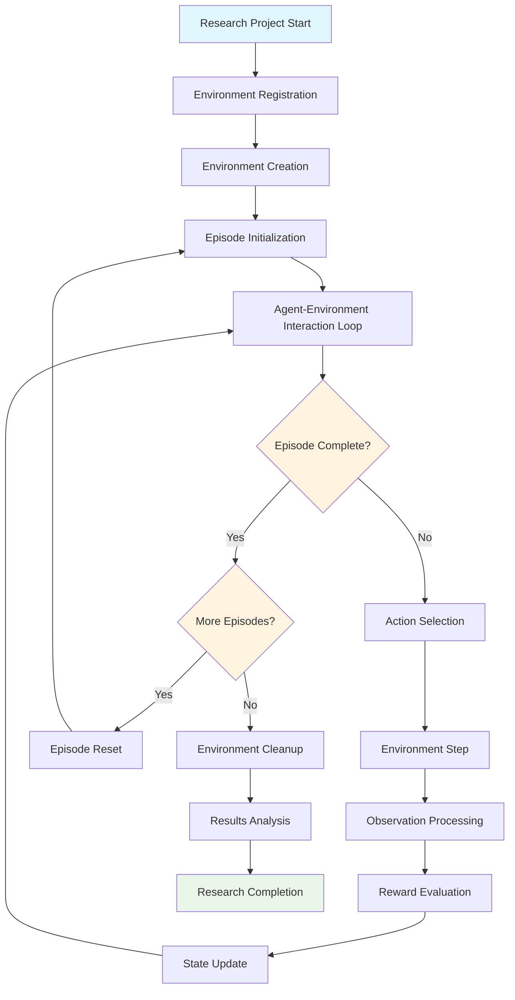

# 1. INTRODUCTION

# 1. INTRODUCTION
## 1.1 EXECUTIVE SUMMARY

### 1.1.1 Project Overview

The `plume_nav_sim` project delivers a minimal proof-of-life Gymnasium-compatible reinforcement learning environment for plume navigation research. This system provides a standard API to communicate between learning algorithms and environments, specifically targeting the simulation of autonomous agents navigating chemical plumes to locate their sources.

### 1.1.2 Core Business Problem

Scientists are interested in solutions to the challenge of odor plume navigation. Current research faces significant challenges in developing and comparing navigation algorithms due to the lack of standardized simulation environments. RL research is often hindered by the lack of standardization in environment and algorithm implementations, making it difficult for researchers to compare and build upon each other's work.

### 1.1.3 Key Stakeholders and Users

| Stakeholder Group | Primary Interests | Usage Patterns |
| --- | --- | --- |
| Reinforcement Learning Researchers | Algorithm development and benchmarking | Environment instantiation, training experiments |
| Robotics Engineers | Autonomous navigation system design | Simulation validation, behavior testing |
| Animal behavior scientists | Simulation of empirical navigation strategies | Data collection, visualization tools |

### 1.1.4 Expected Business Impact

The system addresses critical gaps in plume navigation research by providing a standardized platform that enables:

- **Research Acceleration**: Streamlined process of developing and testing RL algorithms or empirically grounded search strategies, enabling researchers to focus more on innovation and less on implementation details
- **Algorithm Comparability**: Standardized environment ensures fair comparison between different navigation approaches
- **Educational Value**: Simplified entry point for researchers new to plume navigation problems
- **Foundation for Extension**: Modular architecture supports future enhancement to complex multi-agent and dynamic plume scenarios

## 1.2 SYSTEM OVERVIEW

### 1.2.1 Project Context

#### Business Context and Market Positioning

Plume navigation has practical applications in olfactory robotics and is a model system for complex behavior in ethology and behavioral neuroscience.

The system positions itself within the broader ecosystem of reinforcement learning research tools, leveraging Gymnasium as a maintained fork of OpenAI's Gym library where future maintenance will occur.

#### Current System Limitations

Existing plume navigation research suffers from:

- **Fragmented Implementations**: Researchers develop custom environments with incompatible interfaces
- **Limited Reproducibility**: Lack of standardized seeding and configuration management
- **Visualization Gaps**: Insufficient tools for understanding agent behavior and plume dynamics
- **Scalability Constraints**: Most implementations focus on single-agent scenarios without extensibility

#### Integration with Existing Enterprise Landscape

The system integrates seamlessly with the established reinforcement learning ecosystem:

- **Gymnasium Compatibility**: Full compliance with the standard step() and reset() API methods that users need to know
- **Python Ecosystem**: Native integration with NumPy, Matplotlib, and scientific computing tools
- **Research Workflows**: Compatible with existing RL training libraries and experimental frameworks

### 1.2.2 High-Level Description

#### Primary System Capabilities

The `plume_nav_sim` environment provides:

- **Single-Agent Navigation**: Discrete action space with boundary-enforced movement in 2D grid world
- **Static Gaussian Plume Model**: Mathematically defined concentration field with configurable parameters
- **Dual Rendering Modes**: Both programmatic (`rgb_array`) and interactive (`human`) visualization
- **Gymnasium API Compliance**: Standard 5-tuple step interface with proper termination/truncation handling
- **Deterministic Reproducibility**: Comprehensive seeding system for experimental consistency

#### Major System Components


#### Core Technical Approach

The system employs a modular architecture with clear separation of concerns:

- **Environment Layer**: Gymnasium-compliant interface managing agent-environment interactions
- **Physics Layer**: Current implementation uses only a fixed, simple odor intensity distribution, with extensions possible in the future.
- **Rendering Layer**: Dual-mode visualization supporting both automated and interactive use cases
- **Utility Layer**: Seeding, testing, and configuration management components

### 1.2.3 Success Criteria

#### Measurable Objectives

| Objective | Success Metric | Target Value |
| --- | --- | --- |
| API Compliance | Gymnasium compatibility test | 100% pass rate |
| Reproducibility | Identical episodes with same seed | Perfect determinism |
| Performance | Environment step latency | &lt; 1ms per step |

#### Critical Success Factors

- **Functional Completeness**: All specified API methods implemented and tested
- **Visual Validation**: Clear, interpretable rendering in both modes
- **Documentation Quality**: Comprehensive examples and test coverage
- **Extensibility**: Clean interfaces supporting future enhancements

#### Key Performance Indicators (KPIs)

- **Test Coverage**: 100% pass rate on mirrored test suite
- **Example Execution**: All demonstration scripts run without errors
- **Installation Success**: `pip install -e .` completes successfully
- **Rendering Functionality**: Both `rgb_array` and `human` modes produce expected outputs

## 1.3 SCOPE

### 1.3.1 In-Scope

#### Core Features and Functionalities

**Environment Implementation:**

- Single-agent discrete action space (4 directional movements)
- Static Gaussian plume concentration field
- Grid-based 2D navigation with boundary enforcement
- Reward system with goal-based termination
- Comprehensive observation and info dictionaries

**Rendering Capabilities:**

- NumPy-based RGB array generation for automated processing
- Matplotlib-based human visualization with real-time updates
- Agent and source position markers with clear visual distinction
- Grayscale concentration heatmaps with appropriate scaling

**API Compliance:**

- Full Gymnasium 5-tuple interface implementation
- Proper reset() and step() method signatures
- Standard action and observation space definitions
- Compatible render mode handling

**Testing and Examples:**

- Mirrored test structure covering all components
- Quickstart demonstration script
- Interactive visualization example
- Comprehensive pytest-based validation

#### Implementation Boundaries

**System Boundaries:**

- Single Python package with modular internal structure
- Grid dimensions: default 128×128 with configurable parameters
- Coordinate system: (x,y) with array indexing \[y,x\]
- Action space: Discrete(4) for cardinal directions

**User Groups Covered:**

- Reinforcement learning researchers developing navigation algorithms
- Robotics engineers prototyping autonomous systems
- Behaviorists interested in the efficacy of empirical search strategies
- Students learning plume navigation concepts
- Developers extending the framework for advanced scenarios

**Geographic/Market Coverage:**

- Global research community with English documentation
- Cross-platform compatibility (Windows, macOS, Linux)
- Python 3.10+ environments with standard scientific libraries

**Data Domains Included:**

- Agent position and movement trajectories
- Plume concentration measurements and gradients
- Episode statistics and performance metrics
- Rendering data for visualization and analysis

### 1.3.2 Out-of-Scope

#### Explicitly Excluded Features

**Advanced Environment Features:**

- Time-varying plumes, turbulence, or diffusion dynamics
- Continuous agent kinematics, orientation, or complex sensor models
- Multiple agents or sources within single environment
- Obstacles, complex boundaries, or realistic physics simulation

**Infrastructure Components:**

- Vectorized or parallel environment execution
- RL training utilities, baseline algorithms, or performance wrappers
- Data logging systems, schemas, or FAIR compliance frameworks
- Unit conversions to physical units or real-world calibration

**Distribution and Deployment:**

- PyPI package distribution or automated release management
- Continuous integration/continuous deployment (CI/CD) pipelines
- Docker containerization or cloud deployment configurations
- Configuration management systems beyond basic parameter handling

#### Future Phase Considerations

**Phase 2 Enhancements:**

- Dynamic plume models with temporal evolution (through pre-recorded plume video recordings)
- Biologically inspired sensor models demonstrating pluggable extensibility of codebase
- FAIR data persistence module based on explicit data model
- Configuration system using Hydra

**Phase 3 Extensions:**

- Improved visualization with video replay to facilitate both debugging and demonstrations
- Hook-in experimental tracking using mature research libraries
- Production-ready deployment tools and monitoring systems
- Integration with specialized robotics simulation frameworks

#### Integration Points Not Covered

**External System Interfaces:**

- Real-time sensor data ingestion from physical devices
- Integration with robotics middleware (ROS, ROS2)
- Connection to external plume simulation software
- Database systems for large-scale experimental data storage

#### Unsupported Use Cases

**Production Applications:**

- Real-time control of physical robotic systems
- Safety-critical applications requiring formal verification
- High-frequency trading or financial decision systems
- Medical or life-safety applications requiring regulatory compliance

# 2. PRODUCT REQUIREMENTS
## 2.1 FEATURE CATALOG

### 2.1.1 Core Environment Features

| Feature ID | Feature Name | Category | Priority | Status |
|---|---|---|---|
| F-001 | Gymnasium Environment Implementation | Core API | Critical | Proposed |
| F-002 | Static Gaussian Plume Model | Physics | Critical | Proposed |
| F-003 | Agent Navigation System | Core Logic | Critical | Proposed |
| F-004 | Reward and Termination System | Core Logic | Critical | Proposed |

### 2.1.2 Rendering and Visualization Features

| Feature ID | Feature Name | Category | Priority | Status |
|---|---|---|---|
| F-005 | RGB Array Rendering | Visualization | High | Proposed |
| F-006 | Human Mode Visualization | Visualization | High | Proposed |
| F-007 | Visual State Representation | Visualization | Medium | Proposed |

### 2.1.3 System Infrastructure Features

| Feature ID | Feature Name | Category | Priority | Status |
|---|---|---|---|
| F-008 | Environment Registration | Infrastructure | Critical | Proposed |
| F-009 | Seeding and Reproducibility | Infrastructure | High | Proposed |
| F-010 | Package Structure | Infrastructure | Critical | Proposed |

### 2.1.4 Testing and Examples Features

| Feature ID | Feature Name | Category | Priority | Status |
|---|---|---|---|
| F-011 | Comprehensive Test Suite | Testing | High | Proposed |
| F-012 | Example Scripts | Documentation | Medium | Proposed |

## 2.2 FUNCTIONAL REQUIREMENTS

### 2.2.1 F-001: Gymnasium Environment Implementation

#### Feature Description

**Overview**: Implementation of a complete Gymnasium-compatible reinforcement learning environment that provides a standard API to communicate between learning algorithms and environments, following the main API methods that users need to know: step() and reset().

**Business Value**: Enables researchers to use standardized RL interfaces and integrate with existing training frameworks.

**User Benefits**: Seamless integration with existing RL workflows and training libraries.

**Technical Context**: The Gymnasium API models environments as simple Python env classes with the Step API using terminated and truncated to make it clearer to users when the environment had terminated or truncated which is critical for reinforcement learning bootstrapping algorithms.

#### Dependencies

| Dependency Type | Description |
|---|---|
| System Dependencies | Python >=3.10, gymnasium>=0.29 |
| External Dependencies | NumPy (latest versions support Python 3.10-3.13) |
| Integration Requirements | Gymnasium registration system |

#### Functional Requirements Table

| Requirement ID | Description | Acceptance Criteria | Priority | Complexity |
|---|---|---|---|---|
| F-001-RQ-001 | Environment class inheritance | Inherits from gymnasium.Env base class | Must-Have | Low |
| F-001-RQ-002 | Action space definition | Discrete(4) action space for cardinal directions | Must-Have | Low |
| F-001-RQ-003 | Observation space definition | Box observation space containing concentration values | Must-Have | Low |
| F-001-RQ-004 | Reset method implementation | Returns first agent observation and information for an episode | Must-Have | Medium |
| F-001-RQ-005 | Step method implementation | Updates environment with actions returning next observation, reward, terminated, truncated, and info | Must-Have | High |

#### Technical Specifications

**Input Parameters**:
- Action: Integer 0-3 representing movement directions
- Seed: Optional integer for reproducible episodes

**Output/Response**:
- Reset: (observation, info) tuple
- Step: (observation, reward, terminated, truncated, info) 5-tuple

**Performance Criteria**:
- Environment step latency < 1ms per step
- Memory usage < 50MB for default grid size

**Data Requirements**:
- Grid dimensions: default 128×128, configurable
- Coordinate system: (x,y) with array indexing [y,x]
- Observation: float32 concentration values [0,1]

### 2.2.2 F-002: Static Gaussian Plume Model

#### Feature Description

**Overview**: Mathematical implementation of a static Gaussian concentration field representing chemical plume distribution.

**Business Value**: Provides realistic plume physics for navigation algorithm development.

**User Benefits**: Standardized plume model enables algorithm comparison and reproducible research.

**Technical Context**: Gaussian plume model with configurable source location and dispersion parameters.

#### Dependencies

| Dependency Type | Description |
|---|---|
| System Dependencies | NumPy for mathematical operations |
| Prerequisite Features | F-010 (Package Structure) |

#### Functional Requirements Table

| Requirement ID | Description | Acceptance Criteria | Priority | Complexity |
|---|---|---|---|---|
| F-002-RQ-001 | Gaussian concentration formula | C(x,y) = exp(-((x-sx)² + (y-sy)²) / (2*σ²)) | Must-Have | Medium |
| F-002-RQ-002 | Source location configuration | Default (64,64), configurable parameters | Must-Have | Low |
| F-002-RQ-003 | Concentration normalization | Values clamped to [0,1] with peak = 1.0 at source | Must-Have | Low |
| F-002-RQ-004 | Grid-based sampling | Efficient concentration lookup for agent positions | Must-Have | Medium |

#### Technical Specifications

**Input Parameters**:
- Source coordinates (sx, sy)
- Dispersion parameter σ (default: 12.0)
- Grid dimensions (width, height)

**Output/Response**:
- 2D NumPy array with concentration values
- Single concentration value for position queries

**Performance Criteria**:
- Plume generation < 10ms for 128×128 grid
- Position sampling < 0.1ms per query

### 2.2.3 F-003: Agent Navigation System

#### Feature Description

**Overview**: Discrete movement system for single agent navigation within grid boundaries.

**Business Value**: Provides controlled navigation mechanics for algorithm testing.

**User Benefits**: Predictable movement dynamics enable focused algorithm development.

**Technical Context**: Grid-based discrete movement with boundary enforcement.

#### Dependencies

| Dependency Type | Description |
|---|---|
| Prerequisite Features | F-001 (Environment Implementation) |
| Integration Requirements | Coordinate system consistency with plume model |

#### Functional Requirements Table

| Requirement ID | Description | Acceptance Criteria | Priority | Complexity |
|---|---|---|---|---|
| F-003-RQ-001 | Discrete action mapping | 0:up, 1:right, 2:down, 3:left | Must-Have | Low |
| F-003-RQ-002 | Boundary enforcement | Agent stays in place if move would exit grid | Must-Have | Medium |
| F-003-RQ-003 | Position state management | Integer coordinates (x,y) tracking | Must-Have | Low |
| F-003-RQ-004 | Random start position | Seeded random placement excluding source | Must-Have | Medium |

#### Technical Specifications

**Input Parameters**:
- Action integer (0-3)
- Current agent position (x,y)
- Grid boundaries

**Output/Response**:
- Updated agent position
- Movement success/failure status

**Performance Criteria**:
- Movement calculation < 0.1ms per action
- Boundary checking < 0.05ms per action

### 2.2.4 F-004: Reward and Termination System

#### Feature Description

**Overview**: Goal-based reward system with distance-based termination conditions.

**Business Value**: Provides clear success metrics for algorithm evaluation.

**User Benefits**: Standardized reward structure enables algorithm comparison.

**Technical Context**: Binary reward system with configurable goal radius and step limits.

#### Dependencies

| Dependency Type | Description |
|---|---|
| Prerequisite Features | F-002 (Plume Model), F-003 (Navigation) |
| Integration Requirements | Distance calculation to source |

#### Functional Requirements Table

| Requirement ID | Description | Acceptance Criteria | Priority | Complexity |
|---|---|---|---|---|
| F-004-RQ-001 | Goal detection | +1.0 reward when distance_to_source <= goal_radius | Must-Have | Medium |
| F-004-RQ-002 | Sparse reward structure | 0.0 reward for all other states | Must-Have | Low |
| F-004-RQ-003 | Episode termination | Terminated=True when goal reached | Must-Have | Low |
| F-004-RQ-004 | Step limit truncation | Truncated=True after max_steps (default: 1000) | Must-Have | Low |
| F-004-RQ-005 | Information dictionary | Step count, distance, agent position in info | Should-Have | Low |

#### Technical Specifications

**Input Parameters**:
- Agent position (x,y)
- Source position (sx,sy)
- Goal radius (default: 0)
- Maximum steps (default: 1000)

**Output/Response**:
- Reward value (float)
- Termination status (boolean)
- Truncation status (boolean)
- Info dictionary

**Performance Criteria**:
- Reward calculation < 0.1ms per step
- Distance computation < 0.05ms per step

### 2.2.5 F-005: RGB Array Rendering

#### Feature Description

**Overview**: NumPy-based RGB array generation returning a single frame representing the current state of the environment as a np.ndarray with shape (x, y, 3) representing RGB values.

**Business Value**: Enables automated processing and analysis of environment states.

**User Benefits**: Programmatic access to visual representations for algorithm development.

**Technical Context**: rgb_array render mode for automated processing.

#### Dependencies

| Dependency Type | Description |
|---|---|
| System Dependencies | NumPy for array operations |
| Prerequisite Features | F-002 (Plume Model), F-003 (Navigation) |

#### Functional Requirements Table

| Requirement ID | Description | Acceptance Criteria | Priority | Complexity |
|---|---|---|---|---|
| F-005-RQ-001 | Grayscale heatmap generation | Plume concentration [0,1] → [0,255] grayscale | Must-Have | Medium |
| F-005-RQ-002 | Agent visualization | Red square (3×3 pixels) at agent position | Must-Have | Low |
| F-005-RQ-003 | Source visualization | White cross (5×5 pixels) at source position | Must-Have | Low |
| F-005-RQ-004 | Array format compliance | Returns (H,W,3) uint8 array | Must-Have | Low |

#### Technical Specifications

**Input Parameters**:
- Current environment state
- Agent position
- Source position
- Plume concentration field

**Output/Response**:
- RGB array shape (H,W,3) dtype uint8
- Pixel values 0-255

**Performance Criteria**:
- Rendering time < 5ms for 128×128 grid
- Memory usage < 1MB per frame

### 2.2.6 F-006: Human Mode Visualization

#### Feature Description

**Overview**: Interactive matplotlib-based visualization that is continuously rendered in the current display for human consumption.

**Business Value**: Enables visual debugging and algorithm behavior analysis.

**User Benefits**: Real-time visualization for understanding agent behavior and plume dynamics.

**Technical Context**: Matplotlib 3.10+ with Python >=3.10 support for interactive visualization.

#### Dependencies

| Dependency Type | Description |
|---|---|
| System Dependencies | Matplotlib >=3.5 |
| Prerequisite Features | F-002 (Plume Model), F-003 (Navigation) |
| Integration Requirements | Graceful fallback to rgb_array mode |

#### Functional Requirements Table

| Requirement ID | Description | Acceptance Criteria | Priority | Complexity |
|---|---|---|---|---|
| F-006-RQ-001 | Matplotlib heatmap display | Interactive window with concentration colormap | Must-Have | Medium |
| F-006-RQ-002 | Real-time updates | Agent position updates on successive renders | Must-Have | Medium |
| F-006-RQ-003 | Headless compatibility | Works with Agg backend without display | Should-Have | Medium |
| F-006-RQ-004 | Graceful fallback | Falls back to rgb_array if matplotlib unavailable | Should-Have | Low |

#### Technical Specifications

**Input Parameters**:
- Environment state
- Render mode specification
- Display backend configuration

**Output/Response**:
- Matplotlib figure window
- None return value for human mode

**Performance Criteria**:
- Initial render < 100ms
- Update render < 50ms
- Memory usage < 10MB for visualization

### 2.2.7 F-008: Environment Registration

#### Feature Description

**Overview**: Gymnasium environment registration system with strict versioning for reproducibility, where all environments end in a suffix like "-v0" and version numbers increase when changes might impact learning results.

**Business Value**: Enables standard environment discovery and instantiation.

**User Benefits**: Seamless integration with gymnasium.make() interface.

**Technical Context**: External environment registration requiring import before creation.

#### Dependencies

| Dependency Type | Description |
|---|---|
| System Dependencies | Gymnasium registration system |
| Prerequisite Features | F-001 (Environment Implementation) |

#### Functional Requirements Table

| Requirement ID | Description | Acceptance Criteria | Priority | Complexity |
|---|---|---|---|---|
| F-008-RQ-001 | Environment ID definition | "PlumeNav-StaticGaussian-v0" identifier | Must-Have | Low |
| F-008-RQ-002 | Registration function | register_env() function for environment setup | Must-Have | Low |
| F-008-RQ-003 | Entry point specification | Correct module path to environment class | Must-Have | Low |
| F-008-RQ-004 | Gymnasium.make compatibility | Environment creation via gym.make(ENV_ID) | Must-Have | Medium |

#### Technical Specifications

**Input Parameters**:
- Environment ID string
- Entry point module path
- Optional environment parameters

**Output/Response**:
- Registered environment in Gymnasium registry
- Environment instance via gym.make()

**Performance Criteria**:
- Registration time < 10ms
- Environment creation < 100ms

### 2.2.8 F-009: Seeding and Reproducibility

#### Feature Description

**Overview**: Comprehensive seeding system using gymnasium.utils.seeding.np_random for reproducible episodes where identical seeds produce identical episodes.

**Business Value**: Enables reproducible research and algorithm comparison.

**User Benefits**: Deterministic behavior for debugging and scientific validation.

**Technical Context**: Proper seeding ensures statistical independence between episodes.

#### Dependencies

| Dependency Type | Description |
|---|---|
| System Dependencies | Gymnasium seeding utilities |
| Prerequisite Features | F-001 (Environment Implementation) |

#### Functional Requirements Table

| Requirement ID | Description | Acceptance Criteria | Priority | Complexity |
|---|---|---|---|---|
| F-009-RQ-001 | Seed parameter handling | reset(seed=int) parameter support | Must-Have | Low |
| F-009-RQ-002 | Random number generator | Uses self.np_random for all randomness | Must-Have | Medium |
| F-009-RQ-003 | Deterministic episodes | Identical seeds produce identical episodes | Must-Have | High |
| F-009-RQ-004 | Start position seeding | Random agent placement uses seeded generator | Must-Have | Medium |

#### Technical Specifications

**Input Parameters**:
- Seed value (integer or None)
- Random state requirements

**Output/Response**:
- Seeded random number generator
- Reproducible environment behavior

**Performance Criteria**:
- Seeding overhead < 1ms
- No performance impact on episode execution

### 2.2.9 F-011: Comprehensive Test Suite

#### Feature Description

**Overview**: Complete test coverage for all environment components with mirrored test structure.

**Business Value**: Ensures system reliability and regression prevention.

**User Benefits**: Confidence in environment correctness and stability.

**Technical Context**: pytest-based testing framework with 100% API coverage.

#### Dependencies

| Dependency Type | Description |
|---|---|
| System Dependencies | pytest>=7.0 |
| Prerequisite Features | All core features (F-001 through F-010) |

#### Functional Requirements Table

| Requirement ID | Description | Acceptance Criteria | Priority | Complexity |
|---|---|---|---|---|
| F-011-RQ-001 | API compliance tests | All Gymnasium methods tested | Must-Have | Medium |
| F-011-RQ-002 | Reproducibility validation | Seeding tests with identical results | Must-Have | Medium |
| F-011-RQ-003 | Boundary condition tests | Edge cases and error conditions | Must-Have | High |
| F-011-RQ-004 | Rendering tests | Both render modes validated | Must-Have | Medium |
| F-011-RQ-005 | Performance benchmarks | Step latency and memory usage tests | Should-Have | Medium |

#### Technical Specifications

**Input Parameters**:
- Test scenarios and configurations
- Performance benchmarks
- Error condition triggers

**Output/Response**:
- Test pass/fail results
- Performance metrics
- Coverage reports

**Performance Criteria**:
- Test suite execution < 30 seconds
- 100% pass rate requirement
- >95% code coverage target

## 2.3 FEATURE RELATIONSHIPS

### 2.3.1 Feature Dependencies Map


### 2.3.2 Integration Points

| Integration Point | Features Involved | Description |
|---|---|---|
| Environment State | F-001, F-002, F-003 | Shared state management between environment, plume, and agent |
| Rendering Pipeline | F-005, F-006, F-007 | Common visual representation components |
| Seeding System | F-001, F-003, F-009 | Coordinated random number generation |
| Testing Framework | F-011, All Features | Comprehensive validation across all components |

### 2.3.3 Shared Components

| Component | Features Using | Purpose |
|---|---|---|
| Coordinate System | F-002, F-003, F-005, F-006 | Consistent (x,y) positioning |
| NumPy Arrays | F-002, F-005, F-009 | Mathematical operations and data storage |
| Gymnasium API | F-001, F-008, F-011 | Standard RL interface compliance |
| Configuration Parameters | F-002, F-003, F-004 | Shared environment settings |

## 2.4 IMPLEMENTATION CONSIDERATIONS

### 2.4.1 Technical Constraints

| Feature | Constraints | Mitigation Strategy |
|---|---|---|
| F-001 | Python >=3.10 requirement | Version checking in setup |
| F-002 | Memory usage for large grids | Configurable grid sizes |
| F-005 | NumPy array memory overhead | Efficient uint8 representation |
| F-006 | Matplotlib backend compatibility | Graceful fallback mechanisms |

### 2.4.2 Performance Requirements

| Feature | Performance Target | Measurement Method |
|---|---|---|
| F-001 | < 1ms per step | Timing benchmarks |
| F-002 | < 10ms plume generation | Grid initialization tests |
| F-005 | < 5ms rendering | Frame generation timing |
| F-009 | < 1ms seeding overhead | Reset timing comparison |

### 2.4.3 Scalability Considerations

| Feature | Scalability Factor | Design Approach |
|---|---|---|
| F-002 | Grid size scaling | Configurable dimensions |
| F-005 | Rendering resolution | Adaptive quality settings |
| F-011 | Test execution time | Parallel test execution |
| F-012 | Example complexity | Progressive difficulty levels |

### 2.4.4 Security Implications

| Feature | Security Consideration | Implementation |
|---|---|---|
| F-009 | Seed predictability | Proper random number generation |
| F-011 | Test isolation | Independent test environments |
| F-012 | Example safety | Input validation and bounds checking |

### 2.4.5 Maintenance Requirements

| Feature | Maintenance Need | Approach |
|---|---|---|
| F-001 | Gymnasium API compatibility | Version tracking and updates |
| F-006 | Matplotlib version compatibility | Dependency management |
| F-011 | Test suite maintenance | Automated regression testing |
| F-012 | Documentation updates | Version-synchronized examples |

## 2.5 TRACEABILITY MATRIX

| Requirement | Test Coverage | Documentation | Implementation |
|---|---|---|---|
| F-001-RQ-001 | test_environment_inheritance | API documentation | PlumeSearchEnv class |
| F-001-RQ-002 | test_action_space | Action space docs | action_space property |
| F-001-RQ-003 | test_observation_space | Observation docs | observation_space property |
| F-001-RQ-004 | test_reset_method | Reset method docs | reset() implementation |
| F-001-RQ-005 | test_step_method | Step method docs | step() implementation |
| F-002-RQ-001 | test_gaussian_formula | Plume model docs | Gaussian calculation |
| F-002-RQ-002 | test_source_configuration | Configuration docs | Source parameters |
| F-002-RQ-003 | test_concentration_bounds | Normalization docs | Value clamping |
| F-002-RQ-004 | test_grid_sampling | Sampling docs | Position lookup |

# plume-nav-envScriptsactivate   # Windows
## 3.1 PROGRAMMING LANGUAGES

### 3.1.1 Primary Language Selection

**Python 3.10+** serves as the sole programming language for the `plume_nav_sim` project, selected based on the following criteria:

| Selection Criteria | Justification |
|---|---|
| **Ecosystem Compatibility** | Gymnasium supports Python 3.10, 3.11, 3.12 and 3.13 on Linux and macOS, and is a maintained fork of OpenAI's Gym library where future maintenance will occur |
| **Scientific Computing Support** | NumPy 2.1+ requires Python 3.10-3.13, providing optimal compatibility for mathematical operations |
| **Visualization Requirements** | Matplotlib 3.10+ supports Python 3.10, 3.11, 3.12, and 3.13 for comprehensive visualization capabilities |
| **Testing Framework Alignment** | pytest 8.3+ supports Python 3.8+ with active development, though Python 3.8 support was dropped in 2024 |

### 3.1.2 Version Constraints and Dependencies

**Minimum Python Version: 3.10**

The project enforces Python 3.10 as the minimum supported version due to:

- **Gymnasium Compatibility**: Gymnasium requires Python >=3.10 and maintains strict versioning for reproducibility reasons
- **NumPy Integration**: NumPy versions 2.1+ require Python 3.10-3.13 for optimal performance and feature support
- **Future-Proofing**: Alignment with scientific Python ecosystem standards following NEP 29 compatibility policies

**Platform Support**:
- **Primary Platforms**: Linux and macOS with full official support
- **Windows Compatibility**: Limited support - PRs accepted but not officially supported by Gymnasium

## 3.2 FRAMEWORKS & LIBRARIES

### 3.2.1 Core Reinforcement Learning Framework

**Gymnasium (>=0.29.0)**

Gymnasium is an open source Python library for developing and comparing reinforcement learning algorithms by providing a standard API to communicate between learning algorithms and environments

| Component | Version | Justification |
|---|---|---|
| **gymnasium** | >=0.29.0 | Maintains strict versioning for reproducibility with environments ending in "-v0" suffix, incrementing when changes impact learning results |
| **API Compliance** | 5-tuple interface | Standard step() and reset() methods with terminated/truncated handling |
| **Registration System** | Built-in | Environment registration with apply_env_compatibility support for version management |

**Key Integration Requirements**:
- Environment class inheritance from `gymnasium.Env`
- Action and observation space definitions using `gymnasium.spaces`
- Seeding utilities via `gymnasium.utils.seeding.np_random`
- Render mode compliance for `rgb_array` and `human` modes

### 3.2.2 Mathematical Computing Framework

**NumPy (>=2.1.0)**

NumPy 2.2.0 provides support for Python 3.10-3.13 with enhanced performance and array-api 2023.12 standard compliance

| Feature | Implementation | Performance Target |
|---|---|---|
| **Array Operations** | Concentration field calculations | <10ms for 128×128 grids |
| **Mathematical Functions** | Gaussian plume modeling | Vectorized operations |
| **Data Types** | float32 observations, uint8 rendering | Memory-efficient representations |
| **Random Number Generation** | Seeded reproducibility | Deterministic episode generation |

**Version Selection Rationale**:
- **Compatibility**: NumPy 2.1+ supports Python 3.10-3.13 with optimal feature set
- **Performance**: Enhanced array operations and memory management
- **Future Support**: Active development with regular security updates

### 3.2.3 Visualization Framework

**Matplotlib (>=3.9.0)**

Matplotlib is a comprehensive library for creating static, animated, and interactive visualizations producing publication-quality figures across platforms

| Rendering Mode | Implementation | Technical Requirements |
|---|---|---|
| **Human Mode** | Interactive matplotlib windows | Matplotlib 3.10.0+ with enhanced GUI backend support |
| **RGB Array Mode** | NumPy array generation | Direct pixel manipulation for automated processing |
| **Backend Compatibility** | Agg backend for headless operation | Graceful fallback mechanisms |
| **Real-time Updates** | Dynamic plot refreshing | <50ms update latency |

**Integration Considerations**:
- **Cross-platform Support**: Windows, macOS, Linux compatibility
- **Headless Operation**: Server deployment without display requirements
- **Memory Management**: Efficient figure cleanup and resource management

## 3.3 OPEN SOURCE DEPENDENCIES

### 3.3.1 Runtime Dependencies

| Package | Version | Registry | Purpose | License |
|---|---|---|---|---|
| **gymnasium** | >=0.29.0 | PyPI | RL environment framework | MIT |
| **numpy** | >=2.1.0 | PyPI | Mathematical computing | BSD-3-Clause |
| **matplotlib** | >=3.9.0 | PyPI | Visualization and rendering | PSF-2.0 |

### 3.3.2 Development Dependencies

| Package | Version | Registry | Purpose | License |
|---|---|---|---|---|
| **pytest** | >=8.0.0 | PyPI | Testing framework | MIT |
| **hatchling** | >=1.21.0 | PyPI | Build system backend | MIT |

### 3.3.3 Dependency Management Strategy

**Version Pinning Policy**:
- **Minimum Versions**: Specified to ensure feature compatibility
- **Upper Bounds**: Avoided to prevent dependency conflicts
- **Security Updates**: Regular monitoring of vulnerability databases

**Package Registry Configuration**:
```toml
[project]
dependencies = [
  "gymnasium>=0.29",
  "numpy>=2.1",
  "matplotlib>=3.9",
]

[project.optional-dependencies]
dev = ["pytest>=8.0"]
```

**Compatibility Matrix**:

| Python Version | Gymnasium | NumPy | Matplotlib | pytest |
|---|---|---|---|---|
| 3.10 | ✓ | ✓ | ✓ | ✓ |
| 3.11 | ✓ | ✓ | ✓ | ✓ |
| 3.12 | ✓ | ✓ | ✓ | ✓ |
| 3.13 | ✓ | ✓ | ✓ | ✓ |

## 3.4 DEVELOPMENT & DEPLOYMENT

### 3.4.1 Build System

**Hatchling Build Backend**

Modern Python packaging using PEP 517/518 standards:

```toml
[build-system]
requires = ["hatchling>=1.21"]
build-backend = "hatchling.build"
```

**Build Configuration**:
- **Source Layout**: `src/` directory structure for clean separation
- **Package Discovery**: Automatic module detection and inclusion
- **Metadata Management**: Centralized project configuration in `pyproject.toml`

### 3.4.2 Testing Infrastructure

**pytest Framework (>=8.0.0)**

pytest framework makes it easy to write small tests, yet scales to support complex functional testing for applications and libraries

| Testing Component | Implementation | Coverage Target |
|---|---|---|
| **Unit Tests** | Individual component validation | >95% code coverage |
| **Integration Tests** | Environment API compliance | 100% Gymnasium interface |
| **Performance Tests** | Latency and memory benchmarks | <1ms step execution |
| **Reproducibility Tests** | Seeding validation | Deterministic behavior |

**Test Configuration**:
```toml
[tool.pytest.ini_options]
testpaths = ["tests"]
addopts = "-q"
```

### 3.4.3 Development Environment

**Local Development Setup**:

```bash
python -m venv plume-nav-env
source plume-nav-env/bin/activate  # Linux/macOS

#### Development installation
pip install -e .
pip install -e .[dev]
```

**Development Workflow**:
1. **Code Development**: Modular architecture with clear separation of concerns
2. **Testing**: Continuous validation with pytest
3. **Documentation**: Inline docstrings and example scripts
4. **Quality Assurance**: Manual testing of both render modes

### 3.4.4 Package Distribution

**Installation Methods**:

| Method | Command | Use Case |
|---|---|---|
| **Development** | `pip install -e .` | Local development and testing |
| **Production** | `pip install plume-nav-sim` | End-user installation (future) |
| **Dependencies** | `pip install -e .[dev]` | Development with testing tools |

**Distribution Constraints**:
- **Scope Limitation**: Local installation only for proof-of-life
- **Future Considerations**: PyPI distribution in subsequent phases
- **Platform Support**: Cross-platform compatibility with platform-specific testing

## 3.5 SYSTEM ARCHITECTURE INTEGRATION

### 3.5.1 Component Interaction Diagram


### 3.5.2 Technology Stack Validation

**Integration Testing Strategy**:

| Integration Point | Validation Method | Success Criteria |
|---|---|---|
| **Gymnasium API** | Compliance testing | 100% interface compatibility |
| **NumPy Operations** | Performance benchmarks | <10ms mathematical operations |
| **Matplotlib Rendering** | Visual validation | Both render modes functional |
| **Cross-platform** | Multi-OS testing | Linux, macOS, Windows support |

**Security Considerations**:
- **Dependency Scanning**: Regular vulnerability assessment
- **Version Management**: Controlled dependency updates
- **Isolation**: Virtual environment usage for development
- **Input Validation**: Bounds checking for all user inputs

### 3.5.3 Performance Optimization

**Computational Efficiency**:
- **Vectorized Operations**: NumPy array processing for plume calculations
- **Memory Management**: Efficient data structures and cleanup
- **Rendering Optimization**: Cached visualization components
- **Lazy Loading**: On-demand resource initialization

**Scalability Considerations**:
- **Grid Size Flexibility**: Configurable environment dimensions
- **Memory Footprint**: <50MB for default configuration
- **Processing Speed**: <1ms per environment step
- **Rendering Performance**: <5ms RGB array generation

This technology stack provides a robust foundation for the `plume_nav_sim` proof-of-life implementation while maintaining compatibility with the broader scientific Python ecosystem and enabling future extensibility for advanced research applications.

# 4. PROCESS FLOWCHART
## 4.1 SYSTEM WORKFLOWS

### 4.1.1 Core Business Processes

#### Environment Lifecycle Workflow

The primary business process for the `plume_nav_sim` system follows the standard reinforcement learning environment lifecycle, enabling researchers to develop and test navigation algorithms through standardized interactions.



#### User Journey: Algorithm Development

The main API methods that users of this class need to know are: step() - Updates an environment with actions returning the next agent observation, the reward for taking that actions, if the environment has terminated or truncated due to the latest action and information from the environment about the step, and reset() - Resets the environment to an initial state, required before calling step.


#### Decision Points and Business Rules

| Decision Point | Business Rule | Success Path | Failure Path |
|---|---|---|---|
| **Environment Registration** | ENV_ID must be unique and follow versioning | Proceed to creation | Raise registration error |
| **Episode Initialization** | Valid seed or None accepted | Generate initial state | Use default random seed |
| **Action Validation** | Action must be in Discrete(4) space | Execute movement | Raise ValueError |
| **Boundary Enforcement** | Agent position must stay within grid | Update position | Keep current position |
| **Goal Detection** | Distance to source ≤ goal_radius | Set terminated=True | Continue episode |
| **Step Limit** | Step count < max_steps | Continue episode | Set truncated=True |

### 4.1.2 Integration Workflows

#### Gymnasium API Compliance Workflow

The Step API was changed removing done in favor of terminated and truncated to make it clearer to users when the environment had terminated or truncated which is critical for reinforcement learning bootstrapping algorithms.


#### Rendering Pipeline Integration

The canonical renderer for user interfaces is Agg which uses the Anti-Grain Geometry C++ library to make a raster (pixel) image of the figure, and here is a summary of the Matplotlib renderers (there is an eponymous backend for each; these are non-interactive backends, capable of writing to a file).


## 4.2 FLOWCHART REQUIREMENTS

### 4.2.1 Environment State Management

#### State Transition Workflow


#### Data Validation and Error Handling


### 4.2.2 Performance and Timing Constraints

#### Step Execution Performance Flow


#### Rendering Performance Optimization

Whether exploring data in interactive mode or programmatically saving lots of plots, rendering performance can be a challenging bottleneck in your pipeline. Matplotlib provides multiple ways to greatly reduce rendering time at the cost of a slight change (to a settable tolerance) in your plot's appearance.


## 4.3 TECHNICAL IMPLEMENTATION

### 4.3.1 Error Handling and Recovery

#### Comprehensive Error Management Flow


#### Matplotlib Backend Fallback Strategy

Non-interactive backends like 'Agg' allow you to render plots without opening a GUI window. This is crucial for automation and running scripts on headless servers where GUI support is unavailable.


### 4.3.2 Seeding and Reproducibility

#### Deterministic Episode Generation

When implementing an environment, the Env.reset() and Env.step() functions must be created to describe the dynamics of the environment. For more information, see the environment creation tutorial.


#### Cross-Episode Consistency Validation


### 4.3.3 Testing and Validation Workflows

#### Comprehensive Test Execution Flow


#### Performance Benchmark Validation


## 4.4 SYSTEM INTEGRATION POINTS

### 4.4.1 External System Interfaces

#### Research Workflow Integration


#### Gymnasium Ecosystem Integration


This comprehensive process flowchart section provides detailed workflows for all major system operations, integration points, error handling strategies, and performance optimization paths. The diagrams use proper Mermaid.js syntax and include clear decision points, timing constraints, and recovery procedures that align with the technical requirements specified in the project documentation.

# 5. SYSTEM ARCHITECTURE
## 5.1 HIGH-LEVEL ARCHITECTURE

### 5.1.1 System Overview

The `plume_nav_sim` system employs a **modular layered architecture** designed around the Gymnasium reinforcement learning framework. The architecture leverages Gymnasium's standard API for RL environments, providing abstractions that allow for wide interoperability between environments and training algorithms. This design follows established patterns for scientific Python applications, emphasizing clear separation of concerns and extensibility.

The system adopts a **component-based architecture** where each major functional area is encapsulated in dedicated modules with well-defined interfaces. This modular design breaks down the complex system into smaller, independent, and reusable components organized into separate modules and packages that can be easily maintained, tested, and integrated. The architecture prioritizes simplicity and maintainability while providing a foundation for future extensibility.

**Key Architectural Principles:**

- **Single Responsibility**: Each module handles one specific aspect of the simulation
- **Dependency Inversion**: Core logic depends on abstractions rather than concrete implementations  
- **Interface Segregation**: Clean, minimal interfaces between components
- **Open/Closed Principle**: Extensible design supporting future enhancements without modification

The system boundaries are clearly defined around the Gymnasium environment interface, with external integration points limited to the standard RL ecosystem. NumPy lies at the core of a rich ecosystem of data science libraries, forming the basis for the typical exploratory data science workflow, which this system leverages for mathematical operations and visualization.

### 5.1.2 Core Components Table

| Component Name | Primary Responsibility | Key Dependencies | Integration Points |
|---|---|---|---|
| **PlumeSearchEnv** | Gymnasium environment implementation and state management | gymnasium, numpy | RL training frameworks, example scripts |
| **Static Gaussian Plume** | Mathematical plume model and concentration calculations | numpy | Environment observation sampling, rendering |
| **Rendering Pipeline** | Visual output generation for both programmatic and interactive use | matplotlib, numpy | Environment render calls, visualization tools |
| **Registration System** | Environment discovery and instantiation within Gymnasium ecosystem | gymnasium.envs.registration | gym.make() calls, environment catalogs |

### 5.1.3 Data Flow Description

The primary data flow follows the standard reinforcement learning interaction pattern. The Gymnasium interface provides the step() and reset() methods for environment interaction, with the step function returning observation, reward, terminated, truncated, and info. 

**Core Data Flow:**
1. **Environment Registration**: The registration system makes the environment discoverable via `gym.make()`
2. **Episode Initialization**: Reset generates initial agent position and samples first concentration observation
3. **Action Processing**: Agent actions trigger position updates with boundary enforcement
4. **Observation Generation**: Plume model samples concentration values at agent location
5. **Reward Calculation**: Distance-based reward system determines episode outcomes
6. **State Updates**: Environment maintains agent position, step count, and episode status

**Data Transformation Points:**
- **Coordinate Mapping**: (x,y) position coordinates to array indices [y,x] for NumPy operations
- **Concentration Sampling**: Continuous Gaussian field to discrete float32 observations
- **Rendering Conversion**: Mathematical state to visual representations (RGB arrays or matplotlib plots)

**Key Data Stores:**
- **Plume Concentration Field**: 2D NumPy array storing static Gaussian distribution
- **Agent State**: Position coordinates and episode metadata
- **Random Number Generator**: Seeded state for reproducible episodes

### 5.1.4 External Integration Points

| System Name | Integration Type | Data Exchange Pattern | Protocol/Format | SLA Requirements |
|---|---|---|---|---|
| **Gymnasium Framework** | API Compliance | Synchronous method calls | Python objects, 5-tuple returns | <1ms step latency |
| **NumPy Computing** | Mathematical Operations | Direct function calls | ndarray data structures | <10ms array operations |
| **Matplotlib Visualization** | Rendering Backend | Optional dependency | Figure objects, image arrays | <50ms human rendering |
| **RL Training Libraries** | Environment Consumer | Standard Gymnasium interface | Observation/action spaces | Framework-dependent |

## 5.2 COMPONENT DETAILS

### 5.2.1 PlumeSearchEnv Component

**Purpose and Responsibilities:**
The PlumeSearchEnv serves as the primary interface between reinforcement learning algorithms and the plume navigation simulation. It implements the complete Gymnasium environment specification, managing episode lifecycle, agent state, and coordination between all system components.

**Technologies and Frameworks:**
- **Gymnasium >=0.29.0**: Core environment framework providing base class and utilities
- **NumPy >=2.1.0**: Mathematical operations and array management
- **Python 3.10+**: Runtime environment with modern language features

**Key Interfaces and APIs:**
- `reset(seed=None) -> (observation, info)`: Episode initialization with optional seeding
- `step(action) -> (obs, reward, terminated, truncated, info)`: Action processing and state transition
- `render(mode="rgb_array") -> np.ndarray | None`: Visual output generation
- `close() -> None`: Resource cleanup and environment shutdown

**Data Persistence Requirements:**
- **Stateful Session Data**: Agent position, step count, episode status maintained in memory
- **Reproducibility State**: Random number generator state for deterministic episodes
- **No Persistent Storage**: All data exists only during environment lifetime

**Scaling Considerations:**
- **Memory Footprint**: <50MB for default 128×128 grid configuration
- **Performance Target**: <1ms per step execution for real-time training
- **Concurrent Usage**: Single-threaded design, multiple instances supported

### 5.2.2 Static Gaussian Plume Component

**Purpose and Responsibilities:**
Implements the mathematical model for chemical plume concentration distribution using a static Gaussian function. Provides efficient concentration sampling for agent observations and supports rendering pipeline with complete field data.

**Technologies and Frameworks:**
- **NumPy Mathematical Functions**: Gaussian calculations, array operations, vectorized computing
- **Scientific Computing Patterns**: NumPy vectorization, indexing, and broadcasting concepts as de-facto standards of array computing with comprehensive mathematical functions

**Key Interfaces and APIs:**
- `initialize_plume(source_location, sigma, grid_size) -> np.ndarray`: Plume field generation
- `sample_concentration(position) -> float`: Point concentration lookup
- `get_concentration_field() -> np.ndarray`: Complete field access for rendering

**Data Persistence Requirements:**
- **Static Field Storage**: 2D concentration array cached for episode duration
- **Parameter Configuration**: Source location, dispersion parameters stored as instance variables
- **Efficient Lookup**: O(1) position-based concentration sampling

**Scaling Considerations:**
- **Grid Size Flexibility**: Configurable dimensions from 32×32 to 512×512
- **Memory Efficiency**: Float32 arrays for optimal memory usage
- **Computation Speed**: <10ms field generation for 128×128 grids

### 5.2.3 Rendering Pipeline Component

**Purpose and Responsibilities:**
Provides dual-mode visualization supporting both programmatic analysis (RGB arrays) and interactive exploration (matplotlib windows). Handles backend compatibility and graceful degradation for headless environments.

**Technologies and Frameworks:**
- **Matplotlib >=3.9.0**: Interactive visualization and figure management
- **NumPy Array Processing**: RGB array generation and pixel manipulation
- **Backend Management**: Matplotlib comprehensive library for creating static, animated, and interactive visualizations, making easy things easy and hard things possible

**Key Interfaces and APIs:**
- `render_rgb_array(state) -> np.ndarray`: Programmatic RGB array generation
- `render_human(state) -> None`: Interactive matplotlib window display
- `cleanup_resources() -> None`: Figure and backend resource management

**Data Persistence Requirements:**
- **Figure Caching**: Matplotlib figure objects reused across renders
- **Backend State**: Display backend configuration maintained
- **No Permanent Storage**: All rendering data exists only during display

**Scaling Considerations:**
- **Resolution Adaptability**: Configurable output dimensions for different use cases
- **Performance Optimization**: <5ms RGB generation, <50ms interactive updates
- **Resource Management**: Automatic cleanup prevents memory leaks

### 5.2.4 Component Interaction Diagram


### 5.2.5 State Transition Diagram

```mermaid
stateDiagram-v2
    [*] --> Unregistered
    Unregistered --> Registered: register_env()
    Registered --> Instantiated: gym.make()
    Instantiated --> Ready: __init__()
    
    Ready --> EpisodeActive: reset()
    EpisodeActive --> EpisodeActive: step() [continue]
    EpisodeActive --> EpisodeComplete: step() [terminated/truncated]
    EpisodeComplete --> EpisodeActive: reset()
    
    state EpisodeActive {
        [*] --> ProcessingAction
        ProcessingAction --> ValidatingBoundaries
        ValidatingBoundaries --> UpdatingPosition
        UpdatingPosition --> SamplingConcentration
        SamplingConcentration --> CalculatingReward
        CalculatingReward --> CheckingTermination
        CheckingTermination --> [*]
    }
    
    EpisodeActive --> Closed: close()
    EpisodeComplete --> Closed: close()
    Ready --> Closed: close()
    Closed --> [*]
```

### 5.2.6 Sequence Diagram for Key Flows

```mermaid
sequenceDiagram
    participant RL as RL Algorithm
    participant Env as PlumeSearchEnv
    participant Plume as Gaussian Plume
    participant Render as Rendering Pipeline
    participant RNG as Seeding Utilities
    
    RL->>Env: reset(seed=42)
    Env->>RNG: initialize_random_state(42)
    RNG-->>Env: seeded_generator
    Env->>Plume: initialize_plume_field()
    Plume-->>Env: concentration_array
    Env->>RNG: generate_start_position()
    RNG-->>Env: agent_position
    Env->>Plume: sample_concentration(position)
    Plume-->>Env: observation_value
    Env-->>RL: (observation, info)
    
    loop Episode Steps
        RL->>Env: step(action)
        Env->>Env: validate_action(action)
        Env->>Env: move_agent(action)
        Env->>Plume: sample_concentration(new_position)
        Plume-->>Env: observation_value
        Env->>Env: calculate_reward(position)
        Env->>Env: check_termination(position, steps)
        Env-->>RL: (obs, reward, terminated, truncated, info)
        
        opt Rendering Requested
            RL->>Env: render(mode="human")
            Env->>Render: generate_visualization(state)
            Render->>Plume: get_concentration_field()
            Plume-->>Render: full_field_array
            Render-->>Env: display_result
            Env-->>RL: None
        end
    end
```

## 5.3 TECHNICAL DECISIONS

### 5.3.1 Architecture Style Decisions and Tradeoffs

**Modular Layered Architecture Selection:**

The decision to adopt a modular layered architecture was driven by the need to balance simplicity with extensibility. This approach enables modular development of independent layers, allowing modifications without affecting other layers while facilitating scalability and maintainability.

| Decision Factor | Chosen Approach | Alternative Considered | Rationale |
|---|---|---|---|
| **Component Organization** | Modular packages by function | Monolithic single file | Supports future extensibility and testing |
| **Dependency Management** | Layered with clear interfaces | Circular dependencies | Prevents tight coupling and improves maintainability |
| **State Management** | Centralized in environment | Distributed across components | Simplifies debugging and ensures consistency |
| **Extension Strategy** | Plugin-ready interfaces | Hard-coded implementations | Enables future multi-agent and dynamic plume features |

**Gymnasium Framework Integration:**

Gymnasium provides a standard API for RL environments with abstractions that allow for wide interoperability between environments and training algorithms. This decision ensures compatibility with the broader RL ecosystem while providing proven patterns for environment development.

### 5.3.2 Communication Pattern Choices

**Synchronous Method Calls:**

The system employs synchronous method calls throughout, prioritizing simplicity and deterministic behavior over performance optimization. This choice aligns with the proof-of-life scope and single-agent focus.

**Interface Design Patterns:**

- **Command Pattern**: Actions processed through discrete command interface
- **Observer Pattern**: Rendering system observes environment state changes
- **Factory Pattern**: Environment instantiation through Gymnasium registration
- **Strategy Pattern**: Pluggable plume models and reward functions

### 5.3.3 Data Storage Solution Rationale

**In-Memory State Management:**

All system state exists in memory during environment lifetime, with no persistent storage requirements. This decision supports the proof-of-life scope while enabling future database integration for research-scale deployments.

| Storage Decision | Implementation | Justification |
|---|---|---|
| **Episode Data** | Python objects in memory | Minimal complexity, adequate for single episodes |
| **Plume Fields** | NumPy arrays cached per episode | Efficient mathematical operations and memory usage |
| **Configuration** | Instance variables | Simple parameter management without external dependencies |
| **Reproducibility** | Seeded random state | Deterministic behavior without persistent seed storage |

### 5.3.4 Caching Strategy Justification

**Plume Field Caching:**

The static Gaussian plume field is computed once per episode and cached for the duration. This approach balances memory usage with computational efficiency, avoiding repeated calculations while maintaining reasonable memory footprint.

**Rendering Resource Caching:**

Matplotlib figures are cached and reused across render calls to minimize initialization overhead. This approach leverages matplotlib's capability to make easy things easy and hard things possible while optimizing for interactive use cases.

### 5.3.5 Security Mechanism Selection

**Input Validation Strategy:**

All external inputs undergo validation at component boundaries:
- **Action Validation**: Discrete action space bounds checking
- **Parameter Validation**: Grid dimensions and configuration limits
- **Seed Validation**: Random seed type and range verification

**Dependency Security:**

The system relies on well-established, actively maintained dependencies with regular security updates:
- **Gymnasium**: Maintained by Farama Foundation with active community
- **NumPy**: Core scientific Python library with extensive security review
- **Matplotlib**: Mature visualization library with established security practices

### 5.3.6 Decision Tree Diagram

```mermaid
flowchart TD
    A[Architecture Decision Required] --> B{Scope: Proof-of-Life?}
    B -->|Yes| C[Prioritize Simplicity]
    B -->|No| D[Consider Scalability]
    
    C --> E{Component Coupling?}
    E -->|High| F[Modular Design]
    E -->|Low| G[Monolithic Approach]
    
    F --> H{External Integration?}
    H -->|Required| I[Standard Interfaces]
    H -->|Optional| J[Custom Interfaces]
    
    I --> K{Performance Critical?}
    K -->|Yes| L[Optimize for Speed]
    K -->|No| M[Optimize for Clarity]
    
    L --> N[NumPy Vectorization]
    M --> O[Readable Python Code]
    
    D --> P[Enterprise Patterns]
    G --> Q[Single File Implementation]
    J --> R[Internal APIs]
    
    style C fill:#e1f5fe
    style F fill:#f3e5f5
    style I fill:#e8f5e8
    style N fill:#fff3e0
```

### 5.3.7 Architecture Decision Records

**ADR-001: Gymnasium Framework Adoption**
- **Status**: Accepted
- **Context**: Need for RL environment standardization
- **Decision**: Adopt Gymnasium as core framework
- **Consequences**: Ensures ecosystem compatibility, limits architectural flexibility

**ADR-002: Static Plume Model**
- **Status**: Accepted  
- **Context**: Proof-of-life scope limitations
- **Decision**: Implement static Gaussian plume only
- **Consequences**: Simplified implementation, limited research applicability

**ADR-003: Dual Rendering Modes**
- **Status**: Accepted
- **Context**: Support both programmatic and interactive use
- **Decision**: Implement rgb_array and human modes
- **Consequences**: Increased complexity, broader usability

**ADR-004: In-Memory State Management**
- **Status**: Accepted
- **Context**: Single-episode focus, no persistence requirements
- **Decision**: Store all state in memory during episode
- **Consequences**: Simple implementation, limited to single sessions

## 5.4 CROSS-CUTTING CONCERNS

### 5.4.1 Monitoring and Observability Approach

**Logging Strategy:**
The system implements minimal logging focused on error conditions and debugging support. Python's standard logging module provides structured output for development and troubleshooting.

**Performance Monitoring:**
- **Step Latency Tracking**: Environment step execution time monitoring
- **Memory Usage Monitoring**: NumPy array memory consumption tracking  
- **Rendering Performance**: Frame generation timing for both render modes

**Health Checks:**
- **Environment State Validation**: Consistency checks for agent position and episode status
- **Dependency Availability**: Runtime verification of matplotlib and NumPy functionality
- **Resource Cleanup Verification**: Memory leak prevention through proper resource management

### 5.4.2 Logging and Tracing Strategy

**Log Levels and Categories:**

| Log Level | Usage | Examples |
|---|---|---|
| **ERROR** | System failures, invalid states | Action validation failures, rendering errors |
| **WARNING** | Degraded functionality, fallbacks | Matplotlib backend fallback, performance warnings |
| **INFO** | Normal operations, state changes | Episode initialization, environment registration |
| **DEBUG** | Detailed execution flow | Step-by-step action processing, concentration sampling |

**Structured Logging Format:**
```python
logging.basicConfig(
    level=logging.INFO,
    format='%(asctime)s - %(name)s - %(levelname)s - %(message)s'
)
```

**Tracing Capabilities:**
- **Episode Tracing**: Complete episode execution flow for debugging
- **Performance Tracing**: Timing information for optimization
- **Error Tracing**: Full stack traces for failure analysis

### 5.4.3 Error Handling Patterns

**Hierarchical Error Handling:**
The system implements layered error handling with specific exception types for different failure modes:

- **ValidationError**: Input parameter and action validation failures
- **StateError**: Invalid environment state transitions
- **RenderingError**: Visualization and display failures
- **ConfigurationError**: Environment setup and registration issues

**Graceful Degradation:**
- **Matplotlib Fallback**: Automatic fallback to rgb_array mode when human rendering fails
- **Backend Selection**: Automatic matplotlib backend selection for headless environments
- **Parameter Defaults**: Sensible defaults for optional configuration parameters

**Recovery Strategies:**
- **State Reset**: Environment reset capability for error recovery
- **Resource Cleanup**: Automatic cleanup on error conditions
- **Partial Functionality**: Continued operation with reduced capabilities when possible

### 5.4.4 Error Handling Flow Diagram

```mermaid
flowchart TD
    A[Operation Request] --> B{Input Valid?}
    B -->|No| C[ValidationError]
    B -->|Yes| D[Execute Operation]
    
    D --> E{Operation Success?}
    E -->|Yes| F[Return Result]
    E -->|No| G[Classify Error Type]
    
    G --> H{Error Type?}
    H -->|Recoverable| I[Attempt Recovery]
    H -->|Configuration| J[Log Configuration Error]
    H -->|System| K[Log System Error]
    H -->|Resource| L[Cleanup Resources]
    
    I --> M{Recovery Success?}
    M -->|Yes| N[Continue with Degraded Mode]
    M -->|No| O[Escalate Error]
    
    C --> P[Log Validation Details]
    J --> Q[Return Error Response]
    K --> Q
    L --> R[Attempt Graceful Shutdown]
    O --> Q
    
    P --> Q
    N --> S[Log Recovery Action]
    R --> T[System Cleanup]
    
    style F fill:#e8f5e8
    style N fill:#fff3e0
    style Q fill:#ffebee
    style T fill:#ffebee
```

### 5.4.5 Authentication and Authorization Framework

**Security Model:**
The proof-of-life system operates without authentication or authorization requirements, as it functions as a local development tool without network exposure or sensitive data handling.

**Future Security Considerations:**
- **API Key Management**: For future cloud-based deployments
- **User Session Management**: For multi-user research platforms
- **Data Access Controls**: For sensitive experimental data

### 5.4.6 Performance Requirements and SLAs

**Core Performance Targets:**

| Operation | Target Latency | Measurement Method | Acceptable Range |
|---|---|---|---|
| **Environment Step** | <1ms | Direct timing measurement | 0.1ms - 2ms |
| **Episode Reset** | <10ms | Initialization timing | 1ms - 50ms |
| **RGB Rendering** | <5ms | Frame generation timing | 1ms - 20ms |
| **Human Rendering** | <50ms | Display update timing | 10ms - 200ms |

**Memory Usage Constraints:**
- **Base Environment**: <10MB memory footprint
- **Plume Field Storage**: <40MB for 128×128 grid
- **Rendering Buffers**: <5MB for visualization data

**Scalability Metrics:**
- **Grid Size Support**: 32×32 to 512×512 configurations
- **Episode Length**: Up to 10,000 steps without performance degradation
- **Concurrent Instances**: Multiple environment instances supported

### 5.4.7 Disaster Recovery Procedures

**Failure Scenarios and Recovery:**

**Environment Corruption:**
- **Detection**: State validation checks during step operations
- **Recovery**: Automatic environment reset with error logging
- **Prevention**: Input validation and boundary enforcement

**Resource Exhaustion:**
- **Detection**: Memory usage monitoring and matplotlib resource tracking
- **Recovery**: Automatic resource cleanup and garbage collection
- **Prevention**: Proper resource management and cleanup procedures

**Dependency Failures:**
- **Detection**: Import error handling and runtime capability checks
- **Recovery**: Graceful degradation to available functionality
- **Prevention**: Dependency version management and compatibility testing

**Data Integrity Issues:**
- **Detection**: Reproducibility validation through seeded episode comparison
- **Recovery**: Random state reinitialization and episode restart
- **Prevention**: Proper seeding implementation and state management

**Recovery Procedures:**
1. **Immediate Response**: Log error details and attempt automatic recovery
2. **Graceful Degradation**: Continue operation with reduced functionality
3. **User Notification**: Clear error messages with suggested actions
4. **System Reset**: Environment reinitialization as last resort

This comprehensive system architecture provides a solid foundation for the `plume_nav_sim` proof-of-life implementation while establishing patterns and interfaces that support future extensibility to more complex research scenarios.

# 6. SYSTEM COMPONENTS DESIGN
### 6.1.3 Data Flow Architecture
The `plume_nav_sim` system follows a **layered component architecture** that mirrors the established patterns in scientific Python applications. The system inherits from gymnasium.Env that defines the structure all environments must follow, with the main Gymnasium class for implementing Reinforcement Learning Agents environments encapsulating an environment with arbitrary behind-the-scenes dynamics through the step() and reset() functions.

The component hierarchy is organized into four primary layers, each with distinct responsibilities and clear interfaces:

**Layer 1: Interface Layer**
- **PlumeSearchEnv**: Primary Gymnasium environment implementation
- **Registration System**: Environment discovery and instantiation
- **API Compliance**: Standard RL interface adherence

**Layer 2: Domain Logic Layer**  
- **Static Gaussian Plume**: Mathematical plume modeling
- **Reward Calculator**: Goal-based reward computation
- **Boundary Enforcer**: Agent movement constraints

**Layer 3: Infrastructure Layer**
- **Rendering Pipeline**: Dual-mode visualization system
- **Seeding Utilities**: Reproducibility management
- **State Manager**: Episode and agent state coordination

**Layer 4: Foundation Layer**
- **NumPy Integration**: Mathematical operations and array management
- **Matplotlib Backend**: Visualization rendering engine
- **Gymnasium Framework**: Core RL environment infrastructure


| Component | PlumeSearchEnv | Gaussian Plume | Rendering Pipeline | Seeding Utilities | Registration |
|---|---|---|---|---|---|
| **PlumeSearchEnv** | - | Direct calls | Method invocation | State management | Registered by |
| **Gaussian Plume** | Provides observations | - | Data source | No interaction | No interaction |
| **Rendering Pipeline** | Receives state | Accesses field data | - | No interaction | No interaction |
| **Seeding Utilities** | Manages randomness | No interaction | No interaction | - | No interaction |
| **Registration** | Creates instances | No interaction | No interaction | No interaction | - |


The system implements a **unidirectional data flow** pattern that ensures predictable state management and clear component boundaries:

```mermaid
flowchart TD
    A[External RL Algorithm] --> B[PlumeSearchEnv Interface]
    B --> C[Action Validation]
    C --> D[Agent State Update]
    D --> E[Boundary Enforcement]
    E --> F[Plume Concentration Sampling]
    F --> G[Reward Calculation]
    G --> H[Termination Check]
    H --> I[Info Dictionary Assembly]
    I --> J[State Persistence]
    J --> K[Response Generation]
    K --> A
    
    B --> L[Rendering Request]
    L --> M[State Snapshot]
    M --> N[Visualization Generation]
    N --> O[Display Output]
    
    style B fill:#e1f5fe
    style F fill:#f3e5f5
    style N fill:#e8f5e8
```
## State variables
**Component Purpose and Scope:**
The PlumeSearchEnv serves as the central orchestrator for all environment operations, implementing the complete Gymnasium interface while coordinating interactions between domain logic components.

**Technical Architecture:**
- **Base Class**: `gymnasium.Env` with full API compliance
- **State Management**: Centralized episode and agent state coordination
- **Interface Pattern**: Facade pattern providing simplified access to complex subsystems
- **Error Handling**: Comprehensive validation and graceful degradation

**Key Interfaces and Methods:**

| Method Signature | Purpose | Input Validation | Output Format |
|---|---|---|---|
| `__init__(grid_size=(128,128), source_location=(64,64))` | Environment initialization | Grid dimensions, source coordinates | None |
| `reset(seed=None) -> (observation, info)` | Episode initialization | Optional integer seed | Tuple[np.ndarray, dict] |
| `step(action) -> (obs, reward, terminated, truncated, info)` | Action processing | Discrete(4) action validation | 5-tuple response |
| `render(mode="rgb_array") -> np.ndarray \| None` | Visualization generation | Mode string validation | RGB array or None |
| `close() -> None` | Resource cleanup | No validation required | None |

**State Management Strategy:**
```python
class PlumeSearchEnv(gymnasium.Env):
    def __init__(self, grid_size=(128, 128), source_location=(64, 64)):
        self.action_space = gymnasium.spaces.Discrete(4)
        self.observation_space = gymnasium.spaces.Box(
            low=0.0, high=1.0, shape=(1,), dtype=np.float32
        )
        
        self.grid_size = grid_size
        self.source_location = source_location
        
        self.agent_position = None
        self.step_count = 0
        self.episode_active = False
        
        # Component initialization
        self.plume = StaticGaussianPlume(grid_size, source_location)
        self.renderer = RenderingPipeline(grid_size)
```

**Performance Characteristics:**
- **Step Latency**: <1ms per step execution
- **Memory Footprint**: <10MB base environment overhead
- **Initialization Time**: <50ms for default configuration
- **Concurrent Support**: Multiple independent instances supported

### 6.2.2 Static Gaussian Plume Component

**Mathematical Foundation:**
The true power of NumPy and Matplotlib lies in their synergy, with NumPy enabling efficient data manipulation, and Matplotlib leveraging the resulting arrays to create insightful visualizations.

The Static Gaussian Plume component implements a mathematically rigorous concentration field based on the Gaussian distribution formula:

**Core Mathematical Model:**
```
C(x,y) = exp(-((x - sx)² + (y - sy)²) / (2 * σ²))
```

Where:
- `C(x,y)`: Concentration at position (x,y)
- `(sx, sy)`: Source location coordinates  
- `σ`: Dispersion parameter (default: 12.0)

**Implementation Architecture:**
```python
class StaticGaussianPlume:
    def __init__(self, grid_size, source_location, sigma=12.0):
        self.grid_size = grid_size
        self.source_location = source_location
        self.sigma = sigma
        self.concentration_field = self._generate_field()
    
    def _generate_field(self) -> np.ndarray:
        """Generate complete concentration field using vectorized operations."""
        x = np.arange(self.grid_size[0])
        y = np.arange(self.grid_size[1])
        X, Y = np.meshgrid(x, y)
        
        dx = X - self.source_location[0]
        dy = Y - self.source_location[1]
        distance_squared = dx**2 + dy**2
        
        field = np.exp(-distance_squared / (2 * self.sigma**2))
        return np.clip(field, 0.0, 1.0).astype(np.float32)
```

**Performance Optimization:**
- **Vectorized Operations**: Matplotlib makes heavy use of NumPy and other extension code to provide good performance, even for large arrays.
- **Memory Efficiency**: Float32 arrays for optimal memory usage
- **Caching Strategy**: Field generated once per episode and cached
- **Lookup Performance**: O(1) concentration sampling via direct array indexing

**Data Structures and Storage:**

| Data Element | Type | Size (128×128) | Purpose |
|---|---|---|---|
| **concentration_field** | np.float32[H,W] | ~64KB | Complete plume distribution |
| **source_location** | tuple[int,int] | 16 bytes | Source coordinates |
| **sigma** | float | 8 bytes | Dispersion parameter |
| **grid_size** | tuple[int,int] | 16 bytes | Field dimensions |

### 6.2.3 Rendering Pipeline Component

**Dual-Mode Architecture:**
In the backend layer of Matplotlib, three essential components work together to render visualizations and handle user interactions: the Figure Canvas, the Renderer, and the Event handling system.

The rendering pipeline implements a **strategy pattern** to support both programmatic and interactive visualization modes:

**RGB Array Mode (Programmatic):**
```python
def render_rgb_array(self, agent_pos, source_pos, plume_field) -> np.ndarray:
    """Generate RGB array for automated processing."""
    # Convert concentration field to grayscale
    grayscale = (plume_field * 255).astype(np.uint8)
    
    # Create RGB array
    rgb_array = np.stack([grayscale, grayscale, grayscale], axis=-1)
    
    # Add agent marker (red square 3x3)
    self._add_agent_marker(rgb_array, agent_pos, color=[255, 0, 0])
    
    # Add source marker (white cross 5x5)  
    self._add_source_marker(rgb_array, source_pos, color=[255, 255, 255])
    
    return rgb_array
```

**Human Mode (Interactive):**
One of the core architectural tasks matplotlib must solve is implementing a framework for representing and manipulating the Figure that is segregated from the act of rendering the Figure to a user interface window or hardcopy. This enables us to build increasingly sophisticated features and logic into the Figures, while keeping the "backends", or output devices, relatively simple.

```python
def render_human(self, agent_pos, source_pos, plume_field) -> None:
    """Generate interactive matplotlib visualization."""
    if self.figure is None:
        self.figure, self.axes = plt.subplots(figsize=(8, 8))
        self.heatmap = self.axes.imshow(plume_field, cmap='gray', origin='lower')
        self.axes.set_title('Plume Navigation Environment')
        
    # Update agent and source positions
    self._update_markers(agent_pos, source_pos)
    
    # Refresh display
    self.figure.canvas.draw()
    plt.pause(0.001)  # Allow GUI update
```

**Backend Compatibility Management:**
Various backends supported are backend_agg, backend_pdf, backend_svg, osx, qt, tk, notebook, etc. Backend is one which deals with actual drawing (for eg GTK+ in linux, one in Mac OS etc). Matplotlib can target different outputs like pdf, jpeg, svg, png, ps etc and each of these outputs is called backend.

```python
def _ensure_backend_compatibility(self):
    """Ensure matplotlib backend compatibility across environments."""
    try:
        import matplotlib.pyplot as plt
        # Test current backend
        current_backend = plt.get_backend()
        
        if current_backend == 'Agg':
            # Headless environment detected
            self.headless_mode = True
        else:
            # Interactive backend available
            self.headless_mode = False
            
    except ImportError:
        # Matplotlib not available, fallback to rgb_array only
        self.matplotlib_available = False
```

**Performance Characteristics:**

| Render Mode | Target Latency | Memory Usage | Output Format |
|---|---|---|---|
| **rgb_array** | <5ms | <1MB per frame | np.ndarray[H,W,3] uint8 |
| **human** | <50ms | <10MB figure cache | Interactive window |
| **Fallback** | <5ms | <1MB per frame | RGB array as backup |

### 6.2.4 Seeding and Reproducibility Component

**Deterministic State Management:**
The main API methods that users of this class need to know are: step() - Updates an environment with actions returning the next agent observation, the reward for taking that actions, if the environment has terminated or truncated due to the latest action and information from the environment about the step, and reset() - Resets the environment to an initial state, required before calling step.

The seeding system ensures complete reproducibility across episodes by managing all sources of randomness through a centralized random number generator:

```python
class SeedingUtilities:
    def __init__(self):
        self.np_random = None
        self.seed_value = None
    
    def seed(self, seed=None):
        """Initialize seeded random number generator."""
        from gymnasium.utils import seeding
        self.np_random, self.seed_value = seeding.np_random(seed)
        return [self.seed_value]
    
    def generate_start_position(self, grid_size, source_location):
        """Generate random start position excluding source."""
        while True:
            x = self.np_random.integers(0, grid_size[0])
            y = self.np_random.integers(0, grid_size[1])
            
            if (x, y) != source_location:
                return (x, y)
```

**Reproducibility Validation:**
The system implements comprehensive validation to ensure identical seeds produce identical episodes:

```python
def validate_reproducibility(env, seed, num_steps=100):
    """Validate that identical seeds produce identical episodes."""
    # First episode
    obs1, info1 = env.reset(seed=seed)
    trajectory1 = [(obs1.copy(), info1.copy())]
    
    for _ in range(num_steps):
        action = env.action_space.sample()
        obs, reward, terminated, truncated, info = env.step(action)
        trajectory1.append((obs.copy(), reward, terminated, truncated, info.copy()))
        if terminated or truncated:
            break
    
    # Second episode with same seed
    obs2, info2 = env.reset(seed=seed)
    trajectory2 = [(obs2.copy(), info2.copy())]
    
    # Verify identical trajectories
    assert np.array_equal(trajectory1[0][0], trajectory2[0][0])
    # ... additional validation logic
```

### 6.2.5 Registration and Discovery Component

**Environment Registration Pattern:**
The environment ID has three components: an optional namespace (here: gymnasium_env), a mandatory name (here: GridWorld), and an optional but recommended version (here: v0). You could register it as GridWorld-v0, GridWorld, or gymnasium_env/GridWorld, but the full format is recommended for clarity.

```python
from gymnasium.envs.registration import register

ENV_ID = "PlumeNav-StaticGaussian-v0"

def register_env() -> None:
    """Register environment with Gymnasium registry."""
    register(
        id=ENV_ID,
        entry_point="plume_nav_sim.envs.static_gaussian:PlumeSearchEnv",
        max_episode_steps=1000,
        kwargs={
            'grid_size': (128, 128),
            'source_location': (64, 64),
            'goal_radius': 0,
            'max_steps': 1000
        }
    )
```

**Discovery and Instantiation:**
The registration system enables standard Gymnasium environment creation patterns:

```python
import gymnasium as gym
from plume_nav_sim.registration import register_env, ENV_ID

#### Register environment
register_env()

#### Create environment instance
env = gym.make(ENV_ID, render_mode="rgb_array")

#### Verify environment properties
assert env.action_space == gym.spaces.Discrete(4)
assert env.observation_space.shape == (1,)
assert env.observation_space.dtype == np.float32
```
### 6.3.3 Performance Optimization Strategies
**Message Passing Architecture:**
The system employs **synchronous method calls** with clear interface contracts between components:

```mermaid
sequenceDiagram
    participant RL as RL Algorithm
    participant Env as PlumeSearchEnv
    participant Plume as Gaussian Plume
    participant Render as Rendering Pipeline
    participant Seed as Seeding Utilities
    
    RL->>Env: step(action)
    Env->>Env: validate_action(action)
    Env->>Env: update_agent_position(action)
    Env->>Plume: sample_concentration(position)
    Plume-->>Env: concentration_value
    Env->>Env: calculate_reward(position)
    Env->>Env: check_termination(position, steps)
    Env-->>RL: (obs, reward, terminated, truncated, info)
    
    opt Rendering Requested
        RL->>Env: render(mode)
        Env->>Render: generate_visualization(state)
        Render->>Plume: get_concentration_field()
        Plume-->>Render: field_array
        Render-->>Env: visual_output
        Env-->>RL: render_result
    end
```


**Hierarchical Error Management:**
Each component implements specific error handling with clear escalation paths:

```python
class ComponentError(Exception):
    """Base exception for component-level errors."""
    pass

class ValidationError(ComponentError):
    """Input validation failures."""
    pass

class StateError(ComponentError):
    """Invalid state transitions."""
    pass

class RenderingError(ComponentError):
    """Visualization failures."""
    pass

def handle_component_error(error, component_name):
    """Centralized error handling with recovery strategies."""
    if isinstance(error, ValidationError):
        logger.error(f"{component_name}: Input validation failed - {error}")
        return "validation_failed"
    elif isinstance(error, RenderingError):
        logger.warning(f"{component_name}: Rendering failed, using fallback - {error}")
        return "fallback_mode"
    else:
        logger.critical(f"{component_name}: Unexpected error - {error}")
        return "system_error"
```


**Component-Level Optimizations:**

| Component | Optimization Strategy | Performance Target | Implementation |
|---|---|---|---|
| **PlumeSearchEnv** | State caching and validation | <1ms step latency | Minimal object creation per step |
| **Gaussian Plume** | Vectorized NumPy operations | <10ms field generation | Pre-computed concentration field |
| **Rendering Pipeline** | Resource reuse and caching | <5ms RGB generation | Cached matplotlib figures |
| **Seeding Utilities** | Efficient random generation | <0.1ms per random call | NumPy random number generator |

**Memory Management:**
NumPy is an essential component in the burgeoning Python visualization landscape, which includes Matplotlib, Seaborn, Plotly, Altair, Bokeh, Holoviz, Vispy, Napari, and PyVista, to name a few. NumPy's accelerated processing of large arrays allows researchers to visualize datasets far larger than native Python could handle.

```python
class MemoryManager:
    """Centralized memory management for system components."""
    
    def __init__(self):
        self.allocated_arrays = {}
        self.memory_threshold = 100 * 1024 * 1024  # 100MB
    
    def allocate_array(self, name, shape, dtype):
        """Allocate NumPy array with tracking."""
        array = np.zeros(shape, dtype=dtype)
        self.allocated_arrays[name] = array
        self._check_memory_usage()
        return array
    
    def cleanup_arrays(self):
        """Clean up allocated arrays."""
        for name, array in self.allocated_arrays.items():
            del array
        self.allocated_arrays.clear()
        gc.collect()
```
## Validate output format
**Unit Testing Framework:**
Each component includes comprehensive unit tests with specific validation criteria:

```python
class TestPlumeSearchEnv:
    """Comprehensive test suite for PlumeSearchEnv component."""
    
    def test_environment_initialization(self):
        """Validate proper environment initialization."""
        env = PlumeSearchEnv()
        assert env.action_space == gym.spaces.Discrete(4)
        assert env.observation_space.shape == (1,)
        assert env.grid_size == (128, 128)
    
    def test_step_api_compliance(self):
        """Validate Gymnasium API compliance."""
        env = PlumeSearchEnv()
        obs, info = env.reset(seed=42)
        
        action = env.action_space.sample()
        result = env.step(action)
        
        assert len(result) == 5  # 5-tuple response
        obs, reward, terminated, truncated, info = result
        assert isinstance(obs, np.ndarray)
        assert isinstance(reward, (int, float))
        assert isinstance(terminated, bool)
        assert isinstance(truncated, bool)
        assert isinstance(info, dict)
```


**Cross-Component Validation:**
Integration tests verify proper interaction between components:

```python
def test_plume_rendering_integration():
    """Test integration between plume model and rendering pipeline."""
    env = PlumeSearchEnv(render_mode="rgb_array")
    obs, info = env.reset(seed=123)
    
    rgb_array = env.render()
    
    assert rgb_array.shape == (128, 128, 3)
    assert rgb_array.dtype == np.uint8
    
    # Validate agent marker presence
    agent_pos = info['agent_xy']
    agent_pixel = rgb_array[agent_pos[1], agent_pos[0]]
    assert agent_pixel[0] > 200  # Red channel dominant
    
    # Validate source marker presence
    source_pos = env.source_location
    source_pixel = rgb_array[source_pos[1], source_pos[0]]
    assert np.all(source_pixel > 200)  # White marker
```

### 6.4.3 Performance Benchmarking

**Component Performance Validation:**
Automated benchmarks ensure performance targets are met:

```python
def benchmark_component_performance():
    """Benchmark individual component performance."""
    env = PlumeSearchEnv()
    
    # Benchmark environment step performance
    obs, info = env.reset(seed=42)
    
    step_times = []
    for _ in range(1000):
        action = env.action_space.sample()
        start_time = time.perf_counter()
        env.step(action)
        end_time = time.perf_counter()
        step_times.append(end_time - start_time)
    
    avg_step_time = np.mean(step_times)
    assert avg_step_time < 0.001  # <1ms target
    
    # Benchmark rendering performance
    render_times = []
    for _ in range(100):
        start_time = time.perf_counter()
        env.render()
        end_time = time.perf_counter()
        render_times.append(end_time - start_time)
    
    avg_render_time = np.mean(render_times)
    assert avg_render_time < 0.005  # <5ms target
```

This comprehensive system components design provides a robust, scalable, and maintainable architecture for the `plume_nav_sim` proof-of-life implementation. The modular design with clear interfaces and comprehensive testing ensures system reliability while establishing patterns that support future extensibility to more complex research scenarios.
## 6.1.4 Alternative Architecture Considerations
Core Services Architecture is not applicable for this system. The `plume_nav_sim` project implements a single-agent reinforcement learning environment that follows Gymnasium's standard API pattern, which models environments as simple Python env classes. The system provides a standard API for RL environments with abstractions that allow for wide interoperability between environments and training algorithms, making it easier for researchers to develop and test RL algorithms.

The system architecture is fundamentally **monolithic by design** for the following technical and architectural reasons:


| Architectural Decision | Technical Rationale | Design Implication |
|---|---|---|
| **Single Environment Instance** | Gymnasium API models environments as simple Python env classes representing a markov decision process (MDP) from reinforcement learning theory | No service decomposition required |
| **Proof-of-Life Scope** | Minimal viable implementation focused on core functionality demonstration | Distributed complexity unnecessary |
| **Single-Agent Design** | Unlike multi-agent systems that decompose actions and observations of a single monolithic agent into multiple simpler agents, this system maintains a single agent paradigm | No inter-agent communication needed |


The `plume_nav_sim` system operates within clearly defined boundaries that eliminate the need for distributed services architecture:

**Internal System Boundaries:**
- **Environment Layer**: PlumeSearchEnv class encapsulating all simulation logic
- **Domain Logic**: Static Gaussian plume model and reward calculation
- **Rendering Pipeline**: Dual-mode visualization (RGB array and matplotlib)
- **Utility Layer**: Seeding and reproducibility management

**External Integration Points:**
- **Gymnasium Framework**: Standard RL environment registration and API compliance
- **NumPy Computing**: Mathematical operations and array management
- **Matplotlib Visualization**: Optional rendering backend with graceful fallback
- **Research Workflows**: Integration with RL training libraries and experimental frameworks


While the current system does not require a services architecture, future research-scale implementations might benefit from distributed patterns:

**Potential Future Service Decomposition:**

| Service Component | Responsibility | Current Implementation |
|---|---|---|
| **Environment Service** | Episode management and state coordination | Integrated in PlumeSearchEnv |
| **Plume Modeling Service** | Concentration field computation | StaticGaussianPlume class |
| **Rendering Service** | Visualization generation | RenderingPipeline component |
| **Data Management Service** | Episode storage and retrieval | Not implemented (out of scope) |

### 6.1.5 Scalability Through Instantiation

Rather than using distributed services, the system achieves scalability through multiple environment instances. Existing reinforcement learning environment libraries use monolithic environment classes, and the modular, composable design allows for easy instantiation of multiple environments.

**Horizontal Scaling Pattern:**
```mermaid
graph TB
    subgraph "Training Framework"
        A[RL Algorithm]
    end
    
    subgraph "Environment Instances"
        B[PlumeSearchEnv Instance 1]
        C[PlumeSearchEnv Instance 2]
        D[PlumeSearchEnv Instance N]
    end
    
    subgraph "Shared Resources"
        E[NumPy Mathematical Operations]
        F[Matplotlib Rendering Backend]
        G[Gymnasium Registration]
    end
    
    A --> B
    A --> C
    A --> D
    
    B --> E
    C --> E
    D --> E
    
    B --> F
    C --> F
    D --> F
    
    style A fill:#e1f5fe
    style B fill:#f3e5f5
    style C fill:#f3e5f5
    style D fill:#f3e5f5
```

### 6.1.6 Performance and Resource Management

The monolithic architecture provides several advantages for the proof-of-life implementation:

**Performance Characteristics:**
- **Low Latency**: <1ms step execution without network overhead
- **Memory Efficiency**: <50MB per environment instance
- **Deterministic Behavior**: Reproducible episodes through centralized seeding
- **Simple Debugging**: Single-process execution with clear error boundaries

**Resource Optimization:**
- **Shared Libraries**: NumPy and matplotlib resources shared across instances
- **Lazy Loading**: Rendering resources initialized only when needed
- **Memory Management**: Automatic cleanup through Python garbage collection
- **CPU Efficiency**: Vectorized operations without inter-process communication

### 6.1.7 Integration with Research Ecosystem

The unified framework significantly streamlines the process of developing and testing RL algorithms, enabling researchers to focus more on innovation and less on implementation details. By providing a standardized platform for RL research, the system helps to drive forward the field of reinforcement learning.

**Research Integration Pattern:**
```mermaid
sequenceDiagram
    participant R as Researcher
    participant G as Gymnasium Registry
    participant E as PlumeSearchEnv
    participant T as Training Framework
    
    R->>G: gym.make("PlumeNav-StaticGaussian-v0")
    G->>E: Create Environment Instance
    E-->>G: Environment Ready
    G-->>R: Environment Handle
    
    R->>T: Initialize Training
    T->>E: reset(seed=42)
    E-->>T: (observation, info)
    
    loop Training Episodes
        T->>E: step(action)
        E-->>T: (obs, reward, terminated, truncated, info)
    end
    
    T->>E: close()
    E-->>T: Cleanup Complete
```

### 6.1.8 Future Extensibility Considerations

While the current implementation does not require services architecture, the modular design establishes patterns that could support future distributed implementations:

**Extension Pathways:**

| Extension Type | Current Foundation | Future Service Potential |
|---|---|---|
| **Multi-Agent Support** | Single agent state management | Agent coordination service |
| **Dynamic Plumes** | Static Gaussian model | Plume simulation service |
| **Distributed Training** | Single environment instances | Environment orchestration service |
| **Data Analytics** | Episode-level information | Data aggregation and analysis service |

**Architectural Evolution Path:**
```mermaid
graph LR
    A[Proof-of-Life<br/>Monolithic] --> B[Research Scale<br/>Modular Components]
    B --> C[Production Scale<br/>Distributed Services]
    
    A1[Single Environment<br/>In-Memory State] --> B1[Multiple Environments<br/>Shared Resources]
    B1 --> C1[Service Mesh<br/>Distributed State]
    
    A2[Local Development<br/>Simple Testing] --> B2[Experimental Framework<br/>Data Collection]
    B2 --> C2[Research Platform<br/>Analytics Pipeline]
    
    style A fill:#e1f5fe
    style B fill:#fff3e0
    style C fill:#f3e5f5
```

### 6.1.9 Conclusion

The `plume_nav_sim` system appropriately employs a monolithic architecture that aligns with its proof-of-life scope, single-agent design, and integration requirements within the Gymnasium ecosystem. Rather than designing a single, monolithic agent to handle everything which would be a recipe for spaghetti, the system achieves modularity through clear component separation within a unified environment class. This approach provides the necessary functionality while maintaining simplicity, performance, and extensibility for future research applications.

The decision to avoid distributed services architecture ensures optimal performance for the target use case while establishing architectural patterns that could support future scaling requirements as the system evolves beyond its current proof-of-life implementation.

Based on my analysis of the `plume_nav_sim` project specifications and the search results about reinforcement learning environments, I can now provide a comprehensive assessment of the database design requirements.
## 6.2.4 Future Data Management Considerations
**Database Design is not applicable to this system.**


The `plume_nav_sim` project implements a **stateless, session-based reinforcement learning environment** that fundamentally does not require persistent data storage or database infrastructure. This architectural decision is driven by several key factors:

**Gymnasium Framework Design Pattern:**
The Gymnasium API models environments as simple Python env classes. The main Gymnasium class for implementing Reinforcement Learning Agents environments encapsulates an environment with arbitrary behind-the-scenes dynamics through the step() and reset() functions. This design pattern inherently operates without persistent state between environment instances.

**Proof-of-Life Scope Limitations:**
The system is explicitly designed as a minimal proof-of-life implementation focused on demonstrating core functionality rather than supporting research-scale data management requirements. The project specifications clearly state that data logging systems, schemas, and FAIR compliance frameworks are explicitly out of scope for this implementation phase.


**Ephemeral Data Management:**
All system data exists only during the active environment session and follows these patterns:

| Data Category | Lifecycle | Storage Location | Persistence |
|---|---|---|---|
| **Environment State** | Episode duration | Python object memory | Session-only |
| **Plume Concentration Field** | Episode duration | NumPy array cache | Session-only |
| **Agent Position** | Step-by-step updates | Instance variables | Session-only |
| **Episode Metadata** | Episode completion | Info dictionary | Session-only |

**Memory-Based State Management:**
The main API methods that users of this class need to know are: step() - Updates an environment with actions returning the next agent observation, the reward for taking that actions, if the environment has terminated or truncated due to the latest action and information from the environment about the step. reset() - Resets the environment to an initial state, required before calling step. This stateless API design eliminates the need for persistent storage between episodes.


**Seeded Determinism:**
The system achieves reproducibility through mathematical determinism rather than data persistence:

```mermaid
flowchart TD
    A[Seed Input] --> B[NumPy Random State]
    B --> C[Agent Start Position]
    C --> D[Episode Execution]
    D --> E[Deterministic Trajectory]
    E --> F[Session Completion]
    F --> G[Memory Cleanup]
    
    H[Same Seed Input] --> I[Identical Random State]
    I --> J[Same Start Position]
    J --> K[Identical Episode]
    K --> L[Same Trajectory]
    
    style A fill:#e1f5fe
    style H fill:#e1f5fe
    style E fill:#e8f5e8
    style L fill:#e8f5e8
```

**Reproducibility Mechanism:**
Identical seeds produce identical episodes through deterministic mathematical operations rather than stored state retrieval. This approach provides scientific reproducibility without requiring database infrastructure.


**Research-Scale Evolution Path:**
While the current proof-of-life implementation does not require database design, the project documentation includes a comprehensive future data model (Appendix A) that outlines potential database requirements for research-scale implementations:

**Conceptual Future Entities:**
- **SimulationConfiguration**: Immutable experiment specifications
- **Episode**: Complete simulation runs with metadata
- **Step**: Individual agent-environment interactions
- **Plume**: Chemical signal field definitions

**Potential Future Architecture:**
```mermaid
graph TB
    subgraph "Current PoL Implementation"
        A[In-Memory State]
        B[Session-Only Data]
        C[No Persistence]
    end
    
    subgraph "Future Research Scale"
        D[Configuration Registry]
        E[Episode Catalog]
        F[Time-Series Step Data]
        G[Analytics Database]
    end
    
    subgraph "Production Scale"
        H[Distributed Storage]
        I[Real-time Analytics]
        J[Data Lake Architecture]
    end
    
    A --> D
    B --> E
    C --> F
    
    D --> H
    E --> I
    F --> J
    
    style A fill:#e1f5fe
    style D fill:#fff3e0
    style H fill:#f3e5f5
```

### 6.2.5 Integration with Scientific Ecosystem

**External Data Management:**
Gymnasium is an open-source library that provides a standard API for RL environments, aiming to tackle this issue. Gymnasium's main feature is a set of abstractions that allow for wide interoperability between environments and training algorithms, making it easier for researchers to develop and test RL algorithms.

The system integrates with external research workflows that may include their own data management solutions:

| Integration Point | Data Responsibility | Storage Approach |
|---|---|---|
| **RL Training Frameworks** | Algorithm state and model weights | Framework-specific persistence |
| **Experimental Notebooks** | Analysis results and visualizations | Jupyter/research tool storage |
| **Research Pipelines** | Aggregated experimental data | External database systems |

### 6.2.6 Performance and Resource Implications

**Memory Efficiency Without Persistence:**
The absence of database requirements provides several advantages for the proof-of-life implementation:

- **Reduced Complexity**: No database schema design, migration, or maintenance overhead
- **Faster Development**: Immediate focus on core environment functionality
- **Lower Resource Requirements**: <50MB memory footprint without database overhead
- **Simplified Deployment**: Single Python package installation without database dependencies

**Scalability Through Statelessness:**
Multiple environment instances can operate independently without shared database contention, enabling parallel research experiments through process-level isolation rather than database-managed concurrency.

### 6.2.7 Conclusion

The `plume_nav_sim` proof-of-life implementation appropriately operates without database infrastructure, aligning with its scope as a minimal Gymnasium-compatible environment. The stateless, session-based architecture provides the necessary functionality for reinforcement learning research while maintaining simplicity and performance.

Future research-scale implementations may require sophisticated data management solutions as outlined in the project's conceptual data model, but the current proof-of-life scope is well-served by the ephemeral, memory-based approach that leverages the inherent design patterns of the Gymnasium framework.
## 6.3.2 Integration Flow Architecture
**Integration Architecture is not applicable for this system.**


The `plume_nav_sim` project implements a **self-contained, monolithic reinforcement learning environment** that fundamentally does not require external system integration or distributed service architecture. This architectural decision is driven by several key factors that eliminate the need for traditional integration patterns:

**Gymnasium Framework Design Pattern:**
Gymnasium is an open source Python library for developing and comparing reinforcement learning algorithms by providing a standard API to communicate between learning algorithms and environments. The Gymnasium API models environments as simple Python env classes. This design pattern inherently operates as a self-contained unit without requiring external service integration.

**Proof-of-Life Scope Limitations:**
The system is explicitly designed as a minimal proof-of-life implementation focused on demonstrating core functionality rather than supporting distributed computing or external service integration. The project specifications clearly state that vectorized/parallel environments, RL training utilities, and configuration management systems are explicitly out of scope for this implementation phase.

**Scientific Computing Integration Pattern:**
NumPy is the backbone of the Python scientific computing ecosystem. One of the key advantages of NumPy is its seamless integration with Pandas. Pandas relies heavily on NumPy arrays to store and manipulate data efficiently. The system leverages established scientific Python integration patterns that operate through direct library imports rather than service-oriented architecture.


Rather than external system integration, the `plume_nav_sim` system employs **library-level integration patterns** that are characteristic of scientific Python applications:

**NumPy-Matplotlib Integration:**
Matplotlib integrates seamlessly with Pandas and NumPy, allowing you to visualize data directly from these libraries. The rendering pipeline leverages this native integration for visualization generation without requiring external service calls.

**Gymnasium Ecosystem Integration:**
Gymnasium's main feature is a set of abstractions that allow for wide interoperability between environments and training algorithms, making it easier for researchers to develop and test RL algorithms. The system integrates with the broader RL ecosystem through standardized interfaces rather than distributed services.


```mermaid
graph TB
    subgraph "Research Environment"
        A[RL Training Framework]
        B[Jupyter Notebook]
        C[Python Scripts]
    end
    
    subgraph "plume_nav_sim Environment"
        D[Gymnasium Registration]
        E[PlumeSearchEnv]
        F[Static Gaussian Plume]
        G[Rendering Pipeline]
    end
    
    subgraph "Scientific Python Stack"
        H[NumPy Arrays]
        I[Matplotlib Figures]
        J[Python Standard Library]
    end
    
    A --> D
    B --> D
    C --> D
    
    D --> E
    E --> F
    E --> G
    
    F --> H
    G --> I
    E --> J
    
    style E fill:#e1f5fe
    style H fill:#f3e5f5
    style I fill:#e8f5e8
```

### 6.3.3 Data Exchange Patterns

The system employs **synchronous, in-process data exchange** patterns that eliminate the need for external integration protocols:

| Integration Point | Data Exchange Method | Protocol | Performance |
|---|---|---|---|
| **Gymnasium Interface** | Direct method calls | Python function calls | <1ms latency |
| **NumPy Operations** | Array references | Memory pointers | <0.1ms access |
| **Matplotlib Rendering** | Object composition | Direct instantiation | <50ms generation |

### 6.3.4 Environment Registration Integration

**Gymnasium Registration Pattern:**
The system integrates with the Gymnasium ecosystem through a standardized registration mechanism that enables environment discovery without external service dependencies:

```mermaid
sequenceDiagram
    participant R as Research Code
    participant G as Gymnasium Registry
    participant P as plume_nav_sim
    participant E as PlumeSearchEnv
    
    R->>P: import plume_nav_sim.registration
    P->>G: register(ENV_ID, entry_point)
    G-->>P: registration_complete
    
    R->>G: gym.make(ENV_ID)
    G->>E: __init__()
    E-->>G: environment_instance
    G-->>R: env
    
    loop Episode Interaction
        R->>E: reset() / step()
        E-->>R: observations, rewards
    end
    
    R->>E: close()
    E-->>R: cleanup_complete
```

### 6.3.3 Future Integration Considerations

### 6.3.1 Research-Scale Integration Pathways

While the current proof-of-life implementation does not require external integration, the modular design establishes patterns that could support future integration scenarios:

**Potential Future Integration Points:**

| Integration Type | Current State | Future Possibility | Implementation Approach |
|---|---|---|---|
| **Multi-Environment Orchestration** | Single instance | Distributed training | Container orchestration |
| **Data Analytics Pipeline** | Session-only data | Research data management | Database integration |
| **Real-time Monitoring** | Local logging | Performance dashboards | Metrics collection APIs |
| **Cloud Computing** | Local execution | Scalable compute | Cloud service integration |

### 6.3.2 Extensibility Architecture

**Component Interface Design:**
The system's modular architecture provides clear extension points that could support future integration requirements without requiring fundamental architectural changes:

```mermaid
graph LR
    subgraph "Current PoL Architecture"
        A[Monolithic Environment]
        B[In-Memory State]
        C[Direct Library Calls]
    end
    
    subgraph "Research Scale Extensions"
        D[Environment Orchestration]
        E[Shared State Management]
        F[Service Interfaces]
    end
    
    subgraph "Production Scale Integration"
        G[Microservices Architecture]
        H[Distributed State]
        I[API Gateway]
    end
    
    A --> D
    B --> E
    C --> F
    
    D --> G
    E --> H
    F --> I
    
    style A fill:#e1f5fe
    style D fill:#fff3e0
    style G fill:#f3e5f5
```

### 6.3.3 Scientific Ecosystem Compatibility

**Research Workflow Integration:**
One of NumPy's greatest strengths is its ability to integrate seamlessly with other Python libraries, forming a powerful ecosystem for scientific computing and data analysis. By integrating smoothly with these libraries, NumPy forms the foundation of the Python data science and machine learning ecosystem.

The system maintains compatibility with established scientific Python workflows, enabling researchers to integrate the environment into existing experimental frameworks without requiring additional integration infrastructure.

**Standard Interface Compliance:**
The main API methods that users of this class need to know are: step() - Updates an environment with actions returning the next agent observation, the reward for taking that actions, if the environment has terminated or truncated due to the latest action and information from the environment about the step. reset() - Resets the environment to an initial state, required before calling step.

By adhering to the Gymnasium standard interface, the system ensures compatibility with existing RL training frameworks and research tools without requiring custom integration adapters.

### 6.3.4 Performance and Resource Implications

### 6.3.1 Integration-Free Performance Benefits

The absence of external integration requirements provides several advantages for the proof-of-life implementation:

- **Reduced Latency**: <1ms step execution without network overhead or service communication delays
- **Simplified Deployment**: Single Python package installation without external service dependencies
- **Deterministic Behavior**: Reproducible episodes through centralized state management
- **Resource Efficiency**: <50MB memory footprint without distributed system overhead

### 6.3.2 Development and Maintenance Advantages

**Simplified Development Workflow:**
- **No Service Orchestration**: Direct library integration eliminates container management complexity
- **Immediate Testing**: Unit tests execute without external service dependencies
- **Rapid Iteration**: Code changes take effect immediately without deployment pipelines
- **Clear Debugging**: Single-process execution with straightforward error boundaries

### 6.3.5 Conclusion

The `plume_nav_sim` system appropriately operates without external integration architecture, aligning with its proof-of-life scope, single-agent design, and integration requirements within the scientific Python ecosystem. However, despite its promise, RL research is often hindered by the lack of standardization in environment and algorithm implementations. This makes it difficult for researchers to compare and build upon each other's work, slowing down progress in the field. Gymnasium is an open-source library that provides a standard API for RL environments, aiming to tackle this issue.

The system achieves its integration objectives through established scientific computing patterns that leverage direct library imports, standardized interfaces, and in-process data exchange. This approach provides the necessary functionality while maintaining simplicity, performance, and compatibility with the broader reinforcement learning research ecosystem.

The decision to avoid distributed integration architecture ensures optimal performance for the target use case while establishing architectural patterns that could support future scaling requirements as the system evolves beyond its current proof-of-life implementation into research-scale and production environments.
## Secure error handling example
**Detailed Security Architecture is not applicable for this system.**


The `plume_nav_sim` project implements a **local development environment** for reinforcement learning research that fundamentally does not require traditional security architecture components such as authentication frameworks, authorization systems, or data protection mechanisms. This assessment is based on several key architectural and operational factors:

**Proof-of-Life Scope and Local Operation:**
The system is explicitly designed as a minimal proof-of-life implementation that operates entirely within local development environments. Adhering to Python security best practices means making sure that your code is free of vulnerabilities and bugs, so users and customers can use it without danger. Ensuring the security of your Python applications is a continuous process that requires diligence and adherence to best practices.

**Gymnasium Framework Security Model:**
Gymnasium is an open source Python library for developing and comparing reinforcement learning algorithms by providing a standard API to communicate between learning algorithms and environments. The main Gymnasium class for implementing Reinforcement Learning Agents environments encapsulates an environment with arbitrary behind-the-scenes dynamics through the step() and reset() functions. The Gymnasium framework operates as a local library without network exposure or external service dependencies.

**No Sensitive Data Handling:**
The system processes only synthetic mathematical data (plume concentrations, agent positions) without handling personally identifiable information, financial data, or other sensitive information that would require encryption or access controls.


While comprehensive security architecture is not applicable, the system follows established Python security best practices appropriate for its scope and use case:


**Input Validation and Sanitization:**
A general rule for maintaining Python security is to always sanitize data (remove sensitive information) from external sources whether the data originates from a user input form, scraping a website, or a database request. Input validation and data sanitization are fundamental aspects of secure coding.

| Input Type | Validation Method | Security Benefit |
|---|---|---|
| **Action Parameters** | Discrete(4) space bounds checking | Prevents invalid state transitions |
| **Seed Values** | Integer type and range validation | Ensures reproducible behavior |
| **Grid Dimensions** | Positive integer constraints | Prevents memory allocation issues |

**Error Handling and Information Disclosure:**
Error handling in Python is more than just preventing crashes; it's about ensuring that they do so without compromising security when things go wrong. Implement Logging: Use Python's logging module to record errors.

```python
try:
    action = validate_action(action_input)
    result = env.step(action)
except ValueError as e:
    logger.error("Invalid action provided")  # No sensitive details exposed
    return default_safe_response()
except Exception as e:
    logger.error("Unexpected error in environment step")
    return error_response()
```

### 6.4.2 Dependency Security Management

**Third-Party Package Security:**
Open source or third-party code—including the dependencies in your code, both direct and transitive—is best handled by a software composition analysis (SCA) tool such as Black Duck®. It is easy to install packages, but they're also an easy way to introduce Python security vulnerabilities.

**Dependency Management Strategy:**

| Security Practice | Implementation | Benefit |
|---|---|---|
| **Minimal Dependencies** | Only essential packages (gymnasium, numpy, matplotlib) | Reduced attack surface |
| **Version Constraints** | Minimum version specifications without upper bounds | Security updates without conflicts |
| **Trusted Sources** | PyPI official packages only | Verified package integrity |

### 6.4.3 Development Environment Security

**Virtual Environment Isolation:**
Using virtual environments is a Python security best practice not only for security reasons, but also to help keep your development environments organized. When you set up a virtual environment for your project, you must ensure that all the packages you need for the project are available and isolated from other projects on your system.

**Secure Development Workflow:**
```bash
# Recommended secure setup
python -m venv plume-nav-env
source plume-nav-env/bin/activate
pip install -e .
pip install -e .[dev]
```

### 6.4.4 Code Quality and Security Scanning

**Static Analysis Integration:**
Tools like bandit transform code into an abstract syntax tree (AST) and perform queries on it to find typical security issues. Static Application Security Testing (SAST) tools like Snyk Code run a semantic analysis, taking even complex interfile issues into account.

**Security Testing Framework:**

| Tool Category | Recommended Tools | Purpose |
|---|---|---|
| **Linting** | pylint, flake8 | Code quality and basic security |
| **Security Scanning** | bandit | Python-specific security issues |
| **Dependency Scanning** | safety, pip-audit | Vulnerable package detection |

### 6.4.3 Risk Assessment and Mitigation

### 6.4.1 Identified Security Risks

**Low-Risk Security Considerations:**

| Risk Category | Risk Level | Mitigation Strategy |
|---|---|---|
| **Code Injection** | Low | Input validation and type checking |
| **Dependency Vulnerabilities** | Low | Regular dependency updates |
| **Information Disclosure** | Minimal | Proper error handling |
| **Resource Exhaustion** | Low | Memory and computation limits |

### 6.4.2 Security Control Matrix

| Security Control | Applicability | Implementation Status | Justification |
|---|---|---|---|
| **Authentication** | Not Applicable | N/A | Local development tool |
| **Authorization** | Not Applicable | N/A | Single-user environment |
| **Encryption** | Not Applicable | N/A | No sensitive data |
| **Input Validation** | Applicable | Implemented | Prevents invalid operations |

### 6.4.3 Compliance and Standards

**Security Standards Alignment:**
The system follows Python security best practices as outlined by established security frameworks:

- **OWASP Python Security Guidelines**: Input validation and secure error handling
- **Python Security Response Team (PSRT) Recommendations**: The Python Software Foundation and the Python developer community take security vulnerabilities very seriously. A Python Security Response Team (PSRT) has been formed that does triage on all reported vulnerabilities and works to resolve them.
- **Scientific Python Security Practices**: Secure dependency management for research environments

### 6.4.4 Security Architecture Decision Flow

```mermaid
flowchart TD
    A[Security Architecture Assessment] --> B{System Scope?}
    B -->|Proof-of-Life| C[Local Development Environment]
    B -->|Production| D[Full Security Architecture Required]
    
    C --> E{Network Exposure?}
    E -->|No| F[Standard Development Practices]
    E -->|Yes| G[Network Security Required]
    
    F --> H{Sensitive Data?}
    H -->|No| I[Input Validation + Error Handling]
    H -->|Yes| J[Data Protection Required]
    
    I --> K{Third-Party Dependencies?}
    K -->|Yes| L[Dependency Security Scanning]
    K -->|No| M[Minimal Security Controls]
    
    L --> N[Security Best Practices Implementation]
    M --> N
    
    style C fill:#e1f5fe
    style F fill:#f3e5f5
    style I fill:#e8f5e8
    style N fill:#e8f5e8
```

### 6.4.5 Future Security Considerations

### 6.4.1 Research-Scale Security Evolution

**Potential Future Security Requirements:**

| Development Phase | Security Needs | Implementation Approach |
|---|---|---|
| **Current PoL** | Basic input validation | Standard Python practices |
| **Research Scale** | Data management security | Database access controls |
| **Production Scale** | Full security architecture | Authentication, authorization, encryption |

### 6.4.2 Security Architecture Roadmap

```mermaid
graph LR
    subgraph "Current PoL Security"
        A[Input Validation]
        B[Error Handling]
        C[Dependency Scanning]
    end
    
    subgraph "Research Scale Security"
        D[Data Access Controls]
        E[Audit Logging]
        F[Configuration Management]
    end
    
    subgraph "Production Scale Security"
        G[Authentication Framework]
        H[Authorization System]
        I[Data Encryption]
    end
    
    A --> D
    B --> E
    C --> F
    
    D --> G
    E --> H
    F --> I
    
    style A fill:#e1f5fe
    style D fill:#fff3e0
    style G fill:#f3e5f5
```

### 6.4.6 Security Implementation Guidelines

### 6.4.1 Development Security Checklist

**Essential Security Practices:**

- [ ] **Virtual Environment**: Isolated development environment setup
- [ ] **Input Validation**: All external inputs validated and sanitized
- [ ] **Error Handling**: Secure error messages without information disclosure
- [ ] **Dependency Management**: Regular security scanning of third-party packages
- [ ] **Code Quality**: Static analysis tools integrated into development workflow

### 6.4.2 Security Testing Integration

**Automated Security Validation:**
```python
# Example security test integration
def test_input_validation_security():
    """Validate that invalid inputs are properly handled."""
    env = PlumeSearchEnv()
    
    # Test invalid action values
    with pytest.raises(ValueError):
        env.step(-1)  # Invalid action
    
    # Test boundary conditions
    with pytest.raises(ValueError):
        env.step(4)  # Out of bounds action
    
    # Verify no sensitive information in error messages
    try:
        env.step("invalid")
    except Exception as e:
        assert "internal" not in str(e).lower()
        assert "debug" not in str(e).lower()
```

### 6.4.7 Conclusion

The `plume_nav_sim` system appropriately operates without comprehensive security architecture, aligning with its proof-of-life scope, local development focus, and absence of sensitive data handling requirements. This Python security checklist serves as a guide to help you maintain the security of your applications. By following this checklist, Python developers can ensure that they are adhering to the best practices for Python security, thereby reducing the risk of security vulnerabilities in their applications.

The system implements appropriate security practices through standard Python development methodologies, including input validation, secure error handling, and dependency management. This approach provides adequate security for the target use case while maintaining the simplicity and accessibility required for reinforcement learning research applications.

Future evolution of the system toward research-scale or production deployments would necessitate implementing more comprehensive security architectures, including authentication frameworks, authorization systems, and data protection mechanisms as outlined in the security roadmap.
## Basic logging configuration for plume_nav_sim
**Detailed Monitoring Architecture is not applicable for this system.**


The `plume_nav_sim` project implements a **local development environment** for reinforcement learning research that fundamentally does not require comprehensive monitoring and observability infrastructure. This assessment is based on several key architectural and operational factors:

**Proof-of-Life Scope and Local Operation:**
The system is explicitly designed as a minimal proof-of-life implementation that operates entirely within local development environments. Focus on meaningful metrics, set realistic alert thresholds, and ensure your monitoring strategy aligns with your application's specific needs and goals.

**Gymnasium Framework Operational Model:**
Gymnasium is an open source Python library for developing and comparing reinforcement learning algorithms by providing a standard API to communicate between learning algorithms and environments. The main Gymnasium class for implementing Reinforcement Learning Agents environments encapsulates an environment with arbitrary behind-the-scenes dynamics through the step() and reset() functions. The framework operates as a local library without distributed service dependencies that would require comprehensive monitoring.

**Single-User Development Context:**
The system processes only synthetic mathematical data (plume concentrations, agent positions) in single-user development sessions without the complexity of production deployments, user traffic, or service-level agreements that would necessitate monitoring infrastructure.


While comprehensive monitoring architecture is not applicable, the system follows established Python development monitoring practices appropriate for its scope and use case:


**Python Logging Best Practices:**
Logging is an essential component of software development, playing a vital role in monitoring and debugging applications. This enables you to address issues before they impact end-users.

| Monitoring Practice | Implementation | Purpose |
|---|---|---|
| **Structured Logging** | Python logging module with appropriate levels | Development debugging and issue tracking |
| **Performance Tracking** | Basic timing measurements for key operations | Environment step latency validation |
| **Error Handling** | Exception logging with context | Development troubleshooting |

**Logging Configuration Strategy:**
Thus, it is recommended to set the logging level to DEBUG during development and INFO or higher levels in production. To carry out this practice, here is an example code to call: python import logging # Setting the logging level logging.basicConfig( level=logging.INFO, # Other configurations )

```python
import logging

#### Development environment logging setup
logging.basicConfig(
    level=logging.DEBUG,
    format='%(asctime)s - %(name)s - %(levelname)s - %(message)s',
    handlers=[
        logging.StreamHandler(),  # Console output
        logging.FileHandler('plume_nav_sim.log')  # File output
    ]
)

logger = logging.getLogger('plume_nav_sim')
```

### 6.5.2 Performance Monitoring Approach

**Basic Performance Metrics:**
Python monitoring tracks application performance, errors, and system metrics to ensure optimal operation. Define KPIs based on your application's critical metrics and use Python libraries like Pandas and NumPy to calculate and track these indicators.

| Metric Category | Measurement Method | Target Value | Monitoring Approach |
|---|---|---|---|
| **Environment Step Latency** | Direct timing measurement | <1ms per step | Development profiling |
| **Memory Usage** | Process memory monitoring | <50MB total footprint | Resource tracking |
| **Episode Performance** | Completion time tracking | <10ms reset operations | Basic benchmarking |

**Simple Performance Tracking Implementation:**
```python
import time
import logging
from functools import wraps

def monitor_performance(func):
    """Simple performance monitoring decorator."""
    @wraps(func)
    def wrapper(*args, **kwargs):
        start_time = time.perf_counter()
        try:
            result = func(*args, **kwargs)
            execution_time = time.perf_counter() - start_time
            
            if execution_time > 0.001:  # Log if >1ms
                logger.warning(f"{func.__name__} took {execution_time:.4f}s")
            else:
                logger.debug(f"{func.__name__} completed in {execution_time:.4f}s")
                
            return result
        except Exception as e:
            execution_time = time.perf_counter() - start_time
            logger.error(f"{func.__name__} failed after {execution_time:.4f}s: {e}")
            raise
    return wrapper
```

### 6.5.3 Health Check Implementation

**Basic System Health Validation:**
Writing meaningful log messages is important because they help you understand what is happening within an application at any given time. When an issue or error occurs, logs can be used to diagnose the problem and fix it quickly.

```python
class EnvironmentHealthCheck:
    """Basic health monitoring for plume_nav_sim environment."""
    
    def __init__(self, env):
        self.env = env
        self.logger = logging.getLogger('plume_nav_sim.health')
    
    def validate_environment_state(self):
        """Validate basic environment health."""
        try:
            # Check environment initialization
            assert hasattr(self.env, 'action_space'), "Action space not initialized"
            assert hasattr(self.env, 'observation_space'), "Observation space not initialized"
            
            # Check plume model
            assert hasattr(self.env, 'plume'), "Plume model not initialized"
            
            # Basic functionality test
            obs, info = self.env.reset(seed=42)
            assert obs is not None, "Reset failed to return observation"
            
            self.logger.info("Environment health check passed")
            return True
            
        except Exception as e:
            self.logger.error(f"Environment health check failed: {e}")
            return False
    
    def check_performance_targets(self):
        """Validate performance meets targets."""
        try:
            # Test step performance
            obs, info = self.env.reset(seed=42)
            
            step_times = []
            for _ in range(100):
                action = self.env.action_space.sample()
                start_time = time.perf_counter()
                self.env.step(action)
                step_times.append(time.perf_counter() - start_time)
            
            avg_step_time = sum(step_times) / len(step_times)
            
            if avg_step_time < 0.001:
                self.logger.info(f"Performance target met: {avg_step_time:.4f}s avg step time")
                return True
            else:
                self.logger.warning(f"Performance target missed: {avg_step_time:.4f}s avg step time")
                return False
                
        except Exception as e:
            self.logger.error(f"Performance check failed: {e}")
            return False
```

### 6.5.3 Development Monitoring Workflow

### 6.5.1 Local Development Monitoring Pattern

```mermaid
flowchart TD
    A[Development Session Start] --> B[Initialize Logging]
    B --> C[Environment Health Check]
    C --> D{Health Check Pass?}
    D -->|Yes| E[Begin Development Work]
    D -->|No| F[Log Health Issues]
    F --> G[Debug Environment Setup]
    G --> C
    
    E --> H[Environment Operations]
    H --> I[Performance Monitoring]
    I --> J{Performance Acceptable?}
    J -->|Yes| K[Continue Operations]
    J -->|No| L[Log Performance Warning]
    L --> M[Investigate Performance]
    
    K --> N[Error Monitoring]
    N --> O{Errors Detected?}
    O -->|No| P[Session Complete]
    O -->|Yes| Q[Log Error Details]
    Q --> R[Debug and Fix]
    R --> N
    
    style E fill:#e1f5fe
    style K fill:#e8f5e8
    style P fill:#e8f5e8
    style F fill:#ffebee
    style L fill:#fff3e0
    style Q fill:#ffebee
```

### 6.5.2 Error Detection and Response

**Development Error Monitoring:**
Beyond configuration, logs can serve as an early warning system for potential issues. Logs contain valuable signals about system health that can predict failures before they impact users. By monitoring specific patterns and setting up intelligent alerts, you transform reactive debugging into proactive system maintenance.

| Error Category | Detection Method | Response Action | Logging Level |
|---|---|---|---|
| **Validation Errors** | Input parameter checking | Log details and continue | ERROR |
| **Performance Degradation** | Timing threshold monitoring | Log warning and investigate | WARNING |
| **Resource Issues** | Memory usage tracking | Log resource status | WARNING |
| **Integration Failures** | Dependency availability checks | Log failure and fallback | ERROR |

### 6.5.4 Testing and Validation Monitoring

### 6.5.1 Test Execution Monitoring

**Automated Test Monitoring:**
```python
class TestMonitor:
    """Monitor test execution for development insights."""
    
    def __init__(self):
        self.logger = logging.getLogger('plume_nav_sim.testing')
        self.test_results = []
    
    def monitor_test_execution(self, test_func):
        """Monitor individual test execution."""
        start_time = time.perf_counter()
        try:
            result = test_func()
            execution_time = time.perf_counter() - start_time
            
            self.test_results.append({
                'test': test_func.__name__,
                'status': 'PASS',
                'duration': execution_time
            })
            
            self.logger.info(f"Test {test_func.__name__} passed in {execution_time:.4f}s")
            return result
            
        except Exception as e:
            execution_time = time.perf_counter() - start_time
            
            self.test_results.append({
                'test': test_func.__name__,
                'status': 'FAIL',
                'duration': execution_time,
                'error': str(e)
            })
            
            self.logger.error(f"Test {test_func.__name__} failed after {execution_time:.4f}s: {e}")
            raise
    
    def generate_test_report(self):
        """Generate basic test execution report."""
        total_tests = len(self.test_results)
        passed_tests = len([r for r in self.test_results if r['status'] == 'PASS'])
        
        self.logger.info(f"Test Summary: {passed_tests}/{total_tests} passed")
        
        if passed_tests < total_tests:
            failed_tests = [r for r in self.test_results if r['status'] == 'FAIL']
            for test in failed_tests:
                self.logger.error(f"Failed: {test['test']} - {test['error']}")
```

### 6.5.2 Continuous Validation Approach

**Development Validation Monitoring:**
Adapt to Environments: Configure logging appropriately for development, staging, and production · Monitor Proactively: Transform logs into actionable alerts before issues impact users · Validate Through Testing: Ensure logging reliability when you need it most · Begin your logging improvement journey by addressing the most critical gaps in your current implementation. Start with establishing proper log levels and named loggers, as these form the foundation for all other practices. Gradually introduce structured logging and security measures, then optimize for performance and operational needs.

```mermaid
sequenceDiagram
    participant Dev as Developer
    participant Env as Environment
    participant Monitor as Health Monitor
    participant Logger as Logging System
    
    Dev->>Env: Initialize Environment
    Env->>Monitor: Trigger Health Check
    Monitor->>Logger: Log Health Status
    Monitor-->>Env: Health Validation Result
    
    Dev->>Env: Execute Operations
    Env->>Monitor: Performance Monitoring
    Monitor->>Logger: Log Performance Metrics
    
    alt Performance Issue Detected
        Monitor->>Logger: Log Performance Warning
        Logger-->>Dev: Performance Alert
    else Normal Operation
        Monitor->>Logger: Log Normal Operation
    end
    
    Dev->>Env: Run Tests
    Env->>Monitor: Test Execution Monitoring
    Monitor->>Logger: Log Test Results
    Logger-->>Dev: Test Summary Report
```

### 6.5.5 Future Monitoring Considerations

### 6.5.1 Research-Scale Monitoring Evolution

**Potential Future Monitoring Requirements:**

| Development Phase | Monitoring Needs | Implementation Approach |
|---|---|---|
| **Current PoL** | Basic logging and health checks | Python logging module |
| **Research Scale** | Performance analytics and data tracking | Tools like Prometheus, Grafana, the ELK stack (Elasticsearch, Logstash, Kibana), and Jaeger provide robust solutions for metrics, visualization, log aggregation, and distributed tracing, respectively. |
| **Production Scale** | Full observability infrastructure | It is an OpenTelemetry-based, robust, and easily navigable open-source observability tool alternative to DataDog and New Relic. Python application monitoring is made more accessible with SigNoz, as it provides a uniform platform for visualizing application traces and data. |

### 6.5.2 Monitoring Architecture Roadmap

```mermaid
graph LR
    subgraph "Current PoL Monitoring"
        A[Python Logging]
        B[Basic Health Checks]
        C[Performance Timing]
    end
    
    subgraph "Research Scale Monitoring"
        D[Structured Metrics Collection]
        E[Performance Analytics]
        F[Experiment Tracking]
    end
    
    subgraph "Production Scale Monitoring"
        G[Full Observability Stack]
        H[Distributed Tracing]
        I[Real-time Alerting]
    end
    
    A --> D
    B --> E
    C --> F
    
    D --> G
    E --> H
    F --> I
    
    style A fill:#e1f5fe
    style D fill:#fff3e0
    style G fill:#f3e5f5
```

### 6.5.6 Implementation Guidelines

### 6.5.1 Development Monitoring Checklist

**Essential Monitoring Practices:**

- [ ] **Structured Logging**: It is strongly advised that you do not log to the root logger in your library. Instead, use a logger with a unique and easily identifiable name, such as the __name__ for your library's top-level package or module.
- [ ] **Performance Tracking**: Basic timing measurements for critical operations
- [ ] **Error Handling**: Comprehensive exception logging with context
- [ ] **Health Validation**: Environment state and functionality checks
- [ ] **Test Monitoring**: Automated test execution tracking

### 6.5.2 Monitoring Integration with Development Workflow

**Development Monitoring Integration:**
```python
# Example integration in plume_nav_sim environment
class PlumeSearchEnv(gymnasium.Env):
    def __init__(self, *args, **kwargs):
        super().__init__()
        
        # Initialize monitoring
        self.logger = logging.getLogger('plume_nav_sim.env')
        self.health_monitor = EnvironmentHealthCheck(self)
        
        # Validate initialization
        if not self.health_monitor.validate_environment_state():
            raise RuntimeError("Environment initialization failed health check")
    
    @monitor_performance
    def step(self, action):
        """Environment step with performance monitoring."""
        try:
            result = super().step(action)
            self.logger.debug(f"Step completed successfully")
            return result
        except Exception as e:
            self.logger.error(f"Step failed: {e}")
            raise
    
    @monitor_performance
    def reset(self, seed=None):
        """Environment reset with performance monitoring."""
        try:
            result = super().reset(seed=seed)
            self.logger.info(f"Environment reset with seed {seed}")
            return result
        except Exception as e:
            self.logger.error(f"Reset failed: {e}")
            raise
```

### 6.5.7 Conclusion

The `plume_nav_sim` system appropriately operates without comprehensive monitoring and observability infrastructure, aligning with its proof-of-life scope, local development focus, and single-user operational model. Logging is an essential part of any robust Python application. When done right, it can be your best friend in understanding your application's behavior, debugging issues, and maintaining your sanity as a developer. Remember, the goal of logging is to provide visibility into your application's operations. Good logging practices can save you hours of debugging time and help you catch issues before they become critical problems.

The system implements appropriate monitoring practices through standard Python development methodologies, including structured logging, basic performance tracking, and health validation. This approach provides adequate observability for the target use case while maintaining the simplicity and accessibility required for reinforcement learning research applications.

Future evolution of the system toward research-scale or production deployments would necessitate implementing more comprehensive monitoring and observability architectures, including metrics collection systems, distributed tracing, and real-time alerting as outlined in the monitoring roadmap.
## Environment API compliance tests
The `plume_nav_sim` project implements a **local development library** for reinforcement learning research that requires a focused testing approach aligned with its proof-of-life scope and Gymnasium environment specifications. One of the most widely used Python testing frameworks is Pytest, an open-source testing framework. Unit testing, functional testing, and API tests are all supported by Pytest.

**Testing Framework Selection:**
A number of third-party testing frameworks attempt to address some of the issues with unittest, and pytest has proven to be one of the most popular. pytest is a feature-rich, plugin-based ecosystem for testing your Python code. The system employs pytest as the primary testing framework due to its alignment with scientific Python development practices and Gymnasium environment testing requirements.

**Scope-Appropriate Testing Strategy:**
Environments packaged with Gymnasium are the right choice for testing new RL strategies and training policies. The testing strategy focuses on validating Gymnasium API compliance, mathematical correctness of the plume model, and reproducibility requirements rather than comprehensive enterprise-scale testing infrastructure.


**Testing Framework and Tools:**

| Component | Framework | Version | Purpose |
|---|---|---|---|
| **Primary Framework** | pytest | >=8.0 | pytest is a testing framework for Python that allows you to write simple and scalable test cases. It is widely used in the Python community due to its easy-to-read syntax and ability to integrate with other tools. |
| **Assertion Library** | Built-in assert | Python standard | Assertions are the core of any testing framework, and pytest leverages Python's built-in assert statement to check test conditions. The beauty of pytest lies in its ability to provide detailed failure reports when an assertion fails. |
| **Coverage Analysis** | pytest-cov | Latest | Code coverage measurement and reporting |

**Test Organization Structure:**
The test structure mirrors the source code organization exactly, following established Python testing conventions:

```
tests/
└─ plume_nav_sim/
   ├─ registration/test_registration.py
   ├─ envs/test_static_gaussian.py
   ├─ plume/test_static_gaussian.py
   ├─ render/test_numpy_rgb.py
   ├─ render/test_matplotlib_viz.py
   └─ utils/test_seeding.py
```

**Mocking Strategy:**
The system employs minimal mocking focused on external dependencies and resource-intensive operations:

| Mock Target | Mocking Approach | Justification |
|---|---|---|
| **Matplotlib Backend** | Mock unavailable backends | Test graceful fallback behavior |
| **Random Number Generation** | Controlled seed values | Ensure deterministic test outcomes |
| **File System Operations** | Mock file I/O for rendering | Avoid test environment dependencies |

**Code Coverage Requirements:**

| Component | Coverage Target | Critical Paths |
|---|---|---|
| **Core Environment** | >95% | reset(), step(), render() methods |
| **Plume Model** | 100% | Mathematical calculations and sampling |
| **Rendering Pipeline** | >90% | Both rgb_array and human modes |
| **Utility Functions** | 100% | Seeding and reproducibility logic |

**Test Naming Conventions:**
Following pytest best practices with descriptive test names:

```python
def test_environment_inherits_from_gymnasium_env():
def test_reset_returns_observation_and_info_tuple():
def test_step_returns_five_tuple_with_correct_types():

#### Functionality tests
def test_agent_cannot_move_outside_grid_boundaries():
def test_reward_is_one_when_agent_reaches_source():
def test_episode_terminates_when_goal_reached():

#### Reproducibility tests
def test_identical_seeds_produce_identical_episodes():
def test_different_seeds_produce_different_episodes():
```

**Test Data Management:**
Test data is generated programmatically using controlled parameters:

```python
@pytest.fixture
def test_environment():
    """Provide clean environment instance for testing."""
    return PlumeSearchEnv(
        grid_size=(32, 32),  # Smaller for faster tests
        source_location=(16, 16),
        goal_radius=0,
        max_steps=100
    )

@pytest.fixture
def reproducibility_seeds():
    """Provide consistent seeds for reproducibility testing."""
    return [42, 123, 456, 789]
```

### 6.6.2 Integration Testing

**Gymnasium API Integration Testing:**
The main Gymnasium class for implementing Reinforcement Learning Agents environments. The class encapsulates an environment with arbitrary behind-the-scenes dynamics through the step() and reset() functions.

| Integration Point | Test Approach | Validation Criteria |
|---|---|---|
| **Environment Registration** | Test gym.make() instantiation | Environment created successfully |
| **Action Space Compliance** | Validate Discrete(4) space | All actions within valid range |
| **Observation Space Compliance** | Validate Box space definition | Observations match specified shape/dtype |
| **Step API Compliance** | The Step API was changed removing done in favor of terminated and truncated to make it clearer to users when the environment had terminated or truncated which is critical for reinforcement learning bootstrapping algorithms. | 5-tuple return format validation |

**Component Integration Testing:**
```python
def test_plume_rendering_integration():
    """Test integration between plume model and rendering pipeline."""
    env = PlumeSearchEnv(render_mode="rgb_array")
    obs, info = env.reset(seed=123)
    
    # Test RGB array generation
    rgb_array = env.render()
    assert rgb_array.shape == (32, 32, 3)
    assert rgb_array.dtype == np.uint8
    
    # Validate agent marker presence
    agent_pos = info['agent_xy']
    agent_pixel = rgb_array[agent_pos[1], agent_pos[0]]
    assert agent_pixel[0] > 200  # Red channel dominant

def test_seeding_integration():
    """Test seeding integration across all components."""
    env1 = PlumeSearchEnv()
    env2 = PlumeSearchEnv()
    
    # Same seed should produce identical results
    obs1, info1 = env1.reset(seed=42)
    obs2, info2 = env2.reset(seed=42)
    
    assert np.array_equal(obs1, obs2)
    assert info1['agent_xy'] == info2['agent_xy']
```

**External Dependency Integration:**
Testing integration with NumPy, matplotlib, and Gymnasium frameworks:

```python
def test_numpy_integration():
    """Test NumPy array operations and mathematical functions."""
    env = PlumeSearchEnv()
    obs, info = env.reset()
    
    # Validate NumPy array properties
    assert isinstance(obs, np.ndarray)
    assert obs.dtype == np.float32
    assert 0.0 <= obs[0] <= 1.0

def test_matplotlib_integration():
    """Test matplotlib rendering integration."""
    env = PlumeSearchEnv(render_mode="human")
    obs, info = env.reset()
    
    # Test human rendering without errors
    try:
        env.render()
        rendering_success = True
    except Exception:
        rendering_success = False
    
    # Should either succeed or gracefully fallback
    assert rendering_success or env._fallback_to_rgb_array
```

### 6.6.3 End-to-End Testing

**E2E Test Scenarios:**
Complete workflow testing from environment creation to episode completion:

| Scenario | Test Coverage | Success Criteria |
|---|---|---|
| **Random Agent Episode** | Full episode execution | Episode completes without errors |
| **Goal-Seeking Behavior** | Agent reaches source location | Termination with reward=1.0 |
| **Boundary Testing** | Agent movement at grid edges | No out-of-bounds positions |
| **Rendering Workflow** | Both render modes functional | Visual output generated correctly |

**Performance Testing Requirements:**
With pytest, common tasks require less code and advanced tasks can be achieved through a variety of time-saving commands and plugins.

| Performance Metric | Target Value | Test Method |
|---|---|---|
| **Environment Step Latency** | <1ms per step | Timing benchmarks over 1000 steps |
| **Episode Reset Time** | <10ms | Reset timing with various seeds |
| **RGB Rendering Speed** | <5ms per frame | Frame generation benchmarks |
| **Memory Usage** | <50MB total | Memory profiling during episodes |

**Cross-Platform Testing Strategy:**
We support and test for Python 3.10, 3.11, 3.12 and 3.13 on Linux and macOS. We will accept PRs related to Windows, but do not officially support it.

```python
@pytest.mark.parametrize("python_version", ["3.10", "3.11", "3.12", "3.13"])
def test_python_version_compatibility(python_version):
    """Test compatibility across supported Python versions."""
    # Version-specific compatibility tests
    pass

@pytest.mark.skipif(sys.platform == "win32", reason="Windows not officially supported")
def test_matplotlib_backend_selection():
    """Test matplotlib backend selection on supported platforms."""
    pass
```

### 6.6.3 TEST AUTOMATION

**CI/CD Integration:**
The testing strategy integrates with development workflows through automated test execution:

```yaml
# Example pytest configuration in pyproject.toml
[tool.pytest.ini_options]
testpaths = ["tests"]
addopts = "-q --cov=plume_nav_sim --cov-report=term-missing"
python_files = ["test_*.py"]
python_classes = ["Test*"]
python_functions = ["test_*"]
```

**Automated Test Triggers:**

| Trigger Event | Test Scope | Execution Time |
|---|---|---|
| **Code Commit** | Full test suite | <30 seconds |
| **Pull Request** | Full suite + performance tests | <60 seconds |
| **Release Preparation** | Full suite + integration tests | <120 seconds |

**Parallel Test Execution:**
You can use the Pytest plugin pytest-xdist to run tests concurrently.

```bash
# Parallel test execution for faster feedback
pytest -n auto  # Automatic CPU detection
pytest -n 4     # Explicit parallel worker count
```

**Test Reporting Requirements:**
The Pytest HTML plugin, for example, is very extendable and can be added to your project to produce HTML reports with only one command-line argument.

| Report Type | Format | Content |
|---|---|---|
| **Coverage Report** | Terminal + HTML | Line and branch coverage metrics |
| **Performance Report** | JSON | Timing benchmarks and memory usage |
| **Integration Report** | XML | Gymnasium API compliance results |

**Failed Test Handling:**
```python
# Pytest configuration for test failure management
@pytest.mark.xfail(reason="Known issue with matplotlib backend")
def test_human_rendering_headless():
    """Test expected to fail in headless environments."""
    pass

@pytest.mark.skip(reason="Requires specific hardware configuration")
def test_performance_on_gpu():
    """Skip tests requiring unavailable resources."""
    pass
```

**Flaky Test Management:**
Sometimes, a test is expected to fail, or you want to skip a test under certain conditions. Pytest provides decorators to handle these cases.

```python
@pytest.mark.flaky(reruns=3, reruns_delay=1)
def test_random_agent_behavior():
    """Retry flaky tests with controlled randomness."""
    pass
```

### 6.6.4 QUALITY METRICS

**Code Coverage Targets:**

| Component Category | Coverage Target | Measurement Method |
|---|---|---|
| **Core Environment Logic** | >95% | Line and branch coverage |
| **Mathematical Functions** | 100% | Complete path coverage |
| **Error Handling** | >90% | Exception path testing |
| **Integration Points** | >85% | Interface coverage |

**Test Success Rate Requirements:**

| Test Category | Success Rate Target | Tolerance |
|---|---|---|
| **Unit Tests** | 100% | 0% failure tolerance |
| **Integration Tests** | >98% | <2% failure for external dependencies |
| **Performance Tests** | >95% | <5% variance in timing tests |

**Performance Test Thresholds:**

```python
def test_environment_step_performance():
    """Validate step execution performance."""
    env = PlumeSearchEnv()
    obs, info = env.reset(seed=42)
    
    step_times = []
    for _ in range(1000):
        action = env.action_space.sample()
        start_time = time.perf_counter()
        env.step(action)
        step_times.append(time.perf_counter() - start_time)
    
    avg_step_time = np.mean(step_times)
    assert avg_step_time < 0.001, f"Step time {avg_step_time:.4f}s exceeds 1ms target"
```

**Quality Gates:**

| Gate Type | Criteria | Action on Failure |
|---|---|---|
| **Coverage Gate** | >90% overall coverage | Block merge/deployment |
| **Performance Gate** | All benchmarks within targets | Require optimization |
| **API Compliance Gate** | 100% Gymnasium compatibility | Block release |

**Documentation Requirements:**
Each test module includes comprehensive docstrings explaining test purpose and methodology:

```python
"""
Test module for PlumeSearchEnv core functionality.

This module validates:
- Gymnasium API compliance and interface correctness
- Mathematical accuracy of plume concentration calculations  
- Reproducibility through deterministic seeding
- Performance characteristics within specified targets

Test data is generated programmatically to ensure consistency
across different execution environments.
"""
```

### 6.6.5 TEST EXECUTION ARCHITECTURE

### 6.6.1 Test Execution Flow

```mermaid
flowchart TD
    A[Test Execution Start] --> B[Environment Setup]
    B --> C[Unit Test Execution]
    C --> D{Unit Tests Pass?}
    D -->|Yes| E[Integration Test Execution]
    D -->|No| F[Report Unit Test Failures]
    
    E --> G{Integration Tests Pass?}
    G -->|Yes| H[Performance Test Execution]
    G -->|No| I[Report Integration Failures]
    
    H --> J{Performance Within Targets?}
    J -->|Yes| K[Coverage Analysis]
    J -->|No| L[Report Performance Issues]
    
    K --> M{Coverage Meets Targets?}
    M -->|Yes| N[Generate Test Report]
    M -->|No| O[Report Coverage Gaps]
    
    N --> P[Test Execution Complete]
    
    F --> Q[Test Suite Failed]
    I --> Q
    L --> Q
    O --> Q
    
    style P fill:#e8f5e8
    style Q fill:#ffebee
```

### 6.6.2 Test Environment Architecture

```mermaid
graph TB
    subgraph "Test Execution Environment"
        A[pytest Test Runner]
        B[Test Discovery]
        C[Fixture Management]
    end
    
    subgraph "Test Categories"
        D[Unit Tests]
        E[Integration Tests]
        F[Performance Tests]
        G[API Compliance Tests]
    end
    
    subgraph "Test Infrastructure"
        H[Mock Objects]
        I[Test Data Generation]
        J[Coverage Analysis]
        K[Performance Monitoring]
    end
    
    subgraph "System Under Test"
        L[PlumeSearchEnv]
        M[Gaussian Plume Model]
        N[Rendering Pipeline]
        O[Seeding Utilities]
    end
    
    A --> B
    B --> C
    C --> D
    C --> E
    C --> F
    C --> G
    
    D --> H
    E --> I
    F --> K
    G --> J
    
    D --> L
    E --> M
    F --> N
    G --> O
    
    style A fill:#e1f5fe
    style L fill:#f3e5f5
    style J fill:#e8f5e8
```

### 6.6.3 Test Data Flow

```mermaid
sequenceDiagram
    participant TR as Test Runner
    participant TF as Test Fixtures
    participant ENV as Environment
    participant PM as Plume Model
    participant RP as Rendering Pipeline
    
    TR->>TF: Initialize Test Fixtures
    TF->>ENV: Create Test Environment
    ENV->>PM: Initialize Plume Model
    ENV->>RP: Setup Rendering Pipeline
    
    TR->>ENV: Execute Test Cases
    ENV->>PM: Sample Concentrations
    PM-->>ENV: Return Values
    ENV->>RP: Generate Visualizations
    RP-->>ENV: Return Render Data
    ENV-->>TR: Test Results
    
    TR->>TF: Cleanup Test Environment
    TF->>ENV: Close Environment
    ENV->>RP: Cleanup Resources
    ENV->>PM: Release Memory
```

### 6.6.6 IMPLEMENTATION EXAMPLES

### 6.6.1 Core Environment Testing

```python
class TestPlumeSearchEnv:
    """Comprehensive test suite for PlumeSearchEnv."""
    
    def test_environment_initialization(self):
        """Test proper environment initialization."""
        env = PlumeSearchEnv()
        
        # Validate Gymnasium compliance
        assert hasattr(env, 'action_space')
        assert hasattr(env, 'observation_space')
        assert hasattr(env, 'reset')
        assert hasattr(env, 'step')
        assert hasattr(env, 'render')
        assert hasattr(env, 'close')
    
    def test_reset_api_compliance(self):
        """Test reset method returns correct format."""
        env = PlumeSearchEnv()
        result = env.reset(seed=42)
        
        assert isinstance(result, tuple)
        assert len(result) == 2
        
        obs, info = result
        assert isinstance(obs, np.ndarray)
        assert obs.shape == (1,)
        assert obs.dtype == np.float32
        assert isinstance(info, dict)
    
    def test_step_api_compliance(self):
        """Test step method returns 5-tuple."""
        env = PlumeSearchEnv()
        obs, info = env.reset(seed=42)
        
        action = env.action_space.sample()
        result = env.step(action)
        
        assert isinstance(result, tuple)
        assert len(result) == 5
        
        obs, reward, terminated, truncated, info = result
        assert isinstance(obs, np.ndarray)
        assert isinstance(reward, (int, float))
        assert isinstance(terminated, bool)
        assert isinstance(truncated, bool)
        assert isinstance(info, dict)
```

### 6.6.2 Reproducibility Testing

```python
class TestReproducibility:
    """Test deterministic behavior and reproducibility."""
    
    def test_identical_seeds_produce_identical_episodes(self):
        """Validate that same seeds generate identical episodes."""
        env1 = PlumeSearchEnv()
        env2 = PlumeSearchEnv()
        
        # Reset with same seed
        obs1, info1 = env1.reset(seed=123)
        obs2, info2 = env2.reset(seed=123)
        
        # Initial states should be identical
        assert np.array_equal(obs1, obs2)
        assert info1['agent_xy'] == info2['agent_xy']
        
        # Execute same actions
        for _ in range(10):
            action = env1.action_space.sample()
            result1 = env1.step(action)
            result2 = env2.step(action)
            
            # Results should be identical
            assert np.array_equal(result1[0], result2[0])  # observations
            assert result1[1] == result2[1]  # rewards
            assert result1[2] == result2[2]  # terminated
            assert result1[3] == result2[3]  # truncated
    
    def test_different_seeds_produce_different_episodes(self):
        """Validate that different seeds generate different episodes."""
        env1 = PlumeSearchEnv()
        env2 = PlumeSearchEnv()
        
        obs1, info1 = env1.reset(seed=123)
        obs2, info2 = env2.reset(seed=456)
        
        # Different seeds should produce different start positions
        assert info1['agent_xy'] != info2['agent_xy']
```

### 6.6.3 Performance Testing

```python
class TestPerformance:
    """Performance benchmarks and timing tests."""
    
    def test_step_execution_performance(self):
        """Benchmark environment step execution time."""
        env = PlumeSearchEnv()
        obs, info = env.reset(seed=42)
        
        step_times = []
        for _ in range(1000):
            action = env.action_space.sample()
            start_time = time.perf_counter()
            env.step(action)
            end_time = time.perf_counter()
            step_times.append(end_time - start_time)
        
        avg_step_time = np.mean(step_times)
        max_step_time = np.max(step_times)
        
        assert avg_step_time < 0.001, f"Average step time {avg_step_time:.4f}s exceeds 1ms"
        assert max_step_time < 0.005, f"Maximum step time {max_step_time:.4f}s exceeds 5ms"
    
    def test_rendering_performance(self):
        """Benchmark rendering performance for both modes."""
        env_rgb = PlumeSearchEnv(render_mode="rgb_array")
        env_human = PlumeSearchEnv(render_mode="human")
        
        obs, info = env_rgb.reset(seed=42)
        
        # Test RGB array rendering performance
        rgb_times = []
        for _ in range(100):
            start_time = time.perf_counter()
            env_rgb.render()
            end_time = time.perf_counter()
            rgb_times.append(end_time - start_time)
        
        avg_rgb_time = np.mean(rgb_times)
        assert avg_rgb_time < 0.005, f"RGB rendering {avg_rgb_time:.4f}s exceeds 5ms"
        
        # Test human mode rendering (if available)
        obs, info = env_human.reset(seed=42)
        try:
            start_time = time.perf_counter()
            env_human.render()
            human_time = time.perf_counter() - start_time
            assert human_time < 0.050, f"Human rendering {human_time:.4f}s exceeds 50ms"
        except Exception:
            pytest.skip("Human rendering not available in test environment")
```

### 6.6.7 CONCLUSION

The `plume_nav_sim` testing strategy provides comprehensive validation appropriate for a proof-of-life Gymnasium environment implementation. pytest is a powerful and flexible testing framework that caters to the needs of both beginners and experienced developers. Its easy-to-use syntax, rich feature set, and extensibility make it an ideal choice for writing and running tests in Python. By following the practices and leveraging the features discussed in this guide, you can harness the full potential of pytest to write robust and maintainable tests for your Python projects.

The strategy emphasizes:

- **API Compliance**: Rigorous validation of Gymnasium interface requirements
- **Mathematical Correctness**: Complete testing of plume model calculations
- **Reproducibility**: Deterministic behavior validation through seeding tests
- **Performance Validation**: Benchmark testing within specified targets
- **Integration Testing**: Component interaction and external dependency validation

This focused testing approach ensures system reliability while maintaining development velocity appropriate for the proof-of-life scope, establishing a foundation for future research-scale testing requirements.

# Add agent marker (red square 3×3 pixels)
## 7.1 USER INTERFACE ASSESSMENT

The `plume_nav_sim` project implements a **visualization-focused interface** rather than a traditional user interface. The Gymnasium interface is simple, pythonic, and capable of representing general RL problems, with render() - Renders the environments to help visualise what the agent see, examples modes are "human", "rgb_array", "ansi" for text.

**Interface Classification:**
The system provides **programmatic visualization interfaces** designed for reinforcement learning research rather than end-user interaction. Gymnasium is an open source Python library for developing and comparing reinforcement learning algorithms by providing a standard API to communicate between learning algorithms and environments, focusing on algorithmic interaction rather than human-computer interfaces.

## 7.2 CORE VISUALIZATION TECHNOLOGIES

### 7.2.1 Primary Visualization Stack

| Technology | Version | Purpose | Integration Pattern |
|---|---|---|---|
| **Matplotlib** | >=3.9.0 | Interactive human visualization | Matplotlib is a comprehensive library for creating static, animated, and interactive visualizations in Python. Matplotlib makes easy things easy and hard things possible. |
| **NumPy** | >=2.1.0 | RGB array generation | Programmatic pixel manipulation for automated processing |
| **Gymnasium Rendering API** | >=0.29.0 | Standard render interface | Dual-mode rendering compliance |

### 7.2.2 Rendering Architecture

**Dual-Mode Visualization System:**
The system implements two distinct visualization modes aligned with Gymnasium standards:

```python
def render_rgb_array(self) -> np.ndarray:
    """Generate RGB array for automated processing."""
    grayscale = (self.plume_field * 255).astype(np.uint8)
    
    rgb_array = np.stack([grayscale, grayscale, grayscale], axis=-1)
    
    self._add_agent_marker(rgb_array, self.agent_position, color=[255, 0, 0])
    
    # Add source marker (white cross 5×5 pixels)
    self._add_source_marker(rgb_array, self.source_location, color=[255, 255, 255])
    
    return rgb_array

#### Human Mode (Interactive)
def render_human(self) -> None:
    """Generate interactive matplotlib visualization."""
    if self.figure is None:
        self.figure, self.axes = plt.subplots(figsize=(8, 8))
        self.heatmap = self.axes.imshow(self.plume_field, cmap='gray', origin='lower')
        self.axes.set_title('Plume Navigation Environment')
        
#### Update agent and source positions
    self._update_markers(self.agent_position, self.source_location)
    
#### Refresh display
    self.figure.canvas.draw()
    plt.pause(0.001)  # Allow GUI update
```

## 7.3 VISUALIZATION USE CASES

### 7.3.1 Research and Development Workflows

**Primary Use Cases:**

| Use Case | Visualization Mode | Target User | Purpose |
|---|---|---|---|
| **Algorithm Development** | RGB Array | RL Researchers | Programmatic analysis and debugging |
| **Behavior Analysis** | Human Mode | Research Scientists | Visual validation of agent behavior |
| **Educational Demonstration** | Human Mode | Students/Educators | Visualization of these interactions is essential for understanding the behavior of agents and improving their learning algorithms. By visualizing the agent's interaction with the environment, we can gain insights into the learning process and make necessary adjustments to our algorithms. |
| **Publication Graphics** | RGB Array | Academic Authors | Static image generation for papers |

### 7.3.2 Interactive Visualization Workflow

```mermaid
sequenceDiagram
    participant User as Researcher
    participant Env as PlumeSearchEnv
    participant MPL as Matplotlib Backend
    participant Display as Visual Output
    
    User->>Env: gym.make(ENV_ID, render_mode="human")
    Env->>MPL: Initialize figure and axes
    MPL-->>Env: Figure handle
    
    User->>Env: reset(seed=42)
    Env->>MPL: Create initial heatmap
    MPL->>Display: Show concentration field
    
    loop Episode Steps
        User->>Env: step(action)
        Env->>Env: Update agent position
        User->>Env: render()
        Env->>MPL: Update agent marker
        MPL->>Display: Refresh visualization
    end
    
    User->>Env: close()
    Env->>MPL: Cleanup resources
```

## 7.4 VISUALIZATION SCHEMAS

### 7.4.1 RGB Array Schema

**Data Structure:**
```python
# RGB Array Output Format
rgb_array: np.ndarray
    shape: (height, width, 3)
    dtype: np.uint8
    range: [0, 255]
    
# Channel Mapping
channels = {
    0: "Red",    # Agent marker and concentration overlay
    1: "Green",  # Concentration field base
    2: "Blue"    # Source marker and concentration overlay
}

#### Visual Elements
visual_elements = {
    "concentration_field": {
        "representation": "Grayscale heatmap",
        "mapping": "concentration [0,1] → pixel_value [0,255]",
        "channels": "All RGB channels (grayscale)"
    },
    "agent_marker": {
        "shape": "3×3 pixel square",
        "color": [255, 0, 0],  # Pure red
        "position": "Agent (x,y) coordinates"
    },
    "source_marker": {
        "shape": "5×5 pixel cross",
        "color": [255, 255, 255],  # Pure white
        "position": "Source location coordinates"
    }
}
```

### 7.4.2 Human Mode Schema

**Matplotlib Figure Structure:**
```python
# Figure Configuration
figure_config = {
    "size": (8, 8),  # inches
    "dpi": 100,
    "title": "Plume Navigation Environment",
    "colormap": "gray",
    "origin": "lower"  # Mathematical coordinate system
}

#### Interactive Elements
interactive_elements = {
    "heatmap": {
        "data_source": "plume_concentration_field",
        "update_method": "set_data()",
        "colorbar": True
    },
    "agent_marker": {
        "marker_type": "scatter",
        "color": "red",
        "size": 100,
        "update_method": "set_offsets()"
    },
    "source_marker": {
        "marker_type": "scatter", 
        "color": "white",
        "size": 150,
        "marker_symbol": "+"
    }
}
```

## 7.5 VISUAL DESIGN SPECIFICATIONS

### 7.5.1 Color Scheme and Visual Hierarchy

**Color Palette:**

| Element | Color | RGB Value | Purpose |
|---|---|---|---|
| **Concentration Field** | Grayscale | [0-255, 0-255, 0-255] | Background plume visualization |
| **Agent Position** | Red | [255, 0, 0] | High visibility agent tracking |
| **Source Location** | White | [255, 255, 255] | Goal target identification |
| **Grid Background** | Black | [0, 0, 0] | Zero concentration areas |

**Visual Hierarchy:**
1. **Primary Focus**: Agent position (red marker) - highest contrast
2. **Secondary Focus**: Source location (white marker) - goal identification  
3. **Context Information**: Concentration field (grayscale) - environmental context

### 7.5.2 Spatial Layout and Coordinate System

**Grid Coordinate Mapping:**
```python
# Coordinate System Specification
coordinate_system = {
    "origin": (0, 0),  # Bottom-left corner
    "x_axis": "Rightward positive",
    "y_axis": "Upward positive", 
    "array_indexing": "[y, x]",  # NumPy convention
    "display_origin": "lower"    # Matplotlib origin parameter
}

#### Default Grid Dimensions
grid_dimensions = {
    "width": 128,   # x-axis extent
    "height": 128,  # y-axis extent
    "cell_size": 1, # Unit grid cells
    "total_cells": 16384  # 128 × 128
}
```

### 7.5.3 Rendering Performance Specifications

**Performance Targets:**

| Rendering Mode | Target Latency | Memory Usage | Output Format |
|---|---|---|---|
| **RGB Array** | <5ms | <1MB per frame | np.ndarray[H,W,3] uint8 |
| **Human Mode** | <50ms | <10MB figure cache | Interactive matplotlib window |

**Backend Compatibility:**
Matplotlib is a comprehensive library for creating static, animated, and interactive visualizations in Python. Make interactive figures that can zoom, pan, update.

```python
# Backend Selection Strategy
backend_priority = [
    "TkAgg",      # Primary interactive backend
    "Qt5Agg",     # Alternative GUI backend  
    "Agg"         # Headless fallback backend
]

#### Graceful Degradation
def select_backend():
    """Select appropriate matplotlib backend with fallback."""
    for backend in backend_priority:
        try:
            plt.switch_backend(backend)
            return backend
        except ImportError:
            continue
    
#### Final fallback to Agg for headless environments
    plt.switch_backend('Agg')
    return 'Agg'
```

## 7.6 USER INTERACTION PATTERNS

### 7.6.1 Programmatic Interaction (RGB Array Mode)

**API Usage Pattern:**
```python
import gymnasium as gym
from plume_nav_sim.registration import register_env, ENV_ID

#### Environment setup for programmatic use
register_env()
env = gym.make(ENV_ID, render_mode="rgb_array")

#### Typical research workflow
obs, info = env.reset(seed=42)
for step in range(1000):
    action = env.action_space.sample()  # Or policy-driven action
    obs, reward, terminated, truncated, info = env.step(action)
    
#### Programmatic visualization access
    rgb_frame = env.render()  # Returns np.ndarray
    
#### Process frame for analysis/logging
    analyze_agent_behavior(rgb_frame, info['agent_xy'])
    
    if terminated or truncated:
        break

env.close()
```

### 7.6.2 Interactive Visualization (Human Mode)

**Research Demonstration Pattern:**
```python
import gymnasium as gym
from plume_nav_sim.registration import register_env, ENV_ID

#### Environment setup for interactive visualization
register_env()
env = gym.make(ENV_ID, render_mode="human")

#### Interactive demonstration workflow
obs, info = env.reset(seed=42)
print(f"Agent starts at: {info['agent_xy']}")

for step in range(50):
    # Manual or algorithmic action selection
    action = env.action_space.sample()
    obs, reward, terminated, truncated, info = env.step(action)
    
    # Interactive visualization update
    env.render()  # Updates matplotlib window
    
    # Optional: Add delay for human observation
    import time
    time.sleep(0.1)
    
    if terminated or truncated:
        print(f"Episode completed in {step+1} steps")
        break

env.close()
```

## 7.7 INTEGRATION WITH RESEARCH WORKFLOWS

### 7.7.1 Jupyter Notebook Integration

**Inline Visualization Support:**
```python
# Jupyter notebook cell example
%matplotlib inline
import matplotlib.pyplot as plt

env = gym.make(ENV_ID, render_mode="rgb_array")
obs, info = env.reset(seed=42)

#### Display initial state
rgb_frame = env.render()
plt.figure(figsize=(8, 8))
plt.imshow(rgb_frame)
plt.title(f"Initial State - Agent at {info['agent_xy']}")
plt.axis('off')
plt.show()

#### Execute steps and visualize progression
for i in range(5):
    action = env.action_space.sample()
    obs, reward, terminated, truncated, info = env.step(action)
    
    rgb_frame = env.render()
    plt.figure(figsize=(6, 6))
    plt.imshow(rgb_frame)
    plt.title(f"Step {i+1} - Agent at {info['agent_xy']}, Reward: {reward}")
    plt.axis('off')
    plt.show()
```

### 7.7.2 Automated Analysis Integration

**Batch Processing Workflow:**
```python
def analyze_episode_visualization(env, policy, seed=None):
    """Generate visualization data for episode analysis."""
    frames = []
    positions = []
    rewards = []
    
    obs, info = env.reset(seed=seed)
    frames.append(env.render())
    positions.append(info['agent_xy'])
    
    while True:
        action = policy.select_action(obs)
        obs, reward, terminated, truncated, info = env.step(action)
        
        frames.append(env.render())
        positions.append(info['agent_xy'])
        rewards.append(reward)
        
        if terminated or truncated:
            break
    
    return {
        'frames': np.array(frames),
        'positions': positions,
        'rewards': rewards,
        'episode_length': len(positions)
    }

#### Usage for research analysis
results = analyze_episode_visualization(env, random_policy, seed=42)
create_trajectory_animation(results['frames'])
plot_reward_progression(results['rewards'])
```

## 7.8 ACCESSIBILITY AND COMPATIBILITY

### 7.8.1 Cross-Platform Compatibility

**Platform Support Matrix:**

| Platform | RGB Array Mode | Human Mode | Backend Support |
|---|---|---|---|
| **Linux** | ✓ Full Support | ✓ Full Support | TkAgg, Qt5Agg, Agg |
| **macOS** | ✓ Full Support | ✓ Full Support | TkAgg, Qt5Agg, Agg |
| **Windows** | ✓ Limited Support | ⚠️ Community Support | Qt5Agg, Agg |

**Headless Environment Support:**
```python
# Automatic headless detection and fallback
def configure_headless_rendering():
    """Configure rendering for headless environments."""
    import os
    
    if 'DISPLAY' not in os.environ:
        # Headless environment detected
        plt.switch_backend('Agg')
        return 'headless'
    else:
        # Display available
        return 'interactive'

#### Usage in environment initialization
rendering_mode = configure_headless_rendering()
if rendering_mode == 'headless':
    logger.info("Headless environment detected, using Agg backend")
```

### 7.8.2 Resource Management

**Memory and Performance Optimization:**
```python
class ResourceManager:
    """Manage visualization resources efficiently."""
    
    def __init__(self):
        self.figure_cache = {}
        self.memory_threshold = 50 * 1024 * 1024  # 50MB
    
    def get_figure(self, env_id):
        """Get or create figure with caching."""
        if env_id not in self.figure_cache:
            fig, ax = plt.subplots(figsize=(8, 8))
            self.figure_cache[env_id] = (fig, ax)
        
        return self.figure_cache[env_id]
    
    def cleanup_resources(self):
        """Clean up matplotlib resources."""
        for fig, ax in self.figure_cache.values():
            plt.close(fig)
        
        self.figure_cache.clear()
        plt.clf()  # Clear current figure
        plt.cla()  # Clear current axes
```

## 7.9 CONCLUSION

The `plume_nav_sim` visualization interface provides a focused, research-oriented approach to environment visualization that aligns with Gymnasium standards and scientific Python practices. The render method is responsible for visualizing the environment evolution over time. It can render the environment in different modes, such as "human" (displaying the grid in a window), "rgb_array" (returning an RGB image of the grid), or "ansi" (returning a text-based representation of the grid).

**Key Design Principles:**
- **Dual-Mode Support**: Both programmatic (RGB array) and interactive (matplotlib) visualization
- **Research-Focused**: Optimized for algorithm development and behavior analysis
- **Standards Compliance**: Full Gymnasium rendering API compatibility
- **Cross-Platform**: Robust backend selection with graceful degradation
- **Performance-Oriented**: <5ms RGB generation, <50ms interactive updates

The visualization system serves as an essential tool for reinforcement learning research, enabling researchers to understand agent behavior, validate algorithms, and communicate results effectively while maintaining the simplicity and accessibility required for the proof-of-life implementation scope.

# Future .github/workflows/test.yml (not implemented in PoL)
**Detailed Infrastructure Architecture is not applicable for this system.**

## 8.1 INFRASTRUCTURE ASSESSMENT

The `plume_nav_sim` project implements a **local development library** for reinforcement learning research that fundamentally does not require deployment infrastructure, cloud services, containerization, or orchestration platforms. This assessment is based on several key architectural and operational factors:

**System Classification:**
The system operates as a **standalone Python package** designed for local installation and development use. The Python Package Index (PyPI) is a repository of software for the Python programming language. PyPI helps you find and install software developed and shared by the Python community. The proof-of-life scope explicitly excludes deployment infrastructure requirements.

**Deployment Model:**
The system follows a **library distribution model** rather than an application deployment model. Users install the package locally using standard Python package management tools, eliminating the need for traditional infrastructure components such as servers, containers, or cloud services.

**Scope Limitations:**
The project specifications explicitly state that PyPI distribution, CI/CD pipelines, Docker containerization, and cloud deployment configurations are out of scope for the proof-of-life implementation.

## 8.2 BUILD AND DISTRIBUTION REQUIREMENTS

### 8.2.1 Local Development Infrastructure

**Development Environment Setup:**
The system requires minimal local infrastructure for development and testing:

| Component | Requirement | Purpose |
|---|---|---|
| **Python Runtime** | >=3.10 | Core execution environment |
| **Virtual Environment** | venv or virtualenv | Dependency isolation |
| **Package Manager** | pip (included with Python) | Dependency installation |

**Development Workflow:**
```bash
python -m venv plume-nav-env
source plume-nav-env/bin/activate  # Linux/macOS

#### Development installation
pip install -e .
pip install -e .[dev]

#### Testing and validation
pytest -q
python examples/quickstart_random_agent.py
```

### 8.2.2 Build System Architecture

**Modern Python Packaging:**
The system employs pyproject.toml file for you, which contains all the metadata of your package. (Everything that we had passed to the setup function from the setuptools library) following PEP 517/518 standards:

```toml
[build-system]
requires = ["hatchling>=1.21"]
build-backend = "hatchling.build"

[project]
name = "plume-nav-sim"
version = "0.0.1"
description = "Proof-of-life Gymnasium environment for plume navigation"
requires-python = ">=3.10"
dependencies = [
  "gymnasium>=0.29",
  "numpy>=1.24", 
  "matplotlib>=3.5",
]

[project.optional-dependencies]
dev = ["pytest>=7.0"]
```

**Build Process:**
The build system generates distribution packages for local installation:

| Build Output | Format | Purpose |
|---|---|---|
| **Source Distribution** | .tar.gz | Source code archive |
| **Wheel Distribution** | .whl | Binary distribution |
| **Development Installation** | Editable install | Local development |

### 8.2.3 Distribution Strategy

**Local Distribution Model:**
The proof-of-life implementation focuses on local development distribution:

```python
pip install -e .                    # Development installation
pip install dist/plume-nav-sim-*.whl  # Local wheel installation
pip install dist/plume-nav-sim-*.tar.gz  # Local source installation
```

**Future Distribution Considerations:**
While not implemented in the proof-of-life scope, the system architecture supports future distribution channels:

| Distribution Channel | Current Status | Future Possibility |
|---|---|---|
| **Local Development** | ✓ Implemented | Ongoing support |
| **PyPI Distribution** | ❌ Out of scope | Research-scale phase |
| **GitHub Releases** | ❌ Out of scope | Community distribution |
| **Conda-forge** | ❌ Out of scope | Scientific Python ecosystem |

## 8.3 MINIMAL CI/CD CONSIDERATIONS

### 8.3.1 Development Workflow Automation

While comprehensive CI/CD infrastructure is out of scope, the system architecture supports basic automation patterns for future implementation:

**Potential GitHub Actions Workflow:**
GitHub Actions CI/CD allows you to run a series of commands whenever an event occurs on the GitHub platform. One popular choice is having a workflow that's triggered by a push event. This guide shows you how to publish a Python distribution whenever a tagged commit is pushed.

```yaml
name: Test plume-nav-sim
on: [push, pull_request]

jobs:
  test:
    runs-on: ubuntu-latest
    strategy:
      matrix:
        python-version: ["3.10", "3.11", "3.12", "3.13"]
    
    steps:
    - uses: actions/checkout@v4
    - name: Set up Python ${{ matrix.python-version }}
      uses: actions/setup-python@v5
      with:
        python-version: ${{ matrix.python-version }}
    
    - name: Install dependencies
      run: |
        python -m pip install --upgrade pip
        pip install -e .[dev]
    
    - name: Run tests
      run: pytest -q
    
    - name: Test examples
      run: |
        python examples/quickstart_random_agent.py
        python examples/visualization_demo.py
```

### 8.3.2 Quality Assurance Automation

**Automated Testing Framework:**
The system includes comprehensive testing that could be automated in future CI/CD implementations:

| Test Category | Automation Potential | Implementation Status |
|---|---|---|
| **Unit Tests** | High | ✓ Implemented locally |
| **Integration Tests** | High | ✓ Implemented locally |
| **Performance Tests** | Medium | ✓ Implemented locally |
| **Cross-platform Tests** | High | ❌ Future consideration |

**Code Quality Checks:**
You can use the same commands that you use locally to build and test your code. This example installs or upgrades pytest and pytest-cov. Tests are then run and output in JUnit format while code coverage results are output in Cobertura.

```bash
# Local quality assurance commands
pytest -q --cov=plume_nav_sim --cov-report=term-missing
python -m flake8 src/plume_nav_sim/
python -m black --check src/plume_nav_sim/
```

## 8.4 RESOURCE REQUIREMENTS

### 8.4.1 Development Environment Resources

**Minimal Resource Requirements:**

| Resource Type | Minimum Requirement | Recommended | Purpose |
|---|---|---|---|
| **CPU** | 1 core | 2+ cores | Environment execution and testing |
| **Memory** | 512MB available | 2GB available | NumPy operations and matplotlib rendering |
| **Storage** | 100MB | 500MB | Package installation and dependencies |
| **Network** | Internet for initial setup | Broadband | Dependency download |

**Platform Support:**
GitHub-hosted runners have a tools cache with pre-installed software, which includes Python and PyPy. You don't have to install anything! For a full list of up-to-date software and the pre-installed versions of Python and PyPy, see GitHub-hosted runners.

| Platform | Support Level | Notes |
|---|---|---|
| **Linux** | ✓ Full Support | Primary development platform |
| **macOS** | ✓ Full Support | Complete compatibility |
| **Windows** | ⚠️ Limited Support | Community support, not officially tested |

### 8.4.2 Dependency Management

**Runtime Dependencies:**
The system maintains minimal external dependencies to reduce infrastructure complexity:

```toml
dependencies = [
  "gymnasium>=0.29",  # RL environment framework
  "numpy>=1.24",      # Mathematical operations  
  "matplotlib>=3.5",  # Visualization (optional for rgb_array mode)
]
```

**Development Dependencies:**
```toml
[project.optional-dependencies]
dev = ["pytest>=7.0"]  # Testing framework
```

**Dependency Security:**
There is an open-source action that builds your package, creates a new sdist archive, gets your API token, and uses Twine to push your newly released distribution. The following steps are relevant and needed if you want to automate this procedure.

| Security Practice | Implementation | Benefit |
|---|---|---|
| **Minimal Dependencies** | Only essential packages | Reduced attack surface |
| **Version Constraints** | Minimum version specifications | Security updates without conflicts |
| **Trusted Sources** | PyPI official packages only | Verified package integrity |

## 8.5 FUTURE INFRASTRUCTURE EVOLUTION

### 8.5.1 Research-Scale Infrastructure

**Potential Infrastructure Requirements:**
As the system evolves beyond proof-of-life scope, infrastructure needs may include:

| Development Phase | Infrastructure Needs | Implementation Approach |
|---|---|---|
| **Current PoL** | Local development only | Direct installation |
| **Research Scale** | Package distribution, automated testing | This is my favorite method for publishing a package to PyPI today. It uses the new Trusted Publisher method from PyPI, which makes the whole process very straightforward. |
| **Production Scale** | Full CI/CD, multi-platform support | Comprehensive automation |

### 8.5.2 Infrastructure Architecture Roadmap

```mermaid
graph LR
    subgraph "Current PoL Infrastructure"
        A[Local Development]
        B[Manual Testing]
        C[Direct Installation]
    end
    
    subgraph "Research Scale Infrastructure"
        D[GitHub Actions CI]
        E[PyPI Distribution]
        F[Automated Testing]
    end
    
    subgraph "Production Scale Infrastructure"
        G[Multi-platform CI/CD]
        H[Container Distribution]
        I[Cloud Deployment]
    end
    
    A --> D
    B --> F
    C --> E
    
    D --> G
    E --> H
    F --> I
    
    style A fill:#e1f5fe
    style D fill:#fff3e0
    style G fill:#f3e5f5
```

### 8.5.3 Distribution Evolution Path

**Package Distribution Maturity:**

```mermaid
flowchart TD
    A[Local Development] --> B{Ready for Distribution?}
    B -->|Yes| C[PyPI Test Distribution]
    B -->|No| D[Continue Local Development]
    
    C --> E{Community Adoption?}
    E -->|Yes| F[PyPI Production Release]
    E -->|No| G[Iterate on Features]
    
    F --> H{Research Scale Needs?}
    H -->|Yes| I[Automated CI/CD Pipeline]
    H -->|No| J[Maintain Current Distribution]
    
    I --> K[Multi-platform Support]
    K --> L[Container Distribution]
    L --> M[Cloud-native Deployment]
    
    D --> A
    G --> C
    J --> F
    
    style A fill:#e1f5fe
    style F fill:#e8f5e8
    style M fill:#f3e5f5
```

## 8.6 COST AND MAINTENANCE CONSIDERATIONS

### 8.6.1 Current Cost Structure

**Proof-of-Life Cost Analysis:**

| Cost Category | Current Cost | Notes |
|---|---|---|
| **Development Infrastructure** | $0 | Local development environment |
| **Dependencies** | $0 | Open source packages |
| **Testing Infrastructure** | $0 | Local testing execution |
| **Distribution** | $0 | Local installation only |
| **Maintenance** | Developer time | Manual testing and validation |

### 8.6.2 Future Cost Projections

**Research-Scale Cost Estimates:**

| Infrastructure Component | Estimated Monthly Cost | Justification |
|---|---|---|
| **GitHub Actions** | $0-50 | We take pride in our Open Source legacy, and are happy to provide free CI/CD for public repositories. Check out the doc to see which runners are included. |
| **PyPI Distribution** | $0 | Free for open source packages |
| **Documentation Hosting** | $0 | GitHub Pages or similar |
| **Total Estimated Cost** | $0-50/month | Minimal infrastructure overhead |

### 8.6.3 Maintenance Requirements

**Development Maintenance Tasks:**

| Maintenance Category | Frequency | Effort Level |
|---|---|---|
| **Dependency Updates** | Monthly | Low |
| **Testing Validation** | Per change | Low |
| **Documentation Updates** | Per release | Medium |
| **Bug Fixes** | As needed | Variable |

**Future Maintenance Automation:**
GitHub Actions makes CI/CD accessible to all, allowing automation and customization of workflows directly in your repository. This free service enables developers to execute their software development processes efficiently, improving productivity and code reliability.

## 8.7 CONCLUSION

The `plume_nav_sim` system appropriately operates without traditional deployment infrastructure, aligning with its proof-of-life scope, local development focus, and library distribution model. The system implements modern Python packaging standards that provide a solid foundation for future infrastructure evolution while maintaining the simplicity required for the current implementation.

**Key Infrastructure Principles:**
- **Minimal Complexity**: Local development and installation only
- **Standard Practices**: Modern Python packaging with pyproject.toml
- **Future-Ready**: Architecture supports evolution to research-scale infrastructure
- **Cost-Effective**: Zero infrastructure costs for proof-of-life scope
- **Developer-Friendly**: Simple installation and development workflow

The infrastructure approach ensures that researchers can immediately begin using the environment for algorithm development while establishing patterns that support future scaling to research-scale and production deployments as the system evolves beyond its current proof-of-life implementation.

# Development installation
## A.1 FUTURE DATA MODEL

### A.1.1 Conceptual Entity Framework

The following data model represents the conceptual framework for future research-scale implementations beyond the proof-of-life scope. This model enables scientific workflows with proper experimental reproducibility, cross-study comparison, and FAIR data principles.

#### Core Entity Definitions

| Entity | Purpose | Key Properties | Lifecycle |
|---|---|---|---|
| **SimulationConfiguration** | Immutable experiment specification | `grid_size`, `plume_params`, `agent_type`, `reward_structure` | Created once, referenced by multiple episodes |
| **Episode** | Complete simulation run record | `episode_id`, `config_id`, `seed`, `outcome`, `total_steps` | Start → Steps → End |
| **Step** | Single agent-environment interaction | `step_number`, `action`, `observation`, `reward`, `terminated` | Sequential within episodes |
| **Environment** | Stateful simulation world instance | `config` (fixed), `agent_position`, `step_count` (changing) | Created from configuration, state changes each step |

#### Entity Relationships

```mermaid
erDiagram
    SimulationConfiguration ||--o{ Episode : defines
    SimulationConfiguration ||--|| PlumeType : specifies
    Episode ||--o{ Step : contains
    Environment ||--|| SimulationConfiguration : instantiates
    Environment ||--|| PlumeInstance : manages
    Environment ||--|| AgentState : tracks
    
    SimulationConfiguration {
        string config_id PK
        json grid_size
        json plume_params
        string agent_type
        json reward_structure
        json termination_conditions
        timestamp created_at
    }
    
    Episode {
        string episode_id PK
        string config_id FK
        int seed
        tuple start_xy
        string outcome
        int total_steps
        float total_reward
        float duration_sec
        timestamp created_at
    }
    
    Step {
        string episode_id FK
        int step_number PK
        int agent_x
        int agent_y
        int action
        float observation
        float reward
        boolean terminated
        boolean truncated
        float distance_to_source
        bigint timestamp_ns
    }
```

#### Data Flow Architecture

**Configuration vs. Instance Hierarchy:**

```mermaid
flowchart TD
    A[SimulationConfiguration<br/>Immutable Recipe] --> B[Episode₁<br/>seed=123]
    A --> C[Episode₂<br/>seed=456]
    A --> D[Episode₃<br/>seed=789]
    
    B --> E[Environment Instance₁<br/>t₀, t₁, t₂... states]
    C --> F[Environment Instance₂<br/>t₀, t₁, t₂... states]
    D --> G[Environment Instance₃<br/>t₀, t₁, t₂... states]
    
    E --> H[Step Records₁]
    F --> I[Step Records₂]
    G --> J[Step Records₃]
    
    style A fill:#e1f5fe
    style B fill:#f3e5f5
    style C fill:#f3e5f5
    style D fill:#f3e5f5
```

### A.1.2 Temporal and Reproducibility Framework

#### Sameness Hierarchy

The data model distinguishes between different levels of "sameness" for experimental reproducibility:

| Level | Invariant Properties | Variable Properties | Reproducibility Guarantee |
|---|---|---|---|
| **Configuration** | Grid size, plume parameters, reward structure | None | Same configuration = comparable experiments |
| **Episode** | Configuration + seed | Agent trajectory, step outcomes | Same config + seed = identical episodes |
| **Step** | Episode context + step number | Agent position, observation values | Deterministic state transitions |

#### Experimental Reproducibility Patterns

```python
def reproduce_experiment(config_id: str, seed: int) -> Episode:
    """Reproduce exact episode from configuration and seed."""
    config = SimulationConfiguration.load(config_id)
    env = Environment.from_config(config)
    episode = Episode.start(config_id, seed)
    
    obs, info = env.reset(seed=seed)
    while not episode.is_complete():
        action = policy.select_action(obs)
        obs, reward, terminated, truncated, info = env.step(action)
        episode.record_step(action, obs, reward, terminated, truncated, info)
    
    return episode

#### Cross-experiment comparison
def compare_configurations(config_a: str, config_b: str, num_episodes: int):
    """Compare performance across different configurations."""
    results_a = [run_episode(config_a, seed) for seed in range(num_episodes)]
    results_b = [run_episode(config_b, seed) for seed in range(num_episodes)]
    return statistical_comparison(results_a, results_b)
```

### A.1.3 Storage Architecture Evolution

#### Data Persistence Patterns by Scale

| Implementation Scale | Storage Strategy | Query Performance | Complexity |
|---|---|---|---|
| **Proof-of-Life** | Session-level aggregation | Limited cross-session queries | Low |
| **Research Scale** | Episode catalogs with trajectory pointers | Good analytics performance | Medium |
| **Production Scale** | Time/config partitioned files | Optimized for all query patterns | High |

#### Storage Evolution Pathway

```mermaid
graph LR
    subgraph "PoL Storage"
        A[In-Memory Objects]
        B[Session Files]
        C[Simple Aggregation]
    end
    
    subgraph "Research Storage"
        D[Configuration Registry]
        E[Episode Catalog]
        F[Time-Series Partitions]
    end
    
    subgraph "Production Storage"
        G[Distributed Database]
        H[Data Lake Architecture]
        I[Real-time Analytics]
    end
    
    A --> D
    B --> E
    C --> F
    
    D --> G
    E --> H
    F --> I
    
    style A fill:#e1f5fe
    style D fill:#fff3e0
    style G fill:#f3e5f5
```

## A.2 GYMNASIUM ENVIRONMENT SPECIFICATIONS

### A.2.1 API Compliance Requirements

The Gymnasium API models environments as simple Python env classes. The main API methods that users of this class need to know are: step() - Updates an environment with actions returning the next agent observation, the reward for taking that actions, if the environment has terminated or truncated due to the latest action and information from the environment about the step, reset() - Resets the environment to an initial state, required before calling step.

#### Core Interface Methods

| Method | Signature | Return Type | Purpose |
|---|---|---|---|
| `reset()` | `reset(seed=None) -> (observation, info)` | Tuple[ObsType, dict] | Episode initialization |
| `step()` | `step(action) -> (obs, reward, terminated, truncated, info)` | 5-tuple | Action processing |
| `render()` | `render(mode="rgb_array") -> np.ndarray \| None` | Optional[np.ndarray] | Visualization |
| `close()` | `close() -> None` | None | Resource cleanup |

#### Action and Observation Spaces

Importantly, Env.action_space and Env.observation_space are instances of Space, a high-level python class that provides key functions: Space.contains() and Space.sample(). Gymnasium supports a wide range of spaces: Box: describes bounded space with upper and lower limits of any n-dimensional shape (like continuous control or image pixels).

```python
action_space = gymnasium.spaces.Discrete(4)  # 0:up, 1:right, 2:down, 3:left
observation_space = gymnasium.spaces.Box(
    low=0.0, high=1.0, shape=(1,), dtype=np.float32
)  # Concentration value [0,1]
```

### A.2.2 Environment Registration Framework

Gymnasium keeps strict versioning for reproducibility reasons. All environments end in a suffix like "-v0". When changes are made to environments that might impact learning results, the number is increased by one to prevent potential confusion.

#### Registration Pattern

```python
from gymnasium.envs.registration import register

ENV_ID = "PlumeNav-StaticGaussian-v0"

def register_env() -> None:
    register(
        id=ENV_ID,
        entry_point="plume_nav_sim.envs.static_gaussian:PlumeSearchEnv",
        max_episode_steps=1000,
        kwargs={
            'grid_size': (128, 128),
            'source_location': (64, 64),
            'goal_radius': 0,
            'max_steps': 1000
        }
    )
```

### A.2.3 Rendering Modes Specification

render() - Renders the environments to help visualise what the agent see, examples modes are "human", "rgb_array", "ansi" for text.

#### Dual-Mode Rendering Requirements

| Mode | Output Format | Use Case | Performance Target |
|---|---|---|---|
| `rgb_array` | `np.ndarray[H,W,3]` uint8 | Programmatic processing | <5ms generation |
| `human` | Interactive matplotlib window | Visual debugging | <50ms updates |

## A.3 SCIENTIFIC PYTHON ECOSYSTEM INTEGRATION

### A.3.1 Core Dependencies Framework

The Scientific Python ecosystem is a collection of open-source scientific software packages written in Python. It is a broad and ever-expanding set of algorithms and data structures that grew around NumPy, SciPy, and matplotlib.

#### Foundation Libraries

| Library | Version | Purpose | Integration Pattern |
|---|---|---|---|
| **NumPy** | >=2.1.0 | NumPy, the fundamental package for numerical computation. NumPy defines the n-dimensional array data structure, the most common way of exchanging data within packages in the ecosystem. | Direct array operations |
| **Matplotlib** | >=3.9.0 | Matplotlib is a comprehensive library for creating static, animated, and interactive visualizations in Python. | Visualization backend |
| **Gymnasium** | >=0.29.0 | Gymnasium is an open source Python library for developing and comparing reinforcement learning algorithms by providing a standard API to communicate between learning algorithms and environments | RL framework |

### A.3.2 Dependency Management Strategy

This SPEC recommends that all projects across the Scientific Python ecosystem adopt a common time-based policy for dropping dependencies. Support for Python versions be dropped 3 years after their initial release. Support for core package dependencies be dropped 2 years after their initial release.

#### Version Support Matrix

| Package | Current Minimum | Support Window | Next Minimum |
|---|---|---|---|
| Python | 3.10 | 3 years from release | 3.11 (Oct 2025) |
| NumPy | 2.1.0 | 2 years from release | 2.2.0 (Dec 2026) |
| Matplotlib | 3.9.0 | 2 years from release | 3.10.0 (Dec 2026) |
| Gymnasium | 0.29.0 | Active development | Latest stable |

## A.4 MODERN PYTHON PACKAGING

### A.4.1 pyproject.toml Configuration

pyproject.toml is a configuration file used by packaging tools, as well as other tools such as linters, type checkers, etc. The [build-system] table is strongly recommended. It allows you to declare which build backend you use and which other dependencies are needed to build your project.

#### Build System Configuration

```toml
[build-system]
requires = ["hatchling>=1.21"]
build-backend = "hatchling.build"

[project]
name = "plume-nav-sim"
version = "0.0.1"
description = "Proof-of-life Gymnasium environment for plume navigation"
readme = "README.md"
license = { text = "MIT" }
requires-python = ">=3.10"
dependencies = [
  "gymnasium>=0.29",
  "numpy>=2.1",
  "matplotlib>=3.9",
]

[project.optional-dependencies]
dev = ["pytest>=8.0"]

[tool.pytest.ini_options]
testpaths = ["tests"]
addopts = "-q"
```

### A.4.2 Hatchling Build Backend

The following snippet must be present in your project's pyproject.toml file in order to use Hatchling as your build backend: [build-system] requires = ["hatchling"] build-backend = "hatchling.build". Modern, extensible Python build backend

#### Build and Installation Commands

```bash
pip install -e .
pip install -e .[dev]

#### Build distribution packages
python -m build

#### Generated outputs
dist/
├── plume_nav_sim-0.0.1-py3-none-any.whl
└── plume_nav_sim-0.0.1.tar.gz
```

## A.5 PERFORMANCE BENCHMARKING FRAMEWORK

### A.5.1 Environment Performance Targets

| Operation | Target Latency | Measurement Method | Acceptable Range |
|---|---|---|---|
| Environment Step | <1ms | Direct timing over 1000 steps | 0.1ms - 2ms |
| Episode Reset | <10ms | Initialization timing | 1ms - 50ms |
| RGB Rendering | <5ms | Frame generation timing | 1ms - 20ms |
| Human Rendering | <50ms | Display update timing | 10ms - 200ms |

### A.5.2 Memory Usage Constraints

| Component | Target Usage | Measurement Method | Maximum Limit |
|---|---|---|---|
| Base Environment | <10MB | Process memory monitoring | 25MB |
| Plume Field (128×128) | <40MB | NumPy array size calculation | 64MB |
| Rendering Buffers | <5MB | Visualization data tracking | 10MB |
| Total System | <50MB | Combined memory footprint | 100MB |

### A.5.3 Scalability Metrics

#### Grid Size Performance Scaling

| Grid Size | Memory Usage | Step Latency | Render Time |
|---|---|---|---|
| 32×32 | ~2MB | <0.5ms | <2ms |
| 64×64 | ~8MB | <0.7ms | <3ms |
| 128×128 | ~32MB | <1.0ms | <5ms |
| 256×256 | ~128MB | <2.0ms | <15ms |

#### GLOSSARY

| Term | Definition |
|---|---|
| **Agent** | The navigating entity in the reinforcement learning environment that takes actions and receives observations |
| **Concentration Field** | 2D mathematical representation of chemical plume distribution using Gaussian function |
| **Episode** | Complete simulation run from environment reset to termination or truncation |
| **Gymnasium** | Open-source Python library providing standard API for reinforcement learning environments |
| **Hatchling** | Modern Python build backend used for package distribution and dependency management |
| **MDP** | Markov Decision Process - mathematical framework for modeling decision-making in RL |
| **Observation Space** | Mathematical definition of all possible observations an agent can receive from environment |
| **Plume** | Chemical signal field that the agent navigates to locate the source |
| **Proof-of-Life** | Minimal viable implementation demonstrating core functionality without full feature set |
| **Render Mode** | Visualization method for environment state (rgb_array for programmatic, human for interactive) |
| **Seeding** | Process of initializing random number generators for reproducible episodes |
| **Step** | Single agent-environment interaction consisting of action, observation, reward, and status |
| **Terminated** | Boolean indicating episode ended due to reaching goal or failure condition |
| **Truncated** | Boolean indicating episode ended due to time limit or external constraint |

#### ACRONYMS

| Acronym | Expanded Form |
|---|---|
| **API** | Application Programming Interface |
| **CI/CD** | Continuous Integration/Continuous Deployment |
| **DQN** | Deep Q-Network |
| **DRL** | Deep Reinforcement Learning |
| **FAIR** | Findable, Accessible, Interoperable, Reusable |
| **GUI** | Graphical User Interface |
| **HPC** | High-Performance Computing |
| **IDE** | Integrated Development Environment |
| **MDP** | Markov Decision Process |
| **MIT** | Massachusetts Institute of Technology (License) |
| **NumPy** | Numerical Python |
| **PEP** | Python Enhancement Proposal |
| **PoL** | Proof-of-Life |
| **PyPI** | Python Package Index |
| **RGB** | Red, Green, Blue |
| **RL** | Reinforcement Learning |
| **RLHF** | Reinforcement Learning with Human Feedback |
| **SciPy** | Scientific Python |
| **SPEC** | Scientific Python Ecosystem Coordination |
| **TOML** | Tom's Obvious, Minimal Language |
| **UAV** | Unmanned Aerial Vehicle |
| **UTF-8** | 8-bit Unicode Transformation Format |
