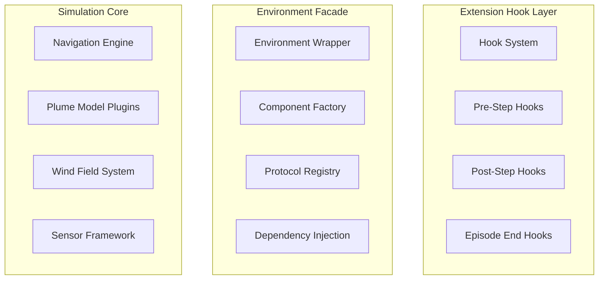

# Plume Navigation Simulation Library v1.0 - API Reference

Welcome to the comprehensive API reference for **plume_nav_sim v1.0**, the definitive toolkit for odor plume navigation research. This version represents a major architectural transformation from project-specific implementation (v0.3.0) to a general-purpose, extensible simulation framework built on protocol-driven component architecture.

## 🚀 What's New in v1.0

The v1.0 release introduces a revolutionary **protocol-based modular architecture** that enables:

- **Zero-Code Extensibility**: Swap components via configuration without modifying source code
- **Protocol-Driven Design**: Strict type-safe abstractions for all major subsystems  
- **Real-Time Performance**: ≤33ms per simulation step (~30 FPS) with 100+ agent support
- **Scientific Reproducibility**: Deterministic seeding and immutable configuration snapshots
- **Multi-Backend Recording**: Pluggable data persistence (Parquet, HDF5, SQLite, none)
- **Interactive Debugging**: Qt/Streamlit-based GUI for step-through visualization

## 📋 Quick Navigation

### Core Architecture
- [**Protocol Interfaces**](protocols/) - Foundation abstractions defining component contracts
- [**Component Factory System**](factory/) - Hydra-driven dependency injection and instantiation
- [**Hook Framework**](hooks/) - Extension points for custom functionality
- [**Configuration System**](configuration/) - Hierarchical parameter management with validation

### Component APIs

#### Navigation & Physics
- [**Navigation Engine**](navigation/) - Core multi-agent movement and state management
- [**Plume Models**](plume_models/) - Odor concentration field implementations
- [**Wind Fields**](wind_fields/) - Environmental dynamics and turbulence
- [**Sensor Framework**](sensors/) - Agent perception and sensing capabilities

#### New Protocol Components (v1.0)
- [**Source Abstraction**](sources/) - Pluggable odor source implementations
- [**Agent Initialization**](initialization/) - Configurable starting position strategies  
- [**Boundary Policies**](boundaries/) - Domain edge handling behaviors
- [**Action Interfaces**](actions/) - RL action space translation layer

#### Data & Analytics
- [**Recording System**](recording/) - Multi-backend data persistence framework
- [**Statistics Aggregator**](statistics/) - Automated research metrics calculation
- [**Visualization Tools**](visualization/) - Real-time and static plotting utilities
- [**Debug GUI**](debug/) - Interactive step-through viewer

#### Integration
- [**Gymnasium Environment**](environment/) - RL framework integration
- [**CLI Interface**](cli/) - Command-line tools and automation
- [**Performance Monitoring**](monitoring/) - Real-time metrics and SLA tracking

## 🔧 Installation

### Basic Installation
```bash
pip install plume_nav_sim[core]
```

### Full Installation with All Backends
```bash
pip install plume_nav_sim[all]
```

### Optional Dependency Groups

| Group | Components | Install Command |
|-------|------------|----------------|
| `core` | Essential simulation components | `pip install plume_nav_sim[core]` |
| `recording` | Data persistence backends | `pip install plume_nav_sim[recording]` |
| `gui` | Interactive debugging interface | `pip install plume_nav_sim[gui]` |
| `analysis` | Advanced statistics and visualization | `pip install plume_nav_sim[analysis]` |
| `rl` | Reinforcement learning integration | `pip install plume_nav_sim[rl]` |
| `dev` | Development and testing tools | `pip install plume_nav_sim[dev]` |
| `all` | All optional dependencies | `pip install plume_nav_sim[all]` |

### Backend-Specific Dependencies

**Data Recording Backends:**
```bash
# Parquet support (recommended)
pip install plume_nav_sim[recording] 
# Includes: pandas >=1.5.0, pyarrow >=10.0.0

# HDF5 scientific data format
pip install h5py>=3.0.0

# SQLite (included with Python)
# No additional dependencies required
```

**GUI Backends:**
```bash
# Qt-based desktop interface
pip install PySide6>=6.0.0

# Web-based interface  
pip install streamlit>=1.0.0
```

## 🚀 Quick Start Guide

### 1. Basic Simulation Setup
```python
import hydra
from omegaconf import DictConfig
from plume_nav_sim import create_environment

@hydra.main(version_base=None, config_path="conf", config_name="config")
def run_simulation(cfg: DictConfig) -> None:
    # Environment auto-configured from Hydra composition
    env = create_environment(cfg)
    
    obs, info = env.reset()
    for step in range(1000):
        action = env.action_space.sample()  # Random policy
        obs, reward, terminated, truncated, info = env.step(action)
        
        if terminated or truncated:
            obs, info = env.reset()

if __name__ == "__main__":
    run_simulation()
```

### 2. Component Composition via Configuration
```yaml
# conf/config.yaml - Zero-code component swapping
defaults:
  - base/source: point_source        # PointSource implementation
  - base/boundary: terminate         # Episode ends on boundary hit
  - base/action: continuous_2d       # Continuous action space
  - base/record: parquet            # Parquet data persistence
  - base/agent_init: uniform_random  # Random starting positions

simulation:
  max_steps: 1000
  num_agents: 50
  domain_size: [100, 100]
  
source:
  position: [50, 50]
  emission_rate: 1.0

boundary:
  status_on_violation: "out_of_bounds"
  
record:
  full: true                        # Save complete trajectories
  backends: [parquet, summary]      # Multiple output formats
```

### 3. Protocol-Based Extension
```python
from plume_nav_sim.core.protocols import SourceProtocol
import numpy as np

class CustomSource(SourceProtocol):
    """Example custom source implementation."""
    
    def __init__(self, positions: list, emission_schedule: dict):
        self.positions = np.array(positions)
        self.schedule = emission_schedule
        
    def get_positions(self) -> np.ndarray:
        """Return current source positions."""
        return self.positions
        
    def get_emission_rates(self, time: float) -> np.ndarray:
        """Return time-dependent emission rates."""
        return np.array([self.schedule.get(time, 1.0) 
                        for _ in self.positions])
        
    def is_active(self, time: float) -> np.ndarray:
        """Return source activity status."""
        return np.ones(len(self.positions), dtype=bool)

# Register with Hydra for configuration-driven instantiation
# See: docs/api_reference/configuration/custom_components.md
```

## 📖 Migration from v0.3.0

**Key Changes:**
- **Environment Construction**: Now uses `create_environment(cfg)` instead of direct class instantiation
- **Configuration Structure**: Reorganized into modular Hydra groups (`source/`, `boundary/`, etc.)
- **Hook System**: Replace custom modifications with configuration-driven hooks
- **Recording**: Unified interface supports multiple backends simultaneously

**Migration Resources:**
- [**v0.3.0 → v1.0 Migration Guide**](../migration_guide_v1.md) - Step-by-step upgrade instructions
- [**Configuration Migration Tool**](../tools/migrate_config.py) - Automated config conversion
- [**Backward Compatibility Shims**](compatibility/) - Legacy Gym environment support

## 🏗️ Architecture Overview

### Three-Layer Design



### Protocol-Based Component System

| Protocol | Purpose | Implementations | Configuration |
|----------|---------|----------------|---------------|
| `SourceProtocol` | Odor source modeling | Point, Multi, Dynamic | `conf/base/source/` |
| `AgentInitializerProtocol` | Starting position strategies | UniformRandom, Grid, FixedList, FromDataset | `conf/base/agent_init/` |
| `BoundaryPolicyProtocol` | Domain edge handling | Terminate, Bounce, Wrap, Clip | `conf/base/boundary/` |
| `ActionInterfaceProtocol` | RL action translation | Continuous2D, CardinalDiscrete | `conf/base/action/` |
| `RecorderProtocol` | Data persistence | Parquet, HDF5, SQLite, None | `conf/base/record/` |
| `StatsAggregatorProtocol` | Metrics calculation | StandardStats, CustomStats | `conf/base/stats/` |

## 🔍 API Reference Sections

### Core Protocols & Interfaces
- [**protocols/**](protocols/) - All protocol definitions and contracts
- [**factory/**](factory/) - Component instantiation and dependency injection
- [**exceptions/**](exceptions/) - Error handling and validation

### Navigation Components  
- [**navigation/controllers/**](navigation/controllers/) - Single and multi-agent controllers
- [**navigation/state/**](navigation/state/) - Agent state management
- [**navigation/kinematics/**](navigation/kinematics/) - Movement physics

### Environmental Models
- [**plume_models/**](plume_models/) - Odor concentration field implementations
- [**wind_fields/**](wind_fields/) - Environmental dynamics modeling
- [**sources/**](sources/) - Pluggable odor source abstractions

### Agent Systems
- [**sensors/**](sensors/) - Perception and sensing capabilities
- [**initialization/**](initialization/) - Starting position strategies
- [**boundaries/**](boundaries/) - Domain boundary handling
- [**actions/**](actions/) - Action space interfaces

### Data Management
- [**recording/**](recording/) - Multi-backend data persistence
- [**recording/backends/**](recording/backends/) - Storage implementation details
- [**statistics/**](statistics/) - Automated metrics calculation

### Visualization & Debugging
- [**visualization/**](visualization/) - Plotting and rendering utilities
- [**debug/**](debug/) - Interactive debugging tools
- [**debug/gui/**](debug/gui/) - Qt/Streamlit GUI components

### Integration & Tools
- [**environment/**](environment/) - Gymnasium environment wrapper
- [**cli/**](cli/) - Command-line interface
- [**configuration/**](configuration/) - Hydra config management
- [**monitoring/**](monitoring/) - Performance tracking
- [**hooks/**](hooks/) - Extension framework

### Utilities
- [**utils/**](utils/) - General-purpose utilities
- [**compatibility/**](compatibility/) - Legacy support
- [**testing/**](testing/) - Test utilities and fixtures

## 🎯 Use Case Navigation

### For Research Scientists
- **New Experiment Setup**: [Configuration System](configuration/) → [Environment API](environment/)
- **Custom Source Models**: [Source Protocols](sources/) → [Protocol Implementation Guide](protocols/implementation.md)
- **Data Analysis**: [Recording System](recording/) → [Statistics Aggregator](statistics/)
- **Publication Figures**: [Visualization Tools](visualization/) → [Batch Export](visualization/batch.md)

### For Algorithm Developers  
- **RL Integration**: [Gymnasium Environment](environment/) → [Action Interfaces](actions/)
- **Custom Policies**: [Navigation Engine](navigation/) → [Hook Framework](hooks/)
- **Performance Optimization**: [Monitoring](monitoring/) → [Vectorization Guide](performance/vectorization.md)

### For Educators & Students
- **Getting Started**: [Quick Start](#-quick-start-guide) → [Tutorial Examples](../tutorials/)
- **Interactive Learning**: [Debug GUI](debug/) → [Step-through Debugging](debug/step_through.md)
- **Assignment Templates**: [CLI Interface](cli/) → [Educational Configs](configuration/educational.md)

### For Systems Integrators
- **Custom Backends**: [Recording Protocols](recording/protocols.md) → [Backend Implementation](recording/backends/custom.md)
- **Deployment**: [Docker Support](../deployment/docker.md) → [CI/CD Integration](../deployment/cicd.md)
- **Monitoring**: [Performance Metrics](monitoring/) → [Alerting Setup](monitoring/alerts.md)

## 📊 Performance Specifications

### Real-Time Requirements
- **Step Latency**: ≤33ms per simulation step (30 FPS target)
- **Agent Scalability**: 100+ concurrent agents with vectorized operations
- **Recording Overhead**: <1ms when disabled, <5ms when active
- **Memory Usage**: Linear scaling with agent count and history depth

### Backend Performance
- **Frame Cache**: >90% hit rate, <1ms frame retrieval
- **Parquet I/O**: Asynchronous writes, compression support
- **Statistics**: <100ms per episode for standard metrics
- **GUI Updates**: ≥30 FPS for real-time visualization

## 🔧 Development & Extension

### Creating Custom Components
1. **Implement Protocol Interface**: Follow type contracts in [protocols/](protocols/)
2. **Add Configuration Schema**: Define Pydantic models for validation
3. **Register with Hydra**: Enable configuration-driven instantiation
4. **Add Tests**: Ensure protocol compliance and performance requirements

### Extension Points
- **Pre/Post Step Hooks**: Inject custom logic without core modifications
- **Custom Statistics**: Define domain-specific metrics
- **Recording Backends**: Add new data persistence formats
- **Visualization Plugins**: Extend plotting capabilities

## 📚 Additional Resources

- [**GitHub Repository**](https://github.com/CooperControlsLab/plume_nav_sim) - Source code and issues
- [**Tutorial Documentation**](../tutorials/) - Step-by-step learning guides  
- [**Example Configurations**](../examples/) - Ready-to-use experiment setups
- [**Performance Benchmarks**](../benchmarks/) - System performance analysis
- [**Research Papers**](../papers/) - Scientific publications using plume_nav_sim

## 🤝 Community & Support

- **Discussions**: [GitHub Discussions](https://github.com/CooperControlsLab/plume_nav_sim/discussions)
- **Bug Reports**: [GitHub Issues](https://github.com/CooperControlsLab/plume_nav_sim/issues)
- **Feature Requests**: [Enhancement Issues](https://github.com/CooperControlsLab/plume_nav_sim/issues/new?template=feature_request.md)
- **Research Collaboration**: [Place Memory Lab](https://placememorylab.org)

---

**Documentation Version**: v1.0.0  
**Last Updated**: 2024-12-07  
**Minimum Python Version**: 3.10+  
**License**: MIT

> **Note**: This is a comprehensive refactor proposal. The v1.0 architecture represents a significant upgrade from v0.3.0 with enhanced modularity, performance, and extensibility. All features marked as "Planned" in the feature catalog are included in this API reference as design documentation.