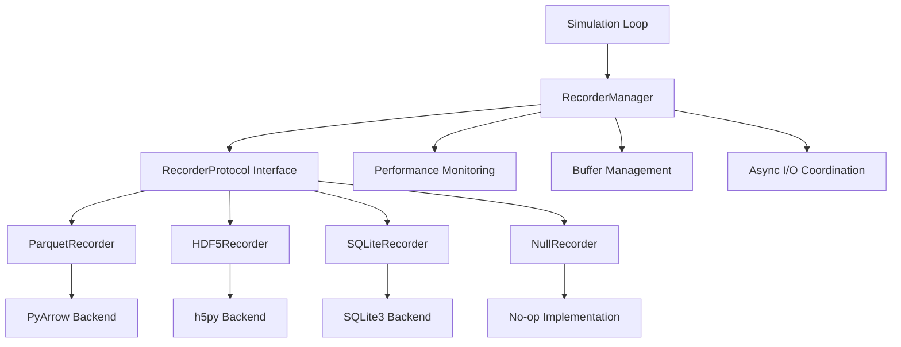

# Recording System API Reference

## Overview

The comprehensive data recording framework in plume_nav_sim v1.0 provides protocol-based data persistence with multiple storage backends, performance-aware buffering, and structured output organization. The system is designed to achieve **<1ms overhead when disabled** while providing flexible data collection capabilities for research reproducibility and long-term analysis.

### Key Features

- **Protocol-Based Architecture**: Uniform `RecorderProtocol` interface across all backend implementations
- **Multiple Storage Backends**: Parquet, HDF5, SQLite, and none backends for flexible deployment scenarios
- **Performance-Aware Buffering**: Configurable buffering with <1ms overhead when disabled per F-017-RQ-001
- **Structured Output Organization**: Hierarchical directory structure with run_id/episode_id organization
- **Configuration-Driven Selection**: Zero-code backend switching via Hydra configuration
- **Asynchronous I/O**: Non-blocking data persistence with multi-threaded background processing

### System Architecture



## Backend Implementations

### ParquetRecorder

High-performance columnar storage implementation using Apache Parquet format via PyArrow for analytical workloads.

#### Features
- **Columnar Storage**: Optimized for analytical queries and compression
- **Advanced Compression**: Supports Snappy, Gzip, LZ4, and Brotli algorithms
- **Schema Evolution**: Long-term compatibility with metadata preservation
- **Zero-Copy Operations**: Minimal memory overhead with PyArrow integration

#### Methods

```python
class ParquetRecorder(BaseRecorder):
    def record_step(
        self, 
        step_data: Dict[str, Any], 
        step_number: int,
        episode_id: Optional[int] = None,
        **metadata: Any
    ) -> None:
        """Record simulation state data for a single time step with columnar optimization."""
        
    def record_episode(
        self, 
        episode_data: Dict[str, Any], 
        episode_id: int,
        **metadata: Any
    ) -> None:
        """Record episode-level summary data with Parquet metadata integration."""
        
    def export_data(
        self, 
        output_path: str,
        format: str = "parquet",
        compression: Optional[str] = None,
        filter_episodes: Optional[List[int]] = None,
        **export_options: Any
    ) -> bool:
        """Export data with Parquet-specific optimization and partitioning."""
        
    def create_table(self, schema: Dict[str, str]) -> None:
        """Create PyArrow table structure with optimized column types."""
        
    def write_batch(self, data_batch: List[Dict[str, Any]]) -> int:
        """Write data batch using PyArrow RecordBatch for efficiency."""
        
    def flush_buffer(self) -> None:
        """Flush buffered data to Parquet files with compression."""
```

#### Configuration Example

```yaml
# conf/base/record/parquet.yaml
_target_: plume_nav_sim.recording.backends.ParquetRecorder

recording:
  full: true  # Enable per-step trajectory recording
  step_interval: 1  # Record every simulation step
  include_observations: true
  include_actions: true
  include_rewards: true

storage:
  base_directory: "./simulation_data"
  compression:
    algorithm: "snappy"  # snappy, gzip, lz4, brotli
    level: null

performance:
  buffer:
    max_records: 1000
    max_memory_mb: 100
    flush_interval_seconds: 30.0
  async_io:
    enabled: true
    worker_threads: 2
    queue_size: 100
```

#### Use Cases
- **Large-scale trajectory analysis**: Efficient storage of millions of simulation steps
- **Cross-language compatibility**: PyArrow ensures compatibility with R, Julia, and other analytics tools
- **Distributed analytics**: Integration with Apache Spark and Dask for large-scale processing

### HDF5Recorder

Hierarchical scientific data storage implementation using HDF5 format via h5py with efficient compression and metadata attribution.

#### Features
- **Hierarchical Organization**: Structured group organization (/run_id/episode_id/datasets)
- **Scientific Metadata**: Comprehensive attribute preservation with embedded documentation
- **Efficient Compression**: Gzip, LZF, and SZIP compression with configurable chunking
- **Self-Describing Format**: Rich metadata for long-term scientific data preservation

#### Methods

```python
class HDF5Recorder(BaseRecorder):
    def create_group(self, group_path: str, **attributes: Any) -> None:
        """Create HDF5 group with hierarchical organization and metadata."""
        
    def create_dataset(
        self, 
        dataset_path: str, 
        data_shape: Tuple[int, ...],
        dtype: np.dtype,
        **dataset_options: Any
    ) -> None:
        """Create HDF5 dataset with chunking and compression optimization."""
        
    def set_attributes(self, path: str, attributes: Dict[str, Any]) -> None:
        """Set HDF5 attributes for scientific metadata preservation."""
        
    def close_file(self) -> None:
        """Properly close HDF5 file with resource cleanup."""
```

#### Configuration Example

```yaml
# conf/base/record/hdf5.yaml
_target_: plume_nav_sim.recording.backends.HDF5Recorder

storage:
  file_path: "./data/experiment_{run_id}.h5"
  compression: "gzip"
  compression_opts: 6
  chunk_size: 1000
  
metadata:
  track_order: true
  create_intermediate_groups: true
  shuffle: true  # Improve compression
  fletcher32: true  # Data integrity checksums
```

#### Use Cases
- **Scientific workflows**: Integration with scientific Python ecosystem (SciPy, scikit-learn)
- **Complex data structures**: Multi-dimensional arrays with rich metadata
- **Long-term archival**: Self-describing format for data preservation

### SQLiteRecorder

Embedded relational database storage using SQLite3 with normalized schema and transaction-based buffering.

#### Features
- **Zero Configuration**: No external database server required
- **ACID Compliance**: Transaction support for data integrity
- **Queryable Storage**: SQL-based data analysis and filtering
- **Connection Pooling**: Efficient high-frequency data insertion

#### Methods

```python
class SQLiteRecorder(BaseRecorder):
    def create_schema(self) -> None:
        """Create normalized database schema with proper indexing."""
        
    def execute_query(self, query: str, parameters: Tuple = ()) -> List[Dict[str, Any]]:
        """Execute SQL query with parameter binding and result conversion."""
        
    def get_connection(self) -> sqlite3.Connection:
        """Get thread-local database connection from pool."""
        
    def close_connections(self) -> None:
        """Close all database connections with proper cleanup."""
```

#### Database Schema

```sql
-- Runs table for experiment organization
CREATE TABLE runs (
    run_id TEXT PRIMARY KEY,
    start_timestamp REAL NOT NULL,
    end_timestamp REAL,
    configuration TEXT,  -- JSON configuration snapshot
    metadata TEXT        -- JSON metadata
);

-- Episodes table for episode-level data
CREATE TABLE episodes (
    episode_id INTEGER,
    run_id TEXT,
    start_timestamp REAL NOT NULL,
    end_timestamp REAL,
    total_steps INTEGER,
    total_reward REAL,
    success BOOLEAN,
    termination_reason TEXT,
    metadata TEXT,
    PRIMARY KEY (episode_id, run_id),
    FOREIGN KEY (run_id) REFERENCES runs(run_id)
);

-- Steps table for trajectory data
CREATE TABLE steps (
    step_id INTEGER PRIMARY KEY AUTOINCREMENT,
    episode_id INTEGER,
    run_id TEXT,
    step_number INTEGER,
    timestamp REAL,
    agent_id INTEGER,
    position_x REAL,
    position_y REAL,
    orientation REAL,
    action_data TEXT,  -- JSON action details
    observation_data TEXT,  -- JSON observation details
    reward REAL,
    FOREIGN KEY (episode_id, run_id) REFERENCES episodes(episode_id, run_id)
);
```

#### Configuration Example

```yaml
# conf/base/record/sqlite.yaml
_target_: plume_nav_sim.recording.backends.SQLiteRecorder

storage:
  database_path: "./data/simulation.db"
  batch_size: 100
  transaction_mode: "immediate"
  
performance:
  connection_timeout: 30.0
  journal_mode: "WAL"  # Write-Ahead Logging
  synchronous: "NORMAL"
  cache_size: 2000  # Pages
```

#### Use Cases
- **Interactive analysis**: Direct SQL querying for research exploration
- **Collaborative research**: Shareable database files with full query capabilities
- **Data validation**: ACID compliance for critical research data

### NullRecorder

Zero-overhead disabled recording implementation providing no-op method implementations for maximum simulation performance.

#### Features
- **Ultra-Fast Performance**: <1ms overhead per 1000 steps
- **Memory Efficient**: Minimal object allocation and state management
- **Fallback Support**: Graceful degradation when other backends fail
- **Debug Mode**: Optional method call counting for performance verification

#### Methods

```python
class NullRecorder(BaseRecorder):
    def is_recording(self) -> bool:
        """Return False to indicate no active recording."""
        
    def get_call_count(self) -> Dict[str, int]:
        """Get method call counts for performance verification (debug mode)."""
```

#### Configuration Example

```yaml
# conf/base/record/none.yaml
_target_: plume_nav_sim.recording.backends.NullRecorder

debug:
  enabled: false
  count_calls: false
  
performance:
  optimization_level: "maximum"
```

#### Use Cases
- **Performance benchmarking**: Baseline performance measurement without recording overhead
- **Production deployment**: High-performance scenarios where recording is unnecessary
- **Development testing**: Quick iteration without data persistence overhead

## Configuration System

### Hydra Integration

The recording system integrates seamlessly with Hydra configuration management, enabling runtime backend selection without code changes.

#### Configuration Structure

```yaml
# Main configuration
record:
  _target_: plume_nav_sim.recording.backends.ParquetRecorder
  # Backend-specific configuration follows
```

#### Environment Variable Overrides

All recording configurations support environment variable overrides for deployment flexibility:

```bash
# Override recording backend
export PLUME_RECORD_BACKEND=hdf5

# Override buffer settings
export PLUME_BUFFER_SIZE=2000
export PLUME_BUFFER_MEMORY_MB=200

# Override compression settings
export PLUME_PARQUET_COMPRESSION=gzip
export PLUME_HDF5_COMPRESSION=lzf

# Override I/O settings
export PLUME_ASYNC_IO=true
export PLUME_IO_WORKERS=4
```

#### Configuration Groups

The recording system uses Hydra configuration groups for modular organization:

```
conf/base/record/
├── parquet.yaml      # Parquet backend configuration
├── hdf5.yaml         # HDF5 backend configuration
├── sqlite.yaml       # SQLite backend configuration
└── none.yaml         # Disabled recording configuration
```

#### Dynamic Backend Selection

```python
# Select backend via configuration
from hydra import initialize, compose
from plume_nav_sim.recording import RecorderFactory

with initialize(config_path="../conf"):
    # Load parquet configuration
    cfg = compose(config_name="config", overrides=["record=parquet"])
    recorder = RecorderFactory.create_recorder(cfg.record)
    
    # Switch to HDF5 configuration
    cfg = compose(config_name="config", overrides=["record=hdf5"])
    recorder = RecorderFactory.create_recorder(cfg.record)
```

## Performance and Integration

### Performance Characteristics

| Backend | Recording Overhead | Memory Usage | Compression Ratio | Query Performance |
|---------|-------------------|--------------|-------------------|-------------------|
| **Parquet** | <0.5ms/step | 50-100MB | 5:1 - 10:1 | Excellent (columnar) |
| **HDF5** | <0.8ms/step | 30-80MB | 3:1 - 8:1 | Good (indexed) |
| **SQLite** | <1.0ms/step | 20-60MB | 2:1 - 5:1 | Excellent (SQL) |
| **None** | <0.01ms/step | <1MB | N/A | N/A |

### Buffering Strategies

#### Write-Behind Buffering

```python
# Automatic buffer management
recorder.record_step(step_data, step_number)  # Buffered
# Background thread handles actual I/O

# Manual flush control
recorder.flush()  # Force immediate write
```

#### Memory-Aware Buffering

```python
# Configure memory limits
config = {
    'buffer': {
        'max_records': 1000,
        'max_memory_mb': 100,
        'flush_interval_seconds': 30.0
    }
}
```

#### Backpressure Handling

```python
# Automatic backpressure management
if buffer_utilization > warning_threshold:
    logger.warning("High buffer utilization, consider reducing recording frequency")
    
if buffer_utilization > max_threshold:
    # Force flush to prevent memory exhaustion
    recorder.flush()
```

### Simulation Loop Integration

#### Step-Level Recording

```python
# Integration with simulation loop
for step in range(episode_length):
    # Simulation step
    action = agent.get_action(observation)
    observation, reward, done, info = env.step(action)
    
    # Record step data (< 1ms overhead)
    step_data = {
        'position': agent.position,
        'concentration': observation['concentration'],
        'action': action,
        'reward': reward
    }
    recorder.record_step(step_data, step)
    
    if done:
        break
```

#### Episode-Level Recording

```python
# Episode completion recording
episode_data = {
    'total_steps': step + 1,
    'total_reward': total_reward,
    'success': success,
    'final_position': agent.position,
    'path_efficiency': calculate_efficiency(trajectory)
}
recorder.record_episode(episode_data, episode_id)
```

#### Performance Monitoring

```python
# Real-time performance monitoring
metrics = recorder.get_performance_metrics()
print(f"Recording overhead: {metrics['average_write_time']*1000:.2f}ms")
print(f"Buffer utilization: {metrics['buffer_utilization_current']:.1%}")
print(f"Memory usage: {metrics['memory_analysis']['usage_mb']:.1f}MB")

# Performance alerts
if metrics['performance_analysis']['avg_write_time_ms'] > 1.0:
    logger.warning("Recording overhead exceeds 1ms threshold")
```

### Structured Output Organization

#### Directory Hierarchy

```
simulation_data/
├── runs/
│   ├── run_20240101_120000/
│   │   ├── episodes/
│   │   │   ├── trajectory_ep_000001.parquet
│   │   │   ├── trajectory_ep_000002.parquet
│   │   │   └── episode_summary_ep_000001.parquet
│   │   ├── run_metadata.parquet
│   │   └── run_statistics.parquet
│   └── run_20240101_130000/
└── exports/
    ├── combined_analysis.parquet
    └── summary_reports.parquet
```

#### File Organization Patterns

```python
# Configurable file patterns
file_patterns = {
    'trajectory': "trajectory_ep_{episode_id:06d}.parquet",
    'summary': "episode_summary_ep_{episode_id:06d}.parquet", 
    'metadata': "run_metadata.parquet",
    'statistics': "run_statistics.parquet"
}

# Template-based directory structure
directory_template = "{base_directory}/runs/{run_id}/episodes"
```

### Data Export and Analysis

#### Batch Export Operations

```python
# Export specific episodes
success = recorder.export_data(
    output_path="./analysis/successful_episodes.parquet",
    format="parquet",
    compression="gzip",
    filter_episodes=[1, 5, 12, 18, 23]
)

# Export all data with compression
success = recorder.export_data(
    output_path="./analysis/complete_dataset.h5",
    format="hdf5",
    compression="gzip",
    compression_level=6
)
```

#### Cross-Backend Compatibility

```python
# Convert between formats
parquet_recorder.export_data("./data.parquet", format="parquet")
hdf5_recorder.export_data("./data.h5", format="hdf5")
sqlite_recorder.export_data("./data.db", format="sqlite")

# Maintain metadata consistency across formats
metadata = {
    'experiment_name': 'odor_navigation_study_2024',
    'configuration_hash': 'a1b2c3d4e5f6',
    'software_version': 'plume_nav_sim_v1.0'
}
```

## Protocol Reference

### RecorderProtocol Interface

The `RecorderProtocol` defines the core interface that all recording backend implementations must support:

```python
from typing import Protocol, Dict, Any, Optional, List

class RecorderProtocol(Protocol):
    """Core protocol interface for all recording implementations."""
    
    def record_step(
        self, 
        step_data: Dict[str, Any], 
        step_number: int,
        episode_id: Optional[int] = None,
        **metadata: Any
    ) -> None:
        """
        Record simulation state data for a single time step.
        
        Performance Requirement: <0.1ms when disabled, <1ms when enabled
        
        Args:
            step_data: Dictionary containing step-level measurements
            step_number: Sequential step index (0-based)
            episode_id: Optional episode identifier
            **metadata: Additional step context
        """
        ...
    
    def record_episode(
        self, 
        episode_data: Dict[str, Any], 
        episode_id: int,
        **metadata: Any
    ) -> None:
        """
        Record episode-level summary data and metrics.
        
        Performance Requirement: <10ms for episode finalization
        
        Args:
            episode_data: Dictionary containing episode summary
            episode_id: Unique episode identifier
            **metadata: Additional episode context
        """
        ...
    
    def export_data(
        self, 
        output_path: str,
        format: str = "parquet",
        compression: Optional[str] = None,
        filter_episodes: Optional[List[int]] = None,
        **export_options: Any
    ) -> bool:
        """
        Export recorded data with compression and format options.
        
        Performance Requirement: <100ms for typical dataset export
        
        Args:
            output_path: File system path for export
            format: Export format (parquet, hdf5, csv, json)
            compression: Optional compression method
            filter_episodes: Optional episode filter
            **export_options: Format-specific options
            
        Returns:
            bool: True if export successful, False otherwise
        """
        ...
```

### Implementation Requirements

#### Method Signatures

All `RecorderProtocol` implementations must implement the exact method signatures with proper type hints and parameter validation.

#### Performance Compliance

- **record_step()**: Must execute in <0.1ms when recording disabled, <1ms when enabled
- **record_episode()**: Must complete in <10ms for episode finalization
- **export_data()**: Must execute in <100ms for typical dataset export with compression

#### Data Format Standards

```python
# Standard step data format
step_data = {
    'timestamp': float,           # Unix timestamp
    'position': Tuple[float, float],  # (x, y) coordinates
    'orientation': float,         # Agent heading in radians
    'velocity': Tuple[float, float],  # (vx, vy) velocity vector
    'concentration': float,       # Odor concentration measurement
    'gradient': Tuple[float, float],  # Concentration gradient
    'action': Dict[str, Any],     # Action details
    'reward': float,             # Step reward
    'done': bool,                # Episode termination flag
    'info': Dict[str, Any]       # Additional information
}

# Standard episode data format
episode_data = {
    'total_steps': int,          # Episode length
    'total_reward': float,       # Cumulative reward
    'success': bool,             # Success indicator
    'final_position': Tuple[float, float],  # Final agent position
    'path_efficiency': float,    # Navigation efficiency metric
    'time_to_source': Optional[float],  # Time to find source
    'distance_traveled': float,  # Total path distance
    'exploration_coverage': float  # Spatial coverage metric
}
```

### Custom Backend Development

#### Creating Custom Backends

```python
from plume_nav_sim.recording import BaseRecorder, RecorderProtocol
from typing import Dict, Any, List, Optional

class CustomRecorder(BaseRecorder):
    """Custom recording backend implementation."""
    
    def __init__(self, config: RecorderConfig):
        super().__init__(config)
        # Initialize custom backend resources
        self._setup_custom_storage()
    
    def _write_step_data(self, data: List[Dict[str, Any]]) -> int:
        """Backend-specific step data writing implementation."""
        # Implement custom storage logic
        bytes_written = 0
        for record in data:
            bytes_written += self._write_record(record)
        return bytes_written
    
    def _write_episode_data(self, data: List[Dict[str, Any]]) -> int:
        """Backend-specific episode data writing implementation."""
        # Implement custom episode storage
        return len(data) * 100  # Estimated bytes
    
    def _export_data_backend(
        self, 
        output_path: str,
        format: str,
        compression: Optional[str] = None,
        filter_episodes: Optional[List[int]] = None,
        **export_options: Any
    ) -> bool:
        """Backend-specific data export implementation."""
        # Implement custom export logic
        return True
```

#### Backend Registration

```python
# Register custom backend
from plume_nav_sim.recording import RecorderFactory

RecorderFactory.register_backend("custom", CustomRecorder)

# Use custom backend via configuration
config = {
    'backend': 'custom',
    'custom_param': 'value'
}
recorder = RecorderFactory.create_recorder(config)
```

#### Validation Guidelines

Custom backend implementations should follow these validation guidelines:

1. **Performance Testing**: Verify <1ms overhead requirements
2. **Memory Management**: Implement proper buffer management and cleanup
3. **Error Handling**: Provide graceful error recovery and logging
4. **Thread Safety**: Ensure thread-safe operations for multi-agent scenarios
5. **Configuration Validation**: Validate all configuration parameters
6. **Documentation**: Provide comprehensive API documentation and examples

### Error Handling and Recovery

#### Graceful Degradation

```python
try:
    # Attempt preferred backend
    recorder = RecorderFactory.create_recorder({'backend': 'parquet'})
except ImportError:
    # Fallback to available backend
    logger.warning("PyArrow not available, falling back to SQLite")
    recorder = RecorderFactory.create_recorder({'backend': 'sqlite'})
except Exception:
    # Final fallback to no-op recorder
    logger.warning("All backends failed, using null recorder")
    recorder = RecorderFactory.create_recorder({'backend': 'none'})
```

#### Error Recovery Strategies

```python
# Automatic error recovery
try:
    recorder.record_step(step_data, step_number)
except Exception as e:
    logger.error(f"Recording failed: {e}")
    # Switch to emergency backup recorder
    backup_recorder.record_step(step_data, step_number)
```

#### Data Integrity Validation

```python
# Validate data before recording
if recorder.validate_data(step_data):
    recorder.record_step(step_data, step_number)
else:
    logger.warning("Invalid step data detected, skipping record")
```

## Usage Examples

### Basic Recording Session

```python
from plume_nav_sim.recording import RecorderManager, RecorderFactory

# Create recorder with configuration
config = {
    'backend': 'parquet',
    'output_dir': './experiment_data',
    'buffer_size': 1000,
    'compression': 'snappy'
}
recorder = RecorderFactory.create_recorder(config)

# Use recorder manager for lifecycle management
manager = RecorderManager(recorder, performance_target_ms=1.0)

# Recording session with automatic cleanup
with manager.managed_recording_session(episode_id=1):
    for step in range(episode_length):
        # Simulation step
        step_data = {
            'position': agent.get_position(),
            'concentration': env.sample_concentration(),
            'action': agent.get_action(),
            'reward': env.get_reward()
        }
        
        # Record step (< 1ms overhead)
        recorder.record_step(step_data, step)
        
        # Check performance
        metrics = manager.get_performance_metrics()
        if not metrics['performance_analysis']['meets_target']:
            logger.warning("Performance target exceeded")

# Export data for analysis
recorder.export_data(
    output_path="./analysis/episode_001.parquet",
    format="parquet",
    compression="gzip"
)
```

### Multi-Agent Recording

```python
# Multi-agent step recording
agent_data = {}
for agent_id, agent in enumerate(agents):
    agent_data[f'agent_{agent_id}'] = {
        'position': agent.position,
        'concentration': agent.concentration,
        'action': agent.last_action,
        'reward': agent.step_reward
    }

recorder.record_step(agent_data, step_number)
```

### Batch Analysis Workflow

```python
# Load and analyze recorded data
import pandas as pd
import numpy as np

# Load trajectory data
df = pd.read_parquet('./data/trajectory_ep_000001.parquet')

# Analyze navigation efficiency
positions = df[['position_x', 'position_y']].values
distances = np.linalg.norm(np.diff(positions, axis=0), axis=1)
total_distance = np.sum(distances)
direct_distance = np.linalg.norm(positions[-1] - positions[0])
efficiency = direct_distance / total_distance

print(f"Path efficiency: {efficiency:.2f}")
print(f"Total distance: {total_distance:.1f}")
print(f"Episode duration: {df['timestamp'].iloc[-1] - df['timestamp'].iloc[0]:.1f}s")
```

This comprehensive API reference provides complete documentation for the recording system, covering all backends, configuration options, performance characteristics, and usage patterns. The system enables flexible, high-performance data collection for research reproducibility while maintaining minimal simulation overhead.