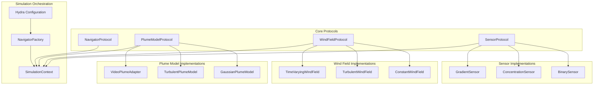

# Extending Plume Navigation Simulator: Protocol-Based Architecture Guide

## Table of Contents

1. [Overview](#overview)
2. [Architecture Fundamentals](#architecture-fundamentals)
3. [Core Protocols](#core-protocols)
4. [Implementing Custom Plume Models](#implementing-custom-plume-models)
5. [Implementing Custom Wind Fields](#implementing-custom-wind-fields)
6. [Implementing Custom Sensors](#implementing-custom-sensors)
7. [Configuration and Dependency Injection](#configuration-and-dependency-injection)
8. [Testing and Validation](#testing-and-validation)
9. [Memory vs Memoryless Agent Examples](#memory-vs-memoryless-agent-examples)
10. [Performance Guidelines](#performance-guidelines)
11. [Migration from Legacy Components](#migration-from-legacy-components)
12. [Troubleshooting](#troubleshooting)

## Overview

The Plume Navigation Simulator has evolved from a monolithic system into a highly modular, protocol-based architecture that enables researchers to seamlessly switch between different physics models, sensing modalities, and environmental dynamics without code modifications. This guide demonstrates how to extend the system with custom components while maintaining performance and compatibility.

### Key Benefits of the Modular Architecture

- **Configuration-Driven Component Switching**: Switch between simple Gaussian and complex turbulent plume models via YAML configuration
- **Agent-Agnostic Design**: Support both memory-based and memory-less navigation strategies through the same infrastructure
- **Protocol-Based Extensibility**: Well-defined interfaces ensure seamless integration of custom components
- **Performance Preservation**: Sub-10ms step latency maintained across all component combinations
- **Research Flexibility**: Experiment with different physics models without modifying existing code

### Architecture Overview



## Architecture Fundamentals

### Protocol-Driven Design

The system uses Python's Protocol (PEP 544) for structural subtyping, enabling flexible component implementations without inheritance constraints:

```python
from typing import Protocol, runtime_checkable
import numpy as np

@runtime_checkable
class PlumeModelProtocol(Protocol):
    def concentration_at(self, positions: np.ndarray) -> np.ndarray: ...
    def step(self, dt: float = 1.0) -> None: ...
    def reset(self, **kwargs: Any) -> None: ...
```

### Component Lifecycle

All components follow a consistent lifecycle pattern:

1. **Initialization**: Configuration-driven instantiation via Hydra
2. **Operation**: Real-time queries and temporal evolution
3. **Reset**: Episode boundaries with parameter overrides
4. **Performance Monitoring**: Automatic metrics collection

### Configuration Integration

Components integrate with Hydra's structured configuration system:

```yaml
# conf/base/plume_models/gaussian.yaml
_target_: plume_nav_sim.models.plume.gaussian_plume.GaussianPlumeModel
source_position: [50.0, 50.0]
source_strength: 1000.0
sigma_x: 5.0
sigma_y: 3.0
```

## Core Protocols

### PlumeModelProtocol

The `PlumeModelProtocol` defines the interface for pluggable odor plume modeling implementations:

```python
@runtime_checkable
class PlumeModelProtocol(Protocol):
    """Protocol for odor plume model implementations."""
    
    def concentration_at(self, positions: np.ndarray) -> np.ndarray:
        """
        Compute odor concentrations at specified spatial locations.
        
        Args:
            positions: Agent positions with shape (n_agents, 2) or (2,)
            
        Returns:
            Concentration values with shape (n_agents,) or scalar
        """
        ...
    
    def step(self, dt: float = 1.0) -> None:
        """
        Advance plume state by specified time delta.
        
        Args:
            dt: Time step size in seconds
        """
        ...
    
    def reset(self, **kwargs: Any) -> None:
        """
        Reset plume state to initial conditions.
        
        Args:
            **kwargs: Optional parameter overrides
        """
        ...
```

### WindFieldProtocol

The `WindFieldProtocol` defines environmental wind dynamics:

```python
@runtime_checkable
class WindFieldProtocol(Protocol):
    """Protocol for wind field implementations."""
    
    def velocity_at(self, positions: np.ndarray) -> np.ndarray:
        """
        Compute wind velocity vectors at specified locations.
        
        Args:
            positions: Spatial positions with shape (n_positions, 2)
            
        Returns:
            Velocity vectors with shape (n_positions, 2)
        """
        ...
    
    def step(self, dt: float = 1.0) -> None:
        """Advance wind field temporal dynamics."""
        ...
    
    def reset(self, **kwargs: Any) -> None:
        """Reset wind field to initial conditions."""
        ...
```

### SensorProtocol

The `SensorProtocol` enables flexible sensing modalities:

```python
@runtime_checkable
class SensorProtocol(Protocol):
    """Protocol for sensor implementations."""
    
    def detect(self, plume_state: Any, positions: np.ndarray) -> np.ndarray:
        """Binary detection at agent positions."""
        ...
    
    def measure(self, plume_state: Any, positions: np.ndarray) -> np.ndarray:
        """Quantitative measurements at agent positions."""
        ...
    
    def compute_gradient(self, plume_state: Any, positions: np.ndarray) -> np.ndarray:
        """Spatial gradients at agent positions."""
        ...
    
    def configure(self, **kwargs: Any) -> None:
        """Update sensor configuration parameters."""
        ...
```

## Implementing Custom Plume Models

### Basic Implementation Pattern

Create a custom plume model by implementing the `PlumeModelProtocol`:

```python
# src/plume_nav_sim/models/plume/custom_plume.py
from typing import Any, Dict, Tuple
import numpy as np
from dataclasses import dataclass

from ...core.protocols import PlumeModelProtocol

@dataclass
class CustomPlumeConfig:
    """Configuration for custom plume model."""
    source_position: Tuple[float, float] = (50.0, 50.0)
    custom_parameter: float = 1.0
    _target_: str = "plume_nav_sim.models.plume.custom_plume.CustomPlumeModel"

class CustomPlumeModel:
    """Custom plume model implementation."""
    
    def __init__(
        self,
        source_position: Tuple[float, float] = (50.0, 50.0),
        custom_parameter: float = 1.0,
        **kwargs: Any
    ):
        self.source_position = np.array(source_position, dtype=np.float64)
        self.custom_parameter = custom_parameter
        self.current_time = 0.0
        
        # Performance monitoring
        self._query_count = 0
        self._total_query_time = 0.0
    
    def concentration_at(self, positions: np.ndarray) -> np.ndarray:
        """Implement your concentration computation logic."""
        import time
        start_time = time.perf_counter()
        
        # Ensure consistent input format
        positions = np.asarray(positions, dtype=np.float64)
        single_agent = False
        
        if positions.ndim == 1:
            positions = positions.reshape(1, 2)
            single_agent = True
        
        # Compute distances from source
        distances = np.linalg.norm(positions - self.source_position, axis=1)
        
        # Custom concentration computation
        # Example: exponential decay with custom parameter
        concentrations = np.exp(-distances / self.custom_parameter)
        
        # Performance tracking
        query_time = time.perf_counter() - start_time
        self._query_count += 1
        self._total_query_time += query_time
        
        return float(concentrations[0]) if single_agent else concentrations
    
    def step(self, dt: float = 1.0) -> None:
        """Update plume state over time."""
        if dt <= 0:
            raise ValueError(f"Time step must be positive, got {dt}")
        
        self.current_time += dt
        
        # Implement temporal evolution logic here
        # Example: time-varying source strength
        # self.source_strength = self.base_strength * (1 + 0.1 * np.sin(self.current_time))
    
    def reset(self, **kwargs: Any) -> None:
        """Reset to initial conditions with optional overrides."""
        self.current_time = kwargs.get('current_time', 0.0)
        
        if 'source_position' in kwargs:
            self.source_position = np.array(kwargs['source_position'], dtype=np.float64)
        
        if 'custom_parameter' in kwargs:
            self.custom_parameter = float(kwargs['custom_parameter'])
        
        # Reset performance statistics
        self._query_count = 0
        self._total_query_time = 0.0
    
    def get_performance_stats(self) -> Dict[str, Any]:
        """Get performance statistics."""
        avg_query_time = (self._total_query_time / self._query_count 
                         if self._query_count > 0 else 0.0)
        return {
            'query_count': self._query_count,
            'average_query_time_ms': avg_query_time * 1000,
            'total_query_time': self._total_query_time,
            'current_time': self.current_time
        }
```

### Advanced Plume Model with Wind Integration

For more complex models with wind field integration:

```python
class AdvancedCustomPlumeModel:
    """Advanced custom plume model with wind field integration."""
    
    def __init__(
        self,
        source_position: Tuple[float, float] = (50.0, 50.0),
        wind_field: Optional['WindFieldProtocol'] = None,
        **kwargs: Any
    ):
        self.source_position = np.array(source_position, dtype=np.float64)
        self.initial_source_position = self.source_position.copy()
        self.wind_field = wind_field
        self.current_time = 0.0
    
    def concentration_at(self, positions: np.ndarray) -> np.ndarray:
        """Concentration computation with wind advection."""
        positions = np.asarray(positions, dtype=np.float64)
        single_agent = positions.ndim == 1
        
        if single_agent:
            positions = positions.reshape(1, 2)
        
        # Get effective source position with wind advection
        effective_source = self._get_effective_source_position()
        
        # Compute concentrations relative to advected source
        distances = np.linalg.norm(positions - effective_source, axis=1)
        concentrations = np.exp(-distances / 5.0)  # Example decay
        
        return float(concentrations[0]) if single_agent else concentrations
    
    def _get_effective_source_position(self) -> np.ndarray:
        """Compute effective source position with wind advection."""
        if self.wind_field is not None:
            # Get wind velocity at source position
            wind_velocity = self.wind_field.velocity_at(
                self.source_position.reshape(1, 2)
            )[0]
            # Advect source position by integrated wind
            advection_offset = wind_velocity * self.current_time
            return self.source_position + advection_offset
        return self.source_position
    
    def step(self, dt: float = 1.0) -> None:
        """Step with wind field integration."""
        self.current_time += dt
        
        # Update wind field if present
        if self.wind_field is not None:
            self.wind_field.step(dt)
    
    def reset(self, **kwargs: Any) -> None:
        """Reset with wind field coordination."""
        self.current_time = kwargs.get('current_time', 0.0)
        self.source_position = self.initial_source_position.copy()
        
        # Reset wind field if present
        if self.wind_field is not None:
            wind_kwargs = {k: v for k, v in kwargs.items() 
                          if k.startswith('wind_')}
            self.wind_field.reset(**wind_kwargs)
```

### Configuration File

Create a corresponding configuration file:

```yaml
# conf/base/plume_models/custom.yaml
_target_: plume_nav_sim.models.plume.custom_plume.CustomPlumeModel
source_position: [25.0, 75.0]
custom_parameter: 2.5

# Optional wind field integration
# wind_field:
#   _target_: plume_nav_sim.models.wind.constant_wind.ConstantWindField
#   velocity: [1.0, 0.5]
```

## Implementing Custom Wind Fields

### Basic Wind Field Implementation

Create a custom wind field by implementing the `WindFieldProtocol`:

```python
# src/plume_nav_sim/models/wind/custom_wind.py
from typing import Any, Tuple
import numpy as np
from dataclasses import dataclass

from ...core.protocols import WindFieldProtocol

@dataclass
class CustomWindFieldConfig:
    """Configuration for custom wind field."""
    base_velocity: Tuple[float, float] = (1.0, 0.0)
    variation_amplitude: float = 0.2
    variation_frequency: float = 0.1
    _target_: str = "plume_nav_sim.models.wind.custom_wind.CustomWindField"

class CustomWindField:
    """Custom wind field with sinusoidal variations."""
    
    def __init__(
        self,
        base_velocity: Tuple[float, float] = (1.0, 0.0),
        variation_amplitude: float = 0.2,
        variation_frequency: float = 0.1,
        **kwargs: Any
    ):
        self.base_velocity = np.array(base_velocity, dtype=np.float64)
        self.variation_amplitude = variation_amplitude
        self.variation_frequency = variation_frequency
        self.current_time = 0.0
    
    def velocity_at(self, positions: np.ndarray) -> np.ndarray:
        """Compute wind velocities with sinusoidal variation."""
        positions = np.asarray(positions, dtype=np.float64)
        single_position = positions.ndim == 1
        
        if single_position:
            positions = positions.reshape(1, 2)
        
        n_positions = positions.shape[0]
        
        # Time-varying wind component
        time_variation = self.variation_amplitude * np.sin(
            2 * np.pi * self.variation_frequency * self.current_time
        )
        
        # Spatially uniform wind with temporal variation
        velocities = np.tile(self.base_velocity, (n_positions, 1))
        velocities[:, 0] += time_variation  # Vary x-component
        
        return velocities[0] if single_position else velocities
    
    def step(self, dt: float = 1.0) -> None:
        """Advance wind field temporal state."""
        if dt <= 0:
            raise ValueError(f"Time step must be positive, got {dt}")
        self.current_time += dt
    
    def reset(self, **kwargs: Any) -> None:
        """Reset wind field to initial conditions."""
        self.current_time = kwargs.get('current_time', 0.0)
        
        if 'base_velocity' in kwargs:
            self.base_velocity = np.array(kwargs['base_velocity'], dtype=np.float64)
        
        if 'variation_amplitude' in kwargs:
            self.variation_amplitude = float(kwargs['variation_amplitude'])
        
        if 'variation_frequency' in kwargs:
            self.variation_frequency = float(kwargs['variation_frequency'])
```

### Spatially-Varying Wind Field

For more complex spatial variations:

```python
class SpatiallyVaryingWindField:
    """Wind field with spatial variations."""
    
    def __init__(
        self,
        domain_bounds: Tuple[Tuple[float, float], Tuple[float, float]] = ((0, 100), (0, 100)),
        base_velocity: Tuple[float, float] = (2.0, 0.0),
        spatial_frequency: float = 0.05,
        **kwargs: Any
    ):
        self.domain_bounds = domain_bounds
        self.base_velocity = np.array(base_velocity, dtype=np.float64)
        self.spatial_frequency = spatial_frequency
        self.current_time = 0.0
    
    def velocity_at(self, positions: np.ndarray) -> np.ndarray:
        """Compute spatially-varying wind velocities."""
        positions = np.asarray(positions, dtype=np.float64)
        single_position = positions.ndim == 1
        
        if single_position:
            positions = positions.reshape(1, 2)
        
        # Spatial variation based on position
        x_positions = positions[:, 0]
        y_positions = positions[:, 1]
        
        # Sinusoidal spatial variation
        spatial_variation_x = 0.3 * np.sin(self.spatial_frequency * x_positions)
        spatial_variation_y = 0.2 * np.cos(self.spatial_frequency * y_positions)
        
        # Combine base velocity with spatial variations
        velocities = np.column_stack([
            self.base_velocity[0] + spatial_variation_x,
            self.base_velocity[1] + spatial_variation_y
        ])
        
        return velocities[0] if single_position else velocities
    
    def step(self, dt: float = 1.0) -> None:
        """Update temporal state."""
        self.current_time += dt
    
    def reset(self, **kwargs: Any) -> None:
        """Reset to initial conditions."""
        self.current_time = kwargs.get('current_time', 0.0)
```

### Configuration File

```yaml
# conf/base/wind_fields/custom.yaml
_target_: plume_nav_sim.models.wind.custom_wind.CustomWindField
base_velocity: [2.0, 0.5]
variation_amplitude: 0.3
variation_frequency: 0.05
```

## Implementing Custom Sensors

### Basic Sensor Implementation

Create a custom sensor by implementing the `SensorProtocol`:

```python
# src/plume_nav_sim/core/sensors/custom_sensor.py
from typing import Any, Dict, Tuple
import numpy as np
from dataclasses import dataclass

from ..protocols import SensorProtocol

@dataclass
class CustomSensorConfig:
    """Configuration for custom sensor."""
    detection_threshold: float = 0.1
    measurement_noise: float = 0.02
    dynamic_range: Tuple[float, float] = (0.0, 1.0)
    _target_: str = "plume_nav_sim.core.sensors.custom_sensor.CustomSensor"

class CustomSensor:
    """Custom sensor with configurable detection and measurement."""
    
    def __init__(
        self,
        detection_threshold: float = 0.1,
        measurement_noise: float = 0.02,
        dynamic_range: Tuple[float, float] = (0.0, 1.0),
        **kwargs: Any
    ):
        self.detection_threshold = detection_threshold
        self.measurement_noise = measurement_noise
        self.dynamic_range = dynamic_range
        self.random_state = np.random.RandomState(kwargs.get('random_seed', 42))
        
        # Performance tracking
        self._measurement_count = 0
        self._detection_count = 0
    
    def detect(self, plume_state: Any, positions: np.ndarray) -> np.ndarray:
        """Binary detection based on threshold."""
        # Get concentration measurements
        concentrations = self._get_concentrations(plume_state, positions)
        
        # Apply threshold detection
        detections = concentrations > self.detection_threshold
        
        # Add false positive/negative noise (simplified)
        noise = self.random_state.uniform(-0.05, 0.05, size=detections.shape)
        noisy_concentrations = concentrations + noise
        noisy_detections = noisy_concentrations > self.detection_threshold
        
        self._detection_count += np.sum(detections)
        return noisy_detections
    
    def measure(self, plume_state: Any, positions: np.ndarray) -> np.ndarray:
        """Quantitative concentration measurements with noise."""
        # Get base concentrations
        concentrations = self._get_concentrations(plume_state, positions)
        
        # Add measurement noise
        noise = self.random_state.normal(0, self.measurement_noise, size=concentrations.shape)
        noisy_concentrations = concentrations + noise
        
        # Apply dynamic range clipping
        min_val, max_val = self.dynamic_range
        measurements = np.clip(noisy_concentrations, min_val, max_val)
        
        self._measurement_count += len(measurements) if measurements.ndim > 0 else 1
        return measurements
    
    def compute_gradient(self, plume_state: Any, positions: np.ndarray) -> np.ndarray:
        """Compute spatial gradients using finite differences."""
        positions = np.asarray(positions, dtype=np.float64)
        single_position = positions.ndim == 1
        
        if single_position:
            positions = positions.reshape(1, 2)
        
        gradients = np.zeros((positions.shape[0], 2))
        delta = 0.1  # Finite difference step size
        
        for i, pos in enumerate(positions):
            # Compute finite differences
            pos_x_plus = pos + np.array([delta, 0])
            pos_x_minus = pos - np.array([delta, 0])
            pos_y_plus = pos + np.array([delta, 0])
            pos_y_minus = pos - np.array([0, delta])
            
            # Get concentrations at offset positions
            c_x_plus = self._get_concentrations(plume_state, pos_x_plus.reshape(1, 2))[0]
            c_x_minus = self._get_concentrations(plume_state, pos_x_minus.reshape(1, 2))[0]
            c_y_plus = self._get_concentrations(plume_state, pos_y_plus.reshape(1, 2))[0]
            c_y_minus = self._get_concentrations(plume_state, pos_y_minus.reshape(1, 2))[0]
            
            # Compute gradients
            grad_x = (c_x_plus - c_x_minus) / (2 * delta)
            grad_y = (c_y_plus - c_y_minus) / (2 * delta)
            
            gradients[i] = [grad_x, grad_y]
        
        return gradients[0] if single_position else gradients
    
    def configure(self, **kwargs: Any) -> None:
        """Update sensor configuration."""
        if 'detection_threshold' in kwargs:
            self.detection_threshold = float(kwargs['detection_threshold'])
        
        if 'measurement_noise' in kwargs:
            self.measurement_noise = float(kwargs['measurement_noise'])
        
        if 'dynamic_range' in kwargs:
            self.dynamic_range = kwargs['dynamic_range']
    
    def _get_concentrations(self, plume_state: Any, positions: np.ndarray) -> np.ndarray:
        """Extract concentrations from plume state."""
        # This assumes plume_state has a concentration_at method
        if hasattr(plume_state, 'concentration_at'):
            return plume_state.concentration_at(positions)
        else:
            # Fallback for direct concentration arrays
            return np.array(plume_state)
    
    def get_performance_stats(self) -> Dict[str, Any]:
        """Get sensor performance statistics."""
        return {
            'measurement_count': self._measurement_count,
            'detection_count': self._detection_count,
            'detection_threshold': self.detection_threshold,
            'measurement_noise': self.measurement_noise,
            'dynamic_range': self.dynamic_range
        }
```

### Advanced Sensor with Temporal Filtering

For sensors with temporal response characteristics:

```python
class TemporalFilteredSensor:
    """Sensor with temporal filtering and response dynamics."""
    
    def __init__(
        self,
        response_time: float = 0.5,
        enable_filtering: bool = True,
        history_length: int = 10,
        **kwargs: Any
    ):
        self.response_time = response_time
        self.enable_filtering = enable_filtering
        self.history_length = history_length
        
        # Temporal state
        self.measurement_history = []
        self.filtered_value = 0.0
        self.last_update_time = 0.0
    
    def measure(self, plume_state: Any, positions: np.ndarray) -> np.ndarray:
        """Measurements with temporal filtering."""
        # Get instantaneous measurements
        raw_measurements = self._get_concentrations(plume_state, positions)
        
        if not self.enable_filtering:
            return raw_measurements
        
        # Apply temporal filtering
        current_time = getattr(plume_state, 'current_time', 0.0)
        dt = current_time - self.last_update_time
        
        if dt > 0:
            # Exponential filter
            alpha = 1.0 - np.exp(-dt / self.response_time)
            self.filtered_value = (alpha * raw_measurements + 
                                 (1 - alpha) * self.filtered_value)
        
        # Update history
        self.measurement_history.append(raw_measurements)
        if len(self.measurement_history) > self.history_length:
            self.measurement_history.pop(0)
        
        self.last_update_time = current_time
        return self.filtered_value
    
    def get_measurement_history(self) -> np.ndarray:
        """Get measurement history for analysis."""
        return np.array(self.measurement_history) if self.measurement_history else np.array([])
```

### Configuration File

```yaml
# conf/base/sensors/custom.yaml
_target_: plume_nav_sim.core.sensors.custom_sensor.CustomSensor
detection_threshold: 0.05
measurement_noise: 0.01
dynamic_range: [0.0, 2.0]
random_seed: 42
```

## Configuration and Dependency Injection

### Hydra Configuration Structure

The modular architecture uses Hydra for configuration management with structured configs:

```yaml
# conf/config.yaml
defaults:
  - base_config
  - plume_model: gaussian  # Switch to turbulent, custom, etc.
  - wind_field: constant   # Switch to turbulent, custom, etc.
  - sensors: [concentration, binary]  # Multiple sensors
  - navigator: single_agent
  
# Experiment-specific overrides
experiment:
  name: modular_navigation_test
  output_dir: ./outputs/${experiment.name}
  
# Simulation parameters
simulation:
  max_steps: 1000
  time_step: 1.0
  enable_visualization: true
  
# Performance monitoring
performance:
  enable_profiling: true
  benchmark_mode: false
  target_step_time_ms: 10.0
```

### Component Configuration Files

#### Plume Model Configurations

```yaml
# conf/base/plume_models/gaussian.yaml
_target_: plume_nav_sim.models.plume.gaussian_plume.GaussianPlumeModel
source_position: [50.0, 50.0]
source_strength: 1000.0
sigma_x: 5.0
sigma_y: 3.0
wind_speed: 0.0
wind_direction: 0.0
enable_wind_field: false

# conf/base/plume_models/turbulent.yaml
_target_: plume_nav_sim.models.plume.turbulent_plume.TurbulentPlumeModel
source_position: [50.0, 50.0]
source_strength: 1000.0
mean_wind_velocity: [2.0, 0.5]
turbulence_intensity: 0.2
max_filaments: 1000
filament_lifetime: 100.0
release_rate: 10
enable_numba: true
```

#### Wind Field Configurations

```yaml
# conf/base/wind_fields/constant.yaml
_target_: plume_nav_sim.models.wind.constant_wind.ConstantWindField
velocity: [1.0, 0.0]
enable_temporal_evolution: false

# conf/base/wind_fields/turbulent.yaml
_target_: plume_nav_sim.models.wind.turbulent_wind.TurbulentWindField
mean_velocity: [2.0, 1.0]
turbulence_intensity: 0.3
eddy_length_scale: 10.0
time_correlation: 5.0
```

#### Sensor Configurations

```yaml
# conf/base/sensors/concentration.yaml
_target_: plume_nav_sim.core.sensors.concentration_sensor.ConcentrationSensor
dynamic_range: [0.0, 1.0]
resolution: 0.001
noise_std: 0.02
enable_drift: false

# conf/base/sensors/binary.yaml
_target_: plume_nav_sim.core.sensors.binary_sensor.BinarySensor
threshold: 0.1
false_positive_rate: 0.02
false_negative_rate: 0.01
```

### Dynamic Component Creation

Use the `NavigatorFactory` for programmatic component creation:

```python
from hydra import compose, initialize
from plume_nav_sim.core.navigator import NavigatorFactory

# Configuration-driven instantiation
with initialize(config_path="../conf"):
    cfg = compose(config_name="config")
    
    # Create modular environment
    navigator = NavigatorFactory.create_modular_environment(
        navigator_config=cfg.navigator,
        plume_model_config=cfg.plume_model,
        wind_field_config=cfg.wind_field,
        sensor_configs=cfg.sensors
    )

# Programmatic component creation
plume_model = NavigatorFactory.create_plume_model({
    'type': 'GaussianPlumeModel',
    'source_position': (25, 75),
    'sigma_x': 8.0
})

wind_field = NavigatorFactory.create_wind_field({
    'type': 'ConstantWindField',
    'velocity': (1.5, 0.8)
})

sensors = NavigatorFactory.create_sensors([
    {'type': 'ConcentrationSensor', 'dynamic_range': (0, 1)},
    {'type': 'BinarySensor', 'threshold': 0.15}
])
```

### Runtime Component Switching

Switch components at runtime without code changes:

```bash
# Switch to Gaussian plume model
python -m plume_nav_sim plume_model=gaussian

# Switch to turbulent plume model with high turbulence
python -m plume_nav_sim plume_model=turbulent plume_model.turbulence_intensity=0.5

# Use custom plume model
python -m plume_nav_sim plume_model=custom plume_model.custom_parameter=3.0

# Combine turbulent plume with varying wind
python -m plume_nav_sim plume_model=turbulent wind_field=turbulent

# Multiple sensors configuration
python -m plume_nav_sim sensors=[concentration,binary,gradient]
```

## Testing and Validation

### Protocol Compliance Testing

Ensure your custom components implement protocols correctly:

```python
# tests/unit/test_custom_components.py
import pytest
import numpy as np
from plume_nav_sim.core.protocols import PlumeModelProtocol, WindFieldProtocol, SensorProtocol
from plume_nav_sim.models.plume.custom_plume import CustomPlumeModel
from plume_nav_sim.models.wind.custom_wind import CustomWindField
from plume_nav_sim.core.sensors.custom_sensor import CustomSensor

class TestCustomPlumeModel:
    """Test custom plume model protocol compliance."""
    
    def test_protocol_compliance(self):
        """Test that CustomPlumeModel implements PlumeModelProtocol."""
        model = CustomPlumeModel()
        assert isinstance(model, PlumeModelProtocol)
    
    def test_concentration_at_single_agent(self):
        """Test concentration queries for single agent."""
        model = CustomPlumeModel(source_position=(0, 0))
        position = np.array([1.0, 1.0])
        
        concentration = model.concentration_at(position)
        
        assert isinstance(concentration, (float, np.floating))
        assert concentration >= 0.0
        assert np.isfinite(concentration)
    
    def test_concentration_at_multi_agent(self):
        """Test concentration queries for multiple agents."""
        model = CustomPlumeModel()
        positions = np.array([[0, 0], [1, 1], [2, 2]])
        
        concentrations = model.concentration_at(positions)
        
        assert isinstance(concentrations, np.ndarray)
        assert concentrations.shape == (3,)
        assert np.all(concentrations >= 0.0)
        assert np.all(np.isfinite(concentrations))
    
    def test_step_method(self):
        """Test temporal advancement."""
        model = CustomPlumeModel()
        initial_time = model.current_time
        
        model.step(dt=1.0)
        
        assert model.current_time == initial_time + 1.0
    
    def test_reset_method(self):
        """Test reset functionality."""
        model = CustomPlumeModel()
        model.step(dt=5.0)  # Advance time
        
        model.reset()
        
        assert model.current_time == 0.0
    
    def test_reset_with_overrides(self):
        """Test reset with parameter overrides."""
        model = CustomPlumeModel(source_position=(0, 0))
        
        model.reset(source_position=(10, 20), custom_parameter=5.0)
        
        assert np.allclose(model.source_position, [10, 20])
        assert model.custom_parameter == 5.0
    
    @pytest.mark.parametrize("source_pos,expected_type", [
        ((0, 0), (float, np.floating)),
        ((10, 20), (float, np.floating)),
        ((-5, 15), (float, np.floating))
    ])
    def test_concentration_properties(self, source_pos, expected_type):
        """Test concentration field properties."""
        model = CustomPlumeModel(source_position=source_pos)
        position = np.array([0.0, 0.0])
        
        concentration = model.concentration_at(position)
        
        assert isinstance(concentration, expected_type)
        assert concentration >= 0.0

class TestCustomWindField:
    """Test custom wind field protocol compliance."""
    
    def test_protocol_compliance(self):
        """Test WindFieldProtocol implementation."""
        wind_field = CustomWindField()
        assert isinstance(wind_field, WindFieldProtocol)
    
    def test_velocity_at_single_position(self):
        """Test wind velocity at single position."""
        wind_field = CustomWindField(base_velocity=(2.0, 1.0))
        position = np.array([10.0, 20.0])
        
        velocity = wind_field.velocity_at(position)
        
        assert isinstance(velocity, np.ndarray)
        assert velocity.shape == (2,)
        assert np.all(np.isfinite(velocity))
    
    def test_velocity_at_multiple_positions(self):
        """Test wind velocities at multiple positions."""
        wind_field = CustomWindField()
        positions = np.array([[0, 0], [10, 10], [20, 20]])
        
        velocities = wind_field.velocity_at(positions)
        
        assert isinstance(velocities, np.ndarray)
        assert velocities.shape == (3, 2)
        assert np.all(np.isfinite(velocities))
    
    def test_temporal_evolution(self):
        """Test wind field temporal changes."""
        wind_field = CustomWindField(variation_amplitude=0.5)
        initial_time = wind_field.current_time
        
        # Get initial velocity
        position = np.array([0, 0])
        initial_velocity = wind_field.velocity_at(position)
        
        # Advance time and check for changes
        wind_field.step(dt=10.0)
        evolved_velocity = wind_field.velocity_at(position)
        
        assert wind_field.current_time == initial_time + 10.0
        # Should have some variation due to sinusoidal component
        assert not np.allclose(initial_velocity, evolved_velocity, atol=1e-6)

class TestCustomSensor:
    """Test custom sensor protocol compliance."""
    
    def test_protocol_compliance(self):
        """Test SensorProtocol implementation."""
        sensor = CustomSensor()
        assert isinstance(sensor, SensorProtocol)
    
    def test_detect_method(self):
        """Test binary detection functionality."""
        sensor = CustomSensor(detection_threshold=0.5)
        
        # Mock plume state with concentration_at method
        class MockPlumeState:
            def concentration_at(self, positions):
                return np.array([0.3, 0.7, 0.1])  # Below, above, below threshold
        
        plume_state = MockPlumeState()
        positions = np.array([[0, 0], [1, 1], [2, 2]])
        
        detections = sensor.detect(plume_state, positions)
        
        assert isinstance(detections, np.ndarray)
        assert detections.shape == (3,)
        assert detections.dtype == bool
    
    def test_measure_method(self):
        """Test quantitative measurement functionality."""
        sensor = CustomSensor(dynamic_range=(0.0, 1.0))
        
        class MockPlumeState:
            def concentration_at(self, positions):
                return np.array([0.2, 0.8, 1.5])  # Last value should be clipped
        
        plume_state = MockPlumeState()
        positions = np.array([[0, 0], [1, 1], [2, 2]])
        
        measurements = sensor.measure(plume_state, positions)
        
        assert isinstance(measurements, np.ndarray)
        assert measurements.shape == (3,)
        assert np.all(measurements >= 0.0)
        assert np.all(measurements <= 1.0)  # Clipped to dynamic range
    
    def test_compute_gradient_method(self):
        """Test gradient computation functionality."""
        sensor = CustomSensor()
        
        class MockPlumeState:
            def concentration_at(self, positions):
                # Simple linear gradient: concentration = x + y
                return np.sum(positions, axis=1) if positions.ndim > 1 else np.sum(positions)
        
        plume_state = MockPlumeState()
        positions = np.array([[1, 1], [2, 2]])
        
        gradients = sensor.compute_gradient(plume_state, positions)
        
        assert isinstance(gradients, np.ndarray)
        assert gradients.shape == (2, 2)  # (n_positions, 2)
        assert np.all(np.isfinite(gradients))
    
    def test_configure_method(self):
        """Test sensor configuration updates."""
        sensor = CustomSensor(detection_threshold=0.1)
        
        sensor.configure(detection_threshold=0.2, measurement_noise=0.05)
        
        assert sensor.detection_threshold == 0.2
        assert sensor.measurement_noise == 0.05
```

### Performance Testing

Ensure components meet performance requirements:

```python
# tests/performance/test_custom_performance.py
import pytest
import numpy as np
import time
from plume_nav_sim.models.plume.custom_plume import CustomPlumeModel

@pytest.mark.benchmark
class TestCustomPlumePerformance:
    """Performance tests for custom plume model."""
    
    def test_single_agent_query_performance(self, benchmark):
        """Test single agent concentration query performance."""
        model = CustomPlumeModel()
        position = np.array([10.0, 20.0])
        
        def query_concentration():
            return model.concentration_at(position)
        
        result = benchmark(query_concentration)
        
        # Enforce sub-millisecond requirement
        assert result.stats.mean < 0.001  # 1ms
        assert isinstance(result.result, (float, np.floating))
    
    def test_multi_agent_query_performance(self, benchmark):
        """Test multi-agent concentration query performance."""
        model = CustomPlumeModel()
        positions = np.random.random((100, 2)) * 100  # 100 random positions
        
        def query_concentrations():
            return model.concentration_at(positions)
        
        result = benchmark(query_concentrations)
        
        # Enforce sub-10ms requirement for 100 agents
        assert result.stats.mean < 0.010  # 10ms
        assert result.result.shape == (100,)
    
    def test_step_performance(self, benchmark):
        """Test step execution performance."""
        model = CustomPlumeModel()
        
        def step_execution():
            model.step(dt=1.0)
        
        result = benchmark(step_execution)
        
        # Step should be very fast for simple models
        assert result.stats.mean < 0.005  # 5ms
    
    @pytest.mark.parametrize("n_agents", [1, 10, 50, 100])
    def test_scaling_performance(self, n_agents):
        """Test performance scaling with agent count."""
        model = CustomPlumeModel()
        positions = np.random.random((n_agents, 2)) * 100
        
        start_time = time.perf_counter()
        concentrations = model.concentration_at(positions)
        query_time = time.perf_counter() - start_time
        
        # Check linear scaling (loose bounds for simple models)
        max_time_per_agent = 0.0001  # 0.1ms per agent
        assert query_time < n_agents * max_time_per_agent
        assert concentrations.shape == (n_agents,)
```

### Integration Testing

Test component interactions:

```python
# tests/integration/test_custom_integration.py
import pytest
import numpy as np
from plume_nav_sim.models.plume.custom_plume import CustomPlumeModel
from plume_nav_sim.models.wind.custom_wind import CustomWindField
from plume_nav_sim.core.sensors.custom_sensor import CustomSensor

class TestCustomComponentIntegration:
    """Integration tests for custom components."""
    
    def test_plume_wind_integration(self):
        """Test plume model with wind field integration."""
        wind_field = CustomWindField(base_velocity=(1.0, 0.5))
        plume_model = CustomPlumeModel(
            source_position=(50, 50),
            wind_field=wind_field
        )
        
        # Initial concentration at source
        initial_concentration = plume_model.concentration_at(np.array([50, 50]))
        
        # Advance time and wind
        for _ in range(10):
            plume_model.step(dt=1.0)
        
        # Concentration should still be reasonable
        evolved_concentration = plume_model.concentration_at(np.array([50, 50]))
        
        assert initial_concentration > 0
        assert evolved_concentration >= 0
        assert np.isfinite(evolved_concentration)
    
    def test_sensor_plume_integration(self):
        """Test sensor with plume model."""
        plume_model = CustomPlumeModel(source_position=(0, 0))
        sensor = CustomSensor(detection_threshold=0.1)
        
        # Test positions at various distances from source
        positions = np.array([
            [0, 0],    # At source
            [1, 1],    # Close to source
            [10, 10]   # Far from source
        ])
        
        # Test detection
        detections = sensor.detect(plume_model, positions)
        assert isinstance(detections, np.ndarray)
        assert detections.shape == (3,)
        
        # Test measurements
        measurements = sensor.measure(plume_model, positions)
        assert isinstance(measurements, np.ndarray)
        assert measurements.shape == (3,)
        
        # Test gradients
        gradients = sensor.compute_gradient(plume_model, positions)
        assert isinstance(gradients, np.ndarray)
        assert gradients.shape == (3, 2)
    
    def test_full_modular_simulation(self):
        """Test complete simulation with all custom components."""
        # Create components
        plume_model = CustomPlumeModel(source_position=(25, 25))
        wind_field = CustomWindField(base_velocity=(0.5, 0.2))
        sensor = CustomSensor(detection_threshold=0.15)
        
        # Simulate agent trajectory
        agent_position = np.array([0.0, 0.0])
        trajectory = [agent_position.copy()]
        
        for step in range(50):
            # Get sensor readings
            concentration = sensor.measure(plume_model, agent_position)
            gradient = sensor.compute_gradient(plume_model, agent_position)
            
            # Simple gradient following
            move_direction = gradient / (np.linalg.norm(gradient) + 1e-8)
            agent_position += move_direction * 0.5
            
            trajectory.append(agent_position.copy())
            
            # Advance components
            plume_model.step(dt=1.0)
            wind_field.step(dt=1.0)
        
        trajectory = np.array(trajectory)
        
        # Verify trajectory properties
        assert trajectory.shape == (51, 2)  # 50 steps + initial position
        assert np.all(np.isfinite(trajectory))
        
        # Agent should generally move toward source
        final_distance = np.linalg.norm(trajectory[-1] - np.array([25, 25]))
        initial_distance = np.linalg.norm(trajectory[0] - np.array([25, 25]))
        assert final_distance <= initial_distance  # Should get closer
```

### Configuration Testing

Test Hydra configuration integration:

```python
# tests/unit/test_custom_configuration.py
import pytest
from hydra import compose, initialize_config_store
from omegaconf import OmegaConf
from plume_nav_sim.core.navigator import NavigatorFactory

class TestCustomConfiguration:
    """Test Hydra configuration for custom components."""
    
    def test_custom_plume_config_loading(self):
        """Test loading custom plume model configuration."""
        config_dict = {
            '_target_': 'plume_nav_sim.models.plume.custom_plume.CustomPlumeModel',
            'source_position': [10.0, 20.0],
            'custom_parameter': 2.5
        }
        
        plume_model = NavigatorFactory.create_plume_model(config_dict)
        
        assert plume_model.__class__.__name__ == 'CustomPlumeModel'
        assert np.allclose(plume_model.source_position, [10.0, 20.0])
        assert plume_model.custom_parameter == 2.5
    
    def test_custom_wind_config_loading(self):
        """Test loading custom wind field configuration."""
        config_dict = {
            '_target_': 'plume_nav_sim.models.wind.custom_wind.CustomWindField',
            'base_velocity': [1.5, 0.8],
            'variation_amplitude': 0.3
        }
        
        wind_field = NavigatorFactory.create_wind_field(config_dict)
        
        assert wind_field.__class__.__name__ == 'CustomWindField'
        assert np.allclose(wind_field.base_velocity, [1.5, 0.8])
        assert wind_field.variation_amplitude == 0.3
    
    def test_custom_sensor_config_loading(self):
        """Test loading custom sensor configuration."""
        config_dicts = [{
            '_target_': 'plume_nav_sim.core.sensors.custom_sensor.CustomSensor',
            'detection_threshold': 0.05,
            'measurement_noise': 0.01
        }]
        
        sensors = NavigatorFactory.create_sensors(config_dicts)
        
        assert len(sensors) == 1
        assert sensors[0].__class__.__name__ == 'CustomSensor'
        assert sensors[0].detection_threshold == 0.05
        assert sensors[0].measurement_noise == 0.01
    
    def test_modular_environment_creation(self):
        """Test creating complete modular environment from config."""
        navigator_config = {'position': [0, 0], 'max_speed': 2.0}
        
        plume_config = {
            '_target_': 'plume_nav_sim.models.plume.custom_plume.CustomPlumeModel',
            'source_position': [50, 50]
        }
        
        wind_config = {
            '_target_': 'plume_nav_sim.models.wind.custom_wind.CustomWindField',
            'base_velocity': [1.0, 0.0]
        }
        
        sensor_configs = [{
            '_target_': 'plume_nav_sim.core.sensors.custom_sensor.CustomSensor',
            'detection_threshold': 0.1
        }]
        
        navigator = NavigatorFactory.create_modular_environment(
            navigator_config=navigator_config,
            plume_model_config=plume_config,
            wind_field_config=wind_config,
            sensor_configs=sensor_configs
        )
        
        # Verify components are attached
        assert hasattr(navigator, '_modular_components')
        components = navigator._modular_components
        
        assert 'plume_model' in components
        assert 'wind_field' in components
        assert 'sensors' in components
        
        assert components['plume_model'].__class__.__name__ == 'CustomPlumeModel'
        assert components['wind_field'].__class__.__name__ == 'CustomWindField'
        assert len(components['sensors']) == 1
```

## Memory vs Memoryless Agent Examples

One of the key features of the modular architecture is its ability to support both memory-based and memory-less navigation strategies using the same simulator infrastructure. This section demonstrates how to implement both types of agents.

### Memory-less Agent Implementation

A memory-less agent makes decisions based only on current sensor readings:

```python
# src/plume_nav_sim/examples/agents/reactive_agent.py
"""
Reactive (memory-less) agent implementation.

This agent demonstrates navigation without internal memory, making decisions
purely based on current sensor readings and immediate gradient information.
"""

from typing import Any, Dict, Optional, Tuple
import numpy as np
from dataclasses import dataclass

from ...core.protocols import NavigatorProtocol

@dataclass
class ReactiveAgentConfig:
    """Configuration for reactive agent."""
    position: Tuple[float, float] = (0.0, 0.0)
    max_speed: float = 2.0
    gradient_following_gain: float = 1.0
    noise_level: float = 0.1
    turning_rate_limit: float = 45.0  # degrees per step
    _target_: str = "plume_nav_sim.examples.agents.reactive_agent.ReactiveAgent"

class ReactiveAgent:
    """
    Memory-less reactive agent for odor plume navigation.
    
    This agent implements a simple gradient-following strategy without maintaining
    any internal memory or history. All decisions are based on instantaneous
    sensor readings and current state.
    
    Navigation Strategy:
    - Follow concentration gradients when available
    - Use random walk when no gradient is detected
    - Avoid boundaries with simple reflection
    - No memory of visited locations or previous decisions
    """
    
    def __init__(
        self,
        position: Tuple[float, float] = (0.0, 0.0),
        max_speed: float = 2.0,
        gradient_following_gain: float = 1.0,
        noise_level: float = 0.1,
        turning_rate_limit: float = 45.0,
        **kwargs: Any
    ):
        # Agent state
        self.position = np.array(position, dtype=np.float64)
        self.orientation = 0.0  # degrees
        self.speed = 0.0
        self.max_speed = max_speed
        
        # Control parameters
        self.gradient_following_gain = gradient_following_gain
        self.noise_level = noise_level
        self.turning_rate_limit = turning_rate_limit
        
        # Random state for reproducibility
        self.random_state = np.random.RandomState(kwargs.get('random_seed', 42))
        
        # Performance tracking
        self._step_count = 0
    
    def step(self, sensor_readings: Dict[str, Any], dt: float = 1.0) -> None:
        """
        Execute one navigation step based on current sensor readings.
        
        Args:
            sensor_readings: Dictionary containing current sensor data:
                - 'concentration': Current odor concentration
                - 'gradient': Spatial gradient vector [dx, dy]
                - 'detection': Binary detection result
            dt: Time step size
        """
        # Extract sensor information
        concentration = sensor_readings.get('concentration', 0.0)
        gradient = sensor_readings.get('gradient', np.array([0.0, 0.0]))
        detection = sensor_readings.get('detection', False)
        
        # Compute movement direction based on current readings only
        if detection and np.linalg.norm(gradient) > 1e-6:
            # Follow gradient when odor is detected
            target_direction = self._gradient_to_direction(gradient)
        else:
            # Random walk when no clear signal
            target_direction = self._random_direction()
        
        # Update orientation with turning rate limits
        self._update_orientation(target_direction, dt)
        
        # Update speed based on concentration
        self._update_speed(concentration, dt)
        
        # Update position
        self._update_position(dt)
        
        self._step_count += 1
    
    def _gradient_to_direction(self, gradient: np.ndarray) -> float:
        """Convert gradient vector to target orientation."""
        # Point in direction of increasing concentration
        gradient_angle = np.arctan2(gradient[1], gradient[0])
        return np.degrees(gradient_angle)
    
    def _random_direction(self) -> float:
        """Generate random target direction for exploration."""
        return self.random_state.uniform(0, 360)
    
    def _update_orientation(self, target_direction: float, dt: float) -> None:
        """Update orientation with turning rate limits."""
        # Compute angle difference
        angle_diff = target_direction - self.orientation
        
        # Normalize to [-180, 180]
        while angle_diff > 180:
            angle_diff -= 360
        while angle_diff < -180:
            angle_diff += 360
        
        # Apply turning rate limit
        max_turn = self.turning_rate_limit * dt
        turn_angle = np.clip(angle_diff, -max_turn, max_turn)
        
        # Update orientation
        self.orientation += turn_angle
        self.orientation = self.orientation % 360
    
    def _update_speed(self, concentration: float, dt: float) -> None:
        """Update speed based on concentration."""
        # Increase speed when concentration is low (search behavior)
        # Decrease speed when concentration is high (exploit behavior)
        if concentration > 0.1:
            target_speed = self.max_speed * 0.3  # Slow down near source
        else:
            target_speed = self.max_speed * 0.8  # Speed up when searching
        
        # Add noise for realistic behavior
        noise = self.random_state.normal(0, self.noise_level * self.max_speed)
        target_speed += noise
        
        # Clip to valid range
        self.speed = np.clip(target_speed, 0, self.max_speed)
    
    def _update_position(self, dt: float) -> None:
        """Update position based on current speed and orientation."""
        # Convert orientation to radians
        angle_rad = np.radians(self.orientation)
        
        # Compute velocity components
        velocity = np.array([
            self.speed * np.cos(angle_rad),
            self.speed * np.sin(angle_rad)
        ])
        
        # Update position
        self.position += velocity * dt
    
    def reset(self, **kwargs: Any) -> None:
        """Reset agent to initial conditions."""
        if 'position' in kwargs:
            self.position = np.array(kwargs['position'], dtype=np.float64)
        
        self.orientation = kwargs.get('orientation', 0.0)
        self.speed = kwargs.get('speed', 0.0)
        self._step_count = 0
    
    def get_state(self) -> Dict[str, Any]:
        """Get current agent state (no memory components)."""
        return {
            'position': self.position.copy(),
            'orientation': self.orientation,
            'speed': self.speed,
            'step_count': self._step_count,
            'agent_type': 'reactive_memoryless'
        }
    
    # NavigatorProtocol interface methods
    @property
    def positions(self) -> np.ndarray:
        """Current position for protocol compliance."""
        return self.position.reshape(1, 2)
    
    @property
    def orientations(self) -> np.ndarray:
        """Current orientation for protocol compliance."""
        return np.array([self.orientation])
    
    @property
    def speeds(self) -> np.ndarray:
        """Current speed for protocol compliance."""
        return np.array([self.speed])
    
    @property
    def max_speeds(self) -> np.ndarray:
        """Maximum speed for protocol compliance."""
        return np.array([self.max_speed])
    
    @property
    def angular_velocities(self) -> np.ndarray:
        """Angular velocity (computed from recent orientation changes)."""
        return np.array([0.0])  # Simplified for reactive agent
    
    @property
    def num_agents(self) -> int:
        """Number of agents (always 1 for single agent)."""
        return 1
```

### Memory-based Agent Implementation

A memory-based agent maintains internal state and history:

```python
# src/plume_nav_sim/examples/agents/cognitive_agent.py
"""
Cognitive (memory-based) agent implementation.

This agent demonstrates navigation with internal memory, maintaining spatial maps,
trajectory history, and learned environmental models for informed decision making.
"""

from typing import Any, Dict, List, Optional, Tuple
import numpy as np
from dataclasses import dataclass, field
from collections import deque

@dataclass
class CognitiveAgentConfig:
    """Configuration for cognitive agent with memory."""
    position: Tuple[float, float] = (0.0, 0.0)
    max_speed: float = 2.0
    memory_capacity: int = 1000
    spatial_resolution: float = 1.0
    exploration_bonus: float = 0.1
    map_update_rate: float = 0.1
    planning_horizon: int = 10
    _target_: str = "plume_nav_sim.examples.agents.cognitive_agent.CognitiveAgent"

class SpatialMap:
    """Spatial map for storing environmental information."""
    
    def __init__(self, resolution: float = 1.0, bounds: Tuple[float, float, float, float] = (0, 100, 0, 100)):
        self.resolution = resolution
        self.x_min, self.x_max, self.y_min, self.y_max = bounds
        
        # Discretize space
        self.x_bins = int((self.x_max - self.x_min) / resolution)
        self.y_bins = int((self.y_max - self.y_min) / resolution)
        
        # Concentration map
        self.concentration_map = np.zeros((self.y_bins, self.x_bins))
        self.visit_count = np.zeros((self.y_bins, self.x_bins))
        self.confidence_map = np.zeros((self.y_bins, self.x_bins))
    
    def update(self, position: np.ndarray, concentration: float, confidence: float = 1.0) -> None:
        """Update map with new observation."""
        grid_x, grid_y = self._position_to_grid(position)
        
        if self._is_valid_grid(grid_x, grid_y):
            # Update with running average
            old_count = self.visit_count[grid_y, grid_x]
            self.visit_count[grid_y, grid_x] += 1
            
            # Weighted average update
            alpha = 1.0 / self.visit_count[grid_y, grid_x]
            self.concentration_map[grid_y, grid_x] = (
                (1 - alpha) * self.concentration_map[grid_y, grid_x] + 
                alpha * concentration
            )
            
            # Update confidence
            self.confidence_map[grid_y, grid_x] = min(
                self.confidence_map[grid_y, grid_x] + confidence * 0.1, 1.0
            )
    
    def get_concentration(self, position: np.ndarray) -> float:
        """Get interpolated concentration at position."""
        grid_x, grid_y = self._position_to_grid(position)
        
        if self._is_valid_grid(grid_x, grid_y):
            return self.concentration_map[grid_y, grid_x]
        return 0.0
    
    def get_exploration_value(self, position: np.ndarray) -> float:
        """Get exploration value (inverse of visit count)."""
        grid_x, grid_y = self._position_to_grid(position)
        
        if self._is_valid_grid(grid_x, grid_y):
            visit_count = self.visit_count[grid_y, grid_x]
            return 1.0 / (1.0 + visit_count)
        return 1.0
    
    def _position_to_grid(self, position: np.ndarray) -> Tuple[int, int]:
        """Convert world position to grid coordinates."""
        grid_x = int((position[0] - self.x_min) / self.resolution)
        grid_y = int((position[1] - self.y_min) / self.resolution)
        return grid_x, grid_y
    
    def _is_valid_grid(self, grid_x: int, grid_y: int) -> bool:
        """Check if grid coordinates are valid."""
        return (0 <= grid_x < self.x_bins and 0 <= grid_y < self.y_bins)

class CognitiveAgent:
    """
    Memory-based cognitive agent for odor plume navigation.
    
    This agent maintains internal memory including:
    - Spatial map of observed concentrations
    - Trajectory history
    - Visited location tracking
    - Planning and exploration strategies
    
    The agent uses this memory to make informed decisions about where to go next,
    balancing exploitation of known high-concentration areas with exploration
    of unknown regions.
    """
    
    def __init__(
        self,
        position: Tuple[float, float] = (0.0, 0.0),
        max_speed: float = 2.0,
        memory_capacity: int = 1000,
        spatial_resolution: float = 1.0,
        exploration_bonus: float = 0.1,
        map_update_rate: float = 0.1,
        planning_horizon: int = 10,
        **kwargs: Any
    ):
        # Agent state
        self.position = np.array(position, dtype=np.float64)
        self.orientation = 0.0
        self.speed = 0.0
        self.max_speed = max_speed
        
        # Memory components
        self.spatial_map = SpatialMap(resolution=spatial_resolution)
        self.trajectory_history = deque(maxlen=memory_capacity)
        self.concentration_history = deque(maxlen=memory_capacity)
        self.decision_history = deque(maxlen=memory_capacity)
        
        # Learning parameters
        self.exploration_bonus = exploration_bonus
        self.map_update_rate = map_update_rate
        self.planning_horizon = planning_horizon
        
        # Cognitive state
        self.current_strategy = "exploration"  # or "exploitation"
        self.last_high_concentration = None
        self.steps_since_detection = 0
        
        # Performance tracking
        self._step_count = 0
        self._total_reward = 0.0
    
    def step(self, sensor_readings: Dict[str, Any], dt: float = 1.0) -> None:
        """
        Execute one navigation step using memory and planning.
        
        Args:
            sensor_readings: Current sensor data
            dt: Time step size
        """
        # Extract sensor information
        concentration = sensor_readings.get('concentration', 0.0)
        gradient = sensor_readings.get('gradient', np.array([0.0, 0.0]))
        detection = sensor_readings.get('detection', False)
        
        # Update memory with current observations
        self._update_memory(concentration, gradient, detection)
        
        # Decide on strategy based on memory
        strategy = self._select_strategy()
        
        # Plan movement based on strategy and memory
        target_direction = self._plan_movement(strategy, concentration, gradient, detection)
        
        # Execute movement
        self._execute_movement(target_direction, dt)
        
        # Update cognitive state
        self._update_cognitive_state(concentration, detection)
        
        self._step_count += 1
    
    def _update_memory(self, concentration: float, gradient: np.ndarray, detection: bool) -> None:
        """Update all memory components with current observations."""
        # Update spatial map
        confidence = 1.0 if detection else 0.5
        self.spatial_map.update(self.position, concentration, confidence)
        
        # Update trajectory history
        self.trajectory_history.append(self.position.copy())
        self.concentration_history.append(concentration)
        
        # Store decision context for learning
        decision_context = {
            'position': self.position.copy(),
            'concentration': concentration,
            'gradient': gradient.copy(),
            'detection': detection,
            'strategy': self.current_strategy
        }
        self.decision_history.append(decision_context)
    
    def _select_strategy(self) -> str:
        """Select navigation strategy based on memory and current state."""
        # Get recent concentration trend
        recent_concentrations = list(self.concentration_history)[-10:]
        
        if len(recent_concentrations) < 3:
            return "exploration"
        
        # Calculate concentration trend
        recent_avg = np.mean(recent_concentrations[-3:])
        older_avg = np.mean(recent_concentrations[-6:-3]) if len(recent_concentrations) >= 6 else 0
        
        if recent_avg > older_avg and recent_avg > 0.1:
            # Concentrations increasing, exploit
            return "exploitation"
        elif self.steps_since_detection > 20:
            # Haven't detected anything recently, explore
            return "exploration"
        else:
            # Use gradient information for local search
            return "gradient_following"
    
    def _plan_movement(self, strategy: str, concentration: float, 
                      gradient: np.ndarray, detection: bool) -> float:
        """Plan movement direction based on strategy and memory."""
        if strategy == "exploitation":
            return self._plan_exploitation()
        elif strategy == "exploration":
            return self._plan_exploration()
        else:  # gradient_following
            return self._plan_gradient_following(gradient)
    
    def _plan_exploitation(self) -> float:
        """Plan movement to exploit known high-concentration areas."""
        # Find highest concentration in spatial map within reasonable distance
        best_position = None
        best_value = -1
        
        # Search in local neighborhood
        search_radius = 20.0
        for dx in np.arange(-search_radius, search_radius, self.spatial_map.resolution):
            for dy in np.arange(-search_radius, search_radius, self.spatial_map.resolution):
                test_position = self.position + np.array([dx, dy])
                
                # Get expected value at this position
                concentration = self.spatial_map.get_concentration(test_position)
                
                if concentration > best_value:
                    best_value = concentration
                    best_position = test_position
        
        if best_position is not None:
            direction_vector = best_position - self.position
            return np.degrees(np.arctan2(direction_vector[1], direction_vector[0]))
        
        # Fallback to gradient following
        return self._plan_gradient_following(np.array([0.0, 0.0]))
    
    def _plan_exploration(self) -> float:
        """Plan movement to explore unvisited areas."""
        # Find direction with highest exploration value
        best_direction = None
        best_exploration_value = -1
        
        # Sample directions around current position
        for angle in np.linspace(0, 360, 16, endpoint=False):
            # Project position in this direction
            angle_rad = np.radians(angle)
            test_distance = 10.0  # Look ahead distance
            test_position = self.position + test_distance * np.array([
                np.cos(angle_rad), np.sin(angle_rad)
            ])
            
            # Get exploration value
            exploration_value = self.spatial_map.get_exploration_value(test_position)
            
            if exploration_value > best_exploration_value:
                best_exploration_value = exploration_value
                best_direction = angle
        
        return best_direction if best_direction is not None else 0.0
    
    def _plan_gradient_following(self, gradient: np.ndarray) -> float:
        """Plan movement following concentration gradient."""
        if np.linalg.norm(gradient) > 1e-6:
            return np.degrees(np.arctan2(gradient[1], gradient[0]))
        
        # No gradient available, use exploration
        return self._plan_exploration()
    
    def _execute_movement(self, target_direction: float, dt: float) -> None:
        """Execute movement toward target direction."""
        # Update orientation gradually
        angle_diff = target_direction - self.orientation
        while angle_diff > 180:
            angle_diff -= 360
        while angle_diff < -180:
            angle_diff += 360
        
        # Apply turning rate limit
        max_turn = 45.0 * dt  # degrees per second
        turn_angle = np.clip(angle_diff, -max_turn, max_turn)
        self.orientation += turn_angle
        self.orientation = self.orientation % 360
        
        # Update speed based on strategy
        if self.current_strategy == "exploration":
            self.speed = self.max_speed * 0.8
        elif self.current_strategy == "exploitation":
            self.speed = self.max_speed * 0.5
        else:  # gradient following
            self.speed = self.max_speed * 0.6
        
        # Update position
        angle_rad = np.radians(self.orientation)
        velocity = np.array([
            self.speed * np.cos(angle_rad),
            self.speed * np.sin(angle_rad)
        ])
        self.position += velocity * dt
    
    def _update_cognitive_state(self, concentration: float, detection: bool) -> None:
        """Update cognitive state based on current observations."""
        if detection and concentration > 0.1:
            self.last_high_concentration = self.position.copy()
            self.steps_since_detection = 0
        else:
            self.steps_since_detection += 1
    
    def reset(self, **kwargs: Any) -> None:
        """Reset agent including memory components."""
        if 'position' in kwargs:
            self.position = np.array(kwargs['position'], dtype=np.float64)
        
        self.orientation = kwargs.get('orientation', 0.0)
        self.speed = kwargs.get('speed', 0.0)
        
        # Reset memory components
        self.spatial_map = SpatialMap(resolution=self.spatial_map.resolution)
        self.trajectory_history.clear()
        self.concentration_history.clear()
        self.decision_history.clear()
        
        # Reset cognitive state
        self.current_strategy = "exploration"
        self.last_high_concentration = None
        self.steps_since_detection = 0
        self._step_count = 0
        self._total_reward = 0.0
    
    def save_memory(self) -> Dict[str, Any]:
        """Save memory state for persistence."""
        return {
            'spatial_map': {
                'concentration_map': self.spatial_map.concentration_map.tolist(),
                'visit_count': self.spatial_map.visit_count.tolist(),
                'confidence_map': self.spatial_map.confidence_map.tolist(),
                'resolution': self.spatial_map.resolution,
                'bounds': (self.spatial_map.x_min, self.spatial_map.x_max, 
                          self.spatial_map.y_min, self.spatial_map.y_max)
            },
            'trajectory_history': [pos.tolist() for pos in self.trajectory_history],
            'concentration_history': list(self.concentration_history),
            'decision_history': list(self.decision_history),
            'current_strategy': self.current_strategy,
            'last_high_concentration': (self.last_high_concentration.tolist() 
                                      if self.last_high_concentration is not None else None),
            'steps_since_detection': self.steps_since_detection,
            'step_count': self._step_count,
            'total_reward': self._total_reward
        }
    
    def load_memory(self, memory_data: Dict[str, Any]) -> None:
        """Load memory state from saved data."""
        if 'spatial_map' in memory_data:
            map_data = memory_data['spatial_map']
            self.spatial_map.concentration_map = np.array(map_data['concentration_map'])
            self.spatial_map.visit_count = np.array(map_data['visit_count'])
            self.spatial_map.confidence_map = np.array(map_data['confidence_map'])
            # Resolution and bounds already set in __init__
        
        if 'trajectory_history' in memory_data:
            self.trajectory_history = deque([
                np.array(pos) for pos in memory_data['trajectory_history']
            ], maxlen=self.trajectory_history.maxlen)
        
        if 'concentration_history' in memory_data:
            self.concentration_history = deque(
                memory_data['concentration_history'],
                maxlen=self.concentration_history.maxlen
            )
        
        # Restore cognitive state
        self.current_strategy = memory_data.get('current_strategy', 'exploration')
        if memory_data.get('last_high_concentration') is not None:
            self.last_high_concentration = np.array(memory_data['last_high_concentration'])
        self.steps_since_detection = memory_data.get('steps_since_detection', 0)
        self._step_count = memory_data.get('step_count', 0)
        self._total_reward = memory_data.get('total_reward', 0.0)
    
    def get_state(self) -> Dict[str, Any]:
        """Get current agent state including memory information."""
        return {
            'position': self.position.copy(),
            'orientation': self.orientation,
            'speed': self.speed,
            'step_count': self._step_count,
            'agent_type': 'cognitive_memory_based',
            'current_strategy': self.current_strategy,
            'memory_stats': {
                'trajectory_length': len(self.trajectory_history),
                'total_visits': np.sum(self.spatial_map.visit_count),
                'explored_cells': np.sum(self.spatial_map.visit_count > 0),
                'max_concentration_seen': (max(self.concentration_history) 
                                         if self.concentration_history else 0.0)
            }
        }
    
    # NavigatorProtocol interface methods (same as ReactiveAgent)
    @property
    def positions(self) -> np.ndarray:
        return self.position.reshape(1, 2)
    
    @property
    def orientations(self) -> np.ndarray:
        return np.array([self.orientation])
    
    @property
    def speeds(self) -> np.ndarray:
        return np.array([self.speed])
    
    @property
    def max_speeds(self) -> np.ndarray:
        return np.array([self.max_speed])
    
    @property
    def angular_velocities(self) -> np.ndarray:
        return np.array([0.0])
    
    @property
    def num_agents(self) -> int:
        return 1
```

### Comparative Example: Memory vs Memoryless

Create a comparison script to demonstrate both agent types:

```python
# examples/memory_comparison.py
"""
Comparison of memory-based vs memory-less agents.

This script runs both agent types in the same environment to demonstrate
the benefits of memory for navigation performance.
"""

import numpy as np
import matplotlib.pyplot as plt
from typing import Dict, List, Tuple

from plume_nav_sim.models.plume.gaussian_plume import GaussianPlumeModel
from plume_nav_sim.models.wind.constant_wind import ConstantWindField
from plume_nav_sim.core.sensors.concentration_sensor import ConcentrationSensor
from plume_nav_sim.examples.agents.reactive_agent import ReactiveAgent
from plume_nav_sim.examples.agents.cognitive_agent import CognitiveAgent

class AgentComparison:
    """Compare memory-based and memory-less agents."""
    
    def __init__(self):
        # Create shared environment components
        self.plume_model = GaussianPlumeModel(
            source_position=(80, 50),
            source_strength=1000.0,
            sigma_x=8.0,
            sigma_y=5.0
        )
        
        self.wind_field = ConstantWindField(velocity=(0.5, 0.2))
        
        self.sensor = ConcentrationSensor(
            dynamic_range=(0.0, 1.0),
            noise_std=0.02
        )
    
    def run_comparison(self, num_steps: int = 500) -> Dict[str, Dict]:
        """Run both agents and compare performance."""
        
        # Initialize agents
        start_position = (10, 30)
        
        reactive_agent = ReactiveAgent(
            position=start_position,
            max_speed=2.0,
            random_seed=42
        )
        
        cognitive_agent = CognitiveAgent(
            position=start_position,
            max_speed=2.0,
            memory_capacity=1000,
            spatial_resolution=2.0
        )
        
        # Run simulations
        reactive_results = self._run_simulation(reactive_agent, num_steps)
        cognitive_results = self._run_simulation(cognitive_agent, num_steps)
        
        return {
            'reactive': reactive_results,
            'cognitive': cognitive_results
        }
    
    def _run_simulation(self, agent, num_steps: int) -> Dict:
        """Run simulation for one agent."""
        trajectory = []
        concentrations = []
        strategies = []
        
        for step in range(num_steps):
            # Get sensor readings
            sensor_readings = self._get_sensor_readings(agent.position)
            
            # Record state
            trajectory.append(agent.position.copy())
            concentrations.append(sensor_readings['concentration'])
            
            if hasattr(agent, 'current_strategy'):
                strategies.append(agent.current_strategy)
            else:
                strategies.append('reactive')
            
            # Step agent
            agent.step(sensor_readings, dt=1.0)
            
            # Step environment
            self.plume_model.step(dt=1.0)
            self.wind_field.step(dt=1.0)
        
        trajectory = np.array(trajectory)
        
        # Calculate performance metrics
        source_position = np.array([80, 50])
        final_distance = np.linalg.norm(trajectory[-1] - source_position)
        min_distance = np.min(np.linalg.norm(trajectory - source_position, axis=1))
        total_concentration = np.sum(concentrations)
        path_length = np.sum(np.linalg.norm(np.diff(trajectory, axis=0), axis=1))
        
        return {
            'trajectory': trajectory,
            'concentrations': concentrations,
            'strategies': strategies,
            'final_distance': final_distance,
            'min_distance': min_distance,
            'total_concentration': total_concentration,
            'path_length': path_length,
            'agent_state': agent.get_state()
        }
    
    def _get_sensor_readings(self, position: np.ndarray) -> Dict:
        """Get sensor readings at agent position."""
        concentration = self.sensor.measure(self.plume_model, position.reshape(1, 2))[0]
        gradient = self.sensor.compute_gradient(self.plume_model, position.reshape(1, 2))[0]
        detection = self.sensor.detect(self.plume_model, position.reshape(1, 2))[0]
        
        return {
            'concentration': concentration,
            'gradient': gradient,
            'detection': detection
        }
    
    def plot_comparison(self, results: Dict) -> None:
        """Create comparison plots."""
        fig, axes = plt.subplots(2, 2, figsize=(15, 12))
        
        # Plot trajectories
        ax = axes[0, 0]
        ax.plot(results['reactive']['trajectory'][:, 0], 
                results['reactive']['trajectory'][:, 1], 
                'b-', alpha=0.7, label='Reactive (Memoryless)')
        ax.plot(results['cognitive']['trajectory'][:, 0], 
                results['cognitive']['trajectory'][:, 1], 
                'r-', alpha=0.7, label='Cognitive (Memory-based)')
        
        # Mark source and start positions
        ax.plot(80, 50, 'g*', markersize=15, label='Source')
        ax.plot(10, 30, 'ko', markersize=8, label='Start')
        ax.set_xlabel('X Position')
        ax.set_ylabel('Y Position')
        ax.set_title('Agent Trajectories')
        ax.legend()
        ax.grid(True)
        
        # Plot concentrations over time
        ax = axes[0, 1]
        ax.plot(results['reactive']['concentrations'], 'b-', alpha=0.7, label='Reactive')
        ax.plot(results['cognitive']['concentrations'], 'r-', alpha=0.7, label='Cognitive')
        ax.set_xlabel('Time Step')
        ax.set_ylabel('Concentration')
        ax.set_title('Concentration Over Time')
        ax.legend()
        ax.grid(True)
        
        # Plot distance to source over time
        ax = axes[1, 0]
        source_pos = np.array([80, 50])
        reactive_distances = np.linalg.norm(results['reactive']['trajectory'] - source_pos, axis=1)
        cognitive_distances = np.linalg.norm(results['cognitive']['trajectory'] - source_pos, axis=1)
        
        ax.plot(reactive_distances, 'b-', alpha=0.7, label='Reactive')
        ax.plot(cognitive_distances, 'r-', alpha=0.7, label='Cognitive')
        ax.set_xlabel('Time Step')
        ax.set_ylabel('Distance to Source')
        ax.set_title('Distance to Source Over Time')
        ax.legend()
        ax.grid(True)
        
        # Plot performance comparison
        ax = axes[1, 1]
        metrics = ['Final Distance', 'Min Distance', 'Path Length', 'Total Concentration']
        reactive_values = [
            results['reactive']['final_distance'],
            results['reactive']['min_distance'],
            results['reactive']['path_length'] / 100,  # Scale for visibility
            results['reactive']['total_concentration']
        ]
        cognitive_values = [
            results['cognitive']['final_distance'],
            results['cognitive']['min_distance'],
            results['cognitive']['path_length'] / 100,  # Scale for visibility
            results['cognitive']['total_concentration']
        ]
        
        x = np.arange(len(metrics))
        width = 0.35
        
        ax.bar(x - width/2, reactive_values, width, label='Reactive', alpha=0.7)
        ax.bar(x + width/2, cognitive_values, width, label='Cognitive', alpha=0.7)
        ax.set_xlabel('Metrics')
        ax.set_ylabel('Values')
        ax.set_title('Performance Comparison')
        ax.set_xticks(x)
        ax.set_xticklabels(metrics, rotation=45)
        ax.legend()
        ax.grid(True)
        
        plt.tight_layout()
        plt.show()
    
    def print_summary(self, results: Dict) -> None:
        """Print comparison summary."""
        print("\n" + "="*60)
        print("MEMORY VS MEMORYLESS AGENT COMPARISON")
        print("="*60)
        
        print(f"\nReactive Agent (Memoryless):")
        print(f"  Final distance to source: {results['reactive']['final_distance']:.2f}")
        print(f"  Minimum distance reached: {results['reactive']['min_distance']:.2f}")
        print(f"  Total path length: {results['reactive']['path_length']:.2f}")
        print(f"  Total concentration collected: {results['reactive']['total_concentration']:.2f}")
        
        print(f"\nCognitive Agent (Memory-based):")
        print(f"  Final distance to source: {results['cognitive']['final_distance']:.2f}")
        print(f"  Minimum distance reached: {results['cognitive']['min_distance']:.2f}")
        print(f"  Total path length: {results['cognitive']['path_length']:.2f}")
        print(f"  Total concentration collected: {results['cognitive']['total_concentration']:.2f}")
        
        # Calculate improvements
        distance_improvement = (results['reactive']['final_distance'] - 
                              results['cognitive']['final_distance']) / results['reactive']['final_distance'] * 100
        concentration_improvement = (results['cognitive']['total_concentration'] - 
                                   results['reactive']['total_concentration']) / results['reactive']['total_concentration'] * 100
        
        print(f"\nMemory-based Improvements:")
        print(f"  Distance to source: {distance_improvement:.1f}% better")
        print(f"  Concentration collection: {concentration_improvement:.1f}% better")
        
        # Memory-specific statistics
        cognitive_state = results['cognitive']['agent_state']
        if 'memory_stats' in cognitive_state:
            memory_stats = cognitive_state['memory_stats']
            print(f"\nMemory Statistics:")
            print(f"  Trajectory length: {memory_stats['trajectory_length']}")
            print(f"  Total map visits: {memory_stats['total_visits']}")
            print(f"  Explored cells: {memory_stats['explored_cells']}")
            print(f"  Max concentration seen: {memory_stats['max_concentration_seen']:.3f}")

if __name__ == "__main__":
    # Run comparison
    comparison = AgentComparison()
    results = comparison.run_comparison(num_steps=500)
    
    # Print summary
    comparison.print_summary(results)
    
    # Create plots
    comparison.plot_comparison(results)
```

### Configuration Files for Agent Comparison

Create configuration files for both agent types:

```yaml
# conf/agents/reactive.yaml
_target_: plume_nav_sim.examples.agents.reactive_agent.ReactiveAgent
position: [10.0, 30.0]
max_speed: 2.0
gradient_following_gain: 1.0
noise_level: 0.1
turning_rate_limit: 45.0
random_seed: 42

# conf/agents/cognitive.yaml
_target_: plume_nav_sim.examples.agents.cognitive_agent.CognitiveAgent
position: [10.0, 30.0]
max_speed: 2.0
memory_capacity: 1000
spatial_resolution: 2.0
exploration_bonus: 0.1
map_update_rate: 0.1
planning_horizon: 10
```

Run the comparison using Hydra configuration:

```bash
# Run with reactive agent
python -m plume_nav_sim agent=reactive plume_model=gaussian

# Run with cognitive agent
python -m plume_nav_sim agent=cognitive plume_model=gaussian

# Compare both in same environment
python examples/memory_comparison.py
```

This demonstrates how the same simulation infrastructure supports both memory-based and memory-less agents, fulfilling the key requirement from Section 0.1.2 of enabling researchers to "compare different cognitive approaches using identical environmental conditions."

## Performance Guidelines

### Meeting Sub-10ms Step Latency Requirements

The system must maintain sub-10ms step execution times across all component combinations. Here are guidelines for achieving optimal performance:

#### Vectorized Operations

Always use NumPy vectorized operations for multi-agent scenarios:

```python
# Good: Vectorized computation
def concentration_at(self, positions: np.ndarray) -> np.ndarray:
    distances = np.linalg.norm(positions - self.source_position, axis=1)
    concentrations = np.exp(-distances / self.sigma)
    return concentrations

# Avoid: Loop-based computation
def concentration_at_slow(self, positions: np.ndarray) -> np.ndarray:
    concentrations = []
    for position in positions:
        distance = np.linalg.norm(position - self.source_position)
        concentration = np.exp(-distance / self.sigma)
        concentrations.append(concentration)
    return np.array(concentrations)
```

#### Precompute Constants

Cache expensive computations:

```python
class OptimizedPlumeModel:
    def __init__(self, sigma_x: float, sigma_y: float, source_strength: float):
        # Precompute normalization factor
        self._norm_factor = source_strength / (2 * np.pi * sigma_x * sigma_y)
        self._sigma_x_sq_inv = 1.0 / (sigma_x ** 2)
        self._sigma_y_sq_inv = 1.0 / (sigma_y ** 2)
    
    def concentration_at(self, positions: np.ndarray) -> np.ndarray:
        # Use precomputed values
        dx = positions[:, 0] - self.source_position[0]
        dy = positions[:, 1] - self.source_position[1]
        
        exp_term = np.exp(-0.5 * (dx**2 * self._sigma_x_sq_inv + 
                                   dy**2 * self._sigma_y_sq_inv))
        return self._norm_factor * exp_term
```

#### Memory-Efficient Data Structures

Use appropriate data structures for memory efficiency:

```python
# Good: Use slots for memory efficiency
class Filament:
    __slots__ = ['position', 'concentration', 'age', 'size']
    
    def __init__(self, position, concentration, age=0.0, size=1.0):
        self.position = position
        self.concentration = concentration
        self.age = age
        self.size = size

# Use deque for bounded history
from collections import deque

class EfficientSensor:
    def __init__(self, history_length: int = 100):
        self.history = deque(maxlen=history_length)  # Automatic size management
```

#### Profiling and Benchmarking

Use built-in performance monitoring:

```python
import time

class PerformanceMonitoredComponent:
    def __init__(self):
        self._call_times = []
        self._call_count = 0
    
    def concentration_at(self, positions: np.ndarray) -> np.ndarray:
        start_time = time.perf_counter()
        
        # Your computation here
        result = self._compute_concentration(positions)
        
        # Track performance
        end_time = time.perf_counter()
        self._call_times.append(end_time - start_time)
        self._call_count += 1
        
        # Alert if performance degrades
        if (end_time - start_time) > 0.010:  # 10ms threshold
            import warnings
            warnings.warn(f"Slow concentration query: {(end_time - start_time)*1000:.2f}ms")
        
        return result
    
    def get_performance_stats(self) -> dict:
        if not self._call_times:
            return {'average_time_ms': 0, 'call_count': 0}
        
        return {
            'average_time_ms': np.mean(self._call_times) * 1000,
            'max_time_ms': np.max(self._call_times) * 1000,
            'call_count': self._call_count,
            'total_time_ms': np.sum(self._call_times) * 1000
        }
```

#### Optional Numba Integration

For computationally intensive models, consider Numba JIT compilation:

```python
try:
    from numba import jit
    NUMBA_AVAILABLE = True
except ImportError:
    NUMBA_AVAILABLE = False
    def jit(*args, **kwargs):
        def decorator(func):
            return func
        return decorator

@jit(nopython=True, fastmath=True, cache=True)
def _compute_turbulent_transport(filament_positions, wind_velocities, dt):
    """JIT-compiled turbulent transport kernel."""
    n_filaments = filament_positions.shape[0]
    
    for i in range(n_filaments):
        # Update position with wind advection
        filament_positions[i, 0] += wind_velocities[i, 0] * dt
        filament_positions[i, 1] += wind_velocities[i, 1] * dt
        
        # Add turbulent diffusion
        # ... turbulent physics computation
    
    return filament_positions

class TurbulentPlumeModelOptimized:
    def step(self, dt: float = 1.0) -> None:
        if NUMBA_AVAILABLE:
            # Use JIT-compiled version for performance
            self.filament_positions = _compute_turbulent_transport(
                self.filament_positions, self.wind_velocities, dt
            )
        else:
            # Fallback to pure NumPy
            self._step_numpy(dt)
```

### Performance Testing Framework

Use the built-in benchmarking tools:

```python
# tests/performance/test_component_performance.py
import pytest
import numpy as np

@pytest.mark.benchmark(group="plume_models")
def test_gaussian_plume_performance(benchmark):
    """Benchmark Gaussian plume model."""
    from plume_nav_sim.models.plume.gaussian_plume import GaussianPlumeModel
    
    model = GaussianPlumeModel()
    positions = np.random.random((100, 2)) * 100
    
    result = benchmark(model.concentration_at, positions)
    
    # Enforce performance requirements
    assert result.stats.mean < 0.010  # 10ms
    assert result.result.shape == (100,)

@pytest.mark.benchmark(group="plume_models")
def test_turbulent_plume_performance(benchmark):
    """Benchmark turbulent plume model."""
    from plume_nav_sim.models.plume.turbulent_plume import TurbulentPlumeModel
    
    model = TurbulentPlumeModel(max_filaments=500)  # Moderate complexity
    positions = np.random.random((100, 2)) * 100
    
    result = benchmark(model.concentration_at, positions)
    
    # Should still meet performance requirements
    assert result.stats.mean < 0.010  # 10ms
    assert result.result.shape == (100,)

# Run benchmarks
# pytest tests/performance/test_component_performance.py --benchmark-only
```

## Migration from Legacy Components

### Migrating from VideoPlume to Modular Architecture

The modular architecture maintains backward compatibility while enabling new capabilities:

#### Legacy Code Pattern

```python
# Legacy approach (still supported)
from plume_nav_sim.envs.plume_navigation_env import PlumeNavigationEnv

env = PlumeNavigationEnv(
    video_source="path/to/plume_video.mp4",
    frame_skip=1,
    max_episode_steps=1000
)
```

#### Modern Modular Approach

```python
# Modern modular approach
from plume_nav_sim.core.navigator import NavigatorFactory

# Option 1: Use GaussianPlumeModel instead of video
env = NavigatorFactory.create_modular_environment(
    navigator_config={'position': [0, 0], 'max_speed': 2.0},
    plume_model_config={
        'type': 'GaussianPlumeModel',
        'source_position': [50, 50],
        'sigma_x': 8.0,
        'sigma_y': 5.0
    },
    wind_field_config={
        'type': 'ConstantWindField',
        'velocity': [1.0, 0.5]
    }
)

# Option 2: Continue using video with adapter
env = NavigatorFactory.create_modular_environment(
    navigator_config={'position': [0, 0], 'max_speed': 2.0},
    plume_model_config={
        'type': 'VideoPlumeAdapter',
        'video_source': 'path/to/plume_video.mp4',
        'frame_skip': 1
    }
)
```

#### Configuration-Based Migration

Create a migration configuration:

```yaml
# conf/migration/video_to_gaussian.yaml
# This config approximates video plume characteristics with Gaussian model

defaults:
  - base_config
  
plume_model:
  _target_: plume_nav_sim.models.plume.gaussian_plume.GaussianPlumeModel
  source_position: [50, 50]  # Adjust based on video source location
  source_strength: 1000.0
  sigma_x: 10.0  # Tune to match video plume width
  sigma_y: 6.0   # Tune to match video plume height
  wind_speed: 1.5  # Match video wind effects
  wind_direction: 0.0

navigator:
  position: [10, 30]  # Start position from video experiments
  max_speed: 2.0
```

### Backward Compatibility Checklist

1. **Existing VideoPlume workflows continue working**:
   ```python
   # This still works unchanged
   from plume_nav_sim.plume import VideoPlume
   plume = VideoPlume("video.mp4")
   ```

2. **Existing environment instantiation patterns supported**:
   ```python
   # Legacy instantiation still works
   env = PlumeNavigationEnv(
       video_source="video.mp4",
       navigator_config=navigator_config
   )
   ```

3. **Same observation/action spaces maintained**:
   ```python
   # Observation and action spaces remain compatible
   obs = env.reset()
   assert obs.shape == (4,)  # Same as before
   ```

4. **Performance requirements preserved**:
   ```python
   # Step latency requirements unchanged
   import time
   start = time.perf_counter()
   obs, reward, done, info = env.step(action)
   step_time = time.perf_counter() - start
   assert step_time < 0.010  # Still < 10ms
   ```

## Troubleshooting

### Common Issues and Solutions

#### Protocol Compliance Errors

**Issue**: `TypeError: Can't instantiate abstract class` or protocol compliance failures.

**Solution**:
```python
# Ensure all protocol methods are implemented
from plume_nav_sim.core.protocols import PlumeModelProtocol

class MyPlumeModel:
    def concentration_at(self, positions):
        # Must implement this method
        return np.zeros(positions.shape[0])
    
    def step(self, dt=1.0):
        # Must implement this method
        pass
    
    def reset(self, **kwargs):
        # Must implement this method
        pass

# Verify protocol compliance
model = MyPlumeModel()
assert isinstance(model, PlumeModelProtocol)
```

#### Performance Issues

**Issue**: Step execution exceeds 10ms requirement.

**Solution**:
```python
# Profile your implementation
import cProfile
import pstats

def profile_component():
    pr = cProfile.Profile()
    pr.enable()
    
    # Your component code here
    result = model.concentration_at(positions)
    
    pr.disable()
    stats = pstats.Stats(pr)
    stats.sort_stats('cumulative')
    stats.print_stats(10)  # Top 10 slowest functions

# Optimize bottlenecks with vectorization
# Replace loops with NumPy operations
# Use precomputed constants
# Consider Numba for intensive computations
```

#### Configuration Issues

**Issue**: Hydra instantiation failures or configuration not found.

**Solution**:
```python
# Check configuration file placement and syntax
# conf/base/plume_models/my_model.yaml
_target_: my_package.my_module.MyPlumeModel
parameter1: value1
parameter2: value2

# Verify target path is correct
from my_package.my_module import MyPlumeModel  # Should not raise ImportError

# Test configuration loading
from hydra import compose, initialize
with initialize(config_path="../conf"):
    cfg = compose(config_name="config", overrides=["plume_model=my_model"])
    print(cfg.plume_model)
```

#### Memory Issues

**Issue**: Excessive memory usage or memory leaks.

**Solution**:
```python
# Monitor memory usage
import psutil
import os

def get_memory_usage():
    process = psutil.Process(os.getpid())
    return process.memory_info().rss / 1024 / 1024  # MB

# Use memory-efficient data structures
class MemoryEfficientFilament:
    __slots__ = ['position', 'concentration', 'age']  # Reduces memory overhead

# Implement proper cleanup
class MyComponent:
    def reset(self, **kwargs):
        # Clear large data structures
        self.history.clear()
        self.cache.clear()
        
        # Reset arrays instead of recreating
        self.data_array.fill(0)
```

#### Import Errors

**Issue**: Import errors when loading custom components.

**Solution**:
```python
# Ensure proper package structure
# src/plume_nav_sim/models/plume/
# ├── __init__.py
# ├── gaussian_plume.py
# └── my_custom_plume.py

# Update __init__.py files
# src/plume_nav_sim/models/plume/__init__.py
from .gaussian_plume import GaussianPlumeModel
from .my_custom_plume import MyCustomPlumeModel

__all__ = ['GaussianPlumeModel', 'MyCustomPlumeModel']

# Install in development mode
# pip install -e .
```

### Debugging Tools

#### Configuration Debugging

```python
# Debug configuration loading
from omegaconf import OmegaConf
from hydra import compose, initialize

with initialize(config_path="../conf"):
    cfg = compose(config_name="config")
    print(OmegaConf.to_yaml(cfg))  # View resolved configuration
    
    # Check specific component config
    print("Plume model config:")
    print(OmegaConf.to_yaml(cfg.plume_model))
```

#### Performance Debugging

```python
# Add timing decorators
import functools
import time

def timing_decorator(func):
    @functools.wraps(func)
    def wrapper(*args, **kwargs):
        start = time.perf_counter()
        result = func(*args, **kwargs)
        end = time.perf_counter()
        
        if (end - start) > 0.001:  # Warn if > 1ms
            print(f"Slow {func.__name__}: {(end-start)*1000:.2f}ms")
        
        return result
    return wrapper

class DebugPlumeModel:
    @timing_decorator
    def concentration_at(self, positions):
        # Your implementation
        return concentrations
```

#### Protocol Validation

```python
# Validate protocol compliance at runtime
from plume_nav_sim.core.navigator import NavigatorFactory

def validate_component(component, protocol_class):
    """Validate component implements protocol correctly."""
    try:
        # Check structural compliance
        assert isinstance(component, protocol_class)
        print(f"✓ {component.__class__.__name__} implements {protocol_class.__name__}")
        
        # Check method signatures
        for method_name in protocol_class.__annotations__:
            assert hasattr(component, method_name)
            assert callable(getattr(component, method_name))
        
        print(f"✓ All required methods present")
        return True
        
    except AssertionError as e:
        print(f"✗ Protocol compliance failed: {e}")
        return False

# Use validation
plume_model = MyCustomPlumeModel()
is_valid = validate_component(plume_model, PlumeModelProtocol)
```

### Getting Help

1. **Check existing implementations**: Look at `GaussianPlumeModel`, `ConstantWindField`, and `ConcentrationSensor` for reference patterns.

2. **Run protocol compliance tests**: Use the test patterns from the Testing section to validate your implementation.

3. **Use performance profiling**: Profile your components to identify bottlenecks.

4. **Review configuration examples**: Check the configuration files in `conf/base/` for proper YAML structure.

5. **Test incrementally**: Start with simple implementations and add complexity gradually.

---

This comprehensive guide provides everything needed to extend the Plume Navigation Simulator with custom components while maintaining the performance and compatibility requirements. The modular, protocol-based architecture enables researchers to experiment with different physics models, sensing strategies, and cognitive approaches using the same robust simulation infrastructure.