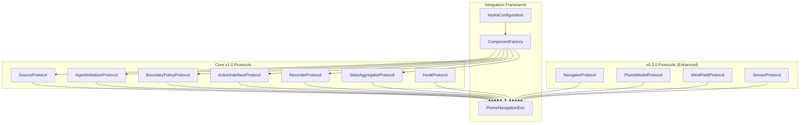

# Extending Plume Navigation Simulator v1.0: Protocol-Based Extension Guide

## Table of Contents

1. [Overview](#overview)
2. [Architecture Fundamentals](#architecture-fundamentals)  
3. [New v1.0 Protocols](#new-v10-protocols)
4. [Source Abstractions](#source-abstractions)
5. [Agent Initialization Strategies](#agent-initialization-strategies)
6. [Boundary Policy Framework](#boundary-policy-framework)
7. [Action Interface Layer](#action-interface-layer)
8. [Data Recording System](#data-recording-system)
9. [Statistics Aggregation](#statistics-aggregation)
10. [Debugging & Visualization Toolkit](#debugging--visualization-toolkit)
11. [Hook System Integration](#hook-system-integration)
12. [Configuration Architecture](#configuration-architecture)
13. [Performance Guidelines](#performance-guidelines)
14. [Migration from v0.3.0](#migration-from-v030)
15. [Testing & Validation](#testing--validation)
16. [Troubleshooting](#troubleshooting)

## Overview

Plume Navigation Simulator v1.0 represents a comprehensive transformation from a project-specific implementation into a general-purpose, extensible simulation toolkit. This version introduces a protocol-based component architecture that enables zero-code extensibility through configuration-driven hooks and abstractions.

### Key Innovations in v1.0

- **Protocol-Based Components**: All major subsystems now implement strict interface protocols for compile-time enforcement and seamless extensibility
- **Zero-Code Extensibility**: Configuration-driven component selection enables experimentation without modifying core library code
- **Enhanced Performance**: Achieves ≤33ms per simulation step while adding comprehensive logging and debugging capabilities
- **Scientific Reproducibility**: Deterministic seeding, immutable configuration snapshots, and standardized output structures
- **Extensible Hook System**: Non-invasive extension points for downstream customization and research needs

### New Protocol Interfaces



## Architecture Fundamentals

### Protocol-Driven Design Evolution

v1.0 extends the proven protocol-based architecture from v0.3.0 with additional abstractions for complete system modularity:

```python
from typing import Protocol, runtime_checkable
import numpy as np
from abc import abstractmethod

@runtime_checkable
class SourceProtocol(Protocol):
    """Protocol for odor source implementations."""
    
    @abstractmethod
    def get_emission_rate(self, time: float) -> float:
        """Get emission rate at specified time."""
        ...
    
    @abstractmethod
    def get_position(self, time: float) -> np.ndarray:
        """Get source position at specified time."""
        ...
    
    @abstractmethod
    def update_state(self, dt: float) -> None:
        """Update source state over time."""
        ...
    
    @abstractmethod
    def reset(self, **kwargs) -> None:
        """Reset source to initial conditions."""
        ...
```

### Component Lifecycle Integration

All v1.0 components follow an enhanced lifecycle pattern with deterministic seeding:

1. **Configuration Injection**: Hydra-driven instantiation with validation
2. **Initialization**: Protocol-compliant setup with deterministic seeding
3. **Operation**: High-performance queries and temporal evolution
4. **Recording**: Optional data capture with configurable granularity
5. **Reset**: Episode boundaries with parameter overrides and seed management

### Dependency Injection Architecture

Components are instantiated through a centralized factory pattern:

```python
from plume_nav_sim.core.factory import ComponentFactory
from plume_nav_sim.envs import PlumeNavigationEnv

# v1.0 configuration-driven instantiation
factory = ComponentFactory()
env = factory.create_environment(
    source_config=cfg.source,
    agent_init_config=cfg.agent_init,
    boundary_config=cfg.boundary,
    action_config=cfg.action,
    record_config=cfg.record,
    hooks_config=cfg.hooks
)
```

## New v1.0 Protocols

### Protocol Overview

v1.0 introduces six major new protocol interfaces that standardize component interactions:

| Protocol | Purpose | Key Methods | Performance Target |
|----------|---------|-------------|-------------------|
| `SourceProtocol` | Odor source abstraction | `get_emission_rate()`, `get_position()` | <1ms per query |
| `AgentInitializerProtocol` | Starting position strategies | `initialize_positions()` | <10ms for 100 agents |
| `BoundaryPolicyProtocol` | Domain edge handling | `apply_policy()`, `check_violations()` | <2ms for 100 agents |
| `ActionInterfaceProtocol` | Action space translation | `translate_action()` | <0.5ms per action |
| `RecorderProtocol` | Data persistence | `record_step()`, `record_episode()` | <1ms overhead |
| `StatsAggregatorProtocol` | Metrics calculation | `calculate_stats()` | <5ms per episode |

### Protocol Compliance Validation

All protocols include runtime validation capabilities:

```python
from plume_nav_sim.core.validation import validate_protocol_compliance

# Automatic protocol validation
def validate_component(component, protocol_class):
    """Validate component implements protocol correctly."""
    assert isinstance(component, protocol_class)
    
    # Check method signatures and return types
    for method_name, method_type in protocol_class.__annotations__.items():
        assert hasattr(component, method_name)
        assert callable(getattr(component, method_name))
    
    return True

# Example usage
source = PointSource(position=(50, 50))
assert validate_component(source, SourceProtocol)
```

## Source Abstractions

### SourceProtocol Implementation

The `SourceProtocol` enables flexible odor source modeling with support for static, dynamic, and multi-source configurations:

```python
# src/plume_nav_sim/core/sources.py
from typing import Any, Dict, Tuple, Union
import numpy as np
from dataclasses import dataclass

from .protocols import SourceProtocol

@dataclass
class PointSourceConfig:
    """Configuration for point source implementation."""
    position: Tuple[float, float] = (50.0, 50.0)
    emission_rate: float = 1000.0
    temporal_variation: bool = False
    variation_amplitude: float = 0.1
    variation_frequency: float = 0.05
    _target_: str = "plume_nav_sim.core.sources.PointSource"

class PointSource:
    """Single point source with optional temporal variation."""
    
    def __init__(
        self,
        position: Tuple[float, float] = (50.0, 50.0),
        emission_rate: float = 1000.0,
        temporal_variation: bool = False,
        variation_amplitude: float = 0.1,
        variation_frequency: float = 0.05,
        **kwargs: Any
    ):
        self.initial_position = np.array(position, dtype=np.float64)
        self.position = self.initial_position.copy()
        self.base_emission_rate = emission_rate
        self.temporal_variation = temporal_variation
        self.variation_amplitude = variation_amplitude
        self.variation_frequency = variation_frequency
        self.current_time = 0.0
        
        # Performance monitoring
        self._query_count = 0
    
    def get_emission_rate(self, time: float) -> float:
        """Get emission rate with optional temporal variation."""
        self._query_count += 1
        
        if not self.temporal_variation:
            return self.base_emission_rate
        
        # Sinusoidal temporal variation
        variation = self.variation_amplitude * np.sin(
            2 * np.pi * self.variation_frequency * time
        )
        return self.base_emission_rate * (1.0 + variation)
    
    def get_position(self, time: float) -> np.ndarray:
        """Get source position (static for PointSource)."""
        return self.position.copy()
    
    def update_state(self, dt: float) -> None:
        """Update source state over time."""
        if dt <= 0:
            raise ValueError(f"Time step must be positive, got {dt}")
        self.current_time += dt
    
    def reset(self, **kwargs: Any) -> None:
        """Reset source to initial conditions."""
        self.current_time = kwargs.get('current_time', 0.0)
        
        if 'position' in kwargs:
            self.position = np.array(kwargs['position'], dtype=np.float64)
            self.initial_position = self.position.copy()
        else:
            self.position = self.initial_position.copy()
        
        if 'emission_rate' in kwargs:
            self.base_emission_rate = float(kwargs['emission_rate'])
        
        self._query_count = 0
    
    def get_performance_stats(self) -> Dict[str, Any]:
        """Get performance statistics."""
        return {
            'query_count': self._query_count,
            'current_time': self.current_time,
            'source_type': 'PointSource'
        }
```

### Multi-Source Implementation

Support for multiple simultaneous sources:

```python
class MultiSource:
    """Multiple point sources with coordinated emission."""
    
    def __init__(
        self,
        source_positions: List[Tuple[float, float]],
        emission_rates: Union[float, List[float]] = 1000.0,
        coordination_mode: str = "independent",  # "independent", "synchronized", "sequential"
        **kwargs: Any
    ):
        self.sources = []
        
        # Handle uniform vs individual emission rates
        if isinstance(emission_rates, (int, float)):
            emission_rates = [emission_rates] * len(source_positions)
        
        # Create individual sources
        for i, (pos, rate) in enumerate(zip(source_positions, emission_rates)):
            source = PointSource(
                position=pos,
                emission_rate=rate,
                **kwargs
            )
            self.sources.append(source)
        
        self.coordination_mode = coordination_mode
        self.current_time = 0.0
        self.active_source_index = 0
    
    def get_emission_rate(self, time: float) -> np.ndarray:
        """Get emission rates from all sources."""
        if self.coordination_mode == "independent":
            # All sources emit independently
            return np.array([
                source.get_emission_rate(time) for source in self.sources
            ])
        
        elif self.coordination_mode == "synchronized":
            # All sources emit in synchrony
            base_rate = self.sources[0].get_emission_rate(time)
            return np.full(len(self.sources), base_rate)
        
        elif self.coordination_mode == "sequential":
            # Only one source active at a time
            rates = np.zeros(len(self.sources))
            rates[self.active_source_index] = self.sources[self.active_source_index].get_emission_rate(time)
            return rates
        
        else:
            raise ValueError(f"Unknown coordination mode: {self.coordination_mode}")
    
    def get_position(self, time: float) -> np.ndarray:
        """Get positions of all sources."""
        return np.array([
            source.get_position(time) for source in self.sources
        ])
    
    def update_state(self, dt: float) -> None:
        """Update all source states."""
        self.current_time += dt
        
        for source in self.sources:
            source.update_state(dt)
        
        # Handle sequential activation
        if self.coordination_mode == "sequential":
            # Switch active source every 100 time units
            switch_interval = 100.0
            self.active_source_index = int(self.current_time // switch_interval) % len(self.sources)
    
    def reset(self, **kwargs: Any) -> None:
        """Reset all sources."""
        self.current_time = kwargs.get('current_time', 0.0)
        self.active_source_index = 0
        
        for source in self.sources:
            source.reset(**kwargs)
```

### Dynamic Source Implementation

Sources with movement and adaptive emission:

```python
class DynamicSource:
    """Source with dynamic position and emission patterns."""
    
    def __init__(
        self,
        initial_position: Tuple[float, float] = (50.0, 50.0),
        movement_pattern: str = "circular",  # "circular", "linear", "random_walk"
        movement_speed: float = 1.0,
        movement_radius: float = 10.0,
        emission_rate: float = 1000.0,
        adaptive_emission: bool = False,
        **kwargs: Any
    ):
        self.initial_position = np.array(initial_position, dtype=np.float64)
        self.position = self.initial_position.copy()
        self.movement_pattern = movement_pattern
        self.movement_speed = movement_speed
        self.movement_radius = movement_radius
        self.base_emission_rate = emission_rate
        self.adaptive_emission = adaptive_emission
        self.current_time = 0.0
        
        # Movement state
        self.movement_angle = 0.0
        self.movement_direction = np.array([1.0, 0.0])
        
        # Random state for reproducible movement
        self.random_state = np.random.RandomState(kwargs.get('random_seed', 42))
    
    def get_emission_rate(self, time: float) -> float:
        """Get emission rate with optional adaptive behavior."""
        if not self.adaptive_emission:
            return self.base_emission_rate
        
        # Adaptive emission based on position
        distance_from_center = np.linalg.norm(self.position - self.initial_position)
        adaptation_factor = 1.0 + 0.5 * np.sin(distance_from_center / self.movement_radius)
        
        return self.base_emission_rate * adaptation_factor
    
    def get_position(self, time: float) -> np.ndarray:
        """Get current dynamic position."""
        return self.position.copy()
    
    def update_state(self, dt: float) -> None:
        """Update position based on movement pattern."""
        self.current_time += dt
        
        if self.movement_pattern == "circular":
            # Circular movement around initial position
            self.movement_angle += self.movement_speed * dt / self.movement_radius
            self.position = self.initial_position + self.movement_radius * np.array([
                np.cos(self.movement_angle),
                np.sin(self.movement_angle)
            ])
        
        elif self.movement_pattern == "linear":
            # Linear movement with periodic reversal
            self.position += self.movement_direction * self.movement_speed * dt
            
            # Reverse direction when reaching boundaries
            distance_from_center = np.linalg.norm(self.position - self.initial_position)
            if distance_from_center > self.movement_radius:
                self.movement_direction *= -1
        
        elif self.movement_pattern == "random_walk":
            # Random walk with bounded movement
            random_direction = self.random_state.uniform(-np.pi, np.pi)
            movement_vector = self.movement_speed * dt * np.array([
                np.cos(random_direction),
                np.sin(random_direction)
            ])
            
            new_position = self.position + movement_vector
            
            # Keep within movement radius
            distance_from_center = np.linalg.norm(new_position - self.initial_position)
            if distance_from_center <= self.movement_radius:
                self.position = new_position
    
    def reset(self, **kwargs: Any) -> None:
        """Reset to initial conditions."""
        self.current_time = kwargs.get('current_time', 0.0)
        self.position = self.initial_position.copy()
        self.movement_angle = 0.0
        self.movement_direction = np.array([1.0, 0.0])
        
        if 'initial_position' in kwargs:
            self.initial_position = np.array(kwargs['initial_position'], dtype=np.float64)
            self.position = self.initial_position.copy()
```

### Source Configuration Examples

```yaml
# conf/base/source/point.yaml
_target_: plume_nav_sim.core.sources.PointSource
position: [50.0, 50.0]
emission_rate: 1000.0
temporal_variation: false

# conf/base/source/multi.yaml
_target_: plume_nav_sim.core.sources.MultiSource
source_positions: [[25.0, 25.0], [75.0, 75.0], [50.0, 10.0]]
emission_rates: [1000.0, 1200.0, 800.0]
coordination_mode: "independent"

# conf/base/source/dynamic.yaml
_target_: plume_nav_sim.core.sources.DynamicSource
initial_position: [50.0, 50.0]
movement_pattern: "circular"
movement_speed: 2.0
movement_radius: 15.0
emission_rate: 1000.0
adaptive_emission: true
```

## Agent Initialization Strategies

### AgentInitializerProtocol

The `AgentInitializerProtocol` standardizes agent starting position generation:

```python
# src/plume_nav_sim/core/initialization.py
from typing import Any, Dict, List, Optional, Tuple, Union
import numpy as np
from abc import abstractmethod
from dataclasses import dataclass

from .protocols import AgentInitializerProtocol

@dataclass
class UniformRandomConfig:
    """Configuration for uniform random initialization."""
    domain_bounds: Tuple[Tuple[float, float], Tuple[float, float]] = ((0.0, 100.0), (0.0, 100.0))
    min_distance_from_source: float = 5.0
    max_attempts: int = 1000
    random_seed: Optional[int] = None
    _target_: str = "plume_nav_sim.core.initialization.UniformRandomInitializer"

class UniformRandomInitializer:
    """Initialize agents at random positions within domain bounds."""
    
    def __init__(
        self,
        domain_bounds: Tuple[Tuple[float, float], Tuple[float, float]] = ((0.0, 100.0), (0.0, 100.0)),
        min_distance_from_source: float = 5.0,
        max_attempts: int = 1000,
        random_seed: Optional[int] = None,
        **kwargs: Any
    ):
        self.x_bounds, self.y_bounds = domain_bounds
        self.min_distance_from_source = min_distance_from_source
        self.max_attempts = max_attempts
        
        # Initialize random state for reproducibility
        self.random_state = np.random.RandomState(random_seed)
        self._initialization_count = 0
    
    def initialize_positions(
        self, 
        num_agents: int, 
        source_positions: np.ndarray,
        **kwargs: Any
    ) -> np.ndarray:
        """Generate random starting positions for agents."""
        if num_agents <= 0:
            raise ValueError(f"Number of agents must be positive, got {num_agents}")
        
        positions = np.zeros((num_agents, 2))
        
        for i in range(num_agents):
            position = self._generate_valid_position(source_positions)
            positions[i] = position
        
        self._initialization_count += 1
        return positions
    
    def _generate_valid_position(self, source_positions: np.ndarray) -> np.ndarray:
        """Generate a single valid position."""
        for attempt in range(self.max_attempts):
            # Generate random position within bounds
            x = self.random_state.uniform(self.x_bounds[0], self.x_bounds[1])
            y = self.random_state.uniform(self.y_bounds[0], self.y_bounds[1])
            position = np.array([x, y])
            
            # Check distance from all sources
            if self._is_valid_position(position, source_positions):
                return position
        
        # If max attempts reached, use the last generated position
        import warnings
        warnings.warn(
            f"Could not find valid position after {self.max_attempts} attempts. "
            f"Using last generated position."
        )
        return position
    
    def _is_valid_position(self, position: np.ndarray, source_positions: np.ndarray) -> bool:
        """Check if position meets distance constraints."""
        if source_positions.size == 0:
            return True
        
        # Ensure source_positions is 2D
        if source_positions.ndim == 1:
            source_positions = source_positions.reshape(1, -1)
        
        # Check distance from all sources
        distances = np.linalg.norm(source_positions - position, axis=1)
        return np.all(distances >= self.min_distance_from_source)
    
    def validate_domain(self, positions: np.ndarray) -> Tuple[bool, str]:
        """Validate that positions are within domain bounds."""
        if positions.ndim != 2 or positions.shape[1] != 2:
            return False, "Positions must be (N, 2) array"
        
        x_valid = np.all((positions[:, 0] >= self.x_bounds[0]) & 
                        (positions[:, 0] <= self.x_bounds[1]))
        y_valid = np.all((positions[:, 1] >= self.y_bounds[0]) & 
                        (positions[:, 1] <= self.y_bounds[1]))
        
        if not (x_valid and y_valid):
            return False, "Some positions are outside domain bounds"
        
        return True, "All positions valid"
    
    def reset(self, **kwargs: Any) -> None:
        """Reset initializer state."""
        if 'random_seed' in kwargs:
            self.random_state = np.random.RandomState(kwargs['random_seed'])
        
        self._initialization_count = 0
```

### Grid Initialization Strategy

Systematic grid-based positioning:

```python
class GridInitializer:
    """Initialize agents in a regular grid pattern."""
    
    def __init__(
        self,
        grid_spacing: float = 10.0,
        grid_origin: Tuple[float, float] = (10.0, 10.0),
        grid_dimensions: Optional[Tuple[int, int]] = None,
        fill_mode: str = "row_major",  # "row_major", "column_major", "spiral"
        **kwargs: Any
    ):
        self.grid_spacing = grid_spacing
        self.grid_origin = np.array(grid_origin, dtype=np.float64)
        self.grid_dimensions = grid_dimensions
        self.fill_mode = fill_mode
        self._initialization_count = 0
    
    def initialize_positions(
        self, 
        num_agents: int, 
        source_positions: np.ndarray,
        **kwargs: Any
    ) -> np.ndarray:
        """Generate grid-based starting positions."""
        if self.grid_dimensions is None:
            # Automatically determine grid dimensions
            grid_cols = int(np.ceil(np.sqrt(num_agents)))
            grid_rows = int(np.ceil(num_agents / grid_cols))
        else:
            grid_rows, grid_cols = self.grid_dimensions
        
        if self.fill_mode == "row_major":
            positions = self._generate_row_major_grid(num_agents, grid_rows, grid_cols)
        elif self.fill_mode == "column_major":
            positions = self._generate_column_major_grid(num_agents, grid_rows, grid_cols)
        elif self.fill_mode == "spiral":
            positions = self._generate_spiral_grid(num_agents, grid_rows, grid_cols)
        else:
            raise ValueError(f"Unknown fill mode: {self.fill_mode}")
        
        self._initialization_count += 1
        return positions
    
    def _generate_row_major_grid(self, num_agents: int, rows: int, cols: int) -> np.ndarray:
        """Generate positions in row-major order."""
        positions = []
        
        for i in range(num_agents):
            row = i // cols
            col = i % cols
            
            x = self.grid_origin[0] + col * self.grid_spacing
            y = self.grid_origin[1] + row * self.grid_spacing
            
            positions.append([x, y])
        
        return np.array(positions)
    
    def _generate_column_major_grid(self, num_agents: int, rows: int, cols: int) -> np.ndarray:
        """Generate positions in column-major order."""
        positions = []
        
        for i in range(num_agents):
            row = i % rows
            col = i // rows
            
            x = self.grid_origin[0] + col * self.grid_spacing
            y = self.grid_origin[1] + row * self.grid_spacing
            
            positions.append([x, y])
        
        return np.array(positions)
    
    def _generate_spiral_grid(self, num_agents: int, rows: int, cols: int) -> np.ndarray:
        """Generate positions in spiral pattern."""
        # Create a spiral ordering of grid positions
        grid = np.zeros((rows, cols), dtype=int)
        
        # Fill grid in spiral pattern
        top, bottom = 0, rows - 1
        left, right = 0, cols - 1
        num = 0
        
        while top <= bottom and left <= right and num < num_agents:
            # Fill top row
            for j in range(left, right + 1):
                if num < num_agents:
                    grid[top][j] = num
                    num += 1
            top += 1
            
            # Fill right column
            for i in range(top, bottom + 1):
                if num < num_agents:
                    grid[i][right] = num
                    num += 1
            right -= 1
            
            # Fill bottom row
            if top <= bottom:
                for j in range(right, left - 1, -1):
                    if num < num_agents:
                        grid[bottom][j] = num
                        num += 1
                bottom -= 1
            
            # Fill left column
            if left <= right:
                for i in range(bottom, top - 1, -1):
                    if num < num_agents:
                        grid[i][left] = num
                        num += 1
                left += 1
        
        # Convert grid to positions
        positions = []
        for i in range(rows):
            for j in range(cols):
                if grid[i][j] < num_agents:
                    x = self.grid_origin[0] + j * self.grid_spacing
                    y = self.grid_origin[1] + i * self.grid_spacing
                    positions.append([x, y])
        
        # Sort by spiral order
        positions_with_order = [(grid[i][j], [
            self.grid_origin[0] + j * self.grid_spacing,
            self.grid_origin[1] + i * self.grid_spacing
        ]) for i in range(rows) for j in range(cols) if grid[i][j] < num_agents]
        
        positions_with_order.sort(key=lambda x: x[0])
        return np.array([pos[1] for pos in positions_with_order])
```

### Fixed List and Dataset Initialization

Support for predetermined positions:

```python
class FixedListInitializer:
    """Initialize agents from a predefined list of positions."""
    
    def __init__(
        self,
        position_list: List[Tuple[float, float]],
        cycling_mode: str = "repeat",  # "repeat", "random_sample", "error"
        **kwargs: Any
    ):
        self.position_list = [np.array(pos, dtype=np.float64) for pos in position_list]
        self.cycling_mode = cycling_mode
        self.random_state = np.random.RandomState(kwargs.get('random_seed', 42))
        self._initialization_count = 0
    
    def initialize_positions(
        self, 
        num_agents: int, 
        source_positions: np.ndarray,
        **kwargs: Any
    ) -> np.ndarray:
        """Initialize from fixed position list."""
        if num_agents <= 0:
            raise ValueError(f"Number of agents must be positive, got {num_agents}")
        
        if len(self.position_list) == 0:
            raise ValueError("Position list is empty")
        
        if num_agents <= len(self.position_list):
            # Use first num_agents positions
            positions = np.array(self.position_list[:num_agents])
        
        else:
            # Handle case where more agents than positions
            if self.cycling_mode == "repeat":
                # Repeat the list cyclically
                positions = []
                for i in range(num_agents):
                    positions.append(self.position_list[i % len(self.position_list)])
                positions = np.array(positions)
            
            elif self.cycling_mode == "random_sample":
                # Random sampling with replacement
                indices = self.random_state.choice(
                    len(self.position_list), 
                    size=num_agents, 
                    replace=True
                )
                positions = np.array([self.position_list[i] for i in indices])
            
            elif self.cycling_mode == "error":
                raise ValueError(
                    f"Not enough positions in list. Need {num_agents}, have {len(self.position_list)}"
                )
            
            else:
                raise ValueError(f"Unknown cycling mode: {self.cycling_mode}")
        
        self._initialization_count += 1
        return positions

class DatasetInitializer:
    """Initialize agents from saved dataset."""
    
    def __init__(
        self,
        dataset_path: str,
        dataset_format: str = "numpy",  # "numpy", "csv", "json"
        position_columns: Optional[List[str]] = None,
        sampling_strategy: str = "sequential",  # "sequential", "random", "bootstrap"
        **kwargs: Any
    ):
        self.dataset_path = dataset_path
        self.dataset_format = dataset_format
        self.position_columns = position_columns or ['x', 'y']
        self.sampling_strategy = sampling_strategy
        self.random_state = np.random.RandomState(kwargs.get('random_seed', 42))
        
        # Load dataset
        self.positions = self._load_dataset()
        self._current_index = 0
        self._initialization_count = 0
    
    def _load_dataset(self) -> np.ndarray:
        """Load positions from dataset file."""
        if self.dataset_format == "numpy":
            data = np.load(self.dataset_path)
            if data.ndim != 2 or data.shape[1] != 2:
                raise ValueError("NumPy dataset must be (N, 2) array")
            return data
        
        elif self.dataset_format == "csv":
            import pandas as pd
            df = pd.read_csv(self.dataset_path)
            
            if not all(col in df.columns for col in self.position_columns):
                raise ValueError(f"CSV must contain columns: {self.position_columns}")
            
            return df[self.position_columns].values
        
        elif self.dataset_format == "json":
            import json
            with open(self.dataset_path, 'r') as f:
                data = json.load(f)
            
            if isinstance(data, list) and all(len(pos) == 2 for pos in data):
                return np.array(data)
            else:
                raise ValueError("JSON dataset must be list of [x, y] pairs")
        
        else:
            raise ValueError(f"Unknown dataset format: {self.dataset_format}")
    
    def initialize_positions(
        self, 
        num_agents: int, 
        source_positions: np.ndarray,
        **kwargs: Any
    ) -> np.ndarray:
        """Initialize from dataset."""
        if num_agents <= 0:
            raise ValueError(f"Number of agents must be positive, got {num_agents}")
        
        if len(self.positions) == 0:
            raise ValueError("Dataset is empty")
        
        if self.sampling_strategy == "sequential":
            # Sample sequentially from dataset
            if self._current_index + num_agents <= len(self.positions):
                selected_positions = self.positions[self._current_index:self._current_index + num_agents]
                self._current_index += num_agents
            else:
                # Wrap around if needed
                remaining = len(self.positions) - self._current_index
                selected_positions = np.vstack([
                    self.positions[self._current_index:],
                    self.positions[:num_agents - remaining]
                ])
                self._current_index = num_agents - remaining
        
        elif self.sampling_strategy == "random":
            # Random sampling without replacement
            if num_agents <= len(self.positions):
                indices = self.random_state.choice(
                    len(self.positions), 
                    size=num_agents, 
                    replace=False
                )
            else:
                # With replacement if more agents than data
                indices = self.random_state.choice(
                    len(self.positions), 
                    size=num_agents, 
                    replace=True
                )
            selected_positions = self.positions[indices]
        
        elif self.sampling_strategy == "bootstrap":
            # Bootstrap sampling with replacement
            indices = self.random_state.choice(
                len(self.positions), 
                size=num_agents, 
                replace=True
            )
            selected_positions = self.positions[indices]
        
        else:
            raise ValueError(f"Unknown sampling strategy: {self.sampling_strategy}")
        
        self._initialization_count += 1
        return selected_positions.copy()
    
    def reset(self, **kwargs: Any) -> None:
        """Reset dataset sampling state."""
        self._current_index = 0
        self._initialization_count = 0
        
        if 'random_seed' in kwargs:
            self.random_state = np.random.RandomState(kwargs['random_seed'])
```

### Agent Initialization Configuration Examples

```yaml
# conf/base/agent_init/uniform_random.yaml
_target_: plume_nav_sim.core.initialization.UniformRandomInitializer
domain_bounds: [[10.0, 90.0], [10.0, 90.0]]
min_distance_from_source: 8.0
max_attempts: 1000
random_seed: 42

# conf/base/agent_init/grid.yaml
_target_: plume_nav_sim.core.initialization.GridInitializer
grid_spacing: 8.0
grid_origin: [15.0, 15.0]
fill_mode: "spiral"

# conf/base/agent_init/fixed_list.yaml
_target_: plume_nav_sim.core.initialization.FixedListInitializer
position_list: [[10.0, 20.0], [30.0, 40.0], [50.0, 60.0], [70.0, 80.0]]
cycling_mode: "repeat"

# conf/base/agent_init/from_dataset.yaml
_target_: plume_nav_sim.core.initialization.DatasetInitializer
dataset_path: "data/initial_positions.npy"
dataset_format: "numpy"
sampling_strategy: "random"
random_seed: 42
```

## Boundary Policy Framework

### BoundaryPolicyProtocol Implementation

The `BoundaryPolicyProtocol` standardizes domain edge handling with support for terminate, bounce, wrap, and clip behaviors:

```python
# src/plume_nav_sim/core/boundaries.py
from typing import Any, Dict, Tuple, Union
import numpy as np
from abc import abstractmethod
from dataclasses import dataclass

from .protocols import BoundaryPolicyProtocol

@dataclass
class TerminateBoundaryConfig:
    """Configuration for termination boundary policy."""
    domain_bounds: Tuple[Tuple[float, float], Tuple[float, float]] = ((0.0, 100.0), (0.0, 100.0))
    status_on_violation: str = "oob"  # out-of-bounds status
    margin: float = 0.0  # safety margin from boundaries
    _target_: str = "plume_nav_sim.core.boundaries.TerminateBoundary"

class TerminateBoundary:
    """Terminate episode when agents reach domain boundaries."""
    
    def __init__(
        self,
        domain_bounds: Tuple[Tuple[float, float], Tuple[float, float]] = ((0.0, 100.0), (0.0, 100.0)),
        status_on_violation: str = "oob",
        margin: float = 0.0,
        **kwargs: Any
    ):
        self.x_bounds, self.y_bounds = domain_bounds
        self.status_on_violation = status_on_violation
        self.margin = margin
        
        # Effective bounds with margin
        self.effective_x_bounds = (self.x_bounds[0] + margin, self.x_bounds[1] - margin)
        self.effective_y_bounds = (self.y_bounds[0] + margin, self.y_bounds[1] - margin)
        
        # Statistics tracking
        self._violation_count = 0
        self._total_checks = 0
    
    def apply_policy(
        self, 
        positions: np.ndarray, 
        velocities: np.ndarray,
        dt: float = 1.0
    ) -> Tuple[np.ndarray, np.ndarray, np.ndarray]:
        """
        Apply termination boundary policy.
        
        Returns:
            new_positions: Updated positions (unchanged for terminate policy)
            new_velocities: Updated velocities (unchanged for terminate policy)
            termination_mask: Boolean array indicating which agents should terminate
        """
        self._total_checks += 1
        
        # Check for boundary violations
        violations = self.check_violations(positions)
        
        if np.any(violations):
            self._violation_count += 1
        
        # For terminate policy, positions and velocities remain unchanged
        # Only termination status changes
        return positions.copy(), velocities.copy(), violations
    
    def check_violations(self, positions: np.ndarray) -> np.ndarray:
        """Check which agents violate boundaries."""
        # Ensure positions is 2D
        single_agent = positions.ndim == 1
        if single_agent:
            positions = positions.reshape(1, 2)
        
        # Check x-bounds
        x_violations = ((positions[:, 0] < self.effective_x_bounds[0]) | 
                       (positions[:, 0] > self.effective_x_bounds[1]))
        
        # Check y-bounds
        y_violations = ((positions[:, 1] < self.effective_y_bounds[0]) | 
                       (positions[:, 1] > self.effective_y_bounds[1]))
        
        violations = x_violations | y_violations
        
        return violations[0] if single_agent else violations
    
    def get_termination_status(self, violations: np.ndarray) -> Union[str, np.ndarray]:
        """Get termination status for violated agents."""
        if np.isscalar(violations):
            return self.status_on_violation if violations else None
        else:
            return np.where(violations, self.status_on_violation, None)
    
    def get_performance_stats(self) -> Dict[str, Any]:
        """Get boundary policy performance statistics."""
        violation_rate = self._violation_count / max(self._total_checks, 1)
        return {
            'policy_type': 'TerminateBoundary',
            'violation_count': self._violation_count,
            'total_checks': self._total_checks,
            'violation_rate': violation_rate,
            'domain_bounds': (self.x_bounds, self.y_bounds),
            'margin': self.margin
        }

class BounceBoundary:
    """Reflect agents off domain boundaries with elastic collision."""
    
    def __init__(
        self,
        domain_bounds: Tuple[Tuple[float, float], Tuple[float, float]] = ((0.0, 100.0), (0.0, 100.0)),
        energy_loss: float = 0.0,  # 0.0 = perfectly elastic, 1.0 = fully inelastic
        **kwargs: Any
    ):
        self.x_bounds, self.y_bounds = domain_bounds
        self.energy_loss = np.clip(energy_loss, 0.0, 1.0)
        self._bounce_count = 0
        self._total_checks = 0
    
    def apply_policy(
        self, 
        positions: np.ndarray, 
        velocities: np.ndarray,
        dt: float = 1.0
    ) -> Tuple[np.ndarray, np.ndarray, np.ndarray]:
        """Apply bounce boundary policy."""
        self._total_checks += 1
        
        # Ensure arrays are 2D
        single_agent = positions.ndim == 1
        if single_agent:
            positions = positions.reshape(1, 2)
            velocities = velocities.reshape(1, 2)
        
        new_positions = positions.copy()
        new_velocities = velocities.copy()
        
        # Check and correct x-boundary violations
        x_low_violations = new_positions[:, 0] < self.x_bounds[0]
        x_high_violations = new_positions[:, 0] > self.x_bounds[1]
        
        if np.any(x_low_violations):
            new_positions[x_low_violations, 0] = 2 * self.x_bounds[0] - new_positions[x_low_violations, 0]
            new_velocities[x_low_violations, 0] *= -(1.0 - self.energy_loss)
            self._bounce_count += np.sum(x_low_violations)
        
        if np.any(x_high_violations):
            new_positions[x_high_violations, 0] = 2 * self.x_bounds[1] - new_positions[x_high_violations, 0]
            new_velocities[x_high_violations, 0] *= -(1.0 - self.energy_loss)
            self._bounce_count += np.sum(x_high_violations)
        
        # Check and correct y-boundary violations
        y_low_violations = new_positions[:, 1] < self.y_bounds[0]
        y_high_violations = new_positions[:, 1] > self.y_bounds[1]
        
        if np.any(y_low_violations):
            new_positions[y_low_violations, 1] = 2 * self.y_bounds[0] - new_positions[y_low_violations, 1]
            new_velocities[y_low_violations, 1] *= -(1.0 - self.energy_loss)
            self._bounce_count += np.sum(y_low_violations)
        
        if np.any(y_high_violations):
            new_positions[y_high_violations, 1] = 2 * self.y_bounds[1] - new_positions[y_high_violations, 1]
            new_velocities[y_high_violations, 1] *= -(1.0 - self.energy_loss)
            self._bounce_count += np.sum(y_high_violations)
        
        # No terminations for bounce policy
        termination_mask = np.zeros(new_positions.shape[0], dtype=bool)
        
        if single_agent:
            return new_positions[0], new_velocities[0], termination_mask[0]
        else:
            return new_positions, new_velocities, termination_mask

class WrapBoundary:
    """Wrap agents around domain boundaries (toroidal topology)."""
    
    def __init__(
        self,
        domain_bounds: Tuple[Tuple[float, float], Tuple[float, float]] = ((0.0, 100.0), (0.0, 100.0)),
        **kwargs: Any
    ):
        self.x_bounds, self.y_bounds = domain_bounds
        self.x_range = self.x_bounds[1] - self.x_bounds[0]
        self.y_range = self.y_bounds[1] - self.y_bounds[0]
        self._wrap_count = 0
        self._total_checks = 0
    
    def apply_policy(
        self, 
        positions: np.ndarray, 
        velocities: np.ndarray,
        dt: float = 1.0
    ) -> Tuple[np.ndarray, np.ndarray, np.ndarray]:
        """Apply wrap boundary policy."""
        self._total_checks += 1
        
        # Ensure arrays are 2D
        single_agent = positions.ndim == 1
        if single_agent:
            positions = positions.reshape(1, 2)
            velocities = velocities.reshape(1, 2)
        
        new_positions = positions.copy()
        new_velocities = velocities.copy()  # Velocities unchanged in wrap policy
        
        # Wrap x-coordinates
        x_violations = ((new_positions[:, 0] < self.x_bounds[0]) | 
                       (new_positions[:, 0] > self.x_bounds[1]))
        if np.any(x_violations):
            new_positions[:, 0] = (new_positions[:, 0] - self.x_bounds[0]) % self.x_range + self.x_bounds[0]
            self._wrap_count += np.sum(x_violations)
        
        # Wrap y-coordinates
        y_violations = ((new_positions[:, 1] < self.y_bounds[0]) | 
                       (new_positions[:, 1] > self.y_bounds[1]))
        if np.any(y_violations):
            new_positions[:, 1] = (new_positions[:, 1] - self.y_bounds[0]) % self.y_range + self.y_bounds[0]
            self._wrap_count += np.sum(y_violations)
        
        # No terminations for wrap policy
        termination_mask = np.zeros(new_positions.shape[0], dtype=bool)
        
        if single_agent:
            return new_positions[0], new_velocities[0], termination_mask[0]
        else:
            return new_positions, new_velocities, termination_mask

class ClipBoundary:
    """Clip agent positions to domain boundaries."""
    
    def __init__(
        self,
        domain_bounds: Tuple[Tuple[float, float], Tuple[float, float]] = ((0.0, 100.0), (0.0, 100.0)),
        velocity_damping: float = 0.5,  # Reduce velocity when clipped
        **kwargs: Any
    ):
        self.x_bounds, self.y_bounds = domain_bounds
        self.velocity_damping = np.clip(velocity_damping, 0.0, 1.0)
        self._clip_count = 0
        self._total_checks = 0
    
    def apply_policy(
        self, 
        positions: np.ndarray, 
        velocities: np.ndarray,
        dt: float = 1.0
    ) -> Tuple[np.ndarray, np.ndarray, np.ndarray]:
        """Apply clip boundary policy."""
        self._total_checks += 1
        
        # Ensure arrays are 2D
        single_agent = positions.ndim == 1
        if single_agent:
            positions = positions.reshape(1, 2)
            velocities = velocities.reshape(1, 2)
        
        new_positions = positions.copy()
        new_velocities = velocities.copy()
        
        # Clip x-coordinates and adjust velocities
        x_clipped_low = new_positions[:, 0] < self.x_bounds[0]
        x_clipped_high = new_positions[:, 0] > self.x_bounds[1]
        
        if np.any(x_clipped_low):
            new_positions[x_clipped_low, 0] = self.x_bounds[0]
            new_velocities[x_clipped_low, 0] *= self.velocity_damping
            self._clip_count += np.sum(x_clipped_low)
        
        if np.any(x_clipped_high):
            new_positions[x_clipped_high, 0] = self.x_bounds[1]
            new_velocities[x_clipped_high, 0] *= self.velocity_damping
            self._clip_count += np.sum(x_clipped_high)
        
        # Clip y-coordinates and adjust velocities
        y_clipped_low = new_positions[:, 1] < self.y_bounds[0]
        y_clipped_high = new_positions[:, 1] > self.y_bounds[1]
        
        if np.any(y_clipped_low):
            new_positions[y_clipped_low, 1] = self.y_bounds[0]
            new_velocities[y_clipped_low, 1] *= self.velocity_damping
            self._clip_count += np.sum(y_clipped_low)
        
        if np.any(y_clipped_high):
            new_positions[y_clipped_high, 1] = self.y_bounds[1]
            new_velocities[y_clipped_high, 1] *= self.velocity_damping
            self._clip_count += np.sum(y_clipped_high)
        
        # No terminations for clip policy
        termination_mask = np.zeros(new_positions.shape[0], dtype=bool)
        
        if single_agent:
            return new_positions[0], new_velocities[0], termination_mask[0]
        else:
            return new_positions, new_velocities, termination_mask
```

### Boundary Policy Configuration Examples

```yaml
# conf/base/boundary/terminate.yaml
_target_: plume_nav_sim.core.boundaries.TerminateBoundary
domain_bounds: [[0.0, 100.0], [0.0, 100.0]]
status_on_violation: "oob"
margin: 2.0

# conf/base/boundary/bounce.yaml
_target_: plume_nav_sim.core.boundaries.BounceBoundary
domain_bounds: [[0.0, 100.0], [0.0, 100.0]]
energy_loss: 0.1  # 10% energy loss per bounce

# conf/base/boundary/wrap.yaml
_target_: plume_nav_sim.core.boundaries.WrapBoundary
domain_bounds: [[0.0, 100.0], [0.0, 100.0]]

# conf/base/boundary/clip.yaml
_target_: plume_nav_sim.core.boundaries.ClipBoundary
domain_bounds: [[0.0, 100.0], [0.0, 100.0]]
velocity_damping: 0.3
```

## Action Interface Layer

### ActionInterfaceProtocol Implementation

The `ActionInterfaceProtocol` standardizes action space translation for unified RL integration:

```python
# src/plume_nav_sim/core/actions.py
from typing import Any, Dict, Union
import numpy as np
import gymnasium as gym
from abc import abstractmethod
from dataclasses import dataclass

from .protocols import ActionInterfaceProtocol

@dataclass
class Continuous2DConfig:
    """Configuration for continuous 2D action interface."""
    max_speed: float = 2.0
    max_angular_velocity: float = 45.0  # degrees per second
    action_space_bounds: Dict[str, float] = None  # Custom bounds for action space
    clip_actions: bool = True
    _target_: str = "plume_nav_sim.core.actions.Continuous2DAction"

class Continuous2DAction:
    """Continuous 2D action space for navigation."""
    
    def __init__(
        self,
        max_speed: float = 2.0,
        max_angular_velocity: float = 45.0,
        action_space_bounds: Dict[str, float] = None,
        clip_actions: bool = True,
        **kwargs: Any
    ):
        self.max_speed = max_speed
        self.max_angular_velocity = max_angular_velocity
        self.clip_actions = clip_actions
        
        # Set up action space bounds
        if action_space_bounds is not None:
            self.action_bounds = action_space_bounds
        else:
            self.action_bounds = {
                'speed_low': -max_speed,
                'speed_high': max_speed,
                'angular_low': -max_angular_velocity,
                'angular_high': max_angular_velocity
            }
        
        # Performance tracking
        self._translation_count = 0
        self._total_translation_time = 0.0
    
    def translate_action(self, action: np.ndarray) -> Dict[str, Any]:
        """
        Translate RL action to navigation command.
        
        Args:
            action: [speed, angular_velocity] or [vx, vy]
            
        Returns:
            Navigation command dictionary with 'speed', 'angular_velocity', or 'velocity'
        """
        import time
        start_time = time.perf_counter()
        
        action = np.asarray(action, dtype=np.float64)
        
        if action.shape != (2,):
            raise ValueError(f"Action must be 2D array, got shape {action.shape}")
        
        if self.clip_actions:
            # Clip to action space bounds
            speed = np.clip(action[0], self.action_bounds['speed_low'], self.action_bounds['speed_high'])
            angular = np.clip(action[1], self.action_bounds['angular_low'], self.action_bounds['angular_high'])
        else:
            speed, angular = action[0], action[1]
        
        # Create navigation command
        command = {
            'speed': float(speed),
            'angular_velocity': float(angular),
            'action_type': 'continuous_2d'
        }
        
        # Performance tracking
        self._translation_count += 1
        translation_time = time.perf_counter() - start_time
        self._total_translation_time += translation_time
        
        return command
    
    def validate_action(self, action: np.ndarray) -> bool:
        """Validate action is within acceptable bounds."""
        if action.shape != (2,):
            return False
        
        speed_valid = (self.action_bounds['speed_low'] <= action[0] <= self.action_bounds['speed_high'])
        angular_valid = (self.action_bounds['angular_low'] <= action[1] <= self.action_bounds['angular_high'])
        
        return speed_valid and angular_valid
    
    def get_action_space(self) -> gym.Space:
        """Get Gymnasium action space definition."""
        low = np.array([self.action_bounds['speed_low'], self.action_bounds['angular_low']])
        high = np.array([self.action_bounds['speed_high'], self.action_bounds['angular_high']])
        
        return gym.spaces.Box(low=low, high=high, dtype=np.float32)
    
    def get_performance_stats(self) -> Dict[str, Any]:
        """Get action translation performance statistics."""
        avg_time = (self._total_translation_time / max(self._translation_count, 1)) * 1000
        return {
            'action_type': 'Continuous2D',
            'translation_count': self._translation_count,
            'average_translation_time_ms': avg_time,
            'total_translation_time': self._total_translation_time
        }

class CardinalDiscreteAction:
    """Discrete cardinal direction action space."""
    
    def __init__(
        self,
        speed: float = 2.0,
        num_directions: int = 8,  # 4, 8, or 16 cardinal directions
        include_stop: bool = True,
        **kwargs: Any
    ):
        self.speed = speed
        self.num_directions = num_directions
        self.include_stop = include_stop
        
        # Validate num_directions
        if num_directions not in [4, 8, 16]:
            raise ValueError("num_directions must be 4, 8, or 16")
        
        # Create direction vectors
        self.direction_vectors = self._create_direction_vectors()
        
        # Calculate total number of actions
        self.num_actions = len(self.direction_vectors)
        if self.include_stop:
            self.num_actions += 1
        
        # Performance tracking
        self._translation_count = 0
    
    def _create_direction_vectors(self) -> np.ndarray:
        """Create unit direction vectors for cardinal directions."""
        angles = np.linspace(0, 2 * np.pi, self.num_directions, endpoint=False)
        directions = np.column_stack([np.cos(angles), np.sin(angles)])
        return directions
    
    def translate_action(self, action: Union[int, np.ndarray]) -> Dict[str, Any]:
        """
        Translate discrete action to navigation command.
        
        Args:
            action: Integer action index or one-hot encoded action
            
        Returns:
            Navigation command dictionary
        """
        # Handle different action formats
        if isinstance(action, np.ndarray):
            if action.shape == (self.num_actions,):
                # One-hot encoded
                action_idx = np.argmax(action)
            elif action.shape == ():
                # Scalar numpy array
                action_idx = int(action)
            else:
                raise ValueError(f"Invalid action array shape: {action.shape}")
        else:
            action_idx = int(action)
        
        # Validate action index
        if not (0 <= action_idx < self.num_actions):
            raise ValueError(f"Action index {action_idx} out of range [0, {self.num_actions})")
        
        # Handle stop action
        if self.include_stop and action_idx == self.num_actions - 1:
            command = {
                'speed': 0.0,
                'angular_velocity': 0.0,
                'velocity': np.array([0.0, 0.0]),
                'action_type': 'discrete_stop'
            }
        else:
            # Movement action
            direction_idx = action_idx
            if action_idx >= len(self.direction_vectors):
                direction_idx = action_idx  # This should not happen with proper validation
            
            direction = self.direction_vectors[direction_idx]
            velocity = self.speed * direction
            
            # Calculate angular velocity (heading change)
            angle = np.arctan2(direction[1], direction[0])
            
            command = {
                'speed': self.speed,
                'angular_velocity': 0.0,  # Simplified for cardinal directions
                'velocity': velocity,
                'target_heading': np.degrees(angle),
                'action_type': 'discrete_cardinal'
            }
        
        self._translation_count += 1
        return command
    
    def validate_action(self, action: Union[int, np.ndarray]) -> bool:
        """Validate discrete action."""
        try:
            if isinstance(action, np.ndarray):
                if action.shape == (self.num_actions,):
                    # One-hot: should have exactly one 1
                    return np.sum(action) == 1 and np.all((action == 0) | (action == 1))
                elif action.shape == ():
                    action_idx = int(action)
                else:
                    return False
            else:
                action_idx = int(action)
            
            return 0 <= action_idx < self.num_actions
            
        except (ValueError, TypeError):
            return False
    
    def get_action_space(self) -> gym.Space:
        """Get Gymnasium discrete action space."""
        return gym.spaces.Discrete(self.num_actions)
    
    def get_action_meanings(self) -> List[str]:
        """Get human-readable action descriptions."""
        meanings = []
        
        direction_names = {
            4: ['East', 'North', 'West', 'South'],
            8: ['East', 'Northeast', 'North', 'Northwest', 'West', 'Southwest', 'South', 'Southeast'],
            16: [f'Direction_{i*22.5:.1f}°' for i in range(16)]
        }
        
        meanings.extend(direction_names[self.num_directions])
        
        if self.include_stop:
            meanings.append('Stop')
        
        return meanings
```

### Action Interface Configuration Examples

```yaml
# conf/base/action/continuous_2d.yaml
_target_: plume_nav_sim.core.actions.Continuous2DAction
max_speed: 3.0
max_angular_velocity: 60.0
clip_actions: true

# conf/base/action/discrete_4_way.yaml
_target_: plume_nav_sim.core.actions.CardinalDiscreteAction
speed: 2.0
num_directions: 4
include_stop: true

# conf/base/action/discrete_8_way.yaml
_target_: plume_nav_sim.core.actions.CardinalDiscreteAction
speed: 2.5
num_directions: 8
include_stop: false
```

## Data Recording System

### RecorderProtocol Implementation

The `RecorderProtocol` enables comprehensive data recording with multiple backend support and performance-aware buffering:

```python
# src/plume_nav_sim/recording/__init__.py
from typing import Any, Dict, List, Optional, Union
import numpy as np
from abc import abstractmethod
from dataclasses import dataclass
from pathlib import Path
import threading
import queue
import time

from ..core.protocols import RecorderProtocol

@dataclass
class RecorderConfig:
    """Base configuration for data recorders."""
    backend: str = "parquet"  # "parquet", "hdf5", "sqlite", "none"
    output_dir: str = "./outputs"
    buffer_size: int = 1000
    compression: str = "gzip"
    enable_threading: bool = True
    full: bool = True  # Save per-step trajectories
    summary_only: bool = False  # Only save episode summaries
    _target_: str = "plume_nav_sim.recording.RecorderFactory"

class BaseRecorder:
    """Base class for data recorders with common functionality."""
    
    def __init__(
        self,
        output_dir: str = "./outputs",
        buffer_size: int = 1000,
        enable_threading: bool = True,
        **kwargs: Any
    ):
        self.output_dir = Path(output_dir)
        self.output_dir.mkdir(parents=True, exist_ok=True)
        
        self.buffer_size = buffer_size
        self.enable_threading = enable_threading
        
        # Data buffers
        self.step_buffer = []
        self.episode_buffer = []
        
        # Threading components
        if enable_threading:
            self.write_queue = queue.Queue()
            self.write_thread = threading.Thread(target=self._write_worker, daemon=True)
            self.write_thread.start()
            self._stop_event = threading.Event()
        
        # Performance tracking
        self._record_count = 0
        self._total_record_time = 0.0
        self._current_episode_id = None
        self._current_run_id = None
    
    def start_episode(self, episode_id: str, run_id: str, metadata: Dict[str, Any] = None) -> None:
        """Start recording new episode."""
        self._current_episode_id = episode_id
        self._current_run_id = run_id
        
        # Clear buffers
        self.step_buffer.clear()
        
        # Create episode metadata
        episode_metadata = {
            'episode_id': episode_id,
            'run_id': run_id,
            'start_time': time.time(),
            'metadata': metadata or {}
        }
        
        self._start_episode_impl(episode_metadata)
    
    def record_step(self, step_data: Dict[str, Any]) -> None:
        """Record single simulation step."""
        start_time = time.perf_counter()
        
        # Add timing and identifiers
        enriched_data = {
            **step_data,
            'episode_id': self._current_episode_id,
            'run_id': self._current_run_id,
            'timestamp': time.time(),
            'step_time': start_time
        }
        
        # Add to buffer
        self.step_buffer.append(enriched_data)
        
        # Flush buffer if full
        if len(self.step_buffer) >= self.buffer_size:
            self._flush_step_buffer()
        
        # Performance tracking
        self._record_count += 1
        record_time = time.perf_counter() - start_time
        self._total_record_time += record_time
    
    def record_episode(self, episode_data: Dict[str, Any]) -> None:
        """Record episode-level data."""
        # Flush remaining step data
        if self.step_buffer:
            self._flush_step_buffer()
        
        enriched_episode_data = {
            **episode_data,
            'episode_id': self._current_episode_id,
            'run_id': self._current_run_id,
            'end_time': time.time()
        }
        
        self.episode_buffer.append(enriched_episode_data)
        self._record_episode_impl(enriched_episode_data)
    
    def _flush_step_buffer(self) -> None:
        """Flush step buffer to storage."""
        if not self.step_buffer:
            return
        
        if self.enable_threading:
            # Send to write thread
            self.write_queue.put(('steps', self.step_buffer.copy()))
        else:
            # Write directly
            self._write_steps(self.step_buffer)
        
        self.step_buffer.clear()
    
    def _write_worker(self) -> None:
        """Background thread worker for writing data."""
        while not self._stop_event.is_set():
            try:
                data_type, data = self.write_queue.get(timeout=1.0)
                
                if data_type == 'steps':
                    self._write_steps(data)
                elif data_type == 'episode':
                    self._write_episode(data)
                
                self.write_queue.task_done()
                
            except queue.Empty:
                continue
            except Exception as e:
                import warnings
                warnings.warn(f"Error in write worker: {e}")
    
    def finalize(self) -> None:
        """Finalize recording and cleanup."""
        # Flush remaining buffers
        if self.step_buffer:
            self._flush_step_buffer()
        
        if self.enable_threading:
            # Wait for write queue to empty
            self.write_queue.join()
            self._stop_event.set()
            self.write_thread.join(timeout=5.0)
        
        self._finalize_impl()
    
    def get_performance_stats(self) -> Dict[str, Any]:
        """Get recording performance statistics."""
        avg_time = (self._total_record_time / max(self._record_count, 1)) * 1000
        return {
            'recorder_type': self.__class__.__name__,
            'record_count': self._record_count,
            'average_record_time_ms': avg_time,
            'buffer_size': self.buffer_size,
            'threading_enabled': self.enable_threading
        }
    
    # Abstract methods to be implemented by subclasses
    def _start_episode_impl(self, metadata: Dict[str, Any]) -> None:
        """Backend-specific episode start implementation."""
        pass
    
    def _write_steps(self, steps: List[Dict[str, Any]]) -> None:
        """Backend-specific step writing implementation."""
        pass
    
    def _record_episode_impl(self, episode_data: Dict[str, Any]) -> None:
        """Backend-specific episode recording implementation."""
        pass
    
    def _write_episode(self, episode_data: Dict[str, Any]) -> None:
        """Backend-specific episode writing implementation."""
        pass
    
    def _finalize_impl(self) -> None:
        """Backend-specific finalization implementation."""
        pass
```

### Parquet Backend Implementation

High-performance columnar storage:

```python
# src/plume_nav_sim/recording/backends/parquet_backend.py
import pandas as pd
import pyarrow as pa
import pyarrow.parquet as pq
from typing import Any, Dict, List
from pathlib import Path

from ..base_recorder import BaseRecorder

class ParquetRecorder(BaseRecorder):
    """Parquet backend for efficient columnar data storage."""
    
    def __init__(
        self,
        compression: str = "gzip",
        **kwargs: Any
    ):
        super().__init__(**kwargs)
        self.compression = compression
        self.parquet_writers = {}
        
    def _start_episode_impl(self, metadata: Dict[str, Any]) -> None:
        """Initialize parquet files for new episode."""
        episode_dir = self.output_dir / self._current_run_id / self._current_episode_id
        episode_dir.mkdir(parents=True, exist_ok=True)
        
        # Save episode metadata
        metadata_df = pd.DataFrame([metadata])
        metadata_path = episode_dir / "metadata.parquet"
        metadata_df.to_parquet(metadata_path, compression=self.compression)
    
    def _write_steps(self, steps: List[Dict[str, Any]]) -> None:
        """Write step data to parquet files."""
        if not steps:
            return
        
        # Convert to DataFrame
        df = pd.DataFrame(steps)
        
        # Define file path
        episode_dir = self.output_dir / self._current_run_id / self._current_episode_id
        steps_path = episode_dir / "steps.parquet"
        
        # Append to existing file or create new one
        if steps_path.exists():
            # Append mode
            existing_table = pq.read_table(steps_path)
            new_table = pa.Table.from_pandas(df)
            combined_table = pa.concat_tables([existing_table, new_table])
            pq.write_table(combined_table, steps_path, compression=self.compression)
        else:
            # Create new file
            df.to_parquet(steps_path, compression=self.compression, index=False)
    
    def _record_episode_impl(self, episode_data: Dict[str, Any]) -> None:
        """Record episode summary data."""
        episode_dir = self.output_dir / self._current_run_id / self._current_episode_id
        
        # Save episode summary
        summary_df = pd.DataFrame([episode_data])
        summary_path = episode_dir / "summary.parquet"
        summary_df.to_parquet(summary_path, compression=self.compression, index=False)
```

### HDF5 Backend Implementation

Hierarchical data format for scientific data:

```python
# src/plume_nav_sim/recording/backends/hdf5_backend.py
import h5py
import numpy as np
from typing import Any, Dict, List
from pathlib import Path

from ..base_recorder import BaseRecorder

class HDF5Recorder(BaseRecorder):
    """HDF5 backend for hierarchical scientific data storage."""
    
    def __init__(
        self,
        compression: str = "gzip",
        compression_opts: int = 9,
        **kwargs: Any
    ):
        super().__init__(**kwargs)
        self.compression = compression
        self.compression_opts = compression_opts
        self.hdf5_files = {}
        
    def _start_episode_impl(self, metadata: Dict[str, Any]) -> None:
        """Initialize HDF5 file for new episode."""
        episode_dir = self.output_dir / self._current_run_id / self._current_episode_id
        episode_dir.mkdir(parents=True, exist_ok=True)
        
        # Create HDF5 file
        hdf5_path = episode_dir / "data.h5"
        self.current_file = h5py.File(hdf5_path, 'w')
        
        # Create groups
        self.steps_group = self.current_file.create_group('steps')
        self.episode_group = self.current_file.create_group('episode')
        
        # Save metadata
        meta_group = self.current_file.create_group('metadata')
        for key, value in metadata.items():
            if isinstance(value, (str, int, float)):
                meta_group.attrs[key] = value
            elif isinstance(value, dict):
                # Nested dictionary as JSON string
                import json
                meta_group.attrs[key] = json.dumps(value)
    
    def _write_steps(self, steps: List[Dict[str, Any]]) -> None:
        """Write step data to HDF5 datasets."""
        if not steps or not hasattr(self, 'current_file'):
            return
        
        # Process each field separately for efficient storage
        fields = set()
        for step in steps:
            fields.update(step.keys())
        
        for field in fields:
            values = []
            for step in steps:
                if field in step:
                    values.append(step[field])
                else:
                    values.append(None)  # Handle missing values
            
            # Convert to numpy array if possible
            try:
                if all(isinstance(v, (int, float)) for v in values if v is not None):
                    # Numeric data
                    array_data = np.array(values, dtype=np.float64)
                elif all(isinstance(v, str) for v in values if v is not None):
                    # String data
                    array_data = np.array(values, dtype=h5py.string_dtype())
                elif all(isinstance(v, np.ndarray) for v in values if v is not None):
                    # Array data - stack if same shape
                    try:
                        array_data = np.stack(values)
                    except ValueError:
                        # Different shapes - store as variable length
                        dt = h5py.vlen_dtype(np.float64)
                        array_data = np.array(values, dtype=dt)
                else:
                    # Mixed or complex data - skip for HDF5
                    continue
                
                # Create or extend dataset
                dataset_name = f'steps/{field}'
                if dataset_name in self.current_file:
                    # Extend existing dataset
                    existing_dataset = self.current_file[dataset_name]
                    old_size = existing_dataset.shape[0]
                    new_size = old_size + len(array_data)
                    existing_dataset.resize((new_size,) + existing_dataset.shape[1:])
                    existing_dataset[old_size:new_size] = array_data
                else:
                    # Create new dataset
                    maxshape = (None,) + array_data.shape[1:]
                    self.current_file.create_dataset(
                        dataset_name,
                        data=array_data,
                        maxshape=maxshape,
                        compression=self.compression,
                        compression_opts=self.compression_opts
                    )
                    
            except Exception as e:
                import warnings
                warnings.warn(f"Could not store field {field} in HDF5: {e}")
    
    def _record_episode_impl(self, episode_data: Dict[str, Any]) -> None:
        """Record episode summary in HDF5."""
        if not hasattr(self, 'current_file'):
            return
        
        # Store episode summary
        for key, value in episode_data.items():
            try:
                if isinstance(value, (int, float, str)):
                    self.episode_group.attrs[key] = value
                elif isinstance(value, np.ndarray):
                    self.episode_group.create_dataset(key, data=value)
                elif isinstance(value, dict):
                    import json
                    self.episode_group.attrs[key] = json.dumps(value)
            except Exception as e:
                import warnings
                warnings.warn(f"Could not store episode field {key}: {e}")
    
    def _finalize_impl(self) -> None:
        """Close HDF5 files."""
        if hasattr(self, 'current_file'):
            self.current_file.close()
```

### SQLite Backend Implementation

Embedded database for structured queries:

```python
# src/plume_nav_sim/recording/backends/sqlite_backend.py
import sqlite3
import json
from typing import Any, Dict, List
from pathlib import Path

from ..base_recorder import BaseRecorder

class SQLiteRecorder(BaseRecorder):
    """SQLite backend for structured database storage."""
    
    def __init__(self, **kwargs: Any):
        super().__init__(**kwargs)
        self.connections = {}
        
    def _start_episode_impl(self, metadata: Dict[str, Any]) -> None:
        """Initialize SQLite database for episode."""
        episode_dir = self.output_dir / self._current_run_id / self._current_episode_id
        episode_dir.mkdir(parents=True, exist_ok=True)
        
        # Create database connection
        db_path = episode_dir / "data.db"
        self.current_conn = sqlite3.connect(str(db_path))
        
        # Create tables
        self._create_tables()
        
        # Insert metadata
        self.current_conn.execute("""
            INSERT INTO metadata (episode_id, run_id, data)
            VALUES (?, ?, ?)
        """, (self._current_episode_id, self._current_run_id, json.dumps(metadata)))
        
        self.current_conn.commit()
    
    def _create_tables(self) -> None:
        """Create database tables."""
        cursor = self.current_conn.cursor()
        
        # Metadata table
        cursor.execute("""
            CREATE TABLE IF NOT EXISTS metadata (
                id INTEGER PRIMARY KEY AUTOINCREMENT,
                episode_id TEXT,
                run_id TEXT,
                data TEXT
            )
        """)
        
        # Steps table
        cursor.execute("""
            CREATE TABLE IF NOT EXISTS steps (
                id INTEGER PRIMARY KEY AUTOINCREMENT,
                episode_id TEXT,
                run_id TEXT,
                step_number INTEGER,
                timestamp REAL,
                data TEXT
            )
        """)
        
        # Episodes table
        cursor.execute("""
            CREATE TABLE IF NOT EXISTS episodes (
                id INTEGER PRIMARY KEY AUTOINCREMENT,
                episode_id TEXT,
                run_id TEXT,
                start_time REAL,
                end_time REAL,
                data TEXT
            )
        """)
        
        # Create indices for performance
        cursor.execute("CREATE INDEX IF NOT EXISTS idx_steps_episode ON steps(episode_id)")
        cursor.execute("CREATE INDEX IF NOT EXISTS idx_episodes_run ON episodes(run_id)")
        
        self.current_conn.commit()
    
    def _write_steps(self, steps: List[Dict[str, Any]]) -> None:
        """Write steps to SQLite database."""
        if not steps or not hasattr(self, 'current_conn'):
            return
        
        cursor = self.current_conn.cursor()
        
        for i, step in enumerate(steps):
            # Extract core fields
            step_data = step.copy()
            step_number = step_data.pop('step_number', i)
            timestamp = step_data.pop('timestamp', 0.0)
            
            cursor.execute("""
                INSERT INTO steps (episode_id, run_id, step_number, timestamp, data)
                VALUES (?, ?, ?, ?, ?)
            """, (
                self._current_episode_id,
                self._current_run_id,
                step_number,
                timestamp,
                json.dumps(step_data)
            ))
        
        self.current_conn.commit()
    
    def _record_episode_impl(self, episode_data: Dict[str, Any]) -> None:
        """Record episode summary in SQLite."""
        if not hasattr(self, 'current_conn'):
            return
        
        cursor = self.current_conn.cursor()
        
        cursor.execute("""
            INSERT INTO episodes (episode_id, run_id, start_time, end_time, data)
            VALUES (?, ?, ?, ?, ?)
        """, (
            self._current_episode_id,
            self._current_run_id,
            episode_data.get('start_time', 0.0),
            episode_data.get('end_time', 0.0),
            json.dumps(episode_data)
        ))
        
        self.current_conn.commit()
    
    def _finalize_impl(self) -> None:
        """Close SQLite connections."""
        if hasattr(self, 'current_conn'):
            self.current_conn.close()
```

### Recorder Configuration Examples

```yaml
# conf/base/record/parquet.yaml
_target_: plume_nav_sim.recording.backends.ParquetRecorder
output_dir: "./outputs"
compression: "gzip"
buffer_size: 1000
enable_threading: true
full: true

# conf/base/record/hdf5.yaml
_target_: plume_nav_sim.recording.backends.HDF5Recorder
output_dir: "./outputs"
compression: "gzip"
compression_opts: 9
buffer_size: 500
enable_threading: true

# conf/base/record/sqlite.yaml
_target_: plume_nav_sim.recording.backends.SQLiteRecorder
output_dir: "./outputs"
buffer_size: 2000
enable_threading: false

# conf/base/record/none.yaml
_target_: plume_nav_sim.recording.backends.NullRecorder
# No-op recorder for performance testing
```

## Statistics Aggregation

### StatsAggregatorProtocol Implementation

The `StatsAggregatorProtocol` provides automated research metrics calculation:

```python
# src/plume_nav_sim/analysis/stats.py
from typing import Any, Dict, List, Optional, Union
import numpy as np
import json
from abc import abstractmethod
from dataclasses import dataclass
from pathlib import Path
import time

from ..core.protocols import StatsAggregatorProtocol

@dataclass
class StatsAggregatorConfig:
    """Configuration for statistics aggregator."""
    output_format: str = "json"  # "json", "csv", "both"
    calculate_advanced_stats: bool = True
    custom_metrics: List[str] = None
    export_plots: bool = False
    plot_format: str = "png"
    _target_: str = "plume_nav_sim.analysis.stats.DefaultStatsAggregator"

class DefaultStatsAggregator:
    """Default implementation of statistics aggregation."""
    
    def __init__(
        self,
        output_format: str = "json",
        calculate_advanced_stats: bool = True,
        custom_metrics: List[str] = None,
        export_plots: bool = False,
        plot_format: str = "png",
        **kwargs: Any
    ):
        self.output_format = output_format
        self.calculate_advanced_stats = calculate_advanced_stats
        self.custom_metrics = custom_metrics or []
        self.export_plots = export_plots
        self.plot_format = plot_format
        
        # Statistics cache
        self.episode_stats = []
        self.run_stats = {}
        
        # Performance tracking
        self._calculation_count = 0
        self._total_calculation_time = 0.0
    
    def calculate_episode_stats(
        self, 
        trajectory: np.ndarray,
        concentrations: np.ndarray,
        rewards: np.ndarray,
        actions: np.ndarray,
        source_position: np.ndarray,
        metadata: Dict[str, Any] = None
    ) -> Dict[str, Any]:
        """Calculate comprehensive episode-level statistics."""
        start_time = time.perf_counter()
        
        stats = {}
        
        # Basic trajectory statistics
        stats.update(self._calculate_trajectory_stats(trajectory, source_position))
        
        # Concentration and reward statistics
        stats.update(self._calculate_reward_stats(concentrations, rewards))
        
        # Action analysis
        stats.update(self._calculate_action_stats(actions))
        
        # Advanced statistics if enabled
        if self.calculate_advanced_stats:
            stats.update(self._calculate_advanced_trajectory_stats(trajectory, source_position))
            stats.update(self._calculate_exploration_stats(trajectory))
            stats.update(self._calculate_efficiency_stats(trajectory, concentrations, source_position))
        
        # Custom metrics
        for metric_name in self.custom_metrics:
            try:
                metric_value = self._calculate_custom_metric(
                    metric_name, trajectory, concentrations, rewards, actions, source_position
                )
                stats[f'custom_{metric_name}'] = metric_value
            except Exception as e:
                import warnings
                warnings.warn(f"Failed to calculate custom metric {metric_name}: {e}")
        
        # Add metadata
        stats['episode_metadata'] = metadata or {}
        stats['calculation_time'] = time.perf_counter() - start_time
        
        # Cache episode stats
        self.episode_stats.append(stats)
        
        # Performance tracking
        self._calculation_count += 1
        self._total_calculation_time += stats['calculation_time']
        
        return stats
    
    def _calculate_trajectory_stats(self, trajectory: np.ndarray, source_position: np.ndarray) -> Dict[str, Any]:
        """Calculate basic trajectory statistics."""
        if trajectory.shape[0] == 0:
            return {
                'trajectory_length': 0,
                'total_distance': 0.0,
                'final_distance_to_source': np.inf,
                'min_distance_to_source': np.inf,
                'mean_distance_to_source': np.inf
            }
        
        # Distance calculations
        distances_to_source = np.linalg.norm(trajectory - source_position, axis=1)
        
        # Path length calculation
        if trajectory.shape[0] > 1:
            step_distances = np.linalg.norm(np.diff(trajectory, axis=0), axis=1)
            total_distance = np.sum(step_distances)
            mean_step_distance = np.mean(step_distances)
            max_step_distance = np.max(step_distances)
        else:
            total_distance = 0.0
            mean_step_distance = 0.0
            max_step_distance = 0.0
        
        return {
            'trajectory_length': len(trajectory),
            'total_distance': float(total_distance),
            'mean_step_distance': float(mean_step_distance),
            'max_step_distance': float(max_step_distance),
            'final_distance_to_source': float(distances_to_source[-1]),
            'min_distance_to_source': float(np.min(distances_to_source)),
            'max_distance_to_source': float(np.max(distances_to_source)),
            'mean_distance_to_source': float(np.mean(distances_to_source)),
            'std_distance_to_source': float(np.std(distances_to_source))
        }
    
    def _calculate_reward_stats(self, concentrations: np.ndarray, rewards: np.ndarray) -> Dict[str, Any]:
        """Calculate concentration and reward statistics."""
        if len(concentrations) == 0:
            return {
                'total_reward': 0.0,
                'mean_reward': 0.0,
                'max_reward': 0.0,
                'total_concentration': 0.0,
                'mean_concentration': 0.0,
                'max_concentration': 0.0,
                'detection_rate': 0.0
            }
        
        # Detection threshold for binary analysis
        detection_threshold = 0.01
        detections = concentrations > detection_threshold
        
        return {
            'total_reward': float(np.sum(rewards)),
            'mean_reward': float(np.mean(rewards)),
            'max_reward': float(np.max(rewards)),
            'min_reward': float(np.min(rewards)),
            'std_reward': float(np.std(rewards)),
            'total_concentration': float(np.sum(concentrations)),
            'mean_concentration': float(np.mean(concentrations)),
            'max_concentration': float(np.max(concentrations)),
            'std_concentration': float(np.std(concentrations)),
            'detection_rate': float(np.mean(detections)),
            'detection_count': int(np.sum(detections)),
            'first_detection_step': int(np.argmax(detections)) if np.any(detections) else -1
        }
    
    def _calculate_action_stats(self, actions: np.ndarray) -> Dict[str, Any]:
        """Calculate action usage statistics."""
        if len(actions) == 0:
            return {'action_entropy': 0.0, 'action_diversity': 0.0}
        
        # Handle different action types
        if actions.ndim == 1:
            # Discrete actions
            unique_actions, counts = np.unique(actions, return_counts=True)
            action_probs = counts / len(actions)
            action_entropy = -np.sum(action_probs * np.log2(action_probs + 1e-8))
            action_diversity = len(unique_actions) / len(actions) if len(actions) > 0 else 0.0
        else:
            # Continuous actions
            action_entropy = np.mean([np.var(actions[:, i]) for i in range(actions.shape[1])])
            action_diversity = 1.0  # Continuous actions are inherently diverse
        
        return {
            'action_entropy': float(action_entropy),
            'action_diversity': float(action_diversity),
            'total_actions': len(actions)
        }
    
    def _calculate_advanced_trajectory_stats(self, trajectory: np.ndarray, source_position: np.ndarray) -> Dict[str, Any]:
        """Calculate advanced trajectory analysis metrics."""
        if trajectory.shape[0] < 3:
            return {
                'trajectory_efficiency': 0.0,
                'directness_index': 0.0,
                'sinuosity': 1.0,
                'fractal_dimension': 1.0
            }
        
        # Efficiency metrics
        start_position = trajectory[0]
        end_position = trajectory[-1]
        
        # Direct distance vs actual path
        direct_distance = np.linalg.norm(end_position - start_position)
        path_length = np.sum(np.linalg.norm(np.diff(trajectory, axis=0), axis=1))
        
        trajectory_efficiency = direct_distance / max(path_length, 1e-8)
        
        # Directness toward source
        direct_to_source = np.linalg.norm(source_position - start_position)
        end_to_source = np.linalg.norm(source_position - end_position)
        progress_toward_source = max(0, direct_to_source - end_to_source)
        directness_index = progress_toward_source / max(direct_to_source, 1e-8)
        
        # Sinuosity (path complexity)
        sinuosity = path_length / max(direct_distance, 1e-8)
        
        # Simplified fractal dimension (box-counting approximation)
        fractal_dimension = self._estimate_fractal_dimension(trajectory)
        
        return {
            'trajectory_efficiency': float(trajectory_efficiency),
            'directness_index': float(directness_index),
            'sinuosity': float(sinuosity),
            'fractal_dimension': float(fractal_dimension),
            'progress_toward_source': float(progress_toward_source)
        }
    
    def _calculate_exploration_stats(self, trajectory: np.ndarray) -> Dict[str, Any]:
        """Calculate exploration behavior metrics."""
        if trajectory.shape[0] < 2:
            return {
                'exploration_area': 0.0,
                'revisit_rate': 0.0,
                'area_coverage': 0.0
            }
        
        # Convex hull area (exploration envelope)
        try:
            from scipy.spatial import ConvexHull
            if len(trajectory) >= 3:
                hull = ConvexHull(trajectory)
                exploration_area = hull.volume  # 2D area
            else:
                exploration_area = 0.0
        except:
            # Fallback: bounding box area
            min_coords = np.min(trajectory, axis=0)
            max_coords = np.max(trajectory, axis=0)
            exploration_area = np.prod(max_coords - min_coords)
        
        # Revisit analysis (simplified grid-based)
        grid_resolution = 2.0
        min_coords = np.min(trajectory, axis=0)
        max_coords = np.max(trajectory, axis=0)
        
        if np.any(max_coords - min_coords > 0):
            grid_size = ((max_coords - min_coords) / grid_resolution).astype(int) + 1
            visited_cells = set()
            total_visits = 0
            
            for pos in trajectory:
                grid_pos = ((pos - min_coords) / grid_resolution).astype(int)
                grid_key = tuple(grid_pos)
                visited_cells.add(grid_key)
                total_visits += 1
            
            revisit_rate = 1.0 - len(visited_cells) / max(total_visits, 1)
            area_coverage = len(visited_cells) / max(np.prod(grid_size), 1)
        else:
            revisit_rate = 0.0
            area_coverage = 0.0
        
        return {
            'exploration_area': float(exploration_area),
            'revisit_rate': float(revisit_rate),
            'area_coverage': float(area_coverage),
            'unique_locations': len(visited_cells) if 'visited_cells' in locals() else 1
        }
    
    def _calculate_efficiency_stats(self, trajectory: np.ndarray, concentrations: np.ndarray, source_position: np.ndarray) -> Dict[str, Any]:
        """Calculate navigation efficiency metrics."""
        if len(trajectory) == 0 or len(concentrations) == 0:
            return {
                'concentration_efficiency': 0.0,
                'search_efficiency': 0.0,
                'distance_efficiency': 0.0
            }
        
        # Concentration per distance traveled
        total_distance = np.sum(np.linalg.norm(np.diff(trajectory, axis=0), axis=1)) if len(trajectory) > 1 else 1.0
        total_concentration = np.sum(concentrations)
        concentration_efficiency = total_concentration / max(total_distance, 1e-8)
        
        # Search efficiency (concentration per time)
        search_efficiency = total_concentration / len(concentrations)
        
        # Distance efficiency (progress toward source per distance)
        if len(trajectory) > 1:
            initial_distance = np.linalg.norm(trajectory[0] - source_position)
            final_distance = np.linalg.norm(trajectory[-1] - source_position)
            progress = max(0, initial_distance - final_distance)
            distance_efficiency = progress / max(total_distance, 1e-8)
        else:
            distance_efficiency = 0.0
        
        return {
            'concentration_efficiency': float(concentration_efficiency),
            'search_efficiency': float(search_efficiency),
            'distance_efficiency': float(distance_efficiency)
        }
    
    def _estimate_fractal_dimension(self, trajectory: np.ndarray) -> float:
        """Estimate fractal dimension using simplified box-counting."""
        if len(trajectory) < 4:
            return 1.0
        
        # Simple approximation based on path complexity
        scales = [1, 2, 4, 8]
        lengths = []
        
        for scale in scales:
            # Subsample trajectory at different scales
            subsampled = trajectory[::scale]
            if len(subsampled) > 1:
                length = np.sum(np.linalg.norm(np.diff(subsampled, axis=0), axis=1))
                lengths.append(length)
            else:
                lengths.append(0)
        
        # Fit power law (very simplified)
        if len(lengths) > 1 and np.std(lengths) > 0:
            # Estimate dimension from scaling relationship
            dimension = 1.0 + np.std(lengths) / np.mean(lengths)
            return np.clip(dimension, 1.0, 2.0)
        else:
            return 1.0
    
    def _calculate_custom_metric(
        self, 
        metric_name: str,
        trajectory: np.ndarray,
        concentrations: np.ndarray,
        rewards: np.ndarray,
        actions: np.ndarray,
        source_position: np.ndarray
    ) -> float:
        """Calculate custom user-defined metrics."""
        # Placeholder for custom metric implementations
        # Users can extend this class and override this method
        if metric_name == "custom_score":
            # Example custom metric
            return float(np.sum(rewards) / max(len(trajectory), 1))
        else:
            raise ValueError(f"Unknown custom metric: {metric_name}")
    
    def calculate_run_stats(self, episode_stats_list: List[Dict[str, Any]]) -> Dict[str, Any]:
        """Calculate aggregate statistics across multiple episodes."""
        if not episode_stats_list:
            return {}
        
        run_stats = {
            'total_episodes': len(episode_stats_list),
            'calculation_time': time.time()
        }
        
        # Aggregate numeric statistics
        numeric_fields = [
            'trajectory_length', 'total_distance', 'final_distance_to_source',
            'min_distance_to_source', 'total_reward', 'mean_concentration',
            'detection_rate', 'trajectory_efficiency', 'exploration_area'
        ]
        
        for field in numeric_fields:
            values = [stats.get(field, 0) for stats in episode_stats_list if field in stats]
            if values:
                run_stats[f'{field}_mean'] = float(np.mean(values))
                run_stats[f'{field}_std'] = float(np.std(values))
                run_stats[f'{field}_min'] = float(np.min(values))
                run_stats[f'{field}_max'] = float(np.max(values))
                run_stats[f'{field}_median'] = float(np.median(values))
        
        # Success rate analysis
        success_threshold = 10.0  # Distance threshold for "success"
        success_episodes = [
            stats for stats in episode_stats_list 
            if stats.get('final_distance_to_source', float('inf')) < success_threshold
        ]
        run_stats['success_rate'] = len(success_episodes) / len(episode_stats_list)
        
        # Learning progress (if episodes are ordered chronologically)
        if len(episode_stats_list) > 1:
            rewards = [stats.get('total_reward', 0) for stats in episode_stats_list]
            # Simple linear trend
            x = np.arange(len(rewards))
            if np.std(x) > 0:
                correlation = np.corrcoef(x, rewards)[0, 1]
                run_stats['learning_trend'] = float(correlation)
            else:
                run_stats['learning_trend'] = 0.0
        
        return run_stats
    
    def export_summary(self, output_path: str, run_stats: Dict[str, Any] = None) -> None:
        """Export statistics summary to file."""
        output_path = Path(output_path)
        output_path.parent.mkdir(parents=True, exist_ok=True)
        
        # Combine episode and run statistics
        summary = {
            'run_statistics': run_stats or self.calculate_run_stats(self.episode_stats),
            'episode_statistics': self.episode_stats,
            'aggregator_performance': {
                'calculation_count': self._calculation_count,
                'total_calculation_time': self._total_calculation_time,
                'average_calculation_time': self._total_calculation_time / max(self._calculation_count, 1)
            },
            'export_timestamp': time.time()
        }
        
        # Export based on format
        if self.output_format in ["json", "both"]:
            json_path = output_path.with_suffix('.json')
            with open(json_path, 'w') as f:
                json.dump(summary, f, indent=2, default=self._json_serializer)
        
        if self.output_format in ["csv", "both"]:
            csv_path = output_path.with_suffix('.csv')
            self._export_csv(summary, csv_path)
        
        # Export plots if enabled
        if self.export_plots:
            self._export_plots(summary, output_path.parent)
    
    def _json_serializer(self, obj):
        """Custom JSON serializer for numpy types."""
        if isinstance(obj, np.integer):
            return int(obj)
        elif isinstance(obj, np.floating):
            return float(obj)
        elif isinstance(obj, np.ndarray):
            return obj.tolist()
        raise TypeError(f"Object of type {type(obj)} is not JSON serializable")
    
    def _export_csv(self, summary: Dict[str, Any], csv_path: Path) -> None:
        """Export episode statistics to CSV."""
        try:
            import pandas as pd
            
            # Flatten episode statistics for CSV export
            episode_data = []
            for i, episode in enumerate(summary['episode_statistics']):
                flattened = {'episode_number': i}
                self._flatten_dict(episode, flattened)
                episode_data.append(flattened)
            
            df = pd.DataFrame(episode_data)
            df.to_csv(csv_path, index=False)
            
        except ImportError:
            import warnings
            warnings.warn("pandas not available for CSV export")
    
    def _flatten_dict(self, nested_dict: Dict[str, Any], flattened: Dict[str, Any], prefix: str = '') -> None:
        """Flatten nested dictionary for CSV export."""
        for key, value in nested_dict.items():
            new_key = f"{prefix}_{key}" if prefix else key
            
            if isinstance(value, dict):
                self._flatten_dict(value, flattened, new_key)
            elif isinstance(value, (int, float, str, bool)):
                flattened[new_key] = value
            elif isinstance(value, (list, np.ndarray)):
                # Convert arrays to string representation
                flattened[new_key] = str(value)
    
    def _export_plots(self, summary: Dict[str, Any], output_dir: Path) -> None:
        """Export statistical plots."""
        try:
            import matplotlib.pyplot as plt
            
            # Learning curve plot
            if len(self.episode_stats) > 1:
                episodes = range(len(self.episode_stats))
                rewards = [ep.get('total_reward', 0) for ep in self.episode_stats]
                distances = [ep.get('final_distance_to_source', 0) for ep in self.episode_stats]
                
                fig, (ax1, ax2) = plt.subplots(2, 1, figsize=(10, 8))
                
                # Reward progression
                ax1.plot(episodes, rewards, 'b-', alpha=0.7)
                ax1.set_xlabel('Episode')
                ax1.set_ylabel('Total Reward')
                ax1.set_title('Learning Progress: Reward')
                ax1.grid(True)
                
                # Distance progression
                ax2.plot(episodes, distances, 'r-', alpha=0.7)
                ax2.set_xlabel('Episode')
                ax2.set_ylabel('Final Distance to Source')
                ax2.set_title('Learning Progress: Distance to Source')
                ax2.grid(True)
                
                plt.tight_layout()
                plot_path = output_dir / f"learning_progress.{self.plot_format}"
                plt.savefig(plot_path, dpi=300, bbox_inches='tight')
                plt.close()
            
        except ImportError:
            import warnings
            warnings.warn("matplotlib not available for plot export")
```

### Statistics Configuration Examples

```yaml
# conf/base/stats/default.yaml
_target_: plume_nav_sim.analysis.stats.DefaultStatsAggregator
output_format: "both"  # json, csv, both
calculate_advanced_stats: true
custom_metrics: ["custom_score"]
export_plots: true
plot_format: "png"

# conf/base/stats/minimal.yaml
_target_: plume_nav_sim.analysis.stats.DefaultStatsAggregator
output_format: "json"
calculate_advanced_stats: false
export_plots: false

# conf/base/stats/research.yaml
_target_: plume_nav_sim.analysis.stats.DefaultStatsAggregator
output_format: "both"
calculate_advanced_stats: true
custom_metrics: ["exploration_index", "learning_rate", "adaptation_score"]
export_plots: true
plot_format: "svg"
```

## Debugging & Visualization Toolkit

### Debug GUI Implementation

The v1.0 debug toolkit provides interactive visualization with multiple backends:

```python
# src/plume_nav_sim/debug/gui.py
from typing import Any, Dict, List, Optional, Callable
import numpy as np
from abc import abstractmethod
from dataclasses import dataclass
import threading
import queue
import time

from ..core.protocols import DebugGUIProtocol

@dataclass
class DebugGUIConfig:
    """Configuration for debug GUI."""
    backend: str = "qt"  # "qt", "streamlit", "matplotlib"
    update_interval: float = 0.1  # seconds
    max_history_length: int = 1000
    enable_step_through: bool = True
    enable_state_inspector: bool = True
    enable_plot_export: bool = True
    _target_: str = "plume_nav_sim.debug.gui.DebugGUIFactory"

# Qt-based GUI Backend
try:
    from PySide6.QtWidgets import (QApplication, QMainWindow, QVBoxLayout, 
                                   QHBoxLayout, QWidget, QPushButton, QLabel,
                                   QSlider, QTextEdit, QTabWidget, QSplitter)
    from PySide6.QtCore import QTimer, Qt, Signal, QThread
    from PySide6.QtGui import QFont
    import pyqtgraph as pg
    
    QT_AVAILABLE = True
    
    class QtDebugGUI(QMainWindow):
        """Qt-based debug GUI for interactive simulation control."""
        
        def __init__(
            self,
            update_interval: float = 0.1,
            max_history_length: int = 1000,
            **kwargs: Any
        ):
            super().__init__()
            self.update_interval = update_interval
            self.max_history_length = max_history_length
            
            # State management
            self.is_paused = False
            self.step_mode = False
            self.current_step = 0
            self.state_history = []
            self.selected_agents = []
            
            # Data queues for thread-safe updates
            self.state_queue = queue.Queue()
            self.command_queue = queue.Queue()
            
            self._setup_ui()
            self._setup_timers()
            
            # Environment connection
            self.env = None
            self.update_callbacks = []
        
        def _setup_ui(self):
            """Setup the Qt user interface."""
            self.setWindowTitle("Plume Navigation Simulator v1.0 - Debug Console")
            self.setGeometry(100, 100, 1400, 900)
            
            # Central widget with splitter
            central_widget = QWidget()
            self.setCentralWidget(central_widget)
            
            # Main layout
            main_layout = QVBoxLayout(central_widget)
            
            # Control panel
            control_panel = self._create_control_panel()
            main_layout.addWidget(control_panel)
            
            # Main content splitter
            splitter = QSplitter(Qt.Horizontal)
            main_layout.addWidget(splitter)
            
            # Visualization area
            viz_widget = self._create_visualization_widget()
            splitter.addWidget(viz_widget)
            
            # Information panel
            info_widget = self._create_info_panel()
            splitter.addWidget(info_widget)
            
            # Set splitter proportions
            splitter.setSizes([1000, 400])
        
        def _create_control_panel(self) -> QWidget:
            """Create simulation control buttons."""
            panel = QWidget()
            layout = QHBoxLayout(panel)
            
            # Playback controls
            self.play_button = QPushButton("▶ Play")
            self.pause_button = QPushButton("⏸ Pause")
            self.step_button = QPushButton("⏭ Step")
            self.reset_button = QPushButton("🔄 Reset")
            
            # Connect signals
            self.play_button.clicked.connect(self.play_simulation)
            self.pause_button.clicked.connect(self.pause_simulation)
            self.step_button.clicked.connect(self.step_simulation)
            self.reset_button.clicked.connect(self.reset_simulation)
            
            layout.addWidget(self.play_button)
            layout.addWidget(self.pause_button)
            layout.addWidget(self.step_button)
            layout.addWidget(self.reset_button)
            
            # Step counter
            self.step_label = QLabel("Step: 0")
            layout.addWidget(self.step_label)
            
            # Speed control
            layout.addWidget(QLabel("Speed:"))
            self.speed_slider = QSlider(Qt.Horizontal)
            self.speed_slider.setRange(1, 100)
            self.speed_slider.setValue(10)
            self.speed_slider.valueChanged.connect(self.update_speed)
            layout.addWidget(self.speed_slider)
            
            layout.addStretch()
            return panel
        
        def _create_visualization_widget(self) -> QWidget:
            """Create the main visualization area."""
            widget = QWidget()
            layout = QVBoxLayout(widget)
            
            # Create plot widget
            self.plot_widget = pg.PlotWidget()
            self.plot_widget.setLabel('left', 'Y Position')
            self.plot_widget.setLabel('bottom', 'X Position')
            self.plot_widget.setTitle('Navigation Environment')
            
            # Enable mouse interaction
            self.plot_widget.scene().sigMouseClicked.connect(self.on_plot_click)
            
            layout.addWidget(self.plot_widget)
            
            # Plot elements
            self.trajectory_plot = self.plot_widget.plot([], [], pen='b', name='Trajectory')
            self.agent_scatter = self.plot_widget.plot([], [], pen=None, symbol='o', 
                                                     symbolBrush='red', symbolSize=8, name='Agent')
            self.source_scatter = self.plot_widget.plot([], [], pen=None, symbol='*', 
                                                      symbolBrush='green', symbolSize=12, name='Source')
            
            # Concentration field (optional heatmap)
            self.concentration_image = None
            
            return widget
        
        def _create_info_panel(self) -> QWidget:
            """Create information and state inspection panel."""
            widget = QTabWidget()
            
            # State inspector tab
            state_tab = QWidget()
            state_layout = QVBoxLayout(state_tab)
            
            self.state_text = QTextEdit()
            self.state_text.setFont(QFont("Courier", 10))
            self.state_text.setReadOnly(True)
            state_layout.addWidget(self.state_text)
            
            widget.addTab(state_tab, "State")
            
            # Statistics tab
            stats_tab = QWidget()
            stats_layout = QVBoxLayout(stats_tab)
            
            self.stats_text = QTextEdit()
            self.stats_text.setFont(QFont("Courier", 10))
            self.stats_text.setReadOnly(True)
            stats_layout.addWidget(self.stats_text)
            
            widget.addTab(stats_tab, "Statistics")
            
            # Log tab
            log_tab = QWidget()
            log_layout = QVBoxLayout(log_tab)
            
            self.log_text = QTextEdit()
            self.log_text.setFont(QFont("Courier", 9))
            self.log_text.setReadOnly(True)
            log_layout.addWidget(self.log_text)
            
            widget.addTab(log_tab, "Log")
            
            return widget
        
        def _setup_timers(self):
            """Setup update timers."""
            # Main update timer
            self.update_timer = QTimer()
            self.update_timer.timeout.connect(self.update_display)
            
            # State processing timer
            self.state_timer = QTimer()
            self.state_timer.timeout.connect(self.process_state_updates)
            self.state_timer.start(50)  # 20 FPS update rate
        
        def connect_environment(self, env: Any):
            """Connect to simulation environment."""
            self.env = env
            self.log_message("Connected to simulation environment")
        
        def update_state(self, state_data: Dict[str, Any]):
            """Update GUI with new simulation state."""
            # Thread-safe state update
            try:
                self.state_queue.put_nowait(state_data)
            except queue.Full:
                # Remove oldest state if queue is full
                try:
                    self.state_queue.get_nowait()
                    self.state_queue.put_nowait(state_data)
                except queue.Empty:
                    pass
        
        def process_state_updates(self):
            """Process queued state updates."""
            updates_processed = 0
            max_updates = 10  # Limit updates per cycle
            
            while updates_processed < max_updates:
                try:
                    state_data = self.state_queue.get_nowait()
                    self._update_visualization(state_data)
                    self._update_info_panels(state_data)
                    updates_processed += 1
                except queue.Empty:
                    break
        
        def _update_visualization(self, state_data: Dict[str, Any]):
            """Update the visualization plots."""
            # Extract state information
            positions = state_data.get('agent_positions', np.array([]))
            trajectory = state_data.get('trajectory_history', np.array([]))
            source_position = state_data.get('source_position', np.array([]))
            
            # Update trajectory
            if len(trajectory) > 0:
                self.trajectory_plot.setData(trajectory[:, 0], trajectory[:, 1])
            
            # Update agent position
            if len(positions) > 0:
                if positions.ndim == 1:
                    positions = positions.reshape(1, -1)
                self.agent_scatter.setData(positions[:, 0], positions[:, 1])
            
            # Update source position
            if len(source_position) > 0:
                if source_position.ndim == 1:
                    source_position = source_position.reshape(1, -1)
                self.source_scatter.setData(source_position[:, 0], source_position[:, 1])
            
            # Update step counter
            step_num = state_data.get('step_number', self.current_step)
            self.step_label.setText(f"Step: {step_num}")
            self.current_step = step_num
        
        def _update_info_panels(self, state_data: Dict[str, Any]):
            """Update information panels."""
            # State inspector
            state_text = self._format_state_info(state_data)
            self.state_text.setText(state_text)
            
            # Statistics
            stats_text = self._format_statistics(state_data)
            self.stats_text.setText(stats_text)
        
        def _format_state_info(self, state_data: Dict[str, Any]) -> str:
            """Format state information for display."""
            lines = ["=== SIMULATION STATE ==="]
            
            # Basic info
            lines.append(f"Step: {state_data.get('step_number', 0)}")
            lines.append(f"Episode: {state_data.get('episode_id', 'N/A')}")
            lines.append(f"Run: {state_data.get('run_id', 'N/A')}")
            lines.append("")
            
            # Agent state
            positions = state_data.get('agent_positions', np.array([]))
            if len(positions) > 0:
                lines.append("=== AGENT STATE ===")
                if positions.ndim == 1:
                    lines.append(f"Position: ({positions[0]:.2f}, {positions[1]:.2f})")
                else:
                    for i, pos in enumerate(positions):
                        lines.append(f"Agent {i}: ({pos[0]:.2f}, {pos[1]:.2f})")
                lines.append("")
            
            # Sensor readings
            sensor_data = state_data.get('sensor_readings', {})
            if sensor_data:
                lines.append("=== SENSOR READINGS ===")
                for sensor_name, reading in sensor_data.items():
                    if isinstance(reading, (int, float)):
                        lines.append(f"{sensor_name}: {reading:.4f}")
                    else:
                        lines.append(f"{sensor_name}: {reading}")
                lines.append("")
            
            # Environment state
            env_state = state_data.get('environment_state', {})
            if env_state:
                lines.append("=== ENVIRONMENT ===")
                for key, value in env_state.items():
                    if isinstance(value, (int, float)):
                        lines.append(f"{key}: {value:.4f}")
                    else:
                        lines.append(f"{key}: {value}")
            
            return "\n".join(lines)
        
        def _format_statistics(self, state_data: Dict[str, Any]) -> str:
            """Format statistics for display."""
            stats = state_data.get('statistics', {})
            if not stats:
                return "No statistics available"
            
            lines = ["=== EPISODE STATISTICS ==="]
            
            for key, value in stats.items():
                if isinstance(value, (int, float)):
                    lines.append(f"{key}: {value:.4f}")
                else:
                    lines.append(f"{key}: {value}")
            
            return "\n".join(lines)
        
        def log_message(self, message: str):
            """Add message to log panel."""
            timestamp = time.strftime("%H:%M:%S")
            log_entry = f"[{timestamp}] {message}"
            self.log_text.append(log_entry)
        
        # Control methods
        def play_simulation(self):
            """Resume simulation playback."""
            self.is_paused = False
            self.step_mode = False
            self.update_timer.start(int(self.update_interval * 1000))
            self.log_message("Simulation resumed")
        
        def pause_simulation(self):
            """Pause simulation playback."""
            self.is_paused = True
            self.step_mode = False
            self.update_timer.stop()
            self.log_message("Simulation paused")
        
        def step_simulation(self):
            """Execute single simulation step."""
            self.step_mode = True
            self.is_paused = True
            if self.env:
                # Trigger single step in environment
                self.command_queue.put(('step', None))
            self.log_message("Single step executed")
        
        def reset_simulation(self):
            """Reset simulation to initial state."""
            if self.env:
                self.command_queue.put(('reset', None))
            self.state_history.clear()
            self.log_message("Simulation reset")
        
        def update_speed(self, value: int):
            """Update simulation speed."""
            # Convert slider value to update interval
            speed_factor = value / 10.0
            self.update_interval = 0.1 / speed_factor
            
            if not self.is_paused:
                self.update_timer.setInterval(int(self.update_interval * 1000))
            
            self.log_message(f"Speed updated: {speed_factor:.1f}x")
        
        def on_plot_click(self, event):
            """Handle mouse clicks on visualization."""
            pos = event.scenePos()
            if self.plot_widget.plotItem.vb.sceneBoundingRect().contains(pos):
                mouse_point = self.plot_widget.plotItem.vb.mapSceneToView(pos)
                x, y = mouse_point.x(), mouse_point.y()
                self.log_message(f"Clicked at ({x:.2f}, {y:.2f})")
                
                # Optional: Add waypoint or interaction
                self.command_queue.put(('click', (x, y)))
        
        def update_display(self):
            """Main display update method."""
            # Process any pending commands
            while not self.command_queue.empty():
                try:
                    command, data = self.command_queue.get_nowait()
                    self._execute_command(command, data)
                except queue.Empty:
                    break
        
        def _execute_command(self, command: str, data: Any):
            """Execute GUI commands."""
            if command == 'step' and self.env:
                # Execute single step
                pass  # Implementation depends on environment interface
            elif command == 'reset' and self.env:
                # Reset environment
                pass  # Implementation depends on environment interface
            elif command == 'click':
                # Handle mouse click
                x, y = data
                # Optional waypoint setting or interaction
    
except ImportError:
    QT_AVAILABLE = False
    
    class QtDebugGUI:
        def __init__(self, *args, **kwargs):
            raise ImportError("PySide6 not available for Qt GUI backend")

# Streamlit-based GUI Backend
try:
    import streamlit as st
    import plotly.graph_objects as go
    import plotly.express as px
    
    STREAMLIT_AVAILABLE = True
    
    class StreamlitDebugGUI:
        """Streamlit-based debug dashboard."""
        
        def __init__(
            self,
            update_interval: float = 1.0,
            max_history_length: int = 1000,
            **kwargs: Any
        ):
            self.update_interval = update_interval
            self.max_history_length = max_history_length
            self.state_data = {}
            
        def setup_dashboard(self):
            """Setup Streamlit dashboard layout."""
            st.set_page_config(
                page_title="Plume Navigation Debug Dashboard",
                page_icon="🔬",
                layout="wide"
            )
            
            st.title("🔬 Plume Navigation Simulator v1.0 - Debug Dashboard")
            
            # Sidebar controls
            with st.sidebar:
                st.header("Simulation Controls")
                
                col1, col2 = st.columns(2)
                with col1:
                    if st.button("▶ Play"):
                        st.session_state.paused = False
                    if st.button("⏭ Step"):
                        st.session_state.step_mode = True
                
                with col2:
                    if st.button("⏸ Pause"):
                        st.session_state.paused = True
                    if st.button("🔄 Reset"):
                        st.session_state.reset = True
                
                st.slider("Speed", 0.1, 5.0, 1.0, key="speed")
                
                st.header("Display Options")
                st.checkbox("Show Trajectory", value=True, key="show_trajectory")
                st.checkbox("Show Concentration Field", key="show_concentration")
                st.checkbox("Show Statistics", value=True, key="show_stats")
            
            # Main content area
            self._render_main_content()
        
        def _render_main_content(self):
            """Render main dashboard content."""
            # Metrics row
            if self.state_data:
                col1, col2, col3, col4 = st.columns(4)
                
                with col1:
                    step_num = self.state_data.get('step_number', 0)
                    st.metric("Step", step_num)
                
                with col2:
                    agent_pos = self.state_data.get('agent_positions', np.array([]))
                    if len(agent_pos) > 0:
                        dist = np.linalg.norm(agent_pos)
                        st.metric("Distance from Origin", f"{dist:.2f}")
                
                with col3:
                    concentration = self.state_data.get('sensor_readings', {}).get('concentration', 0)
                    st.metric("Concentration", f"{concentration:.4f}")
                
                with col4:
                    reward = self.state_data.get('reward', 0)
                    st.metric("Reward", f"{reward:.3f}")
            
            # Visualization area
            col1, col2 = st.columns([2, 1])
            
            with col1:
                st.subheader("Environment Visualization")
                self._render_visualization()
            
            with col2:
                st.subheader("State Information")
                self._render_state_info()
                
                if st.session_state.get('show_stats', True):
                    st.subheader("Statistics")
                    self._render_statistics()
        
        def _render_visualization(self):
            """Render main visualization plot."""
            fig = go.Figure()
            
            if self.state_data:
                # Agent trajectory
                if st.session_state.get('show_trajectory', True):
                    trajectory = self.state_data.get('trajectory_history', np.array([]))
                    if len(trajectory) > 0:
                        fig.add_trace(go.Scatter(
                            x=trajectory[:, 0],
                            y=trajectory[:, 1],
                            mode='lines',
                            name='Trajectory',
                            line=dict(color='blue', width=2)
                        ))
                
                # Current agent position
                positions = self.state_data.get('agent_positions', np.array([]))
                if len(positions) > 0:
                    if positions.ndim == 1:
                        positions = positions.reshape(1, -1)
                    
                    fig.add_trace(go.Scatter(
                        x=positions[:, 0],
                        y=positions[:, 1],
                        mode='markers',
                        name='Agent',
                        marker=dict(color='red', size=10, symbol='circle')
                    ))
                
                # Source position
                source_pos = self.state_data.get('source_position', np.array([]))
                if len(source_pos) > 0:
                    if source_pos.ndim == 1:
                        source_pos = source_pos.reshape(1, -1)
                    
                    fig.add_trace(go.Scatter(
                        x=source_pos[:, 0],
                        y=source_pos[:, 1],
                        mode='markers',
                        name='Source',
                        marker=dict(color='green', size=15, symbol='star')
                    ))
                
                # Concentration field heatmap (optional)
                if st.session_state.get('show_concentration', False):
                    concentration_field = self.state_data.get('concentration_field')
                    if concentration_field is not None:
                        fig.add_trace(go.Heatmap(
                            z=concentration_field,
                            opacity=0.6,
                            colorscale='Viridis',
                            name='Concentration'
                        ))
            
            fig.update_layout(
                title="Navigation Environment",
                xaxis_title="X Position",
                yaxis_title="Y Position",
                showlegend=True,
                height=600
            )
            
            st.plotly_chart(fig, use_container_width=True)
        
        def _render_state_info(self):
            """Render state information panel."""
            if not self.state_data:
                st.write("No state data available")
                return
            
            # Agent state
            positions = self.state_data.get('agent_positions', np.array([]))
            if len(positions) > 0:
                st.write("**Agent Position:**")
                if positions.ndim == 1:
                    st.write(f"({positions[0]:.2f}, {positions[1]:.2f})")
                else:
                    for i, pos in enumerate(positions):
                        st.write(f"Agent {i}: ({pos[0]:.2f}, {pos[1]:.2f})")
            
            # Sensor readings
            sensor_data = self.state_data.get('sensor_readings', {})
            if sensor_data:
                st.write("**Sensor Readings:**")
                for name, value in sensor_data.items():
                    if isinstance(value, (int, float)):
                        st.write(f"{name}: {value:.4f}")
                    else:
                        st.write(f"{name}: {value}")
            
            # Environment info
            env_state = self.state_data.get('environment_state', {})
            if env_state:
                st.write("**Environment:**")
                for key, value in env_state.items():
                    if isinstance(value, (int, float)):
                        st.write(f"{key}: {value:.4f}")
                    else:
                        st.write(f"{key}: {value}")
        
        def _render_statistics(self):
            """Render statistics panel."""
            stats = self.state_data.get('statistics', {})
            if not stats:
                st.write("No statistics available")
                return
            
            for key, value in stats.items():
                if isinstance(value, (int, float)):
                    st.write(f"**{key}:** {value:.4f}")
                else:
                    st.write(f"**{key}:** {value}")
        
        def update_state(self, state_data: Dict[str, Any]):
            """Update dashboard with new state."""
            self.state_data = state_data
            # Streamlit will auto-refresh based on update interval
        
        def run_dashboard(self):
            """Run the Streamlit dashboard."""
            self.setup_dashboard()
            
            # Auto-refresh
            if not st.session_state.get('paused', False):
                time.sleep(self.update_interval)
                st.experimental_rerun()

except ImportError:
    STREAMLIT_AVAILABLE = False
    
    class StreamlitDebugGUI:
        def __init__(self, *args, **kwargs):
            raise ImportError("Streamlit not available for web GUI backend")

# Debug GUI Factory
class DebugGUIFactory:
    """Factory for creating debug GUI instances."""
    
    @staticmethod
    def create_gui(backend: str = "qt", **kwargs) -> Any:
        """Create debug GUI instance based on backend."""
        if backend == "qt":
            if not QT_AVAILABLE:
                raise ImportError("PySide6 not available for Qt backend")
            return QtDebugGUI(**kwargs)
        
        elif backend == "streamlit":
            if not STREAMLIT_AVAILABLE:
                raise ImportError("Streamlit not available for web backend")
            return StreamlitDebugGUI(**kwargs)
        
        else:
            raise ValueError(f"Unknown GUI backend: {backend}")
```

### Debug Utilities and Helper Functions

```python
# src/plume_nav_sim/debug/utilities.py
from typing import Any, Dict, List, Optional, Tuple
import numpy as np
import matplotlib.pyplot as plt
from pathlib import Path

def plot_initial_state(
    env: Any,
    save_path: Optional[str] = None,
    figsize: Tuple[int, int] = (10, 8)
) -> None:
    """
    Plot initial state showing source, bounds, and start positions.
    
    Args:
        env: Simulation environment
        save_path: Optional path to save plot
        figsize: Figure size (width, height)
    """
    fig, ax = plt.subplots(figsize=figsize)
    
    # Extract environment components
    source_position = getattr(env, 'source_position', np.array([50, 50]))
    domain_bounds = getattr(env, 'domain_bounds', ((0, 100), (0, 100)))
    agent_positions = getattr(env, 'agent_positions', np.array([[10, 10]]))
    
    # Plot domain boundaries
    x_bounds, y_bounds = domain_bounds
    boundary_x = [x_bounds[0], x_bounds[1], x_bounds[1], x_bounds[0], x_bounds[0]]
    boundary_y = [y_bounds[0], y_bounds[0], y_bounds[1], y_bounds[1], y_bounds[0]]
    ax.plot(boundary_x, boundary_y, 'k-', linewidth=2, label='Domain Boundary')
    
    # Plot source location
    if source_position.ndim == 1:
        source_position = source_position.reshape(1, -1)
    
    ax.scatter(source_position[:, 0], source_position[:, 1], 
              c='green', s=200, marker='*', label='Odor Source', zorder=5)
    
    # Plot agent starting positions
    if agent_positions.ndim == 1:
        agent_positions = agent_positions.reshape(1, -1)
    
    ax.scatter(agent_positions[:, 0], agent_positions[:, 1],
              c='red', s=100, marker='o', label='Agent Start', zorder=4)
    
    # Formatting
    ax.set_xlabel('X Position')
    ax.set_ylabel('Y Position')
    ax.set_title('Initial Simulation State')
    ax.legend()
    ax.grid(True, alpha=0.3)
    ax.set_aspect('equal')
    
    # Set axis limits with padding
    x_min, x_max = x_bounds
    y_min, y_max = y_bounds
    padding = 0.05 * max(x_max - x_min, y_max - y_min)
    ax.set_xlim(x_min - padding, x_max + padding)
    ax.set_ylim(y_min - padding, y_max + padding)
    
    plt.tight_layout()
    
    if save_path:
        plt.savefig(save_path, dpi=300, bbox_inches='tight')
        print(f"Initial state plot saved to {save_path}")
    else:
        plt.show()
    
    plt.close()

def plot_trajectory_analysis(
    trajectory: np.ndarray,
    concentrations: np.ndarray,
    source_position: np.ndarray,
    save_path: Optional[str] = None,
    figsize: Tuple[int, int] = (15, 10)
) -> None:
    """
    Create comprehensive trajectory analysis plots.
    
    Args:
        trajectory: Agent trajectory (N, 2)
        concentrations: Concentration measurements (N,)
        source_position: Source location (2,)
        save_path: Optional path to save plot
        figsize: Figure size (width, height)
    """
    fig, axes = plt.subplots(2, 2, figsize=figsize)
    
    # 1. Trajectory with concentration colormap
    ax = axes[0, 0]
    if len(trajectory) > 1:
        scatter = ax.scatter(trajectory[:, 0], trajectory[:, 1], 
                           c=concentrations, cmap='viridis', s=30, alpha=0.7)
        ax.plot(trajectory[:, 0], trajectory[:, 1], 'b-', alpha=0.5, linewidth=1)
        plt.colorbar(scatter, ax=ax, label='Concentration')
    
    # Mark start and end
    ax.scatter(trajectory[0, 0], trajectory[0, 1], c='green', s=100, 
              marker='s', label='Start', zorder=5)
    ax.scatter(trajectory[-1, 0], trajectory[-1, 1], c='red', s=100, 
              marker='X', label='End', zorder=5)
    
    # Mark source
    ax.scatter(source_position[0], source_position[1], c='orange', s=200, 
              marker='*', label='Source', zorder=5)
    
    ax.set_xlabel('X Position')
    ax.set_ylabel('Y Position')
    ax.set_title('Trajectory with Concentration')
    ax.legend()
    ax.grid(True, alpha=0.3)
    ax.set_aspect('equal')
    
    # 2. Distance to source over time
    ax = axes[0, 1]
    distances = np.linalg.norm(trajectory - source_position, axis=1)
    steps = np.arange(len(distances))
    
    ax.plot(steps, distances, 'b-', linewidth=2)
    ax.axhline(y=np.min(distances), color='r', linestyle='--', 
               label=f'Min Distance: {np.min(distances):.2f}')
    
    ax.set_xlabel('Step')
    ax.set_ylabel('Distance to Source')
    ax.set_title('Distance to Source Over Time')
    ax.legend()
    ax.grid(True, alpha=0.3)
    
    # 3. Concentration over time
    ax = axes[1, 0]
    ax.plot(steps, concentrations, 'g-', linewidth=2)
    ax.axhline(y=np.mean(concentrations), color='r', linestyle='--', 
               label=f'Mean: {np.mean(concentrations):.4f}')
    
    ax.set_xlabel('Step')
    ax.set_ylabel('Concentration')
    ax.set_title('Concentration Over Time')
    ax.legend()
    ax.grid(True, alpha=0.3)
    
    # 4. Movement analysis
    ax = axes[1, 1]
    if len(trajectory) > 1:
        step_distances = np.linalg.norm(np.diff(trajectory, axis=0), axis=1)
        ax.hist(step_distances, bins=20, alpha=0.7, color='purple')
        ax.axvline(x=np.mean(step_distances), color='r', linestyle='--',
                   label=f'Mean: {np.mean(step_distances):.2f}')
    
    ax.set_xlabel('Step Distance')
    ax.set_ylabel('Frequency')
    ax.set_title('Step Distance Distribution')
    ax.legend()
    ax.grid(True, alpha=0.3)
    
    plt.tight_layout()
    
    if save_path:
        plt.savefig(save_path, dpi=300, bbox_inches='tight')
        print(f"Trajectory analysis saved to {save_path}")
    else:
        plt.show()
    
    plt.close()

def export_debug_session(
    session_data: Dict[str, Any],
    output_dir: str,
    session_name: str = "debug_session"
) -> None:
    """
    Export complete debug session data for analysis.
    
    Args:
        session_data: Dictionary containing session data
        output_dir: Output directory for exported files
        session_name: Name for the session files
    """
    output_path = Path(output_dir)
    output_path.mkdir(parents=True, exist_ok=True)
    
    # Export trajectory data
    if 'trajectory' in session_data:
        trajectory = session_data['trajectory']
        np.save(output_path / f"{session_name}_trajectory.npy", trajectory)
    
    # Export concentration data
    if 'concentrations' in session_data:
        concentrations = session_data['concentrations']
        np.save(output_path / f"{session_name}_concentrations.npy", concentrations)
    
    # Export session metadata
    metadata = {
        'session_name': session_name,
        'export_time': time.time(),
        'total_steps': len(session_data.get('trajectory', [])),
        'environment_config': session_data.get('environment_config', {}),
        'performance_stats': session_data.get('performance_stats', {})
    }
    
    import json
    with open(output_path / f"{session_name}_metadata.json", 'w') as f:
        json.dump(metadata, f, indent=2, default=str)
    
    # Create summary plots
    if 'trajectory' in session_data and 'concentrations' in session_data:
        source_pos = session_data.get('source_position', np.array([50, 50]))
        plot_trajectory_analysis(
            session_data['trajectory'],
            session_data['concentrations'],
            source_pos,
            save_path=output_path / f"{session_name}_analysis.png"
        )
    
    print(f"Debug session exported to {output_path}")

def validate_debug_installation() -> Dict[str, bool]:
    """
    Validate debug GUI dependencies and return availability status.
    
    Returns:
        Dictionary with availability status for each backend
    """
    status = {
        'qt_available': QT_AVAILABLE,
        'streamlit_available': STREAMLIT_AVAILABLE,
        'matplotlib_available': True,  # Should always be available
        'pyqtgraph_available': False,
        'plotly_available': False
    }
    
    # Check optional dependencies
    try:
        import pyqtgraph
        status['pyqtgraph_available'] = True
    except ImportError:
        pass
    
    try:
        import plotly
        status['plotly_available'] = True
    except ImportError:
        pass
    
    return status

def print_debug_system_info():
    """Print debug system information and recommendations."""
    status = validate_debug_installation()
    
    print("=== Debug System Status ===")
    print(f"Qt GUI Backend: {'✓ Available' if status['qt_available'] else '✗ Not Available'}")
    print(f"Streamlit Web Backend: {'✓ Available' if status['streamlit_available'] else '✗ Not Available'}")
    print(f"Matplotlib Plotting: {'✓ Available' if status['matplotlib_available'] else '✗ Not Available'}")
    print(f"PyQtGraph (Qt plots): {'✓ Available' if status['pyqtgraph_available'] else '✗ Not Available'}")
    print(f"Plotly (Web plots): {'✓ Available' if status['plotly_available'] else '✗ Not Available'}")
    
    print("\n=== Recommendations ===")
    if not status['qt_available']:
        print("• Install PySide6 for Qt GUI: pip install PySide6 pyqtgraph")
    
    if not status['streamlit_available']:
        print("• Install Streamlit for web GUI: pip install streamlit plotly")
    
    if status['qt_available'] or status['streamlit_available']:
        print("• Debug GUI system ready to use!")
    else:
        print("• Install at least one GUI backend to use interactive debugging")
```

### Debug Configuration Examples

```yaml
# conf/base/debug/qt_gui.yaml
_target_: plume_nav_sim.debug.gui.QtDebugGUI
update_interval: 0.1
max_history_length: 1000
enable_step_through: true
enable_state_inspector: true
enable_plot_export: true

# conf/base/debug/streamlit_gui.yaml
_target_: plume_nav_sim.debug.gui.StreamlitDebugGUI
update_interval: 1.0
max_history_length: 500
enable_step_through: true
enable_state_inspector: true

# conf/base/debug/minimal.yaml
_target_: plume_nav_sim.debug.gui.DebugGUIFactory
backend: "matplotlib"  # Fallback for systems without Qt/Streamlit
enable_plot_export: true
```

## Hook System Integration

### Hook System Architecture

The v1.0 hook system provides non-invasive extension points for downstream customization, including extra_obs_fn, extra_reward_fn, and episode_end_fn extension hooks:

```python
# src/plume_nav_sim/core/hooks.py
from typing import Any, Callable, Dict, List, Optional, Union
import numpy as np
from abc import abstractmethod
from dataclasses import dataclass

@dataclass
class HookConfig:
    """Configuration for hook system."""
    enable_extra_obs: bool = True
    enable_extra_reward: bool = True
    enable_episode_hooks: bool = True
    enable_step_hooks: bool = True
    hook_performance_monitoring: bool = True
    _target_: str = "plume_nav_sim.core.hooks.HookManager"

class HookManager:
    """Manages all hook integrations and callbacks."""
    
    def __init__(
        self,
        enable_extra_obs: bool = True,
        enable_extra_reward: bool = True,
        enable_episode_hooks: bool = True,
        enable_step_hooks: bool = True,
        hook_performance_monitoring: bool = True,
        **kwargs: Any
    ):
        self.enable_extra_obs = enable_extra_obs
        self.enable_extra_reward = enable_extra_reward
        self.enable_episode_hooks = enable_episode_hooks
        self.enable_step_hooks = enable_step_hooks
        self.hook_performance_monitoring = hook_performance_monitoring
        
        # Hook registrations
        self.extra_obs_hooks: List[Callable] = []
        self.extra_reward_hooks: List[Callable] = []
        self.episode_start_hooks: List[Callable] = []
        self.episode_end_hooks: List[Callable] = []
        self.step_hooks: List[Callable] = []
        
        # Performance tracking
        self._hook_call_times = {}
        self._hook_call_counts = {}
    
    def register_extra_obs_hook(self, hook_fn: Callable[[Dict[str, Any]], Dict[str, Any]]) -> None:
        """Register extra observation hook."""
        if self.enable_extra_obs:
            self.extra_obs_hooks.append(hook_fn)
            self._initialize_hook_tracking(hook_fn.__name__)
    
    def register_extra_reward_hook(self, hook_fn: Callable[[Dict[str, Any]], float]) -> None:
        """Register extra reward hook."""
        if self.enable_extra_reward:
            self.extra_reward_hooks.append(hook_fn)
            self._initialize_hook_tracking(hook_fn.__name__)
    
    def register_episode_start_hook(self, hook_fn: Callable[[Dict[str, Any]], None]) -> None:
        """Register episode start hook."""
        if self.enable_episode_hooks:
            self.episode_start_hooks.append(hook_fn)
            self._initialize_hook_tracking(hook_fn.__name__)
    
    def register_episode_end_hook(self, hook_fn: Callable[[Dict[str, Any]], Dict[str, Any]]) -> None:
        """Register episode end hook."""
        if self.enable_episode_hooks:
            self.episode_end_hooks.append(hook_fn)
            self._initialize_hook_tracking(hook_fn.__name__)
    
    def register_step_hook(self, hook_fn: Callable[[Dict[str, Any]], Dict[str, Any]]) -> None:
        """Register step hook."""
        if self.enable_step_hooks:
            self.step_hooks.append(hook_fn)
            self._initialize_hook_tracking(hook_fn.__name__)
    
    def execute_extra_obs_hooks(self, base_obs: Dict[str, Any], state: Dict[str, Any]) -> Dict[str, Any]:
        """Execute all extra observation hooks."""
        if not self.enable_extra_obs or not self.extra_obs_hooks:
            return base_obs
        
        enhanced_obs = base_obs.copy()
        
        for hook_fn in self.extra_obs_hooks:
            try:
                start_time = time.perf_counter() if self.hook_performance_monitoring else 0
                
                extra_obs = hook_fn(state)
                if isinstance(extra_obs, dict):
                    enhanced_obs.update(extra_obs)
                
                if self.hook_performance_monitoring:
                    self._update_hook_timing(hook_fn.__name__, time.perf_counter() - start_time)
                    
            except Exception as e:
                import warnings
                warnings.warn(f"Extra obs hook {hook_fn.__name__} failed: {e}")
        
        return enhanced_obs
    
    def execute_extra_reward_hooks(self, base_reward: float, state: Dict[str, Any]) -> float:
        """Execute all extra reward hooks."""
        if not self.enable_extra_reward or not self.extra_reward_hooks:
            return base_reward
        
        total_extra_reward = 0.0
        
        for hook_fn in self.extra_reward_hooks:
            try:
                start_time = time.perf_counter() if self.hook_performance_monitoring else 0
                
                extra_reward = hook_fn(state)
                if isinstance(extra_reward, (int, float)):
                    total_extra_reward += float(extra_reward)
                
                if self.hook_performance_monitoring:
                    self._update_hook_timing(hook_fn.__name__, time.perf_counter() - start_time)
                    
            except Exception as e:
                import warnings
                warnings.warn(f"Extra reward hook {hook_fn.__name__} failed: {e}")
        
        return base_reward + total_extra_reward
    
    def execute_episode_start_hooks(self, episode_info: Dict[str, Any]) -> None:
        """Execute episode start hooks."""
        if not self.enable_episode_hooks:
            return
        
        for hook_fn in self.episode_start_hooks:
            try:
                start_time = time.perf_counter() if self.hook_performance_monitoring else 0
                
                hook_fn(episode_info)
                
                if self.hook_performance_monitoring:
                    self._update_hook_timing(hook_fn.__name__, time.perf_counter() - start_time)
                    
            except Exception as e:
                import warnings
                warnings.warn(f"Episode start hook {hook_fn.__name__} failed: {e}")
    
    def execute_episode_end_hooks(self, episode_info: Dict[str, Any]) -> Dict[str, Any]:
        """Execute episode end hooks."""
        if not self.enable_episode_hooks:
            return episode_info
        
        enhanced_info = episode_info.copy()
        
        for hook_fn in self.episode_end_hooks:
            try:
                start_time = time.perf_counter() if self.hook_performance_monitoring else 0
                
                hook_result = hook_fn(episode_info)
                if isinstance(hook_result, dict):
                    enhanced_info.update(hook_result)
                
                if self.hook_performance_monitoring:
                    self._update_hook_timing(hook_fn.__name__, time.perf_counter() - start_time)
                    
            except Exception as e:
                import warnings
                warnings.warn(f"Episode end hook {hook_fn.__name__} failed: {e}")
        
        return enhanced_info
    
    def execute_step_hooks(self, step_info: Dict[str, Any]) -> Dict[str, Any]:
        """Execute step hooks."""
        if not self.enable_step_hooks:
            return step_info
        
        enhanced_info = step_info.copy()
        
        for hook_fn in self.step_hooks:
            try:
                start_time = time.perf_counter() if self.hook_performance_monitoring else 0
                
                hook_result = hook_fn(step_info)
                if isinstance(hook_result, dict):
                    enhanced_info.update(hook_result)
                
                if self.hook_performance_monitoring:
                    self._update_hook_timing(hook_fn.__name__, time.perf_counter() - start_time)
                    
            except Exception as e:
                import warnings
                warnings.warn(f"Step hook {hook_fn.__name__} failed: {e}")
        
        return enhanced_info
    
    def _initialize_hook_tracking(self, hook_name: str) -> None:
        """Initialize performance tracking for hook."""
        if self.hook_performance_monitoring:
            self._hook_call_times[hook_name] = []
            self._hook_call_counts[hook_name] = 0
    
    def _update_hook_timing(self, hook_name: str, execution_time: float) -> None:
        """Update hook timing statistics."""
        if hook_name in self._hook_call_times:
            self._hook_call_times[hook_name].append(execution_time)
            self._hook_call_counts[hook_name] += 1
    
    def get_hook_performance_stats(self) -> Dict[str, Any]:
        """Get hook performance statistics."""
        stats = {}
        
        for hook_name in self._hook_call_times:
            times = self._hook_call_times[hook_name]
            if times:
                stats[hook_name] = {
                    'call_count': self._hook_call_counts[hook_name],
                    'total_time': sum(times),
                    'average_time': np.mean(times),
                    'max_time': max(times),
                    'min_time': min(times)
                }
        
        return stats
```

### Example Hook Implementations

#### Memory Enhancement Hook

```python
# src/plume_nav_sim/examples/hooks/memory_hooks.py
from typing import Any, Dict
import numpy as np
from collections import deque

class MemoryEnhancementHook:
    """Hook to add spatial memory observations."""
    
    def __init__(
        self,
        memory_size: int = 100,
        grid_resolution: float = 2.0,
        decay_rate: float = 0.95
    ):
        self.memory_size = memory_size
        self.grid_resolution = grid_resolution
        self.decay_rate = decay_rate
        
        # Memory storage
        self.position_memory = deque(maxlen=memory_size)
        self.concentration_memory = deque(maxlen=memory_size)
        self.spatial_memory = {}  # Grid-based spatial memory
    
    def extra_obs_hook(self, state: Dict[str, Any]) -> Dict[str, Any]:
        """Add memory-based observations."""
        current_position = state.get('agent_position', np.array([0, 0]))
        current_concentration = state.get('concentration', 0.0)
        
        # Update memory
        self.position_memory.append(current_position.copy())
        self.concentration_memory.append(current_concentration)
        
        # Update spatial memory grid
        grid_key = self._position_to_grid_key(current_position)
        if grid_key in self.spatial_memory:
            # Decay and update
            self.spatial_memory[grid_key] = (
                self.spatial_memory[grid_key] * self.decay_rate + 
                current_concentration * (1 - self.decay_rate)
            )
        else:
            self.spatial_memory[grid_key] = current_concentration
        
        # Generate memory-based observations
        extra_obs = {}
        
        # Recent trajectory summary
        if len(self.position_memory) > 1:
            recent_positions = np.array(list(self.position_memory)[-10:])
            trajectory_stats = {
                'recent_distance_traveled': np.sum(np.linalg.norm(np.diff(recent_positions, axis=0), axis=1)),
                'recent_avg_position': np.mean(recent_positions, axis=0),
                'position_variance': np.var(recent_positions, axis=0)
            }
            extra_obs.update(trajectory_stats)
        
        # Concentration memory
        if len(self.concentration_memory) > 1:
            recent_concentrations = list(self.concentration_memory)[-10:]
            concentration_stats = {
                'recent_max_concentration': max(recent_concentrations),
                'recent_avg_concentration': np.mean(recent_concentrations),
                'concentration_trend': self._calculate_trend(recent_concentrations)
            }
            extra_obs.update(concentration_stats)
        
        # Spatial memory features
        local_memory = self._get_local_memory(current_position)
        extra_obs['local_memory_density'] = len(local_memory)
        if local_memory:
            extra_obs['local_max_remembered_concentration'] = max(local_memory.values())
            extra_obs['local_avg_remembered_concentration'] = np.mean(list(local_memory.values()))
        else:
            extra_obs['local_max_remembered_concentration'] = 0.0
            extra_obs['local_avg_remembered_concentration'] = 0.0
        
        return extra_obs
    
    def _position_to_grid_key(self, position: np.ndarray) -> tuple:
        """Convert position to grid key for spatial memory."""
        grid_x = int(position[0] / self.grid_resolution)
        grid_y = int(position[1] / self.grid_resolution)
        return (grid_x, grid_y)
    
    def _get_local_memory(self, position: np.ndarray, radius: int = 2) -> Dict[tuple, float]:
        """Get spatial memory within radius of current position."""
        center_key = self._position_to_grid_key(position)
        local_memory = {}
        
        for dx in range(-radius, radius + 1):
            for dy in range(-radius, radius + 1):
                key = (center_key[0] + dx, center_key[1] + dy)
                if key in self.spatial_memory:
                    local_memory[key] = self.spatial_memory[key]
        
        return local_memory
    
    def _calculate_trend(self, values: list) -> float:
        """Calculate simple linear trend of values."""
        if len(values) < 2:
            return 0.0
        
        x = np.arange(len(values))
        return np.corrcoef(x, values)[0, 1] if np.std(values) > 0 else 0.0
    
    def reset_hook(self, episode_info: Dict[str, Any]) -> None:
        """Reset memory at episode start."""
        self.position_memory.clear()
        self.concentration_memory.clear()
        self.spatial_memory.clear()
```

#### Learning Progress Hook

```python
class LearningProgressHook:
    """Hook to track and enhance learning progress."""
    
    def __init__(
        self,
        success_distance_threshold: float = 10.0,
        efficiency_window: int = 50
    ):
        self.success_distance_threshold = success_distance_threshold
        self.efficiency_window = efficiency_window
        
        # Learning tracking
        self.episode_rewards = []
        self.episode_distances = []
        self.episode_efficiencies = []
        self.current_episode_steps = 0
        self.current_episode_reward = 0.0
    
    def extra_reward_hook(self, state: Dict[str, Any]) -> float:
        """Add learning progress bonuses to reward."""
        extra_reward = 0.0
        
        # Progress bonus based on learning trend
        if len(self.episode_rewards) >= 5:
            recent_rewards = self.episode_rewards[-5:]
            if len(recent_rewards) > 1:
                trend = np.polyfit(range(len(recent_rewards)), recent_rewards, 1)[0]
                if trend > 0:  # Improving performance
                    extra_reward += 0.1 * trend  # Small bonus for improvement
        
        # Efficiency bonus
        distance_to_source = state.get('distance_to_source', float('inf'))
        concentration = state.get('concentration', 0.0)
        
        if distance_to_source < float('inf') and concentration > 0:
            efficiency = concentration / max(distance_to_source, 1.0)
            
            if len(self.episode_efficiencies) > 0:
                avg_efficiency = np.mean(self.episode_efficiencies[-self.efficiency_window:])
                if efficiency > avg_efficiency:
                    extra_reward += 0.05  # Small bonus for above-average efficiency
        
        return extra_reward
    
    def step_hook(self, step_info: Dict[str, Any]) -> Dict[str, Any]:
        """Track step-level learning progress."""
        self.current_episode_steps += 1
        self.current_episode_reward += step_info.get('reward', 0.0)
        
        # Add learning metrics to step info
        enhanced_info = step_info.copy()
        enhanced_info['learning_progress'] = {
            'episode_count': len(self.episode_rewards),
            'current_episode_steps': self.current_episode_steps,
            'current_episode_reward': self.current_episode_reward,
            'average_episode_reward': np.mean(self.episode_rewards) if self.episode_rewards else 0.0,
            'best_episode_reward': max(self.episode_rewards) if self.episode_rewards else 0.0
        }
        
        return enhanced_info
    
    def episode_end_hook(self, episode_info: Dict[str, Any]) -> Dict[str, Any]:
        """Process episode completion for learning tracking."""
        final_distance = episode_info.get('final_distance_to_source', float('inf'))
        
        # Record episode statistics
        self.episode_rewards.append(self.current_episode_reward)
        self.episode_distances.append(final_distance)
        
        # Calculate episode efficiency
        if self.current_episode_steps > 0:
            efficiency = self.current_episode_reward / self.current_episode_steps
            self.episode_efficiencies.append(efficiency)
        
        # Determine success
        success = final_distance < self.success_distance_threshold
        
        # Add learning analysis to episode info
        enhanced_info = episode_info.copy()
        enhanced_info['learning_analysis'] = {
            'episode_success': success,
            'learning_trend': self._calculate_learning_trend(),
            'success_rate': self._calculate_success_rate(),
            'efficiency_trend': self._calculate_efficiency_trend(),
            'episodes_to_convergence': self._estimate_convergence()
        }
        
        # Reset episode tracking
        self.current_episode_steps = 0
        self.current_episode_reward = 0.0
        
        return enhanced_info
    
    def _calculate_learning_trend(self) -> float:
        """Calculate learning trend over recent episodes."""
        if len(self.episode_rewards) < 5:
            return 0.0
        
        recent_rewards = self.episode_rewards[-10:]  # Last 10 episodes
        x = np.arange(len(recent_rewards))
        return np.polyfit(x, recent_rewards, 1)[0] if len(recent_rewards) > 1 else 0.0
    
    def _calculate_success_rate(self) -> float:
        """Calculate success rate over recent episodes."""
        if len(self.episode_distances) < 5:
            return 0.0
        
        recent_distances = self.episode_distances[-20:]  # Last 20 episodes
        successes = sum(1 for d in recent_distances if d < self.success_distance_threshold)
        return successes / len(recent_distances)
    
    def _calculate_efficiency_trend(self) -> float:
        """Calculate efficiency trend."""
        if len(self.episode_efficiencies) < 5:
            return 0.0
        
        recent_efficiencies = self.episode_efficiencies[-10:]
        x = np.arange(len(recent_efficiencies))
        return np.polyfit(x, recent_efficiencies, 1)[0] if len(recent_efficiencies) > 1 else 0.0
    
    def _estimate_convergence(self) -> Optional[int]:
        """Estimate episodes to convergence based on current trend."""
        if len(self.episode_rewards) < 10:
            return None
        
        success_rate = self._calculate_success_rate()
        learning_trend = self._calculate_learning_trend()
        
        if success_rate > 0.8:  # Already converged
            return 0
        elif learning_trend > 0:
            # Estimate based on trend
            episodes_needed = max(0, int((0.8 - success_rate) / max(learning_trend / 100, 0.01)))
            return episodes_needed
        else:
            return None  # No convergence detected
```

#### Curiosity-Driven Exploration Hook

```python
class CuriosityExplorationHook:
    """Hook to add curiosity-driven exploration bonuses."""
    
    def __init__(
        self,
        exploration_bonus_weight: float = 0.1,
        novelty_threshold: float = 0.5,
        grid_resolution: float = 2.0
    ):
        self.exploration_bonus_weight = exploration_bonus_weight
        self.novelty_threshold = novelty_threshold
        self.grid_resolution = grid_resolution
        
        # Exploration tracking
        self.visited_locations = set()
        self.location_visit_counts = {}
        self.prediction_errors = []
    
    def extra_reward_hook(self, state: Dict[str, Any]) -> float:
        """Add curiosity-driven exploration rewards."""
        current_position = state.get('agent_position', np.array([0, 0]))
        
        # Convert to grid coordinates
        grid_key = self._position_to_grid_key(current_position)
        
        # Novelty bonus for new locations
        exploration_bonus = 0.0
        
        if grid_key not in self.visited_locations:
            # High bonus for completely new locations
            exploration_bonus += self.exploration_bonus_weight * 1.0
            self.visited_locations.add(grid_key)
            self.location_visit_counts[grid_key] = 1
        else:
            # Diminishing returns for revisiting locations
            visit_count = self.location_visit_counts.get(grid_key, 0)
            self.location_visit_counts[grid_key] = visit_count + 1
            
            # Inverse visit count bonus (encourages balanced exploration)
            exploration_bonus += self.exploration_bonus_weight / max(visit_count, 1)
        
        # Prediction error bonus (simplified curiosity mechanism)
        concentration = state.get('concentration', 0.0)
        predicted_concentration = self._predict_concentration(current_position)
        
        prediction_error = abs(concentration - predicted_concentration)
        self.prediction_errors.append(prediction_error)
        
        # Bonus for surprising observations
        if len(self.prediction_errors) > 10:
            avg_error = np.mean(self.prediction_errors[-10:])
            if prediction_error > avg_error:
                exploration_bonus += self.exploration_bonus_weight * 0.5
        
        return exploration_bonus
    
    def extra_obs_hook(self, state: Dict[str, Any]) -> Dict[str, Any]:
        """Add exploration-related observations."""
        current_position = state.get('agent_position', np.array([0, 0]))
        
        # Exploration statistics
        total_visits = sum(self.location_visit_counts.values())
        unique_locations = len(self.visited_locations)
        
        exploration_obs = {
            'unique_locations_visited': unique_locations,
            'total_location_visits': total_visits,
            'exploration_efficiency': unique_locations / max(total_visits, 1),
            'location_novelty': self._calculate_local_novelty(current_position),
            'prediction_uncertainty': np.std(self.prediction_errors[-10:]) if len(self.prediction_errors) >= 10 else 0.0
        }
        
        return exploration_obs
    
    def _position_to_grid_key(self, position: np.ndarray) -> tuple:
        """Convert position to grid key."""
        grid_x = int(position[0] / self.grid_resolution)
        grid_y = int(position[1] / self.grid_resolution)
        return (grid_x, grid_y)
    
    def _predict_concentration(self, position: np.ndarray) -> float:
        """Simple concentration prediction based on nearby visited locations."""
        grid_key = self._position_to_grid_key(position)
        
        # Find nearby visited locations
        nearby_concentrations = []
        for dx in [-1, 0, 1]:
            for dy in [-1, 0, 1]:
                neighbor_key = (grid_key[0] + dx, grid_key[1] + dy)
                if neighbor_key in self.location_visit_counts:
                    # This is a simplification - in practice, you'd track concentrations per location
                    nearby_concentrations.append(0.1)  # Placeholder
        
        return np.mean(nearby_concentrations) if nearby_concentrations else 0.0
    
    def _calculate_local_novelty(self, position: np.ndarray) -> float:
        """Calculate novelty of current position based on local visit density."""
        grid_key = self._position_to_grid_key(position)
        
        # Count visits in local neighborhood
        local_visits = 0
        neighborhood_size = 9  # 3x3 grid
        
        for dx in [-1, 0, 1]:
            for dy in [-1, 0, 1]:
                neighbor_key = (grid_key[0] + dx, grid_key[1] + dy)
                local_visits += self.location_visit_counts.get(neighbor_key, 0)
        
        # Novelty is inverse of local visit density
        return 1.0 / max(local_visits / neighborhood_size, 0.1)
    
    def episode_start_hook(self, episode_info: Dict[str, Any]) -> None:
        """Reset exploration tracking at episode start."""
        self.visited_locations.clear()
        self.location_visit_counts.clear()
        self.prediction_errors.clear()
```

### Hook Configuration and Registration

```python
# Hook registration in environment initialization
def setup_hooks(hook_manager: HookManager, hook_configs: Dict[str, Any]) -> None:
    """Setup and register hooks based on configuration."""
    
    # Memory enhancement hook
    if 'memory_enhancement' in hook_configs:
        config = hook_configs['memory_enhancement']
        memory_hook = MemoryEnhancementHook(**config)
        hook_manager.register_extra_obs_hook(memory_hook.extra_obs_hook)
        hook_manager.register_episode_start_hook(memory_hook.reset_hook)
    
    # Learning progress hook
    if 'learning_progress' in hook_configs:
        config = hook_configs['learning_progress']
        learning_hook = LearningProgressHook(**config)
        hook_manager.register_extra_reward_hook(learning_hook.extra_reward_hook)
        hook_manager.register_step_hook(learning_hook.step_hook)
        hook_manager.register_episode_end_hook(learning_hook.episode_end_hook)
    
    # Curiosity exploration hook
    if 'curiosity_exploration' in hook_configs:
        config = hook_configs['curiosity_exploration']
        curiosity_hook = CuriosityExplorationHook(**config)
        hook_manager.register_extra_reward_hook(curiosity_hook.extra_reward_hook)
        hook_manager.register_extra_obs_hook(curiosity_hook.extra_obs_hook)
        hook_manager.register_episode_start_hook(curiosity_hook.episode_start_hook)
```

### Hook Configuration Examples

```yaml
# conf/base/hooks/memory_enhanced.yaml
memory_enhancement:
  memory_size: 100
  grid_resolution: 2.0
  decay_rate: 0.95

learning_progress:
  success_distance_threshold: 10.0
  efficiency_window: 50

# conf/base/hooks/curiosity_driven.yaml
curiosity_exploration:
  exploration_bonus_weight: 0.1
  novelty_threshold: 0.5
  grid_resolution: 2.0

# conf/base/hooks/minimal.yaml
# No hooks enabled - baseline performance
```

## Configuration Architecture

### Hydra Configuration Hierarchy

v1.0 introduces a comprehensive configuration architecture with modular groups:

```yaml
# conf/config.yaml - Main configuration composition
defaults:
  - base_config
  - source: point
  - agent_init: uniform_random  
  - boundary: terminate
  - action: continuous_2d
  - record: parquet
  - stats: default
  - hooks: memory_enhanced
  - debug: qt_gui
  - plume_model: gaussian
  - wind_field: constant
  - sensors: [concentration, binary]
  - navigator: single_agent

# Experiment configuration
experiment:
  name: v1_modular_navigation
  description: "v1.0 modular architecture demonstration"
  output_dir: ./outputs/${experiment.name}
  random_seed: 42
  
# Simulation parameters  
simulation:
  max_steps: 1000
  time_step: 1.0
  num_episodes: 100
  enable_visualization: true
  
# Performance settings
performance:
  enable_profiling: true
  target_step_time_ms: 33.0
  enable_parallel_envs: false
  num_parallel_envs: 1

# Override examples for different scenarios
# python run_simulation.py source=multi boundary=bounce action=discrete_8_way
```

### Configuration Groups Structure

```
conf/
├── config.yaml                 # Main composition
├── base_config.yaml           # Base settings
├── source/                     # Source configurations
│   ├── point.yaml
│   ├── multi.yaml
│   └── dynamic.yaml
├── agent_init/                 # Initialization strategies
│   ├── uniform_random.yaml
│   ├── grid.yaml
│   ├── fixed_list.yaml
│   └── from_dataset.yaml
├── boundary/                   # Boundary policies
│   ├── terminate.yaml
│   ├── bounce.yaml
│   ├── wrap.yaml
│   └── clip.yaml
├── action/                     # Action interfaces
│   ├── continuous_2d.yaml
│   ├── discrete_4_way.yaml
│   └── discrete_8_way.yaml
├── record/                     # Recording backends
│   ├── parquet.yaml
│   ├── hdf5.yaml
│   ├── sqlite.yaml
│   └── none.yaml
├── stats/                      # Statistics aggregators
│   ├── default.yaml
│   ├── minimal.yaml
│   └── research.yaml
├── hooks/                      # Hook configurations
│   ├── memory_enhanced.yaml
│   ├── curiosity_driven.yaml
│   └── minimal.yaml
├── debug/                      # Debug interfaces
│   ├── qt_gui.yaml
│   ├── streamlit_gui.yaml
│   └── minimal.yaml
├── plume_model/               # Plume models (existing)
│   ├── gaussian.yaml
│   ├── turbulent.yaml
│   └── video.yaml
├── wind_field/                # Wind fields (existing)
│   ├── constant.yaml
│   ├── turbulent.yaml
│   └── time_varying.yaml
├── sensors/                   # Sensor configurations (existing)
│   ├── concentration.yaml
│   ├── binary.yaml
│   └── gradient.yaml
└── navigator/                 # Navigator configurations (existing)
    ├── single_agent.yaml
    └── multi_agent.yaml
```

### Advanced Configuration Patterns

#### Scenario-Based Configurations

```yaml
# conf/scenarios/learning_study.yaml
# @package _global_
defaults:
  - base_config
  - source: point
  - agent_init: uniform_random
  - boundary: terminate
  - action: continuous_2d
  - record: parquet
  - stats: research
  - hooks: learning_progress
  - plume_model: gaussian
  - navigator: single_agent

experiment:
  name: learning_study
  description: "Learning dynamics analysis"
  
simulation:
  max_steps: 2000
  num_episodes: 500
  
# Learning-specific settings
source:
  position: [80.0, 50.0]  # Challenging source location
  
agent_init:
  domain_bounds: [[10.0, 90.0], [10.0, 90.0]]
  min_distance_from_source: 20.0
  
stats:
  custom_metrics: ["learning_rate", "convergence_time"]
  export_plots: true

# conf/scenarios/exploration_study.yaml  
# @package _global_
defaults:
  - base_config
  - source: multi
  - agent_init: grid
  - boundary: wrap
  - action: discrete_8_way
  - record: hdf5
  - stats: default
  - hooks: curiosity_driven
  - plume_model: turbulent
  - navigator: multi_agent

experiment:
  name: exploration_study
  description: "Multi-agent exploration analysis"

source:
  source_positions: [[25.0, 25.0], [75.0, 75.0]]
  coordination_mode: "sequential"
  
navigator:
  num_agents: 10
  
hooks:
  curiosity_exploration:
    exploration_bonus_weight: 0.2
```

#### Environment-Specific Configurations

```yaml
# conf/environments/development.yaml
# @package _global_
record:
  backend: "none"  # No recording for faster development
  
debug:
  backend: "qt"
  update_interval: 0.1
  enable_step_through: true
  
performance:
  enable_profiling: true
  target_step_time_ms: 33.0

# conf/environments/production.yaml
# @package _global_  
record:
  backend: "parquet"
  compression: "gzip"
  enable_threading: true
  
debug:
  backend: "none"  # No GUI in production
  
performance:
  enable_profiling: false
  enable_parallel_envs: true
  num_parallel_envs: 4

# conf/environments/analysis.yaml
# @package _global_
record:
  backend: "hdf5"
  full: true
  
stats:
  calculate_advanced_stats: true
  export_plots: true
  
debug:
  backend: "streamlit"
  enable_state_inspector: true
```

## Performance Guidelines

### v1.0 Performance Targets

v1.0 maintains strict performance requirements while adding extensive functionality:

| Component | Performance Target | Measurement Method |
|-----------|-------------------|-------------------|
| Overall Step Latency | ≤33ms (100 agents) | End-to-end step() timing |
| Source Queries | ≤1ms per query | Individual get_emission_rate() calls |
| Boundary Checking | ≤2ms (100 agents) | Vectorized violation detection |
| Action Translation | ≤0.5ms per action | translate_action() timing |
| Recording Overhead | ≤1ms when enabled | record_step() timing |
| Hook Execution | ≤5ms total | Combined hook timing |
| Statistics Calculation | ≤5ms per episode | calculate_episode_stats() timing |

### Optimization Strategies

#### Vectorized Operations

All v1.0 components support vectorized operations for multi-agent scenarios:

```python
# Good: Vectorized boundary checking
def apply_policy_vectorized(self, positions: np.ndarray, velocities: np.ndarray) -> Tuple[np.ndarray, np.ndarray, np.ndarray]:
    """Apply boundary policy to all agents simultaneously."""
    # Single vectorized operation for all agents
    violations = ((positions[:, 0] < self.x_bounds[0]) | 
                 (positions[:, 0] > self.x_bounds[1]) |
                 (positions[:, 1] < self.y_bounds[0]) | 
                 (positions[:, 1] > self.y_bounds[1]))
    
    # Vectorized position correction
    new_positions = positions.copy()
    new_positions[violations] = self._correct_positions_vectorized(positions[violations])
    
    return new_positions, velocities, violations

# Avoid: Loop-based processing
def apply_policy_slow(self, positions: np.ndarray) -> np.ndarray:
    """Slow loop-based boundary checking."""
    new_positions = []
    for position in positions:
        if self._check_violation(position):
            new_positions.append(self._correct_position(position))
        else:
            new_positions.append(position)
    return np.array(new_positions)
```

#### Performance Monitoring

Built-in performance monitoring for all components:

```python
class PerformanceMonitor:
    """Built-in performance monitoring for v1.0 components."""
    
    def __init__(self):
        self.timing_data = {}
        self.enabled = True
    
    def time_function(self, func_name: str):
        """Decorator for automatic timing."""
        def decorator(func):
            def wrapper(*args, **kwargs):
                if not self.enabled:
                    return func(*args, **kwargs)
                
                start_time = time.perf_counter()
                result = func(*args, **kwargs)
                end_time = time.perf_counter()
                
                execution_time = end_time - start_time
                
                if func_name not in self.timing_data:
                    self.timing_data[func_name] = []
                self.timing_data[func_name].append(execution_time)
                
                # Warning for slow operations
                if execution_time > 0.033:  # 33ms threshold
                    import warnings
                    warnings.warn(f"Slow operation {func_name}: {execution_time*1000:.2f}ms")
                
                return result
            return wrapper
        return decorator

# Usage in components
monitor = PerformanceMonitor()

class OptimizedSource:
    @monitor.time_function("get_emission_rate")
    def get_emission_rate(self, time: float) -> float:
        # Implementation with automatic timing
        return self._calculate_emission(time)
```

#### Memory Optimization

Efficient memory usage patterns:

```python
# Memory-efficient trajectory storage
class EfficientRecorder:
    def __init__(self, buffer_size: int = 1000):
        # Use deque for automatic size management
        self.step_buffer = deque(maxlen=buffer_size)
        
        # Pre-allocate arrays for known data
        self.position_buffer = np.zeros((buffer_size, 2))
        self.concentration_buffer = np.zeros(buffer_size)
        self.buffer_index = 0
    
    def record_step(self, step_data: Dict[str, Any]) -> None:
        """Memory-efficient step recording."""
        # Store arrays in pre-allocated buffers
        position = step_data['position']
        self.position_buffer[self.buffer_index] = position
        self.concentration_buffer[self.buffer_index] = step_data['concentration']
        
        # Only store non-array data in deque
        metadata = {k: v for k, v in step_data.items() 
                   if not isinstance(v, np.ndarray)}
        self.step_buffer.append(metadata)
        
        self.buffer_index = (self.buffer_index + 1) % len(self.position_buffer)
```

### Profiling and Benchmarking

#### Built-in Profiling

```bash
# Enable profiling mode
python run_simulation.py performance.enable_profiling=true

# Results automatically saved to outputs/profiling/
```

#### Benchmark Suite

```python
# tests/performance/test_v1_benchmarks.py
import pytest
import numpy as np
import time
from plume_nav_sim.core.factory import ComponentFactory

@pytest.mark.benchmark
class TestV1Performance:
    """Comprehensive v1.0 performance benchmarks."""
    
    def test_end_to_end_performance(self, benchmark):
        """Test complete simulation step performance."""
        factory = ComponentFactory()
        env = factory.create_environment({
            'source': {'_target_': 'plume_nav_sim.core.sources.PointSource'},
            'boundary': {'_target_': 'plume_nav_sim.core.boundaries.TerminateBoundary'},
            'action': {'_target_': 'plume_nav_sim.core.actions.Continuous2DAction'},
            'record': {'_target_': 'plume_nav_sim.recording.backends.NullRecorder'}
        })
        
        def step_simulation():
            action = np.array([1.0, 0.5])
            return env.step(action)
        
        result = benchmark(step_simulation)
        
        # Enforce 33ms requirement
        assert result.stats.mean < 0.033
    
    @pytest.mark.parametrize("num_agents", [1, 10, 50, 100])
    def test_multi_agent_scaling(self, num_agents, benchmark):
        """Test performance scaling with agent count."""
        # Setup multi-agent environment
        factory = ComponentFactory()
        env = factory.create_multi_agent_environment(num_agents=num_agents)
        
        def step_multi_agent():
            actions = np.random.random((num_agents, 2))
            return env.step(actions)
        
        result = benchmark(step_multi_agent)
        
        # Linear scaling requirement
        max_time_per_agent = 0.0003  # 0.3ms per agent
        assert result.stats.mean < num_agents * max_time_per_agent
    
    def test_component_performance(self, benchmark):
        """Test individual component performance."""
        from plume_nav_sim.core.sources import PointSource
        from plume_nav_sim.core.boundaries import BounceBoundary
        from plume_nav_sim.core.actions import Continuous2DAction
        
        source = PointSource()
        boundary = BounceBoundary()
        action_interface = Continuous2DAction()
        
        def component_operations():
            # Source query
            emission = source.get_emission_rate(0.0)
            
            # Boundary check
            positions = np.random.random((100, 2)) * 100
            velocities = np.random.random((100, 2)) * 2
            new_pos, new_vel, terminations = boundary.apply_policy(positions, velocities)
            
            # Action translation
            action = np.array([1.0, 0.5])
            command = action_interface.translate_action(action)
            
            return emission, new_pos, command
        
        result = benchmark(component_operations)
        
        # Component timing targets
        assert result.stats.mean < 0.005  # 5ms for component operations
```

## Migration from v0.3.0

### Migration Overview

v1.0 maintains backward compatibility while providing clear migration paths:

```python
# v0.3.0 code still works
from plume_nav_sim.envs.plume_navigation_env import PlumeNavigationEnv

# Legacy instantiation (still supported)
env = PlumeNavigationEnv(
    video_source="path/to/plume_video.mp4",
    max_episode_steps=1000
)

# v1.0 enhanced usage (recommended)
from plume_nav_sim.core.factory import ComponentFactory

factory = ComponentFactory()
env = factory.create_environment({
    'source': {'_target_': 'plume_nav_sim.core.sources.PointSource', 'position': [50, 50]},
    'plume_model': {'_target_': 'plume_nav_sim.models.plume.gaussian_plume.GaussianPlumeModel'},
    'boundary': {'_target_': 'plume_nav_sim.core.boundaries.TerminateBoundary'},
    'action': {'_target_': 'plume_nav_sim.core.actions.Continuous2DAction'},
    'record': {'_target_': 'plume_nav_sim.recording.backends.ParquetRecorder'}
})
```

### Configuration Migration

Tool for migrating v0.3.0 configurations:

```python
# scripts/migrate_config_v1.py
import yaml
from pathlib import Path
from typing import Dict, Any

def migrate_v030_to_v10(config_path: str, output_path: str) -> None:
    """Migrate v0.3.0 configuration to v1.0 format."""
    
    with open(config_path, 'r') as f:
        v030_config = yaml.safe_load(f)
    
    # Create v1.0 configuration structure
    v10_config = {
        'defaults': [
            'base_config',
            'source: point',
            'agent_init: uniform_random',
            'boundary: terminate', 
            'action: continuous_2d',
            'record: parquet',
            'stats: default',
            'hooks: minimal'
        ]
    }
    
    # Migrate experiment settings
    if 'experiment' in v030_config:
        v10_config['experiment'] = v030_config['experiment']
    
    # Migrate plume model settings
    if 'plume_model' in v030_config:
        plume_config = v030_config['plume_model']
        
        if plume_config.get('type') == 'video':
            v10_config['defaults'].append('plume_model: video')
            v10_config['plume_model'] = {
                'video_source': plume_config.get('video_source'),
                'frame_skip': plume_config.get('frame_skip', 1)
            }
        else:
            v10_config['defaults'].append('plume_model: gaussian')
            v10_config['plume_model'] = {
                'source_position': plume_config.get('source_position', [50, 50]),
                'source_strength': plume_config.get('source_strength', 1000),
                'sigma_x': plume_config.get('sigma_x', 5.0),
                'sigma_y': plume_config.get('sigma_y', 3.0)
            }
    
    # Migrate navigator settings  
    if 'navigator' in v030_config:
        nav_config = v030_config['navigator']
        
        # Extract boundary behavior
        boundary_type = nav_config.get('boundary_mode', 'terminate')
        v10_config['defaults'] = [d for d in v10_config['defaults'] if not d.startswith('boundary:')]
        v10_config['defaults'].append(f'boundary: {boundary_type}')
        
        # Extract action space
        action_space = nav_config.get('action_space', 'continuous')
        if action_space == 'discrete':
            v10_config['defaults'] = [d for d in v10_config['defaults'] if not d.startswith('action:')]
            v10_config['defaults'].append('action: discrete_8_way')
    
    # Add v1.0 specific configurations
    v10_config['source'] = {
        'position': v030_config.get('plume_model', {}).get('source_position', [50, 50]),
        'emission_rate': v030_config.get('plume_model', {}).get('source_strength', 1000)
    }
    
    v10_config['agent_init'] = {
        'domain_bounds': [[0, 100], [0, 100]],
        'min_distance_from_source': 5.0,
        'random_seed': v030_config.get('random_seed', 42)
    }
    
    # Save migrated configuration
    with open(output_path, 'w') as f:
        yaml.dump(v10_config, f, indent=2, default_flow_style=False)
    
    print(f"Migrated configuration saved to {output_path}")
    print("Please review and adjust the migrated configuration as needed.")

# Usage
# python scripts/migrate_config_v1.py --input conf/old_config.yaml --output conf/migrated_config.yaml
```

### API Migration Examples

#### Environment Creation

```python
# v0.3.0 approach
from plume_nav_sim.envs.plume_navigation_env import PlumeNavigationEnv

env = PlumeNavigationEnv(
    video_source="data/plume_video.mp4",
    max_episode_steps=1000,
    boundary_mode="terminate",
    action_space="continuous"
)

# v1.0 approach (recommended)
from plume_nav_sim.core.factory import ComponentFactory

factory = ComponentFactory()
env = factory.create_from_config("conf/v1_config.yaml")

# v1.0 programmatic (alternative)
env = factory.create_environment({
    'plume_model': {
        '_target_': 'plume_nav_sim.models.plume.video_plume.VideoPlume',
        'video_source': 'data/plume_video.mp4'
    },
    'boundary': {
        '_target_': 'plume_nav_sim.core.boundaries.TerminateBoundary'
    },
    'action': {
        '_target_': 'plume_nav_sim.core.actions.Continuous2DAction'
    }
})
```

#### Custom Component Integration

```python
# v0.3.0: Required inheritance and environment modification
class CustomNavigator(Navigator):
    def step(self, action):
        # Custom logic here
        return super().step(action)

# v1.0: Use hooks for non-invasive extension
def custom_extra_obs_hook(state):
    return {'custom_feature': calculate_custom_feature(state)}

def custom_reward_hook(state):
    return calculate_bonus_reward(state)

# Register hooks
hook_manager.register_extra_obs_hook(custom_extra_obs_hook)
hook_manager.register_extra_reward_hook(custom_reward_hook)
```

### Breaking Changes and Workarounds

#### Configuration Structure Changes

```python
# v0.3.0 configuration format
old_config = {
    'plume_model': {
        'type': 'gaussian',
        'source_position': [50, 50],
        'source_strength': 1000
    },
    'navigator': {
        'boundary_mode': 'terminate',
        'action_space': 'continuous'
    }
}

# v1.0 configuration format
new_config = {
    'defaults': ['source: point', 'boundary: terminate', 'action: continuous_2d'],
    'source': {'position': [50, 50], 'emission_rate': 1000},
    'plume_model': {'_target_': 'GaussianPlumeModel'}
}
```

#### Import Path Changes

```python
# v0.3.0 imports (deprecated but still work)
from plume_nav_sim.envs.plume_navigation_env import PlumeNavigationEnv
from plume_nav_sim.plume import VideoPlume

# v1.0 imports (recommended)
from plume_nav_sim.core.factory import ComponentFactory  
from plume_nav_sim.models.plume.video_plume import VideoPlume
from plume_nav_sim.envs.gymnasium_env import GymnasiumPlumeEnv
```

## Testing & Validation

### Component Testing Framework

v1.0 includes comprehensive testing for all new protocols:

```python
# tests/unit/test_v1_protocols.py
import pytest
import numpy as np
from plume_nav_sim.core.protocols import (
    SourceProtocol, BoundaryPolicyProtocol, ActionInterfaceProtocol,
    RecorderProtocol, StatsAggregatorProtocol
)

class TestProtocolCompliance:
    """Test protocol compliance for all v1.0 components."""
    
    def test_source_protocol_compliance(self):
        """Test all source implementations comply with SourceProtocol."""
        from plume_nav_sim.core.sources import PointSource, MultiSource, DynamicSource
        
        sources = [
            PointSource(),
            MultiSource(source_positions=[(10, 10), (90, 90)]),
            DynamicSource()
        ]
        
        for source in sources:
            assert isinstance(source, SourceProtocol)
            
            # Test required methods
            emission_rate = source.get_emission_rate(0.0)
            assert isinstance(emission_rate, (float, np.floating))
            assert emission_rate >= 0
            
            position = source.get_position(0.0)
            assert isinstance(position, np.ndarray)
            assert position.shape[-1] == 2  # 2D position
            
            # Test state management
            source.update_state(1.0)
            source.reset()
    
    def test_boundary_protocol_compliance(self):
        """Test boundary policy implementations."""
        from plume_nav_sim.core.boundaries import (
            TerminateBoundary, BounceBoundary, WrapBoundary, ClipBoundary
        )
        
        policies = [
            TerminateBoundary(),
            BounceBoundary(),
            WrapBoundary(),
            ClipBoundary()
        ]
        
        test_positions = np.array([[50, 50], [0, 0], [100, 100]])
        test_velocities = np.array([[1, 0], [-1, 0], [0, 1]])
        
        for policy in policies:
            assert isinstance(policy, BoundaryPolicyProtocol)
            
            new_pos, new_vel, terminations = policy.apply_policy(
                test_positions, test_velocities
            )
            
            assert new_pos.shape == test_positions.shape
            assert new_vel.shape == test_velocities.shape
            assert terminations.shape == (len(test_positions),)
            assert terminations.dtype == bool
    
    def test_action_interface_compliance(self):
        """Test action interface implementations."""
        from plume_nav_sim.core.actions import Continuous2DAction, CardinalDiscreteAction
        
        interfaces = [
            Continuous2DAction(),
            CardinalDiscreteAction(num_directions=8)
        ]
        
        for interface in interfaces:
            assert isinstance(interface, ActionInterfaceProtocol)
            
            # Test action space
            action_space = interface.get_action_space()
            assert hasattr(action_space, 'sample')
            
            # Test action translation
            sample_action = action_space.sample()
            command = interface.translate_action(sample_action)
            
            assert isinstance(command, dict)
            assert 'action_type' in command
            
            # Test validation
            assert interface.validate_action(sample_action)

class TestIntegrationScenarios:
    """Test integration scenarios across components."""
    
    def test_complete_simulation_cycle(self):
        """Test complete simulation with all v1.0 components."""
        from plume_nav_sim.core.factory import ComponentFactory
        
        # Create environment with all v1.0 components
        factory = ComponentFactory()
        config = {
            'source': {
                '_target_': 'plume_nav_sim.core.sources.PointSource',
                'position': [50, 50]
            },
            'agent_init': {
                '_target_': 'plume_nav_sim.core.initialization.UniformRandomInitializer',
                'random_seed': 42
            },
            'boundary': {
                '_target_': 'plume_nav_sim.core.boundaries.TerminateBoundary'
            },
            'action': {
                '_target_': 'plume_nav_sim.core.actions.Continuous2DAction'
            },
            'record': {
                '_target_': 'plume_nav_sim.recording.backends.NullRecorder'
            },
            'stats': {
                '_target_': 'plume_nav_sim.analysis.stats.DefaultStatsAggregator'
            }
        }
        
        env = factory.create_environment(config)
        
        # Test complete episode
        obs = env.reset()
        assert isinstance(obs, (dict, np.ndarray))
        
        total_reward = 0
        for step in range(100):
            action = env.action_space.sample()
            obs, reward, done, info = env.step(action)
            
            total_reward += reward
            
            assert isinstance(obs, (dict, np.ndarray))
            assert isinstance(reward, (int, float))
            assert isinstance(done, bool)
            assert isinstance(info, dict)
            
            if done:
                break
        
        # Verify episode completion
        assert 'episode_statistics' in info or step < 99
    
    def test_hook_system_integration(self):
        """Test hook system with multiple hooks."""
        from plume_nav_sim.core.hooks import HookManager
        
        hook_manager = HookManager()
        
        # Test hooks
        obs_calls = []
        reward_calls = []
        
        def test_obs_hook(state):
            obs_calls.append(state)
            return {'test_observation': len(obs_calls)}
        
        def test_reward_hook(state):
            reward_calls.append(state)
            return 0.1
        
        hook_manager.register_extra_obs_hook(test_obs_hook)
        hook_manager.register_extra_reward_hook(test_reward_hook)
        
        # Test hook execution
        base_obs = {'position': np.array([10, 10])}
        state = {'agent_position': np.array([10, 10]), 'concentration': 0.5}
        
        enhanced_obs = hook_manager.execute_extra_obs_hooks(base_obs, state)
        enhanced_reward = hook_manager.execute_extra_reward_hooks(1.0, state)
        
        assert 'test_observation' in enhanced_obs
        assert enhanced_obs['test_observation'] == 1
        assert enhanced_reward == 1.1
        assert len(obs_calls) == 1
        assert len(reward_calls) == 1

class TestPerformanceCompliance:
    """Test performance requirements for v1.0 components."""
    
    @pytest.mark.benchmark
    def test_component_performance_targets(self, benchmark):
        """Test individual component performance targets."""
        from plume_nav_sim.core.sources import PointSource
        from plume_nav_sim.core.boundaries import BounceBoundary
        from plume_nav_sim.core.actions import Continuous2DAction
        
        source = PointSource()
        boundary = BounceBoundary()
        action_interface = Continuous2DAction()
        
        def performance_critical_operations():
            # Source query (target: <1ms)
            emission = source.get_emission_rate(0.0)
            
            # Boundary check for 100 agents (target: <2ms)
            positions = np.random.random((100, 2)) * 100
            velocities = np.random.random((100, 2)) * 2
            new_pos, new_vel, terms = boundary.apply_policy(positions, velocities)
            
            # Action translation (target: <0.5ms)
            action = np.array([1.0, 0.5])
            command = action_interface.translate_action(action)
            
            return emission, new_pos, command
        
        result = benchmark(performance_critical_operations)
        
        # Verify component performance targets
        assert result.stats.mean < 0.005  # 5ms total for all operations
        assert result.stats.max < 0.010   # 10ms worst case
    
    def test_memory_usage_compliance(self):
        """Test memory usage stays within bounds."""
        import psutil
        import os
        
        process = psutil.Process(os.getpid())
        initial_memory = process.memory_info().rss / 1024 / 1024  # MB
        
        # Create large simulation
        from plume_nav_sim.core.factory import ComponentFactory
        
        factory = ComponentFactory()
        env = factory.create_multi_agent_environment(num_agents=100)
        
        # Run simulation
        env.reset()
        for _ in range(1000):
            actions = np.random.random((100, 2))
            obs, rewards, dones, infos = env.step(actions)
        
        final_memory = process.memory_info().rss / 1024 / 1024  # MB
        memory_increase = final_memory - initial_memory
        
        # Memory increase should be reasonable (<500MB for 100 agents, 1000 steps)
        assert memory_increase < 500, f"Memory increase too large: {memory_increase:.1f}MB"
```

### Validation Test Suite

```python
# tests/integration/test_v1_validation.py
import pytest
import numpy as np
import tempfile
from pathlib import Path

class TestV1ValidationSuite:
    """Comprehensive validation tests for v1.0 release."""
    
    def test_configuration_validation(self):
        """Test all configuration combinations work correctly."""
        from plume_nav_sim.core.factory import ComponentFactory
        
        # Test configuration matrix
        configurations = [
            {
                'source': 'point',
                'boundary': 'terminate', 
                'action': 'continuous_2d',
                'record': 'none'
            },
            {
                'source': 'multi',
                'boundary': 'bounce',
                'action': 'discrete_8_way', 
                'record': 'parquet'
            },
            {
                'source': 'dynamic',
                'boundary': 'wrap',
                'action': 'discrete_4_way',
                'record': 'hdf5'
            }
        ]
        
        factory = ComponentFactory()
        
        for config in configurations:
            try:
                env = factory.create_environment_from_names(config)
                
                # Test basic functionality
                obs = env.reset()
                action = env.action_space.sample()
                obs, reward, done, info = env.step(action)
                
                assert obs is not None
                assert isinstance(reward, (int, float))
                assert isinstance(done, bool)
                
            except Exception as e:
                pytest.fail(f"Configuration {config} failed: {e}")
    
    def test_data_recording_validation(self):
        """Test all recording backends work correctly."""
        from plume_nav_sim.recording.backends import (
            ParquetRecorder, HDF5Recorder, SQLiteRecorder, NullRecorder
        )
        
        with tempfile.TemporaryDirectory() as temp_dir:
            recorders = [
                ParquetRecorder(output_dir=temp_dir),
                HDF5Recorder(output_dir=temp_dir),
                SQLiteRecorder(output_dir=temp_dir),
                NullRecorder()
            ]
            
            for i, recorder in enumerate(recorders):
                episode_id = f"test_episode_{i}"
                run_id = f"test_run_{i}"
                
                # Test episode recording
                recorder.start_episode(episode_id, run_id)
                
                # Record steps
                for step in range(10):
                    step_data = {
                        'step_number': step,
                        'position': np.random.random(2),
                        'concentration': np.random.random(),
                        'reward': np.random.random()
                    }
                    recorder.record_step(step_data)
                
                # Record episode summary
                episode_data = {
                    'total_reward': 10.0,
                    'final_distance': 5.0
                }
                recorder.record_episode(episode_data)
                
                # Finalize
                recorder.finalize()
                
                # Verify output exists (except for NullRecorder)
                if not isinstance(recorder, NullRecorder):
                    output_path = Path(temp_dir) / run_id / episode_id
                    assert output_path.exists()
    
    def test_statistics_validation(self):
        """Test statistics calculation accuracy."""
        from plume_nav_sim.analysis.stats import DefaultStatsAggregator
        
        # Create test data
        trajectory = np.array([
            [0, 0], [1, 1], [2, 2], [3, 3], [4, 4]
        ])
        concentrations = np.array([0.1, 0.2, 0.3, 0.4, 0.5])
        rewards = np.array([1, 2, 3, 4, 5])
        actions = np.array([[1, 0], [1, 0], [1, 0], [1, 0], [1, 0]])
        source_position = np.array([10, 10])
        
        aggregator = DefaultStatsAggregator()
        stats = aggregator.calculate_episode_stats(
            trajectory, concentrations, rewards, actions, source_position
        )
        
        # Verify calculated statistics
        assert stats['trajectory_length'] == 5
        assert stats['total_reward'] == 15.0
        assert stats['mean_concentration'] == 0.3
        assert stats['total_distance'] == pytest.approx(5.656, rel=1e-2)  # sqrt(2) * 4
        
        # Verify distance calculations
        expected_distances = [np.linalg.norm([i, i] - [10, 10]) for i in range(5)]
        assert stats['final_distance_to_source'] == pytest.approx(expected_distances[-1], rel=1e-2)
        assert stats['min_distance_to_source'] == pytest.approx(min(expected_distances), rel=1e-2)
    
    def test_backward_compatibility(self):
        """Test v0.3.0 code still works with v1.0."""
        # This test ensures existing user code continues to work
        from plume_nav_sim.envs.plume_navigation_env import PlumeNavigationEnv
        
        # v0.3.0 style instantiation should still work
        env = PlumeNavigationEnv(
            max_episode_steps=100,
            domain_bounds=((0, 100), (0, 100))
        )
        
        # Test basic functionality
        obs = env.reset()
        action = env.action_space.sample()
        obs, reward, done, info = env.step(action)
        
        assert obs is not None
        assert isinstance(reward, (int, float))
        assert isinstance(done, bool)
```

## Troubleshooting

### Common Issues and Solutions

#### Protocol Compliance Issues

**Issue**: `TypeError: Can't instantiate abstract class` or protocol compliance failures.

**Diagnosis**:
```python
# Check protocol compliance
from plume_nav_sim.core.protocols import SourceProtocol
from plume_nav_sim.core.validation import validate_protocol_compliance

source = YourCustomSource()
is_compliant = validate_protocol_compliance(source, SourceProtocol)
if not is_compliant:
    print("Protocol compliance failed - check method implementations")
```

**Solution**:
```python
# Ensure all protocol methods are implemented
class YourCustomSource:
    def get_emission_rate(self, time: float) -> float:
        # Must implement this method
        return 1000.0
    
    def get_position(self, time: float) -> np.ndarray:
        # Must implement this method  
        return np.array([50.0, 50.0])
    
    def update_state(self, dt: float) -> None:
        # Must implement this method
        pass
    
    def reset(self, **kwargs) -> None:
        # Must implement this method
        pass
```

#### Configuration Issues

**Issue**: `HydraException: Could not instantiate component` or configuration not found.

**Diagnosis**:
```python
# Test configuration loading
from hydra import compose, initialize
from omegaconf import OmegaConf

with initialize(config_path="../conf"):
    try:
        cfg = compose(config_name="config", overrides=["source=your_source"])
        print(OmegaConf.to_yaml(cfg))
    except Exception as e:
        print(f"Configuration error: {e}")
```

**Solution**:
```python
# Check configuration file structure
# conf/base/source/your_source.yaml
_target_: your_package.your_module.YourSource
parameter1: value1
parameter2: value2

# Verify target path is importable
from your_package.your_module import YourSource  # Should not raise ImportError

# Test instantiation
from hydra.utils import instantiate
component = instantiate(cfg.source)
```

#### Performance Issues

**Issue**: Simulation exceeds 33ms step latency requirement.

**Diagnosis**:
```python
# Enable performance profiling
import cProfile
import pstats
from plume_nav_sim.core.factory import ComponentFactory

# Profile simulation step
pr = cProfile.Profile()
pr.enable()

factory = ComponentFactory()
env = factory.create_environment(config)
env.reset()
for _ in range(100):
    action = env.action_space.sample()
    env.step(action)

pr.disable()
stats = pstats.Stats(pr)
stats.sort_stats('cumulative')
stats.print_stats(20)  # Top 20 slowest functions
```

**Solution**:
```python
# Optimize bottlenecks with vectorization
# Replace loops with NumPy operations
def optimized_concentration_at(self, positions: np.ndarray) -> np.ndarray:
    # Vectorized distance calculation
    distances = np.linalg.norm(positions - self.source_position, axis=1)
    # Vectorized concentration calculation
    concentrations = self.source_strength * np.exp(-distances / self.decay_constant)
    return concentrations

# Use performance monitoring
from plume_nav_sim.utils.performance import PerformanceMonitor
monitor = PerformanceMonitor()

@monitor.time_function("concentration_calculation")
def concentration_at(self, positions):
    # Implementation with automatic timing
    return self._calculate_concentration(positions)
```

#### Memory Issues

**Issue**: Excessive memory usage or memory leaks.

**Diagnosis**:
```python
# Monitor memory usage
import psutil
import os
import matplotlib.pyplot as plt

def monitor_memory_usage():
    process = psutil.Process(os.getpid())
    memory_usage = []
    
    for episode in range(100):
        env.reset()
        for step in range(1000):
            env.step(env.action_space.sample())
        
        memory_mb = process.memory_info().rss / 1024 / 1024
        memory_usage.append(memory_mb)
        
        if episode % 10 == 0:
            print(f"Episode {episode}: {memory_mb:.1f} MB")
    
    plt.plot(memory_usage)
    plt.xlabel('Episode')
    plt.ylabel('Memory Usage (MB)')
    plt.title('Memory Usage Over Time')
    plt.show()
```

**Solution**:
```python
# Implement proper memory management
class MemoryEfficientComponent:
    def __init__(self, max_history: int = 1000):
        # Use bounded collections
        from collections import deque
        self.history = deque(maxlen=max_history)
        
        # Pre-allocate arrays
        self.position_buffer = np.zeros((max_history, 2))
        self.current_index = 0
    
    def reset(self):
        # Clear large data structures
        self.history.clear()
        
        # Reset arrays instead of recreating
        self.position_buffer.fill(0)
        self.current_index = 0
    
    def add_data(self, position):
        # Efficient circular buffer usage
        self.position_buffer[self.current_index] = position
        self.current_index = (self.current_index + 1) % len(self.position_buffer)
```

#### Hook System Issues

**Issue**: Hooks not executing or causing performance problems.

**Diagnosis**:
```python
# Check hook registration
from plume_nav_sim.core.hooks import HookManager

hook_manager = HookManager(hook_performance_monitoring=True)

def debug_hook(state):
    print(f"Hook called with state keys: {list(state.keys())}")
    return {'debug_info': 'hook_executed'}

hook_manager.register_extra_obs_hook(debug_hook)

# Test hook execution
state = {'agent_position': np.array([10, 10])}
result = hook_manager.execute_extra_obs_hooks({}, state)
print(result)

# Check performance stats
print(hook_manager.get_hook_performance_stats())
```

**Solution**:
```python
# Optimize hook implementations
def efficient_hook(state):
    # Minimize computation in hooks
    if 'agent_position' not in state:
        return {}
    
    # Cache expensive calculations
    if not hasattr(efficient_hook, '_cache'):
        efficient_hook._cache = {}
    
    position_key = tuple(state['agent_position'])
    if position_key in efficient_hook._cache:
        return efficient_hook._cache[position_key]
    
    result = {'computed_feature': expensive_computation(state)}
    efficient_hook._cache[position_key] = result
    return result

# Clear cache periodically to prevent memory growth
def reset_hook_cache():
    if hasattr(efficient_hook, '_cache'):
        efficient_hook._cache.clear()
```

#### Import and Installation Issues

**Issue**: Import errors or missing dependencies.

**Diagnosis**:
```python
# Check installation and dependencies
from plume_nav_sim.debug.utilities import validate_debug_installation, print_debug_system_info

# Check debug system
print_debug_system_info()

# Validate component imports
def validate_imports():
    try:
        from plume_nav_sim.core.sources import PointSource
        print("✓ Core sources imported successfully")
    except ImportError as e:
        print(f"✗ Core sources import failed: {e}")
    
    try:
        from plume_nav_sim.recording.backends import ParquetRecorder
        print("✓ Recording backends imported successfully")
    except ImportError as e:
        print(f"✗ Recording backends import failed: {e}")
    
    # Check optional dependencies
    optional_deps = {
        'PySide6': 'Qt GUI backend',
        'streamlit': 'Web GUI backend',
        'pandas': 'Parquet recording',
        'h5py': 'HDF5 recording'
    }
    
    for dep, purpose in optional_deps.items():
        try:
            __import__(dep)
            print(f"✓ {dep} available ({purpose})")
        except ImportError:
            print(f"✗ {dep} not available ({purpose})")

validate_imports()
```

**Solution**:
```python
# Install missing dependencies
# pip install plume-nav-sim[full]  # All optional dependencies
# pip install plume-nav-sim[gui]   # GUI dependencies only
# pip install plume-nav-sim[recording]  # Recording dependencies only

# Or install individually
# pip install PySide6 pyqtgraph  # Qt GUI
# pip install streamlit plotly   # Web GUI  
# pip install pandas pyarrow h5py  # Recording backends

# Ensure proper package structure
# src/plume_nav_sim/
# ├── __init__.py
# ├── core/
# │   ├── __init__.py
# │   ├── sources.py
# │   └── ...
# └── ...

# Install in development mode for local changes
# pip install -e .
```

### Getting Help and Support

1. **Check Protocol Compliance**: Use built-in validation functions to ensure components implement required protocols correctly.

2. **Performance Profiling**: Use the built-in performance monitoring to identify bottlenecks and optimize accordingly.

3. **Configuration Debugging**: Use Hydra's built-in tools to debug configuration issues and validate component instantiation.

4. **Memory Monitoring**: Implement memory tracking to detect leaks and optimize memory usage patterns.

5. **Example Implementations**: Reference the provided examples in the documentation for correct implementation patterns.

---

This comprehensive v1.0 extension guide provides everything needed to leverage the new protocol-based architecture while maintaining high performance and compatibility with existing research workflows. The modular design enables researchers to focus on innovation rather than infrastructure, accelerating the pace of odor plume navigation research.
