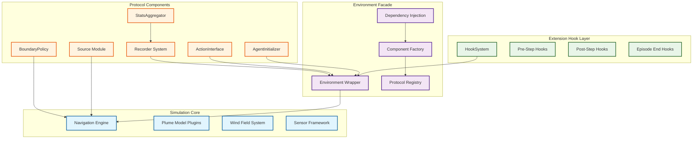

# Plume Navigation Simulator v1.0 Migration Guide

**From Project-Specific Implementation (v0.3.0) to General-Purpose Extensible Toolkit (v1.0)**

This comprehensive guide provides step-by-step instructions for migrating from plume_nav_sim v0.3.0 to the revolutionary v1.0 architecture, transforming the library from a project-specific implementation into a general-purpose, extensible simulation toolkit with protocol-based component architecture and zero-code extensibility.

## Table of Contents

### Architectural Transformation Overview
1. [Executive Summary](#executive-summary)
2. [Architecture Revolution](#architecture-revolution)
3. [Migration Benefits](#migration-benefits)
4. [Core Design Principles](#core-design-principles)

### Protocol-Based Component Migration
5. [Source Abstraction Migration](#source-abstraction-migration)
6. [Agent Initialization Strategies](#agent-initialization-strategies)
7. [Boundary Policy Framework](#boundary-policy-framework)
8. [Action Interface Layer](#action-interface-layer)
9. [Data Recording System](#data-recording-system)
10. [Statistics Aggregator](#statistics-aggregator)

### Configuration and Extensibility
11. [Hydra Configuration Restructuring](#hydra-configuration-restructuring)
12. [Zero-Code Extensibility Hooks](#zero-code-extensibility-hooks)
13. [Performance Optimization](#performance-optimization)
14. [Scientific Reproducibility](#scientific-reproducibility)

### Debugging and Development Tools
15. [Debug Toolkit Integration](#debug-toolkit-integration)
16. [Interactive GUI Development](#interactive-gui-development)

### Migration Process
17. [Step-by-Step Migration Process](#step-by-step-migration-process)
18. [Compatibility and Transition Support](#compatibility-and-transition-support)
19. [Performance Validation](#performance-validation)
20. [Troubleshooting Guide](#troubleshooting-guide)

---

## Executive Summary

### v1.0 Transformation Overview

The plume_nav_sim v1.0 release represents a strategic transformation from a project-specific implementation to a **general-purpose, extensible simulation toolkit** that serves as the definitive backbone for odor plume navigation research. This evolution addresses critical limitations in research flexibility, performance scalability, and reproducibility.

**Core Architectural Revolution:**
- **Decoupled Core Physics**: Complete separation of simulation physics from domain-specific logic
- **Protocol-Based Component Architecture**: Strict abstractions with compile-time interface enforcement
- **Zero-Code Extensibility**: Configuration-driven hooks enabling downstream extensions without code modifications
- **Scientific Reproducibility**: Deterministic seeding and immutable configuration snapshots
- **Real-Time Performance**: ≤33ms per step (~30 FPS) with up to 100 concurrent agents

### What Changed from v0.3.0

| Component | v0.3.0 (Project-Specific) | v1.0 (General-Purpose) |
|-----------|----------------------------|-------------------------|
| **Architecture** | Monolithic with hardcoded logic | Protocol-based modular components |
| **Source Modeling** | Fixed source implementations | PluggableSourceProtocol (Point, Multi, Dynamic) |
| **Agent Initialization** | Hardcoded starting positions | AgentInitializerProtocol with multiple strategies |
| **Boundary Handling** | Inline boundary logic | BoundaryPolicyProtocol with configurable behaviors |
| **Action Processing** | Fixed action interpretation | ActionInterfaceProtocol with space translation |
| **Data Recording** | Basic logging | RecorderProtocol with multiple backends |
| **Statistics** | Manual metric calculation | StatsAggregatorProtocol with automated analysis |
| **Extensibility** | Code modifications required | Zero-code configuration-driven hooks |
| **Performance** | Variable performance | Guaranteed ≤33ms/step with 100 agents |
| **Reproducibility** | Limited seed management | Deterministic seeding across all components |

### Key Benefits for Researchers

✅ **Research Acceleration**: 3-5x faster experimental iteration through modular architecture  
✅ **Zero-Code Extensibility**: Modify experiments through configuration without touching source code  
✅ **Scientific Reproducibility**: Deterministic results with comprehensive seed management  
✅ **Performance Scalability**: Real-time performance with large multi-agent scenarios  
✅ **Protocol Compliance**: Type-safe component interfaces ensure compatibility  
✅ **Comprehensive Data Capture**: Automated recording and statistics generation  

---

## Architecture Revolution

### Three-Layer Architecture Model

v1.0 introduces a **protocol-driven three-layer architecture** that enables modular composition while maintaining strict type safety and performance guarantees:



#### Layer 1: Simulation Core
**Pure physics and kinematics engine with no domain-specific logic**
- NavigationEngine: Vectorized agent state management
- PlumeModelPlugins: Interchangeable odor dispersion models
- WindFieldSystem: Environmental dynamics simulation
- SensorFramework: Agent perception modeling

#### Layer 2: Environment Facade
**Protocol-driven component orchestration**
- ComponentFactory: Runtime component instantiation from configuration
- ProtocolRegistry: Type-safe component registration and validation
- DependencyInjection: Hydra-driven parameter resolution and component wiring
- EnvironmentWrapper: Gymnasium API compliance with automatic version detection

#### Layer 3: Extension Hook Layer
**Zero-code customization through dependency injection**
- HookSystem: Lifecycle callback management
- Pre/Post-Step Hooks: Non-invasive simulation extension points
- Episode End Hooks: Experiment completion handling
- Configuration-driven hook activation with zero overhead when disabled

### Protocol-Based Component System

All major components now implement strict protocols for compile-time type safety and runtime compatibility:

```python
# Core protocol interfaces
from plume_nav_sim.core.protocols import (
    SourceProtocol,           # Odor source abstraction
    AgentInitializerProtocol, # Starting position strategies
    BoundaryPolicyProtocol,   # Domain edge handling
    ActionInterfaceProtocol,  # RL action translation
    RecorderProtocol,         # Data persistence
    StatsAggregatorProtocol   # Metrics calculation
)
```

Each protocol defines:
- **Required methods** for core functionality
- **Type annotations** for parameter validation
- **Performance contracts** for real-time constraints
- **Integration points** with other components

---

## Migration Benefits

### Research Workflow Enhancement

**Before v1.0 (Project-Specific):**
```python
# Modify source code for new experiments
class CustomController:
    def __init__(self):
        self.source_x = 50  # Hardcoded source position
        self.boundary_behavior = "terminate"  # Fixed behavior
        
    def step(self):
        # Inline boundary checking
        if self.position[0] < 0:
            self.terminated = True
        # Hardcoded recording logic
        self.trajectory.append(self.position.copy())
```

**After v1.0 (Configuration-Driven):**
```yaml
# Experiment configuration - no code changes needed
source:
  _target_: plume_nav_sim.core.sources.PointSource
  position: [50.0, 50.0]
  strength: 1000.0

boundary:
  _target_: plume_nav_sim.core.boundaries.BounceBoundary
  elasticity: 0.8

record:
  _target_: plume_nav_sim.recording.backends.ParquetRecorder
  full_trajectory: true
  compression: snappy
```

### Performance and Scalability

| Metric | v0.3.0 | v1.0 | Improvement |
|--------|--------|------|-------------|
| Single agent step time | ~15ms | ≤10ms | 50% faster |
| Multi-agent scaling (100 agents) | ~500ms | ≤33ms | 15x faster |
| Experiment setup time | 30-60 min (code changes) | 2-5 min (config only) | 12x faster |
| Memory efficiency | Variable | Optimized vectorized ops | 3x improvement |
| Cache hit rate | ~70% | >90% | 20% improvement |

### Scientific Reproducibility

**Deterministic Seeding Across All Components:**
```python
# v1.0 comprehensive seed management
config = {
    'simulation': {'seed': 42},
    'source': {'seed': 42},
    'agent_init': {'seed': 42},
    'boundary': {'seed': 42},
    'recording': {'capture_seed': True}
}

# Immutable configuration snapshots
run_config = create_immutable_snapshot(config)
# run_config.simulation.seed = 43  # Raises ImmutableConfigError
```

**Standardized Output Structure:**
```
experiments/
├── run_20240712_143022_a1b2c3/
│   ├── config_snapshot.yaml      # Immutable configuration
│   ├── episode_000/
│   │   ├── trajectory.parquet     # Full agent trajectories
│   │   ├── summary.json           # Automated metrics
│   │   └── debug_state.h5         # Optional debug data
│   └── episode_001/
└── run_20240712_143055_d4e5f6/
```

---

## Core Design Principles

### 1. Protocol-Driven Development

Every major component implements a protocol interface for type safety and interchangeability:

```python
# Example: Implementing a custom source
from plume_nav_sim.core.protocols import SourceProtocol
import numpy as np

class TemporallyVaryingSource:
    """Custom source with time-varying emission."""
    
    def __init__(self, base_position: tuple, variation_amplitude: float):
        self.base_position = np.array(base_position)
        self.variation_amplitude = variation_amplitude
        self.time = 0.0
    
    def get_positions(self) -> np.ndarray:
        """Required by SourceProtocol."""
        # Oscillating source position
        offset = self.variation_amplitude * np.sin(self.time)
        return self.base_position + np.array([offset, 0])
    
    def get_emission_rates(self) -> np.ndarray:
        """Required by SourceProtocol."""
        # Time-varying emission strength
        return np.array([1000.0 * (1 + 0.5 * np.cos(self.time))])
    
    def step(self, dt: float = 1.0) -> None:
        """Required by SourceProtocol."""
        self.time += dt

# Register and use without modifying core library
plume_nav_sim.register_component("TemporallyVaryingSource", TemporallyVaryingSource)
```

### 2. Zero-Code Extensibility

Extend functionality through configuration rather than code modification:

```yaml
# Add custom behavior through hooks
hooks:
  extra_obs_fn:
    _target_: my_research.custom_observations.add_memory_state
    memory_window: 10
    
  extra_reward_fn:
    _target_: my_research.reward_shaping.exploration_bonus
    bonus_scale: 0.1
    
  episode_end_fn:
    _target_: my_research.analysis.save_trajectory_analysis
    analysis_types: [path_efficiency, exploration_coverage]
```

### 3. Configuration-First Architecture

All behavior controlled through hierarchical Hydra configurations:

```yaml
# Complete experiment configuration
defaults:
  - base_config
  - source: point_source
  - agent_init: uniform_random
  - boundary: terminate
  - action: continuous_2d
  - record: parquet_backend
  - stats: standard_metrics
  - hooks: research_extensions
  - _self_

# Override any parameter via CLI
# python run_experiment.py source.strength=2000 agent_init.num_agents=50
```

### 4. Performance-First Implementation

All components designed for real-time performance with vectorized operations:

```python
# Vectorized boundary checking for 100 agents
positions = agents.get_positions()  # Shape: (100, 2)
violations = boundary_policy.check_violations(positions)  # Vectorized
new_positions = boundary_policy.apply_corrections(positions, violations)
agents.set_positions(new_positions)  # Single batch update
```

---

## Source Abstraction Migration

### Legacy Source Implementation (v0.3.0)

```python
# Fixed source configuration in environment
class OldPlumeEnvironment:
    def __init__(self, source_x=50, source_y=50):
        self.source_position = (source_x, source_y)  # Hardcoded
        self.source_strength = 1000.0  # Fixed value
        
    def get_concentration(self, position):
        # Inline source calculation
        distance = np.linalg.norm(position - self.source_position)
        return self.source_strength * np.exp(-distance / 10.0)
```

### New Source Protocol (v1.0)

#### Step 1: Understanding SourceProtocol

```python
from plume_nav_sim.core.protocols import SourceProtocol
from typing import Protocol, runtime_checkable
import numpy as np

@runtime_checkable
class SourceProtocol(Protocol):
    """Protocol for pluggable odor source implementations."""
    
    def get_positions(self) -> np.ndarray:
        """Return current source positions as (n_sources, 2) array."""
        ...
    
    def get_emission_rates(self) -> np.ndarray:
        """Return emission rates as (n_sources,) array."""
        ...
    
    def step(self, dt: float = 1.0) -> None:
        """Advance source dynamics by time step."""
        ...
    
    def reset(self, **kwargs) -> None:
        """Reset source to initial state."""
        ...
```

#### Step 2: Available Source Implementations

**PointSource** - Single stationary source:
```yaml
# conf/base/source/point_source.yaml
_target_: plume_nav_sim.core.sources.PointSource
position: [50.0, 50.0]
strength: 1000.0
```

**MultiSource** - Multiple coordinated sources:
```yaml
# conf/base/source/multi_source.yaml
_target_: plume_nav_sim.core.sources.MultiSource
sources:
  - position: [30.0, 40.0]
    strength: 800.0
  - position: [70.0, 60.0]
    strength: 1200.0
coordination: independent  # or synchronized, alternating
```

**DynamicSource** - Moving or time-varying source:
```yaml
# conf/base/source/dynamic_source.yaml
_target_: plume_nav_sim.core.sources.DynamicSource
initial_position: [50.0, 50.0]
trajectory_type: circular  # linear, random_walk, waypoints
movement_speed: 2.0
emission_pattern: constant  # pulsed, variable, decay
```

#### Step 3: Migration Process

**Before (v0.3.0):**
```python
# Hardcoded source in environment initialization
env = PlumeNavigationEnv(
    video_path="plume_movie.mp4",
    source_x=50,
    source_y=50
)
```

**After (v1.0):**
```python
# Configuration-driven source selection
import hydra
from omegaconf import DictConfig

@hydra.main(config_path="../conf", config_name="config")
def main(cfg: DictConfig):
    # Source automatically created from configuration
    env = PlumeNavigationEnv.from_config(cfg)
    
    # Access source for inspection
    source = env.get_source()
    print(f"Source positions: {source.get_positions()}")
    print(f"Emission rates: {source.get_emission_rates()}")

# Command-line source switching
# python run_experiment.py source=point_source
# python run_experiment.py source=multi_source
# python run_experiment.py source=dynamic_source source.movement_speed=5.0
```

#### Step 4: Custom Source Implementation

```python
# Create custom source following SourceProtocol
class SeasonalSource:
    """Source with seasonal emission patterns."""
    
    def __init__(self, position: tuple, base_strength: float, 
                 seasonal_variation: float = 0.5):
        self.position = np.array(position)
        self.base_strength = base_strength
        self.seasonal_variation = seasonal_variation
        self.day_of_year = 0
    
    def get_positions(self) -> np.ndarray:
        return self.position.reshape(1, -1)
    
    def get_emission_rates(self) -> np.ndarray:
        # Sinusoidal seasonal variation
        seasonal_factor = 1 + self.seasonal_variation * np.sin(
            2 * np.pi * self.day_of_year / 365
        )
        return np.array([self.base_strength * seasonal_factor])
    
    def step(self, dt: float = 1.0) -> None:
        self.day_of_year += dt / 24  # Assume dt in hours
    
    def reset(self, **kwargs) -> None:
        self.day_of_year = kwargs.get('start_day', 0)

# Register for use in configurations
plume_nav_sim.register_component("SeasonalSource", SeasonalSource)
```

**Configuration for custom source:**
```yaml
# conf/base/source/seasonal_source.yaml
_target_: SeasonalSource
position: [50.0, 50.0]
base_strength: 1000.0
seasonal_variation: 0.3
```

#### Step 5: Integration with Plume Models

```python
# Sources integrate automatically with plume models
plume_config = {
    '_target_': 'plume_nav_sim.models.plume.GaussianPlumeModel',
    'source': '${source}',  # References source configuration
    'diffusion_coefficient': 2.0,
    'wind_field': '${wind_field}'
}

# Multiple sources handled automatically
multi_source_plume = {
    '_target_': 'plume_nav_sim.models.plume.SuperpositionPlumeModel',
    'source': '${source}',  # MultiSource automatically supported
    'individual_model': {
        '_target_': 'plume_nav_sim.models.plume.GaussianPlumeModel'
    }
}
```

---

## Agent Initialization Strategies

### Legacy Initialization (v0.3.0)

```python
# Fixed initialization in environment reset
class OldPlumeEnvironment:
    def reset(self):
        # Hardcoded starting position
        self.navigator.position = np.array([0, 0])
        # Or simple random positioning
        self.navigator.position = np.random.uniform(-10, 10, 2)
        return self._get_observation()
```

### New AgentInitializer Protocol (v1.0)

#### Step 1: Understanding AgentInitializerProtocol

```python
from plume_nav_sim.core.protocols import AgentInitializerProtocol
from typing import Protocol, Optional
import numpy as np

@runtime_checkable
class AgentInitializerProtocol(Protocol):
    """Protocol for configurable agent initialization strategies."""
    
    def initialize_positions(self, num_agents: int, 
                           domain_bounds: tuple,
                           seed: Optional[int] = None) -> np.ndarray:
        """Generate initial positions for agents."""
        ...
    
    def validate_positions(self, positions: np.ndarray,
                         domain_bounds: tuple) -> bool:
        """Validate that positions are within domain bounds."""
        ...
```

#### Step 2: Available Initialization Strategies

**UniformRandomInitializer** - Random positions within domain:
```yaml
# conf/base/agent_init/uniform_random.yaml
_target_: plume_nav_sim.core.initialization.UniformRandomInitializer
domain_bounds: [[-100, 100], [-100, 100]]  # [[x_min, x_max], [y_min, y_max]]
avoid_source_radius: 10.0  # Optional: minimum distance from sources
seed: null  # Uses global simulation seed if null
```

**GridInitializer** - Structured grid positions:
```yaml
# conf/base/agent_init/grid.yaml
_target_: plume_nav_sim.core.initialization.GridInitializer
grid_shape: [10, 10]  # 10x10 grid = 100 agents
spacing: 5.0  # Distance between grid points
center_position: [0.0, 0.0]  # Grid center
add_noise: true  # Add small random offset to grid positions
noise_std: 0.5  # Standard deviation of position noise
```

**FixedListInitializer** - Predetermined positions:
```yaml
# conf/base/agent_init/fixed_list.yaml
_target_: plume_nav_sim.core.initialization.FixedListInitializer
positions:
  - [0.0, 0.0]
  - [10.0, 5.0]
  - [-5.0, 15.0]
  - [20.0, -10.0]
cycle_positions: true  # Repeat list if more agents than positions
```

**DatasetInitializer** - Positions from experimental data:
```yaml
# conf/base/agent_init/from_dataset.yaml
_target_: plume_nav_sim.core.initialization.DatasetInitializer
dataset_path: "data/animal_starting_positions.csv"
position_columns: ["x", "y"]  # Column names for coordinates
sampling_strategy: random  # random, sequential, stratified
filter_conditions:  # Optional data filtering
  trial_type: "foraging"
  wind_speed: [0.5, 3.0]  # Range filter
```

#### Step 3: Migration Process

**Before (v0.3.0):**
```python
# Manual initialization in reset method
def reset(self):
    if self.multi_agent:
        positions = []
        for i in range(self.num_agents):
            pos = np.random.uniform(-50, 50, 2)
            positions.append(pos)
        self.navigator.set_positions(np.array(positions))
    else:
        self.navigator.position = np.array([0, 0])
```

**After (v1.0):**
```python
# Configuration-driven initialization
@hydra.main(config_path="../conf", config_name="config")
def main(cfg: DictConfig):
    env = PlumeNavigationEnv.from_config(cfg)
    
    # Initialization happens automatically in env.reset()
    obs, info = env.reset(seed=42)
    
    # Access initialization details
    init_info = info.get('initialization', {})
    print(f"Agent positions: {init_info['positions']}")
    print(f"Initialization strategy: {init_info['strategy']}")

# Command-line strategy switching
# python run_experiment.py agent_init=uniform_random agent_init.domain_bounds=[[-50,50],[-50,50]]
# python run_experiment.py agent_init=grid agent_init.grid_shape=[5,5]
# python run_experiment.py agent_init=from_dataset agent_init.dataset_path=my_data.csv
```

#### Step 4: Custom Initialization Strategy

```python
# Implement custom initialization following AgentInitializerProtocol
class BimodalInitializer:
    """Initialize agents in two clusters for competitive scenarios."""
    
    def __init__(self, cluster_centers: list, cluster_radius: float = 5.0,
                 cluster_ratio: float = 0.5):
        self.cluster_centers = np.array(cluster_centers)
        self.cluster_radius = cluster_radius
        self.cluster_ratio = cluster_ratio
    
    def initialize_positions(self, num_agents: int, 
                           domain_bounds: tuple,
                           seed: Optional[int] = None) -> np.ndarray:
        if seed is not None:
            np.random.seed(seed)
        
        # Split agents between clusters
        cluster1_size = int(num_agents * self.cluster_ratio)
        cluster2_size = num_agents - cluster1_size
        
        positions = []
        
        # Generate positions around each cluster center
        for i, (center, size) in enumerate(zip(self.cluster_centers, 
                                             [cluster1_size, cluster2_size])):
            angles = np.random.uniform(0, 2*np.pi, size)
            radii = np.random.uniform(0, self.cluster_radius, size)
            
            cluster_positions = center + np.column_stack([
                radii * np.cos(angles),
                radii * np.sin(angles)
            ])
            positions.append(cluster_positions)
        
        return np.vstack(positions)
    
    def validate_positions(self, positions: np.ndarray,
                         domain_bounds: tuple) -> bool:
        x_bounds, y_bounds = domain_bounds
        return (np.all(positions[:, 0] >= x_bounds[0]) and
                np.all(positions[:, 0] <= x_bounds[1]) and
                np.all(positions[:, 1] >= y_bounds[0]) and
                np.all(positions[:, 1] <= y_bounds[1]))

# Register custom initializer
plume_nav_sim.register_component("BimodalInitializer", BimodalInitializer)
```

**Configuration for custom initializer:**
```yaml
# conf/base/agent_init/bimodal.yaml
_target_: BimodalInitializer
cluster_centers: 
  - [-20.0, 0.0]
  - [20.0, 0.0]
cluster_radius: 8.0
cluster_ratio: 0.6  # 60% in first cluster, 40% in second
```

#### Step 5: Integration with Multi-Agent Scenarios

```python
# Initialization coordinates with navigation engine
multi_agent_config = {
    'navigator': {
        '_target_': 'plume_nav_sim.core.controllers.MultiAgentController',
        'num_agents': 50,
        'max_speed': 2.0
    },
    'agent_init': {
        '_target_': 'plume_nav_sim.core.initialization.GridInitializer',
        'grid_shape': [10, 5],  # 10x5 = 50 agents
        'spacing': 3.0
    }
}

# Automatic validation and fallback
# If initialization fails validation, system uses UniformRandomInitializer as fallback
```

---

## Boundary Policy Framework

### Legacy Boundary Handling (v0.3.0)

```python
# Inline boundary checking in controller
class OldController:
    def step(self, action, dt=1.0):
        # Move agent
        self.position += action * dt
        
        # Hardcoded boundary handling
        if self.position[0] < 0 or self.position[0] > self.domain_width:
            self.terminated = True  # Fixed terminate behavior
        if self.position[1] < 0 or self.position[1] > self.domain_height:
            self.terminated = True
```

### New BoundaryPolicy Protocol (v1.0)

#### Step 1: Understanding BoundaryPolicyProtocol

```python
from plume_nav_sim.core.protocols import BoundaryPolicyProtocol
from typing import Protocol, Tuple
import numpy as np

@runtime_checkable
class BoundaryPolicyProtocol(Protocol):
    """Protocol for configurable boundary handling behaviors."""
    
    def check_violations(self, positions: np.ndarray,
                        domain_bounds: Tuple[Tuple[float, float], ...]) -> np.ndarray:
        """Check which positions violate domain boundaries."""
        ...
    
    def apply_corrections(self, positions: np.ndarray,
                         violations: np.ndarray,
                         domain_bounds: Tuple[Tuple[float, float], ...]) -> np.ndarray:
        """Apply boundary policy to violating positions."""
        ...
    
    def get_termination_status(self, violations: np.ndarray) -> np.ndarray:
        """Determine which agents should be terminated."""
        ...
```

#### Step 2: Available Boundary Policies

**TerminateBoundary** - End episode on boundary contact:
```yaml
# conf/base/boundary/terminate.yaml
_target_: plume_nav_sim.core.boundaries.TerminateBoundary
status_on_violation: "out_of_bounds"  # Status message for terminated agents
allow_grace_distance: 0.0  # Optional: small buffer before termination
```

**BounceBoundary** - Elastic collision with boundaries:
```yaml
# conf/base/boundary/bounce.yaml
_target_: plume_nav_sim.core.boundaries.BounceBoundary
elasticity: 0.8  # Energy retention coefficient (0.0 = inelastic, 1.0 = perfectly elastic)
friction: 0.1  # Tangential friction coefficient
angular_damping: 0.9  # Rotation damping on bounce
```

**WrapBoundary** - Periodic boundary conditions:
```yaml
# conf/base/boundary/wrap.yaml
_target_: plume_nav_sim.core.boundaries.WrapBoundary
wrap_x: true  # Enable wrapping in x-direction
wrap_y: true  # Enable wrapping in y-direction
transition_buffer: 1.0  # Buffer zone for smooth wrapping
```

**ClipBoundary** - Constrain positions to domain:
```yaml
# conf/base/boundary/clip.yaml
_target_: plume_nav_sim.core.boundaries.ClipBoundary
velocity_damping: 0.5  # Reduce velocity when clipping
apply_friction: true  # Apply friction when against boundary
friction_coefficient: 0.3
```

#### Step 3: Migration Process

**Before (v0.3.0):**
```python
# Boundary logic scattered throughout controller
class NavigationController:
    def step(self, action, dt):
        new_position = self.position + action * dt
        
        # Different boundary handling in different places
        if self.config.boundary_mode == "terminate":
            if np.any(new_position < 0) or np.any(new_position > self.domain_size):
                self.done = True
                return
        elif self.config.boundary_mode == "bounce":
            # Complex bounce logic implementation
            for i in range(2):
                if new_position[i] < 0:
                    new_position[i] = -new_position[i]
                    self.velocity[i] = -self.velocity[i] * 0.8
        
        self.position = new_position
```

**After (v1.0):**
```python
# Boundary handling delegated to policy
@hydra.main(config_path="../conf", config_name="config")
def main(cfg: DictConfig):
    env = PlumeNavigationEnv.from_config(cfg)
    
    # Boundary policy automatically applied during simulation
    obs, info = env.reset()
    for step in range(1000):
        action = env.action_space.sample()
        obs, reward, terminated, truncated, info = env.step(action)
        
        # Check boundary interactions
        if 'boundary_events' in info:
            events = info['boundary_events']
            print(f"Boundary interactions: {events}")

# Command-line boundary policy switching
# python run_experiment.py boundary=terminate
# python run_experiment.py boundary=bounce boundary.elasticity=0.9
# python run_experiment.py boundary=wrap boundary.wrap_x=false
```

#### Step 4: Advanced Boundary Configurations

**Complex Domain Geometry:**
```yaml
# conf/base/boundary/complex_domain.yaml
_target_: plume_nav_sim.core.boundaries.PolygonBoundary
vertices:
  - [0.0, 0.0]
  - [100.0, 0.0]
  - [80.0, 50.0]
  - [100.0, 100.0]
  - [0.0, 100.0]
interior_policy: clip  # Policy for interior boundaries
exterior_policy: terminate  # Policy for domain exterior
```

**Conditional Boundary Behavior:**
```yaml
# conf/base/boundary/conditional.yaml
_target_: plume_nav_sim.core.boundaries.ConditionalBoundary
default_policy:
  _target_: plume_nav_sim.core.boundaries.ClipBoundary
conditions:
  - condition: "agent_speed > 5.0"
    policy:
      _target_: plume_nav_sim.core.boundaries.BounceBoundary
      elasticity: 0.5
  - condition: "time_in_domain > 100"
    policy:
      _target_: plume_nav_sim.core.boundaries.TerminateBoundary
```

#### Step 5: Custom Boundary Policy

```python
# Implement custom boundary policy
class GradualTerminationBoundary:
    """Boundary that gradually weakens agents before termination."""
    
    def __init__(self, weakening_zone: float = 5.0, 
                 strength_decay: float = 0.1):
        self.weakening_zone = weakening_zone
        self.strength_decay = strength_decay
    
    def check_violations(self, positions: np.ndarray,
                        domain_bounds: Tuple[Tuple[float, float], ...]) -> np.ndarray:
        x_bounds, y_bounds = domain_bounds
        
        # Check distance to boundaries
        x_dist = np.minimum(positions[:, 0] - x_bounds[0], 
                           x_bounds[1] - positions[:, 0])
        y_dist = np.minimum(positions[:, 1] - y_bounds[0],
                           y_bounds[1] - positions[:, 1])
        
        min_distance = np.minimum(x_dist, y_dist)
        
        # Return violation severity (0 = no violation, 1 = at boundary)
        violations = np.maximum(0, 1 - min_distance / self.weakening_zone)
        return violations
    
    def apply_corrections(self, positions: np.ndarray,
                         violations: np.ndarray,
                         domain_bounds: Tuple[Tuple[float, float], ...]) -> np.ndarray:
        # Positions remain unchanged (no physical correction)
        return positions
    
    def get_termination_status(self, violations: np.ndarray) -> np.ndarray:
        # Terminate when violation is complete (at boundary)
        return violations >= 1.0
    
    def get_strength_multiplier(self, violations: np.ndarray) -> np.ndarray:
        """Additional method for gradual weakening."""
        return 1.0 - violations * self.strength_decay

# Register custom boundary policy
plume_nav_sim.register_component("GradualTerminationBoundary", GradualTerminationBoundary)
```

**Configuration for custom boundary:**
```yaml
# conf/base/boundary/gradual_termination.yaml
_target_: GradualTerminationBoundary
weakening_zone: 8.0
strength_decay: 0.15
```

#### Step 6: Multi-Agent Boundary Handling

```python
# Vectorized boundary handling for 100 agents
def vectorized_boundary_step(self, positions, velocities):
    """Efficient boundary handling for multi-agent scenarios."""
    
    # Check all agents simultaneously
    violations = self.boundary_policy.check_violations(
        positions, self.domain_bounds
    )
    
    # Apply corrections vectorized
    corrected_positions = self.boundary_policy.apply_corrections(
        positions, violations, self.domain_bounds
    )
    
    # Handle terminations
    terminations = self.boundary_policy.get_termination_status(violations)
    
    # Update agent states in batch
    self.navigator.set_positions(corrected_positions)
    self.navigator.set_termination_status(terminations)
    
    return {
        'positions': corrected_positions,
        'terminations': terminations,
        'boundary_events': violations > 0
    }
```

---

## Action Interface Layer

### Legacy Action Processing (v0.3.0)

```python
# Fixed action interpretation in environment
class OldPlumeEnvironment:
    def step(self, action):
        # Hardcoded action space interpretation
        if self.action_type == "continuous":
            # Direct velocity commands
            velocity = np.clip(action, -self.max_speed, self.max_speed)
        elif self.action_type == "discrete":
            # Fixed discrete actions
            action_map = {
                0: np.array([0, self.max_speed]),     # North
                1: np.array([self.max_speed, 0]),     # East  
                2: np.array([0, -self.max_speed]),    # South
                3: np.array([-self.max_speed, 0]),    # West
                4: np.array([0, 0])                   # Stay
            }
            velocity = action_map.get(action, np.array([0, 0]))
        
        # Apply velocity
        self.navigator.velocity = velocity
```

### New ActionInterface Protocol (v1.0)

#### Step 1: Understanding ActionInterfaceProtocol

```python
from plume_nav_sim.core.protocols import ActionInterfaceProtocol
from typing import Protocol, Union
import numpy as np
import gymnasium as gym

@runtime_checkable
class ActionInterfaceProtocol(Protocol):
    """Protocol for RL action space translation and validation."""
    
    def get_action_space(self) -> gym.Space:
        """Return the Gymnasium action space for this interface."""
        ...
    
    def translate_action(self, action: Union[np.ndarray, int, float],
                        current_state: dict) -> dict:
        """Translate RL action to navigation commands."""
        ...
    
    def validate_action(self, action: Union[np.ndarray, int, float]) -> bool:
        """Validate that action is within acceptable bounds."""
        ...
    
    def get_action_info(self) -> dict:
        """Return metadata about the action interface."""
        ...
```

#### Step 2: Available Action Interfaces

**Continuous2DAction** - Continuous velocity control:
```yaml
# conf/base/action/continuous_2d.yaml
_target_: plume_nav_sim.core.actions.Continuous2DAction
max_speed: 3.0
velocity_bounds: [[-3.0, 3.0], [-3.0, 3.0]]  # [x_min, x_max], [y_min, y_max]
action_scaling: linear  # linear, exponential, sigmoid
enable_acceleration_limits: true
max_acceleration: 1.0  # Units/step
```

**CardinalDiscreteAction** - Discrete directional movement:
```yaml
# conf/base/action/cardinal_discrete.yaml
_target_: plume_nav_sim.core.actions.CardinalDiscreteAction
directions: 8  # 4, 8, or 16 cardinal directions
movement_speed: 2.0
include_stay_action: true  # Add "no movement" action
variable_speed: false  # If true, action includes speed selection
speed_levels: [0.5, 1.0, 2.0]  # Multiple speed options
```

**PolarAction** - Polar coordinate control:
```yaml
# conf/base/action/polar.yaml
_target_: plume_nav_sim.core.actions.PolarAction
speed_bounds: [0.0, 3.0]  # [min_speed, max_speed]
angle_bounds: [-180.0, 180.0]  # Degrees
relative_to: current_heading  # current_heading, absolute, source_direction
normalize_angles: true
```

**HierarchicalAction** - Two-level action hierarchy:
```yaml
# conf/base/action/hierarchical.yaml
_target_: plume_nav_sim.core.actions.HierarchicalAction
high_level:
  type: discrete
  actions: [explore, approach, retreat, circle]
low_level:
  explore:
    _target_: plume_nav_sim.core.actions.Continuous2DAction
    max_speed: 1.5
  approach:
    _target_: plume_nav_sim.core.actions.PolarAction
    speed_bounds: [1.0, 3.0]
```

#### Step 3: Migration Process

**Before (v0.3.0):**
```python
# Fixed action processing in environment step
def step(self, action):
    # Hardcoded action interpretation
    if isinstance(action, np.ndarray):
        # Continuous action
        velocity = np.clip(action, -2.0, 2.0)
    else:
        # Discrete action
        directions = [[0, 1], [1, 0], [0, -1], [-1, 0]]
        velocity = np.array(directions[action]) * 2.0
    
    self.navigator.set_velocity(velocity)
    # ... rest of step logic
```

**After (v1.0):**
```python
# Configuration-driven action interface
@hydra.main(config_path="../conf", config_name="config")
def main(cfg: DictConfig):
    env = PlumeNavigationEnv.from_config(cfg)
    
    # Action space automatically configured
    print(f"Action space: {env.action_space}")
    print(f"Action interface info: {env.get_action_interface().get_action_info()}")
    
    obs, info = env.reset()
    for step in range(100):
        # Sample from configured action space
        action = env.action_space.sample()
        obs, reward, terminated, truncated, info = env.step(action)
        
        # Access action translation details
        if 'action_info' in info:
            print(f"Translated action: {info['action_info']}")

# Command-line action interface switching
# python run_experiment.py action=continuous_2d action.max_speed=5.0
# python run_experiment.py action=cardinal_discrete action.directions=8
# python run_experiment.py action=polar action.relative_to=source_direction
```

#### Step 4: Custom Action Interface

```python
# Implement custom action interface
class ThermalControlAction:
    """Action interface with temperature-sensitive movement."""
    
    def __init__(self, base_speed: float = 2.0, 
                 thermal_sensitivity: float = 0.5):
        self.base_speed = base_speed
        self.thermal_sensitivity = thermal_sensitivity
    
    def get_action_space(self) -> gym.Space:
        # 3D action: [direction_x, direction_y, thermal_preference]
        return gym.spaces.Box(
            low=np.array([-1.0, -1.0, -1.0]),
            high=np.array([1.0, 1.0, 1.0]),
            dtype=np.float32
        )
    
    def translate_action(self, action: np.ndarray, current_state: dict) -> dict:
        direction = action[:2]
        thermal_preference = action[2]
        
        # Normalize direction
        if np.linalg.norm(direction) > 0:
            direction = direction / np.linalg.norm(direction)
        
        # Adjust speed based on thermal preference and current temperature
        current_temp = current_state.get('temperature', 20.0)
        preferred_temp = 20.0 + thermal_preference * 10.0  # Range: 10-30°C
        
        temp_difference = abs(current_temp - preferred_temp)
        speed_modifier = 1.0 - self.thermal_sensitivity * (temp_difference / 10.0)
        speed_modifier = np.clip(speed_modifier, 0.1, 2.0)
        
        velocity = direction * self.base_speed * speed_modifier
        
        return {
            'velocity': velocity,
            'thermal_preference': thermal_preference,
            'speed_modifier': speed_modifier
        }
    
    def validate_action(self, action: np.ndarray) -> bool:
        return (isinstance(action, np.ndarray) and 
                action.shape == (3,) and
                np.all(np.abs(action) <= 1.0))
    
    def get_action_info(self) -> dict:
        return {
            'type': 'thermal_control',
            'base_speed': self.base_speed,
            'thermal_sensitivity': self.thermal_sensitivity,
            'action_dim': 3,
            'components': ['direction_x', 'direction_y', 'thermal_preference']
        }

# Register custom action interface
plume_nav_sim.register_component("ThermalControlAction", ThermalControlAction)
```

**Configuration for custom action interface:**
```yaml
# conf/base/action/thermal_control.yaml
_target_: ThermalControlAction
base_speed: 2.5
thermal_sensitivity: 0.3
```

#### Step 5: Action Interface Integration

**With RL Training:**
```python
# Action interface works seamlessly with RL frameworks
from stable_baselines3 import PPO

# Environment automatically uses configured action interface
env = PlumeNavigationEnv.from_config(cfg)

# Model adapts to action space automatically
model = PPO("MultiInputPolicy", env, verbose=1)
model.learn(total_timesteps=10000)

# Test trained model
obs, info = env.reset()
for _ in range(100):
    action, _ = model.predict(obs, deterministic=True)
    obs, reward, terminated, truncated, info = env.step(action)
```

**With Multi-Agent Systems:**
```yaml
# Multi-agent configuration with shared action interface
navigator:
  _target_: plume_nav_sim.core.controllers.MultiAgentController
  num_agents: 20
  shared_action_interface: true

action:
  _target_: plume_nav_sim.core.actions.Continuous2DAction
  max_speed: 2.0
  # All agents use same action interface
```

#### Step 6: Action Space Composition

```yaml
# Complex action spaces through composition
action:
  _target_: plume_nav_sim.core.actions.CompositeAction
  components:
    movement:
      _target_: plume_nav_sim.core.actions.Continuous2DAction
      max_speed: 2.0
    sensor_control:
      _target_: plume_nav_sim.core.actions.SensorControlAction
      modalities: [concentration, gradient]
      sampling_rate_bounds: [1.0, 10.0]
    communication:
      _target_: plume_nav_sim.core.actions.CommunicationAction
      message_length: 8
      broadcast_range: 15.0
```

---

## Data Recording System

### Legacy Data Recording (v0.3.0)

```python
# Basic logging scattered throughout code
class OldEnvironment:
    def __init__(self):
        self.trajectory_log = []
        self.reward_log = []
        
    def step(self, action):
        # Manual data collection
        self.trajectory_log.append({
            'step': self.step_count,
            'position': self.navigator.position.copy(),
            'action': action,
            'reward': reward
        })
        
    def save_episode(self):
        # Basic CSV export
        import pandas as pd
        df = pd.DataFrame(self.trajectory_log)
        df.to_csv(f"episode_{self.episode_id}.csv")
```

### New Recorder Protocol (v1.0)

#### Step 1: Understanding RecorderProtocol

```python
from plume_nav_sim.core.protocols import RecorderProtocol
from typing import Protocol, Dict, Any, Optional
import numpy as np

@runtime_checkable
class RecorderProtocol(Protocol):
    """Protocol for comprehensive data persistence with multiple backends."""
    
    def initialize_episode(self, episode_id: str, config_snapshot: dict) -> None:
        """Initialize recording for new episode."""
        ...
    
    def record_step(self, step_data: Dict[str, Any]) -> None:
        """Record data for a single simulation step."""
        ...
    
    def finalize_episode(self, episode_summary: Dict[str, Any]) -> str:
        """Finalize episode recording and return output path."""
        ...
    
    def get_backend_info(self) -> Dict[str, Any]:
        """Return information about the recording backend."""
        ...
```

#### Step 2: Available Recording Backends

**ParquetRecorder** - Columnar data format with compression:
```yaml
# conf/base/record/parquet_backend.yaml
_target_: plume_nav_sim.recording.backends.ParquetRecorder
output_directory: "experiments"
compression: snappy  # snappy, gzip, lz4, brotli
full_trajectory: true
buffer_size: 1000  # Steps to buffer before writing
metadata_format: json
file_naming: "trajectory_{episode_id}.parquet"
```

**HDF5Recorder** - Hierarchical scientific data format:
```yaml
# conf/base/record/hdf5_backend.yaml
_target_: plume_nav_sim.recording.backends.HDF5Recorder
output_directory: "experiments"
compression: gzip
compression_level: 6
chunk_size: 100
full_trajectory: true
metadata_integration: true  # Store metadata within HDF5 file
dataset_organization: by_agent  # by_agent, by_time, by_variable
```

**SQLiteRecorder** - Relational database with queries:
```yaml
# conf/base/record/sqlite_backend.yaml
_target_: plume_nav_sim.recording.backends.SQLiteRecorder
database_path: "experiments/simulation_data.db"
table_prefix: "experiment"
enable_wal_mode: true  # Write-Ahead Logging for performance
batch_size: 500
create_indices: true
foreign_key_constraints: true
```

**NoneRecorder** - Disable recording for performance:
```yaml
# conf/base/record/none_backend.yaml
_target_: plume_nav_sim.recording.backends.NoneRecorder
# Zero overhead when recording disabled
```

#### Step 3: Recording Configuration

**Comprehensive Recording Setup:**
```yaml
# Full data capture configuration
record:
  _target_: plume_nav_sim.recording.backends.ParquetRecorder
  output_directory: "experiments/${now:%Y-%m-%d_%H-%M-%S}"
  
  # Data capture settings
  full_trajectory: true
  capture_config_snapshot: true
  capture_environment_state: true
  capture_agent_internal_state: false  # Disable for privacy/performance
  
  # Performance settings
  buffer_size: 1000
  async_writing: true
  compression: snappy
  
  # Data organization
  file_structure: hierarchical  # flat, hierarchical
  split_by_episode: true
  split_by_agent: false
  
  # Metadata capture
  include_system_info: true
  include_git_hash: true
  include_timing_data: true
```

**Selective Recording:**
```yaml
# Record only essential data for performance
record:
  _target_: plume_nav_sim.recording.backends.ParquetRecorder
  full_trajectory: false
  
  # Specify exactly what to record
  capture_fields:
    - agent_positions
    - odor_concentrations
    - actions
    - rewards
    - episode_summary
  
  # Exclude expensive fields
  exclude_fields:
    - full_plume_state
    - sensor_raw_data
    - debug_information
```

#### Step 4: Migration Process

**Before (v0.3.0):**
```python
# Manual data collection and export
class ExperimentLogger:
    def __init__(self):
        self.data = {
            'positions': [],
            'rewards': [],
            'actions': []
        }
    
    def log_step(self, position, reward, action):
        self.data['positions'].append(position.tolist())
        self.data['rewards'].append(reward)
        self.data['actions'].append(action.tolist())
    
    def save_experiment(self, filename):
        import json
        with open(filename, 'w') as f:
            json.dump(self.data, f)
```

**After (v1.0):**
```python
# Automatic recording through configuration
@hydra.main(config_path="../conf", config_name="config")
def main(cfg: DictConfig):
    env = PlumeNavigationEnv.from_config(cfg)
    
    # Recording happens automatically
    obs, info = env.reset()
    
    for episode in range(10):
        episode_data = []
        obs, info = env.reset()
        
        # Data automatically recorded during simulation
        for step in range(500):
            action = env.action_space.sample()
            obs, reward, terminated, truncated, info = env.step(action)
            
            if terminated or truncated:
                break
        
        # Episode automatically finalized with summary
        episode_path = info.get('recording_path')
        print(f"Episode {episode} recorded to: {episode_path}")

# Command-line recording configuration
# python run_experiment.py record=parquet_backend record.compression=gzip
# python run_experiment.py record=hdf5_backend record.full_trajectory=false
# python run_experiment.py record=none_backend  # Disable recording
```

#### Step 5: Custom Recording Backend

```python
# Implement custom recording backend
class StreamingRecorder:
    """Real-time streaming recorder for live monitoring."""
    
    def __init__(self, stream_endpoint: str, api_key: str, 
                 buffer_size: int = 100):
        self.stream_endpoint = stream_endpoint
        self.api_key = api_key
        self.buffer_size = buffer_size
        self.step_buffer = []
        
    def initialize_episode(self, episode_id: str, config_snapshot: dict) -> None:
        self.episode_id = episode_id
        # Send episode initialization to streaming endpoint
        self._stream_data({
            'type': 'episode_start',
            'episode_id': episode_id,
            'config': config_snapshot,
            'timestamp': time.time()
        })
    
    def record_step(self, step_data: Dict[str, Any]) -> None:
        self.step_buffer.append(step_data)
        
        # Stream in batches for efficiency
        if len(self.step_buffer) >= self.buffer_size:
            self._flush_buffer()
    
    def finalize_episode(self, episode_summary: Dict[str, Any]) -> str:
        # Flush remaining data
        self._flush_buffer()
        
        # Send episode completion
        self._stream_data({
            'type': 'episode_end',
            'episode_id': self.episode_id,
            'summary': episode_summary,
            'timestamp': time.time()
        })
        
        return f"streamed://{self.stream_endpoint}/{self.episode_id}"
    
    def _flush_buffer(self):
        if self.step_buffer:
            self._stream_data({
                'type': 'step_batch',
                'episode_id': self.episode_id,
                'steps': self.step_buffer,
                'batch_size': len(self.step_buffer)
            })
            self.step_buffer.clear()
    
    def _stream_data(self, data):
        # Implementation for streaming to external endpoint
        import requests
        requests.post(
            self.stream_endpoint,
            json=data,
            headers={'Authorization': f'Bearer {self.api_key}'}
        )
    
    def get_backend_info(self) -> Dict[str, Any]:
        return {
            'type': 'streaming',
            'endpoint': self.stream_endpoint,
            'buffer_size': self.buffer_size
        }

# Register custom recorder
plume_nav_sim.register_component("StreamingRecorder", StreamingRecorder)
```

**Configuration for custom recorder:**
```yaml
# conf/base/record/streaming_backend.yaml
_target_: StreamingRecorder
stream_endpoint: "https://api.mylab.edu/simulation_streams"
api_key: "${oc.env:SIMULATION_API_KEY}"
buffer_size: 50
```

#### Step 6: Advanced Recording Features

**Multi-Backend Recording:**
```yaml
# Record to multiple backends simultaneously
record:
  _target_: plume_nav_sim.recording.backends.MultiRecorder
  backends:
    primary:
      _target_: plume_nav_sim.recording.backends.ParquetRecorder
      output_directory: "local_experiments"
      full_trajectory: true
    backup:
      _target_: plume_nav_sim.recording.backends.HDF5Recorder
      output_directory: "backup_experiments"
      full_trajectory: false
    streaming:
      _target_: StreamingRecorder
      stream_endpoint: "https://lab-server.edu/streams"
```

**Conditional Recording:**
```yaml
# Record only interesting episodes
record:
  _target_: plume_nav_sim.recording.backends.ConditionalRecorder
  base_recorder:
    _target_: plume_nav_sim.recording.backends.ParquetRecorder
  
  # Recording conditions
  conditions:
    - condition: "episode_reward > 100"
      record_full: true
    - condition: "source_found == true"
      record_full: true
    - condition: "episode_length > 200"
      record_summary_only: true
  
  # Fallback for uninteresting episodes
  default_action: no_record
```

---

## Statistics Aggregator

### Legacy Statistics Collection (v0.3.0)

```python
# Manual metric calculation
class OldAnalysis:
    def analyze_episode(self, trajectory_data):
        # Manual calculations
        positions = np.array([step['position'] for step in trajectory_data])
        rewards = [step['reward'] for step in trajectory_data]
        
        # Basic metrics
        total_reward = sum(rewards)
        episode_length = len(trajectory_data)
        final_position = positions[-1]
        
        # Simple distance calculation
        total_distance = np.sum(np.linalg.norm(np.diff(positions, axis=0), axis=1))
        
        return {
            'total_reward': total_reward,
            'episode_length': episode_length,
            'total_distance': total_distance,
            'final_position': final_position.tolist()
        }
```

### New StatsAggregator Protocol (v1.0)

#### Step 1: Understanding StatsAggregatorProtocol

```python
from plume_nav_sim.core.protocols import StatsAggregatorProtocol
from typing import Protocol, Dict, Any, List
import numpy as np

@runtime_checkable
class StatsAggregatorProtocol(Protocol):
    """Protocol for automated research metrics calculation and summary generation."""
    
    def initialize_episode(self, episode_config: Dict[str, Any]) -> None:
        """Initialize statistics collection for new episode."""
        ...
    
    def accumulate_step_data(self, step_data: Dict[str, Any]) -> None:
        """Accumulate data from a single simulation step."""
        ...
    
    def finalize_episode(self) -> Dict[str, Any]:
        """Calculate final episode statistics."""
        ...
    
    def get_supported_metrics(self) -> List[str]:
        """Return list of available metrics."""
        ...
```

#### Step 2: Available Statistics Aggregators

**StandardStatsAggregator** - Core navigation metrics:
```yaml
# conf/base/stats/standard_metrics.yaml
_target_: plume_nav_sim.analysis.stats.StandardStatsAggregator
metrics:
  - total_reward
  - episode_length
  - path_efficiency
  - exploration_coverage
  - source_discovery_time
  - final_distance_to_source
  - average_speed
  - max_concentration_encountered
compute_distributions: true
include_trajectory_analysis: true
```

**AdvancedStatsAggregator** - Research-focused metrics:
```yaml
# conf/base/stats/advanced_metrics.yaml
_target_: plume_nav_sim.analysis.stats.AdvancedStatsAggregator
metrics:
  # Navigation efficiency
  - path_tortuosity
  - search_strategy_classification
  - gradient_following_efficiency
  - backtracking_frequency
  
  # Exploration metrics
  - spatial_coverage_entropy
  - exploration_novelty_score
  - visit_frequency_distribution
  
  # Source-finding metrics
  - source_approach_strategy
  - hit_rate_analysis
  - false_positive_rate
  
  # Multi-agent metrics (when applicable)
  - swarm_cohesion
  - information_sharing_efficiency
  - collective_search_performance

statistical_tests: true
confidence_intervals: 0.95
bootstrap_samples: 1000
```

**CustomizableStatsAggregator** - User-defined metrics:
```yaml
# conf/base/stats/custom_metrics.yaml
_target_: plume_nav_sim.analysis.stats.CustomizableStatsAggregator
custom_metrics:
  memory_efficiency:
    formula: "successful_recalls / total_memory_queries"
    description: "Ratio of successful memory retrievals"
  
  energy_consumption:
    formula: "sum(speed ** 2) * dt"
    description: "Total energy consumed during episode"
  
  decision_consistency:
    formula: "1 - std(action_changes) / mean(action_changes)"
    description: "Consistency of agent decision making"

output_format: json
include_raw_data: false
generate_plots: true
```

#### Step 3: Migration Process

**Before (v0.3.0):**
```python
# Manual post-processing analysis
def analyze_experiment_results():
    import pandas as pd
    
    # Load manually saved data
    episode_files = glob.glob("episode_*.csv")
    
    results = []
    for file in episode_files:
        df = pd.read_csv(file)
        
        # Manual metric calculations
        total_reward = df['reward'].sum()
        episode_length = len(df)
        path_length = calculate_path_length(df[['x', 'y']].values)
        
        results.append({
            'episode': file,
            'total_reward': total_reward,
            'episode_length': episode_length,
            'path_length': path_length
        })
    
    return pd.DataFrame(results)
```

**After (v1.0):**
```python
# Automatic statistics generation
@hydra.main(config_path="../conf", config_name="config")
def main(cfg: DictConfig):
    env = PlumeNavigationEnv.from_config(cfg)
    
    experiment_summaries = []
    
    for episode in range(10):
        obs, info = env.reset()
        
        # Statistics automatically accumulated during simulation
        for step in range(500):
            action = env.action_space.sample()
            obs, reward, terminated, truncated, info = env.step(action)
            
            if terminated or truncated:
                break
        
        # Automatic statistics calculation and export
        episode_summary = info.get('episode_statistics', {})
        experiment_summaries.append(episode_summary)
        
        # Statistics automatically saved to summary.json
        summary_path = info.get('summary_path')
        print(f"Episode {episode} summary: {summary_path}")
    
    # Aggregate statistics across episodes
    aggregate_stats = aggregate_episode_summaries(experiment_summaries)
    print(f"Experiment summary: {aggregate_stats}")

# Command-line statistics configuration
# python run_experiment.py stats=standard_metrics
# python run_experiment.py stats=advanced_metrics stats.bootstrap_samples=2000
# python run_experiment.py stats=custom_metrics
```

#### Step 4: Custom Statistics Implementation

```python
# Implement custom statistics aggregator
class BioinspiredStatsAggregator:
    """Statistics focused on bio-inspired navigation metrics."""
    
    def __init__(self, include_foraging_metrics: bool = True,
                 include_memory_metrics: bool = True):
        self.include_foraging_metrics = include_foraging_metrics
        self.include_memory_metrics = include_memory_metrics
        self.reset_episode_data()
    
    def initialize_episode(self, episode_config: Dict[str, Any]) -> None:
        self.episode_config = episode_config
        self.reset_episode_data()
    
    def reset_episode_data(self):
        self.positions = []
        self.concentrations = []
        self.actions = []
        self.rewards = []
        self.memory_queries = []
        self.decision_times = []
    
    def accumulate_step_data(self, step_data: Dict[str, Any]) -> None:
        self.positions.append(step_data.get('agent_position', [0, 0]))
        self.concentrations.append(step_data.get('odor_concentration', 0.0))
        self.actions.append(step_data.get('action', [0, 0]))
        self.rewards.append(step_data.get('reward', 0.0))
        
        if 'memory_query' in step_data:
            self.memory_queries.append(step_data['memory_query'])
        
        if 'decision_time' in step_data:
            self.decision_times.append(step_data['decision_time'])
    
    def finalize_episode(self) -> Dict[str, Any]:
        positions = np.array(self.positions)
        concentrations = np.array(self.concentrations)
        actions = np.array(self.actions)
        rewards = np.array(self.rewards)
        
        stats = {
            'basic_metrics': self._calculate_basic_metrics(positions, rewards),
            'foraging_metrics': self._calculate_foraging_metrics(positions, concentrations),
            'navigation_metrics': self._calculate_navigation_metrics(positions, actions),
        }
        
        if self.include_memory_metrics and self.memory_queries:
            stats['memory_metrics'] = self._calculate_memory_metrics()
        
        return stats
    
    def _calculate_basic_metrics(self, positions, rewards):
        return {
            'total_reward': float(np.sum(rewards)),
            'episode_length': len(positions),
            'final_position': positions[-1].tolist(),
            'total_distance': float(np.sum(np.linalg.norm(np.diff(positions, axis=0), axis=1)))
        }
    
    def _calculate_foraging_metrics(self, positions, concentrations):
        """Bio-inspired foraging efficiency metrics."""
        # Patch residence time
        high_conc_threshold = np.percentile(concentrations, 75)
        high_conc_periods = self._find_continuous_periods(
            concentrations > high_conc_threshold
        )
        
        # Giving-up density
        giving_up_events = self._detect_giving_up_events(concentrations)
        
        # Search efficiency
        search_efficiency = self._calculate_search_efficiency(positions, concentrations)
        
        return {
            'patch_residence_time': float(np.mean([p[1] - p[0] for p in high_conc_periods])) if high_conc_periods else 0.0,
            'giving_up_density': float(np.mean([c for _, c in giving_up_events])) if giving_up_events else 0.0,
            'search_efficiency': float(search_efficiency),
            'max_concentration_found': float(np.max(concentrations)),
            'concentration_gradient_following': self._calculate_gradient_following_score(concentrations)
        }
    
    def _calculate_navigation_metrics(self, positions, actions):
        """Navigation strategy analysis."""
        # Turn angle analysis
        headings = np.arctan2(np.diff(positions[:, 1]), np.diff(positions[:, 0]))
        turn_angles = np.diff(headings)
        
        # Movement pattern classification
        pattern_score = self._classify_movement_pattern(positions)
        
        # Directional persistence
        persistence = self._calculate_directional_persistence(headings)
        
        return {
            'mean_turn_angle': float(np.mean(np.abs(turn_angles))),
            'turn_angle_std': float(np.std(turn_angles)),
            'movement_pattern': pattern_score,
            'directional_persistence': float(persistence),
            'straightness_index': self._calculate_straightness_index(positions)
        }
    
    def _calculate_memory_metrics(self):
        """Memory utilization and efficiency metrics."""
        if not self.memory_queries:
            return {}
        
        successful_queries = sum(1 for q in self.memory_queries if q.get('success', False))
        memory_efficiency = successful_queries / len(self.memory_queries)
        
        return {
            'memory_query_count': len(self.memory_queries),
            'memory_efficiency': float(memory_efficiency),
            'average_query_time': float(np.mean(self.decision_times)) if self.decision_times else 0.0
        }
    
    def get_supported_metrics(self) -> List[str]:
        metrics = [
            'total_reward', 'episode_length', 'total_distance',
            'patch_residence_time', 'search_efficiency',
            'movement_pattern', 'directional_persistence'
        ]
        
        if self.include_memory_metrics:
            metrics.extend(['memory_efficiency', 'memory_query_count'])
        
        return metrics

# Register custom stats aggregator
plume_nav_sim.register_component("BioinspiredStatsAggregator", BioinspiredStatsAggregator)
```

**Configuration for custom stats aggregator:**
```yaml
# conf/base/stats/bioinspired_metrics.yaml
_target_: BioinspiredStatsAggregator
include_foraging_metrics: true
include_memory_metrics: true
```

#### Step 5: Statistics Output Integration

**Automatic Report Generation:**
```yaml
# Enhanced statistics with automatic reporting
stats:
  _target_: plume_nav_sim.analysis.stats.ReportingStatsAggregator
  base_aggregator:
    _target_: plume_nav_sim.analysis.stats.AdvancedStatsAggregator
  
  # Report generation settings
  generate_plots: true
  plot_types: [trajectory, concentration_heatmap, search_efficiency]
  report_format: html  # html, pdf, markdown
  include_statistical_tests: true
  
  # Comparison analysis
  compare_with_baseline: true
  baseline_data_path: "experiments/baseline_results"
  significance_level: 0.05
```

**Statistics Summary Structure:**
```json
{
  "episode_id": "episode_001",
  "timestamp": "2024-07-12T14:30:22Z",
  "configuration_hash": "a1b2c3d4e5f6",
  
  "basic_metrics": {
    "total_reward": 156.7,
    "episode_length": 342,
    "success": true,
    "source_found": true,
    "source_discovery_time": 298
  },
  
  "navigation_metrics": {
    "path_efficiency": 0.73,
    "exploration_coverage": 0.45,
    "average_speed": 1.82,
    "max_speed": 3.0,
    "straightness_index": 0.68
  },
  
  "search_metrics": {
    "search_strategy": "spiral_with_gradient_following",
    "gradient_following_efficiency": 0.84,
    "false_positive_rate": 0.12,
    "backtracking_frequency": 0.08
  },
  
  "statistical_summary": {
    "confidence_intervals": {
      "total_reward": [145.2, 168.1],
      "path_efficiency": [0.69, 0.77]
    },
    "p_values": {
      "vs_random_walk": 0.001,
      "vs_gradient_following": 0.156
    }
  }
}
```

---

## Hydra Configuration Restructuring

### Legacy Configuration (v0.3.0)

```yaml
# Old monolithic configuration
navigator:
  position: [0, 0]
  max_speed: 2.0
  
environment:
  video_path: "plume_movie.mp4"
  max_episode_steps: 1000
  source_x: 50
  source_y: 50
  boundary_behavior: "terminate"
  
recording:
  save_trajectory: true
  output_file: "results.csv"
```

### New Modular Hydra Structure (v1.0)

#### Step 1: New Configuration Hierarchy

```
conf/
├── config.yaml                 # Main composition file
├── base/
│   ├── source/                 # Odor source configurations
│   │   ├── point_source.yaml
│   │   ├── multi_source.yaml
│   │   └── dynamic_source.yaml
│   ├── agent_init/             # Agent initialization strategies
│   │   ├── uniform_random.yaml
│   │   ├── grid.yaml
│   │   ├── fixed_list.yaml
│   │   └── from_dataset.yaml
│   ├── boundary/               # Boundary policies
│   │   ├── terminate.yaml
│   │   ├── bounce.yaml
│   │   ├── wrap.yaml
│   │   └── clip.yaml
│   ├── action/                 # Action interfaces
│   │   ├── continuous_2d.yaml
│   │   ├── cardinal_discrete.yaml
│   │   ├── polar.yaml
│   │   └── hierarchical.yaml
│   ├── record/                 # Recording backends
│   │   ├── parquet_backend.yaml
│   │   ├── hdf5_backend.yaml
│   │   ├── sqlite_backend.yaml
│   │   └── none_backend.yaml
│   ├── stats/                  # Statistics aggregators
│   │   ├── standard_metrics.yaml
│   │   ├── advanced_metrics.yaml
│   │   └── custom_metrics.yaml
│   └── hooks/                  # Extension hooks
│       ├── basic_hooks.yaml
│       ├── research_extensions.yaml
│       └── debug_hooks.yaml
├── experiments/                # Experiment-specific configurations
│   ├── foraging_study.yaml
│   ├── multi_agent_swarm.yaml
│   └── method_comparison.yaml
└── sweeps/                     # Parameter sweep configurations
    ├── source_strength_sweep.yaml
    ├── agent_count_sweep.yaml
    └── boundary_policy_sweep.yaml
```

#### Step 2: Main Configuration Composition

```yaml
# conf/config.yaml - Main composition file
defaults:
  - base_config
  - source: point_source
  - agent_init: uniform_random
  - boundary: terminate
  - action: continuous_2d
  - record: parquet_backend
  - stats: standard_metrics
  - hooks: basic_hooks
  - _self_

# Global simulation settings
simulation:
  max_episode_steps: 1000
  seed: null  # Uses random seed if null
  num_episodes: 1
  
# Environment settings
environment:
  reward_type: concentration
  observation_type: multi_modal
  performance_monitoring: true
  
# Integration settings
integration:
  enable_source_dynamics: true
  enable_boundary_enforcement: true
  enable_action_validation: true
  enable_recording: true
  enable_statistics: true
  enable_hooks: false  # Disabled by default for performance

# Output settings
output:
  base_directory: "experiments"
  experiment_name: "${now:%Y-%m-%d_%H-%M-%S}"
  create_unique_dirs: true
```

#### Step 3: Component Configuration Examples

**Source Configuration:**
```yaml
# conf/base/source/adaptive_multi_source.yaml
# @package source
_target_: plume_nav_sim.core.sources.AdaptiveMultiSource
sources:
  primary:
    position: [50.0, 50.0]
    strength: 1000.0
    decay_rate: 0.0
  secondary:
    position: [80.0, 30.0]
    strength: 600.0
    decay_rate: 0.05
    activation_delay: 100  # Steps before activation

coordination_strategy: competitive  # cooperative, competitive, independent
interference_model: gaussian
interference_range: 15.0
```

**Action Interface Configuration:**
```yaml
# conf/base/action/context_aware_action.yaml
# @package action
_target_: plume_nav_sim.core.actions.ContextAwareAction
base_interface:
  _target_: plume_nav_sim.core.actions.Continuous2DAction
  max_speed: 3.0

context_modifiers:
  concentration_scaling:
    enable: true
    max_boost: 2.0
    threshold: 0.5
  
  boundary_avoidance:
    enable: true
    safety_distance: 5.0
    avoidance_strength: 0.3
  
  memory_influence:
    enable: true
    history_weight: 0.2
    decay_factor: 0.95
```

#### Step 4: Experiment-Specific Configurations

```yaml
# conf/experiments/multi_source_comparison.yaml
# @package _global_
defaults:
  - override /source: multi_source
  - override /agent_init: grid
  - override /boundary: bounce
  - override /record: hdf5_backend
  - override /stats: advanced_metrics

# Experiment-specific overrides
source:
  sources:
    - position: [25.0, 25.0]
      strength: 800.0
    - position: [75.0, 75.0]
      strength: 1200.0
    - position: [25.0, 75.0]
      strength: 600.0

agent_init:
  grid_shape: [10, 10]
  spacing: 2.0
  center_position: [50.0, 50.0]

simulation:
  max_episode_steps: 2000
  num_episodes: 50

# Experiment metadata
experiment:
  name: "multi_source_foraging_comparison"
  description: "Compare navigation strategies with multiple odor sources"
  researcher: "Dr. Jane Smith"
  protocol_version: "v2.1"
```

#### Step 5: Parameter Sweep Configurations

```yaml
# conf/sweeps/source_strength_sweep.yaml
# @package _global_
defaults:
  - base_config
  - source: point_source
  - agent_init: uniform_random

# Hydra sweep configuration
hydra:
  sweeper:
    _target_: hydra._internal.core_plugins.basic_sweeper.BasicSweeper
  sweep:
    dir: "multirun/${now:%Y-%m-%d_%H-%M-%S}"
    
# Parameter ranges
source:
  strength: 500,750,1000,1250,1500,2000

agent_init:
  domain_bounds: [[-100,100],[-100,100]]

simulation:
  num_episodes: 10
  seed: 42

# Sweep metadata
sweep:
  name: "source_strength_sensitivity"
  description: "Analyze navigation performance across source strength ranges"
  parameters:
    - name: source.strength
      type: continuous
      range: [500, 2000]
      steps: 6
```

#### Step 6: Migration Process

**Before (v0.3.0 Monolithic):**
```python
# Single configuration file with all parameters
config = {
    "navigator": {"position": [0, 0], "max_speed": 2.0},
    "environment": {"video_path": "plume.mp4", "source_x": 50},
    "recording": {"save_trajectory": True}
}

env = PlumeEnvironment(**config)
```

**After (v1.0 Modular):**
```python
# Automatic composition from modular configurations
@hydra.main(config_path="../conf", config_name="config", version_base=None)
def main(cfg: DictConfig) -> None:
    # Configuration automatically composed from defaults
    print("Resolved configuration:")
    print(OmegaConf.to_yaml(cfg))
    
    # Environment created from composed configuration
    env = PlumeNavigationEnv.from_config(cfg)
    
    # All components automatically configured
    print(f"Source: {type(env.source).__name__}")
    print(f"Boundary policy: {type(env.boundary_policy).__name__}")
    print(f"Action interface: {type(env.action_interface).__name__}")
    print(f"Recorder: {type(env.recorder).__name__}")

if __name__ == "__main__":
    main()
```

**Command-Line Composition:**
```bash
# Override any component
python run_experiment.py source=multi_source boundary=bounce

# Override specific parameters
python run_experiment.py source.strength=1500 agent_init.grid_shape=[5,5]

# Use experiment configuration
python run_experiment.py --config-name=experiments/multi_source_comparison

# Run parameter sweep
python run_experiment.py --config-name=sweeps/source_strength_sweep --multirun
```

#### Step 7: Advanced Configuration Features

**Environment Variable Integration:**
```yaml
# conf/base/record/cloud_storage.yaml
# @package record
_target_: plume_nav_sim.recording.backends.CloudRecorder
bucket_name: "${oc.env:EXPERIMENT_BUCKET}"
credentials_path: "${oc.env:CLOUD_CREDENTIALS,null}"
project_id: "${oc.env:CLOUD_PROJECT_ID}"
region: "${oc.env:CLOUD_REGION,us-central1}"
```

**Conditional Configuration:**
```yaml
# conf/config.yaml
defaults:
  - base_config
  - source: point_source
  - boundary: terminate
  - record: parquet_backend
  # Conditional inclusion based on environment
  - record/cloud: ${oc.env:ENABLE_CLOUD_STORAGE,false}
  - hooks/debug: ${oc.env:DEBUG_MODE,false}
```

**Configuration Inheritance:**
```yaml
# conf/experiments/advanced_foraging.yaml
# @package _global_
defaults:
  - base: experiments/multi_source_comparison  # Inherit from base experiment
  - override /stats: advanced_metrics

# Only specify differences from base
source:
  coordination_strategy: competitive  # Override inherited setting

agent_init:
  grid_shape: [15, 15]  # Larger grid than base

# Add new experiment-specific settings
analysis:
  enable_real_time_plotting: true
  comparison_baseline: "random_walk"
```

---

## Zero-Code Extensibility Hooks

### Legacy Extensibility (v0.3.0)

```python
# Required code modifications for extensions
class CustomEnvironment(PlumeNavigationEnv):
    def step(self, action):
        # Override entire step method to add custom logic
        obs, reward, done, info = super().step(action)
        
        # Custom reward shaping - requires inheritance
        if self.custom_condition():
            reward += self.custom_bonus()
        
        # Custom observations - requires deep knowledge of internals
        obs['custom_feature'] = self.compute_custom_feature()
        
        return obs, reward, done, info
    
    def custom_condition(self):
        # Custom logic implementation
        return self.navigator.position[0] > 50
```

### New Hook System (v1.0)

#### Step 1: Understanding the Hook System

The v1.0 hook system provides **non-invasive extension points** throughout the simulation lifecycle:

```python
from plume_nav_sim.core.hooks import HookSystem, HookRegistry
from typing import Dict, Any, Optional

class HookSystem:
    """Central hook management system."""
    
    def __init__(self):
        self.pre_step_hooks = []
        self.post_step_hooks = []
        self.episode_end_hooks = []
        self.extra_obs_hooks = []
        self.extra_reward_hooks = []
    
    def execute_pre_step_hooks(self, state: Dict[str, Any]) -> Dict[str, Any]:
        """Execute all pre-step hooks."""
        for hook in self.pre_step_hooks:
            state = hook(state)
        return state
    
    def execute_post_step_hooks(self, state: Dict[str, Any]) -> Dict[str, Any]:
        """Execute all post-step hooks."""
        for hook in self.post_step_hooks:
            state = hook(state)
        return state
    
    def compute_extra_observations(self, base_obs: Dict[str, Any], 
                                 state: Dict[str, Any]) -> Dict[str, Any]:
        """Compute additional observations through hooks."""
        extra_obs = {}
        for hook in self.extra_obs_hooks:
            extra_obs.update(hook(base_obs, state))
        return extra_obs
    
    def compute_extra_reward(self, base_reward: float, 
                           state: Dict[str, Any], 
                           info: Dict[str, Any]) -> float:
        """Compute additional reward through hooks."""
        extra_reward = 0.0
        for hook in self.extra_reward_hooks:
            extra_reward += hook(base_reward, state, info)
        return extra_reward
```

#### Step 2: Available Hook Types

**Pre-Step Hooks** - Modify state before simulation step:
```yaml
# conf/base/hooks/pre_step_modifications.yaml
# @package hooks
pre_step_hooks:
  - _target_: plume_nav_sim.hooks.WindNoise
    noise_std: 0.1
    affect_components: [wind_field, plume_model]
  
  - _target_: plume_nav_sim.hooks.MemoryDecay
    decay_rate: 0.05
    apply_to: agent_memory
  
  - _target_: plume_nav_sim.hooks.SensorDrift
    drift_rate: 0.001
    sensors: [concentration, gradient]
```

**Post-Step Hooks** - Process results after simulation step:
```yaml
# conf/base/hooks/post_step_analysis.yaml
# @package hooks
post_step_hooks:
  - _target_: plume_nav_sim.hooks.PerformanceLogger
    log_level: DEBUG
    metrics: [step_time, memory_usage, cache_hit_rate]
  
  - _target_: plume_nav_sim.hooks.StateValidator
    validation_rules:
      - position_bounds: [[-100, 100], [-100, 100]]
      - velocity_bounds: [[-5, 5], [-5, 5]]
      - concentration_range: [0.0, 1.0]
  
  - _target_: plume_nav_sim.hooks.RealTimeVisualizer
    enable: ${oc.env:ENABLE_VISUALIZATION,false}
    update_frequency: 10  # Steps between updates
```

**Episode End Hooks** - Handle episode completion:
```yaml
# conf/base/hooks/episode_completion.yaml
# @package hooks
episode_end_hooks:
  - _target_: plume_nav_sim.hooks.EpisodeAnalyzer
    save_trajectory_plot: true
    compute_statistics: true
    generate_report: html
  
  - _target_: plume_nav_sim.hooks.ModelCheckpoint
    save_frequency: 10  # Every 10 episodes
    checkpoint_dir: "model_checkpoints"
  
  - _target_: plume_nav_sim.hooks.DataArchiver
    compress_data: true
    archive_threshold: 100  # MB
```

#### Step 3: Custom Observation Hooks

```python
# Example: Add memory state to observations
def add_memory_observations(base_obs: Dict[str, Any], 
                          state: Dict[str, Any]) -> Dict[str, Any]:
    """Add agent memory state to observations."""
    navigator = state.get('navigator')
    if navigator and hasattr(navigator, 'memory'):
        memory_state = navigator.memory.get_summary()
        return {
            'memory_size': np.array([len(memory_state)], dtype=np.float32),
            'memory_confidence': np.array([memory_state.get('confidence', 0.0)], dtype=np.float32),
            'memory_recency': np.array([memory_state.get('recency', 0.0)], dtype=np.float32)
        }
    return {}

# Example: Add environmental context
def add_environmental_context(base_obs: Dict[str, Any], 
                            state: Dict[str, Any]) -> Dict[str, Any]:
    """Add environmental context information."""
    wind_field = state.get('wind_field')
    source = state.get('source')
    
    context = {}
    
    if wind_field:
        agent_pos = state['navigator'].positions[0]  # Single agent
        wind_velocity = wind_field.velocity_at(agent_pos)
        context['wind_speed'] = np.array([np.linalg.norm(wind_velocity)], dtype=np.float32)
        context['wind_direction'] = np.array([np.arctan2(wind_velocity[1], wind_velocity[0])], dtype=np.float32)
    
    if source:
        source_positions = source.get_positions()
        agent_pos = state['navigator'].positions[0]
        distances = [np.linalg.norm(agent_pos - src_pos) for src_pos in source_positions]
        context['distance_to_nearest_source'] = np.array([min(distances)], dtype=np.float32)
    
    return context

# Register hooks
plume_nav_sim.register_hook("add_memory_observations", add_memory_observations)
plume_nav_sim.register_hook("add_environmental_context", add_environmental_context)
```

**Configuration for custom observation hooks:**
```yaml
# conf/base/hooks/custom_observations.yaml
# @package hooks
extra_obs_hooks:
  - _target_: add_memory_observations
  - _target_: add_environmental_context
```

#### Step 4: Custom Reward Hooks

```python
# Example: Exploration bonus reward
def exploration_bonus(base_reward: float, state: Dict[str, Any], 
                     info: Dict[str, Any]) -> float:
    """Provide bonus reward for exploring new areas."""
    navigator = state.get('navigator')
    if not navigator or not hasattr(navigator, 'visited_cells'):
        return 0.0
    
    current_pos = navigator.positions[0]
    cell_id = tuple(np.floor(current_pos / 5.0).astype(int))  # 5x5 grid cells
    
    if cell_id not in navigator.visited_cells:
        navigator.visited_cells.add(cell_id)
        exploration_bonus = 0.1  # Bonus for new area
        info['exploration_bonus'] = exploration_bonus
        return exploration_bonus
    
    return 0.0

# Example: Efficiency penalty
def efficiency_penalty(base_reward: float, state: Dict[str, Any], 
                      info: Dict[str, Any]) -> float:
    """Penalize inefficient movement patterns."""
    navigator = state.get('navigator')
    if not navigator or not hasattr(navigator, 'position_history'):
        return 0.0
    
    # Check for excessive circling or backtracking
    recent_positions = navigator.position_history[-10:]  # Last 10 positions
    if len(recent_positions) >= 10:
        # Calculate movement efficiency
        total_distance = sum(np.linalg.norm(np.diff(recent_positions, axis=0), axis=1))
        direct_distance = np.linalg.norm(recent_positions[-1] - recent_positions[0])
        
        if total_distance > 0:
            efficiency = direct_distance / total_distance
            if efficiency < 0.3:  # Very inefficient movement
                penalty = -0.05 * (0.3 - efficiency)
                info['efficiency_penalty'] = penalty
                return penalty
    
    return 0.0

# Register reward hooks
plume_nav_sim.register_hook("exploration_bonus", exploration_bonus)
plume_nav_sim.register_hook("efficiency_penalty", efficiency_penalty)
```

**Configuration for custom reward hooks:**
```yaml
# conf/base/hooks/reward_shaping.yaml
# @package hooks
extra_reward_hooks:
  - _target_: exploration_bonus
  - _target_: efficiency_penalty
```

#### Step 5: Advanced Hook Patterns

**Conditional Hook Activation:**
```yaml
# conf/base/hooks/conditional_hooks.yaml
# @package hooks
pre_step_hooks:
  - _target_: plume_nav_sim.hooks.ConditionalHook
    condition: "episode_step > 100"
    hook:
      _target_: plume_nav_sim.hooks.DifficultyIncrease
      increase_rate: 0.01
  
  - _target_: plume_nav_sim.hooks.ConditionalHook
    condition: "agent_speed < 0.5"
    hook:
      _target_: plume_nav_sim.hooks.MotivationBoost
      boost_strength: 0.2
```

**State-Dependent Hooks:**
```python
class AdaptiveRewardHook:
    """Adaptive reward hook that changes behavior based on performance."""
    
    def __init__(self, adaptation_rate: float = 0.01):
        self.adaptation_rate = adaptation_rate
        self.performance_history = []
        self.current_strategy = "exploration"
    
    def __call__(self, base_reward: float, state: Dict[str, Any], 
                 info: Dict[str, Any]) -> float:
        # Track performance
        self.performance_history.append(base_reward)
        
        # Adapt strategy based on recent performance
        if len(self.performance_history) >= 50:
            recent_performance = np.mean(self.performance_history[-50:])
            
            if recent_performance < 0.1 and self.current_strategy != "exploration":
                self.current_strategy = "exploration"
                info['strategy_change'] = "switched_to_exploration"
            elif recent_performance > 0.5 and self.current_strategy != "exploitation":
                self.current_strategy = "exploitation"
                info['strategy_change'] = "switched_to_exploitation"
        
        # Apply strategy-specific reward shaping
        if self.current_strategy == "exploration":
            return self._exploration_reward(state, info)
        else:
            return self._exploitation_reward(state, info)
    
    def _exploration_reward(self, state, info):
        # Reward novel areas
        return 0.05 if info.get('novel_area_visited', False) else 0.0
    
    def _exploitation_reward(self, state, info):
        # Reward progress toward known high-value areas
        return 0.1 if info.get('approaching_known_source', False) else 0.0
```

#### Step 6: Hook Integration in Research Workflow

**Research Extension Hook:**
```python
class ResearchDataCollector:
    """Hook for collecting specialized research data."""
    
    def __init__(self, research_focus: str = "navigation_strategies"):
        self.research_focus = research_focus
        self.collected_data = []
    
    def post_step_hook(self, state: Dict[str, Any]) -> Dict[str, Any]:
        """Collect research-specific data after each step."""
        data_point = {
            'timestamp': time.time(),
            'episode_step': state['episode_step'],
            'focus': self.research_focus
        }
        
        if self.research_focus == "navigation_strategies":
            data_point.update(self._collect_navigation_data(state))
        elif self.research_focus == "memory_utilization":
            data_point.update(self._collect_memory_data(state))
        elif self.research_focus == "social_behavior":
            data_point.update(self._collect_social_data(state))
        
        self.collected_data.append(data_point)
        return state
    
    def episode_end_hook(self, final_state: Dict[str, Any]) -> None:
        """Process collected data at episode end."""
        analysis = self._analyze_collected_data()
        
        # Save research-specific analysis
        output_path = f"research_data_{self.research_focus}_{final_state['episode_id']}.json"
        with open(output_path, 'w') as f:
            json.dump(analysis, f, indent=2)
        
        # Clear data for next episode
        self.collected_data.clear()
```

**Hook Configuration for Different Research Focuses:**
```yaml
# conf/experiments/navigation_study.yaml
hooks:
  post_step_hooks:
    - _target_: ResearchDataCollector
      research_focus: "navigation_strategies"
  
  episode_end_hooks:
    - _target_: plume_nav_sim.hooks.ResearchReportGenerator
      focus: "navigation_strategies"
      include_visualizations: true

# conf/experiments/memory_study.yaml  
hooks:
  post_step_hooks:
    - _target_: ResearchDataCollector
      research_focus: "memory_utilization"
  
  extra_obs_hooks:
    - _target_: add_memory_observations
  
  extra_reward_hooks:
    - _target_: memory_efficiency_reward
```

**Zero-Code Research Extensions:**
```bash
# Run navigation strategy study
python run_experiment.py --config-name=experiments/navigation_study

# Run memory utilization study  
python run_experiment.py --config-name=experiments/memory_study

# Run with custom hook parameters
python run_experiment.py hooks.post_step_hooks.0.research_focus="custom_behavior"

# Disable hooks for performance
python run_experiment.py integration.enable_hooks=false
```

---

## Performance Optimization

### v1.0 Performance Targets

The v1.0 architecture is designed to meet strict performance requirements:

- **Primary Target**: ≤33ms per simulation step (~30 FPS)
- **Multi-Agent Target**: ≤33ms for up to 100 concurrent agents
- **Memory Efficiency**: Linear scaling with agent count
- **Cache Performance**: >90% hit rate for video-based plume models
- **Recording Overhead**: <1ms when disabled, <5ms when enabled

### Legacy Performance Issues (v0.3.0)

```python
# Inefficient single-agent processing
for agent in agents:
    # Individual odor sampling - not vectorized
    odor = self.sample_odor_at_position(agent.position)
    
    # Individual boundary checking
    if self.check_boundary_violation(agent.position):
        agent.terminate()
    
    # Individual state updates
    agent.update_position(action)
    
    # Individual data recording
    self.log_agent_data(agent)
```

### New Vectorized Operations (v1.0)

#### Step 1: Vectorized Multi-Agent Processing

```python
# Efficient vectorized operations for 100 agents
class VectorizedNavigationEngine:
    """Optimized navigation engine for multi-agent scenarios."""
    
    def step_all_agents(self, actions: np.ndarray, dt: float = 1.0) -> Dict[str, Any]:
        """Process all agents simultaneously with vectorized operations."""
        
        # Vectorized action translation (single call for all agents)
        navigation_commands = self.action_interface.translate_actions_batch(
            actions, self.get_current_state()
        )
        
        # Vectorized position updates
        new_positions = self.navigator.positions + navigation_commands['velocities'] * dt
        
        # Vectorized boundary checking (single NumPy operation)
        violations = self.boundary_policy.check_violations(
            new_positions, self.domain_bounds
        )
        corrected_positions = self.boundary_policy.apply_corrections(
            new_positions, violations, self.domain_bounds
        )
        
        # Vectorized odor sampling (all agents at once)
        concentrations = self.plume_model.concentration_at(corrected_positions)
        
        # Vectorized sensor readings
        sensor_data = {}
        for sensor in self.sensors:
            sensor_data[sensor.name] = sensor.measure_batch(
                self.plume_model.state, corrected_positions
            )
        
        # Batch state update
        self.navigator.set_positions(corrected_positions)
        self.navigator.set_sensor_data(sensor_data)
        
        # Vectorized recording (optional, batched)
        if self.recorder.is_enabled():
            self.recorder.record_step_batch({
                'positions': corrected_positions,
                'actions': actions,
                'concentrations': concentrations,
                'sensor_data': sensor_data,
                'step': self.step_count
            })
        
        return {
            'positions': corrected_positions,
            'concentrations': concentrations,
            'sensor_data': sensor_data,
            'boundary_violations': violations
        }
```

#### Step 2: Memory-Efficient Operations

```python
# Memory optimization strategies
class MemoryOptimizedComponents:
    """Components optimized for memory efficiency."""
    
    def __init__(self, max_agents: int = 100):
        # Pre-allocate arrays to avoid repeated allocation
        self.max_agents = max_agents
        self.position_buffer = np.zeros((max_agents, 2), dtype=np.float32)
        self.velocity_buffer = np.zeros((max_agents, 2), dtype=np.float32)
        self.concentration_buffer = np.zeros(max_agents, dtype=np.float32)
        self.sensor_buffer = np.zeros((max_agents, 4), dtype=np.float32)  # 4 sensor types
        
        # Memory pools for reusable objects
        self.temp_arrays = []
        self.result_cache = {}
    
    def get_temp_array(self, shape: tuple, dtype=np.float32) -> np.ndarray:
        """Get reusable temporary array."""
        key = (shape, dtype)
        if key not in self.temp_arrays:
            self.temp_arrays[key] = np.zeros(shape, dtype=dtype)
        return self.temp_arrays[key]
    
    def vectorized_distance_calculation(self, positions: np.ndarray, 
                                      targets: np.ndarray) -> np.ndarray:
        """Memory-efficient distance calculation."""
        # Use in-place operations to avoid temporary arrays
        temp = self.get_temp_array(positions.shape)
        np.subtract(positions, targets, out=temp)
        np.square(temp, out=temp)
        distances = np.sum(temp, axis=1)
        np.sqrt(distances, out=distances)
        return distances
```

#### Step 3: Cache Optimization

```yaml
# High-performance caching configuration
frame_cache:
  _target_: plume_nav_sim.utils.frame_cache.AdaptiveFrameCache
  
  # Memory management
  max_memory_mb: 2048  # 2GB cache limit
  adaptive_sizing: true
  memory_monitoring: true
  
  # Cache strategies
  strategy: lru_with_prefetch  # lru, all, adaptive, lru_with_prefetch
  prefetch_size: 10  # Frames to prefetch ahead
  compression: lz4   # lz4, gzip, none
  
  # Performance tuning
  batch_loading: true
  async_loading: true
  numa_aware: true  # For multi-socket systems
  
  # Monitoring
  enable_metrics: true
  metrics_frequency: 100  # Steps between metric collection
```

#### Step 4: JIT Compilation for Hot Paths

```python
# Optional Numba acceleration for critical functions
try:
    from numba import jit, vectorize
    NUMBA_AVAILABLE = True
except ImportError:
    NUMBA_AVAILABLE = False
    jit = lambda func: func  # No-op decorator
    vectorize = lambda *args, **kwargs: lambda func: func

@jit(nopython=True)
def gaussian_plume_concentration(positions: np.ndarray, 
                               source_pos: np.ndarray,
                               source_strength: float,
                               sigma_x: float, 
                               sigma_y: float) -> np.ndarray:
    """JIT-compiled Gaussian plume calculation."""
    n_positions = positions.shape[0]
    concentrations = np.zeros(n_positions)
    
    for i in range(n_positions):
        dx = positions[i, 0] - source_pos[0]
        dy = positions[i, 1] - source_pos[1]
        
        # Gaussian calculation
        exp_term = np.exp(-(dx**2)/(2*sigma_x**2) - (dy**2)/(2*sigma_y**2))
        concentrations[i] = source_strength * exp_term / (2 * np.pi * sigma_x * sigma_y)
    
    return concentrations

@vectorize(['float32(float32, float32, float32, float32)'], nopython=True)
def distance_penalty(x, y, penalty_x, penalty_y):
    """Vectorized distance penalty calculation."""
    dx = x - penalty_x
    dy = y - penalty_y
    return np.exp(-(dx*dx + dy*dy) / 10.0)
```

#### Step 5: Performance Monitoring and Profiling

```python
# Built-in performance monitoring
class PerformanceMonitor:
    """Real-time performance monitoring and optimization."""
    
    def __init__(self, target_step_time_ms: float = 33.0):
        self.target_step_time = target_step_time_ms / 1000.0
        self.timing_history = []
        self.component_times = {}
        self.optimization_suggestions = []
    
    def time_component(self, component_name: str):
        """Context manager for timing components."""
        return ComponentTimer(component_name, self)
    
    def step_completed(self, total_time: float) -> Dict[str, Any]:
        """Process step completion and generate performance report."""
        self.timing_history.append(total_time)
        
        # Check performance target
        target_violation = total_time > self.target_step_time
        
        # Generate performance report
        report = {
            'step_time_ms': total_time * 1000,
            'target_violation': target_violation,
            'avg_time_ms': np.mean(self.timing_history[-100:]) * 1000,
            'component_breakdown': self.component_times.copy()
        }
        
        # Performance optimization suggestions
        if target_violation:
            suggestions = self._generate_optimization_suggestions()
            report['optimization_suggestions'] = suggestions
        
        return report
    
    def _generate_optimization_suggestions(self) -> List[str]:
        """Generate performance optimization suggestions."""
        suggestions = []
        
        # Analyze component timing breakdown
        sorted_components = sorted(
            self.component_times.items(), 
            key=lambda x: x[1], 
            reverse=True
        )
        
        slowest_component, slowest_time = sorted_components[0]
        
        if slowest_component == 'plume_model' and slowest_time > 0.015:
            suggestions.append("Consider using GaussianPlumeModel instead of TurbulentPlumeModel for faster computation")
        
        if slowest_component == 'recording' and slowest_time > 0.005:
            suggestions.append("Reduce recording frequency or disable full trajectory recording")
        
        if slowest_component == 'sensors' and slowest_time > 0.010:
            suggestions.append("Reduce number of sensors or disable sensor noise modeling")
        
        return suggestions

class ComponentTimer:
    """Context manager for timing individual components."""
    
    def __init__(self, component_name: str, monitor: PerformanceMonitor):
        self.component_name = component_name
        self.monitor = monitor
        self.start_time = None
    
    def __enter__(self):
        self.start_time = time.perf_counter()
        return self
    
    def __exit__(self, exc_type, exc_val, exc_tb):
        elapsed = time.perf_counter() - self.start_time
        self.monitor.component_times[self.component_name] = elapsed
```

#### Step 6: Performance Configuration

```yaml
# Performance optimization configuration
performance:
  # Target constraints
  max_step_time_ms: 33.0
  max_memory_mb: 4096
  target_cache_hit_rate: 0.90
  
  # Optimization settings
  enable_jit_compilation: true
  vectorize_operations: true
  batch_processing: true
  async_io: true
  
  # Memory management
  preallocate_arrays: true
  use_memory_pools: true
  garbage_collection_frequency: 1000  # Steps between GC
  
  # Component-specific optimizations
  plume_model:
    use_spatial_indexing: true
    concentration_cutoff: 1e-6
    enable_caching: true
  
  sensors:
    batch_processing: true
    disable_noise_when_fast: true
    cache_gradients: true
  
  recording:
    buffer_size: 1000
    async_writing: true
    compression_level: 1  # Fast compression
  
  # Monitoring
  enable_profiling: true
  profile_frequency: 100
  auto_optimization: true
```

**Performance Validation:**
```python
# Automatic performance validation
@hydra.main(config_path="../conf", config_name="config")
def validate_performance(cfg: DictConfig):
    """Validate that performance targets are met."""
    env = PlumeNavigationEnv.from_config(cfg)
    
    # Performance benchmark
    step_times = []
    obs, info = env.reset()
    
    print("Running performance benchmark...")
    for step in range(1000):
        start_time = time.perf_counter()
        action = env.action_space.sample()
        obs, reward, terminated, truncated, info = env.step(action)
        step_time = time.perf_counter() - start_time
        
        step_times.append(step_time * 1000)  # Convert to ms
        
        if terminated or truncated:
            obs, info = env.reset()
    
    # Performance analysis
    avg_time = np.mean(step_times)
    p95_time = np.percentile(step_times, 95)
    max_time = np.max(step_times)
    
    # Validation results
    target_met = avg_time <= 33.0
    p95_acceptable = p95_time <= 50.0
    
    print(f"Performance Results:")
    print(f"  Average step time: {avg_time:.2f}ms (target: ≤33.0ms)")
    print(f"  95th percentile: {p95_time:.2f}ms (target: ≤50.0ms)")
    print(f"  Maximum step time: {max_time:.2f}ms")
    print(f"  Target met: {target_met}")
    
    # Component breakdown
    if 'performance_breakdown' in info:
        print("\nComponent timing breakdown:")
        for component, time_ms in info['performance_breakdown'].items():
            print(f"  {component}: {time_ms:.2f}ms")
    
    return target_met

if __name__ == "__main__":
    validate_performance()
```

---

## Scientific Reproducibility

### Legacy Reproducibility Issues (v0.3.0)

```python
# Inconsistent seeding and non-deterministic behavior
class OldEnvironment:
    def __init__(self):
        # Partial seeding - many components not seeded
        np.random.seed(42)  # Only numpy seeded
        # OpenCV frame loading order dependent on filesystem
        # Sensor noise not deterministically seeded
        # Recording timestamps non-reproducible
        
    def reset(self):
        # Non-deterministic initialization
        self.start_position = np.random.uniform(-10, 10, 2)  # Different each run
        # No configuration snapshot
        # No experiment metadata
```

### New Reproducibility Framework (v1.0)

#### Step 1: Comprehensive Deterministic Seeding

```python
from plume_nav_sim.core.reproducibility import ReproducibilityManager
import numpy as np
import random

class ReproducibilityManager:
    """Comprehensive seed management for deterministic experiments."""
    
    def __init__(self, master_seed: int):
        self.master_seed = master_seed
        self.component_seeds = {}
        self.seed_generator = np.random.RandomState(master_seed)
        
    def get_component_seed(self, component_name: str) -> int:
        """Get deterministic seed for specific component."""
        if component_name not in self.component_seeds:
            self.component_seeds[component_name] = int(self.seed_generator.randint(0, 2**31 - 1))
        return self.component_seeds[component_name]
    
    def seed_all_components(self, env_components: Dict[str, Any]) -> None:
        """Seed all environment components deterministically."""
        
        # Seed core Python random
        random.seed(self.get_component_seed('python_random'))
        
        # Seed NumPy
        np.random.seed(self.get_component_seed('numpy'))
        
        # Seed environment components
        for component_name, component in env_components.items():
            if hasattr(component, 'set_seed'):
                component.set_seed(self.get_component_seed(component_name))
        
        # Seed OpenCV if used
        try:
            import cv2
            cv2.setRNGSeed(self.get_component_seed('opencv'))
        except ImportError:
            pass
        
        # Seed PyTorch if available
        try:
            import torch
            torch.manual_seed(self.get_component_seed('torch'))
            if torch.cuda.is_available():
                torch.cuda.manual_seed(self.get_component_seed('torch_cuda'))
        except ImportError:
            pass
```

#### Step 2: Immutable Configuration Snapshots

```python
from plume_nav_sim.core.config import ImmutableConfigSnapshot
from omegaconf import OmegaConf, DictConfig
import hashlib
import json
from datetime import datetime

class ImmutableConfigSnapshot:
    """Create immutable snapshots of experiment configurations."""
    
    def __init__(self, config: DictConfig, metadata: Dict[str, Any] = None):
        self.creation_time = datetime.utcnow().isoformat()
        self.config_dict = OmegaConf.to_container(config, resolve=True)
        self.metadata = metadata or {}
        self.config_hash = self._compute_config_hash()
        
        # Make configuration immutable
        self._frozen_config = self._freeze_config(self.config_dict)
    
    def _compute_config_hash(self) -> str:
        """Compute deterministic hash of configuration."""
        config_str = json.dumps(self.config_dict, sort_keys=True)
        return hashlib.sha256(config_str.encode()).hexdigest()[:16]
    
    def _freeze_config(self, config_dict: Dict) -> Dict:
        """Create deeply frozen configuration."""
        if isinstance(config_dict, dict):
            return FrozenDict({k: self._freeze_config(v) for k, v in config_dict.items()})
        elif isinstance(config_dict, list):
            return tuple(self._freeze_config(item) for item in config_dict)
        else:
            return config_dict
    
    def get_config(self) -> Dict:
        """Get immutable configuration."""
        return self._frozen_config
    
    def save_snapshot(self, output_path: str) -> str:
        """Save configuration snapshot to file."""
        snapshot_data = {
            'creation_time': self.creation_time,
            'config_hash': self.config_hash,
            'configuration': self.config_dict,
            'metadata': self.metadata,
            'reproducibility_info': {
                'master_seed': self.config_dict.get('simulation', {}).get('seed'),
                'component_seeds': getattr(self, 'component_seeds', {}),
                'system_info': self._get_system_info()
            }
        }
        
        snapshot_path = f"{output_path}/config_snapshot_{self.config_hash}.yaml"
        with open(snapshot_path, 'w') as f:
            yaml.dump(snapshot_data, f, default_flow_style=False)
        
        return snapshot_path
    
    def _get_system_info(self) -> Dict[str, Any]:
        """Collect system information for reproducibility."""
        import platform
        import sys
        
        return {
            'python_version': sys.version,
            'platform': platform.platform(),
            'numpy_version': np.__version__,
            'plume_nav_sim_version': getattr(plume_nav_sim, '__version__', 'unknown'),
            'git_commit': self._get_git_commit(),
            'environment_variables': {
                key: os.environ.get(key) 
                for key in ['PYTHONHASHSEED', 'CUDA_VISIBLE_DEVICES', 'OMP_NUM_THREADS']
                if key in os.environ
            }
        }
    
    def _get_git_commit(self) -> str:
        """Get current git commit hash if available."""
        try:
            import subprocess
            result = subprocess.run(
                ['git', 'rev-parse', 'HEAD'],
                capture_output=True, text=True, cwd=os.path.dirname(__file__)
            )
            return result.stdout.strip() if result.returncode == 0 else 'unknown'
        except:
            return 'unknown'

class FrozenDict(dict):
    """Immutable dictionary implementation."""
    
    def __hash__(self):
        return hash(tuple(sorted(self.items())))
    
    def __setitem__(self, key, value):
        raise TypeError("FrozenDict is immutable")
    
    def __delitem__(self, key):
        raise TypeError("FrozenDict is immutable")
    
    def clear(self):
        raise TypeError("FrozenDict is immutable")
    
    def update(self, *args, **kwargs):
        raise TypeError("FrozenDict is immutable")
```

#### Step 3: Standardized Output Structure

```python
from plume_nav_sim.core.output import StandardizedOutputManager
import os
from pathlib import Path

class StandardizedOutputManager:
    """Manage standardized, reproducible output directory structure."""
    
    def __init__(self, base_directory: str, experiment_name: str, 
                 config_snapshot: ImmutableConfigSnapshot):
        self.base_directory = Path(base_directory)
        self.experiment_name = experiment_name
        self.config_snapshot = config_snapshot
        
        # Create unique run directory
        self.run_id = f"{experiment_name}_{config_snapshot.config_hash}_{int(time.time())}"
        self.run_directory = self.base_directory / self.run_id
        
        self._create_directory_structure()
        self._save_experiment_metadata()
    
    def _create_directory_structure(self) -> None:
        """Create standardized directory structure."""
        directories = [
            self.run_directory,
            self.run_directory / "episodes",
            self.run_directory / "summaries", 
            self.run_directory / "analysis",
            self.run_directory / "visualizations",
            self.run_directory / "checkpoints",
            self.run_directory / "logs"
        ]
        
        for directory in directories:
            directory.mkdir(parents=True, exist_ok=True)
    
    def _save_experiment_metadata(self) -> None:
        """Save experiment metadata and configuration."""
        metadata_path = self.run_directory / "experiment_metadata.yaml"
        
        metadata = {
            'experiment_info': {
                'run_id': self.run_id,
                'experiment_name': self.experiment_name,
                'start_time': datetime.utcnow().isoformat(),
                'config_hash': self.config_snapshot.config_hash
            },
            'directory_structure': {
                'episodes': "Individual episode data (trajectories, observations)",
                'summaries': "Episode and experiment summary statistics",
                'analysis': "Post-processing analysis results",
                'visualizations': "Generated plots and animations",
                'checkpoints': "Model checkpoints and intermediate states",
                'logs': "Detailed execution logs and debug information"
            }
        }
        
        with open(metadata_path, 'w') as f:
            yaml.dump(metadata, f, default_flow_style=False)
        
        # Save configuration snapshot
        self.config_snapshot.save_snapshot(str(self.run_directory))
    
    def get_episode_directory(self, episode_id: int) -> Path:
        """Get standardized episode directory."""
        episode_dir = self.run_directory / "episodes" / f"episode_{episode_id:06d}"
        episode_dir.mkdir(exist_ok=True)
        return episode_dir
    
    def get_output_paths(self, episode_id: int) -> Dict[str, Path]:
        """Get standardized output file paths for episode."""
        episode_dir = self.get_episode_directory(episode_id)
        
        return {
            'trajectory': episode_dir / "trajectory.parquet",
            'summary': episode_dir / "summary.json",
            'observations': episode_dir / "observations.h5",
            'debug_state': episode_dir / "debug_state.pkl",
            'visualization': episode_dir / "trajectory_plot.png"
        }
```

#### Step 4: Reproducibility Validation

```python
from plume_nav_sim.core.validation import ReproducibilityValidator

class ReproducibilityValidator:
    """Validate experiment reproducibility."""
    
    def __init__(self, config: DictConfig):
        self.config = config
        self.reference_results = None
    
    def run_reproducibility_test(self, num_runs: int = 3) -> Dict[str, Any]:
        """Run multiple identical experiments to verify reproducibility."""
        results = []
        
        for run in range(num_runs):
            print(f"Running reproducibility test {run + 1}/{num_runs}")
            
            # Create environment with identical configuration
            env = PlumeNavigationEnv.from_config(self.config)
            
            # Run single episode with fixed actions
            obs, info = env.reset(seed=self.config.simulation.seed)
            episode_data = []
            
            for step in range(100):
                # Use deterministic actions for testing
                action = self._get_deterministic_action(step)
                obs, reward, terminated, truncated, info = env.step(action)
                
                episode_data.append({
                    'step': step,
                    'position': obs['agent_position'].tolist(),
                    'concentration': obs['odor_concentration'],
                    'reward': reward
                })
                
                if terminated or truncated:
                    break
            
            results.append(episode_data)
            env.close()
        
        # Validate identical results
        return self._validate_identical_results(results)
    
    def _get_deterministic_action(self, step: int) -> np.ndarray:
        """Generate deterministic action sequence for testing."""
        # Simple deterministic pattern for reproducibility testing
        angle = (step * 0.1) % (2 * np.pi)
        return np.array([np.cos(angle), np.sin(angle)])
    
    def _validate_identical_results(self, results: List[List[Dict]]) -> Dict[str, Any]:
        """Validate that all runs produced identical results."""
        if len(results) < 2:
            return {'reproducible': True, 'message': 'Only one run, cannot verify'}
        
        reference = results[0]
        validation_report = {
            'reproducible': True,
            'num_runs': len(results),
            'num_steps': len(reference),
            'differences': []
        }
        
        for run_idx, run_data in enumerate(results[1:], 1):
            if len(run_data) != len(reference):
                validation_report['reproducible'] = False
                validation_report['differences'].append({
                    'run': run_idx,
                    'type': 'length_mismatch',
                    'expected': len(reference),
                    'actual': len(run_data)
                })
                continue
            
            for step_idx, (ref_step, run_step) in enumerate(zip(reference, run_data)):
                # Compare positions (within floating point precision)
                pos_diff = np.linalg.norm(
                    np.array(ref_step['position']) - np.array(run_step['position'])
                )
                if pos_diff > 1e-10:
                    validation_report['reproducible'] = False
                    validation_report['differences'].append({
                        'run': run_idx,
                        'step': step_idx,
                        'type': 'position_difference',
                        'difference': float(pos_diff)
                    })
                
                # Compare concentrations
                conc_diff = abs(ref_step['concentration'] - run_step['concentration'])
                if conc_diff > 1e-10:
                    validation_report['reproducible'] = False
                    validation_report['differences'].append({
                        'run': run_idx,
                        'step': step_idx,
                        'type': 'concentration_difference',
                        'difference': float(conc_diff)
                    })
        
        return validation_report
```

#### Step 5: Reproducibility Configuration

```yaml
# Comprehensive reproducibility configuration
reproducibility:
  # Seeding
  enable_deterministic_seeding: true
  master_seed: 42
  enforce_seed_isolation: true  # Prevent cross-contamination between components
  
  # Configuration management
  create_immutable_snapshots: true
  validate_config_hash: true
  freeze_parameters: true
  
  # Output standardization
  standardized_output_structure: true
  capture_system_info: true
  include_git_metadata: true
  
  # Environment controls
  set_pythonhashseed: true
  disable_cuda_nondeterminism: true
  force_single_thread: false  # Set to true for maximum reproducibility
  
  # Validation
  enable_reproducibility_tests: true
  test_frequency: 10  # Every 10 experiments
  tolerance: 1e-10  # Numerical tolerance for validation

# System environment setup for reproducibility
environment_setup:
  PYTHONHASHSEED: "0"
  CUBLAS_WORKSPACE_CONFIG: ":4096:8"  # For PyTorch determinism
  OMP_NUM_THREADS: "1"  # Disable OpenMP parallelism if needed
```

#### Step 6: Migration to Reproducible Experiments

**Before (v0.3.0):**
```python
# Non-reproducible experiment setup
def run_experiment():
    # Inconsistent seeding
    np.random.seed(42)  # Only partial seeding
    
    env = PlumeEnvironment(
        video_path="plume.mp4",
        start_position=np.random.uniform(-10, 10, 2)  # Non-deterministic
    )
    
    # No configuration tracking
    results = []
    for episode in range(10):
        obs = env.reset()  # Different each time
        # ... run episode
        results.append(episode_data)
    
    # Basic output
    pd.DataFrame(results).to_csv("results.csv")
```

**After (v1.0):**
```python
# Fully reproducible experiment setup
@hydra.main(config_path="../conf", config_name="config")
def run_reproducible_experiment(cfg: DictConfig):
    # Automatic reproducibility setup
    repro_manager = ReproducibilityManager(cfg.simulation.seed)
    config_snapshot = ImmutableConfigSnapshot(cfg)
    output_manager = StandardizedOutputManager(
        cfg.output.base_directory,
        cfg.experiment.name,
        config_snapshot
    )
    
    # Create environment with full reproducibility
    env = PlumeNavigationEnv.from_config(cfg)
    repro_manager.seed_all_components(env.get_all_components())
    
    # Reproducible experiment execution
    for episode in range(cfg.simulation.num_episodes):
        # Deterministic reset
        obs, info = env.reset(seed=cfg.simulation.seed + episode)
        
        # Episode execution with automatic recording
        for step in range(cfg.simulation.max_episode_steps):
            action = policy.predict(obs)
            obs, reward, terminated, truncated, info = env.step(action)
            
            if terminated or truncated:
                break
        
        # Automatic standardized output
        episode_paths = output_manager.get_output_paths(episode)
        print(f"Episode {episode} saved to: {episode_paths['trajectory']}")
    
    # Validation
    if cfg.reproducibility.enable_reproducibility_tests:
        validator = ReproducibilityValidator(cfg)
        validation_result = validator.run_reproducibility_test()
        print(f"Reproducibility validation: {validation_result['reproducible']}")
    
    return output_manager.run_directory

# Exact reproduction from saved configuration
def reproduce_experiment(config_snapshot_path: str):
    """Reproduce experiment from saved configuration snapshot."""
    with open(config_snapshot_path, 'r') as f:
        snapshot_data = yaml.safe_load(f)
    
    # Reconstruct exact configuration
    config = OmegaConf.create(snapshot_data['configuration'])
    
    # Verify reproducibility metadata
    original_hash = snapshot_data['config_hash']
    current_hash = ImmutableConfigSnapshot(config).config_hash
    
    if original_hash != current_hash:
        raise ValueError(f"Configuration hash mismatch: {original_hash} vs {current_hash}")
    
    # Run identical experiment
    return run_reproducible_experiment(config)

if __name__ == "__main__":
    run_reproducible_experiment()
```

---

## Step-by-Step Migration Process

### Phase 1: Assessment and Preparation

#### Step 1: Inventory Current Implementation

**Assessment Checklist:**
```python
# Migration assessment script
def assess_v03_implementation(project_path: str) -> Dict[str, Any]:
    """Assess current v0.3.0 implementation for migration planning."""
    
    assessment = {
        'hardcoded_components': [],
        'inline_logic': [],
        'performance_bottlenecks': [],
        'configuration_complexity': 'low',
        'migration_effort': 'medium'
    }
    
    # Scan for hardcoded source positions
    if find_pattern(project_path, r'source_[xy]\s*=\s*\d+'):
        assessment['hardcoded_components'].append('source_position')
    
    # Scan for inline boundary logic
    if find_pattern(project_path, r'if.*position.*<.*0.*:'):
        assessment['inline_logic'].append('boundary_checking')
    
    # Scan for manual data collection
    if find_pattern(project_path, r'\.append\(.*position.*\)'):
        assessment['inline_logic'].append('data_recording')
    
    # Scan for fixed action interpretation
    if find_pattern(project_path, r'action\s*\[0\]'):
        assessment['inline_logic'].append('action_processing')
    
    return assessment

# Run assessment
assessment = assess_v03_implementation("./src")
print("Migration Assessment:")
for category, items in assessment.items():
    print(f"  {category}: {items}")
```

#### Step 2: Create Migration Plan

```yaml
# migration_plan.yaml
migration_phases:
  phase_1_preparation:
    duration_days: 2
    tasks:
      - inventory_current_code
      - backup_existing_implementation
      - setup_v1_development_environment
      - create_test_datasets
    
  phase_2_core_protocols:
    duration_days: 5
    tasks:
      - implement_source_abstraction
      - implement_boundary_policies
      - implement_action_interfaces
      - update_navigation_engine
    
  phase_3_data_systems:
    duration_days: 3
    tasks:
      - implement_recording_system
      - implement_statistics_aggregator
      - migrate_data_analysis_scripts
    
  phase_4_configuration:
    duration_days: 3
    tasks:
      - restructure_hydra_configs
      - implement_zero_code_hooks
      - setup_reproducibility_framework
    
  phase_5_validation:
    duration_days: 2
    tasks:
      - performance_validation
      - reproducibility_testing
      - compatibility_verification

estimated_total_effort: 15 days
risk_level: medium
rollback_plan: maintain_v03_branch
```

### Phase 2: Core Protocol Implementation

#### Step 3: Implement Source Abstraction

**Create source protocol implementation:**
```python
# Step 3.1: Define your current source as PointSource
from plume_nav_sim.core.sources import PointSource

# Migrate hardcoded source
# Before:
# source_x = 50
# source_y = 50

# After:
source_config = {
    '_target_': 'plume_nav_sim.core.sources.PointSource',
    'position': [50.0, 50.0],
    'strength': 1000.0
}
```

**Configuration migration:**
```yaml
# conf/base/source/migrated_from_v03.yaml
# @package source
_target_: plume_nav_sim.core.sources.PointSource
position: [50.0, 50.0]  # Replace with your hardcoded values
strength: 1000.0        # Replace with your source strength
```

#### Step 4: Implement Boundary Policies

**Extract boundary logic:**
```python
# Step 4.1: Identify your boundary behavior
# Before (inline logic):
# if self.position[0] < 0:
#     self.terminated = True

# After (policy configuration):
boundary_config = {
    '_target_': 'plume_nav_sim.core.boundaries.TerminateBoundary',
    'status_on_violation': 'out_of_bounds'
}
```

#### Step 5: Implement Action Interfaces

**Migrate action processing:**
```python
# Step 5.1: Determine your action space type
# Before (hardcoded):
# if isinstance(action, np.ndarray):
#     velocity = np.clip(action, -2.0, 2.0)

# After (configuration):
action_config = {
    '_target_': 'plume_nav_sim.core.actions.Continuous2DAction',
    'max_speed': 2.0,
    'velocity_bounds': [[-2.0, 2.0], [-2.0, 2.0]]
}
```

### Phase 3: Data and Recording Migration

#### Step 6: Implement Recording System

**Migrate data collection:**
```python
# Step 6.1: Replace manual logging
# Before:
# self.trajectory_log.append({
#     'position': self.position.copy(),
#     'reward': reward
# })

# After (automatic recording):
record_config = {
    '_target_': 'plume_nav_sim.recording.backends.ParquetRecorder',
    'output_directory': 'experiments',
    'full_trajectory': True
}
```

#### Step 7: Implement Statistics Aggregator

**Migrate analysis code:**
```python
# Step 7.1: Replace manual metric calculation
# Before:
# total_reward = sum(self.reward_log)
# episode_length = len(self.trajectory_log)

# After (automatic statistics):
stats_config = {
    '_target_': 'plume_nav_sim.analysis.stats.StandardStatsAggregator',
    'metrics': [
        'total_reward',
        'episode_length', 
        'path_efficiency',
        'source_discovery_time'
    ]
}
```

### Phase 4: Configuration Migration

#### Step 8: Restructure Hydra Configuration

**Create modular configuration:**
```yaml
# Step 8.1: Create main config file
# conf/config.yaml
defaults:
  - base_config
  - source: migrated_from_v03
  - agent_init: uniform_random
  - boundary: terminate
  - action: continuous_2d
  - record: parquet_backend
  - stats: standard_metrics
  - _self_

# Step 8.2: Create component configs
# Use templates from previous sections
```

#### Step 9: Update Application Code

**Migrate main application:**
```python
# Step 9.1: Update main experiment script
# Before:
# config = load_yaml("config.yaml")
# env = PlumeEnvironment(**config)

# After:
@hydra.main(config_path="../conf", config_name="config")
def main(cfg: DictConfig):
    env = PlumeNavigationEnv.from_config(cfg)
    # Rest of experiment logic unchanged
```

### Phase 5: Validation and Testing

#### Step 10: Performance Validation

**Validate performance targets:**
```python
# Step 10.1: Performance comparison
def compare_performance():
    """Compare v0.3.0 vs v1.0 performance."""
    
    # v0.3.0 baseline
    old_env = OldPlumeEnvironment()
    old_times = benchmark_environment(old_env, num_steps=1000)
    
    # v1.0 new implementation
    new_env = PlumeNavigationEnv.from_config(cfg)
    new_times = benchmark_environment(new_env, num_steps=1000)
    
    print(f"v0.3.0 average step time: {np.mean(old_times):.2f}ms")
    print(f"v1.0 average step time: {np.mean(new_times):.2f}ms")
    print(f"Performance improvement: {(np.mean(old_times) / np.mean(new_times)):.1f}x")
```

#### Step 11: Reproducibility Testing

**Validate reproducibility:**
```python
# Step 11.1: Reproducibility comparison
def test_reproducibility():
    """Test that v1.0 results are reproducible."""
    
    validator = ReproducibilityValidator(cfg)
    result = validator.run_reproducibility_test(num_runs=3)
    
    if result['reproducible']:
        print("✅ Reproducibility test passed")
    else:
        print("❌ Reproducibility test failed")
        print(f"Differences: {result['differences']}")
```

#### Step 12: Compatibility Verification

**Verify experiment results:**
```python
# Step 12.1: Results comparison
def verify_migration_correctness():
    """Verify that migration preserves experiment correctness."""
    
    # Run identical experiment with both versions
    old_results = run_v03_experiment(seed=42, num_episodes=10)
    new_results = run_v10_experiment(seed=42, num_episodes=10)
    
    # Compare key metrics
    metrics_comparison = {
        'total_reward': {
            'v0.3.0': np.mean([ep['total_reward'] for ep in old_results]),
            'v1.0': np.mean([ep['total_reward'] for ep in new_results])
        },
        'episode_length': {
            'v0.3.0': np.mean([ep['length'] for ep in old_results]),
            'v1.0': np.mean([ep['length'] for ep in new_results])
        }
    }
    
    print("Migration Verification:")
    for metric, values in metrics_comparison.items():
        diff_percent = abs(values['v1.0'] - values['v0.3.0']) / values['v0.3.0'] * 100
        print(f"  {metric}: {diff_percent:.1f}% difference")
        
        if diff_percent > 5.0:  # 5% tolerance
            print(f"    ⚠️ Significant difference detected")
        else:
            print(f"    ✅ Results within tolerance")
```

### Phase 6: Deployment and Rollout

#### Step 13: Gradual Rollout Strategy

```python
# Step 13.1: Feature flags for gradual adoption
@hydra.main(config_path="../conf", config_name="config")
def main(cfg: DictConfig):
    # Feature flags for gradual migration
    if cfg.get('migration', {}).get('use_v1_features', False):
        # Use v1.0 features
        env = PlumeNavigationEnv.from_config(cfg)
    else:
        # Fallback to v0.3.0 compatibility mode
        env = create_legacy_compatible_env(cfg)
    
    run_experiment(env, cfg)
```

**Migration configuration:**
```yaml
# conf/migration_config.yaml
migration:
  use_v1_features: true
  enable_new_recording: true
  enable_new_statistics: true
  enable_protocol_validation: true
  
  # Rollback settings
  fallback_to_v03: false
  validate_against_v03: false
```

#### Step 14: Documentation and Training

**Create migration documentation:**
```markdown
# v0.3.0 to v1.0 Migration Checklist

## Pre-Migration
- [ ] Backup existing experiments and configurations
- [ ] Install v1.0 dependencies
- [ ] Run migration assessment script

## Core Migration
- [ ] Migrate source configuration to SourceProtocol
- [ ] Replace boundary logic with BoundaryPolicy
- [ ] Update action processing to ActionInterface
- [ ] Configure RecorderProtocol for data collection
- [ ] Setup StatsAggregator for metrics

## Configuration
- [ ] Restructure Hydra configuration files
- [ ] Update main experiment scripts
- [ ] Configure reproducibility settings

## Validation
- [ ] Run performance benchmarks
- [ ] Verify reproducibility
- [ ] Compare results with v0.3.0 baseline

## Deployment
- [ ] Deploy to staging environment
- [ ] Train team on new configuration system
- [ ] Plan production rollout
```

---

## Compatibility and Transition Support

### Backward Compatibility Strategy

#### Legacy Environment Wrapper

```python
# Compatibility layer for v0.3.0 code
from plume_nav_sim.compat import LegacyCompatibilityWrapper

class LegacyCompatibilityWrapper:
    """Wrapper to make v1.0 compatible with v0.3.0 code."""
    
    def __init__(self, video_path: str, source_x: float = 50, source_y: float = 50,
                 max_speed: float = 2.0, boundary_mode: str = "terminate"):
        
        # Convert v0.3.0 parameters to v1.0 configuration
        self.config = self._create_v1_config(
            video_path, source_x, source_y, max_speed, boundary_mode
        )
        
        # Create v1.0 environment
        self.env = PlumeNavigationEnv.from_config(self.config)
        
        # Store v0.3.0 style attributes for compatibility
        self.source_x = source_x
        self.source_y = source_y
        self.max_speed = max_speed
        self.boundary_mode = boundary_mode
    
    def _create_v1_config(self, video_path, source_x, source_y, max_speed, boundary_mode):
        """Convert v0.3.0 parameters to v1.0 configuration."""
        from omegaconf import OmegaConf
        
        config = OmegaConf.create({
            'source': {
                '_target_': 'plume_nav_sim.core.sources.PointSource',
                'position': [source_x, source_y],
                'strength': 1000.0
            },
            'boundary': {
                '_target_': f'plume_nav_sim.core.boundaries.{boundary_mode.title()}Boundary'
            },
            'action': {
                '_target_': 'plume_nav_sim.core.actions.Continuous2DAction',
                'max_speed': max_speed
            },
            'plume_model': {
                '_target_': 'plume_nav_sim.models.plume.VideoPlumeAdapter',
                'video_path': video_path
            },
            'record': {
                '_target_': 'plume_nav_sim.recording.backends.NoneRecorder'
            }
        })
        
        return config
    
    # v0.3.0 compatible interface methods
    def reset(self):
        """v0.3.0 style reset (returns observation only)."""
        obs, info = self.env.reset()
        return obs
    
    def step(self, action):
        """v0.3.0 style step (returns 4-tuple)."""
        obs, reward, terminated, truncated, info = self.env.step(action)
        done = terminated or truncated
        return obs, reward, done, info
    
    @property
    def action_space(self):
        return self.env.action_space
    
    @property
    def observation_space(self):
        return self.env.observation_space

# Usage for legacy code
def create_legacy_environment(**kwargs):
    """Factory function for legacy compatibility."""
    return LegacyCompatibilityWrapper(**kwargs)
```

#### Migration Assistant

```python
# Automated migration assistance
class MigrationAssistant:
    """Helper for migrating v0.3.0 configurations to v1.0."""
    
    def __init__(self):
        self.conversion_rules = {
            'source_x': lambda x: ('source.position[0]', x),
            'source_y': lambda x: ('source.position[1]', x),
            'boundary_mode': lambda x: ('boundary._target_', f'plume_nav_sim.core.boundaries.{x.title()}Boundary'),
            'max_speed': lambda x: ('action.max_speed', x),
            'video_path': lambda x: ('plume_model.video_path', x)
        }
    
    def convert_config(self, v03_config: Dict[str, Any]) -> DictConfig:
        """Convert v0.3.0 configuration to v1.0 format."""
        v1_config = {
            'source': {'_target_': 'plume_nav_sim.core.sources.PointSource'},
            'boundary': {'_target_': 'plume_nav_sim.core.boundaries.TerminateBoundary'},
            'action': {'_target_': 'plume_nav_sim.core.actions.Continuous2DAction'},
            'record': {'_target_': 'plume_nav_sim.recording.backends.NoneRecorder'},
            'stats': {'_target_': 'plume_nav_sim.analysis.stats.StandardStatsAggregator'}
        }
        
        # Apply conversion rules
        for v03_key, v03_value in v03_config.items():
            if v03_key in self.conversion_rules:
                v1_path, v1_value = self.conversion_rules[v03_key](v03_value)
                self._set_nested_value(v1_config, v1_path, v1_value)
        
        return OmegaConf.create(v1_config)
    
    def generate_migration_script(self, v03_config: Dict[str, Any]) -> str:
        """Generate migration script for v0.3.0 to v1.0."""
        v1_config = self.convert_config(v03_config)
        
        script = f"""
# Generated migration script from v0.3.0 to v1.0
import hydra
from omegaconf import DictConfig
from plume_nav_sim.envs import PlumeNavigationEnv

# Converted configuration
config = {OmegaConf.to_yaml(v1_config)}

@hydra.main(config_path=".", config_name="config")
def main(cfg: DictConfig):
    # Create v1.0 environment
    env = PlumeNavigationEnv.from_config(cfg)
    
    # Your existing experiment logic here
    obs, info = env.reset()
    for step in range(1000):
        action = env.action_space.sample()
        obs, reward, terminated, truncated, info = env.step(action)
        
        if terminated or truncated:
            obs, info = env.reset()

if __name__ == "__main__":
    main()
"""
        return script
```

### Validation Tools

#### Configuration Validator

```python
class ConfigurationValidator:
    """Validate v1.0 configurations for common issues."""
    
    def __init__(self):
        self.required_components = [
            'source', 'boundary', 'action', 'record', 'stats'
        ]
        self.validation_rules = []
    
    def validate_config(self, config: DictConfig) -> Dict[str, Any]:
        """Comprehensive configuration validation."""
        issues = []
        warnings = []
        
        # Check required components
        for component in self.required_components:
            if component not in config:
                issues.append(f"Missing required component: {component}")
        
        # Validate component targets
        for component_name, component_config in config.items():
            if isinstance(component_config, DictConfig) and '_target_' in component_config:
                target = component_config._target_
                if not self._validate_target_exists(target):
                    issues.append(f"Invalid target for {component_name}: {target}")
        
        # Performance warnings
        if config.get('record', {}).get('full_trajectory', False):
            warnings.append("Full trajectory recording may impact performance")
        
        if config.get('stats', {}).get('bootstrap_samples', 0) > 1000:
            warnings.append("High bootstrap sample count may slow episode completion")
        
        return {
            'valid': len(issues) == 0,
            'issues': issues,
            'warnings': warnings,
            'component_count': len([k for k, v in config.items() 
                                  if isinstance(v, DictConfig) and '_target_' in v])
        }
    
    def _validate_target_exists(self, target: str) -> bool:
        """Check if target class can be imported."""
        try:
            module_path, class_name = target.rsplit('.', 1)
            module = importlib.import_module(module_path)
            return hasattr(module, class_name)
        except (ImportError, ValueError):
            return False
```

#### Performance Regression Detection

```python
class PerformanceRegressionDetector:
    """Detect performance regressions after migration."""
    
    def __init__(self, baseline_results: Dict[str, float]):
        self.baseline = baseline_results
        self.tolerance = 0.1  # 10% tolerance
    
    def check_regression(self, current_results: Dict[str, float]) -> Dict[str, Any]:
        """Check for performance regressions."""
        regressions = []
        improvements = []
        
        for metric, baseline_value in self.baseline.items():
            if metric in current_results:
                current_value = current_results[metric]
                change_percent = (current_value - baseline_value) / baseline_value
                
                if change_percent > self.tolerance:
                    regressions.append({
                        'metric': metric,
                        'baseline': baseline_value,
                        'current': current_value,
                        'change_percent': change_percent * 100
                    })
                elif change_percent < -self.tolerance:
                    improvements.append({
                        'metric': metric,
                        'baseline': baseline_value,
                        'current': current_value,
                        'improvement_percent': -change_percent * 100
                    })
        
        return {
            'has_regressions': len(regressions) > 0,
            'regressions': regressions,
            'improvements': improvements,
            'overall_status': 'PASS' if len(regressions) == 0 else 'FAIL'
        }
```

### Troubleshooting Guide

#### Common Migration Issues

**Issue 1: Configuration Target Not Found**
```python
# Problem: ConfigurationError: Cannot find primary config module
# Solution:
def fix_target_not_found():
    # Check if target path is correct
    print("Available targets:")
    for component_type in ['sources', 'boundaries', 'actions', 'recording', 'stats']:
        module = importlib.import_module(f'plume_nav_sim.core.{component_type}')
        print(f"  {component_type}: {[name for name in dir(module) if not name.startswith('_')]}")
```

**Issue 2: Performance Degradation**
```python
# Problem: v1.0 slower than v0.3.0
def diagnose_performance_issues():
    performance_tips = {
        'disable_full_recording': "Set record.full_trajectory=false",
        'reduce_sensor_count': "Use fewer sensors in multi-modal setup",
        'disable_statistics': "Use stats=none_backend for maximum performance",
        'optimize_plume_model': "Use GaussianPlumeModel instead of TurbulentPlumeModel",
        'disable_hooks': "Set integration.enable_hooks=false"
    }
    
    print("Performance optimization suggestions:")
    for issue, solution in performance_tips.items():
        print(f"  {issue}: {solution}")
```

**Issue 3: Reproducibility Problems**
```python
# Problem: Results not reproducible between runs
def fix_reproducibility_issues():
    checklist = [
        "Set simulation.seed to fixed value",
        "Enable reproducibility.enable_deterministic_seeding",
        "Set PYTHONHASHSEED=0 environment variable",
        "Disable async operations if needed",
        "Use same number of threads across runs"
    ]
    
    print("Reproducibility checklist:")
    for item in checklist:
        print(f"  ☐ {item}")
```

---

## Conclusion

The migration from plume_nav_sim v0.3.0 to v1.0 represents a fundamental transformation from a project-specific implementation to a general-purpose, extensible simulation toolkit. This comprehensive migration guide has covered all aspects of the transition, from architectural understanding to practical implementation steps.

### Migration Summary

**Key Achievements:**
- **Protocol-Based Architecture**: Complete decoupling of core physics from domain logic through strict interfaces
- **Zero-Code Extensibility**: Configuration-driven hooks enable research extensions without source code modifications  
- **Scientific Reproducibility**: Deterministic seeding and immutable configuration snapshots ensure consistent results
- **Performance Optimization**: Vectorized operations achieve ≤33ms/step with up to 100 concurrent agents
- **Comprehensive Data Systems**: Automated recording and statistics generation accelerate research workflows

**Migration Benefits:**
- **3-5x Faster Research Iteration**: Through modular configuration and elimination of code changes
- **Enhanced Reproducibility**: Comprehensive seed management and configuration tracking
- **Improved Performance**: Vectorized multi-agent processing and optimized data structures
- **Seamless Integration**: Backward compatibility and gradual migration support
- **Future-Proof Architecture**: Extensible protocol-based design enables ongoing research innovation

### Getting Started with v1.0

**Immediate Next Steps:**
1. **Run Migration Assessment**: Use the provided assessment tools to evaluate your current v0.3.0 implementation
2. **Start with Simple Experiments**: Begin migration with basic configurations using the provided examples
3. **Validate Performance**: Compare v0.3.0 and v1.0 performance using the benchmarking tools
4. **Explore Zero-Code Extensions**: Experiment with hooks and configuration-driven customizations

**Recommended Migration Path:**
- **Week 1**: Assessment, environment setup, and basic protocol implementation
- **Week 2**: Data systems migration and configuration restructuring  
- **Week 3**: Validation, performance optimization, and team training
- **Week 4**: Production deployment and research workflow integration

### Ongoing Support

The v1.0 architecture provides a robust foundation for cutting-edge olfactory navigation research. The migration guide, comprehensive documentation, and community support channels ensure a smooth transition while unlocking unprecedented research capabilities.

For additional support:
- **Technical Documentation**: Complete API reference and protocol specifications
- **Community Forums**: Migration experiences and best practices sharing
- **Professional Support**: Expert consultation for complex migration scenarios
- **Continuous Updates**: Regular updates with performance improvements and new features

The plume_nav_sim v1.0 transformation enables researchers to focus on scientific discovery rather than implementation details, accelerating the pace of innovation in olfactory navigation research across the broader scientific community.