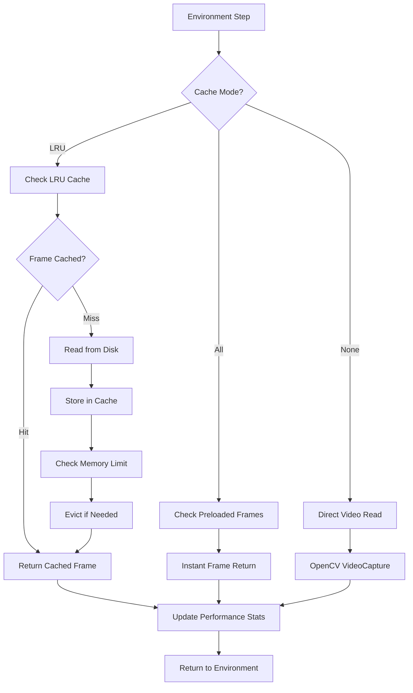

# Performance Tuning and Cache Configuration Guide

## Overview

This comprehensive guide provides detailed instructions for configuring and optimizing the Odor Plume Navigation system's high-performance frame caching mechanisms and structured logging infrastructure. The system is designed to achieve sub-10 millisecond environment step execution times through intelligent caching while providing machine-parseable performance monitoring.

## Table of Contents

1. [Quick Start](#quick-start)
2. [Frame Cache System Architecture](#frame-cache-system-architecture)
3. [Performance Targets and Benchmarks](#performance-targets-and-benchmarks)
4. [Cache Configuration Options](#cache-configuration-options)
5. [Memory Management](#memory-management)
6. [Performance Monitoring](#performance-monitoring)
7. [CLI Integration](#cli-integration)
8. [Hydra Configuration](#hydra-configuration)
9. [Environment Variables](#environment-variables)
10. [Troubleshooting](#troubleshooting)
11. [Advanced Configuration](#advanced-configuration)

## Quick Start

### Basic Cache Setup

Enable LRU frame caching for optimal performance:

```bash
# CLI activation
python -m odor_plume_nav.cli.main run --frame_cache lru

# Environment variable activation
export FRAME_CACHE_MODE=lru
python -m odor_plume_nav.cli.main run
```

### Performance Verification

Check if you're achieving target performance:

```python
# In your training loop
obs, reward, done, truncated, info = env.step(action)

# Verify performance metrics
perf_stats = info["perf_stats"]
if perf_stats["step_time_ms"] > 10.0:
    print(f"Warning: Step time {perf_stats['step_time_ms']:.2f}ms exceeds 10ms target")
    print(f"Cache hit rate: {perf_stats['cache_hit_rate']:.1%}")
```

## Frame Cache System Architecture

The FrameCache system provides two primary operating modes designed to accelerate reinforcement learning training workflows by eliminating redundant video decoding operations.

### Cache Modes

#### 1. LRU Cache Mode (`lru`)
**Recommended for**: Memory-constrained environments, long videos, multi-agent scenarios

- **Memory Efficient**: Maintains only recently accessed frames in memory
- **Adaptive**: Automatically evicts least recently used frames when memory limit is reached
- **Thread Safe**: Supports concurrent access from multiple agents
- **Default Memory Limit**: 2 GiB (configurable)

```yaml
# Configuration
frame_cache:
  mode: "lru"
  memory_limit_mb: 2048  # 2 GiB default
  eviction_policy: "lru"
  thread_safe: true
```

#### 2. Full Preload Mode (`all`)
**Recommended for**: High-memory systems, short videos, maximum performance requirements

- **Maximum Performance**: All frames loaded into memory during initialization
- **Zero Retrieval Latency**: Guaranteed sub-1ms frame access after warmup
- **Predictable Performance**: No cache misses during simulation
- **Memory Intensive**: Requires full video memory footprint

```yaml
# Configuration
frame_cache:
  mode: "all"
  preload_on_init: true
  memory_check: true  # Verify sufficient memory before preload
```

#### 3. Disabled Mode (`none`)
**Recommended for**: Memory debugging, baseline performance comparison

- **Direct Disk Access**: Each frame read directly from video file
- **Minimal Memory**: No frame caching memory overhead
- **Consistent Latency**: Predictable (higher) disk I/O latency per frame

### Cache Architecture Components



## Performance Targets and Benchmarks

### Primary Performance Requirements

| Metric | Target | Measurement | Critical Path |
|--------|--------|-------------|---------------|
| **Environment Step Latency** | **< 10 ms** | `info["perf_stats"]["step_time_ms"]` | Frame retrieval + processing |
| **Frame Retrieval Time** | < 1 ms (cache hit) | `info["perf_stats"]["frame_retrieval_ms"]` | Cache lookup operation |
| **Cache Hit Rate** | ≥ 90% | `info["perf_stats"]["cache_hit_rate"]` | LRU eviction efficiency |
| **Memory Usage** | ≤ 2 GiB (default) | System monitoring | Cache memory footprint |
| **FPS Estimate** | ≥ 100 FPS | `info["perf_stats"]["fps_estimate"]` | Overall throughput |

### Reference Hardware Benchmarks

Performance targets are validated on reference CPU hardware:

```yaml
# CI Benchmark Configuration
benchmark:
  reference_cpu: "Intel i7-8700K @ 3.70GHz"
  reference_memory: "16GB DDR4-2400"
  test_video: "1920x1080 @ 30fps, 60 seconds"
  validation_steps: 10000
  
expected_performance:
  step_time_p50: "< 5 ms"
  step_time_p95: "< 10 ms"
  cache_hit_rate: "> 95%"
  memory_stable: true
```

### Performance Testing

Validate your system performance:

```python
import time
import numpy as np
from odor_plume_nav.cache.frame_cache import FrameCache
from odor_plume_nav.environments.gymnasium_env import GymnasiumEnv

def benchmark_environment(env, num_steps=1000):
    """Benchmark environment step performance."""
    step_times = []
    cache_stats = []
    
    obs, _ = env.reset()
    
    for _ in range(num_steps):
        start_time = time.perf_counter()
        action = env.action_space.sample()
        obs, reward, done, truncated, info = env.step(action)
        step_time = time.perf_counter() - start_time
        
        step_times.append(step_time * 1000)  # Convert to ms
        if "perf_stats" in info:
            cache_stats.append(info["perf_stats"])
        
        if done or truncated:
            obs, _ = env.reset()
    
    # Analysis
    step_times = np.array(step_times)
    print(f"Step time P50: {np.percentile(step_times, 50):.2f} ms")
    print(f"Step time P95: {np.percentile(step_times, 95):.2f} ms")
    print(f"Step time P99: {np.percentile(step_times, 99):.2f} ms")
    
    if cache_stats:
        hit_rates = [stat["cache_hit_rate"] for stat in cache_stats if "cache_hit_rate" in stat]
        if hit_rates:
            print(f"Average cache hit rate: {np.mean(hit_rates):.1%}")

# Usage
env = GymnasiumEnv(frame_cache="lru")
benchmark_environment(env)
```

## Cache Configuration Options

### Basic Configuration

```yaml
# conf/config.yaml
frame_cache:
  # Cache operating mode
  mode: "lru"  # Options: "lru", "all", "none"
  
  # Memory management
  memory_limit_mb: 2048  # 2 GiB default limit
  memory_pressure_threshold: 0.9  # Trigger eviction at 90%
  
  # Performance settings
  prefetch_next_frames: 3  # Predictive frame loading
  batch_eviction_size: 10  # Evict multiple frames efficiently
  
  # Monitoring
  statistics_enabled: true
  performance_logging: true
```

### Advanced LRU Configuration

```yaml
frame_cache:
  mode: "lru"
  
  # LRU-specific parameters
  lru:
    initial_capacity: 1000  # Expected number of unique frames
    eviction_batch_size: 20  # Evict multiple frames per operation
    access_pattern_optimization: true  # Optimize for sequential access
    
  # Memory management
  memory_limit_mb: 4096  # 4 GiB for high-performance systems
  memory_monitoring_interval: 100  # Check memory every N operations
  oom_prevention: true  # Prevent out-of-memory conditions
  
  # Performance optimizations
  zero_copy_access: true  # Use NumPy array views
  thread_local_stats: true  # Reduce lock contention
```

### Full Preload Configuration

```yaml
frame_cache:
  mode: "all"
  
  # Preload parameters
  preload:
    verify_memory_available: true  # Check available memory first
    progress_reporting: true  # Show loading progress
    parallel_loading: false  # Single-threaded for stability
    
  # Memory validation
  memory_safety_factor: 1.2  # Require 20% extra memory
  max_video_size_gb: 8  # Refuse videos larger than 8GB
  
  # Fallback configuration
  fallback_to_lru: true  # Fall back to LRU if insufficient memory
  fallback_memory_limit: 2048
```

## Memory Management

### Memory Limits and Thresholds

The cache system implements sophisticated memory management to prevent out-of-memory conditions while maximizing performance.

#### Default Memory Configuration

```python
# src/odor_plume_nav/cache/frame_cache.py - Default settings
DEFAULT_MEMORY_LIMIT_MB = 2048  # 2 GiB
MEMORY_PRESSURE_THRESHOLD = 0.9  # 90% utilization
OOM_PREVENTION_THRESHOLD = 0.95  # 95% critical threshold
MEMORY_CHECK_INTERVAL = 100  # Operations between memory checks
```

#### Dynamic Memory Adjustment

```yaml
# Adaptive memory configuration
frame_cache:
  memory_management:
    # Dynamic limits based on system memory
    auto_size: true
    max_system_memory_pct: 25  # Use up to 25% of system memory
    min_memory_limit_mb: 512   # Minimum cache size
    max_memory_limit_mb: 8192  # Maximum cache size
    
    # Pressure handling
    pressure_response: "gradual"  # Options: "immediate", "gradual"
    eviction_aggressiveness: 0.1  # 10% of cache on pressure
    
    # Monitoring
    memory_alerts_enabled: true
    alert_threshold: 0.85  # Alert at 85% memory usage
```

#### Memory Usage Monitoring

```python
# Monitor cache memory usage in your application
def monitor_cache_memory(env):
    """Monitor and report cache memory usage."""
    if hasattr(env, '_frame_cache') and env._frame_cache:
        cache = env._frame_cache
        stats = cache.get_statistics()
        
        print(f"Cache memory usage: {stats['memory_usage_mb']:.1f} MB")
        print(f"Memory utilization: {stats['memory_utilization']:.1%}")
        print(f"Cached frames: {stats['cached_frames']}")
        print(f"Cache efficiency: {stats['hit_rate']:.1%}")
        
        # Check for memory pressure
        if stats['memory_utilization'] > 0.9:
            print("WARNING: Cache approaching memory limit")
            print("Consider reducing memory_limit_mb or video resolution")

# Usage in training loop
for episode in range(num_episodes):
    if episode % 100 == 0:  # Check every 100 episodes
        monitor_cache_memory(env)
```

## Performance Monitoring

### Structured Logging Integration

The system uses Loguru for structured JSON logging with embedded performance metrics:

```yaml
# logging.yaml - Enhanced with performance monitoring
sinks:
  - sink: "sys.stdout"
    format: "<green>{time:YYYY-MM-DD HH:mm:ss}</green> | <level>{level: <8}</level> | <cyan>{name}</cyan>:<cyan>{function}</cyan>:<cyan>{line}</cyan> | <level>{message}</level>"
    level: "INFO"
    
  - sink: "logs/performance.json"
    format: "{time} | {level} | {name} | {message} | {extra}"
    level: "DEBUG"
    serialize: true  # JSON format for machine parsing
    rotation: "100 MB"
    retention: "1 week"
    
  - sink: "logs/cache_performance.json"
    format: "{message}"
    level: "INFO"
    filter: "odor_plume_nav.cache"  # Cache-specific metrics
    serialize: true
    rotation: "50 MB"
```

### Performance Metrics Collection

```python
# Automatic performance metrics in environment step
def step(self, action):
    """Environment step with integrated performance monitoring."""
    start_time = time.perf_counter()
    
    # Execute step logic
    observation, reward, done, truncated = self._execute_step(action)
    
    # Collect performance metrics
    step_time = time.perf_counter() - start_time
    
    # Build performance statistics
    perf_stats = {
        "step_time_ms": step_time * 1000,
        "frame_retrieval_ms": self._last_frame_time * 1000,
        "cache_hit_rate": self._frame_cache.hit_rate if self._frame_cache else 0.0,
        "fps_estimate": 1.0 / step_time if step_time > 0 else 0.0,
        "memory_usage_mb": self._frame_cache.memory_usage_mb if self._frame_cache else 0.0,
        "memory_utilization": self._frame_cache.memory_utilization if self._frame_cache else 0.0
    }
    
    # Log performance data
    logger.info("Environment step completed", extra={
        "perf_stats": perf_stats,
        "correlation_id": self._correlation_id
    })
    
    # Build info dictionary
    info = {
        "perf_stats": perf_stats,
        "video_frame": self._current_frame if self._cache_enabled else None,
        "cache_stats": self._frame_cache.get_statistics() if self._frame_cache else {}
    }
    
    return observation, reward, done, truncated, info
```

### Threshold Violation Monitoring

```python
# Automatic threshold monitoring and alerting
class PerformanceMonitor:
    """Monitors performance metrics and triggers alerts."""
    
    def __init__(self, thresholds=None):
        self.thresholds = thresholds or {
            "step_time_ms": 10.0,      # 10ms step time limit
            "cache_hit_rate": 0.90,    # 90% hit rate minimum
            "memory_utilization": 0.85  # 85% memory usage alert
        }
        self.violation_counts = defaultdict(int)
        
    def check_performance(self, perf_stats):
        """Check performance metrics against thresholds."""
        violations = []
        
        for metric, threshold in self.thresholds.items():
            if metric in perf_stats:
                value = perf_stats[metric]
                
                # Check violation based on metric type
                if metric == "cache_hit_rate":
                    violated = value < threshold
                else:
                    violated = value > threshold
                
                if violated:
                    self.violation_counts[metric] += 1
                    violations.append({
                        "metric": metric,
                        "value": value,
                        "threshold": threshold,
                        "violation_count": self.violation_counts[metric]
                    })
                    
                    # Log performance warning
                    logger.warning(
                        f"Performance threshold violation: {metric}",
                        extra={
                            "metric": metric,
                            "current_value": value,
                            "threshold": threshold,
                            "violation_count": self.violation_counts[metric]
                        }
                    )
        
        return violations

# Usage in environment
performance_monitor = PerformanceMonitor()

def step(self, action):
    obs, reward, done, truncated, info = super().step(action)
    
    # Check performance thresholds
    if "perf_stats" in info:
        violations = performance_monitor.check_performance(info["perf_stats"])
        
        # Take action on repeated violations
        if violations:
            for violation in violations:
                if violation["violation_count"] > 10:
                    logger.error(f"Persistent performance issue: {violation['metric']}")
                    # Consider cache configuration adjustment
                    if violation["metric"] == "cache_hit_rate":
                        self._suggest_cache_tuning()
    
    return obs, reward, done, truncated, info
```

## CLI Integration

### Command Line Options

The `--frame_cache` parameter enables cache mode selection:

```bash
# Available cache modes
python -m odor_plume_nav.cli.main run --frame_cache none  # Disable caching
python -m odor_plume_nav.cli.main run --frame_cache lru   # LRU cache mode
python -m odor_plume_nav.cli.main run --frame_cache all   # Full preload mode

# Combined with other parameters
python -m odor_plume_nav.cli.main run \
    --frame_cache lru \
    navigator.max_speed=2.0 \
    simulation.fps=60 \
    logging.level=DEBUG

# Multi-run with different cache modes
python -m odor_plume_nav.cli.main run \
    --multirun \
    --frame_cache lru,all,none \
    navigator.max_speed=1.0,2.0
```

### CLI Help Documentation

```bash
# View cache-related help
python -m odor_plume_nav.cli.main run --help

# Output includes:
#   --frame_cache {none,lru,all}
#     Frame caching mode for performance optimization:
#       none: Direct video file access (baseline)
#       lru:  LRU cache with configurable memory limit (default: 2GB)
#       all:  Full video preload for maximum performance
#     Default: none (for compatibility)
```

### Cache Initialization in CLI

```python
# src/odor_plume_nav/cli/main.py - Cache integration
@click.command()
@click.option('--frame_cache', 
              type=click.Choice(['none', 'lru', 'all']),
              default='none',
              help='Frame caching mode for performance optimization')
def run(frame_cache, **kwargs):
    """Run simulation with frame caching support."""
    
    # Initialize cache based on CLI option
    if frame_cache == 'lru':
        cache_config = {
            'mode': 'lru',
            'memory_limit_mb': 2048,
            'eviction_policy': 'lru'
        }
    elif frame_cache == 'all':
        cache_config = {
            'mode': 'all',
            'preload_on_init': True,
            'memory_check': True
        }
    else:
        cache_config = None
    
    # Pass cache configuration to environment
    env_config = {
        'frame_cache': cache_config,
        **kwargs
    }
    
    # Initialize and run environment
    env = create_environment(env_config)
    run_simulation(env)
```

## Hydra Configuration

### Configuration Groups

```yaml
# conf/frame_cache/lru.yaml
# @package frame_cache
mode: "lru"
memory_limit_mb: 2048
eviction_policy: "lru"
thread_safe: true
statistics_enabled: true

lru:
  initial_capacity: 1000
  eviction_batch_size: 20
  access_pattern_optimization: true

memory_management:
  pressure_threshold: 0.9
  oom_prevention: true
  monitoring_interval: 100
```

```yaml
# conf/frame_cache/preload.yaml
# @package frame_cache
mode: "all"
preload_on_init: true
memory_check: true
progress_reporting: true

preload:
  verify_memory_available: true
  parallel_loading: false
  memory_safety_factor: 1.2

fallback:
  enabled: true
  fallback_to_lru: true
  fallback_memory_limit: 1024
```

```yaml
# conf/frame_cache/disabled.yaml
# @package frame_cache
mode: "none"
direct_access: true
statistics_enabled: false
```

### Main Configuration Integration

```yaml
# conf/config.yaml
defaults:
  - base
  - frame_cache: lru  # Select cache configuration group
  - _self_

# Override cache settings
frame_cache:
  memory_limit_mb: ${oc.env:FRAME_CACHE_SIZE_MB,2048}
  statistics_enabled: ${oc.env:FRAME_CACHE_STATS,true}
```

### Hydra Override Examples

```bash
# Override cache mode
python -m odor_plume_nav.cli.main +frame_cache=preload

# Override specific cache parameters
python -m odor_plume_nav.cli.main \
    frame_cache.memory_limit_mb=4096 \
    frame_cache.lru.eviction_batch_size=50

# Multi-run with different cache configurations
python -m odor_plume_nav.cli.main \
    --multirun \
    +frame_cache=lru,preload,disabled \
    frame_cache.memory_limit_mb=1024,2048,4096
```

## Environment Variables

### Primary Environment Variables

```bash
# Cache configuration
export FRAME_CACHE_MODE="lru"           # Cache mode selection
export FRAME_CACHE_SIZE_MB="4096"       # Memory limit in MB
export FRAME_CACHE_STATS="true"         # Enable statistics collection

# Performance monitoring
export PERF_MONITORING_ENABLED="true"   # Enable performance tracking
export PERF_THRESHOLD_STEP_MS="10"      # Step time threshold
export PERF_THRESHOLD_CACHE_HIT="0.9"   # Cache hit rate threshold

# Logging configuration
export LOG_JSON_SINK="true"             # Enable JSON logging
export LOG_PERFORMANCE_FILE="logs/perf.json"  # Performance log file
export LOG_LEVEL="INFO"                 # Logging verbosity
```

### Production Environment Setup

```bash
# Production deployment configuration
export ENVIRONMENT_TYPE="production"
export FRAME_CACHE_MODE="lru"
export FRAME_CACHE_SIZE_MB="8192"       # 8GB for production
export PERF_MONITORING_ENABLED="true"
export LOG_JSON_SINK="true"
export LOG_TO_FILE="true"
export LOG_LEVEL="INFO"

# Memory management
export MEMORY_PRESSURE_ALERT="0.85"     # Alert at 85% usage
export OOM_PREVENTION="true"             # Enable OOM prevention

# Video processing
export VIDEO_PATH="/data/experiments/plume_high_res.mp4"
export VIDEO_PREPROCESSING="enhanced"    # Enhanced preprocessing
```

### Docker Environment Configuration

```dockerfile
# Dockerfile environment setup
ENV FRAME_CACHE_MODE=lru
ENV FRAME_CACHE_SIZE_MB=2048
ENV PERF_MONITORING_ENABLED=true
ENV LOG_JSON_SINK=true
ENV LOG_LEVEL=INFO

# Performance optimization
ENV NUMPY_THREADS=4
ENV OPENCV_OPENCL=false
ENV MATPLOTLIB_BACKEND=Agg
```

```yaml
# docker-compose.yml
version: '3.8'
services:
  odor-plume-nav:
    image: odor-plume-nav:latest
    environment:
      - FRAME_CACHE_MODE=lru
      - FRAME_CACHE_SIZE_MB=4096
      - PERF_MONITORING_ENABLED=true
      - LOG_JSON_SINK=true
      - VIDEO_PATH=/data/videos/experiment.mp4
    volumes:
      - ./data:/data
      - ./logs:/app/logs
```

## Troubleshooting

### Common Performance Issues

#### 1. High Step Latency (>10ms)

**Symptoms:**
```
WARNING: Step time 15.23ms exceeds 10ms target
Cache hit rate: 65%
```

**Diagnosis:**
```python
# Check cache configuration
def diagnose_performance(env):
    info = env.get_info()
    perf_stats = info.get("perf_stats", {})
    
    step_time = perf_stats.get("step_time_ms", 0)
    hit_rate = perf_stats.get("cache_hit_rate", 0)
    
    if step_time > 10:
        print(f"Performance issue detected:")
        print(f"  Step time: {step_time:.2f}ms (target: <10ms)")
        print(f"  Cache hit rate: {hit_rate:.1%} (target: >90%)")
        
        if hit_rate < 0.9:
            print("  Recommendation: Increase cache memory limit")
        else:
            print("  Recommendation: Check video resolution/processing")
```

**Solutions:**
```yaml
# Increase cache memory
frame_cache:
  memory_limit_mb: 4096  # Increase from 2048

# Optimize LRU parameters
frame_cache:
  lru:
    eviction_batch_size: 50  # Reduce eviction overhead
    access_pattern_optimization: true
```

#### 2. Low Cache Hit Rate (<90%)

**Symptoms:**
```json
{
  "cache_hit_rate": 0.65,
  "cache_misses": 350,
  "evictions_per_second": 15.2
}
```

**Diagnosis:**
```python
def analyze_cache_pattern(env):
    """Analyze cache access patterns."""
    cache = env._frame_cache
    stats = cache.get_detailed_statistics()
    
    print(f"Cache Analysis:")
    print(f"  Hit rate: {stats['hit_rate']:.1%}")
    print(f"  Miss rate: {stats['miss_rate']:.1%}")
    print(f"  Eviction rate: {stats['evictions_per_minute']:.1f}/min")
    print(f"  Access pattern: {stats['access_pattern']}")
    
    if stats['access_pattern'] == 'random':
        print("  Issue: Random access pattern reduces cache efficiency")
        print("  Solution: Consider preload mode or larger cache")
    elif stats['evictions_per_minute'] > 10:
        print("  Issue: High eviction rate indicates insufficient memory")
        print("  Solution: Increase memory_limit_mb")
```

**Solutions:**
```yaml
# For random access patterns
frame_cache:
  mode: "all"  # Switch to full preload
  
# For insufficient memory
frame_cache:
  memory_limit_mb: 8192  # Increase memory limit
  
# For high eviction rate
frame_cache:
  lru:
    eviction_batch_size: 1  # More conservative eviction
    access_pattern_optimization: false
```

#### 3. Memory Pressure Warnings

**Symptoms:**
```
WARNING: Cache approaching memory limit
Memory utilization: 94%
Available system memory: 1.2GB
```

**Diagnosis:**
```python
import psutil

def check_system_memory():
    """Check system memory availability."""
    memory = psutil.virtual_memory()
    
    print(f"System Memory Analysis:")
    print(f"  Total: {memory.total / 1024**3:.1f} GB")
    print(f"  Available: {memory.available / 1024**3:.1f} GB")
    print(f"  Used: {memory.percent:.1f}%")
    
    if memory.percent > 85:
        print("  WARNING: High system memory usage")
        print("  Recommendation: Reduce cache memory limit")
    
    return memory.available / 1024**2  # Return available MB

available_mb = check_system_memory()
recommended_limit = int(available_mb * 0.5)  # Use 50% of available
print(f"Recommended cache limit: {recommended_limit} MB")
```

**Solutions:**
```yaml
# Reduce memory usage
frame_cache:
  memory_limit_mb: 1024  # Reduce limit
  memory_management:
    pressure_threshold: 0.8  # More aggressive eviction
    
# Enable adaptive sizing
frame_cache:
  memory_management:
    auto_size: true
    max_system_memory_pct: 20  # Use max 20% of system memory
```

### Cache Performance Debugging

#### Enable Debug Logging

```yaml
# Enhanced debug logging
logging:
  level: "DEBUG"
  components:
    cache: "DEBUG"
    performance: "DEBUG"
    
  sinks:
    - sink: "logs/cache_debug.log"
      format: "{time} | {level} | {name} | {message} | {extra}"
      level: "DEBUG"
      filter: "odor_plume_nav.cache"
```

#### Performance Profiling

```python
import cProfile
import pstats

def profile_environment_performance(env, num_steps=1000):
    """Profile environment performance for bottleneck identification."""
    
    def run_steps():
        obs, _ = env.reset()
        for _ in range(num_steps):
            action = env.action_space.sample()
            obs, _, done, truncated, _ = env.step(action)
            if done or truncated:
                obs, _ = env.reset()
    
    # Profile execution
    profiler = cProfile.Profile()
    profiler.enable()
    run_steps()
    profiler.disable()
    
    # Analyze results
    stats = pstats.Stats(profiler)
    stats.sort_stats('cumulative')
    
    print("Top time-consuming functions:")
    stats.print_stats(20)
    
    # Save detailed profile
    stats.dump_stats('performance_profile.prof')
    print("Detailed profile saved to: performance_profile.prof")

# Usage
env = create_environment(frame_cache="lru")
profile_environment_performance(env)
```

## Advanced Configuration

### Multi-Agent Cache Optimization

```yaml
# Optimized for multi-agent scenarios
frame_cache:
  mode: "lru"
  memory_limit_mb: 8192  # Larger cache for multiple agents
  
  # Multi-agent optimizations
  thread_safety:
    enabled: true
    lock_granularity: "frame"  # Fine-grained locking
    read_write_locks: true
    
  # Access pattern optimization
  multi_agent:
    shared_cache: true        # Share cache between agents
    agent_affinity: false     # Don't bind frames to specific agents
    parallel_access: true     # Allow concurrent frame access
    
  # Performance tuning
  lru:
    eviction_batch_size: 100  # Larger batches for efficiency
    access_tracking: "approximate"  # Faster but less precise LRU
```

### Video-Specific Optimizations

```yaml
# Optimize for different video characteristics
frame_cache:
  mode: "lru"
  
  # Video analysis and optimization
  video_optimization:
    analyze_on_init: true     # Analyze video properties
    optimize_for_resolution: true
    optimize_for_duration: true
    
  # Resolution-based configuration
  resolution_profiles:
    "1920x1080":
      memory_limit_mb: 4096
      eviction_batch_size: 20
    "3840x2160":  # 4K
      memory_limit_mb: 12288
      eviction_batch_size: 5
    "640x480":    # Low res
      memory_limit_mb: 512
      eviction_batch_size: 100

# Apply based on video properties
frame_cache:
  auto_profile: true  # Automatically select based on video
  profile_override: null  # Manual override if needed
```

### Production Deployment Configuration

```yaml
# Production-ready configuration
frame_cache:
  mode: "lru"
  memory_limit_mb: ${oc.env:FRAME_CACHE_SIZE_MB,4096}
  
  # Production safety
  production:
    oom_prevention: true
    memory_monitoring: true
    automatic_recovery: true
    health_checks: true
    
  # Monitoring and alerting
  monitoring:
    metrics_collection: true
    performance_alerts: true
    memory_alerts: true
    slow_operation_alerts: true
    
    # Alert thresholds
    thresholds:
      step_time_ms: 10.0
      cache_hit_rate: 0.90
      memory_utilization: 0.85
      
  # Logging for production
  logging:
    structured: true
    correlation_ids: true
    performance_metrics: true
    error_details: true

# Performance monitoring configuration
performance:
  monitoring:
    enabled: true
    interval_seconds: 30
    metrics_retention_hours: 24
    
  alerting:
    enabled: true
    email_notifications: ${oc.env:ENABLE_EMAIL_ALERTS,false}
    webhook_url: ${oc.env:WEBHOOK_URL,null}
```

### Integration with External Monitoring

```yaml
# Integration with monitoring systems
monitoring:
  prometheus:
    enabled: ${oc.env:PROMETHEUS_ENABLED,false}
    port: ${oc.env:PROMETHEUS_PORT,8000}
    metrics_prefix: "odor_plume_nav"
    
  grafana:
    enabled: ${oc.env:GRAFANA_ENABLED,false}
    dashboard_config: "conf/grafana/dashboard.json"
    
  custom_endpoints:
    health_check: "/health"
    metrics: "/metrics"
    cache_stats: "/cache/stats"
```

---

## Conclusion

This comprehensive guide provides the foundation for optimizing the Odor Plume Navigation system's performance through intelligent frame caching and monitoring. The dual-mode cache system (LRU and full-preload) enables achieving sub-10 millisecond step execution times while providing comprehensive observability through structured logging.

Key takeaways:
- **LRU mode** for memory-efficient caching in resource-constrained environments
- **Full preload mode** for maximum performance when memory permits
- **Comprehensive monitoring** through structured JSON logging and performance metrics
- **Flexible configuration** via CLI, Hydra, and environment variables
- **Production-ready** features including memory pressure handling and automatic recovery

For additional support and advanced configuration examples, refer to the technical specification sections 3.2, 5.2, and the configuration schema documentation in `src/odor_plume_nav/config/schemas.py`.